# Aligning Books And Movies: Towards Story-Like Visual Explanations By Watching Movies And Reading Books

Yukun Zhu ∗,1 Ryan Kiros*,1 Richard Zemel1 Ruslan Salakhutdinov1 Raquel Urtasun1 Antonio Torralba2 Sanja Fidler1 1University of Toronto 2Massachusetts Institute of Technology
{yukun,rkiros,zemel,rsalakhu,urtasun,fidler}@cs.toronto.edu, torralba@csail.mit.edu

# Abstract

Books are a rich source of both fine-grained information, how a character, an object or a scene looks like, as well as high-level semantics, what someone is thinking, feeling and how these states evolve through a story. This paper aims to align books to their movie releases in order to provide rich descriptive explanations for visual content that go semantically far beyond the captions available in current datasets. To align movies and books we exploit a neural sentence embedding that is trained in an unsupervised way from a large corpus of books, as well as a video-text neural embedding for computing similarities between movie clips and sentences in the book. We propose a context-aware CNN to combine information from multiple sources. We demonstrate good quantitative performance for movie/book alignment and show several qualitative examples that showcase the diversity of tasks our model can be used for.

# 1. Introduction

A truly intelligent machine needs to not only parse the surrounding 3D environment, but also understand why people take certain actions, what they will do next, what they could possibly be thinking, and even try to empathize with them. In this quest, language will play a crucial role in grounding visual information to high-level semantic concepts. Only a few words in a sentence may convey really rich semantic information. Language also represents a natural means of interaction between a naive user and our vision algorithms, which is particularly important for applications such as social robotics or assistive driving.

Combining images or videos with language has gotten significant attention in the past year, partly due to the creation of CoCo [18], Microsoft's large-scale captioned image dataset. The field has tackled a diverse set of tasks such as captioning [13, 11, 36, 35, 21], alignment [11, 15, 34], Q&A [20, 19], visual model learning from textual descriptions [8, 26], and semantic visual search with natural multisentence queries [17].

1 Figure 1: Shot from the movie *Gone Girl*, along with the

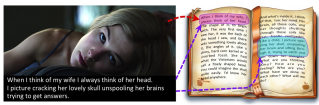 subtitle, aligned with the book. We reason about the visual and dialog (text) alignment between the movie and a book.

Books provide us with very rich, descriptive text that conveys both fine-grained visual details (how people or scenes look like) as well as high-level semantics (what people think and feel, and how their states evolve through a story). This source of knowledge, however, does not come with associated visual information that would enable us to ground it with descriptions. Grounding descriptions in books to vision would allow us to get textual *explanations* or stories behind visual information rather than simplistic captions available in current datasets. It can also provide us with extremely large amount of data (with tens of thousands books available online).

In this paper, we exploit the fact that many books have been turned into movies. Books and their movie releases have a lot of common knowledge as well as they are complementary in many ways. For instance, books provide detailed descriptions about the intentions and mental states of the characters, while movies are better at capturing visual aspects of the settings.

The first challenge we need to address, and the focus of this paper, is to align books with their movie releases in order to obtain rich descriptions for the visual content. We aim to align the two sources with two types of information: *visual*, where the goal is to link a movie shot to a book paragraph, and *dialog*, where we want to find correspondences between sentences in the movie's subtitle and sentences in the book. We formulate the problem of movie/book alignment as finding correspondences between shots in the movie as well as dialog sentences in the subtitles and sentences in the book (Fig. 1). We introduce a novel sentence similarity measure based on a neural sen-

∗Denotes equal contribution
tence embedding trained on millions of sentences from a large corpus of books. On the visual side, we extend the neural image-sentence embeddings to the video domain and train the model on DVS descriptions of movie clips. Our approach combines different similarity measures and takes into account contextual information contained in the nearby shots and book sentences. Our final alignment model is formulated as an energy minimization problem that encourages the alignment to follow a similar timeline. To evaluate the book-movie alignment model we collected a dataset with 11 movie/book pairs annotated with 2,070 shot-to-sentence correspondences. We demonstrate good quantitative performance and show several qualitative examples that showcase the diversity of tasks our model can be used for.

The alignment model can have multiple applications.

Imagine an app which allows the user to browse the book as the scenes unroll in the movie: perhaps its ending or acting are ambiguous, and one would like to query the book for answers. Vice-versa, while reading the book one might want to switch from text to video, particularly for the juicy scenes. We also show other applications of learning from movies and books such as book retrieval (finding the book that goes with a movie and finding other similar books), and captioning CoCo images with story-like descriptions.

# 2. Related Work

Most effort in the domain of vision and language has been devoted to the problem of image captioning. Older work made use of fixed visual representations and translated them into textual descriptions [6, 16]. Recently, several approaches based on RNNs emerged, generating captions via a learned joint image-text embedding [13, 11, 36, 21]. These approaches have also been extended to generate descriptions of short video clips [35]. In [24], the authors go beyond describing *what* is happening in an image and provide explanations about why something is happening.

For text-to-image alignment, [15, 7] find correspondences between nouns and pronouns in a caption and visual objects using several visual and textual potentials. Lin et al. [17] does so for videos. In [11], the authors use RNN embeddings to find the correspondences. [37] combines neural embeddings with soft attention in order to align the words to image regions.

Early work on movie-to-text alignment include dynamic time warping for aligning movies to scripts with the help of subtitles [5, 4]. Sankar *et al*. [28] further developed a system which identified sets of visual and audio features to align movies and scripts without making use of the subtitles.

Such alignment has been exploited to provide weak labels for person naming tasks [5, 30, 25].

Closest to our work is [34], which aligns plot synopses to shots in the TV series for story-based content retrieval. This work adopts a similarity function between sentences in plot synopses and shots based on person identities and keywords in subtitles. Our work differs with theirs in several important aspects. First, we tackle a more challenging problem of movie/book alignment. Unlike plot synopsis, which closely follow the storyline of movies, books are more verbose and might vary in the storyline from their movie release. Furthermore, we use learned neural embeddings to compute the similarities rather than hand-designed similarity functions.

Parallel to our work, [33] aims to align scenes in movies to chapters in the book. However, their approach operates on a very coarse level (chapters), while ours does so on the sentence/paragraph level. Their dataset thus evaluates on 90 scene-chapter correspondences, while our dataset draws 2,070 shot-to-sentences alignments. Furthermore, the approaches are inherently different. [33] matches the presence of characters in a scene to those in a chapter, as well as uses hand-crafted similarity measures between sentences in the subtitles and dialogs in the books, similarly to [34].

Rohrbach *et al*. [27] recently released the Movie Description dataset which contains clips from movies, each time-stamped with a sentence from DVS (Descriptive Video Service). The dataset contains clips from over a 100 movies, and provides a great resource for the captioning techniques. Our effort here is to align movies with books in order to obtain longer, richer and more high-level video descriptions.

We start by describing our new dataset, and then explain our proposed approach.

# 3. The Moviebook And Bookcorpus Datasets

We collected two large datasets, one for movie/book alignment and one with a large number of books. The MovieBook Dataset. Since no prior work or data exist on the problem of movie/book alignment, we collected a new dataset with 11 movies along with the books on which they were based on. For each movie we also have a subtitle file, which we parse into a set of time-stamped sentences. Note that no speaker information is provided in the subtitles. We automatically parse each book into sentences, paragraphs (based on indentation in the book), and chapters (we assume a chapter title has indentation, starts on a new page, and does not end with an end symbol).

Our annotators had the movie and a book opened side by side. They were asked to iterate between browsing the book and watching a few shots/scenes of the movie, and trying to find correspondences between them. In particular, they marked the exact time (in seconds) of correspondence in the movie and the matching line number in the book file, indicating the beginning of the matched sentence. On the video side, we assume that the match spans across a *shot* (a video unit with smooth camera motion). If the match was longer in duration, the annotator also indicated the ending time of the match. Similarly for the book, if more sentences

|                                      |         |         |          | BOOK         |             |        |         | MOVIE      | ANNOTATION   |                  |
|--------------------------------------|---------|---------|----------|--------------|-------------|--------|---------|------------|--------------|------------------|
| Title                                | # sent. | # words | # unique | avg. # words | max # words | # para        | # shots | # sent. in | # dialog     | # visual  align. |
|                                      |         |         | words    | per sent.    | per sent.   | graphs |         | subtitles  | align.       |                  |
| Gone Girl                            | 12,603  | 148,340 | 3,849    | 15           | 153         | 3,927  | 2,604   | 2,555      | 76           | 106              |
| Fight Club                           | 4,229   | 48,946  | 1,833    | 14           | 90          | 2,082  | 2,365   | 1,864      | 104          | 42               |
| No Country for Old Men               | 8,050   | 69,824  | 1,704    | 10           | 68          | 3,189  | 1,348   | 889        | 223          | 47               |
| Harry Potter and the Sorcerers Stone | 6,458   | 78,596  | 2,363    | 15           | 227         | 2,925  | 2,647   | 1,227      | 164          | 73               |
| Shawshank Redemption                 | 2,562   | 40,140  | 1,360    | 18           | 115         | 637    | 1,252   | 1,879      | 44           | 12               |
| The Green Mile                       | 9,467   | 133,241 | 3,043    | 17           | 119         | 2,760  | 2,350   | 1,846      | 208          | 102              |
| American Psycho                      | 11,992  | 143,631 | 4,632    | 16           | 422         | 3,945  | 1,012   | 1,311      | 278          | 85               |
| One Flew Over the Cuckoo Nest        | 7,103   | 112,978 | 2,949    | 19           | 192         | 2,236  | 1,671   | 1,553      | 64           | 25               |
| The Firm                             | 15,498  | 135,529 | 3,685    | 11           | 85          | 5,223  | 2,423   | 1,775      | 82           | 60               |
| Brokeback Mountain                   | 638     | 10,640  | 470      | 20           | 173         | 167    | 1,205   | 1,228      | 80           | 20               |
| The Road                             | 6,638   | 58,793  | 1,580    | 10           | 74          | 2,345  | 1,108   | 782        | 126          | 49               |
| All                                  | 85,238  | 980,658 | 9,032    | 15           | 156         | 29,436 | 19,985  | 16,909     | 1,449        | 621              |

| # of books   | # of sentences   | # of words   | # of unique words   | mean # of words per sentence   | median # of words per sentence   |
|--------------|------------------|--------------|---------------------|--------------------------------|----------------------------------|
| 11,038       | 74,004,228       | 984,846,357  | 1,316,420           | 13                             | 11                               |

Table 1: Statistics for our **MovieBook Dataset** with ground-truth for alignment between books and their movie releases.

Table 2: Summary statistics of our **BookCorpus** dataset. We use this corpus to train the sentence embedding model.

matched, the annotator indicated from which to which line a match occurred. Each alignment was also tagged, indicating whether it was a visual, *dialogue*, or an *audio match*. Note that even for dialogs, the movie and book versions are semantically similar but not exactly the same. Thus deciding on what defines a match or not is also somewhat subjective and may slightly vary across our annotators. Altogether, the annotators spent 90 hours labeling 11 movie/book pairs, locating 2,070 correspondences.

Table 1 presents our dataset, while Fig. 8 shows a few ground-truth alignments. One can see the complexity and diversity of the data: the number of sentences per book vary from 638 to 15,498, even though the movies are similar in duration. This indicates a huge diversity in descriptiveness across literature, and presents a challenge for matching. The sentences also vary in length, with the sentences in Brokeback Mountain being twice as long as those in The Road. The longest sentence in American Psycho has 422 words and spans over a page in the book.

Aligning movies with books is challenging even for humans, mostly due to the scale of the data. Each movie is on average 2h long and has 1,800 shots, while a book has on average 7,750 sentences. Books also have different styles of writing, formatting, different and challenging language, slang (going vs *goin'*, or even was vs 'us), etc. As one can see from Table 1, finding visual matches turned out to be particularly challenging. This is because the visual descriptions in books can be either very short and hidden within longer paragraphs or even within a longer sentence, or very verbose - in which case they get obscured with the surrounding text - and are hard to spot. Of course, how close the movie follows the book is also up to the director, which can be seen through the number of alignments that our annotators found across different movie/books. The BookCorpus Dataset. In order to train our sentence similarity model we collected a corpus of 11,038 books from the web. These are free books written by yet unpublished authors. We only included books that had more than 20K words in order to filter out perhaps noisier shorter stories. The dataset has books in 16 different genres, e.g., Romance (2,865 books), *Fantasy* (1,479), *Science fiction* (786), *Teen* (430), etc. Table 2 highlights the summary statistics of our book corpus.

# 4. Aligning Books And Movies

Our approach aims to align a movie with a book by exploiting visual information as well as dialogs. We take shots as video units and sentences from subtitles to represent dialogs. Our goal is to match these to the sentences in the book. We propose several measures to compute similarities between pairs of sentences as well as shots and sentences. We use our novel deep neural embedding trained on our large corpus of books to predict similarities between sentences. Note that an extended version of the sentence embedding is described in detail in [14] showing how to deal with million-word vocabularies, and demonstrating its performance on a large variety of NLP benchmarks. For comparing shots with sentences we extend the neural embedding of images and text [13] to operate in the video domain. We next develop a novel contextual alignment model that combines information from various similarity measures and a larger time-scale in order to make better local alignment predictions. Finally, we propose a simple pairwise Conditional Random Field (CRF) that smooths the alignments by encouraging them to follow a linear timeline, both in the video and book domain.

We first explain our sentence, followed by our joint video to text embedding. We next propose our contextual model that combines similarities and discuss CRF in more detail.

### 4.1. Skip-Thought Vectors

In order to score the similarity between two sentences, we exploit our architecture for learning unsupervised representations of text [14]. The model is loosely inspired by Figure 2: Sentence neural embedding [14]. Given a tuple (si−1, si, si+1) of consecutive sentences in text, where siis the

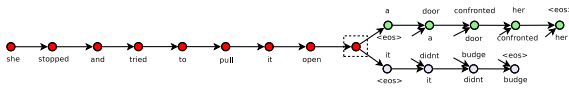 i-th sentence, we encode si and aim to reconstruct the previous si−1 and the following sentence si+1. Unattached arrows are connected to the encoder output. Colors depict which components share parameters. heosi is the end of sentence token.

|                                                  | he started the car , left the parking lot and merged onto the highway a few miles down the road .  he shut the door and watched the taxi drive off .   |
|--------------------------------------------------|--------------------------------------------------------------------------------------------------------------------------------------------------------|
| he drove down the street off into the distance . | she watched the lights flicker through the trees as the men drove toward the road .                                                                    |
|                                                  | he jogged down the stairs , through the small lobby , through the door and into the street .                                                           |
| the most effective way to end the battle .       | a messy business to be sure , but necessary to achieve a fine and noble end .                                                                          |
|                                                  | they saw their only goal as survival and logically planned a strategy to achieve it .                                                                  |
|                                                  | there would be far fewer casualties and far less destruction .                                                                                         |
|                                                  | the outcome was the lisbon treaty .                                                                                                                    |

Table 3: Qualitative results from the sentence embedding model. For each query sentence on the left, we retrieve the 4 nearest neighbor sentences (by inner product) chosen from books the model has not seen before.

the skip-gram [22] architecture for learning representations of words. In the word skip-gram model, a word wiis chosen and must predict its surrounding context (e.g. wi+1 and wi−1 for a context window of size 1). Our model works in a similar way but at the sentence level. That is, given a sentence tuple (si−1, si, si+1) our model first encodes the sentence siinto a fixed vector, then conditioned on this vector tries to reconstruct the sentences si−1 and si+1, as shown in Fig. 2. The motivation for this architecture is inspired by the distributional hypothesis: sentences that have similar surrounding context are likely to be both semantically and syntactically similar. Thus, two sentences that have similar syntax and semantics are likely to be encoded to a similar vector. Once the model is trained, we can map any sentence through the encoder to obtain vector representations, then score their similarity through an inner product.

The learning signal of the model depends on having contiguous text, where sentences follow one another in sequence. A natural corpus for training our model is thus a large collection of books. Given the size and diversity of genres, our BookCorpus allows us to learn very general representations of text. For instance, Table 3 illustrates the nearest neighbours of query sentences, taken from held out books that the model was not trained on. These qualitative results demonstrate that our intuition is correct, with resulting nearest neighbors corresponds largely to syntactically and semantically similar sentences. Note that the sentence embedding is general and can be applied to other domains not considered in this paper, which is explored in [14].

To construct an encoder, we use a recurrent neural network, inspired by the success of encoder-decoder models for neural machine translation [10, 2, 1, 31]. Two kinds of activation functions have recently gained traction: long short-term memory (LSTM) [9] and the gated recurrent unit (GRU) [3]. Both types of activation successfully solve the vanishing gradient problem, through the use of gates to control the flow of information. The LSTM unit explicity employs a cell that acts as a carousel with an identity weight. The flow of information through a cell is controlled by input, output and forget gates which control what goes into a cell, what leaves a cell and whether to reset the contents of the cell. The GRU does not use a cell but employs two gates: an update and a reset gate. In a GRU, the hidden state is a linear combination of the previous hidden state and the proposed hidden state, where the combination weights are controlled by the update gate. GRUs have been shown to perform just as well as LSTM on several sequence prediction tasks [3] while being simpler. Thus, we use GRU as the activation function for our encoder and decoder RNNs.

Suppose that we are given a sentence tuple
(si−1, si, si+1), and let w tidenote the t-th word for si and let x tibe its word embedding. We break the model description into three parts: the encoder, decoder and objective function.

Encoder. Let w 1 i
, . . . , wN
idenote words in sentence si with N the number of words in the sentence. The encoder produces a hidden state h ti at each time step which forms the representation of the sequence w 1 i
, . . . , wt i
. Thus, the hidden state h N
iis the representation of the whole sentence.

The GRU produces the next hidden state as a linear combination of the previous hidden state and the proposed state update (we drop subscript i):

$$\mathbf{h}^{t}=(1-\mathbf{z}^{t})\odot\mathbf{h}^{t-1}+\mathbf{z}^{t}\odot{\bar{\mathbf{h}}}^{t}$$
$$(\mathbb{I})$$
t  h¯t(1)
where h¯tis the proposed state update at time t, z tis the update gate and () denotes a component-wise product. The update gate takes values between zero and one. In the extreme cases, if the update gate is the vector of ones, the previous hidden state is completely forgotten and h t = h¯t.

Alternatively, if the update gate is the zero vector, than the hidden state from the previous time step is simply copied over, that is h t = h t−1. The update gate is computed as

$$\mathbf{z}^{t}=\sigma(\mathbf{W}_{z}\mathbf{x}^{t}+\mathbf{U}_{z}\mathbf{h}^{t-1})$$
t−1) (2)
where Wz and Uz are the update gate parameters. The proposed state update is given by

$$\mathbf{\bar{h}}^{t}=\operatorname{tanh}(\mathbf{W}\mathbf{x}^{t}+\mathbf{U}(\mathbf{r}^{t}\odot\mathbf{h}^{t-1}))$$
t−1)) (3)
where rt is the reset gate, which is computed as

$$\mathbf{r}^{t}=\sigma(\mathbf{W}_{r}\mathbf{x}^{t}+\mathbf{U}_{r}\mathbf{h}^{t-1})$$
t−1) (4)
If the reset gate is the zero vector, than the proposed state update is computed only as a function of the current word. Thus after iterating this equation sequence for each word, we obtain a sentence vector h N
i = hi for sentence si.

Decoder. The decoder computation is analogous to the encoder, except that the computation is conditioned on the sentence vector hi. Two separate decoders are used, one for the previous sentence si−1 and one for the next sentence si+1. These decoders use different parameters to compute their hidden states but both share the same vocabulary matrix V that takes a hidden state and computes a distribution over words. Thus, the decoders are analogous to an RNN language model but conditioned on the encoder sequence. Alternatively, in the context of image caption generation, the encoded sentence hi plays a similar role as the image.

We describe the decoder for the next sentence si+1 (computation for si−1 is identical). Let h ti+1 denote the hidden state of the decoder at time t. The update and reset gates for the decoder are given as follows (we drop i + 1):

$$\mathbf{z}^{t}=\sigma(\mathbf{W}_{z}^{d}\mathbf{x}^{t-1}+\mathbf{U}_{z}^{d}\mathbf{h}^{t-1}+\mathbf{C}_{z}\mathbf{h}_{i})\tag{5}$$ $$\mathbf{r}^{t}=\sigma(\mathbf{W}_{r}^{d}\mathbf{x}^{t-1}+\mathbf{U}_{r}^{d}\mathbf{h}^{t-1}+\mathbf{C}_{r}\mathbf{h}_{i})\tag{6}$$

the hidden state h t i+1 is then computed as:

$$\bar{\bf h}^{t}=\tanh({\bf W}^{d}{\bf x}^{t-1}+{\bf U}^{d}({\bf r}^{t}\odot{\bf h}^{t-1})+{\bf Ch}_{i})\tag{7}$$ $${\bf h}^{t}_{i+1}=(1-{\bf z}^{t})\odot{\bf h}^{t-1}+{\bf z}^{t}\odot\bar{\bf h}^{t}\tag{8}$$

Given h t i+1, the probability of word w t i+1 given the previous t − 1 words and the encoder vector is

$$P(w_{i+1}^{t}|w_{i+1}^{<t},\mathbf{h}_{i})\propto\exp(\mathbf{v}_{w_{i+1}^{t}}\mathbf{h}_{i+1}^{t})$$

where vwti+1 denotes the row of V corresponding to the word of w t i+1. An analogous computation is performed for the previous sentence si−1. Objective. Given (si−1, si, si+1), the objective optimized is the sum of log-probabilities for the next and previous sentences conditioned on the representation of the encoder:

$$\sum_{t}\log P(w^{t}_{i+1}|w^{<t}_{i+1},\mathbf{h}_{i})+\sum_{t}\log P(w^{t}_{i-1}|w^{<t}_{i-1},\mathbf{h}_{i})\tag{10}$$

The total objective is the above summed over all such training tuples. Adam algorithm [12] is used for optimization.

### 4.2. Visual-Semantic Embeddings Of Clips And Dvs

$$(2)$$
$$({\mathfrak{I}})$$
$\left(4\right)$. 
The model above describes how to obtain a similarity score between two sentences, whose representations are learned from millions of sentences in books. We now discuss how to obtain similarities between shots and sentences.

Our approach closely follows the image-sentence ranking model proposed by [13]. In their model, an LSTM is used for encoding a sentence into a fixed vector. A linear mapping is applied to image features from a convolutional network. A score is computed based on the inner product between the normalized sentence and image vectors. Correct image-sentence pairs are trained to have high score, while incorrect pairs are assigned low scores.

In our case, we learn a visual-semantic embedding between movie clips and their DVS description. DVS ("Descriptive Video Service") is a service that inserts audio descriptions of the movie between the dialogs in order to enable the visually impaired to follow the movie like anyone else. We used the movie description dataset of [27] for learning our embedding. This dataset has 94 movies, and 54,000 described clips. We represent each movie clip as a vector corresponding to mean-pooled features across each frame in the clip. We used the GoogLeNet architecture [32] as well as hybrid-CNN [38] for extracting frame features. For DVS, we pre-processed the descriptions by removing names and replacing these with a *someone* token.

The LSTM architecture in this work is implemented using the following equations. As before, we represent a word embedding at time t of a sentence as x t:

i t = σ(Wxix t + Whimt−1 + Wcic t−1) (11) f t = σ(Wxfx t + Whfmt−1 + Wcf c t−1) (12) a t = tanh(Wxcx t + Whcmt−1) (13) c t = f t  c t−1 + i t  a t(14) o t = σ(Wxox t + Whomt−1 + Wcoc t) (15) mt = o t  tanh(c t) (16)
$$({\mathfrak{H}})$$
where (σ) denotes the sigmoid activation function and
() indicates component-wise multiplication. The states
(i t,f t, c t, o t, mt) correspond to the input, forget, cell, output and memory vectors, respectively. If the sentence is of length N, then the vector mN = m is the vector representation of the sentence.

Let q denote a movie clip vector, and let v = WIq be the embedding of the movie clip. We define a scoring function s(m, v) = m · v, where m and v are first scaled to have unit norm (making s equivalent to cosine similarity).

We then optimize the following pairwise ranking loss:

$$\min_{\theta}\sum_{\bf m}\sum_{k}\max\{0,\alpha-s({\bf m},{\bf v})+s({\bf m},{\bf v}_{k})\}\tag{17}$$ $$+\sum_{\bf v}\sum_{k}\max\{0,\alpha-s({\bf v},{\bf m})+s({\bf v},{\bf m}_{k})\},$$

with mk a contrastive (non-descriptive) sentence vector for a clip embedding v, and vice-versa with vk. We train our model with stochastic gradient descent without momentum.

### 4.3. Context Aware Similarity

We employ the clip-sentence embedding to compute similarities between each shot in the movie and each sentence in the book. For dialogs, we use several similarity measures each capturing a different level of semantic similarity. We compute BLEU [23] between each subtitle and book sentence to identify nearly identical matches. Similarly to [34], we use a tf-idf measure to find near duplicates but weighing down the influence of the less frequent words. Finally, we use our sentence embedding learned from books to score pairs of sentences that are semantically similar but may have a very different wording (i.e., paraphrasing).

These similarity measures indicate the alignment between the two modalities. However, at the local, sentence level, alignment can be rather ambiguous. For example, despite being a rather dark book, *Gone Girl* contains 15 occurrences of the sentence "I love you". We exploit the fact that a match is not completely isolated but that the sentences (or shots) around it are also to some extent similar.

We design a context aware similarity measure that takes into account all individual similarity measures as well as a fixed context window in both, the movie and book domain, and predicts a new similarity score. We stack a set of M similarity measures into a tensor S(*i, j, m*), where i, j, and m are the indices of sentences in the subtitle, in the book, and individual similarity measures, respectively. In particular, we use M = 9 similarities: visual and sentence embedding, BLEU1-5, tf-idf, and a uniform prior. We want to predict a combined score score(i, j) = f(S(I, J,M)) at each location (i, j) based on all measurements in a fixed volume defined by I around i, J around j, and 1*, . . . , M*. Evaluating the function f(·) at each location (*i, j*) on a 3-D tensor S is very similar to applying a convolution using a kernel of appropriate size. This motivates us to formulate the function f(·) as a deep convolutional neural network
(CNN). In this paper, we adopt a 3-layer CNN as illustrated in Figure 3. We adopt the ReLU non-linearity with dropout to regularize our model. We optimize the cross-entropy loss over the training set using Adam algorithm.

### 4.4. Global Movie/Book Alignment

So far, each shot/sentence was matched independently.

However, most shots in movies and passages in the books follow a similar timeline. We would like to incorporate this prior into our alignment. In [34], the authors use dynamic time warping by enforcing that the shots in the movie can only match forward in time (to plot synopses in their case).

However, the storyline of the movie and book can have crossings in time (Fig. 8), and the alignment might contain

Figure 3: Our CNN for context-aware similarity computa-

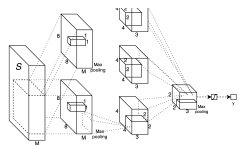 tion. It has 3 conv. layers and a sigmoid layer on top.

giant leaps forwards or backwards. Therefore, we formulate a movie/book alignment problem as inference in a Conditional Random Field that encourages nearby shots/dialog alignments to be consistent. Each node yiin our CRF represents an alignment of the shot in the movie with its corresponding subtitle sentence to a sentence in the book. Its state space is thus the set of all sentences in the book. The CRF energy of a configuration y is formulated as:

$$-\log p(\mathbf{x},\mathbf{y};\omega)=\sum_{i=1}^{K}\omega_{u}\phi_{u}(y_{i})+\sum_{i=1}^{K}\sum_{j\in{\mathcal{N}}(i)}\omega_{p}\psi_{p}(y_{i},y_{j})$$

where K is the number of nodes (shots), and N (i) the left and right neighbor of yi. Here, φu(·) and ψp(·) are unary and pairwise potentials, respectively, and ω = (ωu, ωp). We directly use the output of the CNN from 4.3 as the unary potential φu(·). For the pairwise potential, we measure the time span ds(yi, yj ) between two neighbouring sentences in the subtitle and the distance db(yi, yj ) of their state space in the book. One pairwise potential is defined as:

$$\psi_{p}(y_{i},y_{j})=\frac{\left(d_{s}(y_{i},y_{j})-d_{b}(y_{i},y_{j})\right)^{2}}{\left(d_{s}(y_{i},y_{j})-d_{b}(y_{i},y_{j})\right)^{2}+\sigma^{2}}\tag{18}$$

Here σ 2is a robustness parameter to avoid punishing giant leaps too harsh. Both ds and db are normalized to
[0, 1]. In addition, we also employ another pairwise potential ψq(yi, yj ) = (db(yi,yj ))2
(db(yi,yj ))2+σ2to encourage state consistency between nearby nodes. This potential is helpful when there is a long silence (no dialog) in the movie. Inference. Our CRF is a chain, thus exact inference is possible using dynamic programming. We also prune some states that are very far from the uniform alignment (over 1/3 length of the book) to further speed up computation. Learning. Since ground-truth is only available for a sparse set of shots, we regard the states of unobserved nodes as hidden variables and learn the CRF weights with [29].

# 5. Experimental Evaluation

We evaluate our model on our dataset of 11 movie/book pairs. We train the parameters in our model (CNN and CRF)
on *Gone Girl*, and test our performance on the remaining 10 movies. In terms of training speed, our video-text model "watches" 1,440 movies per day and our sentence model reads 870 books per day. We also show various qualitative results demonstrating the power of our approach. We provide more results in the Appendix of the paper.

### 5.1. Movie/Book Alignment

Evaluating the performance of movie/book alignment is an interesting problem on its own. This is because our ground-truth is far from exhaustive - around 200 correspondences were typically found between a movie and its book, and likely a number of them got missed. Thus, evaluating the precision is rather tricky. We thus focus our evaluation on recall, similar to existing work on retrieval. For each shot that has a GT correspondence in book, we check whether our prediction is close to the annotated one. We evaluate recall at the paragraph level, i.e., we say that the GT paragraph was recalled, if our match was at most 3 paragraphs away, and the shot was at most 5 subtitle sentences away. As a noisier measure, we also compute recall and precision at multiple alignment thresholds and report AP (avg. prec.).

The results are presented in Table 4. Columns show different instantiations of our model: we show the leave-onefeature-out setting (∅ indicates that all features were used),
compare how different depths of the context-aware CNN influence the performance, and compare it to our full model (CRF) in the last column. We get the highest boost by adding more layers to the CNN - recall improves by 14%,
and AP doubles. Generally, each feature helps performance.

Our sentence embedding (BOOK) helps by 4%, while noisier video-text embedding helps by 2% in recall. CRF which encourages temporal smoothness generally helps (but not for all movies), bringing additional 2%. We also show how a uniform timeline performs on its own. That is, for each shot (measured in seconds) in the movie, we find the sentence at the same location (measured in lines) in the book.

We add another baseline to evaluate the role of context in our model. Instead of using our CNN that considers contextual information, we build a linear SVM to combine different similarity measures in a single node (shot) - the final similarity is used as a unary potential in our CRF alignment model. The Table shows that our CNN contextual model outperforms the SVM baseline by 30% in recall, and doubles the AP. We plot alignment for a few movies in Fig. 8. Running Times. We show the typical running time of each component in our model in Table 5. For each moviebook pair, calculating BLEU score takes most of the time. Note that BLEU does not contribute significantly to the performance and is of optional use. With respect to the rest, extracting visual features VIS (mean pooling GoogleNet features over the shot frames) and SCENE features (mean pooling hybrid-CNN features [38] over the shot frames),

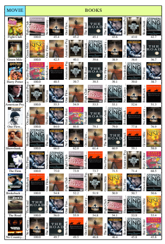

. 

. 

Table 6: **Book "retrieval"**. For a movie (left), we rank books wrt to their alignment similarity with the movie. We normalize similarity to be 100 for the highest scoring book.

takes most of the time (about 80% of the total time).

We also report training times for our contextual model
(CNN) and the CRF alignment model. Note that the times are reported for one movie/book pair since we used only one such pair to train all our CNN and CRF parameters. We chose *Gone Girl* for training since it had the best balance between the dialog and visual correspondences.

### 5.2. Describing Movies Via The Book

We next show qualitative results of our alignment. In particular, we run our model on each movie/book pair, and visualize the passage in the book that a particular shot in the movie aligns to. We show best matching paragraphs as well as a paragraph before and after. The results are shown in Fig. 8. One can see that our model is able to retrieve a semantically meaningful match despite large dialog deviations from those in the book, and the challenge of matching a visual representation to the verbose text in the book.

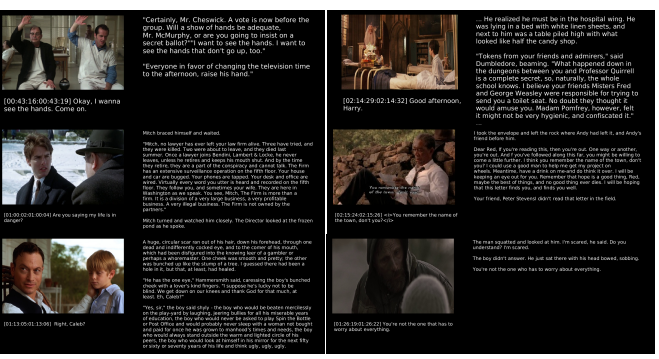

Figure 4: Describing movie clips via the book: we align the movie to the book, and show a shot from the movie and its corresponding paragraph (plus one before and after) from the book.

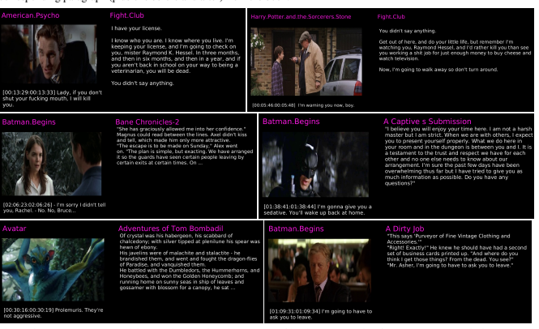

Figure 5: We can use our model to caption movies via a corpus of books. Top: A shot from American Pyscho is captioned with paragraphs from the Fight Club, and a shot from Harry Potter with paragraphs from Fight Club. Middle and Bottom: We match shots from Avatar and Batman Begins against 300 books from our BookCorpus, and show the best matched paragraph.

|                      |        | UNI   | SVM   |       |       |         | 1 layer CNN w/o one feature   |       |       |       | CNN\-3   | CRF    |
|----------------------|--------|-------|-------|-------|-------|---------|-------------------------------|-------|-------|-------|----------|--------|
|                      |        |       |       | ∅     | BLEU  | TF\-IDF | BOOK                          | VIS   | SCENE | PRIOR |          |        |
| Fight Club           | AP     | 1.22  | 0.73  | 0.45  | 0.41  | 0.40    | 0.50                          | 0.64  | 0.50  | 0.48  | 1.95     | 5.17   |
|                      | Recall | 2.36  | 10.38 | 12.26 | 12.74 | 11.79   | 11.79                         | 12.74 | 11.79 | 11.79 | 17.92    | 19.81  |
| The Green Mile       | AP     | 0.00  | 14.05 | 14.12 | 14.09 | 6.92    | 10.12                         | 9.83  | 13.00 | 14.42 | 28.80    | 27.60  |
|                      | Recall | 0.00  | 51.42 | 62.46 | 60.57 | 53.94   | 57.10                         | 55.52 | 60.57 | 62.78 | 74.13    | 78.23  |
| Harry Potter and the | AP     | 0.00  | 10.30 | 8.09  | 8.18  | 5.66    | 7.84                          | 7.95  | 8.04  | 8.20  | 27.17    | 23.65  |
| Sorcerers Stone      | Recall | 0.00  | 44.35 | 51.05 | 52.30 | 46.03   | 48.54                         | 48.54 | 49.37 | 52.72 | 76.57    | 78.66  |
| American Psycho      | AP     | 0.00  | 14.78 | 16.76 | 17.22 | 12.29   | 14.88                         | 14.95 | 15.68 | 16.54 | 34.32    | 32.87  |
|                      | Recall | 0.27  | 34.25 | 67.12 | 66.58 | 60.82   | 64.66                         | 63.56 | 66.58 | 67.67 | 81.92    | 80.27  |
| One Flew Over the    | AP     | 0.00  | 5.68  | 8.14  | 6.27  | 1.93    | 8.49                          | 8.51  | 9.32  | 9.04  | 14.83    | 21.13  |
| Cuckoo Nest          | Recall | 1.01  | 25.25 | 41.41 | 34.34 | 32.32   | 36.36                         | 37.37 | 36.36 | 40.40 | 49.49    | 54.55  |
| Shawshank            | AP     | 0.00  | 8.94  | 8.60  | 8.89  | 4.35    | 7.99                          | 8.91  | 9.22  | 7.86  | 19.33    | 19.96  |
| Redemption           | Recall | 1.79  | 46.43 | 78.57 | 76.79 | 73.21   | 73.21                         | 78.57 | 75.00 | 78.57 | 94.64    | 96.79  |
| The Firm             | AP     | 0.05  | 4.46  | 7.91  | 8.66  | 2.02    | 6.22                          | 7.15  | 7.25  | 7.26  | 18.34    | 20.74  |
|                      | Recall | 1.38  | 18.62 | 33.79 | 36.55 | 26.90   | 23.45                         | 26.90 | 30.34 | 31.03 | 37.93    | 44.83  |
| Brokeback Mountain   | AP     | 2.36  | 24.91 | 16.55 | 17.82 | 14.60   | 15.16                         | 15.58 | 15.41 | 16.21 | 31.80    | 30.58  |
|                      | Recall | 27.0  | 74.00 | 88.00 | 92.00 | 86.00   | 86.00                         | 88.00 | 86.00 | 87.00 | 98.00    | 100.00 |
| The Road             | AP     | 0.00  | 13.77 | 6.58  | 7.83  | 3.04    | 5.11                          | 5.47  | 6.09  | 7.00  | 19.80    | 19.58  |
|                      | Recall | 1.12  | 41.90 | 43.02 | 48.04 | 32.96   | 38.55                         | 37.99 | 42.46 | 44.13 | 65.36    | 65.10  |
| No Country for Old   | AP     | 0.00  | 12.11 | 9.00  | 9.39  | 8.22    | 9.40                          | 9.35  | 8.63  | 9.40  | 28.75    | 30.45  |
| Men                  | Recall | 1.12  | 33.46 | 48.90 | 49.63 | 46.69   | 47.79                         | 51.10 | 49.26 | 48.53 | 71.69    | 72.79  |
| Mean Recall          |        | 3.88  | 38.01 | 52.66 | 52.95 | 47.07   | 48.75                         | 50.03 | 50.77 | 52.46 | 66.77    | 69.10  |
| AP                   |        | 0.40  | 10.97 | 9.62  | 9.88  | 5.94    | 8.57                          | 8.83  | 9.31  | 9.64  | 22.51    | 23.17  |

Table 4: Performance of our model for the movies in our dataset under different settings and metrics.

BLEU TF BOOK VIS SCENE CNN (training) CNN (inference) CRF (training) CRF (inference)

Per movie-book pair 6h 10 min 3 min 2h 1h 3 min 0.2 min 5h 5 min

Table 5: Running time for our model per one movie/book pair.

### 5.3. Book "Retrieval"

In this experiment, we compute alignment between a movie and all (test) 10 books, and check whether our model retrieves the correct book. Results are shown in Table 6. Under each book we show the computed similarity. In particular, we use the energy from the CRF, and scale all similarities relative to the highest one (100). Notice that our model retrieves the correct book for each movie.

Describing a movie via other books. We can also caption movies by matching shots to paragraphs in a corpus of books. Here we do not encourage a linear timeline (CRF) since the stories are unrelated, and we only match at the local, shot-paragraph level. We show a description for American Psycho borrowed from the book *Fight Club* in Fig. 5.

### 5.4. The Cocobook: Writing Stories For Coco

Our next experiment shows that our model is able to
"generate" descriptive stories for (static) images. In particular we used the image-text embedding from [13] and generated a simple caption for an image. We used this caption as a query, and used our sentence embedding trained on books to find top 10 nearest sentences (sampled from a few hundred thousand from BookCorpus). We re-ranked these based on the 1-gram precision of non-stop words. Given the best result, we return the sentence as well as the 2 sentences before and after it in the book. The results are in Fig. 6. Our sentence embedding is able to retrieve semantically meaningful *stories* to explain the images.

# 6. Conclusion

In this paper, we explored a new problem of aligning a book to its movie release. We proposed an approach that computes several similarities between shots and dialogs and the sentences in the book. We exploited our new sentence embedding in order to compute similarities between sentences. We further extended the image-text neural embeddings to video, and proposed a context-aware alignment model that takes into account all the available similarity information. We showed results on a new dataset of movie/book alignments as well as several quantitative results that showcase the power and potential of our approach.

# Acknowledgments

We acknowledge the support from NSERC, CIFAR, Samsung, Google, and ONR-N00014-14-1-0232. We also thank Lea Jensterle for helping us with elaborate annotation, and Relu Patrascu for his help with numerous infrastructure related problems.

# Appendix

In the Appendix we provide more qualitative results.

# A. Qualitative Movie-Book Alignment Results

We show a few qualitative examples of alignment in Fig. 8. In this experiment, we show results obtained with our full model (CRF). For a chosen shot (a node in the CRF) we show the corresponding paragraph in the book.

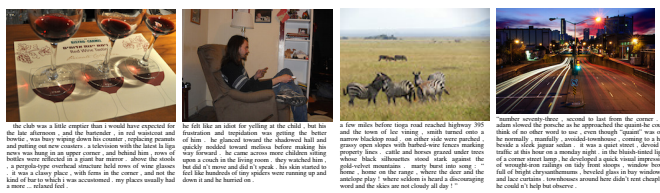

Figure 6: CoCoBook: We generate a caption for a CoCo image via [13] and retrieve its best matched sentence (+ 2 before

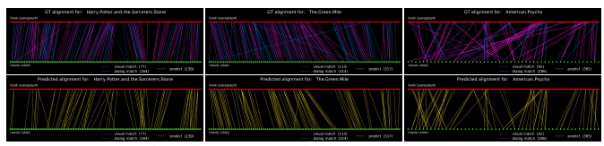 and after) from a large book corpus. One can see a semantic relevance of the retrieved passage to the image.

Figure 7: Alignment results of our model (**bottom**) compared to ground-truth alignment (top). In ground-truth, blue lines indicate visual matches, and magenta are the dialog matches. Yellow lines indicate predicted alignments.

We can see that some dialogs in the movies closely follow the book and thus help with the alignment. This is particularly important since the visual information is not as strong. Since the text around the dialogs typically describe the scene, the dialogs thus help us ground the visual information contained in the description and the video.

# B. Borrowing "Lines" From Other Books

We show a few qualitative examples of top-scoring matches for shot in a movie with a paragraph in another book (a book that does not correspond to this movie).

10 book experiment. In this experiment, we allow a clip in our 10 movie dataset (excluding the training movie) to match to paragraphs in the remaining 9 books (excluding the corresponding book). The results are in Fig. 12. Note that the top-scoring matches chosen from only a small set of books may not be too meaningful.

200 book experiment. We scale the experiment by randomly selecting 200 books from our BookCorpus. The results are in Fig. 15. One can see that by using many more books results in increasingly better "stories".

[00:12:05:00:12:09] we have to promote general

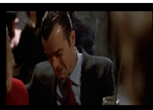

social concern.

American Psycho

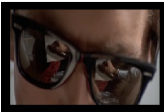

"But we can't ignore our social needs either. We have to stop people from abusing the welfare system. We have to provide food and shelter for the homeless and oppose racial discrimination and promote civil rights while also promoting equal rights for women but change the abortion laws to protect the right to life vet still somehow maintain women's freedom of choice. We also have to control the influx of illegal immigrants. We have to encourage a return to traditional moral values and curb graphic sex and violence on TV, in movies, in popular music, everywhere. Most importantly we have to promote general social concern and less materialism in young people.

I finish my drink. The table sits facing me in total silence. Courtney's smiling and seems pleased. Timothy just shakes his head in bemused disbelief. Evelyn is completely mystified by the turn the conversation has taken and she stands, unsteadily, and asks if anyone would like dessert.

"I have ... sorbet," she says as if in a daze. "Kiwi, carambola, cherimoya, cactus fruit and oh ... what is that ... "She stops her zombie monotone and tries to remember the last flavor. "Oh yes, Japanese pear."
[00:57:18:00:57:20] <i>You need any help ?</i>

American Psycho

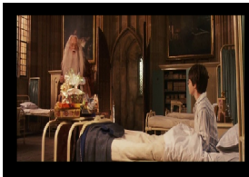

"Yes, Patrick?" She reenters the office trying to downplay her eagerness.

"Would you like to accompany me to dinner?" I ask, still staring at the crossword, gingerly erasing the m in one of the many meats I've filled the puzzle with. "That is, if you're not ... doing anything.'
"Oh no," she answers too quickly and then, I think, realizing this quickness, says, "I have no plans."
[02:14:29:02:14:32] Good afternoon, Harry.

Harry Potter
... He realized he must be in the hospital wing. He was lying in a bed with white linen sheets, and next to him was a table piled high with what looked like half the candy shop.

"Tokens from your friends and admirers," said Dumbledore, beaming.  "What happened down in the dungeons between you and Professor Quirrell is a complete secret, so, naturally, the whole school knows. I believe your friends Misters Fred and George Weasley were responsible for trying to send you a toilet seat. No doubt they thought it would amuse you. Madam Pomfrey, however, felt it might not be very hygienic, and confiscated it."
Figure 8: Examples of movie-book alignment. We use our model to align a movie to a book. Then for a chosen shot (which is a node in our CRF) we show the corresponding paragraph, plus one before and one after, in the book inferred by our model. On the left we show one (central) frame from the shot along with the subtitle sentence(s) that overlap with the shot. Some dialogs in the movie closely follow the book and thus help with the alignment.

[00:14:47:00:14:49] At the close of Friday's meeting ...

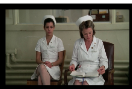

One Flew Over the Cuckoo's Nest

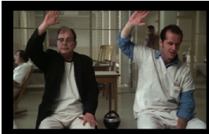

[00:43:16:00:43:19] Okay, I wanna see the hands. Come on.

One Flew Over the Cuckoo's Nest

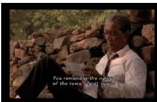

[02:15:24:02:15:26] <i>You remember the name of the town, don't you? </i>
Shawshank Redemption The nurse looks at her watch again and pulls a slip of paper out of the folder she's holding, looks at it, and returns it to the folder. She puts the folder down and picks up the log book. Ellis coughs from his place on the wall; she waits until he stops.

"Now. At the close of Friday's meeting. we were discussing Mr. Harding's problem. concerning his voung wife. He had stated that his wife was extremely well endowed in the bosom and that this made him uneasy because she drew stares from men on the street." She starts opening to places in the log book; little slips of paper stick out of the top of the book to mark the pages. "According to the notes listed by various patients in the log, Mr. Harding has been heard to say that she
'damn well gives the bastards reason to stare.' He has also been heard to say that he may give her reason to seek further sexual attention. He has been heard to say, 'My dear sweet but illiterate wife thinks any word or gesture that does not smack of brickyard brawn and brutality is a word or gesture of weak dandyism.'" She continues reading silently from the book for a while, then closes it.

"Certainly, Mr. Cheswick. A vote is now before the group. Will a show of hands be adequate, Mr. McMurphy, or are you going to insist on a secret ballot?""I want to see the hands. I want to see the hands that don't go up, too."
"Everyone in favor of changing the television time to the afternoon, raise his hand.'
I took the envelope and left the rock where Andy had left it, and Andy's friend before him.

Dear Red, If you're reading this, then you're out. One way or another, you're out. And f you've followed along this far, you might be willing to come a little further. I think you remember the name of the town, don't you? I could use a good man to help me get my project on wheels. Meantime, have a drink on me-and do think it over. I will be keeping an eye out for you. Remember that hope is a good thing, Red, maybe the best of things, and no good thing ever dies. I will be hoping that this letter finds you, and finds you well.

Your friend, Peter Stevensl didn't read that letter in the field.

Figure 9: Examples of movie-book alignment. We use our model to align a movie to a book. Then for a chosen shot (which is a node in our CRF) we show the corresponding paragraph, plus one before and one after, in the book inferred by our model.

On the left we show one (central) frame from the shot along with the subtitle sentence(s) that overlap with the shot.  Some dialogs in the movie closely follow the book and thus help with the alignment.

[00:03:27:00:03:30] Might we ask about the rest of

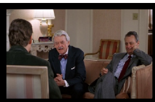

your family?

The Firm

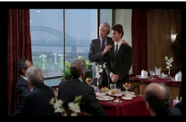

### "It'S Very Important To Us, Mitch," Royce Mcknight Said Warmly.

They all say that, thought McDeere. "Okay, my father was killed in the coal mines when I was seven years old. My mother remarried and lives in Florida. I had two brothers. Rusty was killed in Vietnam. I have a brother named Ray McDeere."
"Where is he?"

[00:08:52:00:08:55] Meanwhile, he's gonna try not to be embarrassed

The Firm

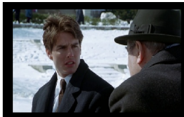

[01:00:02:01:00:04] Are you saying my life is in danger?

The Firm

Oliver Lambert greeted Mitch and introduced him to the gang. There were about twenty in all, most of the associates in, and most barely older than the guest. The partners were too busy, Lamar had explained, and would meet him later at a private lunch. He stood at the end of the table as Mr. Lambert called for quiet.

"Gentlemen, this is Mitchell McDeere. You've all heard about him, and here he is. He is our number one choice this year, our number one draft pick, so to, speak. He is being romanced by the big boys in New York and Chicago and who knows where else, so we have to sell him on our little firm here in Memphis." They smiled and nodded their approval. The guest was embarrassed.

"He will finish at Harvard in two months and will graduate with honors. He's an associate editor of the Harvard Law Review." This made an impression, Mitch could tell. "He did his undergraduate work at Western Kentucky, where he graduated summa cum laude." This was not quite as impressive. "He also played football for four years, starting as quarterback his junior year." Now they were really impressed. A few appeared to be in awe, as if staring at Joe Namath.

### Mitch Braced Himself And Waited.

"Mitch, no lawyer has ever left your law firm alive. Three have tried, and they were killed. Two were about to leave, and they died last summer. Once a lawyer joins Bendini, Lambert & Locke, he never leaves, unless he retires and keeps his mouth shut. And by the time they retire, they are a part of the conspiracy and cannot talk. The Firm has an extensive surveillance operation on the fifth floor. Your house and car are bugged. Your phones are tapped. Your desk and office are wired. Virtually every word you utter is heard and recorded on the fifth floor. They follow you, and sometimes your wife. They are here in Washington as we speak. You see, Mitch, The Firm is more than a firm. It is a division of a very large business, a very profitable business. A very illegal business. The Firm is not owned by the partners.'
Mitch turned and watched him closely. The Director looked at the frozen pond as he spoke.

Figure 10: Examples of movie-book alignment. We use our model to align a movie to a book. Then for a chosen shot
(which is a node in our CRF) we show the corresponding paragraph, plus one before and one after, in the book inferred by our model. On the left we show one (central) frame from the shot along with the subtitle sentence(s) that overlap with the shot. Some dialogs in the movie closely follow the book and thus help with the alignment.

[00:46:06:00:46:08]  He's paid what he owed.

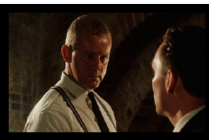

The Green Mile

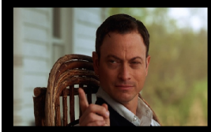

Percy slapped the dead man's cheek. The flat smacking sound of his hand made us all jump. Percy looked around at us with a cocky smile on his mouth, eyes glittering. Then he looked back at Bitterbuck again. "Adios, Chief," he said. "Hope hell's hot enough for you."
"Don't do that," Brutal said, his voice hollow and declamatory in the dripping tunnel. "He's paid what he owed. He's square with the house again. You keep your hands off him."
"Aw, blow it out," Percy said, but he stepped back uneasily when Brutal moved toward him, shadow rising behind him like the shadow of that ape in the story about the Rue Morgue. But instead of grabbing at Percy, Brutal grabbed hold of the gurney and began pushing Arlen Bitterbuck slowly toward the far end of the tunnel, where his last ride was waiting, parked on the soft shoulder of the highway. The gurney's hard rubber wheels moaned on the boards; its shadow rode the bulging brick wall, waxing and waning; Dean and Harry grasped the sheet at the foot and pulled it up over The Chief's face, which had already begun to take on the waxy, characterless cast of all dead faces, the innocent as well as the guilty.

[01:14:09:01:14:10]   ...you'll get bit.

The Green Mile

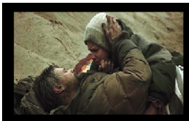

#### I Nodded.

"Oh, yes," Hammersmith said. "He did it. Don't you doubt it, and don't you turn your back on him. You might get away with it once or a hundred times... even a thousand... but in the end -" He raised a hand
before my eyes and snapped the fingers together rapidly against the thumb, turning the hand into a biting mouth. "You understand?"
I nodded again.

[01:35:51:01:35:53]  You have my whole heart.

The Road

You said you wouldn't ever leave me.

I know. I'm sorry. You have my whole heart. You always did. You're the best guy. You always were. If I'm not here you can still talk to me. You can talk to me and I'll talk to you. You'll see. Will I hear you?

Figure 11: Examples of movie-book alignment. We use our model to align a movie to a book. Then for a chosen shot
(which is a node in our CRF) we show the corresponding paragraph, plus one before and one after, in the book inferred by our model. On the left we show one (central) frame from the shot along with the subtitle sentence(s) that overlap with the shot. Some dialogs in the movie closely follow the book and thus help with the alignment.

### American. Psycho

[00:13:24:00:13:27] Two: I can only get these sheets in Santa Fe.

American. Psycho

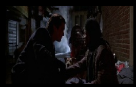

[00:21:25:00:21:27]  It's okay. I can tell.

American. Psycho

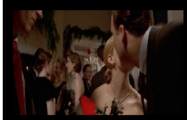

[00:23:44:00:23:47] You're late, honey. Oh, yes, you are. I am not late.

I have your license. I know who you are. I know where you live. I'm keeping your license, and I'm going to check on you, mister Raymond K. Hessel. In three months, and then in six months, and then in a year, and if you aren't back in school on your way to being a veterinarian, you will be dead.

You didn't say anything.

Your head rolled up and away from the gun, and you said, yeah. You said, yes, you lived in a basement.

You had some pictures in the wallet, too. There was your mother. This was a tough one for you, you'd have to open your eyes and see the picture of Mom and Dad smiling and see the gun at the same time, but you did, and then your eyes closed and you started to cry.

You were going to cool, the amazing miracle of death. One minute, you're a person, the next minute, you're an ...

I've never been in here before tonight.

"If you say so, sir," the bartender says, "but Thursday night, you came in to ask how soon the police were planning to shut us down." Last Thursday night, I was awake all night with the insomnia, wondering was l awake, was I sleeping. I woke up late Friday morning, bone tired and feeling I hadn't ever had my eyes closed.

"Yes, sir," the bartender says, "Thursday night, you were standing right where you are now and you were asking me about the police crackdown, and you were asking me how many guys we had to turn away from the Wednesday night fight club."
Figure 12: Examples of of borrowing paragraphs from other books - 10 book experiment. We show a few examples of top-scoring correspondences between a shot in a movie and a paragraph in a book that does not correspond to the movie.

Note that by forcing the model to choose from another book, the top-scoring correspondences may still have a relatively low similarity. In this experiment, we did not enforce a global alignment over the full book - we use the similarity output by our contextual CNN.

### American. Psycho

[00:35:25:00:35:27] Do you have any witnesses or

fingerprints ?

#### Harry. Potter And The Sorcerers. Stone

# One.Flew.Over.The.Cuckoo.Nest

"My friends, thou protest too much to believe the protesting. You are all believing deep inside your stingy little hearts that our Miss Angel of Mercy Ratched is absolutely correct in every assumption she made today about McMurphy. You know she was, and so do I. But why deny it? Let's be honest and give this man his due instead of secretly criticizing his capitalistic talent. What's wrong with him making a little profit? We've all certainly got our money's worth every time he fleeced us, haven't we? He's a shrewd character with an eye out for a quick dollar. He doesn't make any pretense about his motives, does he? Why should we? He has a healthy and honest attitude about his chicanery, and I'm all for him, just as I'm for the dear old capitalistic system of free individual enterprise, comrades, for him and his downright bullheaded gall and the American flag, bless it, and the Lincoln Memorial and the whole bit. Remember the Maine, P. T. Barnum and the Fourth of July. I
feel compelled to defend my friend's honor as a good old red, white, and blue hundred-per-cent American con man. Good guy, my foot. McMurphy would ...

[00:05:46:00:05:48]  I'm warning you now, boy.

Harry Potter and the Sorcerers. Stone

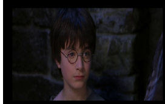

You didn't say anything.

Get out of here, and do your little life, but remember I'm watching you, Raymond Hessel, and I'd rather kill you than see you working a shit job for just enough money to buy cheese and watch television.

Now, I'm going to walk away so don't turn around.

[00:16:22:00:16:26] "We have a witch in the family. Isn't it wonderful?"

# The.Green.Mile

... course.

She wasn't quite dead. I have often thought it would have been better -
for me, if not for her - if she had been killed instantly. It might have made it possible for me to let her go a little sooner, a little more naturally. Or perhaps I'm only kidding myself about that. All I know for sure is that I have never let her go, not really.

She was trembling all over. One of her shoes had come off and I could see her foot jittering. Her ...

Figure 13: Examples of of borrowing paragraphs from other books - 10 book experiment. We show a few examples of top-scoring correspondences between a shot in a movie and a paragraph in a book that does not correspond to the movie.

Note that by forcing the model to choose from another book, the top-scoring correspondences may still have a relatively low similarity. In this experiment, we did not enforce a global alignment over the full book - we use the similarity output by our contextual CNN.

# Fight. Club

[00:55:19:00:55:23] No, no. I may need to talk to you a little futher, so how about you just let me know if you're gonna leave town.

# Fight. Club

[01:25:28:01:25:30] - Two pair of black pants? - Yes, Sir

# The.Green.Mile

[01:55:38:01:55:41] I'm thinking I don't know what I
would do if you were gone.

# Aeons-Gate-1

You, he wanted to say, I'm thinking of you. I'm thinking of your stink and how bad you smell and how I can't stop smelling you. I'm thinking of how you keep staring at me and how I never say anything about it and I don't know why. I'm thinking of you staring at me and why someone's screaming at me inside my head and how someone's screaming inside my head and why it seems odd that I'm not worried about that.

# 3Th Reality-2

e, the thing is ... " He scratched his beard. "See, I done heard yer e twitter feet up on my ceilin' there, so I come up to do some investigatin'. Yep, that's what I reckon, far as I recall.

Tick exchanged a baffled look with Sofia and Paul. It didn't take a genius to realize they'd already caught Sally in his first lie.

Well," Tick said, "we need a minute to talk about what we're gonna

# Kissofshadows

last night, or were the Tears still affecting me more than I realized? I
didn't think about it again. I just turned and walked to the bathroom. A
quick shower and we'd be on our way to the airport.

wenty minutes later I was ready, my hair still soaking wet. I was dressed in a pair of navy blue dress slacks, an emerald green silk blouse, and a navy suit jacket that matched the pants. Jeremy had also chosen a pair of black low-heeled pumps and included a pair of black thigh-highs. Since I didn't own any other kind of hose, that I didn't mind. But the rest of it ...

"Next time you pick out clothes for me to run for my life in, include some jogging shoes. Pumps, no matter how low-heeled, just aren't made for it.

Figure 14: Examples of of borrowing paragraphs from other books - 200 book experiment. We show a few examples of top-scoring correspondences between a shot in a movie and a paragraph in a book that does not correspond to the movie. By scaling up the experiment (more books to choose from), our model gets increasingly more relevant "stories".

# Harry. Potter

[01:52:05:01:52:09] - How do you know? - Someone's going to try and steal it.

# Caressoftwilight

"A good bodyguard doesn't relax on the job," Ethan said.

"You know we aren't a threat to Ms. Reed, Ethan. I don't know who you're supposed to be protecting her from, but it isn't us.'
'They may clean up for the press, but I know what they are, Meredith,"
Ethan said.

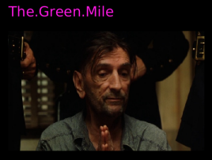

[00:37:32:00:37:35] ...and I'll never do it again, that's for sure.

# Scannerdarkly

I could use, he reflected, anything that'd help, anything at all. Any hint, like from that girl, any suggestion. He felt dismal and afraid. Shit, he thought, what am I going to do? If I'm off everything, he thought, then l'II never see any of them again, any of my friends, the people I watched and knew. I'll be out of it; I'll be maybe retired the rest of my life-anyhow, I've seen the last of Arctor and Luckman and Jerry Fabin and Charles Freck and most of all Donna Hawthorne. I'll never see any of my friends again, for the rest of eternity. It's over.

# Harrv. Potte

[00:55:54:00:55:58] Now, once you've got hold of your broom, I want you to mount it.

# Alickoffrost2

He came to his knees and put his hands on my arms, and stared down into my face. "I will love you always. When this red hair is white, I will still love you. When the smooth softness of youth is replaced by the delicate softness of age, I will still want to touch your skin. When your face is full of the line of every smile you have ever smiled, of every surprise I have seen flash through your eyes, when every tear you have ever cried has left its mark upon your face, I will treasure you all the more, because I was there to see it all. I will share your life with you, Meredith, and I ...

Figure 15: Examples of of borrowing paragraphs from other books - 200 book experiment. We show a few examples of top-scoring correspondences between a shot in a movie and a paragraph in a book that does not correspond to the movie. By scaling up the experiment (more books to choose from), our model gets increasingly more relevant "stories". Bottom row:
failed example.

# C. The Cocobook

We show more results for captioning CoCo images [18] with passages from the books.

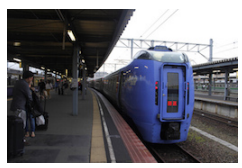

" somewhere you 'll never find it , " owens sneered . if never meant five seconds , his claim was true . the little shit 's gaze cut left , where a laptop sat on a coffee table . trey strode to it . owens ' email program was open .

seriously . its like a train crashing into another train . a train wreck . just something like that . i try to convince her .

everyone was allowed to rest for the next twenty-four hours . that

 following evening : the elect , not their entourages , were called to a dining hall for supper with lady dolorous . a table that curved inward was laden with food and drink . the wall behind the table was windows with a view of the planet . girls in pink stood about and at attention .

he had simply ... healed . brian watched his fellow passengers come aboard .

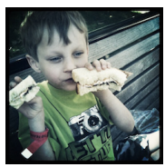 a young woman with blonde hair was walking with a little girl in dark glasses . the little girl 's hand was on the blonde 's elbow . the woman murmured to her charge , the girl looked immediately toward the sound of her voice , and brian understood she was blind - it was something in the gesture of the head .

this was a beautiful miniature reproduction of a real london town house , and when

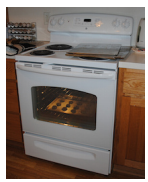

 jessamine touched it , tessa saw that the front of it swung open on tiny hinges . tessa caught her breath . there were beautiful tiny rooms perfectly decorated with miniature furniture , everything built to scale , from the little wooden chairs with needlepoint cushions to the cast-iron stove in the kitchen . there were small dolls , too , with china heads , and real little oil paintings on the walls . " this was my house . "
if he had been nearby he would have dragged her out of the room by her hair and strangled her . during lunch break she went with a group back to the encampment . out of view of the house , under a stand of towering trees , several tents were sitting in a field of mud . the rain the night before had washed the world , but here it had made a mess of things . a few women fired up a camp stove and put on rice and lentils .

then a frightened yell . " hang on ! " suddenly , jake was flying

 through the air . nefertiti became airborne , too . he screamed , not knowing what was happening-then he splashed into a pool of water .

grabbing his wristwatch off the bedside table he checked the time

 , grimacing when he saw that it was just after two in the afternoon . jeanne louise should n't be up yet . stifling a yawn , he slid out of bed and made his way to the en suite bathroom for a shower . twenty minutes later paul was showered , dressed , and had brushed his teeth and hair . feeling somewhat alive now , he made his way out of his and jeanne louise 's room , pausing to look in on livy as he passed .

she cried . quentin put a heavy , warm , calming hand on her

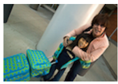 thigh , saying , " he should be sober by then . " a cell phone rang . he pulled his from his back pocket , glanced at it , then used the remote to turn the tv to the channel that showed the feed from the camera at the security gate . " oh , it 's rachel . "
now however she was out of his shot . he had missed it completely until he had

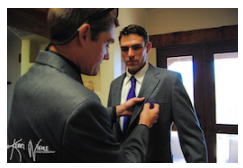 ended up on the ground with his shotgun . an old clock hung on the wall near the door . the was obviously broken , the small red hand ticking the same second away over and over again . morgan squeezed the trigger and pellets ripped out of their package , bounced down the barrel , flew through the air and ripped into the old clock tearing it in two before it smashed to the ground .

a man sat in a chair , facing the wall opposite of me . it nearly startled me when i first saw him , and made a bit of a squeak , but he did nothing . he had dark gray hair , a black suit and pants , and a gray and blue striped tie . s-sir ? i said .

its been years since we last played together , but as i recall , he

 was rather weak at the net . or was it his serving ? all i know is he plays tennis much better than he plays cricket . perhaps , mr brearly , frances eventually replied , we should wait until we actually start playing . then we can ascertain our oppositions faults , and make a plan based on the new information .

since it was the middle of summer , there were candles in the

 fireplace instead of a fire . but it still cast a romantic glow over the room . there were candles on the mantle and on a table set up in the corner with flowers . as she looked around , her eyes instinctively turned to find max who was behind a bar opening a bottle of champagne . the doors were closed quietly behind her and her mouth felt dry as she looked across the room at the man who had haunted her dreams for so long .

the open doorway of another house provided a view of an ancient

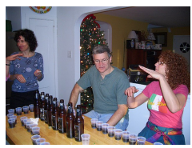

game of tiles . it wasnt the game that held reddings attention
. it was the four elderly people who sat around a table playing the game . they were well beyond their productive years and the canal township had probably been their whole lives . redding and lin ming stepped away from the doorway right into the path of a wooden pushcart .

along with the fish , howard had given them some other picnic

 treats that had spoiled ... mushrooms in cream sauce , rotted greens . the bats and temp were only eating from the river now , but the remaining picnic food was running low . there were a few loaves of stale bread , some cheese , some dried vegetables , and a couple of cakes . gregor looked over the supplies and thought about boots wailing for food and water in the jungle . it had been unbearable .

he felt the first stirrings of fear mixing with his anger . a light

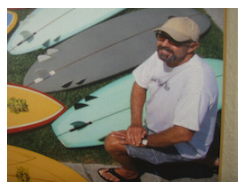 flicked on in the room and eric jerked , blinking for a minute at the brightness before the images focused . there was a tall , thin man standing over a mannequin . he looked like he was assembling it , since its leg was on the ground next to the man and its arm was in two pieces farther away . then the mannequin 's head turned .

# References

1
[1] D. Bahdanau, K. Cho, and Y. Bengio. Neural machine translation by jointly learning to align and translate. *ICLR*, 2015.

4
[2] K. Cho, B. van Merrienboer, C. Gulcehre, F. Bougares, H. Schwenk, and Y. Bengio. Learning phrase representations using rnn encoder-decoder for statistical machine translation. EMNLP, 2014. 4
[3] J. Chung, C. Gulcehre, K. Cho, and Y. Bengio. Empirical evaluation of gated recurrent neural networks on sequence modeling. *arXiv preprint arXiv:1412.3555*, 2014. 4
[4] T. Cour, C. Jordan, E. Miltsakaki, and B. Taskar.

Movie/script: Alignment and parsing of video and text transcription. In ECCV, 2008. 2
[5] M. Everingham, J. Sivic, and A. Zisserman. "Hello! My name is... Buffy" - Automatic Naming of Characters in TV Video. *BMVC*, pages 899–908, 2006. 2
[6] A. Farhadi, M. Hejrati, M. Sadeghi, P. Young, C. Rashtchian, J. Hockenmaier, and D. Forsyth. Every picture tells a story: Generating sentences for images. In *ECCV*, 2010. 2
[7] S. Fidler, A. Sharma, and R. Urtasun. A sentence is worth a thousand pixels. In *CVPR*, 2013. 2
[8] A. Gupta and L. Davis. Beyond nouns: Exploiting prepositions and comparative adjectives for learning visual classifiers. In *ECCV*, 2008. 1
[9] S. Hochreiter and J. Schmidhuber. Long short-term memory.

Neural computation, 9(8):1735–1780, 1997. 4
[10] N. Kalchbrenner and P. Blunsom. Recurrent continuous translation models. In *EMNLP*, pages 1700–1709, 2013. 4
[11] A. Karpathy and L. Fei-Fei. Deep visual-semantic alignments for generating image descriptions. In *CVPR*, 2015. 1, 2
[12] D. Kingma and J. Ba. Adam: A method for stochastic optimization. *arXiv preprint arXiv:1412.6980*, 2014. 5
[13] R. Kiros, R. Salakhutdinov, and R. S. Zemel. Unifying visual-semantic embeddings with multimodal neural language models. *CoRR*, abs/1411.2539, 2014. 1, 2, 3, 5, 9, 10
[14] R. Kiros, Y. Zhu, R. Salakhutdinov, R. S. Zemel, A. Torralba, R. Urtasun, and S. Fidler. Skip-Thought Vectors. In *Arxiv*, 2015. 3, 4
[15] C. Kong, D. Lin, M. Bansal, R. Urtasun, and S. Fidler. What are you talking about? text-to-image coreference. In *CVPR*, 2014. 1, 2
[16] G. Kulkarni, V. Premraj, S. Dhar, S. Li, Y. Choi, A. Berg, and T. Berg. Baby talk: Understanding and generating simple image descriptions. In *CVPR*, 2011. 2
[17] D. Lin, S. Fidler, C. Kong, and R. Urtasun. Visual Semantic Search: Retrieving Videos via Complex Textual Queries. CVPR, pages 2657–2664, 2014. 1, 2
[18] T.-Y. Lin, M. Maire, S. Belongie, J. Hays, P. Perona, D. Ramanan, P. Dollar, and C. L. Zitnick. Microsoft coco: Com- ´ mon objects in context. In *ECCV*, pages 740–755. 2014. 1, 19
[19] X. Lin and D. Parikh. Don't just listen, use your imagination:
Leveraging visual common sense for non-visual tasks. In CVPR, 2015. 1
[20] M. Malinowski and M. Fritz. A multi-world approach to question answering about real-world scenes based on uncertain input. In *NIPS*, 2014. 1
[21] J. Mao, W. Xu, Y. Yang, J. Wang, and A. L. Yuille. Explain images with multimodal recurrent neural networks. In arXiv:1410.1090, 2014. 1, 2
[22] T. Mikolov, K. Chen, G. Corrado, and J. Dean. Efficient estimation of word representations in vector space. arXiv preprint arXiv:1301.3781, 2013. 4
[23] K. Papineni, S. Roukos, T. Ward, and W. J. Zhu. BLEU: a method for automatic evaluation of machine translation. In ACL, pages 311–318, 2002. 6
[24] H. Pirsiavash, C. Vondrick, and A. Torralba. Inferring the why in images. *arXiv.org*, jun 2014. 2
[25] V. Ramanathan, A. Joulin, P. Liang, and L. Fei-Fei. Linking People in Videos with "Their" Names Using Coreference Resolution. In *ECCV*, pages 95–110. 2014. 2
[26] V. Ramanathan, P. Liang, and L. Fei-Fei. Video event understanding using natural language descriptions. In *ICCV*, 2013.

[27] A. Rohrbach, M. Rohrbach, N. Tandon, and B. Schiele. A
dataset for movie description. In *CVPR*, 2015. 2, 5
[28] P. Sankar, C. V. Jawahar, and A. Zisserman. Subtitle-free Movie to Script Alignment. In *BMVC*, 2009. 2
[29] A. Schwing, T. Hazan, M. Pollefeys, and R. Urtasun. Efficient Structured Prediction with Latent Variables for General Graphical Models. In *ICML*, 2012. 6
[30] J. Sivic, M. Everingham, and A. Zisserman. "Who are you?"
- Learning person specific classifiers from video. *CVPR*, pages 1145–1152, 2009. 2
[31] I. Sutskever, O. Vinyals, and Q. V. Le. Sequence to sequence learning with neural networks. In *NIPS*, 2014. 4
[32] C. Szegedy, W. Liu, Y. Jia, P. Sermanet, S. Reed, D. Anguelov, D. Erhan, V. Vanhoucke, and A. Rabinovich. Going deeper with convolutions. arXiv preprint arXiv:1409.4842, 2014. 5
[33] M. Tapaswi, M. Bauml, and R. Stiefelhagen. Book2Movie:
Aligning Video scenes with Book chapters. In *CVPR*, 2015. 2
[34] M. Tapaswi, M. Buml, and R. Stiefelhagen. Aligning Plot Synopses to Videos for Story-based Retrieval. *IJMIR*, 4:3– 16, 2015. 1, 2, 6
[35] S. Venugopalan, H. Xu, J. Donahue, M. Rohrbach, R. J.

Mooney, and K. Saenko. Translating Videos to Natural Language Using Deep Recurrent Neural Networks. CoRR
abs/1312.6229, cs.CV, 2014. 1, 2
[36] O. Vinyals, A. Toshev, S. Bengio, and D. Erhan. Show and tell: A neural image caption generator. In *arXiv:1411.4555*, 2014. 1, 2
[37] K. Xu, J. Ba, R. Kiros, K. Cho, A. Courville, R. Salakhutdinov, R. Zemel, and Y. Bengio. Show, attend and tell: Neural image caption generation with visual attention. In arXiv:1502.03044, 2015. 2
[38] B. Zhou, A. Lapedriza, J. Xiao, A. Torralba, and A. Oliva.

Learning Deep Features for Scene Recognition using Places Database. In *NIPS*, 2014. 5, 7