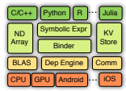
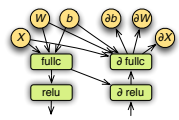
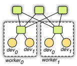
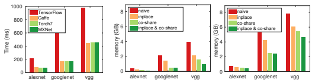
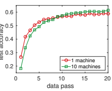

# Mxnet: A Flexible And Efficient Machine Learning Library For Heterogeneous Distributed Systems

Tianqi Chen, Mu Li∗
, Yutian Li, Min Lin, Naiyan Wang, Minjie Wang, U. Washington CMU Stanford NUS TuSimple NYU
Tianjun Xiao, Bing Xu, Chiyuan Zhang, Zheng Zhang Microsoft U. Alberta MIT NYU Shanghai

## Abstract

MXNet is a multi-language machine learning (ML) library to ease the development of ML algorithms, especially for deep neural networks. Embedded in the host language, it blends declarative symbolic expression with imperative tensor computation. It offers auto differentiation to derive gradients. MXNet is computation and memory efficient and runs on various heterogeneous systems, ranging from mobile devices to distributed GPU clusters. This paper describes both the API design and the system implementation of MXNet, and explains how embedding of both symbolic expression and tensor operation is handled in a unified fashion. Our preliminary experiments reveal promising results on large scale deep neural network applications using multiple GPU machines.

## 1 Introduction

The scale and complexity of machine learning (ML) algorithms are becoming increasingly large. Almost all recent ImageNet challenge [12] winners employ neural networks with very deep layers, requiring billions of floating-point operations to process one single sample. The rise of structural and computational complexity poses interesting challenges to ML system design and implementation. Most ML systems embed a domain-specific language (DSL) into a host language (e.g. Python, Lua, C++). Possible programming paradigms range from *imperative*, where the user specifies exactly
"how" computation needs to be performed, and *declarative*, where the user specification focuses on "what" to be done. Examples of imperative programming include numpy and Matlab, whereas packages such as Caffe, CXXNet program over layer definition which abstracts away and hide the inner-working of actual implementation. The dividing line between the two can be muddy at times. Frameworks such as Theano and the more recent Tensorflow can also be viewed as a mixture of both, they declare a computational graph, yet the computation within the graph is imperatively specified. Related to the issue of programming paradigms is how the computation is carried out. Execution can be *concrete*, where the result is returned right away on the same thread, or *asynchronize* or delayed, where the statements are gathered and transformed into a dataflow graph as an intermediate representation first, before released to available devices. These two execution models have different implications on how inherent parallelisms are discovered. Concrete execution is restrictive (e.g. parallelized matrix multiplication), whereas asynchronize/delayed execution additionally identified all parallelism within the scope of an instance of dataflow graph automatically. The combination of the programming paradigm and execution model yields a large design space, some of which are more interesting (and valid) than others. In fact, our team has collectively explored a number of them, as does the rest of the community. For example, Minerva [14] combines imperative programming with asynchronize execution. While Theano takes an declarative approach, 1

∗Corresponding author (muli@cs.cmu.edu)

|         |     | Imperative Program                    | Declarative Program                        |
|---------|-----|---------------------------------------|--------------------------------------------|
| Execute |     | Eagerly compute and store the         | Return a computation graph; bind data to b |
| a =     | b+1 | results on a as the same type with b. | and do the computation later.              |
| Advan tages         |     | Conceptually straightforward, and     | Obtain the whole computation graph before  |
|         |     | often works seamless with the host    | execution, beneficial for optimizing the   |
|         |     | language's build\-in data structures, | performance and memory utilization. Also   |
|         |     | functions, debugger, and third\-party | convenient to implement functions such as  |
|         |     | libraries.                            | load, save, and visualization.             |

| System          | Core   | Binding           | Devices      | Distri\-   | Imperative   | Declarative   |
|-----------------|--------|-------------------|--------------|------------|--------------|---------------|
|                 | Lang   | Langs             | (beyond CPU) | buted      | Program      | Program  √    |
| Caffe [7]       | C++    | Python/Matlab     | GPU          | ×          | ×  √         |               |
| Torch7 [3]      | Lua    | \-                | GPU/FPGA     | ×          |              | × √           |
| Theano [1]      | Python | \-                | GPU          | × √        | ×            | √             |
| TensorFlow [11] | C++    |                   |              |            |              |               |
|                 |        | Python            | GPU/Mobile   | √          | × √          | √             |
| MXNet           | C++    | Python/R/Julia/Go | GPU/Mobile   |            |              |               |

Table 1: Compare the imperative and declarative for domain specific languages.

Table 2: Compare to other popular open-source ML libraries

enabling more global graph-aware optimization. Similar discipline was adopted in Purine2 [10]. Instead, CXXNet adopts declarative programming (over tensor abstraction) and concrete execution, similar to Caffe [7]. Table 1 gives more examples.

Our combined new effort resulted in *MXNet* (or "mix-net"), intending to blend advantages of different approaches. Declarative programming offers clear boundary on the global computation graph, discovering more optimization opportunity, whereas imperative programs offers more flexibility. In the context of deep learning, declarative programming is useful in specifying the computation structure in neural network configurations, while imperative programming are more natural for parameter updates and interactive debugging. We also took the effort to embed into multiple host languages, including C++, Python, R, Go and Julia. Despite the support of multiple languages and combination of different programming paradigm, we are able to fuse the execution to the same backend engine. The engine tracks data dependencies across computation graphs and imperative operations, and schedules them efficiently jointly. We aggressively reduce memory footprint, performing in-place update and memory space reuse whenever possible. Finally, we designed a compact communication API so that a MXNet program runs on multiple machines with little change. Comparing to other open-source ML systems, MXNet provides a superset programming interface to Torch7 [3], Theano [1], Chainer [5] and Caffe [7], and supports more systems such as GPU clusters. Besides supporting the optimization for declarative programs as TensorFlow [11] do, MXNet additionally embed imperative tensor operations to provide more flexibility. MXNet is lightweight, e.g. the prediction codes fit into a single 50K lines C++ source file with no other dependency, and has more languages supports. More detailed comparisons are shown in Table 2.

## 2 Programming Interface

### 2.1 Symbol: **Declarative Symbolic Expressions**

Figure 1: MXNet Overview MXNet uses multi-output symbolic expressions, Symbol, declare the computation graph. Symbols are composited by operators, such as simple matrix operations (e.g. "+"), or a complex neural network layer (e.g. convolution layer). An operator can take several input variables, produce more than one output variables, and have internal state variables. A variable can be either free, which we can bind with value later, or an output of another symbol. Figure 2 shows the construction of a multi-layer perception symbol by chaining a variable , which presents the input data, and several layer operators.

| using MXNet                           | >>>           | import   | mxnet as mx                |              |
|---------------------------------------|---------------|----------|----------------------------|--------------|
| mlp = @mx.chain mx.Variable(:data) => |               |          | >>> a = mx.nd.ones((2, 3), |              |
| mx.FullyConnected(num_hidden=64) =>   | ... mx.gpu()) |          |                            |              |
| mx.Activation(act_type=:relu)  =>     | >>>           | print    | (a  *                      | 2).asnumpy() |
| mx.FullyConnected(num_hidden=10) =>   | [[ 2.         | 2.       | 2.]                        |              |
| mx.Softmax()                          | [ 2.          | 2.       | 2.]]                       |              |

Figure 2: Symbol expression construction in Julia.

Figure 3: NDArray interface in Python

To evaluate a symbol we need to bind the free variables with data and declare the required outputs. Beside evaluation ("forward"), a symbol supports auto symbolic differentiation ("backward"). Other functions, such as load, save, memory estimation, and visualization, are also provided for symbols.

### 2.2 Ndarray: **Imperative Tensor Computation**

MXNet offers NDArray with imperative tensor computation to fill the gap between the declarative symbolic expression and the host language. Figure 3 shows an example which does matrix-constant multiplication on GPU and then prints the results by numpy.ndarray.

NDArray abstraction works seamlessly with the executions declared by Symbol, we can mix the imperative tensor computation of the former with the latter. For example, given a symbolic neural network and the weight updating function, e.g. w = w − ηg. Then we can implement the gradient descent by while(1) { net.foward_backward(); net.w -= eta * net.g };
The above is as efficient as the implementation using a single but often much more complex symbolic expression. The reason is that MXNet uses lazy evaluation of NDArray and the backend engine can correctly resolve the data dependency between the two.

#### 2.3 Kvstore: **Data Synchronization Over Devices**

The KVStore is a distributed key-value store for data synchronization over multiple devices. It supports two primitives: *push* a key-value pair from a device to the store, and *pull* the value on a key from the store. In addition, a user-defined updater can specify how to merge the pushed value. Finally, model divergence is controlled via consistency model [8]. Currently, we support the sequential and eventual consistency. The following example implements the distributed gradient descent by data parallelization.

while(1){ kv.pull(net.w); net.foward_backward(); kv.push(net.g); }
where the weight updating function is registered to the KVStore, and each worker repeatedly pulls the newest weight from the store and then pushes out the locally computed gradient. The above mixed implementation has the same performance comparing to a single declarative program, because the actual data push and pull are executed by lazy evaluation, which are scheduled by the backend engine just like others.

#### 2.4 Other Modules

MXNet ships with tools to pack arbitrary sized examples into a single compact file to facilitate both sequential and random seek. Data iterators are also provided. Data pre-fetching and pre-processing are multi-threaded, reducing overheads due to possible remote file store reads and/or image decoding and transformation. The training module implements the commonly used optimization algorithms, such as stochastic gradient descent. It trains a model on a given symbolic module and data iterators, optionally distributedly if an additional KVStore is provided.

## 3 Implementation

3.1 Computation Graphfullc

A binded symbolic expression is presented as a computation graph for evaluation. Figure 4 shows a part of the graph of both forward and backward of the MLP symbol in Figure 2. Before evaluation, MXNet transforms the graph to optimize the efficiency and allocate memory to internal variables.

Figure 4: Computation graph for

both forward and backward.

Graph Optimization. We explore the following straightforward optimizations. We note first that only the subgraph required to obtain the outputs specified during binding is needed. For example, in prediction only the forward graph is needed, while for extracting features from internal layers, the last layers can be skipped. Secondly, operators can be grouped into a single one. For example, a × b + 1 is replaced by a single BLAS or GPU call. Finally, we manually implemented welloptimized "big" operations, such as a layer in neural network. Memory Allocation. Note that each variable's life time, namely the period between the creation and the last time will be used, is known for a computation graph. So we can reuse memory for nonintersected variables. However, an ideal allocation strategy requires O(n 2) time complexity, where n is the number of variables. We proposed two heuristics strategies with linear time complexity. The first, called *inplace*, simulates the procedure of traversing the graph, and keeps a reference counter of depended nodes that are not used so far. If the counter reaches zero, the memory is recycled. The second, named *co-share*,
allows two nodes to share a piece of memory if only if they cannot be run in parallel. Exploring co-share imposes one additional dependency constraint. In particular, each time upon scheduling, among the pending paths in the graph, we find the longest path and perform needed memory allocations.

#### 3.2 Dependency Engine

In MXNet, each source units, including NDArray, random number generator and temporal space, is registered to the engine with a unique tag. Any operations, such as a matrix operation or data communication, is then pushed into the engine with specifying the required resource tags. The engine continuously schedules the pushed operations for execution if dependencies are resolved. Since there usually exists multiple computation resources such as CPUs, GPUs, and the memory/PCIe buses, the engine uses multiple threads to scheduling the operations for better resource utilization and parallelization. Different to most dataflow engines [14], our engine tracks mutation operations as an existing resource unit. That is, ours supports the specification of the tags that a operation will *write* in addition to *read*. This enables scheduling of array mutations as in numpy and other tensor libraries. It also enables easier memory reuse of parameters, by representing parameter updates as mutating the parameter arrays. It also makes scheduling of some special operations easier. For example, when generating two random numbers with the same random seed, we can inform the engine they will write the seed so that they should not be executed in parallel. This helps reproducibility.

#### 3.3 Data Communication

We implemented KVStore based on the parameter server [8, 9, 4](Figure 5). It differs to previous works in two aspects: First, we use the engine to schedule the KVStore operations and manage the data consistency. The strategy not only makes the data synchronization works seamless with computation, and also greatly simplifies the implementation. Second, we adopt an two-level structure. A level-1 server manages the data synchronization between the devices within a single machine, while a level-2 server manages intermachine synchronization. Outbound data from a level-1 server can

Figure 5: Communication.

Figure 7: Internal memory usage of MXNet under various allocation strategies for only forward (left) and forward-backward (right) with batch size 64.

Figure 6: Compare MXNet to others on a single forwardbackward performance. be aggregated, reducing bandwidth requirement; intra- and inter-machine synchronization can use different consistency model (e.g. intra- is sequential and inter- is eventual).

## 4 Evaluation

Raw performance We fist compare MXNet with Torch7, Caffe, and TensorFlow on the popular "convnet-benchmarks" [2]. All these systems are compiled with CUDA 7.5 and CUDNN 3 except for TensorFlow, which only supports CUDA 7.0 and CUDNN 2. We use batch size 32 for all networks and run the experiments on a single Nvidia GTX 980 card. Results are shown in Figure 6. As expected that MXNet has similar performance comparing to Torch7 and Caffe, because most computations are spent on the CUDA/CUDNN kernels. TensorFlow is always 2x slower, which might be due its use of a lower CUDNN version. Memory usage Figure 7 shows the memory usages of the internal variables excepts for the outputs. As can be seen, both "inplace" and "co-share" can effective reduce the memory footprint. Combing them leads to a 2x reduction for all networks during model training, and further improves to 4x for model prediction. For instance, even for the most expensive VGG net, training needs less than *16MB* extra. Scalability We run the experiment on Amazon EC2 g2.8x instances, each of which is shipped with four Nvidia GK104 GPUs and 10G Ethernet. We train googlenet with batch normalization [6] on the ILSVRC12 dataset [13] which consists of 1.3 million images and 1,000 classes. We fix the learning rate to
.05, momentum to .9, weight decay to 10−4, and feed each GPU with 36 images in one batch. The convergence results are shown in Figure 8. As can be seen, comparing to single machine, the distributed training converges slower at the beginning, but outperforms after 10 data passes. The average cost of a data pass is 14K and 1.4K sec on a single machine and 10 machines, respectively. Consequently, this experiment reveals a super-linear speedup.

t t ac

Figure 8: Progress of googlenet on ILSVRC12 dataset on 1 and 10 machines.

## 5 Conclusion

MXNet is a machine learning library combining symbolic expression with tensor computation to maximize efficiency and flexibility. It is lightweight and embeds in multiple host languages, and can be run in a distributed setting. Experimental results are encouraging. While we continue to explore new design choices, we believe it can already benefit the relevant research community. The codes are available at http://dmlc.io. Acknowledgment. We sincerely thanks Dave Andersen, Carlos Guestrin, Tong He, Chuntao Hong, Qiang Kou, Hu Shiwen, Alex Smola, Junyuan Xie, Dale Schuurmans and all other contributors.

## References

[1] Fred´ eric Bastien, Pascal Lamblin, Razvan Pascanu, James Bergstra, Ian Goodfellow, Arnaud ´
Bergeron, Nicolas Bouchard, David Warde-Farley, and Yoshua Bengio. Theano: new features and speed improvements. *arXiv preprint arXiv:1211.5590*, 2012.

[2] Soumith Chintala. Easy benchmarking of all public open-source implementations of convnets, 2015. https://github.com/soumith/convnet-benchmarks.

[3] Ronan Collobert, Koray Kavukcuoglu, and Clement Farabet. Torch7: A matlab-like envi- ´
ronment for machine learning. In *BigLearn, NIPS Workshop*, number EPFL-CONF-192376, 2011.

[4] J. Dean, G. Corrado, R. Monga, K. Chen, M. Devin, Q. Le, M. Mao, M. Ranzato, A. Senior, P. Tucker, K. Yang, and A. Ng. Large scale distributed deep networks. In *Neural Information* Processing Systems, 2012.

[5] Chainer Developers. Chainer: A powerful, flexible, and intuitive framework of neural networks, 2015. http://chainer.org/.

[6] Sergey Ioffe and Christian Szegedy. Batch normalization: Accelerating deep network training by reducing internal covariate shift. *arXiv preprint arXiv:1502.03167*, 2015.

[7] Yangqing Jia, Evan Shelhamer, Jeff Donahue, Sergey Karayev, Jonathan Long, Ross Girshick, Sergio Guadarrama, and Trevor Darrell. Caffe: Convolutional architecture for fast feature embedding. In *Proceedings of the ACM International Conference on Multimedia*, pages 675– 678. ACM, 2014.

[8] M. Li, D. G. Andersen, J. Park, A. J. Smola, A. Amhed, V. Josifovski, J. Long, E. Shekita, and B. Y. Su. Scaling distributed machine learning with the parameter server. In OSDI, 2014.

[9] M. Li, D. G. Andersen, A. J. Smola, and K. Yu. Communication efficient distributed machine learning with the parameter server. In *Neural Information Processing Systems*, 2014.

[10] Min Lin, Shuo Li, Xuan Luo, and Shuicheng Yan. Purine: A bi-graph based deep learning framework. *arXiv preprint arXiv:1412.6249*, 2014.

[11] Abadi Martn, Ashish Agarwal, Paul Barham, Eugene Brevdo, Zhifeng Chen, Craig Citro, Greg Corrado, Andy Davis, Jeffrey Dean, Matthieu Devin, Sanjay Ghemawat, Ian Goodfellow, Andrew Harp, Geoffrey Irving, Michael Isard, Yangqing Jia, Rafal Jozefowicz, Lukasz Kaiser, Manjunath Kudlur, Josh Levenberg, Dan Mane, Rajat Monga, Sherry Moore, Derek Murray, Chris Olah, Mike Schuster, Jonathon Shlens, Benoit Steiner, Ilya Sutskever, Kunal Talwar, Paul Tucker, Vincent Vanhoucke, Vijay Vasudevan, Fernanda Viegas, Oriol Vinyals, Pete Warden, Martin Wattenberg, Martin Wicke, Yuan Yu, and Xiaoqiang Zheng. Tensorflow: Large-scale machine learning on heterogeneous systems. 2015.

[12] Olga Russakovsky, Jia Deng, Hao Su, Jonathan Krause, Sanjeev Satheesh, Sean Ma, Zhiheng Huang, Andrej Karpathy, Aditya Khosla, Michael Bernstein, Alexander C. Berg, and Li Fei- Fei. ImageNet Large Scale Visual Recognition Challenge. International Journal of Computer Vision (IJCV), 115(3):211–252, 2015.

[13] Olga Russakovsky, Jia Deng, Hao Su, Jonathan Krause, Sanjeev Satheesh, Sean Ma, Zhiheng Huang, Andrej Karpathy, Aditya Khosla, Michael Bernstein, et al. Imagenet large scale visual recognition challenge. *International Journal of Computer Vision*, pages 1–42, 2014.

[14] Minjie Wang, Tianjun Xiao, Jianpeng Li, Jiaxing Zhang, Chuntao Hong, and Zheng Zhang.

Minerva: A scalable and highly efficient training platform for deep learning, 2014.