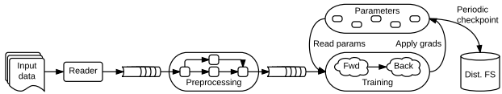
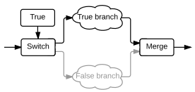
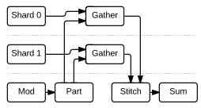
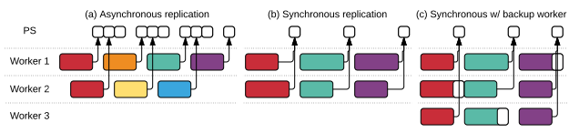
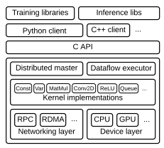
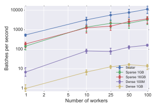
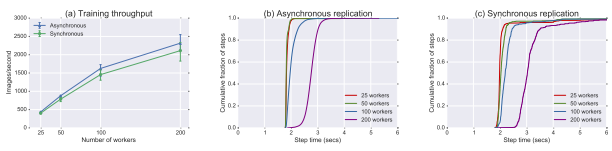
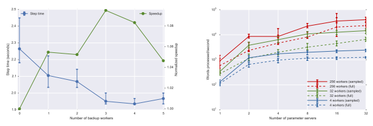

# Tensorflow: A System For Large-Scale Machine Learning

Mart´ın Abadi, Paul Barham, Jianmin Chen, Zhifeng Chen, Andy Davis, Jeffrey Dean, Matthieu Devin, Sanjay Ghemawat, Geoffrey Irving, Michael Isard, Manjunath Kudlur, Josh Levenberg, Rajat Monga, Sherry Moore, Derek G. Murray, Benoit Steiner, Paul Tucker, Vijay Vasudevan, Pete Warden, Martin Wicke, Yuan Yu, and Xiaoqiang Zheng

### Google Brain

# Abstract

TensorFlow is a machine learning system that operates at large scale and in heterogeneous environments. Tensor- Flow uses dataflow graphs to represent computation, shared state, and the operations that mutate that state. It maps the nodes of a dataflow graph across many machines in a cluster, and within a machine across multiple computational devices, including multicore CPUs, generalpurpose GPUs, and custom designed ASICs known as Tensor Processing Units (TPUs). This architecture gives flexibility to the application developer: whereas in previous "parameter server" designs the management of shared state is built into the system, TensorFlow enables developers to experiment with novel optimizations and training algorithms. TensorFlow supports a variety of applications, with particularly strong support for training and inference on deep neural networks. Several Google services use TensorFlow in production, we have released it as an open-source project, and it has become widely used for machine learning research. In this paper, we describe the TensorFlow dataflow model in contrast to existing systems, and demonstrate the compelling performance that TensorFlow achieves for several real-world applications.

# 1 Introduction

In recent years, machine learning has driven advances in many different fields [3, 5, 23, 24, 30, 27, 40, 45, 48, 50, 55, 68, 69, 73, 76]. We attribute this success to the invention of more sophisticated machine learning models [42, 51], the availability of large datasets for tackling problems in these fields [10, 65], and the development of software platforms that enable the easy use of large amounts of computational resources for training such models on these large datasets [14, 21].

We introduce the TensorFlow system1for experimenting with new models, training them on large datasets, and moving them into production. We have based TensorFlow on years of experience with our first-generation system, DistBelief [21], both simplifying and generalizing it to enable researchers to explore a wider variety of ideas with relative ease. TensorFlow supports both large-scale training and inference: it efficiently uses hundreds of powerful (GPU-enabled) servers for fast training, and it runs trained models for inference in production on various platforms, ranging from large distributed clusters in a datacenter, down to performing inference locally on mobile devices. At the same time, it is flexible and general enough to support experimentation and research into new machine learning models and system-level optimizations.

TensorFlow uses a unified dataflow graph to represent both the computation in an algorithm and the state on which the algorithm operates. We draw inspiration from the high-level programming models of dataflow systems [2, 22, 75], and the low-level efficiency of parameter servers [14, 21, 46]. Unlike traditional dataflow systems, in which graph vertices represent functional computation on immutable data, TensorFlow allows vertices to represent computations that own or update mutable state. Edges carry *tensors* (multi-dimensional arrays) between nodes, and TensorFlow transparently inserts the appropriate communication between distributed subcomputations. By unifying the computation and state management in a single programming model, TensorFlow allows programmers to experiment with different parallelization schemes that, for example, offload computation onto the servers that hold the shared state to reduce the amount of network traffic. We have also built various coordination protocols, and achieved encouraging results with synchronous replication, echoing recent results [11, 19] that contradict the

1TensorFlow can be downloaded from https://github.com/
tensorflow/tensorflow.
commonly held belief that asynchronous replication is required for scalable learning [14, 21, 46].

Over the past year, more than 60 teams at Google have used TensorFlow, and we have released the system as an open-source project. Thanks to our large community of users we have gained experience with many different machine learning applications. In this paper, we focus on neural network training as a challenging systems problem, and select two representative applications from this space: image classification and language modeling. These applications stress computational throughput and aggregate model size respectively, and we use them both to demonstrate the extensibility of TensorFlow, and to evaluate the efficiency and scalability of our present implementation.

# 2 Background & Motivation

To make the case for developing TensorFlow, we start by outlining the requirements for a large-scale machine learning system (§2.1), then consider how related work meets or does not meet those requirements (§2.2).

### 2.1 Requirements

Distributed execution A cluster of powerful computers can solve many machine learning problems more efficiently, using more data and larger models.

Machine learning algorithms generally perform better with more training data. For example, recent breakthroughs in image classification models have benefited from the public ImageNet dataset, which contains 136 gigabytes of digital images [65]; and language modeling has benefited from efforts like the One Billion Word Benchmark [10]. The scale of these datasets motivates a dataparallel approach to training: a distributed file system holds the data, and a set of workers processes different subsets of data in parallel. Data-parallelism eliminates the I/O bottleneck for input data, and any preprocessing operations can be applied to input records independently.

Effective learned models for image recognition, language modeling, document clustering, and many other problems have a large number of parameters. For example, the current state-of-the-art image classification model, ResNet, uses 2.3 million floating-point parameters to classify images into one of 1000 categories [26]. The One Billion Word Benchmark has a vocabulary of 800,000 words, and it has been used to train language models with 1.04 billion parameters [39]. A distributed system can shard the model across many processes, to increase the available network bandwidth when many workers are simultaneously reading and updating the model.

A distributed system for model training must use the network efficiently. Many scalable algorithms train a model using *mini-batch gradient descent* [21, 47], where a worker reads the current version of the model and a small batch of input examples, calculates an update to the model that reduces a loss function on those examples, and applies the update to the model. Mini-batch methods are most effective when each worker uses the most current model as a starting point, which requires a large amount of data to be transferred to the worker with low latency.

Accelerator support Machine learning algorithms often perform expensive computations, such as matrix multiplication and multi-dimensional convolution, which are highly parallelizable, but have many data dependencies that require a tightly coupled implementation. The recent availability of general-purpose GPUs has provided a large number of cores that can operate on fast local memory. For example, a single NVIDIA Titan X GPU card has 6 TFLOPS peak performance [60]. In 2012, state-ofthe-art results for different image classification tasks were achieved using 16,000 CPU cores for three days [45], and using two GPUs for six days [42]. Since then, GPU vendors have innovated in their support for machine learning: NVIDIA's cuDNN library [13] for GPU-based neural network training accelerates several popular image models by 2–4× when using version R4 in place of R2 [15].

In addition to general-purpose devices, many specialpurpose accelerators for deep learning have achieved significant performance improvements and power savings. At Google, our colleagues have built the Tensor Processing Unit (TPU) specifically for machine learning, and it achieves an order of magnitude improvement in performance-per-watt compared to alternative state-of-the-art technology [38]. The Movidius Deep Learning Accelerator uses a low-power Myriad 2 processor with custom vector processing units that accelerate many machine learning and computer vision algorithms [53]. Ovtcharov *et al.* have achieved significant performance improvements and power savings for some convolutional models using field programmable gate arrays (FPGAs) [58]. Since it is difficult to predict the next popular architecture for executing machine learning algorithms, we require that TensorFlow uses a portable programming model that can target a generic device abstraction, and allows its operations to be specialized for new architectures as they emerge.

Training & inference support In addition to training, scalable and high-performance *inference* is a requirement for using models in production [18]. Depending on the nature of the application, the inference may be required to produce results with very low latency in an interactive service, or execute on a disconnected mobile device. If the model is large, it might require multiple servers to participate in each inference computation, and thus require distributed computation support. Developers benefit when they can use the same code to define a model for both training and inference. Training and inference demand similar performance, so we prefer a common welloptimized system for both computations. Since inference can be computationally intensive (e.g., an image classification model might perform 5 billion FLOPS per image [70]), it must be possible to accelerate it with GPUs.

Extensibility Single-machine machine learning frameworks [36, 2, 17] have extensible programming models that enable their users to advance the state of the art with new approaches, such as adversarial learning [25] and deep reinforcement learning [51]. We seek a system that provides the same ability to experiment, and also allows users to scale up the same code to run in production. The system must support expressive control-flow and stateful constructs, while also satisfying our other requirements.

### 2.2 Related Work

Single-machine frameworks Many machine learning researchers carry out their work on a single—often GPU- equipped—computer [41, 42], and many flexible singlemachine frameworks have emerged to support this scenario. Caffe [36] is a high-performance framework for training declaratively specified convolutional neural networks that runs on multicore CPUs and GPUs. Theano [2] allows programmers to express a model as a dataflow graph, and generates efficient compiled code for training that model. Torch [17] has an imperative programming model for scientific computation (including machine learning) that supports fine-grained control over the order of execution and memory utilization.

While these frameworks do not satisfy our requirement for distributed execution, TensorFlow's programming model is close to Theano's dataflow representation
(§3).

Batch dataflow systems Starting with MapReduce [22], batch dataflow systems have been applied to a large number of machine learning algorithms [71], and more recent systems have focused on increasing expressivity and performance. DryadLINQ [74] adds a high-level query language that supports more sophisticated algorithms than MapReduce. Spark [75] extends DryadLINQ with the ability to cache previously computed datasets in memory, and is therefore better suited to iterative machine learning algorithms (such as k-means clustering and logistic regression) when the input data fit in memory. Dandelion extends DryadLINQ to support generating code for GPUs [63] and FPGAs [16].

The principal limitation of a batch dataflow system is that it requires the input data to be immutable, and all of the subcomputations to be deterministic, so that the system can re-execute subcomputations when machines in the cluster fail. This feature—which is beneficial for many conventional workloads—makes updating a machine learning model a heavy operation. For example, the SparkNet system for training deep neural networks on Spark takes 20 seconds to broadcast weights and collect updates from five workers [52]. As a result, these systems must process larger batches in each model update step, which slows convergence [9]. We show in Subsection 6.3 that TensorFlow can train larger models on larger clusters with step times as short as 2 seconds.

While not a *batch* dataflow system, Naiad [54] augments a dataflow model with streaming execution, stateful vertices, and structured timestamps ("timely dataflow") that enable it to handle incremental updates and iterative algorithms in the same computation. Naiad represents iteration using cyclic dataflow graphs, which together with mutable state make it possible to implement algorithms that require millisecond-scale latencies for coordination. Naiad is designed for computing on sparse, discrete data, and does not support GPU (or any other form of) acceleration, but we borrow aspects of timely dataflow iteration in Subsection 3.4.

Parameter servers Inspired by work on distributed key-value stores, a parameter server architecture uses a set of servers to manage shared state that is updated by a set of data-parallel workers. Unlike a standard key-value store, the write operation in a parameter server is specialized for parameter updates: it is typically an associative and commutative *combiner*, like addition-assignment (+=), that is applied to the current parameter value and the incoming update to produce a new parameter value.

Parameter servers emerged as an architecture for scalable topic modeling [66], and our previous system DistBelief [21] showed how a similar architecture could be applied to deep neural network training. Project Adam [14] demonstrated an efficient parameter server architecture for training convolutional neural networks, and Li *et al.*'s "Parameter Server" [46] added innovations in consistency models, fault tolerance, and elastic rescaling. Despite earlier skepticism that parameter servers would be compatible with GPU acceleration [14], Cui *et al.* have recently shown that GeePS [19], a parameter server specialized for use with GPUs, can achieve speedups on modest-sized clusters.

MXNet [12] is a recent system that uses a parameter server to scale training, supports GPU acceleration, and includes a flexible programming model with interfaces for many languages. While MXNet partially fulfills our extensibility requirements, the parameter server is "privileged" code, which makes it difficult for researchers to customize the handling of large models (§4.2).

The parameter server architecture meets most of our requirements, and our DistBelief [21] uses parameter servers with a Caffe-like model definition format [36] to great effect. We found this architecture to be insufficiently extensible, because adding a new optimization algorithm, or experimenting with an unconventional model architecture would require our users to modify the parameter server implementation, which uses C++ for performance. While some of the practitioners who use that system are comfortable with making these changes, the majority are accustomed to writing models in high-level languages, such as Python and Lua, and the complexity of the highperformance parameter server implementation is a barrier to entry. With TensorFlow we therefore sought a highlevel programming model that allows users to customize the code that runs in all parts of the system (§3).

# 3 Tensorflow Execution Model

TensorFlow uses a single dataflow graph to represent all computation and state in a machine learning algorithm, including the individual mathematical operations, the parameters and their update rules, and the input preprocessing (Figure 1). Dataflow makes the communication between subcomputations explicit, and therefore makes it easy to execute independent computations in parallel, and partition the computation across multiple distributed devices. Dataflow TensorFlow differs from batch dataflow systems (§2.2) in two respects:
- The model supports multiple concurrent executions on overlapping subgraphs of the overall graph.

- Individual vertices may have mutable state that can be shared between different executions of the graph.

The key observation in the parameter server architecture [21, 14, 46] is that mutable state is crucial when training very large models, because it becomes possible to make in-place updates to very large parameters, and propagate those updates to parallel training steps as quickly as possible. Dataflow with mutable state enables Tensor- Flow to mimic the functionality of a parameter server, but with additional flexibility, because it becomes possible to execute arbitrary dataflow subgraphs on the machines that host the shared model parameters. As a result, our users have been able to experiment with different optimization algorithms, consistency schemes, and parallelization strategies.

### 3.1 Dataflow Graph Elements

In a TensorFlow graph, each vertex represents an atomic unit of computation, and each edge represents the output from or input to a vertex. We refer to the computation at vertices as *operations*, and the values that flow along edges as *tensors*, because TensorFlow is designed for mathematical computation, and uses tensors (or multidimensional arrays) to represent all data in those computations.

Tensors In TensorFlow, we model all data as tensors (dense n-dimensional arrays) with each element having one of a small number of primitive types, such as int32, float32, or string. Tensors naturally represent the inputs to and results of the common mathematical operations in many machine learning algorithms: for example, a matrix multiplication takes two 2-D tensors and produces a 2-D tensor; and a mini-batch 2-D convolution takes two 4-D tensors and produces another 4-D tensor.

All tensors in TensorFlow are dense. This decision ensures that the lowest levels of the system can have simple implementations for memory allocation and serialization, which reduces the overhead imposed by the framework. To represent sparse tensors, TensorFlow offers two alternatives: either encode the data into variable-length string elements of a dense tensor, or use a tuple of dense tensors (e.g., an n-D sparse tensor with m non-zero elements could be represented an m × n index matrix and a length-m value vector). The size of a tensor can vary in one or more dimensions, making it possible to represent sparse tensors with differing numbers of elements, at the cost of more sophisticated shape inference.

Operations An operation takes m ≥ 0 tensors as input, and produces n ≥ 0 tensors as output. An operation has a named "type" (such as Const, MatMul, or Assign)
and may have zero or more compile-time attributes that determine its behavior. An operation can be generic and variadic at compile-time: its attributes determine both the expected types and arity of its inputs and outputs.

Shard 0 Gather True True branch Shard 1 Gather Switch Merge False branch Mod Part Stitch Sum

Figure 1: A schematic TensorFlow dataflow graph for a training pipeline contains subgraphs for reading input data, preprocessing, training, and checkpointing state.

Kernel implementations For example, the simplest operation Const has no inputs and a single output. Const has an attribute T that determines the type of its output, and an attribute Value that determines the value that it produces. AddN is variadic: it has a type attribute T, and an integer attribute N that defines how many inputs (of type T) it accepts.

Stateful operations: variables An operation can contain mutable state that is read and/or written each time it executes. A Variable operation owns a mutable buffer that is used to store the shared parameters of a model as it is trained. A Variable has no inputs, and produces a *reference handle*, which acts as a typed capability for reading and writing the buffer. A Read operation takes a reference handle as input, and outputs the value of the variable as a dense tensor. Several operations can modify the underlying buffer: for example, AssignAdd takes a reference handle r and a tensor value x, and when executed performs the update State0[r] ← State[r]+x. Subsequent Read(r) operations produce the value State0[r].

Training libraries Inference libs Python client C++ client C API
Distributed master Dataflow executor
...

Const Var MatMul Conv2D ReLU Queue ...

Stateful operations: queues TensorFlow includes several queue implementations, which support more advanced forms of coordination. The simplest queue is FIFOQueue, which owns an internal queue of tensors, and supports concurrent access. Like a Variable, the FIFOQueue operation produces a reference handle that can be consumed by one of the standard queue operations, such as Enqueue and Dequeue. These operations respectively push their input onto the tail of the queue, or pop the head element and output it. Enqueue will block if its given queue is full, and Dequeue will block if its given queue is empty. When queues are used in an input preprocessing pipeline, this blocking provides backpressure; it also supports synchronization (§4.4).

Networking layer RPC ...

Device layer RDMA CPU GPU ...

### 3.2 Partial And Concurrent Execution

TensorFlow uses the dataflow graph to represent all possible computations in a particular application, and the API for executing a graph allows the client to specify the subgraph that should be executed. A subgraph is specified declaratively: the client selects zero or more edges to *feed* input tensors into the dataflow, and one or more edges to *fetch* output tensors from the dataflow; the runtime then prunes the graph to contain the necessary set of operations. Each invocation of the API is called a *step*, and TensorFlow supports multiple *concurrent steps* on the same graph, where stateful operations enable coordination between the steps.

Figure 1 shows a typical training application, with multiple subgraphs that execute concurrently, and interact through shared variables and queues. The core training subgraph depends on a set of model parameters, and input batches from a queue. Many concurrent steps of the training subgraph update the model based on different input batches, to implement data-parallel training. To fill the input queue, concurrent preprocessing steps transform individual input records (e.g., decoding images and applying random distortions), and a separate I/O subgraph reads records from a distributed file system. A checkpointing subgraph runs periodically for fault tolerance (§4.3).

Partial and concurrent execution is responsible for much of TensorFlow's flexibility. Adding mutable state and coordination via queues makes it possible to specify a wide variety of model architectures in "unprivileged" code, which enables advanced users to experiment without modifying the internals of the TensorFlow runtime.

### 3.3 Distributed Execution

Dataflow simplifies distributed execution, because it makes communication between subcomputations explicit. In principle, the same TensorFlow program can be deployed to a distributed cluster of GPUs for training, a cluster of TPUs for serving, and a cellphone for mobile inference.

Each operation resides on a particular *device*, such as a CPU or GPU in a particular *task*. A device is responsible for executing a *kernel* for each operation assigned to it.

TensorFlow allows multiple kernels to be registered for a single operation, with specialized implementations for a particular device or data type (see §5 for details). For many operations, such as element-wise operators (Add, Sub, etc.), we use a single kernel implementation that can be compiled for CPU and GPU using different compilers.

The TensorFlow runtime places operations on devices, subject to implicit or explicit device constraints in the graph. The placement algorithm computes a feasible set of devices for each operation, calculates the sets of operations that must be colocated, and selects a satisfying device for each colocation group. Stateful operations and operations their state must be placed on the same device, which leads to implicit colocation constraints. In addition, the user may specify partial device preferences such as "any device in a particular task", or "a GPU in any task", and the runtime will respect these constraints. A typical training application will use client-side programming constructs to add constraints such that, for example, parameters are distributed among a set of "PS" tasks.

Once the operations in a graph have been placed, and the partial subgraph has been computed for a step (§3.2),
TensorFlow partitions the operations into per-device subgraphs. A per-device subgraph for device d contains all of the operations that were assigned to d, with additional Send and Recv operations that replace edges across device boundaries. Send transmits its single input to a specified device as soon as the tensor is available, using a rendezvous key to name the value. Recv has a single output, and blocks until the value for a specified rendezvous key is available locally, before producing that value. Send and Recv have specialized implementations for several device-type pairs; we describe some of these in Section 5.

We optimized TensorFlow for executing large subgraphs repeatedly with low latency. Once the graph for a step has been pruned, placed, and partitioned, its subgraphs are cached in their respective devices. A client session maintains the mapping from step definitions to cached subgraphs, so that a distributed step on a large graph can be initiated with one small message to each participating task. This model favors static, reusable graphs, but it can support dynamic computations using dynamic control flow, as the next subsection describes.

Mod Shard 0 Shard 1 Part Stitch Sum Gather Gather Input data Reader Preprocessing Training libraries Inference libs Python client C++ client C API
Distributed master Dataflow executor
...

Const Var MatMul Conv2D ReLU Queue ...

### 3.4 Dynamic Control Flow

#### Rpc ... Rdma Cpu Gpu ...

Networking layer Device layer Most evaluation in TensorFlow is *strict*: all inputs to an operation must be computed before the operation executes. Advanced algorithms—such as efficiently training a recurrent neural network [37]—require dynamic control flow, which for efficiency requires non-strict evaluation.

Figure 2: A conditional graph using Switch and Merge

Kernel implementations Read params Apply grads Training Fwd Back Dist. FS
Periodic checkpoint Parameters TensorFlow supports conditional control flow using the primitive Switch and Merge operations, which are based on Arvind and Culler's original dynamic dataflow architectures [4]. Switch acts like a demultiplexer: it takes a data input and a control input, and uses the control input to select which of its two outputs should produce a value. The Switch output not taken receives a special dead value, which propagates recursively through the rest of the graph until it reaches a Merge operation. Merge acts like a multiplexer: it forwards at most one non-dead input to its output, or produces a dead output if both of its inputs are dead. We use these primitives to build a nonstrict conditional subgraph (Figure 2) that executes one of two branches, based on the runtime value of a tensor.

Switch and Merge also support iteration. The implementation of loops in TensorFlow is based on Switch and Merge [4], with additional structural constraints based on timely dataflow [54] to simplify the distributed execution state. Like timely dataflow, TensorFlow supports multiple concurrent iterations and nested loops, but simplifies memory management by restricting each operation to producing a single value per output per iteration.

# 4 Extensibility Case Studies

By choosing a unified dataflow graph to represent all computation in TensorFlow, we have enabled users to experiment with features that were built into the runtime of our previous system [21]. In this section, we discuss four extensions to TensorFlow that we have built using simple dataflow primitives and "user-level" code.

### 4.1 Differentiation And Optimization

Many learning algorithms train a set of parameters using some variant of stochastic gradient descent (SGD), which entails computing the gradients of a cost function with respect to those parameters, then updating the parameters based on those gradients. We implement a user-level library for TensorFlow that automatically differentiates expressions. A user can, for example, define a neural network as a composition of layers and a loss function, and the library will derive the backpropagation [64].

The differentiation algorithm performs breadth-first search to identify all of the backwards paths from the target operation (e.g., a loss function) to a set of parameters, and sums the partial gradients that each path contributes. Our users frequently specialize the gradients for some operations, and they have implemented optimizations like batch normalization [32] and gradient clipping [59] to accelerate training and make it more robust. We have extended the algorithm to differentiate conditional and iterative subcomputations (§3.4), and developed techniques for managing GPU memory when iterating (and accumulating intermediate values) over long sequences in the input data (similar to GeePS [19]).

TensorFlow users can also experiment with a wide range of *optimization algorithms*, which compute new values for the parameters in each training step. SGD is easy to implement in a parameter server: for each parameter W, gradient *∂L/∂W*, and learning rate α, the update rule is W0 ← W − α × *∂L/∂W*. A parameter server can implement SGD by using -= as the write operation, and writing α × *∂L/∂W* to each W after a training step.

However, there are many more advanced optimization schemes that are difficult to express as a single write operation. For example, the Momentum algorithm accumulates a "velocity" for each parameter based on its gradient over multiple iterations, then computes the parameter update from that accumulation; and many refinements to this algorithm have been proposed [67]. To implement Momentum in DistBelief [21], we had to modify the C++ code of the parameter server to change the representation of parameter data, and execute arbitrary code in the write operation; such modifications are beyond the majority of our users. Optimization algorithms are the topic of active research, and our users have implemented several on top of TensorFlow, including Momentum, Adagrad, Adadelta, RMSProp, Adam, and L-BFGS. These can be built in TensorFlow using Variable operations and primitive mathematical operations without needing to modify the underlying system, which makes it easy to experiment with new algorithms as they emerge.

### 4.2 Handling Very Large Models

To train a model on high-dimensional data, such as words in a corpus of text [7], it is common to use a distributed representation, which embeds a training example as a pattern of activity across several neurons, which can be

True True branch Switch Merge False branch

Figure 3: Schematic dataflow graph for a sparse embedding layer containing a two-way sharded embedding matrix.

Periodic Parameters checkpoint Read params Apply grads Fwd Back Dist. FS
Training learned by backpropagation [29]. For example, in a language model, a training example might be a sparse vector with non-zero entries corresponding to the IDs of words in a vocabulary, and the distributed representation for each word will be a lower-dimensional vector [6].

Inference proceeds by multiplying a batch of b sparse vectors against an n×d *embedding matrix*, where n is the number of words in the vocabulary, and d is the desired dimensionality, to produce a much smaller b × d dense matrix representation; for training, most optimization algorithms modify only the rows of the embedding matrix that were read by the sparse multiplication. In many Tensor- Flow models that process sparse data, n×d can amount to gigabytes of parameters: e.g., a large language model may use over 109 parameters with a vocabulary of 800,000 words [39], and we have experience with document models [20] where the parameters occupy several terabytes. Such models are too large to copy to a worker on every use, or even to store in RAM on a single host.

Input data Reader Preprocessing We implement sparse embedding layers in the Tensor-
Flow graph as a composition of primitive operations. Figure 3 shows a simplified graph for an embedding layer that is split across two parameter server tasks. The core operation of this subgraph is Gather, which extracts a sparse set of rows from a tensor, and TensorFlow colocates this operation with the variable on which it operates. The dynamic partition (Part) operation divides the incoming indices into variable-sized tensors that contain the indices destined for each shard, and the dynamic static (Stitch) operation reassembles the partial results from each shard into a single result tensor. Each of these operations has a corresponding gradient, so it supports automatic differentiation (§4.1), and the result is a set of sparse update operations that act on just the values that were originally gathered from each of the shards.

While sparse reads and updates are possible in a parameter server [46], TensorFlow adds the flexibility to offload arbitrary computation onto the devices that host Training libraries Inference libs Python client C++ client C API
Networking layer RPC ...

Device layer RDMA CPU GPU ...

Distributed master Dataflow executor
...

Kernel implementations Const Var MatMul Conv2D ReLU Queue ...

the shared parameters. For example, classification models typically use a softmax classifier that multiplies the final output by a weight matrix with c columns, where c is the number of possible classes; for a language model, c is the size of the vocabulary, which can be large. Our users have experimented with several schemes to accelerate the softmax calculation. The first is similar to an optimization in Project Adam [14], whereby the weights are sharded across several tasks, and the multiplication and gradient calculation are colocated with the shards. More efficient training is possible using a sampled softmax [35], which performs a sparse multiplication based on the true class for an example and a set of randomly sampled false classes. We compare the performance of these two schemes in §6.4.

### 4.3 Fault Tolerance

Training a model can take several hours or days, even using a large number of machines [21, 14]. It is desirable to be able to train a model using non-dedicated resources, for example using a cluster manager, like Mesos [28] or Borg [72], that does not guarantee availability of the same resources for the duration of the training process. Therefore, a TensorFlow job is likely to experience failure during the training process, and we require some form of fault tolerance. However, failures are unlikely to be so common that individual operations need fault tolerance, so a mechanism like Spark's RDDs [75] would impose significant overhead for little benefit. There is no need to make every write to the parameter state durable, because we can recompute any update from the input data, and many learning algorithms do not require strong consistency [62]. Although we do not use strong consistency for the training state, we rely on a system like Chubby [8] or ZooKeeper [31] to map task IDs to IP addresses.

We implement user-level checkpointing for fault tolerance in TensorFlow, using primitive operations in the graph (Figure 1): Save writes one or more tensors to a checkpoint file, and Restore reads one or more tensors from a checkpoint file. Our typical configuration connects each Variable in a task to the same Save operation, with one Save per task, to maximize the I/O bandwidth to a distributed file system. The Restore operations read named tensors from a file, and a standard Assign stores the restored value in its respective variable. During training, a typical client runs all of the Save operations periodically to produce a new checkpoint; when the client starts up, it attempts to Restore the latest checkpoint.

TensorFlow includes a client library for constructing the appropriate graph structure, and invoking Save and Restore as necessary. This behavior is customizable: the user can apply different policies to subsets of the variables in a model, or customize the checkpoint retention scheme. For example, many users retain checkpoints with the highest score in a custom evaluation metric. The implementation is also reusable: it may be used for model fine-tuning and unsupervised pre-training [43, 45], which are forms of transfer learning, in which the parameters of a model trained on one task (e.g. recognizing general images) are used as the starting point for another task (e.g. recognizing particular breeds of dog). Having checkpoint and parameter management as programmable operations in the graph gives users the flexibility to implement schemes like these and others that we have not anticipated.

The checkpointing library does not attempt to produce consistent checkpoints: if training and checkpointing execute concurrently, the checkpoint may include none, all, or some of the updates from the training step. This is no problem for models that we train by asynchronous gradient descent [21]. Consistent checkpoints require additional synchronization to ensure that checkpointing does not run concurrently with update operations. For example, one can use the scheme in next subsection to take a checkpoint after the synchronous update step.

### 4.4 Synchronous Replica Coordination

SGD is robust to asynchrony [62], and previous systems train deep neural networks using asynchronous parameter updates [21, 14], which are believed scalable because they maintain high throughput in the presence of stragglers. The increased throughput comes at the cost of training steps using stale data. Some have recently revisited the assumption that *synchronous* training does not scale [11, 19]. Since GPUs enable training with hundreds—rather than thousands [45]—of machines, it may be possible to train a model synchronously in less time than asynchronous training on the same machines.

Though we designed TensorFlow for asynchronous training, we have begun experimenting with synchronous methods. The TensorFlow graph enables users to change how parameters are read and written when training a model, and we implement three alternatives. In the asynchronous case (Figure 4(a)), each worker reads the current value when the step begins, and applies its gradient to the different current value at the end: this ensures high utilization, but the individual steps use stale information, making each step less effective. The synchronous cases use queues (§3.1) to coordinate execution: a blocking queue acts as a barrier to ensure that all workers read the same parameter version, and a second queue accumulates mul-

Shard 0 Gather True True branch Shard 1 Gather Switch Merge False branch Mod Part Stitch Sum Periodic Parameters checkpoint Read params Apply grads Input Fwd Back data Reader Dist. FS
Preprocessing Training

Figure 4: Three parameter synchronization schemes for a single parameter in data-parallel training (§4.4): (a) asynchronous, (b) synchronous without backup workers, and (c) synchronous with backup workers.

Figure 5: The layered TensorFlow architecture.

tiple gradient updates in order to apply them atomically.

The simple synchronous version (Figure 4(b)) accumulates updates from all workers before applying them, but slow workers limit overall throughput.

To mitigate stragglers, we implement backup workers (Figure 4(c), [11]), which are similar to MapReduce backup tasks [22]. Whereas MapReduce starts backup tasks reactively—after detecting a straggler—our backup workers run proactively, and the aggregation takes the first m of n updates produced. We exploit the fact that SGD samples training data randomly, so each worker processes a different random batch. In Subsection 6.3 we show how backup workers improve throughput by up to 15%.

# 5 Implementation

We implement TensorFlow as an extensible, crossplatform library. Figure 5 illustrates the system architecture: a thin C API separates user-level in various languages from the core library. In this section, we discuss the implementation of the various components.

The core TensorFlow library is implemented in C++ for portability and performance: it runs on several operating systems including Linux, Mac OS X, Android, and iOS; the x86 and various ARM-based CPU architectures; and NVIDIA's Kepler, Maxwell, and Pascal GPU microarchitectures. The implementation is open-source, and we have accepted several external contributions that enable TensorFlow to run on other architectures.

The *distributed master* translates user requests into execution across a set of tasks. Given a graph and a step definition, it prunes (§3.2) and partitions (§3.3) the graph to obtain subgraphs for each participating device, and caches these subgraphs so that they may be re-used in subsequent steps. Since the master sees the overall computation for a step, it applies standard optimizations such as common subexpression elimination and constant folding; pruning is a form of dead code elimination. It then coordinates execution of the optimized subgraphs across a set of tasks.

The *dataflow executor* in each task handles requests from the master, and schedules the execution of the kernels that comprise a local subgraph. We optimize the dataflow executor for running large, fine-grained graphs with low overhead; our current implementation dispatches approximately 2,000,000 null operations per second. The dataflow executor dispatches kernels to local devices and runs kernels in parallel when possible: e.g., by using multiple cores in a CPU device, or multiple streams on a GPU.

The runtime contains over 200 standard operations, including mathematical, array manipulation, control flow, and state management operations. Many of the operation kernels are implemented using Eigen::Tensor [34], which uses C++ templates to generate efficient parallel code for multicore CPUs and GPUs; however, we liberally use libraries like cuDNN [13] to implement kernels where a more efficient specialization is possible. We have also implemented support for *quantization*, which enables faster inference in environments such as mobile devices and high-throughput datacenter applications, and use the gemmlowp low-precision matrix multiplication library [33] to accelerate quantized computation.

We specialize Send and Recv operations for each pair of source and destination device types. Transfers between local CPU and GPU devices use the cudaMemcpyAsync() API to overlap computation and data transfer; transfers between two local GPUs use DMA to relieve pressure on the host. For transfers between tasks, TensorFlow supports multiple protocols, including gRPC over TCP, and RDMA over Converged Ethernet. We are also investigating optimizations for GPU-to-GPU communication that use collective operations [57].

Section 4 describes features that we implement totally above the C API, in user-level code. Typically, users compose standard operations to build higher-level abstractions, such as neural network layers, optimization algorithms (§4.1), and sharded embedding computations (§4.2). TensorFlow supports multiple client languages, and we have prioritized support for Python and C++, because our internal users are most familiar with these languages. As features become more established, we typically port them to C++, so that users can access an optimized implementation from all client languages.

If it is difficult or inefficient to represent a subcomputation as a composition of operations, users can register additional kernels that provide an efficient implementation written in C++. We have found it profitable to hand-implement *fused kernels* for some performance critical operations, such as a the ReLU and Sigmoid activation functions and their corresponding gradients. We are currently investigating automatic kernel fusion using Halide [61] and other compiler-based techniques.

In addition to the core runtime, our colleagues have built several tools that aid users of TensorFlow. These include serving infrastructure for running inference in production, a visualization dashboard that enables users to follow the progress of a training run, a graph visualizer that helps users to understand the connections in a model, and a distributed profiler that traces the execution of a computation across multiple devices and tasks. We describe these tools in an extended whitepaper [1], and they can be downloaded from the project repository.

# 6 Evaluation

In this section, we evaluate the performance of Tensor- Flow on several synthetic and realistic workloads. Unless otherwise stated, we run all experiments on a shared production cluster, and all figures plot median values with error bars showing the 10th and 90th percentiles.

Here we focus on system performance metrics, rather than learning objectives like time to accuracy. TensorFlow is a system that allows machine learning practitioners and researchers to experiment with new techniques, and this evaluation demonstrates that the system (i) has little overhead, and (ii) can employ large amounts of computation to accelerate real-world applications. While techniques like synchronous replication can enable some models to converge in fewer steps overall, we defer the analysis of such improvements to other papers.

### 6.1 Single-Machine Benchmarks

Although TensorFlow is a system for "large-scale" machine learning, it is imperative that scalability does not mask poor performance at small scales [49]. Table 1 contains results from Chintala's independent benchmark of convolutional models on TensorFlow and three singlemachine frameworks [15]. All frameworks use a six-core Intel Core i7-5930K CPU at 3.5 GHz and an NVIDIA Titan X GPU.

|            |         | Training step time (ms)   |           |           |
|------------|---------|---------------------------|-----------|-----------|
| Library    | AlexNet | Overfeat                  | OxfordNet | GoogleNet |
| Caffe [36] | 324     | 823                       | 1068      | 1935      |
| Neon [56]  | 87      | 211                       | 320       | 270       |
| Torch [17] | 81      | 268                       | 529       | 470       |
| TensorFlow | 81      | 279                       | 540       | 445       |

Table 1: Step times for training four convolutional models with different libraries, using one GPU. All results are for training with 32-bit floats. The fastest library for each model is shown in bold.

Table 1 shows that TensorFlow achieves shorter step times than Caffe [36], and performance within 6% of the latest version of Torch [17]. We attribute the similar performance of TensorFlow and Torch to the fact that both use the same version of the cuDNN library [13], which implements the convolution and pooling operations on the critical path for training; Caffe uses open-source implementations for these operations that are simpler but less efficient than cuDNN. The Neon library [56] outperforms TensorFlow on three of the models, by using handoptimized convolutional kernels [44] implemented in assembly language; in principle, we could implement these kernels in TensorFlow, but we have not yet done so.

### 6.2 Synchronous Replica Microbenchmark

The performance of our coordination implementation
(§4.4) is the main limiting factor for scaling with additional machines. Figure 6 shows that number of null training steps that TensorFlow performs per second for varying model sizes, and increasing numbers of *synchronous* workers. In a null training step, a worker fetches the

Figure 6: Baseline throughput for synchronous replication with a null model. Sparse accesses enable TensorFlow to handle larger models, such as embedding matrices (§4.2).

shared model parameters from 16 PS tasks, performs a trivial computation, and sends updates to the parameters.

The *Scalar* curve in Figure 6 shows the best performance that we could expect for a synchronous training step, because only a single 4-byte value is fetched from each PS task. The median step time is 1.8 ms using a single worker, growing to 8.8 ms with 100 workers. These times measure the overhead of the synchronization mechanism, and capture some of the noise that we expect when running on a shared cluster.

The *Dense* curves show the performance of a null step when the worker fetches the entire model. We repeat the experiment with models of size 100 MB and 1 GB, with the parameters sharded equally over 16 PS tasks. The median step time for 100 MB increases from 147 ms with one worker to 613 ms with 100 workers. For 1 GB, it increases from 1.01 s with one worker to 7.16 s with 100 workers.

For large models, it is typical that a training step accesses only a subset of the parameters, and the *Sparse* curves show the throughput of the embedding lookup operation from Subsection 4.2. Each worker reads 32 randomly selected entries from a large embedding matrix containing 1 GB or 16 GB of data. As expected, the step times do not vary with the size of the embedding, and TensorFlow achieves step times ranging from 5 to 20 ms.

### 6.3 Image Classification

Deep neural networks have achieved breakthrough performance on computer vision tasks such as recognizing objects in photographs [42], and these tasks are a key application for TensorFlow at Google. Training a network to high accuracy requires a large amount of computation, and we use TensorFlow to scale out the computation across a cluster of GPU-enabled servers. In these experiments, we focus on Google's Inception-v3 model, which achieves 78.8% accuracy the ILSVRC 2012 image classification challenge [70]; the same techniques apply to other deep convolutional models—such as Microsoft's ResNet [26]—that TensorFlow users have implemented. We investigate the scalability of training the Inception-v3 model using multiple replicas. We configure a Tensor- Flow job with 17 PS tasks, and vary the number of worker tasks. Each worker task has one NVIDIA K40 GPU and 5 IvyBridge cores, and a PS task has 8 IvyBridge cores. We investigate the effect of coordination (§4.4) on training performance, using up to 200 workers to validate recent promising results for synchronous training [11, 19]. In particular, if synchronous training can be made efficient, a model such as Inception-V3 will train in fewer steps, and converge to a higher accuracy than with asynchronous training [11].

Training throughput improves to 2,300 images per second as we increase the number of workers to 200, but with diminishing returns (Figure 7(a)). Figures 7(b) and (c) explain the limits to scaling: as we add more workers, the step time increases, because there is more contention on the PS tasks, both at the network interface and in the aggregation of updates. As expected, for all configurations, synchronous steps are longer than asynchronous steps, because all workers must wait for the slowest worker to catch up before starting the next step. While the median synchronous step is approximately 10% longer than an asynchronous step with the same workers, above the 90th percentile the synchronous performance degrades sharply, because stragglers disproportionately impact the tail.

To mitigate tail latency, we can add backup workers, so that a step completes when the first m of n tasks produce gradients. Figure 8 shows the effect on step time of adding backup workers to a 50-worker Inception training job. Each additional backup worker up to and including the fourth reduces the median step time, because the probability of a straggler affecting the step decreases. Adding a fifth backup worker slightly degrades performance, because the 51st worker (i.e., the first whose result is discarded) is more likely to be a non-straggler that generates more incoming traffic for the PS tasks. Figure 8 also plots the *normalized speedup* for each configuration, which we define as t(b)/t(0)×50/(50+b) (where t(b) is the median step time with b backup workers), and which discounts the speedup by the fraction of additional resources consumed. Although adding 4 backup workers achieves the shortest overall step time (1.93 s), adding 3 achieves the highest normalized speedup (9.5%), and hence trains the model to the same quality using less aggregate GPU-time.

Figure 7: (a) Inception-v3 training throughput increases with up to 200 workers. However, adding more workers gets diminishing returns because the step time increases for both (b) asynchronous and (c) synchronous replication.

Figure 8: Backup workers reduce the step time for 50worker Inception-v3 training. 4 backup workers give the shortest overall step time, but 3 backup workers are most efficient when we normalize for the total resources used.

Figure 9: Increasing the number of PS tasks leads to increased throughput for language model training, by parallelizing the softmax computation. Sampled softmax increases throughput by performing less computation.

### 6.4 Language Modeling

Given a sequence of words, a language model predicts the most probable next word [6]. Therefore, language models are integral to predictive text, speech recognition, and translation applications. In this experiment, we investigate how TensorFlow can train a recurrent neural network (viz. LSTM-512-512 [39]) to model the text in the One Billion Word Benchmark [10]. The vocabulary size |V | limits the performance of training, because the final layer must decode the output state into probabilities for each of |V | classes [35]. The resulting parameters can be large (|V | × d for output state dimension d) so we use the techniques for handling large models from Subsection 4.2. We use a restricted vocabulary of the most common 40,000 words—instead of the full 800,000 words [10]—in order to experiment with smaller configurations.

Figure 9 shows the training throughput, measured in words per second, for varying numbers of PS and worker tasks, and two softmax implementations. The *full* softmax (dashed lines) multiplies each output by a 512 × 40, 000 weight matrix sharded across the PS tasks. Adding more PS tasks increases the throughput, because TensorFlow can exploit distributed model parallelism [21, 41] and perform the multiplication and gradient calculation on the PS tasks, as in Project Adam [14]. Adding a second PS task is more effective than increasing from 4 to 32, or 32 to 256 workers. Eventually the throughput saturates, as the LSTM calculations dominate the training step.

The *sampled* softmax (solid lines) reduces the data transferred and the computation performed at the PS tasks [35]. Instead of a dense weight matrix, it multiplies the output by a random sparse matrix containing weights for the true class and a random sample of false classes. We sample 512 classes for each batch, which reduces the softmax data transfer and computation by a factor of 78.

# 7 Conclusions

We have described the TensorFlow system and its extensible dataflow-based programming model. The core idea of this paper is that TensorFlow's dataflow representation subsumes existing work on parameter server systems, and offers a uniform programming model that allows users to harness large-scale heterogeneous systems, both for production tasks and for experimenting with new approaches. We have shown several examples of how the TensorFlow programming model supports experimentation (§4) and demonstrated that the resulting implementations are performant and scalable (§6).

Our initial experience with TensorFlow is encouraging. A large number of groups at Google have deployed TensorFlow in production, and TensorFlow is helping our research colleagues to make new advances in machine learning. Since we released TensorFlow as open-source software, over 8,000 people have forked the source code repository, the binary distribution has been downloaded 500,000 times, and our users have published dozens of machine learning models that use TensorFlow.

TensorFlow is a work in progress. Its flexible dataflow representation enables power users to achieve excellent performance, but we have not yet determined default policies that work well for most users. Further research on automatic optimization should bridge this gap. On the system level, we are actively developing algorithms for automatic placement, kernel fusion, memory management, and scheduling. While the current implementations of mutable state and fault tolerance suffice for applications with weak consistency requirements, we expect that some TensorFlow applications will require stronger consistency, and we are investigating how to build such policies at user-level. Finally, our users are demanding, and some have begun to chafe at the limitations of a static dataflow graph, especially for algorithms like deep reinforcement learning [51]. Therefore, we face the intriguing problem of providing a system that transparently and efficiently uses distributed resources, even when the structure of the computation unfolds dynamically.

By sharing the implementation of TensorFlow and engaging with the research community, we hope that this work will spur further research in distributed systems and machine learning.

# Acknowledgments

We gratefully acknowledge contributions from our colleagues within Google, and from members of the wider machine learning community. In particular, we appreciate the feedback we have received both from the rest of the Google Brain team and the hundreds of DistBelief and TensorFlow users that has helped us improve the usability of functionality of the system.

Many individuals have contributed to TensorFlow, including: John Giannandrea (for creating a supportive research environment); Irina Kofman, Amy McDonald Sandjideh, and Phing Turner (project management); Ashish Agarwal, Dave Andersen, Anelia Angelova, Eugene Brevdo, Yaroslav Bulatov, Jerjou Cheng, Maciek Chociej, Craig Citro, Greg Corrado, George Dahl, Andrew Dai, Lucy Gao, mig Gerard, Ian Goodfellow, Stephan Gouws, Gunhan Gulsoy, Steinar Gunderson, Andrew Harp, Peter Hawkins, Yangqing Jia, Rafal Jozefowicz, Łukasz Kaiser, Naveen Kumar, Geoffrey Hinton, Mrinal Kalakrishnan, Anjuli Kannan, Rasmus Larsen, Yutaka Leon-Suematsu, Frank Li, Peter Liu, Xiaobing Liu, Olivia Nordquist, Chris Olah, Nishant Patil, Saurabh Saxena, Mike Schuster, Andrew Selle, Pierre Sermanet, Noam Shazeer, Jonathon Shlens, Jascha Sohl-Dickstein, Ilya Sutskever, Kunal Talwar, Philip Tucker, Vincent Vanhoucke, Oriol Vinyals, Chad Whipkey, Yonghui Wu, Ke Yang, Zongheng Yang, and Yao Zhang (general contributions to the project); Shan Carter, Doug Fritz, Patrick Hurst, Dilip Krishnan, Dan Mane, Daniel Smilkov, Fer- ´ nanda Viegas, Martin Wattenberg, James Wexler, Jimbo ´
Wilson, Kanit Wongsuphasawat, Cassandra Xia, and the Big Picture team (visualization); Chris Leary, Robert Hundt, Robert Springer, Cliff Young, and the Stream Executor team (accelerator support); Norm Jouppi and the team that created the Tensor Processing Unit; Kayur Patel, Michael Piatek, and the coLab team; and the growing community of open-source contributors and users who have helped make TensorFlow better.

# References

[1] M. Abadi, A. Agarwal, P. Barham, E. Brevdo, Z. Chen, C. Citro, G. S. Corrado, A. Davis, J. Dean, M. Devin, S. Ghemawat, I. J. Goodfellow, A. Harp, G. Irving, M. Isard, Y. Jia, R. Jozefowicz, L. Kaiser, ´ M. Kudlur, J. Levenberg, D. Mane, R. Monga, S. Moore, D. G. Murray, C. Olah, M. Schuster, J. Shlens, B. Steiner, I. Sutskever, K. Talwar, P. A. Tucker, V. Vanhoucke, V. Vasudevan, F. B. Viegas, O. Vinyals, P. Warden, M. Watten- ´ berg, M. Wicke, Y. Yu, and X. Zheng. Tensorflow: Large-scale machine learning on heterogeneous distributed systems. *CoRR*, abs/1603.04467, 2016. arxiv.org/abs/1603.04467. Software available from tensorflow.org.

[2] R. Al-Rfou, G. Alain, A. Almahairi, C. Angermueller, D. Bahdanau, N. Ballas, F. Bastien, J. Bayer, A. Belikov, A. Belopolsky, Y. Bengio, A. Bergeron, J. Bergstra, V. Bisson, J. Bleecher Snyder, N. Bouchard, N. Boulanger-Lewandowski, X. Bouthillier, A. de Brebisson, O. Breuleux, P.- ´ L. Carrier, K. Cho, J. Chorowski, P. Christiano, T. Cooijmans, M.-A. Cotˆ e, M. C ´ otˆ e, A. Courville, ´ Y. N. Dauphin, O. Delalleau, J. Demouth, G. Desjardins, S. Dieleman, L. Dinh, M. Ducoffe, V. Dumoulin, S. Ebrahimi Kahou, D. Erhan, Z. Fan, O. Firat, M. Germain, X. Glorot, I. Goodfellow, M. Graham, C. Gulcehre, P. Hamel, I. Harlouchet, J.-P. Heng, B. Hidasi, S. Honari, A. Jain, S. Jean, K. Jia, M. Korobov, V. Kulkarni, A. Lamb, P. Lamblin, E. Larsen, C. Laurent, S. Lee, S. Lefrancois, S. Lemieux, N. Leonard, Z. Lin, J. A. Livezey, ´ C. Lorenz, J. Lowin, Q. Ma, P.-A. Manzagol, O. Mastropietro, R. T. McGibbon, R. Memisevic, B. van Merrienboer, V. Michalski, M. Mirza, ¨
A. Orlandi, C. Pal, R. Pascanu, M. Pezeshki, C. Raffel, D. Renshaw, M. Rocklin, A. Romero, M. Roth, P. Sadowski, J. Salvatier, F. Savard, J. Schluter, J. Schulman, G. Schwartz, I. V. Serban, ¨ D. Serdyuk, S. Shabanian, E. Simon, S. Spieckermann, S. R. Subramanyam, J. Sygnowski, J. Tanguay, G. van Tulder, J. Turian, S. Urban, P. Vincent, F. Visin, H. de Vries, D. Warde-Farley, D. J. Webb, M. Willson, K. Xu, L. Xue, L. Yao, S. Zhang, and Y. Zhang. Theano: A Python framework for fast computation of mathematical expressions. *arXiv e-prints*, abs/1605.02688, May 2016. arxiv.org/abs/1605.02688.

[3] A. Angelova, A. Krizhevsky, and V. Vanhoucke.

Pedestrian detection with a large-field-of-view deep network. In *Robotics and Automation (ICRA), 2015* IEEE International Conference on, pages 704–711. IEEE, 2015. CalTech PDF.

[4] Arvind and D. E. Culler. Annual review of computer science vol. 1, 1986. chapter Dataflow Architectures, pages 225–253. 1986. www.dtic.mil/cgi-bin/GetTRDoc?Location=U2& doc=GetTRDoc.pdf&AD=ADA166235.

[5] J. Ba, V. Mnih, and K. Kavukcuoglu. Multiple object recognition with visual attention. arXiv preprint arXiv:1412.7755, 2014. arxiv.org/abs/1412.7755.

[6] Y. Bengio, R. Ducharme, P. Vincent, and C. Jauvin. A neural probabilistic language model.

Journal of Machine Learning Research, 3:1137– 1155, 2003. www.iro.umontreal.ca/˜lisa/pointeurs/ BengioDucharmeVincentJauvin jmlr.pdf.

[7] T. Brants and A. Franz. Web 1T 5-gram version 1, 2006. catalog.ldc.upenn.edu/LDC2006T13.

[8] M. Burrows. The Chubby lock service for looselycoupled distributed systems. In *Proceedings of* the 7th Symposium on Operating Systems Design and Implementation, OSDI '06, pages 335–350, Berkeley, CA, USA, 2006. USENIX Association.

www.usenix.org/legacy/event/osdi06/tech/full papers/burrows/burrows.pdf.

[9] R. H. Byrd, G. M. Chin, J. Nocedal, and Y. Wu.

Sample size selection in optimization methods for machine learning. *Mathematical Programming*, 134(1):127–155, 2012. dx.doi.org/10.1007/s10107012-0572-5.

[10] C. Chelba, T. Mikolov, M. Schuster, Q. Ge, T. Brants, and P. Koehn. One billion word benchmark for measuring progress in statistical language modeling. *CoRR*, abs/1312.3005, 2013.

arxiv.org/abs/1312.3005.

[11] J. Chen, R. Monga, S. Bengio, and R. Jozefowicz.

Revisiting distributed synchronous SGD. In International Conference on Learning Representations Workshop Track, 2016. arxiv.org/abs/1604.00981.

[12] T. Chen, M. Li, Y. Li, M. Lin, N. Wang, M. Wang, T. Xiao, B. Xu, C. Zhang, and Z. Zhang. MXNet: A flexible and efficient machine learning library for heterogeneous distributed systems. In *Proceedings of the Workshop* on Machine Learning Systems at Neural Information Processing Systems (LearningSys), Dec. 2015.

www.cs.cmu.edu/ muli/file/mxnet-learning-sys.pdf.

[13] S. Chetlur, C. Woolley, P. Vandermersch, J. Cohen, J. Tran, B. Catanzaro, and E. Shelhamer. cuDNN: Efficient primitives for deep learning. arXiv preprint arXiv:1410.0759, 2014. arxiv.org/abs/1410.0759.

[14] T. Chilimbi, Y. Suzue, J. Apacible, and K. Kalyanaraman. Project Adam: Building an efficient and scalable deep learning training system. In 11th USENIX Symposium on Operating Systems Design and Implementation (OSDI 14), pages 571–582, 2014.

www.usenix.org/system/files/conference/osdi14/ osdi14-paper-chilimbi.pdf.

[15] S. Chintala. convnet-benchmarks, 2016.

github.com/soumith/convnet-benchmarks.

[16] E. S. Chung, J. D. Davis, and J. Lee. LIN-
Qits: Big data on little clients. In Proceedings of the 40th Annual International Symposium on Computer Architecture, ISCA '13, pages 261–272, New York, NY, USA, 2013. ACM. doi.acm.org/10.1145/2485922.2485945.

[17] R. Collobert, S. Bengio, and J. Mariethoz. ´
Torch: A modular machine learning software library. Technical report, IDIAP, 2002.

infoscience.epfl.ch/record/82802/files/rr02-46.pdf.

[18] D. Crankshaw, P. Bailis, J. E. Gonzalez, H. Li, Z. Zhang, M. J. Franklin, A. Ghodsi, and M. I. Jordan. The missing piece in complex analytics: Low latency, scalable model management and serving with Velox. In CIDR 2015, Seventh Biennial Conference on Innovative Data Systems Research, Asilomar, CA, USA, January 4-7, 2015, Online Proceedings, 2015. arxiv.org/abs/1409.3809.

[19] H. Cui, H. Zhang, G. R. Ganger, P. B. Gibbons, and E. P. Xing. GeePS: Scalable deep learning on distributed GPUs with a GPU-
specialized parameter server. In Proceedings of the Eleventh European Conference on Computer Systems, EuroSys '16, 2016. www.pdl.cmu.edu/PDL- FTP/CloudComputing/GeePS-cui-eurosys16.pdf.

[20] A. Dai, C. Olah, and Q. V. Le. Document embedding with paragraph vectors. arXiv preprint arXiv:1507.07998, 2015. arxiv.org/abs/1507.07998.

[21] J. Dean, G. S. Corrado, R. Monga, K. Chen, M. Devin, Q. V. Le, M. Z. Mao, M. Ranzato, A. Senior, P. Tucker, K. Yang, and A. Y. Ng. Large scale distributed deep networks. In *NIPS*, 2012. Google Research PDF.

[22] J. Dean and S. Ghemawat. Mapreduce: Simplified data processing on large clusters. In Proceedings of the 6th Conference on Symposium on Opearting Systems Design & Implementation - Volume 6, OSDI'04, Berkeley, CA, USA, 2004. USENIX Association. research.google.com/archive/mapreduceosdi04.pdf.

[23] A. Frome, G. S. Corrado, J. Shlens, S. Bengio, J. Dean, T. Mikolov, et al. DeVISE: A deep visualsemantic embedding model. In Advances in Neural Information Processing Systems, pages 2121–2129, 2013. research.google.com/pubs/archive/41473.pdf.

[24] J. Gonzalez-Dominguez, I. Lopez-Moreno, P. J. Moreno, and J. Gonzalez-Rodriguez. Frame-by-frame language identification in short utterances using deep neural networks. Neural Networks, 64:49–58, 2015. research.google.com/en//pubs/archive/42929.pdf.

[25] I. J. Goodfellow, J. Pouget-Abadie, M. Mirza, B. Xu, D. Warde-Farley, S. Ozair, A. C. Courville, and Y. Bengio. Generative adversarial nets. In Advances in Neural Information Processing Systems 27: Annual Conference on Neural Information Processing Systems 2014, December 8-13 2014, Montreal, Quebec, Canada, pages 2672–
2680, 2014. papers.nips.cc/paper/5423-generativeadversarial-nets.

[26] K. He, X. Zhang, S. Ren, and J. Sun. Deep residual learning for image recognition. CoRR, abs/1512.03385, 2015. arxiv.org/abs/1512.03385.

[27] G. Heigold, V. Vanhoucke, A. Senior, P. Nguyen, M. Ranzato, M. Devin, and J. Dean. Multilingual acoustic models using distributed deep neural networks. In Acoustics, Speech and Signal Processing (ICASSP), 2013 IEEE International Conference on, pages 8619–8623. IEEE, 2013. research.google.com/pubs/archive/40807.pdf.

[28] B. Hindman, A. Konwinski, M. Zaharia, A. Ghodsi, A. D. Joseph, R. Katz, S. Shenker, and I. Stoica. Mesos: A platform for fine-grained resource sharing in the data center. In *Proceedings of the* 8th USENIX Conference on Networked Systems Design and Implementation, NSDI'11, pages 295–308, Berkeley, CA, USA, 2011. USENIX Association. www.cs.berkeley.edu/˜alig/papers/mesos.pdf.

[29] G. E. Hinton. Learning distributed representations of concepts. In Proceedings of the Eighth Annual Conference of the Cognitive Science Society, pages 1–12. Hillsdale, NJ: Erlbaum, 1986. www.cogsci.ucsd.edu/˜ajyu/Teaching/Cogs202 - sp13/Readings/hinton86.pdf.

[30] G. E. Hinton, L. Deng, D. Yu, G. E. Dahl, A. Mohamed, N. Jaitly, A. Senior, V. Vanhoucke, P. Nguyen, T. N. Sainath, and B. Kingsbury. Deep neural networks for acoustic modeling in speech recognition: The shared views of four research groups. *IEEE Signal Process. Mag.*, 29(6):82–
97, 2012. www.cs.toronto.edu/˜gdahl/papers/ deepSpeechReviewSPM2012.pdf.

[31] P. Hunt, M. Konar, F. P. Junqueira, and B. Reed.

ZooKeeper: Wait-free coordination for internetscale systems. In *Proceedings of the 2010* USENIX Conference on USENIX Annual Technical Conference, USENIXATC'10, pages 11–11, Berkeley, CA, USA, 2010. USENIX Association. www.usenix.org/legacy/event/atc10/tech/full - papers/Hunt.pdf.

[32] S. Ioffe and C. Szegedy. Batch normalization: Accelerating deep network training by reducing internal covariate shift. *CoRR*, abs/1502.03167, 2015. arxiv.org/abs/1502.03167.

[33] B. Jacob et al. gemmlowp: a small selfcontained low-precision GEMM library, 2015. github.com/google/gemmlowp.

[34] B. Jacob, G. Guennebaud, et al. Eigen library for linear algebra. eigen.tuxfamily.org.

[35] S. Jean, K. Cho, R. Memisevic, and Y. Bengio.

On using very large target vocabulary for neural machine translation. In Proceedings of the 53rd Annual Meeting of the Association for Computational Linguistics and the 7th International Joint Conference on Natural Language Processing (Volume 1: Long Papers), pages 1–10, Beijing, China, July 2015. Association for Computational Linguistics. www.aclweb.org/anthology/P15-1001.

[36] Y. Jia, E. Shelhamer, J. Donahue, S. Karayev, J. Long, R. Girshick, S. Guadarrama, and T. Darrell. Caffe: Convolutional architecture for fast feature embedding. In Proceedings of the ACM International Conference on Multimedia, pages 675–678. ACM, 2014. arxiv.org/pdf/1408.5093.

[37] M. I. Jordan. Serial order: A parallel distributed processing approach. ICS report 8608, Institute for Cognitive Science, UCSD,
La Jolla, 1986. cseweb.ucsd.edu/˜gary/PAPER- SUGGESTIONS/Jordan-TR-8604.pdf.

[38] N. Jouppi. Google supercharges machine learning tasks with TPU custom chip, 2016. cloudplatform.googleblog.com/2016/05/Googlesupercharges-machine-learning-tasks-with-customchip.html.

[39] R. Jozefowicz, O. Vinyals, M. Schuster, N. Shazeer, ´
and Y. Wu. Exploring the limits of language modeling. *CoRR*, abs/1602.02410, 2016.

arxiv.org/abs/1602.02410.

[40] A. Karpathy, G. Toderici, S. Shetty, T. Leung, R. Sukthankar, and L. Fei-Fei. Large-scale video classification with convolutional neural networks. In Computer Vision and Pattern Recognition (CVPR), 2014 IEEE Conference on, pages 1725–1732. IEEE, 2014. research.google.com/pubs/archive/42455.pdf.

[41] A. Krizhevsky. One weird trick for parallelizing convolutional neural networks. arXiv preprint arXiv:1404.5997, 2014. arxiv.org/abs/1404.5997.

[42] A. Krizhevsky, I. Sutskever, and G. E. Hinton. ImageNet classification with deep convolutional neural networks. In Advances in Neural Information Processing Systems, 2012. papers.nips.cc/paper/4824imagenet-classification-with-deep-convolutionalneural-networks.pdf.

[43] H. Larochelle, Y. Bengio, J. Louradour, and P. Lamblin. Exploring strategies for training deep neural networks. Journal of Machine Learning Research, 10:1–40, Jan. 2009. deeplearning.cs.cmu.edu/pdfs/1111/jmlr10 larochelle.pdf.

[44] A. Lavin and S. Gray. Fast algorithms for convolutional neural networks. *CoRR*, abs/1509.09308, 2015. arxiv.org/abs/1509.09308.

[45] Q. Le, M. Ranzato, R. Monga, M. Devin, G. Corrado, K. Chen, J. Dean, and A. Ng. Building highlevel features using large scale unsupervised learning. In *ICML'2012*, 2012. Google Research PDF.

[46] M. Li, D. G. Andersen, J. Park, A. J. Smola, A. Ahmed, V. Josifovski, J. Long, E. J. Shekita, and B.-Y. Su. Scaling distributed machine learning with the Parameter Server. In *11th USENIX* Symposium on Operating Systems Design and Implementation (OSDI 14), pages 583–598, 2014.

www.usenix.org/system/files/conference/osdi14/osdi14paper-chilimbi.pdf.

[47] M. Li, T. Zhang, Y. Chen, and A. J. Smola.

Efficient mini-batch training for stochastic optimization. In Proceedings of the 20th ACM SIGKDD International Conference on Knowledge Discovery and Data Mining, KDD '14, pages 661–670, New York, NY, USA, 2014. ACM. www.cs.cmu.edu/˜muli/file/minibatch sgd.pdf.

[48] C. J. Maddison, A. Huang, I. Sutskever, and D. Silver. Move evaluation in Go using deep convolutional neural networks. *arXiv preprint arXiv:1412.6564*,
2014. arxiv.org/abs/1412.6564.

[49] F. McSherry, M. Isard, and D. G. Murray. Scalability! But at what COST? In Proceedings of the 15th USENIX Conference on Hot Topics in Operating Systems, HOTOS'15, Berkeley, CA, USA, 2015. USENIX Association. www.usenix.org/system/files/conference/hotos15/ hotos15-paper-mcsherry.pdf.

[50] T. Mikolov, K. Chen, G. Corrado, and J. Dean.

Efficient estimation of word representations in vector space. In International Conference on Learning Representations: Workshops Track, 2013. arxiv.org/abs/1301.3781.

[51] V. Mnih, K. Kavukcuoglu, D. Silver, A. A. Rusu, J. Veness, M. G. Bellemare, A. Graves, M. Riedmiller, A. K. Fidjeland, G. Ostrovski, S. Petersen, C. Beattie, A. Sadik, I. Antonoglou, H. King, D. Kumaran, D. Wierstra, S. Legg, and D. Hassabis. Human-level control through deep reinforcement learning. *Nature*, 518(7540):529–533, 02 2015. dx.doi.org/10.1038/nature14236.

[52] P. Moritz, R. Nishihara, I. Stoica, and M. I. Jordan. SparkNet: Training deep networks in Spark. In International Conference on Learning Representations, 2016. arxiv.org/abs/1511.06051.

[53] Movidius Ltd. Movidius announces Deep Learning Accelerator and Fathom software framework, 2016. www.movidius.com/news/movidius-announcesdeep-learning-accelerator-and-fathom-softwareframework.

[54] D. G. Murray, F. McSherry, R. Isaacs, M. Isard, P. Barham, and M. Abadi. Naiad: a timely dataflow system. In Proceedings of the Twenty-Fourth ACM Symposium on Operating Systems Principles, pages 439–455. ACM, 2013. Microsoft Research PDF.

[55] A. Nair, P. Srinivasan, S. Blackwell, C. Alcicek, R. Fearon, A. De Maria, V. Panneershelvam, M. Suleyman, C. Beattie, S. Petersen, et al. Massively parallel methods for deep reinforcement learning. *arXiv preprint arXiv:1507.04296*, 2015. arxiv.org/abs/1507.04296.

[56] Nervana Systems. neon, 2016.

github.com/NervanaSystems/neon.

[57] NVIDIA Corporation. NCCL: Optimized primitives for collective multi-gpu communication, 2016. github.com/NVIDIA/nccl.

[58] K. Ovtcharov, O. Ruwase, J.-Y. Kim, J. Fowers, K. Strauss, and E. Chung. Toward accelerating deep learning at scale using specialized logic. In *Hot Chips: A Symposium on High* Performance Chips. HOTCHIPS, August 2015. research.microsoft.com/apps/pubs/default.aspx?id=246506.

[59] R. Pascanu, T. Mikolov, and Y. Bengio. On the difficulty of training recurrent neural networks. In *ICML (3)*, volume 28 of JMLR Proceedings, pages 1310–1318. JMLR.org, 2013. www.jmlr.org/proceedings/papers/v28/pascanu13.pdf.

[60] K. Powell. Nvidia devtech blog post.

blogs.nvidia.com/blog/2015/03/17/digits-devbox/.

[61] J. Ragan-Kelley, C. Barnes, A. Adams, S. Paris, F. Durand, and S. Amarasinghe. Halide: A language and compiler for optimizing parallelism, locality, and recomputation in image processing pipelines. *ACM SIGPLAN Notices*, 48(6):519– 530, 2013. people.csail.mit.edu/fredo/tmp/Halide5min.pdf.

[62] B. Recht, C. Re, S. Wright, and F. Niu. Hogwild:
A lock-free approach to parallelizing stochastic gradient descent. In Advances in Neural Information Processing Systems, pages 693–701, 2011. papers.nips.cc/paper/4390-hogwild-a-lockfree-approach-to-parallelizing-stochastic-gradientdescent.

[63] C. J. Rossbach, Y. Yu, J. Currey, J.-P. Martin, and D. Fetterly. Dandelion: a compiler and runtime for heterogeneous systems. In *Proceedings of* the Twenty-Fourth ACM Symposium on Operating Systems Principles, pages 49–68. ACM, 2013. research-srv.microsoft.com/pubs/201110/sosp13dandelion-final.pdf.

[64] D. E. Rumelhart, G. E. Hinton, and R. J.

Williams. Learning representations by backpropagating errors. *Cognitive modeling*, 5:3, 1988. www.cs.toronto.edu/ hinton/absps/naturebp.pdf.

[65] O. Russakovsky, J. Deng, H. Su, J. Krause, S. Satheesh, S. Ma, Z. Huang, A. Karpathy, A. Khosla, M. Bernstein, A. C. Berg, and L. Fei-Fei. ImageNet Large Scale Visual Recognition Challenge. *International Journal of* Computer Vision (IJCV), 115(3):211–252, 2015. arxiv.org/abs/1409.0575.

[66] A. Smola and S. Narayanamurthy. An architecture for parallel topic models. *Proc.*
VLDB Endow., 3(1-2):703–710, Sept. 2010. vldb.org/pvldb/vldb2010/papers/R63.pdf.

www.usenix.org/legacy/event/osdi08/tech/full papers/yu y/yu y.pdf.

[67] I. Sutskever, J. Martens, G. E. Dahl, and G. E.

Hinton. On the importance of initialization and momentum in deep learning. In *Proceedings* of the 30th International Conference on Machine Learning (ICML-13), pages 1139–1147. JMLR Workshop and Conference Proceedings, 2013. jmlr.org/proceedings/papers/v28/sutskever13.pdf.

[68] I. Sutskever, O. Vinyals, and Q. V. Le. Sequence to sequence learning with neural networks. In NIPS, 2014. papers.nips.cc/paper/5346-sequenceto-sequence-learning-with-neural.

[69] C. Szegedy, W. Liu, Y. Jia, P. Sermanet, S. Reed, D. Anguelov, D. Erhan, V. Vanhoucke, and A. Rabinovich. Going deeper with convolutions. In CVPR'2015, 2015. arxiv.org/abs/1409.4842.

[70] C. Szegedy, V. Vanhoucke, S. Ioffe, J. Shlens, and Z. Wojna. Rethinking the inception architecture for computer vision. *CoRR*, abs/1512.00567, 2015.

arxiv.org/abs/1512.00567.

[71] C. tao Chu, S. K. Kim, Y. an Lin, Y. Yu, G. Bradski, K. Olukotun, and A. Y. Ng. Map-reduce for machine learning on multicore. In B. Scholkopf, J. C. ¨ Platt, and T. Hoffman, editors, Advances in Neural Information Processing Systems 19, pages 281–288. MIT Press, 2007. papers.nips.cc/paper/3150-mapreduce-for-machine-learning-on-multicore.pdf.

[72] A. Verma, L. Pedrosa, M. Korupolu, D. Oppenheimer, E. Tune, and J. Wilkes. Large-scale cluster management at Google with Borg. In Proceedings of the Tenth European Conference on Computer Systems, page 18. ACM, 2015. research.google.com/pubs/archive/43438.pdf.

[73] O. Vinyals, L. Kaiser, T. Koo, S. Petrov, I. Sutskever, and G. Hinton. Grammar as a foreign language. Technical report, arXiv:1412.7449, 2014. arxiv.org/abs/1412.7449.

[74] Y. Yu, M. Isard, D. Fetterly, M. Budiu, U. Erlingsson, P. K. Gunda, and J. Currey. DryadLINQ: A system for general-purpose distributed dataparallel computing using a high-level language. In Proceedings of the 8th USENIX Conference on Operating Systems Design and Implementation, OSDI'08, pages 1–14, Berkeley, CA, USA, 2008. USENIX Association.

[75] M. Zaharia, M. Chowdhury, T. Das, A. Dave, J. Ma, M. McCauley, M. J. Franklin, S. Shenker, and I. Stoica. Resilient distributed datasets: A fault-tolerant abstraction for in-memory cluster computing. In Proceedings of the 9th USENIX conference on Networked Systems Design and Implementation. USENIX Association, 2012. www.usenix.org/system/files/conference/nsdi12/nsdi12final138.pdf.

[76] M. D. Zeiler, M. Ranzato, R. Monga, M. Mao, K. Yang, Q. Le, P. Nguyen, A. Senior, V. Vanhoucke, J. Dean, and G. E. Hinton. On rectified linear units for speech processing. In *ICASSP*, 2013. research.google.com/pubs/archive/40811.pdf.