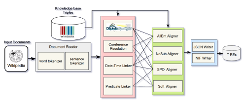
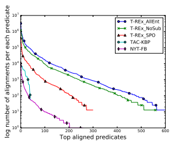

# T-Rex: A Large Scale Alignment Of Natural Language With Knowledge Base Triples

Hady Elsahar∗, Pavlos Vougiouklis†**, Arslen Remaci**∗,
Christophe Gravier∗, Jonathon Hare†, Elena Simperl†**, Frederique Laforest**∗
∗Universite de Lyon, Laboratoire Hubert Curien, Saint- ´ Etienne, France ´
†Electronics and Computer Science, University of Southampton, UK
{hady.elsahar, christophe.gravier, frederique.laforest}@univ-st-etienne.fr arslen.remaci@etu.univ-st-etienne.fr
{pv1e13, jsh2, e.simperl}@ecs.soton.ac.uk

#### Abstract

Alignments between natural language and Knowledge Base (KB) triples are an essential prerequisite for training machine learning approaches employed in a variety of Natural Language Processing problems. These include Relation Extraction, KB Population, Question Answering and Natural Language Generation from KB triples. Available datasets that provide those alignments are plagued by significant shortcomings - they are of limited size, they exhibit a restricted predicate coverage, and/or they are of unreported quality. To alleviate these shortcomings, we present *T-REx*, a dataset of large scale alignments between Wikipedia abstracts and Wikidata triples. T-REx consists of 11 million triples aligned with 3.09 million Wikipedia abstracts (6.2 million sentences). *T-REx* is two orders of magnitude larger than the largest available alignments dataset and covers 2.5 times more predicates. Additionally, we stress the quality of this language resource thanks to an extensive crowdsourcing evaluation. *T-REx* is publicly available at https://w3id.org/t-rex.

Keywords: Knowledge Base Population, Relation Extraction, Distant Supervision, Wikidata

## 1. Introduction

Reducing the gap between Natural Language and structured knowledge bases (KB) has been the concern of many research tasks such as: Relation Extraction [Mintz et al.2009], KB Population [Ji and Grishman2011], KB- driven Natural Language Generation [Lebret et al.2016] and Question Answering [Xu et al.2016]. Models built for these tasks rely on training datasets containing alignments between sentences in free text and KB triples. Previous works [Mintz et al.2009,Yao et al.2011] have created alignments either manually or automatically for the purpose of training and evaluating their models. [Augenstein et al.2016, Martin et al.2016] have pointed out shortcomings of existing alignments language resources, and showed the importance of building a dataset of high quality large scale alignments. Such shortcomings include: 1) their limited size in terms of the number of alignments, 2) their limited coverage as the number of represented predicates is not enough to generalize to larger domains (usually such datasets are very biased towards few predicates), and/or 3) their either low or unreported quality. In this work, we build *T-REx*, a large scale alignment dataset between free text documents and KB triples. T- REx consists of 3.09 million Wikipedia abstracts aligned with 11 million Wikidata triples, covering more than 600 unique Wikidata predicates. T-REx is two orders of magnitude larger than the largest available alignments dataset, and covers 2.5 times more predicates. In this paper, we define the customizable architecture of the alignment pipeline which uses three different automatic alignment techniques. We evaluate the quality of *T-REx* by running a crowdsourcing experiment over 2,600 created alignments. The best automatic alignment technique in *T-REx* achieved an accuracy of 97.8% over the evaluated subset of the dataset.

## 2. Related Work

A considerable body of work has created alignments between free text and KB triples. The *TAC-KBP* dataset [Li et al.2012] is built from news wire and web forums. The dataset is generated as a bi-product of the evaluation process of the TAC KB population competition1, where human annotators evaluate the output of each competing system. The dataset is limited in size as it consists of only 5 classes and 41 predicates. Several works [Mintz et al.2009, Yao et al.2011] have aligned the New York Times corpus with Freebase triples, resulting in several variations of the same dataset, *NYT-FB*. This dataset is prone to bias and coverage issue since the Named Entity linking used for its construction is based on keyword matching against Freebase labels. For example, 30.7% of the alignments are for the sole predicate "/location/country". The *FB15K-237* 2 dataset [Toutanova et al.2015] contains alignments of the Clueweb dataset with Freebase-named entities [Gabrilovich et al.2013] and Freebase triples. The dataset is of relatively large size (2.7 million alignments); however, it lacks the original text from which the alignments are derived - This makes it unsuitable for some applications such as natural language generation. *Google-RE*3is a Google dataset with 60K sentences from Wikipedia, manually aligned with Freebase. Despite its high quality, the dataset is labeled for only five Freebase relations. *WikiReadings* [Hewlett et al.2016] is another dataset containing rough alignments created by replacing each subject of a Wikidata triple by the

1http://bit.ly/tackbpcompetition 2https://www.microsoft.com/en-us/
download/details.aspx?id=52312 3https://code.google.com/archive/p/
relation-extraction-corpus

| Dataset      | Documents / Format   | Unique predicates   | Aligned Triples   | Available   |
|--------------|----------------------|---------------------|-------------------|-------------|
| NYT\-FB      | 1.8M sent.           | 258                 | 39K               | partially   |
| TAC KBP      | 90K sent.            | 41                  | 122K              | closed      |
| Google\-RE   | 60K sent.            | 5                   | 60K               | publicly    |
| FB15K\-237   | 2.7 M patterns       | 237                 | 2.7M              | publicly    |
| Wikireadings | 4.7M articles        | 884                 | n.a.              | publicly    |

Table 1: Statistics over existing alignments from previous work.

whole text of its Wikipedia article. Despite its large size, the dataset does not contain actual alignments between text and KB triples as there is no way to tell whether all the mentioned triples appear in the text, nor, if applicable, their location in the original text. Table 1 lists different alignments along with their size and coverage.

## 3. T-Rex **Creation**

T-REx creation pipeline (Figure 1) contains components for document reading, entity extraction, and dataset exportation into different formats are described at Section 3.1. while triple aligners - key components of the system - are presented in Section (3.2.).

### 3.1. Alignment Pipeline

Document Reader: It gets documents from a dump and outputs in an format readable by all components. Also, it includes sentence and word tokenizers to extract the start and end positions of sentences and words in documents. Entity Extraction: For each document, we extract named entities in the text and link them to their URI with the DBpedia Spotlight [Mendes et al.2011] entity linker. Date and Time Extraction: We use the Stanford temporal tagger SUtime [Chang and Manning2012] to extract temporal expressions and their locations in documents.

We normalize them to the XSD Date and Time Data Type format as expressed in most KB. Predicate Linking: A sentence is more likely to express a KB triple if the label of the predicate forming this triple matches with any sequence of words in that sentence. A predicate linker links a sequence of words in a paragraph to its equivalent KB predicate URI if it matches the predicate label or any of its aliases in the KB. Coreference Resolution: We use the Stanford CoreNLP co-reference resolution component [Manning et al.2014], coupled with a robust heuristic inspired from [Augenstein et al.2016]. We map a list of possible pronouns to each KB entity according to values of specific predicates such as "gender" and "instance of". Then, we link each pronoun in a sentence to its document main entity if they map. Triple Aligners: Triple aligners are the main components of our pipeline: each provided document is aligned with a set of KB triples expressed in the document alongside with their locations. They are described in the next subsection. Document Writers: They export documents with annotation in standard formats. We propose a plain JSON format and NIF 2.0 [Hellmann et al.2013], a RDF/OWL-based standard annotation format for natural language processing.

### 3.2. Triple Aligners

Let txyz = (ex, ey, ez) ⊂ EXPXE be one of all possible triples in a KB where E = {ei*, ...e*n} and P = {pi*, ...p*n} be the sets of all entities and properties represented in the KB respectively. Given a corpus of text documents, each document d contains a set of sentences d = {si*, ..s*n}, a main entity edoc and a set of linked entities Edoc = {Ei*, ...,* En} where Eiis the set of entities linked in sentence si.

Following [Augenstein et al.2016], we explore different methodologies to create those alignments using the distant supervision assumption. Distant supervision creates a set of alignments A between all triples whose subject and object entities are in the set of tagged entities in this sentence, i.e. A = {(si, txyz)| ex ∈ Ei ∧ ez ∈ Ei}.

NoSub Aligner: In practice the subject entity is usually mentioned once at the beginning of the paragraph and is often referred implicitly or using pronouns. These implicit lexicalizations can hardly be detected by entity linkers, and lead to a coverage issue. The NoSub aligner relaxes the distant supervision assumption and assumes that sentences in one paragraph often have the same subject. It extracts a set of alignments A = {(si, txyz)|(ex = edoc ∧ ez ∈ Ei) ∨ (ez = edoc ∧ ex ∈ Ei)}. This relaxation comes at a price: the position of the subject entity in each aligned triple is not known as the aligner assumes it is implicitly mentioned.

AllEnt Aligner: Every pair of entities in a sentence is considered in alignment and mapped to their equivalent KB relations. For implicit mentions of entities, we use co-reference resolution to extract all mentions of the main entity of the paragraph. Given E
0= Ei ∪ E*coref* ithe union of the sets of entities in the sentence through named entity linking and co-reference resolution, AllEnt extracts a set of alignments A = {(si, txyz)|ex ∈ E0∧ ez ∈ E0} .

SPO Aligner: The alignment of every pair of entities as shown in Table 2 Examples 8 & 9 can sometimes be noisy:

Figure 1: Overview of the alignment pipeline and its components

it aligns triples that are not necessarily mentioned in the sentence. For that, the SPO Aligner aligns triples not only when the subject and object of a triple are mentioned in a sentence but also when the predicate of the triples has been extracted. Given Pi ⊂ P the set of predicates tagged in the sentence si using the predicate linker, the SPO Aligner creates a set of alignments A = {(si, txyz)|ex ∈ Ei ∧ py ∈ Pi ∧ ez ∈ Ei}.

## 4. T-Rex **Dataset**

We feed the pipeline with documents from the DBpedia Abstracts dataset [Brummer et al.2016], an open corpus of ¨ annotated Wikipedia texts. We use its English section, containing 4.6M text documents. As a source of triples, we use the Wikidata truthy dump4containing 144M triples. The result of the alignment process is *T-REx*, a large dataset with alignments of KB with free text, provided from the three alignment techniques previously presented.

### 4.1. Size And Coverage

In Table 3, we compare the number of alignments in the T- REx dataset with the largest datasets of the literature NYT-
FB and TAC-KBP. All of the 3 alignment techniques proposed in *T-REx* have reported a substantial larger number of alignments than the two other datasets. The largest number of alignments was achieved by the AllEnt aligner with 11.1M alignments. In terms of coverage, the NoSub Aligner recorded 642 predicates. This makes *T-REx* two orders of magnitude larger than the largest available alignments, representing 2.5 times more predicates. Moreover, having a significant number of examples for each predicate is of the utmost practical interest for training high coverage models, regardless the NLP task at hand. In Figure 2, we illustrate the gap between *T-REx* and prior datasets on the predicate coverage criteria by plotting the distribution of the number of alignments created for each predicate. *T-REx* has substantially more examples than the other datasets, not only for the most common predicates but also for the long tail ones, which is of the utmost practical interest for the NLP practitioner.

Figure 2: Distribution of the number of alignments created for each predicate

### 4.2. Availability And Licensing

T-REx is publicly available under a Creative Commons Attribution-ShareAlike 4.0 International License on the following persistent address https://w3id.org/t-rex and registered at Datahub https://datahub.io/ dataset/t-rex. Its alignment pipeline code is available under the MIT License5.

## 5. Evaluation

In order to evaluate the quality of *T-REx* we have led a crowdsourcing experiment on a subset of the alignments comprised of 2,600 aligned triples distributed over our three alignment techniques from 700 Wikipedia abstracts. In order to make sure that this sample is not biased towards one type of documents or a predicate, we made sure that the randomly selected evaluation sample has the same mean and median values of aligned triples per document and number of words per document, as the whole dataset. We asked contributors6to read each document carefully and annotate each alignment to be true only if the triple is explicitly mentioned in the given document. Each alignment is being annotated at least 5 times. For example, given the sentence

4https://dumps.wikimedia.org/
wikidatawiki/entities/20170503/
5https://github.com/hadyelsahar/
RE-NLG-Dataset 6Instruction page: http://bit.ly/2pBOZpx

| David Bowie was an English singer, who later on [worked as] an actor. He was [born in]  Brixton, London to his [mother] Margaret Mary and his [father] Haywood Stenton.   |    |        |     |
|---------------------------------------------------------------------------------------------------------------------------------------------------------------------------|----|--------|-----|
| # Triples  NoSub                                                                                                                                                          |    | AllEnt | SPO |
| 1) wd:David Bowie wdt:nationality wd:England .                                                                                                                            | x  | x      |     |
| 2) wd:David Bowie wdt:occupation wd:singer .                                                                                                                              | x  | x      |     |
| 3) wd:David Bowie wdt:occupation wd:Actor .                                                                                                                               | x  | x      | x   |
| 4) wd:David Bowie wdt:birthPlace wd:Brixton .                                                                                                                             | x  | x      |     |
| 5) wd:Brixton wdt:region wd:London .                                                                                                                                      |    | x      |     |
| 6) wd:David Bowie is wdt:child of wd:Margaret Mary .                                                                                                                      | x  | x      | x   |
| 7) wd:David Bowie is wdt:child  of wd:Haywood Stenson .                                                                                                                   | x  | x      | x   |
| 8) wd:Margaret Mary wdt:Divorce wd:Haywood Stenson .                                                                                                                      |    | x      |     |
| 9) wd:Margaret Mary wdt:deathPlace wd:London .                                                                                                                            |    | x      |     |

David Bowie was an English singer, who later on [worked as] an actor. He was [born in]

| Annotator     | Documents covered   | Alignments   | Numerical Alignments   | Uniq predicates   |
|---------------|---------------------|--------------|------------------------|-------------------|
| NYT\-FB       | 1.8M                | 39K          | None                   | 258               |
| TAC\-KBP      | 0.09M               | 122K         | n.a.                   | 41                |
| T\-REx SPO    | 0.79M               | 1.2M         | 21K                    | 336               |
| T\-REx NoSub  | 2.85M               | 5.2M         | 561K                   | 642               |
| T\-REx AllEnt | 3.09M               | 11.1M        | 350K                   | 633               |

Table 2: Comparison between different extractions of three alignment schemes for a sample paragraph of two sentences. The detected properties in the paragraph are put between square brackets. Wrong alignments are in italic.

Table 3: Number of alignments in different datasets
"Jonathan Swift was born in Dublin, Ireland", the triple
"Ireland, Capital of, Dublin" should be annotated as False as it is not directly implied from the sentence. To guarantee high quality annotations, we manually annotated 100 documents and used them to filter out spammers and non-qualified contributors. One of each 4 questions given to a contributor contains a test question, contributors who score less than 80% accuracy on these questions were disqualified from the crowdsourcing experiment. Table 4 shows the accuracy of each alignment methodology and its corresponding inter annotator agreement I, calculated through the following formula:

$$I=1-{\frac{\sum_{i=0}^{N}|{\frac{f_{i}}{a_{i}}}-t_{i}|}{N}}$$
N(1)
where ti ∈ {0, 1} is the value of the majority vote for the alignment i, fi ∈ [0, ai] is the number of times the alignment was labeled as True and aiis the number of manual annotators for it. N is the total number of alignments being annotated. The NoSub Aligner has scored the top accuracy scoring 97.8%, compared to 95.7% for the SPO Aligner, let alone that the Nosub Aligner has almost 4 times more extractions. However, the SPO Aligner has the advantage of extracting the positions of the subject, predicate and the object in the text, which makes it more suitable for training extractive models for Relation Extraction and Question Answering [Rajpurkar et al.2016]. Table 5 shows the alignment accuracy of top occurring predicates along side with inter annotator agreement.

|                  | AllEnt   | SPO   | NoSub   |
|------------------|----------|-------|---------|
| Accuracy         | 0.88     | 0.96  | 0.98    |
| Inter\-Annotator | 0.85     | 0.93  | 0.96    |

| Property Label         | AllEnt   | SPO   | NoSub   | Inter ann.   |
|------------------------|----------|-------|---------|--------------|
| located in             | 0.95     | 1.00  | 1.00    | 0.90         |
| member of sports team  | 1.00     | 0.99  | 0.99    | 0.97         |
| date of birth          | 1.00     | 1.00  | 1.00    | 0.97         |
| date of death          | 1.00     | 1.00  | 0.99    | 0.98         |
| country of citizenship | 0.91     | 1.00  | 0.95    | 0.92         |
| educated at            | 0.88     | 0.92  | 1.00    | 0.92         |
| occupation             | 0.90     | 0.94  | 1.00    | 0.93         |
| spouse                 | 0.75     | 0.94  | 1.00    | 0.92         |
| capital                | 0.40     | 1.00  | n.a.    | 0.82         |
| shares border with     | 0.14     | 1.00  | n.a.    | 0.69         |

## 6. Conclusion & Future Work

In this paper, we present *T-REx* a dataset of large scale alignments of Wikipedia Abstracts with KB Facts represented in Wikidata Table 4: Accuracy of each alignment methodology.

$$(1)$$

Table 5: Accuracy of top properties for each annotation methodology in T-REx Triples. *T-REx* consists of three types of alignments made by three automatic alignment hypotheses. T-REx is unmatched in size and in the number of represented predicates. Moreover, although its significant size with respect to its counterparts, T-REx offers a very high quality of its alignments - a crowdsourcing experiment on 2,600 alignments exhibits a 97.8% accuracy with a high interannotator agreement (ranging from 0.854 to 0.962 depending on the triple aligners used in the process). T-REx also provides an extensive evaluation through a crowdsourcing experiment, through which T-REx showed to have high quality alignments reaching 97.8% accuracy. To plan our future work, we handpicked a sample of wrong align-

|    | Alignment                                                              | Cause of error   |
|----|------------------------------------------------------------------------|------------------|
| 1) | He was the son of Ekoji I as well as the younger brother of Serfoji I. | Nested Relations |
|    | (Ekoji I, child(ren), Serfoji I)                                       |                  |
| 2) | Ernst Gustav Kuhnert was born in Tallinn, Estonia                      | Wrong Entailment |
|    | (Tallinn, Capital of, Estonia)                                         |                  |
| 3) | Carolyn Virginia Wood (born December 18, 1945) is an American..        | Entity Linking   |
|    | (Virginia, country, American)                                          |                  |

Table 6: Causes of error in alignments

ments to analyze their main causes. We noticed three main causes of alignment errors: 1) Nested relations errors, where multiple relations in a short sentence share the same entities e.g. Table 6 example 1. This can be alleviated by creating aligners who take into consideration the linguistic structure of the sentence such as dependency paths. 2) Wrong entailment, where the aligners aligns triples that do not imply the sentence, as shown on example 2 in Table 6. This can be alleviated through incorporating implication rules in the alignment process [Demeester et al.2016]. 3) Entity linking errors like in example 3 of Table 6. Alleviating these three main types of errors is the main future directions of T-REx enhancement.

### 7. Bibliographical References

Augenstein, I., Maynard, D., and Ciravegna, F. (2016). Distantly supervised web relation extraction for knowledge base population. *Semantic Web*, 7(4):335–349.

Brummer, M., Dojchinovski, M., and Hellmann, S. (2016). Db- ¨
pedia abstracts: A large-scale, open, multilingual nlp training corpus. In *Proceedings of the Tenth International Conference* on Language Resources and Evaluation (LREC 2016), Paris, France.

Chang, A. X. and Manning, C. (2012). Sutime: A library for recognizing and normalizing time expressions. In Proceedings of the International Conference on Language Resources and Evaluation (LREC'12), Istanbul, Turkey, may.

Demeester, T., Rocktaschel, T., and Riedel, S. (2016). Lifted ¨
rule injection for relation embeddings. In Proceedings of the 2016 Conference on Empirical Methods in Natural Language Processing, EMNLP 2016, Austin, Texas, USA, November 1-4, 2016, pages 1389–1399.

Gabrilovich, E., Ringgaard, M., and Subramanya, A. (2013).

FACC1: Freebase annotation of ClueWeb corpora, Version 1, June.

Hellmann, S., Lehmann, J., Auer, S., and Brummer, M. (2013). ¨
Integrating NLP using linked data. In The Semantic Web - ISWC 2013 - 12th International Semantic Web Conference, Sydney, NSW, Australia, October 21-25, 2013, Proceedings, Part II, pages 98–113.

Hewlett, D., Lacoste, A., Jones, L., Polosukhin, I., Fandrianto, A.,
Han, J., Kelcey, M., and Berthelot, D. (2016). Wikireading: A novel large-scale language understanding task over wikipedia. In Proceedings of the 54th Annual Meeting of the Association for Computational Linguistics, ACL 2016, August 7-12, 2016, Berlin, Germany, Volume 1: Long Papers.

Ji, H. and Grishman, R. (2011). Knowledge Base Population:
Successful Approaches and Challenges. In The 49th Annual Meeting of the Association for Computational Linguistics: Human Language Technologies, Proceedings of the Conference, 19-24 June, 2011, Portland, Oregon, USA, pages 1148–1158.

Lebret, R., Grangier, D., and Auli, M. (2016). Neural text generation from structured data with application to the biography domain. In Proceedings of the 2016 Conference on Empirical Methods in Natural Language Processing, EMNLP 2016, Austin, Texas, USA, November 1-4, 2016, pages 1203–1213.

Li, X., Strassel, S., Ji, H., Griffitt, K., and Ellis, J. (2012). Linguistic resources for entity linking evaluation: from monolingual to cross-lingual. In Nicoletta Calzolari (Conference Chair), et al., editors, Proceedings of the Eight International Conference on Language Resources and Evaluation (LREC'12), Istanbul, Turkey, may. European Language Resources Association (ELRA).

Manning, C. D., Surdeanu, M., Bauer, J., Finkel, J. R., Bethard, S., and McClosky, D. (2014). The stanford corenlp natural language processing toolkit. In *Proceedings of the 52nd Annual* Meeting of the Association for Computational Linguistics, ACL 2014, June 22-27, 2014, Baltimore, MD, USA, System Demonstrations, pages 55–60.

Martin, T., Botschen, F., Nagesh, A., and McCallum, A. (2016).

Call for discussion: Building a new standard dataset for relation extraction tasks. In Proceedings of the 5th Workshop on Automated Knowledge Base Construction, AKBC@NAACL-HLT 2016, San Diego, CA, USA, June 17, 2016, pages 92–96.

Mendes, P. N., Jakob, M., Garc´ıa-Silva, A., and Bizer, C. (2011).

DBpedia Spotlight: Shedding Light on the Web of Documents.

In *Proceedings of the 7th international conference on semantic* systems, pages 1–8. ACM.

Mintz, M., Bills, S., Snow, R., and Jurafsky, D. (2009). Distant supervision for relation extraction without labeled data. In Proc. of ACL 2009, pages 1003–1011.

Rajpurkar, P., Zhang, J., Lopyrev, K., and Liang, P. (2016).

Squad: 100, 000+ questions for machine comprehension of text. In Proceedings of the 2016 Conference on Empirical Methods in Natural Language Processing, EMNLP 2016, Austin, Texas, USA, November 1-4, 2016, pages 2383–2392.

Toutanova, K., Chen, D., Pantel, P., Poon, H., Choudhury, P., and Gamon, M. (2015). Representing text for joint embedding of text and knowledge bases. In Proceedings of the 2015 Conference on Empirical Methods in Natural Language Processing, EMNLP 2015, Lisbon, Portugal, September 17-21, 2015, pages 1499–1509.

Xu, K., Reddy, S., Feng, Y., Huang, S., and Zhao, D. (2016).

Question answering on freebase via relation extraction and textual evidence. In Proceedings of the 54th Annual Meeting of the Association for Computational Linguistics, ACL 2016, August 7-12, 2016, Berlin, Germany, Volume 1: Long Papers.

Yao, L., Haghighi, A., Riedel, S., and McCallum, A. (2011).

Structured relation discovery using generative models. In Proc. of EMNLP 2011.