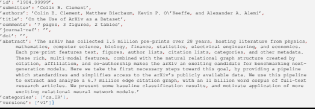
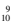
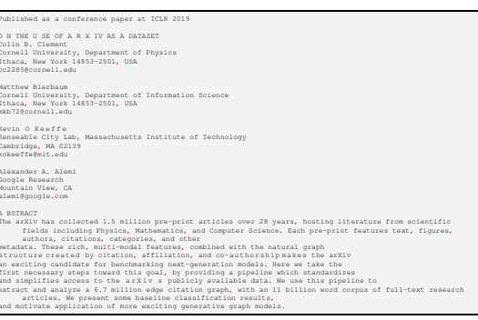

# On The Use Of Arxiv As Adataset

Colin B. Clement Cornell University, Department of Physics Ithaca, New York 14853-2501, USA cc2285@cornell.edu Matthew Bierbaum Cornell University, Department of Information Science Ithaca, New York 14853-2501, USA mkb72@cornell.edu Kevin O'Keeffe Senseable City Lab, Massachusetts Institute of Technology Cambridge, MA 02139 kokeeffe@mit.edu Alexander A. Alemi Google Research Mountain View, CA alemi@google.com

# Abstract

The arXiv has collected 1.5 million pre-print articles over 28 years, hosting literature from scientific fields including Physics, Mathematics, and Computer Science. Each pre-print features text, figures, authors, citations, categories, and other metadata. These rich, multi-modal features, combined with the natural graph structure—created by citation, affiliation, and co-authorship—makes the arXiv an exciting candidate for benchmarking next-generation models. Here we take the first necessary steps toward this goal, by providing a pipeline which standardizes and simplifies access to the arXiv's publicly available data. We use this pipeline to extract and analyze a 6.7 million edge citation graph, with an 11 billion word corpus of full-text research articles. We present some baseline classification results, and motivate application of more exciting generative graph models.

# 1 Introduction

Real world datasets are typically multimodal (comprised of images, text, and time series, etc) and have complex relational structures well captured by a graph. Recently, advances have been made on models which act on graphs, allowing the rich features and relational structures of real-word data to be utilized (Hamilton et al., 2017b;a; Battaglia et al., 2018; Goyal & Ferrara, 2018; Nickel et al., 2016). Many of these advances have been facilitated by the availability of large, benchmark datasets: for example, the ImageNet (Russakovsky et al., 2015) dataset has been widely used as a community standard for image classification. We believe the arXiv can provide a similarly useful benchmark for large scale, multimodal, relational modelling. The arXiv 1is the de-facto online manuscript pre-print service for Computer Science, Mathematics, Physics, and many interdisciplinary communities. Since 1991 the arXiv has offered a place for researchers to reliably share their work as it undergoes the process of peer-review, and for many researchers it is their primary source of literature. With over 1.5 million articles, a large multigraph dataset can be built, including full-text articles, article metadata, and internal co-citations. The arXiv has been used many times as a dataset. Liben-Nowell & Kleinberg (2007) used the topology of the arXiv co-authorship graph to study link prediction. Dempsey et al. (2019) used the authorship graph to test a hierarchically structured network model. Lopuszynski & Bolikowski (2013) used the category labels of arXiv documents to train and assess an automatic text labelling system.

Dai et al. (2015) used a subset of the full text available on the arXiv to study the utility of "paragraph vectors" for capturing document similarity. Alemi & Ginsparg (2015) used the fulltext to evaluate a method for unsupervised text segmentation. Eger et al. (2019) and Liu et al. (2018) built models to predict future research topic trends in machine learning and physics respectively. The arXiv also formed the basis of the popular 2003 KDD Cup (Gehrke et al., 2003), in which researchers competed for the prize of best algorithm for citation prediction, download estimation, and data cleaning 2.

1

1https://arxiv.org 2The data for those challenges are available at **http://www.cs.cornell.edu/projects/kddcup/datasets.html** 
All these works used different subsets of arXiv's data, limiting their potential impact, as future researchers will be unable to directly compare their work to these existing results. The goal of this paper is to improve this situation by providing an open-source pipeline to standardize, simplify, and normalize access to the arXiv's public data, providing a benchmark to facilitate the development of models for multi-modal, relational data.

# 2 Dataset

We built a freely available, open-source pipeline3for collecting arXiv metadata from the Open Archive Initiative (Lagoze & Van de Sompel, 2001), and bulk PDF downloading from the arXiv4.

Further, this pipeline converts the raw PDFs to plaintext, builds the intra-arXiv co-citation network by searching the full-text for arXiv ids, and cleans and normalizes **author** strings.

### 2.1 Metadata

Through its participation in the Open Archives Initiative,5the arXiv makes all article metadata6 available, with updates made shortly after new articles are published7. We provide code for utilizing these public APIs to download a full set of current arXiv metadata. As of 2019-03-01, metadata for 1,506,500 articles was available. For verification and ease of use purposes, we provide a copy of the metadata (less abstracts) on the date we accessed it. An example listing is shown in Figure 1.

Each article includes an arXiv id (e.g. **0704.0001**)
8 used to identify the article, the publicly visible name of the submitter, a list of authors, title, abstract, versions and category listings, as well as optional doi, **journal-ref** and **report-no** fields. Of particular note is the first category listed, the *primary* category, of which there are 171 at this time. Notice that the list of authors is just a single string of author names, potentially joined with commas or 'and's. We've provided a suggested normalization and splitting script for splitting these **authors** strings into a list of author names. Additional fields may be present to denote doi, **journal-ref** and **report-no**, although these are not validated they can potentially be used to find intersections between the arXiv dataset and other scientific literature datasets. Population counts for the optional fields are shown in Table 1.

Figure 1: An example of what the metadata for this very article may look like if it were submitted

 to the arXiv.

3**https://github.com/mattbierbaum/arxiv-public-datasets/releases/tag/v0.2.0**
4**https://arxiv.org/help/bulk_data** 5**http://www.openarchives.org/** 6**https://arxiv.org/help/prep** 7Further details available at **https://arxiv.org/help/oa** 8There are two forms of valid arXiv IDs, delineated by the year 2007, described in https://arxiv.org/help/arxiv_identifier.

| Count   | 1,506,500   | 1,491,303   | 1,229,138   | 810,209   | 608,286      | 154,922    |
|---------|-------------|-------------|-------------|-----------|--------------|------------|
| Field   | id          | submitter   | comments    | doi       | journal\-ref | report\-no |

Table 1: Number of articles with the corresponding field populated. Note that the fields id, abstract, authors, **versions**, and **categories** are always populated.

### 2.2 Full Text

One advantage the arXiv has over other graph datasets is that it provides a very rich attribute at each id node: the full raw text and figures of a research article. To extract the raw text from PDFs, we provide a pipeline with two parts. A helper script downloadsthe full set of PDFs available through the arXiv's bulk download service9. Since arXiv hosts their data in a requester-pay AWS S3 buckets, this constitutes ∼ 1.1 TB and ∼ $100 to fully download. For posterity, we have provided MD5 hashes of the PDFs at the state of the frozen metagraph extraction. Raw TEX source is also available for the subset of articles that provide it. Second, we provide a standard PDF-to-text converter –
powered by **pdftotext**10 - to convert the PDFs to plaintext.

Using this pipeline, it is currently possible to extract a corpus of 1.37 million raw text documents. Figure 2 shows an example of the text extracted from a PDF. Though the extracted text isn't perfectly clean, we believe it will still be useful for many tasks, and hope future contributions to our repository will provide better data cleaning procedures. The extracted raw-text dataset is ∼ 64 GB in size, totaling ∼ 11 billion words. An order of magnitude larger than the common billion word corpus (Chelba et al., 2013), this large size makes the arXiv raw-text a competitive alternative to other full text datasets. Moreover, the technical nature of the arXiv distinguishes it from other full text datasets. For example, the TEX data contained in the arXiv presents an opportunity to study mathematical formulae in bulk, as is done in the NTCIR-11 Task: Math-2 (Aizawa et al., 2014).

24 **A BSTRACT**
2 8 13 18 23

Figure 2: Example text extracted from this PDF.

9**https://arxiv.org/help/bulk_data**
10Version 0.61.1, available on most Debian systems from the apt package **poppler-utils**
Table 2: **Graph statistics for popular citation networks**. All but the data for this work (first row)
were taken from Table 1 and 2 in Subelj et al. (2014). ˇ hki is the average degree, and αin and αout are power law exponents of best fit for the degree distribution. WCC refers to the largest weakly connected components, computed using the python package 'networkx'. The power law exponents αin, αout were found using the python module **powerlaw**. When fitting data to a powerlaw, the package discards all data below an automatically computed threshold xmin. These thresholds for kin and kout were xmin = 73 and xmin = 59 respectively.

| Dataset   | Nnodes      | Nedges      | hki   | αin   | αout   | % WCC   |
|-----------|-------------|-------------|-------|-------|--------|---------|
| arXiv     | 1.35 × 106  | 6.72 × 106  | 9.933 | 2.93  | 3.93   | 62      |
| WoS       | 105  1.40 × | 105  6.4 ×  | 9.11  | 2.39  | 3.88   | 97      |
| CiteSeer  | 105  3.84 × | 106  1.74 × | 9.08  | 2.28  | 3.82   | 95      |
| KDD2003   | 3.34 × 104  | 4.21 × 105  | 24.50 | 2.54  | 3.45   | 99.6    |

### 2.3 Co-Citations

While the arXiv does not currently publicly provide an API to access co-citations, our pipeline allows a simple but large co-citation network to be extracted. We extracted this network by searching the text of each article for valid arXiv ids, thereby finding which nodes should be linked to a given node in the co-citation network. We provide a compressed binary of the resulting network at the repository11, so that researchers can study it directly, and avoid the difficulty of constructing it themselves.

Table 2 summarizes the size and statistical structure of our co-citation network, compared with other popular citation networks. Subelj et al. (2014) also studied data from the arXiv, but as i ˇ ndicated in the bottom row of Table 2, it used only the 34,546 articles from the 2003 KDD Cup challenge. Table 2 reports standard statistics for the co-citation network. Our arXiv co-citation network contains O(106) nodes, an order of magnitude larger than the O(105) nodes in the other citation networks. The exponents of best fit for the degree distributions αin and αout are consistent with the existing citation networks Subelj et al. (2014), as it the the degree ˇ hki. 62% of the nodes are contained in the largest weakly connected component, while 31% of the nodes are fully isolated - meaning their in-degree kin and out-degree kout are zero. Recall that our arXiv co-citation network only contains publications which have been posted on the arXiv; a given paper which cites papers published elsewhere - and not on the arXiv - will have kout = 0 in this set, which is an explanation the large number of isolated nodes. Beyond constructing and analyzing a co-citation network, the arXiv dataset can be used for many tasks, such as relationally powered classification, author attribution, segmentation, clustering, structured prediction, language modeling, link prediction and automatic summary generation. As a basic demonstration, in Table 3 we show some baseline category classification results. These were obtained by training logistic regression on 1.2 million arXiv articles to predict in which category (e.g.

cs.Lg, **stat.ML**) a given article resides. See Appendix A for a detailed explanation of the experimental setup. Titles and abstracts were represented by vectors from a pre-trained instance12 of the Universal Sentence Encoder of Cer et al. (2018). We see that including more aspects of each document (titles, abstracts, fulltext) and exposing their relations via co-citation leads to better predictive power. This is only scratching the surface of possible tasks and models applied to this rich dataset.

# 3 Conclusion

As research moves increasingly towards structured relational modelling (Hamilton et al., 2017b;a; Battaglia et al., 2018), there is a growing need for large-scale, relational datasets with rich annotations. With its authorship, categories, abstracts, co-citations, and full text, the arXiv presents an exciting opportunity to promote progress in relational modelling. We have provided an open-source repository of tools that make it easy to download and standardize the data available from the arXiv. Our preliminary classification baselines support the claim that each mode of the arXiv's feature set

11As part of one of the tagged releases: **https://github.com/mattbierbaum/arxiv-public-datasets/releases**
12From **https://tfhub.dev/google/universal-sentence-encoder/2**
Table 3: Baseline classification performance on a holdout set of 390k articles. Titles and abstracts were embedded in a 512 dimensional subspace using the Universal Sentence Encoder, and trained on 1.2 million articles with logistic regression. 'All' refers to the concatenation of titles, abstract, fulltext, and co-citation features. 'All - X' refers to the ablation of feature X from 'All.' Top n is the classification accuracy testing when the correct class is in the top n most confident predictions. Detailed explanation of the features and methods can be found in Appendix A.

| Features            | Top 1   | Top 3   | Top 5   | Perplexity   |
|---------------------|---------|---------|---------|--------------|
| Titles (T)          | 36.6%   | 59.3%   | 68.8%   | 12.7         |
| Abstracts (A)       | 46.0%   | 70.7%   | 79.5%   | 7.5          |
| Fulltext (F)        | 64.2%   | 79.4%   | 85.9%   | 4.6          |
| Co\-citation (C)    | 37.8%   | 49.4%   | 53.8%   | 18.5         |
| All = T + A + F + C | 78.4%   | 91.4%   | 94.5%   | 2.3          |
| All \- T            | 77.0%   | 90.7%   | 94.0%   | 2.5          |
| All \- A            | 74.7%   | 88.3%   | 91.9%   | 2.8          |
| All \- F            | 59.0%   | 79.8%   | 86.2%   | 4.6          |
| All \- C            | 75.5%   | 89.9%   | 93.6%   | 2.6          |

allows for greatly improved category inference. More sophisticated models that include relational inductive biases—encoding the graph structures of the arXiv—will improve these results. Further, this new benchmark dataset will allow more rapid progress in tasks such as link prediction, automatic summary generation, text segmentation, and time-varying topic modeling of scientific disciplines.

# Acknowledgements

The authors thank the anonymous reviewers for their helpful comments. CBC was funded by NSF grant DMR-1719490. MB thanks the Allen Institute for Artificial Intelligence for funding. KPO thanks the members of the MIT Senseable City Lab consortium for their support.

# References

Akiko Aizawa, Michael Kohlhase, Iadh Ounis, and Moritz Schubotz. Ntcir-11 math-2 task overview.

In *NTCIR*, volume 11, pp. 88–98. Citeseer, 2014.

Alexander A. Alemi and Paul Ginsparg. Text segmentation based on semantic word embeddings.

CoRR, abs/1503.05543, 2015. URL **http://arxiv.org/abs/1503.05543**.

Peter W Battaglia, Jessica B Hamrick, Victor Bapst, Alvaro Sanchez-Gonzalez, Vinicius Zambaldi, Mateusz Malinowski, Andrea Tacchetti, David Raposo, Adam Santoro, Ryan Faulkner, et al. Relational inductive biases, deep learning, and graph networks. *arXiv preprint arXiv:1806.01261*, 2018. URL **https://arxiv.org/abs/1806.01261**.

Daniel Cer, Yinfei Yang, Sheng yi Kong, Nan Hua, Nicole Lyn Untalan Limtiaco, Rhomni St. John, Noah Constant, Mario Guajardo-Cspedes, Steve Yuan, Chris Tar, Yun hsuan Sung, Brian Strope, and Ray Kurzweil. Universal sentence encoder. In *In submission to: EMNLP demonstration*, Brussels, Belgium, 2018. URL **https://arxiv.org/abs/1803.11175**. In submission.

Ciprian Chelba, Tomas Mikolov, Mike Schuster, Qi Ge, Thorsten Brants, Phillipp Koehn, and Tony Robinson. One billion word benchmark for measuring progress in statistical language modeling.

arXiv preprint arXiv:1312.3005, 2013. URL **https://arxiv.org/abs/1312.3005**.

Andrew M. Dai, Christopher Olah, and Quoc V. Le. Document embedding with paragraph vectors.

CoRR, abs/1507.07998, 2015. URL **http://arxiv.org/abs/1507.07998**.

Walter Dempsey, Brandon Oselio, and Alfred Hero. Hierarchical network models for structured exchangeable interaction processes. *arXiv preprint arXiv:1901.09982*, 2019.

Steffen Eger, Chao Li, Florian Netzer, and Iryna Gurevych. Predicting research trends from arxiv.

arXiv preprint arXiv:1903.02831, 2019.

Johannes Gehrke, Paul Ginsparg, and Jon Kleinberg. Overview of the 2003 kdd cup. *ACM SIGKDD*
Explorations Newsletter, 5(2):149–151, 2003.

Palash Goyal and Emilio Ferrara. Graph embedding techniques, applications, and performance: A survey. *Knowledge-Based Systems*, 151:78–94, 2018. URL https://arxiv.org/abs/1705.02801.

Will Hamilton, Zhitao Ying, and Jure Leskovec. Inductive representation learning on large graphs. In *Advances in Neural Information Processing Systems*, pp. 1024–1034, 2017a. URL https://arxiv.org/abs/1706.02216.

William L Hamilton, Rex Ying, and Jure Leskovec. Representation learning on graphs: Methods and applications. 2017b. URL **https://arxiv.org/abs/1709.05584**.

Carl Lagoze and Herbert Van de Sompel. The open archives initiative: Building a low-barrier interoperability framework. In Proceedings of the 1st ACM/IEEE-CS joint conference on Digital libraries, pp. 54–62. ACM, 2001.

David Liben-Nowell and Jon Kleinberg. The link-prediction problem for social networks. Journal of the American society for information science and technology, 58(7):1019–1031, 2007.

Wenyuan Liu, Stanisław Saganowski, Przemysław Kazienko, and Siew Ann Cheong. Using machine learning to predict the evolution of physics research. *arXiv preprint arXiv:1810.12116*, 2018.

Michal Lopuszynski and Lukasz Bolikowski. Tagging scientific publications using wikipedia and natural language processing tools. comparison on the arxiv dataset. *CoRR*, abs/1309.0326, 2013. URL **http://arxiv.org/abs/1309.0326**.

Maximilian Nickel, Kevin Murphy, Volker Tresp, and Evgeniy Gabrilovich. A review of relational machine learning for knowledge graphs. *Proceedings of the IEEE*, 104(1):11–33, 2016. URL https://arxiv.org/abs/1503.00759.

Olga Russakovsky, Jia Deng, Hao Su, Jonathan Krause, Sanjeev Satheesh, Sean Ma, Zhiheng Huang, Andrej Karpathy, Aditya Khosla, Michael Bernstein, Alexander C. Berg, and Li Fei-Fei. ImageNet Large Scale Visual Recognition Challenge. *International Journal of Computer Vision* (IJCV), 115(3):211–252, 2015. doi: 10.1007/s11263-015-0816-y.

Lovro Subelj, Dalibor Fiala, and Marko Bajec. Network-based stat ˇ istical comparison of citation topology of bibliographic databases. *Scientific reports*, 4:6496, 2014.

# A Logistic Regression Article Classification Baseline

ArXiv articles are assigned primary categories (e.g. **cs.AI** is Artifical Intelligene and **cs.CC** is computational complexity) by the article submitter, which is then confirmed by the ArXiv moderation system. This label can be obtained for each article from the OAI metadata described in the main article, and is the first element of a space-delimited string in the **categories** attribute. There are, at the time of writing, L = 175 possible categories. Since more categories can be added in the future and the metadata can be modified, please consult the frozen metadata file in the github repository release13 for these 175 categories. This appendix explains how we developed the article classification baselines using features from the titles, abstracts, full-text, and co-citation network.

The code for performing this task can be found in the git repository14.

### A.1 Building Features

The title, abstract, and full-text of each article is a variable-length string, and each article has both a title and abstract from the OAI metadata, but not all articles have a full-text PDF. In our frozen dataset there are N = 1, 506, 500 articles with metadata, but only 1,357,536 have full-text in the ArXiv. We vectorized each string into 512 dimensions using the pretrained Universal Sentence Encoder,15 substituting zeros for missing full-text.

The intra-ArXiv citation graph can be used via the N × N co-citation matrix, which is defined as

$M_{ij}=\begin{cases}1\text{if article}i\text{cites article}j\text{or vice-versa}\\ 0\text{else.}\end{cases}$
In order to prevent a leaking of the test set into the training set, using the train/test partition defined below, we omitted citations in M from articles in the training set which connect to the test set, but retained citations in the test set which connect to the training set. We can also define the N × L category matrix in the standard one-hot fashion

$$(1)$$
$C_{jl}=\begin{cases}1\text{if article j is in category}l\\ 0\text{else.}\end{cases}$. 
$$(2)^{\frac{1}{2}}$$
0 else.(2)
Then the co-citation feature matrix is the N ×L matrix product MC. Note that this feature uses only nearest-neighbor citation graph relationships. We could include next-nearest neighbor relationships and so on by calculating MC + aM2C + bM3C + **. . .** for some constants a and b. In this paper we only used first order connections via MC as the co-citation feature vectors.

### A.2 Training

Using vector embeddings from titles, abstracts, and full-text, and co-citation features as described above, we fed several combinations of these vectors concatenated in the obvious way into the scikit-learn SGD classifier **sklearn.linear_model.SGDClassifier**. We used the keyword arguments loss='log', tol=1e-6, **max_iter=50**, and **alpha=1e-7** to define the model, which uses 50 epochs, and very small quadratic regularization **alpha** on the weights and biases. With the features and model defined, we performed a train/test split by shuffling the data in place randomly, and selecting the first N**train** = 1, 200, 000 for training. The remaining N**test** = 306, 500 articles were used to evaluate the accuracy of the trained classification, and the model perplexity as reported in table in the main text.

13**https://github.com/mattbierbaum/arxiv-public-datasets/releases** 14**https://github.com/mattbierbaum/arxiv-public-datasets/blob/v0.2.0/analysis/classification.py**
15**https://tfhub.dev/google/universal-sentence-encoder/2**