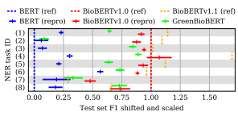
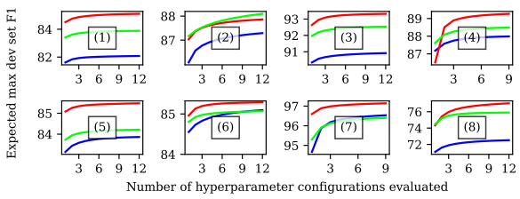

# Inexpensive Domain Adaptation Of Pretrained Language Models: Case Studies On Biomedical Ner And Covid-19 Qa

Nina Poerner∗† and Ulli Waltinger† **and Hinrich Schutze** ¨
∗
∗Center for Information and Language Processing, LMU Munich, Germany
†Corporate Technology Machine Intelligence (MIC-DE), Siemens AG Munich, Germany poerner@cis.uni-muenchen.de | inquiries@cislmu.org

## Abstract

Domain adaptation of Pretrained Language Models (PTLMs) is typically achieved by unsupervised pretraining on target-domain text. While successful, this approach is expensive in terms of hardware, runtime and CO2 emissions. Here, we propose a cheaper alternative: We train Word2Vec on target-domain text and align the resulting word vectors with the wordpiece vectors of a general-domain PTLM. We evaluate on eight English biomedical Named Entity Recognition (NER) tasks and compare against the recently proposed BioBERT model. We cover over 60% of the BioBERT - BERT F1 delta, at 5% of BioBERT's CO2 footprint and 2% of its cloud compute cost. We also show how to quickly adapt an existing generaldomain Question Answering (QA) model to an emerging domain: the Covid-19 pandemic.1

## 1 Introduction

Pretrained Language Models (PTLMs) such as BERT (Devlin et al., 2019) have spearheaded advances on many NLP tasks. Usually, PTLMs are pretrained on unlabeled general-domain and/or mixed-domain text, such as Wikipedia, digital books or the Common Crawl corpus.

When applying PTLMs to specific domains, it can be useful to domain-adapt them. Domain adaptation of PTLMs has typically been achieved by pretraining on target-domain text. One such model is BioBERT (Lee et al., 2020), which was initialized from general-domain BERT and then pretrained on biomedical scientific publications. The domain adaptation is shown to be helpful for target-domain tasks such as biomedical Named Entity Recognition (NER) or Question Answering (QA). On the downside, the computational cost of pretraining can be considerable: BioBERTv1.0 was adapted for ten days on eight large GPUs (see Table 1), which is expensive, environmentally unfriendly, prohibitive for small research labs and students, and may delay prototyping on emerging domains.

We therefore propose a fast, CPU-only domainadaptation method for PTLMs: We train Word2Vec (Mikolov et al., 2013a) on target-domain text and align the resulting word vectors with the wordpiece vectors of an existing general-domain PTLM. The PTLM thus gains domain-specific lexical knowledge in the form of additional word vectors, but its deeper layers remain unchanged. Since Word2Vec and the vector space alignment are efficient models, the process requires a fraction of the resources associated with pretraining the PTLM
itself, and it can be done on CPU.

In Section 4, we use the proposed method to domain-adapt BERT on PubMed+PMC (the data used for BioBERTv1.0) and/or CORD-19 (Covid19 Open Research Dataset). We improve over general-domain BERT on eight out of eight biomedical NER tasks, using a fraction of the compute cost associated with BioBERT. In Section 5, we show how to quickly adapt an existing Question Answering model to text about the Covid-19 pandemic, without any target-domain Language Model pretraining or finetuning.

## 2 Related Work 2.1 The Bert Ptlm

For our purpose, a PTLM consists of three parts:
A tokenizer TLM : L
+ → L
+
LM, a wordpiece embedding lookup function ELM : LLM → R
dLM
and an encoder function FLM. LLM is a limited vocabulary of wordpieces. All words from the natural language L
+ that are not in LLM
are tokenized into sequences of shorter wordpieces, e.g., *dementia* becomes *dem \#\#ent \#\#ia*. Given a sentence S = [w1*, . . . , w*T ], tokenized

1www.github.com/npoe/covid-qa

|                                 | size   | Domain adaptation hardware            | Power(W)   | Time(h)   | CO2(lbs)   | Google Cloud $   |
|---------------------------------|--------|---------------------------------------|------------|-----------|------------|------------------|
| BioBERTv1.0                     | base   | 8 NVIDIA v100 GPUs (32GB)             | 1505       | 240       | 544        | 1421 - 4762      |
| BioBERTv1.1                     | base   | 8 NVIDIA v100 GPUs (32GB)             | 1505       | 552       | 1252       | 3268 - 10952     |
| GreenBioBERT (Section 4)        | base   | 12 Intel Xeon E7\-8857 CPUs, 30GB RAM | 1560       | 12        | 28         | 16 -  76         |
| GreenCovidSQuADBERT (Section 5) | large  | 12 Intel Xeon E7\-8857 CPUs, 40GB RAM | 1560       | 24        | 56         | 32 -  152        |

Table 1: Domain adaptation cost. CO2 emissions are calculated according to Strubell et al. (2019). Since our hardware configuration is not available on Google Cloud, we take an *m1-ultramem-40* instance (40 vCPUs, 961GB
RAM) to estimate an upper bound on our Google Cloud cost.

as TLM(S) = [TLM(w1); *. . .* ; TLM(wT )], ELM embeds every wordpiece in TLM(S) into a real-valued, trainable wordpiece vector. The wordpiece vectors of the entire sequence are stacked and fed into FLM. Note that we consider position and segment embeddings to be a part of FLM rather than ELM.

In the case of BERT, FLM is a Transformer
(Vaswani et al., 2017), followed by a final Feed- Forward Net. During pretraining, the Feed- Forward Net predicts the identity of masked wordpieces. When finetuning on a supervised task, it is usually replaced with a randomly initialized layer.

## 2.2 Domain-Adapted Ptlms

|                      | Acc@1   | Acc@5   | Acc@10   |
|----------------------|---------|---------|----------|
| train (19.8K words)  | 53.6    | 63.5    | 65.7     |
| heldout (2.2K words) | 39.4    | 51.6    | 54.3     |

Domain adaptation of PTLMs is typically achieved by pretraining on unlabeled target-domain text.

Some examples of such models are BioBERT
(Lee et al., 2020), which was pretrained on the PubMed and/or PubMed Central (PMC) corpora, SciBERT (Beltagy et al., 2019), which was pretrained on papers from SemanticScholar, Clinical- BERT (Alsentzer et al., 2019; Huang et al., 2019a) and ClinicalXLNet (Huang et al., 2019b), which were pretrained on clinical patient notes, and AdaptaBERT (Han and Eisenstein, 2019), which was pretrained on Early Modern English text. In most cases, a domain-adapted PTLM is initialized from a general-domain PTLM (e.g., standard BERT), though Beltagy et al. (2019) report better results with a model that was pretrained from scratch with a custom wordpiece vocabulary. In this paper, we focus on BioBERT, as its domain adaptation corpora are publicly available.

Table 2: LW2V → LLM alignment accuracy (%), i.e.,
how often the identical string is in the top-K nearest neighbors.

## 2.3 Word Vectors

Word vectors are distributed representations of words that are trained on unlabeled text. Contrary to PTLMs, word vectors are non-contextual, i.e., a word type is always assigned the same vector, regardless of context. In this paper, we use Word2Vec (Mikolov et al., 2013a) to train word vectors. We will denote the Word2Vec lookup function as EW2V : LW2V → R
dW2V .

## 2.4 Word Vector Space Alignment

Word vector space alignment has most frequently been explored in the context of cross-lingual word embeddings. For instance, Mikolov et al. (2013b) align English and Spanish Word2Vec spaces by a simple linear transformation. Wang et al. (2019) use a related method to align cross-lingual word vectors and multilingual BERT wordpiece vectors.

In this paper, we apply the method to the problem of domain adaptation within the same language.

## 3 Method

In the following, we assume access to a generaldomain PTLM, as described in Section 2.1, and a corpus of unlabeled target-domain text.

## 3.1 Creating New Input Vectors

In a first step, we train Word2Vec on the targetdomain corpus. In a second step, we take the intersection of LLM and LW2V. In practice, the intersection mostly contains wordpieces from LLM
that correspond to standalone words. It also contains single characters and other noise, however, we found that filtering them does not improve alignment quality. In a third step, we use the intersection to fit an unconstrained linear transformation W ∈ R
dLM×dW2V via least squares:

$$\operatorname*{argmin}_{\mathbf{W}}\quad\sum_{x\in\mathbb{L}_{\mathrm{LM}}\cap\mathbb{L}_{\mathrm{W2V}}}\vert\vert\mathbf{W}{\mathcal{E}}_{\mathrm{W2V}}(x)-{\mathcal{E}}_{\mathrm{LM}}(x)\vert\vert_{2}^{2}$$

Intuitively, W makes Word2Vec vectors "look like" the PTLM's native wordpiece vectors, just

|                                 | Query               | NNs of query in ELM[LLM]                                           | NNs of query in WEW2V[LW2V]                                            |
|---------------------------------|---------------------|--------------------------------------------------------------------|------------------------------------------------------------------------|
| query ∈ LW2V ∩ LLM              | surgeon  depression | physician, psychiatrist, surgery  Depression, recession, depressed | surgeon, urologist, neurosurgeon  depression, Depression, hopelessness |
|                                 | surgeon             | surgeon, physician, researcher                                     | neurosurgeon, urologist, radiologist                                   |
|                                 | depression          | depression, anxiety, anxiousness                                   | depressive, insomnia, Depression                                       |
| Boldface: Training vector pairs | fatal               | lethal, deadly, disastrous                                         | fatal, lethal, deadly                                                  |
|                                 | fatal               | fatal, catastrophic, disastrous                                    | lethal, devastating, disastrous                                        |
| query ∈ LW2V − LLM              | ventricular         | cardiac, pulmonary, mitochondrial                                  | atrial, ventricle, RV                                                  |
|                                 | dementia            | diabetes, Alzheimer, autism                                        | VaD, MCI, AD                                                           |
|                                 | suppressants        | medications, medicines, medication                                 | suppressant, prokinetics, painkillers                                  |
|                                 | anesthesiologist    | surgeon, technician, psychiatrist                                  | anesthetist, anaesthesiologist, anaesthetist                           |
|                                 | nephrotoxicity      | toxicity, inflammation, contamination                              | hepatotoxicity, ototoxicity, cardiotoxicity                            |
|                                 | impairment          | inability, disruption, disorders                                   | impairments, deficits, deterioration                                   |

Table 3: Examples of within-space and cross-space nearest neighbors (NNs) by cosine similarity in Green- BioBERT's wordpiece embedding layer. Blue: Original wordpiece space. Green: Aligned Word2Vec space.

like cross-lingual alignment makes word vectors from one language "look like" word vectors from another language. In Table 2, we report word alignment accuracy when we split LLM ∩ LW2V into a training and development set.2In Table 3, we show examples of within-space and cross-space nearest neighbors after alignment.

## 3.2 Updating The Wordpiece Embedding Layer

Next, we redefine the wordpiece embedding layer of the PTLM. The most radical strategy would be to replace the entire layer with the aligned Word2Vec vectors:

$${\hat{\mathcal{E}}}_{\mathrm{LM}}:\mathbb{L}_{\mathrm{W2V}}\to\mathbb{R}^{d_{\mathrm{LM}}}\ ;\ {\hat{\mathcal{E}}}_{\mathrm{LM}}(x)=\mathbf{W}{\mathcal{E}}_{\mathrm{W2V}}(x)$$

In initial experiments, this strategy led to a drop in performance, presumably because function words are not well represented by Word2Vec, and replacing them disrupts BERT's syntactic abilities. To prevent this problem, we leave existing wordpiece vectors intact and only add new ones:

$$\hat{\mathcal{E}}_{\mathrm{LM}}:\mathbb{L}_{\mathrm{LM}}\cup\mathbb{L}_{\mathrm{W2V}}\to\mathbb{R}^{d_{\mathrm{LM}}};$$ $$\mathrm{M}(x)=\begin{cases}\mathcal{E}_{\mathrm{LM}}(x)&\text{if}x\in\mathbb{L}_{\mathrm{LM}}\\ \mathbf{W}\mathcal{E}_{\mathrm{W2V}}(x)&\text{otherwise}\end{cases}\tag{1}$$
$$\mathbf{\mu}_{i}$$

## 3.3 Updating The Tokenizer

In a final step, we update the tokenizer to account for the added words. Let TLM be the standard BERT tokenizer, and let TˆLM be the tokenizer that treats all words in LLM ∪ LW2V as one-wordpiece tokens, while tokenizing any other words as usual.

In practice, a given word may or may not benefit from being tokenized by TˆLM instead of TLM. To give a concrete example, 82% of the words in the BC5CDR NER dataset that end in the suffix -ia are part of a disease entity (e.g., *dementia*). TLM tokenizes this word as *dem \#\#ent \#\#ia*, thereby exposing this strong orthographic cue to the model. As a result, TLM improves recall on -ia diseases. But there are many cases where wordpiece tokenization is meaningless or misleading. For instance euthymia (not a disease) is tokenized by TLM as e
\#\#uth \#\#ym \#\#ia, making it likely to be classified as a disease. By contrast, TˆLM gives *euthymia* a one-wordpiece representation that depends only on distributional semantics. We find that using TˆLM
improves precision on -ia diseases.

To combine these complementary strengths, we use a 50/50 mixture of TLM-tokenization and TˆLM-
tokenization when finetuning the PTLM on a task.

At test time, we use both tokenizers and mean-pool the outputs. Let o(S; T ) be some output of interest
(e.g., a logit), given sentence S tokenized by T . We predict:

$$\hat{o}(S)=\frac{o(S;\mathcal{T}_{\mathrm{LM}})+o(S;\hat{\mathcal{T}}_{\mathrm{LM}})}{2}$$

## 4 Experiment 1: Biomedical Ner

In this section, we use the proposed method to create GreenBioBERT, an inexpensive and environmentally friendly alternative to BioBERT. Recall that BioBERTv1.0 (biobert v1.0 pubmed pmc)
was initialized from general-domain BERT (bertbase-cased) and then pretrained on PubMed+PMC.

## 4.1 Domain Adaptation

We train Word2Vec with vector size dW2V =
dLM = 768 on PubMed+PMC (see Appendix for details). Then, we update the wordpiece embedding layer and tokenizer of general-domain BERT
(*bert-base-cased*) as described in Section 3.

2Since we are not primarily interested in word alignment accuracy, we use the entire intersection as a training set in all other experiments.

|                                       |               | BERT (ref)            | BioBERTv1.0 (ref)     | BioBERTv1.1 (ref)     | GreenBioBERT                            |
|---------------------------------------|---------------|-----------------------|-----------------------|-----------------------|-----------------------------------------|
| Biomedical NER task                   | (NER task ID) | (Lee et al., 2020)    | (Lee et al., 2020)    | (Lee et al., 2020)    | (with standard error of the mean)       |
| BC5CDR\-disease (Li et al., 2016)     | (1)           | 81.97 / 82.48 / 82.41 | 85.86 / 87.27 / 86.56 | 86.47 / 87.84 / 87.15 | 84.88 (.07) / 85.29 (.12) / 85.08 (.08) |
| NCBI\-disease (Dogan et al. ˘ , 2014) | (2)           | 84.12 / 87.19 / 85.63 | 89.04 / 89.69 / 89.36 | 88.22 / 91.25 / 89.71 | 85.49 (.23) / 86.41 (.15) / 85.94 (.16) |
| BC5CDR\-chem (Li et al., 2016)        | (3)           | 90.94 / 91.38 / 91.16 | 93.27 / 93.61 / 93.44 | 93.68 / 93.26 / 93.47 | 93.82 (.11) / 92.35 (.17) / 93.08 (.07) |
| BC4CHEMD (Krallinger et al., 2015)    | (4)           | 91.19 / 88.92 / 90.04 | 92.23 / 90.61 / 91.41 | 92.80 / 91.92 / 92.36 | 92.80 (.04) / 89.78 (.07) / 91.26 (.04) |
| BC2GM (Smith et al., 2008)            | (5)           | 81.17 / 82.42 / 81.79 | 85.16 / 83.65 / 84.40 | 84.32 / 85.12 / 84.72 | 83.34 (.15) / 83.58 (.09) / 83.45 (.10) |
| JNLPBA (Kim et al., 2004)             | (6)           | 69.57 / 81.20 / 74.94 | 72.68 / 83.21 / 77.59 | 72.24 / 83.56 / 77.49 | 71.93 (.12) / 82.58 (.12) / 76.89 (.10) |
| LINNAEUS (Gerner et al., 2010)        | (7)           | 91.17 / 84.30 / 87.60 | 93.84 / 86.11 / 89.81 | 90.77 / 85.83 / 88.24 | 92.50 (.17) / 84.54 (.26) / 88.34 (.18) |
| Species\-800 (Pafilis et al., 2013)   | (8)           | 69.35 / 74.05 / 71.63 | 72.84 / 77.97 / 75.31 | 72.80 / 75.36 / 74.06 | 73.19 (.26) / 75.47 (.33) / 74.31 (.24) |

Table 4: Biomedical NER test set precision / recall / F1 (%). "(ref)": Reference scores from Lee et al. (2020).

Boldface: Best model in row. Underlined: Best model without target-domain LM pretraining.

| NER task ID   | (1)    | (2)    | (3)    | (4)    | (5)    | (6)    | (7)    | (8)    |
|---------------|--------|--------|--------|--------|--------|--------|--------|--------|
| non\-aligned  | \-4.88 | \-3.50 | \-4.13 | \-3.34 | \-2.34 | \-0.56 | \-0.84 | \-4.63 |
| random init   | \-4.33 | \-3.60 | \-3.19 | \-3.19 | \-1.92 | \-0.50 | \-0.84 | \-3.58 |

Figure 1: NER test set F1, transformed as (x −
BERT(ref))/(BioBERTv1.0(ref) − BERT(ref)). This plot shows what portion of the reported BioBERT - BERT F1 delta is covered. "(ref)": Reference scores from Lee et al. (2020). "(repro)": Results of our reproduction experiments. Error bars: Standard error of the mean.

Table 5: Absolute drop in dev set F1 when using nonaligned word vectors or randomly initialized word vectors, instead of aligned word vectors.

## 4.2 Finetuning

We finetune GreenBioBERT on the eight publicly available NER tasks used in Lee et al. (2020). We also do reproduction experiments with generaldomain BERT and BioBERTv1.0, using the same setup as our model. See Appendix for details on preprocessing and hyperparameters. Since some of the datasets are sensitive to the random seed, we report mean and standard error over eight runs.

## 4.3 Results And Discussion

Table 4 shows entity-level precision, recall and F1, as measured by the CoNLL NER scorer. For ease of visualization, Figure 1 shows test set F1 shifted and scaled as

$$f(x)={\frac{x-{\mathrm{BERT}}_{({\mathrm{ref}})}}{{\mathrm{BioBERT}}v1.0_{({\mathrm{ref}})}-{\mathrm{BERT}}_{({\mathrm{ref}})}}}$$

where BERT(ref) and BioBERTv1.0(ref) are reported scores from Lee et al. (2020). In other words, the figure shows what portion of the reported BioBERT - BERT F1 delta is covered by our less expensive GreenBioBERT model. On average, we cover between 61% and 70% of the delta
(61% for BioBERTv1.0, 70% for BioBERTv1.1, and 61% if we take our reproduction experiments as reference points).

## 4.3.1 Ablation Study

To test whether the improvements over generaldomain BERT are due to the aligned Word2Vec vectors, or just to the availability of additional word vectors in general, we perform an ablation study where we replace the aligned vectors with their non-aligned counterparts (by setting W = 1 in Eq.

1) or with randomly initialized vectors. Table 5 shows that dev set F1 drops on all datasets under these circumstances, i.e., vector space alignment seems to be important.

## 5 Experiment 2: Covid-19 Qa

In this section, we use the proposed method to quickly adapt an existing general-domain QA model to an emerging target domain: the Covid-19 pandemic. Our baseline model is SQuADBERT,3 an existing BERT model that was finetuned on the general-domain SQuAD dataset (Rajpurkar et al.,
2016). We evaluate on Deepset-AI Covid-QA
(Moller et al. ¨ , 2020), a SQuAD-style dataset with 2019 annotated span-selection questions about 147 papers from CORD-19 (Covid-19 Open Research Dataset).4 We assume that there is no labeled targetdomain data for finetuning on the task, and instead use the entire Covid-QA dataset as a test set. This is a realistic setup for an emerging domain without annotated training data.

3www.huggingface.co/bert-large-uncasedwhole-word-masking-finetuned-squad 4https://pages.semanticscholar.org/
coronavirus-research

|              | domain adaptation corpus   | size   | EM    | F1    | substr   |
|--------------|----------------------------|--------|-------|-------|----------|
| SQuADBERT    | ——–                        |        | 33.04 | 58.24 | 65.87    |
| GreenCovid\- | CORD\-19 only              | 2GB    | 34.62 | 60.09 | 68.20    |
| SQuADBERT    | CORD\-19+PubMed+PMC 94GB   |        | 34.32 | 60.23 | 68.00    |

Table 6: Results (%) on Deepset-AI Covid-QA. EM (exact answer match) and F1 (token-level F1 score) are evaluated with the SQuAD scorer. "substr": Predictions that are a substring of the gold answer. Much higher than EM, because many gold answers are not minimal answer spans (see Appendix, "Notes on Covid- QA", for an example).

## 5.1 Domain Adaptation

We train Word2Vec with vector size dW2V =
dLM = 1024 on CORD-19 and/or PubMed+PMC. The process takes less than an hour on CORD-
19 and about one day on the combined corpus, again without the need for a GPU. Then, we update SQuADBERT's wordpiece embedding layer and tokenizer, as described in Section 3. We refer to the resulting model as GreenCovidSQuADBERT.

## 5.2 Results And Discussion

Table 6 shows that GreenCovidSQuADBERT outperforms general-domain SQuADBERT on all measures. Interestingly, the small CORD-19 corpus is enough to achieve this result (compare "CORD-19 only" and "CORD-19+PubMed+PMC"), presumably because it is specific to the target domain and contains the Covid-QA context papers.

## 6 Conclusion

As a reaction to the trend towards high-resource models, we have proposed an inexpensive, CPU- only method for domain-adapting Pretrained Language Models: We train Word2Vec vectors on target-domain data and align them with the wordpiece vector space of a general-domain PTLM.

On eight biomedical NER tasks, we cover over 60% of the BioBERT - BERT F1 delta, at 5%
of BioBERT's domain adaptation CO2 footprint and 2% of its cloud compute cost. We have also shown how to rapidly adapt an existing BERT QA model to an emerging domain - the Covid-19 pandemic - without the need for target-domain Language Model pretraining or finetuning.

We hope that our approach will benefit practitioners with limited time or resources, and that it will encourage environmentally friendlier NLP.

## Acknowledgements

This research was funded by Siemens AG. We thank our anonymous reviewers for their helpful comments.

## References

Emily Alsentzer, John Murphy, William Boag, Wei-
Hung Weng, Di Jindi, Tristan Naumann, and Matthew McDermott. 2019. Publicly available clinical BERT embeddings. In 2nd Clinical Natural Language Processing Workshop, pages 72–78, Minneapolis, USA.

Iz Beltagy, Kyle Lo, and Arman Cohan. 2019. SciB-
ERT: A pretrained language model for scientific text. In *EMNLP-IJCNLP*, pages 3606–3611, Hong Kong, China.

Jacob Devlin, Ming-Wei Chang, Kenton Lee, and Kristina Toutanova. 2019. BERT: Pre-training of deep bidirectional transformers for language understanding. In *NAACL-HLT*, pages 4171–4186, Minneapolis, USA.

Jesse Dodge, Suchin Gururangan, Dallas Card, Roy Schwartz, and Noah A Smith. 2019. Show your work: Improved reporting of experimental results.

In *EMNLP-IJCNLP*, pages 2185–2194, Hong Kong, China.

Rezarta Islamaj Dogan, Robert Leaman, and Zhiyong ˘
Lu. 2014. NCBI disease corpus: a resource for disease name recognition and concept normalization.

Journal of biomedical informatics, 47:1–10.

Martin Gerner, Goran Nenadic, and Casey M Bergman.

2010. LINNAEUS: a species name identification system for biomedical literature. BMC bioinformatics, 11(1):85.

Xiaochuang Han and Jacob Eisenstein. 2019. Unsupervised domain adaptation of contextualized embeddings for sequence labeling. In *EMNLP-IJCNLP*, pages 4229–4239, Hong Kong, China.

Kexin Huang, Jaan Altosaar, and Rajesh Ranganath.

2019a. ClinicalBERT: Modeling clinical notes and predicting hospital readmission. arXiv preprint arXiv:1904.05342.

Kexin Huang, Abhishek Singh, Sitong Chen, Edward T Moseley, Chih-ying Deng, Naomi George, and Charlotta Lindvall. 2019b. Clinical XLNet: Modeling sequential clinical notes and predicting prolonged mechanical ventilation. arXiv preprint arXiv:1912.11975.

Jin-Dong Kim, Tomoko Ohta, Yoshimasa Tsuruoka, Yuka Tateisi, and Nigel Collier. 2004. Introduction to the bio-entity recognition task at JNLPBA.

In International Joint Workshop on Natural Language Processing in Biomedicine and its Applications, pages 70–75.

Martin Krallinger, Obdulia Rabal, Florian Leitner, Miguel Vazquez, David Salgado, Zhiyong Lu, Robert Leaman, Yanan Lu, Donghong Ji, Daniel M Lowe, et al. 2015. The CHEMDNER corpus of chemicals and drugs and its annotation principles. Journal of cheminformatics, 7(1):1–17.

Jinhyuk Lee, Wonjin Yoon, Sungdong Kim, Donghyeon Kim, Sunkyu Kim, Chan Ho So, and Jaewoo Kang. 2020. BioBERT: A pretrained biomedical language representation model for biomedical text mining. *Bioinformatics*, 36(4):1234–1240.

Jiao Li, Yueping Sun, Robin J Johnson, Daniela Sciaky, Chih-Hsuan Wei, Robert Leaman, Allan Peter Davis, Carolyn J Mattingly, Thomas C Wiegers, and Zhiyong Lu. 2016. BioCreative V CDR task corpus: a resource for chemical disease relation extraction. Database, 2016.

Ilya Loshchilov and Frank Hutter. 2018. Fixing weight decay regularization in Adam.

Tomas Mikolov, Kai Chen, Greg Corrado, and Jeffrey Dean. 2013a. Efficient estimation of word representations in vector space. arXiv preprint arXiv:1301.3781.

Tomas Mikolov, Quoc V Le, and Ilya Sutskever. 2013b.

Exploiting similarities among languages for machine translation. *arXiv preprint arXiv:1309.4168*.

Timo Moller, Anthony Reina, Raghavan Jayakumar, ¨
and Malte Pietsch. 2020. Covid-qa: A question & answer dataset for covid-19.

Evangelos Pafilis, Sune P Frankild, Lucia Fanini, Sarah Faulwetter, Christina Pavloudi, Aikaterini Vasileiadou, Christos Arvanitidis, and Lars Juhl Jensen. 2013. The SPECIES and ORGANISMS resources for fast and accurate identification of taxonomic names in text. *PloS one*, 8(6).

Pranav Rajpurkar, Jian Zhang, Konstantin Lopyrev, and Percy Liang. 2016. SQuAD: 100,000+ questions for machine comprehension of text. In *EMNLP*, pages 2383–2392, Austin, USA.

Larry Smith, Lorraine K Tanabe, Rie Johnson nee Ando, Cheng-Ju Kuo, I-Fang Chung, Chun-Nan Hsu, Yu-Shi Lin, Roman Klinger, Christoph M Friedrich, Kuzman Ganchev, et al. 2008. Overview of BioCreative II gene mention recognition. Genome biology, 9(2):S2.

Emma Strubell, Ananya Ganesh, and Andrew McCallum. 2019. Energy and policy considerations for deep learning in NLP. In ACL, pages 3645–3650, Florence, Italy.

Ashish Vaswani, Noam Shazeer, Niki Parmar, Jakob Uszkoreit, Llion Jones, Aidan N Gomez, Łukasz Kaiser, and Illia Polosukhin. 2017. Attention is all you need. In *NeurIPS*, pages 5998–6008, Long Beach, USA.

Hai Wang, Dian Yu, Kai Sun, Janshu Chen, and Dong Yu. 2019. Improving pre-trained multilingual models with vocabulary expansion. In *CoNLL*, pages 316–327, Hong Kong, China.

## Inexpensive Domain Adaptation Of Pretrained Language Models (Appendix) Word2Vec Training

We downloaded the PubMed, PMC and CORD-19 corpora from:

- https://ftp.ncbi.nlm.nih.gov/pub/
pmc/oa_bulk/ [20 January 2020, 68GB raw text]
- https://ftp.ncbi.nlm.nih.gov/pubmed/
baseline/ [20 January 2020, 24GB raw text]
- https://pages.semanticscholar.org/
coronavirus-research [17 April 2020, 2GB

raw text]
We extract all abstracts and text bodies and apply the BERT basic tokenizer (a rule-based word tokenizer that standard BERT uses before wordpiece tokenization). Then, we train CBOW Word2Vec5 with negative sampling. We use default parameters except for the vector size (which we set to dW2V = dLM).

## Experiment 1: Biomedical Ner Pretrained Models

General-domain BERT and BioBERTv1.0 were downloaded from:

- www.storage.googleapis.com/bert_
models/2018_10_18/cased_L-12_H-

768_A-12.zip

- www.github.com/naver/biobert-

pretrained

## Data

We downloaded the NER datasets by following instructions on www.github.com/dmis-lab/ biobert\#Datasets. For detailed dataset statistics, see Lee et al. (2020).

## Preprocessing

We use Lee et al. (2020)'s preprocessing strategy: We cut all sentences into chunks of 30 or fewer whitespace-tokenized words (without splitting inside labeled spans). Then, we tokenize every chunk S with T = TLM or T = TˆLM and add special tokens:

$\square$
 $\blacksquare$

## X = [Cls] T (S) [Sep]

Word-initial wordpieces in T (S) are labeled as B(egin), I(nside) or *O(utside)*, while non-wordinitial wordpieces are labeled as *X(ignore)*.

## Modeling, Training And Inference

We follow Lee et al. (2020)'s implementation (www.github.com/dmis-lab/biobert): We add a randomly initialized softmax classifier on top of the last BERT layer to predict the labels. We finetune the entire model to minimize negative log likelihood, with the AdamW optimizer (Loshchilov and Hutter, 2018) and a linear learning rate scheduler (10% warmup). All finetuning runs were done on a GeForce Titan X GPU (12GB).

At inference time, we gather the output logits of word-initial wordpieces only. Since the number of word-initial wordpieces is the same for TLM(S)
and TˆLM(S), this makes mean-pooling the logits straightforward.

## Hyperparameters

We tune the batch size and peak learning rate on the development set (metric: F1), using the same hyperparameter space as Lee et al. (2020):
Batch size: [10, 16, 32, 64]6 Learning rate: [1 · 10−5, 3 · 10−5, 5 · 10−5]
We train for 100 epochs, which is the upper end of the 50–100 range recommended by the original authors. After selecting the best configuration for every task and model (see Table 7), we train the final model on the concatenation of training and development set, as was done by Lee et al. (2020). See Figure 2 for expected maximum development set F1 as a function of the number of evaluated hyperparameter configurations (Dodge et al., 2019).

## Experiment 2: Covid-19 Qa Pretrained Model

We downloaded the SQuADBERT baseline from:
- www.huggingface.co/bert-largeuncased-whole-word-maskingfinetuned-squad

## Data

We downloaded the Deepset-AI Covid-QA dataset from:
- www.github.com/deepset-ai/COVID-
QA/blob/master/data/questionanswering/COVID-QA.json [24 June 2020]

5www.github.com/tmikolov/word2vec 6Since LINNAEUS and BC4CHEM have longer maximum tokenized chunk lengths than the other datasets, our hardware was insufficient to evaluate batch size 64 on them.
At the time of writing, the dataset contains 2019 questions and gold answer spans. Every question is associated with one of 147 research papers (contexts) from CORD-19.7 Since we do not do targetdomain finetuning, we treat the entire dataset as a test set.

## Preprocessing

We tokenize every question-context pair (Q, C)
with T = TLM or T = TˆLM, which yields
(T (Q), T (C)). Since T (C) is usually too long to be digested in a single forward pass, we define a sliding window with width and stride N =
floor( 509−|T (Q)| 2). At step n, the "active" window is between a
(l)
n = (n − 1)N + 1 and a
(r)
n =
min(|C|*, nN*). The input is defined as:

X(n) = [CLS] T (Q) [SEP] T (C)a (l) n −p (l) n :a (r) n +p (r) n[SEP]
p
(l)
n and p
(r)
n are chosen such that |X(n)| = 512, and such that the active window is in the center of the input (if possible).

## Modeling And Inference

Feeding X(n)into the QA model yields start logits h 0(start,n) ∈ R
|X(n)|and end logits h 0(end,n) ∈
R
|X(n)|. We extract and concatenate the slices that correspond to the active windows of all steps:

$$\begin{array}{l}{\mathbf{h}^{(*)}\in\mathbb{R}^{|{\mathcal{T}}(C)|}}\\ {\mathbf{h}^{(*)}=[\mathbf{h}_{a_{1}^{(l)}:a_{1}^{(r)}}^{\prime(*,1)};\,\ldots;\mathbf{h}_{a_{n}^{(l)}:a_{n}^{(r)}}^{\prime(*,n)};\,\ldots]}\end{array}$$

Next, we map the logits from the wordpiece level to the word level. This allows us to mean-pool the outputs of TLM and TˆLM even when |TLM(C)| 6=
|TˆLM(C)|.

Let ci be a word in C and let T (C)j:j+|T (ci)| be the corresponding wordpieces. The start and end logits of ci are:

$$o_{i}^{(*)}=\operatorname*{max}_{j\leq j^{\prime}\leq j+|{\mathcal{T}}(c_{i})|}[h_{j^{\prime}}^{(*)}]$$

Finally, we return the answer span Ck:k 0 that maximizes o
(start)
k + o
(end) k 0 , subject to the constraints that k 0 does not precede k and the answer contains no more than 500 characters. 

## Notes On Covid-Qa

There are some important differences between Covid-QA and SQuAD, which make the task challenging:

- The Covid-QA contexts are full documents rather than single paragraphs. Thus, the correct answer may appear several times, often with slightly different wordings. But only a single occurrence is annotated as correct, e.g.:

Question: What was the prevalence of Coronavirus OC43 in community samples in Ilorin, Nigeria?

Correct: 13.3% (95% CI 6.9-23.6%) \# from main text Predicted: 13.3%, 10/75 *\# from abstract*

- SQuAD gold answers are defined as the
"shortest span in the paragraph that answered the question" (Rajpurkar et al., 2016, p. 4), but many Covid-QA gold answers are longer and contain non-essential context, e.g.:

Question: When was the Middle East Respiratory Syndrome Coronavirus isolated first?

Correct: (MERS-CoV) was first isolated in 2012, in a 60-year-old man who died in Jeddah, KSA due to severe acute pneumonia and multiple organ failure Predicted: 2012 These differences are part of the reason why the exact match score is lower than the word-level F1 score and the substring score (see Table 6, bottom, main paper).

7www.github.com/deepset-ai/COVID-
QA/issues/103

|                     |      | BERT (repro)   |            | BioBERTv1.0 (repro)   |            | GreenBioBERT   |            |
|---------------------|------|----------------|------------|-----------------------|------------|----------------|------------|
| Biomedical NER task | (ID) | hyperparams    | dev set F1 | hyperparams           | dev set F1 | hyperparams    | dev set F1 |
| BC5CDR\-disease     | (1)  | 32, 3 · 10−5   | 82.12      | 10, 1 · 10−5          | 85.15      | 32, 1 · 10−5   | 83.90      |
| NCBI\-disease       | (2)  | 32, 3 · 10−5   | 87.52      | 32, 1 · 10−5          | 87.99      | 10, 3 · 10−5   | 88.43      |
| BC5CDR\-chem        | (3)  | 64, 3 · 10−5   | 91.00      | 32, 1 · 10−5          | 93.36      | 10, 1 · 10−5   | 92.59      |
| BC4CHEMD            | (4)  | 16, 1 · 10−5   | 88.02      | 32, 1 · 10−5          | 89.35      | 16, 1 · 10−5   | 88.53      |
| BC2GM               | (5)  | 32, 1 · 10−5   | 83.91      | 64, 3 · 10−5          | 85.54      | 64, 3 · 10−5   | 84.25      |
| JNLPBA              | (6)  | 32, 5 · 10−5   | 85.18      | 32, 5 · 10−5          | 85.30      | 10, 3 · 10−5   | 85.10      |
| LINNAEUS            | (7)  | 16, 1 · 10−5   | 96.67      | 32, 1 · 10−5          | 97.22      | 10, 1 · 10−5   | 96.49      |
| Species\-800        | (8)  | 32, 1 · 10−5   | 72.70      | 32, 1 · 10−5          | 77.34      | 16, 1 · 10−5   | 75.93      |

Table 7: Best hyperparameters (batch size, peak learning rate) and best dev set F1 per NER task and model. BERT (repro) and BioBERTv1.0 (repro) refer to our reproduction experiments.

BERT (repro) BioBERTv1.0 (repro) GreenBioBERT
Figure 2: Expected maximum F1 on NER development sets as a function of the number of evaluated hyperparameter configurations. Numbers in brackets are NER task IDs (see Table 7).
