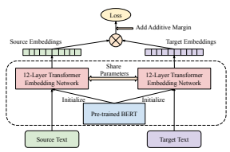
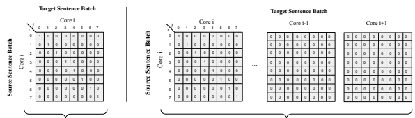
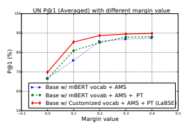
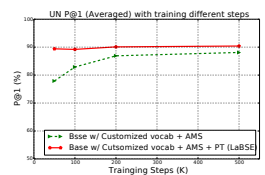
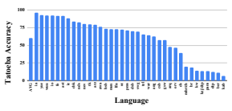
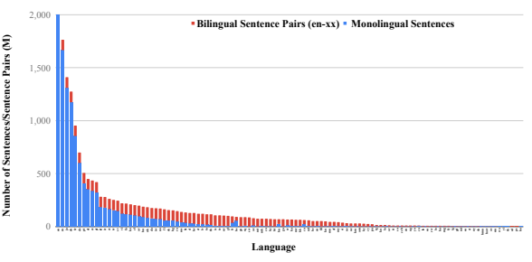

# Language-Agnostic Bert Sentence Embedding

Fangxiaoyu Feng∗
, Yinfei Yang∗†
, Daniel Cer, Naveen Arivazhagan, Wei Wang†
Google AI
Mountain View
{fangxiaoyu, cer, navari}@google.com {yangyin7, wei.wang.world}@gmail.com

## Abstract

While BERT is an effective method for learning monolingual sentence embeddings for semantic similarity and embedding based transfer learning (Reimers and Gurevych, 2019), BERT based cross-lingual sentence embeddings have yet to be explored. We systematically investigate methods for learning multilingual sentence embeddings by combining the best methods for learning monolingual and cross-lingual representations including: masked language modeling (MLM), translation language modeling (TLM) (Conneau and Lample, 2019), dual encoder translation ranking (Guo et al., 2018), and additive margin softmax (Yang et al., 2019a). We show that introducing a pre-trained multilingual language model dramatically reduces the amount of parallel training data required to achieve good performance by 80%. Composing the best of these methods produces a model that achieves 83.7% bi-text retrieval accuracy over 112 languages on Tatoeba, well above the 65.5% achieved by Artetxe and Schwenk (2019b), while still performing competitively on monolingual transfer learning benchmarks (Conneau and Kiela, 2018). Parallel data mined from CommonCrawl using our best model is shown to train competitive NMT models for en-zh and en-de. We publicly release our best multilingual sentence embedding model for 109+ languages at https://tfhub.dev/
google/LaBSE.

## 1 Introduction

In this paper, we systematically explore using pretraining language models in combination with the best of existing methods for learning cross-lingual sentence embeddings. Such embeddings are useful for clustering, retrieval, and modular use of text representations for downstream tasks. While

Figure 1: Dual encoder model with BERT based encoding modules.

existing cross-lingual sentence embedding models incorporate large transformer models, using large pretrained language models is not well explored. Rather in prior work, encoders are trained directly on translation pairs (Artetxe and Schwenk, 2019b; Guo et al., 2018; Yang et al., 2019a), or on translation pairs combined with monolingual inputresponse prediction (Chidambaram et al., 2019; Yang et al., 2019b).

In our exploration, as illustrated in figure 1, we make use of dual-encoder models, which have been demonstrated as an effective approach for learning bilingual sentence embeddings (Guo et al., 2018; Yang et al., 2019a). However, diverging from prior work, rather than training encoders from scratch, we investigate using pre-trained encoders based on large language models. We contrast models with and without additive margin softmax (Yang et al., 2019a)
1. Figure 2 illustrates where our work stands (shaded) in the field of LM pre-training and sentence embedding learning.

Our massively multilingual models outperform the previous state-of-the-art on large bi-text retrieval tasks including the United Nations (UN)

∗Equal contributions. †Work done while at Google.

1We also investigate the impact of mining hard negatives (Guo et al., 2018), but found it doesn't provide additional gain on top of other approaches. See supplemental material for details.

Pre-training Sentence Emebedding Monolingual MLM USE & InferSent

Bilingual

TLMYang et. al. (2019a)

Cross-lingual

Multilingual m-USE & LASER
Figure 2: Where our work stands (shaded) vs. related work in LM pre-training and sentence embedding learn-

ing.

| Model               | Langs   | Model   | HN   | AMS   | Pre\-train   |
|---------------------|---------|---------|------|-------|--------------|
| LASER               | 97      | seq2seq | N/A  | N/A   | N            |
| Yang et al. (2019a) | 2       | DE      | Y    | Y     | N            |
| m\-USE              | 16      | DE      | Y    | Y     | N            |
| LaBSE               | 109     | DE      | N    | Y     | Y            |

Table 1: LaBSE model compared to other recent crosslingual embedding models. **[DE]**: Dual Encoder. **[HN]**: Hard Negative. **[AMS]**: Additive Margin Softmax. [PT]: Pre-training.

corpus (Ziemski et al., 2016) and BUCC (Zweigenbaum et al., 2018). Table 1 compares our best model with other recent multilingual work.

Both the UN corpus and BUCC cover resource rich languages (fr, de, es, ru, and zh). We further evaluate our models on the Tatoeba retrieval task (Artetxe and Schwenk, 2019b) that covers 112 languages. Compare to LASER (Artetxe and Schwenk, 2019b), our models perform significantly better on low-resource languages, boosting the overall accuracy on 112 languages to 83.7%, from the 65.5% achieved by the previous state-of-art.

Surprisingly, we observe our models performs well on 30+ Tatoeba languages for which we have no explicit monolingual or bilingual training data. Finally, our embeddings perform competitively on the SentEval sentence embedding transfer learning benchmark (Conneau and Kiela, 2018).

The contributions of this paper are:

- A novel combination of pre-training and dualencoder finetuning to boost translation ranking performance, achieving a new state-of-theart on bi-text mining.

- A publicly released multilingual sentence embedding model *spanning 109+ languages*.

- Thorough experiments and ablation studies to understand the impact of pre-training, negative sampling strategies, vocabulary choice, data quality, and data quantity.

We release the pre-trained model at https://
tfhub.dev/google/LaBSE.

## 2 Cross-Lingual Sentence Embeddings

Dual encoder models are an effective approach for learning cross-lingual embeddings (Guo et al., 2018; Yang et al., 2019a). Such models consist of paired encoding models that feed a scoring function. The source and target sentences are encoded separately. Sentence embeddings are extracted from each encoder. Cross-lingual embeddings are trained using a translation ranking task with inbatch negative sampling:

$${\mathcal{L}}=-\frac{1}{N}{\sum_{i=1}^{N}}\log\frac{e^{\phi(x_{i},y_{i})}}{e^{\phi(x_{i},y_{i})}+{\sum_{n=1,n\neq i}^{N}}e^{\phi(x_{i},y_{n})}}\tag{1}$$

The embedding space similarity of x and y is given by φ(*x, y*), typically φ(x, y) = xyT. The loss attempts to rank yi, the true translation of xi, over all N−1 alternatives in the same batch. Notice that L is asymmetric and depends on whether the softmax is over the source or the target sentences. For bidirectional symmetry, the final loss can sum the source-to-target, L, and target-to-source, L
0, losses (Yang et al., 2019a):

$$\bar{\mathcal{L}}=\mathcal{L}+\mathcal{L}^{\prime}$$
$$(2)^{\frac{1}{2}}$$
0(2)
Dual encoder models trained using a translation ranking loss directly maximize the similarity of translation pairs in a shared embedding space.

### 2.1 Additive Margin Softmax

Additive margin softmax extends the scoring function φ by introducing margin m around positive pairs (Yang et al., 2019a):

$$\phi^{\prime}(x_{i},y_{j})={\begin{cases}\phi(x_{i},y_{j})-m&{\quad{\mathrm{if~}}i=j}\\ \phi(x_{i},y_{j})&{\quad{\mathrm{if~}}i\neq j}\end{cases}}\tag{3}$$

The margin, m, improves the separation between translations and nearby non-translations. Using φ 0(xi, yj ) with the bidirectional loss L¯s, we obtain the additive margin loss

$$\mathcal{L}=-\frac{1}{N}\sum_{i=1}^{N}\frac{e^{\phi(x_{i},y_{i})-m}}{e^{\phi(x_{i},y_{i})-m}+\sum_{n=1,n\neq i}^{N}e^{\phi(x_{i},y_{n})}}\tag{4}$$

### 2.2 Mlm And Tlm Pre-Training

Only limited prior work has combined dual encoders trained with a translation ranking loss with encoders initialized using large pre-trained language models (Yang et al., 2021). We contrast using a randomly initialized transformer, as was done in prior work (Guo et al., 2018; Yang et al., 2019a), with using a large pre-trained language model. For pre-training, we combined Masked language modeling (MLM) (Devlin et al., 2019) and Translation language modeling (TLM) (Conneau and Lample, 2019). MLM is a variant of a cloze task, whereby a model uses context words surrounding a [MASK] token to try to predict what the [MASK] word should be. TLM extends this to the multilingual setting by modifying MLM training to include concatenated translation pairs.

Multilingual pre-trained models such as mBERT (Devlin et al., 2019), XLM (Conneau and Lample, 2019) and XLM-R (Conneau et al., 2019) have led to exceptional gains across a variety of cross-lingual natural language processing tasks (Hu et al., 2020). However, without a sentence level objective, they do not directly produce good sentence embeddings. As shown in Hu et al. (2020), the performance of such models on bitext retrieval tasks is very weak, e.g XLM-R Large gets 57.3% accuracy on a selected 37 languages2 from the Tatoeba dataset compared to 84.4% using LASER (see performance of more models in table 5). We contribute a detailed exploration that uses pre-trained language models to produce useful multilingual sentence embeddings.

## 3 Corpus And Training Details

### 3.1 Corpus

We use bilingual translation pairs and monolingual data in our experiments3.

Monolingual Data We collect monolingual data from CommonCrawl4and Wikipedia5. We use the 2019-35 version of CommonCrawl with heuristics from Raffel et al. (2019) to remove noisy text. Additionally, we remove short lines < 10 characters and those > 5000 characters.6 The wiki data is extracted from the 05-21-2020 dump using WikiExtractor7. An in-house tool splits the text into sentences. The sentences are filtered using a sentence quality classifier.8 After filtering, we obtain 17B monolingual sentences, about 50% of the unfiltered version. The monolingual data is only used in customized pre-training. Bilingual Translation Pairs The translation corpus is constructed from web pages using a bitext mining system similar to the approach described in Uszkoreit et al. (2010). The extracted sentence pairs are filtered by a pre-trained contrastivedata-selection (CDS) scoring model (Wang et al., 2018). Human annotators manually evaluate sentence pairs from a small subset of the harvested pairs and mark the pairs as either GOOD or BAD translations. The data-selection scoring model threshold is chosen such that 80% of the retained pairs from the manual evaluation are rated as GOOD. We further limit the maximum number of sentence pairs to 100 million for each language to balance the data distribution. Many languages still have far fewer than 100M sentences. The final corpus contains 6B translation pairs.9 The translation corpus is used for both dual encoder training and customized pre-training.

### 3.2 Configurations

In this section, we describe the training details for the dual encoder model. A transformer encoder is used in all experiments (Vaswani et al., 2017). We train two versions of the model, one uses the public BERT multilingual cased vocab with vocab size 119,547 and a second incorporates a customized vocab extracted over our training data. For the customized vocab, we employ a wordpiece tokenizer (Sennrich et al., 2016), with a cased vocabulary extracted from the training set using TF Text.10 The language smoothing exponent for the vocab generation tool is set to 0.3 to counter imbalances in the amount of data available per language. The final vocabulary size is 501,153.

The encoder architecture follows the BERT Base model, with 12 transformer blocks, 12 attention

2The number is counted from official evaluation script despite the original paper says 33 languages.

3See the detailed list of supported languages in supplemental material.

4https://commoncrawl.org/ 5https://www.wikipedia.org/ 6Long lines are usually JavaScript or attempts at SEO.

7https://github.com/attardi/
wikiextractor 8The quality classifier is trained using sentences from the main content of webpages as positives and text from other areas as negatives.

9Experiments in later sections show that even 200M pairs across all languages is sufficient.

10https://github.com/tensorflow/text

...

In-batch Negative Sampling **Cross-Accelerator Negative Sampling**
Figure 3: Negative sampling example in a dual encoder framework. **[Left]**: The in-batch negative sampling in a single core; **[Right]**: *Synchronized multi-accelerator negative sampling* using n TPU cores and batch size 8 per core with examples from other cores are all treated as negatives.

heads and 768 per-position hidden units. The encoder parameters are shared for all languages. Sentence embeddings are extracted as the l2 normalized [CLS] token representations from the last transformer block.11 Our models are trained on Cloud TPU V3 with 32-cores using a global batch size of 4096 with a max sequence length of 128, using the AdamW (Loshchilov and Hutter, 2019) optimizer with initial learning rate 1e-3, and linear weight decay. We train for 50k steps for models with pre-training, and 500k steps for models without pre-training. We observe that even further training did not change the performance significantly. The default margin value for additive margin softmax is set to 0.3. Hyperparameters are tuned on a held-out development set.

### 3.3 Cross-Accelerator Negative Sampling

Cross-lingual embedding models trained with inbatch negative samples benefit from large training batch sizes (Guo et al., 2018). Resource intensive models like BERT, are limited to small batch sizes due to memory constraints. While data-parallelism does allow us to increase the global batch size by using multiple accelerators, the batch-size on an individual cores remains small. For example, a 4096 batch run across 32 cores results in a local batch size of 128, with each example then only receiving 127 negatives.

We introduce cross-accelerator negative sampling, which is illustrated in figure 3.

12 Under this strategy each core encodes its assigned sentences and then the encoded sentence representations from all cores are broadcast as negatives to the other cores. This allows us to fully realize the benefits of larger batch sizes while still distributing the computationally intensive encoding work across multiple cores.

Note the dot-product scoring function makes it efficient to compute the pairwise scores in the same batch with matrix multiplication. In figure 3, the value in the grids indicates the ground truth labels, with all positive labels located in diagonal grids. A
softmax function is applied on each row.

### 3.4 Pre-Training

The encoder is pre-trained with Masked Language Model (MLM) (Devlin et al., 2019) and Translation Language Model (TLM) (Conneau and Lample, 2019)
13 training on the monolingual data and bilingual translation pairs, respectively. For an L layer transformer encoder, we train using a 3 stage progressive stacking algorithm (Gong et al., 2019),
where we first learn a L
4 layers model and then L
2 layers and finally all L layers. The parameters of the models learned in the earlier stages are copied to the models for the subsequent stages.

Pre-training uses TPUv3 with 512-cores and a batch size of 8192. The max sequence length is set to 512 and 20% of tokens (or 80 tokens at most) per sequence are masked for MLM and TLM predictions. For the three stages of progressive stacking,

11During training, the sentence embeddings after normalization are multiplied by a scaling factor. Following Chidambaram et al. (2018), we set the scaling factor to 10. We observe that the scaling factor is important for training a dual encoder model with the normalized embeddings.

12While our experiments use TPU accelerators, the same strategy can also be applied to models trained on GPU.

13Diverging from Conneau and Lample (2019), we do not provide a language hint to encourage multilinguality.
we respectively train for 400k, 800k, and 1.8M
steps using all monolingual and bilingual data.

## 4 Evaluation Tasks

### 4.1 Bitext Retrieval

We evaluate models on three bitext retrieval tasks:
United Nations (UN), Tatoeba, and BUCC. All tasks are to retrieve the correct English translation for each non-English sentence. United Nations (UN) contains 86,000 sentence aligned bilingual documents over five language pairs: en-fr, en-es, en-ru, en-ar and en-zh (Ziemski et al., 2016). A total of 11.3 million14 aligned sentence pairs can be extract from the document pairs. The large pool of translation candidates makes this data set particularly challenging. Tatoeba evaluates translation retrieval over 112 languages (Artetxe and Schwenk, 2019b). The dataset contains up to 1,000 sentences per language along with their English translations. We evaluate performance on the original version covering all 112 languages, and also the 36 languages version from the XTREME benchmark (Hu et al., 2020). BUCC is a parallel sentence mining shared task (Zweigenbaum et al., 2018). We use the 2018 shared task data, containing four language pairs: fren, de-en, ru-en and zh-en. For each pair, the task provides monolingual corpora and gold true translation pairs. The task is to extract translation pairs from the monolingual data, which are evaluated against the ground truth using F1. Since the ground truth for the BUCC test data is not released, we follow prior work using the BUCC training set for evaluation rather than training (Yang et al., 2019b; Hu et al., 2020). Sentence embedding cosine similarity is used to identify the translation pairs.15

### 4.2 Downstream Classification

We also evaluate the transfer performance of multilingual sentence embeddings on downstream classification tasks from the SentEval benchmark (Conneau and Kiela, 2018). We evaluate on select tasks from SentEval including: (MR) movie reviews (Pang and Lee, 2005)), (SST) sentiment analysis (Socher et al., 2013), (**TREC**) questiontype (Voorhees and Tice, 2000), (CR) product reviews (Hu and Liu, 2004), (**SUBJ**) subjectivity/objectivity (Pang and Lee, 2004), (**MPQA**) opinion polarity (Wiebe et al., 2005), and (**MRPC**) paraphrasing detection (Dolan et al., 2004). While SentEval is English only, we make use of this benchmark in order to directly compare to prior work on sentence embedding models.

## 5 Results

Table 2 shows the performance on the UN and Tatoeba bitext retrieval tasks and compares against the prior state-of-the-art bilingual models Yang et al. (2019a), LASER (Artetxe and Schwenk, 2019b), and the multilingual universal sentence encoder (m-USE) (Yang et al., 2019b)
16. Row 1-3 show the performance of baseline models, as reported in the original papers.

Row 4-7 shows the performance of models that use the public mBERT vocabulary. The baseline model shows reasonable performance on UN ranging from 57%-71% P@1. It also perform well on Tatoeba with 92.8% and 79.1% accuracy for the 36 language group and all languages, respectively.

Adding pre-training both helps models converge faster (see details in section 6.2) and improves performance on the UN retrieval using both vocabularies. Pre-training also helps on Taoeba, but only using the customized vocabulary.17 Additive margin softmax significantly improves the performance on all model variations.

The last two rows contain two models using the customized vocab. Both of them are trained with additive margin softmax given the strong evidence from the experiments above. Both models outperform the mBERT vocabulary based models, and the model with pre-training performs best of all.

The top model (Base w/ Customized Vocab + AMS
+ PT) achieves a new state-of-the-art on 3 of the 4 languages, with P@1 91.1, 88.3, 90.8 for en-es, en-fr, en-ru respectively. It reaches 87.7 on zh-en, only 0.2 lower than the best bilingual en-zh model and nearly 9 points better than the previous best multilingual model. On Tatoeba, the best model also outperform the baseline model by a large margin, with +10.6 accuracy on the 36 language group

14About 9.5 million after de-duping.

15Reranking models can further improve performance (e.g.

margin based scorer (Artetxe and Schwenk, 2019a) and BERT based classifier (Yang et al., 2019a)). However, this ss tangential to assessing the raw embedding retrieval performance.

16universal-sentence-encoder-multilingual-large/3 17The coverage of the public mBERT vocabulary on the tail languages are bad with many [UNK] tokens in those languages, e.g. the [UNK] token rate is 71% for language si, which could be reason the pre-training doesn't help on the tatoeba task.

| Model                              |      |      | UN (en → xx)   |      |      | Taoeba (xx → en)   |           |
|------------------------------------|------|------|----------------|------|------|--------------------|-----------|
|                                    | es   | fr   | ru             | zh   | avg  | 36 Langs           | All Langs |
| LASER (Artetxe and Schwenk, 2019b) | -    | -    | -              | -    | -    | 84.4               | 65.5      |
| m\-USE (Yang et al., 2019b)        | 86.1 | 83.3 | 88.9           | 78.8 | 84.3 | -                  | -         |
| Yang et al. (2019a)                | 89.0 | 86.1 | 89.2           | 87.9 | 88.1 | -                  | -         |
| Base w/ mBERT Vocab                | 67.7 | 57.0 | 70.2           | 71.9 | 66.7 | 92.8               | 79.1      |
| + PT                               | 68.5 | 59.8 | 65.8           | 71.7 | 66,5 | 92.7               | 78.6      |
| + AMS                              | 88.2 | 84.5 | 88.6           | 86.4 | 86.9 | 93.7               | 81.2      |
| + AMS + PT                         | 89.3 | 85.7 | 89.3           | 87.2 | 87.9 | 93.2               | 78.4      |
| Base w/ Customized Vocab           |      |      |                |      |      |                    |           |
| + AMS                              | 90.6 | 86.5 | 89.5           | 86.8 | 88.4 | 94.8               | 82.6      |
| + AMS + PT (LaBSE)                 | 91.1 | 88.3 | 90.8           | 87.7 | 89.5 | 95.0               | 83.7      |

Table 2: UN (P@1) and Taoteba (Average accuracy) performance for different model configurations. **Base** uses a bidirectional dual encoder model. **[AMS]**: Additive Margin Softmax. **[PT]**: Pre-training.

from XTREME and +18.2 on all languages.

It is worth noting that all our models perform similarly on Tatoeba but not on UN. This suggests it is necessary to evaluate on large scale bitext retrieval tasks to better discern differences between competing models. In the rest of the paper we refer to **LaBSE** as the best performing model here Base w/ Customized Vocab + AMS + PT, unless otherwise specified.

Table 3 provides LaBSE's retrieval performance on BUCC, comparing against strong baselines from Artetxe and Schwenk (2019a) and Yang et al.

(2019a). Following prior work, we perform both forward and backward retrieval. Forward retrieval treats en as the target and the other language as the source, and backward retrieval is vice versa. LaBSE not only systematically outperforms prior work but also covers all languages within a single model. The previous state-of-the-art required four separate bilingual models (Yang et al., 2019a).

### 5.1 Results On Downstream Classification Tasks

Table 4 gives the transfer performance achieved by LaBSE on the SentEval benchmark (Conneau and Kiela, 2018), comparing against other state-of-theart sentence embedding models. Despite its massive language coverage in a single model, LaBSE still obtains competitive transfer performance with monolingual English embedding models and the 16 language m-USE model.

## 6 Analysis

### 6.1 Additive Margin Softmax

The above experiments show that additive margin softmax is a critical factor in learning good crosslingual embeddings, which is aligned with the findings from Yang et al. (2019a). We further investi-

Figure 4: Average P@1 (%) on UN retrieval task of models trained with different margin values.

gate the effect of margin size on our three model variations, as shown in figure 4. The model with an additive margin value 0 performs poorly on the UN task with ∼60 average P@1 across all three model variations. With a small margin value of 0.1, the model improves significantly compare to no margin with 70s to 80s average P@1. Increasing the margin value keeps improving performance until it reaches 0.3. The trend is consistent on all models.

### 6.2 Effectiveness Of Pre-Training

To better understand the effective of MLM/TLM
pre-training in the final LaBSE model, we explore training a variant of this model using our customized vocab but without pre-training. The results are shown in figure 5. We experiment with varying the number of training steps for both models, including: 50k, 100K, 200K, and 500K steps. A model with pre-trained encoders already achieves the highest performance when trained 50K steps, further training doesn't increase the performance significantly. However, the model without pretraining performs poorly when only trained 50k steps. Its performance increases with additional steps and approaches the model with pre-training at 500k steps. The overall performance is, how-

|       | Models                       |      | fr\-en   |      |      | de\-en   |      |      | ru\-en   |      |      | zh\-en   |      |
|-------|------------------------------|------|----------|------|------|----------|------|------|----------|------|------|----------|------|
|       |                              | P    | R        | F    | P    | R        | F    | P    | R        | F    | P    | R        | F    |
| rward | Artetxe and Schwenk (2019a)  | 82.1 | 74.2     | 78.0 | 78.9 | 75.1     | 77.0 | \-   | \-       | \-   | \-   | \-       | \-   |
|       | Yang et al.  (2019a)         | 86.7 | 85.6     | 86.1 | 90.3 | 88.0     | 89.2 | 84.6 | 91.1     | 87.7 | 86.7 | 90.9     | 88.8 |
| Fo    | LaBSE                        | 86.6 | 90.9     | 88.7 | 92.3 | 92.7     | 92.5 | 86.1 | 91.9     | 88.9 | 88.2 | 89.7     | 88.9 |
|       | Artetxe and Schwenk  (2019a) | 77.2 | 72.7     | 74.7 | 79.0 | 73.1     | 75.9 | \-   | \-       | \-   | \-   | \-       | \-   |
| kward | Yang et al. (2019a)          | 83.8 | 85.5     | 84.6 | 89.3 | 87.7     | 88.5 | 83.6 | 90.5     | 86.9 | 88.7 | 87.5     | 88.1 |
| ac B  | LaBSE                        | 87.1 | 88.4     | 87.8 | 91.3 | 92.7     | 92.0 | 86.3 | 90.7     | 88.4 | 87.8 | 90.3     | 89.0 |

Table 3: [P]recision, [R]ecall and [F]-score of BUCC training set score with cosine similarity scores. The thresholds are chosen for the best F scores on the training set. Following the naming of BUCC task (Zweigenbaum et al., 2018), we treat en as the target and the other language as source in forward search. Backward is vice versa.

| MR                  | Model            | CR   | SUBJ           | MPQA   | TREC   | SST   | MRPC   |
|---------------------|------------------|------|----------------|--------|--------|-------|--------|
|                     |                  |      | English Models |        |        |       |        |
| 81.1                | InferSent        | 86.3 | 92.4           | 90.2   | 88.2   | 84.6  | 76.2   |
| 79.4                | Skip\-Thought LN | 83.1 | 93.7           | 89.3   | -      | -     | -      |
| 82.4                | Quick\-Thought   | 86.0 | 94.8           | 90.2   | 92.4   | 87.6  | 76.9   |
| 84.2                | USETrans  82.2   |      | 95.5           | 88.1   | 93.2   | 83.7  | -      |
| Multilingual Models |                  |      |                |        |        |       |        |
| 78.1                | m\-USETrans      | 87.0 | 92.1           | 89.9   | 96.6   | 80.9  | -      |
| 79.1                | LaBSE            | 86.7 | 93.6           | 89.6   | 92.6   | 83.8  | 74.4   |

Table 4: Performance on English transfer tasks from SentEval (Conneau and Kiela, 2018). We compare LaBSE model with InferSent (Conneau et al., 2017), Skip-Thought LN (Ba et al., 2016), Quick-
Thought (Logeswaran and Lee, 2018), USETrans (Cer et al., 2018), and m-USETrans (Yang et al., 2019b).

Figure 5: Average P@1 (%) on UN retrieval task of models trained with training different steps.

ever, still slightly worse. Moreover, further training past 500k steps doesn't increase the performance significantly. Pre-training thus both improves performance and dramatically reduces the amount of parallel data required. Critically, the model sees 1B examples at 500K steps, while the 50K model only sees 200M examples.18

### 6.3 Low Resource Languages And Languages Without Explicit Training Data

We evaluate performance through further experiments on Tatoeba for comparison to prior work and to identify broader trends. Besides the 36 language group and all-languages group, two more groups of 14 languages (selected from the languages covered by m-USE, and 82 languages group (covered by the LASER training data) are evaluated. Table 5 provides the macro-average accuracy achieved by LaBSE for the four language groupings drawn from Tatoeba, comparing against LASER and m-USE. All three models perform well on the 14 major languages support by m-USE, with each model achieving an average accuracy >93%. Both LaBSE and LASER perform moderately better than m-USE,
with an accuracy of 95.3%. As more languages are included, the averaged accuracy for both LaBSE and LASER decreases, but with a notably more rapid decline for LASER. LaBSE systematically outperforms LASER on the groups of 36 languages
(+10.6%), 82 languages (+11.4%), and 112 languages (+18.2%).

Figure 6 lists the Tatoeba accuracy for languages where we don't have any explicit training data. There are a total of 30+ such languages. The performance is surprisingly good for most of the languages with an average accuracy around 60%.

Nearly one third of them have accuracy greater than 75%, and only 7 of them have accuracy lower than 25%. One possible reason is that language mapping is done manually and some languages are close to those languages with training data but may be treated differently according to ISO-639 standards and other information. Additional, since automatic language detection is used, some limited amount of data for the missing languages might be included during training. We also suspect that those well performing languages are close to some language that we have training data. For example yue and wuu are related to zh (Chinese) and fo has similarities to is (ICELANDIC). Multilingual generalization across so many languages is only

18We note that it is relative easy to get 200M parallel examples for many languages from public sources like Paracrawl, TED58, while obtaining 1B examples is generally much more challenging.

| Model        | 14 Langs  36 Langs                                  |      | 82 Langs   | All Langs   |      | Model                                          | dev   | test   |
|--------------|-----------------------------------------------------|------|------------|-------------|------|------------------------------------------------|-------|--------|
| m\-USETrans. | 93.9                                                | -    | -          |             | -    | SentenceBERT (Reimers and Gurevych,  2019)     | \-    | 79.2   |
| LASER        | 95.3                                                | 84.4 | 75.9       |             | 65.5 | m\-USE (Yang et al., 2019b)                    | 83.7  | 82.5   |
| LaBSE        | 95.3                                                | 95.0 | 87.3       |             | 83.7 | USE (Cer et al., 2018)                         | 80.2  | 76.6   |
|              |                                                     |      |            |             |      | ConvEmbed (Yang et al.,  2018)                 | 81.4  | 78.2   |
| Table 5:     | Accuracy(%) of the Tatoeba datasets.                |      |            |             | [14  | InferSent (Conneau et al., 2017)               | 80.1  | 75.6   |
| Langs]:      | The languages USE supports.                         |      |            | [36 Langs]: |      | LaBSE                                          | 74.3  | 72.8   |
|              |                                                     |      |            |             |      | STS Benchmark Tuned                            |       |        |
|              | The languages selected by XTREME. [82 Langs]: Lan                                                     |      |            |             |      | SentenceBERT\-STS (Reimers and Gurevych, 2019) | \-    | 86.1   |
|              | guages that LASER has training data. All Langs: All |      |            |             |      | ConvEmbed (Yang et al.,  2018)                 | 83.5  | 80.8   |

Table 5: Accuracy(%) of the Tatoeba datasets. [14 guages that LASER has training data. **All Langs**: All languages supported by Taoteba.

Figure 6: Tatoeba accuracy for those languages without any explicit training data. The average (AVG) accuracy is 60.5%, listed at the first.

possible due to the massively multilingual nature of LaBSE.

### 6.4 Semantic Similarity

The Semantic Textual Similarity (STS) benchmark (Cer et al., 2017) measures the ability of models to replicate fine-grained grained human judgements on pairwise English sentence similarity. Models are scored according to their Pearson correlation, r, on gold labels ranging from 0, unrelated meaning, to 5, semantically equivalent, with intermediate values capturing carefully defined degrees of meaning overlap. STS is used to evaluate the quality of sentence-level embeddings by assessing the degree to which similarity between pairs of sentence embeddings aligns with human perception of sentence meaning similarity.

Table 6 reports performance on the STS benchmark for LaBSE versus existing sentence embedding models. Following prior work, the semantic similarity of a sentence pair according to LaBSE
is computed as the arc cosine distance between the pair's sentence embeddings.19 For comparison, we include numbers for SentenceBERT when it is finetuned for the STS task as well as ConvEmbed when an additional affine transform is trained to fit the embeddings to STS. We observe that LaBSE performs worse on pairwise English semantic similar-

Table 6: Semantic Textual Similarity (STS) benchmark(Cer et al., 2017) performance as measured by Pearson's r.

ity than other sentence embedding models. We suspect training LaBSE on translation pairs biases the model to excel at detecting meaning equivalence, but not at distinguishing between fine grained degrees of meaning overlap.

Recently Reimers and Gurevych (2020) showed one can distill a English sentence representation model to a student multilingual model using a language alignment loss. The distilled model performs well on (multilingual-)STS benchmarks but underperforms on bitext retrieval tasks when compared to state-of-the-art models. Our approach is complimentary and can be combined with their method to distill better student models.

## 7 Mining Parallel Text From Commoncrawl

We use the LaBSE model to mine parallel text from CommonCrawl, a large-scale multilingual web corpus, and then train NMT models on the mined data. We experiment with two language pairs: English-to-Chinese (en-zh) and English-to- German (en-de). We mine translations from monolingual CommonCrawl data processed as described above for self-supervised MLM pretraining. After processing, there are 1.17B, 0.6B, 7.73B sentences for Chinese (zh), German (de), and English (en), respectively. LaBSE embeddings are used to pair each non-English sentence with its nearest English neighbor, dropping pairs with a similarity score < 0.6.

20 For en-de and en-zh, we train a model with Transformer-Big (Vaswani et al., 2017) in the following way: First we train the model on the mined data as is for 120k steps with batch size

19Within prior work, m-USE, USE and ConvEmbed use arccos distance to measure embedding space semantic similarity, while InferSent and SentenceBERT use cosine similarity.

20The threshold 0.6 is selected by manually inspecting a data sample, where pairs greater or equal to this threshold are likely to be translation or partial translation of each other.

This results in 715M and 302M sentence pairs for en-zh and en-de, respectively. Note that the pairs may still be noisy, but we resort to data selection to select sentence pairs in higher quality for training NMT models.

| Langs   | # of     | # of     | # of        | BLEU   |      |
|---------|----------|----------|-------------|--------|------|
|         | XX Sents | En Sents | Mined Pairs | News   | TED  |
| en\-zh  | 1.17B    | 7.73B    | 715M        | 36.3   | 15.2 |
| en\-de  | 601M     | 7.73B    | 302M        | 28.1   | 31.3 |

Table 7: The number of source / target sentences and number of mined parallel text from CommonCrawl. BLEU scores (en→xx) are evaluated on WMT News dataset and TED dataset. We use wmtnews17 and wmtnews14 for zh-en and de-en respectively in WMT News

set.

10k. Then we select the best 20% using Wang et al. (2018)'s data selection method, and train for another 80k steps.

Results in table 7 show the effectiveness of the mined training data. By referencing previous results (Edunov et al., 2018), we see the mined data yields performance that is only 2.8 BLEU away from performance of the best system that made use of the WMT17 en-de parallel data. Compare to prior en-zh results (Sennrich et al., 2017), we see that the model is as good as a WMT17 NMT model (Sennrich et al., 2017) that is trained on the WMT en-zh parallel data. The table also gives BLEU performance on the TED test set (Qi et al., 2018), with performance being comparable with models trained using CCMatrix (Schwenk et al., 2019).21

## 8 Conclusion

This paper presents a language-agnostic BERT sentence embedding (LaBSE) model supporting 109 languages. The model achieves state-of-the-art performance on various bi-text retrieval/mining tasks compare to the previous state-of-the-art, while also providing increased language coverage. We show the model performs strongly even on those languages where LaBSE doesn't have any explicit training data, likely due to language similarity and the massively multilingual natural of the model. Extensive experiments show additive margin softmax is a key factor for training the model, parallel data quality matters, but the effect of increased amounts of parallel data diminishes when a pre-trained language model is used. The pretrained model is released at https://tfhub.

dev/google/LaBSE.

## Acknowledgments

We thank our teammates from Descartes, Translate and other Google groups for their feedback and suggestions. Special thanks goes to Sidharth Mudgal, and Jax Law for help with data processing; as well as Jialu Liu, Tianqi Liu, Chen Chen, and Anosh Raj for help on BERT pretraining.

## References

Mikel Artetxe and Holger Schwenk. 2019a. Marginbased parallel corpus mining with multilingual sentence embeddings. In Proceedings of the 57th Annual Meeting of the Association for Computational Linguistics, pages 3197–3203, Florence, Italy. Association for Computational Linguistics.

Mikel Artetxe and Holger Schwenk. 2019b. Massively multilingual sentence embeddings for zeroshot cross-lingual transfer and beyond. Trans. Assoc. Comput. Linguistics, 7:597–610.

Lei Jimmy Ba, Ryan Kiros, and Geoffrey E. Hinton.

2016. Layer normalization. CoRR, abs/1607.06450.

Daniel Cer, Mona Diab, Eneko Agirre, Iñigo Lopez-
Gazpio, and Lucia Specia. 2017. SemEval-2017 task 1: Semantic textual similarity multilingual and crosslingual focused evaluation. In *Proceedings* of the 11th International Workshop on Semantic Evaluation (SemEval-2017), pages 1–14, Vancouver, Canada. Association for Computational Linguistics.

Daniel Cer, Yinfei Yang, Sheng-yi Kong, Nan Hua, Nicole Limtiaco, Rhomni St. John, Noah Constant, Mario Guajardo-Cespedes, Steve Yuan, Chris Tar, Brian Strope, and Ray Kurzweil. 2018. Universal sentence encoder for English. In Proceedings of the 2018 Conference on Empirical Methods in Natural Language Processing: System Demonstrations, pages 169–174, Brussels, Belgium. Association for Computational Linguistics.

Muthu Chidambaram, Yinfei Yang, Daniel Cer, Steve Yuan, Yunhsuan Sung, Brian Strope, and Ray Kurzweil. 2019. Learning cross-lingual sentence representations via a multi-task dual-encoder model. In Proceedings of the 4th Workshop on Representation Learning for NLP (RepL4NLP-2019), pages 250–259, Florence, Italy. Association for Computational Linguistics.

Muthuraman Chidambaram, Yinfei Yang, Daniel Cer, Steve Yuan, Yun-Hsuan Sung, Brian Strope, and Ray Kurzweil. 2018. Learning cross-lingual sentence representations via a multi-task dual-encoder model. CoRR, abs/1810.12836.

21CCMatrix is another dataset contains billions of parallel sentences mined from CommonCrawl using a embedding based mining approach, with an additional cleaning step.

Alexis Conneau, Kartikay Khandelwal, Naman Goyal, Vishrav Chaudhary, Guillaume Wenzek, F. Guzmán, Edouard Grave, Myle Ott, Luke Zettlemoyer, and
Veselin Stoyanov. 2019. Unsupervised crosslingual representation learning at scale. *ArXiv*, abs/1911.02116.

Alexis Conneau and Douwe Kiela. 2018. SentEval: An evaluation toolkit for universal sentence representations. In Proceedings of the Eleventh International Conference on Language Resources and Evaluation
(LREC 2018), Miyazaki, Japan. European Language Resources Association (ELRA).

Alexis Conneau, Douwe Kiela, Holger Schwenk, Loïc Barrault, and Antoine Bordes. 2017. Supervised learning of universal sentence representations from natural language inference data. In *Proceedings of* the 2017 Conference on Empirical Methods in Natural Language Processing, pages 670–680, Copenhagen, Denmark. Association for Computational Linguistics.

Alexis Conneau and Guillaume Lample. 2019. Crosslingual language model pretraining. In H. Wallach, H. Larochelle, A. Beygelzimer, F. dÁlché-Buc, E. Fox, and R. Garnett, editors, Advances in Neural Information Processing Systems 32, pages 7059– 7069. Curran Associates, Inc.

Jacob Devlin, Ming-Wei Chang, Kenton Lee, and Kristina Toutanova. 2019. BERT: Pre-training of deep bidirectional transformers for language understanding. In Proceedings of the 2019 Conference of the North American Chapter of the Association for Computational Linguistics: Human Language Technologies, Volume 1 (Long and Short Papers),
pages 4171–4186, Minneapolis, Minnesota. Association for Computational Linguistics.

William Dolan, Chris Quirk, Chris Brockett, and Bill Dolan. 2004. Unsupervised construction of large paraphrase corpora: Exploiting massively parallel news sources. International Conference on Computational Linguistics.

Sergey Edunov, Myle Ott, Michael Auli, and David Grangier. 2018. Understanding back-translation at scale. In Proceedings of the 2018 Conference on Empirical Methods in Natural Language Processing, pages 489–500, Brussels, Belgium. Association for Computational Linguistics.

Linyuan Gong, Di He, Zhuohan Li, Tao Qin, Liwei Wang, and Tieyan Liu. 2019. Efficient training of BERT by progressively stacking. In Proceedings of the 36th International Conference on Machine Learning, volume 97 of Proceedings of Machine Learning Research, pages 2337–2346, Long Beach, California, USA. PMLR.

Mandy Guo, Qinlan Shen, Yinfei Yang, Heming Ge, Daniel Cer, Gustavo Hernandez Abrego, Keith Stevens, Noah Constant, Yun-hsuan Sung, Brian Strope, and Ray Kurzweil. 2018. Effective parallel corpus mining using bilingual sentence embeddings.

In Proceedings of the Third Conference on Machine Translation: Research Papers, pages 165–176. Association for Computational Linguistics.

Junjie Hu, Sebastian Ruder, Aditya Siddhant, Graham Neubig, Orhan Firat, and Melvin Johnson. 2020. Xtreme: A massively multilingual multi-task benchmark for evaluating cross-lingual generalization.

Minqing Hu and Bing Liu. 2004. Mining and summarizing customer reviews. In *Proceedings of the tenth* ACM SIGKDD international conference on Knowledge discovery and data mining, pages 168–177.

Lajanugen Logeswaran and Honglak Lee. 2018. An efficient framework for learning sentence representations. In International Conference on Learning Representations (ICLR).

Ilya Loshchilov and Frank Hutter. 2019. Decoupled weight decay regularization. In International Conference on Learning Representations.

Jing Lu, Gustavo Hernández Ábrego, Ji Ma, Jianmo Ni, and Yinfei Yang. 2020. Neural passage retrieval with improved negative contrast. *CoRR*, abs/2010.12523.

Bo Pang and Lillian Lee. 2004. A sentimental education: Sentiment analysis using subjectivity summarization based on minimum cuts. In Proceedings of the 42nd Annual Meeting of the Association for Computational Linguistics (ACL-04), pages 271–278.

Bo Pang and Lillian Lee. 2005. Seeing stars: exploiting class relationships for sentiment categorization with respect to rating scales. In *Proceedings of the* 43rd Annual Meeting on Association for Computational Linguistics, pages 115–124.

Ye Qi, Devendra Sachan, Matthieu Felix, Sarguna Padmanabhan, and Graham Neubig. 2018. When and why are pre-trained word embeddings useful for neural machine translation? In Proceedings of the 2018 Conference of the North American Chapter of the Association for Computational Linguistics: Human Language Technologies, Volume 2 (Short Papers), pages 529–535, New Orleans, Louisiana. Association for Computational Linguistics.

Colin Raffel, Noam Shazeer, Adam Roberts, Katherine Lee, Sharan Narang, Michael Matena, Yanqi Zhou, Wei Li, and Peter J. Liu. 2019. Exploring the limits of transfer learning with a unified text-to-text transformer. *ArXiv*, abs/1910.10683.

Nils Reimers and Iryna Gurevych. 2019. Sentencebert: Sentence embeddings using siamese bertnetworks. In *EMNLP/IJCNLP*.

Nils Reimers and Iryna Gurevych. 2020. Making monolingual sentence embeddings multilingual using knowledge distillation. In *Proceedings of the* 2020 Conference on Empirical Methods in Natural Language Processing (EMNLP), pages 4512–4525, Online. Association for Computational Linguistics.

Holger Schwenk, Guillaume Wenzek, Sergey Edunov, E. Grave, and Armand Joulin. 2019. Ccmatrix: Mining billions of high-quality parallel sentences on the web. *ArXiv*, abs/1911.04944.

Rico Sennrich, Alexandra Birch, Anna Currey, Ulrich Germann, Barry Haddow, Kenneth Heafield, Antonio Valerio Miceli Barone, and Philip Williams. 2017. The university of Edinburgh's neural MT systems for WMT17. In Proceedings of the Second Conference on Machine Translation, pages 389–399, Copenhagen, Denmark. Association for Computational Linguistics.

Rico Sennrich, Barry Haddow, and Alexandra Birch.

2016. Neural machine translation of rare words with subword units. In Proceedings of the 54th Annual Meeting of the Association for Computational Linguistics (Volume 1: Long Papers), pages 1715–
1725, Berlin, Germany. Association for Computational Linguistics.

Richard Socher, Alex Perelygin, Jean Wu, Jason Chuang, Christopher D Manning, Andrew Y Ng, and Christopher Potts. 2013. Recursive deep models for semantic compositionality over a sentiment treebank. In Proceedings of the 2013 conference on empirical methods in natural language processing, pages 1631–1642.

Jakob Uszkoreit, Jay M. Ponte, Ashok C. Popat, and Moshe Dubiner. 2010. Large scale parallel document mining for machine translation. In Proceedings of the 23rd International Conference on Computational Linguistics, COLING '10, pages 1101–
1109, Stroudsburg, PA, USA. Association for Computational Linguistics.

Ashish Vaswani, Noam Shazeer, Niki Parmar, Jakob Uszkoreit, Llion Jones, Aidan N Gomez, Łukasz Kaiser, and Illia Polosukhin. 2017. Attention is all you need. In Advances in Neural Information Processing Systems, pages 5998–6008.

Ellen M Voorhees and Dawn M Tice. 2000. Building a question answering test collection. In Proceedings of the 23rd annual international ACM SIGIR conference on Research and development in information retrieval, pages 200–207.

Wei Wang, Taro Watanabe, Macduff Hughes, Tetsuji Nakagawa, and Ciprian Chelba. 2018. Denoising neural machine translation training with trusted data and online data selection. In Proceedings of the Third Conference on Machine Translation, pages 133–143. Association for Computational Linguistics.

Janyce Wiebe, Theresa Wilson, and Claire Cardie.

2005. Annotating expressions of opinions and emotions in language. Language resources and evaluation, 39(2-3):165–210.

Yinfei Yang, Gustavo Hernández Ábrego, Steve Yuan, Mandy Guo, Qinlan Shen, Daniel Cer, Yun-Hsuan Sung, Brian Strope, and Ray Kurzweil. 2019a. Improving multilingual sentence embedding using bidirectional dual encoder with additive margin softmax. In Proceedings of the Twenty-Eighth International Joint Conference on Artificial Intelligence, IJ-
CAI 2019, Macao, China, August 10-16, 2019, pages 5370–5378. ijcai.org.

Yinfei Yang, Daniel Cer, Amin Ahmad, Mandy Guo, Jax Law, Noah Constant, Gustavo Hernández Ábrego, Steve Yuan, Chris Tar, Yun-Hsuan Sung, Brian Strope, and Ray Kurzweil. 2019b. Multilingual universal sentence encoder for semantic retrieval. *CoRR*, abs/1907.04307.

Yinfei Yang, Steve Yuan, Daniel Cer, Sheng-yi Kong, Noah Constant, Petr Pilar, Heming Ge, Yun-Hsuan Sung, Brian Strope, and Ray Kurzweil. 2018. Learning semantic textual similarity from conversations. In Proceedings of The Third Workshop on Representation Learning for NLP, pages 164–174, Melbourne, Australia. Association for Computational Linguistics.

Ziyi Yang, Yinfei Yang, Daniel Cer, Jax Law, and Eric Darve. 2021. Universal sentence representation learning with conditional masked language model. To appear in EMNLP 2021.

Michal Ziemski, Marcin Junczys-Dowmunt, and Bruno Pouliquen. 2016. The united nations parallel corpus v1. 0. In Proceedings of the Tenth International Conference on Language Resources and Evaluation, LREC '16. European Language Resources Association (ELRA).

Pierre Zweigenbaum, Serge Sharoff, and Reinhard Rapp. 2018. Overview of the third bucc shared task: Spotting parallel sentences in comparable corpora. In Proceedings of the Eleventh International Conference on Language Resources and Evaluation (LREC 2018), Paris, France. European Language Resources Association (ELRA).

## A Labse**Large**

Motivated by the recent progress of giant models, we also train a model with increased model capacity. Following BERTLarge, we develop LaBSELarge using a 24 layers transformer with 16 attention heads and 1024 hidden size. Constrained by computation resource, we train 1M steps one stage pre-training instead of the progressive multi-stage pre-training used when training LaBSE model. Fine-tuning configs are exact the same as the base LaBSE model.

Table 8 shows the UN performance of the LaBSELarge model compared to LaBSE model. The results are mixed, and the average performances are very close. We also evaluate the model on Tatoeba, and the average performances across all languages are also very close: 83.7 (LaBSE) v.s.

83.8 (LaBSELarge).

| Model      | es   | fr   | ru   | zh   | avg.   |
|------------|------|------|------|------|--------|
| LaBSE      | 91.1 | 88.3 | 90.8 | 87.7 | 89.5   |
| LaBSELarge | 90.9 | 87.9 | 89.4 | 89.5 | 89.4   |

Table 8: P@1 on UN (en→xx) .

We suspect that the translate matching training objective is too easy, the model cannot learn more information from the current in-batch negative sampling approach. An improved negative contrast could help the larger model to learn better representations. We experimented with one type of hard negatives in the section below, but more types of hard negatives could be explored as described in (Lu et al., 2020). We leave this as a future work.

## B Hard Negative Mining

Since their introduction into models that make use of dual encoders to learn cross-lingual embeddings, hard negatives (Guo et al., 2018) have become the de facto data augmentation method for learning cross-lingual sentence embeddings (Chidambaram et al., 2019; Yang et al., 2019a). To get the hard negatives, a weaker dual encoder model is trained using a similar model but with less parameters and less training data. For each training example, those incorrect translations that are semantically similar to the correct translation are retrieved as "hardnegatives" from a candidates pool. Semantically similarity is determined using the cosine similarity of the embeddings generated by the weaker model. It is challenging to apply hard negative to large

| Model         | es   | fr   | ru   | zh   | avg.   |
|---------------|------|------|------|------|--------|
| LaBSE         | 91.1 | 88.3 | 90.8 | 87.7 | 89.5   |
| LaBSE + es HN | 90.4 | 87.1 | 89.9 | 87.2 | 88.7   |

datasets as it is very time consuming and computationally costly .

We investigate hard negative mining closely following Guo et al. (2018). By contacting the original authors, we obtained their negative mining pipeline, which employs a weaker dual encoder that uses a deep averaging network trained to identify translation pairs. Similar to the cross-accelerator negatives, the mined negatives are also appended to each example.

We only experiment using hard negative for Spanish (es) as it is very costly to get hard negative for all languages. Due to memory constraints, we only append 3 mined hard negatives in es for each en source sentence. Since the amount of examples increased 4x per en sentence in es batches,we also decrease batch size from 128 to 32 in the hard negative experiment. For languages other than es, the training data was the same as other the experiments but with batch size decreased to 32 together. Other languages are trained as usual. Table 9 shows the results of these models on UN. The accuracy of all four languages went down, even for en-es where we have the hard negatives. We suspect the worse performance is caused by the decreasing of batch size due to the memory constrain with more hard negative per example.

Table 9: P@1 on UN (en→xx) with hard negative examples in en-es.

## C Supported Languages

The supported langauges is listed in table 10. The distribution for each supported language is shown in figure 7.

| ISO   | NAME         | ISO   | NAME           | ISO   | NAME        |
|-------|--------------|-------|----------------|-------|-------------|
| af    | AFRIKAANS    | ht    | HAITIAN_CREOLE | pt    | PORTUGUESE  |
| am    | AMHARIC      | hu    | HUNGARIAN      | ro    | ROMANIAN    |
| ar    | ARABIC       | hy    | ARMENIAN       | ru    | RUSSIAN     |
| as    | ASSAMESE     | id    | INDONESIAN     | rw    | KINYARWANDA |
| az    | AZERBAIJANI  | ig    | IGBO           | si    | SINHALESE   |
| be    | BELARUSIAN   | is    | ICELANDIC      | sk    | SLOVAK      |
| bg    | BULGARIAN    | it    | ITALIAN        | sl    | SLOVENIAN   |
| bn    | BENGALI      | ja    | JAPANESE       | sm    | SAMOAN      |
| bo    | TIBETAN      | jv    | JAVANESE       | sn    | SHONA       |
| bs    | BOSNIAN      | ka    | GEORGIAN       | so    | SOMALI      |
| ca    | CATALAN      | kk    | KAZAKH         | sq    | ALBANIAN    |
| ceb   | CEBUANO      | km    | KHMER          | sr    | SERBIAN     |
| co    | CORSICAN     | kn    | KANNADA        | st    | SESOTHO     |
| cs    | CZECH        | ko    | KOREAN         | su    | SUNDANESE   |
| cy    | WELSH        | ku    | KURDISH        | sv    | SWEDISH     |
| da    | DANISH       | ky    | KYRGYZ         | sw    | SWAHILI     |
| de    | GERMAN       | la    | LATIN          | ta    | TAMIL       |
| el    | GREEK        | lb    | LUXEMBOURGISH  | te    | TELUGU      |
| en    | ENGLISH      | lo    | LAOTHIAN       | tg    | TAJIK       |
| eo    | ESPERANTO    | lt    | LITHUANIAN     | th    | THAI        |
| es    | SPANISH      | lv    | LATVIAN        | tk    | TURKMEN     |
| et    | ESTONIAN     | mg    | MALAGASY       | tl    | TAGALOG     |
| eu    | BASQUE       | mi    | MAORI          | tr    | TURKISH     |
| fa    | PERSIAN      | mk    | MACEDONIAN     | tt    | TATAR       |
| fi    | FINNISH      | ml    | MALAYALAM      | ug    | UIGHUR      |
| fr    | FRENCH       | mn    | MONGOLIAN      | uk    | UKRAINIAN   |
| fy    | FRISIAN      | mr    | MARATHI        | ur    | URDU        |
| ga    | IRISH        | ms    | MALAY          | uz    | UZBEK       |
| gd    | SCOTS_GAELIC | mt    | MALTESE        | vi    | VIETNAMESE  |
| gl    | GALICIAN     | my    | BURMESE        | wo    | WOLOF       |
| gu    | GUJARATI     | ne    | NEPALI         | xh    | XHOSA       |
| ha    | HAUSA        | nl    | DUTCH          | yi    | YIDDISH     |
| haw   | HAWAIIAN     | no    | NORWEGIAN      | yo    | YORUBA      |
| he    | HEBREW       | ny    | NYANJA         | zh    | CHINESE     |
| hi    | HINDI        | or    | ORIYA          | zu    | ZULU        |
| hmn   | HMONG        | pa    | PUNJABI        |       |             |
| hr    | CROATIAN     | pl    | POLISH         |       |             |

Table 10: The supported languages of LaBSE (ISO 639-1/639-2).

 

Figure 7: Quantity of monolingual sentences and bilingual sentence-pairs for each of the 109 languages in our training set. The English (en) sentences are capped at 2 billion.
