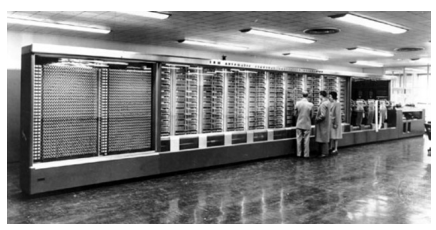
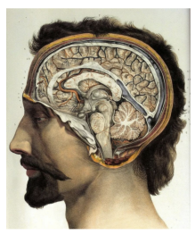
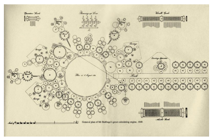
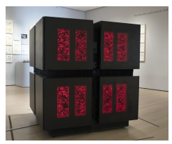
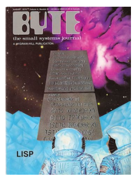
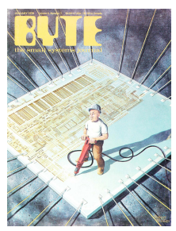

# The Hardware Lottery

Sara Hooker Google Research, Brain Team shooker@google.com

# Abstract

Hardware, systems and algorithms research communities have historically had different incentive structures and fluctuating motivation to engage with each other explicitly. This historical treatment is odd given that hardware and software have frequently determined which research ideas succeed (and fail). This essay introduces the term hardware lottery to describe when a research idea wins because it is suited to the available software and hardware and not because the idea is superior to alternative research directions. Examples from early computer science history illustrate how hardware lotteries can delay research progress by casting successful ideas as failures. These lessons are particularly salient given the advent of domain specialized hardware which make it increasingly costly to stray off of the beaten path of research ideas. This essay posits that the gains from progress in computing are likely to become even more uneven, with certain research directions moving into the fast-lane while progress on others is further obstructed.

# 1 Introduction

History tells us that scientific progress is imperfect. Intellectual traditions and available tooling can prejudice scientists against certain ideas and towards others (Kuhn, 1962). This adds noise to the marketplace of ideas, and often means there is inertia in recognizing promising directions of research. In the field of artificial intelligence research, this essay posits that it is our tooling which has played a disproportionate role in deciding what ideas succeed (and which fail). What follows is part position paper and part historical review. This essay introduces the term *hardware lottery* to describe when a research idea wins because it is compatible with available software and hardware and not because the idea is superior to alternative research directions. We argue that choices about software and hardware have often played a decisive role in deciding the winners and losers in early computer science history.

These lessons are particularly salient as we move into a new era of closer collaboration between hardware, software and machine learning research communities. After decades of treating hardware, software and algorithms as separate choices, the catalysts for closer collaboration include changing hardware economics (Hennessy, 2019), a "bigger is better" race in the size of deep learning architectures (Amodei et al., 2018; Thompson et al., 2020b) and the dizzying requirements of deploying machine learning to edge devices (Warden & Situnayake, 2019). Closer collaboration has centered on a wave of new generation hardware that is "domain specific" to optimize for commercial use cases of deep neural networks (Jouppi et al., 2017; Gupta & Tan, 2019; ARM, 2020; Lee & Wang, 2018). While domain specialization creates important efficiency gains for mainstream research focused on deep neural networks, it arguably makes it more even more costly to stray off of the beaten path of research ideas. An increasingly fragmented hardware landscape means that the gains from progress in computing will be increasingly uneven. While deep neural networks have clear commercial use cases, there are early warning signs that the path to the next

Figure 1: Early computers such as the Mark I were single use and were not expected to be re-

 purposed. While Mark I could be programmed to compute different calculations, it was essentially a very powerful calculator and could not run the variety of programs that we expect of our modern day machines.

breakthrough in AI may require an entirely different combination of algorithm, hardware and software. This essay begins by acknowledging a crucial paradox: machine learning researchers mostly ignore hardware despite the role it plays in determining what ideas succeed. In Section 2 we ask what has incentivized the development of software, hardware and machine learning research in isolation? Section 3 considers the ramifications of this siloed evolution with examples of early hardware and software lotteries. Today the hardware landscape is increasingly heterogeneous. This essay posits that the hardware lottery has not gone away, and the gap between the winners and losers will grow increasingly larger. Sections 4-5 unpack these arguments and Section 6 concludes with some thoughts on what it will take to avoid future hardware lotteries.

# 2 Separate Tribes

It is not a bad description of man to describe him as a tool making animal.

Charles Babbage, 1851 For the creators of the first computers the program was the machine. Early machines were single use and were not expected to be re-purposed for a new task because of both the cost of the electronics and a lack of cross-purpose software. Charles Babbage's difference machine was intended solely to compute polynomial functions (1817)(Collier, 1991). Mark I was a programmable calculator (1944)(Isaacson, 2014). Rosenblatt's perceptron machine computed a step-wise single layer network (1958)(Van Der Malsburg, 1986). Even the Jacquard loom, which is often thought of as one of the first programmable machines, in practice was so expensive to re-thread that it was typically threaded once to support a pre-fixed set of input fields (1804)(Posselt, 1888). The specialization of these early computers was out of necessity and not because computer architects thought one-off customized hardware was intrinsically better. However, it is worth pointing out that our own intelligence is both algorithm and machine. We do not inhabit multiple brains over the course of our lifetime. Instead, the notion of human intelligence is intrinsically associated with the physical 1400g of brain tissue and the patterns of connectivity between an estimated 85 billion neurons in your head (Sainani, 2017). When we talk about human intelligence, the prototypical image that probably surfaces as you read this is of a pink ridged cartoon blob. It is impossible to think of our cognitive intelligence without summoning up an image of the hardware it runs on. Today, in contrast to the necessary specialization in the very early days of computing, machine learning researchers tend to think of hardware, software and algorithm as three separate choices. This is largely due to a pe-

Figure 2: Our own cognitive intelligence is inextricably both hardware and algorithm. We do not inhabit multiple brains over our lifetime.

riod in computer science history that radically changed the type of hardware that was made and incentivized hardware, software and machine learning research communities to evolve in isolation.

### 2.1 The General Purpose Era

The general purpose computer era crystallized in 1969, when an opinion piece by a young engineer called Gordan Moore appeared in Electronics magazine with the apt title "Cramming more components onto circuit boards"(Moore, 1965). Moore predicted you could double the amount of transistors on an integrated circuit every two years. Originally, the article and subsequent followup was motivated by a simple desire - Moore thought it would sell more chips. However, the prediction held and motivated a remarkable decline in the cost of transforming energy into information over the next 50 years. Moore's law combined with Dennard scaling (Dennard et al., 1974) enabled a factor of three magnitude increase in microprocessor performance between 1980-2010 (CHM, 2020). The predictable increases in compute and memory every two years meant hardware design became risk-averse. Even for tasks which demanded higher performance, the benefits of moving to specialized hardware could be quickly eclipsed by the next generation of general purpose hardware with ever growing compute.

The emphasis shifted to universal proces-

 sors which could solve a myriad of different tasks. Why experiment on more specialized hardware designs for an uncertain reward when Moore's law allowed chip makers to lock in predictable profit margins? The few attempts to deviate and produce specialized supercomputers for research were financially unsustainable and short lived (Asanovic, 2018; Taubes, 1995). A few very narrow tasks like mastering chess were an exception to this rule because the prestige and visibility of beating a human adversary attracted corporate sponsorship (Moravec, 1998). Treating the choice of hardware, software and algorithm as independent has persisted until recently. It is expensive to explore new types of hardware, both in terms of time and capital required. Producing a next generation chip typically costs $30-80 million dollars and 2-3 years to develop (Feldman, 2019). These formidable barriers to entry have produced a hardware research culture that might feel odd or perhaps even slow to the average machine learning researcher. While the number of machine learning publications has grown exponentially in the last 30 years (Dean, 2020), the number of hardware publications have maintained a fairly even cadence (Singh et al., 2015). For a hardware company, leakage of intellectual property can make or break the survival of the firm. This has led to a much more closely guarded research culture. In the absence of any lever with which to influence hardware development, machine learning researchers rationally began to treat hardware as a sunk cost to work around rather than something fluid that could be shaped. However, just because we have abstracted away hardware does not mean it has ceased to exist. Early computer science history tells us there are many hardware lotteries where the choice of hardware and software has determined which ideas succeed (and which fail).

# 3 The Hardware Lottery

I suppose it is tempting, if the only tool you have is a hammer, to treat everything as if it were a nail.

Abraham Maslow, 1966.

The first sentence of Anna Karenina by Tolstoy reads "Happy families are all alike, every

Figure 3: The analytical engine designed by Charles Babbage was never built in part because he

 had difficulty fabricating parts with the correct precision. This image depicts the general plan of the analytical machine in 1840.

unhappy family is unhappy in it's own way." (Tolstoy & Bartlett, 2016). Tolstoy is saying that it takes many different things for a marriage to be happy - financial stability, chemistry, shared values, healthy offspring. However, it only takes one of these aspects to not be present for a family to be unhappy. This has been popularized as the Anna Karenina principle - "a deficiency in any one of a number of factors dooms an endeavor to failure." (Moore, 2001). Despite our preference to believe algorithms succeed or fail in isolation, history tells us that most computer science breakthroughs follow the Anna Karenina principle. Successful breakthroughs are often distinguished from failures by benefiting from multiple criteria aligning serendipitously. For AI research, this often depends upon winning what this essay terms the *hardware lottery* - avoiding possible points of failure in downstream hardware and software choices. An early example of a hardware lottery is the analytical machine (1837). Charles Babbage was a computer pioneer who designed a machine that (at least in theory) could be programmed to solve any type of computation. His analytical engine was never built in part because he had difficulty fabricating parts with the correct precision (Kurzweil, 1990). The electromagnetic technology to actually build the theoretical foundations laid down by Babbage only surfaced during WWII. In the first part of the 20th century, electronic vacuum tubes were heavily used for radio communication and radar. During WWII,
these vacuum tubes were re-purposed to provide the compute power necessary to break the German enigma code (Project, 2018). As noted in the TV show Silicon Valley, often "being too early is the same as being wrong." When Babbage passed away in 1871, there was no continuous path between his ideas and modern day computing. The concept of a stored program, modifiable code, memory and conditional branching were rediscovered a century later because the right tools existed to empirically show that the idea worked.

### 3.1 The Lost Decades

Perhaps the most salient example of the damage caused by not winning the hardware lottery is the delayed recognition of deep neural networks as a promising direction of research. Most of the algorithmic components to make deep neural networks work had already been in place for a few decades: backpropagation (invented in 1963 (K & Piske, 1963), reinvented in 1976 (Linnainmaa, 1976), and again in 1988 (Rumelhart et al., 1988)), deep convolutional neural networks ((Fukushima & Miyake, 1982), paired with backpropagation in 1989 (LeCun et al., 1989)). However, it was only three decades later that deep neural networks were widely accepted as a promising research direction. This gap between algorithmic advances and empirical success is in large part due to incompatible hardware. During the general purpose computing era, hardware like CPUs were heavily favored and widely available.

CPUs are very good at executing any set of complex instructions but incur high memory costs because of the need to cache intermediate results and process one instruction at a time (Sato, 2018). This is known as the von Neumann Bottleneck - the available compute is restricted by "the lone channel between the CPU and memory along which data has to travel sequentially" (Time, 1985). The von Neumann bottleneck was terribly illsuited to matrix multiplies, a core component of deep neural network architectures. Thus, training on CPUs quickly exhausted memory bandwidth and it simply wasn't possible to train deep neural networks with multiple layers. The need for hardware that supported tasks with lots of parallelism was pointed out as far back as the early 1980s in a series of essays titled "Parallel Models of Associative Memory" (Hinton & Anderson, 1989). The essays argued persuasively that biological evidence suggested massive parallelism was needed to make deep neural network approaches work (Rumelhart et al., 1986). In the late 1980/90s, the idea of specialized hardware for neural networks had passed the novelty stage (Misra & Saha, 2010; Lindsey & Lindblad, 1994; Dean, 1990). However, efforts remained fractured by lack of shared software and the cost of hardware development. Most of the attempts that were actually operationalized like the Connection Machine in 1985 (Taubes, 1995), Space in 1992 (Howe & Asanović, 1994), Ring Array Processor in 1989 (Morgan et al., 1992) and the Japanese 5th generation computer project (Morgan, 1983) were designed to favor logic programming such as PROLOG and LISP that were poorly suited to connectionist deep neural networks. Later iterations such as HipNet-1 (Kingsbury et al., 1998), and the Analog Neural Network Chip in 1991 (Sackinger et al., 1992) were promising but short lived because of the intolerable cost of iteration and the need for custom silicon. Without a consumer market, there was simply not the critical mass of end users to be financially viable.

Figure 4: The connection machine was one of

 the few examples of hardware that deviated from general purpose cpus in the 1980s/90s. Thinking Machines ultimately went bankrupt after the inital funding from DARPA dried up.

It would take a hardware fluke in the early 2000s, a full four decades after the first paper about backpropagation was published, for the insight about massive parallelism to be operationalized in a useful way for connectionist deep neural networks. Many inventions are re-purposed for means unintended by their designers. Edison's phonograph was never intended to play music. He envisioned it as preserving the last words of dying people or teaching spelling. In fact, he was disappointed by its use playing popular music as he thought this was too "base" an application of his invention (Diamond et al., 1999). In a similar vein, deep neural networks only began to work when an existing technology was unexpectedly re-purposed. A graphical processing unit (GPU) was originally introduced in the 1970s as a specialized accelerator for video games and for developing graphics for movies and animation. In the 2000s, like Edison's phonograph, GPUs were re-purposed for an entirely unimagined use case - to train deep neural networks (Chellapilla et al., 2006; Oh & Jung, 2004; Claudiu Ciresan et al., 2010; Fatahalian et al., 2004; Payne et al., 2005). GPUs had one critical advantage over CPUs - they were far better at parallelizing a set of simple decomposable instructions such as matrix multiples (Brodtkorb et al., 2013; Dettmers, 2020). This higher number of floating operation points per second (FLOPS) combined with clever distribution of training between GPUs unblocked the training of deeper networks. The number of layers in a network turned out to be the key. Performance on Im-

 ageNet jumped with ever deeper networks in 2011 (Ciresan et al., 2011), 2012 (Krizhevsky et al., 2012) and 2015 (Szegedy et al., 2015b).

A striking example of this jump in efficiency is a comparison of the now famous 2012 Google paper which used 16,000 CPU cores to classify cats (Le et al., 2012) to a paper published a mere year later that solved the same task with only two CPU cores and four GPUs (Coates et al., 2013).

Figure 5: Byte magazine cover, August 1979, volume 4. LISP was the dominant language for artificial intelligence research through the 1990's. LISP was particularly well suited to handling logic expressions, which were a core component of reasoning and expert systems.

### 3.2 Software Lotteries

Software also plays a role in deciding which research ideas win and lose. Prolog and LISP
were two languages heavily favored until the mid-90's in the AI community. For most of this period, students of AI were expected to actively master one or both of these languages (Lucas & van der Gaag, 1991). LISP and Prolog were particularly well suited to handling logic expressions, which were a core component of reasoning and expert systems. For researchers who wanted to work on connectionist ideas like deep neural networks there was not a clearly suited language of choice until the emergence of Matlab in 1992 (Demuth & Beale, 1993). Implementing connectionist networks in LISP or Prolog was cumbersome and most researchers worked in low level languages like c++ (Touretzky &
Waibel, 1995). It was only in the 2000's that there started to be a more healthy ecosystem around software developed for deep neural network approaches with the emergence of LUSH (Lecun & Bottou, 2002) and subsequently TORCH (Collobert et al., 2002). Where there is a loser, there is also a winner. From the 1960s through the mid 80s, most mainstream research was focused on symbolic approaches to AI (Haugeland, 1985). Unlike deep neural networks where learning an adequate representation is delegated to the model itself, symbolic approaches aimed to build up a knowledge base and use decision rules to replicate how humans would approach a problem. This was often codified as a sequence of logic what-if statements that were well suited to LISP and PROLOG. The widespread and sustained popularity of symbolic approaches to AI cannot easily be seen as independent of how readily it fit into existing programming and hardware frameworks.

# 4 The Persistence Of The Hardware Lottery

Today, there is renewed interest in joint collaboration between hardware, software and machine learning communities. We are experiencing a second pendulum swing back to specialized hardware. The catalysts include changing hardware economics prompted by the end of Moore's law and the breakdown of Dennard scaling (Hennessy, 2019), a "bigger is better" race in the number of model parameters that has gripped the field of machine learning (Amodei et al., 2018), spiralling energy costs (Horowitz, 2014; Strubell et al., 2019) and the dizzying requirements of deploying machine learning to edge devices
(Warden & Situnayake, 2019). The end of Moore's law means we are not guaranteed more compute, hardware will have to earn it. To improve efficiency, there is a shift from task agnostic hardware like CPUs to domain specialized hardware that tailor the design to make certain tasks more efficient. The first examples of domain specialized hardware released over the last few years - TPUs (Jouppi et al., 2017), edge- TPUs (Gupta & Tan, 2019), Arm Cortex- M55 (ARM, 2020), Facebook's *big sur* (Lee & Wang, 2018) - optimize explicitly for costly operations common to deep neural networks like matrix multiplies. Closer collaboration between hardware and research communities will undoubtedly continue to make the training and deployment of deep neural networks more efficient. For example, unstructured pruning (Hooker et al., 2019; Gale et al., 2019; Evci et al., 2019)
and weight specific quantization (Zhen et al.,
2019) are very successful compression techniques in deep neural networks but are incompatible with current hardware and compilation kernels. While these compression techniques are currently not supported, many clever hardware architects are currently thinking about how to solve for this. It is a reasonable prediction that the next few generations of chips or specialized kernels will correct for hardware biases against these techniques (Wang et al., 2018; Sun et al., 2020). Some of the first designs to facilitate sparsity have already hit the market (Krashinsky et al., 2020). In parallel, there is interesting research developing specialized software kernels to support unstructured sparsity (Elsen et al., 2020; Gale et al., 2020; Gray et al., 2017). In many ways, hardware is catching up to the present state of machine learning research. Hardware is only economically viable if the lifetime of the use case lasts more than three years (Dean, 2020). Betting on ideas which have longevity is a key consideration for hardware developers. Thus, co-design effort has focused almost entirely on optimizing an older generation of models with known commercial use cases. For example, matrix multiplies are a safe target to optimize for because they are here to stay - anchored by the widespread use and adoption of deep neural networks in production systems. Allowing for unstructured sparsity and weight specific quantization are also safe targets because there is wide consensus that these will enable higher levels of compression. There is still a separate question of whether hardware innovation is versatile enough to unlock or keep pace with entirely new machine learning research directions. It is difficult to answer this question because data points here are limited - it is hard to model the counterfactual of would this idea succeed given different hardware. However, despite the inherent challenge of this task, there is already compelling evidence that domain specialized hardware makes it more costly for research ideas that stray outside of the mainstream to succeed. In 2019, a paper was published called "Machine learning is stuck in a rut." (Barham & Isard, 2019). The authors consider the difficulty of training a new type of computer vision architecture called capsule networks (Sabour et al., 2017) on domain specialized hardware. Capsule networks include novel components like squashing operations and routing by agreement. These architecture choices aimed to solve for key deficiencies in convolutional neural networks (lack of rotational invariance and spatial hierarchy understanding) but strayed from the typical architecture of neural networks. As a result, while capsule networks operations can be implemented reasonably well on CPUs, performance falls off a cliff on accelerators like GPUs and TPUs which have been overly optimized for matrix multiplies. Whether or not you agree that capsule networks are the future of computer vision, the authors say something interesting about the difficulty of trying to train a new type of image classification architecture on domain specialized hardware. Hardware design has prioritized delivering on commercial use cases, while built-in flexibility to accommodate the next generation of research ideas remains a distant secondary consideration. While specialization makes deep neural networks more efficient, it also makes it far more costly to stray from accepted building blocks. It prompts the question of how much researchers will implicitly overfit to ideas that operationalize well on available hardware rather than take a risk on ideas that are not currently feasible? What are the failures we still don't have the hardware and software to see as a success?

# 5 The Likelyhood Of Future Hardware Lotteries

What we have before us are some breathtaking opportunities disguised as insoluble problems.

John Gardner, 1965.

It is an ongoing, open debate within the machine learning community about how much future algorithms will differ from models like deep neural networks (Sutton, 2019; Welling, 2019). The risk you attach to depending on domain specialized hardware is tied to your position on this debate. Betting heavily on specialized hardware makes sense if you think

 that future breakthroughs depend upon pairing deep neural networks with ever increasing amounts of data and computation.

Several major research labs are making this bet, engaging in a "bigger is better" race in the number of model parameters and collecting ever more expansive datasets. However, it is unclear whether this is sustainable.

An algorithms scalability is often thought of as the performance gradient relative to the available resources. Given more resources, how does performance increase? For many subfields, we are now in a regime where the rate of return for additional parameters is decreasing (Thompson et al., 2020a; Brown et al., 2020). For example, while the parameters almost double between Inception V3 (Szegedy et al., 2016)and Inception V4 architectures (Szegedy et al., 2015a) (from 21.8 to 41.1 million parameters), accuracy on ImageNet differs by less than 2% between the two networks (78.8 vs 80 %) (Kornblith et al., 2018). The cost of throwing additional parameters at a problem is becoming painfully obvious. The training of GPT-3 alone is estimated to exceed $12 million dollars (Wiggers, 2020). Perhaps more troubling is how far away we are from the type of intelligence humans demonstrate. Human brains despite their complexity remain extremely energy efficient. Our brain has over 85 billion neurons but runs on the energy equivalent of an electric shaver (Sainani, 2017). While deep neural networks may be scalable, it may be prohibitively expensive to do so in a regime of comparable intelligence to humans. An apt metaphor is that we appear to be trying to build a ladder to the moon. Biological examples of intelligence differ from deep neural networks in enough ways to suggest it is a risky bet to say that deep neural networks are the only way forward. While algorithms like deep neural networks rely on global updates in order to learn a useful representation, our brains do not. Our own intelligence relies on decentralized local updates which surface a global signal in ways that are still not well understood (Lillicrap & Santoro, 2019; Marblestone et al., 2016; Bi & Poo, 1998). In addition, our brains are able to learn efficient representations from far fewer labelled examples than deep neural networks (Zador, 2019). For typical deep learning models the

Figure 6: Human latency for certain tasks suggests we have specialized pathways for different stimuli. For example, it is easy for a human to walk and talk at the same time. However, it is far more cognitively taxing to attempt to read and talk.

entire model is activated for every example which leads to a quadratic blow-up in training cost. In contrast, evidence suggests that the brain does not perform a full forward and backward pass for all inputs. Instead, the brain simulates what inputs are expected against incoming sensory data. Based upon the certainty of the match, the brain simply infills. What we see is largely virtual reality computed from memory (Eagleman & Sejnowski, 2000; Bubic et al., 2010; Heeger, 2017). Humans have highly optimized and specific pathways developed in our biological hardware for different tasks (Von Neumann et al., 2000; Marcus et al., 2014; Kennedy, 2000). For example, it is easy for a human to walk and talk at the same time. However, it is far more cognitively taxing to attempt to read and talk (Stroop, 1935). This suggests the way a network is organized and our inductive biases is as important as the overall size of the network (Herculano-Houzel et al., 2014; Battaglia et al., 2018; Spelke & Kinzler, 2007). Our brains are able to fine-tune and retain skills across our lifetime (Benna & Fusi, 2016; Bremner et al., 2013; Stein et al., 2004; Tani & Press, 2016; Gallistel & King, 2009; Tulving, 2002; Barnett & Ceci, 2002). In contrast, deep neural networks that are trained upon new data often evidence catastrophic forgetting, where performance deteriorates on the original task because the new information interferes with previously learned behavior (Mcclelland et al., 1995; McCloskey & Cohen, 1989; Parisi et al., 2018). The point of these examples is not to convince you that deep neural networks are not the way forward. But, rather that there are clearly other models of intelligence which suggest it may not be the only way. It is possible that the next breakthrough will require a fundamentally different way of modelling the world with a different combination of hardware, software and algorithm. We may very well be in the midst of a present day hardware lottery.

# 6 The Way Forward

Any machine coding system should be judged quite largely from the point of view of how easy it is for the operator to obtain results.

John Mauchly, 1973.

Scientific progress occurs when there is a confluence of factors which allows the scientist to overcome the "stickyness" of the existing paradigm. The speed at which paradigm shifts have happened in AI research have been disproportionately determined by the degree of alignment between hardware, software and algorithm. Thus, any attempt to avoid hardware lotteries must be concerned with making it cheaper and less timeconsuming to explore different hardwaresoftware-algorithm combinations. This is easier said than done. Expanding the search space of possible hardware-softwarealgorithm combinations is a formidable goal. It is expensive to explore new types of hardware, both in terms of time and capital required. Producing a next generation chip typically costs $30-80 million dollars and takes 2-3 years to develop (Feldman, 2019). The fixed costs alone of building a manufacturing plant are enormous; estimated at $7 billion dollars in 2017 (Thompson & Spanuth, 2018). Experiments using reinforcement learning to optimize chip placement may help decrease cost (Mirhoseini et al., 2020). There is also renewed interest in re-configurable hardware such as field program gate array (FPGAs) (Hauck & DeHon, 2007) and coarse-grained reconfigurable arrays (CGRAs) (Prabhakar et al., 2017). These devices allow the chip logic to be re-configured to avoid being locked into a single use case. However, the trade-off for flexibility is far higher FLOPS
and the need for tailored software development. Coding even simple algorithms on FP- GAs remains very painful and time consuming (Shalf, 2020).

In the short to medium term hardware development is likely to remain expensive. The cost of producing hardware is important because it determines the amount of risk and experimentation hardware developers are willing to tolerate. Investment in hardware tailored to deep neural networks is assured because neural networks are a cornerstone of enough commercial use cases. The widespread profitability of deep learning has spurred a healthy ecosystem of hardware startups that aim to further accelerate deep neural networks (Metz, 2018) and has encouraged large companies to develop custom hardware in-house (Falsafi et al., 2017; Jouppi et al., 2017; Lee & Wang, 2018). The bottleneck will continue to be funding hardware for use cases that are not immediately commercially viable. These more risky directions include biological hardware (Tan et al., 2007; Macía & Sole, 2014; Kriegman et al., 2020), analog hardware with in-memory computation (Ambrogio et al., 2018), neuromorphic computing (Davies, 2019), optical computing (Lin et al., 2018), and quantum computing based approaches (Cross et al., 2019). There are also high risk efforts to explore the development of transistors using new materials (Colwell, 2013; Nikonov & Young, 2013). Lessons from previous hardware lotteries suggest that investment must be sustained and come from both private and public funding programs. There is a slow awakening of public interest in providing such dedicated resources, such as the 2018 DARPA Electronics Resurgence Initiative which has committed to 1.5 billion dollars in funding for microelectronic technology research (DARPA, 2018). China has also announced a 47 billion dollar fund to support semiconductor research (Kubota, 2018). However, even investment of this magnitude may still be woefully inadequate, as hardware based on new materials requires long lead times of 10-20 years and public investment is currently far below industry levels of R&D (Shalf, 2020).

Figure 7: Byte magazine cover, March 1979, volume 4. Hardware design remains risk adverse due to the large amount of capital and time required to fabricate each new generation of hardware.

### 6.1 A Software Revolution

An interim goal should be to provide better feedback loops to researchers about how our algorithms interact with the hardware we do have. Machine learning researchers do not spend much time talking about how hardware chooses which ideas succeed and which fail. This is primarily because it is hard to quantify the cost of being concerned. At present, there are no easy and cheap to use interfaces to benchmark algorithm performance against multiple types of hardware at once. There are frustrating differences in the subset of software operations supported on different types of hardware which prevent the portability of algorithms across hardware types (Hotel et al., 2014). Software kernels are often overly optimized for a specific type of hardware which causes large discrepencies in efficiency when used with different hardware (Hennessy, 2019). These challenges are compounded by an ever more formidable and heterogeneous hardware landscape (Reddi et al., 2020; Fursin et al., 2016). As the hardware landscape becomes increasingly fragmented and specialized, fast and efficient code will require ever more niche and specialized skills to write (Lee et al., 2011). This means that there will be increasingly uneven gains from progress in computer science research. While some types

 of hardware will benefit from a healthy software ecosystem, progress on other languages will be sporadic and often stymied by a lack of critical end users (Thompson & Spanuth, 2018; Leiserson et al., 2020). One way to mitigate this need for specialized software expertise is to focus on the development of domain-specific languages which cater to a narrow domain. While you give up expressive power, domain-specific languages permit greater portability across different types of hardware. It allows developers to focus on the intent of the code without worrying about implementation details. (Olukotun, 2014; Mernik et al., 2005; Cong et al., 2011). Another promising direction is automatically auto-tuning the algorithmic parameters of a program based upon the downstream choice of hardware. This facilitates easier deployment by tailoring the program to achieve good performance and load balancing on a variety of hardware (Dongarra et al., 2018; Clint Whaley et al., 2001; Asanović et al., 2006; Ansel et al., 2014). The difficulty of both these approaches is that if successful, this further abstracts humans from the details of the implementation. In parallel, we need better profiling tools to allow researchers to have a more informed opinion about how hardware and software should evolve. Ideally, software could even surface recommendations about what type of hardware to use given the configuration of an algorithm. Registering what differs from our expectations remains a key catalyst in driving new scientific discoveries. Software needs to do more work, but it is also well positioned to do so. We have neglected efficient software throughout the era of Moore's law, trusting that predictable gains in compute would compensate for inefficiencies in the software stack. This means there are many low hanging fruit as we begin to optimize for more efficient code (Larus, 2009; Xu et al., 2010).

# 7 Conclusion

George Gilder, an American investor, described the computer chip as "inscribing worlds on grains of sand" (Gilder, 2000). The performance of an algorithm is fundamentally intertwined with the hardware and software it runs on. This essay proposes the term hardware lottery to describe how these downstream choices determine whether a research idea succeeds or fails. Today the hardware landscape is increasingly heterogeneous. This essay posits that the hardware lottery has not gone away, and the gap between the winners and losers will grow increasingly larger. In order to avoid future hardware lotteries, we need to make it easier to quantify the opportunity cost of settling for the hardware and software we have.

# 8 Acknowledgments

Thank you to many of my wonderful colleagues and peers who took time to provide valuable feedback on earlier versions of this essay. In particular, I would like to acknowledge the valuable input of Utku Evci, Erich Elsen, Melissa Fabros, Amanda Su, Simon Kornblith, Cliff Young, Eric Jang, Sean McPherson, Jonathan Frankle, Carles Gelada, David Ha, Brian Spiering, Samy Bengio, Stephanie Sher, Jonathan Binas, Pete Warden, Sean Mcpherson, Laura Florescu, Jacques Pienaar, Chip Huyen, Raziel Alvarez, Dan Hurt and Kevin Swersky. Thanks for the institutional support and encouragement of Natacha Mainville and Alexander Popper.

# References

Ambrogio, S., Narayanan, P., Tsai, H., Shelby, R., Boybat, I., Nolfo, C., Sidler, S., Giordano, M., Bodini, M., Farinha, N., Killeen, B., Cheng, C., Jaoudi, Y., and Burr, G. Equivalent-accuracy accelerated neural-network training using analogue memory. *Nature*, 558, 06 2018. doi: 10.1038/
s41586-018-0180-5.

Amodei, D., Hernandez, D., Sastry, G., Clark, J.,
Brockman, G., and Sutskever, I. Ai and compute, 2018. URL https://openai.com/ blog/ai-and-compute/.

Ansel, J., Kamil, S., Veeramachaneni, K.,
Ragan-Kelley, J., Bosboom, J., O'Reilly, U.- M., and Amarasinghe, S. Opentuner: An extensible framework for program autotuning.

In Proceedings of the 23rd International Conference on Parallel Architectures and Compilation, PACT '14, pp. 303–316, New York, NY, USA, 2014. Association for Computing Machinery. ISBN 9781450328098. doi: 10.1145/2628071.2628092. URL https:// doi.org/10.1145/2628071.2628092.

ARM. Enhancing ai performance for iot endpoint devices, 2020. URL https: //www.arm.com/company/news/2020/ 02/new-ai-technology-from-arm.

Asanovic, K. Accelerating ai: Past, present, and future, 2018. URL https://www.youtube.

com/watch?v=8n2HLp2gtYs&t=2116s.

Asanovic, K., Bodik, R., Catanzaro, B. C., ´
Gebis, J. J., Husbands, P., Keutzer, K., Patterson, D. A., Plishker, W. L., Shalf, J., Williams, S. W., and Yelick, K. A. The landscape of parallel computing research: A view from berkeley. Technical Report UCB/EECS- 2006-183, EECS Department, University of California, Berkeley, Dec 2006. URL http:
//www2.eecs.berkeley.edu/Pubs/ TechRpts/2006/EECS-2006-183.html.

Barham, P. and Isard, M. Machine learning systems are stuck in a rut. In Proceedings of the Workshop on Hot Topics in Operating Systems, HotOS '19, pp. 177–183, New York, NY, USA, 2019. Association for Computing Machinery. ISBN 9781450367271. doi: 10.1145/3317550.3321441. URL https://
doi.org/10.1145/3317550.3321441.

Barnett, S. M. and Ceci, S. When and where do we apply what we learn? a taxonomy for far transfer. *Psychological bulletin*, 128 4:612– 37, 2002.

Battaglia, P. W., Hamrick, J. B., Bapst, V.,
Sanchez-Gonzalez, A., Zambaldi, V. F., Malinowski, M., Tacchetti, A., Raposo, D., Santoro, A., Faulkner, R., Gülçehre, Ç., Song, H. F., Ballard, A. J., Gilmer, J., Dahl, G. E., Vaswani, A., Allen, K. R., Nash, C., Langston, V., Dyer, C., Heess, N., Wierstra, D., Kohli, P., Botvinick, M., Vinyals, O., Li, Y., and Pascanu, R. Relational inductive biases, deep learning, and graph networks. *CoRR*, abs/1806.01261, 2018. URL http://arxiv.org/abs/1806.01261.

Benna, M. and Fusi, S. Computational principles of synaptic memory consolidation. Nature Neuroscience, 19, 10 2016. doi: 10.1038/ nn.4401.

Bi, G.-q. and Poo, M.-m. Synaptic modifications in cultured hippocampal neurons: Dependence on spike timing, synaptic strength, and postsynaptic cell type. Journal of Neuroscience, 18(24):10464–10472, 1998. ISSN 0270-6474. doi: 10.1523/JNEUROSCI. 18-24-10464.1998. URL https://www. jneurosci.org/content/18/24/10464.

Bremner, A., Lewkowicz, D., and Spence, C.

Multisensory development, 11 2013.

Brodtkorb, A. R., Hagen, T. R., and Sætra, M. L. Graphics processing unit (gpu) programming strategies and trends in gpu computing. Journal of Parallel and Distributed Computing, 73(1):4 - 13, 2013. ISSN 0743-7315. doi: https://doi.org/ 10.1016/j.jpdc.2012.04.003. URL http: //www.sciencedirect.com/science/ article/pii/S0743731512000998. Metaheuristics on GPUs.

Brown, T. B., Mann, B., Ryder, N., Subbiah, M., Kaplan, J., Dhariwal, P., Neelakantan, A., Shyam, P., Sastry, G., Askell, A., Agarwal, S., Herbert-Voss, A., Krueger, G., Henighan, T., Child, R., Ramesh, A., Ziegler, D. M., Wu, J., Winter, C., Hesse, C., Chen, M., Sigler, E., Litwin, M., Gray, S., Chess, B., Clark, J., Berner, C., McCand lish, S., Radford, A., Sutskever, I., and Amodei, D. Language Models are Few-Shot Learners. arXiv e-prints, May 2020.

Bubic, A., Von Cramon, D. Y., and Schubotz, R.

Prediction, cognition and the brain. *Frontiers* in Human Neuroscience, 4:25, 2010. ISSN 1662-5161. doi: 10.3389/fnhum.2010.00025. URL https://www.frontiersin.org/ article/10.3389/fnhum.2010.00025.

Chellapilla, K., Puri, S., and Simard, P. High performance convolutional neural networks for document processing, 10 2006.

CHM. Moore's law, 2020. URL
https://www.computerhistory.org/ revolution/digital-logic/12/267.

Ciresan, D., Meier, U., Masci, J., Gambardella, L. M., and Schmidhuber, J. Flexible, high performance convolutional neural networks for image classification. International Joint Conference on Artificial Intelligence IJCAI- 2011, pp. 1237–1242, 07 2011. doi: 10.5591/ 978-1-57735-516-8/IJCAI11-210.

Claudiu Ciresan, D., Meier, U., Gambardella, L. M., and Schmidhuber, J. Deep Big Simple Neural Nets Excel on Handwritten Digit Recognition. *arXiv e-prints*, art. arXiv:1003.0358, March 2010.

Clint Whaley, R., Petitet, A., and Dongarra, J. J. Automated empirical optimizations of software and the atlas project. *Parallel* Computing, 27(1):3 - 35, 2001. ISSN 0167-8191. doi: https://doi.org/10.1016/ S0167-8191(00)00087-9. URL http: //www.sciencedirect.com/science/ article/pii/S0167819100000879. New Trends in High Performance Computing.

Coates, A., Huval, B., Wang, T., Wu, D., Catanzaro, B., and Andrew, N. Deep learning with cots hpc systems. In Dasgupta, S.

and McAllester, D. (eds.), Proceedings of the 30th International Conference on Machine Learning, volume 28 of *Proceedings* of Machine Learning Research, pp. 1337– 1345, Atlanta, Georgia, USA, 17–19 Jun 2013. PMLR. URL http://proceedings. mlr.press/v28/coates13.html.

Collier, B. Little Engines That Could've: The Calculating Machines of Charles Babbage. Garland Publishing, Inc., USA, 1991. ISBN 0824000439.

Collobert, R., Bengio, S., and Marithoz, J.

Torch: A modular machine learning software library, 11 2002.

Colwell, R. The chip design game at the end of moore's law. In 2013 IEEE Hot Chips 25 Symposium (HCS), pp. 1–16, 2013.

Cong, J., Sarkar, V., Reinman, G., and Bui, A. Customizable domain-specific computing. IEEE Design Test of Computers, 28(2):6–15, 2011.

Cross, A. W., Bishop, L. S., Sheldon, S., Nation, P. D., and Gambetta, J. M. Validating quantum computers using randomized model circuits, September 2019.

DARPA. Darpa announces next phase of electronics resurgence initiative, 2018. URL https://www.darpa.mil/news-events/ 2018-11-01a.

Davies, M. Progress in neuromorphic computing
: Drawing inspiration from nature for gains in ai and computing. In *2019 International* Symposium on VLSI Design, Automation and Test (VLSI-DAT), pp. 1–1, 2019.

Dean, J. Parallel implementations of neural network training: two backpropagation approaches., 1990. URL https://drive.google.com/file/d/ 1I1fs4sczbCaACzA9XwxR3DiuXVtqmejL/ view.

Dean, J. 1.1 the deep learning revolution and its implications for computer architecture and chip design. 2020 IEEE International Solid-
State Circuits Conference - (ISSCC), pp. 8–
14, 2020.

Demuth, H. and Beale, M. Neural network toolbox for use with matlab - user guide verion 3.0, 1993.

Dennard, R. H., Gaensslen, F. H., Yu, H., Rideout, V. L., Bassous, E., and LeBlanc, A. R. Design of ion-implanted mosfet's with very small physical dimensions. IEEE Journal of Solid-State Circuits, 9(5):256–268, 1974.

Dettmers, T. Which gpu for deep learning?,
2020. URL https://bit.ly/35qq8xe.

Diamond, J., Diamond, P., and Collection, B. H.

Guns, Germs, and Steel: The Fates of Human Societies. National bestseller / W.W. Norton & Company. W.W. Norton, 1999. ISBN 9780393317558. URL https://books. google.com/books?id=1lBu_bqSsSMC.

Dongarra, J., Gates, M., Kurzak, J., Luszczek, P.,
and Tsai, Y. M. Autotuning numerical dense linear algebra for batched computation with gpu hardware accelerators. *Proceedings of the* IEEE, 106(11):2040–2055, 2018.

Eagleman, D. M. and Sejnowski, T. J. Motion integration and postdiction in visual awareness. *Science*, 287(5460):2036– 2038, 2000. ISSN 0036-8075. doi: 10.1126/science.287.5460.2036. URL
https://science.sciencemag.org/ content/287/5460/2036.

Elsen, E., Dukhan, M., Gale, T., and Simonyan, K. Fast sparse convnets. In Proceedings of the IEEE/CVF Conference on Computer Vision and Pattern Recognition (CVPR), June 2020.

Evci, U., Gale, T., Menick, J., Castro, P. S., and Elsen, E. Rigging the Lottery: Making All Tickets Winners. *arXiv e-prints*, November 2019.

Falsafi, B., Dally, B., Singh, D., Chiou, D., Yi, J. J., and Sendag, R. Fpgas versus gpus in data centers. *IEEE Micro*, 37(1):60–72, 2017.

Fatahalian, K., Sugerman, J., and Hanrahan, P. Understanding the efficiency of gpu algorithms for matrix-matrix multiplication. In Proceedings of the ACM
SIGGRAPH/EUROGRAPHICS Conference on Graphics Hardware, HWWS
'04, pp. 133–137, New York, NY,
USA, 2004. Association for Computing Machinery. ISBN 3905673150. doi: 10.1145/1058129.1058148. URL https: //doi.org/10.1145/1058129.1058148.

Feldman, M. The era of general purpose computers is ending, 2019. URL https://bit.

ly/3hP8XJh.

Fukushima, K. and Miyake, S. Neocognitron:
A new algorithm for pattern recognition tolerant of deformations and shifts in position. *Pattern Recognition*, 15(6):455 - 469, 1982. ISSN 0031-3203. URL http: //www.sciencedirect.com/science/ article/pii/0031320382900243.

Fursin, G., Lokhmotov, A., and Plowman, E.

Collective knowledge: Towards r d sustainability. In *2016 Design, Automation Test in* Europe Conference Exhibition (DATE), pp. 864–869, 2016.

Gale, T., Elsen, E., and Hooker, S. The state of sparsity in deep neural networks, 2019.

Gale, T., Zaharia, M., Young, C., and Elsen, E. Sparse GPU Kernels for Deep Learning. arXiv e-prints, June 2020.

Gallistel, C. and King, A. Memory and the computational brain: Why cognitive science will transform neuroscience, 04 2009.

Gilder, G. Telecosm: How Infinite Bandwidth Will Revolutionize Our World. Free Press, 2000. ISBN 9780743215947. URL https://books.google.com/books?id= Kzo-KTxdwcEC.

Gray, S., Radford, A., and Kingma, D. P. Gpu kernels for block-sparse weights, 2017.

Gupta, S. and Tan, M. Efficientnet-edgetpu:
Creating accelerator-optimized neural networks with automl, 2019. URL https://ai.googleblog.com/2019/08/
efficientnet-edgetpu-creating.html.

Hauck, S. and DeHon, A. Reconfigurable Computing: The Theory and Practice of FPGA- Based Computation. Morgan Kaufmann Publishers Inc., San Francisco, CA, USA, 2007. ISBN 9780080556017.

Haugeland, J. *Artificial Intelligence: The Very* Idea. Massachusetts Institute of Technology, USA, 1985. ISBN 0262081539.

Heeger, D. J. Theory of cortical function. Proceedings of the National Academy of Sciences, 114(8):1773– 1782, 2017. ISSN 0027-8424. doi: 10.1073/pnas.1619788114. URL https:
//www.pnas.org/content/114/8/1773.

Hennessy, J. The end of moore's law, cpus
(as we know them), and the rise of domain specific architectures, 2019. URL https:
//www.kisacoresearch.com/sites/
default/files/presentations/09.00_ -_alphabet_-_john_hennessy.pdf.

Herculano-Houzel, S., de Souza, K. A., Neves, K., Porfirio, J., Messeder, D. J., Feijó, L. M., Maldonado, J., and Manger, P. R. The elephant brain in numbers. Frontiers in Neuroanatomy, 8, 2014.

Hinton, G. E. and Anderson, J. A. Parallel Models of Associative Memory. L. Erlbaum Associates Inc., USA, 1989. ISBN 080580269X.

Hooker, S., Courville, A., Clark, G., Dauphin, Y., and Frome, A. What Do Compressed Deep Neural Networks Forget? arXiv e-prints, art. arXiv:1911.05248, November 2019.

Horowitz, M. 1.1 computing's energy problem
(and what we can do about it). In 2014 IEEE International Solid-State Circuits Conference Digest of Technical Papers (ISSCC), pp. 10– 14, 2014.

Hotel, H., Johansen, H., Bernholdt, D., Héroux, M., and Hornung, R. Software productivity for extreme-scale science, 2014.

Howe, D. B. and Asanovic, K. ´ SPACE:
Symbolic Processing in Associative Computing Elements, pp. 243–252. Springer US, Boston, MA, 1994. ISBN 978-1-48991331-9. doi: 10.1007/978-1-4899-1331-9_ 24. URL https://doi.org/10.1007/ 978-1-4899-1331-9_24.

Isaacson, W. Grace hopper, computing pioneer. *The Harvard Gazette*, 2014. URL https://news.harvard. edu/gazette/story/2014/12/
grace-hopper-computing-pioneer/.

Jouppi, N. P., Young, C., Patil, N., Patterson, D., Agrawal, G., Bajwa, R., Bates, S., Bhatia, S., Boden, N., Borchers, A., Boyle, R.,
Cantin, P.-l., Chao, C., Clark, C., Coriell, J., Daley, M., Dau, M., Dean, J., Gelb, B., Ghaemmaghami, T. V., Gottipati, R., Gulland, W., Hagmann, R., Ho, C. R., Hogberg, D., Hu, J., Hundt, R., Hurt, D., Ibarz, J., Jaffey, A., Jaworski, A., Kaplan, A., Khaitan, H., Killebrew, D., Koch, A., Kumar, N., Lacy, S., Laudon, J., Law, J., Le, D., Leary, C., Liu, Z., Lucke, K., Lundin, A., MacKean, G., Maggiore, A., Mahony, M., Miller, K., Nagarajan, R., Narayanaswami, R., Ni, R., Nix, K., Norrie, T., Omernick, M., Penukonda, N.,
Phelps, A., Ross, J., Ross, M., Salek, A., Samadiani, E., Severn, C., Sizikov, G., Snelham, M., Souter, J., Steinberg, D., Swing, A., Tan, M., Thorson, G., Tian, B., Toma, H., Tuttle, E., Vasudevan, V., Walter, R., Wang, W., Wilcox, E., and Yoon, D. H. In-datacenter performance analysis of a tensor processing unit. *SIGARCH Comput. Archit. News*, 45 (2):1–12, June 2017. ISSN 0163-5964. doi: 10.1145/3140659.3080246. URL https:// doi.org/10.1145/3140659.3080246.

K, S. and Piske, U. Learning matrices and their applications. IEEE Transactions on Electronic Computers, EC-12(6):846–862, 1963.

Kennedy, M. B. Signal-processing machines at the postsynaptic density. *Science*, 290 5492: 750–4, 2000.

Kingsbury, B., Morgan, N., and Wawrzynek, J.

Hipnet-1: A highly pipelined architecture for neural network training, 03 1998.

Kornblith, S., Shlens, J., and Le, Q. V.

Do better imagenet models transfer better?

CoRR, abs/1805.08974, 2018. URL http: //arxiv.org/abs/1805.08974.

Krashinsky, R., Giroux, O., Jones, S., Stam, N., and Ramaswamy, S. Nvidia ampere architecture in-depth., 2020. URL https://developer.nvidia.com/blog/ nvidia-ampere-architecture-in-depth/.

Kriegman, S., Blackiston, D., Levin, M., and Bongard, J. A scalable pipeline for designing reconfigurable organisms. Proceedings of the National Academy of Sciences, 117(4): 1853–1859, 2020. ISSN 0027-8424. doi: 10.1073/pnas.1910837117. URL https:// www.pnas.org/content/117/4/1853.

Krizhevsky, A., Sutskever, I., and Hinton, G. E.

Imagenet classification with deep convolutional neural networks, 2012. URL https: //bit.ly/2GneDwp.

Kubota, Y. China plans 47 billion fund to boost its semiconductor industry, 2018. URL https://on.wsj.com/32L7Kwn.

Kuhn, T. S. The Structure of Scientific Revolutions. University of Chicago Press, Chicago, 1962.

Kurzweil, R. *The Age of Intelligent Machines*.

MIT Press, Cambridge, MA, USA, 1990.

Larus, J. Spending moore's dividend. *Commun. ACM*, 52(5):62–69, May 2009. ISSN 0001-0782. doi:
10.1145/1506409.1506425. URL https:
//doi.org/10.1145/1506409.1506425.

Le, Q. V., Ranzato, M., Monga, R., Devin, M.,
Chen, K., Corrado, G. S., Dean, J., and Ng, A. Y. Building high-level features using large scale unsupervised learning. In Proceedings of the 29th International Coference on International Conference on Machine Learning, ICML'12, pp. 507–514, Madison, WI, USA, 2012. Omnipress. ISBN 9781450312851.

Lecun, Y. and Bottou, L. Technical report:
Lush reference manual, code available at http://lush.sourceforge.net, 2002.

LeCun, Y., Boser, B., Denker, J. S., Henderson, D., Howard, R. E., Hubbard, W., and Jackel, L. D. Backpropagation applied to handwritten zip code recognition, 1989. URL https:// doi.org/10.1162/neco.1989.1.4.541.

Lee, H., Brown, K., Sujeeth, A., Chafi, H.,
Rompf, T., Odersky, M., and Olukotun, K. Implementing domain-specific languages for heterogeneous parallel computing. IEEE Micro, 31(5):42–53, 2011.

Lee, K. and Wang, X. The next step in facebook ai hardware infrastructure, 2018. URL
https://bit.ly/3bgZFDn.

Leiserson, C. E., Thompson, N. C., Emer, J. S., Kuszmaul, B. C., Lampson, B. W., Sanchez, D., and Schardl, T. B. There's plenty of room at the top: What will drive computer performance after moore's law? Science, 368(6495), 2020. ISSN 00368075. doi: 10.1126/science.aam9744. URL https://science.sciencemag.org/ content/368/6495/eaam9744.

Lillicrap, T. P. and Santoro, A. Backpropagation through time and the brain. *Current* Opinion in Neurobiology, 55:82 - 89, 2019. ISSN 0959-4388. doi: https://doi.org/10. 1016/j.conb.2019.01.011. URL http: //www.sciencedirect.com/science/ article/pii/S0959438818302009. Machine Learning, Big Data, and Neuroscience.

Lin, X., Rivenson, Y., Yardimci, N. T., Veli, M., Luo, Y., Jarrahi, M., and Ozcan, A. All-optical machine learning using diffractive deep neural networks. *Science*, 361 (6406):1004–1008, 2018. ISSN 00368075. doi: 10.1126/science.aat8084. URL
https://science.sciencemag.org/
content/361/6406/1004.

Lindsey, C. S. and Lindblad, T. Review of hardware neural networks: A User's perspective. In 3rd Workshop on Neural Networks: From Biology to High-energy Physics, pp. 0215– 224, 9 1994.

Linnainmaa, S. Taylor expansion of the accumulated rounding error. BIT Numerical Mathematics, 16:146–160, 1976.

Lucas, P. and van der Gaag, L. Principles of expert systems, 1991.

Macía, J. and Sole, R. How to make a synthetic multicellular computer. *PloS one*, 9:e81248, 02 2014. doi: 10.1371/journal.pone.0081248.

Marblestone, A. H., Wayne, G., and Kording, K. P. Toward an integration of deep learning and neuroscience. Frontiers in Computational Neuroscience, 10:94, 2016. ISSN 1662-5188. doi: 10.3389/fncom.2016.00094.

URL https://www.frontiersin.org/ article/10.3389/fncom.2016.00094.

Marcus, G., Marblestone, A., and Dean, T.

The atoms of neural computation. *Science*, 346:551–552, 2014. Computational Neuroscience.

Mcclelland, J., Mcnaughton, B., and O'Reilly, R.

Why there are complementary learning systems in the hippocampus and neocortex: Insights from the successes and failures of connectionist models of learning and memory.

Psychological review, 102:419–57, 08 1995.

doi: 10.1037/0033-295X.102.3.419.

McCloskey, M. and Cohen, N. J. Catastrophic interference in connectionist networks: The sequential learning problem, 1989. ISSN
0079-7421.

Mernik, M., Heering, J., and Sloane, A. M. When and how to develop domain-specific languages. ACM
Comput. Surv., 37(4):316–344, December 2005. ISSN 0360-0300. doi:
10.1145/1118890.1118892. URL https:
//doi.org/10.1145/1118890.1118892.

Metz, C. Big bets on a.i. open a new frontier for chip start-ups, too, 2018. URL https://www.nytimes. com/2018/01/14/technology/ artificial-intelligence-chip-start-ups. html.

Mirhoseini, A., Goldie, A., Yazgan, M., Jiang, J., Songhori, E., Wang, S., Lee, Y.-J., Johnson, E., Pathak, O., Bae, S., Nazi, A., Pak, J., Tong, A., Srinivasa, K., Hang, W., Tuncer, E., Babu, A., Le, Q. V., Laudon, J., Ho, R., Carpenter, R., and Dean, J. Chip Placement with Deep Reinforcement Learning. arXiv eprints, art. arXiv:2004.10746, April 2020.

Misra, J. and Saha, I. Artificial neural networks in hardware: A survey of two decades of progress. *Neurocomputing*, 74(1):239 - 255, 2010. ISSN 0925-2312. doi: https://doi.org/
10.1016/j.neucom.2010.03.021. URL http:
//www.sciencedirect.com/science/ article/pii/S092523121000216X. Artificial Brains.

Moore, D. The anna karenina principle applied to ecological risk assessments of multiple stressors. Human and Ecological Risk Assessment: An International Journal, 7(2):231– 237, 2001. doi: 10.1080/20018091094349.

Moore, G. Cramming more components onto integrated circuits. Electronics, 38(8), April 1965. URL https: //www.cs.utexas.edu/~fussell/ courses/cs352h/papers/moore.pdf.

Moravec, H. When will computer hardware match the human brain. Journal of Transhumanism, 1, 1998.

Morgan, M. G. The fifth generation: Artificial intelligence and japan's computer challenge to the world, by edward a. feigenbaum and pamela mccorduck. reading, ma: Addison-wesley, 1983, 275 pp. price: $15.35. Journal of Policy Analysis and Management, 3(1):156–156, 1983. doi: 10.2307/ 3324061. URL https://onlinelibrary. wiley.com/doi/abs/10.2307/3324061.

Morgan, N., Beck, J., Kohn, P., Bilmes, J., Allman, E., and Beer, J. The ring array processor: A multiprocessing peripheral for connectionist applications. Journal of Parallel and Distributed Computing, 14(3):248 - 259, 1992. ISSN 0743-7315. doi: https://doi.org/10.1016/ 0743-7315(92)90067-W. URL http: //www.sciencedirect.com/science/ article/pii/074373159290067W.

Nikonov, D. E. and Young, I. A. Overview of beyond-cmos devices and a uniform methodology for their benchmarking. *Proceedings of* the IEEE, 101(12):2498–2533, 2013.

Oh, K.-S. and Jung, K. Gpu implementation of neural networks. Pattern Recognition, 37(6):1311 - 1314, 2004. ISSN
0031-3203. doi: https://doi.org/10.

1016/j.patcog.2004.01.013. URL http:
//www.sciencedirect.com/science/ article/pii/S0031320304000524.

Olukotun, K. Beyond parallel programming with domain specific languages. SIG- PLAN Not., 49(8):179–180, February 2014. ISSN 0362-1340. doi: 10.1145/2692916. 2557966. URL https://doi.org/10. 1145/2692916.2557966.

Parisi, G. I., Kemker, R., Part, J. L., Kanan, C.,
and Wermter, S. Continual Lifelong Learning with Neural Networks: A Review. arXiv eprints, art. arXiv:1802.07569, February 2018.

Payne, B. R., Belkasim, S. O., Owen, G. S.,
Weeks, M. C., and Zhu, Y. Accelerated 2d image processing on gpus. In Sunderam, V. S.,
van Albada, G. D., Sloot, P. M. A., and Dongarra, J. J. (eds.), *Computational Science –* ICCS 2005, pp. 256–264, Berlin, Heidelberg, 2005. Springer Berlin Heidelberg. ISBN 9783-540-32114-9.

Posselt, E. The Jacquard Machine Analyzed and Explained: The Preparation of Jacquard Cards and Practical Hints to Learners of Jacquard Designing. Posselt's textile library. E.A. Posselt, 1888. URL https://books. google.com/books?id=-6FtmgEACAAJ.

Prabhakar, R., Zhang, Y., Koeplinger, D., Feldman, M., Zhao, T., Hadjis, S., Pedram, A., Kozyrakis, C., and Olukotun, K. Plasticine: A reconfigurable architecture for parallel patterns. In 2017 ACM/IEEE 44th Annual International Symposium on Computer Architecture (ISCA), pp. 389–402, 2017.

Project, C. H. A. Computer history 1949 - 1960 early vacuum tube computers overview, 2018. URL https://www.youtube.com/watch? v=WnNm_uJYWhA.

Reddi, V. J., Cheng, C., Kanter, D., Mattson, P., Schmuelling, G., Wu, C., Anderson, B., Breughe, M., Charlebois, M., Chou, W., Chukka, R., Coleman, C., Davis, S., Deng, P., Diamos, G., Duke, J., Fick, D., Gardner, J. S., Hubara, I., Idgunji, S., Jablin, T. B., Jiao, J., John, T. S., Kanwar, P., Lee, D., Liao, J., Lokhmotov, A., Massa, F., Meng, P., Micikevicius, P., Osborne, C., Pekhimenko, G., Rajan, A. T. R., Sequeira, D., Sirasao, A., Sun, F., Tang, H., Thomson, M., Wei, F., Wu, E., Xu, L., Yamada, K., Yu, B., Yuan, G., Zhong, A., Zhang, P., and Zhou, Y. Mlperf inference benchmark. In 2020 ACM/IEEE 47th Annual International Symposium on Computer Architecture (ISCA), pp. 446–459, 2020.

Rumelhart, D. E., McClelland, J. L., and PDP
Research Group, C. (eds.). Parallel Distributed Processing: Explorations in the Microstructure of Cognition, Vol. 1: Foundations. MIT Press, Cambridge, MA, USA, 1986. ISBN 026268053X.

Rumelhart, D. E., Hinton, G. E., and Williams, R. J. Learning Representations by Back- Propagating Errors, pp. 696–699. MIT Press, 1988.

Sabour, S., Frosst, N., and Hinton, G. E.

Dynamic routing between capsules, 2017. URL http://papers.nips.cc/paper/ 6975-dynamic-routing-between-capsules. pdf.

Sackinger, E., Boser, B. E., Bromley, J., LeCun, Y., and Jackel, L. D. Application of the anna neural network chip to high-speed character recognition. IEEE Transactions on Neural Networks, 3(3):498–505, 1992.

Sainani, K. On the frontiers of biomedicine with professor rahul sarpeshkar.

Dartmouth Magazine, 2017. URL
https://dartmouthalumnimagazine.

com/articles/cell-power.

Sato, K. What makes tpus fine-tuned for deep learning?, 2018. URL https://bit.ly/ 2ER3bIu.

Shalf, J. The future of computing beyond moore's law. *Philosophical Transactions of* the Royal Society A, 378, 2020.

Singh, D.-V., Perdigones, A., Garcia, J., Cañas, I., and Mazarrón, F. Analyzing worldwide research in hardware architecture, 19972011. *Communications of the ACM*, Volume 58:Pages 76–85, 01 2015. doi: 10.1145/ 2688498.2688499.

Spelke, E. S. and Kinzler, K. D. Core knowledge.

Developmental Science, 10(1):89–96, 2007. doi: 10.1111/j.1467-7687.2007.00569.x. URL https://onlinelibrary.wiley. com/doi/abs/10.1111/j.1467-7687. 2007.00569.x.

Stein, G., Calvert, G., Spence, C., Spence, D., Stein, B., and Stein, P. The Handbook of Multisensory Processes. A Bradford book. MIT Press, 2004. ISBN 9780262033213. URL https://books.

google.com/books?id=CZS_yDoFV7AC.

Stroop, J. R. Studies of interference in serial verbal reactions. Journal of Experimental Psychology, 18(6):643, 1935. doi: 10.1037/ h0054651.

Strubell, E., Ganesh, A., and McCallum, A. Energy and policy considerations for deep learning in nlp, 2019.

Sun, F., Qin, M., Zhang, T., Liu, L., Chen, Y.-
K., and Xie, Y. Computation on Sparse Neural Networks: an Inspiration for Future Hardware. *arXiv e-prints*, art. arXiv:2004.11946, April 2020.

Sutton, R. The bitter lesson, 2019. URL
http://www.incompleteideas.net/ IncIdeas/BitterLesson.html.

Szegedy, C., Vanhoucke, V., Ioffe, S., Shlens, J., and Wojna, Z. Rethinking the Inception Architecture for Computer Vision. arXiv e-prints, art. arXiv:1512.00567, December 2015a.

Szegedy, C., Wei Liu, Yangqing Jia, Sermanet, P., Reed, S., Anguelov, D., Erhan, D., Vanhoucke, V., and Rabinovich, A. Going deeper with convolutions. In *2015 IEEE Conference* on Computer Vision and Pattern Recognition (CVPR), pp. 1–9, 2015b.

Szegedy, C., Ioffe, S., Vanhoucke, V., and Alemi, A. Inception-v4, Inception-ResNet and the Impact of Residual Connections on Learning. *arXiv e-prints*, art. arXiv:1602.07261, February 2016.

Tan, C., Song, H., Niemi, J., and You, L. A synthetic biology challenge: Making cells compute. *Molecular bioSystems*, 3:343–53, 06 2007. doi: 10.1039/b618473c.

Tani, J. and Press, O. U. Exploring Robotic Minds: Actions, Symbols, and Consciousness as Self-organizing Dynamic Phenomena. Oxford series on cognitive models and architectures. Oxford University Press, 2016. ISBN 9780190281083. URL https://books. google.com/books?id=QswnnQAACAAJ.

Taubes, G. The rise and fall of thinking machines, 1995. URL https://www.inc.com/ magazine/19950915/2622.html.

Thompson, N. and Spanuth, S. The decline of computers as a general purpose technology:
Why deep learning and the end of moore's law are fragmenting computing, 2018.

Thompson, N. C., Greenewald, K., Lee, K.,
and Manso, G. F. The Computational Limits of Deep Learning. *arXiv e-prints*, art. arXiv:2007.05558, July 2020a.

Thompson, N. C., Greenewald, K., Lee, K.,
and Manso, G. F. The Computational Limits of Deep Learning. *arXiv e-prints*, art. arXiv:2007.05558, July 2020b.

Time. *Understanding computers: software*.

Time, Virginia, 1985.

Tolstoy, L. and Bartlett, R. *Anna Karenina*.

Oxford world's classics. Oxford University Press, 2016. ISBN 9780198748847. URL https://books.google.com/books?id= 1DooDwAAQBAJ.

Touretzky, D. and Waibel, A. Course: 15-880(a)
- introduction to neural networks, 1995. URL shorturl.at/evKX9.

Tulving, E. Episodic memory: From mind to brain. *Annual Review of* Psychology, 53(1):1–25, 2002. doi: 10.1146/annurev.psych.53.100901.135114.

URL https://doi.org/10.1146/
annurev.psych.53.100901.135114. PMID: 11752477.

Van Der Malsburg, C. Frank rosenblatt: Principles of neurodynamics: Perceptrons and the theory of brain mechanisms, 1986.

Von Neumann, J., Churchland, P., and Churchland, P. *The Computer and the Brain*. The Silliman Memorial Lectures Series. Yale University Press, 2000. ISBN 9780300084733.

URL https://books.google.com/
books?id=Q30MqJjRv1gC.

Wang, K., Liu, Z., Lin, Y., Lin, J., and Han, S. Haq: Hardware-aware automated quantization. *ArXiv*, abs/1811.08886, 2018.

Warden, P. and Situnayake, D. TinyML: Machine Learning with TensorFlow Lite on Arduino and Ultra-Low-Power Microcontrollers.

O'Reilly Media, Incorporated, 2019. ISBN
9781492052043. URL https://books. google.com/books?id=sB3mxQEACAAJ.

Welling, M. Do we still need models or just more data and compute?, 2019. URL shorturl. at/qABIY.

Wiggers, K. Openai launches an api to commercialize its research, 2020. URL https: //bit.ly/31NAJQB.

Xu, H., Mitchell, N., Arnold, M., Rountev, A., and Sevitsky, G. Software bloat analysis: Finding, removing, and preventing performance problems in modern large-scale object-oriented applications, 01 2010.

Zador, A. M. A critique of pure learning: What artificial neural networks can learn from animal brains. *bioRxiv*, 2019.

Zhen, D., Yao, Z., Gholami, A., Mahoney, M., and Keutzer, K. Hawq: Hessian aware quantization of neural networks with mixedprecision, 10 2019.