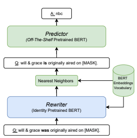

# Bertese: Learning To Speak To Bert

Adi Haviv1 Jonathan Berant1,2 **Amir Globerson**1 1School of Computer Science, Tel Aviv University 2Allen Institute for AI
{adi.haviv,joberant}@cs.tau.ac.il, gamir@post.tau.ac.il

## Abstract

Large pre-trained language models have been shown to encode large amounts of world and commonsense knowledge in their parameters, leading to substantial interest in methods for extracting that knowledge. In past work, knowledge was extracted by taking manuallyauthored queries and gathering paraphrases for them using a separate pipeline. In this work, we propose a method for automatically rewriting queries into "BERTese", a paraphrase query that is directly optimized towards better knowledge extraction. To encourage meaningful rewrites, we add auxiliary loss functions that encourage the query to correspond to actual language tokens. We empirically show our approach outperforms competing baselines, obviating the need for complex pipelines. Moreover, BERTese provides some insight into the type of language that helps language models perform knowledge extraction.

## 1 Introduction

Recent work has shown that large pre-trained language models (LM), trained with a masked language modeling (MLM) objective (Devlin et al.,
2019; Liu et al., 2019; Lan et al., 2019; Sanh et al.,
2019; Conneau et al., 2020), encode substantial amounts of world knowledge in their parameters.

This has led to ample research on developing methods for extracting that knowledge (Petroni et al., 2019, 2020; Jiang et al., 2020; Bouraoui et al., 2020). The most straightforward approach is to present the model with a manually-crafted query such as *"Dante was born in [MASK]"* and check if the model predicts *"Florence"* in the *[MASK]* position. However, when this fails, it is difficult to determine if the knowledge is absent from the LM
or if the model failed to understand the query itself. For example, the model might return the correct answer if the query is "Dante was born in the city of [MASK]".

Figure 1: The BERTese Model. The model takes an input query, rewrites it, and feeds the output to a pretrained BERT model. The untrained components are marked in green, and the blue component is trained.

Motivated by the above observation, we ask: can we automatically find the best way to "ask" an LM
about its knowledge? We refer to this challenge as speaking "BERTese". In particular, we ask how to rewrite a knowledge-seeking query into one that MLMs understand better, where understanding is manifested by providing a correct answer to the query.

Prior work (Jiang et al., 2020) tackled this problem using a 2-step pipeline, where first a small list of paraphrase templates is collected using external resources, and then a model learns to extract knowledge by aggregating information from paraphrases of the input query. In this work, we propose a more general approach, where the model learns to rewrite queries, directly driven by the objective of knowledge-extraction.

Figure 1 provides an overview of our approach.

Our model contains a BERT-based *rewriter*, which takes a query as input, and outputs for each input position a new token, which is its rewrite. This new query is fed into a different BERT *predictor* from which the answer is extracted. Importantly, the downstream predictor BERT is a fixed pre-trained model, and thus the goal is to train the rewriter to produce queries for which the predictor outputs the correct answer.

A technical challenge is that outputting discrete tokens leads to a non-differentiable model, which we tackle by adding a loss term that encourages the rewriter's output to be similar to BERT token embeddings. Moreover, we must guarantee that the BERTese query contains the *[MASK]* token from which the answer will be read. To achieve this, we first add an auxiliary loss term that encourages the model to output precisely one masked token in the query rewrite. We then add a layer that finds the token index that most closely resembles *[MASK]*, and this is where we expect the correct answer to be completed. Training of this selection process is done using the straight-through estimator (Hinton, 2012; Bengio et al., 2013).

We evaluate our approach on the LAMA dataset
(Petroni et al., 2019), and show that our model significantly improves the accuracy of knowledge extraction. Furthermore, many of the rewrites correspond to consistent changes in query wording
(e.g., changing tense), and thus provide information on the types of changes that are useful for extracting knowledge from BERT. While we experiment on BERT, our method is generic and can be applied to any MLM.

Taken together, our results demonstrate the potential of rewriting inputs to language models for both obtaining better predictions, and for potentially gaining insights into how knowledge is represented in these models. Our code can be downloaded from https://github.com/
adihaviv/bertese.

## 2 Related Work

Choosing the right language for extracting world knowledge from LMs has attracted much interest recently. First, Petroni et al. (2019) observed that MLMs can complete simple queries with correct factual information. Jiang et al. (2020) and Heinzerling and Inui (2020) then showed that in the zeroshot setting, small variations to such queries can lead to a drop in fact recall. Orthogonally, another line of research focused on query reformulation for standard Question Answering (QA) tasks. Gan and Ng (2019) demonstrated that even minor query modifications can lead to a significant decrease in performance for multiple QA models and tasks. Buck et al. (2017) showed that it is possible to train a neural network to reformulate a question using Reinforcement Learning (RL), optimizing the accuracy of a black-box QA system. Similarly, Nogueira and Cho (2017) used RL to create a query reformulation system that maximizes the recall of a black-box information retrieval engine.

Jiang et al. (2020) proposed an ensemble method for query reformulation from LMs, that includes:
(1) mining new queries, (2) using an off-the-shelf pre-trained translation model to collect additional paraphrased queries with back-translation, and (3) using a re-ranker to select one or more of the new queries. They then feed those queries to BERT to get the masked token prediction.

In this work, we take the idea of Jiang et al.

(2020) a step forward and train a model in an endto-end fashion to generate rephrased queries which are optimized to maximize knowledge extraction from the MLM.1

## 3 The Bertese Model

Recall that our goal is to build a model that takes as input a query in natural language, and re-writes it into a query that will be fed as input to an existing BERT model.

We refer to the above re-writing model as the rewriter and the existing BERT model as the predictor. We note that both input and output queries should include the token [MASK]. For example the input could be *"Obama was born in [MASK]"* and the output "Obama was born in the state of [MASK]".

We first describe the behaviour of our model at inference time (see Figure 1). Given a query, which is a sequence of tokens, S = (s1*, . . . , s*n), we map S into a sequence of vectors Q(S) ∈ R
d×n using BERT's embeddings of dimensionality d. This input is fed into a (BERT-based) stack of transformer layers that outputs a new sequence of vectors Qˆ(S) ∈ R
d×n.

To obtain vectors that can be used as input to the predictor, we need to map the vectors in each position to their nearest neighbor in the set of BERT

1Although knowledge retrieval has been investigated in autoregressive models as well, similar to Jiang et al. (2020), in this work we focus on MLMs only, as AR-LM only predict an answer if the masked token is at the end of the query.
embeddings. Specifically, let BV be the set of BERT embeddings, and let Qˆi ∈ R
d be the rewritten vector in position i. We map Qˆi ∈ R
dto arg minv∈BV
v − Qˆi 2 2
. We next pass the rewritten query into the pre-trained predictor BERT
model, and obtain an answer from the most probable token in the masked position.

Training this model involves two technical challenges. First, the nearest-neighbor operation is non-differentiable. Second, to obtain the prediction of the [MASK] token, we need to guarantee that the rewriter generates a [MASK] token, and know its position (because this is where the ground-truth answer should be predicted). We overcome these by adding two auxiliary loss functions. The first encourages the model to output vectors that are similar to BERT embeddings (thus reducing the loss in the nearest neighbor operation), and the second encourages the model to output one masked token.

Finally, we apply the straight-through estimator, which allows us to feed discrete word representations into the predictor and backpropagate the signal back to the rewriter. We next provide more details on the terms in our loss function used to train the rewriter. Valid Token Loss: At training time we do not apply the non-differentiable nearest-neighbor operation. Thus, we would like the vectors Qˆ(S) output by the rewriter to be as close as possible to valid BERT embeddings. This loss is the average over tokens of the distance between a re-written query token and its nearest neighbor:

$$f_{1}(S)=\frac{1}{|\hat{Q}(S)|}\sum_{\mathbf{q}\in Q(S)}\operatorname*{min}_{\mathbf{v}\in B_{V}}\left(\|\mathbf{v}-\mathbf{q}\|_{2}^{2}\right).\tag{1}$$

Single [MASK] Loss: The output of the rewriter must contain the *[MASK]* token, so that the predictor can extract an answer from this token. To encourage the rewriter to output a [MASK] we add a loss as follows. We define the following "softmin" distribution over i ∈ {1*, . . . ,* |Qˆ(S)|}:

$$m_{i}(S)=\frac{e^{-\beta\left\|B_{[M A S K]}-\hat{Q}_{i}(S)\right\|_{2}^{2}}}{\sum_{j}e^{-\beta\left\|B_{[M A S K]}-\hat{Q}_{j}(S)\right\|_{2}^{2}}},\quad\quad(2)$$

where β is a trained parameter. The maximum value of this distribution will be highest when there is a single index i that is closest to the embedding of [MASK] (if there are two maxima, they will both have equal values). Thus the loss we consider is:

$$f_{2}(S)=-\max_{i}m_{i}(S).\qquad\qquad(3)$$
i
Prediction Loss: The predictor should return the gold answer y when given Qˆ as input. Without non-differentiability, we could find the index of the
[MASK] token in Qˆ, and use cross-entropy loss between the output distribution of the predictor in that index and the gold answer y. To remedy this, we use a differentiable formulation, combined with the straight-through estimator (STE) (Bengio et al., 2013): Let oi be the output distribution at the i th position of the predictor, and let `(y, p) be the cross-entropy between the one-hot distribution corresponding to y and a distribution p. Then, we use the loss:

$$f_{C E}(S,y)=\sum_{i}m_{i}(S)\ell(y,{\bf o}_{i}).\qquad(4)$$

Thus, if m is a one-hot on the index corresponding to [MASK], the loss will be the desired crossentropy between the gold answer and the predicted distribution. We optimize this objective using the STE. Namely, in the forward pass, we convert m to a one-hot vector.

Our final training loss is the sum of the above three loss terms:

$$L(S,y)=f_{C E}(S,y)+\lambda_{1}\cdot f_{1}(S)+\lambda_{2}\cdot f_{2}(S).\,\,\,(5)$$
(5)+$\lambda_{2}$-f${}_{2}$(5). (5)  tuned using cross-
The weights λ1, λ2 are tuned using crossvalidation.

To summarize, the main challenge is that the rewriter output needs to be optimized to predict the correct label for the [MASK] token (Eq. 4). However, the [MASK] token needs to appear once in the rewriter output. In order to enforce the above, the "Single [MASK] Loss" (Eq. 3) is used. In addition, in order for the rewriter output to be a valid sentence, the "Valid Token Loss" (Eq. 1) is added. This encourages the model to output tokens that are close to BERT input embeddings. This is done by minimizing the distance between each rewriter vector to some vector in the BERT input embedding dictionary. Rewriter pre-training We initialize the rewriter with a BERT-based model, additionally fine-tuned to output the exact word embeddings it received as input (i.e., fine-tuned to the identity mapping).

Thus, when training for knowledge extraction, the rewriter is initialized to output exactly the query it received as input.

## 4 Experiments

Experimental setup We conduct our experiments on the LAMA dataset (Petroni et al., 2019; Jiang et al., 2020), a recently introduced unsupervised knowledge-extraction benchmark for pretrained LMs. LAMA is composed of a collection of cloze-style queries about relational facts with a single token answer. As in Jiang et al. (2020), we limit our main experiment to the T-REx (Elsahar et al., 2018) subset. The T-REx dataset is constructed out of 41 relations, each associated with at most 1000 queries, all extracted from Wikidata.

For training our model, we use a separate training set, created by Jiang et al. (2020), called T-RExtrain. This dataset is constructed from Wikidata and has no overlap with the original T-REx dataset. We evaluate our model on the complete T-REx dataset. Implementation Details Both the rewriter and the predictor are based on BERTbase with the default settings from the Huggingface (Wolf et al.,
2020) platform. We optimize BERTese using AdamW with an initial learning rate of 1e-5. We train the model on a single 32GB NVIDIA V100 for 5 epochs with a batch size of 64. For the loss coefficients (see Eq. (5)) we set λ1 = 0.3 and λ2 = 0.5. Baselines We compare our method to three baselines: (a) BERT - A BERTbase model without any fine-tuning, as evaluated in Petroni et al. (2019). (b) LPAQA - The model proposed by Jiang et al. (2020), based on mining additional paraphrase queries. We report results on a single paraphrase.2(c) FT-BERT: An end-to-end differentiable BERTbase model, explicitly fine-tuned on T-REx-train to output the correct answer. This model, like ours, is trained for knowledge extraction, but does this internally, without exposing an interpretable intermediate textual rewrite.

Results We use the same evaluation metrics as Petroni et al. (2019) and report precision at one (P@1) macro-averaged over relations (we first average within relations and then across relations). As shown in Table 1, BERTese outperforms all three baselines. Compared to the zero-shot setting, where BERT is untrained on any additional data, we improve performance from 31.1 → 38.3. Our model also outperforms a BERT model finetuned for knowledge extraction on the same data as our model (36 → 38.3). Last, we outperform the BERTbase version of LPAQA by more than 4 points.

Table 2 presents example rewrites that are output by our model. It can be seen that rewrites are usually semantically plausible, and make small changes that are not meaningful to humans, but seem to help extract information from BERT, such as was → is and a → the. In some cases, rewrites can be interpreted, for example, replacing the word airfield with the more frequent word *airport*.

Ablation Study In Table 3 we present P@1 results on the T-REx test set after ablating different parts of the loss function. We keep the same label loss, same rewriter pretraining scheme, hyperparameters, and inference process. We show that removing all auxiliary losses hurts performance significantly on the T-REx dataset. Next, we evaluate the impact of removing the "Single [MASK] Loss", and report a drop from 38.3 to 37.3. In addition, when further observing the rewrites the model produces, we find that those will have in some cases more than one [MASK] token. Overall, the results show that having just one of the loss terms substantially improves the performance (either "Valid Token Loss" or "Single [MASK] Loss"), but using both losses further improves accuracy.

| Ablation            | P@1   |
|---------------------|-------|
| No auxilary losses  | 25.3  |
| SML                 | 36.6  |
| VTL                 | 37.5  |
| SML + VTL (BERTese) | 38.3  |

Table 3: Ablation experiments on T-REx. We abbreviate the "Single [MASK] token" as SML and the "Valid Token Loss" as VTL.

Part Of Speech Analysis To better understand what types of changes our rewriter performs, Table 4 shows the distribution over part-of-speech-tags replaced by the rewriter. We show all part-of-speech tags for which the frequency is higher than 1%.

More than 70% of the replacements are nouns and verbs, which carry substantial semantic content.

Interestingly, 15% of the replacements are determiners, which bear little semantic content.

2It is possible to improve results by aggregating over multiple rewrites, but our focus is on a single rewrite.

| Modification   | Original Masked Query                             | Bertese Masked Query                             |
|----------------|---------------------------------------------------|--------------------------------------------------|
| "!" removed    | yahoo! tech is owned by [MASK].                   | yahoo tech is owned by [MASK].                   |
| verb patterns  | working dog is a subclass of [MASK].              | work dog is a subclass of [MASK].                |
| was → is       | will & grace was originally aired on [MASK].      | will & grace is originally aired on [MASK].      |
| a → the        | tom terriss is a [MASK] by profession.            | tom terriss is the [MASK] by profession.         |
| rephrasing     | istanbul hezarfen airfield is named after [MASK]. | istanbul hezarfen airport is named after [MASK]. |
| token → [SEP]  | lubka kolessa plays [MASK].                       | [SEP]ka kolessa plays [MASK].                    |

| Corpus   | BERT   | FT\-BERT   | LPAQA   | BERTese   |
|----------|--------|------------|---------|-----------|
| T\-REx   | 31.1   | 36         | 34.1    | 38.3      |

| POS Tag   | Frequency   |
|-----------|-------------|
| NN        | 47.6%       |
| VBN       | 23%         |
| DT        | 15.3%       |
| JJ        | 4.4%        |
| CD        | 3%          |
| NNP       | 1.7%        |
| NNS       | 1.3%        |

Table 1: Mean precision at one (P@1) for three baselines and our BERTese model on the T-REx dataset.

Table 2: Examples of rewrites from the T-REx test-set, where the original query resulted in a wrong answer, and the BERTese rewrite resulted in correct one.

Table 4: Part-of-speech analysis of rewrites from the T-REx test-set.

## 5 Conclusion

We presented an approach for modifying the input to a BERT model, such that factual information can be more accurately extracted. Our approach uses a trained rewrite model that is optimized to maximize the accuracy of its rewrites, when used as input to BERT. Our rewriting scheme indeed turns out to produce more accurate results than baselines.

Interestingly, our rewrites are fairly small modifications, highlighting the fact that BERT models are not invariant to these edits.

Our approach is not limited to knowledge extraction. It can, in principle, be applied to BERT
in general question answering datasets and even language modeling. In the former, we can change the predictor to a multiple-choice QA pretrained BERT and exclude the single [MASK] token loss. In the latter, we can for example envision a case where rewriting a sentence can make it easier to complete a masked word.

Our empirical setting focuses on the LAMA
dataset, where a single mask token prediction is required. There are several possible extensions to multiple masks, and we leave these for future work. Finally, it will be interesting to test the approach on other masked language models such as RoBERTa
(Liu et al., 2019) and ERNIE (Zhang et al., 2019),
a MLM that is enhanced with external entity representations.

## 6 Acknowledgments

We thank Yuval Kirstain for his contribution in both the Rewriter Pretraining and overall valuable comments, and Edo Cohen-Karlik for his insightful suggestions. This project received funding from the European Research Council (ERC) under the European Union Horizon 2020 research and innovation programme (grant ERC HOLI 819080).

## References

Yoshua Bengio, Nicholas Leonard, and Aaron C. ´
Courville. 2013. Estimating or propagating gradients through stochastic neurons for conditional computation. *CoRR*, abs/1308.3432.

Zied Bouraoui, Jose Camacho-Collados, and Steven Schockaert. 2020. Inducing relational knowledge from bert. Proceedings of the AAAI Conference on Artificial Intelligence, 34(05):7456–7463.

Christian Buck, Jannis Bulian, Massimiliano Ciaramita, Andrea Gesmundo, Neil Houlsby, Wojciech Gajewski, and Wei Wang. 2017. Ask the right questions: Active question reformulation with reinforcement learning. CoRR, abs/1705.07830.

Alexis Conneau, Kartikay Khandelwal, Naman Goyal, Vishrav Chaudhary, Guillaume Wenzek, Francisco Guzman, Edouard Grave, Myle Ott, Luke Zettle- ´ moyer, and Veselin Stoyanov. 2020. Unsupervised cross-lingual representation learning at scale. ACL.

Jacob Devlin, Ming-Wei Chang, Kenton Lee, and Kristina Toutanova. 2019. BERT: Pre-training of deep bidirectional transformers for language understanding. In Proceedings of the 2019 Conference of the North American Chapter of the Association for Computational Linguistics: Human Language Technologies, Volume 1 (Long and Short Papers),
pages 4171–4186, Minneapolis, Minnesota. Association for Computational Linguistics.

Hady Elsahar, Pavlos Vougiouklis, Arslen Remaci, Christophe Gravier, Jonathon Hare, Frederique Laforest, and Elena Simperl. 2018. T-REx: A large scale alignment of natural language with knowledge base triples. In Proceedings of the Eleventh International Conference on Language Resources and Evaluation (LREC 2018), Miyazaki, Japan. European Language Resources Association (ELRA).

Wee Chung Gan and Hwee Tou Ng. 2019. Improving the robustness of question answering systems to question paraphrasing. In *Proceedings of the* 57th Annual Meeting of the Association for Computational Linguistics, pages 6065–6075, Florence, Italy. Association for Computational Linguistics.

Benjamin Heinzerling and Kentaro Inui. 2020. Language models as knowledge bases: On entity representations, storage capacity, and paraphrased queries. *ArXiv*, abs/2008.09036.

Geoffrey Hinton. 2012. Neural networks for machine learning. In *Coursera, video lectures*.

Zhengbao Jiang, Frank F. Xu, Jun Araki, and Graham Neubig. 2020. How can we know what language models know? Transactions of the Association for Computational Linguistics, 8:423–438.

Zhenzhong Lan, Mingda Chen, Sebastian Goodman, Kevin Gimpel, Piyush Sharma, and Radu Soricut. 2019. ALBERT: A lite BERT for selfsupervised learning of language representations. CoRR, abs/1909.11942.

Yinhan Liu, Myle Ott, Naman Goyal, Jingfei Du, Mandar Joshi, Danqi Chen, Omer Levy, Mike Lewis, Luke Zettlemoyer, and Veselin Stoyanov. 2019. Roberta: A robustly optimized BERT pretraining approach. *CoRR*, abs/1907.11692.

Rodrigo Nogueira and Kyunghyun Cho. 2017. Taskoriented query reformulation with reinforcement learning. In Proceedings of the 2017 Conference on Empirical Methods in Natural Language Processing, pages 574–583, Copenhagen, Denmark. Association for Computational Linguistics.

Fabio Petroni, Patrick Lewis, Aleksandra Piktus, Tim Rocktaschel, Yuxiang Wu, Alexander H. Miller, and ¨ Sebastian Riedel. 2020. How context affects language models' factual predictions.

Fabio Petroni, Tim Rocktaschel, Sebastian Riedel, ¨
Patrick Lewis, Anton Bakhtin, Yuxiang Wu, and Alexander Miller. 2019. Language models as knowledge bases? In Proceedings of the 2019 Conference on Empirical Methods in Natural Language Processing and the 9th International Joint Conference on Natural Language Processing (EMNLP-
IJCNLP), pages 2463–2473, Hong Kong, China. Association for Computational Linguistics.

Victor Sanh, Lysandre Debut, Julien Chaumond, and Thomas Wolf. 2019. Distilbert, a distilled version of BERT: smaller, faster, cheaper and lighter. *CoRR*, abs/1910.01108.

Thomas Wolf, Lysandre Debut, Victor Sanh, Julien Chaumond, Clement Delangue, Anthony Moi, Pierric Cistac, Tim Rault, Remi Louf, Morgan Funtowicz, Joe Davison, Sam Shleifer, Patrick von Platen, Clara Ma, Yacine Jernite, Julien Plu, Canwen Xu, Teven Le Scao, Sylvain Gugger, Mariama Drame, Quentin Lhoest, and Alexander Rush. 2020. Transformers: State-of-the-art natural language processing. In Proceedings of the 2020 Conference on Empirical Methods in Natural Language Processing:
System Demonstrations, pages 38–45, Online. Association for Computational Linguistics.

Zhengyan Zhang, Xu Han, Zhiyuan Liu, Xin Jiang, Maosong Sun, and Qun Liu. 2019. ERNIE: Enhanced language representation with informative entities. In Proceedings of the 57th Annual Meeting of the Association for Computational Linguistics, pages 1441–1451, Florence, Italy. Association for Computational Linguistics.