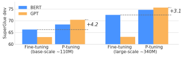
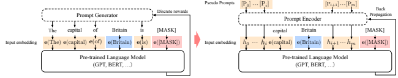

# 

Xiao Liu * 1 2 **Yanan Zheng** * 1 2 **Zhengxiao Du** 1 2 **Ming Ding** 1 2 Yujie Qian 3 **Zhilin Yang** 4 2 **Jie Tang** 1 2

## Abstract

While GPTs with traditional fine-tuning fail to achieve strong results on natural language understanding (NLU), we show that GPTs can be better than or comparable to similar-sized BERTs on NLU tasks with a novel method *P-tuning*— which employs trainable continuous prompt embeddings. On the knowledge probing (LAMA) benchmark, the best GPT recovers 64% (P@1) of world knowledge without any additional text provided during test time, which substantially improves the previous best by 20+ percentage points. On the SuperGlue benchmark, GPTs achieve comparable and sometimes better performance to similar-sized BERTs in supervised learning. Importantly, we find that P-tuning also improves BERTs' performance in both few-shot and supervised settings while largely reducing the need for prompt engineering. Consequently, P-
tuning outperforms the state-of-the-art approaches on the few-shot SuperGlue benchmark.

## 1. Introduction

Language model pre-training has been a successful approach for many natural language processing tasks (Brown et al., 2020). Evidences suggest that during the pre-training, not only do language models learn contextualized text representations, but also grammar (Vig, 2019; Clark et al., 2019b), syntactic (Hewitt & Manning, 2019), commonsense (Davison et al., 2019) and even world knowledge (Petroni et al., 2019; Wang et al., 2020). According to the training objectives, pre-trained language models can be divided into three categories: **unidirectional** language models (e.g., GPT (Radford et al., 2019)) for natural language generation (NLG), **bidirectional language** models (e.g., BERT (Devlin et al., 2018)) for natural lan-

Figure 1. Average scores on 7 dev datasets of SuperGlue. GPTs

can be better than similar-sized BERTs on NLU with P-tuning.

guage understanding (NLU) and **hybrid language models** (e.g., XLNet (Yang et al., 2019), UniLM (Dong et al., 2019)) for combining the first two paradigms. For long, researchers have observed that GPT-style models perform poorly for NLU tasks with fine-tuning, and thus assumed that they are not suitable for language understanding in nature. The emerging GPT-3 (Brown et al., 2020) and its particular performance on few-shot and zero-shot learning with handcrafted prompts has swept the machine learning community. Its success suggests that giant unidirectional language models together with appropriate manual prompt may work for natural language understanding. However, handcrafting a best-performing prompt is like finding a needle in a haystack, which often requires impractically large validation sets. In many cases, prompt engineering effectively means overfitting the test set. Besides, it is easy to create adversarial prompts that result in a substantial performance decrease. In light of these problems, recent works have focused on automatically searching discrete prompts (Jiang et al., 2020b; Shin et al., 2020; Reynolds & McDonell, 2021; Gao et al., 2020) and demonstrated their effectiveness. However, since neural networks are inherently continuous, discrete prompts can be sub-optimal. In this work, we propose a novel method– P-tuning– to automatically search prompts in the continuous space to bridge the gap between GPTs and NLU applications.1 P-
tuning leverages few continuous free parameters to serve as prompts fed as the input to the pre-trained language models. We then optimize the continuous prompts using gradient descent as an alternative to discrete prompt searching.

The simple P-tuning method brings substantial improvements to GPTs. We examine the P-tuning based GPTs on

*Equal contribution 1Tsinghua University, Beijing, China 2Beijing Academy of Artificial Intelligence, Beijing, China 3Massachusetts Institute of Technology, Cambridge, U.S.A. 4Recurrent AI, Ltd.. Correspondence to: Zhilin Yang
<kimi yang@rcrai.com>, Jie Tang <jietang@tsinghua.edu.cn>.

1Codes will be at https://github.com/THUDM/
P-tuning
two NLU benchmarks: the LAMA (Petroni et al., 2019) knowledge probing and SuperGLUE (Wang et al., 2019b). In LAMA knowledge probing where model parameters are fixed, compared to original handcraft prompts, GPTs based on P-tuning show absolute gains of 26.2%-41.1% in Precision@1. The best one achieves 64.2% in LAMA, which significantly surpasses the state-of-the-art 45.2% prompt searching approach. In another NLU benchmark, Super- Glue, we jointly apply the P-tuning and fine-tuning in both few-shot and fully supervised scenarios. As a result, GPTs present a competitive performance to BERT models with the same scales, and for some datasets, GPTs even outperform BERTs. Further experiments demonstrate that BERT-style models can also benefit from P-tuning to some extent. We show that ALBERT with P-tuning substantially outperforms previous approaches and achieves new state-of-the-art results on the few-shot SuperGLUE benchmark. Our discovery breaks the stereotype that GPTs can only generate but do not understand. It also suggests that language models contain much more world knowledge and prior task knowledge than we previously assumed. P-tuning also serves as a general method to tune pre-trained language models for the best downstream task performance. To sum up, we make the following contributions:
- We show that GPTs can be as competitive as BERTs in natural language understanding (sometimes even better) with P-tuning, which can boost pre-trained language models' performance. This reveals that the potential of GPT-style architectures for natural language understanding has been under-estimated.

- We show that P-tuning is a general method to improve GPTs and BERTs in both few-shot and fullysupervised settings. Particularly, with P-tuning, our method outperforms state-of-the-art methods on LAMA knowledge probing and few-shot SuperGlue, which indicates that language models have grasped more world knowledge and prior-task knowledge during pre-training than we previously thought.

## 2. Motivation

The miracle of GPT-3 (Brown et al., 2020) and DALL- E (Ramesh et al., 2021) seem to suggest that giant models are always nothing short of a panacea for boosting machine intelligence. However, behind the prosperity, there are unignorable challenges. A fatal one is that giant models suffer from poor transferability. Fine-tuning on downstream tasks hardly works for those trillion-scale models. Even for the many-shot finetuning setting, these models are still too large to memorize the fine-tuning samples (Yue et al., 2020) quickly.

As a substitution, GPT-3 and DALL-E have been reported to leverage handcrafted prompts to steer the model for downstream applications. However, handcraft prompt searching heavily relies on impractically large validations sets, but its performance is also volatile. We show a similar case in LAMA (Petroni et al., 2019) knowledge probing (Table 1), where a single-word's change can cause a drastic difference.

| Prompt                                         | P@1   |
|------------------------------------------------|-------|
| [X] is located in [Y]. (original)              | 31.29 |
| [X] is located in which country or state? [Y]. | 19.78 |
| [X] is located in which country? [Y].          | 31.40 |
| [X] is located in which country? In [Y].       | 51.08 |

Table 1. Case study on LAMA-TREx P17 with bert-base-cased. A single-word change in prompts could yield a drastic difference.

In light of the challenge, while some recent works have concentrated on automating the search of discrete prompts by mining training corpus (Jiang et al., 2020b), gradient searching (Shin et al., 2020) and using separate model (Gao et al., 2020), we delve into the problem of finding continuous prompts that can be differentially optimized.

## 3. Method: P-Tuning

In this section, we present the implementation of P-tuning. Similar to discrete prompts, the P-tuning only applies noninvasive modification to the input. Nevertheless, the P- tuning replaces the input embeddings of pre-trained language models with its differential output embeddings.

### 3.1. Architecture

Given a pre-trained language model M, a sequence of discrete input tokens x1:n = {x0, x1*, ..., x*n} will be mapped to input embeddings {e(x0), e(x1)*, ...,* e(xn)} by the pretrained embedding layer e ∈ M. In a specific scenario, condition on the context x, we often use the output embeddings of a set of target tokens y for downstream processing. For instance, in the pre-training, x refers to the unmasked tokens while y refers to the [MASK] ones; and in the sentence classification, x refers to the sentence tokens while y often refers to the [CLS]. The function of a prompt p is to organize context x, target y and itself into a template T. For example, in the task of predicting a country's capital (LAMA-TREx P36), a template may be "The capital of Britain is [MASK]." (see Figure 2), in which "The capital of ... is ... ." is prompt,
"Britain" is the context and "[MASK]" is the target. Prompts can be so flexible that we may even insert them into the context or target.

Let V refers to the vocabulary of a language model M and
[Pi] refers to the i th prompt token in a template T. For sim-

(a) Discrete Prompt Search (b) P-tuning

Figure 2. An example of prompt search for "The capital of Britain is [MASK]". Given the context (blue zone, "Britain") and target (red zone, "[MASK]"), the orange zone refer to the prompt tokens. In (a), the prompt generator only receives discrete rewards; on the contrary, in (b) the pseudo prompts and prompt encoder can be optimized in a differentiable way. Sometimes, adding few task-related anchor tokens (such as "capital" in (b)) will bring further improvement.

plicity, given a template T = {[P0:i], x, [Pi+1:m], y}, compared to traditional discrete prompts which satisfy [Pi] ∈ V
and map the T into

$$\{\mathbf{e}([\mathrm{P}_{0:i}]),\mathbf{e}(\mathbf{x}),\mathbf{e}([\mathrm{P}_{i+1:m}]),\mathbf{e}(\mathbf{y})\}$$

P-tuning instead regards the [Pi] as pseudo tokens and map the template to

$$\{h_{0},...,h_{i},\mathbf{e}(\mathbf{x}),h_{i+1},...,h_{m},\mathbf{e}(\mathbf{y})\}$$

where hi(0 ≤ *i < m*) are trainable embedding tensors. This enables us to find a better continuous prompts beyond the original vocabulary V of M could express. Finally, with the downstream loss function L, we can differentially optimize the continuous prompt hi(0 ≤ *i < m*) by

$${\hat{h}}_{0:m}=\arg\operatorname*{min}_{h}{\mathcal{L}}({\mathcal{M}}(\mathbf{x},\mathbf{y}))$$

### 3.2. Optimization

Although the idea of training continuous prompts is straightforward, in practice, it faces two optimization challenges: 1) **Discreteness:** the original word embedding e of M has already become highly discrete after pre-training. If h is initialized with random distribution and then optimized with stochastic gradient descent (SGD), which has been proved to only change the parameters in a small neighborhood (Allen- Zhu et al., 2019), the optimizer would easily fall into local minima. 2) **Association:** another concern would be, intuitively, we believe the values of prompt embeddings hi should be dependent on each other rather than independent. We need some mechanism to associate prompt embeddings with each other. In light of the challenges, in the P-tuning we propose to also model the hi as a sequence using a prompt encoder consists of a very lite neural network that can solve the discreteness and association problems. And in practice, we choose a bidirectional long-short term memory networks (LSTM), with a

$$(1)$$

ReLU activated two-layer multilayer perceptron (MLP) to encourage discreteness. Formally speaking, the real input embeddings h 0ito the language model M is derived from

$$h_{i}=\text{MLP}([\overrightarrow{h_{i}}:\overleftarrow{h_{i}}])\tag{4}$$ $$=\text{MLP}([\text{LSTM}(h_{0:i}):\text{LSTM}(h_{i:m})])$$
$$(2)$$

Though the LSTM head's use indeed adds some parameters to the training of continuous prompts, the LSTM head is several magnitude orders smaller than the pre-trained model. Moreover, in the inference, we only need the output embedding h and can discard the LSTM head.

$$({\mathfrak{I}})$$

Besides, we also find that adding few anchor tokens helps some NLU tasks in the SuperGLUE benchmark. For instance, for RTE task, the token "?" within prompt template
"[PRE][prompt tokens][HYP]?[prompt tokens][MASK]" is specially added as an anchor token and affects the performance a lot. Usually such anchor words characterize each component, where in this case "?" indicate that "[HYP]" acts as an interrogation part.

## 4. Experiments

In this section, we conduct extensive experiments on two widely acknowledged natural language understanding benchmarks: LAMA (Petroni et al., 2019) knowledge probing and SuperGlue (Wang et al., 2019b). The encouraging results show that P-tuning can substantially boost GPTs' performance on natural language understanding, and BERT- style models can also be improved with a smaller gain.

### 4.1. Knowledge Probing

Knowledge probing, or referred to as fact retrieval, evaluates how much real-world knowledge has language models gained from pre-training. The LAMA (Petroni et al., 2019)
dataset evaluates it with cloze tests created from triples selected in the knowledge bases. For example, we will

| Prompt type   | Model                   | P@1        | Model                            | MP                                                          | FT   | MP+FT   | P\-tuning    |
|---------------|-------------------------|------------|----------------------------------|-------------------------------------------------------------|------|---------|--------------|
|               |                         |            | BERT\-base (109M)                | 31.7                                                        | 51.6 | 52.1    | 52.3 (+20.6) |
| Original      | BERT\-base  BERT\-large | 31.1  32.3 | \-AutoPrompt (Shin et al., 2020) | \-                                                          | \-   | \-      | 45.2         |
| (MP)          |                         |            | BERT\-large (335M)               | 33.5                                                        | 54.0 | 55.0    | 54.6 (+21.1) |
|               | E\-BERT                 | 36.2       |                                  |                                                             |      |         |              |
| Discrete      | LPAQA (BERT\-base)      | 34.1       | RoBERTa\-base (125M)             | 18.4                                                        | 49.2 | 50.0    | 49.3 (+30.9) |
|               |                         |            | \-AutoPrompt (Shin et al., 2020) | \-                                                          | \-   | \-      | 40.0         |
|               | LPAQA (BERT\-large)     | 39.4       |                                  |                                                             |      |         |              |
|               | AutoPrompt (BERT\-base) | 43.3       | RoBERTa\-large (355M)            | 22.1                                                        | 52.3 | 52.4    | 53.5 (+31.4) |
| P\-tuning     | BERT\-base              | 48.3       | GPT2\-medium (345M)              | 20.3                                                        | 41.9 | 38.2    | 46.5 (+26.2) |
|               | BERT\-large             | 50.6       | GPT2\-xl (1.5B)                  | 22.8                                                        | 44.9 | 46.5    | 54.4 (+31.6) |
|               |                         |            | MegatronLM (11B)                 | 23.1                                                        | OOM∗ | OOM∗    | 64.2 (+41.1) |
|               |                         |            |                                  | * MegatronLM (11B) is too large for effective fine\-tuning. |      |         |              |

Table 2. Knowledge probing Precision@1 on LAMA-34k (left) and LAMA-29k (right). P-tuning outperforms all the discrete prompt searching baselines. And interestingly, despite fixed pre-trained model parameters, P-tuning overwhelms the fine-tuning GPTs in

LAMA-29k. (MP: Manual prompt; FT: Fine-tuning; MP+FT: Manual prompt augmented fine-tuning; PT: P-tuning ).

transform the triple (Dante, born-in, Florence) into a cloze sentence with the handcraft prompt "Dante was born in [MASK].", and then we ask language models to inference the target. Because we want to evaluate knowledge gained from pre-training, pre-trained language models' parameters are fixed (i.e., not fine-tuned).

### 4.1.1. Datasets And Formulation

Datasets. LAMA enforces all answers in single-token format. We first adopt the original LAMA-TREx dataset, consisting of 41 Wikidata relations and altogether 34,039 testing triples (namely LAMA-34k, which covers all BERT vocabularies). Because GPT and BERT's vocabularies are different, we set up another version of LAMA, which covers the intersection of GPT and BERT's vocabulary. This subset adds up to about 29,000 testing triples, and we name it the LAMA-29k. As for training, all prompt searching approaches need some additional data to train or find the prompts. We follow the setting in AutoPrompt (Shin et al., 2020), where the authors construct a training set from the original TRE-x dataset. This training set is similar to the test set but with a slightly different answer distribution. Evaluation. Originally, LAMA has provided a handcraft prompt for each relation such as Table 1, which are effective but sub-optimal. For bidirectional masked language models, we only need to replace the "[X]" with the subject entity and "[Y]" with the [MASK] token; for unidirectional language models such as GPT, following LAMA's original setting on Transformer-XL (Dai et al., 2019), we use the network output just before the target position. In terms of conducting P-tuning , we use a (3, sub,3, obj,3) template for bidirectional models and (3, sub,3, obj) for unidirectional models, where the number indicates the number of prompt tokens. In this knowledge probing task, we do not use any anchor tokens. During the training, we set the learning rate to 1e-5 and use the Adam optimizer.

4.1.2. RESULTS
General performance. The results are presented in Table 2. The P-tuning significantly pushes the boundary of knowledge probing from 43.3% to 50.6% in LAMA-34k and 45.2% to a maximum of 64.2% in LAMA-29k. This result strongly suggests that language models capture far more knowledge than people previously believed by merely finding a better prompt and without fine-tuning. When P-
tuning is compared with previous discrete prompt searching approaches such as AutoPrompt (Shin et al., 2020) and LPAQA (Jiang et al., 2020b) on the same-size models, P- tuning still outperforms them. P-tuning v.s. Fine-tuning. It is not allowed to change the pre-trained model's parameters by fine-tuning in traditional knowledge probing. We seek to evaluate how much knowledge has language models learned during pre-training. However, this work's essential aspect is to compare P-tuning and fine-tuning, particularly on unidirectional language models like GPT. We are especially interested in the following question: Are unidirectional and bidirectional language models gaining similar improvement from P-tuning ? To make a comprehensive review on existing tuning methods, we include the following approaches: 1) Manual Prompt (MP): use original handcraft prompts from LAMA. 2) Fine-tuning (FT): only to present the subject and finetune the model to predict the object. 3) Manual Prompt with Fine-tuning (MP+FT): fine-tuning the language model with the handcraft prompts. 4) P-tuning : use continuous prompts (while fixing language models' parameters).

We implement the four strategies in the LAMA-29k (see Table 2, right), and we find that P-tuning is comparable to or better than fine-tuning-based methods, which is surprising but reasonable. The surprising thing is that fine-tuning should have been more potent since it tunes all language models' parameters, while P-tuning not. However, it is also reasonable because, in terms of knowledge probing, many facts can only be hard-coded rather than inferenced by language models. The fine-tuning of parameters might result in catastrophic forgetting. On the contrary, P-tuning does not change the pre-trained models' parameters but evoke the stored knowledge by finding a better continuous prompt. Besides, it is interesting to see a clear gap between BERT and GPT's improvement to the P-tuning . Fine-tuning with high-quality manual prompts (MP+FT) (Schick & Schutze ¨ , 2020; Gao et al., 2020) has been proved to be quite effective, which is also observed in our experiments. However, it is surprising that GPTs do not benefit from MP+FT as much as from P-tuning as BERTs do. In other words, P-tuning shows a better affinity with unidirectional language models. In terms of much larger models such as MegatronLM2 with 11 billion parameters, while fine-tuning hardly works, P- tuning is still applicable and achieve the state-of-the-art on LAMA.

### 4.2. Superglue

To evaluate P-tuning , we perform experiments on the Super- GLUE (Wang et al., 2019a) benchmark. There are 8 natural language understanding (NLU) tasks in total, and we focus on 7 of them as (Schick & Schutze ¨ , 2020), since the other ReCoRD (Zhang et al., 2018) adopts no prompts, thus no P-tuning . Tasks include question answering (BoolQ (Clark et al., 2019a) & MultiRC (Khashabi et al., 2018)), textual entailment (CB (De Marneffe et al., 2019) & RTE (Dagan et al., 2005)), co-reference resolution (WiC (Pilehvar & Camacho- Collados, 2018)), causal reasoning (COPA (Roemmele et al., 2011)), and word sense disambiguation (WSC (Levesque et al., 2012)). For experimental settings, we consider both a fullysupervised setting and a few-shot setting. In the fullysupervised setting, we use the entire training sets (D*train*) and use development sets (Ddev) for model selection and hyper-parameter tuning. For the few-shot setting, the few-shot version of SuperGLUE (also known as FewGlue) (Schick & Schutze ¨ , 2020) is adopted. FewGLUE is a subset of SuperGLUE, each task consisting of 32 train data (D*train*32) and an additional unlabeled set (D*unlabeled*)
of different size ranging from 400 to 20000. Different from previous work (Schick & Schutze ¨ , 2020) which assumes no development sets and adopts fixed hyper-parameters according to empirical selection (which essentially overfits the test sets), we construct appropriate few-shot development sets (denoted as Ddev32). Since it has been proven that larger development sets confer additional significant advantages (Gao et al., 2020), Ddev32 is built by randomly selecting samples from unused training data and is strictly restricted to be no larger than the size of few-shot train sets. We adopt the same evaluation metrics as (Schick & Schutze ¨ , 2020). We reformulate NLU tasks into blank filling tasks. Unlike (Schick & Schutze ¨ , 2020) that use patterns with human hand-crafted prompts, P-tuning puts initial prompt embeddings in different positions within patterns and then finetunes the prompt embeddings together with the pretrained models. For fully-supervised settings, we use the AdamW optimizer with a linearly decayed learning rate. We perform grid search of hyper-parameters and take the best combination on Ddev or Ddev32. Specifically, we take learning rates from 1e-5, 2e-5, 3e-5 and batch sizes from 16, 32. For small datasets (COPA, WSC, CB, RTE), we fine-tune pretrained models for 20 epochs. For larger datasets (WiC, BoolQ, MultiRC), we reduce the number of training epochs to be 10 as the model converges earlier. We evaluate the performance of every epoch. We use early stopping to avoid overfitting to the training data. For few-shot learning, we use the same hyperparameters as (Schick & Schutze ¨ , 2020) except extending fine-tuning steps to be 3500 (instead of 250 as (Schick & Schutze ¨ , 2020)), since the fine-tuning of prompt embeddings requires even more steps. P-tuning can be used on all unidirectional and bidirectional models. We choose models with similar scales of total computes for a fair comparison, where we choose to compare BERT-base 3 with GPT2-base and compare BERT-large with GPT2-medium. Models like RoBERTa have a similar model size but was trained with much larger compute, which should be compared with larger-scale GPTs. This is left to future work. Besides, for few-shot learning, we also experiment with albert-xxlarge-v2, which is proved to be the best-performed pretrained models for the few-shot setting in (Schick & Schutze ¨ , 2020). For each pretrained model, we report the performance of standard finetuning (i.e., classification using [CLS] embeddings), PET finetuning (Schick & Schutze ¨ , 2020), PET zero-shot, and P-tuning .

### 4.2.1. Fully-Supervised Learning

The main results are shown in Table 3 and Table 4. Firstly, for both bert-base-cased and bert-large-cased models, P- tuning outperforms all the other bert-based models on 5 out of 7 tasks. Exceptions are WiC and MultiRC, where P-tuning performs a little bit worse than standard fine-tune. Since both WiC and MultiRC have relatively large train sets, we conjecture this can be attributed to the fact that standard fine-tune could take even more advantages from a larger dataset than P-tuning . On the contrary, P-tuning appears to be more beneficial in low-resource settings. Similar obser-

2Provided in fairseq: https://github.com/pytorch/
fairseq/tree/master/examples/megatron_11b 3We use the cased version of BERT for comparison since the vocabulary of GPT2 is also cased.

| Method          | BoolQ   |        | CB     | WiC                      | RTE     |        | MultiRC   | WSC    | COPA   | Avg.   |
|-----------------|---------|--------|--------|--------------------------|---------|--------|-----------|--------|--------|--------|
| (Acc.)          |         | (Acc.) | (F1)   | (Acc.)                   | (Acc.)  | (EM)   | (F1a)     | (Acc.) | (Acc.) |        |
|                 |         |        |        | BERT\-base\-cased (109M) |         |        |           |        |        |        |
| Fine\-tuning    | 72.9    | 85.1   | 73.9   | 71.1                     | 68.4    | 16.2   | 66.3      | 63.5   | 67.0   | 66.2   |
| MP zero\-shot   | 59.1    | 41.1   | 19.4   | 49.8                     | 54.5    | 0.4    | 0.9       | 62.5   | 65.0   | 46.0   |
| MP fine\-tuning | 73.7    | 87.5   | 90.8   | 67.9                     | 70.4    | 13.7   | 62.5      | 60.6   | 70.0   | 67.1   |
| P\-tuning       | 73.9    | 89.2   | 92.1   | 68.8                     | 71.1    | 14.8   | 63.3      | 63.5   | 72.0   | 68.4   |
|                 |         |        |        | GPT2\-base (117M)        |         |        |           |        |        |        |
| Fine\-tune      | 71.2    | 78.6   | 55.8   | 65.5                     | 67.8    | 17.4   | 65.8      | 63.0   | 64.4   | 63.0   |
| MP zero\-shot   | 61.3    | 44.6   | 33.3   | 54.1                     | 49.5    | 2.2    | 23.8      | 62.5   | 58.0   | 48.2   |
| MP fine\-tuning | 74.8    | 87.5   | 88.1   | 68.0                     | 70.0    | 23.5   | 69.7      | 66.3   | 78.0   | 70.2   |
| P\-tuning       | 75.0    | 91.1   | 93.2   | 68.3                     | 70.8    | 23.5   | 69.8      | 63.5   | 76.0   | 70.4   |
| (+1.1)          |         | (+1.9) | (+1.1) | (\-2.8)                  | (\-0.3) | (+7.3) | (+3.5)    | (+0.0) | (+4.0) | (+2.0) |

Table 3. Fully-supervised learning on SuperGLUE dev with base-scale models. MP refers to manual prompt. For a fair comparison, MP zero-shot and MP fine-tuning report results of a single pattern, while anchors for P-tuning are selected from the same prompt. Subscript in

| CB     | BoolQ  Method         |        | WiC                       | RTE     |        | MultiRC   | WSC     | COPA   | Avg.   |
|--------|-----------------------|--------|---------------------------|---------|--------|-----------|---------|--------|--------|
| (F1)   | (Acc.)                | (Acc.) | (Acc.)                    | (Acc.)  | (EM)   | (F1a)     | (Acc.)  | (Acc.) |        |
|        |                       |        | BERT\-large\-cased (335M) |         |        |           |         |        |        |
| 94.6   | Fine\-tune∗  77.7     | 93.7   | 74.9                      | 75.8    | 24.7   | 70.5      | 68.3    | 69.0   | 72.5   |
| 50.0   | MP zero\-shot  49.7   | 34.2   | 50.0                      | 49.9    | 0.6    | 6.5       | 61.5    | 58.0   | 45.0   |
| 91.1   | MP fine\-tuning  77.2 | 93.5   | 70.5                      | 73.6    | 17.7   | 67.0      | 80.8    | 75.0   | 73.1   |
| 96.4   | P\-tuning  77.8       | 97.4   | 72.7                      | 75.5    | 17.1   | 65.6      | 81.7    | 76.0   | 74.6   |
|        |                       |        | GPT2\-medium (345M)       |         |        |           |         |        |        |
| 73.2   | Fine\-tune  71.0      | 51.2   | 65.2                      | 72.2    | 19.2   | 65.8      | 62.5    | 66.0   | 63.1   |
| 44.6   | MP zero\-shot  56.3   | 26.6   | 54.1                      | 51.3    | 2.2    | 32.5      | 63.5    | 53.0   | 47.3   |
| 96.4   | MP fine\-tuning  78.3 | 97.4   | 70.4                      | 72.6    | 32.1   | 74.4      | 73.0    | 80.0   | 74.9   |
| 98.2   | P\-tuning  78.9       | 98.7   | 69.4                      | 75.5    | 29.3   | 74.2      | 74.0    | 81.0   | 75.6   |
| (+1.8) | (+1.1)                | (+1.3) | (\-5.5)                   | (\-0.3) | (+4.6) | (+3.7)    | (\-7.7) | (+5.0) | (+1.0) |

red represents advantages of GPT with P-tuning over the best results of BERT.

* We report the same results taken from SuperGLUE (Wang et al., 2019b).

Table 4. Fully-supervised learning on SuperGLUE dev with large-scale models. MP refers to manual prompt. For fair comparison, MP
zero-shot and MP fine-tuning report results of a single pattern, while anchors for P-tuning are selected from the same prompt. Subscripts in red represents improvements of GPT with P-tuning over the best results of BERT.

vations are also shown in Section 4.2.2. Secondly, for both gpt2-base and gpt2-medium models, P-tuning achieves the most promising results among all gpt2-base models. Above all, we can conclude that P-tuning can effectively boost the NLU performance of both bert-based and gpt-based models. Besides, under the scale of base models, gpt2-base with P- tuning outperforms the best results of BERT-based models on 6 out of 7 tasks while achieving comparable results on WiC. Comparing with BERT-large models, GPT2-medium with P-tuning shows advantages on 4 out of 7 tasks while being comparable on RTE and WSC tasks. The only exception is the WiC task. It is noticed that on the WiC task, standard fine-tune shows the best results on different models with different settings. We speculate that it is because the word sense disambiguation task is not appropriate for prompt-based MLM prediction. Above all, we conclude that with P-tuning , GPT2 achieves comparable and even better performance as BERT-based models. The discovery subverts our common belief that bidirectional models (such as BERT) are always better at NLU tasks than unidirectional models (such as GPT2).

### 4.2.2. Few-Shot Learning

Sub-optimal and Sensitive Manual Prompts. Initially, PET/iPET (Schick & Schutze ¨ , 2020) has achieved the stateof-the-arts on SuperGLUE few-shot learning tasks with several manually-written prompts, which are effective, but sub-optimal and labor-intensive. For a comprehensive understanding of manual prompts, comparative experiments are first conducted. Table 6 shows the results of using different manual prompts and P-tuning . First, results show that the few-shot performance has no obvious correlations with prompts' semantics, format, grammar. Prompts that humans consider reasonable is not necessarily effective for language models. Second, minor changes in manual prompts would cause substantial performance differences. Pretrained language models are pretty sensitive to the choice of prompts. We can conclude that manual handwriting prompts are more

| Dev size   | Method    | BoolQ    | CB       |          | WiC      | RTE      | MultiRC   |          | WSC      | COPA     |
|------------|-----------|----------|----------|----------|----------|----------|-----------|----------|----------|----------|
|            |           | (Acc.)   | (Acc.)   | (F1)     | (Acc.)   | (Acc.)   | (EM)      | (F1a)    | (Acc.)   | (Acc.)   |
| 32         | PET∗      | 73.2±3.1 | 82.9±4.3 | 74.8±9.2 | 51.8±2.7 | 62.1±5.3 | 33.6±3.2  | 74.5±1.2 | 79.8±3.5 | 85.3±5.1 |
|            | PET best† | 75.1     | 86.9     | 83.5     | 52.6     | 65.7     | 35.2      | 75.0     | 80.4     | 83.3     |
|            | P\-tuning | 77.8     | 92.9     | 92.3     | 56.3     | 76.5     | 36.1      | 75.0     | 84.6     | 87.0     |
|            |           | (+4.6)   | (+10.0)  | (+17.5)  | (+4.5)   | (+14.4)  | (+2.5)    | (+0.5)   | (+4.8)   | (+1.7)   |
| Full       | GPT\-3    | 77.5     | 82.1     | 57.2     | 55.3     | 72.9     | 32.5      | 74.8     | 75.0     | 92.0     |
|            | PET‡      | 79.4     | 85.1     | 59.4     | 52.4     | 69.8     | 37.9      | 77.3     | 80.1     | 95.0     |
|            | iPET§     | 80.6     | 92.9     | 92.4     | 52.2     | 74.0     | 33.0      | 74.0     | \-       | \-       |

* We report the average and standard deviation of each candidate prompt's average performance.

† We report the best performed prompt selected on *full* dev dataset among all candidate prompts. ‡ With additional ensemble and distillation. § With additional data augmentation, ensemble, distillation and self-training.

Table 5. Few-shot learning (32 train samples) on SuperGLUE dev. Previous few-shot learning approaches use the original full dev set (Ddev) for validation, which does not make sense. We construct a new dev set (Ddev32) with 32 unused samples from original training set. Under fair comparison, P-tuning significantly outperforms PET (Ddev32) and PET best (Ddev32) on all tasks. More interestingly, P-tuning even outperforms GPT-3, PET (Ddev) and iPET (Ddev) on 4 out of 7 tasks. Subscripts in red represents the improvements of

P-tuning over PET(Ddev32).

complicated than we thought. Moreover, Table 6 also proves that it is impossible to find the best-performed manual prompts using Ddev32. This indicates it is also challenging to pick the best manual prompts out in the few-shot setting. In contrast, P-tuning appears promising in automatically searching better prompts with far fewer hand-crafts. Updated SOTA for SuperGLUE Few-shot Learning. Table 5 presents the latest state-of-the-art results for Super- GLUE few-shot learning, achieved by P-tuning . We compared it with several baselines, including PET (Schick & Schutze ¨ , 2020) and GPT-3 (Brown et al., 2020), which achieves previous SuperGLUE Few-shot SOTA.

It is worth noting that, aside from manual prompt finetuning, the original PET (Schick & Schutze ¨ , 2020) adopts multiple additional technologies, including data augmentation, ensemble, and distillation, to boost the performance. Besides, it performs model selection and hyper-parameter tuning by over-fitting test sets. To ensure a fair comparison, PET is re-experimented under our Ddev32 setting, removing all auxiliary technologies (data augmentation, ensemble, and distillation). Considering PET provides multiple manual prompts, both averaged performance, and the bestperformed-prompt performance are reported. Table 5 illustrates that P-tuning consistently outperforms PET (Ddev32) and PET-best (Ddev32) with manual prompts on all tasks. The improvements of solution over PET
(Ddev32) are larger than the standard deviations over multiple patterns on 5 out of 7 tasks, proving that P-tuning can search far better prompts than manual ones and significantly improve few-shot task performance. On tasks including CB,WiC,RTE and WSC, P-tuning even outperforms PET/iPET (Ddev), which adopt auxiliary technologies (data augmentation, ensemble and distillation). Compared with GPT-3, with much larger scale than P-tuning (albert-xxlargev2), P-tuning outperforms on 6 out of 7 tasks. Results demonstrate the advantages of P-tuning in few-shot NLU tasks.

### 4.2.3. Finetuning V.S. Mp Finetuning V.S. P-Tuning

Table 3 and Table 4 present results of three tuning-based paradigms for improving NLU performance. We are particularly interested in how these tuning-based paradigms perform differently. Overall, P-tuning outperforms finetuning and MP fine-tuning on average by around 2 points on BERT-based models and more than 5 points on GPT2based models. Specifically, though P-tuning achieves the best results on most of the tasks, fine-tuning can outperform on tasks (e.g., WiC) that are hard to formulate as cloze questions. Comparing P-tuning and MP fine-tuning, P-tuning generally shows more advantages than MP finetuning on average, since it is tricky for MP fine-tuning to find good manual prompts. In contrast, P-tuning can always automatically search for better prompts.

As a new paradigm of tuning pretrained models, P- tuning could search over a vast prompt space while tuning pretrained models' parameters. Results demonstrate its competitive potential in prompting larger-scale pre-trained models that are hard to fine-tune.

## 5. Related Work

### 5.1. Pre-Trained Language Models

The recent breakthrough in self-supervised (Liu et al., 2020) pre-trained language models has boosted the development of natural language processing. GPT (Radford et al., 2019) first leverages the transformer architecture to pre-train on

| Prompt                                                | Ddev Acc.   | Ddev32 Acc.   |
|-------------------------------------------------------|-------------|---------------|
| Does [PRE] agree with [HYP]? [MASK].                  | 57.16       | 53.12         |
| Does [HYP] agree with [PRE]? [MASK].                  | 51.38       | 50.00         |
| Premise: [PRE] Hypothesis: [HYP] Answer: [MASK].      | 68.59       | 55.20         |
| [PRE] question: [HYP]. true or false? answer: [MASK]. | 70.15       | 53.12         |
| P\-tuning                                             | 76.45       | 56.25         |

Table 6. Few-shot performance comparison of different manual prompts and tuned prompts on RTE tasks using albert-xxlarge-v2. Experiments use Ddev32 for model selection and hyper-parameter tuning and evaluate on Ddev. There's no obvious correlations between

manual prompts and performance. Besides, Ddev32 is not able to select the best manual prompts.

large-scale web texts. BERT (Devlin et al., 2018) proposes the masked language modeling and creates the pre-train/finetuning paradigm. Later on, various kinds of language models grown up, including XLNet (Yang et al., 2019) which innovates the permutation language modeling. RoBERTa (Liu et al., 2019) conducts detailed experiments to demonstrate useful techniques related to pre-training. BART (Lewis et al., 2019), T5 (Raffel et al., 2019) and UniLM (Dong et al., 2019) which try to unify the language understanding and generation.

### 5.2. Language Models As Knowledge Base

Since the birth of language models, researchers have observed that they not only learn contextualized text representations but also various types and amounts of knowledge, including linguistic and world knowledge. (Hewitt & Manning, 2019) demonstrates that contextualized representation produced by language models can form a parsing tree in the embedding space. (Vig, 2019; Clark et al., 2019b) look into the multi-head attention internal transformers and discover that certain attention heads may correspond to some grammatical functions, including co-reference and noun modifiers. Another important stream is about how much world knowledge or factual knowledge has language models learned. LAMA (Petroni et al., 2019; 2020) propose to leverage cloze test transformed from fact triples in knowledge bases to examine language model's ability in memorizing facts with answers in the single-token format. In (Wang et al., 2020), the authors investigate the attention matrices to find that the attentions would also indicate knowledge triples contained in the context and thus develop an open knowledge graph construction framework. (Jiang et al., 2020a) based on LAMA develops a multi-token fact retrieval dataset.

### 5.3. Language Model Prompting

The birth of GPT-3 (Brown et al., 2020) has blown people's minds with its outstanding performance in multi-task and few-shot learning. However, GPT-3 is not designed for fine-tuning, and it heavily relies on handcraft prompts (or the *in-context learning* (Liu et al., 2021; Zhao et al., 2021)) to transfer to downstream tasks. To better apply large language models to natural language understanding (NLU), recent works have concentrated on automating the search of discrete prompts by mining training corpus (Jiang et al., 2020b), token-based gradient searching (Shin et al., 2020) and using separate model (Gao et al., 2020) such as T5 to generate prompts. However, the search over discrete space is challenging to optimize and sub-optimal due to the continuous nature of neural networks. Recently, (Li & Liang, 2021) propose prefix-tuning for natural language generation (NLG) tasks, which adopts a similar strategy to our P-tuning to train continuous prompt. Nevertheless, they are different in several aspects. First, prefixtuning is designed for NLG and GPTs, while P-tuning targets NLU and all types of language models. Second, prefixtuning only allows adding prompt tokens at the beginning of the input sequence, while P-tuning can insert the tokens anywhere. Third, prefix-tuning invasively concatenates continuous prompt tokens in every layer of the transformer because the authors find mere prompting in the input does not take effect; on the contrary, P-tuning non-invasively adds continuous prompts only in the input to work well. Finally, P-tuning also introduces how to use anchor prompts for further improvement. Despite the differences, we believe that both our P-tuning and prefix-tuning point out that learning continuous prompts is useful and superior to discrete prompt searching.

## 6. Conclusion

In this paper, we present–*P-tuning*–which augments pretrained model's ability in natural language understanding by automatically searching better prompts in the continuous space. Our P-tuning method relies less on a large validation set, suffers less from adversarial prompts, and alleviates over-fitting. We show that our P-tuning method can recover 64% (P@1) of world knowledge from a pre-trained language model without any additional text provided during test time. On the SuperGLUE benchmark, P-tuning endows GPT-style models to show competitive performance with similar-size BERTs in natural language understanding, which is assumed impossible in the past. P-tuning also helps on bidirectional models and consequently outperforms stateof-the-art methods in the few-shot SuperGlue benchmark. It

## References

also proves that language models effectively capture more world knowledge and prior-task knowledge than we thought during pre-training.

Gao, T., Fisch, A., and Chen, D. Making pre-trained language models better few-shot learners. *arXiv preprint* arXiv:2012.15723, 2020.

Hewitt, J. and Manning, C. D. A structural probe for finding syntax in word representations. In *North American* Chapter of the Association for Computational Linguistics: Human Language Technologies (NAACL). Association for Computational Linguistics, 2019.

Allen-Zhu, Z., Li, Y., and Song, Z. A convergence theory for deep learning via over-parameterization. In International Conference on Machine Learning, pp. 242–252. PMLR, 2019.

Jiang, Z., Anastasopoulos, A., Araki, J., Ding, H., and Neubig, G. X-factr: Multilingual factual knowledge retrieval from pretrained language models. In Proceedings of the 2020 Conference on Empirical Methods in Natural Language Processing (EMNLP), pp. 5943–5959, 2020a.

Brown, T. B., Mann, B., Ryder, N., Subbiah, M., Kaplan, J., Dhariwal, P., Neelakantan, A., Shyam, P., Sastry, G., Askell, A., et al. Language models are few-shot learners. arXiv preprint arXiv:2005.14165, 2020.

Clark, C., Lee, K., Chang, M.-W., Kwiatkowski, T., Collins, M., and Toutanova, K. Boolq: Exploring the surprising difficulty of natural yes/no questions. In *Proceedings* of the 2019 Conference of the North American Chapter of the Association for Computational Linguistics: Human Language Technologies, Volume 1 (Long and Short Papers), pp. 2924–2936, 2019a.

Jiang, Z., Xu, F. F., Araki, J., and Neubig, G. How can we know what language models know? Transactions of the Association for Computational Linguistics, 8:423–438, 2020b.

Khashabi, D., Chaturvedi, S., Roth, M., Upadhyay, S., and Roth, D. Looking beyond the surface: A challenge set for reading comprehension over multiple sentences. In Proceedings of the 2018 Conference of the North American Chapter of the Association for Computational Linguistics: Human Language Technologies, Volume 1 (Long Papers), pp. 252–262, 2018.

Clark, K., Khandelwal, U., Levy, O., and Manning, C. D.

What does bert look at? an analysis of bert's attention. arXiv preprint arXiv:1906.04341, 2019b.

Dagan, I., Glickman, O., and Magnini, B. The pascal recognising textual entailment challenge. In Machine Learning Challenges Workshop, pp. 177–190. Springer, 2005.

Langley, P. Crafting papers on machine learning. In Langley, P. (ed.), *Proceedings of the 17th International Conference* on Machine Learning (ICML 2000), pp. 1207–1216, Stanford, CA, 2000. Morgan Kaufmann.

Dai, Z., Yang, Z., Yang, Y., Carbonell, J., Le, Q. V., and Salakhutdinov, R. Transformer-xl: Attentive language models beyond a fixed-length context. *arXiv preprint* arXiv:1901.02860, 2019.

Levesque, H., Davis, E., and Morgenstern, L. The winograd schema challenge. In Thirteenth International Conference on the Principles of Knowledge Representation and Reasoning. Citeseer, 2012.

Davison, J., Feldman, J., and Rush, A. M. Commonsense knowledge mining from pretrained models. In Proceedings of the 2019 Conference on Empirical Methods in Natural Language Processing and the 9th International Joint Conference on Natural Language Processing (EMNLP- IJCNLP), pp. 1173–1178, 2019.

Lewis, M., Liu, Y., Goyal, N., Ghazvininejad, M., Mohamed, A., Levy, O., Stoyanov, V., and Zettlemoyer, L. Bart: Denoising sequence-to-sequence pre-training for natural language generation, translation, and comprehension. *arXiv preprint arXiv:1910.13461*, 2019.

De Marneffe, M.-C., Simons, M., and Tonhauser, J. The commitmentbank: Investigating projection in naturally occurring discourse. In proceedings of Sinn und Bedeutung, volume 23, pp. 107–124, 2019.

Li, X. L. and Liang, P. Prefix-tuning: Optimizing continuous prompts for generation. *arXiv preprint arXiv:2101.00190*, 2021.

Devlin, J., Chang, M.-W., Lee, K., and Toutanova, K. Bert:
Pre-training of deep bidirectional transformers for language understanding. *arXiv preprint arXiv:1810.04805*, 2018.

Liu, J., Shen, D., Zhang, Y., Dolan, B., Carin, L., and Chen, W. What makes good in-context examples for gpt-3?

arXiv preprint arXiv:2101.06804, 2021.

Dong, L., Yang, N., Wang, W., Wei, F., Liu, X., Wang, Y.,
Gao, J., Zhou, M., and Hon, H.-W. Unified language model pre-training for natural language understanding and generation. *arXiv preprint arXiv:1905.03197*, 2019.

Liu, X., Zhang, F., Hou, Z., Wang, Z., Mian, L., Zhang, J., and Tang, J. Self-supervised learning: Generative or contrastive. *arXiv preprint arXiv:2006.08218*, 1(2), 2020.

Language Understanding Systems. In *NeurIPS 2019*, pp. 3261–3275, 2019a.

Liu, Y., Ott, M., Goyal, N., Du, J., Joshi, M., Chen, D.,
Levy, O., Lewis, M., Zettlemoyer, L., and Stoyanov, V. Roberta: A robustly optimized bert pretraining approach. arXiv preprint arXiv:1907.11692, 2019.

Wang, A., Pruksachatkun, Y., Nangia, N., Singh, A.,
Michael, J., Hill, F., Levy, O., and Bowman, S. R. Superglue: A stickier benchmark for general-purpose language understanding systems. *arXiv preprint arXiv:1905.00537*, 2019b.

Petroni, F., Rocktaschel, T., Lewis, P., Bakhtin, A., Wu, ¨
Y., Miller, A. H., and Riedel, S. Language models as knowledge bases? *arXiv preprint arXiv:1909.01066*,
2019.

Wang, C., Liu, X., and Song, D. Language models are open knowledge graphs. *arXiv preprint arXiv:2010.11967*, 2020.

Petroni, F., Lewis, P., Piktus, A., Rocktaschel, T., Wu, ¨
Y., Miller, A. H., and Riedel, S. How context affects language models' factual predictions. *arXiv preprint* arXiv:2005.04611, 2020.

Yang, Z., Dai, Z., Yang, Y., Carbonell, J., Salakhutdinov, R., and Le, Q. V. Xlnet: Generalized autoregressive pretraining for language understanding. arXiv preprint arXiv:1906.08237, 2019.

Pilehvar, M. T. and Camacho-Collados, J. Wic: 10, 000 example pairs for evaluating context-sensitive representations. CoRR, abs/1808.09121, 2018.

Yue, Z., Zhang, H., Sun, Q., and Hua, X.-S. Interventional few-shot learning. *arXiv preprint arXiv:2009.13000*,
2020.

Radford, A., Wu, J., Child, R., Luan, D., Amodei, D., and Sutskever, I. Language models are unsupervised multitask learners. *OpenAI blog*, 1(8):9, 2019.

Zhang, S., Liu, X., Liu, J., Gao, J., Duh, K., and Van Durme, B. Record: Bridging the gap between human and machine commonsense reading comprehension. *arXiv preprint* arXiv:1810.12885, 2018.

Raffel, C., Shazeer, N., Roberts, A., Lee, K., Narang, S.,
Matena, M., Zhou, Y., Li, W., and Liu, P. J. Exploring the limits of transfer learning with a unified text-to-text transformer. *arXiv preprint arXiv:1910.10683*, 2019.

Zhao, T. Z., Wallace, E., Feng, S., Klein, D., and Singh, S.

Calibrate before use: Improving few-shot performance of language models. *arXiv preprint arXiv:2102.09690*, 2021.

Ramesh, A., Pavlov, M., Goh, G., Gray, S., Voss, C., Radford, A., Chen, M., and Sutskever, I. Zero-shot textto-image generation. *arXiv preprint arXiv:2102.12092*, 2021.

Reynolds, L. and McDonell, K. Prompt programming for large language models: Beyond the few-shot paradigm. arXiv preprint arXiv:2102.07350, 2021.

Roemmele, M., Bejan, C. A., and Gordon, A. S. Choice of plausible alternatives: An evaluation of commonsense causal reasoning. In AAAI Spring Symposium: Logical Formalizations of Commonsense Reasoning, pp. 90–95, 2011.

Schick, T. and Schutze, H. It's not just size that matters: ¨
Small language models are also few-shot learners. Computing Research Repository, arXiv:2009.07118, 2020.

Shin, T., Razeghi, Y., Logan IV, R. L., Wallace, E., and Singh, S. Autoprompt: Eliciting knowledge from language models with automatically generated prompts. arXiv preprint arXiv:2010.15980, 2020.

Vig, J. A multiscale visualization of attention in the transformer model. *arXiv preprint arXiv:1906.05714*, 2019.

Wang, A., Pruksachatkun, Y., Nangia, N., Singh, A.,
Michael, J., Hill, F., Levy, O., and Bowman, S. R. SuperGLUE: A Stickier Benchmark for General-Purpose