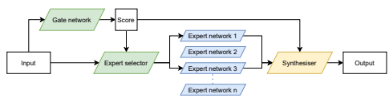
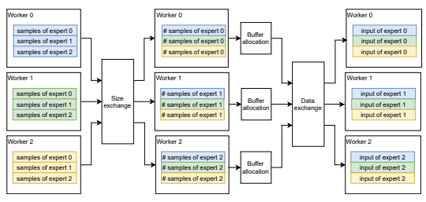
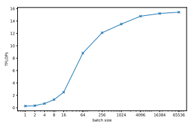
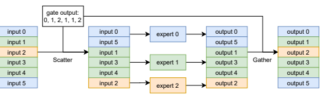
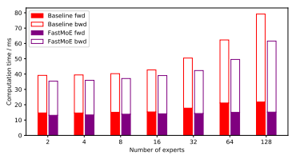
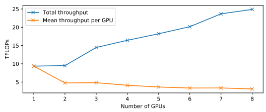
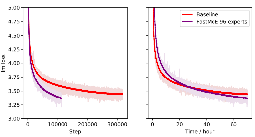

# Fastmoe: A Fast Mixture-Of-Expert Training System

Jiaao He†‡, Jiezhong Qiu†‡, Aohan Zeng†‡, Zhilin Yang‡], Jidong Zhai†‡**, Jie Tang**†‡ † Tsinghua University ‡ Beijing Academy of Artificial Intelligence (BAAI) ] Recurrent AI
{hja20,qiujz16,zah18}@mails.tsinghua.edu.cn; kimi yang@rcrai.com; {zhaijidong, jietang}@tsinghua.edu.cn

# Abstract

Mixture-of-Expert (MoE) presents a strong potential in enlarging the size of language model to trillions of parameters. However, training trillion-scale MoE requires algorithm and system co-design for a well-tuned high performance distributed training system. Unfortunately, the only existing platform that meets the requirements strongly depends on Google's hardware (TPU) and software (Mesh Tensorflow) stack, and is not open and available to the public, especially GPU and PyTorch communities. In this paper, we present *FastMoE* , a distributed MoE training system based on PyTorch with common accelerators. The system provides a hierarchical interface for both flexible model design and easy adaption to different applications, such as Transformer-XL and Megatron-LM. Different from direct implementation of MoE models using PyTorch, the training speed is highly optimized in *FastMoE* by sophisticated high-performance acceleration skills. The system supports placing different experts on multiple GPUs across multiple nodes, enabling enlarging the number of experts linearly against the number of GPUs. The source of *FastMoE*
is available at https://github.com/laekov/fastmoe under Apache-2 license.

# 1 Introduction

Recent emergence of large-scale language models, examplified by BERT (Devlin et al., 2018), GPT- 2/-3 (Radford et al., 2019; Brown et al., 2020), XLNet (Yang et al., 2019), RoBERTa (Liu et al., 2019), T5 (Raffel et al., 2020), GShard (Chen et al., 2020) and Switch Transformer (Fedus et al., 2021), has drastically reshaped the landscape of the natural language processing research, reestablishing the new state-of-the-art baselines in various benchmarks such as GLUE (Wang et al., 2018) and SuperGLUE (Wang et al., 2019). Among many possible solutions, scaling model size has been proved to be one of the simplest and most effective way (Kaplan et al., 2020) toward more powerful models. From BERT (Devlin et al., 2018) with 340 million parameters, to T5 (Raffel et al., 2020) with 11 billion parameters, to GPT- 3 (Brown et al., 2020) with 175 billion parameters, the model size is enlarged by 500× in merely two years. More recently, GShard (Chen et al., 2020) scales to a record number of 600 billion parameters, which is quickly broken by Switch Transformer (Fedus et al., 2021) with 1.6 trillion parameters. The main contributor toward the huge model size of GShard and Switch Transformer is a novel neural network architecture named mixture of experts (MoE) (Shazeer et al., 2017). An MoE layer (an illustrative example can be found in Figure 1) consists of a gate and a pool of experts. For each input, only a tiny minority of experts are chosen by the gate for computation. The special architecture of MoE is a double-edge sword for large-scale distributed training. On the one hand, due to its sparse activation of experts, MoE is able to enlarge the model size by orders of magnitude without significantly increasing the amount of computation (FLOPs). On the other hand, when scaling up to thounds of experts, the imbalanced all-to-all communication pattern of MoE brings new challenges to the co-design of algorithm and system. Therefore, MoE can not be directly supported by traditional deep learning libraries such as PyTorch (Paszke et al., 2019) and TensorFlow (Abadi et al., 2016).

1

Figure 1: An illustrative example of an MoE layer. In this example, expert 1 and expert 3 are selected by the gate for computation.

Due to the challenge raised by the new model architecture, both the research community and the industry need an MoE implementation that support large-scale distributed training. However, despite the existence of some naive single-GPU implementation in PyTorch (Rau, 2019), the only present system that supports scalable MoE training is based on Google's private hardware and software stack
- TPU (Jouppi et al., 2017) and Mesh TensorFlow (Shazeer et al., 2018). Thus, there is urgent need to develope an MoE system on publicly available hardware (e.g., GPU) and platforms (e.g., PyTorch (Paszke et al., 2019)). Motivated by the desire to obtain easy-to-use, flexible, efficient, scalable, and open-source solution to large-scale MoE training, we release *FastMoE* with the following design goals:
- **Easy-to-use**: provide a user-friendly interface to define an MoE layer, and seamless support for popular language model training system, Megatron-LM (Shoeybi et al., 2019).

- **Flexible**: make it easy for users to customize gate networks and expert networks. - **Efficient**: integrate a highly optimized feadforward (FFN) layer for Transformer. - **Scalable**: support scaling up the size of MoE models by training across multiple GPUs on multiple nodes.

Different from previous single-GPU PyTorch implementation (Rau, 2019), *FastMoE* concentrates on efficiency and scalability. Dedicated CUDA kernels are included in *FastMoE* for high performance with specialized optimizations. *FastMoE* is able to run across multiple GPUs on multiple nodes using NCCL (Jeaugey, 2017). The details of communication is hidden from model developers by FastMoE . The model-parallel method of *FastMoE* allows distributing experts across different GPUs, while other parts of the model remain parallelized by batch dimension (data parallel) or tensor dimension (model parallel). Chances are that the model size, proportional to the number of experts, can scale up with the number of GPUs used for training, being the key to train trillion-scale models.

In our experiment, we observe that *FastMoE* is faster than a baseline (Rau, 2019) implemented by pure PyTorch API on a single GPU. *FastMoE* also shows reasonable scalability when running across nodes on a cluster connected by Infiniband network. We train a real GPT model with 96 experts per layer using distributed *FastMoE* with promising end-to-end training speed. Compared to a non-MoE model of the same amount of computation, its performance benefits from the enlarged model size that the MoE architecture. This paper is organized as follows. Section 2 introduces the background of MoE and compares existing systems. Section 3 presents the *FastMoE* system in detail. Section 4 introduces the challenges of achieving high-performance and the *FastMoE* 's solutions. Section 5 shows results of experiments that demonstrate the efficiency of *FastMoE* and the performance gain of an MoE model using FastMoE in training. Section 6 summarizes the paper and indicates directions our future work.

# 2 Mixture-Of-Experts (Moe)

In this section, we review the architecture of MoE and current systems for training MoE.

### 2.1 Moe: Model Structure

Mixture-of-Expert is short for Sparsely-Gated Mixture-of-Experts layers proposed by Shazeer et al. (2017). An MoE layer consists of multiple experts, each can be an arbitrary neural network. The only constraint of the experts is that they should take the same input, and give output in the same vector space. Figure 1 shows a detailed example of an MoE layer. A special neural network, namely the gate network, is introduced to score each expert over a given input. According to the scores, selection of experts is made by a policy, which may vary from model to model. Then, the selected experts, e.g. experts 1 and 3 in the example, are activated to process the input sample. The outputs of the experts, together with the score, are combined into the final output using a certain algorithm. A popular way of the expert selection is to select the experts with top k highest score. In synthesis process, the score is used as the weight for the output of the experts to be added into the overall output. This enables training the gate network, as the gradient can be propagated by the score. Algorithm 1 formalizes the method above.

Algorithm 1 Forward computation of an MoE layer with top-k gating. Require: A pool of n experts: {E1, E2, · · · , En} Require: Gate G Require: The number of experts k to be selected 1: **function** MOE(x)
2: *score* ⇐ G(x)
3: indices ⇐ *ArgM ax*k(score)
4: y ⇐ zero tensor like x 5: for each index i ∈ *indices* do 6: xi ⇐ Ei(x) 7: y ⇐ *score*i ∗ xi + y 8: **end for** 9: **return** y 10: **end function**

### 2.2 Current Systems For Moe Training

The GShard system (Chen et al., 2020) implements a distributed version of the MoE model. It trains a language model on up to 2048 TPUs, with 1 expert per layer placed on each TPU. As a result, the MoE layers contain 2048× more parameters than a non-MoE layer. In Switch Transformer (Fedus et al., 2021), the model is further enlarged to 1.6 trillion, showing strong ability for the system to support training models in large scale. Unfortunately, this system is not publicly available yet. It is strongly binded with the TPU cluster, which makes it hard to reproduce the experiments on commodity devices. Additionally, the design of GShard lacks flexibility to use different number and size of experts with different replication strategy. In Tensor2tensor (Vaswani et al., 2018), a MoE Transformer model is provided. However, this implementation uses Mesh TensorFlow (Shazeer et al., 2018), which does not support GPUs very well. To implement a FFN in Transformer, it takes more than 100 lines of code in TensorFlow with complicated einsum operators, making it burdening for developers to understand the structure and explore other model structures based on the code. PyTorch (Paszke et al., 2019), as a popular deep learning framework among researchers, provides more straightforward coding style and flexibility against TensorFlow. Efforts are made to train MoE models with PyTorch (Rau, 2019). However, as the PyTorch community lacks multi-dimension parallel training tools, none of the PyTorch-based implementations support training on multiple GPUs. As the ultimate target of adopting MoE is training even larger models, the PyTorch-based implementations fails to be a candidate.

# 3 Fastmoe : System Design

In this section, we introduce our design of *FastMoE* with distributed training support.

### 3.1 A Flexible System For Diverse Model Explorers

The Backbone to Run Arbitrary Expert Networks. *FastMoE* supports using arbitrary network as the expert. The FMoE interface of *FastMoE* takes any neural network module constructor as input, and replicates the module for multiple times as the expert instances. The expert is defined to take a batch of aligned contiguous input features, and the output should be in the same batch order. Therefore, the expert module implementation is decoupled from the MoE architecture so that developers can focus on the design of their own expert network. For even stronger flexibility, the FMoE class contains a member function expert fn, where the expert modules are used to conduct the forward computation. This function can be overloaded for further customized MoE behavior. For example, in the FMoETransformerMLP network, which will be mentioned later in this section. the list of experts is replaced by a specially optimized module that applies the experts in parallel to extremely lower the latency. Moreover, *FastMoE* supports placing multiple experts together on the same worker, enabling more flexible configuration space of the number of experts (i.e., the number of experts does not have to be equal to the number of data parallels), which is different from the the design of GShard. A Highly-optimized FFN for Transformer. To better support training Transformer with MoE, *FastMoE* provides a standard and high-performance FFN implementation (FMoETransformerMLP). The detailed optimization strategy is hidden from the developers.

In particular, when placing multiple experts on the same worker, a naive implementation is to loop over these experts and conduct forward in sequence. However, for certain types of expert networks, it is possible to explore the potential speedup brought by parallel execution. In *FastMoE* , we mainly optimize the parallel execution of fully-connected layers by a dedicated FMoELinear module. Instead of computing the expert modules sequentially, the specially optimized expert module maintains a pool of available hardware resources, and applies the expert computation in parallel.

Plugin-style Support for PyTorch and Megatron-LM. The flexibility of *FastMoE* allows convenient adaption to existing training applications. Take Megatron-LM (Shoeybi et al., 2019) as an example, a plugin-style module is integrated in *FastMoE* to quickly replace the FFNs in the original Megatron-LM model with MoE networks. As shown in listing 1, the transformation can be achieved by only 2 lines of code.

Listing 1: Sample code to use *FastMoE* in Megatron-LM

from fmoe.megatron import fmoefy model = fmoefy(model, num_experts=<number of experts per worker>)
The fmoefy function can find the FFNs in the Transformer layers. Then, an MoE network using FastMoE is created, which is a module that wraps up the FMoETransformerMLP module for interface-level compatibility.

#### 3.2 Enlarging The Model Capacity Distributedly

The Model Parallel Method of *FastMoE*. As one of the most effective way to enlarge the model capacity, the ability to accommodate a large expert population and train them in parallel is demanded in many MoE models. It is hard for the model developers to handle the complicated data transfer among GPUs and even across nodes. Achieving high training performance and good hardware resource utilization requires expertise in computer architecture and parallel programming, which is beyond the technique stack of common model developers.

FastMoE supports distributing experts across multiple workers on multiple nodes, which is called the model parallel method in FastMoE . The detail of input data exchange is hidden within the FMoE interface. For model developers, they only need to write code for a single expert, and each expert is given all the input data gathered from all workers by *FastMoE* . As a result, the model developers do not have to consider the implementation details about cross-worker communication.

In the design of *FastMoE* , when the feature to distribute expert across workers is enabled, extra communication operations are included in the forward and backward computation. To better identify the operations, we call them global data exchange operations, in contrast to the local data shuffle process, which will be mentioned in section 4. A major challenge in the distributed context is that the total number of input samples assigned to all experts on a worker may vary a lot. It is impossible to have the number of incoming samples before the gate output is available. However, allocating the buffer to place the input samples is dependent on the number. Therefore, before actual exchange of input samples between workers happens after exchanging the amount information between workers, and allocating memory according to the inspection of the expert count information.

Figure 2: An example of the global operations.

An example of the global operations in *FastMoE* is shown in figure 2. The workers first count the number of samples assigned to each expert on each worker. Then, they exchange the size of expert inputs, so that all workers get the number of incoming input samples, and where they are from. After the offsets of each receiving buffer is calculated, the workers start exchanging data directly. It is worth nothing that the statistics of the incoming and outgoing samples can be reused through the whole process of a training iteration. Heterogeneity-aware Synchronization Module. Heterogeneity is introduced as different parts of the network may be replicated across different groups of workers. It is a challenge that the distributed module has to identify whether the gradient of a parameter should be synchronized, and with whom it is synchronized. *FastMoE* introduces the *data parallel communication group* tag on each parameter to address the issue.

The tag can be one of world, data parallel or none, which respectively indicates that the gradient should be synchronized with (1) all other workers, (2) the workers in a data-parallel group that is orthogonal to the model-parallel group, or (3) no worker. For example, the gate network is replicated across all workers, regardless of model parallel settings. The attention layer may be divided into model-parallel sub-layers, so its tag is data parallel. Each worker serves several unique expert networks, whose tag is none. A customized data parallel module instead of PyTorch's original distributed data parallel module is provided by *FastMoE* , which can identify the tags and perform correct synchronization.

# 4 Optimizations To Achieve High-Performance

The performance of MoE computation on a single node is significant, as it determines the theoretical upper bound of the system scaling up to any scale.

The most intuitive way to compute an MoE layer is slicing the input batch into samples, and compute sample by sample. After that, output features are stacked in the original order. However, it is observed that implementing an MoE model using simple PyTorch operators can hardly achieve high performance. Less than 5% the peak performance of GPUs can be achieved.

Figure 3: GeMM performance of different problem sizes using cuBLAS on NVIDIA V100.

Without loss of generality, we assume the expert network is an FFN. Note that the major operator within an FFN is from fully-connected layers, which consist of several GeMM operators.When the batch is split up into single samples, the GeMM operation is degraded into GeMV. Figure 3 shows the float-point computation throughput of an example fully-connected layer using different batch size. Given that in modern heterogeneous compute devices, matrix multiplication operators are fine tuned with sophisticated tiling techniques applied on all dimensions, it is not surprising that the throughput can only approach the theoretical peak when the batch size is large enough. This leads to the principle that to achieve high performance in MoE computation, the samples should be batched to fully utilize the hardware resources. FastMoE batches all input samples to the same expert together. Due to the limit of data representation, *FastMoE* performs memory movement with a specially developed CUDA kernel to reduce overhead. Given the index of gate that each sample is going to, the process to put all input samples to the same gate in a contiguous memory space is called scatter. However, in other parts of the neural network, the batch may have to be organized as its original order, e.g., the attention layer in Transformer. A reverse operation is performed after the experts output to another contiguous memory space, i.e. place the scattered feature vectors back to their original order according to the gate indices. This process is denoted as gather in *FastMoE* .

Figure 4: An example of the reordered computation of an MoE layer

The reordering computation process is shown as Figure 4. When the assignment from input samples to experts is balance enough, each expert is expected to have a relatively large input batch size that can reach satisfying hardware utilization according to Figure 3. However, load imbalance always occurs because of the nature of random sampling of the input training data. It is highly possible that one expert receives very few input samples during millions training iterations. Additionally, as multiple experts are placed on one worker, local batch sizes of the experts are, on average, statistically lower than that in data parallel. *FastMoE* uses a customized stream manager to simultaneously execute the computation of multiple experts to extract the potential throughput gain.

# 5 Evaluation

In this section, the training speed of *FastMoE* is compared with another PyTorch MoE implementation (Rau, 2019) on a single GPU. We also report the scalability of *FastMoE* when distributed training. To the best of our knowledge, *FastMoE* is the only PyTorch-based MoE system can run across different nodes and GPUs. We also show the end-to-end performance of an MoE Transformer model trained using *FastMoE* .

### 5.1 Experiment Setup

We use the following notations to characterize the computation task: ne experts are placed on each GPU. Each expert applies two linear layers of sizes dm × dh and dh × dm respectively. The input contains nb samples. The gate module scores the fitness of each sample to be processed by each expert. For each input sample, the experts of top k highest score are selected to process the sample. Additionally, several warm-up rounds are performed, which perform the same computation but are not counted in the results. For each experiment, the task is executed 16 times, and the average time is used to calculate the performance. The standard deviation values of the execution time are also inspected. All of them are negligible.

#### 5.2 Training Speed On A Single Gpu

The performance of the FMoETransformerMLP is tested, which completes similar task with MoE module in the baseline (Rau, 2019), on a NVIDIA TESLA V100 PCIe GPU. The baseline is implemented by pure PyTorch API with hard-coded model structure. For fairness of the comparison, both modules uses a randomly initialized matrix as the weight of the gate network, which consists of one fully-connected layer. The experts also perform the same computation.

The latency is tested with nb = 4096, dm = 1024, dh = 4096, k = 2.

Figure 5: Computation time comparison between *FastMoE* and the baseline implementation.

As Figure 5 shows, the baseline implementation is constantly slower than *FastMoE* . As the number of experts grows, the baseline spends much more time in the forward computation, while the latency of *FastMoE* remains stable, thanks to its customized stream manager mentioned in Section 4. Considering that *FastMoE* is targeted on training, the backward time is stacked over the forward time. We observed that *FastMoE* outperforms the baseline in the overall time spent in each iteration.

### 5.3 Cross-Gpu And Cross-Node Scalability

To examine the performance of *FastMoE* expanding on multiple GPUs across nodes, we conduct an experiment on a cluster of 8 nodes, with 1 NVIDIA Tesla V100 GPU on each node. The cluster is interconnected via an Infiniband EDR switch and 8 HCA cards. The FLOPs of the matrix multiplication operations is calculated to represent the training throughput.

The throughput is tested with ne = 4, nb = 4096, dm = 1024, dh = 4096, k = 2.

Figure 6: Scalability of *FastMoE* across multiple GPUs on multiple nodes

According to the result shown in Figure 6, *FastMoE* shows scalability across nodes. The overall throughput increases from 10 TFLOPs to 25 TFLOPs, as the number of GPUs increases from 2 to 8, sub-linearly scaling up. We observe that when expanding to 2 GPUs, the performance is half of that on a single GPU, which suggests that *FastMoE* is bounded by communication. When more GPUs are used for computation, more experts are introduced, and the granularity of exchanging input samples becomes smaller, lowering the efficiency in data transfer over the network. As a conclusion, the scalability of *FastMoE* can support training large MoE model using multiple GPUs across multiple nodes with performance gain. However, space is left for further optimization on throughput.

### 5.4 End-To-End Performance Gain Using Fastmoe

We test the end-to-end performance gain using *FastMoE* by training a 12-layer GPT model on 8 GPUs using Megatron-LM (Shoeybi et al., 2019). As mentioned in Section 3, the Megatron adapter of *FastMoE* is used for MoE structure. For each layer, 96 experts are distributed across the GPUs, i.e. 12 experts are placed on each GPU. For each input token, the top 2 experts with highest score are used to process it. The dh in expert MLP layer is halved so that the valid FLOPs of the model are almost identical, except for the extra FLOPs introduced by the gate, which is negligible. Both the baseline model and the MoE model are trained for 70 hours. The lm loss metric in training indicates the convergence tendency of the models. From Figure 7, we observed that the training speed of the baseline model is about 3× of *FastMoE* . As *FastMoE* performs more computation and communication, it is a reasonable slow down. Fortunately, the MoE model achieves much lower loss with the same training iterations. Also, as a benefit from the efficiency of *FastMoE* , the MoE model achieves lower loss in the same training time.

# 6 Summary And Future Work

In this paper, we present *FastMoE* , an open-source system to train Mixture-of-Experts models. The system is based on the popular PyTorch framework, and currently supports efficient training on GPUs. Friendly interfaces of multiple levels are provided for different users to explore different aspects of the MoE architecture. The performance of *FastMoE* on a single GPU is well-optimized to

The narrow dark lines are smoothed exponentially by 0.97 from the original loss curve, represented by the brighter wide curves respectively.

Figure 7: Loss curve of training a GPT model by *FastMoE*

exploit the power of GPUs. *FastMoE* can also run across GPUs on multiple nodes with reasonable scalability, enabling further enlarging model size. Real model performance advantage is observed in our end-to-end model training experiment using *FastMoE* . We are still working on *FastMoE* for more features and faster training. Compared to the GShard model (Chen et al., 2020), *FastMoE* lacks functionalities to support load-balancing among experts. The work of load-balance monitor and support for load-balance loss is in progress. We are also trying to make the system more user-friendly on utilities, such as loading and saving of MoE models. The performance across multiple GPUs requires joint efforts from the view of both high-performance computing and machine learning. Any contributions to the open-source project will be appreciated. We are looking forward to your participation.

# References

Mart´ın Abadi, Paul Barham, Jianmin Chen, Zhifeng Chen, Andy Davis, Jeffrey Dean, Matthieu Devin, Sanjay Ghemawat, Geoffrey Irving, Michael Isard, et al. Tensorflow: A system for largescale machine learning. In 12th {USENIX} symposium on operating systems design and implementation ({OSDI} 16), pp. 265–283, 2016.

Tom B. Brown, Benjamin Mann, Nick Ryder, Melanie Subbiah, Jared Kaplan, Prafulla Dhariwal, Arvind Neelakantan, Pranav Shyam, Girish Sastry, Amanda Askell, Sandhini Agarwal, Ariel Herbert-Voss, Gretchen Krueger, Tom Henighan, Rewon Child, Aditya Ramesh, Daniel M. Ziegler, Jeffrey Wu, Clemens Winter, Christopher Hesse, Mark Chen, Eric Sigler, Mateusz Litwin, Scott Gray, Benjamin Chess, Jack Clark, Christopher Berner, Sam McCandlish, Alec Radford, Ilya Sutskever, and Dario Amodei. Language models are few-shot learners, 2020.

Dehao Chen, Dmitry Dima Lepikhin, HyoukJoong Lee, Maxim Krikun, Noam Shazeer, Orhan Firat, Yanping Huang, Yuanzhong Xu, and Zhifeng Chen. Gshard: Scaling giant models with conditional computation and automatic sharding. 2020.

Jacob Devlin, Ming-Wei Chang, Kenton Lee, and Kristina Toutanova. Bert: Pre-training of deep bidirectional transformers for language understanding. *arXiv preprint arXiv:1810.04805*, 2018.

William Fedus, Barret Zoph, and Noam Shazeer. Switch transformers: Scaling to trillion parameter models with simple and efficient sparsity, 2021.

Sylvain Jeaugey. Nccl 2.0. In *GPU Technology Conference (GTC)*, 2017. Norman P Jouppi, Cliff Young, Nishant Patil, David Patterson, Gaurav Agrawal, Raminder Bajwa, Sarah Bates, Suresh Bhatia, Nan Boden, Al Borchers, et al. In-datacenter performance analysis of a tensor processing unit. In Proceedings of the 44th annual international symposium on computer architecture, pp. 1–12, 2017.

Jared Kaplan, Sam McCandlish, Tom Henighan, Tom B Brown, Benjamin Chess, Rewon Child, Scott Gray, Alec Radford, Jeffrey Wu, and Dario Amodei. Scaling laws for neural language models. *arXiv preprint arXiv:2001.08361*, 2020.

Yinhan Liu, Myle Ott, Naman Goyal, Jingfei Du, Mandar Joshi, Danqi Chen, Omer Levy, Mike Lewis, Luke Zettlemoyer, and Veselin Stoyanov. Roberta: A robustly optimized bert pretraining approach. *arXiv preprint arXiv:1907.11692*, 2019.

Adam Paszke, Sam Gross, Francisco Massa, Adam Lerer, James Bradbury, Gregory Chanan, Trevor Killeen, Zeming Lin, Natalia Gimelshein, Luca Antiga, Alban Desmaison, Andreas Kopf, Edward Yang, Zachary DeVito, Martin Raison, Alykhan Tejani, Sasank Chilamkurthy, Benoit Steiner, Lu Fang, Junjie Bai, and Soumith Chintala. Pytorch: An imperative style, high-performance deep learning library. In H. Wallach, H. Larochelle, A. Beygelzimer, F. d'Alche-Buc, ´ E. Fox, and R. Garnett (eds.), *Advances in Neural Information Processing Systems 32*, pp. 8024–8035. Curran Associates, Inc., 2019. URL http://papers.neurips.cc/paper/ 9015-pytorch-an-imperative-style-high-performance-deep-learning-library. pdf.

Alec Radford, Jeff Wu, Rewon Child, David Luan, Dario Amodei, and Ilya Sutskever. Language models are unsupervised multitask learners. 2019.

Colin Raffel, Noam Shazeer, Adam Roberts, Katherine Lee, Sharan Narang, Michael Matena, Yanqi Zhou, Wei Li, and Peter J Liu. Exploring the limits of transfer learning with a unified text-to-text transformer. *Journal of Machine Learning Research*, 21:1–67, 2020.

David Rau. Sparsely-gated mixture-of-experts pytorch implementation, 2019. URL https://
github.com/davidmrau/mixture-of-experts.

Noam Shazeer, Azalia Mirhoseini, Krzysztof Maziarz, Andy Davis, Quoc Le, Geoffrey Hinton, and Jeff Dean. Outrageously large neural networks: The sparsely-gated mixture-of-experts layer. arXiv preprint arXiv:1701.06538, 2017.

Noam Shazeer, Youlong Cheng, Niki Parmar, Dustin Tran, Ashish Vaswani, Penporn Koanantakool, Peter Hawkins, HyoukJoong Lee, Mingsheng Hong, Cliff Young, et al. Mesh-tensorflow: Deep learning for supercomputers. *arXiv preprint arXiv:1811.02084*, 2018.

Mohammad Shoeybi, Mostofa Patwary, Raul Puri, Patrick LeGresley, Jared Casper, and Bryan Catanzaro. Megatron-lm: Training multi-billion parameter language models using gpu model parallelism. *arXiv preprint arXiv:1909.08053*, 2019.

Ashish Vaswani, Samy Bengio, Eugene Brevdo, Francois Chollet, Aidan N. Gomez, Stephan Gouws, Llion Jones, Łukasz Kaiser, Nal Kalchbrenner, Niki Parmar, Ryan Sepassi, Noam Shazeer, and Jakob Uszkoreit. Tensor2tensor for neural machine translation. *CoRR*,
abs/1803.07416, 2018. URL http://arxiv.org/abs/1803.07416.

Alex Wang, Amanpreet Singh, Julian Michael, Felix Hill, Omer Levy, and Samuel Bowman. Glue:
A multi-task benchmark and analysis platform for natural language understanding. In Proceedings of the 2018 EMNLP Workshop BlackboxNLP: Analyzing and Interpreting Neural Networks for NLP, pp. 353–355, 2018.

Alex Wang, Yada Pruksachatkun, Nikita Nangia, Amanpreet Singh, Julian Michael, Felix Hill, Omer Levy, and Samuel R Bowman. Superglue: A stickier benchmark for general-purpose language understanding systems. *arXiv preprint arXiv:1905.00537*, 2019.

Zhilin Yang, Zihang Dai, Yiming Yang, Jaime Carbonell, Ruslan Salakhutdinov, and Quoc V
Le. Xlnet: Generalized autoregressive pretraining for language understanding. arXiv preprint arXiv:1906.08237, 2019.