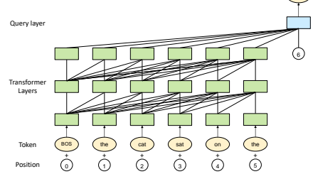
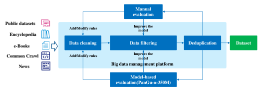
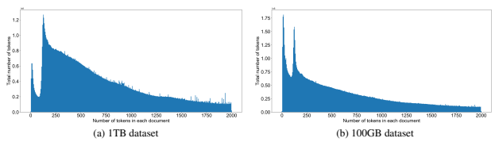
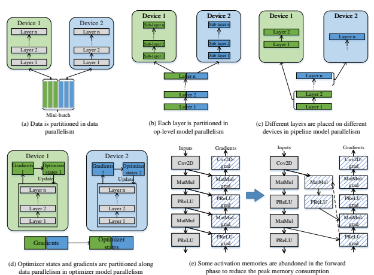
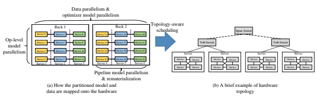
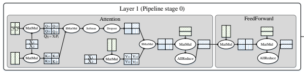
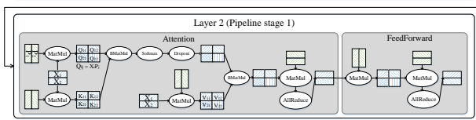
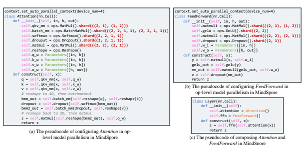
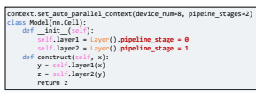
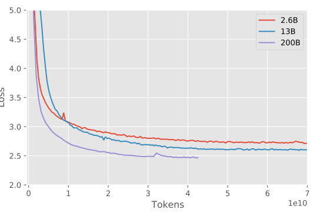

# Pangu-Α: Large-Scale Autoregressive Pretrained Chinese Language Models With Auto-Parallel Computation

TECHNICAL REPORT

|         | Wei Zeng∗      | Xiaozhe Ren∗   |                | Teng Su∗      | Hui Wang∗   |              |           |
|---------|----------------|----------------|----------------|---------------|-------------|--------------|-----------|
| Yi Liao | Zhiwei Wang    | Xin Jiang      | Zhenzhang Yang | Kaisheng Wang |             | Xiaoda Zhang |           |
| Chen Li | Ziyan Gong     | Yifan Yao      | Xinjing Huang  | Jun Wang      | Jianfeng Yu |              | Qi Guo    |
| Yue Yu  | Yan Zhang      | Jin Wang       | Hengtao Tao    | Dasen Yan     | Zexuan Yi   |              | Fang Peng |
|         | Fangqing Jiang | Han Zhang      | Lingfeng Deng  | Yehong Zhang  |             | Zhe Lin      |           |

Chao Zhang Shaojie Zhang Mingyue Guo Shanzhi Gu Gaojun Fan Yaowei Wang Xuefeng Jin Qun Liu Yonghong Tian PANGU-α TEAM

## A**Bstract**

Large-scale Pretrained Language Models (PLMs) have become the new paradigm for Natural Language Processing (NLP). PLMs with hundreds of billions parameters such as GPT-3 [1] have demonstrated strong performances on natural language understanding and generation with few-shot in-context learning. In this work, we present our practice on training large-scale autoregressive language models named PanGu-α, with up to 200 billion parameters. PanGu-α is developed under the MindSpore2and trained on a cluster of 2048 Ascend 910 AI processors3. The training parallelism strategy is implemented based on MindSpore Auto-parallel, which composes five parallelism dimensions to scale the training task to 2048 processors efficiently, including data parallelism, op-level model parallelism, pipeline model parallelism, optimizer model parallelism and rematerialization. To enhance the generalization ability of PanGu-α, we collect 1.1TB high-quality Chinese data from a wide range of domains to pretrain the model. We empirically test the generation ability of PanGu-α in various scenarios including text summarization, question answering, dialogue generation, etc.

Moreover, we investigate the effect of model scales on the few-shot performances across a broad range of Chinese NLP tasks. The experimental results demonstrate the superior capabilities of PanGu-α in performing various tasks under few-shot or zero-shot settings.

K**eywords** Pre-trained Language Models · Large-scale Deep Models · Distributed Training · Chinese Language Understanding and Generation

∗Equal Contribution 2https://www.mindspore.cn/en 3https://e.huawei.com/en/products/servers/ascend

## 1 Introduction

Pre-trained Language Models (PLMs) [1, 2, 3, 4, 5, 6, 7, 8, 9, etc.] have gained great success in the Natural Language Processing (NLP). By learning contextual representation of text from large-scale corpora in a self-supervised manner, PLMs can achieve state-of-the-art performances on a wide range of Natural Language Understanding (NLU) and Natural Language Generation (NLG) tasks. Radford et. al. [10] demonstrates a significant gains on a variety of NLP tasks via Generative Pre-trained Transformer
(GPT), which is an autoregressive language model first pretrained on unsupervised text data and then finetuned for each supervised task. Devlin et.al. [2] proposes BERT, a bidirectional Transformer with the masked language model (MLM) pretraining objective, which obtains new state-of-the-art performances on the GLUE benchmark of NLU tasks. After them, there have been an increasing number of research work on developing the pretraining techniques and continuously improving the performance of downstream NLP tasks. Among all the techniques, researchers find that the performance of PLMs can be steadily improved simply by enlarging the amount of the training data as well as the capacity of the model. For instance, RoBERTa [5] shows that BERT can be substantially improved by training the model longer with more data. GPT-2 [11] as the successor of GPT, which shares the same architecture but contains 1.5 billion parameters and is trained with 40GB text, can perform reasonably well on multiple tasks in the zero-shot setting. The T5 model [6] with 11 billion parameters trained on the 745GB C4 data, keeps pushing the performance of both NLU and NLG tasks. Recently, the OpenAI team announced its lasted version of the GPT-series models: GPT-3 [1]. The largest GPT-3 model contains 175 billion parameters and is trained using 570GB of text data. Besides its strong capability in generating high-quality text, GPT-3 is especially effective in solving a wide range of tasks without task-specific finetuning in the few-shot, or even zero-shot settings. Moreover, on many of the tasks the performance improves steadily as the size of the GPT model grows, and sometimes even reaches the level of the prior state-of-the-art finetuning approaches. From applications perspective, GPT-3 is revolutionary, as it relieves the need for labelling many examples and retraining model for every new task, which hinders the applicability of NLP models in real-world applications. However, GPT-3 is now only available for limited access via OpenAI API, and it is primarily trained with English data. To promote the public research of Chinese PLMs, we propose training a very large-scale Chinese PLM named PanGu-α with number of parameters up to 200 billion. To the best of our knowledge, this is the largest Chinese PLM up to the publication of this technical report. The difficulty in training a PLM rises as the scale of the model grows beyond the level of 10 billion. The main challenges lie in three aspects:
- **Model Design**. There have been a couple of architectures of PLMs besides GPT and BERT. However, not all the PLMs can be smoothly scaled to hundreds of billions of parameters. For examples, some models may have problem of slow convergence or even divergence during training as the model size increases. Inspired by GPT-3 and our preliminary experiments, we choose the Transformer-based autoregressive language model as the base architecture. Besides, we develop an additional *query layer* on top of the Transformer layers to induce the expected output of the model during pretraining. Our experiments demonstrate that the structure of PanGu-α can scale up to 200 billion parameters.

- **Training Corpora**. Training data is essential in building a strong and generalisable pretrained model. On one hand, the amount of the data should be sufficient to feed a large PLM. On the other hand, the data should be of high quality and diversity to ensure the generality of the PLM. To build Chinese corpus with comprehensive coverage, we collect a large amount of data from a wide range of resources, including Common Crawl, e-Books, encyclopedias, news, and so on. Based on them, we conduct multiple processes of data filtering and cleaning to make sure the processed data are of high quality and reliability.

- **Distributed Training.** The memory requirement of training PanGu-α with 200 billion parameters is much beyond the memory capacities of modern AI processors. It is difficult to acquire large end-to-end throughput while keeping high resource utilization on a cluster of processors. The problem becomes more challenging when considering the topology of hardware. We combine five-dimensional parallel functionalities with a carefully designed parallelization strategy and apply them to the largest PanGu-α, which is efficiently trained on a cluster of 2048 Ascend 910 AI processors [12] and powered by CANN4.

We train three PanGu-α models on a high-quality 1.1TB Chinese text corpus with increasing magnitude of parameter sizes, which are PanGu-α 2.6B, PanGu-α 13B, and PanGu-α 200B, respectively. We first evaluate the models on language modeling tasks, showing that the perplexity can be decreased with the increase of model capacity and the amount of data and computation. Then we investigate the text generation ability of PanGu-α in various scenarios

4https://www.hiascend.com/en/software/cann
such as dialogue generation, summarization, question answering, etc. We demonstrate a few generated samples for different applications in the experiment section. Furthermore, we evaluate the task-agnostic few-shot performances of PanGu-α 2.6B and 13B on a wide range of NLP tasks, including cloze tasks, reading comprehension, closed-book QA, Winograd style tasks, commonsense reasoning, natural language inference, and text classification. The experimental results demonstrate that with the growing model capacity, the performance on various tasks can generally improve. We are currently seeking a proper way to let both non-profit research institutes and commercial companies to get access to our pretrained PanGu-α models, either by releasing the code and model or via APIs. We are also assessing the possibility of releasing all or part of our pretraining data, within the constraints of the law and legality. To facilitate the community to pretrain a large-scale language model by their own, the parallel computing functionalities are open-sourced in the Auto-parallel module of MindSpore5, a deep learning training/inference framework that could be used for mobile, edge and cloud scenarios. Besides the basic parallel functionalities, Auto-parallel is easy enough to use by freeing developers from parallel model training with minimal (or zero) code modifications from the standalone version, *as if* the model is trained on a single device.

The reminder of this technical report is organized as follow. Section 2 describe the architecture of our PanGu-α models. In section 3, we detail our methods to construct a 1.1TB high-quality training corpus from 80TB raw data collected from various sources. Section 4 addresses the parallelization paradigm of model training and scheduling strategy on a cluster of Ascend processors. Section 5 presents the experimental results of PanGu-α models on various tasks.

## 2 Model

### 2.1 Overview

PanGu-α is a large-scale autoregressive language model (ALM) pretrained on a large corpus of text, mostly in Chinese language. It models the generative process of all the tokens in the corpus, where the generation of a token depends on its previous tokens in a sequence. Assuming that a sequence X = {x1, x2*, ..., x*N } is composed of N tokens, the training objective can be formulated as maximization of the log-likelihood:

$${\mathcal{L}}=\sum_{n=1}^{N}\log p(x_{n}|x_{1},...,x_{n-1};\theta),$$

log p(xn|x1*, ..., x*n−1; θ), (1)
where p(xn|x1*, ..., x*n−1; θ) is the probability of observing the n-th token xn given the previous context x1:n−1, and θ denotes the model parameters. The architecture of PanGu-α is based on Transformer [13], which has been extensively used as the backbone of a variety of pretrained language models such as BERT [2] and GPT [10, 11, 1]. Different from them, we develop an additional query layer on top of Transformer layers to predict the next token. The diagram of the model is shown in Figure 1. We elaborate each part as follow.

### 2.2 Model Structure 2.2.1 Transformer Layers

A standard transformer layer includes two sub-layers: multi-head attention (MHA) and fully connected feed-forward network (FFN). Multi-head Attention: A self-attention network in the l-th Transformer layer is parameterized by four projection matrices: Wk h
, Wqh
, Wv h
, W m h ∈ R
d×d/Nh , where d is the hidden dimension, h is the index of head, and Nh is the number of heads. Given the output Hl−1 ∈ R
N×dfrom the precedent layer, three major components, i.e., query Qh = Hl−1W
q h, key Kh = Hl−1Wk h, and value Vh = Hl−1Wvhare produced. The attention function is computed as:

$$\begin{array}{c}{{A_{h}=Q_{h}K_{h}^{\top}=H_{l-1}W_{h}^{q}W_{h}^{k\top}H_{l-1}^{\top},}}\\ {{\mathrm{~f~t e n t i o n t i o n}_{h}(H_{l-1})=\mathrm{Softmax}(\frac{A_{h}}{\sqrt{d}})V_{h}=\mathrm{Softmax}(\frac{A_{h}}{\sqrt{d}})H_{l-1}W_{h}^{v}.}}\end{array}$$
$$(1)^{\frac{1}{2}}$$
$$(2)^{\frac{1}{2}}$$

5https://gitee.com/mindspore/mindspore
mat

Figure 1: The architecture of PanGu-α. The model is based on a uni-directional Transformer decoder. A query layer is stacked on top of Transformer layers with the position embedding as the query in the attention mechanism to generate the token at the next position.

With multiple attention heads, the output becomes:

$$\begin{array}{c}{{\mathrm{MHA}(H_{l-1})=\sum_{h=1}^{N_{h}}\mathrm{Attention}_{h}(H_{l-1})W_{h}^{m},}}\\ {{H_{l}^{\mathrm{MHA}}=H_{l-1}+\mathrm{MHA}(\mathrm{LayerNorm}(H_{l-1})).}}\end{array}$$
$$\mathbf{\partial}\mathbf{\partial}$$

(3)
Feed-forward Network: The FFN layer is composed of two linear layers, parameterized by W1 ∈ R
d×dff, b 1 ∈ R
dff, W2 ∈ R
dff ×d, b 2 ∈ R
d, where df f is the dimension of the inner-layer. Fed with the output of MHA layer as input, the output of FFN layer is then computed as:

$$\begin{array}{c}{{\mathrm{FFN}(H_{l}^{\mathrm{MHA}})=G e L U(H_{l}^{\mathrm{MHA}}W^{1}+b^{1})W^{2}+b^{2},}}\\ {{\qquad H_{l}=H_{l}^{\mathrm{MHA}}+\mathrm{FFN}(\mathrm{LayerNorm}(H_{l}^{\mathrm{MHA}})).}}\end{array}$$
.)  $\blacksquare$

$(\boldsymbol{\mathfrak{H}})$
(4)
For both MHA and FFN, we take the *pre-layer normalization* scheme, which can make the training of Transformer model easier and faster [14].

### 2.2.2 Query Layer

We design the query layer on top of the stacked Transformer layers, which aims to explicitly induce the expected output. In the pretraining stage of the autoregressive model, it comes to the prediction of the next token. The structure of the query layer resembles the transformer layer, except that an additional embedding pn ∈ R
dindicating the next position is used as the query vector in the attention mechanism. Specifically, assuming HL is the output of the uppermost transformer layer, the attention vector in the query layer is computed as:

$$W_{h}^{k\top}H_{L}^{\top}\,.$$

ah = pnW
q hWk>
L . (5)
The subsequent computation of MHA and FFN remains the same as the original Transformer. We denote the final output as on. The negative log-likelihood of next token becomes:

CrossEntropy($x_n$, Softmax($o_nW^o+b^o$)),
$$(6)^{\frac{1}{2}}$$
o)), (6)
where xn denotes the true token and Wo, bois the additional task-dependent parameters.

### 2.2.3 Model Configurations

To evaluate the scaling ability of the PanGu-α model, we train three models with increasing magnitude of parameter sizes, that is, PanGu-α 2.6B, PanGu-α 13B, and PanGu-α 200B. Table 1 shows the detailed configurations of the three models, including the number of total parameters, the hidden dimension for the tokens, the inner dimension of the feed-forward layer, and the number of attention heads.

|                |             | Table 1: Model sizes and hyperparameters of PanGu\-α   |                 | models.          |             |
|----------------|-------------|--------------------------------------------------------|-----------------|------------------|-------------|
| Model          | #Parameters | #Layers (L)                                            | Hidden size (d) | FFN size (df f ) | #Heads (Nh) |
| PanGu\-α 2.6B  | 2.6B        | 32                                                     | 2560            | 10240            | 40          |
| PanGu\-α  13B  | 13.1B       | 40                                                     | 5120            | 20480            | 40          |
| PanGu\-α  200B | 207.0B      | 64                                                     | 16384           | 65536            | 128         |

Figure 2: The data sources and the process of constructing pretraining data for PanGu-α.

## 3 Dataset

A large-scale Chinese text corpus of high quality is crucial for the pretraining of our PanGu-α models, especially the one with 200B parameters. Existing large-scale text corpora for pretraining super large language models are mainly English. For example, the GPT-3 [1] is trained using a dataset which contains 570GB filtered texts from Common Crawl with 92.6% of the words are English. The *Colossal Clean Crawled Corpus* (C4) for training T5 consists of about 750GB clean English texts scraped from the web [6]. To the best of our knowledge, there are three Chinese text corpora that are above 100GB: (a) CLUECorpus2020 (100GB), which is retrieved from the Common Crawl dataset [15]; (b) the Chinese multi-modal pretraining data, released by [16] which contains 300GB texts; and (c) WuDaoCorpus6, which opens about 300GB text data to only specific partners so far. However, all the above datasets are still not enough to train the super large-scale models up to 200B parameters compared to the data size used in existing English pretrained models.

Even though the raw web datasets such as SogouT7and Common Crawl8contain massive amount of Chinese texts, the construction of our desired dataset is still challenging due to the highly varying quality of the raw web data, the huge amount of storage and computation to preprocess the data, and the lack of well-defined metrics to evaluate the quality of the data. To tackle the aforementioned issues, we construct a 1.1TB high-quality Chinese text corpus by cleaning and filtering enormous raw data from multiple sources. A *big data management platform* is built to accelerate the massive data analysis and processing. Both manual and model-based evaluation measures are used to guide the data preprocessing and training data selection, as detailed in the following sections.

### 3.1 Dataset Construction

To construct a large-scale high-quality Chinese corpus, we collect nearly 80TB raw data from the public datasets (e.g., BaiDuQA, CAIL2018, Sogou-CA, etc.), web pages data from Common Crawl, encyclopedia, news and e-books. As shown in Figure 2, our data construction process includes three steps: rule-based data cleaning, model-based data filtering and text deduplication. To improve the quality of the training dataset, the first two steps (i.e., cleaning and filtering) are iteratively enhanced via manual and model-based data quality evaluations. The data construction process is done on a *big data management platform* built based on the open source Spark/Hadoop framework using 5

6https://data.baai.ac.cn/data-set-details/0c8dc71dd06ae75a10ca422fb49b0751 7https://www.sogou.com/labs/resource/t.php 8https://commoncrawl.org/the-data/

|                     | Data size   | Our platform   |
|---------------------|-------------|----------------|
| Cleaning            | 20TB        | 70+ hours      |
| Filtering           | 800GB       | 10+ hours      |
| Fuzzy deduplication | 500GB       | 3.5 hours      |

Table 2: Processing time for each step in the dataset construction.

8 high-performance computing nodes9. With the distributed processing capability and the tools of our platform, the efficiency of the data analysis and processing is significantly improved (see Table 3.1 for the processing time). Next, we introduce the details of each step in the dataset construction process.

### 3.1.1 Cleaning And Filtering

Among the five data sources as shown in Fig 2, the Common Crawl data contributes the most amount to our corpus but unfortunately contains a significant amount of low-quality web pages. To improve the data quality, we first adopt the following rule-based text cleaning strategies over the raw web pages from Common Crawl:
- Remove the document which contains less than 60% Chinese characters, or less than 150 characters, or only the title of a webpage;
- Remove the special symbols and duplicated paragraphs in each document; - Identify advertisements based on keywords and remove documents which contain advertisements; - Convert all traditional Chinese text to simplified Chinese; - Identify the navigation bar of the web page and remove it.

Then, three filters are applied to the preprocessed documents to further remove the harmful, advertising and low-quality documents.

- *Sensitive word filtering*: The original documents of Common Crawl include a lot of harmful or sensitive website contents which would mislead our generative model. Thus, we manually collect 724 sensitive words and remove documents containing more than three of the sensitive words.

- *Model-based spam filtering*: To further remove the advertisements and spams, we train a spam classification model using fastText10 on a manually labeled dataset. The negative training examples are 10K junk documents manually selected from the Common Crawl dataset, and the positive examples are sampled from the highquality Chinese text corpus. We remove the documents that are classified as spams.

- *Low-quality document filtering*: Following the practice in GPT-3, we train a classifier to score the quality of each document and eliminate the documents with scores below a threshold (see Appendix A of [1] for details).

### 3.1.2 Text Deduplication

Although we have removed duplicated paragraphs in each document in the previous step, there are still documents with highly overlapped content across different data sources. Therefore, we carry out fuzzy data deduplication over the documents across all our data sources. Due to the super large scale of the whole dataset, the conventional MinHashLSH algorithm in Spark incurs more than 8 hours to duplicate less than 200MB data, which is too slow to meet our efficiency requirement. To accelerate the deduplication process, we design a *distributed large-scale text data duplication detection and deduplication algorithm* by exploiting the computing framework of our big data management platform. The proposed algorithm takes only 3.5 hours to complete the deduplication process for 500GB documents.

### 3.1.3 Data Quality Evaluation

Give above preprocessing steps, one key question is how the cleaning rules and the filtering thresholds are decided. In this work, we evaluate the data quality after each round of preprocessing and update the cleaning rules and the filtering

94 computing nodes with 28TB storage + 2 CUPs (24 cores) + 1.5TB Memory and 4 computing nodes with 7.3TB storage + 2 CPUs (64 cores) + 1TB memory.

10https://fasttext.cc/

|                 | Size (GB)   | Data source                                                    | Processing steps             |
|-----------------|-------------|----------------------------------------------------------------|------------------------------|
| Public datasets | 27.9        | 15 public datasets including DuReader,                         | Format conversion11 and text |
|                 |             | BaiDuQA, CAIL2018, Sogou\-CA, etc.                             | deduplication                |
| Encyclopedia    | 22          | Baidu Baike, Sogou Baike, etc.                                 | Text deduplication           |
| e\-Books        | 299         | e\-Books on various topics (e,g., novels, his                                                                | Sensitive word and model                              |
|                 |             | tory, poetry, ancient prose, etc.).                            | based spam filtering         |
| Common Crawl    | 714.9       | Web data from January 2018 to December 2020 from Common Crawl. | All steps                    |
| News            | 35.5        | News data from 1992 to 2011.                                   | Text deduplication           |

Table 3: Data composition of the 1.1TB Chinese text corpus.

|                   |          | PanGu\-α 200B   |                | PanGu\-α   | 2.6B&13B     |
|-------------------|----------|-----------------|----------------|------------|--------------|
|                   | Quantity | Weight in       | Epochs elapsed | Quantity   | Weight in    |
|                   | (tokens) | training mix    | when training  | (tokens)   | training mix |
| Public datasets   | 25.8B    | 10.23%          | 3.65           | 7B         | 27.99%       |
| e\-Books          | 30.9B    | 12.23%          | 0.41           | 5.6B       | 18%          |
| Common Crawl      | 176.2B   | 62.81%          | 0.85           | 2.5B       | 10%          |
| News              | 19.8B    | 7.83%           | 2.2            | 5.6B       | 22%          |
| Encyclopedia data | 5.8B     | 6.9%            | 3              | 5.8B       | 23%          |

Table 4: Sampling strategy of the corpora in training PanGu-α models.

models according to the evaluation results. Both manual and model-based evaluations are considered. The manual evaluation is conducted over randomly sampled texts from the perspectives of sentence smoothness and the amount of low-quality contents (e.g., advertisements, repeated short sentences, spams, etc.). However, the manual evaluation can only cover a very small proportion of the whole dataset. To improve the accuracy of the data evaluation, we train the PanGu-α 350M model using 30GB data sampled from the preprocessed dataset and evaluate the data quality using the PPL on a high-quality development dataset. The preprocessed dataset that achieves lower PPL is considered to have higher quality and its corresponding cleaning rules and filtering models are considered to be better.

#### 3.2 Training Data Selection

Using the construction process in Figure 2, a Chinese text corpus with 1.1TB data is built from the five types of data sources. The composition of our corpus and the processing steps adopted to each data source is shown in Table 3.2. Based on the new corpus, we construct two training datasets with 100GB and 1TB text data for our medium (2.6B and 13B) and large (200B) models, respectively. As shown in Table 3.2, each data source is sampled during training with different proportions according to the quality of the processed dataset evaluated using the method in Section 3.1.3. The distribution of the number of token in each training dataset is shown in Figure 3. The averaged document lengths of the 100GB and 1TB dataset are 239 and 405 tokens, respectively. The 1TB dataset has a larger averaged document length due to the large proportion of Common Crawl dataset. Note that the length of the text will affect the generation performance of the model. When the averaged number of token for the training samples is small, the model will be biased to generate short texts and be good at processing downstream tasks requiring short texts, and vice versa.

## 4 System

Training PanGu-α 200B and using it for inference are difficult. The memory requirement for just storing PanGu-α 200B is around 750 GB. Training such a huge model consumes several times more memory than just storing the parameters, since the gradients and optimizer states are also essential for updating the parameters. As a contrast, the memory of modern AI processors (*e.g.*, GPU, Ascend 910 AI processor [12]) is still around 30-40 GB. Thus, it is inevitable to partition the model to a collection of devices (processors). The problem is challenging in two perspectives. First, multiple basic parallel functionalities should be combined to acquire the end-to-end high performance. Finding the best

11We remove the labels in all the labeled datasets such that the model is trained for few-shot learning instead of multi-task learning.

Figure 3: The distribution of tokens in (a) 1TB dataset and (b) 100GB dataset. The total number of tokens represents the (number of tokens in each document) × (number of documents with this token number).

Figure 4: Five parallel functionalities, and how each works to optimize memory and throughput.

combination strategy is challenging due to the huge strategy space. Second, parallel training should be easy to use, and the underlying parallel-related code should be removed from the model definition code. We use Auto-parallel in MindSpore to address the problem by *maximizing the ratio of the computation over the communication*. Auto-parallel supports *five-dimensional* parallel functionalities, and employs topology-aware scheduling to map partitioned model slices to the cluster for the end-to-end high performance. Furthermore, Auto-parallel enables the least code modifications from the standalone version for parallel training.

 

Figure 5: A combined parallelization of the model, and how it is scheduled to the cluster.

### 4.1 Five-Dimensional Parallelisms And Topology-Aware Scheduling

The most applied parallelism way is data parallelism, which partitions the training batches across devices, and synchronizes the gradients from different devices before taking an optimizer step, as shown in Figure 4(a). There are three regimes in model parallelism. One regime is op-level model parallelism [17, 18, 19, 20, 21, 22, 23], which partitions its involved tensors of each operator (layer), as shown in Figure 4(b). Op-level model parallelism reduces the memory consumption by slicing the parameters and the activation memory, however, it introduces communications to keep the distributed tensor layouts consistent between successive operators. The second regime is pipeline model parallelism [24, 25, 26, 27, 28], which partitions the total layers to stages, and then places stages to different devices, as shown in Figure 4(c). The memory benefit comes from that each device holds a subset of total layers of the model, and the communications only happen at the boundaries of stages. The third regime is optimizer model parallelism [29] (Figure 4(d)), which aims to reduce the redundant optimizer memory and computation consumption resulted from data parallelism. Some outputs of operators in forward phase reside in memory for a fairly long time, because they are used in the backward phase for gradient calculations. Rematerialization (Figure 4(e)) abandons these memories to reduce the peak memory consumption in the whole training time, by recomputing the corresponding forward operators. Each parallelism dimension trades computation (or communication) overheads for memory (or throughput) benefits. To acquire maximum end-to-end throughput, a balanced composition point should be found along these dimensions. The problem becomes more challenging when considering the heterogeneous bandwidths in a cluster of devices. Figure 5(b) demonstrates a typical organization of a cluster. Each server includes multiple devices, and the servers in a rack are connected by a ToR (top of rack) switch. Racks are then connected by the Spine switch. The bandwidth between devices in a server is greater than that across servers in a rack, and the latter one is greater than that across racks. Therefore, the model is partitioned across servers in a rack using the pipeline parallelism regime, resulting in that each server holds a stage of the model layers. Then, the stage is split using the op-level parallelism across the devices in each server, in order to utilize the high bandwidths. Each rack owns the whole model, and different racks are data parallel. Deploying data parallelism and optimizer parallelism across racks is due to that the induced communication operators are not on the critical path of the training iteration, which could be fused and overlapped with backward propagation to improve the performance. Figure 6 shows how a combined parallelization is applied to the PanGu-α 200B model. First, 64 layers of the model are partitioned into 16 stages, each stage containing 4 layers. For each layer, involved parameters and tensors are partitioned for each operator. Specifically, the parameters involved in query (Q), key (K) and value (V ) operators are partitioned into 8 slices. The input tensor of these three operators is partitioned into 16 slices, and the number of optimizer model parallelism is determined accordingly.12 Parallelization strategies for other operators in the layer are configured likewise. Rematerialization is configured to perform within each layer, which limits the extra computation overheads. Totally, 2048 Ascend 910 AI processors are used to train the full PanGu-α 200B model.

#### 4.2 Implementation

The parallel-related functionalities are implemented in the Auto-parallel module of MindSpore. The Auto-parallel decouples machine learning models from complicated underlying parallel implementations, and let researchers focus on

12The '8' is called model parallel number and '16' is called data (and optimizer) parallel number in our system. In the example of Figure 6, the model parallel number and data parallel number are both 2.

Figure 6: A simplified PanGu-α's parallelization strategy. The ellipsoids stand for the operators, blue rectangles represent tensors, and green rectangles represent trainable parameters. Parameters are partitioned along the row and column dimension respectively, and the input tensor is partitioned along the row dimension. And, two layers are assigned to different pipeline stages.

the development of new models. Auto-parallel enables parallel training by just adding annotations on the standalone model script. Here, we briefly go through two model parallelism regimes. Figure 7 shows how to specify the combined parallelization strategy to PanGu-α. Figure 7(a) and Figure 7(b) shows the pseudocode of configuring Attention and FeedForward to conduct op-level parallelism, respectively. qkv_mm's sharding strategy is ((2, 1), (1, 2)), indicating that x is partitioned along the row (batch or *data*) dimension into 2 slices, while q_w, k_w and v_w are partitioned along the column dimension. Since the device number is 4 here, each device holds a distinct pair of a x's slice and a q_w's (k_w's and v_w's) slice. matmul's sharding strategy is ((2, 2),
(2, 1)), where the contracting dimension is partitioned, thus an AllReduce is needed here to perform the operation.

Likewise, another AllReduce is needed in Figure 7(b)'s matmul2. Auto-parallel can find such needed operators.

Furthermore, the *tensor redistribution* is designed to automatically find the transformation (a list of operators) between any two inconsistent distributed tensor layouts with minimum communication cost, and then the operators are inserted into the data flow graph. The sharding strategy of batch_mm in Figure 7(a) corresponds to splitting the batch and head dimension. Figure 7(d) shows the pseudocode of conducting pipeline parallelism in MindSpore. The number of stages is configured as 2, and the number of devices is 8. Thus, 4 devices together perform each stage. The layer1 is configured to be the stage 0, thus replicated on 4 devices. Likewise, layer2 is replicated on the other 4 devices. If combined with Figure 7(a) and Figure 7(b), the desired parallelization strategy is obtained to PanGu-α.

13 Send and Receive are inferred to communicate the activation output from stage 0 to stage 1, and then are automatically inserted into the data flow graphs on two stages, respectively. In the future, we will: a) develop a cost model and a parallelization strategy searching algorithm for all parallelism dimensions in order to completely liberate developers from the underlying parallel-related works; b) support the heterogeneous-parallelism to offload a part of tensors and the corresponding computations to the host CPU to accelerate the training; c) use Sparse Attention to speedup the computation.

All training and inference jobs are run on the ModelArts14 platform, which manages the end-to-end workflows and provides the functionality of cluster scheduling for a job to acquire a hierarchical cluster.

13The stategy of optimizer parallelism is hidden in how batch dimension is split in the configuration. We omit the configuration for rematerialization here.

14https://www.huaweicloud.com/product/modelarts.html

(d) The pseudocode of pipeline model parallelism in MindSpore Figure 7: The pseudocode of configuring op-level and pipeline parallelism in MindSpore. The red bold fonts are keywords to specify parallelization strategies.

|              |      |                 |                    | Table 5: The detailed settings for training PanGu\-α models.   |               |              |
|--------------|------|-----------------|--------------------|----------------------------------------------------------------|---------------|--------------|
| Models       |      | #Training Steps | #Ascend processors | Adam Betas                                                     | Learning Rate | Weight Decay |
| PanGu\-α     | 2.6B | 0∼70,000        | 512                | β1=0.9 ,β2=0.999                                               | 1e\-4         | 0.01         |
| PanGu\-α 13B |      | 0∼84,000        | 1024               | β1=0.9 ,β2=0.98                                                | 5e\-5         | 0.01         |
| PanGu\-α     | 200B | 0∼130,000       | 2048               | β1=0.9 ,β2=0.95                                                | 2e\-5         | 0.1          |
|              |      | 130,000∼260,000 | 1024               |                                                                |               |              |

## 5 Experiments

### 5.1 Training Details

Our PanGu-α models are developed under the Mindspore framework and are trained on a cluster of 2048 Ascend 910 AI processors. The detailed settings are shown in Table 5. For the training of the 200B model, we use 2048 Ascend processors at the first phase and then switch to 1024 Ascends processors in the middle, in order to conduct other experiments using the rest of resources. The Byte Pair Encoding (BPE) is used as the tokenizer, and the vocabulary size are 40,000. The sequence length for the training data is set to 1024 for all the models. The curves of training loss for the PanGu-α models are shown in Figure 8. We adopt the number of training tokens as the x-axis since the batch size for the 200B model is not comparable to that of the 13B and 2.6B models. The loss of 200B model converges to around 2.49, while the losses of 13B and 2.6B models converge to 2.58 and 2.64 respectively. From the training curves, we can observed that the losses are still decreasing by the end of training, which indicates that our PanGu-α model are still under-trained, and may have great potential to improve. We also evaluate the perplexity of our PanGu-α models on the validation set, which is randomly sampled from the Common Crawl dataset. The results in Table 6 show that PanGu-α models with larger parameters sizes achieve smaller perplexity values, indicating that larger PanGu-α models are better language models.

L

Figure 8: Training curves of three PanGu-α models with different model sizes. The x-axis denotes the number of training tokens, which is measured as training_steps ∗ batch_size ∗ sequence_*length*. The y-axis denotes the training loss.

| Models        | Validation PPL   |
|---------------|------------------|
| PanGu\-α 2.6B | 19.33            |
| PanGu\-α 13B  | 17.69            |
| PanGu\-α 200B | 15.59            |

Table 6: The validation perplexity of the PanGu-α models.

### 5.2 Task Description

In this section, we evaluate our models on a broad spectrum of natural language processing tasks. Similar to the GPT-3 [1], the experiments are conducted under three learning settings, i.e., zero-shot, one-shot, and few-shot, without any finetuning. For each task, we evaluate the models with the test sets when publicly available. Otherwise, we use the development sets instead. For some tasks with a very large test set or development set, we randomly sample a subset from the dataset in the experiments to reduce the computational cost. The evaluation datasets are classified into 7 categories by the task similarities, and we describe each category as follows. Cloze and completion tasks, including WPLC, CHID [30], PD&CFT [31], CMRC2017 [32], and CMRC2019 [33]. Chinese WPLC (Word Prediciton with Long Context) is a dataset created to test the ability to model long-range dependencies, similar to the LAMBADA dataset [34] for English. The CHID (Chinese IDiom dataset) requires the model to identify the ground-truth idiom from 10 candidate idioms. The PD&CFT task requires the model to predict the mask words in sentences derived from People's Daily (PD) news dataset and Children's Fairy Tale (CFT) dataset. The CMRC2017 (Chinese Machine Reading Comprehension) task contains two different sub-task: cloze-style task and user query reading comprehension task, among which we only evaluate our models on the cloze-style task. While the aforementioned tasks are word-level tasks, the CMRC2019 is a sentence cloze-style dataset that involves filling the right sentence from several candidate sentences into the passage. For the CMRC2019 and the CHID, a list of candidate choices are provided, making them classification tasks, while for WPLC, CMRC2017 and PD&CFT, the models need to generate the answer as no candidate choices are given. Accuracy metric is employed for evaluating the cloze-style tasks.

| Task                   | Dataset          | Input&Prompt                                                                                                                                     |
|------------------------|------------------|--------------------------------------------------------------------------------------------------------------------------------------------------|
|                        | CHID             |                                                                                                                                                  |
|                        | WPLC             | /  /                                                                                                                                             |
| Cloze and completion   |                  | /                                                                                                                                                |
|                        | PD&CFT  CMRC2017 | /                                                                                                                                                |
|                        |                  | /                                                                                                                                                |
|                        | CMRC2019         | /                                                                                                                                                |
|                        | CMRC2018  DRCD   | 阅读文章:$Document\n问:$Question\n答:(Read document: $Document\nQuestion:$Question\nAnswer: ) 阅读文                                         |
| Reading comprehension  |                  | 章:$Document\n问:$Question\n答:(Read document: $Document\nQuestion:$Question\nAnswer: )                                                      |
|                        | DuReader         | 阅读文章:$Document\n问:$Question\n答:(Read document: $Document\nQuestion:$Question\nAnswer:                                                  |
| Closed book QA         | WebQA            | 问:$Question\n答:(Question:$Question\nAnswer: )                                                                                               |
| Winograd\-Style        | CLUEWSC2020      | /                                                                                                                                                |
| Common sense reasoning | C3               | 问: $Question\n答:$Choice\n该答案来自对话: $Passage (Question: $Question\nAnswer:$Choice\nAnswer from dialogue: $Passage)                        |
| NLI                    | CMNLI            | $S1?对/或许/错,$S2 ($S1?Yes/Maybe/No, $S2)                                                                                                      |
|                        | OCNLI            | $S1?对/或许/错,$S2 ($S1?Yes/Maybe/No, $S2)                                                                                                      |
| Text classification    | TNEWS  IFLYTEK   | 这是关于$label的文章:$passage (This passage is about$label: $passage)  这是关于$label的应用程序:$passage (This application is about: $passage) |
|                        | AFQMC            | 下面两个句子语义相同/不同:$S1。$S2 (The following two sentences have the same/different semantics: $S1. $S2)                                    |
|                        | CSL              | 摘要:$passage,关键词:$keyword是/不是真实关键词 (Abstract: $passage, keywords: $keyword True/False keywords)                                   |

Table 7: The input&prompt template for each task.

Reading comprehension tasks, including CMRC2018 [35], DRCD [36], and DuReader [37]. These are all spanextraction tasks originally. That is, given a passage as context and a question, the models need to extract a text span from the passage which contains the correct answer to the question. The evaluation metrics, including F1 and exact match (EM), measure the similarity between the predicted span and the ground-truth text span. Instead of span-extraction, we formulate these task as generation tasks where the models generate the texts directly. The similarity between the generated text span and the ground-truth text span is evaluated. Note that for the DuReader task, we select the Zhidao subset for evaluation in our experiment. Closed-book question answering (QA) tasks, including WebQA [38]. We follow the same closed-book setting in GPT-3 [1], where the models are not allowed to access any external knowledge when answering open-domain factoid questions about broad factual knowledge. Winograd-Style tasks, including CLUEWSC2020 [39]. CLUEWSC2020 is a Chinese Winograd Schema Challenge dataset, which is an anaphora/coreference resolution task. In practice, we convert the task into a multiple-choice classification problem.

Common sense reasoning tasks, including C3[39]. C3is a free-form multiple-choice reading comprehension dataset which can benefit from common sense reasoning. Different from the extraction-based reading comprehension tasks, the answers to of C3 questions cannot be directly found in the given context. Therefore, we use it to evaluate the common sense reasoning ability of the models. Natural language inference (NLI) tasks, including Chinese Multi-Genre NLI (CMNLI) and Original Chinese Natural Language Inference (OCNLI) [39]. The NLI tasks require the model to identify the relation between two sentences, either entailment, neutral or contradiction. We formulate these tasks as three-class classification problems. Text classification tasks, including TouTiao Text Classification for News Titles (TNEWS), IFLYTEK app description classification (IFLYTEK), Ant Financial Question Matching Corpus (AFQMC), and Chinese Scientific Literature
(CSL) [39]. These text classification tasks covers broad domains of text, including news, applications, financial text, scientific text. For the TNEWS and IFLYTEK tasks, there are 15 and 119 categories originally. However, we randomly sample three candidates as negative labels for each instance and perform 4-class classification. The reason is that the computational cost of our perplexity-based classification method increases linearly to the total number of candidate categories, which will be described in the next section.

### 5.3 Evaluation Details

The tasks can be generally classified into two-categories: classification tasks and generation tasks. For the classification tasks, we resolve the task as perplexity comparison tasks. For some tasks, the samples needs to be filled into a tailor-designed template as the input to the models. The templates for each task are described in Table 7, where "/" means the task does not involve a template. The decoding strategies for these text generation tasks are described in Table 8.

| Task                  | Dataset   | Decoding strategies            |
|-----------------------|-----------|--------------------------------|
|                       | WPLC      | top\-k, k=1                    |
| Cloze and completion  | PD&CFT    | top\-k, k=1,temperature=0.9    |
|                       | CMRC2017  | top\-p, p=0.9, temperature=1   |
|                       | CMRC2018  | top\-p, p=0.8, temperature=0.8 |
| Reading comprehension | DRCD      | top\-p, p=0.8, temperature=0.8 |
|                       | DuReader  | top\-p, p=0.9, temperature=0.7 |
| Closed book QA        | WebQA     | top\-k, k=5                    |

Table 8: The decoding strategies for text generation tasks.

### 5.3.1 Generation Method

The generation tasks include word-level generation tasks and sentence-level generation tasks. Since our PanGu-α models are autoregressive language models capable of text generation, the generation tasks can be solved naturally by simply generating the answers. For the cloze tasks such as WPLC, PD&CFT, and CMRC2017, the prompts are the context before the positions to be predicted. For the reading comprehension tasks and closed book QA tasks, templates are designed if necessary. For example, in the reading comprehension tasks, the sample is filled into a template Reading document : $Document Question: $Question Answer:, which serves as the prompt for the model to generate the answer.

As in GPT-3, the few-shot task is designed as in-context learning, where K prompts are concatenated one by one. The first K − 1 prompts contain the ground truth answer while the last prompt is the sample we want to predict. An example for CMRC2018 task is shown in Figure 9

Figure 9: A prompt for generation task of CMRC2018

### 5.3.2 Perplexity-Based Method

The perplexity-based method solves the classifications tasks. For each pair of <text, label>, an input will be generated automatically according to a pre-designed criteria, as shown in Table 7. The sequence generated by the template will be fed into the model and a perplexity value will be computed. The label associated with the smallest perplexity value will be considered as the predicted label for this passage. We also employ the in-context learning strategy for solving few-shot tasks. An example for few-shot OCNLI task is shown in Figure 10.

### 5.4 Results

Table 9 compares PanGu-α 2.6B with CPM [3]
15, a recently released generative Chinese PLM with 2.6B parameters, on 16 downstream tasks in Chinese. PanGu-α 2.6B achieves higher performance compared to CPM 2.6B on more than 11 tasks in zero-shot setting, 12 tasks on the one-shot setting, and 14 tasks on the few-shot setting. In general, the experimental results indicate that PanGu-α 2.6B achieves higher in-context learning ability over CPM 2.6B, especially for few-shot learning and generation-tasks. Regarding generation-tasks, PanGu-α 2.6B outperforms CPM 2.6B with an improvement of 6 points on average. To be more specific, PanGu-α 2.6B surpasses CPM 2.6B with 5 points in

15https://github.com/TsinghuaAI/CPM-Generate
Figure 10: Prompt for perplexity-based tasks of OCNLI

| Dataset     |                     |         |                            | Zero\-Shot   |             | One\-Shot                                     |            |         | Few\-Shot   |               |
|-------------|---------------------|---------|----------------------------|--------------|-------------|-----------------------------------------------|------------|---------|-------------|---------------|
|             | Method              | Metrics | Task Types                 | CPM 2.6B     |             | PanGu\-α 2.6B CPM 2.6B PanGu\-α 2.6B #Shot(K) |            |         | CPM 2.6B    | PanGu\-α 2.6B |
| CMRC2018    | Generation Em/F1    |         | Read Comprehension         | 0.59/10.12   | 1.21/16.647 | 1.71/11.29                                    | 2.49/18.57 | Dynamic | 3.11/14.64  | 5.68/23.22    |
| DRCD        | Generation Em/F1    |         | Read Comprehension         | 0/4.62       | 0.8/9.99    | 0.22/5.17                                     | 2.47/12.48 | Dynamic | 0.15/7.14   | 5.31/18.29    |
| DuReader    | Generation Rouge\-1 |         | Read Comprehension         | 16.63        | 21.07       | 16.42                                         | 20.18      | 6,6     | 17.85       | 21.43         |
| WebQA       | Generation          | Em/f1   | Closed\-Book QA            | 6/12.59      | 6/16.32     | 6/11.82                                       | 12/23.39   | 8,8     | 4/12.23     | 24/33.94      |
| PD\-CFT     | Generation          | Acc     | Cloze(without choices)     | 35.73/38.99  | 38.47/42.39 | 33.3/39.73                                    | 38.8/41.61 | 3,3     | 32.03/39.84 | 39.07/42.05   |
| CMRC2017    | Generation          | Acc     | Cloze(without choices)     | 24.60        | 37.83       | 25.40                                         | 38.00      | 3,3     | 23.50       | 36.33         |
| CHID        | PPL                 | Acc     | Cloze(multi\-choices)      | 68.62        | 68.73       | 67.91                                         | 68.16      | 3,3     | 66.82       | 66.56         |
| CMRC2019    | PPL                 | Acc     | Cloze (multi\-choices)     | 47.69        | 61.93       | 47.99                                         | 61.54      | 2,2     | 47.20       | 62.42         |
| CMNLI       | PPL                 | Acc     | Natural Language Inference | 49.10        | 50.20       | 47.56                                         | 49.54      | 6,12    | 49.29       | 51.17         |
| OCNLI       | PPL                 | Acc     | Natural Language Inference | 44.20        | 42.61       | 44.30                                         | 44.00      | 3,6     | 44.00       | 46.78         |
| TNEWS       | PPL                 | Acc     | Text classification        | 65.44        | 60.95       | 69.50                                         | 57.95      | 6,6     | 70.17       | 63.62         |
| IFLYTEK     | PPL                 | Acc     | Text classification        | 68.91        | 74.26       | 79.84                                         | 79.03      | 3,3     | 83.99       | 80.15         |
| AFQMC       | PPL                 | Acc     | Sentence Pair Similarity   | 66.34        | 59.29       | 39.70                                         | 64.62      | 4,4     | 38.29       | 69.00         |
| CSL         | PPL                 | Acc     | Keyword Recognition        | 52.30        | 50.50       | 51.20                                         | 50.90      | 10,10   | 50.50       | 52.00         |
| CLUEWSC2020 | PPL                 | Acc     | WSC                        | 73.684       | 73.36       | 73.684                                        | 75.33      | 14,14   | 70.065      | 72.70         |
| 3  C        | PPL                 | Acc     | Common Sense Reasoning     | 49.81        | 53.42       | 51.43                                         | 52.82      | 3,3     | 51.60       | 53.64         |

Table 9: Performance comparison of CPM 2.6B v.s. PanGu-α 2.6B on few-shot NLP tasks.

scores for both reading comprehension and closed-book QA tasks, 7 points in scores for cloze (without choices) tasks respectively. Regarding perplexity-tasks, PanGu-αis comparable to CPM 2.6B on natural language inference with CMNLI and OCNLI datasets, while it is slightly worse than CPM on classification tasks with TNEWS and IFLYTEK
datasets. We suppose that the main factor that contributes to the different performance of CPM 2.6B and PanGu-α 2.6B is the training data. We collect massive and diverse data from a wide range of sources, which allows our PanGu-α model to handle more diverse tasks.

|             |                     |         |                            | Zero\-Shot             |             | One\-Shot                  |             | Few\-Shot             |               |             |
|-------------|---------------------|---------|----------------------------|------------------------|-------------|----------------------------|-------------|-----------------------|---------------|-------------|
| Dataset     | Method              | Metrics | Task Types                 | PanGu\-α 2.6B PanGu\-α |             | 13B PanGu\-α 2.6B PanGu\-α |             | 13B #Shot(K) PanGu\-α | 2.6B PanGu\-α | 13B         |
| CMRC2018    | Generation          | Em/F1   | Read Comprehension         | 1.21/16.65             | 1.46/19.28  | 2.49/18.57                 | 3.76/21.46  | 5.68/23.22  Dynamic   |               | 9.76/29.23  |
| DRCD        | Generation          | Em/F1   | Read Comprehension         | 0.8/9.99               | 0.66/10.55  | 2.47/12.48                 | 4.22/15.01  | 5.31/18.29 Dynamic    |               | 9.09/23.46  |
| DuReader    | Generation Rouge\-1 |         | Read Comprehension         | 21.07                  | 24.46       | 20.18                      | 25.99       | 21.43 6,6             |               | 27.67       |
| WebQA       | Generation          | Em/f1   | Closed\-Book QA            | 4.43/13.71             | 5.13/14.47  | 10.22/20.56                | 13.43/24.52 | 8,8  23.71/33.81      |               | 31.18/41.21 |
| PD\-CFT     | Generation          | Acc     | Cloze(without choices)     | 38.47/42.39            | 43.86/46.60 | 38.8/41.61                 | 40.97/45.42 | 3,3  39.07/42.05      |               | 41.13/45.86 |
| CMRC2017    | Generation          | Acc     | Cloze(without choices)     | 37.83                  | 38.90       | 38.00                      | 38.40       | 3,3  36.33            |               | 37.86       |
| CHID        | PPL                 | Acc     | Cloze(multi\-choices)      | 68.73                  | 70.64       | 68.16                      | 70.05       | 3,3  66.56            |               | 70.91       |
| CMRC2019    | PPL                 | Acc     | Cloze (multi\-choices)     | 68.22                  | 70.54       | 68.05                      | 70.02       | 66.26 2,2             |               | 71.28       |
| CMNLI       | PPL                 | Acc     | Natural Language Inference | 50.20                  | 48.44       | 49.54                      | 46.81       | 6,12  51.17           |               | 46.18       |
| OCNLI       | PPL                 | Acc     | Natural Language Inference | 42.61                  | 41.53       | 44.00                      | 44.10       | 3,6  46.78            |               | 46.44       |
| TNEWS       | PPL                 | Acc     | Text classification        | 60.95                  | 60.26       | 57.95                      | 63.83       | 63.62 6,6             |               | 65.17       |
| IFLYTEK     | PPL                 | Acc     | Text classification        | 74.26                  | 73.80       | 79.03                      | 78.95       | 3,3  80.15            |               | 80.34       |
| AFQMC       | PPL                 | Acc     | Sentence Pair Similarity   | 59.29                  | 65.76       | 64.62                      | 63.55       | 4,4  69.00            |               | 68.91       |
| CSL         | PPL                 | Acc     | Keyword Recognition        | 50.50                  | 49.30       | 50.90                      | 50.20       | 10,10  52.00          |               | 55.70       |
| CLUEWSC2020 | PPL                 | Acc     | WSC                        | 73.36                  | 75.00       | 75.33                      | 75.00       | 72.70 14,14           |               | 78.62       |
| 3  C        | PPL                 | Acc     | Common Sense Reasoning     | 53.42                  | 54.47       | 52.82                      | 53.92       | 3,3  53.64            |               | 54.58       |
| WPLC        | PPL                 | ppl     | Chinese WPLC               | 16.70                  | 19.18       | \-                         | \-          | \- \-                 |               | \-          |

Table 10: Performance comparison of PanGu-α 2.6B v.s. PanGu-α 13B on few-shot NLP tasks.

|            |    |           |    |                                |                                    |                                    | Reading Comprehension   |    |                                    |    |                                 |                      |              |                         |                             |                                  |    |                      |      |    |
|------------|----|-----------|----|--------------------------------|------------------------------------|------------------------------------|-------------------------|----|------------------------------------|----|---------------------------------|----------------------|--------------|-------------------------|-----------------------------|----------------------------------|----|----------------------|------|----|
|            |    | 阅读文    |    | :株洲北                       |                                    |                                    |                         |    | 全称广州铁路(集团)公司株洲北火车 |    |                                 |                      |              |                         |                             | 。除                             |    | 场主体,另           |      |    |
|            |    | 章 辖湘潭 |    | 站 、湘潭东                    |                                    | 和三个卫星                         |                         | , |                                    |    | 、白                            |                      | 垅           | 、十                    | 站                          | 冲                               |    | 站 ,以及原株洲车    |      | 外 |
|            | 管 | 货 。车   | 站 |                                | 站                                 | 办理编组、客运、货运业务。车       | 站                      |    | 田心站                             |    |                                 | 马                   | 站           |                         | 里 机关地址:湖南省株洲市石 | 站                               |    |                      | 区北 |    |
|            | 站 | 房        |    | 站 路236号,邮编412001。株洲北 |                                    |                                    |                         |    |                                    |    | 站 位于湖南省株洲市区东北部,地 |                      |              |                         |                             |                                  |    | 峰 中南路网,是京广  |      | 站 |
|            |    |           |    | 铁路、沪昆铁路两               |                                    | 站 铁路干线的交汇                  |                         |    | ,                                 |    | 双向纵列                        |                      |              |                         |                             | 处 三级七场路网性编组            |    |                      | 。车 |    |
|            |    | 级为      |    | 大 ,按                        |                                    | 术作业性质为编组                   |                         | 处 | 属                                 |    |                                 | ,按业务性质为客货运 | 式           |                         |                             |                                  |    | ,是株洲铁路枢纽 站  |      | 站 |
| Prompt     |    |           |    |                                |                                    |                                    |                         |    |                                    |    |                                 |                      |              |                         |                             |                                  |    |                      |      |    |
|            | 等 | 的主要组  |    | 特等站 技                      |                                    | 部分,主要办理京广、沪昆两         |                         |    | 站                                 |    |                                 | 干线四个方向货       |              |                         |                             | 站                               |    | 列车的到发、解编作业 |      |    |
|            |    |           | 成 | 以及各方向旅客列车的通过作业。 |                                    |                                    |                         |    | 大 办理                            |    |                                 |                      |              | 物 的中转车流作业,并有 |                             |                                  |    | 的本地车             |      |    |
|            |    | 流产      |    |                                |                                    | 和集散,在路网车流的组织中占有十分 | 每天                    |    |                                    |    | 大量                            |                      |              |                         |                             | 要的地位,是沟通华东、华南、西南 |    | 大量                 |      |    |
|            |    | 生        |    |                                | 和北方的交通要道,任务艰巨,作业繁 |                                    |                         |    | 。                                 |    | 重                              | ,株洲北             |              |                         |                             | 还有连接石                       |    | 区喻家坪工           |      |    |
|            | 业 | 的专      |    | 线。株洲北                     |                                    | 的前身是                           |                         |    | 忙 车                              | 。 | 此外                            |                      | 请问:株洲北 | 站                      |                             |                                  | 峰 | 的前身是哪个车 ?回  |      |    |
|            |    | 站 :     | 用 |                                | 站                                 |                                    | 田心                    |    | 站                                 |    |                                 |                      |              | 站                      |                             |                                  |    |                      | 站   |    |
| Generation | 答 | 车        |    |                                |                                    |                                    |                         |    |                                    |    |                                 |                      |              |                         |                             |                                  |    |                      |      |    |
|            |    | 田心 站   |    |                                |                                    |                                    |                         |    |                                    |    |                                 |                      |              |                         |                             |                                  |    |                      |      |    |

Table 11: An example of the reading comprehension by PanGu-α model.

|            |                                         |      | Open Domain Question Answering   |            |                        |                         |                  |    |
|------------|-----------------------------------------|------|----------------------------------|------------|------------------------|-------------------------|------------------|----|
| Prompt     | 中国的首都是哪 ?                       |      |                                  |            |                        |                         |                  |    |
| Generation | 中国的首都是北京。                      | 里   |                                  |            |                        |                         |                  |    |
| Prompt     | 中国、美国、日本和澳 利亚的首都分别是哪 |      |                                  | ?         |                        |                         |                  |    |
| Generation | 大 中国的首都是北京,美国的首都是华盛   |      |                                  | 里         | ,日本的首都是东京,澳 |                         | 利亚的首都是堪培 | 。 |
| Prompt     | 五一川西行                              | 规划 | 顿                               |            |                        | 大                      |                  | 拉 |
| Generation | 程 五一川西旅游活动主要集中在绵阳、     |      |                                  | 都、雅安、 |                        | 孜4市(州),主要景区有 | 九               |    |
|            |                                         |      | 成                               |            | 甘                     |                         | 大               |    |

Table 12: An example of open domain QA by PanGu-α model. The second example implies that PanGu-α model does not simply act like a retrieval model to answer open domain questions, but can understand and decompose the questions and generated answers accordingly.

Table 10 compares PanGu-α 13B with PanGu-α 2.6B. PanGu-α 13B outperforms PanGu-α 2.6B on all generation-tasks and most of the perplexity-tasks. Regarding CMRC2018, DRCD and WebQA tasks of PanGu-α 13B, the few-shot performance surpasses zero-shot by more than 10 points, demonstrating that PanGu-α 13B has superior in-context learning ability. PanGu-α 13B outperforms PanGu-α 2.6B with an improvement of 3 points on average. To be more specific, PanGu-α 13B surpasses PanGu-α2.6B with 4 points for both reading comprehension and closed-book QA
tasks, 2 points for cloze (without choices) tasks respectively. Regarding the NLI tasks, the 13B model performs worse than the 2.6B model, which is consistent with the observations in GPT-3. Overall, the comparison results between PanGu-α 13B with PanGu-α 2.6B demostrate that a larger scale of pretrained model generally improves the performance on few-shot learning tasks.

### 5.5 Natural Language Generation Examples

|            | Gushi & Duilian Generation   |    |            |    |      |        |                      |
|------------|------------------------------|----|------------|----|------|--------|----------------------|
| Prompt     | 以枯藤、老树、 阳作一首诗:  |    |            |    |      |        |                      |
| Generation | 藤 参差绕蓝桥, ,           | 夕 | 花压枝低袅 |    |      | 习习观 | 雪,村舍依依麦已深。 |
|            | 影                           | 野 |            | 风 | 山风 | 残     |                      |
| Prompt     | 上联: 喜地度佳节 欢天       |    |            |    |      |        |                      |
| Generation | 下联:喜气洋洋迎新年         |    |            |    |      |        |                      |

We evaluate the generation capabilities of PanGu-α 200B on various text generation scenarios. We show some of the examples in this section. We do not conduct any post-editing to the generated text, except that we truncate the generated text when the model does not stop generation at a reasonable point. Among the scenarios we have tested, we find that our PanGu-α model is particularly good at poetry&duilian generation, text summarization, dialog generation, and fiction generation, where roughly 90% of the generated examples are acceptable to human. We believe there are certainly more applications for PanGu-α models to explore in the future.

Table 13: PanGu-α model can generate Gushi and Duilian without finetuning on the domain-specific data.

Table 14: Our PanGu-α model is especially good at text summarization. We tried several latest news articles which are not in our training data. For more than 90% of the input article, our PanGu-α model can generate satisfactory results. Source of the prompt: https://new.qq.com/omn/20210421/20210421A079J800.html

| Text Summarization   | 道,最初华为只决定做车联网。2012年,华为   | 进行汽车相关研   | "据媒体                                  | ,                     | 时                                   |                      |                   |                        |                            |                      |                |              |                                          |                  |                                              |                                              |                  |      |        |                          |    |    |    |                                    |            |            |            |       |          |         |            |
|----------------------|--------------------------------------------|------------------|------------------------------------------|------------------------|--------------------------------------|----------------------|-------------------|------------------------|----------------------------|----------------------|----------------|--------------|------------------------------------------|------------------|----------------------------------------------|----------------------------------------------|------------------|------|--------|--------------------------|----|----|----|------------------------------------|------------|------------|------------|-------|----------|---------|------------|
| 报                   | 开始                                       | 究               | 当                                       | 在2012实               | 术。                                 | 室下                 | 车联网实          | 室,研                 | 动汽车                     | 验                   | 成立           | 验           | 究电                                     | 技               | 示过为汽车内部提供3GWifi热点的DA6810、应     | 于保险行业及车                               | 2013年,华为分别 |      |        |                          |    |    |    |                                    |            |            |            |       |          |         |            |
| 展                   | 用                                         | 队               | 理的汽车在线诊断系统DA3100,以及车载通信 | 块产品"ME909T"。       | 管                                   | 模                   | 的说法是,"华为终 | 只会聚焦于             | 长的车联网通信解决方案。华 | 时,华为对           | 己             |              |                                          |                  |                                              |                                              |                  |      |        |                          |    |    |    |                                    |            |            |            |       |          |         |            |
| 当                   | 外                                         | 端               | 自                                       | 擅                     | 为愿景是做到车联网                   | 块                   | 60亿元的规        |                        |                            |                      |                |              |                                          |                  |                                              |                                              |                  |      |        |                          |    |    |    |                                    |            |            |            |       |          |         |            |
| 模"。                | 一,业绩上做到50亿                         | 模               | 第                                       | 2019年5月27日,任      | 智能汽车解决方案BU部                 | 准                   | 非                | 发华为组织变动文件,   | 正                         | 签                   | 批             | 成立         | 门,隶                                   | 员会             | 理。智能汽车解决方案BU之下分:智能座舱部门、 | 于ICT                                        | 理               | 动   |        |                          |    |    |    |                                    |            |            |            |       |          |         |            |
| 属                   | 管                                         | 委               | 管                                       | 自                     | 部门、智能车云服务部门。到这个阶     | 部门。               | Prompt            | ,华为已经确           | 了                         | 动                   | 驾驶           | 段           | 立                                       | 自               | 驾驶                                         | 2020年7月12日                                | 晚               | 机   | ,     | 华                       | 为 | 消 | 费 | 者                                 | 业         | 务CEO余    | 东         | 官 宣 | 了HUAWEI | HiCar车 | 系         |
| 承                   | 统,HiCar系统基于鸿蒙OS。HiCar可以利       | 移动设           | 车机系统的数                             | 的5G网络能力加         | 用                                   | 备                   | 强                | 接入华为在AI、语音、计 | 机视觉                     | 方面的能力。同时,能 | 据交互能力,能 |              |                                          |                  |                                              |                                              |                  |      |        |                          |    |    |    |                                    |            |            |            |       |          |         |            |
| 够                   | 算                                         | 等               | 够调用                                   | 车速、方向盘转角、档位 | 、汽车环境光传感器在内的车身数据以及 | 、车                 | 、                | 模式                   | 空调                       | 窗                   | 车身控制部件。 | 喇叭         |                                          |                  |                                              |                                              |                  |      |        |                          |    |    |    |                                    |            |            |            |       |          |         |            |
| 等                   | 直军在2021年的分析师                       | 会透露出一个     | 汽车服务的                               | 定在                   | 直到                                 | 点信号,华为         | 徐                | 大                     | 重                         | 将                   | 重心           | 明确了华为的 | 业务。据媒体                             | 道,华为跟百度、 | 鹏、                                         | 动                                           | 软件上,         | 动   |        |                          |    |    |    |                                    |            |            |            |       |          |         |            |
| 自                   | 驾驶                                       | 才               | 自                                       | 驾驶                   | 报                                   | 小                   | 文远知行、        | 势科                   | 一样,都是选               | 在乘                 | 车             | 域           | 。"的新闻                                | 要是             | 点布                                         | "华为在                                      | 驭               | 技等 | 域的布 | ,是基于华为在人工智能、 | 择 | 用 | 领 | 重                                 | 数据、云计 | 局         | 摘         | 术    | 动       | 方面的  | Generation |
| 自                   | 驾驶领                                     | 局               | 大                                       | 算等                   | 技                                   | 积累,以及华为在汽车 | 域的              | 。"                    | 年经                       | 领                   | 多             | 验           | 道,最初华为只决定做车联网。2012年,华为 | 进行汽车相关研   | "据媒体                                      | ,                                           | 时               |      |        |                          |    |    |    |                                    |            |            |            |       |          |         |            |
| 报                   | 开始                                       | 究               | 当                                       | 在2012实               | 动汽车                               | 术。                 | 室下              | 车联网实               | 室,研                     | 验                   | 成立           | 验           | 究电                                     | 技               | 示过为汽车内部提供3GWifi热点的DA6810、应     | 于保险行业及车                               | 2013年,华为分别 |      |        |                          |    |    |    |                                    |            |            |            |       |          |         |            |
| 展                   | 用                                         | 队               | 理的汽车在线诊断系统DA3100,以及车载通信 | 块产品"ME909T"。       | 管                                   | 模                   | 的说法是,"华为终 | 只会聚焦于             | 长的车联网通信解决方案。华 | 时,华为对           | 己             |              |                                          |                  |                                              |                                              |                  |      |        |                          |    |    |    |                                    |            |            |            |       |          |         |            |
| 当                   | 外                                         | 端               | 自                                       | 擅                     | 为愿景是做到车联网                   | 块                   |                   |                        |                            |                      |                |              |                                          |                  |                                              |                                              |                  |      |        |                          |    |    |    |                                    |            |            |            |       |          |         |            |
| 模"。                | 一,业绩上做到50亿                         | 60亿元的规       | 模                                       | 第                     | 2019年5月27日,任                    | 智能汽车解决方案BU部 | 非                | 发华为组织变动文件,   | 准                         | 正                   | 签             | 批           | 成立                                     | 门,隶           | 员会                                         | 理。智能汽车解决方案BU之下分:智能座舱部门、 | 于ICT            | 理   | 动     |                          |    |    |    |                                    |            |            |            |       |          |         |            |
| 属                   | 管                                         | 委               | 管                                       | 自                     | 部门、智能车云服务部门。到这个阶     | 部门。               | Prompt            | ,华为已经确           | 了                         | 动                   | 驾驶           | 段           | 立                                       | 自               | 驾驶                                         | 2020年7月12日                                | 晚               | 机   | ,     | 华                       | 为 | 消 | 费 | 者                                 | 业         | 务CEO余    | 东         | 官 宣 | 了HUAWEI | HiCar车 | 系         |
| 承                   | 统,HiCar系统基于鸿蒙OS。HiCar可以利       | 移动设           | 车机系统的数                             | 的5G网络能力加         | 用                                   | 备                   | 强                | 接入华为在AI、语音、计 | 机视觉                     | 方面的能力。同时,能 | 据交互能力,能 |              |                                          |                  |                                              |                                              |                  |      |        |                          |    |    |    |                                    |            |            |            |       |          |         |            |
| 够                   | 算                                         | 等               | 够调用                                   | 车速、方向盘转角、档位 | 、汽车环境光传感器在内的车身数据以及 | 、车                 | 、                | 模式                   | 空调                       | 窗                   | 车身控制部件。 | 喇叭         |                                          |                  |                                              |                                              |                  |      |        |                          |    |    |    |                                    |            |            |            |       |          |         |            |
| 等                   | 直军在2021年的分析师                       | 会透露出一个     | 汽车服务的                               | 定在                   | 直到                                 | 点信号,华为         | 徐                | 大                     | 重                         | 将                   | 重心           | 明确了华为的 | 业务。据媒体                             | 道,华为跟百度、 | 鹏、                                         | 软件上,                                     | 动               | 动   |        |                          |    |    |    |                                    |            |            |            |       |          |         |            |
| 自                   | 驾驶                                       | 才               | 自                                       | 驾驶                   | 报                                   | 小                   | 文远知行、        | 势科                   | 一样,都是选               | 在乘                 | 域             | 。"的新闻标  | 是《                                     | 车               | 点布                                         | 驭                                           | 技等             | 择   | 用     | 领                       | 重 | 局 | 题 | 华为在车联网业务方面有深厚积累,并 | 全面发力   | 软件业务》 | Generation | 动    |          |         |            |
| 将                   | 自                                         | 驾驶             |                                          |                        |                                      |                      |                   |                        |                            |                      |                |              |                                          |                  |                                              |                                              |                  |      |        |                          |    |    |    |                                    |            |            |            |       |          |         |            |

| Article Generation                                 | 有哪些办法可以教育猫?   | Prompt       |            |                |                                |                                          |                                                  |                        |                          |                    |                            |                          |                    |                                      |                          |                    |                  |            |          |                    |                  |                          |    |    |
|----------------------------------------------------|--------------------------|--------------|------------|----------------|--------------------------------|------------------------------------------|--------------------------------------------------|------------------------|--------------------------|--------------------|----------------------------|--------------------------|--------------------|--------------------------------------|--------------------------|--------------------|------------------|------------|----------|--------------------|------------------|--------------------------|----|----|
| 猫并不是不懂事的孩子,而是不懂事的孩子             | 会乱咬东西,             | 以,最       | 觉         | 的办法         | 我                             | 得                                       | 才                                               | 所                     | 好                       | 是给猫咪           | 的主人。                   | 店的话,在宠             | 个                 | 主给它                               | 家宠                     | 店                 | 买猫砂,不过,家 |            |          |                    |                  |                          |    |    |
| 就                                                 | 找                       | 好           | 楼         | 找             | 物                             | 物                                       | 里                                               | 盆。还有要提           | 主一点的是,猫咪的       | 齿问               | 应该再放一个猫盆           | 者专                     | 的宠               | 里                                   | 或                       | 用                 | 物用             | 醒楼       | 牙       | 容易使它们咬东西, | 以,一定要给猫咪 | ,定期的给猫咪洗澡,因为 | 也 | 刷 |
| 题                                                 | 很                       | 所           | 好好       | 牙             | 猫咪喜                         | 闻                                       | 己的身体的味道,                                 | 以,洗澡也是一种       | 的办法。在给猫咪买吃的东 | 欢                 | 自                         | 所                       | 很好               | 西的时候,一定要注意,那些味道       | 是猫咪误                 | 的了,那           | 吃东             | Generation | 的,可能 | 赶紧停             |                  |                          |    |    |
| 重                                                 | 就                       | 食           | 就         | 止             | 饭菜都吐出来,不然的话,       | 一些它没有办法去辨识的东西,             | 西,                                             | 者                     | 可能误                   | 或                 | 把                         | 就很                     | 食                 | 以,为了防                           | ,最                     | 还是给猫咪买猫咪专 | 的,防           | 猫咪误     | 的。在   | 这些东西误         |                  |                          |    |    |
| 所                                                 | 止                       | 食           | 好         | 用             | 止                             | 食                                       | 给猫咪换洗干净的衣服                             | 者是被子的时候,一定要 | 干净的猫砂盆,不要       | 热水,也           | 烫的水,因为猫咪的身体素质 | 或                       | 用                 | 用                                   | 容易伤到它               | 不要               | ,耐热能力也     | ,         | 以,     |                    |                  |                          |    |    |
| 用很                                               | 很好                     | 很强         | 所         | 很             | 们的身体。                     | 猫可以聪明到什么                         | Prompt                                           | 度?                   |                          |                    |                            |                          |                    |                                      |                          |                    |                  |            |          |                    |                  |                          |    |    |
| 程                                                 | 流浪猫可以聪明到什么     | 聪明的猫应该 | 是了。那么 | 们来看看,到底 | 度?                           | 想                                       | 程                                               | 我                     | 够                       | 算                 | 我                         | 有                       | 聪明。美国科学家研 | 发现,猫学会了同人类社会和动         | 社会的语                 | 和相               | 的               |            |          |                    |                  |                          |    |    |
| 多                                                 | 究                       | 物           | 言         | 处             | 能力,这也是它能从孤僻的猫种中 | 而出的原因。其中包                       | 做过面部美容                                     | 术以                   | 脱颖                     | 括                 | 手                         | 钓鱼的猫。曾有这样一个实 | ,在               | 园,喂养了一                         | 神秘猫。在               | 及                 | 的一个           |            |          |                    |                  |                          |    |    |
| 吃了这些猫饲料后,发现这些猫学习能力、注意力以及对 | 爱好                     | 验           | 野外       | 植物           | 批                             | 幅度都                                   | 存能力的提                                       | 野外生                 | 高                       | 没喂这些猫饲料的猫 | 。另                       | 学家对猫行为的分析研     | 出许               | 要                                   | ,动                     | 发现,猫善         | Generation       |            |          |                    |                  |                          |    |    |
| 比                                                 | 高                       | 多           | 外         | 物             | 究                             | 观色,通过观察在                         | 工作的猫,能逐渐熟悉它的身体构造。观察者指出,猫 | 于察                   | 言                       | 野外               | 能通过眼睛和嘴来收集情     | ,在它们与               | 们人共同           | 活的初期,                           | 眼神、表情、             | 能                 |                  |            |          |                    |                  |                          |    |    |
| 报                                                 | 我                       | 生           | 就         | 把             | 势和其他习性反映给             | 们,而且它们能学会在距离不远的地方伏击猎 | 。而                                             | 活在                   | 姿                       | 我                 | 物                         | 生                       | 现代社会的         | 们,早已学会了隐藏和保密。久而久之, | 们培养起了对"猫"的感情依 |                    |                  |            |          |                    |                  |                          |    |    |
| 我                                                 | 我                       | 然而然       | 的一部分。 | 聪明到什么     | 赖,"猫"也                     | 了                                       | 们                                               | 活中不可缺             | :猫能                   | 自                 | 成                         | 我                       | 生                 | 少                                   | 正所谓                   | 够                 | 度?             |            |          |                    |                  |                          |    |    |
| 程                                                 |                          |              |            |                |                                |                                          |                                                  |                        |                          |                    |                            |                          |                    |                                      |                          |                    |                  |            |          |                    |                  |                          |    |    |

Table 15: Examples of QA with long answers by PanGu-α. These questions are from Zhihu.com. Overall, the answers seems plausible, but still contain irrelevant or repetitive or illogical sentences.

## 6 Conclusion

We have pretrained large-scale Chinese autoregressive language models named PanGu-α, with up to 200 billion parameters. PanGu-α has been developed under the MindSpore framework and trained on a cluster of 2048 Ascend AI processors. We believe there are many open problems in the field of large-scale PLMs:
- Large-scale language models have demonstrated its promising few-shot capabilities in NLP tasks. However, the behaviors of such models are not systematically studied yet. How to make proper use of large PLMs and how to develop efficient few-shot algorithms remain open questions.

- Though effective, the computational cost for the inference of super large language models is still expensive.

Thus it is worthwhile studying how to save the cost for the inference of large PLMs without sacrificing much of their performance. Model compression and acceleration of large PLMs could be an interesting topic.

- Training a even larger PLM with trillions of parameters will certainly bring more challenges to the both software and hardware sides. In addition, more efficient model structures such MoE [40] or Switch Transformers [41] are also expected for relieving the computational cost of model training and inference.

- Pretrained multi-modal models integrating language, vision and speech data have attracted much attention recently [42, 16]. Similar to the scaling law of language models, the performance of pertrained multi-modal models may also improve when the model sizes increase and more training data are collected. This is definitely a promising direction to explore.

## 7 Acknowledgements

We thank Hanyang Wan, Qian Zhao, Yong Li, Zhou Cao, Yongqiang Lai, Zhijian Guo, Yue Wang, Zherui Chang, Junqiu Wei, Pingyi Zhou, Yulong Ao, Wenzhi Liu for their great support to this work. Also thanks for the support by the School of Electronics Engineering and Computer Science at Peking University, Central Software Institute and Noah's Ark Lab at Huawei Technologies, and Peng Cheng Laboratory.

Table 16: Our PanGu-α model is good at dialog generation. Given a shot conversation as prompt, the model generates several rounds of conversations automatically. This implies that PanGu-α model has potentials to assist humans in automatic reply in customer service, or design dialogues for NPC (Non-Player Character) in games. Source of Prompt:
https://www.zhihu.com/question/313316339/answer/623572659. Author:风吹走的名字.

| Game Dialog Generation                                                                             |
|----------------------------------------------------------------------------------------------------|
| 书 :羌 何 怨杨柳,春 不度玉门关。                                                                 |
| 生 笛 须 风 云:(这诗怎么这么耳熟?且过去跟他聊聊 何。) 飞 如                                    |
| 兄 ,要不要一起喝一杯? 书 :                                                                      |
| 生 小 弟 呀?你若是请 便和你喝一杯;你若不请 便一个人去喝。 云:你请 , ,                         |
| 飞 我 我 我 我 我 书 : 兄 ,看你年纪轻轻,不 于这么势利吧?                                       |
| Prompt 生 小 弟 至 云:势利 何说起?你请 喝了 , 然要记你的人情; 了你的人情,日后                 |
| 飞 你有求于 如 然要 我 你,这样一来 酒 我自 家都不吃亏,不过你的 我欠 要在后 , 到                 |
| 我 我自 报答 大 好处 头得 而已。                                                                   |
| 书 : 兄 之有理,不过在下有一点不 明白,那 是为什么你不愿意先请在下 生 小 弟言 太 就               |
| 喝了 日后在下回 于你呢? 你若是愿意先请 酒待 报 日后 回 于你,你便有了收获,你 不是更先 喝了 , 下 |
| 我 酒 待 我 报 岂 欠 我  的人情了吗?                                                              |
| 云:这是 然的, 也说过了, 的确是不喜 别人的人情,更不喜 别人                                      |
| 飞 自 我 我 欢欠 欢 欠我  的人情,那便是 在后 到了。                                               |
| 把好处 头得 书 : 兄 , 是一介书 ,你在座的各位都是 的衣 ,你们 果都像 一                          |
| 生 小 弟 我 生 我 食父母 如 我 样想要什么,要不到了 ,那你们会像 一样被饿 、被寒冷冻 吗?          |
| 我 我 死 死 云:那是因为在座的各位都是饥寒交迫之人,都是饿 柴之人,而 却是经 瘦                    |
| 飞 得骨 如 我 常吃饱喝足、锦衣玉 、养 优之人,这 是 的乐施善 ,积 行善之人。                       |
| 食 尊处 正 所谓 心 德 书 : 兄 ,你是不是因为这样 不愿意 下 的人情?                               |
| 生 小 弟 才 欠 我 回 云:不是,因为 知道,你 果不愿意先请 喝了 日后 于你,那么 便                  |
| 飞 不愿意 我 别人的人情,那 如 我 酒待 我 的善行全部都 报 我 不能 你;而 便会 己的美 献给           |
| 报答 我 的关怀和帮助。 欠 我 将自 好 奉 Generation1 你,以 你对                                    |
| 报答 我 书 : 兄 ,不知你 什么方法 到这么 可敬可 的人们的?                                        |
| 生 小 弟 用 找 多 爱 云:呵呵,说来惭愧, 他们可不是什么难事, 认识他们的时候,他们也还没          |
| 飞 我找 我 有这么 的势力, 只是为了帮他们 到一条可以 存的路,从他们那 换到了一些                   |
| 大 我 找 生 里 粮 。只是那时候 对他们的帮助确实 了, 以最后他们都没有 应 的要求,                  |
| 食 我 太少 所 答 我 也没有向 于没有 的帮助便饿 了。 索要东西, 到                                  |
| 我 甚至 等 我 死 兄 看你年纪轻轻,怎么会有 的思想境 呢?又是从哪 学来 书 : , 崇                  |
| 生 小 弟 我 如此 高 界 里 的呢?你说来听听。                                                       |
| 云:这倒说不上,只不过是 发现了 常人做不到的事情, 以 学会了 常                                    |
| 飞 我 很多 所 就 很多 人不会去做的事情, 饮水思源,这便是其中的一个原因。                          |
| :你说的是不是为了一些 所谓 己不知道的事 图 书 ,而发 ?                                           |
| 生 云:是啊, 一直都 自 物 奋 强                                                                   |
| 飞 我 云:咳,年轻人说的话要有选 性, 既然说了 先请你,你却又说一个人喝一                          |
| 飞 兄 择 我 我 杯,可见 是有目的的,要是 真是不肯给在下 ,也可以不请 ,到时候                      |
| 我 小 弟 好处 我 我                                                                                |
| 兄 ,日后 然会 你。 便跟你说 请了你,你 了 一个人情;若是 应                                        |
| 我 就欠 我 小 弟答 我 我自 等 明白了,这样 不会让你和 了。 书 :啊, 喝                            |
| 生 我 就 我 酒 云:对对, 兄 是有诚信的人,不 这样,你叫在下这样做, 也是这样做,                  |
| 飞 小 弟 。 如 我 我  们 到 为 ,日后互不相                                                        |
| 就 此 止 不明白 欠 的意思? 书 :这...难道 兄                                                      |
| 生 小 弟 我 云: 然明白。                                                                          |
| 飞 我当 书 :那 明白了。                                                                           |
| 生 我就 云:怎么?难道你还不明白 的意思吗?                                                        |
| 飞 我 书 : 兄 ,你相信 了?                                                                       |
| 生 小 弟 我 云:嗯。                                                                               |
| 飞 :那你应该明白 的意思, 不是不给你 的人,只是 不希望你因为                                      |
| Generation2  书 而耽 生 我 我 报酬 我 我                                                           |
| ,你明白 的意思吗? 误了 己的前                                                                    |
| 自 程 我 然明白你的意思。 云:                                                                     |
| 飞 我当 书 :嗯,这一点 又何需 ?其实刚 不是也说过了吗? 是一个有诚意的                            |
| 生 感 我 多言 才我 我 表 人, 你能让 明白了这么 ,不过 兄 你既然已经明白了 的意思,                |
| 示你愿意接受 我很 谢 的这份礼 我 说到做到,你看怎么样? 多 小 弟 我 就 ,                          |
| 我 物 我 云:哦,那 了,以后 若有什么困难,你 可以来 了。                                          |
| 飞 太好 我 就 找我 书 :嗯, 兄 ,说 。既然你已经接受了 的这份礼 , 也没有什么 说的                |
| 生 小 弟 得好 我 物 我 好                                                                          |
| 了,不过你也要 应 ,以后在没有 的允许下,你一定要记住,除了 ,千万不要                             |
| 答 我 我 我 在别人面前提起你的家人。                                                               |
| 云:嗯。                                                                                           |
| 飞 书 : 走了。 19                                                                                 |
| 生 我 兄 慢走,来日再见。 云:                                                                     |
| 飞 小 弟                                                                                           |

Table 17: We find that our PanGu-α model is very good at writing fiction in different styles. This could be due to the fact that our train data contains lots of e-books. Source: 《古剑奇谭》and《传奇机长》, respectively.

|            | Fiction Generation                                                                              |            |                      |                             |            |                                                                                 |                                                              |             |                                                              |                                                                            |    |                                           |                                        |                                                         |              |                                                                              |
|------------|-------------------------------------------------------------------------------------------------|------------|----------------------|-----------------------------|------------|---------------------------------------------------------------------------------|--------------------------------------------------------------|-------------|--------------------------------------------------------------|----------------------------------------------------------------------------|----|-------------------------------------------|----------------------------------------|---------------------------------------------------------|--------------|------------------------------------------------------------------------------|
|            | 火神祝融取 之木制琴三 ,名为凰来、鸾来、凤来。祝融对三琴 惜有加,                               |            |                      |                             |            |                                                                                 |                                                              |             |                                                              |                                                                            |    |                                           |                                        |                                                         | 喜凤         |                                                                              |
| Prompt     | 山 把 爱                                                                                        |            |                      |                             |            |                                                                                 |                                                              |             |                                                              |                                                                            |    |                                           |                                        |                                                         | 尤           |                                                                              |
|            | 来,时常 。凤来化灵,具人之 态,且能说人语。祝融 喜,请地皇 弹奏 形 大 女                       |            |                      |                             |            |                                                                                 |                                                              |             |                                                              |                                                                            |    |                                           |                                        |                                                         | 娲           |                                                                              |
|            | 命魂之术 子情 ,称之为 子长琴。 琴灵化为人身,以 相                                             |            |                      |                             |            |                                                                                 |                                                              |             |                                                              |                                                                            |    |                                           |                                        |                                                         | 用牵引       |                                                                              |
|            | 然 将 祝融 同 肉,祝融 父 谊 琴通灵,聪 待 太 过人,但性情刚烈,不近人情。 琴灵 己              |            |                      |                             |            |                                                                                 |                                                              |             |                                                              |                                                                            |    |                                           |                                        |                                                         |              |                                                                              |
|            | 自 待 如 自 骨 得 颖 有一 ,长琴召来 龙偷入禁地,祝融 知 事后即 长琴囚禁。长琴不                |            |                      |                             |            |                                                                                 |                                                              |             |                                                              |                                                                            |    |                                           |                                        |                                                         | 被囚禁,     |                                                                              |
|            |                                                                                                 |            |                      |                             |            |                                                                                 |                                                              |             |                                                              |                                                                            |    |                                           |                                        |                                                         | 日听琴,     | 次 蛟 得 此 将 甘 在 龙的帮助下逃离禁地。长琴在 娲宫修炼时, 子长琴于 娲宫中 |
| Generation | 蛟 女 太 女 每 见一只白 从禁地出逃,只听 人惊呼"长琴"。长琴 刻命令宫娥去追                      |            |                      |                             |            |                                                                                 |                                                              |             |                                                              |                                                                            |    |                                           |                                        |                                                         | 忽  人。宫娥 |                                                                              |
|            | 狐狸 狐 立 狐 追 人被禁地,那 地势低洼,长琴以为 人已 ,不肯追击。                              |            |                      |                             | 宫人跑去救 |                                                                                 |                                                              |             |                                                              |                                                                            |    |                                           |                                        |                                                         | 人           |                                                                              |
|            | 时,只见那 至狐 人已化为白凤,而宫娥则化为凤凰。 里 狐 死 当                                    |            |                      |                             |            |                                                                                 |                                                              |             |                                                              |                                                                            |    |                                           |                                        |                                                         | 狐           |                                                                              |
|            |                                                                                                 | 何常远一边 |                      |                             |            |                                                                                 | 狐 "话说...这个学员是什么来路,劳 咱们的 队长亲 跟 交代啊?" |             |                                                              |                                                                            |    |                                           |                                        |                                                         |              |                                                                              |
| Prompt     | 曹 着茶水,一边 地问曹进文。 队长有些不耐烦:"都                                                |            | 六十,没两年退休的人 |                             |            |                                                                                 |                                                              | 驾 大 自 我 |                                                              |                                                                            |    |                                           |                                        |                                                         | 抿           |                                                                              |
|            |                                                                                                 |            |                      | 好奇 大 快 了,哪来这么 !" |            |                                                                                 |                                                              |             |                                                              |                                                                            |    |                                           |                                        |                                                         |              |                                                                              |
|            |                                                                                                 |            |                      |                             |            | "嘿嘿...可能是吧。"曹 大好奇心 队长 地干 了两声," 在这 了一辈子, 没见过这么不知 |                                                              |             |                                                              |                                                                            |    |                                           |                                        |                                                         |              |                                                                              |
|            | 大 尴尬 笑 我 待 就 趣的学员,再这么下去 的威信 看也未 。"                                       |            |                      |                             |            |                                                                                 |                                                              |             |                                                              |                                                                            |    |                                           |                                        |                                                         |              |                                                                              |
|            |                                                                                                 |            |                      |                             |            |                                                                                 |                                                              |             | 要完了!" " 我 就 我 必                                       |                                                                            |    |                                           |                                        |                                                         |              |                                                                              |
|            |                                                                                                 |            |                      |                             |            |                                                                                 |                                                              |             | 柳亦帆 着说了一句,又低声对何常远道:"不要跟他硬碰,容易吃亏。" |                                                                            |    |                                           |                                        |                                                         |              |                                                                              |
|            |                                                                                                 |            |                      |                             |            |                                                                                 |                                                              |             |                                                              | 笑 "放 吧,他根本不可能在咱们 队长面前赢过 , 是跟他 个两败俱伤也不可能,关键 |    |                                           |                                        |                                                         |              |                                                                              |
|            | 是要看那 心 大 我 就 拼 子有什么本事。"                                                         |            |                      |                             |            |                                                                                 |                                                              |             |                                                              |                                                                            |    |                                           |                                        |                                                         |              |                                                                              |
|            |                                                                                                 |            |                      |                             |            |                                                                                 |                                                              |             |                                                              |                                                                            | 小 | 何常远一边整理着茶杯 着说道。 的茶水,一边 |                                        |                                                         |              |                                                                              |
|            |                                                                                                 |            |                      |                             |            |                                                                                 |                                                              |             |                                                              |                                                                            |    | 地 里 微笑 曹进文无 了 着院子 的动静。    | 摆手,把耳朵贴在门上, 奈 摆 等待 里     |                                                         |              |                                                                              |
|            |                                                                                                 |            |                      |                             |            |                                                                                 |                                                              |             |                                                              |                                                                            |    |                                           | 在这时,从院子 传来一声清亮的喊声:"蔡文 | 高,我在这 里!"                                          |              |                                                                              |
|            |                                                                                                 |            |                      |                             |            |                                                                                 |                                                              |             |                                                              |                                                                            |    |                                           |                                        | 就 曹进文 里 书从院子 走了出来。 看去,只见一名学员 着一 |              |                                                                              |
|            | 抬头 抱 摞 里 捡起那 走向了那 桌子。 他愣了愣, 书,背在身上,                                     |            |                      |                             |            |                                                                                 |                                                              |             |                                                              |                                                                            |    |                                           |                                        |                                                         |              |                                                                              |
|            | 弯腰 摞 大步 张 他走到近前,曹进文 看清桌子上的人, 是一件崭新的制服,胸前的                       |            |                      |                             |            |                                                                                 |                                                              |             |                                                              |                                                                            |    |                                           |                                        |                                                         | 不知道在什   |                                                                              |
| Generation | 待 才 竟 徽章 么时候被 下来了。                                                                 |            |                      |                             |            |                                                                                 |                                                              |             |                                                              |                                                                            |    |                                           |                                        |                                                         |              |                                                                              |
|            | 撸                                                                                              |            |                      |                             |            |                                                                                 |                                                              |             |                                                              |                                                                            |    |                                           |                                        |                                                         |              |                                                                              |
|            | "嘿嘿...还是 队长厉害啊,这制服真漂亮!" 大                                                       |            |                      |                             |            |                                                                                 |                                                              |             |                                                              |                                                                            |    |                                           |                                        |                                                         |              |                                                                              |
|            | 曹进文冷 了一声," 你识相, 告诉你,咱们 队长可不是什么 东西,                                      |            |                      |                             |            |                                                                                 |                                                              |             |                                                              |                                                                            |    |                                           |                                        |                                                         | 看他跟你一   |                                                                              |
|            | 笑 算 我 大 好 我 样,都是来蹭饭的。"                                                            |            |                      |                             |            |                                                                                 |                                                              |             |                                                              |                                                                            |    |                                           |                                        |                                                         |              |                                                                              |
|            | 制服 翼翼地捧到了桌子上。 " 队长!"学员 的书本放下,又 ,                                          |            |                      |                             |            |                                                                                 |                                                              |             |                                                              |                                                                            |    |                                           |                                        |                                                         |              |                                                                              |
|            | 多谢大 将手里 把 展开 小心 曹进文 有的注意力都集中到了学员身上,根本没注意到旁边那名学员已经被曹 |            |                      |                             |            |                                                                                 |                                                              |             |                                                              |                                                                            |    |                                           |                                        |                                                         | 队           |                                                                              |
|            | 将所 长刻意 了一个眼色,悄悄离 了院子。                                                          |            |                      |                             |            |                                                                                 |                                                              |             |                                                              |                                                                            |    |                                           |                                        |                                                         | 大           |                                                                              |
|            | 打 开 看见学员完 这一 动作,曹进文满意地 了 喝茶。                                               |            |                      |                             |            |                                                                                 |                                                              |             |                                                              |                                                                            |    |                                           |                                        |                                                         |              |                                                                              |
|            | 笑,继续低                                                                                       |            |                      |                             |            |                                                                                 |                                                              |             |                                                              |                                                                            |    |                                           |                                        |                                                         |              |                                                                              |
|            | 学员 成 制服整理 套 笑 头 像不是 还没 然冒了出来:"队长!蔡文 这人 好,何常远                      |            |                      |                             |            |                                                                                 |                                                              |             |                                                              |                                                                            |    |                                           |                                        |                                                         | 们辖区       |                                                                              |
|            | 等 将 忽 高 好 的,他 像是枫桥区那边来的。" 好 曹进文皱起了眉                                    |            |                      |                             |            |                                                                                 |                                                              |             |                                                              |                                                                            |    |                                           |                                        |                                                         | 我           |                                                                              |
|            | 头:"啥?枫桥区?                                                                                  |            |                      |                             |            |                                                                                 |                                                              |             |                                                              |                                                                            |    |                                           |                                        |                                                         |              |                                                                              |

## References

[1] Tom B. Brown, Benjamin Mann, Nick Ryder, Melanie Subbiah, Jared D Kaplan, Prafulla Dhariwal, Arvind Neelakantan, Pranav Shyam, Girish Sastry, Amanda Askell, Sandhini Agarwal, Ariel Herbert-Voss, Gretchen Krueger, Tom Henighan, Rewon Child, Aditya Ramesh, Daniel Ziegler, Jeffrey Wu, Clemens Winter, Chris Hesse, Mark Chen, Eric Sigler, Mateusz Litwin, Scott Gray, Benjamin Chess, Jack Clark, Christopher Berner, Sam McCandlish, Alec Radford, Ilya Sutskever, and Dario Amodei. Language models are few-shot learners. In Proc.

NeurIPS, pages 1877–1901, 2020.

[2] Jacob Devlin, Ming-Wei Chang, Kenton Lee, and Kristina Toutanova. BERT: Pre-training of deep bidirectional transformers for language understanding. In *Proc. NAACL-HLT*, pages 4171–4186, 2019.

[3] Zhengyan Zhang, Xu Han, Hao Zhou, Pei Ke, Yuxian Gu, Deming Ye, Yujia Qin, Yusheng Su, Haozhe Ji, Jian Guan, Fanchao Qi, Xiaozhi Wang, Yanan Zheng, Guoyang Zeng, Huanqi Cao, Shengqi Chen, Daixuan Li, Zhenbo Sun, Zhiyuan Liu, Minlie Huang, Wentao Han, Jie Tang, Juanzi Li, Xiaoyan Zhu, and Maosong Sun. CPM: A large-scale generative Chinese pre-trained language model. *arXiv preprint arXiv:2012.00413*, 2020.

[4] Zhilin Yang, Zihang Dai, Yiming Yang, Jaime Carbonell, Russ R Salakhutdinov, and Quoc V. Le. XLNet:
Generalized autoregressive pretraining for language understanding. In *Proc. NeurIPS*, pages 5753–5763, 2019.

[5] Yinhan Liu, Myle Ott, Naman Goyal, Jingfei Du, Mandar Joshi, Danqi Chen, Omer Levy, Mike Lewis, Luke Zettlemoyer, and Veselin Stoyanov. RoBERTa: A robustly optimized BERT pretraining approach. arXiv preprint arXiv:1907.11692, 2019.

[6] Colin Raffel, Noam Shazeer, Adam Roberts, Katherine Lee, Sharan Narang, Michael Matena, Yanqi Zhou, Wei Li, and Peter J. Liu. Exploring the limits of transfer learning with a unified text-to-text transformer. JMLR, 21:1–67, 2020.

[7] Yu Sun, Shuohuan Wang, Yukun Li, Shikun Feng, Xuyi Chen, Han Zhang, Xin Tian, Danxiang Zhu, Hao Tian, and Hua Wu. ERNIE: Enhanced representation through knowledge integration. *arXiv preprint arXiv:1904.09223*, 2019.

[8] Zhengyan Zhang, Xu Han, Zhiyuan Liu, Xin Jiang, Maosong Sun, and Qun Liu. ERNIE: Enhanced language representation with informative entities. In *Proc. ACL*, pages 1441–1451, 2019.

[9] Junqiu Wei, Xiaozhe Ren, Xiaoguang Li, Wenyong Huang, Yi Liao, Yasheng Wang, Jiashu Lin, Xin Jiang, Xiao Chen, and Qun Liu. Nezha: Neural contextualized representation for chinese language understanding, 2019.

[10] Alec Radford, Karthik Narasimhan, Tim Salimans, and Ilya Sutskever. Improving language understanding by generative pre-training. 2018.

[11] Alec Radford, Jeffrey Wu, Rewon Child, David Luan, Dario Amodei, and Ilya Sutskever. Language models are unsupervised multitask learners. *OpenAI blog*, 1(8):9, 2019.

[12] Heng Liao, Jiajin Tu, Jing Xia, and Xiping Zhou. DaVinci: A scalable architecture for neural network computing.

In *IEEE Hot Chips 31 Symposium (HCS)*, pages 1–44, 2019.

[13] Ashish Vaswani, Noam Shazeer, Niki Parmar, Jakob Uszkoreit, Llion Jones, Aidan N. Gomez, Łukasz Kaiser, and Illia Polosukhin. Attention is all you need. In *Proc. NeurIPS*, pages 5998–6008, 2017.

[14] Ruibin Xiong, Yunchang Yang, Di He, Kai Zheng, Shuxin Zheng, Chen Xing, Huishuai Zhang, Yanyan Lan, Liwei Wang, and Tieyan Liu. On layer normalization in the transformer architecture. In *Proc. ICML*, pages 10524–10533, 2020.

[15] Liang Xu, Xuanwei Zhang, and Qianqian Dong. CLUECorpus2020: A large-scale Chinese corpus for pre-training language model. *arXiv preprint arXiv:2003.01355*, 2020.

[16] Junyang Lin, Rui Men, An Yang, Chang Zhou, Ming Ding, Yichang Zhang, Peng Wang, Ang Wang, Le Jiang, Xianyan Jia, Jie Zhang, Jianwei Zhang, Xu Zou, Zhikang Li, Xiaodong Deng, Jie Liu, Jinbao Xue, Huiling Zhou, Jianxin Ma, Jin Yu, Yong Li, Wei Lin, Jingren Zhou, Jie Tang, and Hongxia Yang. M6: A chinese multimodal pretrainer, 2021.

[17] Noam Shazeer, Youlong Cheng, Niki Parmar, Dustin Tran, Ashish Vaswani, Penporn Koanantakool, Peter Hawkins, HyoukJoong Lee, Mingsheng Hong, Cliff Young, Ryan Sepassi, and Blake Hechtman. Mesh-TensorFlow: Deep learning for supercomputers. In *Proc. NeurIPS*, 2018.

[18] Zhihao Jia, Sina Lin, Charles R. Qi, and Alex Aiken. Exploring hidden dimensions in accelerating convolutional neural networks. In *Proc. ICML*, 2018.

[19] Minjie Wang, Chien-chin Huang, and Jinyang Li. Supporting very large models using automatic dataflow graph partitioning. In *Proc. EuroSys*, 2019.

[20] Dmitry Lepikhin, HyoukJoong Lee, Yuanzhong Xu, Dehao Chen, Orhan Firat, Yanping Huang, Maxim Krikun, Noam Shazeer, and Zhifeng Chen. GShard: Scaling giant models with conditional computation and automatic sharding. *arXiv preprint arXiv:2006.16668*, 2020.

[21] Mohammad Shoeybi, Mostofa Patwary, Raul Puri, Patrick LeGresley, Jared Casper, and Bryan Catanzaro.

Megatron-LM: Training multi-billion parameter language models using model parallelism. *arXiv preprint* arXiv:1909.08053, 2019.

[22] Linghao Song, Fan Chen, Youwei Zhuo, Xuehai Qian, Hai Li, and Yiran Chen. Accpar: Tensor partitioning for heterogeneous deep learning accelerators. In *Proc. HPCA*, 2020.

[23] Zhihao Jia, Matei Zaharia, and Alex Aiken. Beyond data and model parallelism for deep neural networks. In A. Talwalkar, V. Smith, and M. Zaharia, editors, *Proc. MLSys*, 2019.

[24] Yanping Huang, Youlong Cheng, Ankur Bapna, Orhan Firat, Dehao Chen, Mia Chen, HyoukJoong Lee, Jiquan Ngiam, Quoc V. Le, Yonghui Wu, and zhifeng Chen. GPipe: Efficient training of giant neural networks using pipeline parallelism. In *Proc. NeurIPS*, 2019.

[25] Deepak Narayanan, Aaron Harlap, Amar Phanishayee, Vivek Seshadri, Nikhil R. Devanur, Gregory R. Ganger, Phillip B. Gibbons, and Matei Zaharia. PipeDream: Generalized pipeline parallelism for DNN training. In *Proc.*
SOSP, 2019.

[26] Shiqing Fan, Yi Rong, Chen Meng, Zongyan Cao, Siyu Wang, Zhen Zheng, Chuan Wu, Guoping Long, Jun Yang, Lixue Xia, Lansong Diao, Xiaoyong Liu, and Wei Lin. DAPPLE: A pipelined data parallel approach for training large models. In *Proc. PPoPP*, 2021.

[27] Jakub M Tarnawski, Amar Phanishayee, Nikhil Devanur, Divya Mahajan, and Fanny Nina Paravecino. Efficient algorithms for device placement of dnn graph operators. In *Proc. NeurIPS*, 2020.

[28] Jay H. Park, Gyeongchan Yun, Chang M. Yi, Nguyen T. Nguyen, Seungmin Lee, Jaesik Choi, Sam H. Noh, and Young ri Choi. Hetpipe: Enabling large DNN training on (whimpy) heterogeneous GPU clusters through integration of pipelined model parallelism and data parallelism. In *Proc. USENIX ATC*, 2020.

[29] Samyam Rajbhandari, Jeff Rasley, Olatunji Ruwase, and Yuxiong He. Zero: Memory optimizations toward training trillion parameter models. In *Proc. SC*, 2020.

[30] Chujie Zheng, Minlie Huang, and Aixin Sun. ChID: A large-scale Chinese IDiom dataset for cloze test. In Proc.

ACL, pages 778–787, 2019.

[31] Yiming Cui, Ting Liu, Zhipeng Chen, Shijin Wang, and Guoping Hu. Consensus attention-based neural networks for Chinese reading comprehension. In *Proc. COLING*, pages 1777–1786, 2016.

[32] Yiming Cui, Ting Liu, Zhipeng Chen, Wentao Ma, Shijin Wang, and Guoping Hu. Dataset for the first evaluation on Chinese machine reading comprehension. In Proc. International Conference on Language Resources and Evaluation (LREC), 2018.

[33] Yiming Cui, Ting Liu, Ziqing Yang, Zhipeng Chen, Wentao Ma, Wanxiang Che, Shijin Wang, and Guoping Hu. A
sentence cloze dataset for Chinese machine reading comprehension. In *Proc. COLING*, pages 6717–6723, 2020.

[34] Denis Paperno, Germán Kruszewski, Angeliki Lazaridou, Ngoc Quan Pham, Raffaella Bernardi, Sandro Pezzelle, Marco Baroni, Gemma Boleda, and Raquel Fernández. The LAMBADA dataset: Word prediction requiring a broad discourse context. In *Proc. ACL*, pages 1525–1534, 2016.

[35] Yiming Cui, Ting Liu, Wanxiang Che, Li Xiao, Zhipeng Chen, Wentao Ma, Shijin Wang, and Guoping Hu. A
span-extraction dataset for Chinese machine reading comprehension. In *Proc. EMNLP-IJCNLP*, pages 5886–5891, 2019.

[36] Chih Chieh Shao, Trois Liu, Yuting Lai, Yiying Tseng, and Sam Tsai. DRCD: A Chinese machine reading comprehension dataset. *arXiv preprint arXiv:1806.00920*, 2018.

[37] Wei He, Kai Liu, Jing Liu, Yajuan Lyu, Shiqi Zhao, Xinyan Xiao, Yuan Liu, Yizhong Wang, Hua Wu, Qiaoqiao She, Xuan Liu, Tian Wu, and Haifeng Wang. DuReader: A Chinese machine reading comprehension dataset from real-world applications. *arXiv preprint arXiv:1711.05073*, 2017.

[38] Peng Li, Wei Li, Zhengyan He, Xuguang Wang, Ying Cao, Jie Zhou, and Wei Xu. Dataset and neural recurrent sequence labeling model for open-domain factoid question answering. *arXiv preprint arXiv:1607.06275*, 2016.

[39] Liang Xu, Hai Hu, Xuanwei Zhang, Lu Li, Chenjie Cao, Yudong Li, Yechen Xu, Kai Sun, Dian Yu, Cong Yu, Yin Tian, Qianqian Dong, Weitang Liu, Bo Shi, Yiming Cui, Junyi Li, Jun Zeng, Rongzhao Wang, Weijian Xie, Yanting Li, Yina Patterson, Zuoyu Tian, Yiwen Zhang, He Zhou, Shaoweihua Liu, Zhe Zhao, Qipeng Zhao, Cong Yue, Xinrui Zhang, Zhengliang Yang, Kyle Richardson, and Zhenzhong Lan. CLUE: A Chinese language understanding evaluation benchmark. *arXiv preprint arXiv:2004.05986*, 2020.

[40] Noam Shazeer, Azalia Mirhoseini, Krzysztof Maziarz, Andy Davis, Quoc Le, Geoffrey Hinton, and Jeff Dean.

Outrageously large neural networks: The sparsely-gated mixture-of-experts layer, 2017.

[41] William Fedus, Barret Zoph, and Noam Shazeer. Switch transformers: Scaling to trillion parameter models with simple and efficient sparsity, 2021.

[42] Alec Radford, Jong Wook Kim, Chris Hallacy, Aditya Ramesh, Gabriel Goh, Sandhini Agarwal, Girish Sastry, Amanda Askell, Pamela Mishkin, Jack Clark, Gretchen Krueger, and Ilya Sutskever. Learning transferable visual models from natural language supervision, 2021.