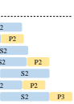
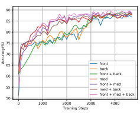
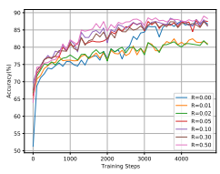
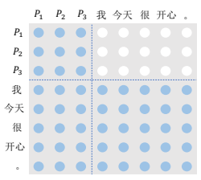
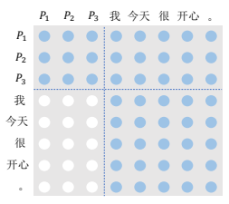
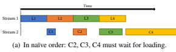
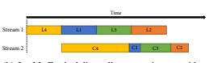
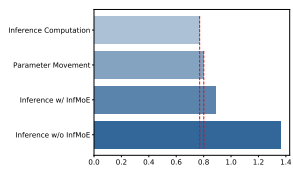

# Cpm-2: Large-Scale Cost-Effective Pre-Trained Language Models

Zhengyan Zhang∗, Yuxian Gu∗, Xu Han∗, Shengqi Chen∗, Chaojun Xiao∗**, Zhenbo Sun**
Yuan Yao, Fanchao Qi, Jian Guan, Pei Ke, Yanzheng Cai, Guoyang Zeng, Zhixing Tan Zhiyuan Liu†, Minlie Huang†, Wentao Han†**, Yang Liu, Xiaoyan Zhu, Maosong Sun**
Department of Computer Science and Technology, Tsinghua University & BAAI

## Abstract

In recent years, the size of pre-trained language models (PLMs) has grown by leaps and bounds. However, efficiency issues of these large-scale PLMs limit their utilization in realworld scenarios. We present a suite of costeffective techniques for the use of PLMs to deal with the efficiency issues of pre-training, fine-tuning, and inference. (1) We introduce knowledge inheritance to accelerate the pretraining process by exploiting existing PLMs instead of training models from scratch. (2) We explore the best practice of prompt tuning with large-scale PLMs. Compared with conventional fine-tuning, prompt tuning significantly reduces the number of task-specific parameters. (3) We implement a new inference toolkit, namely INFMOE, for using large-scale PLMs with limited computational resources. Based on our cost-effective pipeline, we pretrain two models: an encoder-decoder bilingual model with 11 billion parameters (CPM- 2) and its corresponding MoE version with 198 billion parameters. In our experiments, we compare CPM-2 with mT5 on downstream tasks. Experimental results show that CPM- 2 has excellent general language intelligence. Moreover, we validate the efficiency of INF- MOE when conducting inference of largescale models having tens of billions of parameters on a single GPU. All source code and model parameters are available at https:// github.com/TsinghuaAI/CPM.

## 1 Introduction

Training much larger models is an important research direction in deep learning (Bengio, 2013). Recently, pre-training has become the mainstream technique to develop large-scale neural networks and achieved great success in both computer vision
(CV) and natural language processing (NLP) (He et al., 2016; Dosovitskiy et al., 2020; Devlin et al., 2019). Especially, there are some much larger pretrained language models (PLMs) with hundreds of billions of parameters, such as GPT-3 (Brown et al., 2020), PANGU-α (Zeng et al., 2021), and Switch-Transformer (Fedus et al., 2021).

However, the cost of using PLMs is increasing rapidly with the growth of model sizes and becomes unaffordable for most users and researchers. The cost consists of three parts. (1) Large computation cost for pre-training: a super large model requires several weeks of pre-training with thousands of GPUs. (2) **Large storage cost** for fine-tuned models: a super large model usually takes hundreds of gigabytes (GBs) to store, and we need to store as many models as downstream tasks. (3) **Strict** equipment requirement for inference: it is common to use multiple GPUs for the inference of a super large model, so these models are hard to be used with limited computation resources.

To reduce the cost of large-scale PLMs from its pre-training to fine-tuning, we try to improve the whole pipeline of developing PLMs as follows:
(1) We adopt knowledge inheritance (Qin et al.,
2021) to accelerate the pre-training process. Current PLMs are usually trained from scratch on pretraining data via self-supervised methods, while there exist many PLMs that can also provide much knowledge. Knowledge inheritance aims to use the knowledge of existing PLMs to help the pretraining of new models.

(2) We use prompt tuning (Lester et al., 2021)
instead of fine-tuning to reduce the storage of taskspecific parameters. With prompt tuning, we only need to save the embeddings of prompt tokens, whose parameters are usually less than 0.01% of the whole model parameters.

(3) We design a high-performance and memoryefficient inference framework INFMOE with a dynamically-scheduled offloading strategy, to sup-

∗ Equal contribution † Corresponding authors: Z. Liu (liuzy@tsinghua.edu.cn),
M. Huang (aihuang@tsinghua.edu.cn), W. Han (hanwentao@tsinghua.edu.cn)

|             | nparam   | L   | nhead   | dhead   | dff    | dmodel   | Encoder   | Decoder   | MoE   |
|-------------|----------|-----|---------|---------|--------|----------|-----------|-----------|-------|
| CPM\-Small  | 109M     | 12  | 12      | 64      | 3,072  | 768      | %         | !         | %     |
| CPM\-Medium | 334M     | 24  | 16      | 64      | 4,096  | 1,024    | %         | !         | %     |
| CPM\-Large  | 2.6B     | 32  | 32      | 80      | 10,240 | 2,560    | %         | !         | %     |
| CPM\-2      | 11B      | 24  | 64      | 64      | 10,240 | 4,096    | !         | !         | %     |
| CPM\-2\-MoE | 198B     | 24  | 64      | 64      | 10,240 | 4,096    | !         | !         | !     |

Table 1: Comparisons between CPM and CPM-2. n*param* is the amount of model parameters. L is the number of model layers. n*head* is the number of attention heads in each layer. d*head* is the dimension of each attention head.

df f is the intermediate dimension of feed-forward layers. d*model* is the dimension of hidden states.

port the inference of MoE models on a single GPU.

Based on our optimized pipeline for PLMs, we develop two large-scale Cost-efficient Pre-trained language Models (CPM-2), an Chinese-English bilingual models with 11 billion parameters and its Mixture-of-Experts (MoE) version with 198 billion parameters. Specifically, we accelerate the pre-training process by dividing the pre-training process into three stages with knowledge inheritance: Chinese pre-training, bilingual pre-training, and MoE pre-training. Then, we compare CPM-2 with mT5 (Xue et al., 2020). Experimental results show that CPM-2 has excellent general language intelligence, including seven specific language capabilities. Based on CPM-2, we search for the best practice of prompt tuning. We find that (1) the positions of prompts are crucial and (2) combining prompt tuning and fine-tuning can lead to better results. Finally, we introduce INFMOE for users to conduct inference of large-scale models with tens of billions of parameters on a single GPU.

## 2 Pre-Training

In this section, we present the pre-training details of CPM-2.

### 2.1 Model

To reach a good balance between language understanding and generation, we develop CPM-2 based on a standard Transformer architecture consisting of a bidirectional encoder and a unidirectional decoder (Vaswani et al., 2017). Correspondingly, we adopt a variant of Masked Language Model
(MLM) (Devlin et al., 2019; Raffel et al., 2020), which is designed for encoder-decoder models. We construct the encoder input by randomly replacing several spans with different special tokens, and then ask the decoder to predict the replaced spans in turn. For example, given the original input, "These are issues which future studies may seek to address",
we can construct the encoder input, "These are [X]
which [Y] may seek to address", and the decoder target output "[X] issues [Y] future studies [Z]".

[X], [Y], [Z] are special tokens, where [X] and
[Y] are used to represent different spans and [Z] is used to represent the end of the output. Note that the ratio between the replaced tokens and the total tokens is 15% and the average length of replaced spans is set to 10.

The comparisons between our models and CPM (Zhang et al., 2020) are presented in Table 1.

To efficiently store model parameters on GPUs, we use the model parallelism (Shoeybi et al., 2019),
which splits self-attention layers and feed-forward layers along the width dimension, and finally distributes the partitions of one model on 4 GPUs.

To reduce memory requirements and speed up pre-training, we use mixed-precision training (Micikevicius et al., 2018), gradient checkpointing (Chen et al., 2016) and ZERO-stage-1 optimization (Rajbhandari et al., 2020; Rasley et al., 2020).

For CPM-2-MoE, we expand the feed-forward layer of each Transformer block to multiple experts. During the forward pass, for each token, we select one expert according to its current hidden state with a gating function. We balance the expert selection using the planning approach of BASE Layers (Lewis et al., 2021). Mixture-of-experts is an important technique for large-scale models because it can significantly improve the model capacity without extra computation cost (Jacobs et al.,
1991; Lepikhin et al., 2020; Fedus et al., 2021).

### 2.2 Data Processing

We pre-train our model on WuDaoCorpus (Yuan et al., 2021), which contains 2.3TB cleaned Chinese data as well as 300GB cleaned English data. Data in both languages are collected from multiple

|       | CCPM   | C3   | Sogou\-Log   | WMT20\-enzh   | Math23K   | LCSTS   | LCQMC   | AdGen   |
|-------|--------|------|--------------|---------------|-----------|---------|---------|---------|
| Train | 21k    | 8k   | 8,052k       | 21,000k       | 21k       | 2,400k  | 238k    | 114k    |
| Valid | 2.7k   | 2.7k | 500k         | 2k            | 1k        | 8.6k    | 8.8k    | 1k      |
| Test  | 2.7k   | 2.7k | 1k           | 2k            | 1k        | 0.7k    | 12.5k   | 3k      |

Table 2: Numbers of instances in each dataset.

domains, including encyclopedia, novels, Q&A,
scientific literature, e-book, news, and reviews.

To efficiently tokenize our pre-training corpus, we explore to reduce the redundancy brought by sentencepiece (Kudo and Richardson, 2018) to improve the vocabulary of CPM.

We find that the original sentencepiece tokenizer will insert many redundant white space tokens "_" to tokenized sequences. This makes the sequences become much longer. Since the implementation of sentencepiece has a weak encapsulation of interfaces, it is unfriendly towards programmers. Inspired by WoBERT (Su, 2020), we replace the sentencepiece tokenizer with a simple prefix matching and remove the white space insertion. Compared with sentencepiece, our newly-implemented tokenizer is more effective and easier to use.

Besides, in the writing system of Chinese, it is not important whether a token in the vocabulary appears at the beginning of a word or not, we merge the tokens like "快乐" (happy) and "_快 乐" (_happy) to a single token "快乐" (happy) to simplify the vocabulary.

### 2.3 Pre-Training With Knowledge Inheritance

The pre-training process of CPM-2 can be divided into three stages: Chinese pre-training, bilingual pre-training, and MoE pre-training. Compared to training models from scratch, multi-stage training with knowledge inheritance (Qin et al., 2021) can significantly reduce the computation cost.

Chinese Stage. In this stage, we only use Chinese texts as the training data. We suppose the model can focus on learning Chinese information and have a good basis to generalize to other languages.

Bilingual Stage. In this stage, we further pretrain the model from the Chinese stage on both Chinese and English texts. There are two main challenges, how to initialize the input embeddings of English tokens and how to prevent the model from catastrophic forgetting. (1) When initializing English embeddings, we use the embeddings of their prefixes to initialize their embeddings, making the English tokens more familiar to the model. If all prefixes of an English token are not in the original vocabulary, we randomly select an existing token embedding for initialization. (2) To eliminate the effect of catastrophic forgetting, we carefully design the ratio between English data and Chinese data. In the experiment, we find 1:2 can well maintain the language knowledge of Chinese and capture new knowledge of English.

MoE Stage. In this stage, we duplicate the model from the bilingual stage several times to initialize an MoE model. For the gating network, we adopt a random projection as a local sensitive hashing function (Har-Peled et al., 2012) and will not update the gating network in this stage. We suppose that the representation space of the model of the second stage is well organized, where similar tokens should use the same expert.

## 3 Evaluation Setups

To validate the effectiveness of our model, we evaluate CPM-2 on a general language intelligence benchmark, CUGE (Yao et al., 2021). CUGE consists of 40 mainstream Chinese NLP datasets and each dataset is categorized into one of the important types of language capabilities. Due to the limitation of computation, we select a representative dataset for each language capability to speed up the experiments. We describe each language capability and dataset as follows. The detailed statistics of these datasets are shown in Table 2.

Recall Capability. Recall capability aims to evaluate the models' ability to memorize and apply the general literature knowledge, such as the famous quotes, classical poems, and idioms.

We adopt Chinese Classical Poetry Matching Dataset (CCPM) (Li et al., 2021) to test the models' recall ability. Given a modern Chinese translation of a classic poem, the model is required to select the corresponding poem from four candidates.

Comprehension Capability. Comprehension capability aims to evaluate the models' ability to understand the given text and perform reasoning for specific tasks. For this capability, we select the C3 dataset (Sun et al., 2020) to evaluate our

|            | CCPM      | C3        | Sogou\-Log     | WMT20     | Math23K   | LCSTS     | LCQMC     | AdGen          | CUGE   |
|------------|-----------|-----------|----------------|-----------|-----------|-----------|-----------|----------------|--------|
|            | Acc       | Acc       | MRR/NDCG       | BLEU      | Acc       | Rouge\-L  | Acc       | BLEU/Distinct  | Score  |
| mT5\-small | 87.7(100) | 41.5(100) | 29.2/29.2(100) | 9.1(100)  | 18.4(100) | 33.1(100) | 82.1(100) | 10.2/32.3(100) | 100    |
| mT5\-large | 89.9(102) | 56.3(136) | 32.2/31.1(108) | 11.1(122) | 34.3(186) | 34.4(104) | 85.0(104) | 10.0/35.5(104) | 126    |
| mT5\-XXL   | 90.6(103) | 86.4(208) | 36.9/34.9(123) | 24.0(264) | 61.6(335) | 34.8(105) | 88.3(108) | 9.8/68.7(154)  | 190    |
| CPM\-2     | 91.6(104) | 86.1(207) | 36.3/35.5(123) | 26.2(288) | 69.4(377) | 35.9(108) | 89.2(109) | 10.6/70.2(161) | 198    |

Table 3: Performance of mT5 and CPM-2 with fine-tuning. We use the first 6 datasets, which makes up the lite version of CUGE, to compute the overall CUGE scores (%). The numbers in brackets are the CUEG scores (%) for each dataset.

model. C3is a free-form multiple-choice reading comprehension dataset, which requires the model to understand the given documents or dialogues and answer several related questions.

Calculation Capability. Calculation capability aims to test the models' ability to perform numerical reasoning. For this capability, we select Math23K (Wang et al., 2017), which consists of tens of thousands of real math word problems for elementary school students.

Cross-lingual Capability. Cross-lingual capability aims to evaluate the models' performance in understanding multi-lingual text. We adopt the machine translation task to evaluate the ability of CPM-2 in understanding English and Chinese sentences. The dataset we used in this task is provided by WMT20 (Barrault et al., 2020).

Summarization Capability. Summarization requires the model to read a long document and produce a concise summary while keeping the key information. We utilize LCSTS (Hu et al., 2015) to evaluate the summarization capability. LCSTS consists of tweets and their corresponding abstracts from the largest Chinese microblogging website (Sina Weibo).

Classification Capability. Text classification is a classic task in natural language processing. We evaluate the classification capability with a large-scale natural language inference dataset, LCQMC (Liu et al., 2018a). Given two questions, LCQMC requires the model to answer whether the two questions express similar intent.

Generation Capability. Text generation is one of the important tasks in natural language processing, which aims to generate fluent and diverse text.

We adopt the AdGen (Shao et al., 2019) as our benchmark, which requires the model to generate long advertising text given the several keywords.

We transform different tasks to a unified sequence-to-sequence format except for Sogou- Log. For Sogou-log, we train models in a contrastive manner following previous work (Liu et al.,
2018b). Besides the original metrics, such as accuracy and BLEU, we also report the CUGE score of each dataset, which is the percentage between the performance of the evaluated model and that of mT5-small.

We compare our model with mT5 (Xue et al.,
2020), including mT5-small, mtT5-large, and mT5-
XXL. Notably, mT5-XXL also adopts an encoderdecoder architecture with 13 billion parameters, which is comparable to CPM-2. To the best of our knowledge, Pangu-α (Zeng et al., 2021) with 200 billion parameters is the largest Chinese pretrained language model, which performs well in many downstream tasks. However, the parameters of Pangu-α are not publicly available, and thus we leave the comparison between CPM-2 and Pangu-α as future work.

## 4 Fine-Tuning

In this section, we fine-tune CPM-2 and mT5 on downstream tasks to evaluate their general language intelligence.

### 4.1 Experimental Setups

We adjust maximum lengths, batch sizes, learning rates for different models and datasets. Considering that the tokenizers of CPM-2 and mT5 are different, we first tokenize the whole dataset and then set the maximum length of samples as the maximum length instead of a pre-defined length. For the batch size, we search from 128 to 512 to ensure the number of input tokens is around 2 16 following Raffel et al. (2020). For learning rates, we search from 1e-6 to 1e-4 and we find that larger models prefer smaller values.

### 4.2 Results

The results of fine-tuning are shown in Table 3. We observe that CPM-2 is better than mT5 in most language capabilities, including Chinese language understanding, generation and English to Chinese

|           | CCPM   | C3     | Sogou\-Log     | WMT20                   | Math23K   | LCSTS    | LCQMC   | AdGen         |
|-----------|--------|--------|----------------|-------------------------|-----------|----------|---------|---------------|
|           |        |        |                | Performance on test set |           |          |         |               |
|           | Acc    | Acc    | MRR/NDCG       | BLEU                    | Acc       | Rouge\-L | Acc     | BLEU/Distinct |
| CPM\-2\-F | 91.63  | 86.05  | 36.28/35.49    | 26.21                   | 69.37     | 35.88    | 89.16   | 10.60/70.22   |
| CPM\-2\-P | 90.85  | 85.33  | 30.28/30.64    | 24.13                   | 67.48     | 34.17    | 88.36   | 8.63/72.02    |
| ∆(P − F)  | \-0.78 | \-0.72 | \-6.00/ \-4.85 | \-2.08                  | \-1.89    | \-1.71   | \-0.80  | \-1.97/+1.80  |
|           |        |        |                | GPU memory usage(%)     |           |          |         |               |
| CPM\-2\-F | 98     | 96     | 88             | 98                      | 93        | 98       | 98      | 98            |
| CPM\-2\-P | 50     | 46     | 49             | 75                      | 68        | 76       | 54      | 53            |
| ∆(P − F)  | \-48   | \-50   | \-39           | \-23                    | \-25      | \-22     | \-44    | \-45          |

Table 4: Comparisons between fine-tuning and prompt tuning. CPM-2-F represents fine-tuning. CPM-2-P represents prompt tuning. ∆(P − F) means the difference between fine-tuning and prompt tuning.

translation. Especially, CPM-2 outperforms mT5- XXL by over 10% in Math23K, which is for calculation capability. On the overall CUGE score, CPM-2 outperforms mT5-XXL by over 4%. This demonstrates that CPM-2 is an omnipotent largescale multi-lingual PLM.

## 5 Prompt Tuning

In this section, we study **prompt tuning** (Lester et al., 2021; Qin and Eisner, 2021; Li and Liang, 2021; Liu et al., 2021; Hambardzumyan et al., 2021) based on CPM-2. Different from conventional fine-tuning, prompt tuning inserts several prompt tokens into the original inputs and only updates the parameters of the inserted prompt tokens. For better clarification, we refer to the conventional full-parameter fine-tuning (Devlin et al., 2019) as **full-model tuning**. Throughout our experiments, we keep the number of prompt tokens as 100 to control the number of trainable parameters and initialize the parameters randomly. In the prompt tuning setting, the amount of the parameters needed to update is only 409.6K. Compared to the 11B parameters of full-model tuning, prompt tuning only needs to modify 0.0037% parameters.

We present the main results of prompt tuning in Section 5.1. We also explore how the positions of inserted prompt tokens affect the model performance (Section 5.2), how the prompt tokens work (Section 5.3), and propose a two-stage fine-tuning strategy to improve model performance on downstream tasks (Section 5.4).

### 5.1 Main Results

We present the model performance and GPU memory usage of both full-model tuning and prompt tuning in Table 4. From the results, we have two observations. (1) With prompt tuning, CPM-2 can achieve comparable performance to full-model tuning on most of tasks. However, prompt tuning significantly degrades the performance on Sogou- Log. The reason may be that Sogou-Log adopts a contrastive loss, which is different from other datasets and difficult to optimize under prompt tuning. (2) Prompt tuning is much more memoryefficient. The results of the GPU memory usage show that prompt tuning can save at most 50% GPU memory compared with full-model tuning.

This is because when the model is trained with the Adam optimizer, gradients and optimizer states account for a large proportion of the overall GPU
memory. Since the number of parameters needed to be optimized is much smaller in prompt tuning, the total sizes of gradient tensors and optimizer state tensors decrease. Note that small sizes of gradient tensors and optimizer state tensors also lead to small communication overhead during the synchronization of distributed training. This makes the optimization of a single step in prompt tuning faster than full-model tuning. However, we also observe that it takes much more steps for prompt tuning to converge than full-model tuning, which makes the whole time of prompt tuning longer. We leave the question "How to accelerate the convergence of prompt tuning?" to future work.

### 5.2 Position Of Prompt

We study the effect of the positions of the inserted prompt tokens. For single-sequence tasks, such as Math23k, there exist 3 strategies to insert the prompt: front, back, and front + back. For multisequence tasks, such as LCQMC, prompt tokens can also be inserted between two of the input sequences (middle). For a two-sequence input, there are 7 strategies to insert the prompt tokens. The illustration of all possible prompt insertions of the

| Position   |    | Prompt Inserted Sequence   |    |    |    |
|------------|----|----------------------------|----|----|----|
| F (Front)  | P1 | S1                         | S2 |    |    |
| B (Back)   | S1 |                            | S2 | P2 |    |
| M (Middle) | S1 | P2                         | S2 |    |    |
| F+B        | P1 | S1                         | S2 |    |    |
| F+M        | P1 | S1                         | P2 | S2 |    |
| M+B        | S1 | P1                         | S2 |    | P2 |
| F+M+B      |    |                            |    |    |    |

|       | Math23k   | LCQMC   |
|-------|-----------|---------|
| F     | 71.74     | 88.38   |
| B     | 72.40     | 88.50   |
| F+B   | 72.66     | 88.48   |
| M     | \-        | 89.20   |
| F+M   | \-        | 90.21   |
| M+B   | \-        | 90.38   |
| F+M+B | \-        | 90.65   |

Figure 1: Different designs to insert prompts for the task with two input sequences, S1 and S2. P1, P2, P3 represent different input prompts. F, B, M represent Front, Back, and Middle, respectively.

Table 5: Effects of prompt positions on Math23k and LCQMC. For both datasets, we report the accuracy on dev sets.

two-sequence input task is shown in Figure 1.

We conduct experiments on Math23k and LCQMC to evaluate the effect of prompt positions. We keep the number of prompt tokens as 100. When there are 2 positions to insert tokens, we insert 50 tokens at each position. When there are 3 positions, we insert 33, 34, 33 tokens at each position. The results are shown in Table 5.

From the table, we have two observations. (1)
For the single sentence task (Math23k), the positions of the prompt tokens have no significant influence on the model performance. (2) For the multi-sentence task (LCQMC), whether to insert the prompt between sentences significantly matters.

Compared with inserting prompts between the two input sentences, only considering the front and the back positions leads to about 2% accuracy drop.

To study the effect in the learning process, we plot the accuracy curves on the LCQMC dev set of different prompt positions. Furthermore, we take F+M as an example and change the proportion of the number of prompt tokens at different positions. The results are shown in Figure 2. In Figure 2(b), R denotes the ratio between the middle prompt token number and the total prompt token number.

From the figure, we can conclude that: (1) As Figure 2(a) shows, for "Front", "Back" and "Front

(a) Accuracy curve of different prompt positions.

(b) Accuracy curve of different ratio of the prompt token inserted between the two sentences.

Figure 2: Accuracy curves on the LCQMC dev set with different prompt insertion strategies.

+ Back" strategies, the convergence is much slower than the strategies with prompt tokens inserted between the two input sentences, which means it is necessary to insert the prompt between sentences to improve convergence speed. (2) As Figure 2(b)
shows, when R = 0.00 (front),R = 0.01 and R = 0.02 (insert 1 or 2 tokens between sentences),
the model converges slowly.But when we insert 5 or more tokens between the two sentences, the convergence speed is significantly improved. This means only a few middle-inserted tokens can help the model converge and when we add more tokens afterward, the impact of the middle token number is much less.

We think that the influence of the prompt token positions is related to the relative position embedding we use in CPM-2. When there are multiple input sentences, CPM-2 needs to model the tokens with a long distance. For relative position embedding, the long-range tokens will be assigned the same position embeddings, which may harm long-

|                | 3  C   | Math23K   | LCQMC   | CCPM   |
|----------------|--------|-----------|---------|--------|
| Full Attention | 85.75  | 71.74     | 90.21   | 93.19  |
| Mask P to T    | 83.84  | 69.92     | 81.50   | 92.78  |
| Mask T to P    | 68.54  | 35.29     | 79.45   | 86.90  |

Table 6: Results of masking the attentions between prompts and texts. "Mask P to T" means masking the attention weights from the prompt to the text and
"Mask T to P" means masking the attention weights from the text to the prompt. For both datasets, we report the accuracy on dev sets.

distance modeling. The prompt tokens inserted between sentences can bridge the gap between longrange tokens, which makes it easier for the model to learn the relationships between two input sentences.

### 5.3 How Prompt Works

Although prompt tuning can reach comparable performance with full-model tuning by only modifying a small number of parameters, the working mechanisms of prompt tuning are still unclear. We assume that the prompt can play two kinds of roles: (1) Working as a "Provider". Provide an additional context for the model input. (2) Working as an
"Aggregator". Aggregate the information from the input text.

To verify our hypothesis, we use attention masks to control the attentions between the prompt tokens and the text tokens. Specifically, for "Provider", we mask the attention from the prompt to text tokens such that the representations of prompt tokens can not be computed by attending to text tokens, disabling their ability to aggregate information. But they can still work as contexts and provide information to text tokens. For "Aggregator", on the contrary, we mask the attentions from text tokens to prompt tokens. In this way, prompt tokens can not work as contexts but can aggregate information by attending to text tokens. The illustration of our attention mask is shown in Figure 3.

We add the attention masks mentioned above to the model when doing prompt tuning. We conduct experiments on on C
3, Math23k, LCQMC, and CCPM. The results are shown in Table 6.

From the table, we can conclude that: (1) Both attention masks hurt the model performance on the two datasets. This means that the prompt should work as "Provider" and "Aggregator" at the same time for the model to reach good performance. (2) The impact of masking attention from text to

(a) The attention mask for "Provider". Attentions from prompt to text tokens are masked.

(b) The attention mask for "Aggregator". Attentions from text tokens to prompt are masked.

Figure 3: Attention masks for "Provider" and "Aggregator". P1, P2, P3 are prompt tokens.

prompt is larger than that of masking attention from prompt to text. This means prompt tokens are more likely to work as "Provider" than as "Aggregator" in prompt tuning.

### 5.4 Two-Stage Fine-Tuning

Previous work (Schick and Schütze, 2020a,b) has shown that good prompts can help stimulate model ability in full-model tuning. However, most of them explore to manually design prompts or search prompts in a discrete space, which requires many human efforts. To make the prompt design easier, we attempt to search for good prompts in a continuous space, which can benefit full-model tuning afterward. Specifically, we propose to fine-tune models with two stages. In the first stage, we perform prompt tuning to search for a prompt suitable for the downstream task. Then, in the second stage, we fine-tune the whole model together with the

|             | 3  C   | Math23k   | LCQMC   | CCPM   |
|-------------|--------|-----------|---------|--------|
| CPM\-2\-F   | 85.66  | 73.85     | 90.88   | 93.00  |
| CPM\-2\-P   | 85.75  | 71.74     | 90.21   | 93.19  |
| CPM\-2\-P+F | 86.77  | 75.26     | 90.45   | 93.42  |
| +fix prompt | 86.27  | 76.17     | 89.64   | 93.01  |
| \-stage 1   | 85.04  | 72.40     | 88.76   | 92.76  |

Table 7: Results of two-stage fine-tuning on three tasks using the dev sets. CPM-2-F stands for full-model tuning,CPM-2-P stands for prompt tuning. CPM-2-P+F
is our two-stage fine-tuning. "+fix prompt" means we fix the parameters of the prompt we have found in stage 1 when we do full-model tuning in stage 2. "-stage 1" means we randomly initialize the prompt tokens and do full-model tuning directly without stage 1.

prompt token embeddings. We hope that the model can take advantage of the prompt that we have found in the first stage and have better performance than the vanilla full-model tuning. We conduct experiments on C
3, Math23k, LCQMC, and CCPM.

We try several prompts given by the first stage and select the one with the best results in the second stage. For each dataset, we use the same hyperparameters as in Sections 4 and 5.1. Our results on dev set are shown in Table 7.

From the table, we have three observations: (1)
Two-stage fine-tuning can significantly improve the model performance on C
3and Math23k datasets by 2.16% and 1.41%, respectively. On the LCQMC dataset, two-stage fine-tuning has a similar performance as vanilla full-model tuning. We think this is because the LCQMC dataset is relatively easier than the other two datasets and vanilla fine-tuning can perform well enough without a better prompt.

(2) If we fix the prompt parameters during the second stage ("+fix prompt"), the model performance does not change much. We think this is because as fine-tuning goes, the gradients become small when backward to the input prompt. Therefore, the prompt tokens do not change much even when they are not fixed. (3) Without the first stage ("- stage 1"), even if we add additional parameters, the model can not reach a good performance, which proves the necessity of our two-stage fine-tuning.

## 6 Infmo**E: Memory-Efficient Inference** Framework For Moe Layers

Although MoE linear layers could outperform dense linear layers with almost the same computational cost (Fedus et al., 2021), they greatly enlarge the number of model parameters and require more memory to store these parameters. When increas- 

(b) INFMOE scheduling: all computation run without gaps.

Figure 4: Different scheduling strategies of loadimbalanced experts (L: parameter loading, C: computation).

ing the number of experts, the parameter size of the model can easily reach the order of tens or even hundreds of GBs. Such storage requirements greatly exceed the capacity of commodity GPUs, bringing difficulty not only to model training but also to model inference.

To make well-trained MoE layers more accessible to downstream tasks (e.g., to researchers using the aforementioned prompt tuning for downstream tasks), we introduce INFMOE
1, a highperformance and memory-efficient inference framework that can offload parameters of experts of MoE
layers to CPU memory.

INFMOE enables the inference of MoE layers with hundreds of billions of parameters using one single GPU. To preserve the efficiency of computation, we design a dynamic scheduling strategy that can overlap data movement of parameters with inference computation to the greatest extent.

### 6.1 Existing Inference Frameworks

PyTorch and TensorFlow are widely-used deep learning frameworks in industry and academia for both training and inference. There are also many other frameworks like TensorRT and ONNX Runtime that are specially designed for efficient model inference on different devices. However, they are currently not fit for the efficient inference of MoE layers for various reasons.

One category of these frameworks, like Tensor-
Flow Serving, uses static computational graphs for training and inference. Typically, graphs can only be moved between CPUs and GPUs as a whole, so it is difficult to offload selected parameters in the inference process. Currently, no existing static-

1INFMOE is an open-source toolkit with MIT License at https://github.com/TsinghuaAI/InfMoE.
graph-based framework can provide full support for all required operators of MoE layers.

Another category, including PyTorch, uses dynamic computational graphs and provides simple interfaces to control data storage location (such as layer.cuda() and layer.cpu(). However, these frameworks usually take full control of the scheduling of computation and data movement.

When handling MoE layers, they do not provide enough flexibility to implement the aforementioned overlapping mechanism. FastMoE (He et al., 2021) is a novel high-performance MoE implementation on top of PyTorch. However, FastMoE focuses on large-scale distributed training and also lacks delicate control on scheduling.

TensorRT is a high-performance (yet relatively low-level) inference SDK developed by NVIDIA.

It employs several optimization techniques like tensor fusion, kernel auto-tuning, and memory reusing. Our toolkit INFMOE is developed based on TensorRT. The reason why we choose TensorRT is that it supports custom plugins. Therefore, we can implement our own plugin only for MoE layers with a specially designed scheduling strategy, handing over the remaining layers to TensorRT to get optimal performance.

### 6.2 Scheduling Strategy For Offloading

The main challenge of the offloaded MoE layer inference lies in workload imbalance, as the amount of computation performed on different experts may be unbalanced. Tokens are routed and batched to different experts before computation. The workload distribution of experts may vary with different gating mechanisms (Lewis et al., 2021; Lepikhin et al., 2020; Fedus et al., 2021). Experts having more tokens to process will spend more time in computation, while the overhead of data movement
(which must be done prior to its computation) of each expert remains the same, for they all have the same amount of parameters.

In INFMOE, by using different CUDA streams, parameter-loading and computation of different experts can be easily overlapped (i.e., executed at the same time). However, as shown in Figure 4(a), naïvely running experts in order easily leads to a waste of time on waiting for parameter loading due to the imbalanced computation time.

In order to maximize the overlap between the communication and computation, we design a dynamic schedule strategy in INFMOE to reorder the

Figure 5: For our MoE model with 32 experts, we give the time (seconds) of inference computation, parameter movement, inference with INFMOE, and inference without INFMOE.

loading and computation sequence of these experts:
Assuming there are T experts in an MoE layer, we can estimate the computation time of the i-th expert (denoted as αi) and its communication time
(denoted as β). αiis obtained by dividing the number of floating operations by the peak computation performance of the GPU. With common expert workload (such as feed-forward layers in Transformers), it is proportional to the number of tokens. β can be calculated as the size of parameters to load from the CPU divided by the peak bandwidth of the GPU. It remains the same for all experts. In addition, due to the limit of GPU memory capacity and the existence of parameters belonging to non-MoE layers, only the parameters of a certain number (denoted as K and can be either configured or automatically inferred) of experts can reside in GPU memory simultaneously.

In order to obtain optimal overlapping with negligible cost, INFMOE use a greedy algorithm to generate a computation order of experts that satisfies the following two constraints:

- ∀1 ≤ t ≤ T,Pt−1 i=1 αi ≥ (t − 1)β. This means the parameter loading of each expert can be fully covered by the computation of previously loaded experts.

- ∀1 ≤ t ≤ T,Pt−1 i=1 αi ≤ (t + K − 1)β. This means no more than K experts will be loaded to GPU memory simultaneously during the whole process.

This computation order can guarantee that no expert would have to wait for the loading of its parameters except the first one, thus fully hiding the overhead of data movement caused by offloading and leveraging full GPU computing performance
(as shown in Figure 4(b). It is possible that these constraints cannot be satisfied at the same time.

Such unsatisfiability indicates either the total computation amount is too small, or the workload is extremely imbalanced. The former cause can be mitigated by increasing the batch size, while the latter is out of the scope for inference. As for the MoE gating mechanism described in Section 2.3, it shows a relatively good balance between experts in our evaluation, thus fits well for INFMOE.

We evaluate the effectiveness of INFMOE by inputting 40 instances into CPM-2-MoE with a single GPU. The computation times are reported in Figure 5. From the figure, we can find that using INFMOE for inference can overlap parameter movement and inference computation.

## 7 More Promising Directions For Effective And Efficient Pre-Trained Language Models

In this section, we will briefly introduce our four novel explorations in tokenization, architecture, pre-training, and fine-tuning to achieve a more efficient pipeline of PLMs.

### 7.1 Tokenization Based On Pronunciation And Glyph

For Chinese PLMs, input tokenization is quite important. The conventional tokenization methods applied by existing PLMs may treat each character as an indivisible token. However, there is more linguistic information beyond characters. To explore a better tokenization method for Chinese PLMs, we consider pronunciation, glyph, and word segmentation to tokenize the input for PLMs. More specifically, we build pronunciation-based tokenizers, glyph-based tokenizers, and segmentation-based tokenizers respectively, and then systematically evaluate their performance based on BERT. Sufficient experimental results on various downstream NLU tasks have shown that applying pronunciationbased and glyph-based tokenizers can outperform existing used character-based tokenizers, and is more robust on the text noise. For more details, we refer to our paper (Si et al., 2021).

### 7.2 Architecture Based On Non-Euclidean Geometry

Some recent efforts have shown that models learned in non-Euclidean geometry could better model complex data, especially those hyperbolic neural networks. However, existing hyperbolic networks are not completely hyperbolic, and training a deep hyperbolic network is also not trivial. To this end, we introduce a fully hyperbolic framework to build hyperbolic networks based on the Lorentz model and the Lorentz transformations. Based on the fully hyperbolic framework, we successfully train a hyperbolic Transformer and outperform existing Euclidean baselines. The experimental results show that hyperbolic Transformers can achieve comparable performance to Euclidean Transformers with half the size of model parameters, which may lead to more efficient PLMs in the future. In our paper (Chen et al., 2021), we introduce more details of building hyperbolic neural networks.

### 7.3 Pre-Training Based On Knowledge Inheritance

As we mentioned before, large-scale PLMs have achieved success on various NLP tasks. However, training a large-scale PLM requires huge amounts of computational resources, which is timeconsuming and expensive. Hence, taking the availability of existing well-trained PLMs into consideration is of importance. To this end, we propose knowledge inheritance to make previously trained PLMs benefit later larger PLMs. In fact, CPM-2 is built based on knowledge inheritance. In (Qin et al., 2021), we introduce the overall framework of knowledge inheritance, indicating the effect of teacher PLMs' settings, including pre-training methods, model architectures, training data, etc.

For more details, we refer to our original paper.

### 7.4 Fine-Tuning Based On Rich Knowledge

In our experiments, we have shown that CPM-2 can perform well with prompt tuning, as additional prompts can stimulate the rich knowledge of PLMs to better serve downstream tasks. Besides model knowledge distributed in PLMs, we explore utilizing the prior knowledge to make fine-tuning PLMs more efficient and effective. To this end, we propose prompt tuning with rules, which can apply logic rules to construct prompts with several subprompts. By encoding prior knowledge of each class into prompt tuning, PLMs can converge faster and achieve better results on downstream tasks. More details of this part are included in our paper (Han et al., 2021).

## 8 Conclusion

In this work, we propose a cost-effective pipeline for large-scale pre-trained language models, including pre-training with knowledge inheritance, finetuning based on prompt, and inference with dynamic scheduling. Correspondingly, we provide models and codes to support future applications with large-scale models. In the next stage, we will try to continually update our CPM models with emerging data gathered from the Internet to further improve model performance.

## Acknowledgments

Thanks to the Beijing Academy of Artificial Intelligence (BAAI) for providing the computing resources. In addition, we would like to thank BAAI, NetEase Inc., zhihu.com, and aminer.cn for the support in collecting the Chinese corpus.

## References

Loïc Barrault, Magdalena Biesialska, Ondˇrej Bojar, Marta R. Costa-jussà, Christian Federmann, Yvette Graham, Roman Grundkiewicz, Barry Haddow, Matthias Huck, Eric Joanis, Tom Kocmi, Philipp Koehn, Chi-kiu Lo, Nikola Ljubešic, Christof ´ Monz, Makoto Morishita, Masaaki Nagata, Toshiaki Nakazawa, Santanu Pal, Matt Post, and Marcos Zampieri. 2020. Findings of the 2020 conference on machine translation (WMT20). In Proceedings of Conference on Machine Translation, pages 1–55.

Yoshua Bengio. 2013. Deep learning of representations: Looking forward. In *Proceedings of SLSP*, volume 7978, pages 1–37. Springer.

Tom B. Brown, Benjamin Mann, Nick Ryder, Melanie Subbiah, Jared Kaplan, Prafulla Dhariwal, Arvind Neelakantan, Pranav Shyam, Girish Sastry, Amanda Askell, Sandhini Agarwal, Ariel Herbert-Voss, Gretchen Krueger, Tom Henighan, Rewon Child, Aditya Ramesh, Daniel M. Ziegler, Jeffrey Wu, Clemens Winter, Christopher Hesse, Mark Chen, Eric Sigler, Mateusz Litwin, Scott Gray, Benjamin Chess, Jack Clark, Christopher Berner, Sam Mc- Candlish, Alec Radford, Ilya Sutskever, and Dario Amodei. 2020. Language models are few-shot learners. In *Proceedings of NeurIPS*.

Tianqi Chen, Bing Xu, Chiyuan Zhang, and Carlos Guestrin. 2016. Training deep nets with sublinear memory cost. *arXiv preprint*, arXiv:1604.06174.

Weize Chen, Xu Han, Yankai Lin, Hexu Zhao, Zhiyuan Liu, Peng Li, Maosong Sun, and Jie Zhou. 2021. Fully hyperbolic neural networks. Technical report.

J. Devlin, Ming-Wei Chang, Kenton Lee, and Kristina Toutanova. 2019. BERT: Pre-training of deep bidirectional transformers for language understanding. In *Proceedings of NAACL-HLT*.

Alexey Dosovitskiy, Lucas Beyer, Alexander Kolesnikov, Dirk Weissenborn, Xiaohua Zhai, Thomas Unterthiner, Mostafa Dehghani, Matthias Minderer, Georg Heigold, Sylvain Gelly, Jakob Uszkoreit, and Neil Houlsby. 2020. An image is worth 16x16 words: Transformers for image recognition at scale. *arXiv preprint*, arXiv:2010.11929.

William Fedus, Barret Zoph, and Noam Shazeer. 2021.

Switch transformers: Scaling to trillion parameter models with simple and efficient sparsity. arXiv preprint, arXiv:2101.03961.

Karen Hambardzumyan, Hrant Khachatrian, and Jonathan May. 2021. WARP: word-level adversarial reprogramming. *arXiv preprint arXiv:2101.00121*.

Xu Han, Weilin Zhao, Ning Ding, Zhiyuan Liu, and Maosong Sun. 2021. PTR: Prompt tuning with rules for text classification. *arXiv preprint*, arXiv:2105.11259.

Sariel Har-Peled, Piotr Indyk, and Rajeev Motwani.

2012. Approximate nearest neighbor: Towards removing the curse of dimensionality. Theory Comput., 8(1):321–350.

Jiaao He, Jiezhong Qiu, Aohan Zeng, Zhilin Yang, Jidong Zhai, and Jie Tang. 2021. FastMoE: A Fast Mixture-of-Expert Training System. *arXiv preprint*, arXiv:2103.13262.

Kaiming He, Xiangyu Zhang, Shaoqing Ren, and Jian Sun. 2016. Deep residual learning for image recognition. In *Proceedings of CVPR*.

Baotian Hu, Qingcai Chen, and Fangze Zhu. 2015. Lcsts: A large scale chinese short text summarization dataset. In *Proceedings of EMNLP*, pages 1967– 1972.

Robert A. Jacobs, Michael I. Jordan, Steven J. Nowlan, and Geoffrey E. Hinton. 1991. Adaptive mixtures of local experts. *Neural Comput.*, 3(1):79–87.

Taku Kudo and John Richardson. 2018. Sentencepiece:
A simple and language independent subword tokenizer and detokenizer for neural text processing. In Proceedings of EMNLP.

Dmitry Lepikhin, HyoukJoong Lee, Yuanzhong Xu, Dehao Chen, Orhan Firat, Yanping Huang, Maxim Krikun, Noam Shazeer, and Zhifeng Chen. 2020. Gshard: Scaling giant models with conditional computation and automatic sharding. *arXiv preprint*, arXiv:2006.16668.

Brian Lester, Rami Al-Rfou, and Noah Constant. 2021.

The power of scale for parameter-efficient prompt tuning. *arXiv preprint arXiv:2104.08691*.

Mike Lewis, Shruti Bhosale, Tim Dettmers, Naman Goyal, and Luke Zettlemoyer. 2021. BASE layers: Simplifying training of large, sparse models. *arXiv* preprint, arXiv:2103.16716.

Wenhao Li, Fanchao Qi, Maosong Sun, Xiaoyuan Yi, and Jiarui Zhang. 2021. Ccpm: A chinese classical poetry matching dataset. arXiv preprint arXiv:2106.01979.

Xiang Lisa Li and Percy Liang. 2021. Prefixtuning: Optimizing continuous prompts for generation. *arXiv preprint arXiv:2101.00190*.

Xiao Liu, Yanan Zheng, Zhengxiao Du, Ming Ding, Yujie Qian, Zhilin Yang, and Jie Tang. 2021. GPT
understands, too. *arXiv preprint arXiv:2103.10385*.

Xin Liu, Qingcai Chen, Chong Deng, Huajun Zeng, Jing Chen, Dongfang Li, and Buzhou Tang. 2018a. LCQMC:a large-scale Chinese question matching corpus. In *Proceedings of COLING*, pages 1952–
1962.

Zhenghao Liu, Chenyan Xiong, Maosong Sun, and Zhiyuan Liu. 2018b. Entity-duet neural ranking: Understanding the role of knowledge graph semantics in neural information retrieval. In *Proceedings* of ACL, pages 2395–2405.

Paulius Micikevicius, Sharan Narang, Jonah Alben, Gregory Diamos, Erich Elsen, David Garcia, Boris Ginsburg, Michael Houston, Oleksii Kuchaiev, Ganesh Venkatesh, and Hao Wu. 2018. Mixed precision training. In *Proceedings of ICLR*.

Guanghui Qin and Jason Eisner. 2021. Learning how to ask: Querying lms with mixtures of soft prompts. In *Proceedings of NAACL-HLT*, pages 5203–5212.

Yujia Qin, Yankai Lin, Jing Yi, Jiajie Zhang, Xu Han, Zhengyan Zhang, Yusheng Su, Zhiyuan Liu, Peng Li, Maosong Sun, and Jie Zhou. 2021. Knowledge inheritance for pre-trained language models. arXiv preprint, arXiv:2105.13880.

Colin Raffel, Noam Shazeer, Adam Roberts, Katherine Lee, Sharan Narang, Michael Matena, Yanqi Zhou, Wei Li, and Peter J. Liu. 2020. Exploring the limits of transfer learning with a unified text-to-text transformer. *J. Mach. Learn. Res.*, 21:140:1–140:67.

Samyam Rajbhandari, Jeff Rasley, Olatunji Ruwase, and Yuxiong He. 2020. Zero: Memory optimizations toward training trillion parameter models. In Proceedings of SC, pages 1–16.

Jeff Rasley, Samyam Rajbhandari, Olatunji Ruwase, and Yuxiong He. 2020. Deepspeed: System optimizations enable training deep learning models with over 100 billion parameters. In *Proceedings of KDD*,
pages 3505–3506.

Timo Schick and Hinrich Schütze. 2020a. Exploiting cloze questions for few-shot text classification and natural language inference. *arXiv preprint*,
arXiv:2001.07676.

Timo Schick and Hinrich Schütze. 2020b. It's not just size that matters: Small language models are also few-shot learners. *arXiv preprint*, arXiv:2009.07118.

Zhihong Shao, Minlie Huang, Jiangtao Wen, Wenfei Xu, et al. 2019. Long and diverse text generation with planning-based hierarchical variational model. In *Proceedings of EMNLP-IJCNLP*, pages 3248– 3259.

Mohammad Shoeybi, Mostofa Patwary, Raul Puri, Patrick LeGresley, Jared Casper, and Bryan Catanzaro. 2019. Megatron-LM: Training multi-billion parameter language models using model parallelism.

arXiv preprint arXiv:1909.08053.

Chenglei Si, Zhengyan Zhang, Yingfa Chen, Fanchao Qi, Xiaozhi Wang, Zhiyuan Liu, and Maosong Sun. 2021. ShuoWenJieZi: Linguistically informed tokenizers for chinese language model pretraining. Technical report.

Jianlin Su. 2020. Wobert: Word-based chinese bert model - zhuiyiai. Technical report.

Kai Sun, Dian Yu, Dong Yu, and Claire Cardie.

2020. Investigating prior knowledge for challenging chinese machine reading comprehension. *TACL*,
8:141–155.

Ashish Vaswani, Noam Shazeer, Niki Parmar, Jakob Uszkoreit, Llion Jones, Aidan N. Gomez, Lukasz Kaiser, and Illia Polosukhin. 2017. Attention is all you need. In *Proceedings of NeurIPS*, pages 5998– 6008.

Yan Wang, Xiaojiang Liu, and Shuming Shi. 2017.

Deep neural solver for math word problems. In Proceedings of EMNLP, pages 845–854.

Linting Xue, Noah Constant, Adam Roberts, Mihir Kale, Rami Al-Rfou, Aditya Siddhant, Aditya Barua, and Colin Raffel. 2020. mt5: A massively multilingual pre-trained text-to-text transformer. *arXiv preprint*, arXiv:2010.11934.

Yuan Yao, Qingxiu Dong, Jian Guan, Boxi Cao, Fanchao Qi, Jinliang Lu, Jinran Nie, Junwei Bao, Kun Zhou, Shuhuai Ren, Xiaozhi Wang, Xuancheng Huang, Zheni Zeng, Zile Zhou, Zhiyuan Liu, Erhong Yang, Zhifang Sui, Maosong Sun, Jiajun Zhang, Juanzi Li, Minlie Huang, Rui Yan, Xianpei Han, Xiaodong He, Xiaojun Wan, Xin Zhao, Xu Sun, and Yang Liu. 2021. CUGE: A chinese language understanding and generation evaluation benchmark. Technical report.

Sha Yuan, Hanyu Zhao, Zhengxiao Du, Ming Ding, Xiao Liu, Yukuo Cen, Xu Zou, and Zhilin Yang. 2021. Wudaocorpora: A super large-scale chinese corpora for pre-training language models. *Preprint*.

Wei Zeng, Xiaozhe Ren, Teng Su, Hui Wang, Yi Liao, Zhiwei Wang, Xin Jiang, ZhenZhang Yang, Kaisheng Wang, Xiaoda Zhang, et al. 2021. Panguα: Large-scale autoregressive pretrained chinese language models with auto-parallel computation. arXiv preprint arXiv:2104.12369.

Zhengyan Zhang, Xu Han, Hao Zhou, Pei Ke, Yuxian Gu, Deming Ye, Yujia Qin, Yusheng Su, Haozhe Ji, Jian Guan, et al. 2020. CPM: A large-scale generative chinese pre-trained language model. *arXiv* preprint arXiv:2012.00413.

## A Contributions

Yuxian Gu and Zhengyan Zhang implemented the basic pre-training framework.

Xu Han implemented the pipeline parallel strategy for better efficiency.

Zhengyan Zhang implemented the MoE pretraining.

Yuxian Gu, Zhengyan Zhang, Chaojun Xiao, and Xu Han implemented the downstream tasks.

Shengqi Chen, Zhenbo Sun, Xu Han, and Yanzheng Cai implemented the toolkit of INF-
MOE.

Jian Guan, Pei Ke, Guoyang Zeng, and Zhixing Tan prepared the pre-training data.

Yuan Yao and Fanchao Qi prepared the finetuning data.

Zhengyan Zhang, Yuxian Gu, Xu Han, Chaojun Xiao, Zhenbo Sun, and Shengqi Chen wrote the paper.

Zhiyuan Liu, Minlie Huang, and Wentao Han designed and led the research.

Yang Liu, Xiaoyan Zhu, Maosong Sun provided valuable advice to the research.