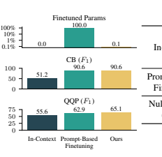
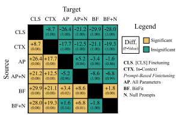
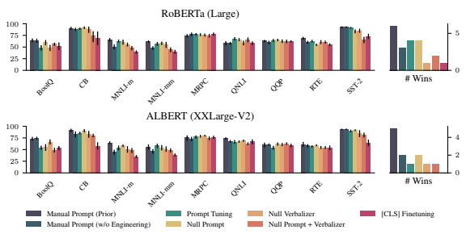
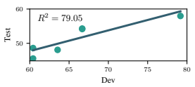
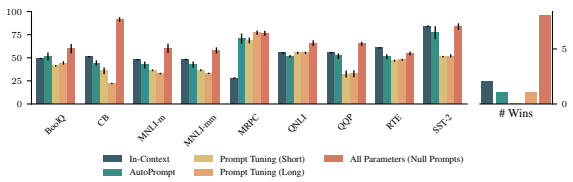
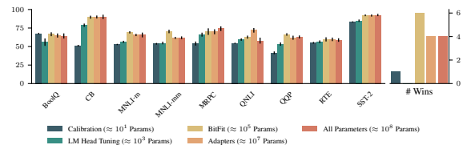

# Cutting Down On Prompts And Parameters: Simple Few-Shot Learning With Language Models

Robert L. Logan IV1**Ivana Balaževic´**
∗2 **Eric Wallace**3 Fabio Petroni4 Sameer Singh1 **Sebastian Riedel**4,5 1UC Irvine 2University of Edinburgh 3UC Berkeley 4Facebook AI Research 5University College London
{rlogan,sameer}@uci.edu ivana.balazevic@ed.ac.uk ericwallace@berkeley.edu {fabiopetroni,sriedel}@fb.com

## Abstract

Prompting language models (LMs) with training examples and task descriptions has been seen as critical to recent successes in few-shot learning. In this work, we show that finetuning LMs in the few-shot setting can considerably reduce the need for prompt engineering. In fact, one can use null prompts, prompts that contain neither taskspecific templates nor training examples, and achieve competitive accuracy to manuallytuned prompts across a wide range of tasks.

While finetuning LMs does introduce new parameters for each downstream task, we show that this memory overhead can be substantially reduced: finetuning only the bias terms can achieve comparable or better accuracy than standard finetuning while only updating 0.1% of the parameters. All in all, we recommend finetuning LMs for few-shot learning as it is more accurate, robust to different prompts, and can be made nearly as efficient as using frozen LMs.

### 1 Introduction

Few-shot learning—the ability to learn tasks with limited examples—is an important academic and practical challenge (Lake et al., 2015). In stateof-the-art NLP, few-shot learning is performed by reformulating tasks as natural language "prompts" and completing those prompts with pre-trained language models (Brown et al., 2020; Schick and Schütze, 2021a). Prompts that are well-designed can substantially improve accuracy (Zhao et al., 2021; Lu et al., 2021). However, finding these prompts is difficult: it requires a non-trivial combinatorial search over the prompt's wording (a.k.a. its pattern or template), whether and how to include training examples, and how to convert language model probabilities into class predictions. Consequently, prompts are often designed using human intuition that is hard to replicate and apply in a principled manner (Perez et al., 2021).

In this work, we seek to mitigate prompt engineering by identifying a class of simple prompts that are effective across many tasks for masked language models (LMs). We find that, when using prompt-based finetuning (Schick and Schütze, 2021a; Gao et al., 2021), the prompt requires less optimization than previously thought; in fact, the pattern and training examples can be completely cut out (e.g., Figure 1, right). These null prompts—simple concatenations of the inputs and the [MASK] token—achieve comparable accuracy to manually-written patterns while drastically simplifying prompt design: users only need to decide the label names (a.k.a. the verbalizer) and where to place the [MASK] token. The effectiveness of null prompts also challenges the common wisdom that the success of few-shot learning is due to inductive biases present in the prompt.

A key drawback of prompt-based finetuning is that it has large memory requirements for each new downstream task (Figure 1, left). In contrast, incontext learning (Brown et al., 2020) allows reusing large-scale LMs as is, but it requires significant prompt engineering. To determine whether memory efficiency and simple prompt selection can be simultaneously achieved, we experiment with either: (a) making prompts for in-context learning similarly easy to create, or (b) making promptbased finetuning more memory efficient. For (a),
we simplify prompt engineering for in-context learning by automatically tuning the prompt's tokens or embeddings, an approach that has been successful in the non-few-shot setting (Shin et al., 2020; Lester et al., 2021). For (b), we study lightweight finetuning alternatives that update a smaller set of parameters: BitFit (Ben-Zaken et al., 2021), Adapters (Houlsby et al., 2019), and calibration layers (Zhao et al., 2021).

∗Work done while an intern at Facebook AI Research.

| In\-Context   | {What does it feel like to be on Xanax?}1 and {Do 4mg Xanax bars exist?}2 have different  meanings. {How do you know if you're unconditionally in love with someone?}1 and  {How do you know if you're in love with someone and might only be denying the fact to   |
|---------------|---------------------------------------------------------------------------------------------------------------------------------------------------------------------------------------------------------------------------------------------------------------------|
|               | yourself?}2 have similar meanings. {Will GST affect the price level in India?}1 and {Will  GST effect the price level in India?}2 have [MASK] meanings.                                                                                                             |
| Prompt\-Based | {Will GST affect the price level in India?}1 ? [MASK] , I want to                                                                                                                                                                                                   |
| Finetuning    | know {Will GST effect the price level in India?}2                                                                                                                                                                                                                   |
| Null Prompts  | {Will GST affect the price level in India?}1 {Will GST effect                                                                                                                                                                                                       |
| (Ours)        | the price level in India?}2 [MASK]                                                                                                                                                                                                                                  |

Figure 1: **Different Methods of Few-Shot Learning.** Right: We visualize different types of prompts for QQP. We denote the input fields using curly brackets {}, the manually-written pattern using magenta, and the verbalizers using green. We show that *null prompts*, ones that do not contain training examples or task-specific patterns, can achieve competitive accuracy. Left: We compare different methods for model finetuning. Unlike standard prompt-based finetuning, we propose to update only the masked LM's bias

terms (BitFit). This achieves competitive accuracy while only updating 0.1% of the parameters.

We show that the latter approach—prompt-based finetuning with lightweight updates—is considerably more successful. In particular, updating only the model's bias terms (BitFit) can achieve competitive or better few-shot accuracy than standard finetuning while only updating 0.1% of the parameters. On the other hand, automated prompt tuning for incontext learning generally fails to find prompts that are competitive with manually-engineered ones. Taken together, our results show that prompt-based finetuning is preferable because it is more accurate, more robust across prompts, and can be made nearly as efficient as using frozen LMs.

## 2 Prompting Language Models

We use masked LMs for few-shot learning. Following Schick and Schütze (2021a), we have:
- a pre-trained masked LM, with T denoting its token vocabulary and T
∗the set of all token sequences.

- a small set of training inputs xi ∈ X and their corresponding labels yi ∈ Y .

- a *pattern* P : X → T
∗that maps inputs to cloze questions containing a single [MASK] token. Additionally, a *verbalizer* v : Y → T that maps each label to a single vocabulary token. We call the pattern and verbalizer together the *prompt*.

In our work, we consider different ways of constructing the prompt (Section 2.1) and updating the masked LM's parameters (Section 2.2). Table 1 contains an overview of existing prompting methods and the settings they are evaluated in.

### 2.1 Constructing The Prompt

The prompt is important: different prompts can cause accuracy to vary from near chance to near state-of-the-art (Zhao et al., 2021). This importance, as well as the nontrivial nature of manually tuning the prompt, has led to growing interest in methods for automatic prompt design (Shin et al.,
2020; Gao et al., 2021; Lu et al., 2021). These methods search for elements such as (1) the text of the pattern, (2) the tokens in the verbalizers, and (3)
whether and how training examples are prepended before the test input. Unfortunately, while automated prompt search can match the accuracy of manual tuning, it introduces its own complexities. For example, the prompts from Gao et al. (2021) achieve comparable results to manually-designed prompts but are found using large generative models and careful validation.

In this paper, we show that prompt-based finetuning (see Section 2.2) can considerably reduce the importance of the prompt. This does not contradict past work—the extreme importance of the prompt is only true when models are *not finetuned*.

### 2.2 Finetuning The Lm

In-context Learning The most well-known strategy for few-shot learning is using a frozen LM (Brown et al., 2020). This strategy relies solely

| Method                              | Finetuned Params          | Prompt Design        | Few\-shot   |
|-------------------------------------|---------------------------|----------------------|-------------|
| AUTOPROMPT (Shin et al., 2020)      | None                      | Learned (Discrete)   | ✗           |
| Prompt Tuning (Lester et al., 2021) | Prompt Token Embeds       | Learned (Continuous) | ✗           |
| OPTIPROMPT (Zhong et al., 2021)     | Prompt Token Embeds       | Learned (Continuous) | ✗           |
| Soft Prompts (Qin and Eisner, 2021) | All Contextualized Embeds | Learned (Continuous) | ✗           |
| GPT\-3 (Brown et al., 2020)         | None                      | Manual               | ✓           |
| PET (Schick and Schütze, 2021a)     | All                       | Manual               | ✓           |
| LM\-BFF (Gao et al., 2021)          | All                       | Learned (Discrete)   | ✓           |
| P\-Tuning (Liu et al., 2021)        | All + Prompt Token Embeds | Learned (Continuous) | ✓           |
| Null Prompts + Bitfit (Ours)        | Bias Terms                | None                 | ✓           |

Table 1: **Overview of Existing Work on Prompting**. *Finetuned Params* indicates the parameters altered during training. *Prompt Design* indicates how prompts are created; we use null prompts. *Few-Shot*

indicates using few-shot training and validation sets.

on *in-context learning* (a.k.a. priming), where the LM learns by conditioning on the prompt rather than updating its parameters. In-context learning is most successful when using very large (e.g., billions of parameters) LMs, as these models better leverage the prompt (Brown et al., 2020).

Prompt-Based Finetuning Rather than using frozen LMs, *prompt-based finetuning* methods finetune all of the LM's parameters (Schick and Schütze, 2021a; Scao and Rush, 2021; Gao et al., 2021). For masked LMs, this is done by constructing training examples that contain a [MASK] token and finetuning the masked LM to generate the correct verbalizer token in that position.

The main advantage of prompt-based finetuning over in-context learning is that it achieves higher accuracy, especially when the LM is relatively small (Schick and Schütze, 2021b). The main downside is that the same model can no longer be reused across different tasks, thus reducing memory efficiency. In this paper, we will show an additional benefit to prompt-based finetuning—it makes prompt engineering easier. Moreover, we will show that the memory inefficiency of promptbased finetuning can be drastically mitigated using lightweight finetuning alternatives. Scao and Rush (2021) concurrently show that different manuallywritten patterns lead to similar accuracy for promptbased finetuning. We take this a step further and show that writing can be avoided entirely; null patterns which merely concatenate the inputs and the [MASK] tokens also have similar accuracy, yet have a substantially simpler design space.

## 3 Experimental Setup

#### 3.1 Datasets And Hyperparameter Tuning

We use the following classification datasets from GLUE (Wang et al., 2019b) and Super- GLUE (Wang et al., 2019a): BoolQ, CB, MNLI,
MRPC, QNLI, QQP, RTE, and SST-2.1 To build few-shot datasets, past work collects K examples from each label for training and K examples from each label for development (Gao et al., 2021). Despite this setup often being denoted as K-shot learning, it effectively uses 2K examples and splits the examples evenly into train and development. We instead propose to use cross validation to perform more principled model selection. Concretely, we sample 2K examples from each label and use 4-fold cross validation to determine the best hyperparameters. After finding the best hyperparameters, we train on the first K examples and early stop on the second K examples. We use K = 16 following past work (Gao et al., 2021).

We sample our examples from each dataset's original training set. Since few-shot learning can be high variance, we sample the examples with 10 different random seeds and report the mean and variance of the model performance. We use each dataset's original development set for our final evaluation and use the standard evaluation metrics (accuracy or F1) associated with each dataset. We do not check the final evaluation metrics during any tuning of the hyperparameters to ensure that we are doing "true" few-shot learning (Perez et al., 2021).

1We also evaluated on WiC and WNLI. We omit these results because all models achieved near-random accuracy.

Figure 2: **How \# Wins are Computed**. For a given

dataset, we perform a Welch's t-test to determine if there is a significant difference in accuracy for each pair of methods. The method which performs better than most other methods (i.e., the row with the most yellow squares; BitFit in this case) is considered the "winner" of the task, and its *\# Wins* is incremented by 1. In the figure above, we show a subset of methods evaluated on a single dataset.

### 3.2 Masked Language Models

Following past work (Schick and Schütze, 2021b),
we use the RoBERTa (large, 330M params, Liu et al., 2019) and ALBERT (xxl-v2, 223M params, Lan et al., 2019) masked LMs provided by the HuggingFace transformers library (Wolf et al., 2020).

### 3.3 Comparing Few-Shot Methods By # Wins

The results for different few-shot learning methods can be quite different across datasets and seeds for the training set (Zhao et al., 2021; Schick and Schütze, 2021a). To compare different methods at a high level, we use a metric denoted as *\# Wins*: the number of datasets that a given method performs significantly better than all other methods on. We compute this metric for a given dataset by first performing a Welch's t-test to determine if there is a significant difference in accuracy for each pair of methods. The method which performs better than most other methods is considered the
"winner" of the task and its *\# Wins* is incremented by 1. There are multiple winners in the case of a tie. See Figure 2 for a demonstration.

## 4 Simplifying Prompt Engineering

In this section, we run prompt-based finetuning and ablate different elements of the prompt. We consider the following ablations:
- **Manual Prompt (Prior)**: We use manuallywritten prompts from Schick and Schütze
(2021a,b). These works do not specify how they obtained these prompts—they may have been tuned using large validation sets. We show the patterns and verbalizers in Appendix A1.

- **Manual Prompt (w/o Engineering)**: We simulate standard prompt design by manually writing one prompt for each task using our intuition. We show the prompts in Appendix A2.

- **Prompt Tuning**: Inspired by Liu et al. (2021)
and Lester et al. (2021), we use the pattern from Manual Prompt (Prior) but randomly initialize the embeddings of the pattern tokens and learn them using gradient-based optimization. This ablates the gains from human-designed patterns.

- **Null Prompt**: We use the same verbalizer as Manual Prompt (Prior) but use a pattern that consists of only the input fields and a [MASK] token (Appendix A3). This ablates the pattern entirely.

- **Null Verbalizer**: We use the same pattern as Manual Prompt (Prior) but select random tokens for the verbalizer. This ablates the gains from a human-designed verbalizer.

- **Null Prompt + Verbalizer** We use both null prompts and random tokens for the verbalizer.

In all cases, we finetune all of the masked LM parameters. We show the accuracy of the above prompts as well as traditional finetuning (using a
[CLS] token and a classification head) in Figure 3. Manual Prompts Perform Best The manuallywritten prompts from prior work perform best on average for both models. However, it is unclear how these prompts were obtained. On the other hand, our manual prompts (w/o Engineering) are noticeably worse than the ones from prior work and are outperformed by many other methods. Null Prompts Are Competitive In many cases, prompt tuning and null prompts perform comparably to manually-written prompts, especially for RoBERTa. For instance, both of these methods outperform our manually-written prompts in terms of \# Wins. These results are exciting from a practical perspective as they show that one can achieve competitive few-shot results without resorting to any tuning of the prompt.

Figure 3: **Simplifying the Selection of Prompts**. We apply prompt-based finetuning in conjunction with six different types of prompts. We report accuracy or F1 on each dataset. Manually-designed prompts from prior work achieve the best accuracy but require manual tuning on validation sets. On the other hand, null prompts and prompt tuning both perform competitively without requiring any tuning of the pattern.

From an analysis perspective, these results also show that effective few-shot learning can be accomplished without any inductive bias from a manuallywritten pattern. In fact, combining null prompts with null verbalizers, which involves no human design at all, still significantly outperforms standard [CLS] finetuning for numerous tasks (3 for RoBERTa and 5 for ALBERT at p = 0.05). This shows that some of the effectiveness of promptbased finetuning is due to its basic setup, i.e., predicting on a [MASK] token with an MLM head. Null Prompts or Prompt Tuning? Both null prompts and prompt tuning achieve competitive results without resorting to manual prompt design. We advocate for using null prompts over prompt tuning because they are easier to use. Null prompts only require choosing which order to concatenate the input fields and the [MASK] token. Prompt tuning requires choosing the number of embeddings, their placement, their initialization, etc.

Moreover, determining the concatenation order for null prompts is trivial by just trying all possible options and choosing which one works best on the validation set. To see this, in Figure 4 we plot the accuracy on the few-shot development set and the full test set for different concatenation orders for RoBERTa on MNLI.2 The development and test ac-

Figure 4: The only decision to make when using null prompts is which order to concatenate the mask token and the input fields. One can robustly choose the best option using a tiny held-out development set. We show the results for MNLI, with the fewshot development set accuracy on the x-axis.

curacy is strongly correlated (R2 = 79.05), which demonstrates that tuning the concatenation order is easy even when validation data is scarce. In our experiments we use arbitrary concatenation orders; null prompts may more effective with tuning.

## 5 Achieving Simplicity And **Efficiency**

Thus far, we have shown that prompt-based finetuning can simplify prompt engineering at the cost of memory inefficiency—a new set of parameters must be learned for each task. This is in contrast to in-context learning, which holds all model weights fixed but is heavily influenced by small prompt modifications (Zhao et al., 2021; Lu et al., 2021). In this section, we investigate how to achieve both

2We use MNLI because the concatenation order has a large impact on performance.

Figure 5: **Prompt-Only Tuning**. We try to simplify prompt engineering for in-context learning (i.e., using frozen models) by directly learning the prompt. The performance (accuracy/F1) for prompt-only tuning is substantially lower than finetuning the LM parameters for RoBERTa-large. Thus, we recommend finetuning over in-context learning in the few-shot setting.

Figure 6: **Parameter-Efficient Prompt-based Finetuning**. We perform prompt-based finetuning using different lightweight finetuning schemes. We show the accuracy or F1 on each dataset for RoBERTa-large.

BitFit achieves the highest accuracy on average and only modifies 0.1% of the parameters.

memory efficiency and simple prompts. Concretely, in Section 5.1 we try to simplify prompt engineering for in-context learning by tuning the prompt, and in Section 5.2, we reduce the number of learned parameters for prompt-based finetuning.

#### 5.1 Simplifying In-Context Learning With Prompt-Only Tuning

Here, we try to make prompt engineering for incontext learning as simple as prompt-based finetuning by automatically finding the prompt. Concretely, we focus on the emerging class of methods that do *prompt-only tuning*: learning the prompt while keeping the rest of the model fixed (Shin et al., 2020; Lester et al., 2021). We consider:
- AUTOP**ROMPT**: Following (Shin et al., 2020),
we search for discrete tokens to use in the input instead of manually-designed patterns. We use the hyperparameters from Shin et al. (2020).

- **Prompt Tuning (Short)**: We use the same prompt tuning approach described in the previous section but we keep the masked LM fixed.

- **Prompt Tuning (Long)**: We increase the number of learned prompt embeddings to 20 in order to expand the learning capacity.

For reference, we also report the results from prompt-based finetuning with null prompts. We show the results for RoBERTa in Figure 5. We find that only tuning the prompt is relatively unsuccessful. First, on average it fails to match the performance of manually-designed prompts. Second, all methods struggle to match the accuracy of prompt-based finetuning. In fact, for many of the datasets, prompt-only methods perform worse by a wide margin (e.g., 40% absolute difference in F1 score on CB). This shows that finetuning masked LMs in the few-shot setting leads to substantially higher accuracy than prompt-only tuning.

|      |                          | BoolQ   | CB   | MNLI        | MRPC   | QNLI   | QQP   | RTE   | SST\-2   | Wins   |
|------|--------------------------|---------|------|-------------|--------|--------|-------|-------|----------|--------|
|      |                          | (acc)   | (F1) | (acc)       | (F1)   | (acc)  | (F1)  | (acc) | (acc)    | (#)    |
|      | In\-context              | 49.2    | 51.2 | 48.0 / 48.1 | 28.0   | 55.2   | 55.6  | 60.7  | 84.1     | 0      |
|      | [CLS] finetuning         | 51.0    | 74.3 | 39.4 / 38.6 | 77.8   | 58.2   | 61.9  | 54.5  | 72.9     | 1      |
| ERTa | Prompt\-based Finetuning |         |      |             |        |        |       |       |          |        |
| B    | All Parameters           | 63.9    | 90.6 | 66.5 / 61.6 | 74.1   | 57.4   | 62.9  | 68.8  | 92.6     | 3      |
| Ro   | + Null Prompt            | 59.9    | 91.2 | 61.6 / 57.8 | 76.1   | 65.8   | 65.9  | 54.6  | 83.8     | 3      |
|      | BitFit                   | 66.7    | 89.8 | 69.3 / 70.0 | 69.7   | 62.3   | 66.3  | 64.9  | 92.1     | 6      |
|      | + Null Prompt            | 67.2    | 90.6 | 67.5 / 62.9 | 68.2   | 66.4   | 65.1  | 65.4  | 89.6     | 3      |
|      | In\-context              | 68.0    | 19.9 | 35.4 / 35.2 | 20.7   | 50.1   | 0.3   | 53.1  | 49.1     | 0      |
|      | [CLS] finetuning         | 53.3    | 56.5 | 36.0 / 38.6 | 76.9   | 66.6   | 58.5  | 54.1  | 62.9     | 2      |
| ERT  | Prompt\-based Finetuning |         |      |             |        |        |       |       |          |        |
| B    | All Parameters           | 73.5    | 91.1 | 65.0 / 56.0 | 75.2   | 73.9   | 59.9  | 61.4  | 93.2     | 8      |
| AL   | + Null Prompt            | 53.7    | 89.4 | 58.2 / 53.7 | 78.5   | 67.3   | 62.0  | 59.2  | 91.5     | 3      |
|      | BitFit                   | 77.2    | 86.7 | 64.6 / 61.6 | 79.7   | 73.1   | 61.4  | 58.6  | 92.0     | 8      |
|      | + Null Prompt            | 52.8    | 86.3 | 55.3 / 58.0 | 65.5   | 63.8   | 52.7  | 57.2  | 89.7     | 1      |

Table 2: **Final Few-shot Results** from representative methods. Wins are computed on a per-datasets basis and the "winners" of the different approaches are highlighted in bold. Prompt-based finetuning significantly outperforms in-context learning and traditional [CLS] finetuning, even without any tuning of the prompt (*null prompt*). Moreover, prompt-based finetuning can be highly memory efficient using bias-only finetuning (*BitFit*). We show matched and mismatched results for MNLI.

Our Results versus Recent Prompt Tuning Work We find that only tuning the prompt performs substantially worse than finetuning the entire LM. This is in contrast to recent work, which argues that prompt-only tuning is competitive with finetuning (Lester et al., 2021; Li and Liang, 2021). We believe these are not contradictions but rather differences in the models and settings. Li and Liang
(2021) focus on *left-to-right* LMs for *generation* tasks, whereas we focus on masked LMs for classification tasks. This may explain the difference in the results. Moreover, Lester et al. (2021) show that prompt-only tuning becomes less competitive as models get smaller; we use even smaller models than evaluated in their work. Consequently, although we find that finetuning a masked LM is superior to prompt-only tuning, there may be other settings in which they fair similarly.

### 5.2 Memory-Efficient Finetuning

Given the inadequacies of prompt-only tuning, we next study if prompt-based finetuning can be made memory-efficient. To do so, we focus on reducing the number of trainable parameters, taking inspiration from recent work in the non-few-shot setting. We consider four methods:

- **Adapters**: We use Adapters (Houlsby et al.,
2019), neural networks layers that are inserted between the feedforward portion of the Transformer architecture. We use the default Adapters hyper-

parameters from Houlsby et al. (2019) (≈ 107 parameters per task).

- **BitFit**: Following Ben-Zaken et al. (2021), we only update the bias terms inside the Transformer
(≈ 105 parameters per task).

- **LM Head Tuning**: We update the embeddings in the MLM output layer that are associated with the verbalizer tokens (≈ 103 parameters per task).

- **Calibration**: Following Zhao et al. (2021), we learn an affine transformation on top of the logits associated with the verbalizer tokens (≈ 101 parameters per task).

We run prompt-based finetuning for each method with the prompts from Manual Prompts (Prior).

We also report the accuracy of finetuning all of the parameters for reference.

Results We show the results in Figure 6. There are diminishing returns as the parameter count is increased. In particular, substantial gains are made when going from calibration to LM head tuning to BitFit, however, there is either a marginal improvement or even a decrease in performance when going to Adapters or All Parameters. The BitFit method provides the best accuracy-efficiency tradeoff, and it even outperforms finetuning all of the parameters in terms of \# Wins. This suggests that updating all of the LM's hundreds of millions of parameters on only 16 data points is suboptimal.

### 5.3 Putting Everything Together

We finally combine null prompts and memoryefficient finetuning. We show the results from this method, as well as the other best few-shot methods, in Table 2. Overall, we recommend finetuning with null prompts and BitFit: it achieves competitive accuracy, is simple to set up, and introduces small memory costs for each new task.

## 6 Conclusion And Future Work

Two high-level methods exist in few-shot prompting: using a frozen LM (in-context learning) and finetuning the LM on the few training examples (prompt-based finetuning). In this work, we demonstrate two new advantages of prompt-based finetuning. First, we show that it is robust to different choices of the prompt. In fact, there is a simple class of prompts—null prompts—that can be flexibly applied to different tasks without degrading performance relative to manually-written and learned prompts. Second, we demonstrate that promptbased finetuning can be made memory efficient: finetuning only the bias terms (BitFit) achieves comparable or better accuracy than finetuning all the parameters while being 1000x more memory efficient. Taken together, using null patterns with BitFit is an approach that is efficient, simple-totune, and competitive in accuracy.

Our results motivate future *analysis* of few-shot learning methods. Concretely, we show that the success of prompt-based finetuning is not solely explained by carefully-chosen patterns or verbalizers. This suggests that the gains from promptbased finetuning are partially due to its low-level setup, i.e., predicting on a [MASK] token with a pre-trained MLM head. More generally, we hope to further analyze why and how small changes to different few-shot learning methods can lead to wildly different accuracies. We also hope to extend our findings to both *very large* and *left-to-right* LMs, as our current results are for masked LMs that are relatively small by modern standards.

## References

Elad Ben-Zaken, Shauli Ravfogel, and Yoav Goldberg. 2021. BitFit: Simple parameterefficient fine-tuning for transformer-based masked language-models.

Tom B. Brown, Benjamin Mann, Nick Ryder, Melanie Subbiah, Jared Kaplan, Prafulla Dhariwal, Arvind Neelakantan, Pranav Shyam, Girish Sastry, Amanda Askell, Sandhini Agarwal, Ariel Herbert-Voss, Gretchen Krueger, Tom Henighan, Rewon Child, Aditya Ramesh, Daniel M. Ziegler, Jeffrey Wu, Clemens Winter, Christopher Hesse, Mark Chen, Eric Sigler, Mateusz Litwin, Scott Gray, Benjamin Chess, Jack Clark, Christopher Berner, Sam McCandlish, Alec Radford, Ilya Sutskever, and Dario Amodei. 2020. Language models are few-shot learners. In NeurIPS.

Tianyu Gao, Adam Fisch, and Danqi Chen. 2021.

Making pre-trained language models better fewshot learners. In ACL.

Neil Houlsby, Andrei Giurgiu, Stanislaw Jastrzebski, Bruna Morrone, Quentin De Laroussilhe, Andrea Gesmundo, Mona Attariyan, and Sylvain Gelly. 2019. Parameter-efficient transfer learning for NLP. In *ICML*.

Brenden M Lake, Ruslan Salakhutdinov, and Joshua B Tenenbaum. 2015. Human-level concept learning through probabilistic program induction. In *Science*.

Zhenzhong Lan, Mingda Chen, Sebastian Goodman, Kevin Gimpel, Piyush Sharma, and Radu Soricut. 2019. ALBERT: A lite BERT for selfsupervised learning of language representations. In *ICLR*.

Brian Lester, Rami Al-Rfou, and Noah Constant. 2021. The power of scale for parameterefficient prompt tuning. arXiv preprint arXiv:2104.08691.

Xiang Lisa Li and Percy Liang. 2021. Prefix-
Tuning: Optimizing continuous prompts for generation. *arXiv preprint arXiv:2101.00190*.

Xiao Liu, Yanan Zheng, Zhengxiao Du, Ming Ding, Yujie Qian, Zhilin Yang, and Jie Tang.

2021. GPT understands, too. arXiv preprint arXiv:2103.10385.

Yinhan Liu, Myle Ott, Naman Goyal, Jingfei Du, Mandar Joshi, Danqi Chen, Omer Levy, Mike Lewis, Luke Zettlemoyer, and Veselin Stoyanov. 2019. RoBERTa: A robustly optimized BERT pretraining approach. *arXiv preprint* arXiv:1907.11692.

Yao Lu, Max Bartolo, Alastair Moore, Sebastian Riedel, and Pontus Stenetorp. 2021. Fantastically ordered prompts and where to find them: Overcoming few-shot prompt order sensitivity. arXiv preprint arXiv:2104.08786.

Ethan Perez, Douwe Kiela, and Kyunghyun Cho.

2021. True few-shot learning with language models. *arXiv preprint arXiv:2105.11447*.

Guanghui Qin and Jason Eisner. 2021. Learning how to ask: Querying LMs with mixtures of soft prompts. In *NAACL*.

Teven Le Scao and Alexander M. Rush. 2021. How many data points is a prompt worth? In *NAACL*.

Timo Schick and Hinrich Schütze. 2021a. Exploiting cloze questions for few-shot text classification and natural language inference. In *EACL*.

Timo Schick and Hinrich Schütze. 2021b. It's not just size that matters: Small language models are also few-shot learners. In *NAACL*.

Taylor Shin, Yasaman Razeghi, Robert L Logan IV,
Eric Wallace, and Sameer Singh. 2020. AutoPrompt: Eliciting knowledge from language models with automatically generated prompts. In *EMNLP*.

Alex Wang, Yada Pruksachatkun, Nikita Nangia, Amanpreet Singh, Julian Michael, Felix Hill, Omer Levy, and Samuel Bowman. 2019a. SuperGLUE: A stickier benchmark for generalpurpose language understanding systems. In NeurIPS.

Alex Wang, Amanpreet Singh, Julian Michael, Felix Hill, Omer Levy, and Samuel R Bowman. 2019b. GLUE: A multi-task benchmark and analysis platform for natural language understanding. In ICLR.

Thomas Wolf, Lysandre Debut, Victor Sanh, Julien Chaumond, Clement Delangue, Anthony Moi, Pierric Cistac, Tim Rault, R'emi Louf, Morgan Funtowicz, and Jamie Brew. 2020. Hugging- Face's Transformers: State-of-the-art natural language processing. In *EMNLP Demo Track*.

Tony Z Zhao, Eric Wallace, Shi Feng, Dan Klein, and Sameer Singh. 2021. Calibrate before use:
Improving few-shot performance of language models. In *ICML*.

Zexuan Zhong, Dan Friedman, and Danqi Chen.

2021. Factual probing is [MASK]: Learning vs. learning to recall. In NAACL.

| Dataset   | Pattern                                           | Verbalizer           |
|-----------|---------------------------------------------------|----------------------|
| BoolQ     | {passage}. Question: {question}? Answer: [MASK].  | True: "Yes"          |
|           |                                                   | False: "No"          |
| CB        | {premise}? [SEP] [MASK], {hypothesis}             | entailment: "Yes"    |
|           |                                                   | contradiction: "No"  |
|           |                                                   | neutral: "Maybe"     |
| MNLI      | {sentence1}? [SEP] [MASK], {sentence2}            | entailment: "Yes"    |
|           |                                                   | contradiction: "No"  |
|           |                                                   | neutral: "Maybe"     |
| MNLI\-mm  | {sentence1}? [SEP] [MASK], {sentence2}            | entailment: "Yes"    |
|           |                                                   | contradiction: "No"  |
|           |                                                   | neutral: "Maybe"     |
| MRPC      | {sentence1} and {sentence2} have [MASK] meanings. | 0: "different"       |
|           |                                                   | 1: "similar"         |
| QNLI      | {question}? [SEP] [MASK], {sentence}              | entailment: "Yes"    |
|           |                                                   | not_entailment: "No" |
| QQP       | {question1} and {question2} have [MASK] meanings. | 0: "different"       |
|           |                                                   | 1: "similar"         |
| RTE       | {sentence1}? [SEP] [MASK], {sentence2}            | entailment: "Yes"    |
|           |                                                   | not_entailment: "No" |
| SST\-2    | {sentence} It was [MASK] .                        | 0: "terrible"        |
|           |                                                   | 1: "great"           |

Table A1: **Prompts denoted as "Manual Prompts (Prior)"**. We use prompts inspired from past work (Schick and Schütze, 2021a; Gao et al., 2021). The fields between curly brackets indicate datasetspecific inputs. Predictions are made on the [MASK] token in each prompt. For prompt tuning, we tune the tokens in the pattern.

| Dataset   | Pattern                                                    | Verbalizer           |
|-----------|------------------------------------------------------------|----------------------|
| BoolQ     | Passage: {passage} Question: {question} Answer: [MASK].    | True: "true"         |
|           |                                                            | False: "false"       |
|           |                                                            | entailment: "yes"    |
| CB        | Premise: {premise} Hypothesis: {hypothesis} Label: [MASK]  | contradiction: "no"  |
|           |                                                            | neutral: "maybe"     |
|           |                                                            | entailment: "yes"    |
| MNLI      | Premise: {sentence1} Hypothesis: {sentence2} Label: [MASK] | contradiction: "no"  |
|           |                                                            | neutral: "maybe"     |
|           |                                                            | entailment: "yes"    |
| MNLI\-mm  | Premise: {sentence1} Hypothesis: {sentence2} Label: [MASK] | contradiction: "no"  |
|           |                                                            | neutral: "maybe"     |
| MRPC      | {sentence1} and {sentence2} are the [MASK].                | 0: "different"       |
|           |                                                            | 1: "same"            |
| QNLI      | Question: {question} Sentence: {sentence} Label: [MASK]    | entailment: "yes"    |
|           |                                                            | not_entailment: "no" |
| QQP       | {question1} and {question2} are the [MASK].                | 0: "different"       |
|           |                                                            | 1: "same"            |
| RTE       | Premise: {sentence1} Hypothesis: {sentence2} Label: [MASK] | entailment: "yes"    |
|           |                                                            | not_entailment: "no" |
| SST\-2    | {sentence} Overall my impression is [MASK] .               | 0: "bad"             |
|           |                                                            | 1: "good"            |

Table A2: **Prompts denoted as "Manual Prompts (w/o Engineering)"**. We manually write one prompt for each task, using only our intuition, and do not tune or edit them in any way after evaluating them. Fields between curly brackets indicate dataset-specific inputs. Predictions are made on the [MASK] token in each prompt. For prompt tuning, we tune the tokens in the pattern.

| Dataset   | Pattern                        | Verbalizer                             |
|-----------|--------------------------------|----------------------------------------|
| BoolQ     | {passage} {question} [MASK]    | True: "Yes"                            |
|           |                                | False: "No"                            |
| CB        | {premise} [MASK] {hypothesis}  | entailment: "Yes"                      |
|           |                                | contradiction: "No"                    |
|           |                                | neutral: "Maybe"                       |
| MNLI      | {sentence1} [MASK] {sentence2} | entailment: "Yes"  contradiction: "No" |
|           |                                | neutral: "Maybe"                       |
| MNLI\-mm  | {sentence1} [MASK] {sentence2} | entailment: "Yes"                      |
|           |                                | contradiction: "No"                    |
|           |                                | neutral: "Maybe"                       |
| MRPC      | {sentence1} {sentence2} [MASK] | 0: "different"                         |
|           |                                | 1: "similar"                           |
| QNLI      | {question} [MASK] {sentence}   | entailment: "Yes"                      |
|           |                                | not_entailment: "No"                   |
| QQP       | {question1} {question2} [MASK] | 0: "different"                         |
|           |                                | 1: "similar"                           |
| RTE       | {sentence1} [MASK] {sentence2} | entailment: "Yes"                      |
|           |                                | not_entailment: "No"                   |
| SST\-2    | {sentence} [MASK]              | 0: "terrible"                          |
|           |                                | 1: "great"                             |

Table A3: **Null Prompts** used for results in Sections 4 and 5.