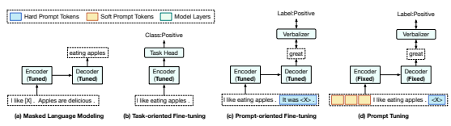
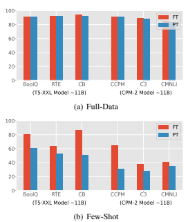
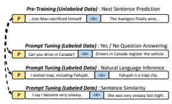
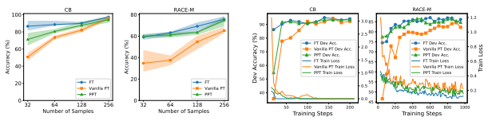

# Ppt: Pre-Trained Prompt Tuning For Few-Shot Learning

Yuxian Gu1,3∗, Xu Han2,3∗, Zhiyuan Liu2,3,4**, Minlie Huang**1,3,4†
1The CoAI group, Tsinghua University, Beijing, China 2The THUNLP group, Tsinghua University, Beijing, China 3Institute for Artificial Intelligence, State Key Lab of Intelligent Technology and Systems, Beijing National Research Center for Information Science and Technology, Department of Computer Science and Technology, Tsinghua University, Beijing, China 4 Beijing Academy of Artificial Intelligence, BAAI, Beijing, China
{guyx21,hanxu17}@mails.tsinghua.edu.cn
{liuzy,aihuang}@tsinghua.edu.cn

# Abstract

Prompts for pre-trained language models (PLMs) have shown remarkable performance by bridging the gap between pre-training tasks and various downstream tasks. Among these methods, prompt tuning, which freezes PLMs and only tunes soft prompts, provides an efficient and effective solution for adapting largescale PLMs to downstream tasks. However, prompt tuning is yet to be fully explored. In our pilot experiments, we find that prompt tuning performs comparably with conventional full-model tuning when downstream data are sufficient, whereas it is much worse under fewshot learning settings, which may hinder the application of prompt tuning. We attribute this low performance to the manner of initializing soft prompts. Therefore, in this work, we propose to pre-train prompts by adding soft prompts into the pre-training stage to obtain a better initialization. We name this Pretrained Prompt Tuning framework "PPT". To ensure the generalization of PPT, we formulate similar classification tasks into a unified task form and pre-train soft prompts for this unified task. Extensive experiments show that tuning pre-trained prompts for downstream tasks can reach or even outperform full-model fine-tuning under both full-data and few-shot settings. Our approach is effective and efficient for using large-scale PLMs in practice.

The code is publicly available at https://
github.com/thu-coai/PPT.

# 1 Introduction

Fine-tuning pre-trained language models (PLMs) (Devlin et al., 2019; Radford et al., 2019; Raffel et al., 2020) has made great progress in recent years. By tuning the entire model parameters, the versatile knowledge acquired from large-scale unlabeled corpora can be adapted to handling various NLP tasks and outperform the approach of learning models from scratch (Han et al., 2021a).

For simplicity, we name this full-model tuning as
"FT". As shown in Figure 1 (b) and (c), there are two mainstream FT approaches. The first one is task-oriented fine-tuning, where a task-specific head is added on top of PLMs, and the entire model is then fine-tuned by optimizing task-specific objectives on corresponding training data.

The second one is prompt-oriented finetuning (Schick and Schütze, 2021a), which is inspired by the recent works utilizing language prompts to probe the knowledge in PLMs (Petroni et al., 2019; Brown et al., 2020). In promptoriented fine-tuning, data samples are converted to sequences containing prompt tokens, and downstream tasks are formalized as language modeling problems. As shown in Figure 1 (c), by adding the prompt "It was hXi ." to a sentence, we can determine its sentiment polarity with PLMs by predicting "great" or "terrible" at the mask position. As shown in Figure 1, compared to task-oriented finetuning, prompt-oriented fine-tuning is more similar to the pre-training objectives (masked language modeling), thereby helping to better use knowledge in PLMs and often obtaining better performance.

Although FT has shown promising results, with the rapid growth of model scale, fine-tuning and storing the entire large model for each downstream task becomes much more expensive. To address this challenge, Lester et al. (2021) proposes prompt tuning (PT) to adapt large PLMs to downstream tasks cheaply, as shown in Figure 1 (d). Specifically, PT uses soft prompts composed of continuous embeddings instead of hard prompts (discrete language phrases). These continuous prompts are generally randomly initialized and learned end-toend. To avoid storing the entire model for each downstream task, PT freezes all PLM parameters and merely tunes soft prompts, without adding any

† Corresponding author.

∗indicates equal contribution.

Proceedings of the 60th Annual Meeting of the Association for Computational Linguistics

Figure 1: Paradigms of pre-training (masked language modeling), full-model tuning (task-oriented fine-tuning and prompt-oriented fine-tuning), and prompt tuning. The verbalizer is a function to map task labels to concrete words.〈X〉means the mask of typical pre-trained encoder-decoder models

Figure 2: Comparison between PT and FT. The tuned prompt is composed of 100 learnable embeddings whose dimensions are the same as the token embeddings of PLMs (4096 dimensions). All these results are based on 11B PLMs T5 and CPM-2. FT needs to optimize all 11B parameters, while PT only trains about 410K prompt parameters.

intermediate layers and task-specific components.

PT has two promising advantages. First, soft prompts can be learned end-to-end in comparison to hard prompts. Second, PT is an efficient and effective paradigm for the practical use of largescale PLMs, which is comparable to FT when downstream data are sufficient (Figure 2(a)). However, as shown in Figure 2(b), we find that PT performs much worse than FT under few-shot settings, which may hinder the application of PT in various low-resource scenarios.

Hence, in this paper, we explore how to use PLMs for few-shot learning in an efficient and effective manner through PT. Specifically, we conduct pilot experiments to empirically analyze the effectiveness of PT on PLMs in Section 2, which is ignored by most existing works. Our discoveries are as follows: (1) the verbalizer choice has a large impact on the performance; (2) simply initializing soft prompts with concrete word embeddings fails to improve the performance, yet (3) combining soft and hard prompts is helpful; and (4) all these methods cannot handle few-shot prompt tuning problems well. The above observations reveal that prompt searching for PLMs is not trivial, and carefully initialized soft prompt tokens is crucial.

To help the model find suitable prompts, we pretrain these tokens with self-supervised tasks on large-scale unlabeled corpora. To ensure the generalization of pre-trained prompts, we group typical classification tasks into three formats: sentencepair classification, multiple-choice classification, and single-text classification, each format corresponding to one self-supervised pre-training task. In addition, we find multiple-choice classification more general among these formats and we can unify all classification tasks to this format. We name this Pre-trained Prompt Tuning framework
"PPT". We evaluate PPT on several datasets based on three 11B PLMs: T5-XXL (Raffel et al., 2020), mT5-XXL (Xue et al., 2021) and CPM-2 (Zhang et al., 2022) in few-shot scenarios. Experiments show that PPT can not only improve PT by a large margin, reaching or even outperforming FT methods, but also reduce the variance of few-shot learning. Besides the effectiveness, PPT also retains the parameter efficiency of PT, which is valuable for future applications on large-scale PLMs.

# 2 Pilot Experiments

In this section, we present pilot experiments of PT for few-shot learning. We analyze three strategies including hybrid prompt tuning, verbalizer selec-

| Hard Prompt                          | Verbalizer             | Accuracy   |                                                        | SST\-2   | BoolQ   |
|--------------------------------------|------------------------|------------|--------------------------------------------------------|----------|---------|
| None                                 | good/bad               | 70.515.5   | Random Init.  70.515.5                                 |          | 61.05.3 |
| Man #1: P s. It was hXi.             | good/bad               | 87.66.6    | Label Init.                                            | 58.92.7  | 63.00.4 |
| Man #2: P Just hXi ! s               | good/bad               | 86.08.1    | Vocab Sampling                                         | 57.04.0  | 58.44.9 |
| Man #3: P s. All in all, it was hXi. | good/bad               | 83.48.3    | Top\-1000 Sampling                                     | 57.94.2  | 57.73.9 |
|                                      |                        |            | Task\-Related Sampling                                 | 58.53.8  | 58.24.0 |
| Gen #1: P .s. a hXi.                 | good/bad               | 81.613.8   |                                                        |          |         |
| Gen #2: P s. A hXi one.              | good/bad               | 81.22.2    | Full\-Model Tuning                                     | 91.40.8  | 80.82.4 |
| Man #1: P s. It was hXi.             | great/terrible 86.97.9 |            |                                                        |          |         |
| Man #1: P s. It was hXi.             | dog/cat                | 60.07.6    | Table 2: Few\-shot learning performance with different |          |         |
| Man #1: P s. It was hXi.             | bad/good               | 76.311.7   | strategies for choosing concrete words for prompt ini                                                        |          |         |
| Full\-Model Tuning                   | good/bad               | 91.40.8    | tialization in PT. "Label Init": use the embeddings of |          |         |
|                                      |                        |            | the label words.  "Vocab Sampling":  randomly sam                                                        |          |         |

Table 1: The impact of hard prompts and verbalizers on PT for few-shot learning (32 samples) on SST-2. P represents soft prompts. s denotes the input sentence. "Man" means manually designed hard prompts and "Gen" means auto-generated hard prompts. The choice of hard prompts and verbalizers has a significant influence on model performance.

tion, and real word initialization. We follow Lester et al. (2021) to test PT with T5-XXL (11B parameters) and use 100 tunable soft prompt tokens1.

Following Schick and Schütze (2021b), we randomly select 32 samples to construct the training set Dtrain from the original training data. To tune the hyper-parameters, we compose a validation set Ddev from the original training data and ensure |Dtrain| = |Ddev| to simulate the few-shot learning setting (Perez et al., 2021). We follow Zhang et al. (2021) and Gao et al. (2021) to use the original validation set as the test set Dtest, which means |Dtest*|  |*Dtrain| = |Ddev|.

Hybrid Prompt Tuning In hybrid prompt tuning, both soft and hard prompts are used (Liu et al., 2021; Han et al., 2021b). However, previous works train soft prompts jointly with the entire model. In PT where only prompt tokens are tunable, the effectiveness of hybrid prompts is under-explored. In Table 1, we show the results of combining soft prompts P with three manually designed hard prompts and two auto-generated hard prompts (Gao et al., 2021) on a sentiment classification task (Socher et al., 2013). We can see that hard prompts improve PT, but still under-perform FT. Furthermore, different hard prompts affect the performance remarkably, therefore much human labor for prompt design and selection is needed. Verbalizer Selection Verbalizer maps taskspecific labels to concrete tokens. For instance,

Table 2: Few-shot learning performance with different strategies for choosing concrete words for prompt initialization in PT. "Label Init": use the embeddings of the label words. "Vocab Sampling": randomly sample words from the vocabulary. "Top-1000 Sampling":
randomly sample words from the most frequent 1000 words in the pre-training corpus. "Task-Related": randomly sample words from the downstream data. We use the classification accuracy (%) for evaluation.

in Figure 1 (c) and (d), the verbalizer maps the label "Positive" to "great". From Table 1 we can see that the choices of verbalizers influence the performance remarkably. In general, common words that explain the meaning of corresponding labels work well. This also guides our verbalizer selection for PPT in Section 3. Real Word Initialization In real word initialization, we use the embeddings of concrete words to initialize the soft prompt and test four initialization strategies. The effectiveness of this approach has been verified on small PLMs (fewer than 3B parameters) in previous works (Lester et al., 2021). However, from the experiments on SST-2 (Socher et al., 2013) and BoolQ (Clark et al., 2019) (Table 2), we find that for the 11B model, real word initialization has little or even negative impact on the performance in few-shot scenarios. This suggests that observations on small models can not be directly adapted to large models and finding a good initialization for soft prompts is yet to be explored.

To summarize, although the above enhancement strategies cannot help PT achieve comparable results with FT under few-shot settings, they are still the key factors that influence the PT performance. In the following sections, we describe our PPT framework and show in experiments that PPT not only provides a good prompt initialization, but also takes advantage of the good verbalizer, and is complementary to hybrid prompts.

# 3 Pre-Trained Prompt Tuning (Ppt)

In this section, we describe the whole framework of PPT, including how to pre-train prompts and

1Using 100 soft prompt tokens achieves the best performance in Lester et al. (2021).
use these pre-trained prompts for specific tasks.

### 3.1 Overview

Following the approach of T5 (Raffel et al., 2020) and PT (Lester et al., 2021), we solve all downstream tasks in a text-to-text format. As shown in Figure 1 (c), to reduce the objective gap between pre-training and downstream tasks, promptoriented fine-tuning converts downstream tasks into cloze-style objectives. Taking classification for example, given an input sentence x ∈ V∗and its label y ∈ Y, a pattern mapping f : V
∗*7→ V*∗
is first applied to convert x into a new sequence f(x), where V is the vocabulary of PLMs. f(x)
not only adds some prompt tokens as hints, but also preserves the mask token hXi to let PLMs predict tokens at the masked positions. Then, a verbalizer v : *Y 7→ V*∗is used to map y to some label tokens v(y). With f(·) and v(·), a classification task can be represented by a pattern-verbalizer pair (*f, v*):

$$\arg\operatorname*{max}_{\boldsymbol{\theta}}\sum_{\boldsymbol{x}}\log p{\big(}y|\boldsymbol{x};{\boldsymbol{\theta}}{\big)}$$ $$=\arg\operatorname*{max}_{\boldsymbol{\theta}}\sum_{\boldsymbol{x}}\log p{\big(}\left.\left\langle\mathbf{X}\right\rangle=v(y)|f(\boldsymbol{x});{\boldsymbol{\theta}}\right\rangle{\big)},$$
$$\mathbf{\Pi}^{(1)}$$

where θ indicates all tunable parameters, especially the parameters of PLMs. For convenience, we use
"PVP" to denote this pattern-verbalizer pair (Schick and Schütze, 2021a).

In PT (Lester et al., 2021), a set of soft prompts P are concatenated to the beginning of the sequence and the model input becomes [P ; f(x)], where [·; ·] is the concatenation operation. By tuning P , Eq. (1) is replaced by

$$\arg\max_{\mathbf{P}}\sum_{\mathbf{x}}\log p(\left\langle\mathbf{X}\right\rangle=v(y)\mid[\mathbf{P};f(\mathbf{x})];\mathbf{P}).\tag{2}$$

Owing to the power of large-scale PLMs, Eq. (2) is verified to be comparable to these FT methods under full-data settings. However, we find it hard to learn effective soft prompts, which may result in low performance in various few-shot scenarios. The parameter initialization usually has a large impact on the difficulty of the model training and optimization, and our pilot experiments have shown that existing initialization strategies have little or even negative impact on the PT performance of large-scale PLMs. We refer more details of these pilot experiments to Section 4.

Recently, pre-training has been proven to be an effective method to find a good model initialization. Inspired by this, we propose to pre-train soft

Figure 3: An example of PPT used in sentence pair tasks. P denotes soft prompt. hXi means the mask of typical encoder-decoder model like T5 and CPM-2.

prompts. We notice that some groups of downstream tasks are related to certain self-supervised tasks built on unlabeled pre-training corpora. For instance, some tasks in the form of sentence-pair classification, such as natural language inference and sentence similarity, are similar to the next sentence prediction (NSP) (Devlin et al., 2019) task used in the pre-training stage. As shown in Figure 3, these tasks all take two sentences as input and compare their semantic meanings. Therefore, soft prompts pre-trained by NSP can be a good initialization for these sentence-pair tasks.

Formally, suppose we can divide downstream tasks into m groups {T1, T2*, ...,* Tm},
where Tiis the set containing ni downstream tasks: {PVP1 i, PVP2 i*, ...,* PVPni i
}, where PVPk i =
(f k i
, vk i
). For each group, we design a corresponding pre-training task PVPpre i = (f pre i, v pre i). After pre-training soft prompts on these tasks with all model parameters fixed, we get m pre-trained prompts {P1, P2*, ...,* Pm}. Then, for each task PVPk i in Ti, we continue to optimize Eq. (2) by using Pi as the soft prompts initialization.

### 3.2 Designing Pattern-Verbalizer Pairs For Pre-Training

In this section, we take three typical classification tasks as examples to describe the design of patternverbalizer pairs PVPpre ifor prompt pre-training.

### 3.2.1 Sentence-Pair Classification

Sentence-pair classification tasks such as natural language inference and sentence similarity take two sentences x = (s1, s2) as the input. To design a PVP for these tasks, we extend the next sentence prediction in Devlin et al. (2019) to a 3-class classification with labels Y = {0, 1, 2} as the pretraining task. These labels in Y can respectively indicate that the semantic relation between two sentences is coherent (with label 2), similar (1) and irrelevant (0). To construct signal from unlabeled documents, we set the two sentences next to each other as label 2, those from the same document but not true next sentences as 1, and those from different documents as 0. We consider the label set *|Y| ≤* 3 because this covers most sentence pair tasks. PVPpre i = (f pre i, v pre i) is given as

$$f_{i}^{\rm pre}(\mathbf{x})=\mathbf{s}_{1}\left\langle\mathbf{X}\right\rangle.\mathbf{s}_{2}\mathbf{\cdot},\tag{3}$$  $v_{i}^{\rm pre}(\mathbf{y})=$ [no, maybe, yes].  
Designing PVPk i = (f k i
, vk i
) according to PVPpre i is simple. s1 and s2 can be replaced by the input sentence pair. If a task outputs two labels, then we take v k i
(Y) = [no, yes]. If a task outputs three labels, we set v k i = v pre i. If a task requires to measure the similarity between two sentences, the probability over {no, yes} can serve for this task.

#### 3.2.2 Multiple-Choice Classification

Many tasks can be formulated as multiple-choice classification, which takes a query and several answer candidates as the input. We design a next sentence selection task to pre-train the prompt. Given a sentence as the query sq, the model is trained to select the adjacent sentence from six candidates, denoted as s1 ∼ s6 and thus the label set is Y = {1, 2, 3, 4, 5, 6}. These candidates consist of the right answer, one sentence from the same document but is not adjacent to the query, and four sentences from other documents. For x = (sq, s1, s2, *· · ·* , s6), (f pre i, v pre i) is given as

$f_{i}^{\rm pe}(\mathbf{x})=$"$\mathbf{s}_{q}$? A.$\mathbf{s}_{1}$...F.$\mathbf{s}_{6}$.Answer is $\langle\mathbf{X}\rangle$.", $\mathbf{v}_{i}^{\rm pre}(\mathbf{y})=$ [A, B, C, D, E, F].  
Most multiple-choice tasks can use {f pre i, v pre i} directly as their PVPs. For tasks like reading comprehension, the input may contain a passage and a question. We concatenate them to form the query.

### 3.2.3 Single-Sentence Classification

For single-sentence classification, we create pseudo labels for prompt pre-training. Taking sentiment classification as an example, we use another small model to annotate sentiment labels for the sentences from the pre-training corpus and filter out those with low classification probability. In practice, we use a RoBERTaBASE (Liu et al., 2019)
model fine-tuned on a 5-class sentiment classification dataset other than the few-shot datasets we evaluate on. Then with a sentence s from the corpus, we have the input x = (s) and the label set Y = {1, 2, 3, 4, 5}. (f pre i, v pre i) is given as

$$f_{i}^{\rm pre}(\mathbf{x})="\mathbf{s}.\left(\mathbf{X}\right).",\tag{5}$$ $$v_{i}^{\rm pre}(\mathcal{V})=[\text{terrible},\text{bad},\text{maybe},\text{good},\text{great}].$$

For sentiment classification tasks with 5 labels, we can use PVPk i = PVPpre i. For those with fewer than 5 labels, we choose a subset from v pre i(Y) as labels.

Although the above method improves the model performance, we have to point out that it is still limited to generalize to other single-text classifications in different domains and with different numbers of labels. Therefore, the method described in the following section is proposed to solve this problem.

### 3.3 Unifying Task Formats

The above-mentioned PVPs for pre-training can be unified to a single format: multiple-choice classification. Specifically, for sentence-pair classification, the query is the concatenation of the two sentences and there are three options: no, maybe, and yes. For single-sentence classification, the query is the input sentence and the options are the concrete labels. Note that in this way, the pre-trained PVPs can be used in single text classification tasks from arbitrary domains and with much more labels.

$${\mathrm{(4)}}$$

Constructing a unified PVP is similar to the idea of MultiQA (Talmor and Berant, 2019) and UnifiedQA (Khashabi et al., 2020). Recently, Zhong et al. (2021a) use some hard prompts to unify several tasks as a meta question answering task. They tune the entire model with this meta task on a collection of QA datasets and then transfer to other classification tasks under low-resource settings.

However, our PPT focuses on tuning soft prompts with the main body of PLMs fixed and our pretraining is conducted on fully unsupervised data, rather than the collection of supervised datasets.

Since different tasks may have different candidate numbers and lengths, we construct pretraining samples with option numbers varying from 2 to 16 2and option lengths from 50 to 20. We use the PVP in Section 3.2.2 for pre-training, and then apply pre-trained soft prompts to cover the above mentioned three classification tasks.

2We set 16 labels in this paper as they can cover most benchmarks, but more labels are applicable for other tasks.

|          | English   |        | Chinese   |        |        |
|----------|-----------|--------|-----------|--------|--------|
| Dataset  | Format    | nclass | Dataset   | Format | nclass |
| SST\-2   | SSC       | 2      | ChnSent   | SC     | 2      |
| SST\-5   | SSC       | 5      | Amazon    | SC     | 5      |
| YahooAns | SSC       | 10     | TNews     | SC     | 14     |
| RACE\-m  | MCC       | 4      | CCPM      | MCC    | 4      |
| RACE\-h  | MCC       | 4      | 3  C      | MCC    | 4      |
| BoolQ    | SPC       | 3      | LCQMC     | SPC    | 3      |
| RTE      | SPC       | 3      | CMNLI     | SPC    | 3      |
| CB       | SPC       | 3      | OCNLI     | SPC    | 3      |

Table 3: The datasets we evaluate. The "Format" column means the task category. SSC stands for singlesentence classification, MCC for multiple-choice classification, and SPC for sentence-pair classification.

nclass means the label number of each dataset.

# 4 Experiments

### 4.1 Setup

We conduct experiments on both Chinese and English tasks (see Table 3). As described in Section 2, for tasks with fewer than 5 labels, we construct Dtrain and Ddev with 32 samples from the original training data and ensure the number of labels is balanced. For tasks with more than 5 labels like TNews and YahooAnswer, it is hard to compose a dataset with label-balanced samples. Therefore, we randomly select 8 samples for each label.

For English datasets, we conduct PT based on T5-XXL with 11B parameters because previous works (Lester et al., 2021; Zhang et al., 2022) have shown that, T5-XXL is comparable with FT under the full-data setting. We also evaluate FT on various sizes of T5 to verify that larger models perform better and thus improving PT based on T5-XXL is meaningful. For Chinese datasets, we do PT based on a 11B model CPM-2. Since CPM-2 does not provide other size models, we compare it with mT5 (Xue et al., 2021) of various sizes.

Consistently, we use 100 soft tokens for PT. As a result, the tunable parameters is only 100×4096 =
4.1 × 105 = 410K. Compared with the 11B (1.1 ×
1010) parameters of FT, PT only needs to store 3000 times smaller parameters for each task.

For prompt pre-training, we sample 10GB data from OpenWebText (Gokaslan et al., 2019) for English tasks and 10GB data from WuDaoCorpora (Yuan et al., 2021) for Chinese tasks. We use the Yelp-5 (Zhang et al., 2015a) dataset to train the RoBERTaBASE model mentioned in Section 3.2.3.

More details of the training hyper-parameters can be found in the Appendix C.

### 4.2 Main Results

The main results of English and Chinese datasets are shown in Table 4. In the block FT, we present the FT results of the T5 model from the size small to XXL. In the block PT, we show the results of PPT and other baselines. The first baseline is Vanilla PT, where the soft prompts are randomly initialized from a normal distribution. The second is the hybrid strategy in Section 2. We also consider LM Adaption used in Lester et al. (2021) in which the T5 model is further pre-trained for 10K
steps with language modeling to reduce the gap between the pre-training and PT. We test two variants of PPT: Hybrid PPT, in which carefully designed hard prompts are combined with pre-trained soft prompt, and Unified PPT, in which all tasks are unified in the multiple-choice classification format. Effectiveness From the Table 4 we have four observations. First, larger models achieve better overall performance, which means increasing the model size still helps under the few-shot setting. Therefore, we study PT on the large-scale pre-trained model. Note that for Chinese experiments, CPM- 2 and mT5-XXL share the same parameter scale. Since CPM-2 outperforms mT5-XXL across all tasks, we use CPM-2 as the base model.

Second, PPT outperforms Vanilla PT and LM
Adaption on most datasets significantly. Although PPT is worse than Hybrid PT on BoolQ, combining PPT and hard prompts (Hybrid PPT) outperforms all baselines. This means pre-training soft prompts and using hybrid prompts are complementary. Similar phenomenons are observed on other datasets like RACE-m, LCQMC, and C3, where adding hard prompts to PPT continues to improve results.

Third, PPT outperforms FT on all Chinese datasets and most English datasets. This indicates that there still remains a gap between masked language modeling and downstream tasks. Prompt pre-training bridges this gap to some extend. Based on this observation, an intuitive extension of our method is to further pre-train the entire model with PVPpre iand fine-tune the model to the corresponding downstream tasks. However, since we focus on PT in this paper, we leave this as future work.

Fourth, PPT results in lower variances on most of the datasets. Few-shot learning is notorious for its instability, which becomes very obvious in Vanilla PT. For some datasets like SST-2, the variance reaches 15.5 which means the model does not perform better than random guesses under some

|        |            |                       |                   | English Tasks    |                   |                  |                   |                  |                  |
|--------|------------|-----------------------|-------------------|------------------|-------------------|------------------|-------------------|------------------|------------------|
|        | Model      | Method                | SST\-2            | SST\-5           | RACE\-m           | RACE\-h          | BoolQ             | RTE              | CB               |
|        |            |                       | Acc.              | Acc.             | Acc.              | Acc.             | Acc.              | Acc.             | F1               |
|        | T5\-Small  | \-                    | 72.83.1           | 31.10.4          | 26.40.6           | 26.30.5          | 59.20.6           | 54.01.7          | 70.14.6          |
| FT     | T5\-Base   | \-                    | 74.62.7           | 28.81.8          | 27.20.5           | 26.70.2          | 61.92.1           | 56.12.3          | 70.42.6          |
| (11B)  | T5\-Large  | \-                    | 89.12.2           | 42.41.2          | 48.21.6           | 43.21.7          | 74.60.9           | 64.43.4          | 82.32.2          |
|        | T5\-XL     | \-                    | 89.63.2           | 38.45.1          | 55.02.8           | 50.92.6          | 77.22.1           | 62.36.8          | 81.99.0          |
|        | T5\-XXL    | \-                    | 91.40.8           | 40.62.0          | 62.93.9           | 54.83.0          | 80.82.4           | 64.12.0          | 86.55.3          |
|        |            | Vanilla PT  Hybrid PT | 70.515.5  87.66.6 | 32.38.3  40.92.7 | 34.78.2  53.58.2  | 31.63.5  44.26.4 | 61.05.3  79.81.5  | 53.53.5  56.82.6 | 50.74.1  66.57.2 |
| PT     |            | LM Adaption           | 77.67.5           | 36.23.6          | 27.30.2           | 26.50.4          | 62.00.3           | 55.31.0          | 61.21.7          |
| (410K) | T5\-XXL    |                       |                   |                  |                   |                  |                   |                  |                  |
|        |            | PPT                   | 93.50.3  93.80.1  | 50.20.7  50.10.5 | 60.01.2  62.50.9  | 53.00.4  52.20.7 | 66.435.7  82.01.0 | 58.91.6  59.83.2 | 71.26.2  73.27.0 |
|        |            | Hybrid PPT            |                   |                  |                   |                  |                   |                  |                  |
|        |            | Unified PPT           | 94.40.3           | 46.01.3          | 58.00.9           | 49.91.3          | 76.02.7           | 65.82.1          | 82.25.4          |
|        |            |                       |                   | Chinese Tasks    |                   |                  |                   |                  |                  |
|        | Model      | Method                | ChnSent           | Amazon           | CCPM              | C3               | LCQMC             | CMNLI            | OCNLI            |
|        |            |                       | Acc.              | Acc.             | Acc.              | Acc.             | Acc.              | Acc.             | Acc.             |
|        | mT5\-Small | \-                    | 76.12.6           | 29.91.9          | 31.91.2           | 29.60.5          | 52.42.5           | 36.50.2          | 34.91.3          |
|        | mT5\-Base  | \-                    | 78.20.6           | 36.40.9          | 40.46.8           | 29.40.6          | 50.91.0           | 36.30.5          | 35.40.6          |
| FT     | mT5\-Large | \-                    | 79.10.6           | 31.01.4          | 46.04.0           | 29.90.8          | 52.10.6           | 35.81.2          | 35.21.1          |
| (11B)  | mT5\-XL    | \-                    | 82.72.6           | 35.51.7          | 68.35.1           | 29.71.2          | 52.92.4           | 36.81.6          | 35.60.5          |
|        | mT5\-XXL   | \-                    | 83.61.5           | 42.10.8          | 79.71.1           | 37.23.3          | 53.11.0           | 39.00.4          | 37.41.2          |
|        | CPM\-2     | \-                    | 86.11.8           | 42.52.0          | 81.81.6           | 38.43.7          | 58.81.8           | 40.71.0          | 38.51.5          |
|        |            | Vanilla PT  Hybrid PT | 62.13.1  79.24.0  | 30.34.8  39.13.8 | 31.09.7  46.615.0 | 28.20.4  29.20.5 | 51.53.4  54.62.3  | 35.40.5  37.10.6 | 37.00.5  37.81.4 |
| PT     | CPM\-2     | LM Adaption           | 74.35.2           | 35.22.4          | 33.712.8          | 30.21.5          | 51.42.9           | 35.10.3          | 38.01.1          |
| (410K) |            | PPT                   | 90.10.8           | 48.60.6          | 85.40.6           | 43.82.2          | 59.10.6           | 43.00.5          | 40.10.4          |
|        |            | Hybrid PPT            | 89.50.3           | 48.82.0          | 83.90.5           | 46.00.5          | 67.30.9           | 41.30.8          | 38.70.6          |
|        |            | Unified PPT           | 90.70.2           | 44.61.1          | 83.40.9           | 50.20.6          | 55.00.4           | 40.60.4          | 41.51.5          |

Table 4: Classification results. The experiments are conducted with 32 training samples and 32 validation samples on each dataset. FT means full-model tuning, where the entire model (with about 11B parameters) should be tuned on each dataset. PT means prompt tuning, where only 410K parameters are trained. We report the mean and the standard deviation over 5 random seeds. The score marked as **bold** means the best performance among all the methods. The score marked with an underline means the best one among prompt tuning (PT) methods.

random seeds. Combining with hard prompt or further pre-training with language modeling can alleviate this problem to some extent. But on some datasets like CCPM, Hybrid PT increases the variance and LM Adaption does not guarantee the average performance. With the help of pre-training, the variance remains at a low level across all datasets.

|             | TNews   | YahooAns   |
|-------------|---------|------------|
| nclass      | 14      | 10         |
| FT          | 43.20.6 | 64.11.9    |
| PT          | 41.26.2 | 62.04.2    |
| PT (MC)     | 11.82.1 | 60.83.9    |
| Unified PPT | 50.60.7 | 70.51.9    |

Unified PPT Unifying all formats to multiplechoice classification format is another variant of PPT. In Table 4, we can see that Unified PPT reaches comparable performance as PPT and Hybrid PPT, still outperforming other PT baselines.

However, the datasets we have considered so far have no more than 5 labels. For tasks with more labels, especially single-text classification where pseudo label pre-training is not appropriate for cross-domain adaption, Unified PPT is a good alternative. In Table 5, we test Unified PPT on datasets with more than 5 labels. For PT and FT, we use Table 5: The experiments on single-text classification tasks with more than 5 labels. Different from previous experiments, we randomly select 8 samples for each label. PT (MC) means doing PT in a multiple-choice

format without prompt pre-training.

a verbalizer to map the labels to the intuitively selected words. PT (MC) means we solve the task in a multiple-choice classification format without prompt pre-training. We do not use PPT for singlesentence classification discussed in Section 3.2.3 because it is hard to find other suitable datasets to train the pseudo label annotator. However, we can see that Unified PPT still achieves the best performance, even exceeding FT by a large margin.

ss

Figure 4: Comparison between FT, Vanilla PT, and PPT when different numbers of training samples are available. For the small number of samples, PPT is consistently better than Vanilla PT. When the number grows, the performance of these methods becomes closer.

|         | FT      | PT      | PPT     | Unified PPT   |
|---------|---------|---------|---------|---------------|
| SST\-2  | 96.10.2 | 96.80.1 | 96.90.1 | 97.00.1       |
| SST\-5  | 58.41.4 | 58.51.1 | 59.31.2 | 58.30.2       |
| RACE\-m | 86.81.4 | 85.00.5 | 85.90.4 | 86.40.6       |
| RACE\-h | 83.70.6 | 82.51.9 | 83.91.3 | 84.30.5       |
| BoolQ   | 90.90.6 | 89.40.6 | 89.30.3 | 89.40.3       |
| RTE     | 89.81.0 | 88.04.8 | 89.60.8 | 91.80.7       |
| CB      | 94.61.2 | 94.35.6 | 93.73.1 | 92.94.9       |

Table 6: The performance of FT, PT, PPT, and Unified PPT when the full training datasets are available. We report the mean and the standard deviation over 3 random seeds on the validation set.

### 4.3 Sample Efficiency

We discuss how the performance of FT, PT, and PPT varies when the number of training samples increases. In Figure 4, we show the trend of these methods on the RACE-m and CB datasets. For 32 to 128 samples, PPT is consistently better than PT, and the performances of the three methods gradually converge when the number grows to 256.

We also compare different tuning approaches given the full training data. From Table 6, we can see that PPT and Unified PPT still outperform the Vanilla PT on most datasets. In addition, we observe that although PT is faster than FT in a single optimization step, it converges much slower, which results in an even longer training time. We argue that PPT can be an effective solution to this problem. As shown in Figure 5, with the pre-trained initialization, PPT speeds up the convergence of Vanilla PT on both RACE-m and CB datasets. We give a more detailed analysis of the training consumption in the Appendix E. Since PPT still converges a bit slower than FT, how to further accelerate the convergence of PT is worth studying in future work.

Figure 5: Comparison of the convergence between FT,
Vanilla PT, and PPT. PT converges much slower than FT. Owing to the pre-trained initialization, PPT significantly speeds up the convergence.

# 5 Related Works

PLMs and Task-oriented Fine-tuning Recently, various powerful PLMs have been proposed, such as GPT (Radford et al., 2018), BERT (Devlin et al., 2019), RoBERTa (Liu et al., 2019) and T5 (Raffel et al., 2020). To adapt these PLMs to downstream NLP tasks, task-oriented fine-tuning has been proposed, where researchers use PLMs as the backbone and add some task-specific heads to optimize task-specific objectives. Then, all parameters of both PLMs and additional heads are tuned using task-specific data. Results have shown that task-oriented fine-tuning can outperform models trained from scratch on a series of NLP tasks. Prompt-oriented Fine-tuning Most existing PLMs are pre-trained with language modeling objectives, yet the objectives of downstream tasks are quite different. To overcome the gap between pretraining and downstream tasks, prompt-oriented fine-tuning is introduced. In prompt-oriented finetuning, downstream tasks are also formalized as language modeling problems by inserting language prompts, and the results of language modeling can correspond to the solutions of downstream tasks.

Knowledge probing (Petroni et al., 2019; Trinh and Le, 2018; Davison et al., 2019) is the seminal work that stimulates the development of prompts.

In knowledge probing, language triggers are widely used to induce PLMs to generate relational facts.

These pioneering works demonstrate that language prompts can effectively stimulate the knowledge from PLMs. Encouraged by this, manually designing hard prompts consisting of discrete words is first used in prompt-oriented fine-tuning Schick and Schütze (2021a,b). Considering manually designing prompts is both time-consuming and difficult to find the best choice, later works (Gao et al., 2021; Jiang et al., 2020; Shin et al., 2020) proposed to generate prompts automatically. However, these works still restrict auto-generated prompts to discrete spaces which are usually sub-optimal.

To overcome the shortcomings of discrete spaces, Li and Liang (2021); Liu et al. (2021); Han et al. (2021b); Hambardzumyan et al. (2021); Zhong et al. (2021b) explore to combine hard prompts and soft prompts. Different from hard prompts using concrete and discrete tokens, soft prompts are composed of several continuous learnable embeddings, and these embeddings are randomly initialized. To step forward, some works (Li and Liang, 2021; Qin and Eisner, 2021; Lester et al., 2021) propose to only tune soft prompts and fix the entire PLM parameters. When models are large enough, this method can be comparable to full-model tuning. Few-shot Learning with PLMs Since long-tail distribution is common in real-world applications, few-shot learning is quite meaningful for the stable and effective use of PLMs, thereby attracts much attention recently. Apart from GPT-3 (Brown et al., 2020) and PET(Schick and Schütze, 2021a) which demonstrates the superiority of PLMs in few-shot scenarios, some later works Perez et al. (2021); Bragg et al. (2021) also discuss reasonable fewshot settings by restricting the size of validation set and proposing a unified framework to evaluate few-shot performance. There is also work (IV et al., 2021) pointing out the low performance of PT for few-shot learning. But they mostly focus on PLMs with fewer than 400M parameters. In this paper, we study few-shot learning on large-scale 11B PLMs.

# 6 Conclusion And Future Work

In this paper, we present PPT, a framework that improves prompt tuning for few-shot learning. We propose to firstly unify downstream tasks to several formats. Then, we design self-supervised pre-training tasks for each format and pre-train prompts on these tasks. Finally, we do prompt tuning on downstream tasks based on the pre-trained initialization. Extensive experiments show that our method significantly outperforms other prompt tuning baselines, performing comparable or even better than full-model tuning.

There are three important directions for future work: (1) Designing unified task formats and the corresponding pre-training objectives for other kinds of tasks such as language generation and relation extraction. (2) Evaluating the few-shot performance of other parameter-efficient tuning approaches (He et al., 2022) and adapting unified task pre-training to them. (3) Beyond the soft prompt, studying whether unified task pre-training helps the pre-trained language models itself.

### Acknowledgements

This work was supported by the National Science Foundation for Distinguished Young Scholars (with No. 62125604) and the NSFC projects (Key project with No. 61936010 and regular project with No.

61876096). This work was also supported by the Guoqiang Institute of Tsinghua University, with Grant No. 2019GQG1 and 2020GQG0005.

# References

Jonathan Bragg, Arman Cohan, Kyle Lo, and Iz Beltagy. 2021. FLEX: Unifying evaluation for few-shot nlp. In *Proceedings of NeurIPS*.

Tom Brown, Benjamin Mann, Nick Ryder, Melanie Subbiah, et al. 2020. Language models are few-shot learners. In *Proceedings of NeurIPS*.

Christopher Clark, Kenton Lee, Ming-Wei Chang, Tom Kwiatkowski, Michael Collins, and Kristina Toutanova. 2019. BoolQ: Exploring the surprising difficulty of natural yes/no questions. In Proceedings of NAACL-HLT.

Ido Dagan, Oren Glickman, and Bernardo Magnini.

2006. The pascal recognising textual entailment challenge. In Proceedings of Machine Learning Challenges: Evaluating Predictive Uncertainty.

Joe Davison, Joshua Feldman, and Alexander M Rush.

2019. Commonsense knowledge mining from pretrained models. In *Proceedings of EMNLP*.

Marie-Catherine De Marneffe, Mandy Simons, and Judith Tonhauser. 2019. The commitmentbank: Investigating projection in naturally occurring discourse. In *Proceedings of Sinn und Bedeutung*.

Jacob Devlin, Ming-Wei Chang, Kenton Lee, and Kristina Toutanova. 2019. BERT: Pre-training of deep bidirectional transformers for language understanding. In *Proceedings of NAACL-HLT*.

Tianyu Gao, Adam Fisch, and Danqi Chen. 2021.

Making pre-trained language models better few-shot learners. In *Proceedings of ACL*.

Aaron Gokaslan, Vanya Cohen, Ellie Pavlick, and Stefanie Tellex. 2019. Openwebtext corpus.

Karen Hambardzumyan, Hrant Khachatrian, and Jonathan May. 2021. WARP: Word-level adversarial reprogramming. In *Proceedings of ACL*.

Xu Han, Zhengyan Zhang, Ning Ding, Yuxian Gu, et al.

2021a. Pre-trained models: Past, present and future.

AI Open.

Xu Han, Weilin Zhao, Ning Ding, Zhiyuan Liu, and Maosong Sun. 2021b. PTR: prompt tuning with rules for text classification. *arXiv preprint* arxiv:2105.11259.

Junxian He, Chunting Zhou, Xuezhe Ma, Taylor Berg-
Kirkpatrick, and Graham Neubig. 2022. Towards a unified view of parameter-efficient transfer learning. In *Proceedings of ICLR*.

Hai Hu, Kyle Richardson, Liang Xu, Lu Li, Sandra Kübler, and Lawrence Moss. 2020. OCNLI: Original Chinese Natural Language Inference. In Findings of EMNLP.

Robert L. Logan IV, Ivana Balaževic, Eric Wallace, ´
Fabio Petroni, Sameer Singh, and Sebastian Riedel. 2021. Cutting down on prompts and parameters:
Simple few-shot learning with language models.

arXiv preprint arxiv:2106.13353.

Zhengbao Jiang, Frank F. Xu, Jun Araki, and Graham Neubig. 2020. How can we know what language models know? *Transaction of TACL*.

Daniel Khashabi, Sewon Min, Tushar Khot, Ashish Sabharwal, Oyvind Tafjord, Peter Clark, and Hannaneh Hajishirzi. 2020. UnifiedQA: Crossing format boundaries with a single qa system. In *Findings* of EMNLP.

Guokun Lai, Qizhe Xie, Hanxiao Liu, Yiming Yang, and Eduard Hovy. 2017. RACE: Large-scale ReAding comprehension dataset from examinations. In Proceedings of EMNLP.

Brian Lester, Rami Al-Rfou, and Noah Constant. 2021.

The power of scale for parameter-efficient prompt tuning. In *Proceedings of EMNLP*.

Xiang Lisa Li and Percy Liang. 2021. Prefix-tuning:
Optimizing continuous prompts for generation. In Proceedings of ACL.

Xiao Liu, Yanan Zheng, Zhengxiao Du, Ming Ding, Yujie Qian, Zhilin Yang, and Jie Tang. 2021. GPT
understands, too. *arXiv preprint arXiv:2103.10385*.

Xin Liu, Qingcai Chen, Chong Deng, Huajun Zeng, Jing Chen, Dongfang Li, and Buzhou Tang. 2018. LCQMC:a large-scale Chinese question matching corpus. In *Proceedings of COLING*.

Yinhan Liu, Myle Ott, Naman Goyal, Jingfei Du, Mandar Joshi, Danqi Chen, Omer Levy, Mike Lewis, Luke Zettlemoyer, and Veselin Stoyanov. 2019. RoBERTa: A robustly optimized BERT pretraining approach. *arXiv preprint arXiv:1907.11692*.

Paulius Micikevicius, Sharan Narang, Jonah Alben, Gregory Diamos, Erich Elsen, David Garcia, Boris Ginsburg, Michael Houston, Oleksii Kuchaiev, Ganesh Venkatesh, and Hao Wu. 2018. Mixed precision training. In *Proceedings of ICLR*.

Ethan Perez, Douwe Kiela, and Kyunghyun Cho. 2021.

True few-shot learning with language models. In Proceedings of NeurIPS.

Fabio Petroni, Tim Rocktäschel, Sebastian Riedel, Patrick Lewis, Anton Bakhtin, Yuxiang Wu, and Alexander Miller. 2019. Language models as knowledge bases? In *Proceedings of EMNLP*.

Guanghui Qin and Jason Eisner. 2021. Learning how to ask: Querying lms with mixtures of soft prompts. In *Proceedings of NACCL-HTL*.

Alec Radford, Karthik Narasimhan, Tim Salimans, and Ilya Sutskever. 2018. Improving language understanding by generative pre-training. OpenAI Technical report.

Alec Radford, Jeffrey Wu, Rewon Child, David Luan, Dario Amodei, and Ilya Sutskever. 2019. Language models are unsupervised multitask learners. OpenAI Technical report.

Colin Raffel, Noam Shazeer, Adam Roberts, Katherine Lee, Sharan Narang, Michael Matena, Yanqi Zhou, Wei Li, and Peter J. Liu. 2020. Exploring the limits of transfer learning with a unified text-to-text transformer. *JMLR*.

Samyam Rajbhandari, Jeff Rasley, Olatunji Ruwase, and Yuxiong He. 2020. ZeRO: Memory optimizations toward training trillion parameter models. In Proceedings of SC20.

Jeff Rasley, Samyam Rajbhandari, Olatunji Ruwase, and Yuxiong He. 2020. DeepSpeed: System optimizations enable training deep learning models with over 100 billion parameters. In Proceedings of KDD.

Timo Schick and Hinrich Schütze. 2021a. Exploiting cloze questions for few-shot text classification and natural language inference. In *Proceedings of* EACL.

Timo Schick and Hinrich Schütze. 2021b. It's not just size that matters: Small language models are also few-shot learners. In *Proceedings of NAACL-HLT*.

Taylor Shin, Yasaman Razeghi, Robert L. Logan IV,
Eric Wallace, and Sameer Singh. 2020. AutoPrompt: Eliciting Knowledge from Language Models with Automatically Generated Prompts. In *Proceedings* of EMNLP.

Mohammad Shoeybi, Mostofa Patwary, Raul Puri, Patrick LeGresley, Jared Casper, and Bryan Catanzaro. 2019. Megatron-LM: Training multi-billion parameter language models using model parallelism. arXiv preprint arXiv:1909.08053.

Richard Socher, Alex Perelygin, Jean Wu, Jason Chuang, Christopher D. Manning, Andrew Ng, and Christopher Potts. 2013. Recursive deep models for semantic compositionality over a sentiment treebank. In *Proceedings of EMNLP*.

Kai Sun, Dian Yu, Dong Yu, and Claire Cardie. 2020.

Investigating prior knowledge for challenging chinese machine reading comprehension. In *TACL*.

Alon Talmor and Jonathan Berant. 2019. MultiQA: An empirical investigation of generalization and transfer in reading comprehension. In *Proceedings of ACL*.

Trieu H Trinh and Quoc V Le. 2018. A simple method for commonsense reasoning. arXiv preprint arXiv:1806.02847.

Alex Wang, Yada Pruksachatkun, Nikita Nangia, Amanpreet Singh, Julian Michael, Felix Hill, Omer Levy, and Samuel Bowman. 2019a. SuperGLUE: A stickier benchmark for general-purpose language understanding systems. In *Proceedings of NeurIPS*.

Alex Wang, Amanpreet Singh, Julian Michael, Felix Hill, Omer Levy, and Samuel R. Bowman. 2019b.

GLUE: A multi-task benchmark and analysis platform for natural language understanding. In Proceedings of ICLR.

Liang Xu, Hai Hu, Xuanwei Zhang, Lu Li, Chenjie Cao, et al. 2020. CLUE: A Chinese language understanding evaluation benchmark. In *Proceedings* of COLING.

Linting Xue, Noah Constant, Adam Roberts, Mihir Kale, Rami Al-Rfou, Aditya Siddhant, Aditya Barua, and Colin Raffel. 2021. mT5: A massively multilingual pre-trained text-to-text transformer. In Proceedings of NAACL-HLT.

Sha Yuan, Hanyu Zhao, Zhengxiao Du, Ming Ding, et al. 2021. Wudaocorpora: A super large-scale chinese corpora for pre-training language models. AI Open, 2:65–68.

Tianyi Zhang, Felix Wu, Arzoo Katiyar, Kilian Q.

Weinberger, and Yoav Artzi. 2021. Revisiting fewsample bert fine-tuning. In *Proceedings of ICLR*.

Xiang Zhang, Junbo Zhao, and Yann LeCun. 2015a.

Character-level convolutional networks for text classification. In Advances in Neural Information Processing Systems, volume 28. Curran Associates, Inc.

Xiang Zhang, Junbo Zhao, and Yann LeCun. 2015b.

Character-level convolutional networks for text classification. In *Proceedings of NeurIPS*.

Zhengyan Zhang, Yuxian Gu, Xu Han, Shengqi Chen, et al. 2022. CPM-2: Large-scale cost-effective pretrained language models. *AI Open*.

Ruiqi Zhong, Kristy Lee, Zheng Zhang, and Dan Klein.

2021a. Adapting language models for zero-shot learning by meta-tuning on dataset and prompt collections. In *Findings of EMNLP*.

Zexuan Zhong, Dan Friedman, and Danqi Chen. 2021b.

Factual probing is [mask]: Learning vs. learning to recall. In *Proceedings of NAACL-HTL*.

# Appendices A Dataset Information

Since some of the test sets of the datasets we used is not publicly available, we follow Zhang et al. (2021) and Gao et al. (2021) to use original validation sets for testing. For English experiments, we use a dataset from GLUE (Wang et al., 2019b) (SST-2 (Socher et al., 2013)), datasets from SuperGLUE (Wang et al., 2019a), (BoolQ (Clark et al., 2019), CB (De Marneffe et al., 2019), and RTE (Dagan et al., 2006)), two extra single-text classification datasets (SST-5 (Socher et al., 2013) and YahooAnswers (Zhang et al., 2015b)), and two standard question answering datasets (RACE-
middle and RACE-high) (Lai et al., 2017) for multiple-choice classification. For Chinese experiments, we use four datasets from CLUE (Xu et al., 2020) (CMNLI3, OCNLI (Hu et al., 2020),
TNews3, C3(Sun et al., 2020)), two sentiment analysis datasets (ChnSent4and Amazon Reviews4),
and one extra natural language inference dataset LCQMC (Liu et al., 2018).

# B Pvps For Chinese Tasks

We describe the PVPpre ifor Chinese datasets in this section. Just like English scenarios, all these PVPs are simple and intuitive. Sentence-Pair Classification Given the input x = (s1, s2), the label list Y = [0, 1, 2], we have:

$\mathbf{a}\cdot\mathbf{s}_2",$  $\frac{\mathbf{a}\cdot\mathbf{s}_2}{\sqrt{2}},\frac{\|\mathbf{b}\|}{\|\mathbf{b}\|}.$
f pre i(x) = "s1 hXi 。s2",
v pre i(Y) = [矛盾, 中立, 相似].

$$(6)$$
* [16] M. C.  
Multiple-Choice Classification Given a input x consisting of a query and six candidates: x =
(sq, s1, s2, *· · ·* , s6), we convert x to a language sequence by defining the PVPpre ias follows:
f pre i(x) = "sq?一、s1 *· · ·* 六、s6.答案是 hXi 。",
v pre i
(Y) = [一, 二, 三, 四, 五, 六].(7)
Single-Sentence Classification Similar to the English scenario, we take sentiment classification as an example. Given the input x = (s), we have:

$$\begin{array}{l}{{f_{i}^{\mathrm{pre}}(\mathbf{x})={}^{\mathbf{"s}}\cdot\mathbf{\nabla}\langle\mathbf{X}\rangle\mathbf{\nabla}\mathbf{\nabla},}}\\ {{v_{i}^{\mathrm{pre}}(\mathcal{Y})=[\frac{\partial\mathbf{\nabla}}{\partial\mathbf{x}},\widetilde{\mathcal{K}}\widetilde{\mathcal{H}},-\widetilde{\mathcal{H}}\mathbf{\nabla},\widetilde{\mathcal{H}},\widetilde{\mathcal{H}}].}}\end{array}$$
$$({\boldsymbol{\delta}})$$

Based on the PVPpre i, the design of PVPk iis similar to that of English tasks.

|     | English                                           |
|-----|---------------------------------------------------|
| SPC | P Question: s1 ? hXi. s2                          |
| MCC | P We ask sq ? A.s1 · · · F.s6.The answer is hXi.  |
| SSC | P s. It was hXi.                                  |
|     | Chinese                                           |
| SPC | P 问 题:s1?hXi。s2                              |
| MCC | P 问  · · · 六、s6. 案是:hXi。 题:sq?一、s1 答 |
| SSC | P s。这 很hXi。                                   |

Table 7: The hard prompts for Hybrid PT and Hybrid PPT. SSC stands for single-sentence classification, MCC stands for multiple-choice classification, and SPC stands for sentence-pair classification.

# C Training Details

Considering the instability of the few-shot learning, we run each experiment 5 times on the random seed [10, 20, 30, 40, 50] and report the averaged performance as well as the standard deviation. Due to the resource limit, for 11B models, we adopt model parallelism (Shoeybi et al., 2019) and store a model with 4 GPU devices. We also use mixedprecision training (Micikevicius et al., 2018) and ZeRO (Rajbhandari et al., 2020) stage-1 provided in DeepSpeed (Rasley et al., 2020) to reduce GPU memory usage. For models in other sizes, we all use full-precision training. We describe the details of the training hyper-parameters in the following sections.

### C.1 Full-Model Tuning

For Full-Model Tuning (FT), we tune the entire parameters of the model without concatenating soft prompts. For all models, we fix the batch size as 16. In this way, we train the largest 11B model with 16 NVIDIA V100 32G GPUs. We find that different sized models prefer significantly different learning rates. Therefore, we search for the learning rates in varied intervals and show each model size and its corresponding searching interval in Table 8. We train the model for 50 epochs and do evaluation every 6 optimization steps. We choose the model performing the best on the validation set and evaluate it on the test set.

#### C.2 Prompt Tuning

For Prompt Tuning (PT), we add a set of soft prompts before the input text. When adapting the model to downstream tasks, we only tune the soft prompts with the entire model fixed. Similar to FT, we fix the batch size as 16 and train the model for 50 epochs, while evaluating the model every 6

3https://www.cluebenchmarks.com/ 4https://github.com/SophonPlus/
ChineseNlpCorpus

| Model Size   | Searching Interval   |
|--------------|----------------------|
| Small        | 2e\-4, 5e\-4, 1e\-3  |
| Base         | 2e\-4, 5e\-4, 1e\-3  |
| Large        | 5e\-5, 1e\-4, 2e\-4  |
| XL           | 3e\-5, 5e\-5, 1e\-4  |
| XXL          | 3e\-6, 5e\-6, 1e\-5  |

Table 8: The searching intervals of learning rates for the models with different sizes. Generally, small models prefer large learning rates.

steps. Since the tunable parameters are much less in PT, 8 NVIDIA V100 32G GPUs are enough for the training. We find PT requires a much larger learning rate than FT. Therefore, we search for the learning rate in [5e-3, 1e-2, 2e-2, 5e-2] and choose the model with the best performance on the validation set. This observation also implies that PT is much harder to train than FT, which is consistent with the experiment results in the main paper.

### C.3 Prompt Pre-Training

We use the sampled 10GB data to construct the pre-training data for each task format for prompt pre-training. Across all tasks, we use the "inverse square root" learning rate scheduler (Raffel et al., 2020) and set the learning rate in this scheduler as 0.1 with no warmup steps. We set the batch size as 256, the max input length as 512, and train the prompts for at most 200,000 steps. We split 5% data for validation and the rest for pre-training.

We evaluate the performance on the validation set every 2,000 steps and choose the prompt with the lowest validation loss. The details of constructing the pre-training data for each task are as follows. Sentence-Pair Classification In the next sentence prediction task, we set the two sentences next to each other as label 2, those from the same document but not true next sentence as 1, and those from different documents as 0. We filter out the sentences with less than 5 tokens and the pairs in which the two sentences' length ratios are larger than 100.

| Num.   | len(q)   | len(op)   | Pos.   | Neg.\-S   | Neg.\-D   |
|--------|----------|-----------|--------|-----------|-----------|
| 2      | 400      | 50        | 1      | 1         | 0         |
| 3      | 400      | 50        | 1      | 1         | 1         |
| 4      | 400      | 50        | 1      | 1         | 2         |
| 5      | 400      | 40        | 1      | 1         | 3         |
| 6      | 300      | 40        | 1      | 1         | 4         |
| 7      | 250      | 30        | 1      | 2         | 4         |
| 8      | 200      | 30        | 1      | 2         | 5         |
| 9      | 200      | 30        | 1      | 2         | 6         |
| 10     | 150      | 20        | 1      | 2         | 7         |
| 11     | 150      | 20        | 1      | 3         | 8         |
| 12     | 150      | 20        | 1      | 3         | 9         |
| 13     | 150      | 20        | 1      | 3         | 10        |
| 14     | 150      | 20        | 1      | 3         | 11        |
| 15     | 150      | 20        | 1      | 3         | 12        |
| 16     | 150      | 20        | 1      | 3         | 13        |

Multiple-Choice Classification In the next sentence selection task, giving a query sentence, the options contain one adjacent sentence, one sentence from the same document as the query, and four from the different documents. We also filter out the sentences with less than 5 tokens. To fit in the max input length, we truncate the query sentence to 389 tokens and the options to 86 tokens.

Table 9: The input configurations of different option numbers. "Num." means the number of the options.

"len(q)" and "len(op)" means the maximum length of the query and the options. "Pos." means the number of positive options. "Neg.-S" and "Neg.-D" represent the negative options from the same and different documents.

For Unified PPT, we uniformly sample the option numbers from 2 to 16 to cover more downstream circumstances. The input configurations of different option numbers is shown in Table 9. Single-Sentence Classification We use the RoBERTaBASE model trained on the Yelp-5 dataset to annotate pseudo labels on the unlabeled data.

We use learning rate 1e-4, batch size 16, warm-up rate 0.01, and train the model for 10 epochs. We choose the checkpoint with the highest accuracy on the validation set, which is 70.53 at the 5-th epoch, to annotate the label. We set different minimal classification confidence thresholds for the 5 labels to control annotation quality and balance the label.

The thresholds of the label 0 ∼ 4 are [0.95, 0.50, 0.50, 0.50, 0.70].

### D Hard Prompts

In this section, we describe the hard prompts we use in Hybrid PT and Hybrid PPT. For simplicity, we choose the best hard prompts for each task format
(e.g. sentence-pair classification, multiple-choice classification, and single-sentence classification)
based on PT in pilot experiments and directly use them in Hybrid PPT. The hard prompts corresponding to each task format are shown in Table 7.

# E Training Consumption

We analyze the time and memory consumption of FT and PT in this section. For PPT, the consump-

|    |                       | SST\-2   | SST\-5   | RACE\-m   | RACE\-h   | BoolQ   | RTE   | CB    |
|----|-----------------------|----------|----------|-----------|-----------|---------|-------|-------|
| FT | Single Step Time (ms) | 4,416    | 4,419    | 6,498     | 6,238     | 4,760   | 4,653 | 5,962 |
|    | GPU Mem. Cost (GB)    | 259      | 259      | 512       | 512       | 314     | 346   | 512   |
| PT | Single Step Time (ms) | 794      | 791      | 4,000     | 3,976     | 1,089   | 944   | 1,655 |
|    | GPU Mem. Cost (GB)    | 72       | 72       | 159       | 154       | 82      | 81    | 102   |

Table 10: The time cost for a single optimization step and GPU memory usage throughout the training. PT has a shorter single-step optimization time and a lower GPU memory cost.

tion is exactly the same as PT during the downstream adaption. Although pre-training prompts may introduce external costs, we only need to do it once and use the pre-trained prompts for multiple tasks. From Table 10, we can see that PT's optimization time of a single step is much shorter than FT, and it occupies much less GPU memory. The reason is that during optimization, PT only needs to update the prompt parameters, which means the momentum and gradients of other parameters are not required to be stored and transmitted to between different GPU devices.