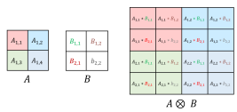
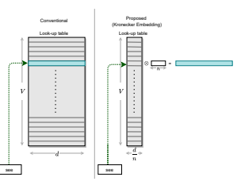
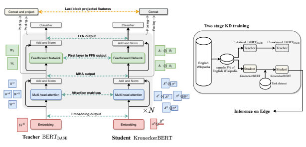
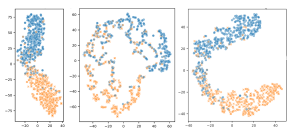

# Kroneckerbert: Learning Kronecker Decomposition For Pre-Trained Language Models Via Knowledge Distillation

Marzieh S. Tahaei Noah's Ark Lab, Huawei Technologies Canada marzieh.tahaei@huawei.com Ella Charlaix Noah's Ark Lab, Huawei Technologies Canada charlaixe@gmail.com Vahid Partovi Nia Noah's Ark Lab Huawei Technologies Canada vahid.partovinia@huawei.com Ali Ghodsi Department of Statistics and Actuarial Science, University of Waterloo ali.ghodsi@uwaterloo.com Mehdi Rezagholizadeh Noah's Ark Lab, Huawei Technologies Canada mehdi.rezagholizadeh@huawei.com

## Abstract

The development of over-parameterized pretrained language models has made a significant contribution toward the success of natural language processing. While overparameterization of these models is the key to their generalization power, it makes them unsuitable for deployment on low-capacity devices. We push the limits of state-of-theart Transformer-based pre-trained language model compression using Kronecker decomposition. We use this decomposition for compression of the embedding layer, all linear mappings in the multi-head attention, and the feed-forward network modules in the Transformer layer. We perform intermediatelayer knowledge distillation using the uncompressed model as the teacher to improve the performance of the compressed model. We present our KroneckerBERT, a compressed version of the BERTBASE model obtained using this framework. We evaluate the performance of KroneckerBERT on well-known NLP benchmarks and show that for a high compression factor of 19 (5% of the size of the BERTBASE model), our KroneckerBERT outperforms state-of-the-art compression methods on the GLUE. Our experiments indicate that the proposed model has promising outof-distribution robustness and is superior to the state-of-the-art compression methods on SQuAD.

## 1 Introduction

In recent years, the emergence of Pre-trained Language Models (PLMs) has led to a significant breakthrough in Natural Language Processing (NLP).

The introduction of Transformers and unsupervised pre-training on enormous unlabeled data are the two main factors that contribute to this success.

Transformer-based models (Devlin et al., 2018; Radford et al., 2019; Yang et al., 2019; Shoeybi et al., 2019) are powerful yet highly overparameterized. The enormous size of these models does not meet the constraints imposed by edge devices on memory, latency, and energy consumption. Therefore there has been a growing interest in developing new methodologies and frameworks for the compression of these large PLMs. Similar to other deep learning models, the main directions for the compression of these models include lowbit quantization (Gong et al., 2014; Prato et al., 2019), network pruning (Han et al., 2015), matrix decomposition (Yu et al., 2017; Lioutas et al., 2020) and Knowledge distillation (Hinton et al., 2015).

These methods are either used in isolation or in combination to improve compression-performance trade-off.

Recent works (Sanh et al., 2019; Sun et al.,
2019; Jiao et al., 2019; Sun et al., 2020b; Xu et al., 2020) have been quite successful in compressing Transformer-based PLMs to a certain degree; however, extreme compression of these model (compression factors >10) is still quite challenging. Several works (Mao et al., 2020; Zhao et al., 2019, 2021) that have tried to go beyond the compression factor of 10, have done so at the expense of a significant drop in performance. This work proposes a novel framework that uses Kronecker decomposition for extreme compression of Transformer-based PLMs and provides a very promising compressionperformance trade-off. Similar to other decomposition methods, Kronecker decomposition can be used to represent weight matrices in NNs to reduce the model size and the computation overhead. Unlike the well-known SVD decomposition, Kronecker decomposition retains the rank of the matrix and hence provides a different expressiveness compared to SVD.

We use Kronecker decomposition for the compression of both Transformer layers and the embedding layer. For Transformer layers, the compression is achieved by representing every weight matrix both in the multi-head attention (MHA) and the feed-forward neural network (FFN) as a Kronecker product of two smaller matrices. We also propose a Kronecker decomposition for compression of the embedding layer. Previous works have tried different techniques to reduce the enormous memory consumption of this layer (Khrulkov et al., 2019; Li et al., 2018). Our Kronecker decomposition method can substantially reduce the amount of required memory while maintaining low computation.

Using Kronecker decomposition for large compression factors, which is the focus of this paper, leads to a reduction in the model expressiveness. To address this issue, we propose to distill knowledge from the intermediate layers of the original uncompressed network to the Kronecker network during training. We use this approach for compression of the BERTBASE model. We show that for a large compression factor of 19×, KroneckerBERT provides significantly better performance than stateof-the-art compressed BERT models. While our evaluations in this work are limited to BERT, this framework can be easily used to compress other Transformer-based NLP models. The main contributions of this paper are as follows:
- Developing a framework for compression of the embedding layer using the Kronecker decomposition.

- Deploying the Kronecker decomposition for the compression of Transformer modules.

- Proposing a KD method to improve the per-

Figure 1: An example of Kronecker product of two 2

 by 2 matrices

formance of the Kronecker network.

- Evaluating the proposed framework for compression of BERTBASE model on well-known NLP benchmarks

## 2 Related Work

In this section, we first go through some of the most related works for BERT compression in the literature and then review the few works that have used Kronecker decomposition for compression of CNNs and RNNs.

### 2.1 Pre-Trained Language Model Compression

In recent years, many model compression methods have been proposed to reduce the size of PLMs while maintaining their performance on different tasks. KD, which was first introduced by (Bucilua et al. ˇ , 2006) and then later generalized by
(Hinton et al., 2015), is a popular compression method where a small student network is trained to mimic the behavior of a larger teacher network. Recently, using KD for the compression of PLMs has gained a growing interest in the NLP community. BERT-PKD (Sun et al., 2019), uses KD to transfer knowledge from the teacher's intermediate layers to the student in the fine-tuning stage. Tiny- BERT (Jiao et al., 2019) uses a two-step distillation method applied both at the pre-training and at the fine-tuning stage. MobileBERT (Sun et al., 2020b) also uses an intermediate-layer knowledge distillation methodology, but the teacher and the student are designed by incorporating inverted-bottleneck. Several works combine different compression techniques such as knowledge distillation and pruning with matrix factorization (Mao et al., 2020) or quantization (Kim and Awadalla, 2020). In
(Mao et al., 2020), the authors present LadaBERT,
a lightweight model compression pipeline combining SVD-based matrix factorization with weight pruning, as well as a knowledge distillation methodology as described in (Jiao et al., 2019).

To achieve higher compression factors, authors in (Zhao et al., 2019) use a layer-wise KD method to reduce the size of vocabulary (from the usual 30k to 5k) and the width of the layers. Similarly, Zhao et al. 2021 uses a mixed-vocabulary training method to train models with a smaller vocabulary.

### 2.2 Kronecker Factorization

Kronecker products have previously been utilized for the compression of CNNs and small RNNs. Zhou and Wu 2015 was the first work that utilized Kronecker decomposition for NN compression. They used summation of multiple Kronecker products to replace weight matrices in the fully connected and convolution layers in simple CNN
architectures like AlexNet. Thakker et al., 2020 used Kronecker product for the compression of very small language models for deployment on IoT devices. To reduce the amount of performance drop after compression, they propose a hybrid approach where the weight matrix is decomposed into an upper part and lower part. The upper part remains un-factorized, and only the lower part is factorized using the Kronecker product. More recently, Thakker et al. 2020 tried to extend the previous work to non-IoT applications. Inspired by robust PCA, they add a sparse matrix to Kronecker product factorization and propose an algorithm for learning these two matrices together.

To the best of our knowledge, this work is the first attempt to compress Transformer-based language models using Kronecker decomposition. Unlike prior arts, this work uses a simple Kronecker product of two matrices for the representation of linear layers and uses KD framework to improve the performance of the compressed model.

## 3 Methodology

In this section, we first introduce the background of Kronecker decomposition. We then explain our compression method in detail.

### 3.1 Kronecker Product

Kronecker product is an operation that is applied on two matrices resulting in a block matrix. Let A be a matrix ∈ Rm1×n1, and let B be a matrix ∈ Rm2×n2, then the Kronecker product of A and B denoted by ⊗ is a block matrix, where each block (*i, j*) is obtained by multiplying the element

Figure 2: Illustration of our proposed method for the compression of the embedding layer. Left: conventional embedding stored in a lookup table. Right: Our proposed compression method where the original embedding matrix is represented as a Kronecker product of a matrix and a row vector. The matrix is stored in a lookup table to minimize computation over head.

Ai,j by matrix B. Therefore, the of the resulting matrix A ⊗ B is ∈ Rm×n where m = m1m2 and n = n1n2. Figure 1 illustrates the Kronecker product between two small matrices. See (Graham, 2018) for more detailed information on Kronecker product.

### 3.2 Kronecker Factorization

We can use Kronecker products to represent the weight matrices in Neural Networks (NNs). When decomposing a matrix W ∈ Rm×n, as A ⊗ B,
there are different choices for the shapes of A and B. In fact the dimensions of A i.e m1 and n1 can be any factor of m and n respectively. The dimensions of B will then be equal to m2 = m/m1 and n2 = n/n1. We can achieve different compression factors by changing the shape of these two matrices.

### 3.2.1 Memory And Computation Reduction

When representing W as A ⊗ B, the number of elements is reduced from mn to m1n1 + m2n2.

Moreover, using the Kronecker product to represent linear layers can reduce the required computation. A trivial way to multiply the Kronecker product A ⊗ B with an input vector x, is to first reconstruct W by obtaining A ⊗ B and then multiply the result with x, which is extremely inefficient both with respect to memory and computation. A much more efficient way is to use Eq.1 which is a well-known property of the Kronecker product that allows obtaining (A ⊗ B)x without explicit reconstruction, A ⊗ B (Lutkepohl, 1997):

$$(A\otimes B)x={\mathcal{V}}(B{\mathcal{R}}_{n_{2}\times n_{1}}(x)A^{\top})\qquad(1)$$

where A> is A transpose. Here, V is an operation that transforms a matrix to a vector by stacking its columns and Rn2×n1(x) is an operation that converts a vector x to a matrix of size n2 × n1 by dividing the vector to columns of size n2 and concatenating the resulting columns together. The consequence of performing multiplication in this way is that it reduces the number of FLOPs from
(2m1m2 − 1)n1n2 to:

$$\begin{array}{c}\min\left((2n_{2}-1)m_{2}n_{1}+(2n_{1}-1)m_{2}m_{1},\right.\\ \left.(2n_{1}-1)n_{2}m_{1}+(2n_{2}-1)m_{2}m_{1}\right)\end{array}\tag{2}$$

We use this method for implementation of the Kronecker layers.

### 3.3 Kronecker Embedding Layer

The embedding layer in large language models is a very large lookup table X ∈ Rv×d, where v is the size of the dictionary and d is the embedding dimension. In order to compress X using Kronecker factorization, the first step is to define the shape of Kronecker factors AE and BE. We define AE to be a matrix of size v×
d n and BE to be a row vector of size n. There are two reasons for defining BE
as a row vector. 1) it allows disentangled embedding of each word since every word has a unique row in AE. 2) the embedding of each word can be obtained efficiently in O(d). More precisely, the embedding for the i'th word in the dictionary can be obtained by the Kronecker product between AE
i and BE:

$$X_{i}=A_{i}^{E}\otimes B^{E}\qquad\qquad(3)$$

whereAE is stored as a lookup table. Note that since AE
iis of size 1×
d n and BE is of size 1×n, the computation complexity of this operation is O(d). Figure 2 shows an illustration of the Kronecker embedding layer.

### 3.4 Kronecker Transformer

The Transformer layer is composed of two main components: MHA and FFN. We use Kronecker decomposition to compress both. In the Transformer block, the self-attention mechanism is done by projecting the input into the Key, Query, and Value embeddings and obtaining the attention matrices through the following:

$$O={\frac{Q K^{T}}{\sqrt{d_{k}}}}$$ Attention($Q,K,V$) = softmax($O$)$V$
$$\quad(4)$$

where Q, K, and V are obtained by multiplying the input by WQ, WK, WVrespectively. In a multihead attention (MHA) module, there is a separate W
Q
l, WK
l, and WV
l matrix per attention head to allow for a richer representation of the data. In the implementation usually, matrices from all heads are stacked together resulting in 3 matrices.

$$\begin{array}{l}{{W^{\prime}{}^{k}=\mathrm{concat}(W_{1}^{K},..,W_{l}^{K},...,W_{L}^{K})}}\\ {{W^{\prime}{}^{Q}=\mathrm{concat}(W_{1}^{Q},..,W_{l}^{Q},...,W_{L}^{Q})}}\\ {{W^{\prime}{}^{V}=\mathrm{concat}(W_{1}^{V},..,W_{l}^{V},...,W_{L}^{V})}}\end{array}$$

where L is the number of attention heads. Instead of decomposing the matrices of each head separately, we use Kronecker decomposition after concatenation:

$$\begin{array}{l}{{W^{\prime}{}^{K}=A^{k}\otimes B^{K}}}\\ {{W^{\prime}{}^{Q}=A^{Q}\otimes B^{Q}}}\\ {{W^{\prime}{}^{V}=A^{V}\otimes B^{V}}}\end{array}$$
$$\quad(6)$$

By choosing m2 to be smaller than the output dimension of each attention head, matrix B in the Kronecker decomposition is shared among all attention heads resulting in more compression. The result of applying Eq.4 is then fed to a linear mapping (WO) to produce the MHA output. We use Kronecker decomposition for compressing this linear mapping as well the two weight matrices in the subsequent FFN block:

$$\begin{array}{l}{{W^{\mathbf{O}}=A^{\mathbf{O}}\otimes B^{\mathbf{O}}}}\\ {{W_{1}=A_{1}\otimes B_{1}}}\\ {{W_{2}=A_{2}\otimes B_{2}}}\end{array}$$
$\square$
$\uparrow$). 
$\uparrow$). 

### 3.5 Knowledge Distillation

In the following section, we describe how KD is used to improve the training of the KroneckerBERT model.

### 3.5.1 Intermediate Kd

Let S be the student, and T be the teacher, then for a batch of data (*X, Y* ), we define f S
l
(X)
andf T
l
(X) as the output of the l th layer for the student network and the teacher network respectively. The teacher here is the BERTBASE and the student is its corresponding KroneckerBERT that is

Figure 3: Illustration of the proposed framework. Left: A diagram of the teacher BERT model and the student KronckerBERT. Right: The two stage KD methodology used to train KroneckerBERT.

| Model           | CMP   | WK,WQ,  WV,WO   | W1, [W2]   | T   | WE   |
|-----------------|-------|-----------------|------------|-----|------|
|                 |       | n, m            |            |     | d    |
| BERTBASE        | 1×    | 768, 768        | 768, 3072  |     | 768  |
|                 |       | n1, m1          |            |     | n    |
| KroneckerBERT8  | 7.7×  | 384, 384        | 2, 8       |     | 8    |
| KroneckerBERT19 | 19.3× | 48, 384         | 2, 16      |     | 12   |

Table 1: Configuration of the Kronecker layers for the two KroneckerBERT models used in this paper. CMP stands for compression factor.n and m are respectively the input and output dimensions of the weight matrices
(W ∈ Rm×n). m1, n1 indicates the shape of the first Kronecker factor (A ∈ Rm1×n1). For embedding layer we only need to set the size of the row vector BE ∈ R1×n.

obtained by replacing the embedding layer and the linear mappings in MHA and FFN modules with Kronecker factors(see Sections 3.3 and 3.4 for details). Note that like other decomposition methods, when we use Kronecker factorization to compress the model, the number of layers and the dimensions of the input and output of each layer remain intact. Therefore, when performing intermediate layer KD, we can directly obtain the difference in the output of a specific layer in the teacher and student networks without any projection. In the proposed framework, the intermediate KD from the teacher to student occurs at the embedding layer output, attention matrices and FFN outputs:

$$\mathcal{L}_{\text{Embedding}}(X)=\text{MSE}\big{(}E^{S}(X),E^{T}(X)\big{)}\tag{10}$$  $$\mathcal{L}_{\text{Attention}}(X)=\sum_{l}\text{MSE}\big{(}O_{l}^{S}(X),O_{l}^{T}(X)\big{)}\tag{11}$$  $$\mathcal{L}_{\text{FFN}}(X)=\sum_{l}\text{MSE}\big{(}H_{l}^{S}(X),H_{l}^{T}(X)\big{)}\tag{12}$$

where ESand ETare the output of the embedding layer from the student and the teacher respectively.

OS
land OT
lare the attention matrices (Eq.4), HS
l and HT
lare the outputs of the FFN, of layer l in the student and the teacher respectively.

So far we have been using MSE of the intermediate features for transferring knowledge from the teacher to the student. Therefore, each element in the feature vector of the student and teacher is compared independently of other elements. Inspired by
(Sun et al., 2020a), and in order to have a richer comparison between the student and the teacher networks, we also add a projection loss term. To obtain the projection loss we first average pool the FFN output and attention outputs of the last layer (HL and AL) and concatenate them together to obtain a feature vector. We project the feature vector obtained from the teacher using a learnable weight matrix P ∈ R2d×2d, where d is the hidden dimension of the Transformer. We then obtain the projection loss as the MSE between student's features and teacher's projected features:

$$g^{S}(x)=\mbox{concat}\big{[}\mbox{pool}(A_{L}^{S}),\mbox{pool}(H_{L}^{S})\big{]},\tag{13}$$ $$g^{T}(x)=\mbox{concat}\big{[}\mbox{pool}(A_{L}^{T}),\mbox{pool}(H_{L}^{T}))\big{]}\tag{14}$$ $$\mathcal{L}_{Projection}(x)=\mbox{MSE}(g^{S}(x),Pg^{T}(x))\tag{15}$$

Our final loss is as follows:

$$\begin{array}{ll}{\cal L}(x,y)=&\sum_{(x,y)}{\cal L}_{Embedding}(x)+\\ &{\cal L}_{Attention}(x)+{\cal L}_{FFN}(x)+\\ &{\cal L}_{Projection}(x)+{\cal L}_{Logits}(x)+\\ &{\cal L}_{CE}(x,y).\end{array}\tag{16}$$

Note that, unlike some other KD methods where the motivation for this projection is to match the dimension of the student and teacher features, here we use it to obtain a richer representation of the knowledge.

### 3.5.2 Kd At Pre-Training

Inspired by (Jiao et al., 2019) we use KD at the pre-training stage to capture the general domain knowledge from the teacher. In pre-training distillation, the teacher is the BERTBASE model that is pre-trained on BookCorpus (Zhu et al., 2015) and English Wikipedia. Intermediate layer KD is then used to train the KroneckeBERT network in the general domain. KD at pre-training improves the initialization of the Kronecker model for the task-specific KD stage. Similar to (Jiao et al., 2019) the loss at pre-training stage only involves the intermediate layers LEmbedding(x)+L*Attention*(x)+
L*F F N* (x). Unlike (Jiao et al., 2019), we perform pre-training distillation only on a small portion of the dataset (5% of the English Wikipedia) for a few epochs (3 epochs) which makes our training far more efficient.

### 3.6 Model Settings

The first step of the proposed framework is to design the Kronecker layers by defining the shape of Kronecker factors matrices A and B. To do this we need to set the shape of one of these matrices and the other one can be obtained accordingly. Therefore we only searched among different choices for m1 and n1 which are limited to the factors of the original weight matrix (m and n respectively). We used the same configuration for all the matrices in the MHA. Also For the FFN, we chose the configuration for one layer, and for the other layer, the dimensions are swapped. For the embedding layer, since BE is a row vector, we only need to choose n.

The shapes of the Kronecker factors are chosen to obtain the desired compression factor. However, there may be multiple configurations to achieve that, among which we chose the one that leads to minimum FLOPS according to Eq.2. Table 1 summarises the configuration of Kronecker factorization for the two compression factors used in this work.

### 3.7 Implementation Details

For KD at the pre-training stage, the Kronecker- BERT model is initialized using the teacher (pretrained BERTBASE model). This means that for layers that are not compressed, the values are copied from the teacher to the student. For Kronecker decomposed layers, the L2 norm approximation
(Van Loan, 2000) is used to approximate Kronecker factors (A and B) from the pre-trained BERTBASE
model. In the pre-training stage, 5% of the English Wikipedia was used for 3 epochs. The batch size in pre-training was set to 64 and the learning rate was set e-3. After pre-training, the obtained Kronecker model is used to initialize the Kronecker layers in the student model for task-specific fine-tuning. The Prediction layer is initialized from the fine-tuned BERTBASE teacher. For fine-tuning on each task, we optimize the hyper-parameters based on the performance of the model on the dev set. See appendix for more details on the results on dev set and the selected hyperparamters.

## 4 Experiments

In this section, we compare our KroneckerBERT
with the sate-of-the-art compression methods applied to BERT on GLUE and SQuAD. We also investigate the effect of KD through ablation experiments and investigate the robustness of our model to out-of-distribution samples. Moreover we show the speedup results of deploying our model on edge devices and justify our findings.

### 4.1 Baselines

As for baselines we select two categories of compression methods, those with compression factor
<10 and those with compression factor >10. For a fair comparison, we select models that have BERTBASE as the teacher. In the first category, we both have BERTPKD (Sun et al., 2019) with low compression factor, and models with similar

| Model           | Params   | MNLI\-(m/mm)   | SST\-2   | MRPC   | CoLA   | QQP   | QNLI   | RTE   | STS\-B   | Avg   |
|-----------------|----------|----------------|----------|--------|--------|-------|--------|-------|----------|-------|
| BERTBASE        | 108.5M   | 83.9/83.4      | 93.4     | 87.9   | 52.8   | 71.1  | 90.9   | 67    | 85.2     | 79.5  |
| BERT4\-PKD      | 52.2M    | 79.9/79.3      | 89.4     | 82.6   | 24.8   | 70.2  | 85.1   | 62.3  | 79.8     | 72.6  |
| TinyBERT        | 14.5M    | 82.5/81.8      | 92.6     | 86.4   | 44.1   | 71.3  | 87.7   | 66.6  | 80.4     | 77.0  |
| LadaBERT3       | 15M      | 82.1/81.8      | 89.9     | \-     | \-     | 69.4  | 84.5   | \-    | \-       | \-    |
| KroneckerBERT8  | 14.3M    | 82.9/81.7      | 91.2     | 88.5   | 31.2   | 70.8  | 88.4   | 66.9  | 83.1     | 76.1  |
| SharedProject   | 5.6M     | 76.4/75.2      | 84.7     | 84.9   | \-     | \-    | \-     | \-    | \-       | \-    |
| LadaBERT4       | 11M      | 75.8/76.1      | 84.0     | \-     | \-     | 67.4  | 75.1   | \-    | \-       | \-    |
| KroneckerBERT19 | 5.7M     | 79.4/81.6      | 89.2     | 86.9   | 25.8   | 69.2  | 86.2   | 62.7  | 78.2     | 73.1  |

| Model          | MRPC →   | RTE →   | SST\-2 →   |
|----------------|----------|---------|------------|
|                | PAWS     | HANS    | IMDb       |
| BERTBASE       | 61.3     | 50.7    | 88.0       |
| TinyBERT       | 61.3     | 51.2    | 78.5       |
| KroneckerBERT8 | 61.4     | 52.7    | 81.0       |

Table 2: Results on the test set of GLUE official benchmark. The results for BERT, BERT4-PKD and TinyBERT
are taken from (Jiao et al., 2019). For all other baselines the results are taken from their associated papers. Shared- Project and LadaBERT refer to (Zhao et al., 2019) and (Mao et al., 2020) respectively. Note that TinyBERT performs pre-training KD on the entire Wikipedia dataset and fine-tuning on Augmented data whereas we only perform pre-training KD on 5% of the Wikipedia and we do not use data augmentation for fine-tuning.

Table 3: The results of out of distribution experiment.

|                 |             |      |      | SQuAD1.1 SQuAD2.0   |      |
|-----------------|-------------|------|------|---------------------|------|
| Model           | Compress EM |      | F1   | EM                  | F1   |
| BERTBASE        | 1×          | 80.5 | 88   | 74.5                | 77.7 |
| BERT4\-PKD      | 2.1×        | 70.1 | 79.5 | 60.8                | 64.6 |
| TinyBERT        | 7.5×        | 72.7 | 82.1 | 68.2                | 71.8 |
| KroneckerBERT8  | 7.6×        | 75.4 | 84.2 | 69.9                | 73.5 |
| KroneckerBERT19 | 19.3×       | 66.7 | 77.8 | 63.0                | 67.0 |

Fined-tuned models on MRPC, RTE and SST-2 are evaluated on PAWS, HANS and IMDb respectively.

Table 4: Results of the baselines and KroneckerBERT on question SQuAD dev dataset. The results of the baselines are taken from (Jiao et al., 2019).

compression factor as our KroneckerBERT8: Tiny- BERT (Jiao et al., 2019) and LadaBERT (Mao et al., 2020).

Note that TinyBERT is not directly comparable since they do KD at pre-training on the entire Wikipedia dataset and also they do an extensive augmentation on GLUE for KD in the fine-tuning stage (x20). We exclude MobileBERT (Sun et al.,
2020b) since they use a redesign of BERTLARGE
with inverted-bottleneck as the teacher. For the second category, we compare our results with SharedProject (Zhao et al., 2019) and (Mao et al., 2020) with compression factor in the rage of 1020. We exclude (Zhao et al., 2021) since they use BERTLARGE as the teacher.

### 4.2 Results On Glue Benchmark

We evaluated the proposed framework on the General Language Understanding Evaluation (GLUE)
(Wang et al., 2018) benchmark which consists of 9 natural language understanding tasks. We submitted the predictions of our proposed models on the test data sets for different tasks to the official GLUE benchmark (https://
gluebenchmark.com/). Table 2 summarizes the results. The results are divided into two categories: in the upper part of the table KroneckerBERT8 are compared to several stateof-the-art KD methods that have a compression factor less than 10. In the lower part of the table, we compare the performance of KroneckerBERT19 with state-of-the-art models that have a compression factor greater than 10. We can see that when the compression factor is less than 10, Kronecker- BERT outperforms other baselines, except Tiny- BERT, on every task of GLUE. As for TinyBERT KroneckerBERT has a very similar performance in all the tasks except for CoLA. Note TinyBERT performs pre-training KD on the entire Wikipedia dataset and uses an extensive data augmentation
(20 times the original data) in the fine-tuning stage to obtain these results. Moreover, the average performance of KroneckerBERT8 excluding CoLA is 81.7 compared to 81.2 for TinyBERT. For higher compression factors, KroneckerBERT outperforms all other baselines on all available results.

#### 4.3 Out Of Distribution Robustness

It is shown that pre-trained Transformer-based language models are robust to out-of-distribution
(OOD) samples (Hendrycks et al., 2020). In this section, we investigate how the proposed compression method affects the OOD robustness of BERT by evaluating the fined-tuned models on MRPC, RTE, and SST-2 on PAWS (Zhang et al., 2019), HANS (McCoy et al., 2019), and IMDb (Maas et al., 2011) respectively. We compare OOD ro-

Text

| Pre\-training   | Fine\-tuning   | MNLI\-m   | SST\-2   | MRPC   |
|-----------------|----------------|-----------|----------|--------|
| None            | No KD          | 66.0      | 81.3     | 68.3   |
| None            | KD             | 80.7      | 86.2     | 70.3   |
| KD              | No KD          | 77.0      | 87.2     | 78.17  |
| KD              | KD             | 82.8      | 90.6     | 86.6   |

Figure 4: T-SNE visualization of the output of the

 middle Transformer layer of the fine-tuned models on SST-2 dev. Left: Fine-tuned BERTBASE, middle: KroneckerBERT8 fine-tuned without KD, right: KroneckerBERT8 when trained using KD in two stages. The colours indicate the positive and negative classes.

Table 5: Ablation study of the effect of KD in the pretraining and fine-tuning stages on the performance of the model on GLUE dev. The teacher for KD at the pre-training stage and at the fine-tuning stage is the pretrained and the fined-tuned BERTBASE respectively.

bustness with the teacher, BERTBASE and Tiny-
BERT. TinyBERT fine-tuned checkpoint are obtained from their repsitory. Table 3 lists the results.

We can see the fine-tuned KroneckerBERT8 models on MRPC and RTE are robust to OOD since there is a small increase in performance compared to BERTBASE. On IMDb, there is a significant drop in performance after compression, but our KroenckerBERT8 is still more robust than Tiny- BERT. In fact, KroencekrBERT8 outperforms Tiny-
BERT on all the three OOD experiments.

### 4.4 Results On Squad

In this section, we evaluate the performance of the proposed model on SQuAD datasets. SQuAD1.1
(Rajpurkar et al., 2016) is a large-scale reading comprehension that contain questions that have answers in given context. SQuAD2.0 (Kudo and Richardson, 2018) also contains unanswerable questions. Table 4 summarises the performance on dev set. For both SQuAD1.1 and SQuAD2.0, KroneckerBERT8 can significantly outperform other baselines. We have also listed the performance of KroneckerBERT19. The results of baselines with higher compression factors on SQuAD were not available.

| Model           | FLOPS   | Inference Speedup             |      |      |
|-----------------|---------|-------------------------------|------|------|
|                 |         | Smartphone 1 Smartphone 2 CPU |      |      |
| BERTBASE        | 22B     | 1                             | 1    | 1    |
| KroneckerBERT8  | 5.5B    | 0.94                          | 0.74 | 0.81 |
| KroneckerBERT19 | 1.4B    | 2.4                           | 1.93 | 1.1  |

Table 6: Number of FLOPS and inference speed up on 2 smartphones and Intel CPU (Intel Xeon Gold6140)
for the proposed model with respect to BERTBASE.

#### 4.5 Ablation Study On The Effect Of Kd

In this section, we investigate the effect of KD
in reducing the gap between the compressed KroneckerBERT model and the original BERTBASE
network. Table 5 summarises the results for KroneckerBERT8. Our proposed method uses KD
in both the pre-training and the fine-tuning stages. For this ablation study, pre-training is either not performed or is done using KD with the pre-trained BERTBASE as the teacher. We perform experiments on 3 tasks from the GLUE benchmark with different sizes of training data, namely MNLI-m, SST-
2, and MRPC. We can see that without KD, Kronecker decomposition leads to a significant drop in performance. For MNLI-m we can see that KD at fine-tuning stages is more effective than in performing pre-training with KD. For SST-2 and MRPC, performing pre-training with KD is more effective. For all tasks, the highest performance is obtained when the two-stage KD is used(last row).

We also used t-SNE to visualize the output of the FFN of the middle layer (layer 6) of the finetuned KroneckerBERT8 with and without KD in comparison with the fine-tuned teacher, on SST- 2 dev. Figure 4 shows the results. See how KD helps the features of the middle layer to be more separable with respect to the task compared to the no KD case.

### 4.6 Inference Speedup: Discussion And Results

Decomposition methods like SVD, Tucker, etc. all try to represent a given tensor as multiple significantly smaller tensors and thus reduce the number of parameters. The same is also true for the number of operations involved in the forward pass: instead of one large matrix operation, we often have multiple small matrix operations which can lead to a reduction in the number of FLOPS. However, this reduction in the number of FLOPS may not lead to latency reduction since these smaller matrix operations have to be performed in serial. Kronecker decomposition is no exception in this regard. In order to perform Kronecker product matrix multiplication (A ⊗ B)X we need to multiply 3 matrices as in Eq.1. Multiplication of 3 matrices is done through two matrix-matrix multiplication in serial. Serial nature of this operation limits utilization of parallel processing units on modern CPUs and GPUs. Therefore without modification of the underlying software/hardware, the reduction of the number of FLOPs may not lead to latency reduction on high-performance devices.

In order to investigate how this reduction in the number of FLOPS is translated to a reduction in the latency, for high compression factors, we serialized the Kronecker19 using PyTorch's TorchScript and deployed it on two smartphones as well as on a high-performance CPU (18 core Intel©Xeon©GOLD 6140). The specification of octa-core processors for smartphone 1 and 2 is (4x2.4GHz, 4x1.8GHz) and (2x2.6 GHz,2x1.9GHz, 4x1.8GHz) respectively. We measured the latency over 50 runs of a single input sequence of length 128. The results are listed in Table 6. We can see that for the high compression factor of 19, the compressed model can have up to 2.4 speed up on edge devices. However, on the high-performance CPU with much higher memory and computation capacity using KroneckerBERT does not lead to speed-up which confirms the above argument.

## 5 Conclusion

We introduced a novel framework for compressing Transformer-based language models. The proposed model uses Kronecker decomposition for the compression of the embedding layer and the linear mappings within the Transformer blocks. The proposed framework was used to compress the BERTBASE
model. We used an efficient two-stage KD method to train the compressed model. We show that the proposed framework can significantly reduce the size and the number of computations while outperforming state-of-the-art for high compression factors of at least 10×. The proposed methodology can be applied to any other Transformer based language model.

## Acknowledgements

Authors would like to thank Mahdi Zolnouri for deploying the models on cellphones and obtaining latency results and Aref Jaffari for preparing the OOD datasets. We also would like to thank Seyed Alireza Ghaffari and Eyyüb Sari for informative discussions throughout this project.

## References

Cristian Bucilua, Rich Caruana, and Alexandru ˇ
Niculescu-Mizil. 2006. Model compression. In Proceedings of the 12th ACM SIGKDD international conference on Knowledge discovery and data mining, pages 535–541.

Jacob Devlin, Ming-Wei Chang, Kenton Lee, and Kristina Toutanova. 2018. Bert: Pre-training of deep bidirectional transformers for language understanding. arXiv preprint arXiv:1810.04805.

Yunchao Gong, Liu Liu, Ming Yang, and Lubomir Bourdev. 2014. Compressing deep convolutional networks using vector quantization. arXiv preprint arXiv:1412.6115.

Alexander Graham. 2018. Kronecker products and matrix calculus with applications. Courier Dover Publications.

Song Han, Huizi Mao, and William J Dally. 2015.

Deep compression: Compressing deep neural networks with pruning, trained quantization and huffman coding. arXiv preprint arXiv:1510.00149.

Dan Hendrycks, Xiaoyuan Liu, Eric Wallace, Adam Dziedzic, Rishabh Krishnan, and Dawn Song. 2020. Pretrained transformers improve out-of-distribution robustness. arXiv preprint arXiv:2004.06100.

Geoffrey Hinton, Oriol Vinyals, and Jeff Dean. 2015.

Distilling the knowledge in a neural network. arXiv preprint arXiv:1503.02531.

Xiaoqi Jiao, Yichun Yin, Lifeng Shang, Xin Jiang, Xiao Chen, Linlin Li, Fang Wang, and Qun Liu. 2019. Tinybert: Distilling bert for natural language understanding. arXiv preprint arXiv:1909.10351.

Valentin Khrulkov, Oleksii Hrinchuk, Leyla Mirvakhabova, and Ivan Oseledets. 2019. Tensorized embedding layers for efficient model compression. arXiv preprint arXiv:1901.10787.

Young Jin Kim and Hany Hassan Awadalla. 2020.

Fastformers: Highly efficient transformer models for natural language understanding. arXiv preprint arXiv:2010.13382.

Taku Kudo and John Richardson. 2018. Sentencepiece:
A simple and language independent subword tokenizer and detokenizer for neural text processing. arXiv preprint arXiv:1808.06226.

Zhongliang Li, Raymond Kulhanek, Shaojun Wang, Yunxin Zhao, and Shuang Wu. 2018. Slim embedding layers for recurrent neural language models. In Proceedings of the AAAI Conference on Artificial Intelligence, volume 32.

Vasileios Lioutas, Ahmad Rashid, Krtin Kumar, Md Akmal Haidar, and Mehdi Rezagholizadeh. 2020. Improving word embedding factorization for compression using distilled nonlinear neural decomposition. In Proceedings of the 2020 Conference on Empirical Methods in Natural Language Processing: Findings, pages 2774–2784.

Helmut Lutkepohl. 1997. Handbook of matrices. Computational statistics and Data analysis, 2(25):243.

Andrew L. Maas, Raymond E. Daly, Peter T. Pham, Dan Huang, Andrew Y. Ng, and Christopher Potts.

2011. Learning word vectors for sentiment analysis.

In Proceedings of the 49th Annual Meeting of the Association for Computational Linguistics: Human Language Technologies, pages 142–150, Portland, Oregon, USA. Association for Computational Linguistics.

Yihuan Mao, Yujing Wang, Chufan Wu, Chen Zhang, Yang Wang, Yaming Yang, Quanlu Zhang, Yunhai Tong, and Jing Bai. 2020. Ladabert: Lightweight adaptation of bert through hybrid model compression. arXiv preprint arXiv:2004.04124.

R Thomas McCoy, Ellie Pavlick, and Tal Linzen. 2019.

Right for the wrong reasons: Diagnosing syntactic heuristics in natural language inference. arXiv preprint arXiv:1902.01007.

Gabriele Prato, Ella Charlaix, and Mehdi Rezagholizadeh. 2019. Fully quantized transformer for machine translation. arXiv preprint arXiv:1910.10485.

Alec Radford, Jeffrey Wu, Rewon Child, David Luan, Dario Amodei, and Ilya Sutskever. 2019. Language models are unsupervised multitask learners. OpenAI blog, 1(8):9.

Pranav Rajpurkar, Jian Zhang, Konstantin Lopyrev, and Percy Liang. 2016. SQuAD: 100,000+ Questions for Machine Comprehension of Text. arXiv e-prints, page arXiv:1606.05250.

Victor Sanh, Lysandre Debut, Julien Chaumond, and Thomas Wolf. 2019. Distilbert, a distilled version of bert: smaller, faster, cheaper and lighter. arXiv preprint arXiv:1910.01108.

Mohammad Shoeybi, Mostofa Patwary, Raul Puri, Patrick LeGresley, Jared Casper, and Bryan Catanzaro. 2019. Megatron-lm: Training multi-billion parameter language models using model parallelism. arXiv preprint arXiv:1909.08053.

Siqi Sun, Yu Cheng, Zhe Gan, and Jingjing Liu. 2019.

Patient knowledge distillation for bert model compression. arXiv preprint arXiv:1908.09355.

Siqi Sun, Zhe Gan, Yu Cheng, Yuwei Fang, Shuohang Wang, and Jingjing Liu. 2020a. Contrastive distillation on intermediate representations for language model compression. arXiv preprint arXiv:2009.14167.

Zhiqing Sun, Hongkun Yu, Xiaodan Song, Renjie Liu, Yiming Yang, and Denny Zhou. 2020b. Mobilebert: a compact task-agnostic bert for resource-limited devices. arXiv preprint arXiv:2004.02984.

Urmish Thakker, Paul Whatamough, Matthew Mattina, and Jesse Beu. 2020. Compressing language models using doped kronecker products. arXiv preprint arXiv:2001.08896.

Charles F Van Loan. 2000. The ubiquitous kronecker product. Journal of computational and applied mathematics, 123(1-2):85–100.

Alex Wang, Amanpreet Singh, Julian Michael, Felix Hill, Omer Levy, and Samuel R Bowman. 2018. Glue: A multi-task benchmark and analysis platform for natural language understanding. arXiv preprint arXiv:1804.07461.

Canwen Xu, Wangchunshu Zhou, Tao Ge, Furu Wei, and Ming Zhou. 2020. Bert-of-theseus: Compressing bert by progressive module replacing.

Zhilin Yang, Zihang Dai, Yiming Yang, Jaime Carbonell, Ruslan Salakhutdinov, and Quoc V Le. 2019. Xlnet: Generalized autoregressive pretraining for language understanding. arXiv preprint arXiv:1906.08237.

Xiyu Yu, Tongliang Liu, Xinchao Wang, and Dacheng Tao. 2017. On compressing deep models by low rank and sparse decomposition. In Proceedings of the IEEE Conference on Computer Vision and Pattern Recognition, pages 7370–7379.

Yuan Zhang, Jason Baldridge, and Luheng He. 2019.

Paws: Paraphrase adversaries from word scrambling. arXiv preprint arXiv:1904.01130.

Sanqiang Zhao, Raghav Gupta, Yang Song, and Denny Zhou. 2019. Extreme language model compression with optimal subwords and shared projections. arXiv preprint arXiv:1909.11687.

Sanqiang Zhao, Raghav Gupta, Yang Song, and Denny Zhou. 2021. Extremely small bert models from mixed-vocabulary training. In Proceedings of the 16th Conference of the European Chapter of the Association for Computational Linguistics: Main Volume, pages 2753–2759.

Shuchang Zhou and Jia-Nan Wu. 2015. Compression of fully-connected layer in neural network by kronecker product. arXiv preprint arXiv:1507.05775.

Yukun Zhu, Ryan Kiros, Rich Zemel, Ruslan Salakhutdinov, Raquel Urtasun, Antonio Torralba, and Sanja Fidler. 2015. Aligning books and movies: Towards story-like visual explanations by watching movies and reading books. In Proceedings of the IEEE international conference on computer vision, pages 19–27.