# Understanding And Overcoming The Challenges Of Efficient Transformer Quantization

Yelysei Bondarenko, Markus Nagel, Tijmen Blankevoort Qualcomm AI Research∗
{ybond, markusn, tijmen}@qti.qualcomm.com

## Abstract 1 Introduction

Transformer-based architectures have become the de-facto standard models for a wide range of Natural Language Processing tasks. However, their memory footprint and high latency are prohibitive for efficient deployment and inference on resource-limited devices. In this work, we explore quantization for transformers. We show that transformers have unique quantization challenges - namely, high dynamic activation ranges that are difficult to represent with a low bit fixed-point format. We establish that these activations contain structured outliers in the residual connections that encourage specific attention patterns, such as attending to the special separator token. To combat these challenges, we present three solutions based on post-training quantization and quantization-aware training, each with a different set of compromises for accuracy, model size, and ease of use. In particular, we introduce a novel quantization scheme - per-embedding-group quantization. We demonstrate the effectiveness of our methods on the GLUE benchmark using BERT, establishing state-of-the-art results for post-training quantization. Finally, we show that transformer weights and embeddings can be quantized to ultra-low bit-widths, leading to significant memory savings with a minimum accuracy loss. Our source code is available at https://github. com/qualcomm-ai-research/ transformer-quantization.

Recently, transformer architectures have shown remarkable improvement in many Natural Language Processing (NLP) tasks and beyond. Based on the original Transformer (Vaswani et al., 2017), language models pre-trained from large corpora of unlabeled text, such as BERT (Devlin et al., 2019), RoBERTa (Liu et al., 2019), XLNet (Yang et al., 2019), Transformer-XL (Dai et al., 2019), GPT family (Radford et al., 2018, 2019; Brown et al., 2020), have become an indispensable building block in modern NLP pipelines. They are also increasingly adopted in other areas, including vision (Carion et al., 2020; Dosovitskiy et al., 2020; Chen et al., 2020; Girdhar et al., 2019) and audio (Dong et al., 2018; Child et al., 2019).

Despite cutting edge results in many applications, pre-trained transformer-based models are extremely large, sometimes exceeding billions of parameters. Hence, efficient deployment of these models on resource-constrained embedded systems, and even sometimes in data centers, has become an important problem due to high latency and prohibitively large memory footprint and energy consumption.

One effective method to tackle this problem is neural network quantization. Quantization reduces memory consumption by using low-bit precision for weight and activation tensors. Is also reduces inference time, and improves energy efficiency by employing low-bit fixed-point arithmetic instead of floating-point arithmetic (Horowitz, 2014).

Quantization, however, is not free. It introduces additional noise in the network that can lead to a drop in the model's performance. While prior work has demonstrated the feasibility of integeronly inference for computer vision models (Lin et al., 2016; Jacob et al., 2018; Krishnamoorthi, 2018; Zhang et al., 2018; Choukroun et al., 2019; Dong et al., 2019; Esser et al., 2019; Nagel et al., 2019, 2020), there is relatively little work done on quantizing NLP models (Wang et al., 2018b; Xu et al., 2018), and specifically on transformer models.

Understanding the challenges of transformer quantization and designing a robust and easy-touse quantization pipeline for them constitute the primary goal of this paper. The contributions of our work include:

∗Qualcomm AI Research is an initiative of Qualcomm Technologies, Inc.
- We show that standard 8-bit post-training quantization techniques lead to a significant performance degradation for transformer encoder models.

- We conduct a systematic study to identify the underlying reason that precludes efficient transformer quantization. We find that the main bottleneck is a considerable mismatch between the different dynamic ranges of activation tensors in the residual connections. Further analysis shows that these activation tensors contain structured outliers that facilitate specific attention patterns in deeper encoder layers, such as attending to the special [SEP]
token. We highlight that this issue is inherent to many architectures and pre-training objectives.

- Based on these findings, we propose a set of solutions with different trade-offs to overcome the dynamic range problem, including techniques based on post-training, mixed precision, and quantization-aware training. In particular, we introduce a new per-embeddinggroup quantization scheme, which solves the activation quantization issue without a significant compute overhead or increase in complexity.

- Finally, we show that weights and embeddings in BERT-like models can be quantized to ultralow (2-4) bits, reducing the memory footprint by more than 8× with a minimal accuracy loss.

We evaluate our proposed solutions on eight different NLP tasks from the well-known GLUE benchmark. Our techniques set a new state-ofthe-art of post-training quantization and per-tensor quantization-aware training for the BERT model. To the best of our knowledge, this is the first work for the BERT-like transformer quantization with a strong focus on post-training quantization. The presented method is not exclusive to BERT and is easily applicable to other pre-trained transformer models.

## 2 Background And Related Work

Efficient Transformers Making transformer models more efficient in terms of memory and computation time is an active area of research. A good survey paper is Tay et al. (2020). Most prior work focuses on architectural changes that speed up self-attention, which is the most expensive operation crucial for efficient processing of long sequences of tokens or pixels. Notable examples include ones that apply fixed (Child et al., 2019; Beltagy et al., 2020) or learned (Kitaev et al., 2020) sparsity patterns to the otherwise dense attention matrix, while others introduce efficient approximations based on low-rank (Wang et al., 2020b) or kernel methods (Katharopoulos et al., 2020; Choromanski et al., 2020). Some of the complementary efforts in this area are compact and fast architectures by design (Sun et al., 2020; Iandola et al., 2020), weight sharing (Dehghani et al., 2018; Lan et al., 2019), parameter reuse across multiple downstream tasks (Houlsby et al., 2019; Stickland and Murray, 2019), knowledge distillation (Sanh et al., 2019; Jiao et al., 2020), neural architecture search (Guo et al., 2019; Wang et al., 2020a), pruning (Sanh et al., 2020; Prasanna et al., 2020), and better pre-training (Liu et al., 2019; Clark et al.,
2020). Quantization One of the most powerful ways to decrease the computational time and memory consumption of neural networks is quantization, which uses low-bit representations for weight and/or activation tensors. When moving from 32 to 8 bits, the memory overhead of storing tensors decreases by a factor of 4, while the computational cost for matrix multiplication reduces quadratically by a factor of 16. Low-bit fixed-point representations, such as INT8, further reduce the energy consumption since the fixed-point operations are more efficient than their floating-point counterparts (Horowitz, 2014). However, exact latency improvements and energy savings are highly dependent on the target hardware. Therefore, in this work, we focus on achieving high memory and compute reduction while maintaining acceptable model accuracy and do not measure actual on-device performance gains.

We will cover the relevant basics of quantization below. For a more comprehensive overview of neural network quantization, please refer to Nagel et al.

(2021).

A commonly used scheme for quantization is uniform affine or *asymmetric* quantization (Zhou et al., 2016; Hubara et al., 2017; Krishnamoorthi, 2018) because it allows for efficient implementation of fixed-point arithmetic. It is defined by bitwidth b ∈ N, *scale factor* s ∈ R+, and *zero-point* z ∈ Z. We simulate the quantization process in floating-point according to Jacob et al. (2018).

Quantizing a real-valued tensor x is performed by first mapping it to an unsigned integer grid:

$$\mathbf{x}^{(\mathbb{Z})}=\operatorname{clip}\left(\left\lfloor{\frac{\mathbf{x}}{s}}\right\rfloor+z;0,2^{b}-1\right),\qquad(1)$$

It is possible to approximately recover the realvalued input x through an operation that is often referred to as *de-quantization*:

$${\widehat{\mathbf{x}}}:=q\left(\mathbf{x};\,s,z,b\right)=s\left(\mathbf{x}^{\left(\mathbb{Z}\right)}-z\right)\approx\mathbf{x}.\qquad(2)$$

In the case of symmetric quantization, we restrict the quantization grid to be symmetric around z.

It is common to have a single set of quantization parameters per tensor, known as per-tensor quantization. One could also increase the *quantization* granularity by defining separate quantizers for individual segments of a tensor. This will improve the accuracy of a network, but at the cost of an additional compute and memory overhead.

An important class of quantization methods is *post-training quantization* (PTQ) algorithms, which take a pre-trained FP32 network and convert it directly into a fixed-point network without the need for the original training pipeline (Krishnamoorthi, 2018). A vital step in the PTQ process is finding good quantization ranges for each quantizer. One way of doing this is static range estimation, which determines quantization parameters for the network by passing a few batches of calibration data through the model before inference. It yields more efficient inference since all the quantization parameters are known in advance and fixed. Several of the most common range estimators include: current min-max or simply *min-max*, uses the full dynamic range of the tensor (Zhou et al., 2016; Wu et al., 2018b; Zhu et al., 2020);
running min-max uses exponential moving average of the min and max over multiple batches (Krishnamoorthi, 2018);
MSE finds quantization parameters that minimize mean squared error between quantized and floating-point tensors (Choukroun et al., 2019; Banner et al., 2018).

An alternative to PTQ is to train a neural network with the simulated quantization operations in the network, known as quantization-aware training (QAT, Jacob et al. 2018; Gupta et al. 2015; Krishnamoorthi 2018). It allows the model to better adapt to the introduced quantization noise compared to PTQ, at the cost of longer training times, the need for labeled data and doing a hyper-parameter search. Gradients through the nondifferentiable quantization step are usually approximated using the *straight-through* estimator (Bengio et al., 2013). Ranges for both weights and activations can be set using PTQ range estimators or learned jointly with the weights during training, as in Esser et al. (2019); Jain et al. (2019).

Finally, it is possible to assign different bitwidths for different layers or parts of the network, a technique known as *mixed precision* (Lin et al.,
2016; Wu et al., 2018a; Zhou et al., 2018; Dong et al., 2019; Wang et al., 2019; van Baalen et al., 2020). Transformer quantization Junczys-Dowmunt et al. (2018) applied knowledge distillation and 8-bit post-training quantization to speed up transformer models for neural machine translation.

Bhandare et al. (2019) also applied 8-bit posttraining quantization to the transformer model for machine translation and demonstrated how to utilize specialized hardware to accelerate the inference process.

Zafrir et al. (2019) proposed an 8-bit quantization scheme for BERT-like models and achieves compression of up to 25% of the original model size. Shen et al. (2020) applies mixed-precision quantization on BERT, where they assign a different precision to different layers according to their sensitivity defined by Hessian information. Kim et al. (2021) proposed a fully integer-only arithmetic inference scheme based on second-order polynomial approximations for GELU, Softmax, and LayerNorm non-linearities. Some examples of transformer-based model quantization with alternative quantization schemes include Fan et al. (2020);
Darvish Rouhani et al. (2020).

Note that all the mentioned approaches for BERT-like transformer quantization employ some form of QAT and either do not discuss PTQ alternatives or only use them as weak baselines.

## 3 Problem Investigation

First, we investigate what happens when we apply standard 8-bit post-training quantization to the BERT model and evaluate it on eight downstream tasks from the GLUE benchmark (Wang et al., 2018a). To quantize fine-tuned models, we

| Configuration   | CoLA   | SST\-2   | MRPC   | STS\-B   | QQP   | MNLI   | QNLI   | RTE   | GLUE   |
|-----------------|--------|----------|--------|----------|-------|--------|--------|-------|--------|
| FP32            | 57.27  | 93.12    | 88.36  | 89.09    | 89.72 | 84.91  | 91.58  | 70.40 | 83.06  |
| W8A8            | 54.74  | 92.55    | 88.53  | 81.02    | 83.81 | 50.31  | 52.32  | 64.98 | 71.03  |
| W32A8           | 56.70  | 92.43    | 86.98  | 82.87    | 84.70 | 52.80  | 52.44  | 53.07 | 70.25  |
| W8A32           | 58.63  | 92.55    | 88.74  | 89.05    | 89.72 | 84.58  | 91.43  | 71.12 | 83.23  |

Table 1: Post-training quantization results on development sets of the GLUE benchmark (except WNLI). The metrics for these tasks can be found in the GLUE paper (Wang et al., 2018a); in all cases, higher is better. FP32 baseline is trained by the authors from the pre-trained checkpoint, see Appendix B.1 for details. We report a median over 5 runs with different random seeds.

use uniform affine quantization with static range estimation, as described in Section 2. We quantize all layer's weights and activations (both input and output). We follow a typical setup with symmetric weight and asymmetric activation quantization (Bhalgat et al., 2020). We try several choices for range estimation for both weights and activations and report the best configuration per task, based on its metric (see Appendix B.2 for details). In Table 1, we present the results for joint (W8A8), activation-only (W32A8), and weight-only quantization (W8A32). We note that there is a significant performance degradation for joint 8-bit quantization. We can also see that weight quantization incurs almost no error on its own and that most degradation is due to activation quantization. Finally, some tasks seem to be more robust to quantization than others.

To find which part of the network is the most problematic, we perform an ablation study in which we do not quantize specific activations. The results are summarized in Table 2. By far, the smallest performance drop is when we do not quantize the residual sum after the feed-forward network (FFN, see Figure 1). Furthermore, the issue seems to be the most pronounced for deeper encoder layers (10 and 11).

To understand why quantizing the residual FFN
sum is so detrimental, we look at activation tensors in the problematic 11th layer. First, from Figure 2a, we note that FFN's input and output have radically different dynamic ranges (note the scale for y-axes)
due to strong outliers in the output tensor. Applying per-tensor quantization for the FFN's residual sum is likely to cause a notable error because of the following trade-off between the range and the precision. On the one hand, using a high dynamic range for small ranged values leads to a loss in representation (high rounding error). On the other hand, a small dynamic range for large ranged values leads to a very high clipping error. For such a drastic difference in dynamic ranges, it is very difficult to find the right trade-off between these two kinds of errors. We also notice a correlation of outliers with special [SEP] tokens. In addition to that, from Figure 2b, we observe that only a few embedding dimensions are consistently responsible for these outliers across many data points.

In Appendix D, we show that this is the case for all layers of BERT-base and all GLUE tasks. Furthermore, we show that a similar issue is also present in multiple architectures and training objectives, including pre-trained BERT-large, RoBERTa, and DistilRoBERTa (Sanh et al., 2019), and MobileBERT (Sun et al., 2020).

Further analysis suggests that structured outliers in the FFN's residual connections lead to structured outliers in query-key multiplications in specific attention heads in the next attention layer, causing most of the tokens to attend to the special [SEP]
token. See Appendix A for more details on this.

## 4 Methodology

In this section, we introduce our proposed techniques for BERT-like model quantization. Motivated by our findings from Section 3, we consider three ways of efficient BERT quantization - posttraining mixed precision, a new per-embeddinggroup activation quantization, and quantizationaware training. Each of these three methods comes with its own set of trade-offs, which is why we present all three. The reader can pick an appropriate solution for their practice. As before, we employ uniform affine quantization and static activation ranges, which are either estimated in PTQ
or learned during QAT, as described in Section 2. Mixed precision PTQ As seen in Section 3, not all parts of BERT are equally sensitive to the quanti-

| Quantized activations                      | STS\-B   | MNLI   | QNLI   | RTE   |
|--------------------------------------------|----------|--------|--------|-------|
| none (FP32 model)                          | 89.09    | 84.91  | 91.58  | 70.40 |
| all                                        | 62.64    | 42.67  | 50.74  | 48.74 |
| all, except softmax input                  | 70.92    | 42.54  | 51.84  | 48.74 |
| all, except sum of embeddings              | 67.57    | 46.82  | 51.22  | 51.26 |
| all, except self\-attention output         | 70.47    | 46.57  | 50.98  | 50.90 |
| all, except softmax output                 | 72.83    | 50.35  | 50.23  | 49.46 |
| all, except residual connections after FFN | 81.57    | 82.56  | 89.73  | 67.15 |
| same as above, but for layers 10, 11 only  | 79.40    | 81.24  | 88.03  | 63.90 |

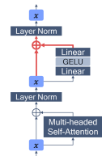

Table 2 & Figure 1: *Left*: Leave-one-out analysis for activation quantizers on problematic GLUE tasks. We set all weights to FP32 and use current min-max (with a batch size of 1) range estimator for activations. We report median score over 5 runs with different random seeds. *Right*: A schematic illustration of the attention layer in BERT. Hidden activation tensor is denoted by x. ⊕ is an element-wise addition. A problematic residual connection sum after feed-forward network is highlighted in red.

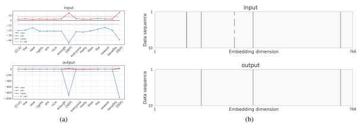

Figure 2: Full-precision FFN input (top row) and output (bottom row) in 11th layer of BERT. (a) Per-token ranges for first data sequence in the MNLI development set. (b) Visualization of outliers across embedding dimension for the first ten data sequences in the MNLI development set. Dark grey color indicates values that exceed six standard deviations from the mean of the activation tensor.

zation noise. Thus, selecting a higher bit-width for sensitive tensors can lead to better accuracy while efficiently keeping all the other tensors in 8-bit or lower.

First, we consider 16-bit activation quantization for problematic activation tensors, such as the residual sum tensor after the feed-forward network. Higher bit-width will provide a model with sufficient precision to represent both FFN's input and output, as well as their sum. Additionally, given the observation from Table 1, that the BERT model seems to be quite resilient to 8-bit weight quantization, we also consider the effect of low-bit (2-4) weight and token embedding quantization, which reduces the model size by more than 8× with a minimal loss in accuracy.

Per-embedding-group PTQ As discussed in Section 2, another way of improving the performance of the quantized model is to increase the quantization granularity. Based on our observation from Figure 2b, that the most problematic outliers in activation tensors are in few designated embedding dimensions, we consider having distinct quantization parameters for individual embedding dimensions or groups of embedding dimensions, as shown in Figure 3.

We start by describing *per-embedding* activation quantization. In BERT-like models, an intermediate hidden activation tensor x has a shape
(*B, T, d*), where B is the batch size, T is the sequence length, and d is the number of embedding dimensions (d = 768 for BERT-base, Devlin et al. 2019). Inspired by per-channel weight quantiza-

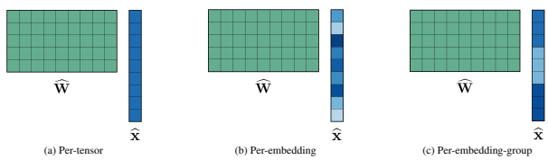

Figure 3: An overview for several choices of activation quantization granularity. The color indicates quantization parameter sharing. In all cases we assume per-tensor weight quantization.

tion (Krishnamoorthi, 2018), we can have distinct scaling factors and zero-points per embedding dimension instead of having two scalars for the whole tensor. In this case, we can collectively denote the quantization parameters by vectors s, z ∈ R
d. The rest of the quantization machinery works as before, including range estimation, with the only difference that equations (1) and (2) are now with broadcasting along the last dimension. The proposed scheme should alleviate the activation quantization issue since the outlier embedding dimensions will no longer dominate the ranges of other embedding dimensions.

Note, however, that full per-embedding activation quantization will lead to a more expensive computational graph. To illustrate why, consider a matrix-vector multiplication Wx, which in case of per-tensor quantization (and assuming z = 0) for both weights and activations can be computed as follows:

$$\widehat{\mathbf{W}}\widehat{\mathbf{x}}=\left(s^{\mathbf{w}}\cdot\mathbf{W}^{(\mathbb{Z})}\right)\left(s^{\mathbf{x}}\cdot\mathbf{x}^{(\mathbb{Z})}\right)$$ $$=s^{\mathbf{w}}s^{\mathbf{x}}\cdot\left(\sum_{j=1}^{d}\mathbf{W}_{ij}^{(\mathbb{Z})}\mathbf{x}_{j}^{(\mathbb{Z})}\right)_{i}.\tag{3}$$

A crucial detail here is that we can factor a common factor s ws x out of the summation. The sum is then efficiently calculated using integer-only arithmetic.

In case of per-embedding activation quantization
(xb = s x  x
(Z)), the matrix-vector multiplication becomes instead:

$$\widehat{\mathbf{W}}\widehat{\mathbf{x}}=s^{\mathbf{w}}\cdot\left(\sum_{j=1}^{d}\mathbf{s}_{j}^{\mathbf{x}}\cdot\mathbf{W}_{i j}^{(\mathbb{Z})}\,\mathbf{x}_{j}^{(\mathbb{Z})}\right)_{i}.\tag{4}$$

Here it is no longer possible to take the scaling factor out of the summation and perform a single re-scaling of the result. Instead, one has to perform repeated intermediate re-scalings on the accumulator.

To alleviate the overhead of constant re-scaling, we introduce *per-embedding-group* (PEG) quantization, where we split the activation tensor into K evenly sized groups along the embedding dimension and share quantization parameters among elements in the same group:

$$\widehat{\mathbf{x}}=\left[\mathbf{s}_{1}^{\mathbf{x}}\cdot\left[\mathbf{x}_{1}^{(\mathbb{Z})}\ldots\mathbf{x}_{d/K}^{(\mathbb{Z})}\right],\mathbf{s}_{2}^{\mathbf{x}}\cdot\left[\mathbf{x}_{d/K+1}^{(\mathbb{Z})}\ldots\right],\right.$$ $$\left.\ldots,\mathbf{s}_{K}^{\mathbf{x}}\cdot\left[\ldots\mathbf{x}_{d}^{(\mathbb{Z})}\right]\right],\tag{5}$$

where [*· · ·* ] denotes concatenation. Thus the number of required re-scaling operations is significantly reduced from d to K.

To ensure all outliers end up in the same group, we employ a deterministic range-based permutation of the embedding dimensions. Similar to range estimation for the activation quantization, we pass some calibration data through the unquantized network and record the dynamic range rj := max(x:,:,j ) − min(x:,:,j ) for each embedding dimension j. Next, we define K evenly sized groups based on indices in arg sort(r). During the range estimation phase, we determine a separate quantization range for each group. The sorting and grouping need to happen only once before the range estimation phase and deployment to the target.

Note that the PEG quantization has a negligible memory overhead, introducing only d + 2 · 3 · K
extra parameters per attention layer (permutation indices and scale & zero points per group for FFN's input, output, and sum), which is less than 0.04% of the total size of BERT-base model. Simulating PEG quantization using per-tensor operations The proposed scheme might not be natively supported on all target devices, but there

Figure 4: A schematic overview of how PEG quantization can be simulated on hardware that only supports per-

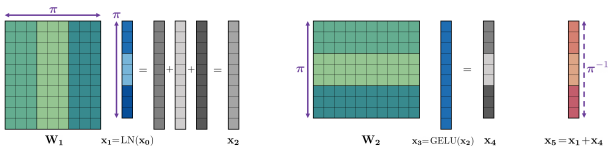

tensor quantization. x0 is the input to the first LayerNorm in the attention layer (see Figure 1), LayerNorm(x5) is the output of the attention layer, W1 and W2 denote weight matrices of linear layers. The color indicates different embedding groups. Purple arrows indicate which elements are permuted according to the range-based permutation (π) or its inverse (π
−1).

is an efficient way to implement it using only pertensor quantization, illustrated in Figure 4. First, consider a case without range-based permutation. Before quantizing the output of the first LayerNorm (Figure 1), we split the output tensor based on embedding groups into K individual tensors. We also accordingly split columns of the first Linear layer and rows of the second layer and decompose them into K smaller Linear layers each. The outputs of the first set of layers are elementwise-summed, and the outputs of the second set of layers are concatenated before the residual sum. With this functionally equivalent rewriting, all operations can be performed using standard per-tensor quantization.

PEG quantization with permutation can still be simulated on hardware that only supports pertensor operations. First, we can share the same permutation for FFN's input, output and sum since we expect the outliers in the output dominate the ones from the input. Second, we use the permutationequivariant properties of LayerNorm and linear layers (weights are permuted accordingly before the inference). We first permute the output of the first LayerNorm, proceed as described above, and then apply inverse permutation before the next Layer- Norm.

Quantization-aware training Finally, we consider a variant of QAT with learnable ranges for both weights and activations by adapting the procedure from Esser et al. (2019); Jain et al. (2019) for BERT-like transformer models. Simulating the quantization process during fine-tuning allows the model to adapt to quantization noise and often significantly increases performance compared to posttraining quantization.

| Criterion       | MP\-PTQ   | PEG\-PTQ   | QAT   |
|-----------------|-----------|------------|-------|
| Post\-training  | X         | X          | ✕     |
| Per\-tensor     | X         | ✕          | X     |
| Same bit\-width | ✕         | X          | X     |

Table 3: Comparison between proposed techniques (MP = mixed precision, PEG = per-embedding-group).

Comparison of methods We summarize different trade-offs for the proposed techniques in Table 3. As discussed in Section 2, usually PTQ methods are preferred over QAT algorithms since they are faster and require either no data or only a small calibration dataset. Additionally, they typically require almost no hyperparameter tuning, enabling easy and computationally efficient quantization. Allocating a higher bit-width to certain parts of the network will reduce the efficiency gain from quantization, because higher bit-width layers are more computationally expensive. It is also not supported by all target hardware. Per-embedding-group quantization has a smaller granularity compared to pertensor quantization. It leads to a minor amount of extra compute (and potential latency) due to the additional summation and re-quantization that occurs and might not be supported natively on every fixed-point platform. Meanwhile, we have shown a way to simulate this scheme on a hardware that only support per-tensor quantization operations.

## 5 Experiments

In this section, we evaluate the proposed quantization techniques for the BERT model on GLUE downstream tasks.

| Method     | STS\-B   | MNLI   | QNLI   | RTE   |
|------------|----------|--------|--------|-------|
| FP32       | 89.09    | 84.91  | 91.58  | 70.40 |
| W8A8 PTQ   | 79.78    | 45.60  | 51.73  | 64.98 |
| MP\-PTQ*   | 85.41    | 82.20  | 88.38  | 66.43 |
| MP\-PTQ*†  | 85.27    | 82.67  | 90.41  | 68.95 |
| MP\-PTQ*†‡ | 88.00    | 82.67  | 90.41  | 68.95 |

Experimental setup In all experiments, we use uniform affine quantization - symmetric weights, asymmetric activations - with the static activation range setting, as discussed in Section 2. We quantize all layer's weights and activations. For 8-bit weight quantization, we use the best range settings found in the experiment from Section 3, which can be found in Appendix B.2. However, for low (<8) bit weight and token embedding quantization, we always use the MSE range estimator, as recommended by Choukroun et al. (2019); Banner et al. (2018). We set activation ranges based on min and max from a single input sequence. For PTQ experiments, we report the median score over five runs with different random seeds.

For QAT experiments, we initialize all quantization parameters from the PTQ setup described above. Similarly to full-precision fine-tuning, we use Adam (Kingma and Ba, 2014) and a maximum sequence length of 128, with padding using a special [PAD] token for shorter sequences. We use a typical learning rate schedule from the transformer literature (Devlin et al., 2019; Liu et al., 2019; Lan et al., 2019) - a linear warmup for the first 10% of training steps followed by a linear decay to zero.

We perform a hyper-parameter search over the maximum learning rate, batch size, number of epochs, and the self-attention dropout rate for every task and report the best median score over three runs with different random seeds. For reproducibility, we included more details on the search space and selected hyper-parameters in Appendix B.3.

Table 4: Mixed precision post-training quantization results for BERT-base on development sets of the problematic GLUE tasks. *Uses 16-bit residual FFN sum.

†Uses 16-bit FFN input and output. ‡Uses 16-bit final output (using MSE range estimator).

Mixed precision PTQ First, we present the results for mixed precision post-training quantization (MP-PTQ) in Table 4, where we start from 8-bit activations and progressively keep more and more operations in 16-bit precision. We see that for clas-

Table 5: Per-embedding-group activation quantization PTQ results for BERT-base on development sets of the problematic GLUE tasks. *Per-embedding-group quantization is applied only to FFN's input, output, and residual sum (all the rest - per-tensor). " + P" - Uses range-based permutation.

| #groups, K         | STS\-B   | MNLI   | QNLI   | RTE   |
|--------------------|----------|--------|--------|-------|
| FP32               | 89.09    | 84.91  | 91.58  | 70.40 |
| 1 (= per\-tensor)  | 79.78    | 45.60  | 51.73  | 64.98 |
| 768 (= per\-embd.) | 87.87    | 80.97  | 90.66  | 69.31 |
| 768 (only FFN)*    | 87.92    | 81.00  | 90.68  | 68.59 |
| 6  (only FFN)      | 87.26    | 80.51  | 89.82  | 68.59 |
| 3 (only FFN)       | 85.96    | 76.43  | 80.74  | 66.06 |
| 3 + P (only FFN)   | 87.92    | 80.64  | 91.07  | 69.31 |
| 6 + P (only FFN)   | 87.92    | 81.25  | 91.07  | 69.31 |

sification tasks (MNLI, QNLI, RTE), it is sufficient to keep a few of the most problematic parts in 16-bit to get good performance. For the STS-B regression task, it is also necessary to keep the output in higher precision to close the gap with FP32 model performace.

In conclusion, by only keeping 22% of the activations in 16-bit1, we can achieve performance close to FP32, while all other activations and all weights are in 8-bit for efficient inference.

Per-embedding-group PTQ Next, we investigate the effectiveness of the proposed perembedding-group post-training activation quantization, depending on the number of groups K. The results are summarized in Table 5. Per-embedding activation quantization significantly improves performance, even when only applied to problematic parts of the network. Surprisingly, we can also recover most of the performance degradation with only K = 3 groups (size 256 each), especially if we apply range-based permutation to ensure all the outliers end up in the same group. A small number of groups is essential since it limits the number of re-scalings required, enabling efficient execution on resource constraint devices. Comparison of proposed methods We summarize the results for all of our proposed techniques and compare them to several related methods from the literature in Table 6. We use the same setup as described above. Unless otherwise stated, all results use 8-bit per-tensor quantization for both

136 out of 161 activation quantizers for BERT-base

| Method                | CoLA   | SST\-2   | MRPC   | STS\-B   | QQP    | MNLI   | QNLI   | RTE   | GLUE   |
|-----------------------|--------|----------|--------|----------|--------|--------|--------|-------|--------|
| FP32 baseline         | 57.27  | 93.12    | 88.36  | 89.09    | 89.72  | 84.91  | 91.58  | 70.40 | 83.06  |
| Our W8A8 PTQ          | 54.74  | 92.55    | 88.53  | 81.02    | 83.81  | 50.31  | 52.32  | 64.98 | 71.03  |
| Our W8A{8,16} MP\-PTQ | 58.63  | 92.66    | 88.74  | 88.00    | 89.40  | 82.67  | 90.41  | 68.95 | 82.43  |
| Our W8A8 PEG\-PTQ     | 59.43  | 92.66    | 88.53  | 87.92    | 89.42  | 81.25  | 91.07  | 69.31 | 82.45  |
| Our W8A8 QAT          | 61.27  | 93.00    | 88.80  | 88.95    | 89.44  | 83.74  | 90.48  | 70.40 | 83.26  |
| Q8BERT W8A8 PTQ*†     | 56.74  | 91.04    | 87.88‡ | 87.66‡   | 84.98‡ | -      | 89.34  | 63.32 | 80.13§ |
| Q8BERT W8A8 QAT*      | 58.48  | 92.24    | 89.56‡ | 89.04‡   | 87.96‡ | -      | 90.62  | 68.78 | 82.38§ |
| Q\-BERT W8A8 QATψ     | -      | 92.88    | -      | -        | -      | 83.87  | -      | -     | -      |

Table 6: 8-bit quantization results for BERT-base on development sets of the GLUE benchmark (except WNLI). The metrics for these tasks can be found in the GLUE paper (Wang et al., 2018a); in all cases, higher is better.

We compare against Q8BERT (Zafrir et al., 2019) and Q-BERT (Shen et al., 2020). Note that these papers start from FP32 baselines with slightly different scores. *Uses FP32 Softmax, GELU and LayerNorm. †Uses dynamic activation quantization. ‡Reports F1 score for MRPC, QQP and Pearson Correlation for STS-B, instead of the combined metrics. §A macro-average without a score for the MNLI task. ψUses group-wise per-channel weight quantization with 128 groups and keeps the last fully-connected layer in FP32.

weights and activations. For mixed precision (MP- PTQ), we use the best setup from the ablation study before. For per-embedding-group quantization (PEG-PTQ), we use K = 6 groups with range-based permutation for all tasks and only apply it to FFN's input, output, and the sum.

To summarize, all the proposed techniques solved the dynamic range problem, enabling efficient transformer quantization with minimum accuracy loss. Our PTQ results strongly outperform results from the literature, while our assumptions in mixed precision are milder than ones of Q8BERT,
which keeps all non-linearities in FP32. Our pertensor QAT results are also on par or outperform results from the literature, which uses finer quantization granularity and keeps certain parts of the network in FP32.

| Method                 | Memory  reduction   | GLUE   |
|------------------------|---------------------|--------|
| FP32 baseline          | ×1.00               | 83.06  |
| W6A32 PTQ              | ×5.33               | 81.41  |
| W4A32 PTQ              | ×8.00               | 72.31  |
| W4A32 AdaRound (PTQ)   | ×8.00               | 81.46  |
| W4A32 QAT              | ×8.00               | 82.95  |
| W4A8 QAT               | ×8.00               | 82.64  |
| W4A8, 2\-bit embd. QAT | ×8.85               | 82.29  |

Low-bit weight and token embeddings Given the robustness of the BERT model to 8-bit weight quantization, we investigate the effect of low-bit weight and token embedding quantization and summarize the results in Table 7.

We see that even in the post-training regime, it is possible to achieve low-bit weight quantization with acceptable performance degradation, especially when combined with AdaRound (Nagel et al.,
2020), a technique for learning optimal rounding. QAT recovers most of the performance, even with quantized activations. Furthermore, we can push token embeddings to 2-bits with less than a 0.8% drop in terms of the GLUE score. It reduces the model size by **8.85**× compared to the original FP32 Table 7: Low-bit weight & token embedding quanti-

zation results for for BERT-base on development sets of the GLUE benchmark. For AdaRound optimization
(Nagel et al. 2020, our impl.), we used 1024 random data sequences and 104iterations with default hyperparameters from the paper.

checkpoint and can significantly increase inference speed and reduce the energy consumption on resource constraint devices. More detailed results, including per-task scores and comparison to results from the literature, can be found in Appendix C.

## 6 Conclusions

In this paper, we explored quantization for BERT- like transformers. We showed that these models have unique quantization challenges - namely, high dynamic activations ranges that are difficult to represent with a low bit fixed-point format. These activations contain structured outliers in the residual connections that encourage specific model behavior, such as attending to the special [SEP] token. Motivated by our findings, we proposed three solutions, one based on mixed precision quantization, a novel per-embedding-group quantization, and quantization-aware training. Each of these methods has its own set of trade-offs in terms of accuracy, ease of use, and model size. Our techniques overcome the dynamic range issues and set a new state-of-the-art for PTQ and per-tensor QAT
on GLUE downstream tasks. Finally, we achieved 4-bit weight and 2-bit token embedding quantization with less than 0.8% drop in terms of GLUE
score, leading to significant memory and compute savings.

## References

Ron Banner, Yury Nahshan, Elad Hoffer, and Daniel Soudry. 2018. Post-training 4-bit quantization of convolution networks for rapid-deployment. arXiv preprint arXiv:1810.05723.

Iz Beltagy, Matthew E Peters, and Arman Cohan.

2020. Longformer: The long-document transformer. arXiv preprint arXiv:2004.05150.

Yoshua Bengio, Nicholas Léonard, and Aaron Courville. 2013. Estimating or propagating gradients through stochastic neurons for conditional computation. *arXiv preprint arXiv:1308.3432*.

Yash Bhalgat, Jinwon Lee, Markus Nagel, Tijmen Blankevoort, and Nojun Kwak. 2020. Lsq+: Improving low-bit quantization through learnable offsets and better initialization. In Proceedings of the IEEE/CVF Conference on Computer Vision and Pattern Recognition Workshops, pages 696–697.

Aishwarya Bhandare, Vamsi Sripathi, Deepthi Karkada, Vivek Menon, Sun Choi, Kushal Datta, and Vikram Saletore. 2019. Efficient 8-bit quantization of transformer neural machine language translation model. *arXiv preprint arXiv:1906.00532*.

Tom B Brown, Benjamin Mann, Nick Ryder, Melanie Subbiah, Jared Kaplan, Prafulla Dhariwal, Arvind Neelakantan, Pranav Shyam, Girish Sastry, Amanda Askell, et al. 2020. Language models are few-shot learners. *arXiv preprint arXiv:2005.14165*.

Nicolas Carion, Francisco Massa, Gabriel Synnaeve, Nicolas Usunier, Alexander Kirillov, and Sergey Zagoruyko. 2020. End-to-end object detection with transformers. In European Conference on Computer Vision, pages 213–229. Springer.

Mark Chen, Alec Radford, Rewon Child, Jeffrey Wu, Heewoo Jun, David Luan, and Ilya Sutskever. 2020.

Generative pretraining from pixels. In *International* Conference on Machine Learning, pages 1691–1703.

PMLR.

Rewon Child, Scott Gray, Alec Radford, and Ilya Sutskever. 2019. Generating long sequences with sparse transformers. *arXiv preprint* arXiv:1904.10509.

Krzysztof Choromanski, Valerii Likhosherstov, David Dohan, Xingyou Song, Andreea Gane, Tamas Sarlos, Peter Hawkins, Jared Davis, Afroz Mohiuddin, Lukasz Kaiser, et al. 2020. Rethinking attention with performers. *arXiv preprint arXiv:2009.14794*.

Yoni Choukroun, Eli Kravchik, Fan Yang, and Pavel Kisilev. 2019. Low-bit quantization of neural networks for efficient inference. In *ICCV Workshops*, pages 3009–3018.

Kevin Clark, Urvashi Khandelwal, Omer Levy, and Christopher D. Manning. 2019. What does BERT look at? an analysis of BERT's attention. In Proceedings of the 2019 ACL Workshop BlackboxNLP: Analyzing and Interpreting Neural Networks for NLP, pages 276–286, Florence, Italy. Association for Computational Linguistics.

Kevin Clark, Minh-Thang Luong, Quoc V Le, and Christopher D Manning. 2020. Electra: Pre-training text encoders as discriminators rather than generators. *arXiv preprint arXiv:2003.10555*.

Zihang Dai, Zhilin Yang, Yiming Yang, Jaime Carbonell, Quoc Le, and Ruslan Salakhutdinov. 2019. Transformer-XL: Attentive language models beyond a fixed-length context. In *Proceedings of the 57th* Annual Meeting of the Association for Computational Linguistics, pages 2978–2988, Florence, Italy. Association for Computational Linguistics.

Bita Darvish Rouhani, Daniel Lo, Ritchie Zhao, Ming Liu, Jeremy Fowers, Kalin Ovtcharov, Anna Vinogradsky, Sarah Massengill, Lita Yang, Ray Bittner, Alessandro Forin, Haishan Zhu, Taesik Na, Prerak Patel, Shuai Che, Lok Chand Koppaka, XIA SONG, Subhojit Som, Kaustav Das, Saurabh T, Steve Reinhardt, Sitaram Lanka, Eric Chung, and Doug Burger. 2020. Pushing the limits of narrow precision inferencing at cloud scale with microsoft floating point. In Advances in Neural Information Processing Systems, volume 33, pages 10271–10281. Curran Associates, Inc.

Mostafa Dehghani, Stephan Gouws, Oriol Vinyals, Jakob Uszkoreit, and Łukasz Kaiser. 2018. Universal transformers. *arXiv preprint arXiv:1807.03819*.

Jacob Devlin, Ming-Wei Chang, Kenton Lee, and Kristina Toutanova. 2019. BERT: Pre-training of deep bidirectional transformers for language understanding. In Proceedings of the 2019 Conference of the North American Chapter of the Association for Computational Linguistics: Human Language Technologies, Volume 1 (Long and Short Papers),
pages 4171–4186, Minneapolis, Minnesota. Association for Computational Linguistics.

Jesse Dodge, Gabriel Ilharco, Roy Schwartz, Ali Farhadi, Hannaneh Hajishirzi, and Noah Smith. 2020. Fine-tuning pretrained language models:
Weight initializations, data orders, and early stopping. *arXiv preprint arXiv:2002.06305*.

Linhao Dong, Shuang Xu, and Bo Xu. 2018. Speechtransformer: a no-recurrence sequence-to-sequence model for speech recognition. In 2018 IEEE International Conference on Acoustics, Speech and Signal Processing (ICASSP), pages 5884–5888. IEEE.

Zhen Dong, Zhewei Yao, Amir Gholami, Michael W
Mahoney, and Kurt Keutzer. 2019. Hawq: Hessian aware quantization of neural networks with mixedprecision. In Proceedings of the IEEE/CVF International Conference on Computer Vision, pages 293– 302.

Alexey Dosovitskiy, Lucas Beyer, Alexander Kolesnikov, Dirk Weissenborn, Xiaohua Zhai, Thomas Unterthiner, Mostafa Dehghani, Matthias Minderer, Georg Heigold, Sylvain Gelly, et al. 2020. An image is worth 16x16 words: Transformers for image recognition at scale. *arXiv preprint* arXiv:2010.11929.

Steven K Esser, Jeffrey L McKinstry, Deepika Bablani, Rathinakumar Appuswamy, and Dharmendra S
Modha. 2019. Learned step size quantization. *arXiv* preprint arXiv:1902.08153.

Angela Fan, Pierre Stock, Benjamin Graham, Edouard Grave, Rémi Gribonval, Hervé Jégou, and Armand Joulin. 2020. Training with quantization noise for extreme model compression. arXiv preprint arXiv:2004.07320.

Rohit Girdhar, Joao Carreira, Carl Doersch, and Andrew Zisserman. 2019. Video action transformer network. In Proceedings of the IEEE/CVF Conference on Computer Vision and Pattern Recognition, pages 244–253.

Yong Guo, Yin Zheng, Mingkui Tan, Qi Chen, Jian Chen, Peilin Zhao, and Junzhou Huang. 2019. Nat: Neural architecture transformer for accurate and compact architectures. *arXiv preprint* arXiv:1910.14488.

Suyog Gupta, Ankur Agrawal, Kailash Gopalakrishnan, and Pritish Narayanan. 2015. Deep learning with limited numerical precision. In *International* conference on machine learning, pages 1737–1746. PMLR.

M. Horowitz. 2014. 1.1 computing's energy problem
(and what we can do about it). In 2014 IEEE International Solid-State Circuits Conference Digest of Technical Papers (ISSCC), pages 10–14.

Neil Houlsby, Andrei Giurgiu, Stanislaw Jastrzebski, Bruna Morrone, Quentin De Laroussilhe, Andrea Gesmundo, Mona Attariyan, and Sylvain Gelly. 2019. Parameter-efficient transfer learning for nlp.

In *International Conference on Machine Learning*,
pages 2790–2799. PMLR.

Itay Hubara, Matthieu Courbariaux, Daniel Soudry, Ran El-Yaniv, and Yoshua Bengio. 2017. Quantized neural networks: Training neural networks with low precision weights and activations. The Journal of Machine Learning Research, 18(1):6869–6898.

Forrest Iandola, Albert Shaw, Ravi Krishna, and Kurt Keutzer. 2020. SqueezeBERT: What can computer vision teach NLP about efficient neural networks? In Proceedings of SustaiNLP: Workshop on Simple and Efficient Natural Language Processing, pages 124–135, Online. Association for Computational Linguistics.

Benoit Jacob, Skirmantas Kligys, Bo Chen, Menglong Zhu, Matthew Tang, Andrew Howard, Hartwig Adam, and Dmitry Kalenichenko. 2018. Quantization and training of neural networks for efficient integer-arithmetic-only inference. In Proceedings of the IEEE Conference on Computer Vision and Pattern Recognition, pages 2704–2713.

Sambhav R Jain, Albert Gural, Michael Wu, and Chris Dick. 2019. Trained uniform quantization for accurate and efficient neural network inference on fixedpoint hardware. *arXiv preprint arXiv:1903.08066*, 6.

Xiaoqi Jiao, Yichun Yin, Lifeng Shang, Xin Jiang, Xiao Chen, Linlin Li, Fang Wang, and Qun Liu. 2020. TinyBERT: Distilling BERT for natural language understanding. In Findings of the Association for Computational Linguistics: EMNLP 2020, pages 4163–4174, Online. Association for Computational Linguistics.

Marcin Junczys-Dowmunt, Kenneth Heafield, Hieu Hoang, Roman Grundkiewicz, and Anthony Aue. 2018. Marian: Cost-effective high-quality neural machine translation in c++. arXiv preprint arXiv:1805.12096.

Angelos Katharopoulos, Apoorv Vyas, Nikolaos Pappas, and François Fleuret. 2020. Transformers are rnns: Fast autoregressive transformers with linear attention. In International Conference on Machine Learning, pages 5156–5165. PMLR.

Sehoon Kim, Amir Gholami, Zhewei Yao, Michael W
Mahoney, and Kurt Keutzer. 2021. I-bert: Integer-only bert quantization. arXiv preprint arXiv:2101.01321.

Diederik P Kingma and Jimmy Ba. 2014. Adam: A
method for stochastic optimization. *arXiv preprint* arXiv:1412.6980.

Nikita Kitaev, Łukasz Kaiser, and Anselm Levskaya.

2020. Reformer: The efficient transformer. *arXiv* preprint arXiv:2001.04451.

Raghuraman Krishnamoorthi. 2018. Quantizing deep convolutional networks for efficient inference: A
whitepaper. *arXiv preprint arXiv:1806.08342*.

Zhenzhong Lan, Mingda Chen, Sebastian Goodman, Kevin Gimpel, Piyush Sharma, and Radu Soricut. 2019. Albert: A lite bert for self-supervised learning of language representations. arXiv preprint arXiv:1909.11942.

Hector Levesque, Ernest Davis, and Leora Morgenstern. 2012. The winograd schema challenge. In Thirteenth International Conference on the Principles of Knowledge Representation and Reasoning. Citeseer.

Darryl Lin, Sachin Talathi, and Sreekanth Annapureddy. 2016. Fixed point quantization of deep convolutional networks. In *International conference* on machine learning, pages 2849–2858. PMLR.

Yinhan Liu, Myle Ott, Naman Goyal, Jingfei Du, Mandar Joshi, Danqi Chen, Omer Levy, Mike Lewis, Luke Zettlemoyer, and Veselin Stoyanov. 2019. Roberta: A robustly optimized bert pretraining approach. *arXiv preprint arXiv:1907.11692*.

Markus Nagel, Rana Ali Amjad, Mart Van Baalen, Christos Louizos, and Tijmen Blankevoort. 2020. Up or down? adaptive rounding for post-training quantization. In International Conference on Machine Learning, pages 7197–7206. PMLR.

Markus Nagel, Mart van Baalen, Tijmen Blankevoort, and Max Welling. 2019. Data-free quantization through weight equalization and bias correction. In Proceedings of the IEEE/CVF International Conference on Computer Vision, pages 1325–1334.

Markus Nagel, Marios Fournarakis, Rana Ali Amjad, Yelysei Bondarenko, Mart van Baalen, and Blankevoort Tijmen. 2021. A white paper on neural network quantization. *arXiv preprint* arXiv:2106.08295.

Sai Prasanna, Anna Rogers, and Anna Rumshisky.

2020. When bert plays the lottery, all tickets are winning. *arXiv preprint arXiv:2005.00561*.

Alec Radford, Karthik Narasimhan, Tim Salimans, and Ilya Sutskever. 2018. Improving language understanding by generative pre-training.

Alec Radford, Jeffrey Wu, Rewon Child, David Luan, Dario Amodei, and Ilya Sutskever. 2019. Language models are unsupervised multitask learners.

Victor Sanh, Lysandre Debut, Julien Chaumond, and Thomas Wolf. 2019. Distilbert, a distilled version of bert: smaller, faster, cheaper and lighter. arXiv preprint arXiv:1910.01108.

Victor Sanh, Thomas Wolf, and Alexander M Rush.

2020. Movement pruning: Adaptive sparsity by finetuning. *arXiv preprint arXiv:2005.07683*.

Sheng Shen, Zhen Dong, Jiayu Ye, Linjian Ma, Zhewei Yao, Amir Gholami, Michael W Mahoney, and Kurt Keutzer. 2020. Q-bert: Hessian based ultra low precision quantization of bert. In *Proceedings of* the AAAI Conference on Artificial Intelligence, volume 34, pages 8815–8821.

Asa Cooper Stickland and Iain Murray. 2019. Bert and pals: Projected attention layers for efficient adaptation in multi-task learning. In *International* Conference on Machine Learning, pages 5986–5995. PMLR.

Zhiqing Sun, Hongkun Yu, Xiaodan Song, Renjie Liu, Yiming Yang, and Denny Zhou. 2020. MobileBERT: a compact task-agnostic BERT for resource-limited devices. In Proceedings of the 58th Annual Meeting of the Association for Computational Linguistics, pages 2158–2170, Online. Association for Computational Linguistics.

Yi Tay, Mostafa Dehghani, Dara Bahri, and Donald Metzler. 2020. Efficient transformers: A survey. arXiv preprint arXiv:2009.06732.

Mart van Baalen, Christos Louizos, Markus Nagel, Rana Ali Amjad, Ying Wang, Tijmen Blankevoort, and Max Welling. 2020. Bayesian bits: Unifying quantization and pruning. *arXiv preprint* arXiv:2005.07093.

Ashish Vaswani, Noam Shazeer, Niki Parmar, Jakob Uszkoreit, Llion Jones, Aidan N Gomez, Łukasz Kaiser, and Illia Polosukhin. 2017. Attention is all you need. In *Proceedings of the 31st International* Conference on Neural Information Processing Systems, pages 6000–6010.

Jesse Vig. 2019. A multiscale visualization of attention in the transformer model. In *Proceedings of the* 57th Annual Meeting of the Association for Computational Linguistics: System Demonstrations, pages 37–42, Florence, Italy. Association for Computational Linguistics.

Alex Wang, Amanpreet Singh, Julian Michael, Felix Hill, Omer Levy, and Samuel Bowman. 2018a. GLUE: A multi-task benchmark and analysis platform for natural language understanding. In Proceedings of the 2018 EMNLP Workshop BlackboxNLP: Analyzing and Interpreting Neural Networks for NLP, pages 353–355, Brussels, Belgium. Association for Computational Linguistics.

Hanrui Wang, Zhanghao Wu, Zhijian Liu, Han Cai, Ligeng Zhu, Chuang Gan, and Song Han. 2020a. HAT: Hardware-aware transformers for efficient natural language processing. In Proceedings of the 58th Annual Meeting of the Association for Computational Linguistics, pages 7675–7688, Online. Association for Computational Linguistics.

Kuan Wang, Zhijian Liu, Yujun Lin, Ji Lin, and Song Han. 2019. Haq: Hardware-aware automated quantization with mixed precision. In Proceedings of the IEEE/CVF Conference on Computer Vision and Pattern Recognition, pages 8612–8620.

Peiqi Wang, Xinfeng Xie, Lei Deng, Guoqi Li, Dongsheng Wang, and Yuan Xie. 2018b. Hitnet: Hybrid ternary recurrent neural network. In *Proceedings of* the 32nd International Conference on Neural Information Processing Systems, pages 602–612.

Sinong Wang, Belinda Li, Madian Khabsa, Han Fang, and Hao Ma. 2020b. Linformer: Selfattention with linear complexity. arXiv preprint arXiv:2006.04768.

Thomas Wolf, Lysandre Debut, Victor Sanh, Julien Chaumond, Clement Delangue, Anthony Moi, Pierric Cistac, Tim Rault, Remi Louf, Morgan Funtowicz, Joe Davison, Sam Shleifer, Patrick von Platen, Clara Ma, Yacine Jernite, Julien Plu, Canwen Xu, Teven Le Scao, Sylvain Gugger, Mariama Drame, Quentin Lhoest, and Alexander Rush. 2020. Transformers: State-of-the-art natural language processing. In Proceedings of the 2020 Conference on Empirical Methods in Natural Language Processing:
System Demonstrations, pages 38–45, Online. Association for Computational Linguistics.

Bichen Wu, Yanghan Wang, Peizhao Zhang, Yuandong Tian, Peter Vajda, and Kurt Keutzer. 2018a. Mixed precision quantization of convnets via differentiable neural architecture search. arXiv preprint arXiv:1812.00090.

Shuang Wu, Guoqi Li, Feng Chen, and Luping Shi.

2018b. Training and inference with integers in deep neural networks. *arXiv preprint arXiv:1802.04680*.

Chen Xu, Jianqiang Yao, Zhouchen Lin, Wenwu Ou, Yuanbin Cao, Zhirong Wang, and Hongbin Zha. 2018. Alternating multi-bit quantization for recurrent neural networks. arXiv preprint arXiv:1802.00150.

Zhilin Yang, Zihang Dai, Yiming Yang, Jaime Carbonell, Ruslan Salakhutdinov, and Quoc V Le. 2019. Xlnet: Generalized autoregressive pretraining for language understanding. arXiv preprint arXiv:1906.08237.

Ofir Zafrir, Guy Boudoukh, Peter Izsak, and Moshe Wasserblat. 2019. Q8bert: Quantized 8bit bert.

arXiv preprint arXiv:1910.06188.

Dongqing Zhang, Jiaolong Yang, Dongqiangzi Ye, and Gang Hua. 2018. Lq-nets: Learned quantization for highly accurate and compact deep neural networks. In Proceedings of the European conference on computer vision (ECCV), pages 365–382.

Shuchang Zhou, Yuxin Wu, Zekun Ni, Xinyu Zhou, He Wen, and Yuheng Zou. 2016. Dorefa-net: Training low bitwidth convolutional neural networks with low bitwidth gradients. arXiv preprint arXiv:1606.06160.

Yiren Zhou, Seyed-Mohsen Moosavi-Dezfooli, Ngai-
Man Cheung, and Pascal Frossard. 2018. Adaptive quantization for deep neural network. In Proceedings of the AAAI Conference on Artificial Intelligence, volume 32.

Feng Zhu, Ruihao Gong, Fengwei Yu, Xianglong Liu, Yanfei Wang, Zhelong Li, Xiuqi Yang, and Junjie Yan. 2020. Towards unified int8 training for convolutional neural network. In Proceedings of the IEEE/CVF Conference on Computer Vision and Pattern Recognition, pages 1969–1979.

# Supplementary Materials

## A Why Do These Outliers Exist?

To better understand why transformer models learn these peculiar outliers, we look at what happens with those outliers when they proceed to the next attention layer. We visualize the attention mechanism for one of the attention heads in the problematic 11th layer of BERT-base in Figure 5. We can see that most of the tokens in this attention head attend to special [SEP] tokens. Furthermore, from Figure 5b we see a similar consistent vertical pattern
(indicated by black arrows) as we saw from the per-embedding graphs for FFN's input and output activation tensors (see Figure 2b in paper). It means the attention mechanism generates such queries and key vectors that the decision of attending to special separator tokens is determined by only a few designated neurons. It suggests that structured outliers in residual connections lead to structured outliers in query-key multiplications, causing most tokens to attend to the separator token.

Clark et al. (2019) has shown that in BERT-
like transformer models, attending to the special [SEP] token is essentially a "no-op" for attention heads that cannot extract patterns they were trained to look for from the specific passage of text. Clark et al. (2019) also showed that such behavior is quite common: often, more than a half of the head's attention is on special tokens, specifically in deeper layers.

We hypothesize that such an attention pattern seems to be a useful one to obtain a good predictive performance, while the structured outliers merely help to facilitate this behavior. These outliers causing such a high dynamic range for activations likely emerged as a result of specific architectural choices (e.g., large fully-connected layers) and long pretraining with no explicit activation regularization applied.

## B Experimental Details

### B.1 Fp32 Fine-Tuning Details

We use pre-trained checkpoint for BERT-base
(uncased, 109M parameters) from HuggingFace repository (Wolf et al., 2020). We follow a standard fine-tuning practices from (Devlin et al., 2019) and https://github.com/
huggingface/transformers. Each data point is tokenized and truncated to the maximum sequence length of 128. Shorter sequences are padded to the same length of 128 using a special [PAD] token. We fine-tune for 3 epochs using Adam for all tasks. Learning rate is initially set to its maximum value and is linearly decayed to zero by the end of fine-tuning. We tune the batch size and maximum value of learning rate individually per task from the following search space:

- batch size: {32, 64} for bigger tasks (QQP,
MNLI, QNLI) and {8, 16, 32, 64} for the rest,

- learning rate: {2,3,4,5}e-5.

We repeat every experiment 5 times with different random seeds and select the configuration with the best median score on the development set for the respective task. These configurations are shown

| Task   | Learning rate   | Batch size   |
|--------|-----------------|--------------|
| CoLA   | 2e\-05          | 32           |
| SST\-2 | 2e\-05          | 16           |
| MRPC   | 5e\-05          | 8            |
| STS\-B | 4e\-05          | 32           |
| QQP    | 4e\-05          | 64           |
| MNLI   | 2e\-05          | 16           |
| QNLI   | 2e\-05          | 32           |
| RTE    | 3e\-05          | 8            |

Table 8: Hyper-parameters for FP32 BERT-base finetuning on GLUE downstream tasks.

in Table 8. Quantization is always applied to the median checkpoint for the respective task.

We exclude the problematic WNLI
task (Levesque et al., 2012), as it has relatively small dataset and shows an unstable behaviour (Dodge et al., 2020), in particular due to several issues with the way the dataset was constructed2.

#### B.2 Range Setting For 8-Bit Post-Training Quantization

We select the best range estimators from the following search space:
- weights: {min-max, MSE};

2See https://gluebenchmark.com/faq for details.

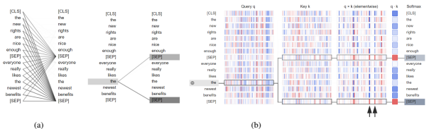

Figure 5: Visualization of the attention pattern in 6th attention head of 11th layer in BERT-base, computed on first data sequence from the MNLI development set. (a) visualization of the attention weights (attention probabilities)
between the tokens. Thickness of line between the query vector qi of i-th token on the left and key vector kj of j-th token on the right is proportional to exp q√i·kj d
. To generate this figure, we used "head view" from the BertViz library (Vig, 2019). (b) a "deconstruction" of the behavior on the left in terms of elementwise query-key vector multiplications. Values in red indicate high positive values, while values in blue indicate negative values.

We used "neuron view" from the BertViz library to generate this figure.

### - Activations: {Current Min-Max, Running Minmax, Mse}.

| Task   | Weights   | Activations (bs, nb)      |
|--------|-----------|---------------------------|
| CoLA   | min\-max  | running min\-max (1, 4)   |
| SST\-2 | MSE       | running min\-max (4, 16)  |
| MRPC   | MSE       | running min\-max (16, 16) |
| STS\-B | min\-max  | running min\-max (1, 16)  |
| QQP    | min\-max  | running min\-max (16, 16) |
| MNLI   | min\-max  | running min\-max (1, 16)  |
| QNLI   | min\-max  | running min\-max (1, 16)  |
| RTE    | MSE       | current min\-max (1)      |

For activations, we also select the best batch size and number of batches from {1,4,16} (except current min-max, for which only a single batch is used). For running min-max, we use the momentum coefficient of 0.9. We repeat every experiment 5 times with different random seeds and select the configuration with the best median score on the development set for the respective task. Best

Table 9: Best range estimators for post-training quantization of BERT-base on GLUE tasks (bs = batch size, nb = number of batches).

configurations for joint weight and activation 8-bit post-training quantization are listed in Table 9.

### B.3 W8A8 Qat Hyper-Parameters

Hyper-parameters for W8A8 quantization-aware training are listed in Table 10.

Table 10: Hyper-parameters for 8-bit QAT for BERT-
base on development sets of the GLUE benchmark (LR = maximum learning rate, BS = batch size, E = number of epochs, D = self-attention dropout rate). Values in bold indicate the best configuration.

| Task   | LR            | BS       | E      | D        |
|--------|---------------|----------|--------|----------|
| CoLA   | {2, 3, 4}e\-5 | {16, 32} | {3, 6} | {0, 0.1} |
| SST\-2 | {1, 2, 3}e\-5 | {16, 32} | {3, 6} | {0, 0.1} |
| MRPC   | {1, 2, 3}e\-5 | {8}      | {3, 6} | {0, 0.1} |
| STS\-B | {2, 4, 8}e\-5 | {16, 32} | {3, 6} | {0, 0.1} |
| QQP    | {4, 5, 6}e\-5 | {32}     | {3}    | {0, 0.1} |
| MNLI   | {2, 3, 4}e\-5 | {16, 32} | {3}    | {0, 0.1} |
| QNLI   | {2, 3, 4}e\-5 | {16, 32} | {3}    | {0, 0.1} |
| RTE    | {1, 3, 5}e\-5 | {8}      | {3, 6} | {0, 0.1} |

### B.4 W4A8 Qat Hyper-Parameters

Hyper-parameters for W4A8 quantization-aware training are listed in Table 11.

## C Detailed Results For Low-Bit Weight And Embedding Quantization

Detailed results for low-bit weight and token embedding quantization for BERT-base on development sets of the GLUE benchmark (including pertask scores) are summarized in Table 12.

| Task   | LR              | BS       | E      |
|--------|-----------------|----------|--------|
| CoLA   | {2, 3, 4}e\-5   | {16, 32} | {3, 6} |
| SST\-2 | {2, 3, 4}e\-5   | {16, 32} | {3, 6} |
| MRPC   | {2, 3, 4}e\-5   | {8}      | {3, 6} |
| STS\-B | {4, 6, 8}e\-5   | {16, 32} | {3, 6} |
| QQP    | {4, 5.5, 7}e\-5 | {32}     | {3, 6} |
| MNLI   | {3, 4, 5}e\-5   | {16, 32} | {3, 6} |
| QNLI   | {2, 3, 4}e\-5   | {16, 32} | {3, 6} |
| RTE    | {3, 4, 5}e\-5   | {8}      | {3, 6} |

Table 11: Hyper-parameters for W4A8 QAT for BERT- base on development sets of the GLUE benchmark (LR = maximum learning rate, BS = batch size, E = number of epochs). Values in bold indicate the best configuration.

## D Additional Graphs From Problem Investigation

#### D.1 Per-Embedding Outliers For All Layers In Bert-Base

We visualize per-embedding outliers in FFN's input and output for all layers in BERT-base computed on first ten data sequences from the development set of MNLI (Figure 6), STS-B (Figure 7) and MRPC (Figure 8). We see that only a few designated embedding dimensions generate outliers across many data points. It suggests that such behavior is already pre-determined by the weights and embeddings of the pre-trained BERT model.

### D.2 Activation Tensors For Different Architectures

We shot that dynamic range issue is present in multiple architectures and training objectives:
- BERT-base in Figure 9,
- BERT-large in Figure 10, - RoBERTa-base in Figure 11, - DistilRoBERTa-base in Figure 12, - MobileBERT-base in Figure 13.

In all cases, we used pre-trained checkpoints from HuggingFace library (Wolf et al., 2020).

| Method                      | CoLA   | SST\-2   | MRPC   | STS\-B   | QQP   | MNLI   | QNLI   | RTE   | GLUE   |
|-----------------------------|--------|----------|--------|----------|-------|--------|--------|-------|--------|
| FP32 baseline               | 57.27  | 93.12    | 88.36  | 89.09    | 89.72 | 84.91  | 91.58  | 70.40 | 83.06  |
| Our W8A32, 6\-bit embd. PTQ | 58.65  | 92.32    | 88.36  | 89.06    | 89.74 | 84.62  | 91.32  | 68.95 | 82.88  |
| Our W8A32, 4\-bit embd. PTQ | 57.43  | 92.32    | 88.79  | 89.02    | 89.70 | 84.58  | 91.43  | 68.59 | 82.73  |
| Our W8A32, 2\-bit embd. PTQ | 57.22  | 92.32    | 86.99  | 88.87    | 89.63 | 84.45  | 91.47  | 68.23 | 82.40  |
| Our W6A32 PTQ               | 56.23  | 91.86    | 86.70  | 87.76    | 88.94 | 82.39  | 88.83  | 68.23 | 81.41  |
| Our W4A32 PTQ               | 43.06  | 90.83    | 84.90  | 83.07    | 79.37 | 68.16  | 79.68  | 50.18 | 72.31  |
| Our W4A32 AdaRound (PTQ)    | 54.56  | 92.32    | 87.53  | 87.91    | 88.30 | 81.61  | 90.17  | 69.31 | 81.46  |
| Our W4A32 QAT               | 58.31  | 92.49    | 87.58  | 89.02    | 89.78 | 84.29  | 91.40  | 70.76 | 82.95  |
| Our W4A8 QAT                | 57.22  | 92.32    | 87.77  | 89.13    | 89.64 | 83.69  | 91.29  | 70.04 | 82.64  |
| Our W4A8, 2\-bit embd. QAT  | 56.08  | 91.74    | 87.59  | 89.19    | 89.56 | 83.68  | 90.79  | 69.67 | 82.29  |
| Q\-BERT W4A8 QAT*           | -      | 85.67    | -      | -        | -     | 76.85  | -      | -     | -      |
| Q\-BERT W4A8 QAT*†          | -      | 92.66    | -      | -        | -     | 84.03  | -      | -     | -      |

Table 12: Low-bit weight and token embedding quantization results for BERT-base on development sets of the GLUE benchmark. We compare against Q-BERT (Shen et al., 2020). Note that this work starts from FP32 baselines with slightly different scores. *Keeps the last fully-connected layer in full precision. †Uses group-wise per-channel weight quantization with 128 groups (of size 6 each).

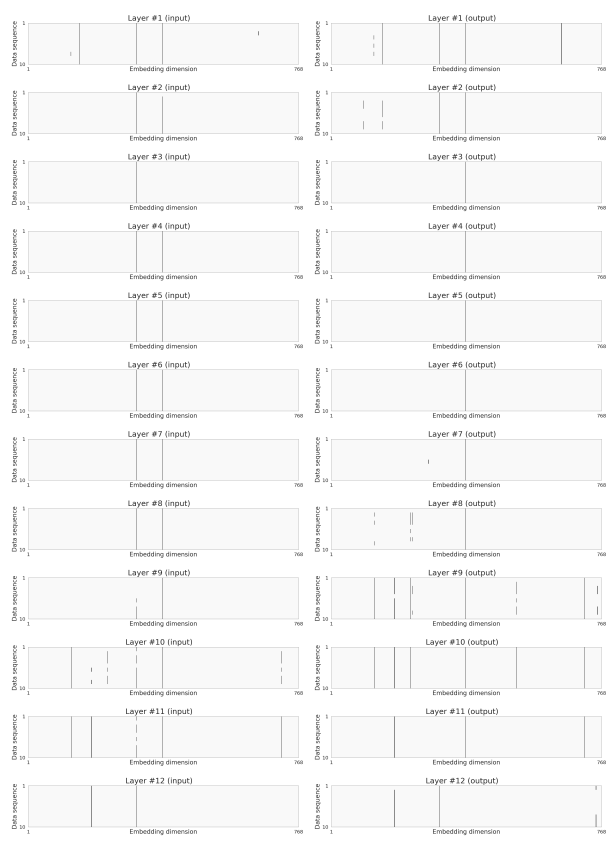

Figure 6: Visualization of activation tensor outliers in BERT-base FFN's input and output across embedding dimension for the first ten data sequences in the MNLI development set. Dark grey color indicates values that exceed six standard deviations from the mean of the activation tensor.

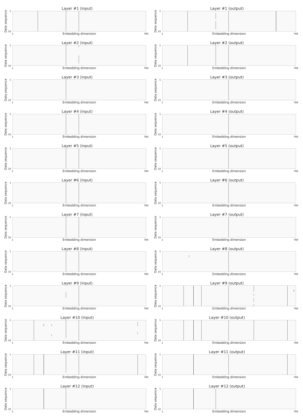

Figure 7: Visualization of activation tensor outliers in BERT-base FFN's input and output across embedding dimension for the first ten data sequences in the STS-B development set. Dark grey color indicates values that exceed six standard deviations from the mean of the activation tensor.

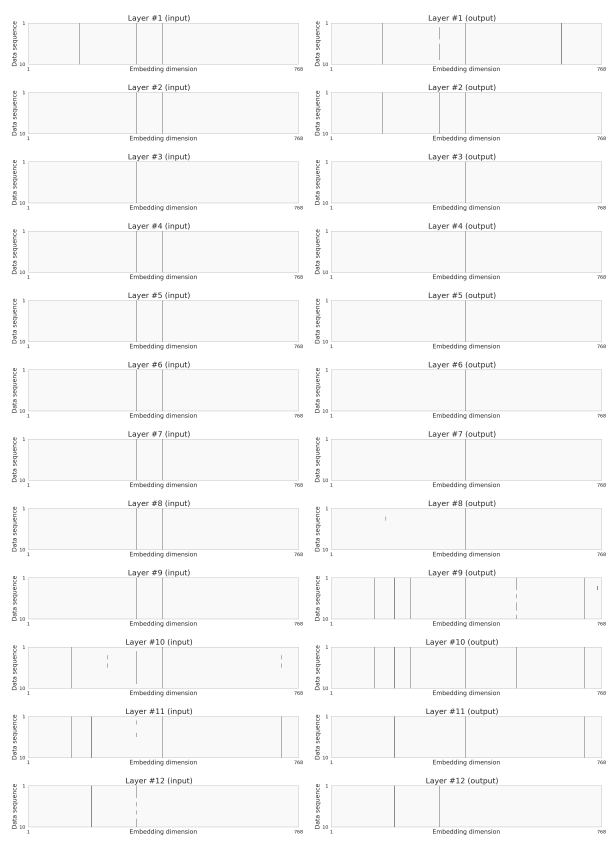

Figure 8: Visualization of activation tensor outliers in BERT-base FFN's input and output across embedding dimension for the first ten data sequences in the MRPC development set. Dark grey color indicates values that exceed six standard deviations from the mean of the activation tensor.

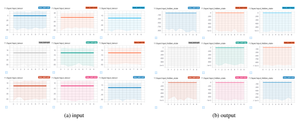

Figure 9: Activation distributions of FFN's input (a) and output (b) in second to the last layer for BERT-base, evaluated on first ten data sequences from development sets of GLUE downstream tasks (full-precision). In each sub-plot, left-to-right, top-to-bottom: CoLA, MNLI, MRPC → QNLI, QQP, RTE → SST-2, STS-B, WNLI. *x-axis*:
index of data sequence. *y-axis*: the range (note the scales are different for the input and the output).

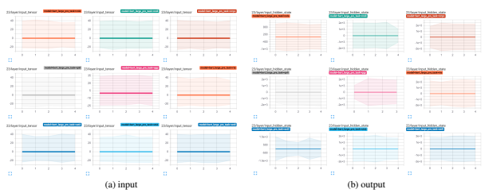

Figure 10: Activation distributions of FFN's input (a) and output (b) in second to the last layer for BERT-large, evaluated on first five data sequences from development sets of GLUE downstream tasks (full-precision). In each sub-plot, left-to-right, top-to-bottom: CoLA, MNLI, MRPC → QNLI, QQP, RTE → SST-2, STS-B, WNLI. *x-axis*:
index of data sequence. *y-axis*: the range (note the scales are different for the input and the output).

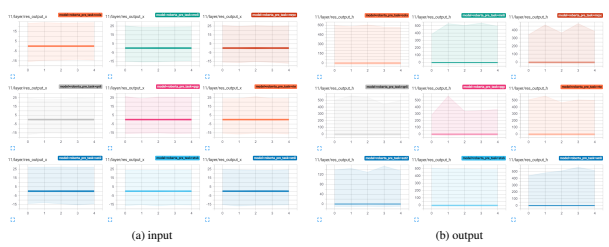

Figure 11: Activation distributions of FFN's input (a) and output (b) in second to the last layer for RoBERTa-base, evaluated on first five data sequences from development sets of GLUE downstream tasks (full-precision). In each sub-plot, left-to-right, top-to-bottom: CoLA, MNLI, MRPC → QNLI, QQP, RTE → SST-2, STS-B, WNLI. x-axis: index of data sequence. y-axis: the range (note the scales are different for the input and the output).

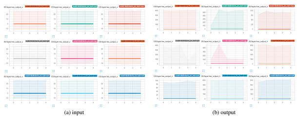

Figure 12: Activation distributions of FFN's input (a) and output (b) in second to the last layer for DistilRoBERTabase, evaluated on first five data sequences from development sets of GLUE downstream tasks (full-precision). In each sub-plot, left-to-right, top-to-bottom: CoLA, MNLI, MRPC → QNLI, QQP, RTE → SST-2, STS-B, WNLI. x-axis: index of data sequence. y-axis: the range (note the scales are different for the input and the output).

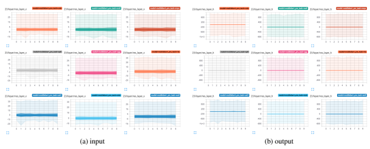

Figure 13: Activation distributions of FFN's input (a) and output (b) in second to the last layer for MobileBERT-
base, evaluated on first ten data sequences from development sets of GLUE downstream tasks (full-precision). In each sub-plot, left-to-right, top-to-bottom: CoLA, MNLI, MRPC → QNLI, QQP, RTE → SST-2, STS-B, WNLI.

x-axis: index of data sequence. y-axis: the range (note the scales are different for the input and the output).
