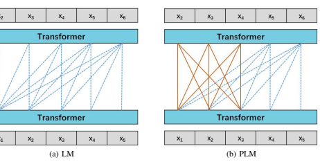
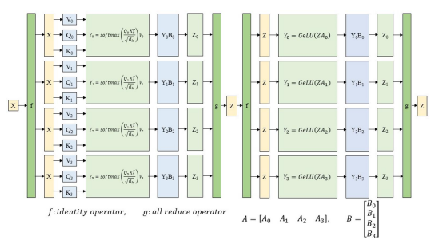
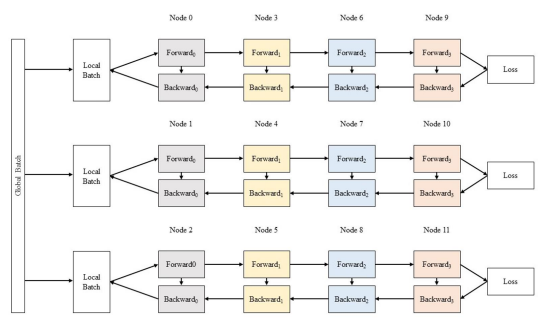
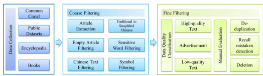
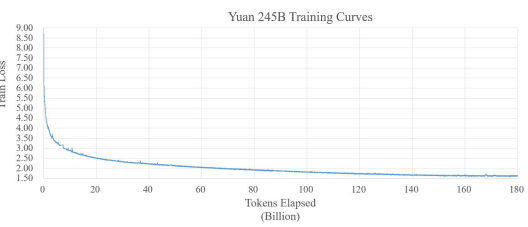
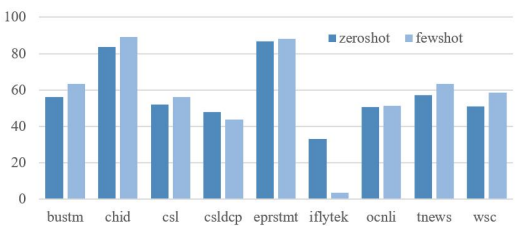
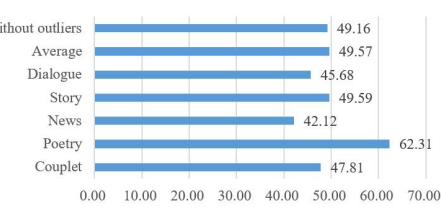

# Yuan 1.0: Large-Scale Pre-Trained Language Model In Zero-Shot And Few-Shot Learning

| Shaohua Wu∗   |              | Xudong Zhao   |            | Tong Yu       |
|---------------|--------------|---------------|------------|---------------|
| Rongguo Zhang | Chong Shen   |               | Hongli Liu | Feng Li       |
| Hong Zhu      | Jiangang Luo |               | Liang Xu   | Xuanwei Zhang |

# A**Bstract**

Recent work like GPT-3 has demonstrated excellent performance of Zero-Shot and Few-Shot learning on many natural language processing (NLP) tasks by scaling up model size, dataset size and the amount of computation. However, training a model like GPT-3 requires huge amount of computational resources which makes it challengeable to researchers. In this work, we propose a method that incorporates large-scale distributed training performance into model architecture design. With this method, Yuan 1.0, the current largest singleton language model with 245B parameters, achieves excellent performance on thousands GPUs during training, and the state-of-the-art results on natural language processing tasks. A data processing method is designed to efficiently filter massive amount of raw data. The current largest high-quality Chinese corpus with 5TB high quality texts is built based on this method. In addition, a calibration and label expansion method is proposed to improve the Zero-Shot and Few-Shot performance, and steady improvement is observed on the accuracy of various tasks. Yuan 1.0 presents strong capacity of NLP tasks, and the generated articles are difficult to distinguish from the human-written ones.

# 1 Introduction

The Transformer architecture has been widely used in natural language processing[1, 2, 3]. In order to improve the performance, a varieties of Transformer-based modifications have been proposed since 2017[1], but many of them exhibit a lack of generalization across different implementations and tasks[4]. Kaplan, et al.[5] confirms that performance of the Transformer steadily improves with the scaling up of model size, dataset size, and the amount of computation for training. Roberta[2] shows that the accuracy of BERT can be substantially improved by training the model for a longer time with a larger corpus. The T5 model, built with vanilla Transformer structure and increased model size with 11 billion parameters, achieves the state-of-the-art (SOTA) performance in various NLP tasks[3]. It is proved that larger language models performs better than smaller ones. GPT-3 with 175 billion parameters, as a milestone, was proposed in 2020[6]. Before GPT-3, it was common to pre-train a model with unsupervised learning on a large unlabeled dataset, then fine-tune on a specific task. Because GPT-3 makes great progress on Zero-Shot and Few-Shot learning, it can be applied directly on a wide range of NLP tasks, and displays good performance without being fine-tuned on those tasks. After GPT-3, several studies further increase the model size in two ways:
- Singleton: Increase the number of layers and the size of a layer, such as GPT-3 and PanGu-α[7]. - Mixture of Experts (MoE): Scaling the model size with Sparsely Gated Mixture-of-Experts (MoE), such as GShard[8],
Switch Transformer[9], Wudao[10, 11] and M6[12] . Each expert is a singleton model in a size up to 10B. With MoE, the model size can be successfully scaled up to more than 1000B [9, 11].

Both Singleton and MoE are effective to increase the model size, however, they behave differently in Zero-Shot and Few-Shot scenarios. Currently, the MoE method still follows the common way, in which pre-train the model on a large

∗wushaohua@inspur.com, Inspur Artificial Intelligence Research Institute
dataset and fine-tune it on specific task. To our best knowledge, no MoE model is applied on Zero-Shot or Few-Shot learning. However, both GPT-3 and PanGu-α with singleton architecture, exhibits good performance on Zero-Shot and Few-Shot learning[6, 7]. Training a model with parameters greater than 100B requires huge amount of computational resources. Take GPT-3 175B for example, it was trained on a cluster of 10,000 GPUs [6, 13]. Such a huge requirement on computational resources makes it difficult for most researchers to train a model in a similar way. In this work, we propose Yuan 1.0 singleton model with 245B parameters. To accelerate the training process of Yuan 1.0, and thus reduce energy costs and carbon emissions, we make a collaborative design of model architecture and large-scale distributed training. The main contributions of our work are summarized as below, - A method that incorporates large-scale distributed training performance into model architecture design is proposed.

With this method, we trained our Yuan 1.0, the current largest singleton language model with 245B parameters, and achieved excellent performance on thousands GPUs
- A data processing system is created to efficiently filter a massive amount of data from Internet. The current largest Chinese corpus with 5TB high-quality text is built based on this system.

- The model architecture with better performance in Pre-train and Fine-tune pattern is likely to behave opposite in Zero-Shot and Few-Shot learning.

- A method that can steadily improve the Zero-Shot and Few-Shot performance is proposed.

### 2 Yuan 1.0

The basic architecture of Yuan 1.0 is a language model. For a given input (x1, x2*, . . . , x*n), the language model predicts the probability of the output (y1, y2*, . . . , y*n):

$$p(y)=\prod_{i=1}^{n}p(y_{i}|x_{1},x_{2},\ldots,x_{i-1})$$
$$(1)$$
p(yi|x1, x2*, . . . , x*i−1) (1)
To deal with different downstream tasks (translation, question answering, classification etc.), each task is casted in a diagram of text-to-text framework[3]. In this way, a pre-trained language model can be directly applied to handle different tasks[3, 14].

#### 2.1 Model Architecture

In this work, we consider two model architectures, Language Model (LM) and Prefix Language Model (PLM). In LM, which is one of the most commonly used architecture[6, 14, 15], the decoder in a Transformer is taken to autoregressively generate an output sequence. The structure of a decoder LM is presented in Fig. 1(a).

At time t, a token at the rightmost of the output, x6, is generated based on the probability predicted by the model. Then this token is concatenated to the input sequence and fed back into the model to generate the next token at time t+1. In the pre-train and fine-tune pattern, a LM performs better in natural language generation (NLG) tasks, but comparatively worse in natural language understanding (NLU) tasks. The reason of this drawback is that a LM, with casual masking of attention structure, forces the model's prediction of the i th token only depends on the tokens before i, which can be seen in Fig. 1(a). In contrast, PLM performs well in both NLU tasks and NLG tasks[3]. Instead of taking a casual mask, PLM uses a fully-visible mask in the range of the prefix portion of input sequence, which can be seen in Fig. 1(b).

#### 2.2 Cooperative Design Of Model Structure

The huge cost of computational resources is the bottlenecks that limits researchers to develop NLP models with hundreds of billions parameters. Take GPT-3 for example, it was trained on a large cluster with 10,000 GPUs[6, 13]. In order to accelerate the training process, we incorporate the key factors that affect the performance of large-scale distributed training into the design of Yuan 1.0 model structure. The parameters of LM that affects both the accuracy and the performance of large-scale distributed training include the number of layers, hidden size, global batch size, micro batch size, etc. In the large-scale distributed training of Yuan models, we use three-dimensional parallel strategies, including tensor parallelism, pipeline parallelism and data parallelism[16]. In this section, we make theoretically analysis of these parameters, and demonstrate how to choose the model parameters under different parallel strategies. The notations used are presented in Table 1.

X2

X1

Figure 1: Schematics of (a) LM and (b) PLM. Solid orange lines stand for fully-visible mask in prefix portion of input, and blue dot lines stand for casual mask.

| Symbol \| Notation   |                                                                  |
|----------------------|------------------------------------------------------------------|
|                      | The size of pipeline parallelism.                                |
| t                    | The size of tensor parallelism.                                  |
| d                    | The size of data parallelism.                                    |
| n                    | The number of GPUs. p · t · d = n                                |
| B                    | Global batchsize                                                 |
| b                    | Micro\-batchsize                                                 |
| m                    | The number of micro batches in a model pipeline group,m = = · 乌 |
| L                    | The number of Transformer layers                                 |
| h                    | Hidden size                                                      |
| ટે                    | Sequence length                                                  |
|                      | The number of layers in each pipeline stage, l = L/p             |

Table 1: Notations in theoretical analysis of model parameters.

# 2.2.1 Tensor Parallelism

Figure 2: Schematics of tensor parallelism.

In tensor parallelism, the layers of a model are partitioned among devices within a node. The schematic of tensor parallelism is presented in Figure 2. In Transformer, tensors of Attention and MultiLayer perceptron (MLP) are split by row or column during forward and backward computing. Input tensor is broadcasted to each accelerator, in which makes forward propagation. When the forward pass of Attention or MLP is finished, an all-reduce is performed. Then the results are updated on all devices and sent to the next Layer. There are four all-reduce operations in the forward and backward propagation per layer. The ratio of the computation time to data communication time per layer ftp is,

$$f_{t p}={\frac{96t}{8\left(t-1\right)}}\left(h+{\frac{S}{6}}\right)$$
$${\mathfrak{E}}\;{\mathrm{per~layer~}}J_{t p}\;{\mathrm{1S}},$$

$$(2)^{\frac{1}{2}}$$
(2)
According to Eq. 2, ftp of the tensor parallelism increases with h and S. The value of S is usually chosen as 512, or 1024 [3, 7]. Because memory requirements of Attention is quadric to S, sparse Attention structure is necessary if S is increased to 2048[6]. In order to save memory of accelerators and enable larger S, the activations are recomputed in backward propagation[17]. With this method, the model can be trained with S = 2048 smoothly with normal Attention structure.

#### 2.2.2 Pipeline Parallelism

Figure 3: Schematics of pipeline parallelism. F0, *. . .*, F3 means forward pass in pipeline stage 0, *. . .*, stage 3, while B0,
. . ., B3 means backward pass in pipeline stage 0, *. . .*, stage 3.

For language models with hundreds of billions parameters, the parameters can hardly be stored in a single node. Pipeline parallelism spliting the layers of LM among multiple nodes, is applied to solve the above mentioned problem (Fig. 3). Each node is one stage in the pipeline, which receives outputs from the previous stage and sends results to the next one.

A node will be idle if the inputs received from its previous neighbor is not ready. The idle time for a pipeline is called pipeline bubble[16, 18]. To increase the performance of pipeline parallelism, we have to decrease the time spent on pipeline bubble. The fraction of ideal time spent in the pipeline bubble fpb is,

$$f_{p b}={\frac{(L/l-1)}{m}}$$

$$(3)^{\frac{1}{2}}$$
m(3)
According to Eq. 3, the time spent on pipeline bubble increases with the number of layers L, and decreases with the number of micro-batch size m. There will be a better performance if m  L/l. In pipeline parallelism, the ratio of the computation time to data communication time per node fpp is,

$$f_{pp}=24\frac{L}{p}\left(h+\frac{S}{6}\right)\tag{4}$$  According to Eq. 4, the computational efficiency of a pipeline node improves with the increase of the values of h and S.  
which is similar to the situation of tensor parallelism.

#### 2.2.3 Data Parallelism

The global batch size is split among pipeline groups by data parallelism (Fig. 4). Each pipeline group with a copy of the model is fed by local batches. In data parallelism, the ratio of computing time to communication time fdp is,

$$f_{d p}\approx{\frac{4B S d}{d-1}}$$
d − 1(5)
$$(5)^{\frac{1}{2}}$$
($\small\sf{6}$). 
$$\operatorname{Bec}_{4}^{2}$$

Because d is often far greater than 1, Eq. 5 can be simplified to,

$$f_{d p}\approx4B S$$
fdp ≈ 4BS (6)
The computing efficiency improves with the increase of the global batch size B and sequence length S. Because the memory requirements is quadric to sequence length S, increasing the global batch size seems to be a more effective way. However, there will be numerical instabilities during training when global batch size is too large [5, 19]. To avoid numerical divergence, the global batch size is kept smaller than 107tokens.

Figure 4: Schematics of data parallelism.

#### 2.2.4 The Principles Of Model Parameters Selections

In summary, we follow the rules below to select model parameters, - Increase the sequence length as much as possible, as it benefits the tensor parallelism, pipeline parallelism, and data parallelism. Because the memory requirement is quadric to the sequence length, it is worthy to re-compute activations in the backward propagation to save memories.

- Too many layers in language model have negative effect in performance, because it increases the time spent on pipeline bubble.

- Increasing the hidden size improves the performance of both tensor parallelism and pipeline parallelism.

- Increasing the number of micro batches in a node improves the performance of pipeline parallelism. Increasing the global batch size improves the performance of data parallelism.

| Model         | Layers   | Hidden   | Global   | Micro   | Sequence   | 一   | n     | n  fəsiləsinin  cinsinə aid bitki növü.   | GPUs   | Parameters   | Training         |
|---------------|----------|----------|----------|---------|------------|------|-------|-------------------------------------------|--------|--------------|------------------|
|               |          | size     | BS       | BS      | Length     |      |       |                                           |        | (billion)    | tokens (billion) |
| Yuan LM\-13B  | 40       | 5120     | 2688     |         | 2048       | 8    | 2     | 112 \|                                    | 1792   | 12.87        | 300              |
| Yuan PLM\-13B | 40       | 5120     | 2688     |         | 2048       | 8    | ರ     | 112                                       | 1792   | 12.87        | 300              |
| Yuan 245B     | 76       | 16384    | 3360     |         | 2048       | 8    | 38 \| | 7                                         | 2128   | 245.73       | 180              |

Three models (Yuan LM-13B, Yuan 13B-PLM and Yuan 245B) are trained with parameters presented in Table 2.

Table 2: Parameters of Yuan models.

# 3 Dataset

A Chinese corpus with 5TB high-quality text is built, which is sufficient to train Yuan 245B model without sampling the dataset twice. To our best knowledge, this is the largest Chinese text dataset compared with CLUECorpus2020 (100GB) [20], PanGu Corpus (1.1TB) [7], WuDaoCorpus2.0 (2.3TB Chinese text data and 300GB English text data) [11], and ERNIE 3.0 (4TB) [21]. In order to obtain the high-quality dataset, we develop a Massive Data Filtering System (MDFS) built on Spark to clean and filter the raw data, and train a Bert-based model to select high quality samples. MDFS is consisted of three parts, data collection, coarse filtering and fine filtering (Fig. 5). The raw data is collected from Common Crawl, Sogou News, SogouT, Encyclopedia, and Books (Table 3). To process these raw data, we run MDFS system on a high performance cluster with 36 nodes.

Figure 5: Procedure of dataset processing.

| Category        | Size (GB) \| Data source   |                                                       |
|-----------------|----------------------------|-------------------------------------------------------|
| Common Crawl    | 866.304                    | Web pages from 2017 to 2021                           |
| Public datasets | 16.797                     | SogouT. Sogou News                                    |
| Encyclopedia    | 37                         | Baidu Baike, Wikipedia                                |
| Books           | 4.020                      | Books in philosophy, history, humanities, novel, etc. |

Table 3: Composition of raw data.

#### 3.1 Coarse Filtering

The coarse filtering includes the following modules:
- Article Extraction: Extracts contents of articles from crawled web pages, and removes field like WARC headers, hyperlinks, etc. The following rules are applied, a) A paragraph started with WARC keyword is discarded.

b) A paragraph without a valid punctuation at the end is discarded.

c) A paragraph that contains neither English character nor Chinese character is discarded.

- Empty Article Filtering: Removes empty articles. - Chinese Text Filtering: Selects Chinese texts with the following rules, a) An article with less than 30 Chinese characters is removed.

b) An article is removed if the percentage of Chinese characters is less than 60.

c) After this step, the data size of Common Crawl is decreased from 866,304GB to 12,200GB.

- Traditional to Simplified Chinese: Converts traditional Chinese characters to simplified Chinese characters. - Sensitive Words Filtering: Removes articles or paragraphs that include sensitive words. 9,759 sensitive words are collected and classified into black and blue categories.

a) An article with words in black category is removed.

b) A paragraph that contains words in blue category is removed, and other paragraphs in the same article is kept.

- Symbol filtering: Removes junk symbols, such as invisible Unicode characters, invisible ASCII characters and specific punctuations.

#### 3.2 Fine Filtering

To extract high quality articles based on course filtering text, we train a Bert-based model to classify high quality, low quality and advertisements. A datasets labeled with high quality articles, low quality articles, and advertisements is built to train this model. About 2TB data is removed by the model, and 50% of the removed data are identified as advertisements. Considering that the advertisements may also contain complete semantic information, we evaluate them manually to determine whether it is necessary to recall. The processed dataset scatters on 36 nodes. To avoid additional bias from human, we sample two sets on each node, and each set is evaluated by different reviewers. Parts of the statistical results are shown in Table 4. The similar percentage of high quality data for Sample1 and Sample2 indicates a high consistency in data evaluation. As the percentage of high-quality data in advertisements is fairly low, it is reasonable to discard all advertisements. In the manual review, we find a 2.4% duplication rate in high-quality contents, while the duplication rate is 12.6% in advertisements. De-duplication is further applied to the high quality data.

The data size after fine filtering is shown in Table 5. The total size of high-quality dataset is 5.02TB. During training, only articles with more than 150 characters are sampled.

| Figure 5: Procedure of dataset processing.   |
|----------------------------------------------|

| Table 3: Composition of raw data.   |
|-------------------------------------|

Table 4: Percentage of high-quality data in advertisements on different servers.

Table 5: Size of high-quality data after fine filtering.

| Models        | Learning Rate   |      | Weight Decay \| B1 in Adam \| B2 in Adam   |      |
|---------------|-----------------|------|--------------------------------------------|------|
| Yuan LM\-13B  | 1.0E\-4         | 0.01 | 0.9                                        | 0.95 |
| Yuan PLM\-13B | 1.0E\-4         | 0.01 | 0.9                                        | 0.95 |
| Yuan 245B     | 1.6E\-4         | 0.1  | 0.9                                        | 0.95 |

### 4 Experiments And Results

The Yuan models are trained on a cluster with 2128 GPUs. A stable real performance of 45% of the theoretical peak performance is achieved on this cluster. Adam optimizer is used for training Yuan models. Please refer to Table 6 for more details. To stabilize the training process, a linear warm up of learning rate is taken over the first 1% tokens, then the learning rate follows a cosine curve that slowly decays to 10% of its original value. The global batch size also linearly increases to the full value over the first 2% tokens, then it is kept till the end of training. During the training we pack multiple documents into a single sequence of size 2048, and the documents are separated with a special token "<eod>". The tokens in the sequence are not masked in any way.

Table 6: Hyper-parameters for Yuan models.

#### 4.1 Tasks Description

The models are mainly evaluated on FewCLUE and ZeroCLUE[20], which can be classified into 4 categories, including text classification, Winograd Schema, natural language inference, and reading comprehension. Text Classification is consisted of sentimental classification (Eprstmt: E-commerce Product Review Dataset for Sentiment Analysis), news title classification (Tnews: Toutiao Short Text Classification for News), app description classification (Iflytek: Long Text classification), and subject classification (Csldcp: Chinese scientific literature subjects classification). Eprstmt is a binary classification with positive and negative product reviews. Tnews, Iflytek and Csldcp are multi-class classification with 15, 118 and 67 categories respectively. On tasks with labels as 0 or 1 or in English, we assign each label with a semantically Chinese meaningful name. For labels longer than one token, we convert those into one-token labels with the same meaning. For all text classification tasks, label is appended to the end of a sentence, connected with prompt words. Our generative model predicts the label based on a given sentence, and calculate the probability P(label|sentence) of each candidate. The candidate with the largest probability is selected as the prediction.

Winograd Schema task (Wsc) is a disambiguation task determining which noun a pronoun refers to. It is treated as a binary classification task in our evaluation. Natural Language Inference (NLI) includes Ocnli and Bustm, which concerns the ability to understand the relation between two sentences. Both of the tasks provide two sentences and a label of 0 or 1. We calculate the cross entropy loss of the second sentence with a candidate label, and treat the label with the lowest loss as the prediction. Reading Comprehension includes Chid[22] and Csl. Chid is a Chinese Idiom cloze test dataset. Each sentence has a blank inside, and for each blank, there are 7 candidate idioms with 1 true choice. For this task, each candidate is filled in the blank, and we calculate the cross entropy loss of each combination. The one with the lowest loss is the predicted true idiom. Csl can be treated as either a reading comprehension or a binary classification task. An abstract is provided along with 4 keywords in the dataset. If all keywords are consistent with the abstract, the label should be true or 1. Otherwise, the label should be false or 0. All keywords are appended to the end of abstract. We calculate the cross entropy loss of the part after ABSTRACT in condition of ABSTRACT. The one with smaller loss is the predictive result. Gereration tasks: In addition to FewCLUE and ZeroCLUE, there are two generation tasks, CMRC2018 and WebQA. CMRC2018 is a span text extraction task, consisted of articles followed by several questions, and the answer to a question is a segment of the corresponding article. WebQA is a closed book question answering task. Model is evaluated by directly answering questions of CMRC2018 and WebQA without any auxiliary information. The generated answer is evaluated with EM and F1 scores.

#### 4.2 Comparison Of Lm And Prefix Lm

Yuan LM-13B and Yuan PLM-13B are evaluated on FewCLUE[23] and ZeroCLUE[20] (Table 7). The SOTA results of ZeroCLUE is benchmarked with zero-shot, while that of FewCLUE are benchmarked with fine-tune. The Zero-Shot results are in-context learning without tuning parameters. Table 7(a) indicates both LM and PLM have convincing

| Experiments and Results                                                                                           |                                                                                                                                                                                                                                                                                                                                                                                                                                                                                                       | 4   |
|-------------------------------------------------------------------------------------------------------------------|-------------------------------------------------------------------------------------------------------------------------------------------------------------------------------------------------------------------------------------------------------------------------------------------------------------------------------------------------------------------------------------------------------------------------------------------------------------------------------------------------------|-----|
| The Yuan models are trained on a cluster with 2128 GPUs. A stable real performance of 45% of the theoretical peak | performance is achieved on this cluster. Adam optimizer is used for training Yuan models. Please refer to Table 6 for more details. To stabilize the training process, a linear warm up of learning rate is taken over the first 1% tokens, then the learning rate follows a cosine curve that slowly decays to 10% of its original value. The global batch size also linearly increases to the full value over the first 2% tokens, then it is kept till the end of training. During the training we |     |
| pack multiple documents into a single sequence of size 2048, and the documents are separated with a special token | "<eod>". The tokens in the sequence are not masked in any way.                                                                                                                                                                                                                                                                                                                                                                                                                                        |     |
| Models                                                                                                            | Learning Rate Weight Decay β1 in Adam β2 in Adam                                                                                                                                                                                                                                                                                                                                                                                                                                                      |     |
| Yuan PLM\-13B 1.0E\-4 0.01 0.9 0.95                                                                               | Yuan LM\-13B 1.0E\-4 0.01 0.9 0.95                                                                                                                                                                                                                                                                                                                                                                                                                                                                    |     |

Table 7: Performance of Yuan models on ZeroCLUE and FewCLUE tasks. The results are measured on evaluation dataset. (a)Performance of Yuan models on ZeroCLUE tasks with Zero-Shot learning (top); (b) Performance of Yuan models on FewCLUE with Fine-tune (bottom).

in-context learning capability. The zero-shot average scores of both LM and PLM are superior to the SOTA one.

On Csldcp, Tnews and Iflytek tasks, we surpass the zero-shot SOTA by a large margin. Our models also achieve strong performance on Ocnli, which is 6-8 points larger than the zero-shot SOTA. Table 7(a) displays the results after calibration and label expansion, and the methods in details will be discussed in the next section. Our supervised fine-tuning method is aligned with the design of GPT[14]. The average scores for LM and PLM are comparable to the SOTA ones (Table 7(b)). Compared to the few-shot learning results, fine-tune makes great improvement to Bustm, Csl and Wsc. However, for Chid, Eprstmt, Tnews and Ocnli, which are strong in zero-shot, fine-tune contributes little or even have negative effect. The fine-tuned accuracy is superior to the SOTA fine-tune results on 7 tasks including Bustm, Chid, Csl, Csldcp, Eprstmt, Iflytek and Wsc. We submitted the PLM on FewCLUE, and LM on ZeroCLUE. Both of them currently topped on the list (Table 8). Comparing the results of LM and PLM, we note that LM performs better on Zero-Shot learning, while PLM outperforms with fine-tune. Fine-tune in general brings better accuracy in most tasks. However, fine-tune costs tremendous computational resources for Yuan 245B
model, which makes fine-tune uneconomic. Accordingly, we choose LM as basic architecture of Yuan 245B model.

| Winograd Schema task (Wsc)                                                                                                 | is a disambiguation task determining which noun a pronoun refers to. It is treated as a   |
|----------------------------------------------------------------------------------------------------------------------------|-------------------------------------------------------------------------------------------|
| binary classification task in our evaluation.                                                                              |                                                                                           |
| Natural Language Inference (NLI)                                                                                           | includes Ocnli and Bustm, which concerns the ability to understand the relation           |
| between two sentences. Both of the tasks provide two sentences and a label of 0 or 1. We calculate the cross entropy       |                                                                                           |
| loss of the second sentence with a candidate label, and treat the label with the lowest loss as the prediction.            |                                                                                           |
| Reading Comprehension                                                                                                      | includes Chid[22] and Csl. Chid is a Chinese Idiom cloze test dataset. Each sentence has  |
| a blank inside, and for each blank, there are 7 candidate idioms with 1 true choice. For this task, each candidate is      |                                                                                           |
| filled in the blank, and we calculate the cross entropy loss of each combination. The one with the lowest loss is the      |                                                                                           |
| predicted true idiom. Csl can be treated as either a reading comprehension or a binary classification task. An abstract is |                                                                                           |
| provided along with 4 keywords in the dataset. If all keywords are consistent with the abstract, the label should be true  |                                                                                           |
| or 1. Otherwise, the label should be false or 0. All keywords are appended to the end of abstract. We calculate the        |                                                                                           |

Table 8: Performance of Yuan models on (a) ZeroCLUE (top) and (b) FewCLUE (bottom) tasks. The results were

evaluated by the CLUE server.

Figure 6: Training loss of Yuan 245B model.

| Scores   | Bustm   | Chid   | Csl   | Csldcp   | Eprstmt   | Iflytek   | Ocnli   | Tnews   | Wsc   |
|----------|---------|--------|-------|----------|-----------|-----------|---------|---------|-------|

#### 4.3 Results Of Yuan 245B Model

Table 9: Comparison of GPT-3, PanGu-α and Yuan.

Fig. 6 presents the training loss curves of Yuan 245B model. The loss decreases rapidly at the first 10B tokens, and gets flatten over a long tail. Table 9 shows the comparison of GPT-3, PanGu-α and Yuan 245B in training. The PetaFlops-day of PanGu-α and Yuan is computed as,

$$\frac{8\times N u m b e r\_o f\_t o k e n s\times N u m b e r\_o f\_p a r m e t e r s}{8.64E19}$$
$$(7)$$
8.64E19(7)
Activations are recomputed during backward propagation. The computing amount of Yuan 245B is much greater than that of PanGu-α. The training loss of Yuan 245B is the smallest among these three models. Table 10 compares the generation results between Yuan and recently published Chinese pretrained language models, Pangu-α[7] and Ernie 3.0[21]. The average scores of Yuan outperform Pangu-α and Ernie 3.0 by a large margin on Close-book QA[24] and Span Extraction reading comprehension[25], which proves the excellent zero-shot generation capacity of Yuan 245B. Regarding WebQA, Yuan significantly improves the performance, no matter evaluated with EM
or F1 Score. For CMRC2018, Yuan also achieved a better averaged score and F1 score compared to the SOTA, and it is little worse on EM compared to the SOTA.

|         | Scores   | Bustm   | Chid   | Csl   | Csldcp   | Eprstmt   | Iflytek   | Ocnli   | Tnews   | Wsc   |
|---------|----------|---------|--------|-------|----------|-----------|-----------|---------|---------|-------|
| Human   | 82.48    | 88      | 87.1   | 84    | 68       | 90        | 66        | 90.3    | 71      | 98    |
| SOTA    | 49.881   | 69.25   | 60.85  | 50.63 | 26.41    | 78.09     | 25.69     | 37.04   | 52.93   | 51.03 |
| LM\-13B | 59.024   | 57.5    | 87.5   | 51.66 | 47.92    | 84.99     | 34.58     | 45.22   | 64.47   | 62.76 |

Table 10: Performance of Pangu-α, Ernie 3.0, and Yuan 245B model on WebQA (left) and CMRC2018 (right) tasks.

#### 4.3.1 Accuracy Improvements On X-Shot Learning

A noticeable shortcoming of in-context learning lies in its bias towards template sentences and labels. The bias mainly comes from a dataset with imbalance distribution between classes, few-shot examples with a certain order, and labels with different frequencies in the training corpus[26]. The extraneous bias limits model's performance on natural language tasks. Considering the probable sources of bias, we take calibration for in-context learning in two aspects: a calibration on the calculation of probability, and an expansion of labels. Based on previous work on calibration[26, 27], the model's bias can be fixed with an empty text. We use a similar method to calibrate our in-text prediction.

$$\arg\operatorname*{max}{\frac{P(p e r d i c t i o n|g i v e n\,s e n t e n c e)}{P(p e r d i c t i o n|v o i d)}}$$
$$({\boldsymbol{\delta}})$$
P(prediction|*void*)(8)
Take Tnews and Ocnli as examples. In the case of Tnews, we calculate the probability of the last token in the sentencelabel combination, which is actually a prediction of label.

Orig:新闻:sentence。这条新闻是关于label。 Void**:新闻:**N/A。这条新闻是关于label。

With calibration, we calculate,

$$\arg\operatorname*{max}{\frac{P(l a b e l|{\overrightarrow{\partial t}}|{\overrightarrow{\partial t}};\mathrm{~sentence}:{\overrightarrow{\partial X}}{\mathcal{H}}{\overrightarrow{\partial t}}|{\overrightarrow{\partial t}}|{\overrightarrow{\partial t}}{\overrightarrow{\partial X}}{\overrightarrow{\partial T}})}{P(l a b e l|{\overrightarrow{\partial t}}|{\overrightarrow{\partial t}}|{\overrightarrow{\partial t}};\mathrm{~N/A}\circ\mathrm{~}{\overrightarrow{\partial X}}{\mathcal{H}}{\overrightarrow{\partial t}}|{\overrightarrow{\partial t}}|{\overrightarrow{\partial t}}{\overrightarrow{\partial X}}{\overrightarrow{\partial T}})}}$$

In the case of OCNLI, which is a two-sentence task, we calculate the cross entropy loss of the second sentence.

Orig: sentence1? 对/错/可能,sentence2. Void:N/A?对/错/可能,sentence2.

With calibration, we calculate:

$$({\mathfrak{H}})$$

$$\arg\operatorname*{max}{\frac{P(l a b e l|\mathrm{sentence1}\,?\!\!\exists\!\!\!\exists\,/l_{\mathrm{FE}}^{\mathrm{\scriptsize{\scriptsize{\#}}}}/\!\!\!\!\exists\,/l_{\mathrm{FE}}^{\mathrm{\scriptsize{\#}}})}{P(l a b e l|\mathrm{\scriptsize{N/A}}\,?\!\!\!\exists\,/l_{\mathrm{FE}}^{\mathrm{\scriptsize{\#}}}/\!\!\!\!\exists\,/l_{\mathrm{FE}}^{\mathrm{\scriptsize{\#}}})}}$$

$$(10)^{\frac{1}{2}}$$
P(*label*|N/A?对/错/可能)(10)

|                                 | Csldcp \| Eprstmt   | Tnews   |
|---------------------------------|---------------------|---------|
| Original                        | 37.96 54.3          | 53.28   |
| Calibration and label expansion | 48.017 86.88        | 57.19   |

In the experiment, we find that the difference in label frequency are influential to the prediction. The ideal condition is that all labels have approximately the same frequency, but it is too tough for manual selection. We choose an Embedding Corpus[28] that covers over 8 million Chinese words and phrases, to assist us reveal the relevance between words. Each label is expanded into 5 synonyms, in order to reduce the bias led by a single label word or phrase. Three tasks are selected to display the effect of calibration, and the results are presented in Table 11. The combination of model calibration and label expansion leads a dramatic improvement for Eprstmt, which is a binary sentimental analysis. For multi classification on news (Tnews) and scientific literature (Csldcp), calibration also brings better results to a large extent.

Table 11: Accuracy improvement of Yuan 245B model by calibration and label expansion. The results were evaluated on ZeroCLUE evaluation datasets.

Figure 7 presents the Zero-Shot and Few-Shot results of Yuan 245B on ZeroCLUE tasks. In Few-Shot, the number of samples is determined by the number of classes. We take 4 samples for binary classification, and 3 samples otherwise. Compared with zero-shot, we note that few-shot learning brings steady improvements on accuracy for most tasks, except Csldcp and Iflytek. Few-shot leads to a disastrous decrease for Iflytek with a near-random result. With the same method, few-shot has positive effect for Eprstmt (2 classes) and Tnews (15 classes). We observe similar situations in Yuan LM-13B, and Yuan PLM-13B. Because there are large number of classes in Csldcp (67 classes) and Iflytek (118 classes), and the samples cannot cover all the classes, the bias caused by samples concatenated in the input make the model predication getting worse.

Figure 7: Performance of Yuan 245B in Zero-Shot and Few-shot learning.

# Text Generation Of Yuan 245B Model 4.3.2

In order to see how well Yuan can generated text, we arbitrarily select 24 articles that Yuan 1.0 generates, including 4 couplets, 5 traditional and modern Chinese poetries, 5 news articles, 5 stories and 5 dialogues. Couplet, poetry and dialogue can be seen as short-text task ( 10-20 tokens), while news and story generation can be seen as long-text task ( 300 tokens). In comparison, the human-written articles are masterpieces from Chinese poems, pieces of classic novels, news articles from Sohu News, and dialogues from LCCC-large dataset[29]. Participants are asked to select whether the article was "written by a human" or "written by a model". We collect 83 valid questionnaire. According to our interview, most interviewee will choose "the better one" as the article created by human.

Average without outliers

Accuracy (%)
Figure 8: Human accuracy at detecting articles written by Yuan 245B model.

| PanGu\-α  14.7  PanGu\-α                                                                                                      | 9.8    | 5.13     | 10.37   | 1.46   | 19.28   |      |
|-------------------------------------------------------------------------------------------------------------------------------|--------|----------|---------|--------|---------|------|
| Ernie 3.0 (SOTA)  38.95  Ernie 3.0 (SOTA)                                                                                     | 30.74  | 22.53    | 16.61   | 7.61   | 25.61   |      |
| Yuan 245B  50.36  Yuan 245B                                                                                                   | 40.467 | 30.57    | 27.37   | 5.58   | 49.17   |      |
| Table 10: Performance of Pangu\-α, Ernie 3.0, and Yuan 245B model on WebQA (left) and CMRC2018 (right) tasks.                 |        |          |         |        |         |      |
| 4.3.1  Accuracy improvements on X\-Shot learning                                                                              |        |          |         |        |         |      |
| A noticeable shortcoming of in\-context learning lies in its bias towards template sentences and labels. The bias mainly      |        |          |         |        |         |      |
| comes from a dataset with imbalance distribution between classes, few\-shot examples with a certain order, and labels         |        |          |         |        |         |      |
| with different frequencies in the training corpus[26]. The extraneous bias limits model's performance on natural              |        |          |         |        |         |      |
| language tasks. Considering the probable sources of bias, we take calibration for in\-context learning in two aspects: a      |        |          |         |        |         |      |
| calibration on the calculation of probability, and an expansion of labels.                                                    |        |          |         |        |         |      |
| Based on previous work on calibration[26, 27], the model's bias can be fixed with an empty text. We use a similar             |        |          |         |        |         |      |
| method to calibrate our in\-text prediction.                                                                                  |        |          |         |        |         |      |
| P(prediction\|given sentence) arg max                                                                                         |        |          |         |        |         | (8)  |
| P(prediction\|void)                                                                                                           |        |          |         |        |         |      |
| Take Tnews and Ocnli as examples. In the case of Tnews, we calculate the probability of the last token in the sentence                                                                                                                               |        |          |         |        |         |      |
| label combination, which is actually a prediction of label.                                                                   |        |          |         |        |         |      |
| Orig:新闻:sentence。这条新闻是关于label。                                                                                   |        |          |         |        |         |      |
| Void:新闻:N/A。这条新闻是关于label。                                                                                        |        |          |         |        |         |      |
| With calibration, we calculate,                                                                                               |        |          |         |        |         |      |
| P(label\|新闻:sentence。这条新闻是关于)                                                                                      |        |          |         |        |         |      |
| P(label\|新闻:N/A。这条新闻是关于)                                                                                           |        | arg max  |         |        |         | (9)  |
| In the case of OCNLI, which is a two\-sentence task, we calculate the cross entropy loss of the second sentence.              |        |          |         |        |         |      |
| Orig: sentence1? 对/错/可能,sentence2.                                                                                       |        |          |         |        |         |      |
| Void:N/A?对/错/可能,sentence2.                                                                                             |        |          |         |        |         |      |
| With calibration, we calculate:                                                                                               |        |          |         |        |         |      |
| P(label\|sentence1?对/错/可能)                                                                                                |        |          |         |        |         |      |
| arg max P(label\|N/A?对/错/可能)                                                                                              |        |          |         |        |         | (10) |
| In the experiment, we find that the difference in label frequency are influential to the prediction. The ideal condition is   |        |          |         |        |         |      |
| that all labels have approximately the same frequency, but it is too tough for manual selection. We choose an Embedding       |        |          |         |        |         |      |
| Corpus[28] that covers over 8 million Chinese words and phrases, to assist us reveal the relevance between words. Each        |        |          |         |        |         |      |
| label is expanded into 5 synonyms, in order to reduce the bias led by a single label word or phrase.                          |        |          |         |        |         |      |
| Three tasks are selected to display the effect of calibration, and the results are presented in Table 11. The combination     |        |          |         |        |         |      |
| of model calibration and label expansion leads a dramatic improvement for Eprstmt, which is a binary sentimental              |        |          |         |        |         |      |
| analysis. For multi classification on news (Tnews) and scientific literature (Csldcp), calibration also brings better results |        |          |         |        |         |      |
| to a large extent.                                                                                                            |        |          |         |        |         |      |
| Csldcp  Eprstmt  Tnews                                                                                                        |        |          |         |        |         |      |
| 37.96 54.3 53.28                                                                                                              |        | Original |         |        |         |      |
| Calibration and label expansion  48.017  86.88  57.19                                                                         |        |          |         |        |         |      |
| Table 11: Accuracy improvement of Yuan 245B model by calibration and label expansion. The results were evaluated              |        |          |         |        |         |      |
| on ZeroCLUE evaluation datasets.                                                                                              |        |          |         |        |         |      |
| Figure 7 presents the Zero\-Shot and Few\-Shot results of Yuan 245B on ZeroCLUE tasks. In Few\-Shot, the number of            |        |          |         |        |         |      |
| samples is determined by the number of classes. We take 4 samples for binary classification, and 3 samples otherwise.         |        |          |         |        |         |      |
| Compared with zero\-shot, we note that few\-shot learning brings steady improvements on accuracy for most tasks,              |        |          |         |        |         |      |
| except Csldcp and Iflytek. Few\-shot leads to a disastrous decrease for Iflytek with a near\-random result. With the same     |        |          |         |        |         |      |
| method, few\-shot has positive effect for Eprstmt (2 classes) and Tnews (15 classes). We observe similar situations in        |        |          |         |        |         |      |
| Yuan LM\-13B, and Yuan PLM\-13B. Because there are large number of classes in Csldcp (67 classes) and Iflytek (118            |        |          |         |        |         |      | 

| 不   | 为   | 里   | 个   | 戒   | 敌   | 伸   | 手   | 本   | 身   | 么   | 部   | 到   | 鞍   |      |      |      |      |      |      |      |      |      |    |      |      |     |      |      |    |      |      |      |      |      |      |    |    |    |    |    |    |    |    |    |    |    |    |    |    |    |    |    |    |    |    |        |      |      |
|------|------|------|------|------|------|------|------|------|------|------|------|------|------|------|------|------|------|------|------|------|------|------|----|------|------|-----|------|------|----|------|------|------|------|------|------|----|----|----|----|----|----|----|----|----|----|----|----|----|----|----|----|----|----|----|----|--------|------|------|
| 特   | 米, | 一   | 敌   | 警   | 什   | 的   | 车   | 出   | 在   | 遭   | 平   | 事。 | 挥   | 去, | 连、 | 了   | 在   | 与   | 为   | 他   | 伸   | 现   | 了 | 白。 | 吗? | 市  | 宁   | 道。 | 指 | 毫   |      |      |      |      |      |    |    |    |    |    |    |    |    |    |    |    |    |    |    |    |    |    |    |    |    |        |      |      |
| 前, | 么   | 看   |      |      |      |      |      |      |      |      |      |      |      |      |      |      |      |      |      |      |      |      |    |      |      |     |      |      |    |      |      |      |      |      |      |    |    |    |    |    |    |    |    |    |    |    |    |    |    |    |    |    |    |    |    |        |      |      |
| "    | 靠   | 满   | 他   | 前   | 到   | 吧。 | 我? | 白   | 出   | 个   | 辽   | 达39 | 大   | 旱   | 空   | 什   | 星   | 恩。 | 眼, | 芬   |      |      |    |      |      |     |      |      |    |      |      |      |      |      |      |    |    |    |    |    |    |    |    |    |    |    |    |    |    |    |    |    |    |    |    |        |      |      |
| 说   | 受   | 不   | 面   | 是   | 明   | 车。 | 上   | 量   | 等8  | 些   | 错   | 央   | 着   | 抗   | 了   | 装, | 科   | 我   | 阳、 | 就   | 我   | 但   | 不 | 走   | 一   | 了  | 林   | 日, | 雨 | 量   |      |      |      |      |      |    |    |    |    |    |    |    |    |    |    |    |    |    |    |    |    |    |    |    |    |        |      |      |
| 有   | 生   | 没   | 看   | 浮   | "    | 中   | 汛   | "    | "    | 州   | 待。 | 我   | 西   | 满   | 了   | 是   | 我   | 降   | 时   | 里   | 在   | 神   | 悬 | 雨   | 里。 | 发  | 生。 | 首   | 沈 | 吧。 | 哥, | 里, | 声, | 防   | 锦   | 色 | 充 | 在 | 我 | 了 | 大 |    |    |    |    |    |    |    |    |    |    |    |    |    |    |        |      |      |
| 冷   | 一   | 底   | 特   | 该   | 眼   | 向   | 降   | 期   | 刻, | 省   | 深   | 特   | 先   | 挡   | 哥   | 特   | 班   | 一   | 看   | 最   | 中, | 东、 | 的 | 脑   | 到   | 应  | 种   | 走   | 叫 | 眸, | 里, | 汛   | 均   | 风。 | 会。 | 宁 | "  |    |    |    |    |    |    |    |    |    |    |    |    |    |    |    |    |    |    |        |      |      |
| 明, | 事, | 一   | 的   | 刻   | 的   | 着   | 上   | 恩   | 地   | 了   | 人   | 大   | 是   | 是   | 这   | 地   | 主   | 平   | 其   | 上, | 林   | 特   | 辽 | 丹   | 挺   | 眼  | 道: | 考, | 量 | 去   | 下   | 立   | 里   | 息   | 情   | 照 | 轻 | 情 | 神 | 的 | 该 | 不 | 头 | 用 | 省 | 年 |    |    |    |    |    |    |    |    |    |        |      |      |
| 眼, | 先   | 从   | 笔   | 的   | 是   | 莫   | 打   | 叹   | 表   | 以   | 泛   | 多   | 领   | 灯   | 里   | 思   | 应   | 他   | 要   | 夕   | 回   | 高。 |    |      |      |     |      |      |    |      |      |      |      |      |      |    |    |    |    |    |    |    |    |    |    |    |    |    |    |    |    |    |    |    |    |        |      |      |
| 溪、 | 好, | 了, | 到, | 的。 | 全   | 人, | 你   | 今   | 地   | 身   | 色   | 乎   | 是   | 底   | 无   | 米   | 舟   | 忆   | 梦   | 这   | 眨   | 地   | 三 | 日   | 山   | 当  | 么   | 里? | 你 | 人, | 道   | 最   | 者22 | 本   | 想   | 一 | 蓝 | 几 | 该 | 心 | 心 | 面 | 青 | 江 | 常 | 如 | 在 | 的 | 什 | 来 | 步 | 毫 | 了 | 力 | 月 | 达70.5 | 芬, | 击, |
| 我。 |      |      |      |      |      |      |      |      |      |      |      |      |      |      |      |      |      |      |      |      |      |      |    |      |      |     |      |      |    |      |      |      |      |      |      |    |    |    |    |    |    |    |    |    |    |    |    |    |    |    |    |    |    |    |    |        |      |      |
| "    | 悉, | 知   | 没   | 人   | 灰   | 芬   | 应   | 小   | 在   | 里   | 期   | 随   | 生   | 闺   | 半   | 现   | 前   | 眨   | 努   | 个   | 这   | 为   | 里 | 一   | 在40 | 目  | 顺、 | 握。 |    |      |      |      |      |      |      |    |    |    |    |    |    |    |    |    |    |    |    |    |    |    |    |    |    |    |    |        |      |      |
| 科   | 我   | 道: | 满   | 愿   | 今   | 香   | 夜   | 却   | 那   | 双   | 着   | 科   | 眼   | 我   | 我   | 这   | 他   | 在   | 他   | 我   | 哪   | 才   | 我 | 特   | 记   | 获  | 袭   | 同   | 出 | "    | "    |      |      |      |      |    |    |    |    |    |    |    |    |    |    |    |    |    |    |    |    |    |    |    |    |        |      |      |
| 甚   | 玩   | 来   | 知   | 枪   | 的   | 已   | 乎   | 黄   | 期   | 域   | 从   | 多   | 的   | 时   | 暴   | 副、 | 梨, | 情   | 都   | 标   | 子   | 上   | 似 | 的   | 星   | 日8 | 的   | 才   | 区 | 午   | 取   | 害   | 大   |      |      |    |    |    |    |    |    |    |    |    |    |    |    |    |    |    |    |    |    |    |    |        |      |      |

| Accuracy   | % 38.28   | % 65.44   | % 38.28   | % % 40.75 34.15   |
|------------|-----------|-----------|-----------|-------------------|

Table 13: Couplets generated by Yuan 245B with Zero-Shot, One-Shot and Three-Shot.

Table 14: The ability of imitation of Yuan.

The human accuracy at detecting articles created by Yuan 1.0 is 49.16%, which implies the difficulty for participants to distinguish human-written and model-written articles, especially in regard to modern Chinese poetries and articles (Fig. 8). The generation of news (42.12,%) and stories (49.15%) convinces us with excellent long-text generation capacity. Some of model-written articles are even better than parts of masterpieces in the view of our participants. The generation of couplets and poetries indicate that Yuan 1.0 is able to create text with rules and forms of ancient Chinese (Table 12)
although ancient Chinese is not strengthened in our pretraining corpus. Yuan can also make a dialogue aligned with human's expectation (45.68%). Yuan is able to generate articles, such as news, and stories, which is hard to tell whether the article is human-written or model-written. However, you will see repetition to some extent, if the model is required to create an article with more than 1000 Chinese characters. Few-shot is also effective for text-generation, especially text with a certain format. Table 13 shows the couplets Yuan created with zero-shot, one-shot and three-shot, under the same set of hyper-parameters. Few-shot mainly contributes to: (a) increasing the stability and completeness of generation (No. 3); (b) more reasonable semantic meaning and accordant written style (No. 1); (c) avoidance of the word repetition that is a taboo for couplet creation (No. 2, 5); and (d) antithetically better (No. 4). The ability of imitation of Yuan is evaluated via learning and utilizing a brand new word. A definition and an example sentence are given in the input, and the model will write a new sentence with the given information. The nonexistent words include nouns and adjectives. Table 14 displays the one-shot examples. In all cases, the model makes approximately correct applications with the nonexistent Chinese words, which implies the learning and imitation ability of our model. This ability is especially effective when model aids scientific article writing, as tremendous definition in academic articles could be alien to Yuan. In few-shot and text generation experiments, we note the pre-trained language model's sensitivity to steering, which could be a potential risk on its application. Given an input without bias, the opinion created by the model could be either positive or negative. However, if given an input with a strong standpoint, the model tends to continue the article with the same opinion. In the case displayed in Table 15, we would like to talk about the women status in the society, and two contrasting options are given as the input. Given "traditional patriarchy still holds sway", Yuan express the opinion as "women status is determined by their fertility". On the opposite, given "40% of the labor force are women. There are more readable girls and women than ever", the model also follows the opinion as "women have the competence to any work". It is proved that a model with no certain bias can be easily steered by human. As the capability of generating
"human-written-style" article strengthen the risk in model abuse, the application of model needs to be regulated.

| No   |                          | Input                      |                      |                             | Zero\-Shot     |                                                                                       |              | One\-Shot      |                     |                | Three\-Shot            |      |    |
|------|--------------------------|----------------------------|----------------------|-----------------------------|----------------|---------------------------------------------------------------------------------------|--------------|----------------|---------------------|----------------|------------------------|------|----|
| 1    |                          | 事流传千古                 |                      |                             | 红眼盯住一人   |                                                                                       |              |                | 亮节万年            |                | 佳音永                 | 万家 |    |
| 2    | 好 清                    | 明月                       | 来                   |                             | 白鹤白鹿随去来 |                                                                                       |              | 高风 鸟        | 花                  | 住             | 驻 白鹤黄莺长          |      | 还 |
| 3    |                          | 风 三江                    | 自 往  客盈门        |                             | 四海宾朋       |                                                                                       |              | 好 好          | 留我 四海财源进宝来 |                | 四海宾朋满座来         | 往   |    |
| 4    | 和                       | 顾 吹绿柳                  | 至                   |                             | 鸟唱           | 诗                                                                                    |              | 细雨点红桃     |                     |                | 细雨点红梅             |      |    |
| 5    |                          | 风 三阳日照平安宅          |                      | 小                          | 好 三阳        | 财丁兴旺                                                                              |              |                | 五福星临吉庆门      |                | 五福星临福寿门         |      |    |
|      |                          |                            |                      |                             | 居             | Table 13: Couplets generated by Yuan 245B with Zero\-Shot, One\-Shot and Three\-Shot. |              |                |                     |                |                        |      |    |
|      | input                    |                            |                      |                             |                |                                                                                       | Output       |                |                     |                |                        |      |    |
|      | "悬命"是                 |                            | 命,接近全力,做出最 |                             | 努力的         |                                                                                       | 他这个人做事 |                |                     | 悬命了,为了取 | 一 材                  |      |    |
|      | 拼 意思。他凡事          |                            | 悬命,绝不           |                             | 大 眼。        | "悬                                                                                   | 料,连饭也   |                | 太 不上吃           |                | 得第                   | 手   |    |
|      | 命"造句:                | 必                         |                      | 打马虎                      | 用             |                                                                                       |              | 顾             |                     |                |                        |      |    |
| "    | 前"与本                  |                            |                      | 的意思相同。例:"他只使出了 |                |                                                                                       | 这个人的     | 前             |                     | ,他 能完 这   | 任务                   |      |    |
|      | 腕 领 了一 部分          | 前,                       |                      | 事情完                      |                | 出                                                                                    |              | 腕             | 很大                | 很 成          | 项                     |      |    |
|      | 小 色"。 "               | 腕 前"造句:               | 就把                 |                             | 成得如此       |                                                                                       |              |                |                     |                |                        |      |    |
|      | 用 腕 气持"是            | 情、精神                   |                      | 态的意思。例:"那种消       |                |                                                                                       | 他的气持,使 |                |                     | 无法接近       |                        |      |    |
|      | 心 极的气持又控制了他"。 |                            | 状                   | 用"气持"写一句话:          |                |                                                                                       |              |                | 我                  |                |                        |      |    |
|      | "油断"意思是漫不经       |                            | ,                   |                             | ,轻率。举     |                                                                                       | 他的学习     | 绩             |                     |                | ,因为他并没有半点油断 |      |    |
|      | 例:" 然在 她虽 但       | 中只 戏 并没有半点油断,精 | 心 扮                | 马虎 演一个 次 的表演       | 要的角色, 到  | 家                                                                                    |              | 成             | 很好                |                |                        |      |    |
|      | 她 的称赞"。请           |                            | "油断"写一个句子:   | 彩                          | 得 大          |                                                                                       |              |                |                     |                |                        |      |    |
|      | "意思是最 "胜            | 用                         | 意                   | 的,                        | 长的。         |                                                                                       |              | 的作文水平在班 |                     |                | 名列前茅,是同学们公   |      |    |
|      | 手 ,"别的饭             | 得                         | 拿手                 | 擅 不会做,只有做面条还胜   |                | 比                                                                                    | 我 认的胜    |                | 里                  |                |                        |      |    |
|      | 如                       | 食我                       |                      |                             |                |                                                                                       | 手           |                |                     |                |                        |      |    |
|      | 手"。请 用"胜            | 手"一词造句:              |                      |                             |                |                                                                                       |              |                |                     |                |                        |      |    |
|      |                          |                            |                      |                             |                | Table 14: The ability of imitation of Yuan.                                           |              |                |                     |                |                        |      |    |

Table 15: The generation of Yuan 245B by positive and negative inputs.

# 5 Conclusion

We proposed the current largest singleton language model Yuan 1.0 with 245B parameters that achieved good performance on different NLP tasks in Zero-Shot and Few-Shot learning. The architecture of Yuan 1.0 was designed by incorporating model structure with key factors that affects performance of large-scale distributed training. The training process achieved excellent performance on 2128 GPUs. Yuan 1.0 was trained on a new Chinese dataset of 5TB high-quality text that was built on 850TB raw data from Internet. Zero-Shot and Few-Shot performance was steadily improved by calibration and label expansion. We found that the prefix language model that performs better in Pre-train and Fine-tune pattern behaves differently in Zero-Shot learning, while language model behaved the opposite. Yuan 1.0 models achieved the state-of-the-art results on ZeroCLUE, FewCLUE, and generation tasks. The articles generated by Yuan 1.0 are difficult to distinguish from those written by humans.

# References

[1] A. Vaswani, N. Shazeer, N. Parmar, J. Uszkoreit, L. Jones, A. N. Gomez, Ł. Kaiser, and I. Polosukhin, "Attention is all you need," *Advances in Neural Information Processing Systems*, vol. 2017-Decem, pp. 5999–6009, jun 2017.

[2] Y. Liu, M. Ott, N. Goyal, J. Du, M. Joshi, D. Chen, O. Levy, M. Lewis, L. Zettlemoyer, and V. Stoyanov,
"RoBERTa: A Robustly Optimized BERT Pretraining Approach," 2019.

[3] C. Raffel, N. Shazeer, A. Roberts, K. Lee, S. Narang, M. Matena, Y. Zhou, W. Li, and P. J. Liu, "Exploring the limits of transfer learning with a unified text-to-text transformer," *Journal of Machine Learning Research*, vol. 21, 2020.

[4] S. Narang, H. W. Chung, T. Yi, W. Fedus, and C. Raffel, "Do transformer modifications transfer across implementations and applications?," 2021.

[5] J. Kaplan, S. McCandlish, T. Henighan, T. B. Brown, B. Chess, R. Child, S. Gray, A. Radford, J. Wu, and D. Amodei, "Scaling Laws for Neural Language Models," *arXiv*, 2020.

[6] T. B. Brown, B. Mann, N. Ryder, M. Subbiah, J. Kaplan, P. Dhariwal, A. Neelakantan, P. Shyam, G. Sastry, A. Askell, S. Agarwal, A. Herbert-Voss, G. Krueger, T. Henighan, R. Child, A. Ramesh, D. M. Ziegler, J. Wu, C. Winter, C. Hesse, M. Chen, E. Sigler, M. Litwin, S. Gray, B. Chess, J. Clark, C. Berner, S. McCandlish, A. Radford, I. Sutskever, and D. Amodei, "Language Models are Few-Shot Learners," 2020.

[7] W. Zeng, X. Ren, T. Su, H. Wang, Y. Liao, Z. Wang, X. Jiang, Z. Yang, K. Wang, X. Zhang, C. Li, Z. Gong, Y. Yao, X. Huang, J. Wang, J. Yu, Q. Guo, Y. Yu, Y. Zhang, J. Wang, H. Tao, D. Yan, Z. Yi, F. Peng, F. Jiang, H. Zhang, L. Deng, Y. Zhang, Z. Lin, C. Zhang, S. Zhang, M. Guo, S. Gu, G. Fan, Y. Wang, X. Jin, Q. Liu, and Y. Tian, "PanGu-α: Large-scale Autoregressive Pretrained Chinese Language Models with Auto-parallel Computation," 2021.

[8] D. Lepikhin, H. Lee, Y. Xu, D. Chen, O. Firat, Y. Huang, M. Krikun, N. Shazeer, and Z. Chen, "GShard: Scaling Giant Models with Conditional Computation and Automatic Sharding," *arXiv*, 2020.

[9] W. Fedus, B. Zoph, and N. Shazeer, "Switch Transformers: Scaling to Trillion Parameter Models with Simple and Efficient Sparsity," pp. 1–31, 2021.

[10] Z. Zhang, X. Han, H. Zhou, P. Ke, Y. Gu, D. Ye, Y. Qin, Y. Su, H. Ji, J. Guan, F. Qi, X. Wang, Y. Zheng, G. Zeng, H. Cao, S. Chen, D. Li, Z. Sun, Z. Liu, M. Huang, W. Han, J. Tang, J. Li, X. Zhu, and M. Sun, "CPM: A
Large-scale Generative Chinese Pre-trained Language Model," 2020.

[11] Z. Zhang, Y. Gu, X. Han, S. Chen, C. Xiao, and Z. Sun, "CPM-2 : Large-scale Cost-efficient Pre-trained Language Models," no. 2, 2021.

[12] J. Lin, R. Men, A. Yang, C. Zhou, M. Ding, Y. Zhang, P. Wang, A. Wang, L. Jiang, X. Jia, J. Zhang, J. Zhang, X. Zou, Z. Li, X. Deng, J. Liu, J. Xue, H. Zhou, J. Ma, J. Yu, Y. Li, W. Lin, J. Zhou, J. Tang, and H. Yang, "M6: A
Chinese Multimodal Pretrainer," mar 2021.

[13] N. Alarcon, "Openai presents gpt-3, a 175 billion parameters language model." https://developer.nvidia.

com/blog/openai-presents-gpt-3-a-175-billion-parameters-language-model/.

[14] A. Radford, K. Narasimhan, T. Salimans, and I. Sutskever, "Improving Language Understanding by Generative Pre-Training," *Encyclopedia of Autism Spectrum Disorders*, pp. 2640–2640, 2021.

[15] I. S. Alec Radford, Jeffrey Wu, Rewon Child, David Luan, Dario Amodei, "Language Models are Unsupervised Multitask Learners," *OpenAI Blog*, vol. 1, no. May, pp. 1–7, 2020.

[16] M. Shoeybi, M. Patwary, R. Puri, P. LeGresley, J. Casper, and B. Catanzaro, "Megatron-LM: Training Multi-Billion Parameter Language Models Using Model Parallelism," 2019.

[17] T. Chen, B. Xu, C. Zhang, and C. Guestrin, "Training Deep Nets with Sublinear Memory Cost," 2016. [18] D. Narayanan, M. Shoeybi, J. Casper, P. LeGresley, M. Patwary, V. A. Korthikanti, D. Vainbrand, P. Kashinkunti, J. Bernauer, B. Catanzaro, A. Phanishayee, and M. Zaharia, Efficient Large-Scale Language Model Training on GPU Clusters, vol. 1. Association for Computing Machinery, 2021.

[19] Y. You, J. Li, S. Reddi, J. Hseu, S. Kumar, S. Bhojanapalli, X. Song, J. Demmel, K. Keutzer, and C.-J. Hsieh,
"Large Batch Optimization for Deep Learning: Training BERT in 76 minutes," 2019.

[20] L. Xu, H. Hu, X. Zhang, L. Li, C. Cao, Y. Li, Y. Xu, K. Sun, D. Yu, C. Yu, Y. Tian, Q. Dong, W. Liu, B. Shi, Y. Cui, J. Li, J. Zeng, R. Wang, W. Xie, Y. Li, Y. Patterson, Z. Tian, Y. Zhang, H. Zhou, S. Liu, Z. Zhao, Q. Zhao, C. Yue, X. Zhang, Z. Yang, K. Richardson, and Z. Lan, "CLUE: A Chinese Language Understanding Evaluation Benchmark," apr 2020.

[21] Y. Sun, S. Wang, S. Feng, S. Ding, C. Pang, J. Shang, J. Liu, X. Chen, Y. Zhao, Y. Lu, W. Liu, Z. Wu, W. Gong, J. Liang, Z. Shang, P. Sun, W. Liu, X. Ouyang, D. Yu, H. Tian, H. Wu, and H. Wang, "ERNIE 3.0: Large-scale Knowledge Enhanced Pre-training for Language Understanding and Generation," 2021.

[22] C. Zheng, M. Huang, and A. Sun, "ChID: A Large-scale Chinese IDiom Dataset for Cloze Test," jun 2019. [23] L. Xu, X. Lu, C. Yuan, X. Zhang, H. Xu, H. Yuan, G. Wei, X. Pan, X. Tian, L. Qin, and H. Hai, "FewCLUE: A
Chinese Few-shot Learning Evaluation Benchmark," jul 2021.

[24] Y. Chang, M. Narang, H. Suzuki, G. Cao, J. Gao, and Y. Bisk, "WebQA: Multihop and Multimodal QA," sep 2021.

[25] Y. Cui, T. Liu, W. Che, L. Xiao, Z. Chen, W. Ma, S. Wang, and G. Hu, "A Span-Extraction Dataset for Chinese Machine Reading Comprehension," oct 2018.

[26] T. Z. Zhao, E. Wallace, S. Feng, D. Klein, and S. Singh, "Calibrate Before Use: Improving Few-Shot Performance of Language Models," feb 2021.

[27] A. Holtzman, P. West, V. Shwartz, Y. Choi, and L. Zettlemoyer, "Surface Form Competition: Why the Highest Probability Answer Isn't Always Right," apr 2021.

[28] Y. Song, S. Shi, J. Li, and H. Zhang, "Directional skip-gram: Explicitly distinguishing left and right context forword embeddings," NAACL HLT 2018 - 2018 Conference of the North American Chapter of the Association for Computational Linguistics: Human Language Technologies - Proceedings of the Conference, vol. 2, pp. 175–180, 2018.

[29] Y. Wang, P. Ke, Y. Zheng, K. Huang, Y. Jiang, X. Zhu, and M. Huang, "A Large-Scale Chinese Short-Text Conversation Dataset," aug 2020.