# Colossal-Ai: A Unified Deep Learning System For Large-Scale Parallel Training

Shenggui Li1, Jiarui Fang1, Zhengda Bian1, Hongxin Liu1, Yuliang Liu1, Haichen Huang1, Boxiang Wang1, and Yang You1,2
{lisg, fangjr, bian.zhengda, liuhongxin, liuyuliang, hhc, boxiangw}@hpcaitech.com youy@comp.nus.edu.sg 1HPC-AI Technology Inc.

2National University of Singapore (NUS)
Yang You is a faculty member at NUS, this work was done at HPC-AI Technology Inc.

Abstract**—The success of Transformer models has pushed the**
deep learning model scale to billions of parameters. Due to the limited memory resource of a single GPU, However, the best practice for choosing the optimal parallel strategy is still lacking, since it requires domain expertise in both deep learning and parallel computing.

The Colossal-AI system addressed the above challenge by introducing a unified interface to scale your sequential code of model training to distributed environments. It supports parallel training methods such as data, pipeline, tensor and sequence parallelism, as well as heterogeneous training methods intergrated with zero redundancy optimizer. Compared to the baseline system, Colossal-AI can achieve up to 2.76 times training speedup on large-scale models.

Index Terms**—Machine Learning, Deep Learning, Distributed**
System, Parallel Computing, Heterogeneous System

## I. Introduction

Deep learning has showcased its impressive performance in many applications and brought breakthroughs in problems which are difficult to solve by traditional methods. With a large amount of data, neural networks, such as BERT [1] and Vision Transformer [2], are capable of learning highdimensional features and making predictions at a level with which even humans cannot compete. As powerful hardware becomes available, neural networks have more diverse architectures and a larger number of parameters.

A clear trend in the AI community is that deep learning models are quickly getting larger. It only took three months to shift the title of the largest model from BERT-Large to GPT- 2 [3] in 2020, while the number of parameters of GPT-2 is around five times larger than that of BERT-Large. Moreover, GPT-2 further evolves into GPT-3 [4] with 175 Billion parameters. More recently, GLM [5] has clinched the title with surprisingly 1.75 Trillion parameters. These large-scale models consume more data and computing resources and generally have better generality and performance in many domains than their smaller counterparts. This trend is expected to continue as more robust computing hardware, and larger datasets come into view. As a result, the traditional training methods are no longer effective, and distributed training becomes necessary to enable large-scale model training.

Limited fast memory of commonly used accelerator hardware such as GPU is the bottleneck of scaling the model to billions of parameters. Since adaptive optimizers [6], [7] are widely applied in giant model training, the memory consumption in deep learning comes from model parameters, layer activations, gradients, and optimizer states. We refer to model parameters, gradients, and optimizer states as model data and layer activations as non-model data. The total memory consumption of modal data can be several times larger than that consumed by parameters alone, making a single GPU no longer sufficient for large-scale model training. 10 billion parameters in Float 16 format can already consume 20 GB of model memory, while a typical GPU only has 16 or 32 GB of memory. Without any optimization, training a model of 10 billion parameters with one data sample can cost more than 80 GB memory, which is far more than that of a typical GPU.

Data parallelism is the most popular parallelism method supported by deep learning frameworks because of its easy implementation. Despite its popularity, this method requires holding the full model on a single device, which makes it only suitable for small-scale models such as ResNet [8]. To reduce the memory footprint on GPUs, many methods were proposed. Activation checkpointing [9] was used to reduce the non-model data by trading computation for memory. To tackle the memory constraints on model data, parallelization techniques such as pipeline parallelism [10], [11] and tensor parallelism [12] were explored to shard the model data and increase the training efficiency, making it possible to train models at a larger scale. The current state-of-the-art systems which provide a solution to the scaling challenge include GShard [13], FairScale [14], and Megatron-LM [15] and DeepSpeed [16]. Among these systems, Megatron-Lm and DeepSpeed are the most popular in the open-source community and deliver the best performance. Thus, they are chosen as the baseline of our experiments. Megatron-LM was proposed to train Transformer-based models by utilizing optimized pipeline and tensor parallelism. Meanwhile, DeepSpeed team's study indicated that data parallelism has an intrinsic flaw in terms of memory redundancy. They proposed an efficient method to partition the model-related data to fully eliminate memory redundancy in data parallel training. These two efficient methods paved the way to scale model training to hundreds of devices and billions of parameters.

As most deep learning engineers and researchers are used to writing non-distributed code, it is reasonably difficult for them to adapt to parallel and distributed programming. However, there does not exist a system to allow them to access the full range of acceleration methods easily. One key problem of Megatron-LM is that it introduces extra engineering efforts from multi-device communication, data consistency and scaling efficiency. This is especially so if we want to explore parallelism in more dimensions. Meanwhile, there are other aspects to which attention has to be paid such as environment setup and randomicity. Such skill barrier does not help the general AI community to cope with the increasing demand for multi-dimensional distributed training. As for DeepSpeed, despite its novel zero redundancy optimizer, it only provides optimization for data parallel training and heavily relies on integration with Megatron-LM to achieve hybrid parallel training. Its complicated implementation also leads to degraded system performance and poor extensibility.

To address these issues, we have developed Colossal-AI,
which is an open-source system to democratize complicated distributed training in the AI community by unifying an array of training acceleration techniques in one deep learning system. In this system, we also included the novel parallelism methods such as multi-dimension tensor parallelism and sequence parallelism. Colossal-AI aims to make distributed training easy by providing user-friendly APIs while allowing users to maintain their coding habit of writing single-node programs. In a nutshell, we bring the following major contributions to large-scale distributed training in this work:
1 Colossal-AI is a unified deep learning system and provides the fullest set of acceleration techniques such as data, pipeline for the AI community. With its modular design as shown in Figure 1, Colossal-AI allows free combination of these techniques to achieve the best training speedup. Meanwhile, extensibility has been taken in consideration in designing the modules and Colossal- AI enables easy support for user-customized features. The details of the system architecture will be discussed in the Implementation section.

2 Optimized parallelism and heterogeneous training methods are provided in Colossal-AI. These methods achieve better system performance than the baseline systems. They are provided for the user via friendly APIs with minimum code change.

3 In-depth analysis was conducted to investigate the suitable parallelism strategies under different hardware conditions.

## Ii. Background

Thanks to the advent of the Transformer architecture, deep learning models have gained unprecedented performance improvement in domains such as Computer Vision and Natural Language Processing. BERT [1] and Vision Transformer [2] 

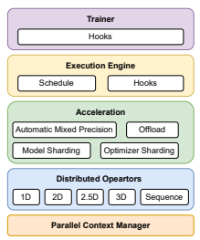

Fig. 1: Architecture of Colossal-AI

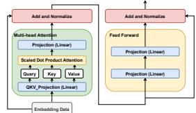

Fig. 2: Architecture of The Transformer Layer

have become the fundamental base model in their respective domains. The typical architecture of a single Transformer layer is shown in Figure 2. The Transformer layer consists of a Multi-head Attention block and a Feed Forward block. There are in total four linear layers in a general Transformer layer represented by the blue rectangles. With the Transformer layer, we can scale the model size along hyper-parameters such as the number of layers, hidden size of the linear layer and the number of attention heads in the Multi-head Attention module. As a result, the model size can easily reach billions of parameters. The sheer increase in the model size brings impressive performance improvement. For example, GPT-3 (175 billion parameters) [4] outperform the state-of-the-art model by 18% absolute increase in prediction accuracy on the LAMBADA language task [17].

As the Transformer architecture allows easy scaling of model size and computing and communication hardware become more robust, AI engineers and researchers have shifted the training paradigm from single-GPU training to distributed training in pursuit of lower time cost. Distributed training allows the deep learning community to engage in training larger models with larger datasets while still maintaining an acceptable job completion time. Various techniques were proposed to accelerate distributed training and they will be discussed below.

## A. Data Parallelism

Data parallelism is the most common form of parallelism due to its simplicity. In data parallel training, the model is replicated across the devices and the dataset is split into several shards. Each dataset shard is allocated to a device and fed to the model on the corresponding device as shown in Figure 3a. As each device has the full set of parameters, it is necessary to synchronize the model weights for every training iteration. Therefore, when the gradients of the parameters are computed during backward propagation, the gradients will be reduced and the optimizer will update the parameters with the synchronized gradients. Data parallelism makes it easy to train and deploy a model and has sub-linear scaling with the number of GPUs due to extra communication overhead.

## B. Model Parallelism

In data parallel training, one prominent feature is that each GPU holds a copy of the whole model weights. However, this makes it tough to fulfill the memory requirement of largescale models, especially when using stateful optimizers such as Adam [18]. The GPU memory becomes the bottleneck when the scale of the model increases. Thus, it is necessary to shard the model parameters so that each device only needs to hold part of the model weights. As a result, model parallelism was proposed to tackle this problem. There are generally three subcategories of model parallelism: tensor parallelism, pipeline parallelism, and sequence parallelism. Pipeline parallelism is to splits the model by layers and each device holds a portion of the layers.

1) Tensor Parallelism Tensor parallelism shards the tensor over an array of devices and requires a distributed matrix-matrix multiplication algorithm for arithmetic computation as shown in Figure 3b. Megatron-LM [12] proposed 1D tensor parallelism which splits the linear layer in the row or column dimensions for the Transformer architecture [19].

Taking the multi-layer perceptron (MLP) module of the Transformer layer as an example, we can see the MLP module as a matrix multiplication of Y = W2W1X as shown in Figure 4, where X is the hidden states, W1 and W2 are the linear layer weights, and Y is the layer output. The activation functions and normalization layers are ignored in Figure 4. In a typical Transformer model, the hidden states is projected to higher dimensions by W1 and then projected back to the original dimension by W2. We can split the matrix W1 in the column dimension and matrix W2 in the row dimension.

This will lead to a partial result of Y on each device. An allreduce operation can be applied on the partial result to obtain the correct final result of the matrix multiplication. The Self- Attention module in the Transformer architecture is computed in a similar distributed fashion.

In this way, each device will hold 1/N of the MLP parameters when training on N devices. This allows the model size to scale with the number of devices and goes beyond the memory capacity of a single device even though extra communication is required between devices to ensure arithmetic correctness.

The current method relies on 1D tensor parallelism proposed by Megatron-LM [12]. However, this method has some drawbacks which hurt the communication and memory efficiency. One of the major problems of this method is that it relies on the all-reduce operation for collective communication. This makes it unfriendly to machines which do not have high-end fully connected NVLinks among the GPUs on a single node. With fully connected high-performance GPU interconnect as shown in Figure 5a, the communication bandwidth between any pair of GPUs is consistently high. However, such high-end hardware is expensive and scarce. Many machines, even those in some of the supercomputing centers, only have partially connected GPUs as shown in Figure 5b. With this kind of GPU topology, the communication bandwidth between distant devices is much lower than that of directly connected GPUs as the communication has to go through the PCIe bus. Therefore, the low communication bandwidth can hinder the efficiency of all-reduce operations in 1D tensor parallelism.

In addition, the 1D tensor parallelism has redundant memory usage in layer inputs and outputs. Taking the MLP layer in the Transformer architecture as an example, the input X and output Y of the MLP layer are duplicated across different devices as shown in Figure 4. Such memory redundancy limits the maximum model size which can be trained on limited hardware resources, and is not helpful with the democratization of large-scale distributed training.

Besides 1D tensor parallelism, more advanced tensor parallelism are introduced for large-scale model training, namely 2D, 2.5D, and 3D tensor parallelism [20]–[22] as shown in Figure 6. These methods applied traditional distributed matrix multiplication for deep learning training and have advantages in memory and communication efficiency. Therefore, they can better cope with different hardware specifications. This provides the user with an option of using the most suitable tensor parallelism technique for their machines.

2D tensor parallelism [20] relies on the SUMMA and Cannon matrix multiplication algorithm [23]–[25] and splits the input data, model weights and layer outputs along two different dimensions. Given N devices, the tensor is split into N chunks and each chunk is owned by one GPU. The GPUs are arranged in a square network topology where each row has 
√N GPUs and there are 
√N rows as shown in Figure 6a. For example, a tensor of shape [P, Q] will be partitioned into a chunk tensor of shape [P/√*N, Q/*√N]. This methods leads to zero memory redundancy as the inputs and outputs are no longer duplicated, leading to much lower memory consumption compared to that of 1D tensor parallelism. To ensure arithmetic correctness, the partial input and weights have communicated among devices via collective communication such as broadcast. Even though 2D tensor parallelism has extra communication overhead for model weights while 1D tensor parallelism does not, 2D tensor parallelism is still more efficient as the amount of data transferred in lower due to finer partitioning scheme when

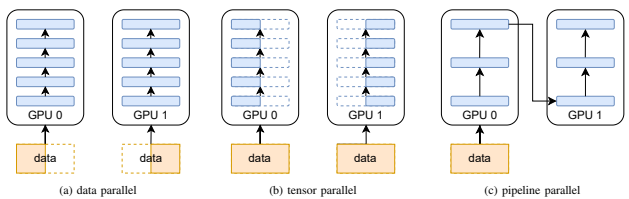

Fig. 3: Existing parallelism for distributed training

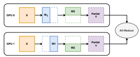

Fig. 4: Megatron-LM MLP Module

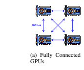

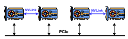

(b) Partially Connected GPUs Fig. 5: Common network topology on GPU compute nodes

scaled to a large number of devices.

2.5D Tesnor Paralleism [21] was inspired by 2.5D matrix multiplication algorithm [26] and proposed to further parallelize 2D tensor parallelism. It adds the optional *depth* dimension of the matrix for parallelization. When *depth* = 1, it is close to 2D tensor parallelism. When *depth >* 1, it partitions the matrix 3 times and adds one more degree of parallelization. Given N devices, the tensor is split in a way such as N = S
2 ∗ D where S is the size of one side of the square and D is the depth of the cube as shown in Figure 6b. S can be calculated if D is given by the user. When scaled to a large number of devices, 2.5D tensor parallelism will be more efficient than 2D tensor parallelism as it further reduces the communication volume.

3D tensor parallelism [22] was proposed based on the 3D matrix multiplication algorithm [27] and integrated into Colossal-AI as well. 3D tensor parallelism splits a tensor in a cubic manner as shown in Figure 6d. As not every tensor has 3 dimensions, we choose to partition the first and last dimension only where the first dimension will be partitioned twice. For example, a tensor of shape [*P, Q*] will be partitioned into a chunk tensor of shape [P/√3 N
2*, Q/*√3 N]. This method achieves the optimal O(N1/3) communication overhead on N
devices, while both computation and memory usage are evenly distributed through optimized load balancing of parameters as well as activations.

As the advanced tensor parallelism methods require different network topology, the user needs to choose the method based on the number of GPUs. 1D method can work with any number of GPUs while 2D, 2.5D and 3D methods require the n 2, a ∗ n 2, and n 3 GPUs respectively, where a and n are positive integers. The user can fall back to 1D tensor parallelism when the number of GPUs does not fulfill the requirement.

These advanced tensor parallelism methods provide lower communication volume when scaling to a larger number of devices [23], [24], [26], [27]. Meanwhile, these methods has better compatibility with pipeline parallelism as it removes the communication overhead between pipeline stages which exist in 1D tensor parallelism. In 1D tensor parallelism proposed by Megatron-LM, the layer activation is duplicated. Therefore, in order to save cross-node communication bandwidth, the tensor is split into chunks before passing to the next pipeline stage and the chunks are gathered with intra-node communication after reaching the target pipeline stage as shown in Figure 7. In contrast, in advanced tensor parallelism methods, the tensor to pass to the next stage is already a sub-chunk of the whole logical tensor. Thus, the split-gather operation is not needed and no extra communication cost is incurred.

## 2) Pipeline Parallelism

Besides tensor parallelism, another sharding scheme is to split the model by layer. Compared to tensor parallelism, pipeline parallelism is more friendly as it does not require changes to the computation flow of a layer, especially for

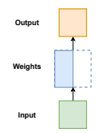

(a) 1D tensor parallelism (b) 2D tensor parallelism (c) 2.5D tensor parallelism (d) 3D tensor parallelism Fig. 6: Tensor Parallelism

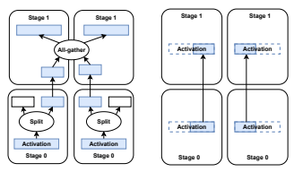

(a) 1D tensor parallelism
(b) 2//2.5/3D tensor parallelism Fig. 7: Data Transfer between Pipeline Stages with tensor parallelism

dynamic-graph based framework like PyTorch [28]. Methods such as PipeDream [29] and GPipe [30] were proposed to split the model into several chunks and each chunk is allocated to a device as shown in Figure 3c. During the forward pass, each device passes the intermediate activation to the next stage and only computes the loss value on the last pipeline stage. During the backward pass, each device passes the gradient of the input tensor back to the previous pipeline stage. The gradients are accumulated for the parameters on each pipeline stage and the parameters are only updated when the pipeline runs out of the micro-batch data. Pipeline parallelism allows multiple devices to compute simultaneously, leading to a higher throughput. It also minimizes the cross-node communication as only activation and gradients are communicated between pipeline stages. One drawback of pipeline parallel training is that there will be some bubble time, where some devices are idle when others are engaged in computation, leading to the waste of computational resources. Current methods such as Chimera [31] uses bidirectional pipelining to reduce the bubble time, achieving the state-of-the-art performance.

## 3) Sequence Parallelism

Tensor parallelism mainly tackles the memory bottleneck brought by model data. However, the non-model data can be the bottleneck in applications such as AlphaFold and document-level text understanding. This is because that these

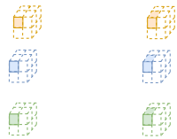

 tasks use data of a long sequence length. As the self-attention mechanism in the Transformer layer is of quadratic complexity with respect to the sequence length, long-sequence data will increase the memory usage consumed by the intermediate activation, limiting the training capability of the devices. Even though the advanced tensor parallelism method can partition the input and activation, the extra communication overhead brought by model parameters is not necessary.

Sequence parallelism [32] is proposed to enable longsequence modeling by breaking the memory wall brought by the large sequence dimension. In sequence parallelism, the model is replicated across devices just like data parallelism.

However, instead of splitting by the batch dimension, the input data is split along the sequence dimension and each device only keeps the sub-sequence. As the data is distributed over the devices, extra communication is required to complete the self-attention calculation. In sequence parallelism, Ring Self Attention module is proposed to exchange the partial query, key and value embeddings.

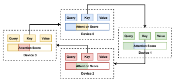

Fig. 8: Attention Score Calculation in Ring Self Attention The self-attention mechanism works by the following for-

mula,

## Attention(Q, K, V ) = Sof Tmax(Qkt/Pdk)V

where Q is the query embedding, K is the key embedding, V is the value embedding, and dk is the dimension of the key embedding. As in sequence parallelism, the query, key and value embeddings are all partitioned by the sequence dimension, thus, we need to communicate the partial embedding in a ring fashion to complete the calculation. Taking the calculation of the attention score as an example, the attention score is obtained by A = *sof tmax*(QKT /
√dk). In the Ring Self Attention module, the key embedding is first multiplied with the query embedding on the local device, and then transferred to the next device for N − 1 times as shown in Figure 8. In this way, the partial attention score with respect to the local sub-sequence can be obtained. The final attention output AV can be calculated in a similar fashion.

Sequence parallelism is orthogonal to Pipeline Parallelism.

Similar to the advanced tensor parallelism, there is no extra communication required between pipeline stages as the layer activation is partitioned by the sequence dimension.

## C. Zero Redundancy Data Parallelism

The methods above mainly tackle the memory challenge brought by the amount of model parameters. However, model parameters only form a part of the memory consumption during training. Among the the model data, optimizer states can take up a more significant proportion of memory consumption. When using stateful optimizers such as Adam [18], the optimizer states (i.e. momentum and variance) can occupy three times larger memory space compared to that occupied by the model parameters [18], [33].

In data parallel training on N devices, there are N copies of model parameters, gradients and optimizer states. To eliminate such redundancy, Zero Redundancy Optimizer was proposed in DeepSpeed [16] to partition these redundant model data over different devices. Zero Redundancy Optimizer has three stages, which adds optimizer states, gradients, and model parameters to the partitioning scheme stage by stage. Taking the last stage as an example, each device only holds a 1/N of model data and updates only the partition of parameters owned by the corresponding device. As all the model data are partitioned, collective communication is required in the forward and backward passes. In the forward pass, all-gather is required to gather the partitioned model weights to compute the intermediate activation and the model output. During the backward, the model weights are gather again to compute the gradients. The partitioned gradients are then reduced to their respective devices. As each device only holds a partition of gradients and parameters, it will only update the partitioned parameters instead of the full model parameters. As this method is an enhancement of the data parallel training, it remains orthogonal to model parallelism and can be integrated with model parallelism to support larger models.

## D. Heterogeneous Training

While efforts are paid to better utilize the computing power of GPUs, it is often neglected that the CPU memory has larger capacity than the GPU memory in general. Therefore, the CPU memory can be essential in breaking the memory constraints in deep learning training. For example, on a typical Nvidia DGX1 workstation with 8 Tesla V100 GPUs, the aggregated GPU memory is 256 GB per node while the CPU memory is 512 GB. If the CPU memory can be utilized for model training, the model size can be simply scaled up. In addition, as NVMe Solid State Disks (SSD) has relatively high communication bandwidth compared to traditional Hard Disk Drive (HDD), the NVMe SSD can be used to accommodate the model data as well, further increasing the training capacity of a single node.

DeepSpeed proposed zero-offload [34] which moves the tensors from GPU to CPU or NVMe disks when not in use to make room for larger models. By utilizing high-performance heterogeneous storage devices and constantly swapping tensors between different hardware devices, it became possible to train a model with billions of parameters on a single GPU. This is especially friendly to the users with limited computing resources and essential for the democratization of large-scale model training.

## Iii. Design

With the rapid development of computing resources in the past decade, the hardware specifications have become diverse across supercomputing centers and research labs. This makes it difficult to have a universal method which yields consistently satisfactory acceleration to deep learning training due to the large variance in the hardware conditions. Such problems can be met by Megatron-LM and DeepSpeed as well. In contrast, Colossal-AI is featured by an array of acceleration techniques which are constructed in a modular way. This arsenal of acceleration techniques can cover a wide range of training settings to achieve maximal performance. In this section, we will discuss the implementation and analysis of the acceleration techniques integrated in Colossal-AI.

| Mode   | Total Communication Volume   |        |          |
|--------|------------------------------|--------|----------|
|        | /  of transferred            | number | elements |
| 1D     | 2(p − 1) ∗ Sx                |        |          |
| 2D     | 3(j − 1) ∗ (Sx + Sw)         |        |          |
| 2.5D   | 3(k − 1) ∗ (Sx/d + Sw)       |        |          |
| 3D     | 2(l − 1)/l ∗ (Sx  + Sw + Sy) |        |          |

TABLE I: System Specification for Experiments

## A. Multi-Dimensional Model Parallelism

As mentioned in the Background section, model parallelism is an important technique in distributed training as it reduces the memory burden on a single GPU. Thus, it allows the model size to scale to billions of parameters with an increasing number of devices. Colossal-AI provides an array of model parallelism methods to cater to the needs of distributed training.

One major feature of the Transformer model is that its architecture heavily replies on the linear layer. As tensor parallelism is mainly applied to matrix-matrix multiplication, it is highly suitable for the acceleration of Transformer model training. In Colossal-AI, all existing tensor parallelism methods are

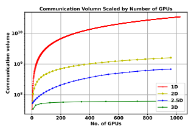

Fig. 9: Scaling Performance of Tensor Parallelism in Theoretic Analysis (h = 1024, s = 512, b = 32)

supported so that the user can choose one method based on their training requirements and the number of GPUs.

Among all tensor parallelism methods, one prominent advantage of the advanced tensor parallelism, namely 2D, 2.5D and 3D tensor parallelism, is that it has lower communication cost compared to 1D tensor parallelism. Table I has shown the total communication volume when computing a matrix multiplication Y = W X where X is of shape (*b, s, h*), W is of shape (*h, h*) and Y is of shape (*b, h*). In Table I, the following notations are used.

- p: the total number of GPUs
- j: the number of GPUs in one side of the sqaure-shaped network topology as shown in Figure 6b, where p = j 2
- k: the number of GPUs in one side of front square of the sqaure-shaped network topology as shown in Figure 6c, where p = d ∗ k 2
- d: the number of GPUs in the depth dimension of the cuboid-shaped network topology as shown in the Figure 6c
- l: the number of GPUs in one side of the cube-shaped network topology as shown in Figure 6d, where p = l 3
- Sx: the number of elements in the input matrix X, the same semantic is applied to SW and SY .

- b: batch size of the input matrix X. - s: the sequence length of the input matrix X. - h: the hidden size of the weight W.

As shown in Figure 9, the communication volume of the advanced tensor parallelism is significantly lower than that of 1D tensor parallelism, especially when a large number of nodes is used. The underlying reason for communication efficiency is that advanced tensor parallelism only incur communication on a sub-group of the computing nodes. For example, in 2D parallelism, collective communication only involve the nodes in one row or one column of the square-shaped network. In contrast, 1D tensor parallelism involves all computing nodes for one collective communication call. Therefore, advanced tensor parallelism allows scaling beyond one node while 1D tensor parallelism is often restricted to intra-node computing.

Besides tensor parallelism, Colossal-AI has also included sequence parallelism and pipeline parallelism so that hybrid parallelism is available to accelerate model training in largescale clusters.

#### B. Enhanced Sharding And Offloading

DeepSpeed provides support for zero redundancy training and offloading. Zero redundancy training eliminates memory redundancy by partitioning model parameters, gradients and optimizer states. Offloading utilizes the CPU memory and NVMe disks to enlarge the storage space available for largescale models. However, the unnecessarily complex implementation makes DeepSpeed less efficient and extensible. Therefore, we have re-designed the sharding and offloading module for better performance. For zero redundancy data parallel training, we have defined a unified sharded tensor interface. The tensor partitioning can be supported by customizable sharding strategies. This allows the model data and optimizer data to be sharded in a common way with loose coupling. The training workflow can be easily modified with userdefined life-cycle hooks as well. In this way, we can not only implement DeepSpeed's zero redundancy mechanism, but also make space for more optimization at different granularity. In Colossal-AI, we integrated extra optimizations proposed by PatrickStar [33] for the memory space thanks to the extensible design.

The first optimization is that we re-use the fp16 storage space in the memory so that larger models can be trained. In forward pass, we hold fp16 parameters and there are no gradients. In backward pass, fp16 parameters are used to compute gradients. When gradients are completely computed, fp16 parameters are never needed. Then we can save fp16 gradients in the storage space which holds fp16 parameters during forward and backward pass. This process is streamed at the granularity of the sub-module. This can further reduce redundancy and peak memory usage as shown in Figure 10. In this way, the CPU memory can afford to accommodate larger models.

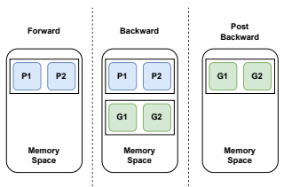

Fig. 10: Memory Space Reuse

The second optimization is adaptive hybrid Adam optimizer.

DeepSpeed uses CPU Adam for optimizer operations when offloading is enabled. All parameters are offloaded and updated in the CPU memory. In contrast, Colossal-AI's hybrid Adam optimizer monitors the available memory space on the GPU. It will keep part of parameters and gradients on the GPU as long as there is space left. In this way, parameters are updated on both CPU and GPU, leading to lower time cost.

As offloading requires tensor swapping between different devices via the PCIe, there is extra communication overhead incurred. However, this creates more memory space available for model training. This essentially brings two benefits, 1) given a constant size of the input data, larger models can be accommodated in the GPU and larger models can bring better prediction performance. 2) given a constant size of the model, larger batch size can be used so that training throughput can be improved despite extra communication over the PCIe.

3 parallel = dict( 4 tensor=dict(size=4, mode='1d') 5 )
Listing 1: Configuration file 3) User-Friendliness: To minimize the change to the user code, Colossal-AI provides user-friendly APIs for model training. The user only needs to prepare a configuration file as shown in Listing 1. The configuration file is a simple Python file which specifies the features by following a pre-defined schema. Colossal-AI will then inject the acceleration features into the execution engine with 'colossalai.initialize' as shown in Listing 1.

Colossal-AI also provides parallelized popular model components which the users can use directly on handy. This does

## Iv. Implementation

not require the users to have domain expertise so that they do not have to manually design their parallelism strategy like Colossal-AI is a deep learning system implemented with PyTorch. The overall architecture of Colossal-AI is shown in Figure 1. The fundamental component of the Colossal-AI is the parallel context manager. It is in charge of storing the meta information about the complex hybrid parallel distributed environment such as distributed network topology. Based on the parallel context, the distributed operators will automatically switch to the corresponding parallel mode. For example, if the parallel context specifies to use 1D tensor parallelism, the computation flow of the linear layer will be modified to include row-splitting and column-splitting matrix multiplication like Figure 4 during runtime. In this way, it is easy to build a tensor-parallel model easily as the complex computation and communication workflow is hidden from the user and separated from the model building process. The user can use these operators like native PyTorch operators to construct their model which will execute the parallel computation graph during runtime. One layer above lies the various acceleration tools. The basic tools include activation checkpointing, mixed precision training and so on. More advanced ones will be optimized sharding and offloading for large-scale model training. Lastly, the execution engine takes control of the training process and the trainer provides a higher-level APIs to start training in lines. These two components provide great extensibility for user customization as they can define their own training schedule and hooks at the operator or trainer level.

1) Modularity: The principle of modularity and extensibility is upheld throughout the development and the different acceleration techniques can easily be combined in pursuit of maximal performance.

2) Extensibility: As a system under constant development, Colossal-AI provides various interfaces to implement customized functions for future extensions. For example, the sharding module allows the user to define their own sharding strategy and life-cycle hooks in order in an attempt to explore more efficient training methods.

GShard [13].

1 import colossalai 2 3 \# launch distributed network 4 colossalai.launch_from_torch(config='./config.py')
5 6 \# define your training components 7 ...

8 9 \# initialize with Colossal-AI
10 engine, trainloader, testloader, lr_scheduler = \ 11 colossalai.initialize(model, 12 optimizer, 13 criterion, 14 trainloader, 15 testloader, 16 lr_scheduler)
17 18 \# run training 19 for data, label in train_dataloader: 20 data = data.cuda() 21 label = label.cuda() 22 engine.zero_grad() 23 output = engine(data) 24 train_loss = engine.criterion(output, label) 25 engine.backward(train_loss) 26 engine.step() 27 lr_scheduler.step()
Listing 2: Colossal-AI Usage V. EVALUATION
A. Experiment Setup To holistically evaluate the system performance of Colossal-
AI, we have conducted various experiments on different hardware. The system specification is listed in Table II. Due to resource constraints, we only tested a portion of the prominent features on each system as stated in the *Experiment Item* column.

We used Megatron-LM and DeepSpeed as our baselines for experiments. As Megatron-LM tensor parallelism has been implemented in Colossal-AI, it will be annotated as 1D tensor parallelism in the experiment results.

1 # specify using 1D tensor parallelism 2 # with parallel size 4

| System  ID   | #GPUs  per  node   | #Nodes   | GPU Model          | GPU Interconnect   | Cross\-node Interconnect                                                         | Experiment Item                            |
|--------------|--------------------|----------|--------------------|--------------------|----------------------------------------------------------------------------------|--------------------------------------------|
| I            | 8                  | 1        | Nvidia A100 (80GB) | NVlink             | N/A                                                                              | Tensor Parallelism                         |
| II           | 8                  | 1        | Nvidia A100 (80GB) | NVlink between adja cent GPUs, PCIe be tween distant GPUs                    | N/A                                                                              | Tensor Parallelism, ZeRO                   |
| III          | 4                  | 16       | Nvidia A100 (40GB) | NVLink             | InfiniBand  HDR  (200Gb/s), and Dragonfly  network topology                      | Tensor  Parallelism,  Sequence Parallelism |
| IV           | 1                  | 64       | Nvidia P100 (16GB) | RDMA               | Cray Aries routing and  communications  ASIC,  and  Dragonfly  network  topology | Tensor Parallelism                         |

TABLE II: System Specification for Experiments

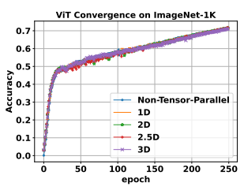

Fig. 11: Convergence Performance of ViT on ImageNet

## B. Multi-Dimensional Tensor Parallelism 1) Convergence

We have conducted experiments with Vision Transformer
(ViT) [2] on the ImageNet-1k dataset to verify the arithmetic correctness and numerical stability of multi-dimensional tensor parallelism on System III. The ViT model is configured to have 12 Transformer layers with hidden size of 384 and 6 attention heads. We used Jax initialization and AdamW optimizer with 0.003 learning rate and 0.3 weight decay. The input image is of shape 224 and the patch size is 16. The global batch size is 4k and the model is trained for 250 epochs. The baseline is model training with Data Parallelism as each device maintains the complete computation graph. As shown in Figure 11, the testing accuracy curves of Multi- Dimensional tensor parallelism align with that of the baseline, demonstrating that the Multi-Dimensional tensor parallelism does not affect model convergence.

## 2) Memory Efficiency

As 2D, 2.5D, 3D tensor parallelisms partition the input data, layer weight, and output activation while 1D tensor parallelism only partitions the layer weight, the former is expected to have lower memory consumption. As a result, the first three methods allow the GPUs to accommodate larger models. To demonstrate the memory-efficiency, we have conducted two range tests which scale by batch size and hidden size on System I. In this range test, we created a model which consists of two linear layers. We run 1D, 2D and 2.5D experiments on 4 GPUs and 1D, 2.5D (depth=2), and 3D experiments on 8 GPUs. We measure the max allocated CUDA memory during the forward and backward pass, and the results are shown in Figure 12. The memory consumption of 1D tensor parallelism is much higher than those of 2D, 2.5D, and 3D tensor parallelism. With batch size equal to 512 and 8 GPUs, the memory consumption of 2.5D and 3D is 44% and 65% lower than that of 1D tensor parallelism respectively in Figure 12b. With hidden size of 16384 and 8 GPUs, the memory performance of 2.5D and 3D tensor parallelism is 62% and 74.2% better than that of 1D tensor parallelism respectively in Figure 12d. Therefore, more advanced tensor parallelism is a better option when scaling to super large-scale models.

## 3) Hardware Compatibility

To further explore the performance of the various tensor parallelism methods, we have conducted experiments on System I and II to investigate the impact of GPU interconnect on the performance of tensor parallelism. System I and System II were selected for experiments as the former have fully connected NVLink between any pair of GPUs as shown in Figure 5a while the latter only has NVLink between 4 pairs of adjacent GPUs as shown in Figure 5b. The communication bandwidth of System I is consistently high regardless of whether it is measured for a pair of GPUs or a group of GPUs as shown in Figure 13. However, the communication bandwidth drops significantly from 184 GB/s to 15 GB/s when the communication occurs among non-adjacent GPUs as only adjacent GPUs have high-performance NVLink.

The GPU topology of System II is therefore not friendly to 1D tensor parallelism which relies on all-reduce operations across all the GPUs via PCIe. Instead, the 2D and 2.5D only have communication between a pair of GPUs instead of across all GPUs. This allows part of the communication to still utilize the high NVLink bandwidth between adjacent GPUs.

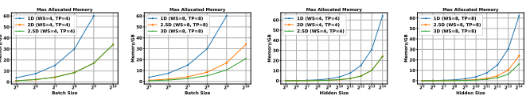

Memory/G
14

(a) 4 GPUs by Batch Size
(d) 8 GPUs by Hidden Size Fig. 12: Range Test for Memory Consumption of Tensor Parallelism with 4/8 GPUs
(b) 8 GPUs by Batch Size
(c) 4 GPUs by Hidden Size

| #GPUs   | Mode           | #Transformer Layer   | Hidden Size   | #Attention Heads   | Batch Size   | Throughput   | Speedup over 1D   |
|---------|----------------|----------------------|---------------|--------------------|--------------|--------------|-------------------|
|         |                |                      |               |                    |              | (img/sec)    | (%)               |
|         | 1D             |                      |               |                    | 128          | 5.06         | \-                |
| 4       | 2D             | 24                   | 2048          | 32                 | 256          | 6.18         | 22.1              |
|         | 2.5D (depth=1) |                      |               |                    | 256          | 6.73         | 33.0              |
|         | 1D             |                      |               |                    | 256          | 7.46         | \-                |
| 8       | 2.5D (depth=2) | 24                   | 2048          | 32                 | 384          | 6.57         | \-11.9            |
|         | 3D             |                      |               |                    | 512          | 8.38         | 12.3              |
|         | 1D             |                      |               |                    | 64           | 3.42         | \-                |
| 16      | 2D             | 32                   | 4096          | 64                 | 256          | 5.33         | 55.8              |
|         | 2.5D (depth=1) |                      |               |                    | 256          | 5.46         | 59.6              |
|         | 1D             |                      |               |                    | 128          | 4.22         | \-                |
| 32      | 2.5D (depth=2) | 32                   | 4096          | 64                 | 256          | 5.46         | 50.6              |
|         | 1D             |                      |               |                    | 128          | 4.63         | \-                |
|         | 2D             |                      |               |                    | 512          | 12.76        | 275.5             |
| 64      | 2.5D (depth=4) | 32                   | 4096          | 64                 | 512          | 4.93         | 6.5               |
|         | 3D             |                      |               |                    | 512          | 8.63         | 86.4              |

TABLE III: Performance of Tensor Parallelism with Different Number of GPUs

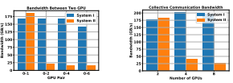

(a) Communication Bandwidth between GPU Pairs
(b) Communication Bandwidth for Collective Communication Fig. 13: Communication Bandwidth on System I and II (broadcasting 125 MB data using the NCCL Bandwidth Test tool)

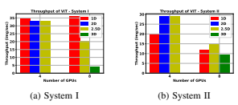

Fig. 14: Throughput of ViT Training on System I and II

We trained ViT on the ImageNet-1k dataset with different configurations for 4 GPUs and 8 GPUs on both System I and II. On 4 GPUs, the ViT model has 64 Transformer layers with hidden size of 3072 and 48 attention heads. On 8 GPUs, the hidden size and the number of attention heads are adjusted to 4096 and 64 respectively as there is more memory available.

The model is trained with different batch size settings until the out-of-memory problem occurs. As such, we present the best throughput for each tensor parallelism method. In Figure 14a, the throughput of 2D, 2.5D, and 3D tensor parallelism cannot compete with 1D tensor parallelism on both 4 GPUs and 8 GPUs. This is expected for two reasons. The first reason is that 1D tensor parallelism can utilize the high communication bandwidth with all GPUs involved on System I. The second reason is that 2D, 2.5D, and 3D tensor parallelism have more communication volume with a small number of processors and will only surpass 1D tensor parallelism when the number of processors increases.

However, when the experiment is switched to System II in Figure 14b, 1D tensor parallelism will encounter bottleneck due to the low communication bandwidth in collective communication across 4 and 8 GPUs. Meanwhile, 2D and 2.5D can deliver a throughput which is 40% higher than that of 1D tensor parallelism with 4 GPUs. With 8 GPUs, 2.5D tensor parallelism can still outperform 1D tensor parallelism by 20.6%. 3D tensor parallelism still delivers lower performance than 1D tensor parallelism due to the low scaling.

## 4) Throughput Comparison

To test the performance of tensor parallelism with more GPUs, we trained ViT on the System IV. As System IV only has 16 GB GPU memory, therefore, we adjusted the configuration of the ViT model accordingly. The model is set to have 24 layers with hidden size of 2048 and 32 attention heads for 4 and 8 GPUs. From 16 GPUs onwards, the model is set to have 32 layers with hidden size of 4096 and 64 attention heads.

The results for 4 to 64 GPUs are shown in Table III.

It can be observed that as the number of GPUs increases, the speedup of advanced tensor parallelism over 1D tensor parallelism increases up to 2.76. This can be attributed to the lower communication volume of advanced tensor parallelism methods when scaling to more processors. Together with memory efficiency and low communication volume, 2D, 2.5D, and 3D tensor parallelism is a better option for large-scale distributed training.

## C. Sequence Parallelism

In this section, we compare Sequence Parallelism with 1D tensor parallelism to demonstrate its advantages in terms of memory efficiency and training throughput. As Sequence Parallelism is designed for situations where memory consumed by activations is larger than that consumed by model-data, BERT-Base is chosen as our experiment model and trained on the Wikipedia dataset [35]. We conducted the experiments on System III. It should be noted that 1D tensor parallelism requires the number of attention heads (12) is divisible by the parallel size, we can only use 4, 6, and 12 GPUs where the 6-GPU experiment uses 2 nodes and 3 GPUs from each node. Meanwhile, Sequence Parallelism is not limited by the number of attention heads, thus we conducted experiments on 4, 8, and 12 GPUs.

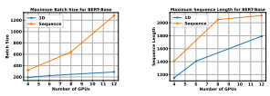

(b) Max Sequence Length Fig. 15: Memory Efficiency of Sequence Parallelism over 1D Tensor Parallelism
(a) Max Batch Size

## 1) Memory Efficiency

To illustrate the memory efficiency of Sequence Parallelism in BERT training, we increase the batch size and sequence length until the out-of-memory problem occurs for both 1D
tensor parallelism and Sequence Parallelism. The sequence length is fixed at 512 for the batch size test while the batch size is fixed at 64 for the sequence length test.

As shown in Figure 15a, Sequence Parallelism can constantly reach larger batch size than 1D tensor parallelism. This is because that 1D tensor parallelism has memory bottleneck in the duplicated activations where the activation is split along the sequence dimension in Sequence Parallelism. The maximum batch size of Sequence Parallelism is 4.44 times larger than that of the 1D tensor parallelism with 12 GPUs. The same pattern can be observed in the maximum sequence length test as well as shown in Figure 15b, which re-affirms the superiority of Sequence Parallelism in terms of memory efficiency. The maximum sequence lenght of Sequence Parallelism is 1.18 times larger than that of As the self-attention module in the BERT-Base model is of quadratic complexity with respect to sequence length, the maximum sequence length can only scale sub-linearly with the number of GPUs. If linear-complexity self-attention modules [36], [37] is used, Sequence Parallelism can achieve linear scaling of maximum sequence length with the number of GPUs, better supporting document-level text understanding.

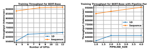

(a) Wihtout Pipeline

(b) With Pipeline

Fig. 16: Training Throughput of BERT-Base

2) Throughput Comparison To evaluate the training speed of Sequence Parallelism, we trained BERT-Base with sequence length of 512 and its maximum batch size. The metric for throughput is tokens per second. As shown in Figure 16a, Sequence Parallelism constantly delivers higher training throughput and the throughput of Sequence Parallelism is 1.43 times higher than that of 1D tensor parallelism.

As mentioned in the design section, Sequence Parallelism is naturally compatible with Pipeline Parallelism and requires no extra communication between pipeline stages. We further scaled the training with Pipeline Parallelism. The parallel size for both Sequence and 1D tensor parallelism is fixed at 4 and we scale the number of pipeline stages from 1 to 4. As shown in Figure 16b, Sequence Parallelism can train 1.55 times faster than 1D tensor parallelism with 4 pipeline stages, which provides 12% extra speedup to the non-pipeline results.

## D. Sharding And Offloading

In this section, we evaluated our own sharding and offloading module against DeepSpeed. We used DeepSpeed Stage 3 as the baseline, which partitions model parameters, gradients and optimizer states in data parallel training. Both Colossal-AI and DeepSpeed offload the optimizer data to the CPU memory. We trained GPT-2 model with 10 billion of parameters on the Wikipedia dataset on System II. We scale the data parallel training from 1 GPU to 8 GPU and observe the training throughput with batch size equal to 4.

With the extra optimization discussed in Section III-B,
Colossal-AI is 2.33 times faster than DeepSpeed on 8 GPUs as shown in Figure 17.

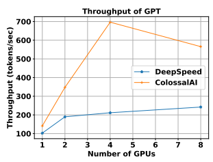

 

Fig. 17: Throughput of GPT Training with Sharding and Offloading

## Vi. Conclusion

In this work, we designed and implemented Colossal-AI
which integrated a vast number of advanced acceleration techniques into one unified system for large-scale distributed training. Colossal-AI comes with flexible system design which supports easy combination of different parallelism methods and allows for easy extension by the developers and users. In addition, its acceleration techniques provide robust performance under different hardware conditions and deliver superior performance compared to the baseline systems. In our experiments, we have demonstrated the advantages of Colossal-AI over Megatron-LM and DeepSpeed. 2.5D and 3D tensor parallelism can save up to 62% and 74.2% memory usage compared to Megatron-LM 1D tensor parallelism when scaling the hidden size of 2-layer MLP to 16384. When scaling to 64 GPUs, 2D tensor parallelism can outperform Megatron-LM 1D tensor parallelism by 276%. For middlesize models with a large amount of activations such as BERT- Base, sequence parallelism can deliver 1.43 times higher training throughput than 1D tensor parallelism. Our re-designed sharding and offloading module can by 2.33 times faster than DeepSpeed on GPT-2.

## References

[1] J. Devlin, M.-W. Chang, K. Lee, and K. Toutanova, "Bert: Pre-training of deep bidirectional transformers for language understanding," *arXiv* preprint arXiv:1810.04805, 2018.

[2] A. Dosovitskiy, L. Beyer, A. Kolesnikov, D. Weissenborn, X. Zhai, T. Unterthiner, M. Dehghani, M. Minderer, G. Heigold, S. Gelly *et al.*, "An image is worth 16x16 words: Transformers for image recognition at scale," *arXiv preprint arXiv:2010.11929*, 2020.

[3] A. Radford, J. Wu, R. Child, D. Luan, D. Amodei, and I. Sutskever,
"Language models are unsupervised multitask learners," 2019.

[4] T. B. Brown, B. Mann, N. Ryder, M. Subbiah, J. Kaplan, P. Dhariwal, A. Neelakantan, P. Shyam, G. Sastry, A. Askell *et al.*, "Language models are few-shot learners," *arXiv preprint arXiv:2005.14165*, 2020.

[5] Z. Du, Y. Qian, X. Liu, M. Ding, J. Qiu, Z. Yang, and J. Tang, "All nlp tasks are generation tasks: A general pretraining framework," *arXiv*
[6] J. Duchi, E. Hazan, and Y. Singer, "Adaptive subgradient methods for online learning and stochastic optimization." *Journal of machine* learning research, vol. 12, no. 7, 2011.

[7] D. P. Kingma and J. Ba, "Adam: A method for stochastic optimization,"
arXiv preprint arXiv:1412.6980, 2014.

[8] K. He, X. Zhang, S. Ren, and J. Sun, "Deep residual learning for image recognition," in 2016 IEEE Conference on Computer Vision and Pattern Recognition (CVPR), 2016, pp. 770–778.

[9] T. Chen, B. Xu, C. Zhang, and C. Guestrin, "Training deep nets with sublinear memory cost," 2016. [Online]. Available: https://arxiv.org/abs/1604.06174
[10] Y. Huang, Y. Cheng, A. Bapna, O. Firat, D. Chen, M. Chen, H. Lee, J. Ngiam, Q. V. Le, Y. Wu, and z. Chen, "Gpipe: Efficient training of giant neural networks using pipeline parallelism," in *Advances in Neural Information Processing Systems*, H. Wallach, H. Larochelle, A. Beygelzimer, F. d'Alche-Buc, ´ E. Fox, and R. Garnett, Eds., vol. 32. Curran Associates, Inc., 2019. [Online]. Available: https://proceedings.neurips.cc/paper/ 2019/file/093f65e080a295f8076b1c5722a46aa2-Paper.pdf
[11] D. Narayanan, A. Harlap, A. Phanishayee, V. Seshadri, N. R. Devanur, G. R. Ganger, P. B. Gibbons, and M. Zaharia, "Pipedream: Generalized pipeline parallelism for dnn training," in Proceedings of the 27th ACM Symposium on Operating Systems Principles, ser. SOSP '19. New York, NY, USA: Association for Computing Machinery, 2019, p. 1–15. [Online]. Available: https://doi.org/10.1145/3341301.3359646
[12] M. Shoeybi, M. Patwary, R. Puri, P. LeGresley, J. Casper, and B. Catanzaro, "Megatron-lm: Training multi-billion parameter language models using model parallelism," *arXiv preprint arXiv:1909.08053*, 2019.

[13] D. Lepikhin, H. Lee, Y. Xu, D. Chen, O. Firat, Y. Huang, M. Krikun, N. Shazeer, and Z. Chen, "{GS}hard: Scaling giant models with conditional computation and automatic sharding," in *International* Conference on Learning Representations, 2021. [Online]. Available: https://openreview.net/forum?id=qrwe7XHTmYb
[14] M. Baines, S. Bhosale, V. Caggiano, N. Goyal, S. Goyal, M. Ott, B. Lefaudeux, V. Liptchinsky, M. Rabbat, S. Sheiffer, A. Sridhar, and M. Xu, "Fairscale: A general purpose modular pytorch library for high performance and large scale training," https://github.com/ facebookresearch/fairscale, 2021.

[15] D. Narayanan, M. Shoeybi, J. Casper, P. LeGresley, M. Patwary, V. Korthikanti, D. Vainbrand, P. Kashinkunti, J. Bernauer, B. Catanzaro, A. Phanishayee, and M. Zaharia, "Efficient large-scale language model training on gpu clusters using megatron-lm," in Proceedings of the International Conference for High Performance Computing, Networking, Storage and Analysis, ser. SC '21. New York, NY, USA: Association for Computing Machinery, 2021. [Online]. Available: https://doi.org/10.1145/3458817.3476209
[16] J. Rasley, S. Rajbhandari, O. Ruwase, and Y. He, "Deepspeed: System optimizations enable training deep learning models with over 100 billion parameters," in *Proceedings of the 26th ACM SIGKDD International* Conference on Knowledge Discovery & Data Mining, 2020, pp. 3505– 3506.

[17] D. Paperno, G. Kruszewski, A. Lazaridou, Q. Pham, R. Bernardi, S. Pezzelle, M. Baroni, G. Boleda, and R. Fernandez, "The lambada ´ dataset: Word prediction requiring a broad discourse context," 06 2016, pp. 1525–1534.

[18] D. Kingma and J. Ba, "Adam: A method for stochastic optimization,"
International Conference on Learning Representations, 12 2014.

[19] A. Vaswani, N. Shazeer, N. Parmar, J. Uszkoreit, L. Jones, A. N.

Gomez, L. u. Kaiser, and I. Polosukhin, "Attention is all you need," in *Advances in Neural Information Processing Systems*, I. Guyon, U. V. Luxburg, S. Bengio, H. Wallach, R. Fergus, S. Vishwanathan, and R. Garnett, Eds., vol. 30. Curran Associates, Inc., 2017. [Online]. Available: https://proceedings.neurips.cc/paper/ 2017/file/3f5ee243547dee91fbd053c1c4a845aa-Paper.pdf
[20] Q. Xu, S. Li, C. Gong, and Y. You, "An efficient 2d method for training super-large deep learning models," *arXiv preprint arXiv:2104.05343*, 2021.

[21] B. Wang, Q. Xu, Z. Bian, and Y. You, "2.5-dimensional distributed model training," *arXiv preprint arXiv:2105.14500*, 2021.

[22] Z. Bian, Q. Xu, B. Wang, and Y. You, "Maximizing parallelism in distributed training for huge neural networks," arXiv preprint arXiv:2105.14450, 2021.

[23] L. E. Cannon, A cellular computer to implement the Kalman filter algorithm. Montana State University, 1969.

preprint arXiv:2103.10360, 2021.
[24] J. Berntsen, "Communication efficient matrix multiplication on hypercubes," *Parallel computing*, vol. 12, no. 3, pp. 335–342, 1989.

[25] R. A. van de Geijn and J. Watts, "Summa: Scalable universal matrix multiplication algorithm," USA, Tech. Rep., 1995.

[26] E. Solomonik and J. Demmel, "Communication-optimal parallel 2.5d matrix multiplication and lu factorization algorithms," in *Euro-Par*, 2011.

[27] R. C. Agarwal, S. M. Balle, F. G. Gustavson, M. Joshi, and P. Palkar,
"A three-dimensional approach to parallel matrix multiplication," IBM Journal of Research and Development, vol. 39, no. 5, pp. 575–582, 1995.

[28] A. Paszke, S. Gross, F. Massa, A. Lerer, J. Bradbury, G. Chanan, T. Killeen, Z. Lin, N. Gimelshein, L. Antiga, A. Desmaison, A. Kopf, E. Yang, Z. DeVito, M. Raison, A. Tejani, S. Chilamkurthy, B. Steiner, L. Fang, J. Bai, and S. Chintala, "Pytorch: An imperative style, high-performance deep learning library," in Advances in Neural Information Processing Systems 32, H. Wallach, H. Larochelle, A. Beygelzimer, F. d'Alche-Buc, E. Fox, and ´ R. Garnett, Eds. Curran Associates, Inc., 2019, pp. 8024– 8035. [Online]. Available: http://papers.neurips.cc/paper/9015-pytorchan-imperative-style-high-performance-deep-learning-library.pdf
[29] D. Narayanan, A. Harlap, A. Phanishayee, V. Seshadri, N. R. Devanur, G. R. Ganger, P. B. Gibbons, and M. Zaharia, "Pipedream: Generalized pipeline parallelism for dnn training," in Proceedings of the 27th ACM Symposium on Operating Systems Principles, ser. SOSP '19. New York, NY, USA: Association for Computing Machinery, 2019, p. 1–15. [Online]. Available: https://doi.org/10.1145/3341301.3359646
[30] Y. Huang, Y. Cheng, A. Bapna, O. Firat, M. X. Chen, D. Chen, H. Lee, J. Ngiam, Q. V. Le, Y. Wu, and Z. Chen, *GPipe: Efficient Training of* Giant Neural Networks Using Pipeline Parallelism. Red Hook, NY, USA: Curran Associates Inc., 2019.

[31] S. Li and T. Hoefler, "Chimera: Efficiently training large-scale neural networks with bidirectional pipelines," in Proceedings of the International Conference for High Performance Computing, Networking, Storage and Analysis, ser. SC '21. New York, NY, USA: Association for Computing Machinery, 2021. [Online]. Available: https://doi.org/10.1145/3458817.3476145
[32] S. Li, F. Xue, Y. Li, and Y. You, "Sequence parallelism: Long sequence training from system perspective," 2021. [Online]. Available: https://arxiv.org/abs/2105.13120
[33] J. Fang, Y. Yu, Z. Zhu, S. Li, Y. You, and J. Zhou, "Patrickstar: Parallel training of pre-trained models via chunk-based memory management,"
2021. [Online]. Available: https://arxiv.org/abs/2108.05818
[34] J. Ren, S. Rajbhandari, R. Y. Aminabadi, O. Ruwase, S. Yang, M. Zhang, D. Li, and Y. He, "Zero-offload: Democratizing billion-scale model training," 2021.

[35] W. Foundation. Wikimedia downloads. [Online]. Available: https:
//dumps.wikimedia.org
[36] S. Wang, B. Li, M. Khabsa, H. Fang, and H. Ma, "Linformer: Selfattention with linear complexity," *arXiv preprint arXiv:2006.04768*, 2020.

[37] M. Zaheer, G. Guruganesh, K. A. Dubey, J. Ainslie, C. Alberti, S. Ontanon, P. Pham, A. Ravula, Q. Wang, L. Yang, and A. Ahmed, "Big bird: Transformers for longer sequences," in Advances in Neural Information Processing Systems, H. Larochelle, M. Ranzato, R. Hadsell, M. F. Balcan, and H. Lin, Eds., vol. 33. Curran Associates, Inc., 2020, pp. 17 283–17 297. [Online]. Available: https://proceedings.neurips.cc/ paper/2020/file/c8512d142a2d849725f31a9a7a361ab9-Paper.pdf