# Oneflow**: Redesign The Distributed Deep Learning Framework From Scratch**

Jinhui Yuan 1 Xinqi Li 1 Cheng Cheng 1 Juncheng Liu 1 Ran Guo 1 Shenghang Cai 1 Chi Yao 1 **Fei Yang** 2 Xiaodong Yi 3 Chuan Wu 3 Haoran Zhang 4 **Jie Zhao** 5

## A**Bstract**

Deep learning frameworks such as TensorFlow and PyTorch provide a productive interface for expressing and training a deep neural network (DNN) model on a single device or using data parallelism. Still, they may not be flexible or efficient enough in training emerging large models on distributed devices, which require more sophisticated parallelism beyond data parallelism. Plugins or wrappers have been developed to strengthen these frameworks for model or pipeline parallelism, but they complicate the usage and implementation of distributed deep learning. Aiming at a simple, neat redesign of distributed deep learning frameworks for various parallelism paradigms, we present *OneFlow*, a novel distributed training framework based on an SBP (split, *broadcast* and *partial-value*) abstraction and the actor model. SBP enables much easier programming of data parallelism and model parallelism than existing frameworks, and the actor model provides a succinct runtime mechanism to manage the complex dependencies imposed by resource constraints, data movement and computation in distributed deep learning. We demonstrate the general applicability and efficiency of *OneFlow* for training various large DNN models with case studies and extensive experiments. The results show that *OneFlow* outperforms many well-known customized libraries built on top of the state-of-the-art frameworks. The code of *OneFlow* is available at: **https://github.com/Oneflow-Inc/oneflow**.

## 1 I**Ntroduction**

Deep learning (DL) models have become increasingly complicated and large (Devlin et al., 2019; Brown et al., 2020; Fedus et al., 2021; Kaplan et al., 2020). Severe challenges arise for existing DL frameworks such as TensorFlow (Abadi et al., 2016) and PyTorch (Paszke et al., 2019) for training large-scale DL models, which were designed in the early days without initially foreseeing the emerging requirements, e.g., model/pipeline parallelism of large models (Brown et al., 2020; Huang et al., 2019; Wang et al., 2019). Depending on the structure of neural networks (NN) and hardware configuration, various parallelism schemes find their best usage (Ben-Nun & Hoefler, 2019). Data parallelism is especially suitable for DL models with a relatively small set of parameters (usually less than tens of millions of parameters), where near-linear speed-up can be achieved once back propagation maximally overlaps with gradient/- parameter communication (jea, 2021; Hashemi et al., 2019; 2
:
v arXi Peng et al., 2019; Jiang et al., 2020). Model parallelism and pipeline parallelism are for models with a more significant number of parameters, which probably cannot fit into a single device or the communication cost is too high for data parallelism. Stanza (Wu et al., 2018) and DLPlacer (Pal et al., 2019) adopt data parallelism for training the convolutional layers and model parallelism for other layers in convolutional neural network (CNN) models. OptCNN (Jia et al., 2018) parallelizes CNN model training by splitting operations along batch and channel dimensions on homogeneous devices. Tofu (Wang et al., 2019) utilizes a partition-n-reduce method to split a single operation into sub-operations and deploy partitions on multiple GPUs. FlexFlow (Jia et al., 2019) searches the SOAP (sample, operation, attribute, parameter) space to exploit parallelism within and across operations. In the best case, a distributed DL framework should be able to automatically generate the physical execution plan for any chosen parallelism scheme, minimizing manual programming efforts of users. Then a more advanced requirement is that the framework should be able to find the most appropriate parallelism strategy for any combination of NN structure and hardware configuration (Shazeer et al., 2018). However, existing DL frameworks cannot even accomplish the first goal, i.e., flexibly supporting various parallelism strategies. This is the exact problem we aim to address in this paper, with a novel redesign of distributed training

1OneFlow Research. 2Zhejiang Laboratory, yangf@zhejianglab.com. 3The University of Hong Kong, cwu@cs.hku.hk. 4University of Pennsylvania, haorz@seas.upenn.edu. 5State Key Laboratory of Mathematical Engineering and Advanced Computing, zjbc2005@163.com. Correspondence to: Jinhui Yuan <yuanjinhui@oneflow.org>. Copyright 2021 by the author(s).

### Framework.

Some emerging open-source projects develop dedicated systems or customized libraries for better support of model or pipeline parallelism. For example, HugeCTR (Oldridge et al., 2020) enables model parallelism for large-scale click-through rate estimation. Megatron-LMs (Shoeybi et al., 2020; Narayanan et al., 2021) and DeepSpeed (dee, 2021; Rajbhandari et al., 2021; 2020) support model parallelism for pre-training large NLP models. InsightFace (ins, 2021) trains large-scale face recognition models with model parallelism. However, these systems are customized for specific applications, and cannot be assembled together to constitute a general solution due to compatibility issues. Wrappers or plugins have also been proposed to enhance some mainstream DL frameworks (e.g., TensorFlow, Py- Torch) for better support of more complex parallelism schemes. Mesh-TensorFlow (Shazeer et al., 2018) and GShard (Lepikhin et al., 2020) provide APIs for developers to express a wide range of parallel computation patterns of DNNs on top of TensorFlow. GPipe (Huang et al., 2019) and PipeDream (Narayanan et al., 2019) use pipelining across distributed devices to address the limited memory capacity on each device for training large DNNs on TensorFlow and PyTorch respectively. FairScale (fairscale) integrates techniques from Megatron-LM and DeepSpeed to enable PyTorch with model parallelism and pipeline parallelism. Since the existing training frameworks were initially designed without forseeing such complicated parallelism, incremental improvements over the frameworks often yield non-negligible system overhead and require substantial engineering efforts from users. What would a generic design and efficient implementation of distributed DL frameworks be if we could know the rapidly evolving large AI models and demand for various parallelism schemes in advance? Could the system be simpler and neater? In this paper, we explore such possibilities and present *OneFlow*, a novel DNN training framework built from scratch. *OneFlow* includes a holistic design from the compiler to the runtime based on the actor model.

It adopts an SBP (split, *broadcast* and *partial-value*) abstraction, enabling various hybrids of data parallelism and model parallelism in a much easier manner than existing frameworks. The actor model provides a succinct runtime mechanism to manage complex dependencies imposed by resource constraints, data movement and computation in distributed training. We demonstrate the general applicability and efficiency of *OneFlow* for training various large DNN models with extensive experiments, comparing to many representative state-of-the-art systems. The results show that, with a much simpler and more generic implementation, *OneFlow*

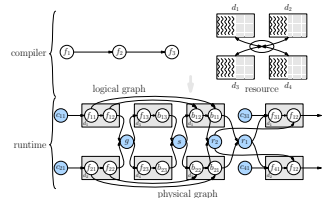

Figure 1. A typical DL framework which translates the *logical* graph of a three-layer NN to a *physical* graph (or execution plan) on 4 inter-connected devices.

achieves performance comparable to or slightly better than that of the major customized libraries which are built on top of the state-of-the-art frameworks.

## 2 Background And M**Otivation**

A DNN is typically expressed as a *logical* computation graph of operators (abbreviated as op) in DL frameworks, which is manually programmed or automatically converted by a *compiler* into a *physical* graph composed of optimized kernels for execution at runtime (Abadi et al., 2016). Distributed training involves mandatory communication ops for data (gradient, parameters, or activations) exchange among devices (Li et al., 2014; Goyal et al., 2017; Chen et al., 2016a). The inter-device bandwidth is still one or two orders of magnitude lower than that of data access within a device (Jiang et al., 2020; Narayanan et al., 2019). Therefore, a distributed DL framework should treat data movement as a first-class citizen as computation.

### 2.1 Distributing The Workload In Spatial Domain

Spatial Scheduling specifies how to spread the ops across multiple devices. Figure 1 illustrates a training job with three computation ops f1, f2, f3 scheduled onto four interconnected devices d1, d2, d3, d4. f1 and f2 are executed on d1 and d2 with data parallelism, and f3 runs on d3 and d4 with model parallelism. An *all-gather* communication op g is inserted between {f12, f22} and {f13, f23} in the forward pass, while a *reduce-scatter* communication op s is required between {b13, b23} and {b12, b22} in the backward pass. Two *all-reduce* collective communication ops r1 and r2 are used to synchronize model parameters of f1 and f2. Manually arranging the communication ops in such hybrid parallelism case by case is labor-intensive, incurring significant obstacles in applying complex parallelism to new DL models. 2.2 Distributing the Workload in Temporal Domain Temporal Scheduling of dataflow in a DL job refers to scheduling execution of ops in a particular order to maxi-

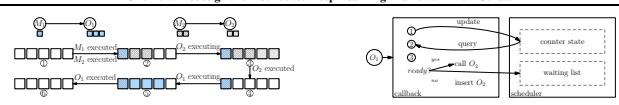

Figure 2. An example where deadlock may result with the scheduler in existing frameworks.

mize hardware utilization and system throughput. The best opportunity for performance improvement usually comes from overlapping communication and computation whenever possible. Execution dependencies are enforced within and across different instances (each mini-batch corresponds to an instance) on a physical graph when using synchronous stochastic gradient descent training (Chen et al., 2016a). In Figure 1, for example, forward ops f31 and f41 cannot be scheduled ahead of the *all-reduce* op r1. On the other hand, data loading and pre-processing ops c31 and c41 can be performed simultaneously while the devices are processing the previous batch of data; back-propagation {b11, b21} and the *all-reduce* op r2 can be executed in parallel, without hampering the correctness.

### 2.3 Managing The Complex Dependencies

In mainstream DL frameworks, both *data* and *control* dependencies are represented with edges in the execution graph (Abadi et al., 2016; Paszke et al., 2019; Chen et al., 2015). Upon the completion of each op, the scheduler updates dependencies of the remaining ops and identifies ops that are ready to run (whose dependencies have all been resolved). Distributed DL often experiences increased complexity of execution dependencies and resource constraints (Rajbhandari et al., 2020; Huang et al., 2019). Dependencies caused by resource sharing. The scheduler has to decide an appropriate execution order to avoid out-of-memory (OOM) errors or deadlocks when multiple ops share the same resource. Consider a simple example in Figure 2. M1 and M2 are two data movement ops serving two computing ops O1 and O2 on the same device, respectively. O1 and O2 do not depend on each other and O1 requires more device memory to execute than O2. M1 and M2 also need some device memory to store the output data. After M1 and M2 have occupied their memory, the free memory capacity can only satisfy O2 but not O1, while both O1 and O2 are in the ready set of the scheduler (as in TensorFlow's) at the same time. If O1 is scheduled first, the memory is insufficient; the system may either report an OOM error or block the scheduling thread, and the latter may cause a deadlock. To avoid this risk, it is better for the framework to specify an appropriate execution order in advance (e.g., adding *control* dependencies between ops in TensorFlow). If the system leverages pipelining to overlap data movement and computation, the issue becomes even more severe, as M1 can execute simultaneously while O1

Figure 3. Interaction between callback function and the scheduler.

is processing the previous piece of data in the above example.Resource planning at compile-time and flow control at runtime are necessary for execution stability. Dependencies caused by data movement. The existing DL frameworks do not treat data movement (e.g., between host and device memories) as a normal op in the graph. As a result, the dependencies between data movement and computation are not represented with edges in the computation graph. For example, TensorFlow wraps intra-node data movements in callback functions and inserts them where necessary. As a result, some dependencies are represented by graph edges while others are described by the invocation of callback functions. In Figure 3, O2 is wrapped in a callback function which is expected to be invoked on the completion of O1. However, if O2 has other dependencies such as the output of other ops or *control* dependencies, the completion of O1 does not suffice to invoke O2. To correctly schedule O2, the callback function should tell the scheduler the completion of O1: if the scheduler returns that all the other dependencies have been resolved, O2 can be scheduled immediately; otherwise, O2 is inserted into a waiting list and will be scheduled in the future when other dependencies are resolved. In the above example, the framework has to expose the internal scheduler to users so that the inserted callback functions can correctly interact with the scheduler. However, substantial engineering efforts are required to modify the existing DL frameworks to achieve this, as none of the existing DL frameworks expose the underlying scheduler to users yet. Ideally, the framework should represent all the dependencies among all the ops (including data movement) explicitly in the graph. Once this is achieved, the graph executor at runtime can also be greatly simplified.

### 2.4 Summary

We design *OneFlow*, with a compiler that can automatically generate a physical graph for data parallelism, model parallelism and pipeline parallelism. The compiler supports a full analysis of all types of dependencies (e.g., resource, data movement and computation) at compile-time. Furthermore, we design a succinct runtime for *OneFlow* based on actor model, which instantiates all types of dependencies with a unified approach of message passing among actors.

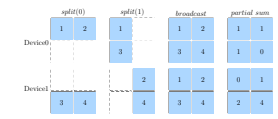

Figure 4. Example of 4 SBP signatures to map a 2×2 global tensor to two devices. Each block in the figure indicates an entry of a tensor.

## 3 The C**Ompiler**

OneFlow's compiler takes a logical computation graph and the assigned hardware configuration as inputs and generates a physical graph describing the actual execution procedure. We assume each logical op is already assigned with an attribute *placement*, indicating on which nodes (i.e., physical machines) and devices the logical op will be deployed. Consequently, a global tensor (i.e., the input or the output of a logical op) is also mapped to multiple local tensors (i.e., the multiple correspondences on the devices where the logical op is placed).

### 3.1 Specifying Parallelism Of Each Tensor And Each Operator Among Assigned Devices

We design SBP, a mathematical abstraction specifying the mapping between a global tensor and the corresponding local tensors, including *split* (S in short), *broadcast* (B) and partial-value (P). The example in Figure 4 demonstrates how a global tensor with a shape of 2 × 2 is mapped to 2 local tensors under 4 types of SBP mappings (each referred to as an SBP signature), namely split(0), split(1), broadcast, and partial-sum. *split* indicates that the local tensors are obtained by splitting the global tensor along a certain axis in a balanced manner. For example, the two tensors in the first column in Figure 4 are obtained by splitting the global 2×2 tensor by row axis, while the two tensors in the second column are resulted in by splitting the global tensor by column axis. As shown by the third column of Figure 4, *broadcast* means that each local tensor is an exact copy of the global tensor. As demonstrated by the last column of Figure 4, *partial-value* indicates that the local tensors have the same shape as the global tensor, and the global tensor can be obtained by performing an element-wise reduction operation (e.g., sum, max, etc.) over all the local tensors. When SBP signatures of the input tensors of an op are given, SBP signature of its output tensor can also be determined. Take **M atMul** as an example. Given a data tensor X and a weight tensor W, SBP signature of their product Y = XW
can be inferred from those of X and W, as given in Table 1. For most operators, the rule for inferring the SBP of output tensor from the SBP of input tensors is straightforward. Take the first case in Table 1 as an example, if X is split by row (i.e., S(0)) and W is *broadcast*, the result Y will also

|        | Table 1. Valid SBP signatures for MatMul   |        |
|--------|--------------------------------------------|--------|
| X      | W                                          | Y = XW |
| S(0)   | B                                          | S(0)   |
| B      | S(1)                                       | S(1)   |
| S(1)   | S(0)                                       | P(sum) |
| P(sum) | B                                          | P(sum) |
| B      | P(sum)                                     | P(sum) |
| B      | B                                          | B      |

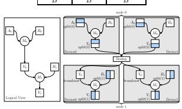

Figure 5. Example showing data movement with a boxing op inserted, when translating a logical graph into a physical graph.

be split by row (i.e., S(0)). Currently, we provide the SBP deduction rule for all the operators case by case and expect to automate the process in the future. With SBP signatures of an op's inputs and outputs, the parallelism strategy of the op is fully specified. For example, S(0), B for **X, W** in the first row of Table 1 correspond to data parallelism, and B, S(1) for **X, W** in the second row indicates model parallelism.

### 3.2 Modeling Data Routing

Producer and consumer of the same global tensor may prefer different SBP signatures for the tensor. As illustrated in Figure 5, two **M atMul** ops are connected by a global tensor Y0. S(0) is Y0's inferred SBP signature by **M atMul**0; however, **M atMul**1 expects its SBP signature to be B. In this case, a data-routing op for re-arranging or transforming the local tensors of Y0 is required between **M atMul**0 and **M atMul**1. In distributed DL, the data-routing op for automatically transforming the intermediate local tensors is usually one of the common collective communication primitives such as all2all, broadcast, reduce-scatter, all-reduce, all-gather, etc. We unify all such ops as a type of *boxing* ops. In the example of Figure 5, the *boxing* op performs an all-gather operation internally. The inserted *boxing* op may or may not incur communication cost. Table 2 lists the data size transferred between successive SBP signatures, when the input tensors and the output tensors of the *boxing* op are on the same set or disjoint sets of devices, respectively. Tensor transformation across disjoint sets of devices always incurs communication costs, while tensor transformation within the same set of devices may not necessarily lead to data movement (e.g., B → S

|                                                     | Table 2. Data size transferred between successive SBP signatures.   |                 |               |               | Table 3. Two valid two\-dimensional SBP signatures for MatMul             |                     |
|-----------------------------------------------------|---------------------------------------------------------------------|-----------------|---------------|---------------|---------------------------------------------------------------------------|---------------------|
| p1                                                  | (p2) is the number of devices where input (output) tensors are      |                 |               |               | X  W                                                                      | Y = XW              |
| placed. \|T \| is the size of the global tensor T . |                                                                     |                 |               |               | (S(0), B)  (B, S(1))                                                      | (S(0), S(1))        |
| SBP1→SBP2                                           | Cost (same)                                                         | Cost (disjoint) |               |               | (S(0), S(1))  (B, S(0))                                                   | (S(0), P)           |
| S(i) → S(i)                                         | 0                                                                   | \|T \|          |               |               |                                                                           |                     |
| S(i) → S(j)                                         | p1−1  \|T \|  p1                                                    |                 |               |               |                                                                           |                     |
| (i 6= j)                                            | all2all                                                             |                 | \|T \|        |               | Table 4. Example program for implementing SBP signatures/par                                                                           |                     |
| S → B                                               | (p1 − 1) · \|T \|                                                   | p2              | · \|T \|      |               | allelism of MatMul0 and MatMul1 in Figure 5.                              |                     |
|                                                     | all\-gather                                                         |                 |               | 1  i m p o rt | o n e fl ow  a s  fl ow                                                   |                     |
| S → P                                               | 0                                                                   |                 | \|T \|        | 2  P0=        | fl ow . pl a c e m e nt ( " c u da " ,                                    | { 0 : [ 0 , 1 ] } ) |
| B → S                                               | 0                                                                   |                 | \|T \|        | 3  P1=        | fl ow . pl a c e m e nt ( " c u da " ,                                    | { 1 : [ 0 , 1 ] } ) |
| B → B                                               | 0                                                                   | p2              | · \|T \|      | 4             | a 0 s b p = fl ow . s b p . s p l i t ( 0 )                               |                     |
| B → P                                               | 0                                                                   |                 | \|T \|        | 5             | b 0 s b p = fl ow . s b p . b r o a d c a s t                             |                     |
| P → S                                               | (p1 − 1) · \|T \|                                                   |                 |               | 6             | y 0 s b p = fl ow . s b p . b r o a d c a s t                             |                     |
|                                                     | reduce\-scatter                                                     | p1              | · \|T \|      | 7             | b 1 s b p = fl ow . s b p . s p l i t ( 1 )                               |                     |
| P → B                                               | 2(p1 − 1)·\|T \|                                                    |                 |               | 8             |                                                                           |                     |
|                                                     | all\-reduce                                                         | (p1+p2          | − 1) · \|T \| | 9             | A0= fl ow . r a n d n ( 4 , 5 , pl a c e m e nt =P0 , s b p = a 0 s b p ) |                     |
| P → P                                               | 0                                                                   | p1              | · \|T \|      | 10            | B0= fl ow . r a n d n ( 5 , 8 , pl a c e m e nt =P0 , s b p = b 0 s b p ) |                     |
|                                                     |                                                                     |                 |               | 11            | Y0= fl ow . matmul ( A0 , B0 )                                            |                     |

Table 2. Data size transferred between successive SBP signatures. p1 (p2) is the number of devices where input (output) tensors are

12 in Table 2, since the output tensor can be directly obtained from the input tensor located at the same device). This is useful for deciding the optimal parallelism strategy, that is, by selecting SBP signatures incurring the lowest communication costs.

#### 3.3 Difference From Gshard'S Abstractions

Our SBP abstractions bear some similarities to those in GShard (Lepikhin et al., 2020),1i.e., split (*split* in GShard)
and broadcast *(replicate* in GShard). GShard further adds a *shard* annotation to generalize *split* to multi-dimensional split. In *OneFlow*, we use multi-dimensional *split* that unifies the *split* and *shard* in GShard. Besides *split*, we also generalize all other SBP signatures to multi-dimension. For example, a matrix can has an SBP signature as (S(0), B), in which S(0) specifies the parallelism strategy at the level of nodes while B indicates the parallelism strategy among devices inside the same node. As the deduction rule shown in Figure 3, with multi-dimensional SBP, more advanced distributed matrix multiplication such as 2D SUMMA algorithm (Xu et al., 2021) can be conveniently supported. Further, we create the *partial-value* signature which GShard does not consider, but is necessary to make the annotation system complete. For example, Table 1 lists all the valid SBP signatures for a matrix multiplication op (Y = XW). If X uses *S(1)* and W uses *S(0)*, the signature of Y will be *P(sum)*, which cannot be described by either *split* (i.e., *split* and *shard* in GShard) or *broadcast* (i.e., *replicate* in GShard). GShard suggests performing reduce to combine the partial data to obtain the final result immediately after the un-reduced data are generated. However, sometime, maintaining the intermediate result as the 13 Y0 = Y0 . t o g l o b a l ( pl a c e m e nt =P1 , s b p = y 0 s b p )
14 B1= fl ow . r a n d n ( 8 , 6 , pl a c e m e nt =P1 , s b p = b 1 s b p )
15 Y2= fl ow . matmul ( Y0 , B1 )
partial-value is more efficient than immediately reducing the partial results. With partial-value, *OneFlow* allows the system to choose the optimal timing of inserting a *boxing* op (i.e., a reduce or *all-reduce* op). Take Y = U × V × W as an example. Suppose SBP signatures of U, V and W are S(1), *S(0)* and B, respectively. According to Table 1, SBP signature of the result of U ×V is *P(sum)*. The partial result can be multiplied by W, since the product of P(sum) and B is valid and the resulting signature is P(sum). Without *partial-value* signature, a *boxing* op, which incurs additional communication cost, must be inserted before performing the second matrix multiplication.

### 3.4 The Programming Interface

The design objective of the programming interface is to keep the operator APIs and the model description the same between a single device version and a distributed one. For different distributed strategies, users only need to specify the placement and SBP signatures of some tensors. Consider the example in Figure 5 where **M atMul**0 and **M atMul**1 use data and model parallelism, respectively. The code snippet in Table 4 illustrates how One- Flow achieves the respective parallelism. Two different placements are created in line 2 and line 3, where *cuda* indicates NVIDIA GPGPUs as accelerators, and {**0:[0**, 1]} and {**1 : [0**, 1]} denote node and device placements (the number before the colon is the node ID and numbers in square brackets are device IDs). SBP signatures are created in lines 4-7. Lines 9, 10 and 14 specify the placement and SBP attribute of tensor A0, B0 and B1, respectively. In line 11, SBP signature of Y0 is then inferred (as split(0)). However, the **M atMul**1 at line 15 expects the SBP signature of Y0 to be **broadcast**. Therefore, in line

1SBP and GShard are independently developed being unaware of each other, which can be proved by tracking the commit logs of *OneFlow* in GitHub.
13, the to *global()* method is used to add a *boxing* op between **M atMul**0 and **M atMul**1 as described in Section 3.2, which explicitly transforms the placement and SBP signatures of tensor Y0. In line 13, the to *global()* method transforms the placement and SBP signature of tensor Y0 from split(0) to **broadcast**. We note that, since the placements of input tensors of **M atMul**0 and **M atMul**1 are different, i.e., P0 and P1, respectively, the two ops actually work with pipeline parallelism. With its APIs, *OneFlow* does not require a user to program with various low-level communication primitives, but the user may need to specify appropriate placements and SBP signatures for each tensor. Placement and parallelism strategy making entails separate in-depth investigation, as studied in (Jia et al., 2019; Lepikhin et al., 2020; Wang et al., 2019; Narayanan et al., 2019; Huang et al., 2019). After OneFlow integrates those strategies to automatically infer optimal placement and parallelism strategy, users will no longer manually specify the attributes of tensors or explicitly call to *global* method.

## 4 The R**Untime**

We adopt the actor model (Hewitt et al., 1973) in runtime design. We use an actor as a thin wrapper for each op and abstract the dependencies and resources dedicated to the op as the actor's state. Actors interact with each other through message passing instead of function invocation. An actor's state is updated whenever it receives a message from others. We show that the actor model can elegantly solve various issues complicated to existing DL frameworks.

### 4.1 The Actor Model

An actor in our runtime is associated with 4 components: - Registers. A *register* is simply a container holding memory addresses of tensors. An actor is usually associated with two types of registers: in register, used for tensors consumed by the actor, and out register, for tensors produced by the actor. - *Messages.* Actor communicate with others by exchanging messages: a req message from a producer (i.e., the actor generating an output) to a consumer (i.e., the actor utilizing the output), notifying the consumer a register containing newly generated tensor can be read, and an ack message from a consumer to a producer indicating that the particular register is no longer required by the consumer. - Actions. An *action* corresponds to the execution of an op that an *actor* is bound to (e.g., launching a GPU kernel or performing data movement). - *A state machine.* Each actor keeps track of whether all the dependencies are resolved. We next discuss the mechanism inside each actor's state machine and the message passing protocol.

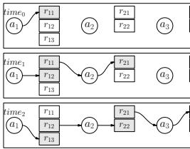

| r11   |    | r21   |    | r31   |
|-------|----|-------|----|-------|
| r12   | a2 | r22   | a3 | r32   |
| r13   |    |       |    |       |
| r11   |    | r21   |    | r31   |
| r12   | a2 | r22   | a3 | r32   |
| r13   |    |       |    |       |
| r11   |    | r21   |    | r31   |
| r12   | a2 | r22   | a3 | r32   |
| r13   |    |       |    |       |

Figure 6. Pipelining example with *OneFlow*'s actor-based runtime A blank block indicates a register containing no useful data.

A filled block denotes a register containing data useful to other actors.

### 4.2 Explicit Representation Of Resource Dependency

Counters for both in and out **registers.** Each actor allocates a pre-determined number of out registers in the beginning, amounting to a fixed memory quota for each actor. If an actor has used up its quota, the next *action* will not be scheduled even all its input tensors have been ready, until some memory previously allocated to the actor can be recycled. To achieve such goal, we associate a counter with each register. The zero initialized *in counter* records the number of the tensors held by an in register which is ready to be consumed, while the non-zero initialized *out counter* represents free memory quota. Each action results in a decrease of some *out counter*. Only when the *in counter* equals to an expected non-zero values and the *out counter* is non-zero (indicating it has free memory to use), can the actor trigger an action. In existing DL frameworks, the scheduler considers an op can start once its input tensors are ready, without taking into account whether it can later successfully acquire memory for the output. After the op is scheduled and only just before executing the action, the runtime tries to allocate memory for the op on the fly, which, however, may succeed or not. With *in counter* and out counter, *OneFlow* represents resource availability as an explicit dependency for the scheduler to decide whether an op is ready to execute. Consequently, the resource planning at compile-time and flow control at runtime are made possible. Reference counting with message passing. Besides the in counter and *out counter*, we introduce an additional zeroinitialized *reference counter* for each out register recording the number of consumers who are referencing its content. A non-zero value of a *reference counter* for an out register indicates the register is in use and the content can not be modified. Therefore, the *out counter* depends on the reference counter. It turns out that the *reference counter* can be updated according to a message passing protocol: - A producer sends a req message to a consumer and increases the *reference counter* of the out register relating to the message by one. A change from zero to non-zero of a reference counter results in the decrease of an *out counter*. - On receiving a req message, the consumer knows an in register becomes available and increases the *in counter* by one. - After using data from the in register, the consumer decreases the *in counter* by one and sends an ack message to the producer. - On receiving an ack message from the consumer, the producer decreases the *reference counter* of the out register relating to the ack message, indicating the elimination of a reference on the out register. If the *reference counter* becomes zero again, the corresponding *out counter* increases by one, indicating the corresponding out register can be recycled for the future use. In the above protocol, if an out register is being consumed by some consumer, its *reference counter* must be non-zero and it will be no longer used by the producer to put newly generated tensors. Such a mutual exclusion property safely enables a zero-copy mechanism: if a pair of producer and consumer reside on the same device, the consumer can just directly use the producer's output as input, without making another copy of the content as input.

### 4.3 Applications: Pipelining And Back Pressure

Allowing the initial value of an *out counter* for a particular register to be larger than one facilitates the processing of different versions of data in parallel. Each actor runs independently, acting as a natural stage in a pipeline. Multiple versions of the same *register* can be deemed as a generalization of the double buffering technique used in traditional DL frameworks (nvi, 2021) In Figure 6, **actor**1 has 3 out registers; **actor**2 and **actor**3 have 2 out registers respectively. - At time0, **actor**1 produces a register r11, while **actor**2 and **actor**3 are idle because their *in counter*s are zero. - At time1, **actor**2 triggers an action because both its in counter and *out counter* are non-zeros. At the same time, actor1 and trigger an action again (on a different microbatch) because its *out counter* is still non-zero.

- At **time**2, actions of all 3 actors can be triggered since all their requirements on registers are fulfilled.

Essentially, the actor-based protocol is equivalent to the credit-based flow control method in asynchronous transfer mode networks (Kung et al., 1994). It naturally enables back pressure for resource preservation. If all its out registers are in use, a producer stops processing due to out counter becoming zero and no available free out register

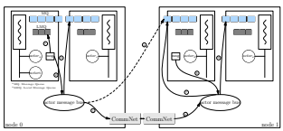

Figure 7. An illustration of 3 message routing cases: sending message to an actor on the same thread, sending message to an actor on another thread in the same node, and sending message to an actor on another node. The *CommNet* in the figure indicates the low-level networking module in *OneFlow*.

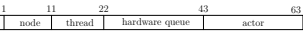

Figure 8. Encoding of an actor's address.

to hold the new output tensor. Without this back pressure mechanism (as in existing frameworks), a producer may run out of memory quickly if the consumer blocks.

## 5 The I**Mplementation**

We implement *OneFlow* using around 26K LoC in Python, 120K LoC in C++, and 10K LoC in CUDA. The actor runtime uses 3K LoC of C++, and the compiler module is implemented in 20K LoC of C++.2In the following, we present some implementation details of actor system.

Actor addressing and message routing. Similar to CUDA
stream in Nvidia GPGPUs, we also abstract other hardware resources (e.g., network and CPUs) as FIFO queues. We ensure no implicit dependency is brought by sharing resources. For example, two separate CUDA streams are created for copy engine and compute engine. To minimize device context switch, *OneFlow* creates a dedicated OS thread for each hardware queue and the actors using the same queue (or hardware resource) are bound to the same OS thread (e.g., **actor**a and **actor**b in Figure 7). With static binding among actor, device, OS thread and node, OneFlow assigns a unique and hierarchically organized 64bit address (or equivalently, ID) for each actor as shown in Figure 8; IDs of the device, OS thread and the node (where the actor resides) can be parsed from some specific fields of an actor ID. With this ID translation mechanism, attaching the receiver actor's ID with the message suffices to route the message to its destination. In *OneFlow*, actors running on the same OS thread share a FIFO message queue. For an actor to receive a message, the message is first put in the message queue of the corresponding OS thread, which polls the queue repeatedly, fetches the message and routes it to the intended receiver (e.g., case 3

2The code of *OneFlow* is available at: **https://github.**
com/Oneflow-Inc/oneflow.

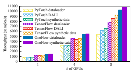

Figure 9. Throughput comparison with various frameworks and data loaders: training ResNet50-V1.5 with mixed precision.

in Figure 7). There is also a local message queue on each OS thread. The message sent to a receiver on the same OS thread as the sender is put into a local message queue and is directly processed by the receiver without being polled by the OS thread (case 1 in Figure 7).

Unifying the intra- and inter-node actor systems. We introduce an abstraction layer, the actor message bus, that provides a unified interface to route a message to its receiver no matter whether the receiver is on the same or another node. In Figure 7, the message from actora to **actor**d travels along the logical path {2 ,
} 4 , while its actual path is {2 ,5 , 6 , 
} 7 . Such abstraction hides low-level communication across networks. Different from existing frameworks and libraries which insert *Send* and *Recv* ops at both sides of inter-node communication, OneFlow's *compiler* only inserts a *networking* actor at the consumer's side for pulling data from the producer's node to the consumer's node, once inter-node communication is detected. In Figure 7, suppose **actor**e on node 1 requires the output of **actor**a on node 0; when generating the physical graph, the *compiler* creates **actor**d at node 1 whose sole responsibility is to pull the output of **actor**a from node 0 to node 1, so that **actor**e can consume the data as if the producer was on the same node.

## 6 E**Valuation**

We demonstrate *OneFlow*'s generality, flexibility and efficiency by implementing representative parallelisms and comparing with state-of-the-art libraries in various cases. Unless stated otherwise, we conduct experiments on a cluster of 4 machines inter-connected by a 100Gbps RoCE network. Each machine is equipped with 8 Nvidia Tesla V100 16G GPUs interconnected with NVLink.

### 6.1 Data-Preprocessing Pipeline

In many scenarios such as training small DL models in mixed precision mode with high-end GPGPUs, feeding data to computation renders a bottleneck in DNN training (Kumar et al., 2020). Figure 9 compares the throughput achieved by *OneFlow* and mainstream frameworks with various data loaders. DALI is a plugin developed by Nvidia for optimizing data loading for DL frameworks (nvi, 2021). In "synthetic data" cases, we use fake data generated in memory without the need for data loading from disks, representing the respective ideal cases. Tensorflow and Py- Torch's data loaders are able to overlap data loading and computation but perform much worse than using Nvidia DALI. Unlike using customized plugin such as DALI, One- Flow supports pipelining by just allocating two out registers for data loading, pre-processing and copying host to device ops as described in Section 4.3. Performance of One- Flow's data loader is close to that of the synthetic data case, indicating perfect piplelining between data loading actors and pre-processing actors. *OneFlow* achieves this without additional engineering efforts like DALI.

### 6.2 Data Parallelism

The existing DL frameworks have carried out the most extensive optimization on data-parallel training. In the experiments of Figure 10, MXNet is based on Horovod (Sergeev & Balso, 2018); Tensorflow and Py- Torch use their native communication strategies, which lead to better performance than using Horovod. We observe that in the case of ResNet (He et al., 2016), One- Flow not only outperforms the official TensorFlow, Py- Torch and MXNet by 23%–31% with FP32 and 71%– 213% with FP16 (Micikevicius et al., 2018), but also outperforms the highly optimized versions of these frameworks (those prefixed by NGC, using the same script as submitted by NVIDIA to MLPerf (Mattson et al., 2020)) by 9%–30% with FP32 and 8%–47% with FP16. In terms of BERT (Devlin et al., 2019), *OneFlow* also achieves higher training throughput than NGC versions by 9%–47% with FP32 and around 55% with FP16. For each model, we carry out a lot of performance optimization to ensure the throughput of *OneFlow* on a single device comparable to or slightly better than that of other frameworks. In this way, the scalability of different frameworks can be compared based on almost the same baseline. Note that the BERT implementation in MXNet does not perform gradient clipping, which hence involves fewer computation. To perform a fair comparison between MXNet and *OneFlow*, we implement two versions of BERT on *OneFlow*, with and without gradient clipping, respectively.

### 6.3 Model Parallelism

We compare *OneFlow* with two customized DL libraries supporting model parallelism training, as official versions of TensorFlow and PyTorch do not support model parallelism.

### 6.3.1 Insightface

InsightFace (ins, 2021) is widely used to train huge face recognition models, where model parallelism is necessary. It supports model parallelism based on PyTorch with a complicated customization. In contrast, *OneFlow* only needs

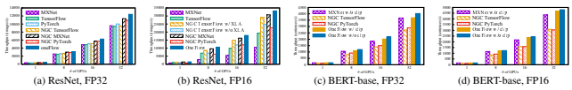 

O$%&'()

Figure 10. Data parallelism training of ResNet and BERT-base.

KMNPQR

 

F

3 6 1!"# 2$%& 5'() *+,-. /0478 9:;<= >?@AB

tuv wxy z{|} ~ 


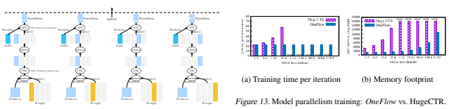

(a) MatMul, softmax and sparse cross entropy operators if the SBP

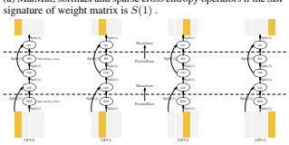

(b) The details of softmax op in the physical graph generated by compiler.

Figure 11. Implementing model parallelism in InsightFace on four GPUs.

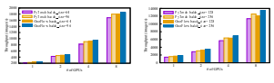

(a) ResNet
(b) MobileFaceNet Figure 12. Model-parallel training: *OneFlow* vs. InsightFace.

to configure appropriate SBP signatures for **M atMul** and softmax ops that require model parallelism. Figure 11a illustrates the transformation of local tensors on four GPUs after setting SBP signature of the weight matrix as S(1). Figure 11b demonstrates the details of a softmax op in the physical graph generated by the compiler. Note that, there are two *reduce* calculations within the softmax op. To minimize the communication cost incurred by global reduction, OneFlow first carries out local reduction within a device while performing the max and sum ops. In Figure 12, we observe that *OneFlow*'s throughput slightly outperforms InsightFace's when training face recognition models with ResNet and MobileFaceNet as backbone networks respectively (Chen et al., 2018). The physical execution plans used by both frameworks are essentially the same. However, the plan in InsightFace is generated with manual programming, while the plan in *OneFlow* is automatically produced by the compiler. *OneFlow* significantly eases the programming burden of model parallelism.

### 6.3.2 Hugectr

Wide & Deep Leaning (Cheng et al., 2016) is widely used in recommender systems, e.g., for click-through rates estimation. In production, to support click-through rates estimation for billions of IDs, the embedding matrices become too large for a single GPU's memory to hold. Model parallelism on the embedding table is needed. As shown in Figure 13, Wide & Deep learning built on *OneFlow* outperforms HugeCTR in NVIDIA Merlin (Oldridge et al., 2020), a dedicated framework for training click-through rates estimation model with model parallelism. *OneFlow*achieves lower latency (i.e., per-iteration training time) and less memory footprint compared to HugeCTR. HugeCTR runs out of memory when the vocabulary size exceeds 51.2 million. Different from HugeCTR that involves substantial engineering efforts, with *OneFlow*, users only need to set appropriate SBP signatures for the embedding table (i.e., S(0) for splitting the vocabulary IDs and S(1) for splitting the hidden dimension), and our compiler will automatically insert collective communication ops where necessary for model parallelism.

### 6.4 Parallelizing The Optimizer

Memory redundancy of model states (such as gradients, parameters, momentum and variances in Adam (Kingma & Ba, 2015)) in data parallelism can

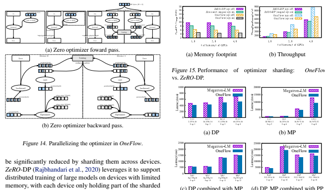

CDEFGHIJKL NOP Q 
model states. When the full model states are required, an all-gather communication primitive can be used. *OneFlow* is able to implement the same idea with less engineering efforts. Figure 14 illustrates the procedure of generating the physical graph on two devices by *OneFlow*, while implementing the same techniques as in *ZeRO*-DP with mixed precision enabled (Micikevicius et al., 2018). First, a conversion op (such as fp16 cast) is inserted. Second, our framework configures SBP signatures of the input of the cast op as S(0) and the output of the cast op as B. Our compiler automatically generates the physical graph for both forward pass (Figure 14a) and backward pass (Figure 14b). Data routing ops are automatically inserted where appropriate. *ZeRO*-DP's implementation is based on PyTorch, using about 2K LoC. *OneFlow* implements the idea with 300 LoC, which is much simpler. Figure 15 compares per-device memory footprint and throughput when training GPT-2, with the activation checkpoint (Chen et al., 2016b) on (i.e., opt on) or off (i.e., opt off). We observe that *OneFlow* consumes less device memory but achieves higher throughput than *ZeRO*-DP, with or without the activation checkpointing optimization.

### 6.5 Hybrid Parallelism

Megatron-LM (Shoeybi et al., 2020) is a customized library for pre-training large models such as GPT-3 based on PyTorch. It supports data parallelism, model parallelism and hybrid parallelism which combines data and model parallelism (amounting to the two-dimensional SBP described in Section 3.3). It also implements activation checkpointing and synchronous pipeline with 1F1B pipeline sched-

C

Ö

Õ

;<=

]^_`abcdefg

ö÷
YZ
ôõ VWX

ðñòó STU
ï R

¢£¤¥¦

´µ¶·¸

ÇÈÉÊËÌ

ÛÜÝÞßà 1

()*+,-

=>?@AB

§¨©ª«¬®¯ 
¹º»¼½¾¿ÀÁ 
ÍÎÏÐÑÒÓÔÕÖ 
áâãäåæçèéê ÂÃÄÅÆÇÈÉÊËÌ

M*+,-./0134

¾¿
&'
¼½
$%
¸¹º»
!"#
·

L

ÍÎÏÐÑ

âãäåæ

÷øùúû 2 

(c) DP combined with MP
(d) DP, MP combined with PP
Figure 16. Per-iteration training time for training GPT-2 using various parallelisms: *OneFlow* vs. Megatron-LM. The numbers listed for each experiment are respectively data-parallel-size, tensor-model-parallel-size, pipeline-model-parallel-size, global batch size, hidden-size, number-of-layers defined in Megatron- LM.

ule. We compare *OneFlow* and Megatron-LM for training GPT-2 under representative configurations in Figure 16. The four sub-figures demonstrates the experiment results for pure data parallelism, pure model parallelism, hybrid of data parallelism and model parallelism, a combination of data, model and pipeline parallelism. As a generic framework, *OneFlow* implements all features that Megatron-LM supports, such as the activation checkpointing and 1F1B pipeline schedule techniques and align all the hyper-parameters. The physical execution plans of two frameworks are essentially the same. However, *OneFlow* performs more kernel fusions than Megatron-LM does. In the result, *OneFlow* outperforms Megatron-LM even with a single device. This is the major reason why *OneFlow* achieves higher training efficiency in distributed cases over the customized library.

## 7 Conclusion And D**Iscussions**

We propose a new distributed deep learning framework OneFlow based on the concept of SBP and the actor model. OneFlow overcomes the complexity and efficiency issues of existing frameworks in supporting various parallelisms for training large DL models. The compiler uses the concise abstraction of SBP for automatically generating an effective execution plan for actors with both spatial and temporal scheduling enabled. The actor model unifies various dependencies as message passing and naturally supports pipelining, serving a novel mechanism for runtime of distributed DL frameworks. Finally, we show experiment results from a wide range of challenging tasks on real datasets to demonstrate that the design presented in this paper is more flexible and efficient than the existing ones. Even though both *OneFlow* and Ray (Moritz et al., 2018) use the concept of the actor, the granularities are different. In Ray, a single actor is used to manage a complete neural network while performing deep learning training. So far, Ray can only act as a plugin to enable data-parallelism to TensorFlow and PyTorch. It does not support model parallelism and pipeline parallelism. There are still a number of areas that we are actively working on to improve *OneFlow*, including: (1) to enable OneFlow with elastic scaling (Mai et al., 2020; Or et al.,
2020) and fine-grained fault resilience (Wang et al., 2021; Zaharia et al., 2013) besides the naive global checkpointing; (2) to implement auto placement and auto parallelism by designing a more efficient cost model, thus making it easier to use.

## A**Cknowledgements**

We thank the anonymous reviewers of OSDI 2021, SOSP 2021 and MLSys 2022 for their helpful comments on the paper. Developing a deep learning framework such as One- Flow involves a large amount of engineering efforts. We gratefully acknowledge contributions from our colleagues within OneFlow Inc. and Zhejiang Lab., and from the users of *OneFlow*. In particular, Wenxiao Zhang, Xiaoyu Zhang, Binbin Han, Jianhao Zhang, Houjiang Chen, Luyang Zhao, Yu Ouyang, Zekang Zheng, Xuan Xie, Yinggang Wang, Yipeng Li, Fengwei Liu, Shijie Wang, Xiaoyu Xu, Depeng Liang, Mingyang Liu, Shiyuan Shangguan, Jing Qiao, Chong Niu, Wei Zhang, Xuefei Jiang contribute a lot of code to *OneFlow*.

## R**Eferences**

Microsoft DeepSpeed. **https://github.com/**
microsoft/DeepSpeed, 2021.

InsightFace Project. **https://github.com/**
deepinsight/insightface, 2021.

NVIDIA NCCL. **https://developer.nvidia.**
com/nccl, 2021.

NVIDIA Data Loading Library (DALI). **https://**
developer.nvidia.com/DALI, 2021.

Abadi, M., Barham, P., Chen, J., Chen, Z., Davis, A., Dean, J., Devin, M., Ghemawat, S., Irving, G., Isard, M., Kudlur, M., Levenberg, J., Monga, R., Moore, S., Murray, D. G., Steiner, B., Tucker, P., Vasudevan, V., Warden, P., Wicke, M., Yu, Y., and Zheng, X. TensorFlow: A System for Large-scale Machine Learning. In *Proceedings* of the 12th USENIX Conference on Operating Systems Design and Implementation, 2016.

Ben-Nun, T. and Hoefler, T. Demystifying Parallel and Distributed Deep Learning: An In-Depth Concurrency Analysis. *ACM Computing Surveys*, 2019.

Brown, T., Mann, B., Ryder, N., Subbiah, M., Kaplan, J. D.,
Dhariwal, P., Neelakantan, A., Shyam, P., Sastry, G., Askell, A., Agarwal, S., Herbert-Voss, A., Krueger, G., Henighan, T., Child, R., Ramesh, A., Ziegler, D., Wu, J., Winter, C., Hesse, C., Chen, M., Sigler, E., Litwin, M., Gray, S., Chess, B., Clark, J., Berner, C., McCandlish, S., Radford, A., Sutskever, I., and Amodei, D. Language Models are Few-Shot Learners. In Proceedings of Advances in Neural Information Processing Systems, 2020.

Chen, J., Monga, R., Bengio, S., and J´ozefowicz, R. Revisiting Distributed Synchronous SGD. arXiv preprint arXiv:1604.00981, 2016a.

Chen, S., Liu, Y., Gao, X., and Han, Z. Mobilefacenets: Efficient CNNs for Accurate Real-time Face Verification on Mobile Devices. In Proceedings of Chinese Conference on Biometric Recognition, 2018.

Chen, T., Li, M., Li, Y., Lin, M., Wang, N., Wang, M.,
Xiao, T., Xu, B., Zhang, C., and Zhang, Z. MXNet: A Flexible and Efficient Machine Learning Library for Heterogeneous Distributed System. In Proceedings of LearningSys, 2015.

Chen, T., Xu, B., Zhang, C., and Guestrin, C. Training Deep Nets with Sublinear Memory Cost. arXiv preprint arXiv:1604.06174, 2016b.

Cheng, H.-T., Koc, L., Harmsen, J., Shaked, T., Chandra, T., Aradhye, H., Anderson, G., Corrado, G., Chai, W., Ispir, M., Anil, R., Haque, Z., Hong, L., Jain, V., Liu, X., and Shah, H. Wide & Deep Learning for Recommender Systems. In *Proceedings of the 1st Workshop on Deep* Learning for Recommender Systems, 2016.

Devlin, J., Chang, M.-W., Lee, K., and Toutanova, K.

BERT: Pre-training of Deep Bidirectional Transformers for Language Understanding. In Proceedings of the North American Chapter of the Association for Computational Linguistics: Human Language Technologies, 2019.

fairscale. Facebook Fairscale project. **https://**
github.com/facebookresearch/fairscale.

Fedus, W., Zoph, B., and Shazeer, N. Switch Transformers: Scaling to Trillion Parameter Models with Simple and Efficient Sparsity. *arXiv preprint arXiv:2101.03961*, 2021.

M., Kumar, N., et al. Exploring the Limits of Concurrency in ML Training on Google TPUs. arXiv preprint arXiv:2011.03641, 2020.

Kung, H. T., Blackwell, T., and Chapman, A. Creditbased flow control for atm networks: Credit update protocol, adaptive credit allocation and statistical multiplexing. *SIGCOMM Comput. Commun. Rev.*, 24(4):101–114, October 1994.

Goyal, P., Doll¨¢r, P., Girshick, R., Noordhuis, P.,
Wesolowski, L., Kyrola, A., Tulloch, A., Jia, Y., and He, K. Accurate, Large Minibatch SGD: Training ImageNet in 1 Hour. *arXiv preprint arXiv:1706.02677*, 2017.

Hashemi, S. H., Jyothi, S. A., and Campbell, R. H. TicTac:
Accelerating Distributed Deep Learning with Communication Scheduling. In Proceedings of Machine Learning and Systems, 2019.

Lepikhin, D., Lee, H., Xu, Y., Chen, D., Firat, O., Huang, Y., Krikun, M., Shazeer, N., and Chen, Z. GShard: Scaling Giant Models with Conditional Computation and Automatic Sharding. In Proceedings of International Conference on Learning Representations, 2020.

He, K., Zhang, X., Ren, S., and Sun, J. Deep Residual Learning for Image Recognition. In Proceedings of the IEEE Conference on Computer Vision and Pattern Recognition, 2016.

Li, M., Andersen, D. G., Park, J. W., Smola, A. J., Ahmed, A., Josifovski, V., Long, J., Shekita, E. J., and Su, B.-Y. Scaling Distributed Machine Learning with the Parameter Server. In Proceedings of the 11th USENIX Symposium on Operating Systems Design and Implementation, 2014.

Hewitt, C., Bishop, P., and Steiger, R. A Universal Modular ACTOR Formalism for Artificial Intelligence. In Proceedings of the 3rd International Joint Conference on Artificial Intelligence, 1973.

Mai, L., Li, G., Wagenl¨ander, M., Fertakis, K., Brabete, A.-O., and Pietzuch, P. KungFu: Making Training in Distributed Machine Learning Adaptive. In Proceedings of the 14th USENIX Symposium on Operating Systems Design and Implementation, 2020.

Huang, Y., Cheng, Y., Bapna, A., Firat, O., Chen, D., Chen, M., Lee, H., Ngiam, J., Le, Q. V., Wu, Y., and Chen, z. GPipe: Efficient Training of Giant Neural Networks using Pipeline Parallelism. In Proceedings of Advances in Neural Information Processing Systems, 2019.

Mattson, P., Cheng, C., Diamos, G., Coleman, C., Micikevicius, P., Patterson, D., Tang, H., Wei, G.-Y., Bailis, P., Bittorf, V., Brooks, D., Chen, D., Dutta, D., Gupta, U., Hazelwood, K., Hock, A., Huang, X., Kang, D., Kanter, D., Kumar, N., Liao, J., Narayanan, D., Oguntebi, T., Pekhimenko, G., Pentecost, L., Janapa Reddi, V., Robie, T., St John, T., Wu, C.-J., Xu, L., Young, C., and Zaharia, M. MLPerf Training Benchmark. In Proceedings of Machine Learning and Systems, 2020.

Jia, Z., Lin, S., Qi, C. R., and Aiken, A. Exploring Hidden Dimensions in Parallelizing Convolutional Neural Networks. In *Proceedings of the International Conference* on Machine Learning, 2018.

Jia, Z., Zaharia, M., and Aiken, A. Beyond Data and Model Parallelism for Deep Neural Networks. In Proceedings of Machine Learning and Systems, 2019.

Micikevicius, P., Narang, S., Alben, J., Diamos, G., Elsen, E., Garcia, D., Ginsburg, B., Houston, M., Kuchaiev, O., Venkatesh, G., and Wu, H. Mixed Precision Training. In Proceedings of International Conference on Learning Representations, 2018.

Jiang, Y., Zhu, Y., Lan, C., Yi, B., Cui, Y., and Guo, C. A
Unified Architecture for Accelerating Distributed DNN Training in Heterogeneous GPU/CPU Clusters. In Proceedings of the 14th USENIX Symposium on Operating Systems Design and Implementation, 2020.

Moritz, P., Nishihara, R., Wang, S., Tumanov, A., Liaw, R.,
Liang, E., Paul, W., Jordan, M. I., and Stoica, I. Ray: A Distributed Framework for Emerging AI Applications. In Proceedings of the 13th USENIX Symposium on Operating Systems Design and Implementation, 2018.

Kaplan, J., McCandlish, S., Henighan, T., Brown, T. B.,
Chess, B., Child, R., Gray, S., Radford, A., Wu, J., and Amodei, D. Scaling Laws for Neural Language Models.

arXiv preprint arXiv:2001.08361, 2020.

Kingma, D. P. and Ba, J. Adam: A Method for Stochastic Optimization. In Proceedings of International Conference on Learning Representations, 2015.

Narayanan, D., Harlap, A., Phanishayee, A., Seshadri, V.,
Devanur, N. R., Ganger, G. R., Gibbons, P. B., and Zaharia, M. PipeDream: Generalized Pipeline Parallelism for DNN Training. In Proceedings of the 27th ACM Symposium on Operating Systems Principles, 2019.

Kumar, S., Bradbury, J., Young, C., Wang, Y. E., Levskaya, A., Hechtman, B., Chen, D., Lee, H., Deveci, Narayanan, D., Shoeybi, M., Casper, J., LeGresley, P., Patwary, M., Korthikanti, V., Vainbrand, D., Kashinkunti, P., Bernauer, J., Catanzaro, B., Phanishayee, A., and Zaharia, M. Efficient Large-Scale Language Model Training on GPU Clusters. *arXiv preprint arXiv:2104.04473*, 2021.

Oldridge, E., Perez, J., Frederickson, B., Koumchatzky, N., Lee, M., Wang, Z.-H., Wu, L., Yu, F., Zamora, R., Yılmaz, O., Gunny, A. M., Nguyen, V. P., and Lee, S. Merlin: A GPU Accelerated Recommendation Framework. 2020.

Or, A., Zhang, H., and Freedman, M. Resource Elasticity in Distributed Deep Learning. 2020.

Pal, S., Ebrahimi, E., Zulfiqar, A., Fu, Y., Zhang, V., Migacz, S., Nellans, D., and Gupta, P. Optimizing Multi- GPU Parallelization Strategies for Deep Learning Training. *IEEE Micro*, 2019.

Paszke, A., Gross, S., Massa, F., Lerer, A., Bradbury, J.,
Chanan, G., Killeen, T., Lin, Z., Gimelshein, N., Antiga, L., Desmaison, A., Kopf, A., Yang, E., DeVito, Z., Raison, M., Tejani, A., Chilamkurthy, S., Steiner, B., Fang, L., Bai, J., and Chintala, S. PyTorch: An Imperative Style, High-Performance Deep Learning Library. In Proceedings of Advances in Neural Information Processing Systems, 2019.

Peng, Y., Zhu, Y., Chen, Y., Bao, Y., Yi, B., Lan, C., Wu, C., and Guo, C. A Generic Communication Scheduler for Distributed DNN Training Acceleration. In Proceedings of the 27th ACM Symposium on Operating Systems Principles, 2019.

Rajbhandari, S., Rasley, J., Ruwase, O., and He, Y. ZeRO:
Memory Optimizations Toward Training Trillion Parameter Models. In *Proceedings of International Conference* for High Performance Computing, Networking, Storage and Analysis, 2020.

Rajbhandari, S., Ruwase, O., Rasley, J., Smith, S., and He, Y. ZeRO-Infinity: Breaking the GPU Memory Wall for Extreme Scale Deep Learning. arXiv preprint arXiv:2104.07857, 2021.

Sergeev, A. and Balso, M. D. Horovod: Fast and Easy Distributed Deep Learning in TensorFlow. arXiv preprint arXiv:1802.05799, 2018.

Shazeer, N., Cheng, Y., Parmar, N., Tran, D., Vaswani, A., Koanantakool, P., Hawkins, P., Lee, H., Hong, M., Young, C., et al. Mesh-tensorflow: Deep learning for supercomputers. In *Proceedings of Advances in Neural* Information Processing Systems, 2018.

Shoeybi, M., Patwary, M., Puri, R., LeGresley, P., Casper, J., and Catanzaro, B. Megatron-LM: Training Multi- Billion Parameter Language Models Using Model Parallelism. *arXiv preprint arXiv:1909.08053*, 2020.

Wang, M., Huang, C.-c., and Li, J. Supporting Very Large Models Using Automatic Dataflow Graph Partitioning. In *Proceedings of the Fourteenth EuroSys Conference*, 2019.

Wang, S., Liang, E., Oakes, E., Hindman, B., Luan, F. S.,
Cheng, A., and Stoica, I. Ownership: A Distributed Futures System for Fine-Grained Tasks. In Proceedings of the 18th USENIX Symposium on Networked Systems Design and Implementation, 2021.

Wu, X., Xu, H., Li, B., and Xiong, Y. Stanza: Distributed Deep Learning with Small Communication Footprint. arXiv preprint arXiv:1812.10624, 2018.

Xu, Q., Li, S., Gong, C., and You, Y. An efficient 2d method for training super-large deep learning models, 2021.

Zaharia, M., Das, T., Li, H., Hunter, T., Shenker, S., and Stoica, I. Discretized streams: Fault-tolerant streaming computation at scale. In Proceedings of the twentyfourth ACM Symposium on Operating Systems Principles, 2013.