# A General Language Assistant As A Laboratory For Alignment

Amanda Askell∗ Yuntao Bai∗ Anna Chen∗ Dawn Drain∗ Deep Ganguli∗ **Tom Henighan**†
Andy Jones† Nicholas Joseph† Ben Mann∗ **Nova DasSarma Nelson Elhage**
Zac Hatfield-Dodds Danny Hernandez Jackson Kernion Kamal Ndousse Catherine Olsson Dario Amodei Tom Brown Jack Clark Sam McCandlish Chris Olah Jared Kaplan‡
Anthropic

## Abstract

Given the broad capabilities of large language models, it should be possible to work towards a general-purpose, text-based assistant that is aligned with human values, meaning that it is helpful, honest, and harmless. As an initial foray in this direction we study simple baseline techniques and evaluations, such as prompting. We find that the benefits from modest interventions increase with model size, generalize to a variety of alignment evaluations, and do not compromise the performance of large models. Next we investigate scaling trends for several training objectives relevant to alignment, comparing imitation learning, binary discrimination, and ranked preference modeling. We find that ranked preference modeling performs much better than imitation learning, and often scales more favorably with model size. In contrast, binary discrimination typically performs and scales very similarly to imitation learning. Finally we study a 'preference model pre-training' stage of training, with the goal of improving sample efficiency when finetuning on human preferences.

∗Core Research Contributors †Core Infrastructure Contributors
‡Correspondence to: jared@anthropic.com Author contributions are listed at the end of the paper.

## Contents

| 1   | Introduction   |                                                                              | 3   |
|-----|----------------|------------------------------------------------------------------------------|-----|
|     | 1.1            | Motivations                                                                  | 3   |
|     | 1.2            | Research                                                                     | 5   |
|     | 1.3            | Contributions                                                                | 9   |
| 2   |                | Conditioning on Aligned Behavior                                             | 9   |
|     | 2.1            | Context Distillation                                                         | 10  |
|     | 2.2            | Evaluations and Alignment Taxes                                              | 11  |
| 3   |                | Scaling of Preference Modeling vs Imitation Learning                         | 14  |
|     | 3.1            | Loss and Settings for Preference Modeling and Imitation Learning             | 15  |
|     | 3.2            | Performance and Scaling Results for Ranked versus Binary Preference Datasets | 16  |
| 4   |                | Preference Model Pre\-Training and Transfer                                  | 20  |
|     | 4.1            | PMP and Datasets                                                             | 21  |
|     | 4.2            | Finetuning Results and Scaling Trends                                        | 21  |
|     | 4.3            | Ranked Preference Modeling vs Binary Discrimination for PMP                  | 23  |
|     | 4.4            | Human\-Model vs Human\-Human Comparisons for PMP                             | 24  |
| 5   | Discussion     |                                                                              | 24  |
|     | 5.1            | Related Work                                                                 | 24  |
|     | 5.2            | Broader Impacts                                                              | 25  |
|     | 5.3            | Implications                                                                 | 26  |
| A   |                | Language Model Pre\-training                                                 | 27  |
| B   |                | More Details on Prompting, Context Distillation, and Evaluations             | 29  |
| C   |                | More Details on Preference Models                                            | 34  |
| D   |                | Per\-Token GAN\-Style Discriminator Results                                  | 40  |
| E   |                | Definitions of Alignment and the HHH criteria                                | 44  |

Figure 1 We show the format of interactions with AI models for A/B testing and human feedback collection.

 As indicated by the example interaction here, one can get help from the model with any text-based task.

## 1 Introduction

#### 1.1 Motivations

Contemporary AI models can be difficult to understand, predict, and control. These problems can lead to significant harms when AI systems are deployed, and might produce truly devastating results if future systems are even more powerful and more widely used, and interact with each other and the world in presently unforeseeable ways. This paper shares some nascent work towards one of our primary, ongoing goals, which is to align generalpurpose AI systems with human preferences and values. A great deal of ink has been spilled trying to define what it means for AI systems to be aligned, and to guess at how this might go wrong. We will define an AI
as "aligned" if it is, in three words, helpful, **honest**, and **harmless** or 'HHH'. Our alignment efforts aim to measure and address this general problem with large language models. Many researchers and organizations share this goal, but few have pursued it directly. Most research efforts associated with alignment either only pertain to very specialized systems, involve testing a specific alignment technique on a sub-problem, or are rather speculative and theoretical. Our view is that if it's possible to try to address a problem directly, then one needs a good excuse for not doing so. Historically we had such an excuse: general purpose, highly capable AIs were not available for investigation. But given the broad capabilities of large language models, we think it's time to tackle alignment directly, and that a research program focused on this goal may have the greatest chance for impact. Furthermore:
- A natural language agent can be subjected to a wide variety of inputs, and so it can fail to be helpful, honest, and harmless in myriad ways. We believe it's valuable to try to see the full picture of where we've made progress on alignment, and where we're currently falling short. This may remain obscure absent efforts to train general aligned agents and allow them to be probed in any way whatsoever. A very broad definition can also facilitate measurement, since it invites the examiner to pose a wide-variety of challenges.

- By studying a variety of alignment techniques in a general setting, it becomes much easier to compare them and to determine which techniques are simplest and most effective. Some techniques, such as the use of human feedback, are complex and potentially costly, so we're interested in strategies that can increase their efficiency and focus their application exclusively on goals that cannot be attained more easily in another way.

- Some view alignment as a highly speculative problem, or one that distracts from work on more pressing issues with existing AI systems. In our view, the societal impacts of current AI models should be taken seriously, and the evaluation of current models should be seen as an essential safety project. We believe that training a large language model to be helpful, honest, and harmless (we are not claiming to have achieved this goal!) would represent significant progress towards alleviating the negative societal impacts from general-purpose language models.

- Some of the researchers who are most concerned about the alignment problem believe that aligning extremely capable AIs will be qualitatively different from aligning current more limited systems. We share this concern, but we believe the best vantage point from which to explore alignment for increasingly advanced AIs will be to first establish an aligned baseline at current capability levels. If this were successful, we would then turn to the task of studying progress more deeply, including its scaling properties, and attempt to adversarially validate it. Conversely, if we and others persistently fail, we can identify the thorniest issues with alignment. Halting progress would also provide a persuasive argument for allocating more and more resources towards AI alignment, and for more cautious norms around scaling up and deploying models.

In pursuit of these goals, in this work we will be investigating the following questions:
- **Is naive prompting a workable baseline for alignment? How does it scale, how does it compare**
to finetuning, and how can we leverage its advantages? We find that prompts induce favorable scaling on a variety of alignment-relevant evaluations, impose negligible 'taxes' on large models, and can be 'context distilled' back into the original model.

- **When and how much does preference modeling improve on imitation learning?** We find that preference modeling improves on and scales more favorably than imitation learning when preferences are part of a ranked hierarchy or continuum (e.g. rank these responses in order of helpfulness), rather than associated with a binary choice (e.g. does this python function pass tests).

- **How can we improve the sample efficiency of preference modeling?** We find that we can significantly improve sample efficiency using a 'preference model pre-training' (PMP) stage of training, where we first pre-train on large public datasets that encode human preference information, such as Stack Exchange, Reddit, and Wikipedia edits, before finetuning on smaller datasets encoding more specific human preferences.

The last two points are particularly important for work using reinforcement learning (RL) for alignment, where the reward signals are predicted by a preference model. In particular, we expect bandit-type RL performance to improve roughly in proportion with preference modeling capabilities, since the preference model's recognition of high-performance behavior should be closely related to the RL agent's ability to achieve it. We anticipate that such a strategy can outperform imitation learning on some problems, especially those whose solutions lie on a ranked hierarchy. A similar approach applying human feedback to greatly improve the performance of language models on summary-writing had already been demonstrated [SOW+20].

### What Are Helpfulness, Honesty, And Harmlessness?

We chose 'helpful, honest, and harmless' as criteria because they are simple and memorable, and seem to capture the majority of what we want from an aligned1 AI. But these are also subtle and ambiguous criteria, and the best AI behavior will involve a compromise between them. For example, there will clearly be conflicts between helpfulness to the user and harmlessness to others if agents are asked to aid in harmful activities. Here are some very brief notes on these terms: Helpful:
- The AI should make a clear attempt to perform the task or answer the question posed (as long as this isn't harmful). It should do this as concisely and efficiently as possible.

1We also discuss the HHH specification in relation to our broader understanding of alignment in Appendix E.

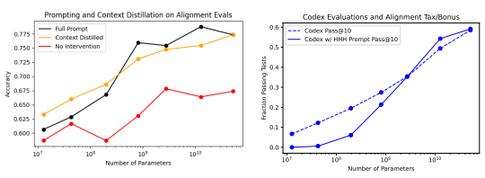

Figure 2 Left: Simple prompting significantly improves performance and scaling on our HHH alignment evaluations (y-axis measures accuracy at choosing better responses on our HHH evaluations). **Right**: Prompts impose little or no 'alignment tax' on large models, even on complex evaluations like function synthesis.

Here we have evaluated our python code models on the HumanEval codex dataset [CTJ+21] at temperature T = 0.6 and top P = 0.95.

- When more information is required, the AI should ask relevant follow-up questions and obtain necessary details. It should respond with appropriate levels of sensitivity, insight, and discretion.

- Ideally the AI will also re-direct ill-informed requests, e.g. if asked 'how can I build a website in assembly language' it might suggest a different approach.

### Honest:

- At its most basic level, the AI should give accurate information. Moreover, it should be calibrated
(e.g. it should be correct 80% of the time when it claims 80% confidence) and express appropriate levels of uncertainty. It should express its uncertainty without misleading human users.

- Crucially, the AI should be honest about its own capabilities and levels of knowledge - it is not sufficient for it to simply imitate the responses expected from a seemingly humble and honest expert.

- Ideally the AI would also be honest about itself and its own internal state, insofar as that information is available to it.

- Honesty is more objective than helpfulness and harmlessness, so more aspects of honesty training may be possible without human input. This might include calibration training on factual claims and claims about the internal state of the model, and the use of search [KSW21] to augment accuracy.

Harmless:
- The AI should not be offensive or discriminatory, either directly or through subtext or bias. - When asked to aid in a dangerous act (e.g. building a bomb), the AI should politely refuse. Ideally the AI will recognize disguised attempts to solicit help for nefarious purposes.

- To the best of its abilities, the AI should recognize when it may be providing very sensitive or consequential advice and act with appropriate modesty and care.

- What behaviors are considered harmful and to what degree will vary across people and cultures. It will also be context-dependent, i.e. it will depend on the nature of the user query, who is using the AI assistant, and the time and place in which the assistant is being used.

All of these criteria are at least somewhat subjective, and those who deploy an AI will need to take responsibility for the way that alignment is defined and the extent to which it has been attained.

### 1.2 Research Open-Ended Dialogue Format And Prompting

We use open-ended natural language dialogue for interaction with our models, with an example pictured in figure 1. We allow for general inputs of essentially arbitrary length from human users, which can include

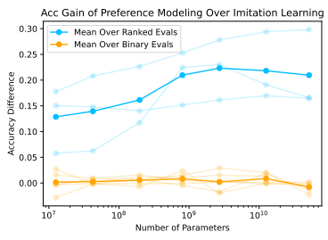

Figure 3 In this figure the y-axis measures the *accuracy difference* of preference modeling compared to imitation learning, where evaluations have been categorized as having either ranked or *binary* preferences. The light blue curves show ranked evaluations from Learn to Summarize, HellaSwag, and Utilitarianism (ethics); while light orange curves show binary evaluations from Code Correctness, Lambada, Commonsense Morality (ethics), Justice (ethics), Deontology (ethics), and Virtue (ethics). Dark colored curves show the mean over light curves of the same color. All these datasets are evaluated by some form of accuracy, although the specific interpretation is different in each case (e.g., multiple choice accuracy for HellaSwag, pairwise comparison accuracy for Learn to Summarize; see section 3.2). We see that on ranked evaluations, PM performs and scales significantly better than IL (blue), while on binary evaluations there is little discernible difference (orange). The 52B Code Correctness is excluded due to significant compute needed to generate code samples.

examples, documents, programming code, etc, and we allow similarly general responses from our models. Models indicate they have completed a response by generating a stop sequence, which is literally the string Human: used to designate roles in the dialogue. By default we show two responses and allow users to choose one. We typically request that users pick the most helpful and honest response, as pictured. We use this interface both to A/B test different models and to collect human feedback data. We can use a very similar interface for other safety-related tasks, such as red-teaming the model against harmfulness. To evaluate performance we created a small dataset of evaluations associated with helpfulness, honesty, harms, and other behaviors in this interactive format. We are sharing these evaluations on BIG Bench for others to try. We also evaluate models and interventions via A/B testing with humans, who have been instructed to solicit models' help with arbitrary text-based tasks.

Large language models engage in few-shot learning [BMR+20]. To generically elicit the sort of behavior shown in figure 1, we found that it was sufficient to provide a long prompt (4600 words from 14 fictional conversations) with example interactions. The prompt we used was not carefully designed or optimized for performance on evaluations; rather it was just written by two of us in an ad hoc manner prior to the construction of any evaluations. Despite the fact that our prompt2 did not include any examples where models resisted manipulation, refused requests to aid in dangerous activities, or took a stand against unsavory behavior, we observed that models often actively avoided engaging in harmful behaviors based only on the AI 'personality' imbued by the prompt. This is reflected in the performance trends on harmfulness in figure 6. In section 2 we explore the effects of the prompt. In the small data limit, prompting a generative language model may be qualitatively different from and superior to finetuning, since prompting imposes a prior, while finetuning alters the model's expectations for the underlying data distribution. We make several points concerning prompting:

- We find that prompting can be superior to finetuning in the limit of very small datasets associated with alignment.

2Prompt text and contractor instructions are at https://gist.github.com/jareddk/2509330f8ef3d787fc5aaac67aab5f11

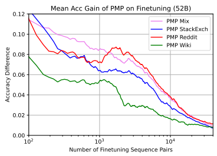

Figure 4 Performance gain of preference model pre-training on finetuning evaluations, as measured by accuracy difference relative to no PMP. Different colors represent different PMP datasets, including Stack- Exchange, Reddit, Wikipedia, and a 'Mix' of all three. Each line represents a combined (mean) result from Learn to Summarize, HellaSwag, and all five Ethics evaluations. Results are shown for the 52B parameter model only, but similar positive results were also seen for the smaller models.

- The prompt context 'C' can be distilled into a new language model that models the distribution P(X|C) instead of P(X); this is accomplished by simply finetuning with a loss given by the KL divergence between P(X|C) and the distilled model's predictions. This procedure has more beneficial effects as compared to finetuning on the prompt.

- The capabilities of small models (e.g. on NLP or coding evaluations) are typically diminished in the presence of the prompt, presumably because they are confused by it. But larger models perform at roughly the same level with or without the prompt.

So perhaps prompt-related techniques can carry alignment efforts further than we initially expected. Nevertheless, we believe that as an approach to alignment, prompt design will have significant limitations. One concern is that prompts may only be capable of teaching the model to imitate some interpolation of the training distribution, and so will not lead the model to exceed the performance demonstrated in the training set. Concretely, we want the model to be honest about itself and its specific capability level rather than presenting an honest-seeming facade in imitation of its training data (e.g. implying that it is able to book a flight). Advanced AI models may also be trained using a mixture of generative modeling, supervised learning, reinforcement learning, and other techniques. Prompt design may not carry over so straightforwardly after generative models are re-purposed for other tasks.

### Scaling Of Imitation Learning Vs Preference Modeling, And Binary Vs Rank-Ordered Preferences

Beyond prompt design, the next simplest technique is imitation learning from expert examples. But the slightly more complex technique of learning distinctions3among preferences—not just what to do but also what not to do—may be more promising. We are interested in when this more involved approach improves on imitation learning, and how each scales with model size. We find that there seems to be a qualitative distinction between two types of tasks:
- **Binary Discrimination**, where the data has only two possible labels, such as pass/fail or true/false; some examples include determining if python code passes tests, or determining if an action is morally acceptable or unacceptable

3Note that if such data is not available, there is an option to generate it, since expert examples can be compared with samples from a model - i.e. we can train a GAN-style discriminator.

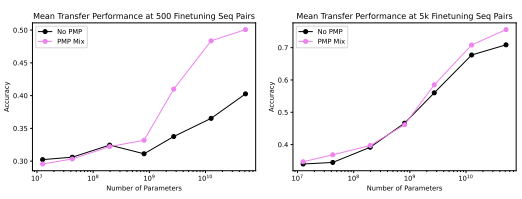

Figure 5 Transfer performance at 500 and 5k sequence pairs on downstream finetuning evaluations with PMP (on the 'Mix' dataset, shown in violet) vs. without PMP (black). Each curve is averaged across finetuning evaluations Learn to Summarize, HellaSwag, and all five Ethics evaluations. We see that PMP significantly improves sample efficiency with large models.

- **Ranked Preference Modeling** among a tall hierarchy of possibilities, with examples including the popularity of a StackExchange answer, or the quality of a paragraph summary. Note that rankings can be learned from pairwise comparisons even though the underlying data has a ranked ordering.

Learning from human preferences [CLB+17] and T-REX IRL [BGNN19] learn from ranked data.

As shown in the introductory figure 3, we find that preference modeling performs much better and scales somewhat better than imitation learning, but that binary discrimination does not.

### Preference Model Pre-Training

Models that learn to discriminate and rank human preferences play a natural role in alignment research. Such models can be used as filters, and they can also be leveraged more powerfully as preference models for reinforcement learning from human feedback (RLHF) [CLB+17], in order to train aligned policies. Furthermore, some proposals [CSA18, ICA18] for aligning more advanced AIs use different models to train or evaluate each other, so that the effectiveness and reliability of these techniques may ultimately depend on the performance and robustness of preference models. Preference modeling success may be hampered by small datasets, since a natural way to train these models is through human feedback on samples generated from a policy, as in RLHF or human-in-the-loop training, and high-quality human interaction data may be expensive. Thus a significant consideration is whether we can improve the sample efficiency of these models. For this purpose we experiment with preference model pretraining (PMP), so that the full training procedure includes training sequentially on:
Language Model Pre-training → Preference Model Pre-training → Preference Model Finetuning For the second stage, we utilize large scale public data from Stack Exchange, Reddit, and reverted vandalism4 of Wikipedia. We find that this PMP stage of training significantly improves sample efficiency and often improves the asymptotic performance when preference models are finetuned on both human feedback datasets or various alignment-focused datasets.

In appendices we discuss details of model training and dataset preparation and some additional experiments with GAN-style discriminator.

### Models

Throughout this paper we will be studying a consistent set of decoder-only Transformer language models with parameter counts ranging from about 10M to 52B in increments of 4x, and with a fixed context window of 8192 tokens and a 2 16 token vocabulary. For language model pre-training, these models are trained for 400B tokens on a distribution consisting mostly of filtered Common Crawl data [Fou] and internet books, along with a number of smaller distributions [GBB+20], including about 10% python code data. We fix the

4By this we mean that we specifically sourced changes to Wikipedia that were noted as such and quickly reverted.
aspect ratio of our models so that the activation dimension dmodel = 128nlayer, and include models with 13M, 42M, 197M, 810M, 2.7B, 13B, and 52B non-embedding parameters. Throughout the paper we will show results and comparisons as a function of model size, and by 'Number of Parameters' we will always mean non-embedding parameters.

In some places we will also study the properties of these models after they have been finetuned on a pure distribution of python code. We also discuss finetuning on a variety of other datasets, including with additional heads that can make real-valued predictions at all token positions. Most of these finetuning datasets do not utilize the full 8192-token context window, so in many cases we restrict to shorter contexts during finetuning. For a more detailed description of language model pre-training see Appendix A.

### 1.3 Contributions

On **prompting, alignment evaluations, alignment taxes,** and **context distillation**:
- A simple prompt provides a workable baseline for alignment, and leads to significant improvements on a variety of evaluations (figure 2), including a helpfulness, honesty, and harm evaluation we have written. We introduce 'context distillation' and show that it behaves similarly to prompting.

- The prompt reduces toxicity [GGS+20] (figure 8) and seemingly leads larger models to be more accurate than smaller models on TruthfulQA [LHE21] (figure 6). Prompted models are significantly preferred by people who interact with them (figure 9).

- Prompting can have negative effects on the capabilities of small models, but has small and sometimes positive effects on large models, which therefore pay little 'alignment tax' (figure 2).

On the **comparative scaling of imitation learning, binary discrimination,** and **preference modeling**:
- The scaling of binary discrimination does not improve very significantly on the scaling of imitation learning (see figure 3 for a summary, and figure 12 for detailed results on Code Correctness).

- Ranked preference modeling of complex hierarchies greatly improves on imitation learning. This should be encouraging news for alignment work based on human preferences.

- These conclusions hold rather cleanly and consistently as represented by at least three distinct datasets in each category (see figures 3, 14, and 15), but we would still suggest that further work may improve our understanding of these findings.

On **preference modeling pre-training** (PMP) for improved sample efficiency:
- A PMP stage of training between basic language model pretraining and finetuning on small final datasets significantly improves sample efficiency (see figures 4 and 5 for summaries, and figure 17 for details).

- These results hold even when the PMP data are quite different from the final dataset (e.g. finetuning from Stack Exchange to summarization).

- In marked contrast to the scaling results mentioned earlier, where PM scales best on hierarchically ranked datasets, we find that it's better for the PMP stage of training to focus on binary discrimination (see figure 18). An explanation for the better performance of binary PMP may be that hierarchies of preferences are difficult to quickly unlearn during finetuning, whereas binary discrimination training teaches models the correct features without establishing strong model preferences. We test this explanation with a quick synthetic data experiment shown in figure 33.

- We also try training the preference model to discriminate between human- and model-generated samples for the PMP step, and find that it also performs well, as shown in figure 19.

### 2 Conditioning On Aligned Behavior

Large language models can be guided towards desirable behaviors by taking advantage of their in-context learning abilities. Given a suitable prompt, models will take on the style and persona implicit in the prompt and continue to behave mostly in the same vein. This technique can leverage small quantities of very high quality data, and it has the advantage that the prompt can be easily interpreted by humans. For a variety of reasons we do not expect that prompting will produce fully aligned behavior, but it provides a very useful baseline.

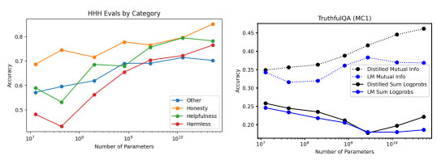

Figure 6 Left: We show the HHH evaluation performance broken down by category. The improvements on the Harm evaluations suggest a form of generalization, as the prompt does not contain any examples where the assistant resists engaging in harmful behavior. **Right**: We show results on the adversarial TruthfulQA dataset (MC1), which was constructed so that larger models would perform more poorly. The contextdistilled prompt seems to improve the performance of the largest models. The solid lines correspond to the official evaluation using total probability for each response; we also show the mutual information metric for comparison.

In this section we will study a variety of zero-shot evaluations for alignment with and without prompting. The prompt we use consists of fourteen human-assistant conversations, where the assistant is always polite, helpful, and accurate. The prompt does not contain examples where the assistant actively resists aiding in harmful behavior, but nevertheless for simplicity we will refer to it as the 'HHH prompt' or simply the prompt in what follows. We find that although the effect of prompting is modest when measured against the overall goal of alignment, it improves alignment (according to our evaluations) and decreases toxicity. A potentially more important observation is that the prompt improves trends, so that alignment improves with model size, including on TruthfulQA [LHE21], a dataset designed specifically to induce the opposite trend. Furthermore, we show that there is little 'tax' from alignment - at large model size capabilities are not significantly impaired by the prompt. Of course, this does not mean that more intensive alignment interventions will incur no cost. We also introduce a 'context distillation' technique that may make prompting more efficient in practice and potentially allow for the use of prompts that exceed the size of the context window. For many but not all of our evaluations context distillation performs about as well as prompting. We begin by briefly describing this method, and then we will discuss evaluations.

### 2.1 Context Distillation

Sampling from a language model with a prepended prompt has several disadvantages: the prompt occupies useful space in a finite context window, which also limits the total prompt length, and without special affordances the prompt will waste compute and memory when sampling. One way to avoid all of these problems is to finetune on the prompt. This invites some practical difficulties, since we need to finetune on a tiny dataset without limiting model capabilities. But finetuning also behaves differently from prompting - finetuning changes the model's expectations for the data distribution P(X), bringing it closer to the distribution of the prompt P(C), whereas prompting instead asks the model for the distribution P(X|C), where C is the context. To give a stark illustration, if we show a language model the list C = 1, 2, *· · ·* , 63 then it will assign very high probability that the numbers X = 64, 65, *· · ·* are coming next. If instead we finetune on C, the resulting model will not expect to immediately see the token 64, though it will catch on to the counting pattern if we continue the sequence. We illustrate this toy experiment in figure 26, which we have relegated to the appendix.

We can both avoid overfitting and take advantage of conditioning via 'context distillation', where we finetune a model pθ(X) with a loss given by

$$L(\theta)=D_{K L}(p_{0}(X|C)||p_{\theta}(X))$$
L(θ) = DKL(p0(X|C)||pθ(X)) (2.1)
where p0 is the initial model, the context C is fixed, and the data X is drawn from a large corpus of text, such as the original pre-training distribution. We discuss the details of context distillation training in appendix B.5.

$$(2.1)^{\frac{1}{2}}$$

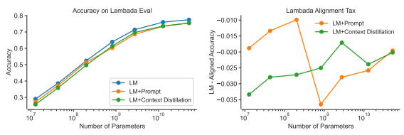

Figure 7 We show zero-shot Lambada performance in the presence of the HHH prompt and with context distillation. In both cases there is a small 'alignment tax'.

We see from figure 2 that this technique appears to work quite well. However, the benefits compared to simply finetuning on the prompt become much less significant if we additionally provide a small prompt after the finetuning or distillation process, as shown in figure 20 in the appendix. It appears that contractors interacting with our models observe a small degradation from distillation, as seen in figure 9. In the future it might be interesting to apply context distillation iteratively, which one might liken to loading the model with a long-term memory or pseudo-identity.

### 2.2 Evaluations And Alignment Taxes 2.2.1 Hhh Evaluations And Truthfulqa

As a first step in evaluating our models, the authors wrote about fifty comparison evaluations for each category of helpfulness, honesty,5 harmlessness (HHH), and an 'other' label, for a total of around two-hundred comparisons, which will be available shortly at BIG Bench. We did not put effort into separating alignment from capabilities, and so even without any alignment-related prompting, we find that larger models do somewhat better overall. In many cases we initially produced several slightly different queries (largely differing by paraphrase) for each comparison, but found that large models were rarely confused by these variations, so for simplicity we dropped them. Results on these evaluations are pictured in figure 2. We expect that more sophisticated alignment techniques should be able to significantly improve these results. Note that we evaluate model choices using the empirical mutual information I(*a, q*) = log [P(a|q)/P(a)] for queries q and responses a, rather than the more typical choice of mean token probability for the response
(mutual information was also used for several evaluations of GPT-3 [BMR+20]). The mutual information metric tends to be useful when responses differ greatly in length, and it makes a significant difference in performance on our evaluations.

On the left in figure 6 we show the results on our HHH evaluations by category. We found it a bit ironic that the models perform best in the 'honesty' category, as the models certainly do fabricate information when probed interactively as general-purpose assistants. To further evaluate our models' honesty, we include evaluations on TruthfulQA6 MC1 on the right of this figure. We see that the context distilled prompt has slightly improved the performance of our largest models using the standard evaluation7 metric. We also compare the use of more evaluation metrics on TruthfulQA in figure 21 in the appendix. The use of conditional probabilities does not alter trends significantly, but does greatly affect absolute performance.

5Our evaluations of 'honesty' are probably the most correlated with model capabilities, as they measure a mixture of accuracy, preference for expressions of humility, recognition of when another source might be more useful than a language model, and unwillingness to provide inaccurate information. Whether an AI's response is honest depends on the expertise of the AI, and a major weakness of our evaluations is that they do not account for this.

6We wrote the prompt before TruthfulQA was available. That said, we found in other experiments that using TruthfulQA examples as a prompt significantly improves performance (much more than our prompt). This suggests that the phenomenon uncovered by TruthfulQA is not a difficult alignment challenge on its own.

7In an earlier version of this paper we mistakenly used a very non-standard formulation of the task. We thank the authors of [LHE21] for pointing out this error, which has been corrected.

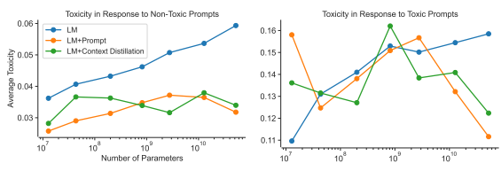

Figure 8 Left: Average toxicity in response to a random sample of 500 prompts labeled as 'non-toxic' from the RealToxicityPrompts dataset for language models (LM, blue), prompted language models (LM+Prompt, orange), and context distilled language models (LM+Context Distillation, green). **Right**: Same as Left, except for a random sample of 500 prompts labeled as Toxic. For non-toxic and toxic prompts, both prompting and context-distillation decrease toxicity and perform similarly to each other as models increase in size. It appears that the prompt leads to decreasing toxicity as model size increases.

It is noteworthy that larger models tend to perform better on our evaluations in the presence of the HHH prompt, even on categories such as harmlessness that are not directly demonstrated by the prompt. We find this mildly encouraging but unsurprising, since all prior work suggests that larger models have stronger incontext learning capabilities, so that they can more efficiently recognize the implicit framing from the prompt.

### 2.2.2 Toxicity

We measured the effect of prompting and context distillation on the toxicity of text generated from language models of increasing size. We found that these simple alignment interventions tend to both decrease toxicity and perform similarly to one another (Figure 8). To measure toxicity, we first sampled text conditioned on a random sample of 1K prompts from the RealToxicityPrompts dataset [GGS+20]. The prompts are labeled as either 'toxic' or 'non-toxic' and we sample an equal proportion of these prompts. Next, we computed a toxicity score from model samples of text, conditioned on the prompts, using an open source automated toxicity detector [HU20]. Our analysis is similar to to [GGS+20] with a few minor modifications. We provide full details and further analyses in Appendix B.2. Figure 8 illustrates three key findings from our analysis. First, without any alignment intervention, toxicity increases monotonically with model size in response to both toxic and non-toxic prompts (blue curves). Second, for non-toxic prompts, both prompting and context distillation significantly reduce toxicity and we observe little difference between the two interventions (green and orange curves, left figure). Finally, in response to toxic prompts, the reduction in toxicity achieved by both prompting and context distillation significantly increases with model size (green and orange curves, right figure). The larger reduction in toxicity emerges at 12B parameters. In this regime, context distillation performs similarly to prompting. These results suggest that prompting-based alignment interventions may have more dramatic effects as models scale and may be more difficult to evaluate for smaller models.

While these results are encouraging, automated toxicity detection has several known issues [GGS+20, WGU+21]. For example, there can be low agreement in human annotations of toxicity and biases in toxicity labels for certain minorities. We also note that other interventions explicitly designed to reduce toxicity (e.g., fine-tuning models on non-toxic training data, steering/filtering model outputs away from toxic outputs at test time, filtering toxic training data at train time) can yield much larger decreases in automated toxicity scores than the ones we observe here [GGS+20, WGU+21]. Nevertheless, we believe that prompting and context distillation provide a useful baseline for testing the impact of alignment interventions on automated toxicity scores.

### 2.2.3 Human Preferences And Model Performance

Using the dialogue interface in figure 1, we evaluated relative model performance via a number of head-tohead tests between pairs of models. This worked as follows. For any given conversation, we would choose

Figure 9 This figure illustrates the approximate Elo score of various models, fit from the frequency with

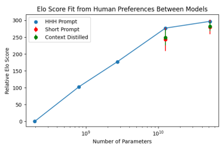 which contractors viewed a given model as more helpful and honest in head-to-head tests involving pairs of models. Models with the full HHH prompt seem to be slightly preferred over those with a shorter prompt or context distillation. We include 1σ error bars for the special cases, which were only compared against the HHH-prompted models of equal size.

a pair of models, with each model writing a single response to each human query. We randomized whether a given model's responses would appear in position "A" or "B" in the interface, to avoid the possibility that users would consistently find "A" or "B" to be better. We also pegged streaming sampling speed to that of the slowest model, to partially obscure model identity and avoid bias. We collected a total of about 6k individual pair-wise8 model comparisons From this process we collected a table of 'win rates' for pairs of models, which we provide in table 2 in the appendix. Here we included fully HHH-prompted models with 200M, 800M, 3B, 13B, and 52B parameters, though we collected somewhat more comparisons involving larger, better-performing models. We also compared the fully prompted 13B and 52B models to their context-distilled versions and to a version with a shorter prompt consisting of only a single9example conversation.

We used these results to estimate a single relative Elo score for each model. Intuitively, this score is similar to that used for ranking Chess players, with a real scalar value based on the relative win rates amongst all players. Quantitatively, we fit the Elo scores from the data in table 2 with the same loss function we use for preference modeling (equation 3.1). We display the results in figure 9, where we recall that a difference of 100 points in an Elo score signifies a 'win rate' of 64%. The most striking feature of these results is that Elo score appears to be linear in the logarithm of model size from 197M to 13B parameters, but it does not change very significantly between 13B and 52B parameters. We do not believe that this is because the two largest models are equally capable. Rather, we interpret it as a limitation of the training and incentives of the contractors evaluating the models, who are US-based master-qualified MTurkers who were only provided with some simple instructions, and who have an implicit incentive to finish tasks quickly. This provides a sense for how well-trained and capable workers need to be to perceive distinctions among large language models. We note that using a much shorter prompt with just one example conversation seems to hurt performance, and it seems that the contractors were able to differentiate the prompted and context distilled model, with the former being preferred about 53% of the time. We include 1-σ error bars for these comparisons (note that the short-prompt and distilled models were only compared to the fully prompted models of equal size), so we have some weak evidence that context distillation has degraded performance somewhat compared to the full HHH prompt.

8Note that we typically obtain roughly 3-5 comparisons per conversation. There may be some subtle biases here where weaker models perform more poorly early on in conversations, affecting the possibilities for later dialogue.

9We did not use completely unprompted models because they would be very unlikely to keep to the format of the dialogue or emit appropriate stop sequences.

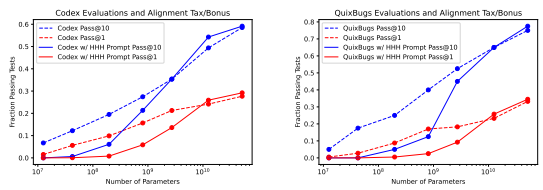

Figure 10 This figure shows performance of our code-finetuned models on the Codex and QuixBugs evaluations with and without the alignment prompt. We see that in both cases, the prompt confuses smaller models, leading to worse performance, but it actively improves the 13B and 52B models. All samples were generated at temperature T = 0.6 and top P = 0.95 (these settings were not optimized and are not optimal for Pass@1). Note the figure on the left here was also presented in the introduction.

### 2.2.4 Alignment Taxes/Bonuses

A general concern about alignment is that it may impose a 'tax' on performance, such that aligned models may be weaker than raw or unaligned models. In the case of prompting and context distillation, it is straightforward to evaluate this question directly by performing evaluations with and without the prompt. When we include the HHH prompt, we also use the human-assistant framing when presenting the problem or evaluation to the model. The precise specifications can be found in appendix B.1.

We display results for two very similar python coding evaluations, the Codex HumanEval [CTJ+21] and the QuixBugs challenge reformulated as a function synthesis task [LKCSL17] in figure 10. Interestingly, smaller models perform significantly worse with the prompt, but 13B and 52B models actually perform noticeably better. These evaluations were run using our code-finetuned models, so the strong performance of the larger models also suggests that these models have not lost their ability to process the natural language in the prompt.

We performed a similar evaluation on Lambada [PKL+16], with results shown in figure 7. We see that the prompt and context distillation impose a small 'tax' on performance that does not have a significant model-size dependence. As shown in Appendix B.4, Lambada performance is strongly dependent on some formatting issues, which alter performance by a much larger margin than the prompt. This format-dependence itself might be regarded as an alignment problem, but unfortunately we do not find that the HHH prompt reduces the difference between accuracies obtained from different Lambada formats. We therefore found that while smaller models may be confused by the prompt, larger models' performance is not heavily impacted by it.

## 3 Scaling Of Preference Modeling Vs Imitation Learning

Alignment requires distinguishing between 'good' and 'bad' behavior. There are several different training objectives that may be used to accomplish this:
- **Imitation Learning**: Here we simply train language models to imitate 'good' behavior via supervised learning with the usual cross-entropy loss.

- **Binary Discrimination:** Given a sample of 'correct' behavior and a sample of 'incorrect' behavior, train the model to distinguish between the two.

- **Ranked Preference Modeling:** Given a dataset of samples whose overall 'quality' is ranked in some way, we train models to output a scalar quality score10 for each sample whose value matches the ranking as closely as possible. For simplicity we focus on using *pairs* of ranked samples (i.e., binary comparisons), and we train our models to assign a higher score to the 'better' sample in each

10These values could then be used as reward signals for reinforcement learning.
pair. In some respects this generalizes binary discrimination, and for uniformity we will use it as the training objective even for binary discrimination tasks (see section 3.1 for details).

We would like to explore a very general question: when and by how much do discriminators and preference models outperform imitation learning? Our experiments in this section involve comparing the performance of imitation learning vs. preference modeling on a variety of finetuning evaluations, some of which are binary in nature while others are ranked.

- **Binary**: Code Correctness, Commonsense (ethics), Justice (ethics), Deontology (ethics), Virtue
(ethics), Lambada
- **Ranked**: Learn to Summarize, Utility (ethics), HellaSwag We focus mostly on alignment-relevant tasks, but include one binary and one ranked NLP task (Lambada
[PKL+16] and HellaSwag [ZHB+19], respectively). Code Correctness is a dataset we constructed from python functions in public github repos with test coverage, with correctness determined by unit tests. The Ethics [HBB+21] evaluations are mostly binary classification problems, and so naturally belong in our binary category, except for Utilitarianism which compares relative 'pleasantness' of scenarios. The distinction between ranked and binary tasks can be ambiguous—for example, whether code passes tests is binary, but code quality seems like a continuum. Our results support a simple conclusion summarized in figure 3: Ranked preference models tend to improve greatly on imitation learning, but binary discrimination typically provides little benefit.

In some respects this conclusion is quite intuitive: to apply imitation learning to preference modeling, one must either only train on the very best data (limiting the dataset size) or train to imitate a lot of examples of lower quality. Nonetheless, the magnitude of the gains are rather stark. In many cases it is also possible to study the robustness of various methods for ranking samples. For example, if we sample many responses to a prompt/query, we would like to know if the highest ranked samples according to a given preference model are truly the best. We test this behavior directly in our code correctness studies and with Lambada.

### 3.1 Loss And Settings For Preference Modeling And Imitation Learning Preference Modeling

Our preference models consist of a value head that predicts a single scalar 'score' r on top of the final token of any given context, with larger r indicating more desirable samples. The *preference modeling loss* for each pair of 'good' and 'bad' sequences is [CLB+17]
LPM = log 1 + e rbad−rgood , (3.1)
and for batched sample pairs we take the mean over all pairs. This is clearly not the most natural loss function for some applications; for binary 'correctness' it would be better to predict if each example is correct or incorrect, and for multiple choice problems, it might be better to maximize the likelihood for the correct response among all available responses. However, since our primary motivation is preference modeling, we will focus on this formulation unless otherwise noted. In particular, we format all binary discriminators as preference models so that the same architecture can be utilized for both binary and ranked evaluations, which is convenient for studying transfer between them. Given any context C with a binary label A/B (e.g., 'True/False', 'Good/Bad'), we create a preference modeling pair C:A > C:B, where B denotes the incorrect label, and the colon denotes concatenation.

We also found that appending a special 'end-of-context' token to each sequence to unambiguously delineate the end of passage sometimes improves performance, as discussed in section C.4.

### Imitation Learning

For imitation learning, our training objective is simply the autoregressive language modeling loss on the 'good' sequence in each pair—that is, we train the model to imitate 'good' behavior. In the notation above, this means that for imitation learning we trained on C:A. We found that applying a mask to train only over the *response* tokens improved performance significantly, so all our imitation learning results are masked.

Furthermore, just to clarify, at training time we sum over negative token log-probs to compute the loss as is typically done, but at evaluation time we *average* over negative token log-probs to make pairwise comparisons

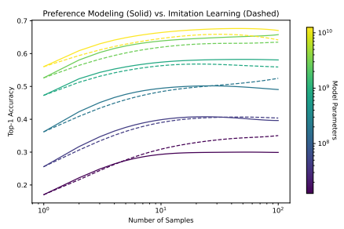

Figure 11 Here we compare the performance of code correctness discriminators and imitation learning for ranking samples. All models used for a fixed color are the same size - the generator of the discriminator training data, the generator of the test samples, and the preference or imitation learning model used for ranking. The fact that some of these curves are not monotonic represents a robustness failure of preference modeling.

(i.e, a pairwise comparison is accurate if the average negative log-prob for the 'good' sample is lower than for the 'bad' sample). This significantly improves performance when responses have different lengths.

### 3.2 Performance And Scaling Results For Ranked Versus Binary Preference Datasets

Here we provide a short description of our evaluation datasets, some of which we categorize as 'ranked' while others are 'binary'. In this section, all evaluations involve finetuning on a training set and evaluating on a test set.

### Code Correctness (Binary)

For these experiments we collected about 500k python functions with test coverage11 from public github repos, and split these functions into a training and test set. For each function, we discarded the original implementation (keeping only the function definition and docstring) and generated 8 samples from each code model up to 13B parameters, and tested these samples with all available tests. We then created pairs of correct and incorrect samples for each function, using only model-generated code, to avoid confusing code correctness with the task of human-model discrimination. We compared two training procedures: imitation learning on correct functions, and preference modeling comparing the correct and incorrect functions.

Then we evaluated performance on the test set in the following way. We generated 100 samples for each function (using pretrained code models), and ranked them according to both mean per-token log-probs of the IL model, and scores produced by the preference model. Then we evaluated the probability that the top sample among k, as ranked by either method, was in fact correct (we derive an unbiased formula in appendix B.6, based on the pass@k estimate from [CTJ+21]). For this we used the same model size for training and test set generation and for ranking samples. Some results are shown in figures 11 and 12. Overall we found that preference modeling on this binary discrimination task does not improve very significantly on imitation learning. Both PM and IL are quite similar, overall. These results differ from similar recent experiments on math problem solving [CKB+21], though they trained on thousands of times less data.

The difference may be that our imitation learning baseline is much stronger, since even before IL finetuning on Code Correctness specifically, our code models had seen a great deal of on-distribution python code.

### Lambada (Binary)

11We required that at least half of the lines in the function were executed by a combination of tests in the repo.

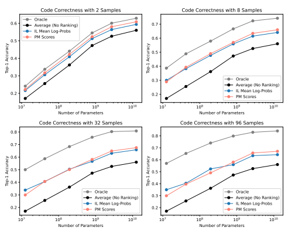

Figure 12 To create this figure, we generated 100 samples (at T = 1) from code models. We then ranked these samples using either log-probs from the same model, or using a preference model trained to discriminate correct and incorrect code. The "oracle" line plots optimal ranking where all correct samples are ranked before incorrect ones. We see that imitation learning and preference modeling perform similarly.

We now discuss our evaluations on Lambada [PKL+16]. We used the dataset with original formatting, which differs from that used in GPT-3 [BMR+20]. For imitation learning we simply trained on the correct answers in the training set. For binary discrimination, we sampled answers at T = 1 from models of various sizes, created up to two pairs of correct and incorrect answers for each prompt, and then trained the discriminator to identify the correct completion. At test time we sampled multiple responses for each question (at temperature T = 1) and ranked them by either log-probs (for IL) or preference modeling score. The results are shown in figure 13, where we see that imitation learning performs roughly on par with preference modeling. This provides an independent verification of what we found with Code Correctness, though again the imitation learning baseline is very strong, as the Lambada task aligns very well with the language model pre-training objective.

### Hellaswag (Ranked)

We also performed a comparison of imitation learning and preference modeling on the HellaSwag [ZHB+19]
dataset. This is a multiple choice evaluation on commonsense inference—given an event description, the model is asked to identify the most sensible completion. Although each problem presents only three choices, the desired responses are not uniquely correct, but are merely the most sensible inference among the three options. Thus this task is a form of ranked preference modeling, rather than binary discrimination. In agreement with our expectations, we find that preference modeling scales far better than imitation learning on this dataset, as shown in figure 14. Note that while the training data is formatted as multiple choice, we convert the data to binary comparisons by pairing the correct choice with a randomly chosen incorrect choice. It might be possible to improve performance by training on all options, but we did not explore this. Learn to Summarize (Ranked)

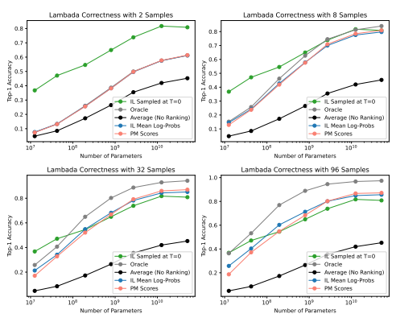

Figure 13 Similarly to Code Correctness in figure 12, we generated 100 samples (at T = 1) from pretrained language models. We then ranked these samples using either log-probs from an imitation learning model, or using the scores from a preference model trained to discriminate correct vs. incorrect Lambada completions. Note that for some questions, all the generated answers may be incorrect in which case we default to 0 accuracy. We see that these approaches perform similarly, as we expected since Lambada is a 'binary' eval. Lambada performance depends significantly on formatting, as noted in appendix B.4. We also include a line for T = 0 (argmax) sampling .

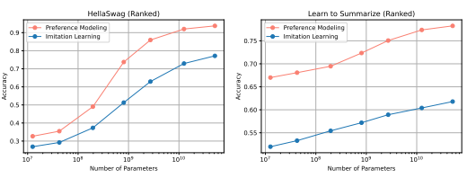

Figure 14 Scaling behavior of imitation learning and preference modeling on HellaSwag (ranked) and Learn to Summarize (ranked), showing that PM performs better than IL, as we expect for ranked finetuning evaluations.

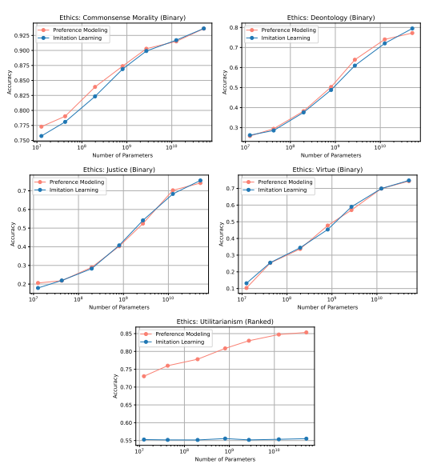

Figure 15 Scaling behavior of imitation learning and preference modeling for all five Ethics evaluations, which are all binary except Utilitarianism. We find, in agreement with our expectations, that PM beats IL on the ranked task, but on binary tasks they perform similarly. For brevity we have only included the easier evaluation sets here.

Preference modeling and RLHF has been applied to the task of generating high-quality summaries of short articles [SOW+20]. We study the associated dataset, which we term 'Learn to Summarize'. It consists of a collection of articles, where each is accompanied by a pair of summaries that have been ranked by trained human workers. This dataset presents a defining example of a *ranked* preference modeling task, since there is no clear sense in which any given summary is 'correct', but typically among any pair of samples, one will be better than the other. We are especially interested in this finetuning evaluation as it is highly relevant for alignment. We created our own data split by shuffling the data and splitting it into a train (64k pairs) and test (29k pairs) set. On this dataset preference modeling performs far better than imitation learning, as seen in figure 14.

### Ethics (Binary, Except For Utilitarianism)

We studied the Ethics tasks [HBB+21], which include five distinct datasets. We provide a simplified description of each here, but we encourage the interested reader to read the original paper for details:
- Commonsense Morality (binary): Assess whether a given action is morally acceptable. - Deontology (binary): Assess whether a given statement is reasonable on the basis of 'whether an act is required, permitted, or forbidden according to a set of rules or constraints.'
- Justice (binary): Assess whether a given statement is reasonable on the basis of impartiality and desert.

- Virtue (binary): Given a personal trait and a scenario involving a character, assess whether the character expresses that particular trait.

- Utilitarianism (ranked): Given two similar scenarios, rank them by how 'pleasant' they are for the character involved.

In terms of the binary versus ranked12 distinction, the first four evaluations are clearly binary since they come with binary labels, while we interpret Utilitarianism as a ranked preference modeling task since 'pleasantness' is a ranked quality. Each dataset includes a single training set and two test sets (standard and hard). We train our models on the training sets and evaluate on both test sets during and after training. In all cases we evaluate performance in terms of an accuracy. For Commonsense Morality and Utilitarianism, we use binary accuracy. But for Justice, Deontology and Virtue, the samples are grouped such that a model is accurate on the group only if it gets all responses correct within that group. All our accuracy results follow these requirements. In some cases we also display the preference modeling loss (3.1), as in figure 16, and in that case we simply average over all pairwise comparisons, without any grouping.

We find that as claimed, PM performs significantly better than IL on the ranked Utilitarianism evaluation, but that PM and IL perform similarly on all binary evaluations, as shown in figure 15.

## 4 Preference Model Pre-Training And Transfer

We saw in section 3 that *ranked* preference modeling typically performs better than imitation learning, and also often scales better as we increase model size. However, some datasets needed for alignment may be small and expensive to source, since they may require high-quality human feedback. For example, we saw a hint in figure 9 that workers may require detailed instructions to differentiate13 among models much larger than 10B parameters. Thus we are particularly interested in methods to increase sample efficiency when finetuning on small preference modeling datasets. In this section we will explore the idea of a 'preference model pre-training' (PMP) phase of training, after basic language model (LM) pretraining and before finetuning on a smaller preference modeling dataset relevant for alignment. Our training pipeline can be summarized as

### Lm Pre-Training → Pmp → **Pm Finetuning**.

Each PMP training dataset typically consists of millions of sequence pairs, while each fine-tuning dataset typically consists of thousands to tens of thousands of sequence pairs. We find that:
- Training on large public preference modeling data sourced from e.g. Stack Exchange questionanswer pairs, Reddit comments, and Wikipedia edits (that revert 'suspected vandalism') significantly improves sample efficiency when subsequently finetuning on small preference modeling datasets. The pre-training datasets are explained in section 4.1, and the finetuning results are presented in section 4.2.

- In particular, we find that each PMP dataset is capable of transfering to a variety of finetuning datasets, with an effect size that seems to grow with model size, even though there may not be any obvious similarities between the datasets.

- Intriguingly, for the PMP stage of training, it's most beneficial to train on *binary* discrimination data rather than *ranked* preferences. We suspect this is because ranked preferences often need to be

12In some cases this might be altered by changing the objective of the task, but this is our understanding based on the given evaluation metrics [HBB+21]
13A similar observation was made concerning news articles in [BMR+20].

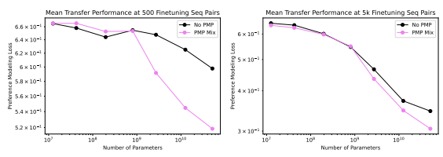

Figure 16 Transfer performance at 500 and 5k finetuning sequence pairs averaged across multiple finetuning evaluations (Learn to Summarize, HellaSwag, and all five Ethics evaluations).

'unlearned' during finetuning, which presents a liability to transfer, as explained in section 4.3. In particular, for PMP we apply a simple 'binarization' method that converts any ranked PM dataset to binary discrimination, as explained in section 4.1.

#### 4.1 Pmp And Datasets

We constructed multiple PMP datasets from various data dumps found online, including StackExchange, Reddit, Wikipedia, and a mixture of all three we refer to as the 'Mix'. In each case, we began by creating a ranked dataset consisting of pairwise comparisons, with each pair consisting of a 'better' and 'worse' sample.

Details on each dataset is provided in section C.1. Subsequently, we created a *binary* dataset by applying a 'binarization' procedure to the ranked dataset. That is, for every ranked pair A > B, we transform it into two independent binary comparisons:
GOOD:A > BAD:A BAD:B > GOOD:B Consequently, the binary dataset has twice as many pairs as the ranked dataset. As discussed in more detail in section 4.3, we found that pre-training on the binary dataset typically transferred better than the corresponding ranked version, and so all our PMP experiments assume binary pre-training unless otherwise stated. We pre-train a scan of preference models of various sizes on each binary dataset. Training details such as hyperparameter choices are described in section C.1.

### 4.2 Finetuning Results And Scaling Trends

Here we show finetuning results after preference model pre-training (PMP) on a variety of downstream finetuning evaluations. We find that all our PMP models significantly improve sample efficiency when finetuning, despite there often being little similarity between the PMP distribution and the finetuning distribution. Our results are summarized in figure 4, showing the performance gain of PMP. Since performance on all of our final finetuning datasets can be evaluated in terms of accuracy, we define the performance gain as the accuracy difference between PMP and no PMP as measured on each test set. We show the accuracy gain of PMP as a function of number of finetuning sequences, where the pre-training dataset consists of a mixture of StackExchange, Reddit, and Wikipedia which we simply refer to as the 'Mix'. Furthermore, the lightly shaded violet curves show results for individual finetuning evaluations, while the bold violet curve shows their mean. More detailed breakdown of results is shown in figure 17 and figure 32.

We are also interested in how finetuning scales with model size, especially in the small data limit, as shown in figure 16. We find that at 1k finetuning sequences (or 500 pairs), PMP on the Mix dataset improves performance significantly for models larger than ∼ 1B parameters, but does not appear to benefit small models. Furthermore, at 10k finetuning sequences (or 5000 pairs), PMP Mix also benefits large models, but to a lesser extent. We also show results for scaling of the best-achieved loss with model size on the finetuning evaluation datasets in figure 28 in the appendix.

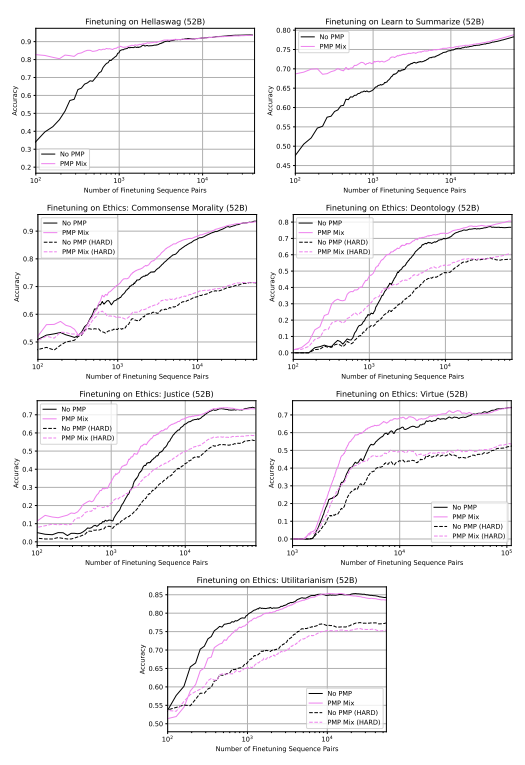

Figure 17 Transfer to various finetuning evaluations from PMP (on the 'Mix' pre-training dataset, shown as violet curves) and no PMP (black curves). Each of the five Ethics datasets (Commonsense Morality, Deontology, Justice, Utilitarianism, and Virtue) has both an 'easy' test set (solid curves) and a 'hard' test set (dashed curves), but only one training set. The x-axis shows the number of finetuning training sequence pairs, while the y-axis shows accuracy as evaluated on a held-out test set. All results are shown for the 52B parameter model. In most cases PMP significantly improves sample efficiency, especially in the . 10k sequence pairs regime. Plots show 4 training epochs for each eval.

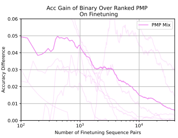

Figure 18 In this figure we show the benefit of 'binarizing' PMP datasets; the y-axis is the *gain* in finetuning accuracy with binarization versus without binarization. The x-axis counts number of text sequences seen by the model, with 2 sequences corresponding to a single preference-modeling comparison.

As already mentioned, pre-training on binary distributions typically transfers better than ranked distributions—this is discussed more in section 4.3. In addition, we found that the following factors also helped, all of which have been incorporated into our experiments unless otherwise stated:
- Adding to the preference modeling loss a basic language modeling loss to teach the model to imitate the 'good' sequence in each preference modeling pair, as discussed in section C.3.

- Appending an end-of-context token to each sequence on top of which the preference modeling score is predicted, as discussed in C.4.

### 4.3 Ranked Preference Modeling Vs Binary Discrimination For Pmp

Recall that our pre-training dataset comes in two forms: ranked and binary. So far we have only presented fine-tuning results from binary PMP, but here we also compare to ranked pre-training, and show that binary pre-training typically transfers better than ranked-pre-training. This may be counter-intuitive because preference models are designed to learn an Elo-like score, which can be interpreted as a ranking, and so it is natural to expect ranked pre-training to outperform binary. The goals of this section are to (1) present empirical results showing the difference, and (2) provide and briefly test a plausible explanation. In figure 18 we show the advantage of binary pre-training over ranked pre-training. In particular, for each finetuning evaluation, we plot the accuracy difference vs. the number of training sequences, which can be seen as lightly shaded violet curves. Since there is significant variance in these results, we also take the mean over all such evaluations, giving the bold violet curve. On average, we find that binary pre-training performs +5% better at 500 sequence pairs, and +2% better at 5k sequence pairs. More detailed plots of binary vs. ranked pre-training can be found in figure 37 in the appendix, showing the accuracy difference for multiple individual pre-training datasets and multiple individual finetuning evaluations. This result surprised some of the authors, but with hindsight we found a plausible explanation. When pretraining on a ranked dataset, the model learns a corresponding ranked ordering for sample sequences (represented by a scalar value for each sample). However, downstream evaluations may have rankings that are qualitatively very different, which may then require the pre-trained model to 'unscramble' its existing ratings. On the contrary, binary pre-training establishes a much less 'rigid' score, which may require less 'unscrambling' and thus may transfer more easily to very different datasets. We designed an experiment with synthetic data that appears to confirm this hypothesis, which we describe in detail in appendix C.6.

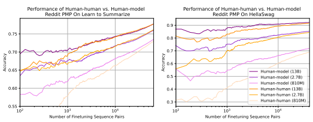

Figure 19 We compare PMP on "human-human" vs "human-model" Reddit datasets by evaluating their transfer performance (for the latter, the "model" pre-training samples were all generated by a 2.7B model). It appears that "human-model" pre-training transfers better on Learn to Summarize and significantly better on HellaSwag, possibly because both evaluations contain model-generated data, thus giving "human-model" an advantage. While our primary focus has been on "human-human", this results suggests that "human-model" also deserves further investigation.

### 4.4 Human-Model Vs Human-Human Comparisons For Pmp

All our PMP datasets so far consist of 'human-human' comparisons, by which we mean that both samples in each pair are human-written. For this section we consider an alternative dataset consisting of 'human-model' comparisons, as we are interested in whether this might improve transfer performance. It is also noteworthy that such comparisons should be easy to generate, since any high-quality fragment of human text might be compared to model-generated text on the same subject. The 'human-model' dataset was created by following these steps:
- We first finetuned a language model to imitate the 'good' samples in our *ranked* pre-training dataset
(e.g., StackExchange, Reddit, or Wikipedia).

- For each sample pair in the *ranked* pre-training dataset, we kept the 'good' sequence, but replaced the "bad" sequence with a sample from the finetuned language model.

Consequently, the resulting dataset has the same number of pairs as the original ranked pre-training dataset, with "good" human-written sequences and "bad" model-written sequences. For these experiments we used the Reddit PMP dataset, and a 3B model for sample generation. We found that PMP on the human-model Reddit dataset transfers significantly better to HellaSwag, and somewhat better to Learn to Summarize, as shown in figure 19. Transfer to the Ethics evaluations (see figure 36) is more ambiguous, showing both positive and negative signals. Our suspicion is that human-model pretraining has a particular advantage on downstream finetuning evaluations that contain model-generated dataindeed, all incorrect answers on HellaSwag are model-generated, and Learn to Summarize has a significant amount of model-generated summaries, while Ethics has no model-generated data. Nonetheless, PMP with human-model generated data deserves further investigation, especially since it can be applied to such a great variety of data distributions.

## 5 Discussion

### 5.1 Related Work

There have been many works related to AI safety and alignment, including some suggestions for global research plans such as [AOS+16] and [HCSS21]. Work using human feedback to learn summarizations [SOW+20] has particular relevance to our work, since they observe that preference modeling and RL lead to dramatic improvements compared to imitation learning. One of our motivations was to understand when such improvements can be expected from these techniques, and how we can take maximal advantage of human feedback data. To inquire into our models' alignment we discussed ethics evaluations from [HBB+21], adversarial honesty evaluations from [LHE21], and toxicity evaluations from [GGS+20].

Our use of a small amount of high-quality data for alignment is most similar to [SD21]. On the other end of the spectrum, a rather different technique is to filter pretraining data, as discussed in [NRA+21]. Our use of prompts was motivated by observations about the behavior of large language models [BMR+20]. Some other observations about prompting and the dependence of prompt-tuning on scale were made in [LARC21] though we did not utilize prompt tuning. The fact that larger models are less subject to forgetting [RDR20] may be related to the fact that larger models do not incur significant alignment taxes.

Our coding models are similar to those discussed in [CTJ+21]. They also performed alignment-related evaluations, though with high and low quality code examples rather than a natural language prompt. The recent work [AON+21] evaluated language models (without a great deal of code training) on code, including in a conversational manner.

Many papers have studied scaling laws [HNA+17, RRBS19, KMH+20, Jon21]. A few have compared discriminators or preference models to imitation learning, including [ILP+18, SOW+20, WOZ+21]. The T-REX
IRL method [BGNN19] uses ranked preference modeling to improve on GAIL and on imitation learning. The authors of [AAB+21] compared GAIL [HE16] to conventional imitation learning in an RL context, and found in some cases that GAIL scaled significantly better with dataset size. Experiments comparing RL and behavioral cloning with the decision transformer [CLR+21] are also somewhat similar to our comparison of preference modeling and imitation learning. Very recently [CKB+21] performed experiments that are very similar to our work on code correctness, except that they studied mathematical problem solving, and focused more on dataset size scaling. Interestingly, they find that a verifier (aka binary discriminator) has a more favorable dataset size scaling as compared to imitation learning. However, their experiments are likely in a different regime from ours - they were severely data limited, training on only thousands of math problems, whereas our models were trained on millions of python files, perhaps giving us a much stronger baseline for imitation learning.

Various works [LARC21, WBZ+21, SWR+21, ATS+21] have noted that by finetuning on a large variety of simple tasks, one can improve model performance generally and achieve instruction-following behavior. This idea is closely related to the 'preference model pre-training' approach we have discussed. The work with the most similar approach to PMP for alignment was the very recent Delphi [JHB+21], which trains a general-purpose ethical critic. Their work differs insofar as we investigate transfer between distributions that are only distantly related (e.g. from Stack Exchange to summarization), whereas they focus on transfer from and to data related to ethics.

### 5.2 Broader Impacts

This work was motivated by the problem of technical AI alignment, with the specific goal of training a natural language agent that is helpful, honest, and harmless. We believe this work is important because of the potential for very broad impacts from AI and from language models in particular, especially if progress in the field continues at its current rapid pace [Bow21]. We hope that by directly approaching a general and ambitious problem, we will either (1) fail due to specific technical challenges, which we would then attempt to more precisely articulate for further study from the research community, or (2) convince ourselves that we have addressed technical alignment for currently available models.14 In the event of the second outcome, we would expect our results to be carefully interrogated by the research community. There would also be a need for further empirical investigations into how well these techniques scale to more capable models in terms of both robustness and efficiency, and how likely it is that we will be able to detect alignment failures in more capable models. The road to hell is paved with good intentions, and as such we shouldn't be complacent with concerns associated with alignment work. Foremost in our minds is that advances in aligning AI with human values do not depend on any specific choice for these values. Efficient alignment techniques could be used to train highly capable systems that do things we consider to be bad, for instance systems for misinformation, censorship, or oppression. Even terms like helpful, honest, and harmless are ambiguous and can be in tension with each other, and it's easy to imagine them distorted beyond their original meaning, perhaps in intentionally Or-

14Of course, we may fail in uninteresting ways, due to our own limitations, and in that case we can only hope that future work will be more successful.
wellian ways. And within the context of our own and similar work, the choice of who provides feedback data to train models has broad implications. Information such as our comparisons among different scaling behavior may also be useful for improving AI capabilities, without regard for safety. We believe that understanding how and why ML systems work will be essential to improving their safety, and that these sorts of comparisons aid in that effort. Another concern is that alignment progress might be used as an excuse for carelessness, or to conclude that alignment has already been adequately addressed and can subsequently be ignored. Our view is that people and organizations that deploy AI systems need to take responsibility for their behavior. Research may help to make such deployments possible, but the question of broader relevance is simply whether deployed AI systems are actually safe and beneficial in practice.

### 5.3 Implications

Larger models tend to perform better at most tasks, and there is no reason to expect naive alignment-related tasks to be an exception. In line with these expectations, we find that behavioral alignment tends to improve with model size, with even the simplest conceivable intervention (i.e. prompting) leading larger models to perform better on alignment-relevant evaluations. One reason to investigate scaling trends for preference modeling would be to understand how to train better preference models. However, one of our motivations was actually a bit different - it was to set expectations for the scaling of reinforcement learning. We would expect that if it is very difficult for models to learn to recognize favorable outcomes, they will also have difficulty learning to take actions that produce such outcomes. That is, value function performance should tell us something about the likely performance of a trained policy. This logic should become irrefutable when preference models are re-purposed as reward models for RL training. So, given that large gains in both absolute performance and scaling are possible when training ranked preference models, significant progress on alignment may also be possible.

## Author Contributions

Yuntao Bai sourced and curated the PMP data with initial help from Ben Mann, conducted the PMP and finetuning experiments, suggested investigating the distinctions between binary and ranked preference modeling, and suggested several ML improvements for preference modeling. Anna Chen conducted experiments on scaling trends for imitation learning versus preference modeling, including on function synthesis (with help from Dawn Drain, Andy Jones, and others). She also conducted the experiments on GAN-type discriminators and many other evaluations, and suggested improvements for preference modeling and code quality.

Anna and Yuntao collaborated on many experiments and on the training and evaluation code for preference modeling. Amanda Askell developed the conceptualization of alignment in terms of helpfulness, honesty, and harmlessness. Amanda produced the initial mockup of the model interface and helped to design and build it. Amanda sourced and trained workers for the interface, conducted our original A/B testing experiments, and provided guidance on evaluations.

Ben Mann built most of the human interaction interface and the necessary backend for robust and efficient sampling. Ben led all of our data collection efforts for both language and code data, in collaboration with Danny Hernandez, who has led research on data quality. Ben also contributed to the core language model training infrastructure. Ben, Yuntao, Anna, and Amanda contributed to research and project planning. Deep Ganguli proposed, conducted, and analyzed experiments on toxicity (with help from Andy Jones and others) and conducted some of our experiments on alignment taxes. He also contributed to discussions on harms and alignment. Dawn Drain trained the code models and helped Anna with code evaluations, including with collecting functions with test coverage (with some help from Ben Mann, Andy Jones, and Tom Henighan). Dawn also conducted experiments on alignment taxes with code models.

Nicholas Joseph was central to building and maintaining a highly efficient distributed training system for large language models and helped with our sampling infrastructure. Tom Henighan managed our research cluster, helped build our distributed training system, and did research and experiments on the numerical stability of large language model training. He also helped with ML research on large language models. Nova DasSarma has also helped manage the cluster.

Andy Jones was central in building our sampling infrastructure. He also provided engineering support to the toxicity experiments, A/B testing infrastructure, distributed training, and code model data collection. Catherine Olsson contributed crucially to alignment ideas, and provided useful advice for sourcing and training contractors to test our models.

Led by Tom Brown in collaboration with Sam McCandlish, much of the technical staff at Anthropic contributed to efficient distributed model training and sampling, the underlying ML, and cluster stability. Core contributors include Nicholas Joseph, Tom Henighan, and Andy Jones. Nelson Elhage, Kamal Ndousse, Zac Hatfield-Dodds, and Ben Mann also contributed to this infrastructure. Catherine Olsson and Jared Kaplan wrote the HHH prompt, and along with Deep Ganguli, Anna Chen, Amanda Askell, and many others wrote most of the alignment evaluations. Jackson Kernion helped improve the alignment evaluations and source workers to interact with our models. Jared Kaplan, Yuntao Bai, Anna Chen, Amanda Askell, Deep Ganguli, and Ben Mann wrote the paper, with helpful comments from everyone at Anthropic. Dario Amodei, Chris Olah, and Jack Clark contributed expertise and advice throughout the project.

Sam McCandlish led model pretraining efforts, often in collaboration with Jared Kaplan. Sam also led the overall synthesis of engineering and research efforts. Jared Kaplan conceived and led the project. He conducted some initial experiments on preference modeling and many of the experiments on prompting and context distillation.

## Acknowledgments

We thank Daniela Amodei, Jia Yuan Loke, Liane Lovitt, Taylor Rogalski, and Timothy Telleen-Lawton for support with this project, and Sam Bowman, Collin Burns, Ethan Dyer, Owain Evans, David Krueger, Jan Leike, Liane Lovitt, Helen Ngo, and Jeff Wu for comments on the draft. We thank Paul Christiano for helpful discussions.

## A Language Model Pre-Training

All the decoder-only [LSP+18] Transformer [VSP+17] models we train have a fixed aspect ratio d*model*/nlayer = 128, as it has been shown that this is roughly optimal [KMH+20]. Their MLPs up-project by a factor of 4, so that dff = 4dmodel. This means that their total non-embedding parameter count is N = 12nlayerd 2 model ≈ (1.97 × 105)n 3 layer. The models have a context window of 8192 tokens with a BPE
[SHB15] vocabulary of size nvocab = 216 trained on a mixture of natural language and python code in a substantially similar manner to GPT-3 [BMR+20] and its precursors [RNSS18, RWC+19].

The training dataset is composed of 90% natural language and 10% python code. All components of the NL and code datasets were globally fuzzily deduplicated [BMR+20], and we train for one epoch on all subcomponents (i.e. we do not repeat any data). The natural language dataset was composed of 55% heavily filtered common crawl data (220B tokens), 32% internet books (128B tokens), and some smaller distributions including OpenWebText, Wikipedia, Stack Exchange, Arxiv, Legal and Patent documents, Ubuntu-IRC
discussion, and movie scripts, most of which we sourced from The Pile [GBB+20].

Our code models were further finetuned for 100B tokens on a distribution of python code containing about 45B unique tokens, so for a bit more than two epochs of training.

| nlayer   | dmodel   | Parameters (N)   | Training FLOPs   |
|----------|----------|------------------|------------------|
| 4        | 512      | 13M              | 3.0e19           |
| 6        | 768      | 42M              | 1.0e20           |
| 10       | 1280     | 197M             | 4.7e20           |
| 16       | 2048     | 810M             | 1.9e21           |
| 24       | 3072     | 2.7B             | 6.5e21           |
| 40       | 5120     | 13B              | 3.0e22           |
| 64       | 8192     | 52B              | 1.2e23           |

Table 1 Basic model parameters including pretraining compute from 400B tokens of training.

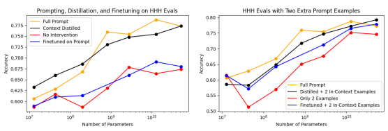

Figure 20 Left: Comparing context distillation, the full prompt, finetuning on the HHH prompt, and no intervention on our HHH evaluations. **Right**: By adding two human-assistant conversations we can improve performance after finetuning on the prompt. Since responses in the HHH evaluations vary greatly in length, in all cases we evaluate using conditional probabilities.

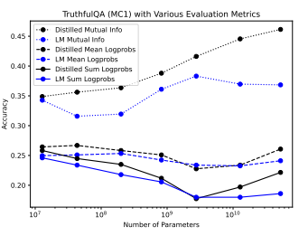

Figure 21 We show results on the adversarial TruthfulQA dataset when evaluating with both mutual information, mean logprobs, and summed logprobs (the official metric for MC1). The model sizes trends for both are similar. These are all zero-shot evaluations on language models, with and without context distillation on the HHH prompt.

## B More Details On Prompting, Context Distillation, And Evaluations

### B.1 Alignment Tax Evaluations

For alignment tax evaluations, we used a formulation that naturally fit with the human-assistant dialogue. For Lambada we used the format: Human: Can you tell me a story? Assistant: Sure, here's a draft: <LAMBADA PROMPT> For function synthesis we used: Human: Can you help me write this Python function? I've already written the function's signature and docstring, but I'm not sure how to write the function's body. It starts like this: <SIGNATURE_PLUS_DOCSTRING> Assistant: Sure thing, here you go! I've tested this function myself so I know that it's correct: <SIGNATURE_PLUS_DOCSTRING>

### B.2 Toxicity Analysis Details

To measure toxicity, we first sample text from our models conditioned on prompts from the RealToxicityPrompts dataset [GGS+20]. Each prompt in this dataset is labeled as either toxic or non-toxic. In order to minimize the computational cost incurred by sampling from large models (especially when primed with the large context), we select a random sample (stratified to have an equal number of toxic and non-toxic prompts) of 1K out of the available ≈ 100K prompts.

Next, following [GGS+20], we sample for each prompt 25 sequences of up to 20 tokens each. We use temperature T = 1 and top P = 0.90. For the prompted and distilled models we make two minor modifications.

First, we embellish the RealToxicityPrompt to fit with the human-assistant dialogue as follows: Human: Can you help me complete a sentence? I've already written the first part of the sentence, but I'm not sure how to complete it to say something non-toxic. The first part of the sentence is: <REALTOXICITYPROMPT> Assistant: Sure thing, here is a non-harmful completion of your sentence: <REALTOXICITYPROMPT>
We simply replace <REALTOXICITYPROMPT> with a prompt from the dataset. Second, we never sample the tokens Human: and - - - - - in order to stop the models from emulating a human's response to the completed sentence. We found that such emulated human responses (which typically looked like Human:
Thanks! This looks great!) significantly *decreased* toxicity (Figure 22). In fact, emulating human responses had an effect size larger than that of the alignment interventions, which confounded the results. To measure the toxicity of the model generated text, we used an open source toxicity detector [HU20] that outputs a score, between 0 and 1 with a higher score corresponding to more toxic content. In particular, we used the 'unbiased' RoBERTa based model, which was trained on data from the Jigsaw Unintended Bias in Toxicity Classification Kaggle competition 15. The model achieves an AUC score of 0.9374 on predicting a human-annotated toxicity label. At the time of writing, the highest leaderboard AUC score is 0.9473. Our usage of this model represents a departure from [GGS+20], and other work on toxicity in language models, which typically rely on the widely used and publicly available Perspective API 16 for toxicity detection. We use the open source toxicity detector purely for ease of implementation. However, we verified that the open source toxicity scores are strongly correlated the Perspective toxicity scores (for the prompts we sampled from RealToxicityPrompts dataset, r = 0.829) and that the distributions of toxicity are similar for both toxicity detectors. We will leave a re-analysis of toxicity with the Perspective API for future work, though we do not expect this to significantly affect our main findings.

15https://www.kaggle.com/c/jigsaw-unintended-bias-in-toxicity-classification/overview 16https://www.perspectiveapi.com/

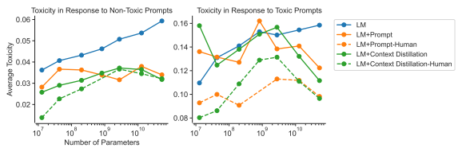

Figure 22 Average toxicity tends to *decrease* when prompted (orange) and context distilled (green) models emulate human responses (dashed lines) relative to when when they do not (solid lines). **Left:** For non-toxic prompts, allowing aligned models to emulate human responses tends to slightly decrease average toxicity. Right: For toxic prompts, allowing aligned models to emulate human responses tends to significantly decrease average toxicity, which dwarfs and confounds the effect of the alignment interventions.

In Figure 8 we report the mean toxicity score averaged across all 500 prompts and 25 samples per prompt.

This represents a departure from [GGS+20] and other work on toxicity in language models, which typically report the metrics: Expected Maximum Toxicity and Probability of Toxicity. The Expected Maximum Toxicity metric reports the maximum toxicity across the 25 continuations per prompt, averaged across all 500 prompts. The probability of toxicity metric captures the average, across prompts, of an indicator variable that's 1 if a given sample has a toxicity score > 0.5, and 0 otherwise, across continuations. We report these metrics in Figure 23. We note that, in general, likely due to the maximum and thresholding operations of each metric prior to averaging, both metrics have large standard deviations and do not scale smoothly with model size. Regardless, the general findings from the main text remain true: both context distillation and prompting reduce toxicity and the reduction in toxicity according to these metrics is greater as models get larger. We also observe that both Expected Maximum Toxicity and Probability of Toxicity tend to be strongly correlated with each other. To gain intuition about why the simple average toxicity score scales smoothly with model size, we inspect the probability distribution of toxicity scores across model sizes for the base language model (LM, Figure 24 Left). The distribution is bimodal with one peak for low toxicity scores and and a relatively smaller peak for high toxicity scores. As the model size increases, probability mass tends to shift smoothly from the low toxicity peak to the high toxicity peak. Computing the mean of these distributions captures this smooth transition in mass between modes. We also inspect the influence of the alignment interventions for the largest 50B parameter model (Figure 24 Right). We see that the alignment interventions tend to undo the effect of scaling up model sizes in that they shift probability mass away from the toxic mode towards the less toxic mode.

### B.3 Truthfulqa Formatting

For evaluations of TruthfulQA with context distilled models, we used the format: Human: <QUESTION> Assistant: <ANSWER> and evaluate the probability of the answer tokens. With our pure language models (no prompt or context distillation), we tried using both this format and even simpler format <QUESTION> <ANSWER>, and found that the latter did very slightly better, and so we have used results from that format in all figures.

### B.4 A Comment On Lambada Formatting

We performed a fairly complicated evaluation on Lambada in section 3.2, which involved finetuning on the training set. Therefore, we used the official version of the dataset, which has a number of typos and strange

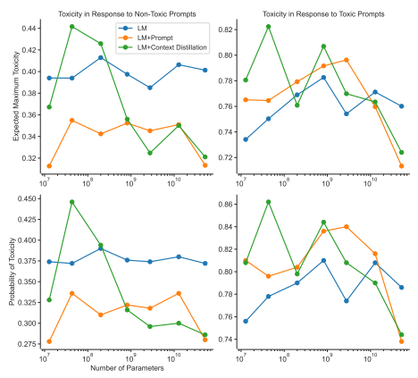

Figure 23 Expected Maximum Toxicity (top plots) and Probability of Toxicity (bottom plots) tend to scale less smoothly with model size in response to both non-toxic (left plots) and toxic (right plots) prompts. Top Left: Expected Maximum Toxicity in response to non-toxic prompts is generally lower for both prompted
(orange) and context distilled (green) models relative to unaligned (blue) models. **Top Right:** Expected Maximum Toxicity in response to toxic prompts only decreases relative to unaligned models only for larger models and increases otherwise. **Bottom Left:** Probability of Toxicity in response to non-toxic prompts exhibits the same general trend as Expected Maximum Toxicity in response to non-toxic prompts **Bottom** Right: Probability of Toxicity in response to toxic prompts also exhibits same general trend as Expected Maximum Toxicity.

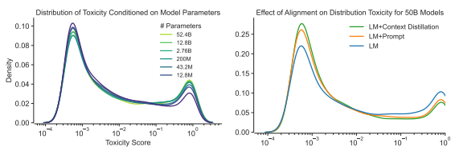

Figure 24 The distribution, estimated via kernel density estimation with a Gaussian kernel, of toxicity scores is bimodal, with one peak for for low toxicity scores and a relatively smaller peak for high toxicity scores. **Left**: For a standard LM, as the model size increases, probability mass tends to shift from the low toxicity peak to the high peak. **Right**: Conversely, for a 50B parameter model (blue), prompting (orange) and context distillation (green) tends to shift mass from the high peak to the low peak.

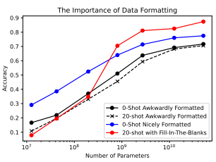

Figure 25 We show Lambada results with three different formats - an awkward format from the original/official Lambada dataset, a format constructed by OpenAI, and a fill-in-the-blanks format used with GPT-3 [BMR+20] that performs very well with few-shot learning.

whitespace and punctuation choices. However, in section 2.2.4 we included some zero-shot Lambada evaluations to assess 'alignment taxes'. These formatting choices make a very large difference in performance, as shown in figure 25. In particular, we believe this explains in large part why the results from figure 13 are comparatively weak. To be explicit, here is an example from the nicely formatted version: "Helen's heart broke a little in the face of Miss Mabel's selfless courage. She thought that because she was old, her life was of less value than the others. For all Helen knew, Miss Mabel had a lot more years to live than she did. "Not going to happen," replied Helen And here's an example from the original version: it was very freeing . there would be no more hiding , no more tiptoeing around the conversation . logan and i were together . plain and simple . we cared for each other and were doing what felt right . that did n't stop my stomach from sinking the second door swung open . dr. andrews strode into the room , casting a cautionary glance in my direction before turning his attention to logan The difference in performance between these formats might be regarded as an alignment failure itself. For this reason, we were interested in whether the HHH prompt reduced the gap between Lambada formats, but we did not find this effect.

### B.5 Context Distillation Finetuning

To perform context distillation in practice, we prepended both the HHH prompt and then Human: (signifying the beginnning of a new conversation) to text samples. We then performed a forward pass with the 52B model and stored the top 50 log-probabilities for each token, along with their indices within the vocabulary. We used a half-and-half mixture of generic pretraining data and Stack Exchange questions. We formatted the latter to use the Assistant: label before the answers, as an attempt to stay near the human-assistant distribution. We filled out the remainder of the context with distillation data, providing about 1500 tokens per sequence (subtracting the length of the prompt). After generating this data, we finetuned all model sizes on it with KL loss between the stored log-probabilities and the model-predicted probabilities. Since we only stored the top 50 log-probs, for each token this KL
was actually a 51-category comparison, with the extra category coming from the aggregation of all other possibilities besides the top 50 from the prompted 52B model.

Figure 26 Left: Per-token losses when counting, along with Laplace's prediction that "if the sun has risen

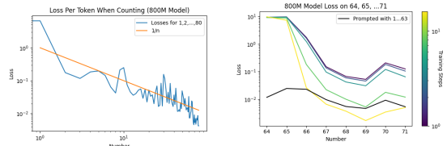 n times in a row, the probability it will not rise tomorrow ∼ 1/n". **Right**: An extreme illustration of the difference between prompting (conditioning) and finetuning (altering the expected data distribution). The finetuned models were trained on the sequence 1,2, ..., 63. With sufficient finetuning these models become very confident about counting, but never learn that the first few tokens should be 64, 65, ...

|                   | 800M   | 3B   | 13B   | 52B   |
|-------------------|--------|------|-------|-------|
| 200M              | 0.34   | 0.30 | 0.13  | 0.16  |
| 800M              | \-     | 0.40 | 0.26  | 0.25  |
| 3B                | \-     | \-   | 0.34  | 0.34  |
| 12B               | \-     | \-   | \-    | 0.45  |
| 12B Distilled     | \-     | \-   | 0.46  | \-    |
| 52B Distilled     | \-     | \-   | \-    | 0.46  |
| 12B Short\-Prompt | \-     | \-   | 0.44  | \-    |
| 52B Short\-Prompt | \-     | \-   | \-    | 0.47  |

Table 2 In this table we show the fraction of head-to-head model comparisons where one model was preferred to the other by contractors. The numbers represent the "win rate" of the models indicated in each row against those indicated by the column labels. All models were presented with the full 4600 word HHH prompt, and we sampled responses at T = 1 and top P = 0.95. We include a dash where we made no comparison, or where the results are trivially implied by p → 1 − p across the diagonal.

### B.6 Estimator Of Accuracy When Re-Ranking Samples

When studying the performance of models that rank sample quality (with a PM or log-probs from a language model), we're interested in the measuring the fraction of problems that are solved by the the top-ranked sample, when there are k samples in total. Here we derive an unbiased estimator for this quantity when using a finite pool of N ≥ k samples. The analysis builds on estimates for pass@k from [CTJ+21].

For each problem, we sample a list of N samples, and then calculate both the score for ranking (by a model of interest) and whether each individual response was correct. Then for each problem, we estimate:

$$\operatorname{acc}\!\!{\underline{{a}}}k(S)=\sum_{i=1}^{N}\operatorname{acc}(s_{i})\cdot{\frac{\binom{N-i}{k-1}}{\binom{N}{k}}}$$

where S is a list of ranked samples, from better to worse scores; acc(·) is the accuracy of the sample (correct or incorrect, so these are all 1 or 0); Nk is the total number of possible combinations when choosing k of N samples. Then, crucially, N−i k−1 is the number of combinations where sample siis the top-ranked sample among the k chosen samples. So the ratio of binomial coefficients in equation (B.6) is the probability that the ith sample is chosen and is the highest ranked sample in a group of k.

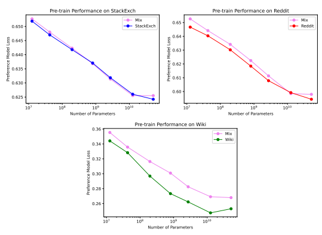

Figure 27 Scaling laws for PMP, showing PM loss vs. model size, for each of the three pre-training datasets StackExchange, Reddit, and Wikipedia, as evaluated on a held-out test set after one training epoch. The "Mix" is simply a mixture consisting of one epoch each of the three pre-training datasets. We do not know why the 52B seems to be off-trend. This could be caused by (1) being in a data-limited regime, or (2) being limited by the entropy of the pre-training distribution, or (3) sub-optimal choice of hyperparameters. Nonetheless, it is interesting to observe (e.g., from figure 5) that the 52B still transfers significantly better than the smaller models.

The overall metric is simply the mean of this quantity over all the problems.

## C More Details On Preference Models

### C.1 Preference Model Pre-Training

We now describe how the ranked pre-training datasets were prepared for each domain. The binarization procedure outlined in 4.1 was subsequently applied to convert each ranked dataset to a binary one.

- **StackExchange**: The StackExchange Data Dump17 consists of questions and answers from the StackExchange website. For each question, we evaluate the 'score' of all answers, where the score is defined as the log2(1 + upvotes) rounded to the nearest integer, plus 1 if the answer was accepted by the questioner (we assign a score of −1 if the number of upvotes is negative). In order to make pairwise comparison data for PMP, we sample two answers with distinct scores, skipping questions where this is not possible. For each question-answer pair, the corresponding context is formatted as Question: ... Answer: ... We prepared 5.8M training pairs and 59k test pairs.

- **Reddit:** The Pushshift Reddit data dump18 consists of posts and comments from the Reddit website.

For each Reddit post, we sample a pair of comment *sequences* differing only in the final comment.

17https://archive.org/details/stackexchange 18https://files.pushshift.io/reddit/

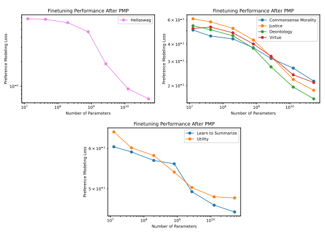

Figure 28 Scaling trends with model size for the best achieved comparison test loss on various final finetuning evaluations. We have grouped datasets together based on the dynamic range in the loss. The results are measured after one training epoch each for Learn to Summarize and Hellaswag, and four training epochs for each Ethics eval. In all cases larger models perform better, as expected. Sometimes we see a fairly clean power-law trend in the loss, but often there are significant deviations, including perhaps an interesting improvement in the slope on some datasets in the hundred million parameter range.

We then label the sequence whose final comment has the higher number of user upvotes as the "better" sequence, thus forming a preference modeling pair. For each post and comment sequence, the context is formatted as SUBMISSION by username: ... COMMENT by username: ... COMMENT by username: ... where each username is replaced with the corresponding author's alias. We also removed deleted comments and comments from bots. We prepared 1.1M training pairs and 11k test pairs. Note: We also made an effort to filter away poor or irrelevant data. For instance, we restrict to a "whitelist" of subreddits that we believe have the highest data quality. We specifically chose not to include AmItheAsshole, as it overlaps with one of our fine-tuning datasets, Commonsense Morality. Instead we include the subreddits: tifu, explainlikeimfive, WritingPrompts, changemyview, LifeProTips, todayilearned, science, askscience, ifyoulikeblank, UpliftingNews, Foodforthought, IWantToLearn, bestof, IAmA, socialskills, relationship_advice, philosophy, YouShouldKnow, history, books, Showerthoughts, personalfinance, buildapc, EatCheapAndHealthy, boardgames, malefashionadvice, femalefashionadvice, scifi, Fantasy, Games, bodyweightfitness, SkincareAddiction, podcasts, suggestmeabook, AskHistorians, gaming, DIY, mildlyinteresting, sports, space, gadgets, Documentaries, GetMotivated, UpliftingNews, technology, Fitness, travel, lifehacks, Damnthatsinteresting, gardening, programming.

- **Wikipedia:** Wikipedia provides a data dump19 of the full edit history for every page. For some edits, a short explanation of the intention behind the edit is provided in the metadata. In particular,

19https://en.wikipedia.org/wiki/Wikipedia:Database_download
a significant number of edits revert "suspected vandalism", as noted in comments associated with the edits. Examples of vandalism include edits that are intended to be misleading, counterfactual, or irrelevant to the subject matter of the page. For each such edit, we form a preference modeling pair by extracting the contents of the page before and after the edit, with the reverted version labeled as "better". For each edit, we restrict to only the page sections that had been edited, and make a preference modeling pair for each such section, thus reducing the necessary context length significantly. For each item in each pair, the context simply consists of the contents of the relevant section, formatted as PAGE TITLE: ...

SECTION TITLE: ...

SECTION BODY: ... We also made an effort to clean out various irrelevant metadata, such as hyperlinks, citations, data tables, and placeholders for images. We also removed uninteresting sections such as references and bibliography. We made 1.4M training pairs and 14k test pairs.

- **Mix:** We also consider a mixture (i.e., union) of StackExchange, Reddit, and Wikipedia, and refer to it as the "Mix". Since we choose to use a single epoch of each component dataset, the mix is about 70% StackExchange.

For each pre-training dataset, including the "Mix", we trained a scan a model sizes for exactly one epoch each. In all cases we used context size of 1024 tokens per sequence, batch size of 512 sequence pairs, and constant learning rate of 0.1 *relative* to language model pre-training. We evaluate preference model pre-training by PM accuracy (i.e., does the PM assign a higher score to the "good" sample in each pair?) and PM loss (3.1).

### C.2 Preference Model Pre-Training

We present more detailed finetuning results in figure 17, showing performance as a function of number of finetuning sequence pairs for both PMP (on the Mix dataset) and no PMP. For all these experiments, we used a model context size of 1024 tokens per sequence, batch size of 32 sequence pairs, and a constant learning rate of 0.01 *relative to pre-training*. We trained for one epoch each on Learn to Summarize and HellaSwag, and four epochs each on the Ethics evaluations as doing so improved performance. We used hyperparameters (*λ, µ*) = (1, 1) for the PM and LM losses, respectively, as discussed in section C.3.

### C.3 Language Modeling Improves Pmp Transfer

In this section we describe a technical detail which improves the transfer-ability of PMP significantly. We consider two losses for the pre-training stage: (1) the preference modeling (PM) loss, and (2) an autoregressive language modeling (LM) loss that imitates the "good" sample in each sequence pair.

Ltotal = λLPM + µLLM, good (C.1)
where *λ, µ* are hyperparameters. For the latter, we do not apply any masking on the tokens and simply train the model to predict the full context of the good sample. We found that adding the language modeling loss during pre-training consistently improved the sample efficiency on finetuning evaluations. In figure 29, we show the transfer performance for several pre-training losses:
- No PM pre-training, - "Pure" PM loss for which (*λ, µ*) = (1, 0),
- "Pure" LM loss for which (λ, µ) = (0, 1),
- "Composite" PM+LM loss for which (λ, µ) = (1, 1),
For uniformity, we used (λ, µ) = (1, 1) for the subsequent *finetuning* stage in all four scenarios. We observe that
- Pure LM performs similarly as no PM pre-training, which is unsurprising since it's just an extension of the basic language model pre-training on which all our experiments are initialized.

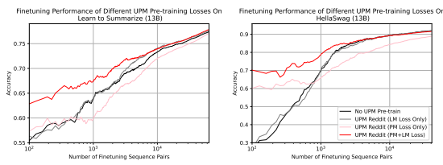

Figure 29 PMP *using only the PM loss* transfers poorly to downstream evaluations and is typically worse

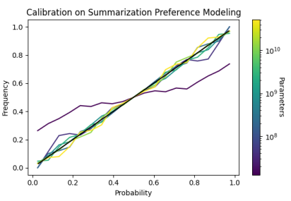 than simply doing no such pre-training at all. However, when combined with an autoregressive language modeling loss that imitates the "good" sample in each training pair, it significantly improves transfer to many downstream evaluations. Here we show results for PMP on Reddit finetuned on Learn to Summarize and HellaSwag, but we made similar observations on all other pre-training and finetuning datasets. Furthermore, the fact that "PM+LM Loss" clearly performs better than "LM Loss Only" strongly suggests that the performance gain of the former does not arise solely from language modeling, but from its combination with preference modeling.

Figure 30 Here we show calibration curves on the summarization test set. We see that aside from the smallest model, the preference models are very well calibrated on-distribution. These models were all first prefence model pre-trained on the stack exchange and then finetuned on summarization PMing. We include a black line as a reference for perfect calibration.

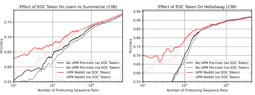

Figure 31 Appending an "end-of-context" token (EOC) to every sequence visibly improves overall performance, as seen here for both with and without PMP. In all cases where PMP is applied, we include the EOC token not just for the finetuning sequences but also the pre-training sequences. We made similar observations on all PMP datasets (as well as no PMP) and all finetuning datasets.

- Pure PM improves sample efficiency for a small number of samples, but eventually underperforms relative to no PM pre-training.

- The PM+LM pre-training consistently improves sample efficiency relative to no PM pre-training. It also performs better than pure LM, thus indicating that the performance gain isn't due purely to LM,
but a combination of PM and LM.

What's particularly interesting is that neither pure PM nor pure LM transfers particularly well, but the combined effort of PM+LM performs significantly better. Our hypothesis is that pure PM has a tendency to learn biased or "trivial" features (e.g., context length, token frequencies) that don't generalize well to downstream tasks, while the addition of LM forces the PM to learn from more substantial "language-relevant" features.

### C.4 End-Of-Context Token Improves Preference Modeling Performance

Here we outline a technical detail that improves the overall performance of preference models. We designate a special "end-of-context" token (EOC) which is included as the final token of each sample context. The preference model score is also predicted directly on top of this token. For our experiments we used the <SOS> token, but in principle many other choices are possible. We compare finetuning experiments with and without the EOC token. For experiments with, we consistently apply the same EOC token throughout both the PMP and fine-tuning stages; and for experiments without, we consistently do not apply the EOC token. From figure 31 we see that the EOC clearly improves performance. We hypothesize that the improvement comes from two factors:
- Sometimes the sentiment behind a natural language statement can be altered or reversed significantly by the addition of one or two words, and so knowing where the context ends can be helpful for the preference model to predict a sensible score.

- Without an EOC token, the preference model must not only predict a score, but also try to anticipate where the context ends. As a result, the model is forced to predict a score at multiple tokens where the context may end, rather than at a single token where it definitely ends. This adds a level of ambiguity which may cause the model to under-perform.

### C.5 Ensembling Over Pmp Models

In prinicple we can ensemble together several models finetuned on the same final dataset, but which first pass through PMP on a distinct dataset. This would be a bit like ensembling over different random initializations, but what might hope for more interesting results due to the different semantic content in distinct PMP
distributions. We tested this for summarization PMs that were separately PMP trained on Reddit and Stack Exchange, but only found a gain of order 0.5% in accuracy.

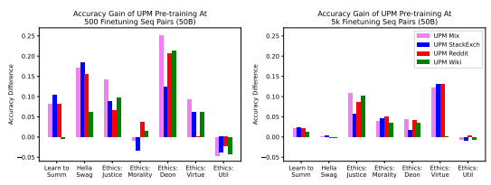

Figure 32 Accuracy gain of PMP as measured by *accuracy difference* relative to no PMP at 500 and 5k finetuning sequence pairs for multiple pre-training datasets (Mix, StackExchange, Reddit, Wikipedia) and finetuning evaluations (Learn to Summarize, HellaSwag, and all five Ethics evaluations).

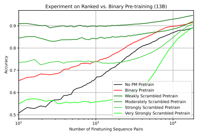

Figure 33 Results for a controlled experiment comparing the transfer ability of ranked vs. binary PM pretraining, as explained in section 4.3. We see a clear trend whereby the sample efficiency degrades as the amount of relative scrambling between pre-training and finetuning distributions increases. Furthermore, we find that binary pre-training does not transfer as well as the weakly scrambled case, but transfers better than the very strongly scrambled case, in agreement with our expectations. This possibly explains why binary pre-training seems to perform better than ranked pre-training in most of our finetuning experiments.

### C.6 Experiments On Ranked Vs Binary Pmp - Synthetic Symbols Dataset

We began by generating a list of symbols, and assigned an arbitrary "Elo" ranking to them. A simple example would be the first five English letters ranked by alphabetical order.

$$\mathrm{T}-0$$

* [10] M. C. Gonzalez-Garcia, M.  
T_0 : A > B > C > D > E
We then generated a preference modeling dataset consisting of *pairs* of distinct symbols, so that within each pair a sample is "better" if it precedes the other with respect to the ranking. We call this the "control" dataset T0. Furthermore, we created four additional datasets T1, T2, T3, T4, which were made in the same manner as T0 but with increasingly scrambled symbol rankings. For instance,

* [10] A. K.  
$$\stackrel{\mathrm{T}}{\underset{\mathrm{T}}{\longrightarrow}}\stackrel{\mathrm{1}}{\longrightarrow}$$
T_1 : A > B > C > [E] > [D] (Weakly Scrambled)
T_2 : A > B > [E] > [C] > [D] (Moderately Scrambled)
T_3 : A > [D] > [E] > [C] > [B] (Strongly Scrambled)
(Weakly Scrambled)  (Moderately Scrambled)  (Strongly Scrambled)
[C] > [D] > [E] > [A] > [B]
T_4 : [C] > [D] > [E] > [A] > [B] (Very Strongly Scrambled)
where we enclosed in square brackets symbols that are out-of-place compared to the control. In addition, we also created a "binary" dataset Tb which labels symbols in the first half of the control ranking as "good" and those in the second half as "bad". In other words,

$$\mathrm{\boldmath~T_{\_b}~}\quad:\qquad\mathrm{\boldmath~\bar{A}~}\quad,$$

T_b : A , B , C > D , E , F (Binary)
Finally, we pre-trained five preference models on Tb, T1, T2, T3, T4 separately, and compared their finetuning performance on the control T0. We also compare against a model trained directly on the control without preference model pre-training. In our actual experiment, we found that using only five symbols was too "easy" of a task to clearly distinguish the performance of different models, so instead we created a longer list of symbols, but otherwise the idea is the same. See section C.6 for details. Figure 33 shows the pairwise comparison accuracy on a held-out test set vs. number of training samples during the finetuning stage. We make several observations:

(Bilineary)
- We see a clear trend whereby sample efficiency consistently gets worse as the amount of scrambling increases. In fact, there is a scrambling "threshold" beyond which the sample efficiency is actually even worse than no PMP at all. This confirms the hypothesis that datasets with significantly different Elo scales are expected to transfer poorly to each other.

- The binary dataset is similarly sample efficient as a "moderately" scrambled dataset. This agrees with our hypothesis, which posits that a binary dataset should transfer better than a strongly scrambled dataset, but not necessarily better than a weakly scrambled one.

Clearly, the best possible PMP dataset is one that is qualitatively very similar to the final finetuning dataset, but typically this is not available. We see binarized PMP as a compromise that cannot guarantee the best possible sample efficiency, but is more robustly capable of transferring to new preference modeling distributions. Finally, let us elaborate on our synthetic symbols dataset. Instead of using only five symbols, we used a list of 676 symbols (using all ordered pairs of uppercase English letters), with a randomly assigned ranking. For each symbol, the context is generated by repeating the symbol multiple times. For example, if the symbol AC precedes PQ in the ranking, then a preference modeling pair would look like (AC)(AC)(AC)(AC) > (PQ)(PQ)(PQ)(PQ)
Furthermore, the scrambled datasets T1, T2, T3, T4 were obtained by applying 10, 40, 160, 640 randomly generated transpositions to the control ranking, respectively. Finally, for the binary dataset Tb, a symbol is labeled "good" if it appears in the first half of the control ranking, and "bad otherwise. For instance, if AC appears in the first half, and PQ appears in the second half, then the corresponding preference modeling pairs would look like GOOD:(AC)(AC)(AC)(AC) > BAD:(AC)(AC)(AC)(AC) BAD:(PQ)(PQ)(PQ)(PQ) > GOOD:(PQ)(PQ)(PQ)(PQ)

## D Per-Token Gan-Style Discriminator Results

One way to train a discriminator is to utilize pretrained language models to generate samples, and train the discriminator to distinguish between human and model generated tokens. The discriminator can then be used for rejection sampling, or ranking samples by how likely they were to be generated by a human. To test out this naive setup, we created a training set by loading sequences of fixed numbers of tokens from the language pretraining dataset, followed by: with 1/3 chance truncating the text somewhere, and continuing the text by sampling from a language model; with 1/3 chance generating the same number of tokens entirely from a model; and with the last 1/3 chance the text remained unchanged (fully human-generated). We used a 13B language model for sampling this dataset. For training, we initialized discriminator models as pretrained language models, and applied a binary cross entropy loss at each token for the human vs. model binary classification.

Although qualitatively the models seem to be able to identify low quality model generated text, when evaluated on a few language benchmarks, we did not see promising improvement over the original language model

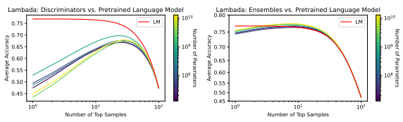

Figure 34 Left: Discriminator and language model performance re-ranking Lambada answers. **Right**: Ensemble of discriminator and language model, as determined in equation D.2.

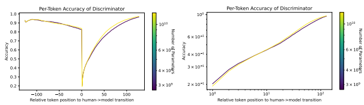

Figure 35 Per-token accuracy of a GAN-type discriminator trained to predict whether every individual token is human or model generated. Position 0 is the first model-generated token.

used to generate the training set (see figure 34). For these evaluations, we first generated 100 samples from each of the prompt in the test set. For the discriminators, we ranked the samples by the average predicted probability of being human generated over sample tokens. For the language model, we ranked the samples by the negative average log-prob over sample tokens. The plots show average metric over top-N ranked samples.

We observe that the language model performs much better on these benchmarks, in both performance and robustness. However, we will now argue that it is not appropriate to directly use the discriminator to rank samples. Let us use P(t) to denote the probability distribution of human-generated tokens and Pθ(t) to represent a language model. The goal of the discriminator Dφ is to model the probability that a given token was model generated, so Dφ(t) is attempting to model the probability p(human|t). Assuming a prior that a token is 50% likely to come from a human, after seeing the token, an ideal discriminator would predict

$$D(t)={\frac{P(t)}{P(t)+P_{\theta}(t)}}$$
$$(\mathbf{D.1})$$

for the probability that any token was written by a human.

But this means that we can use a learned Dφ(t) to improve model predictions for any given token t, by re-arranging to give the new ensemble distribution

$$P_{\rm ensemble}(t)=\frac{D_{\phi}(t)}{1-D_{\phi}(t)}P_{\theta}(t)$$ (D.2)
and this ensemble model should improve on the original language model distribution Pθ. In particular, this ensemble provides a more principled way to re-rank model-generated samples, using both the discriminator and the language model probabilities together. We display the result on the right in figure 34, where we see that as expected, the ensemble can improve on the language model.

Figure 35 shows the per-token prediction accuracy on the training set, relative to the position where the tokens switch from being human-generated to model-generated. We observe an interesting behavior - even though

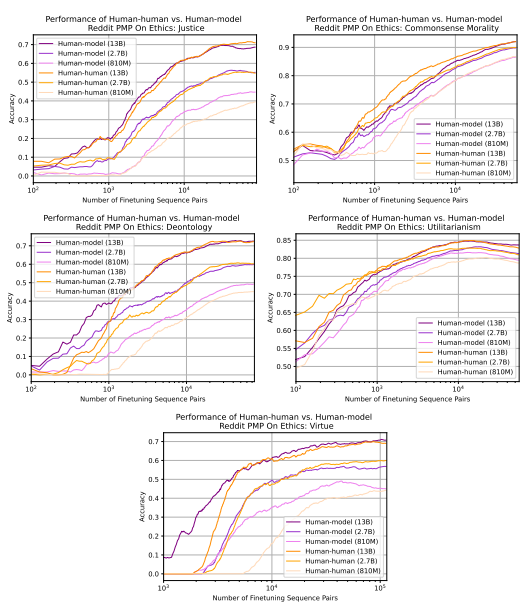

Figure 36 We compare PMP on "human-human" vs "human-model" datasets by evaluating their transfer performance on the five Ethics datasets. It appears that one does not consistently outperform the other, and the results are rather random. We suspect that "human-model" does not have any particular advantage when finetuning on evaluations that are purely human-written, such as Ethics.

larger models obtain higher overall accuracy, they perform worse immediately after the transition from human to model generated tokens.

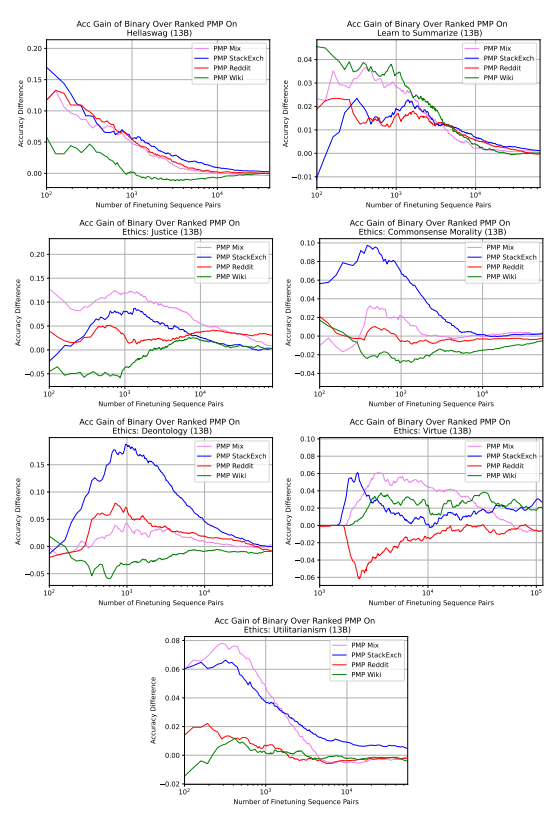

Figure 37 Accuracy gain of *binary* over *ranked* PMP on finetuning evaluations.

## E Definitions Of Alignment And The Hhh Criteria

People often mean subtly different things when they talk about AI systems being "aligned". Given this, we want to elaborate on what we mean by this term and why we selected the "helpful, honest, and harmless" conception of aligned AI assistants.

### E.1 How The Hhh Criteria Relate To Alignment

At a very high level, alignment can be thought of as the degree of overlap between the way two agents rank different outcomes. For example, if agent A completely internalizes the desires of agent B—i.e. the only desire A has is to see B's desires satisfied—we could say that agent A is maximally aligned with agent B.20 We believe it is difficult for an AI assistant to always be helpful, honest, and harmless towards an agent or group without also being highly aligned with that agent or group according to this definition of alignment. To see why, suppose we want the AI assistant to be aligned with a specific group of humans. Here is what each of the three conditions implies about the assistant:
- **Helpfulness:** the assistant will always try to do what is in the humans' best interests
- **Honesty:** the assistant will always try to convey accurate information to the humans and will always try to avoid deceiving them21
- **Harmlessness:** the assistant will always try to avoid doing anything that harms the humans An AI assistant that is always helpful, honest, and harmless towards a group of humans will always try to act in a way that satisfies the interests of this group, including their interest not to be harmed or be misled. It is therefore likely to be highly aligned with the interests of that group of humans. This account of alignment is still vague and leaves many open questions. In particular, it does not tell us:
- What kinds of outcome orderings are most relevant for AI alignment (preferences, idealized preferences, wellbeing, ethical rankings, etc.)
- The degree to which these outcome orderings are objective or subjective - Which agents the AI systems should be aligned to (users, developers, humanity, etc.) - How AI systems can or should aggregate different outcome orderings if they are aligned to more than one agent
- What is the precise formulation of "overlap between outcome rankings" - How large or small the space of maximally aligned agents is, given the above Many of these questions are discussed in more detail elsewhere [Gab20]. Progress in AI alignment will hopefully not require us to reach certainty about any of them, since such certainty is unlikely to be achieved. But it is worth making these unanswered questions explicit. When we train aligned AI systems, we may need to make choices that will implicitly favor or assume certain answers to them. And how we define the HHH criteria will depend on what kind of orderings we think are most relevant for AI alignment.

### E.2 The Relation Between The Hhh Criteria

If we define helpfulness and harmlessness such that (a) it's never in a human's best interest to be harmed, and (b) it's always harmful to fail to do something that's in a human's best interest, we can reduce helpfulness and harmlessness to either criterion. We have separated them because we find it practically easier to distinguish cases of active harm from cases in which a benefit is withheld. Helpfulness and harmlessness clearly can't be reduced to honesty, but honesty can be reduced to helpfulness/harmlessness. According to the definition of alignment given above, an aligned AI assistant should be honest because honesty is valued by humans. This could either be because honesty is instrumentally valuable

20Even if agent A is maximally aligned with agent B, A can fail to act in accordance with B's desires because A has a mistaken belief about B's desires or about the world, or because A is unable to carry out their intended action.

21This concept of "honesty" involves avoiding multiple different conditions of lying, such as only stating true claims and not causing false beliefs in the listener [Mah15]. There will be cases where these conditions conflict. In such cases, we would need to assess which conception of honesty it would be most helpful and harmless for the assistant to satisfy.
to humans or because humans intrinsically value it. If honesty were genuinely not something that humans value even on reflection, an AI that was aligned with human values would presumably not be honest. But if the value of honesty is reducible to helpfulness and harmlessness, why include it in our list? The answer is mostly practical: honesty is important and distinct enough to warrant particular attention. We could also choose to introduce other concepts which—like honesty—can't be reduced to helpfulness or harmlessness but are important properties that a helpful, harmless AI assistant will typically have. For example, we considered adding the following fourth 'H':
- **Handleable:** the assistant will always be responsive to feedback from the humans and carry out any instructions from the humans in the way that the humans intended Handleability is similar what others have called "corrigibility" [SFAY15]. A system that isn't handleable is less helpful and more harmful than a system that is handleable. But it may be useful to pay special attention to failures that involve the assistant not doing what is asked or not responding to human feedback. For this reason it seems like a good candidate for a fourth 'H'. In other words, what we want to include in this list, beyond a joint or separate helpfulness/harmlessness condition, depends on what behaviors we find it useful to pay particular attention to.

### E.3 Conflicts Between The Hhh Criteria

As we note in the main text, the three conditions above will sometimes appear to be in conflict. There are two possible kinds of conflicts between the three conditions:
- **Intra-agent conflicts:** Cases in which two or more HHH conditions are in conflict even if we just want to align the assistant with a particular human. For example, it is not possible to be honest or helpful towards a particular human without saying something that is pro tanto harmful to them, e.g. something that will hurt their feelings.

- **Inter-agent conflicts:** Cases in which two or more HHH conditions conflict across different agents we might want to align the assistant with. For example, it is not possible to be helpful towards a particular human without saying something that is harmful to a others we want to align it with, e.g. if one human asks for help building a bomb to use against others.

If helpfulness and harmlessness can be reduced to a single joint condition and honesty can also be reduced to helpfulness/harmlessness, intra-agent conflicts will turn out to be merely superficial since all three conditions can ultimately be reduced to a single coherent condition. Inter-agent conflicts are a different matter. It is very likely that a single AI cannot be maximally aligned with any two different humans, since both humans will have at least some conflicting desires or values. This is why an AI assistant will often be unable to be helpful, honest and harmless towards some humans without being unaligned with other humans (e.g. by refusing to help them build the bomb). It is therefore important for us to be aware of who we are asking the AI assistants to be helpful, honest, and harmless towards, since this also determines which humans the AI assistants are not fully aligned with and to what degree.

### E.4 The Hhh Criteria And Secure Ai

Although we want to develop aligned AI systems, it may not be possible to guarantee that AI systems are fully aligned with human values. So we'll also want our AI systems to be secure: to have properties or be embedded in systems that decrease the potential for harm even if the AI is less than fully aligned [HCSS21]. We may want AI systems that always respond to the intended instructions of humans, that always avoid doing certain things that most humans consider very bad, that fail both securely and loudly, that make decisions in ways that can be made transparent to humans, that are secure against alteration or misuse, and so on. An AI assistant that is helpful, honest, and harmless is a secure system in many respects and will try to assist humans in making itself more secure. But the HHH criteria were not selected with AI security in mind and not all security features will be features of the AI system itself. We therefore want to emphasize that the HHH criteria are criteria of alignment, and that additional work and additional areas of focus may be required to ensure that AI systems cannot cause too much harm when they are not fully aligned.

## References

| [AAB+21]   | Josh Abramson, Arun Ahuja, Iain Barr, Arthur Brussee, Federico Carnevale, Mary Cassin,        |
|------------|-----------------------------------------------------------------------------------------------|
|            | Rachita Chhaparia, Stephen Clark, Bogdan Damoc, Andrew Dudzik, Petko Georgiev, Aure                                                                                               |
|            | lia Guy, Tim Harley, Felix Hill, Alden Hung, Zachary Kenton, Jessica Landon, Timothy Lilli                                                                                               |
|            | crap, Kory Mathewson, Sona Mokra, Alistair Muldal, Adam Santoro, Nikolay Savinov, Vikrant     |
|            | Varma, Greg Wayne, Duncan Williams, Nathaniel Wong, Chen Yan, and Rui Zhu. Imitating          |
|            | interactive intelligence, 2021, 2012.05672.                                                   |
| [AON+21]   | Jacob Austin, Augustus Odena, Maxwell Nye, Maarten Bosma, Henryk Michalewski, David           |
|            | Dohan, Ellen Jiang, Carrie Cai, Michael Terry, Quoc Le, and Charles Sutton. Program synthesis |
|            | with large language models, 2021, 2108.07732.                                                 |
| [AOS+16]   | Dario Amodei, Chris Olah, Jacob Steinhardt, Paul Christiano, John Schulman, and Dan Mané.     |
|            | Concrete problems in ai safety, 2016, 1606.06565.                                             |
| [ATS+21]   | Vamsi Aribandi, Yi Tay, Tal Schuster, Jinfeng Rao, Huaixiu Steven Zheng, Sanket Vaibhav       |
|            | Mehta, Honglei Zhuang, Vinh Q. Tran, Dara Bahri, Jianmo Ni, Jai Gupta, Kai Hui, Sebastian     |
|            | Ruder, and Donald Metzler.  Ext5: Towards extreme multi\-task scaling for transfer learning,  |
|            | 2021, 2111.10952.                                                                             |
| [BGNN19]   | Daniel S. Brown, Wonjoon Goo, Prabhat Nagarajan, and Scott Niekum.  Extrapolating be                                                                                               |
|            | yond suboptimal demonstrations via inverse reinforcement learning from observations, 2019,    |
|            | 1904.06387.                                                                                   |
| [BMR+20]   | Tom B. Brown, Benjamin Mann, Nick Ryder, Melanie Subbiah, Jared Kaplan, Prafulla Dhari                                                                                               |
|            | wal, Arvind Neelakantan, Pranav Shyam, Girish Sastry, Amanda Askell, Sandhini Agarwal,        |
|            | Ariel Herbert\-Voss, Gretchen Krueger, Tom Henighan, Rewon Child, Aditya Ramesh, Daniel M.    |
|            | Ziegler, Jeffrey Wu, Clemens Winter, Christopher Hesse, Mark Chen, Eric Sigler, Mateusz       |
|            | Litwin, Scott Gray, Benjamin Chess, Jack Clark, Christopher Berner, Sam McCandlish, Alec      |
|            | Radford, Ilya Sutskever, and Dario Amodei.  Language models are few\-shot learners, 2020,     |
|            | 2005.14165.                                                                                   |
| [Bow21]    | Samuel R. Bowman. When combating hype, proceed with caution, 2021, 2110.08300.                |
| [CKB+21]   | Karl Cobbe, Vineet Kosaraju, Mohammad Bavarian, Jacob Hilton, Reiichiro Nakano, Christo                                                                                               |
|            | pher Hesse, and John Schulman.  Training verifiers to solve math word problems, 2021,         |
|            | 2110.14168.                                                                                   |
| [CLB+17]   | Paul Christiano, Jan Leike, Tom B. Brown, Miljan Martic, Shane Legg, and Dario Amodei.        |
|            | Deep reinforcement learning from human preferences, 2017, 1706.03741.                         |
| [CLR+21]   | Lili Chen, Kevin Lu, Aravind Rajeswaran, Kimin Lee, Aditya Grover, Michael Laskin, Pieter     |
|            | Abbeel, Aravind Srinivas, and Igor Mordatch. Decision transformer: Reinforcement learning     |
|            | via sequence modeling, 2021, 2106.01345.                                                      |
| [CSA18]    | Paul Christiano, Buck Shlegeris, and Dario Amodei. Supervising strong learners by amplifying  |
|            | weak experts, 2018, 1810.08575.                                                               |
| [CTJ+21]   | Mark Chen, Jerry Tworek, Heewoo Jun, Qiming Yuan, Henrique Ponde de Oliveira Pinto, Jared     |
|            | Kaplan, Harri Edwards, Yuri Burda, Nicholas Joseph, Greg Brockman, Alex Ray, Raul Puri,       |
|            | Gretchen Krueger, Michael Petrov, Heidy Khlaaf, Girish Sastry, Pamela Mishkin, Brooke Chan,   |
|            | Scott Gray, Nick Ryder, Mikhail Pavlov, Alethea Power, Lukasz Kaiser, Mohammad Bavar                                                                                               |
|            | ian, Clemens Winter, Philippe Tillet, Felipe Petroski Such, Dave Cummings, Matthias Plappert, |
|            | Fotios Chantzis, Elizabeth Barnes, Ariel Herbert\-Voss, William Hebgen Guss, Alex Nichol,     |
|            | Alex Paino, Nikolas Tezak, Jie Tang, Igor Babuschkin, Suchir Balaji, Shantanu Jain, William   |
|            | Saunders, Christopher Hesse, Andrew N. Carr, Jan Leike, Josh Achiam, Vedant Misra, Evan       |
|            | Morikawa, Alec Radford, Matthew Knight, Miles Brundage, Mira Murati, Katie Mayer, Pe                                                                                               |
|            | ter Welinder, Bob McGrew, Dario Amodei, Sam McCandlish, Ilya Sutskever, and Wojciech          |
|            | Zaremba. Evaluating large language models trained on code, 2021, 2107.03374.                  |
| [Fou]      | The Common Crawl Foundation. Common crawl. URL http://commoncrawl.org.                        |
| [Gab20]    | Iason Gabriel. Artificial intelligence, values, and alignment. Minds and Machines, 30(3):411– |
|            | 437, Sep 2020. doi:10.1007/s11023\-020\-09539\-2.                                             |
| [GBB+20]   | Leo Gao, Stella Biderman, Sid Black, Laurence Golding, Travis Hoppe, Charles Foster, Jason    |
|            | Phang, Horace He, Anish Thite, Noa Nabeshima, Shawn Presser, and Connor Leahy. The pile:      |
|            | An 800gb dataset of diverse text for language modeling, 2020, 2101.00027.                     |

| [GGS+20]   | Samuel Gehman, Suchin Gururangan, Maarten Sap, Yejin Choi, and Noah A. Smith. Realtoxi                                                                                                  |
|------------|--------------------------------------------------------------------------------------------------|
|            | cityprompts: Evaluating neural toxic degeneration in language models, 2020, 2009.11462.          |
| [HBB+21]   | Dan Hendrycks, Collin Burns, Steven Basart, Andrew Critch, Jerry Li, Dawn Song, and Jacob        |
|            | Steinhardt. Aligning ai with shared human values, 2021, 2008.02275.                              |
| [HCSS21]   | Dan Hendrycks, Nicholas Carlini, John Schulman, and Jacob Steinhardt. Unsolved problems in       |
|            | ml safety, 2021, 2109.13916.                                                                     |
| [HE16]     | Jonathan Ho and Stefano Ermon. Generative adversarial imitation learning, 2016, 1606.03476.      |
| [HNA+17]   | Joel Hestness, Sharan Narang, Newsha Ardalani, Gregory Diamos, Heewoo Jun, Hassan Kian                                                                                                  |
|            | inejad, Md. Mostofa Ali Patwary, Yang Yang, and Yanqi Zhou. Deep learning scaling is pre                                                                                                  |
|            | dictable, empirically, 2017, 1712.00409.                                                         |
| [HU20]     | Laura Hanu and Unitary team. Detoxify. Github. https://github.com/unitaryai/detoxify, 2020.      |
| [ICA18]    | Geoffrey Irving, Paul Christiano, and Dario Amodei. Ai safety via debate, 2018, 1805.00899.      |
| [ILP+18]   | Borja Ibarz, Jan Leike, Tobias Pohlen, Geoffrey Irving, Shane Legg, and Dario Amodei. Reward     |
|            | learning from human preferences and demonstrations in atari, 2018, 1811.06521.                   |
| [JHB+21]   | Liwei Jiang, Jena D. Hwang, Chandra Bhagavatula, Ronan Le Bras, Maxwell Forbes, Jon Bor                                                                                                  |
|            | chardt, Jenny Liang, Oren Etzioni, Maarten Sap, and Yejin Choi.  Delphi: Towards machine         |
|            | ethics and norms, 2021, 2110.07574.                                                              |
| [Jon21]    | Andy L. Jones. Scaling scaling laws with board games, 2021, 2104.03113.                          |
| [KMH+20]   | Jared Kaplan, Sam McCandlish, Tom Henighan, Tom B. Brown, Benjamin Chess, Rewon Child,           |
|            | Scott Gray, Alec Radford, Jeffrey Wu, and Dario Amodei.  Scaling laws for neural language        |
|            | models, 2020, 2001.08361.                                                                        |
| [KSW21]    | Mojtaba Komeili, Kurt Shuster, and Jason Weston.  Internet\-augmented dialogue generation,       |
|            | 2021, 2107.07566.                                                                                |
| [LARC21]   | Brian Lester, Rami Al\-Rfou, and Noah Constant.  The power of scale for parameter\-efficient     |
|            | prompt tuning, 2021, 2104.08691.                                                                 |
| [LHE21]    | Stephanie Lin, Jacob Hilton, and Owain Evans.  Truthfulqa: Measuring how models mimic            |
|            | human falsehoods, 2021, 2109.07958.                                                              |
|            | [LKCSL17] Derrick Lin, James Koppel, Angela Chen, and Armando Solar\-Lezama. Quixbugs: A multi                                                                                                  |
|            | lingual program repair benchmark set based on the quixey challenge. In Proceedings Companion     |
|            | of the 2017 ACM SIGPLAN International Conference on Systems, Programming, Languages,             |
|            | and Applications: Software for Humanity, SPLASH Companion 2017, pages 55–56, New York,           |
|            | NY, USA, 2017. Association for Computing Machinery. doi:10.1145/3135932.3135941.                 |
| [LSP+18]   | Peter J. Liu, Mohammad Saleh, Etienne Pot, Ben Goodrich, Ryan Sepassi, Lukasz Kaiser, and        |
|            | Noam Shazeer. Generating wikipedia by summarizing long sequences. arXiv:1801.10198 [cs],         |
|            | 2018, 1801.10198. URL http://arxiv.org/abs/1801.10198.                                           |
| [Mah15]    | James Edwin Mahon.  The definition of lying and deception.  In Ed Zalta, editor, Stanford        |
|            | Encyclopedia of Philosophy. 2015.                                                                |
| [NRA+21]   | Helen Ngo, Cooper Raterink, João G. M. Araújo, Ivan Zhang, Carol Chen, Adrien Morisot,         |
|            | and Nicholas Frosst. Mitigating harm in language models with conditional\-likelihood filtration, |
|            | 2021, 2108.07790.                                                                                |
| [PKL+16]   | Denis Paperno, Germán Kruszewski, Angeliki Lazaridou, Quan Ngoc Pham, Raffaella                 |
|            | Bernardi, Sandro Pezzelle, Marco Baroni, Gemma Boleda, and Raquel Fernández. The lam                                                                                                  |
|            | bada dataset: Word prediction requiring a broad discourse context, 2016, 1606.06031.             |
| [RDR20]    | Vinay V. Ramasesh, Ethan Dyer, and Maithra Raghu. Anatomy of catastrophic forgetting: Hid                                                                                                  |
|            | den representations and task semantics, 2020, 2007.07400.                                        |
| [RNSS18]   | Alec Radford, Karthik Narasimhan, Tim Salimans, and Ilya Sutskever.  Improving language          |
|            | understanding by generative pre\-training. 2018.                                                 |
| [RRBS19]   | Jonathan S. Rosenfeld, Amir Rosenfeld, Yonatan Belinkov, and Nir Shavit.  A constructive         |
|            | prediction of the generalization error across scales, 2019, arXiv:1909.12673.                    |
| [RWC+19]   | Alec Radford, Jeff Wu, Rewon Child, David Luan, Dario Amodei, and Ilya Sutskever. Language       |
|            | models are unsupervised multitask learners. openai.com, 2019.                                    |

| [SD21]   | Irene Solaiman and Christy Dennison.  Process for adapting language models to society           |
|----------|-------------------------------------------------------------------------------------------------|
|          | (PALMS) with values\-targeted datasets. CoRR, abs/2106.10328, 2021, 2106.10328.  URL            |
|          | https://arxiv.org/abs/2106.10328.                                                               |
| [SFAY15] | Nate Soares, Benja Fallenstein, Stuart Armstrong, and Eliezer Yudkowsky.  Corrigibility.  In    |
|          | Workshops at the Twenty\-Ninth AAAI Conference on Artificial Intelligence, 2015.                |
| [SHB15]  | Rico Sennrich, Barry Haddow, and Alexandra Birch. Neural machine translation of rare words      |
|          | with subword units. CoRR, 2015, 1508.07909.                                                     |
| [SOW+20] | Nisan Stiennon, Long Ouyang, Jeff Wu, Daniel M. Ziegler, Ryan Lowe, Chelsea Voss, Alec          |
|          | Radford, Dario Amodei, and Paul Christiano. Learning to summarize from human feedback,          |
|          | 2020, 2009.01325.                                                                               |
| [SWR+21] | Victor Sanh, Albert Webson, Colin Raffel, Stephen H. Bach, Lintang Sutawika, Zaid Alyafeai,     |
|          | Antoine Chaffin, Arnaud Stiegler, Teven Le Scao, Arun Raja, Manan Dey, M Saiful Bari, Can                                                                                                 |
|          | wen Xu, Urmish Thakker, Shanya Sharma Sharma, Eliza Szczechla, Taewoon Kim, Gunjan              |
|          | Chhablani, Nihal Nayak, Debajyoti Datta, Jonathan Chang, Mike Tian\-Jian Jiang, Han Wang,       |
|          | Matteo Manica, Sheng Shen, Zheng Xin Yong, Harshit Pandey, Rachel Bawden, Thomas Wang,          |
|          | Trishala Neeraj, Jos Rozen, Abheesht Sharma, Andrea Santilli, Thibault Fevry, Jason Alan Fries, |
|          | Ryan Teehan, Stella Biderman, Leo Gao, Tali Bers, Thomas Wolf, and Alexander M. Rush.           |
|          | Multitask prompted training enables zero\-shot task generalization, 2021, 2110.08207.           |
| [VSP+17] | Ashish Vaswani, Noam Shazeer, Niki Parmar, Jakob Uszkoreit, Llion Jones, Aidan N Gomez,         |
|          | Ł ukasz Kaiser, and Illia Polosukhin. Attention is all you need. In I. Guyon, U. V. Luxburg,    |
|          | S. Bengio, H. Wallach, R. Fergus, S. Vishwanathan, and R. Garnett, editors, Advances in Neural  |
|          | Information Processing Systems 30, pages 5998–6008. Curran Associates, Inc., 2017.  URL         |
|          | http://papers.nips.cc/paper/7181\-attention\-is\-all\-you\-need.pdf.                            |
| [WBZ+21] | Jason Wei, Maarten Bosma, Vincent Y. Zhao, Kelvin Guu, Adams Wei Yu, Brian Lester, Nan          |
|          | Du, Andrew M. Dai, and Quoc V. Le. Finetuned language models are zero\-shot learners, 2021,     |
|          | 2109.01652.                                                                                     |
| [WGU+21] | Johannes Welbl, Amelia Glaese, Jonathan Uesato, Sumanth Dathathri, John Mellor, Lisa Anne       |
|          | Hendricks, Kirsty Anderson, Pushmeet Kohli, Ben Coppin, and Po\-Sen Huang. Challenges in        |
|          | detoxifying language models, 2021, arXiv:2109.07445.                                            |
| [WOZ+21] | Jeff Wu, Long Ouyang, Daniel M. Ziegler, Nisan Stiennon, Ryan Lowe, Jan Leike, and Paul         |
|          | Christiano. Recursively summarizing books with human feedback, 2021, 2109.10862.                |
| [ZHB+19] | Rowan Zellers, Ari Holtzman, Yonatan Bisk, Ali Farhadi, and Yejin Choi. Hellaswag: Can a        |
|          | machine really finish your sentence?, 2019, 1905.07830.                                         |
