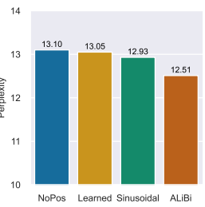
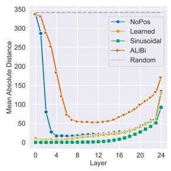
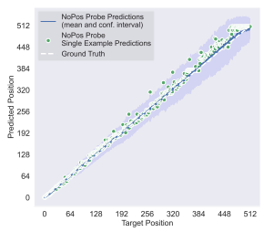
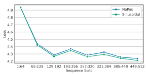
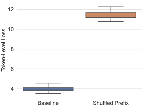

# Transformer Language Models Without Positional Encodings Still Learn Positional Information

Adi Havivτ Ori Ramτ Ofir Pressω Peter Izsakι **Omer Levy**τµ τTel Aviv University ωUniversity of Washington ιIntel Labs µMeta AI
{adi.haviv, ori.ram, levyomer}@cs.tau.ac.il, ofirp@cs.washington.edu, peter.izsak@intel.com

## Abstract

Causal transformer language models (LMs), such as GPT-3, typically require some form of positional encoding, such as positional embeddings. However, we show that LMs without any explicit positional encoding are still competitive with standard models, and that this phenomenon is robust across different datasets, model sizes, and sequence lengths. Probing experiments reveal that such models acquire an implicit notion of absolute positions throughout the network, effectively compensating for the missing information. We conjecture that causal attention enables the model to infer the number of predecessors that each token can attend to, thereby approximating its absolute position. Our findings indicate that causal LMs might derive positional awareness not only from the explicit positioning mechanism, but also from the effects of the causal mask.

## 1 Introduction

The attention mechanism (Bahdanau et al., 2015) of the transformer (Vaswani et al., 2017) is agnostic to the position and order of tokens in the input sequence. It is therefore common practice to inject positional information via absolute positional embeddings (Vaswani et al., 2017; Radford et al., 2018) or relative bias factors (Shaw et al., 2018; Raffel et al., 2020; Press et al., 2022). Here, we demonstrate that transformer language models without any explicit positional information can and do learn an implicit notion of absolute positions that is sufficient to achieve competitive performance.

We compare the performance of language models trained with no explicit positional information (*NoPos* language models) to those trained with three different position-aware mechanisms, namely: sinusoidal embeddings (Vaswani et al., 2017), learned embeddings (Gehring et al., 2017), and ALiBi (Press et al., 2022). Results show that NoPos models are competitive with position-aware

P
xit

Figure 1: Transformer language models trained without explicitly encoding positional information (*NoPos*) approach the performance of models trained with various positional encoding methods. All models have 1.3B parameters, and are trained on an excerpt of the Pile.

models consistently across datasets, model sizes, and input sequence lengths (e.g., Figure 1).

To shed light on our findings, we probe into the position-awareness of NoPos language models, compared to models that use relative or *absolute* position mechanisms. Specifically, we train classifiers to predict the position of a token given its representation across different layers in the network. Our probes reveal that the NoPos model achieves similar mean absolute distance between the predicted and the expected positions, as a model with learned absolute position embeddings.

We hypothesize that this surprising behavior is tied to the *causal* attention mask, which implicitly injects positional information into the self-attention layer in order to preserve the autoregressive nature of language models. Intuitively, a model that is able to count the predecessors of a given token can essentially infer its absolute position. To test our hypothesis, we run similar experiments for masked language models (MLM) (Devlin et al.,
2019), which use order-invariant attention (since no causal mask is applied). Indeed, bidirectional models fail to converge when position information is absent, substantiating our hypothesis. To conclude, our main contributions are:

- We demonstrate the robustness of the NoPos model (compared to position-aware models)
with respect to model size, dataset and sequence length.

- We provide an analysis of the trained NoPos model, and show that it encoded absolute positions.

- We show that the success of NoPos models is unique to *causal* language models.

## 2 Positional Encodings

Transformer models consist of interleaved selfattention and feed-forward layers, which are both order-invariant. Therefore, to convey the order of the input tokens, some form of positional information is explicitly introduced into the model. Absolute positions are commonly encoded as vectors
(one for each position), which are then added to the input tokens' embeddings and fed to the first layer of the transformer. *Relative positions* are typically encoded as biases (added to attention scores) within the self-attention layers. In this work, we consider three popular methods as baselines: Learned. Embeddings trained to represent absolute positions (Sukhbaatar et al., 2015; Gehring et al., 2017). Learned positional embeddings are commonly used in MLMs (Devlin et al., 2019; Liu et al., 2019) as well as in large autoregressive language models, such as GPT-3 (Brown et al., 2020). Sinusoidal. Constant vectors computed by a nonparametric function of the input token's absolute position. Sine and cosine functions of different frequencies are used, such that each dimension of the positional encoding corresponds to a sinusoid. Sinusoidal embeddings were introduced in Vaswani et al. (2017) for machine translation, and are also used in language modeling (Baevski and Auli, 2019). ALiBi. Attention with LInear BIases (Press et al., 2022) injects information about the relative distances between tokens by adding negative biases to attention scores, which grow linearly with the distance between each pair of tokens.

## 3 Experiment Setup

Intuitively, encoding positional information explicitly is crucial for enabling transformer language models to predict the next token in a sequence. To test this intuition, we compared the validation set perplexity of models trained from scratch with no explicit positional information (denoted as *NoPos*) to those trained with the various positional encoding methods discussed in Section 2. We investigated the canonical WikiText-103 setting (Merity et al., 2017; Baevski and Auli, 2019), as well as a newer, large-scale setting based on the Pile corpus
(Gao et al., 2020) on model architectures inspired by Brown et al. (2020), where we cover a spectrum of models sizes and sequence lengths.

The Canonical Setting (WikiText-103). The WikiText-103 corpus (Merity et al., 2017) consists of over 100 million words extracted from a set of high-quality Wikipedia articles. The corpus is tokenized at the word level, resulting in a vocabulary of over 267K tokens. For this corpus, we used the adaptive embedding transformer model of Baevski and Auli (2019), which contains 16 transformer layers with 1024 model dimensions, 4096 feed-forward dimensions, and 8 attention heads. Overall, this model has 247M parameters in total.

We trained with their exact optimization hyperparameters, as implemented in fairseq (Ott et al., 2019), with the exception of the input sequence length, which was shortened to 512 tokens (instead of 3072), as in Press et al. (2022). See App. C for detailed hyperparameters. The Large-Scale Setting (The Pile). The Pile
(Gao et al., 2020) is an 800GB English text dataset composed of Common Crawl and 22 other diverse sources. For our experiments, we used 2 out of 30 shards;1 of these, we filtered out the GitHub and DM Mathematics sources and removed the shortest 1% and longest 1% of examples from each source to reduce noise. We used GPT-2's tokenizer
(Radford et al., 2019) to convert the text into token sequences over a vocabulary of 50K tokens. We randomly sampled a validation set of 2000 documents (2.6M tokens) from the corpus, while the remaining 15M documents (21B tokens) comprised

1Shards 00 and 01 can be downloaded from: https://
the-eye.eu/public/AI/pile/train/

|            | WikiText\-103   | The Pile   |
|------------|-----------------|------------|
| NoPos      | 20.97           | 13.10      |
| Learned    | 20.42           | 13.05      |
| Sinusoidal | 20.16           | 12.93      |
| ALiBi      | 19.71           | 12.51      |

Table 1: Validation set perplexity of transformer language models trained with various positional encoding methods. The WikiText-103 setting (Merity et al., 2017) uses the model of Baevski and Auli (2019) on sequences of 512 tokens, while the Pile settings (Gao et al., 2020) uses a more recent 1.3B parameter architecture (Brown et al., 2020) over 1024 token sequences.

the training set. The baseline model in this setting follows the 1.3B parameter architecture of Brown et al. (2020), also known as GPT-3 XL: 24 transformer layers with 2048 model dimensions, 8192 feed-forward dimensions, and 32 attention heads. The default input sequence length is 1024 tokens.

We refer to App.C for detailed hyperparameters.

To demonstrate the consistency of our results in different settings, we perform two scaling experiments. We first scale the model size by experimenting with the small (125M parameters),
medium (350M parameters), large (760M parameters) and the XL (1.3B parameters) variants of the Brown et al. (2020) architecture on the Pile settings. In addition, we evaluate the effect of varying the sequence length using the XL (1.3B parameter) model. Specifically, we experiment with sequences of lengths {256, 512, 1024, 2048}.

Last, to shed additional light on differences between the NoPos model to other methods, we compare the model's performance on different parts of the sequence. Details of this analysis and results are given in App. A.

## 4 Results

Table 1 compares the performance of training LMs with different position encoding methods. We observe that NoPos LMs approach the performance of the other models, with gaps of 0.55 (WikiText-103)
and 0.05 (the Pile) perplexity from models with learned positional embeddings. In the Pile setting, performance differences between NoPos, *Learned*,
and *Sinusoidal* are small both in absolute terms and with respect to their difference with *ALiBi*. In the WikiText-103 setting, performance gaps are wider but still modest with respect to random seed

| Model Size   | 125M   | 350M   | 760M   | 1.3B   |
|--------------|--------|--------|--------|--------|
| NoPos        | 22.15  | 16.87  | 14.29  | 13.10  |
| Learned      | 22.04  | 16.84  | 14.21  | 13.05  |
| Sinusoidal   | 21.49  | 16.58  | 14.04  | 12.93  |
| ALiBi        | 19.94  | 15.66  | 13.53  | 12.51  |

| Seq Length   | 256   | 512   | 1024   | 2048   |
|--------------|-------|-------|--------|--------|
| NoPos        | 14.98 | 13.82 | 13.10  | 12.87  |
| Learned      | 14.94 | 13.77 | 13.05  | 12.72  |
| Sinusoidal   | 14.84 | 13.66 | 12.93  | 12.62  |
| ALiBi        | 14.65 | 13.37 | 12.51  | 12.06  |

variance.2 These results strongly suggest that training transformer language models without explicit positional encoding is indeed possible.

Table 2 explores the effects of scaling the number of parameters in the Pile setting. While smaller models benefit from fixed, non-parametric positional encodings (*Sinusoidal* and *ALiBi*), these performance gaps narrow in larger models. Table 3 shows the effect of varying the sequence length in the same setting. In this experiment, the gaps between NoPos, *Learned*, and *Sinusoidal* remain almost constant, while the benefit of using *ALiBi* increases as sequences become longer. Overall, we show that transformer language modeling without explicit positional encoding is robust to the selection of corpus, model size, and sequence length.

As training models at the 1.3B parameter scale is resource-intensive, we publicly release our trained models for future research and analysis.3

Table 2: Validation set perplexity on the Pile, as a function of positional encoding method and model size. All models operate on sequences of 1024 tokens. Smaller models benefit from fixed, non-parametric positional encodings (Sinusoidal and *ALiBi*), but these performance gaps diminish as the models scale up.

Table 3: Validation set perplexity on the Pile, as a function of positional encoding method and sequence length. All models have 1.3B parameters. The performance differences between NoPos, *Learned*, and Sinusoidal are consistently small, while *ALiBi* slowly becomes more beneficial as sequences become longer.

In a Concurrent work, Scao et al. (2022) makes a similar observation in one of their ablation experiments and further show that NoPos models gain

2For context, Press et al. (2020) report that training the sinusoidal model with inputs of length 3072 on WikiText-103 with 5 different seeds can result in gaps of up to 0.9 perplexity between runs (0.34 standard deviation).

3https://github.com/adihaviv/NoPos

Figure 2: Through probing, we find that the NoPos model behaves similarly to models that use absolute learned position embeddings. We evaluated performance using mean absolute distance on 1.3B parameter models trained on the Pile.

competitive performances for downstream tasks as well. Specifically, they evaluated 27 diverse downstream tasks. They showed that the NoPos model reached an average accuracy of 41.23% over all tasks, comparing to *Learned* and *ALiBi* who gained 41.72% and 43.70% respectively.

## 5 Analysis

In this section, we examine whether the NoPos model is able to encode positional information and show that such information is essential for its success. NoPos models acquire positional information Do NoPos LMs learn some form of positional encoding to compensate for the absence of explicit positional modeling? To answer this question, we probe each layer of our trained models4for positional information. Specifically, we use the tokens' last hidden representation after each transformer layer, produced by the evaluated LM, and train a 2-layer feed-forward ReLU network to predict the absolute position (0 to 1023) of each token (i.e., as a multiclass classification problem). Notably, we do not change the weights of the evaluated LMs and thus, do not provide any position information of the tokens to the LM in this experiment, which ensures the validity of our findings.

Each layer's probe was trained separately (hyperparameters are provided in App. C). As a soft accuracy metric, we measured the mean absolute distance between the probe's prediction and the token's actual position.

Figure 2 shows that even though NoPos model starts, as expected, with no positional information in the first layer (on par with a random baseline),
it becomes position-aware within four layers and appears to contain more positional information than ALiBi. By the middle layer, NoPos can predict absolute positions about as well as the model with learned positional embeddings. Finally, we observe that all models shed off a significant amount of positional information in the final layers, in line with the findings of Voita et al. (2019). Overall, the probe reveals that the NoPos models learn an implicit notion of absolute positions.

To elucidate what positional information the No-
Pos model learns, we visualize the predictions of the probe. We examine a sample of 100 predictions from the validation set of the best-performing probe trained over the NoPos model. Figure 3 shows the predictions over the 512 token sequences sampled randomly from the validation set and a single example from the same set. We observe that the probe is more accurate at the beginning of the sequence, but becomes fuzzier as it progresses.

Positional information matters NoPos is able to infer absolute positions, but are they necessary?

We answer this using a trained NoPos model. Instead of computing the loss over the entire sequence, we select a single random token, shuffle the previous tokens that it is conditioned on, and compare to a baseline where the prefix remains intact. We find that in the case where the suffix is shuffled, the average token-level loss increases dramatically (from ∼*4 to* ∼11). Details of this experiment are given in App. B.

This finding indicates that the NoPos model indeed uses the positional information it acquires, as otherwise we would expect similar loss values in these two settings.

## 6 Conjecture

How do transformers without explicit positional encoding learn absolute positions? We conjecture that the *causal attention* in autoregressive transformer language models allows them to predict the

4We used the 1.3B parameter models trained over 1024token sequences of the Pile (Section 3).

Figure 3: A visualization of the absolute position predictions of a probe trained over a NoPos language model. The blue line shows the mean of the generated predictions for every target position and the blue area represents the 95%-confidence interval. The predictions for a single random sequence are depicted as green dots.

number of attendable tokens at each position, i.e. the number of tokens in the sequence that precede the current one. Such a mechanism could effectively encode the *absolute* position of each token into its vector representation. Indeed, our analysis (Section 5) reveals that some notion of absolute positions exists in the hidden layers of language models even when they are trained without explicit positional encoding, and that this information is acquired throughout the first few layers. On the other hand, bidirectional transformer encoders (which are used in masked language modeling, e.g. Devlin et al. 2019) do not contain causal attention masks or any other limitation on the attention mechanism; thus, they should be unable to learn absolute positions without explicit positional encoding. We tested this corollary by training a masked language model based on RoBERTa large (Liu et al., 2019) on the Pile (see App. C for hyperparameters). Table 4 shows that, indeed, the NoPos model has significantly worse perplexities than the positioninformed baselines. This result echoes the findings of Sinha et al. (2021), who also observed that MLMs without positional embeddings suffer significant performance degradation.

## 7 Related Work

While there has been ample research on positional encoding variants, there has been relatively little

|            | MLM Perplexity   |
|------------|------------------|
| NoPos      | 147.18           |
| Learned    | 4.06             |
| Sinusoidal | 4.07             |
| ALiBi      | 4.00             |

Table 4: Validation set perplexity of *masked* language models (Devlin et al., 2019) trained with various positional encoding methods on an excerpt of the Pile
(Gao et al., 2020). The model architecture is based on RoBERTa large (Liu et al., 2019), and processes 128 tokens per sequence. While position-aware models converge to very low perplexities, training without positional encodings (*NoPos*) fails.

prior work that investigate models' ability to infer positions implicitly. Prior to our work, Irie et al.

(2019) explored transformer language models for speech recognition and found that such models, when trained without positional encoding, outperform those trained with sinusoidal embeddings. In addition, a focused language modeling experiment by Stella Rose Biderman5showed that the NoPos method attains similar results to other position embedding methods; however, that experiment was on a small 350M parameter model trained on a small character-level dataset (enwik8). Here we show that this result holds across multiple datasets and model sizes, provide an analysis of the model's internal representations, and hypothesize how this phenomenon could occur.

## 8 Conclusion

We show that, contrary to popular belief, transformers language models do learn positional information even when are not provided with any explicit positional encoding. Our experiments systematically demonstrate that this phenomenon is robust across different language modeling settings, and that one can approximate the absolute position of each token from the model's internal representations to a surprising degree. However, this phenomenon does not extend to transformer encoders trained on the MLM objective. We conjecture that the causal attention mechanism, which limits attention in one direction of the sequence, is responsible for implicitly imbuing the transformer with positional information.

5https://twitter.com/BlancheMinerva/status/
1394089508723900422

## 9 Limitations

Our work explores language models in the 125M to 1.3B parameter range. We show that as parameter count increases the gap between the NoPos method and the other position methods narrows. This trend leads us to believe that our findings should hold for even larger models, but the current biggest models are more than one hundred times bigger (in terms of parameters) than our 1.3B parameter models, and so the results in that setting can be unexpected. In addition, training models at the 1.3B parameter scale is resource-intensive and might hinder reproducibility. We therefore release our trained models. In Addition, when comparing the perplexity of No- Pos to other models, although the margins are very small, NoPos is always slightly worse, suggesting that the inductive bias of positional encoding is indeed important.

## Acknowledgements

This work was supported by Intel Corporation, Meta Platforms Inc and Deutsch Foundation.

### References

Alexei Baevski and Michael Auli. 2019. Adaptive input representations for neural language modeling. In 7th International Conference on Learning Representations, ICLR 2019, New Orleans, LA, USA, May 6-9, 2019. OpenReview.net.

Dzmitry Bahdanau, Kyunghyun Cho, and Yoshua Bengio. 2015. Neural machine translation by jointly learning to align and translate. *CoRR*, abs/1409.0473.

Tom Brown, Benjamin Mann, Nick Ryder, Melanie Subbiah, Jared D Kaplan, Prafulla Dhariwal, Arvind Neelakantan, Pranav Shyam, Girish Sastry, Amanda Askell, Sandhini Agarwal, Ariel Herbert- Voss, Gretchen Krueger, Tom Henighan, Rewon Child, Aditya Ramesh, Daniel Ziegler, Jeffrey Wu, Clemens Winter, Chris Hesse, Mark Chen, Eric Sigler, Mateusz Litwin, Scott Gray, Benjamin Chess, Jack Clark, Christopher Berner, Sam McCandlish, Alec Radford, Ilya Sutskever, and Dario Amodei. 2020. Language models are few-shot learners. In Advances in Neural Information Processing Systems, volume 33, pages 1877–1901. Curran Associates, Inc.

Jacob Devlin, Ming-Wei Chang, Kenton Lee, and Kristina Toutanova. 2019. BERT: Pre-training of deep bidirectional transformers for language understanding. In Proceedings of the 2019 Conference of the North American Chapter of the Association for Computational Linguistics: Human Language Technologies, Volume 1 (Long and Short Papers), pages 4171–4186, Minneapolis, Minnesota. Association for Computational Linguistics.

Leo Gao, Stella Biderman, Sid Black, Laurence Golding, Travis Hoppe, Charles Foster, Jason Phang, Horace He, Anish Thite, Noa Nabeshima, Shawn Presser, and Connor Leahy. 2020. The Pile: An 800gb dataset of diverse text for language modeling. arXiv preprint arXiv:2101.00027.

Jonas Gehring, Michael Auli, David Grangier, Denis Yarats, and Yann Dauphin. 2017. Convolutional sequence to sequence learning. In *ICML*.

Kazuki Irie, Albert Zeyer, Ralf Schlüter, and Hermann Ney. 2019. Language modeling with deep transformers. In *INTERSPEECH*.

Diederik P. Kingma and Jimmy Ba. 2015. Adam: A
method for stochastic optimization. In 3rd International Conference on Learning Representations, ICLR 2015, San Diego, CA, USA, May 7-9, 2015, Conference Track Proceedings.

Yinhan Liu, Myle Ott, Naman Goyal, Jingfei Du, Mandar Joshi, Danqi Chen, Omer Levy, Mike Lewis, Luke Zettlemoyer, and Veselin Stoyanov. 2019. Roberta: A robustly optimized BERT pretraining approach. *CoRR*, abs/1907.11692.

Stephen Merity, Caiming Xiong, James Bradbury, and Richard Socher. 2017. Pointer sentinel mixture models. In 5th International Conference on Learning Representations, ICLR 2017, Toulon, France, April 24-26, 2017, Conference Track Proceedings. Open- Review.net.

Yurii Nesterov. 1983. A method for unconstrained convex minimization problem with the rate of convergence o(1/k2).

Myle Ott, Sergey Edunov, Alexei Baevski, Angela Fan, Sam Gross, Nathan Ng, David Grangier, and Michael Auli. 2019. fairseq: A fast, extensible toolkit for sequence modeling. In *Proceedings of* the 2019 Conference of the North American Chapter of the Association for Computational Linguistics
(Demonstrations), pages 48–53, Minneapolis, Minnesota. Association for Computational Linguistics.

Ofir Press, Noah Smith, and Mike Lewis. 2022. Train short, test long: Attention with linear biases enables input length extrapolation. In International Conference on Learning Representations.

Ofir Press, Noah A. Smith, and Omer Levy. 2020. Improving transformer models by reordering their sublayers. In Proceedings of the 58th Annual Meeting of the Association for Computational Linguistics, pages 2996–3005, Online. Association for Computational Linguistics.

Alec Radford, Karthik Narasimhan, Tim Salimans, and Ilya Sutskever. 2018. Improving language understanding by generative pre-training.

Alec Radford, Jeff Wu, Rewon Child, David Luan, Dario Amodei, and Ilya Sutskever. 2019. Language models are unsupervised multitask learners.

Colin Raffel, Noam Shazeer, Adam Roberts, Katherine Lee, Sharan Narang, Michael Matena, Yanqi Zhou, Wei Li, and Peter J. Liu. 2020. Exploring the limits of transfer learning with a unified text-totext transformer. Journal of Machine Learning Research, 21(140):1–67.

Teven Le Scao, Thomas Wang, Daniel Hesslow, Lucile Saulnier, Stas Bekman, M Saiful Bari, Stella Biderman, Hady Elsahar, Jason Phang, Ofir Press, Colin Raffel, Victor Sanh, Sheng Shen, Lintang Sutawika, Jaesung Tae, Zheng Xin Yong, Julien Launay, and Iz Beltagy. 2022. What language model to train if you have one million GPU hours? In Challenges & Perspectives in Creating Large Language Models.

Peter Shaw, Jakob Uszkoreit, and Ashish Vaswani.

2018. Self-attention with relative position representations. In *Proceedings of the 2018 Conference of* the North American Chapter of the Association for Computational Linguistics: Human Language Technologies, Volume 2 (Short Papers), pages 464–468, New Orleans, Louisiana. Association for Computational Linguistics.

Koustuv Sinha, Robin Jia, Dieuwke Hupkes, Joelle Pineau, Adina Williams, and Douwe Kiela. 2021. Masked language modeling and the distributional hypothesis: Order word matters pre-training for little. In Proceedings of the 2021 Conference on Empirical Methods in Natural Language Processing, pages 2888–2913, Online and Punta Cana, Dominican Republic. Association for Computational Linguistics.

Sainbayar Sukhbaatar, Arthur Szlam, Jason Weston, and Rob Fergus. 2015. End-to-end memory networks. In Proceedings of the 28th International Conference on Neural Information Processing Systems - Volume 2, NIPS'15, page 2440–2448, Cambridge, MA, USA. MIT Press.

Ashish Vaswani, Noam Shazeer, Niki Parmar, Jakob Uszkoreit, Llion Jones, Aidan N Gomez, Ł ukasz Kaiser, and Illia Polosukhin. 2017. Attention is all you need. In Advances in Neural Information Processing Systems, volume 30. Curran Associates, Inc.

Elena Voita, Rico Sennrich, and Ivan Titov. 2019. The bottom-up evolution of representations in the transformer: A study with machine translation and language modeling objectives. In Proceedings of the 2019 Conference on Empirical Methods in Natural Language Processing and the 9th International Joint Conference on Natural Language Processing (EMNLP-IJCNLP), pages 4396–4406, Hong Kong, China. Association for Computational Linguistics.

## A Nopos Performance Across Different Segments Of The Input

To shed more light on the findings shown in section 4, we explore whether there are parts of the sequence that the NoPos model better predicts compared to other positional methods (e.g., is the No- Pos model performs better at the beginning or the end the sequence). We compute the model's perplexity in different parts of the sequences. Specifically, we split each input sequence into eight consecutive segments and compute the perplexity for each segment separately.

We evaluate the NoPos and Learned 1.3B parameter models trained on the Pile, with input sequence length of 1024, and use the standard validation set. Figure 4 shows the results of this experiment. The NoPos model performs similarly or slightly worse than the baseline model on all input parts.

Figure 4: NoPos model shows similar performances on each part of the sequence, comparing to the baseline Learned absolute position encoding.

## B Word Order Analysis

Is positional information necessary for language modeling, or does the order of the input tokens not matter? To answer this, we conduct the following experiment: instead of computing the loss on the complete sequence, we pick a specific token in the sequence. The next token prediction is conditioned on the previous tokens in the sequence, and so we shuffle the order of the tokens in the prefix and compute the loss only for that specific token. We repeat the experiment with the original, un-shuffled prefix sequence as the baseline and compare the results.

The experiment was conducted on the NoPos model with an input sequence length of 512 using the WikiText-103 dataset. We randomly sample an index between 5 and 512 for the token we pick from each input sequence from the validation set. Figure 5 shows the results of this experiment for 100 different inputs. These results clearly show that the transformer language model's next word predictions are not order-invariant.

Figure 5: Shuffling input tokens (for causal langauge modeling) leads to a massive degradation in token-level loss.

## C Hyperparameters

Table 5 provides the optimization hyperparameters for each one of our experiments, and Table 6 shows the model hyperparameters in the modern (Pile)
setting.

|                    | WikiText\-103   | The Pile   | Probe   | Masked LM   |
|--------------------|-----------------|------------|---------|-------------|
| Sequence Length    | 512             | 1024       | 1024    | 128         |
| Optimizer          | NAG             | Adam       | Adam    | Adam        |
| Peak Learning Rate | 1               | 2e\-3      | 2e\-3   | 1e\-3       |
| Warmup Steps       | 16,000          | 500        | 500     | 500         |
| Total Steps        | 286,000         | 10,000     | 10,000  | 10,000      |
| Tokens per Batch   | 72,000          | 256,000    | 64,000  | 1,024,000   |
| Dropout            | 0.3             | 0          | 0       | 0.1         |
| Weight Decay       | 0               | 0.01       | 0.01    | 0.01        |

|                          | 125M   | 350M   | 760M   | 1.3B   |
|--------------------------|--------|--------|--------|--------|
| Layers                   | 12     | 24     | 24     | 24     |
| Model Dimensions         | 768    | 1024   | 1536   | 2048   |
| Feed\-forward Dimensions | 3072   | 4096   | 6144   | 8192   |
| Attention Heads          | 12     | 16     | 16     | 32     |

Table 5: The optimization hyperparameters used in this work. The NAG optimizer refers to Nesterov accelerated gradient (Nesterov, 1983), and Adam refers to (Kingma and Ba, 2015).

Table 6: The models hyperparameters by size.