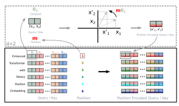
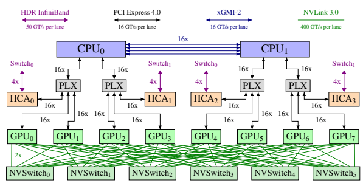
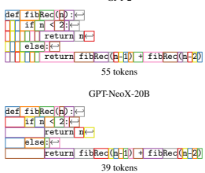
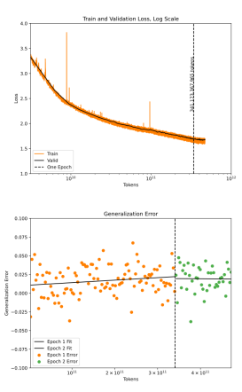
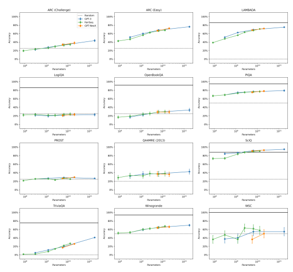
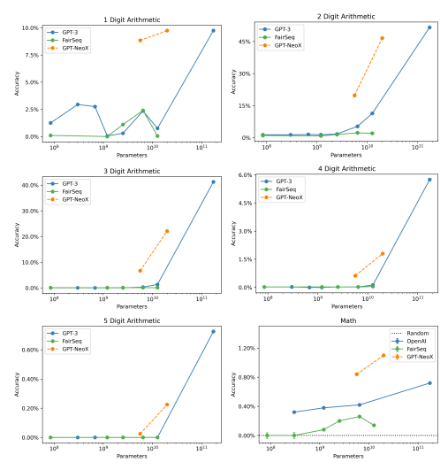
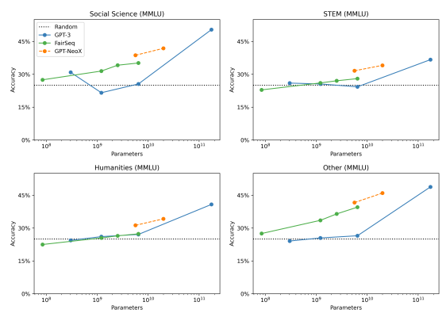
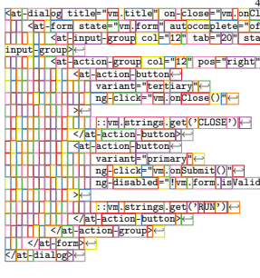
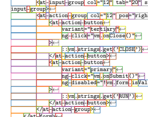

GPT-NeoX-20B: An Open-Source Autoregressive Language Model Sid Black* Stella Biderman* **Eric Hallahan***
Quentin Anthony Leo Gao Laurence Golding Horace He Connor Leahy Kyle McDonell Jason Phang Michael Pieler USVSN Sai Prashanth Shivanshu Purohit Laria Reynolds Jonathan Tow Ben Wang Samuel Weinbach Abstract We introduce GPT-NeoX-20B, a 20 billion parameter autoregressive language model trained on the Pile, whose weights will be made freely and openly available to the public through a permissive license. It is, to the best of our knowledge, the largest dense autoregressive model that has publicly available weights at the time of submission. In this work, we describe GPT-NeoX-20B's architecture and training and evaluate its performance on a range of language-understanding, mathematics, and knowledge-based tasks. We find that GPT-NeoX-20B is a particularly powerful few-shot reasoner and gains far more in performance when evaluated five-shot than similarly sized GPT-3 and FairSeq models. We open-source the training and evaluation code, as well as the model weights, at https:// github.com/EleutherAI/gpt-neox.

# 1 Introduction

Over the past several years, there has been an explosion in research surrounding large language models (LLMs) for natural language processing, catalyzed largely by the impressive performance of Transformer-based language models such as BERT (Devlin et al., 2019), GPT-2 (Radford et al., 2019), GPT-3 (Brown et al., 2020), and T5 (Raffel et al., 2020). One of the most impactful outcomes of this research has been the discovery that the performance of LLMs scales predictably as a power law with the number of parameters, with architectural details such as width/depth ratio having a minimal impact on performance within a wide range
(Kaplan et al., 2020). A consequence of this has been an abundance of research focusing on scaling Transformer models up to ever-larger scales, resulting in dense models that surpass 500B parameters
(Smith et al., 2022; Chowdhery et al., 2022), a milestone that would have been almost unthinkable just a few years prior.

Today, there are dozens of publicly acknowledged LLMs in existence, the largest having more than two orders of magnitude more parameters than GPT-2, and even at that scale there are nearly a dozen different models. However, these models are almost universally the protected intellectual property of large organizations, and are gated behind a commercial API, available only upon request, or not available for outsider use at all. To our knowledge, the only freely and publicly available dense autoregressive language models larger than GPT-
2 are GPT-Neo (2.7B parameters) (Black et al.,
2021), GPT-J-6B (Wang and Komatsuzaki, 2021),
Megatron-11B1, Pangu-α-13B (Zeng et al., 2021),
and the recently released FairSeq models (2.7B, 6.7B, and 13B parameters) (Artetxe et al., 2021).

In this paper we introduce GPT-NeoX-20B, a 20 billion parameter open-source autoregressive language model. We make the models weights freely and openly available to the public through a permissive license, motivated by the belief that open access to LLMs is critical to advancing research in a wide range of areas—particularly in AI safety, mechanistic interpretability, and the study of how LLM capabilities scale. Many of the most interesting capabilities of LLMs only emerge above a certain number of parameters, and they have many properties that simply cannot be studied in smaller models. Although safety is often cited as a justification for keeping model weights private, we believe this is insufficient to prevent misuse, and is largely a limitation on the ability to probe and study LLMs for researchers not based at the small number of organizations that have access to state of the art language models. In addition, we make partially trained checkpoints avaliable at evenly

*Lead authors. Authors after the first three are listed in alphabetical order. See Appendix A for individual contribution details. Correspondence can be sent to {sid, stella, contact}@eleuther.ai 1This model does not work using the provided codebase, and we have been told it under-performs GPT-J.
spaced 1000 step intervals throughout the whole of training. We hope that by making a wide range of checkpoints throughout training freely available, we will facilitate research on the training dynamics of LLMs, as well as the aforementioned areas of AI safety and interpretability.

In studying GPT-NeoX-20B, we find several noteworthy phenomena at odds with the established literature. We train on a dataset that contains duplicated data for more than one epoch but see no evidence of performance loss. While (Hendrycks et al., 2021a) claims that few-shot prompting doesn't improve performance on their task, we find that this is actually a phenomenon unique to GPT-3 and doesn't apply to either GPT-NeoX-20B or FairSeq models. Finally, we find that GPT-NeoX-20B is a powerful few-shot learner, recieving a much larger performance boost from few-shot examples than comparable sized GPT-3 and FairSeq models. As we see the same with GPT-J-6B (Wang and Komatsuzaki, 2021), we hypothesize that this may be due to the shared choice of training data.

In the following sections, we give a broad overview of GPT-NeoX-20B's architecture and training hyperparameters, detail the hardware and software setup used for training and evaluation, and elaborate on the choices made when designing the training dataset and tokenization. We also address of some of the difficulties and unknowns we encountered in training such a large model. We place significant importance on the broader impacts of the release GPT-NeoX-20B, and provide a lengthy discussion of why we believe its release is a net benefit. We also document issues of training cost and carbon emissions in as much detail as much as possible.

# 2 Model Design And Implementation

GPT-NeoX-20B is an autoregressive transformer decoder model whose architecture largely follows that of GPT-3 (Brown et al., 2020), with a few notable deviations described below. Our model has 20 billion parameters, of which 19.9 billion are "non-embedding" parameters that Kaplan et al. (2020) identify as the proper number to use for scaling laws analysis. Our model has 44 layers, a hidden dimension size of 6144, and 64 heads.

## 2.1 Model Architecture

Although our architecture is largely similar to GPT- 3, there are some notable differences. In this section we give a high-level overview of those differences, but ask the reader to refer to (Brown et al., 2020) for full details of the model architecture. Our model architecture is almost identical to that of GPT-J (Wang and Komatsuzaki, 2021)
2, however we choose to use GPT-3 as the point of reference because there is no canonical published reference on the design of GPT-J.

## 2.1.1 Rotary Positional Embeddings

We use rotary embeddings (Su et al., 2021) instead of the learned positional embeddings used in GPT models (Radford et al., 2018), based on our positive prior experiences using it in training LLMs. Rotary embeddings are a form of static relative positional embeddings. In brief, they twist the embedding space such that the attention of a token at position m to token at position n is linearly dependent on m − n. More formally, they modify the standard multiheaded attention equations from

$$\mathrm{softmax}\left(\frac{1}{\sqrt{d}}\sum_{n,m}\mathbf{x}_{m}^{T}\mathbf{W}_{q}^{T}\mathbf{W}_{k}\mathbf{x}_{n}\right),$$

where xm, xn are (batched) embeddings of tokens at position m and n respectively and WT
q, Wk are the query and key weights respectively to

$$\mathrm{softmax}\left(\frac{1}{\sqrt{d}}\sum_{n,m}\mathbf{x}_{m}^{T}\mathbf{W}_{q}^{T}R_{\Theta,(n-m)}^{d}\mathbf{W}_{k}\mathbf{x}_{n}\right),$$

where R

d Θ,xis a d ×d block diagonal matrix with the block of index i being a 2D rotation by xθi for hyperparameters Θ = {θi = 10000−2i/d| i ∈
{0,1,2*,...,*(d −1)/2}}.

Figure 1: A pictorial representation of rotary embeddings, from Su et al. (2021).

While Su et al. (2021) apply rotary embeddings to every embedding vector, we follow Wang and

2The sole difference is due to an oversight discussed in Section 2.1.2
Komatsuzaki (2021) and instead apply it only to the first 25% of embedding vector dimensions. Our initial experiments indicate that this strikes the best balance of performance and computational efficiency.3

## 2.1.2 Parallel Attention + Ff Layers

We compute the Attention and Feed-Forward (FF)
layers in parallel4and sum the results, rather than running them in series. This is primarily for efficiency purposes, as each residual addition with op-sharding requires one all-reduce in the forward pass and one in the backwards pass (Shoeybi et al., 2020). By computing the Attention and FFs in parallel, the results can be reduced locally before performing a single all-reduce. In Mesh Transformer JAX (Wang, 2021), this led to a 15% throughput increase, while having comparable loss curves with running them in series during early training.

Due to an oversight in our code, we unintentionally apply two independent Layer Norms instead of using a tied layer norm the way Wang and Komatsuzaki (2021) does. Instead of computing

$$x+\mathrm{{Attn}}(\mathrm{LN}_{1}(x))+\mathrm{{FF}}(\mathrm{LN}_{1}(x))$$

as intended, our codebase unties the layer norms:

$\mathbb{F}(\text{LN}_2(x))$. 

# X+Attn(Ln1(X)) +Ff(Ln2(X)).

Unfortunately, this was only noticed after we were much too far into training to restart. Subsequent experiments at small scales indicated that the untied layer norm makes no difference in performance, but we nevertheless wish to highlight this in the interest of transparency.

## 2.1.3 Initialization

For the Feed-Forward output layers before the residuals, we used the initialization scheme introduced in Wang (2021), 2 L
√d
. This prevents activations from growing with increasing depth and width, with the factor of 2 compensating for the fact that the parallel and feed-forward layers are organized in parallel. For all other layers, we use the *small init* scheme from Nguyen and Salazar (2019), 
q2 d+4d

## 2.1.4 All Dense Layers

While GPT-3 uses alternating dense and sparse layers using the technique introduced in Child et al.

(2019), we instead opt to exclusively use dense layers to reduce implementation complexity.

## 2.2 Software Libraries

Our model is trained using a codebase that builds on Megatron (Shoeybi et al., 2020) and Deep- Speed (Rasley et al., 2020) to facilitate efficient and straightforward training of large language models with tens of billions of parameters. We use the official PyTorch v1.10.0 release binary package compiled with CUDA 11.1. This package is bundled with NCCL 2.10.3 for distributed communications.

## 2.3 Hardware

We trained GPT-NeoX-20B on twelve Supermicro AS-4124GO-NART servers, each with eight NVIDIA A100-SXM4-40GB GPUs and configured with two AMD EPYC 7532 CPUs. All GPUs can directly access the InfiniBand switched fabric through one of four ConnectX-6 HCAs for GPUDirect RDMA. Two NVIDIA MQM8700-
HS2R switches—connected by 16 links—compose the spine of this InfiniBand network, with one link per node CPU socket connected to each switch. Figure 2 shows a simplified overview of a node as configured for training.

# 3 Training

Due to the intractability of performing a hyperparameter sweep for a 20 billion parameter model, we opted to use the values from Brown et al. (2020)
to guide our choice of hyperparameters. As Brown et al. (2020) did not train a model at our exact scale, we interpolate between the learning rates of their 13B and 175B models to arrive at a learning rate of 0.97E−5. Based on the results of smaller scale experiments, we select a weight decay of 0.01. To achieve a higher training throughput, we opt to use the same batch size as OpenAI's 175B
model–approximately 3.15M tokens, or 1538 contexts of 2048 tokens each, and train for a total of 150,000 steps, decaying the learning rate with a cosine schedule to 10% of its original value at the end of training.

We use the AdamW (Loshchilov and Hutter, 2019) optimizer, with beta values of 0.9 and 0.95 respectively, and an epsilon of 1.0E−8. We extend AdamW with the *ZeRO* optimizer (Rajbhandari

3See the Weights & Biases reports here and here for further details.

4See GitHub for implementation details.

Figure 2: Architecture diagram of a single training node.

et al., 2020) to reduce memory consumption by distributing optimizer states across ranks. Since the weights and optimizer states of a model at this scale do not fit on a single GPU, we use the tensor parallelism scheme introduced in Shoeybi et al. (2020) in combination with pipeline parallelism (Harlap et al., 2018) to distribute the model across GPUs. To train GPT-NeoX-20B, we found that the most efficient way to distribute the model given our hardware setup was to set a tensor parallel size of 2, and a pipeline parallel size of 4. This allows for the most communication intensive processes, tensor and pipeline parallelism, to occur within a node, and data parallel communication to occur across node boundaries. In this fashion, we were able to achieve and maintain an efficiency of 117 teraFLOPS per GPU.

## 3.1 Training Data

GPT-NeoX-20B was trained on the Pile (Gao et al., 2020), a massive curated dataset designed specifically for training large language models. It consists of data from 22 data sources, coarsely broken down into 5 categories:

- **Academic Writing**: Pubmed Abstracts and PubMed Central, arXiv, FreeLaw,5 USPTO
Backgrounds,6 PhilPapers,7 NIH Exporter8
- **Web-scrapes and Internet Resources**:

CommonCrawl, OpenWebText2, StackExchange,9 Wikipedia (English)

- **Prose**: BookCorpus2, Bibliotik, Project Gutenberg (PG-19; Rae et al., 2019)
- **Dialogue**: Youtube subtitles, Ubuntu IRC,10 OpenSubtitles (Lison and Tiedemann, 2016),
Hacker News,11 EuroParl (Koehn, 2005)
- **Miscellaneous**: GitHub, the DeepMind Mathematics dataset (Saxton et al., 2019), Enron Emails (Klimt and Yang, 2004)

In aggregate, the Pile consists of over 825 GiB of raw text data. The diversity of data sources reflects our desire for a general-purpose language model.

Certain components are up-sampled to obtain a more balanced data distribution. In contrast, GPT- 3's training data consists of web-scrapes, books datasets, and Wikipedia. When comparing results in this work to GPT-3, the training data is almost certainly the biggest known unknown factor. Full details of the Pile can be found in the technical report (Gao et al., 2020) and the associated datasheet
(Biderman et al., 2022).

It is particularly notable that the Pile contains a scrape of StackExchange preprocessed into a Q/A form. There is a significant and growing body of work on the influence of the syntactic structure of finetuning data on downstream performance (Zhong et al., 2021; Tan et al., 2021;

5https://www.courtlistener.com/ 6https://bulkdata.uspto.gov/ 7https://philpapers.org/ 8https://exporter.nih.gov/
9https://archive.org/details/stackexchange 10https://irclogs.ubuntu.com/ 11https://news.ycombinator.com/

Figure 3: GPT-2 tokenization vs. GPT-NeoX-20B tokenization. GPT-NeoX-20B tokenization handles whitespace better, which is particularly useful for text such as source code. For more examples, see Appendix F.

Sanh et al., 2021; Wei et al., 2021). While so far there has been no systematic work that focuses on prompted pretraining, recent work (Biderman and Raff, 2022) observed that the formulation of the StackExchange component of the Pile appears to heavily influence code generation.

## 3.2 Tokenization

For GPT-NeoX-20B, we use a BPE-based tokenizer similar to that used in GPT-2, with the same total vocabulary size of 50257, with three major changes to the tokenizer. First, we train a new BPE tokenizer based on the Pile, taking advantage of its diverse text sources to construct a more generalpurpose tokenizer. Second, in contrast to the GPT-2 tokenizer which treats tokenization at the start of a string as a non-space-delimited token, the GPT-
NeoX-20B tokenizer applies consistent space delimitation regardless. This resolves an inconsistency regarding the presence of prefix spaces to a tokenization input.12. An example can be seen in Figure 3. Third, our tokenizer contains tokens for repeated space tokens (all positive integer amounts of repeated spaces up to and including 24). This allows the GPT-NeoX-20B tokenizer to tokenize text with large amounts of whitespace using fewer tokens; for instance, program source code or arXiv LATEX source files. See Appendix E for an analysis of the tokenizer.

## 3.3 Data Duplication

In the past two years, the standard practice when training autoregressive language models has become to train for only one epoch (Komatsuzaki, 2019; Kaplan et al., 2020; Henighan et al., 2020). Recent research has claimed to see significant benefits from going even further and deduplicating training data (Lee et al., 2021; Kandpal et al.,
2022; Roberts et al., 2022). In particular, every publicly known larger language model other than GPT-3 (Brown et al., 2020) and Jurassic-113 either uses some form of deduplication (Rae et al., 2022; Askell et al., 2021; Zeng et al., 2021; Sun et al.,
2021; Smith et al., 2022; Hoffmann et al., 2022; Chowdhery et al., 2022) or does not discuss the training data in sufficient detail to determine what was done (Kim et al., 2021).

When the Pile was originally made, the only language model larger than GPT-NeoX-20B that existed was GPT-3, which upsampled high-quality subsets of its training data. The Pile followed suit, and due to a combination of a lack of resources for large-scale ablations and a lack of noticeable impact at smaller scales, we opt to use the Pile as-is.

As shown in fig. 4, even at the 20B parameter scale we see no drop in test validation loss after crossing the one epoch boundary.

Unfortunately, none of the papers that have claimed to see an improvement from deduplication have released trained models that demonstrate this, making replication and confirmation of their results difficult. Lee et al. (2021) releases the deduplication code that they used, which we intend to use to explore this question in more detail in the future.

It is important to note that even if there is not an improvement in loss or on task evaluations there are nevertheless compelling reasons to deduplicate training data for any model put into production. In particular, systematic analysis has shown significant benefits in terms of reducing the leakage of training data (Lee et al., 2021; Zhang et al., 2021; Carlini et al., 2022; Kandpal et al., 2022).

# 4 Performance Evaluations

To evaluate our model we use the EleutherAI
Language Model Evaluation Harness (Gao et al.,
2021b), an open source codebase for language model evaluation that supports a number of model

12https://discuss.huggingface.co/t/
bpe-tokenizers-and-spaces-before-words/475/2 13In private communication, the authors confirmed that Jurassic-1 was trained on the Pile (Gao et al., 2020).

Figure 4: Training and validation loss for GPT-NeoX- 20B. As the validation loss continued to fall into the beginning of the second epoch, we decided to let it train further.

APIs. As our goal is to make a powerful model publicly accessible, we compare with English language models with at least 10B parameters that are publicly accessible. We compare with the GPT-3 models on the OpenAI API (Brown et al., 2020), the open source FairSeq dense models (Artetxe et al., 2021), and GPT-J-6B (Wang and Komatsuzaki, 2021). We do not compare against T5 (Raffel et al., 2020) or its derivatives as our evaluation methodology assumes that the models are autoregressive. While there is a Megatron-11B checkpoint that has been publicly released, the released code is non-functional and we have not been able to get the model to work. We do not compare against any mixture-of-experts models as no public MoE model achieves performance comparable to a 10B parameter dense model.

While the size of the GPT-3 API models are not

officially confirmed, we follow Gao (2021b) and assess them as being 350M (Ada), 1.3B (Babbage),
6.7B (Curie), and 175B (Da Vinci). We categorize both GPT-J-6B and GPT-NeoX-20B under the umbrella of GPT-NeoX models, as both models are trained with the same architecture and were trained on the same dataset. However, we connect them using a dashed line to reflect the fact that these two models are not the same model trained at two different scales the way the FairSeq and GPT-3 models are, having been trained using different codebases, different tokenizers, and for different numbers of tokens.

Where we were able to obtain the relevant information, we report two baselines: human-level performance and random performance. All plots contain error bars representing two standard errors, indicating the 95% confidence interval around each point. For some plots, the standard error is so small that the interval is not visible.

## 4.1 Tasks Evaluated

We evaluate our model on a diverse collection of standard language model evaluation datasets that we divide into three main categories: natural language tasks, Advanced Knowledge-Based Tasks, and Mathematical Tasks. We evalutate GPT-J-6B,
GPT-NeoX-20B, and FairSeq models both zeroand five-shot, but due to financial constraints only evaluate GPT-3 models zero-shot. Due to space constraints a representative subset of the results are shown here, with the rest in Appendix D.

Natural Language Tasks We evaluate our model on a diverse collection of standard language model evaluation datasets: ANLI (Nie et al., 2020), ARC (Clark et al., 2018), HeadQA (English) (Vilares and Gómez-Rodríguez, 2019), HellaSwag (Zellers et al., 2019), LAMBDADA (Paperno et al., 2016), LogiQA (Liu et al., 2020), OpenBookQA (Mihaylov et al., 2018), PiQA (Bisk et al., 2020), PROST (Aroca-Ouellette et al., 2021), QA4MRE (Peñas et al., 2013) (2013), SciQ (Welbl et al., 2017), TriviaQA (Joshi et al., 2017), Winogrande (Sakaguchi et al., 2021), and the SuperGlue version of the Winograd Schemas Challenge (WSC) (Wang et al., 2019). Mathematical Tasks The solving of mathematical problem solving is an area that has had a long history of study in AI research, despite the fact that large language models tend to perform quite poorly on both arithmetic tasks and mathematical problems phrased in natural language. We evaluate on the MATH test dataset (Hendrycks et al., 2021b) as well as on the numerical arithmetic problems introduced by Brown et al. (2020). Note that the MATH test dataset is an evaluation metric that is generally finetuned on, but due to computational limitations we only evaluate models zero- and five-shot here. Advanced Knowledge-Based Tasks We are also interested in the ability of our models to answer factual questions that (for humans) require advanced knowledge. To do this, we use a dataset of multiple choice questions in a variety of diverse domains developed by Hendrycks et al. (2021a).

Following common practice on this dataset, we focus on results aggregated by subject area: Humanities, Social Sciences, STEM, and Miscellaneous as presented in Figure 7. We report five-shot performance to be comparable to previous work, taking our five-shot GPT-3 values from Hendrycks et al. (2021a).

# 5 Discussion

## 5.1 Performance Results

Natural Language Tasks While GPT-NeoX- 20B outperforms FairSeq 13B on some tasks (e.g. ARC, LAMBADA, PIQA, PROST), it underperforms on others (e.g. HellaSwag, LogiQA zeroshot). In total, across the 32 evaluations we did we outpreform on 22 tasks, underperform on four tasks, and fall within the margin of error on six tasks. By far our weakest performance is on HellaSwag, where we score four standard deviations below FairSeq 13B in both zero- and five-shot evaluations. Similarly, GPT-J underperforms FairSeq 6.7B by three standard deviations zero-shot and six standard deviations five-shot on HellaSwag. We find this massive performance loss largely inexplicable; while we originally assumed that the substantial non-prose components of the Pile were to blame, we note that GPT-J and GPT-NeoX overpreform FairSeq models on the very similar Lambada task by roughly the same amount. Mathematics While GPT-3 and FairSeq models are generally quite close on arithmetic tasks, they are consistently out-performed by GPT-J and GPT- NeoX. We conjecture that this is traceable to the prevalence of mathematics equations in the training data, but warn that people should not assume that this means that training on the Pile produces better out-of-distribution arithmetic reasoning. Razeghi et al. (2022) show that there is a strong correlation between the frequency of a numerical equation in the Pile and GPT-J's performance on that equation, and we see no reason this would not hold in GPT-NeoX 20B, FairSeq, and GPT-3. We are unfortunately unable to investigate this effect in FairSeq and GPT-3 models because the authors do not release their training data.

Advanced Knowledge-Based Tasks While GPT-NeoX and FairSeq models both exhibit dominant performance on MMMLU compared to GPT-3 in the five-shot setting (Figure 7), their performance is much closer in the zero-shot setting
(Tables 10 to 13). Hendrycks et al. (2021b) claim to find that few-shot evaluation does not improve performance relative to zero-shot, but they only study GPT-3. By contrast, we find that GPT-NeoX
and FairSeq models do improve substantially with as few as five examples. We view this as a warning against drawing strong conclusions about evaluation metrics based only on one model, and encourage researchers developing new evaluation benchmarks to leverage multiple different classes of models to avoid overfitting their conclusions to a specific model.

## 5.2 Powerful Few-Shot Learning

Our experiments indicate that GPT-J-6B and GPT- NeoX-20B benefit substantially more from fewshot evaluations than the FairSeq models do. When going from 0-shot to 5-shot evaluations, GPT-J-6B improves by 0.0526 and GPT-NeoX-20B improves

Figure 5: Zero-shot performance of GPT-NeoX-20B compared to GPT-J-6B and FairSeq and OpenAI models on a variety of language modeling benchmarks.

 Figure 6: Zero-shot performance of GPT-NeoX-20B compared to and FairSeq and OpenAI models on arithmetic tasks and MATH. Random performance on these tasks is 0%, and we were unable to find information on median human performance.

Figure 7: Five-shot performance of GPT-NeoX-20B compared to GPT-J-6B and FairSeq and OpenAI models on

 Hendrycks et al. (2021a). Due to financial limitations we were unable to evaluate on the OpenAI API. Instead, we report numbers from Hendrycks et al. (2021a) with model sizes corrected.

by 0.0598 while the FairSeq 6.7B and 13B models improve by 0.0051 and 0.0183 respectively. This result is statistically significant and robust to perturbations of prompting. While we do not have a particular explanation for this currently, we view this as a strong recommendation for our models.

While we do not have systematic five-shot evaluations of GPT-3 due to financial limitations, the change in performance demonstrated in tables 10 to 13 and fig. 7 further supports the suggestion that GPT-J-6B and GPT-NeoX-20B are able to gain significantly more utility from five-shot examples.

## 5.3 Limitations

Optimal Training Hyperparameter tuning is an expensive process, and is often infeasible to do at full scale for multi-billion parameter models. Due to the aforementioned limitations, we opted to choose hyperparameters based on a mixture of experiments at smaller scales and by interpolating parameters appropriate for our model size based on previously published work (Brown et al., 2020). However, several aspects of both our model architecture [Section 2.1] and training setup, including the data [Section 3.1] and the tokenizer [Section 3.2], diverge significantly from Brown et al.

(2020). As such, it is almost certainly the case that the hyperparameters used for our model are no longer optimal, and potentially never were. Lack of Coding Evaluations Many of the design choices we made during the development of this model were oriented towards improving performance on coding tasks. However, we underestimated the difficulty and cost of existing coding benchmarks (Chen et al., 2021), and so were unable to evaluate out model in that domain. We hope to do so in the future. Data Duplication Finally, the lack of dataset deduplication could also have had an impact on downstream performance. Recent work has shown that deduplicating training data can have a large effect on perplexity (Lee et al., 2021). While our experiments show no sign of this, it is hard to dismiss it due to the number of researchers who have found the opposite result.

## 5.4 Releasing A 20B Parameter Llm

The current status quo in research is that large language models are things people train and publish about, but do not actually release. To the best of our knowledge, GPT-NeoX-20B is the largest and most performant dense language model to ever be publicly released. A variety of reasons for the nonrelease of large language models are given by various groups, but the primary one is the harms that public access to LLMs would purportedly cause.

We take these concerns quite seriously. However, having taken them quite seriously, we feel that they are flawed in several respects. While a thorough analysis of these issues is beyond the scope of this paper, the public release of our model is the most important contribution of this paper and so an explanation of why we disagree with the prevailing wisdom is important. Providing access to ethics and alignment researchers will prevent harm. The open-source release of this model is motivated by the hope that it will allow researchers who would not otherwise have access to LLMs to use them. While there are negative risks due to the potential acceleration of capabilities research, we believe the benefits of this release outweigh the risks. We also note that these benefits are not hypothetical, as a number of papers about the limits and ethics of LLMs has been explicitly enabled by the public release of previous models (Zhang et al., 2021; Kandpal et al., 2022; Carlini et al., 2022; Birhane et al., 2021; nostalgebraist, 2020; Meng et al., 2022; Lin et al., 2021).

Limiting access to governments and corporations will not prevent harm. Perhaps the most curious aspect of the argument that LLMs should not be released is that the people making such arguments are not arguing they *they* should not use LLMs. Rather, they are claiming that *other people* should not use them. We do not believe that this is a position that should be taken seriously. The companies and governments that have the financial resources to train LLMs are overwhelmingly more likely to do large scale harm using a LLM than a random individual.

Releasing this model is the beginning, not the end, of our work to make GPT-NeoX-20B widely accessible to researchers. Due to the size of the model, inference is most economical on a pair of RTX 3090 Tis or a single A6000 GPU and finetuning requires significantly more compute. Truly promoting widespread access to LLMs means promoting widespread access to computing infrastructure in addition to the models themselves. We plan to make progress on this issue going forward by continuing to work on reducing the inference costs of our model, and by working with researchers to provide access to the computing infrastructure they need to carry out experiments on our models. We strongly encourage researchers who are interested in studying GPT-NeoX-20B but lack the necessary infrastructure to reach out to discuss how we can help empower you.

# 6 Summary

We introduce GPT-NeoX-20B, a 20 billion parameter autoregressive Transformer language model trained on the Pile (Gao et al., 2020) dataset, and detail the main architectural differences between GPT- NeoX-20B and GPT-3—most notably the change in tokenizer, the addition of Rotary Positional Embeddings, the parallel computation of attention and feed-forward layers, and a different initialization scheme and hyperparameters. We run extensive evaluations of GPT-NeoX-20B on natural language and factual knowledge tasks, and compare it with other publicly available models, finding it performs particularly well on knowledge-based and mathematical tasks. Finally, we are open sourcing the training and evaluation code at https://github.

com/EleutherAI/gpt-neox, where readers can find a link to download the model weights across the whole training run.

# Acknowledgments

We thank staff at CoreWeave—in particular Max Hjelm, Brannin McBee, Peter Salanki, and Brian Venturo—for providing the GPUs and computing infrastructure that made this project possible.

We would also like to acknowledge Eren Dogan ˘
and Wesley Brown for feedback and technical support throughout the project, and John Schulman, Evan Hubinger, Victor Sanh, Jacob Hilton, and Siddharth Karamcheti for providing feedback on drafts of the paper.

Finally, we thank Anthony DiPofi, Charles Foster, Jeffrey Hsu, Eric Tang, Anish Thite, Kevin Wang, and Andy Zou for their contributions to the EleutherAI Language Modeling Evaluation Harness we used to evaluate GPT-NeoX-20B.

# References

Stuart Armstrong and Sören Mindermann. 2018. Occam's razor is insufficient to infer the preferences of irrational agents. In Advances in Neural Information Processing Systems, volume 31, pages 5598–5609. Curran Associates, Inc.

Stuart Armstrong, Anders Sandberg, and Nick Bostrom. 2012. Thinking inside the box: Controlling and using an oracle AI. *Minds and Machines*, 22(4):299–324.

Stéphane Aroca-Ouellette, Cory Paik, Alessandro Roncone, and Katharina Kann. 2021. PROST: Physical reasoning about objects through space and time. In Findings of the Association for Computational Linguistics: ACL-IJCNLP 2021, pages 4597–4608, Online. Association for Computational Linguistics.

Mikel Artetxe, Shruti Bhosale, Naman Goyal, Todor Mihaylov, Myle Ott, Sam Shleifer, Xi Victoria Lin, Jingfei Du, Srinivasan Iyer, Ramakanth Pasunuru, Giri Anantharaman, Xian Li, Shuohui Chen, Halil Akin, Mandeep Baines, Louis Martin, Xing Zhou, Punit Singh Koura, Brian O'Horo, Jeff Wang, Luke Zettlemoyer, Mona Diab, Zornitsa Kozareva, and Ves Stoyanov. 2021. Efficient large scale language modeling with mixtures of experts. Computing Research Repository, arXiv:2112.10684. Version 1.

Amanda Askell, Yuntao Bai, Anna Chen, Dawn Drain, Deep Ganguli, Tom Henighan, Andy Jones, Nicholas Joseph, Ben Mann, Nova DasSarma, Nelson Elhage, Zac Hatfield-Dodds, Danny Hernandez, Jackson Kernion, Kamal Ndousse, Catherine Olsson, Dario Amodei, Tom Brown, Jack Clark, Sam McCandlish, Chris Olah, and Jared Kaplan. 2021. A general language assistant as a laboratory for alignment. *Computing Research Repository*,
arXiv:2112.00861. Version 3.

Emily M. Bender, Timnit Gebru, Angelina McMillan-
Major, and Shmargaret Shmitchell. 2021. On the dangers of stochastic parrots: Can language models be too big? In Proceedings of the 2021 ACM Conference on Fairness, Accountability, and Transparency, FAccT '21, pages 610–623, New York, NY, USA. Association for Computing Machinery.

Stella Biderman, Kieran Bicheno, and Leo Gao. 2022.

Datasheet for the Pile. Computing Research Repository, arXiv:2201.07311. Version 1.

Stella Biderman and Edward Raff. 2022. Neural language models are effective plagiarists. *Computing* Research Repository, arXiv:2201.07406. Version 1.

Stella Biderman and Walter J. Scheirer. 2020. Pitfalls in machine learning research: Reexamining the development cycle. In Proceedings on "I Can't Believe It's Not Better!" at NeurIPS Workshops, volume 137 of Proceedings of Machine Learning Research, pages 106–117. PMLR.

Abeba Birhane, Vinay Uday Prabhu, and Emmanuel Kahembwe. 2021. Multimodal datasets: misogyny, pornography, and malignant stereotypes. Computing Research Repository, arXiv:2110.01963. Version 1.

Yonatan Bisk, Rowan Zellers, Ronan Le bras, Jianfeng Gao, and Yejin Choi. 2020. PIQA: Reasoning about physical commonsense in natural language. In Proceedings of the AAAI Conference on Artificial Intelligence, volume 34, pages 7432–7439.

Sid Black, Leo Gao, Phil Wang, Connor Leahy, and Stella Biderman. 2021. GPT-Neo: Large scale autoregressive language modeling with Mesh- Tensorflow.

Tom Brown, Benjamin Mann, Nick Ryder, Melanie Subbiah, Jared D Kaplan, Prafulla Dhariwal, Arvind Neelakantan, Pranav Shyam, Girish Sastry, Amanda Askell, Sandhini Agarwal, Ariel Herbert- Voss, Gretchen Krueger, Tom Henighan, Rewon Child, Aditya Ramesh, Daniel Ziegler, Jeffrey Wu, Clemens Winter, Chris Hesse, Mark Chen, Eric Sigler, Mateusz Litwin, Scott Gray, Benjamin Chess, Jack Clark, Christopher Berner, Sam McCandlish, Alec Radford, Ilya Sutskever, and Dario Amodei. 2020. Language models are few-shot learners. In Advances in Neural Information Processing Systems, volume 33, pages 1877–1901. Curran Associates, Inc.

Nick Cammarata, Shan Carter, Gabriel Goh, Chris Olah, Michael Petrov, Ludwig Schubert, Chelsea Voss, Ben Egan, and Swee Kiat Lim. 2020. Thread: Circuits. *Distill*.

Nicholas Carlini, Daphne Ippolito, Matthew Jagielski, Katherine Lee, Florian Tramer, and Chiyuan Zhang. 2022. Quantifying memorization across neural language models. *Computing Research Repository*, arXiv:2202.07646. Version 2.

Mark Chen, Jerry Tworek, Heewoo Jun, Qiming Yuan, Henrique Ponde de Oliveira Pinto, Jared Kaplan, Harri Edwards, Yuri Burda, Nicholas Joseph, Greg Brockman, Alex Ray, Raul Puri, Gretchen Krueger, Michael Petrov, Heidy Khlaaf, Girish Sastry, Pamela Mishkin, Brooke Chan, Scott Gray, Nick Ryder, Mikhail Pavlov, Alethea Power, Lukasz Kaiser, Mohammad Bavarian, Clemens Winter, Philippe Tillet, Felipe Petroski Such, Dave Cummings, Matthias Plappert, Fotios Chantzis, Elizabeth Barnes, Ariel Herbert-Voss, William Hebgen Guss, Alex Nichol, Alex Paino, Nikolas Tezak, Jie Tang, Igor Babuschkin, Suchir Balaji, Shantanu Jain, William Saunders, Christopher Hesse, Andrew N. Carr, Jan Leike, Josh Achiam, Vedant Misra, Evan Morikawa, Alec Radford, Matthew Knight, Miles Brundage, Mira Murati, Katie Mayer, Peter Welinder, Bob McGrew, Dario Amodei, Sam McCandlish, Ilya Sutskever, and Wojciech Zaremba. 2021. Evaluating large language models trained on code. Computing Research Repository, arXiv:2107.03374. Version 2.

Rewon Child, Scott Gray, Alec Radford, and Ilya Sutskever. 2019. Generating long sequences with sparse transformers. Computing Research Repository, arXiv:1904.10509. Version 1.

Aakanksha Chowdhery, Sharan Narang, Jacob Devlin, Maarten Bosma, Gaurav Mishra, Adam Roberts, Paul Barham, Hyung Won Chung, Charles Sutton, Sebastian Gehrmann, Parker Schuh, Kensen Shi, Sasha Tsvyashchenko, Joshua Maynez, Abhishek Rao, Parker Barnes, Yi Tay, Noam Shazeer, Vinodkumar Prabhakaran, Emily Reif, Nan Du, Ben Hutchinson, Reiner Pope, James Bradbury, Jacob Austin, Michael Isard, Guy Gur-Ari, Pengcheng Yin, Toju Duke, Anselm Levskaya, Sanjay Ghemawat, Sunipa Dev, Henryk Michalewski, Xavier Garcia, Vedant Misra, Kevin Robinson, Liam Fedus, Denny Zhou, Daphne Ippolito, David Luan, Hyeontaek Lim, Barret Zoph, Alexander Spiridonov, Ryan Sepassi, David Dohan, Shivani Agrawal, Mark Omernick, Andrew M. Dai, Thanumalayan Sankaranarayana Pillai, Marie Pellat, Aitor Lewkowycz, Erica Moreira, Rewon Child, Oleksandr Polozov, Katherine Lee, Zongwei Zhou, Xuezhi Wang, Brennan Saeta, Mark Diaz, Orhan Firat, Michele Catasta, Jason Wei, Kathy Meier-Hellstern, Douglas Eck, Jeff Dean, Slav Petrov, and Noah Fiedel. 2022. PaLM: Scaling language modeling with pathways. *Computing Research Repository*, arXiv:2204.02311v2. Version 2.

Paul Christiano, Ajeya Cotra, and Mark Xu. 2021. Eliciting latent knowledge: How to tell if your eyes deceive you.

Peter Clark, Isaac Cowhey, Oren Etzioni, Tushar Khot, Ashish Sabharwal, Carissa Schoenick, and Oyvind Tafjord. 2018. Think you have solved question answering? try ARC, the AI2 Reasoning Challenge. Computing Research Repository, arXiv:1803.05457. Version 1.

Damai Dai, Li Dong, Yaru Hao, Zhifang Sui, and Furu Wei. 2021. Knowledge neurons in pretrained transformers. Computing Research Repository, arXiv:2104.08696. Version 1.

Abram Demski. 2019. The parable of Predict-O-Matic.

AI Alignment Forum.

Jacob Devlin, Ming-Wei Chang, Kenton Lee, and Kristina Toutanova. 2019. BERT: Pre-training of deep bidirectional transformers for language understanding. *Computing Research Repository*, arXiv:1810.04805. Version 2.

Jesse Dodge, Maarten Sap, Ana Marasovic, William ´
Agnew, Gabriel Ilharco, Dirk Groeneveld, Margaret Mitchell, and Matt Gardner. 2021. Documenting large webtext corpora: A case study on the Colossal Clean Crawled Corpus. In Proceedings of the 2021 Conference on Empirical Methods in Natural Language Processing, pages 1286–1305, Online and Punta Cana, Dominican Republic. Association for Computational Linguistics.

Nelson Elhage, Neel Nanda, Catherine Olsson, Tom Henighan, Nicholas Joseph, Ben Mann, Amanda Askell, Yuntao Bai, Anna Chen, Tom Conerly, Nova DasSarma, Dawn Drain, Deep Ganguli, Zac Hatfield-Dodds, Danny Hernandez, Andy Jones, Jackson Kernion, Liane Lovitt, Kamal Ndousse, Dario Amodei, Tom Brown, Jack Clark, Jared Kaplan, Sam McCandlish, and Chris Olah. 2021. A Mathematical Framework for Transformer Circuits. transformer-circuits.pub.

William Fedus, Barret Zoph, and Noam Shazeer. 2021.

Switch Transformers: Scaling to trillion parameter models with simple and efficient sparsity. Computing Research Repository, arXiv:2101.03961. Version 1.

Leo Gao. 2021a. Behavior cloning is miscalibrated. AI
Alignment Forum.

Leo Gao. 2021b. On the sizes of openai api models. Leo Gao, Stella Biderman, Sid Black, Laurence Golding, Travis Hoppe, Charles Foster, Jason Phang, Horace He, Anish Thite, Noa Nabeshima, Shawn Presser, and Connor Leahy. 2020. The Pile: An 800GB dataset of diverse text for language modeling. Computing Research Repository, arXiv:2101.00027. Version 1.

Leo Gao, Kyle McDonell, Laria Reynolds, and Stella Biderman. 2021a. A preliminary exploration into factored cognition with language models. EleutherAI Blog.

Leo Gao, Jonathan Tow, Stella Biderman, Sid Black, Anthony DiPofi, Charles Foster, Laurence Golding, Jeffrey Hsu, Kyle McDonell, Niklas Muennighoff, Jason Phang, Laria Reynolds, Eric Tang, Anish Thite, Ben Wang, Kevin Wang, and Andy Zou. 2021b. A framework for few-shot language model evaluation.

Aaron Harlap, Deepak Narayanan, Amar Phanishayee, Vivek Seshadri, Nikhil Devanur, Greg Ganger, and Phil Gibbons. 2018. PipeDream: Fast and efficient pipeline parallel DNN training. Computing Research Repository, arXiv:1806.03377. Version 1.

Dan Hendrycks, Collin Burns, Steven Basart, Andy Zou, Mantas Mazeika, Dawn Song, and Jacob Steinhardt. 2021a. Measuring massive multitask language understanding. Computing Research Repository, arXiv:2009.03300. Version 3.

Dan Hendrycks, Collin Burns, Saurav Kadavath, Akul Arora, Steven Basart, Eric Tang, Dawn Song, and Jacob Steinhardt. 2021b. Measuring mathematical problem solving with the MATH dataset. Computing Research Repository, arXiv:2103.03874. Version 2.

Tom Henighan, Jared Kaplan, Mor Katz, Mark Chen, Christopher Hesse, Jacob Jackson, Heewoo Jun, Tom B. Brown, Prafulla Dhariwal, Scott Gray, Chris Hallacy, Benjamin Mann, Alec Radford, Aditya Ramesh, Nick Ryder, Daniel M. Ziegler, John Schulman, Dario Amodei, and Sam McCandlish. 2020. Scaling laws for autoregressive generative modeling.

Computing Research Repository, arXiv:2010.14701.

Version 2.

Jordan Hoffmann, Sebastian Borgeaud, Arthur Mensch, Elena Buchatskaya, Trevor Cai, Eliza Rutherford, Diego de Las Casas, Lisa Anne Hendricks, Johannes Welbl, Aidan Clark, et al. 2022. Training compute-optimal large language models. Computing Research Repository, arXiv:2203.15556. Version 1.

Wenlong Huang, Pieter Abbeel, Deepak Pathak, and Igor Mordatch. 2022. Language models as zeroshot planners: Extracting actionable knowledge for embodied agents. *Computing Research Repository*,
arXiv:2201.07207. Version 1.

Evan Hubinger, Chris van Merwijk, Vladimir Mikulik, Joar Skalse, and Scott Garrabrant. 2021. Risks from learned optimization in advanced machine learning systems. *Computing Research Repository*, arXiv:1906.01820. Version 3.

Mandar Joshi, Eunsol Choi, Daniel Weld, and Luke Zettlemoyer. 2017. TriviaQA: A large scale distantly supervised challenge dataset for reading comprehension. In Proceedings of the 55th Annual Meeting of the Association for Computational Linguistics
(Volume 1: Long Papers), pages 1601–1611, Vancouver, Canada. Association for Computational Linguistics.

Nikhil Kandpal, Eric Wallace, and Colin Raffel. 2022.

Deduplicating training data mitigates privacy risks in language models. Computing Research Repository, arXiv:2202.06539. Version 2.

Jared Kaplan, Sam McCandlish, Tom Henighan, Tom B Brown, Benjamin Chess, Rewon Child, Scott Gray, Alec Radford, Jeffrey Wu, and Dario Amodei. 2020. Scaling laws for neural language models. Computing Research Repository, arXiv:2001.08361. Version 1.

Boseop Kim, HyoungSeok Kim, Sang-Woo Lee, Gichang Lee, Donghyun Kwak, Jeon Dong Hyeon, Sunghyun Park, Sungju Kim, Seonhoon Kim, Dongpil Seo, Heungsub Lee, Minyoung Jeong, Sungjae Lee, Minsub Kim, Suk Hyun Ko, Seokhun Kim, Taeyong Park, Jinuk Kim, Soyoung Kang, Na- Hyeon Ryu, Kang Min Yoo, Minsuk Chang, Soobin Suh, Sookyo In, Jinseong Park, Kyungduk Kim, Hiun Kim, Jisu Jeong, Yong Goo Yeo, Donghoon Ham, Dongju Park, Min Young Lee, Jaewook Kang, Inho Kang, Jung-Woo Ha, Woomyoung Park, and Nako Sung. 2021. What changes can large-scale language models bring? Intensive study on HyperCLOVA: Billions-scale Korean generative pretrained transformers. In Proceedings of the 2021 Conference on Empirical Methods in Natural Language Processing, pages 3405–3424, Online and Punta Cana, Dominican Republic. Association for Computational Linguistics.

Bryan Klimt and Yiming Yang. 2004. The Enron corpus: A new dataset for email classification research.

In Proceedings of the 15th European Conference on Machine Learning, ECML'04, page 217–226, Berlin, Heidelberg. Springer-Verlag.

Jack Koch, Lauro Langosco, Jacob Pfau, James Le, and Lee Sharkey. 2021. Objective robustness in deep reinforcement learning. Computing Research Repository, arXiv:2105.14111. Version 2.

Philipp Koehn. 2005. Europarl: A parallel corpus for statistical machine translation. In Proceedings of Machine Translation Summit X: Papers, pages 79– 86, Phuket, Thailand.

Aran Komatsuzaki. 2019. One epoch is all you need.

Computing Research Repository, arXiv:1906.06669.

Version 1.

Vanessa Kosoy. 2016. IRL is hard. AI Alignment Forum.

Julia Kreutzer, Isaac Caswell, Lisa Wang, Ahsan Wahab, Daan van Esch, Nasanbayar Ulzii-Orshikh, Allahsera Tapo, Nishant Subramani, Artem Sokolov, Claytone Sikasote, Monang Setyawan, Supheakmungkol Sarin, Sokhar Samb, Benoît Sagot, Clara Rivera, Annette Rios, Isabel Papadimitriou, Salomey Osei, Pedro Ortiz Suarez, Iroro Orife, Kelechi Ogueji, Andre Niyongabo Rubungo, Toan Q. Nguyen, Mathias Müller, André Müller, Shamsuddeen Hassan Muhammad, Nanda Muhammad, Ayanda Mnyakeni, Jamshidbek Mirzakhalov, Tapiwanashe Matangira, Colin Leong, Nze Lawson, Sneha Kudugunta, Yacine Jernite, Mathias Jenny, Orhan Firat, Bonaventure F. P. Dossou, Sakhile Dlamini, Nisansa de Silva, Sakine Çabuk Ballı, Stella Biderman, Alessia Battisti, Ahmed Baruwa, Ankur Bapna, Pallavi Baljekar, Israel Abebe Azime, Ayodele Awokoya, Duygu Ataman, Orevaoghene Ahia, Oghenefego Ahia, Sweta Agrawal, and Mofetoluwa Adeyemi. 2022. Quality at a Glance: An Audit of Web-Crawled Multilingual Datasets. Transactions of the Association for Computational Linguistics, 10:50–72.

Alexandre Lacoste, Alexandra Luccioni, Victor Schmidt, and Thomas Dandres. 2019. Quantifying the carbon emissions of machine learning. Computing Research Repository, arXiv:1910.09700. Version 2.

Connor Leahy. 2021. Why Release a Large Language Model? EleutherAI Blog.

Connor Leahy and Stella Biderman. 2021. The hard problem of aligning AI to human values. In The State of AI Ethics Report, volume 4, pages 180–183. The Montreal AI Ethics Institute.

Katherine Lee, Daphne Ippolito, Andrew Nystrom, Chiyuan Zhang, Douglas Eck, Chris Callison-Burch, and Nicholas Carlini. 2021. Deduplicating training data makes language models better. Computing Research Repository, arXiv:2107.06499. Version 1.

Opher Lieber, Or Sharir, Barak Lenz, and Yoav Shoham. 2021. Jurassic-1: Technical details and evaluation. Technical report, AI21 Labs.

Stephanie Lin, Jacob Hilton, and Owain Evans. 2021.

TruthfulQA: Measuring how models mimic human falsehoods. *Computing Research Repository*, arXiv:2109.07958. Version 1.

Pierre Lison and Jörg Tiedemann. 2016. OpenSubtitles2016: Extracting large parallel corpora from movie and TV subtitles. In *Proceedings of the Tenth* International Conference on Language Resources and Evaluation (LREC'16), pages 923–929, Portorož, Slovenia. European Language Resources Association (ELRA).

Jian Liu, Leyang Cui, Hanmeng Liu, Dandan Huang, Yile Wang, and Yue Zhang. 2020. LogiQA: A
challenge dataset for machine reading comprehension with logical reasoning. In Proceedings of the Twenty-Ninth International Joint Conference on Artificial Intelligence, IJCAI-20, pages 3622–3628. International Joint Conferences on Artificial Intelligence Organization.

Ilya Loshchilov and Frank Hutter. 2019. Decoupled weight decay regularization. Computing Research Repository, arXiv:1711.05101. Version 3.

J. Nathan Matias. 2020. Why we need industryindependent research on tech & society. Citizens and Technology Lab.

Joshua Maynez, Shashi Narayan, Bernd Bohnet, and Ryan McDonald. 2020. On faithfulness and factuality in abstractive summarization. Computing Research Repository, arXiv:2005.00661. Version 1.

Kevin Meng, David Bau, Alex Andonian, and Yonatan Belinkov. 2022. Locating and editing factual knowledge in GPT. *Computing Research Repository*,
arXiv:2202.05262v1. Version 1.

Todor Mihaylov, Peter Clark, Tushar Khot, and Ashish Sabharwal. 2018. Can a suit of armor conduct electricity? A new dataset for open book question answering. In Proceedings of the 2018 Conference on Empirical Methods in Natural Language Processing, pages 2381–2391, Brussels, Belgium. Association for Computational Linguistics.

Toan Q. Nguyen and Julian Salazar. 2019. Transformers without tears: Improving the normalization of self-attention. *Computing Research Repository*, arXiv:1910.05895. Version 2.

Yixin Nie, Adina Williams, Emily Dinan, Mohit Bansal, Jason Weston, and Douwe Kiela. 2020. Adversarial NLI: A new benchmark for natural language understanding. In Proceedings of the 58th Annual Meeting of the Association for Computational Linguistics, pages 4885–4901, Online. Association for Computational Linguistics.

nostalgebraist. 2020. interpreting GPT: the logit lens.

LessWrong.

Maxwell Nye, Anders Johan Andreassen, Guy Gur-Ari, Henryk Michalewski, Jacob Austin, David Bieber, David Dohan, Aitor Lewkowycz, Maarten Bosma, David Luan, Charles Sutton, and Augustus Odena. 2021. Show your work: Scratchpads for intermediate computation with language models. Computing Research Repository, arXiv:2112.00114. Version 1.

Pedro A. Ortega, Markus Kunesch, Grégoire Delétang, Tim Genewein, Jordi Grau-Moya, Joel Veness, Jonas Buchli, Jonas Degrave, Bilal Piot, Julien Perolat, Tom Everitt, Corentin Tallec, Emilio Parisotto, Tom Erez, Yutian Chen, Scott Reed, Marcus Hutter, Nando de Freitas, and Shane Legg. 2021. Shaking the foundations: delusions in sequence models for interaction and control. Computing Research Repository, arXiv:2110.10819. Version 1.

Denis Paperno, Germán Kruszewski, Angeliki Lazaridou, Ngoc Quan Pham, Raffaella Bernardi, Sandro Pezzelle, Marco Baroni, Gemma Boleda, and Raquel Fernández. 2016. The LAMBADA dataset: Word prediction requiring a broad discourse context.

In Proceedings of the 54th Annual Meeting of the Association for Computational Linguistics (Volume 1: Long Papers), pages 1525–1534, Berlin, Germany. Association for Computational Linguistics.

Anselmo Peñas, Eduard Hovy, Pamela Forner, Álvaro Rodrigo, Richard Sutcliffe, and Roser Morante. 2013. QA4MRE 2011-2013: Overview of question answering for machine reading evaluation. In Information Access Evaluation. Multilinguality, Multimodality, and Visualization, pages 303–320, Berlin, Heidelberg. Springer Berlin Heidelberg.

Alec Radford, Karthik Narasimhan, Tim Salimans, and Ilya Sutskever. 2018. Improving language understanding by generative pre-training. Technical report, OpenAI.

Alec Radford, Jeff Wu, Rewon Child, David Luan, Dario Amodei, and Ilya Sutskever. 2019. Language models are unsupervised multitask learners. Technical report, OpenAI.

Jack W. Rae, Sebastian Borgeaud, Trevor Cai, Katie Millican, Jordan Hoffmann, H. Francis Song, John Aslanides, Sarah Henderson, Roman Ring, Susannah Young, Eliza Rutherford, Tom Hennigan, Jacob Menick, Albin Cassirer, Richard Powell, George van den Driessche, Lisa Anne Hendricks, Maribeth Rauh, Po-Sen Huang, Amelia Glaese, Johannes Welbl, Sumanth Dathathri, Saffron Huang, Jonathan Uesato, John Mellor, Irina Higgins, Antonia Creswell, Nat McAleese, Amy Wu, Erich Elsen, Siddhant M. Jayakumar, Elena Buchatskaya, David Budden, Esme Sutherland, Karen Simonyan, Michela Paganini, Laurent Sifre, Lena Martens, Xiang Lorraine Li, Adhiguna Kuncoro, Aida Nematzadeh, Elena Gribovskaya, Domenic Donato, Angeliki Lazaridou, Arthur Mensch, Jean-Baptiste Lespiau, Maria Tsimpoukelli, Nikolai Grigorev, Doug Fritz, Thibault Sottiaux, Mantas Pajarskas, Toby Pohlen, Zhitao Gong, Daniel Toyama, Cyprien de Masson d'Autume, Yujia Li, Tayfun Terzi, Vladimir Mikulik, Igor Babuschkin, Aidan Clark, Diego de Las Casas, Aurelia Guy, Chris Jones, James Bradbury, Matthew Johnson, Blake A. Hechtman, Laura Weidinger, Iason Gabriel, William S. Isaac, Edward Lockhart, Simon Osindero, Laura Rimell, Chris Dyer, Oriol Vinyals, Kareem Ayoub, Jeff Stanway, Lorrayne Bennett, Demis Hassabis, Koray Kavukcuoglu, and Geoffrey Irving. 2022. Scaling language models: Methods, analysis & insights from training Gopher. *Computing Research* Repository, arXiv:2112.11446. Version 2.

Jack W Rae, Anna Potapenko, Siddhant M Jayakumar, Chloe Hillier, and Timothy P Lillicrap. 2019. Compressive transformers for long-range sequence modelling. *Computing Research Repository*,
arXiv:1911.05507. Version 1.

Colin Raffel, Noam Shazeer, Adam Roberts, Katherine Lee, Sharan Narang, Michael Matena, Yanqi Zhou, Wei Li, and Peter J Liu. 2020. Exploring the limits of transfer learning with a unified text-to-text transformer. *Journal of Machine Learning Research*, 21:1–67.

Samyam Rajbhandari, Jeff Rasley, Olatunji Ruwase, and Yuxiong He. 2020. ZeRO: Memory optimizations toward training trillion parameter models. In Proceedings of the International Conference for High Performance Computing, Networking, Storage and Analysis, SC '20. IEEE Press.

Jeff Rasley, Samyam Rajbhandari, Olatunji Ruwase, and Yuxiong He. 2020. DeepSpeed: System optimizations enable training deep learning models with over 100 billion parameters. In Proceedings of the 26th ACM SIGKDD International Conference on Knowledge Discovery & Data Mining, pages 3505–
3506, New York, NY, USA. Association for Computing Machinery.

Yasaman Razeghi, Robert L Logan IV, Matt Gardner, and Sameer Singh. 2022. Impact of pretraining term frequencies on few-shot reasoning. Computing Research Repository, arXiv:2202.07206. Version 1.

Adam Roberts, Hyung Won Chung, Anselm Levskaya, Gaurav Mishra, James Bradbury, Daniel Andor, Sharan Narang, Brian Lester, Colin Gaffney, Afroz Mohiuddin, Curtis Hawthorne, Aitor Lewkowycz, Alex Salcianu, Marc van Zee, Jacob Austin, Sebastian Goodman, Livio Baldini Soares, Haitang Hu, Sasha Tsvyashchenko, Aakanksha Chowdhery, Jasmijn Bastings, Jannis Bulian, Xavier Garcia, Jianmo Ni, Andrew Chen, Kathleen Kenealy, Jonathan H. Clark, Stephan Lee, Dan Garrette, James Lee-Thorp, Colin Raffel, Noam Shazeer, Marvin Ritter, Maarten Bosma, Alexandre Passos, Jeremy Maitin-Shepard, Noah Fiedel, Mark Omernick, Brennan Saeta, Ryan Sepassi, Alexander Spiridonov, Joshua Newlan, and Andrea Gesmundo. 2022. Scaling up models and data with t5x and seqio. Computing Research Repository, arXiv:2203.17189. Version 1.

Jathan Sadowski, Salomé Viljoen, and Meredith Whittaker. 2021. Everyone should decide how their digital data are used - not just tech companies. *Nature*, 595(7866):169–171.

Keisuke Sakaguchi, Ronan Le Bras, Chandra Bhagavatula, and Yejin Choi. 2021. WinoGrande: An adversarial Winograd Schema Challenge at scale. Communications of the ACM, 64(9):99–106.

Victor Sanh, Albert Webson, Colin Raffel, Stephen H.

Bach, Lintang Sutawika, Zaid Alyafeai, Antoine Chaffin, Arnaud Stiegler, Teven Le Scao, Arun Raja, Manan Dey, M Saiful Bari, Canwen Xu, Urmish Thakker, Shanya Sharma Sharma, Eliza Szczechla, Taewoon Kim, Gunjan Chhablani, Nihal Nayak, Debajyoti Datta, Jonathan Chang, Mike Tian-Jian Jiang, Han Wang, Matteo Manica, Sheng Shen, Zheng Xin Yong, Harshit Pandey, Rachel Bawden, Thomas Wang, Trishala Neeraj, Jos Rozen, Abheesht Sharma, Andrea Santilli, Thibault Févry, Jason Alan Fries, Ryan Teehan, Stella Biderman, Leo Gao, Tali Bers, Thomas Wolf, and Alexander M. Rush. 2021. Multitask prompted training enables zero-shot task generalization. Computing Research Repository, arXiv:2110.08207. Version 2.

David Saxton, Edward Grefenstette, Felix Hill, and Pushmeet Kohli. 2019. Analysing mathematical reasoning abilities of neural models. Computing Research Repository, arXiv:1904.01557. Version 1.

Roy Schwartz, Jesse Dodge, Noah A. Smith, and Oren Etzioni. 2020. Green AI. *Communications of the* ACM, 63(12):54–63.

Mohammad Shoeybi, Mostofa Patwary, Raul Puri, Patrick LeGresley, Jared Casper, and Bryan Catanzaro. 2020. Megatron-LM: Training multi-billion parameter language models using model parallelism. Computing Research Repository, arXiv:1909.08053. Version 4.

Mary Anne Smart. 2021. Addressing privacy threats from machine learning. Computing Research Repository, arXiv:2111.04439. Version 1.

Shaden Smith, Mostofa Patwary, Brandon Norick, Patrick LeGresley, Samyam Rajbhandari, Jared Casper, Zhun Liu, Shrimai Prabhumoye, George Zerveas, Vijay Korthikanti, Elton Zhang, Rewon Child, Reza Yazdani Aminabadi, Julie Bernauer, Xia Song, Mohammad Shoeybi, Yuxiong He, Michael Houston, Saurabh Tiwary, and Bryan Catanzaro. 2022. Using DeepSpeed and Megatron to train Megatron-Turing NLG 530B, a large-scale generative language model. Computing Research Repository, arXiv:2201.11990. Version 3.

Nate Soares. 2021. Visible thoughts project and bounty announcement. Machine Intelligence Research Institute.

Nisan Stiennon, Long Ouyang, Jeff Wu, Daniel M.

Ziegler, Ryan Lowe, Chelsea Voss, Alec Radford, Dario Amodei, and Paul F. Christiano. 2022. Learning to summarize from human feedback. Computing Research Repository, arXiv:2009.01325.

Emma Strubell, Ananya Ganesh, and Andrew McCallum. 2019. Energy and policy considerations for deep learning in NLP. In Proceedings of the 57th Annual Meeting of the Association for Computational Linguistics, pages 3645–3650, Florence, Italy. Association for Computational Linguistics.

Jianlin Su, Yu Lu, Shengfeng Pan, Bo Wen, and Yunfeng Liu. 2021. RoFormer: Enhanced transformer with rotary position embedding. Computing Research Repository, arXiv:2104.09864. Version 2.

Yu Sun, Shuohuan Wang, Shikun Feng, Siyu Ding, Chao Pang, Junyuan Shang, Jiaxiang Liu, Xuyi Chen, Yanbin Zhao, Yuxiang Lu, Weixin Liu, Zhihua Wu, Weibao Gong, Jianzhong Liang, Zhizhou Shang, Peng Sun, Wei Liu, Xuan Ouyang, Dianhai Yu, Hao Tian, Hua Wu, and Haifeng Wang. 2021.

ERNIE 3.0: Large-scale knowledge enhanced pretraining for language understanding and generation. Computing Research Repository, arXiv:2107.02137. Version 1.

Zeerak Talat, Aurélie Névéol, Stella Biderman, Miruna Clinciu, Manan Dey, Shayne Longpre, Alexandra Sasha Luccioni, Maraim Masoud, Margaret Mitchell, Dragomir Radev, Shanya Sharma, Arjun Subramonian, Jaesung Tae, Samson Tan, Deepak Tunuguntla, and Oskar van der Wal. 2022. You reap what you sow: On the challenges of bias evaluation under multilingual settings. In Proceedings of the 1st Workshop on Challenges & Perspectives in Creating Large Language Models. Association for Computational Linguistics.

Zhixing Tan, Xiangwen Zhang, Shuo Wang, and Yang Liu. 2021. MSP: Multi-stage prompting for making pre-trained language models better translators. Computing Research Repository, arXiv:2110.06609. Version 1.

Jie Tang. 2021. WuDao: Pretrain the world. Keynote address at the European Conference on Machine Learning and Principles and Practice of Knowledge Discovery in Databases.

David Vilares and Carlos Gómez-Rodríguez. 2019.

HEAD-QA: A healthcare dataset for complex reasoning. In Proceedings of the 57th Annual Meeting of the Association for Computational Linguistics, pages 960–966, Florence, Italy. Association for Computational Linguistics.

Alex Wang, Yada Pruksachatkun, Nikita Nangia, Amanpreet Singh, Julian Michael, Felix Hill, Omer Levy, and Samuel Bowman. 2019. SuperGLUE: A stickier benchmark for general-purpose language understanding systems. In Advances in Neural Information Processing Systems, volume 32, pages 3266–
3280. Curran Associates, Inc.

Ben Wang. 2021. Mesh-Transformer-JAX: Modelparallel implementation of transformer language model with JAX.

Ben Wang and Aran Komatsuzaki. 2021. GPT-J-6B: A
6 billion parameter autoregressive language model.

Jason Wei, Maarten Bosma, Vincent Y Zhao, Kelvin Guu, Adams Wei Yu, Brian Lester, Nan Du, Andrew M Dai, and Quoc V Le. 2021. Finetuned language models are zero-shot learners. Computing Research Repository, arXiv:2109.01652. Version 5.

Johannes Welbl, Nelson F. Liu, and Matt Gardner. 2017.

Crowdsourcing multiple choice science questions. In Proceedings of the 3rd Workshop on Noisy Usergenerated Text, pages 94–106, Copenhagen, Denmark. Association for Computational Linguistics.

John Wentworth. 2020. Alignment by default. AI
Alignment Forum.

Meredith Whittaker. 2021. The steep cost of capture.

Interactions, 28(6):50–55.

Linting Xue, Aditya Barua, Noah Constant, Rami Al-
Rfou, Sharan Narang, Mihir Kale, Adam Roberts, and Colin Raffel. 2022. ByT5: Towards a token-free future with pre-trained byte-to-byte models. Transactions of the Association for Computational Linguistics, 10:291–306.

Linting Xue, Noah Constant, Adam Roberts, Mihir Kale, Rami Al-Rfou, Aditya Siddhant, Aditya Barua, and Colin Raffel. 2020. mT5: A massively multilingual pre-trained text-to-text transformer. Computing Research Repository, arXiv:2010.11934. Version 1.

Rowan Zellers, Ari Holtzman, Yonatan Bisk, Ali Farhadi, and Yejin Choi. 2019. HellaSwag: Can a machine really finish your sentence? In Proceedings of the 57th Annual Meeting of the Association for Computational Linguistics, pages 4791– 4800, Florence, Italy. Association for Computational Linguistics.

Wei Zeng, Xiaozhe Ren, Teng Su, Hui Wang, Yi Liao, Zhiwei Wang, Xin Jiang, ZhenZhang Yang, Kaisheng Wang, Xiaoda Zhang, Chen Li, Ziyan Gong, Yifan Yao, Xinjing Huang, Jun Wang, Jianfeng Yu, Qi Guo, Yue Yu, Yan Zhang, Jin Wang, Hengtao Tao, Dasen Yan, Zexuan Yi, Fang Peng, Fangqing Jiang, Han Zhang, Lingfeng Deng, Yehong Zhang, Zhe Lin, Chao Zhang, Shaojie Zhang, Mingyue Guo, Shanzhi Gu, Gaojun Fan, Yaowei Wang, Xuefeng Jin, Qun Liu, and Yonghong Tian. 2021. Pangu-α: Large-scale autoregressive pretrained chinese language models with autoparallel computation. Computing Research Repository, arXiv:2104.12369. Version 1.

Chiyuan Zhang, Daphne Ippolito, Katherine Lee, Matthew Jagielski, Florian Tramèr, and Nicholas Carlini. 2021. Counterfactual memorization in neural language models. Computing Research Repository, arXiv:2112.12938. Version 1.

Ruiqi Zhong, Kristy Lee, Zheng Zhang, and Dan Klein. 2021. Adapting language models for zero-shot learning by meta-tuning on dataset and prompt collections. *Computing Research Repository*, arXiv:2104.04670. Version 5.

# A Individual Contributions

Sid Black was the lead developer and overall point person for the project. **Stella Biderman** was the lead scientist and project manager.

## Implementation And Engineering

Implementation of training infrastructure: Sid Black, Stella Biderman, Eric Hallahan, Quentin Anthony, Samuel Weinbach Scaling experiments and optimization: Sid Black, Stella Biderman, Quentin Anthony, Samuel Weinbach

| Tokenizer:                    |
|-------------------------------|
| Sid Black                     |
| Miscellaneous:                |
| USVSN Sai Prashanth, Ben Wang |

Positional Embeddings:
Sid Black, Eric Hallahan, Michael Pieler

## Scientific Experimentation

Evaluations: Stella Biderman, Leo Gao, Jonathan Tow, Sid Black, Shivanshu Purohit, Horace He, Laurence Golding Positional Embeddings: Stella Biderman, Laurence Golding, Michael Pieler Tokenizer:
Stella Biderman, Jason Phang, Leo Gao

## Broader Impacts

Alignment Implications: Leo Gao, Connor Leahy, Laria Reynolds, Kyle McDonell Environmental Impact: Stella Biderman, Eric Hallahan

# B Full Configuration Details

In Table 1 we attach the full configuration details used to train GPT-NeoX-20B. The file is available in .yaml format usable in gpt-neox at https://
github.com/EleutherAI/gpt-neox, where we also provide documentation describing the role of each parameter.

Table 1: The full configuration details for GPT-NeoX-
20B training

| Configuration Key                                        | Value               |
|----------------------------------------------------------|---------------------|
| attention\-dropout                                       | 0                   |
| bias\-gelu\-fusion                                       | True                |
| checkpoint\-activations                                  | True                |
| checkpoint\-num\-layers                                  | 1                   |
| data\-impl                                               | mmap                |
| distributed\-backend                                     | nccl                |
| eval\-interval                                           | 1000                |
| eval\-iters                                              | 10                  |
| fp16.enabled                                             | True                |
| fp16.fp16                                                | True                |
| fp16.hysteresis                                          | 2                   |
| fp16.initial\-scale\-power                               | 12                  |
| fp16.loss\-scale                                         | 0                   |
| fp16.loss\-scale\-window                                 | 1000                |
| fp16.min\-loss\-scale                                    | 1                   |
| gpt\-j\-residual                                         | True                |
| gradient\-accumulation\-steps                            | 32                  |
| gradient\-clipping                                       | 1.0                 |
| hidden\-dropout                                          | 0                   |
| hidden\-size                                             | 6144                |
| init\-method                                             | small\-init         |
| log\-interval                                            | 2                   |
| lr\-decay\-iters                                         | 150000              |
| lr\-decay\-style                                         | cosine              |
| max\-position\-embeddings                                | 2048                |
| min\-lr                                                  | 9.7e\-06            |
| model\-parallel\-size                                    | 2                   |
| no\-weight\-tying                                        | True                |
| norm                                                     | layernorm           |
| num\-attention\-heads                                    | 64                  |
| num\-layers                                              | 44                  |
| optimizer.params.betas                                   | [0.9, 0.95]         |
| optimizer.params.eps                                     | 1e\-08              |
| optimizer.params.lr                                      | 9.7e\-05            |
| optimizer.type                                           | Adam                |
| output\-layer\-init\-method                              | wang\-init          |
| output\-layer\-parallelism                               | column              |
| partition\-activations                                   | False               |
| pipe\-parallel\-size                                     | 4                   |
| pos\-emb                                                 | rotary              |
| rotary\-pct                                              | 0.25                |
| save\-interval                                           | 500                 |
| scaled\-upper\-triang\-masked\-softmax\-fusion           | True                |
| seq\-length                                              | 2048                |
| split                                                    | 995,4,1             |
| steps\-per\-print                                        | 2                   |
| synchronize\-each\-layer                                 | True                |
| tokenizer\-type                                          | HFTokenizer         |
| train\-iters                                             | 150000              |
| train\-micro\-batch\-size\-per\-gpu                      | 4                   |
| vocab\-file                                              | 20B\-tokenizer.json |
| wall\-clock\-breakdown                                   | False               |
| warmup                                                   | 0.01                |
| weight\-decay zero\-optimization.allgather\-bucket\-size | 0.01   1260000000   |
| zero\-optimization.allgather\-partitions                 | True                |
| zero\-optimization.contiguous\-gradients                 | True                |
| zero\-optimization.cpu\-offload                          | False               |
| zero\-optimization.overlap\-comm                         | True                |
| zero\-optimization.reduce\-bucket\-size                  | 1260000000          |
| zero\-optimization.reduce\-scatter                       | True                |
| zero\-optimization.stage                                 | 1                   |

# C Broader Impacts

The current status quo in research is that large language models are things people train and publish about, but do not actually release. To the best of our knowledge, GPT-NeoX-20B is the largest dense language model to ever be publicly released with a several-way tie for second place at 13 billion parameters (Artetxe et al., 2021; Xue et al., 2020, 2022) and many more models at the 10-11B parameter scale. A variety of reasons for the non-release of large language models are given by various groups, but the primary one is the harms that public access to LLMs would purportedly cause.

We take these concerns quite seriously. However, having taken them quite seriously, we feel that they are flawed in several respects. While a thorough analysis of these issues is beyond the scope of this paper, the public release of our model is the most important contribution of this paper and so an explanation of why we disagree with the prevailing wisdom is important. Providing access to ethics and alignment researchers will prevent harm. The open-source release of this model is motivated by the hope that it will allow researchers who would not otherwise have access to LLMs to use them. While there are negative risks due to the potential acceleration of capabilities research, we believe the benefits of this release outweigh the risks. We also note that these benefits are not hypothetical, as a number of papers about the limits and ethics of LLMs has been explicitly enabled by the public release of previous models (Zhang et al., 2021; Kandpal et al., 2022; Carlini et al., 2022; Birhane et al., 2021; nostalgebraist, 2020; Meng et al., 2022; Lin et al., 2021). Limiting access to governments and corporations will not prevent harm. Perhaps the most curious aspect of the argument that LLMs should not be released is that the people making such arguments are not arguing they *they* should not use LLMs. Rather, they are claiming that *other people* should not use them. We do not believe that this is a position that should be taken seriously. The companies and governments that have the financial resources to train LLMs are overwhelmingly more likely to do large scale harm using a LLM than a random individual.

The open-source release of this model is motivated by the hope that it will allow ethics and alignment researchers who would not otherwise have access to LLMs to use them. While there are negative risks due to the potential acceleration of capabilities research, we believe the benefits of this release outweigh the risks of accelerating capabilities research.

## C.1 Impact On Capabilities Research And Products

When discussing the impact of access to technology, it is important to distinguish between capacities research which seeks to push the current stateof-the-art and research on We feel the risk of releasing GPT-NeoX-20B
is acceptable, as the contribution of the model to capabilities research is likely to be limited, for two reasons.

We ultimately believe that the benefits of releasing this model outweigh the risks, but this argument hinges crucially on the particular circumstances of this release. All actors considering releasing powerful AI models or advancing the frontier of capabilities should think carefully about what they release, in what way, and when.

## C.2 Impact On Ethics And Alignment Research

To oversimplify a complex debate, there are broadly speaking two schools of thought regarding the mitigation of harm that is done by AI algorithms: *AI Ethics* and *AI Alignement*. AI Ethics researchers are primarily concerned with the impact of current technologies or technologies very similar to current technologies, while AI Alignment is primarily concerned with future "generally intelligent" systems whose capacities greatly outclass currently existing systems and possess human and superhuman levels of intelligence. While the tools, methods, and ideas of these camps are very different, we believe that increasing access to these technologies will empower and advance the goals of researchers in both schools.

#### C.2.1 The Necessity Of Model Access For Ai Ethics

Analyzing and documenting the limitations of models is an essential aspect of AI ethics research
(Matias, 2020). Work examining and criticizing datasets (Kreutzer et al., 2022; Dodge et al., 2021; Birhane et al., 2021), functionality (Smart, 2021; Zhang et al., 2021; Carlini et al., 2022; Biderman and Raff, 2022), evaluation and deployment procedures (Biderman and Scheirer, 2020; Talat et al.,
2022), and more are essential to well-rounded and informed debate on the value and application of technology.

However the current centralization of LLM training also creates a centralization of control of technology (Sadowski et al., 2021; Whittaker, 2021)
that makes meaningful independent evaluation impossible. This means that it is often not possible to do this kind of work in practice because of the severe access restrictions companies that own large language models put on them. While GPT-NeoX is the 13th largest dense language model at time of writing only model larger than GPT-NeoX 20B that is publicly accessible is GPT-3. There are significant limitations on people's ability to do research on GPT-3 though, as it is not free to use and its training data is private.

## C.2.2 The Usefulness Of Large Language Models In Alignment

LLMs represent a different paradigm than the AI systems generally studied by alignment researchers because they are not well-described as coherent agents or expected utility maximizers. Though trained to optimize a log-likelihood loss function, at a high level the goals a LLM pursues are varied and contradictory, depending on the way it is prompted.

This introduces additional challenges, but may also enable new approaches to alignment.

GPT-NeoX-20B itself is not the system we need to align, but we hope it can serve as a publicly available platform for experiments whose results might generalize to crucial future work.

The following is a non-exhaustive list of potential approaches we consider promising for further investigation. Mechanistic interpretability. Mechanistic interpretability research (Cammarata et al., 2020) hopes to gain an understanding into how models accomplish the tasks they do, in part in the hopes of detecting problematic or deceptive algorithms implemented by models before these failures manifest in the real world. Being able to interpret and inspect the detailed inner workings of trained models would be a powerful tool to ensure models are optimizing for the goals we intended (Hubinger et al.,
2021; Koch et al., 2021). Reverse engineering transformer language models has already yielded insights about the inner functioning of LMs (Elhage et al., 2021; nostalgebraist, 2020; Meng et al., 2022; Dai et al., 2021).

Using a LLM as a reward model. Because they are trained to predict human writing, LLMs also appear to develop a useful representation of human values at the semantic level. Finding a way to utilise these representations could be a possible path toward solving the problem of reward robustness in RL and other algorithms which require a proxy of human judgment (Stiennon et al., 2022; Wentworth, 2020). Despite fundamental theoretical limitations on learning human values (Armstrong and Mindermann, 2018; Kosoy, 2016), value learning may still be robust enough to align weaker superhuman AIs. Future experiments could explore the extent to which LLM pretraining improves downstream reward model robustness and generalization. Natural language transparency. Since LLM prompts are in a human-readable form, it can provide insight on the LLM's expected behavior. Prompt programming or finetuning can be used to leverage this fact and force a LLM to execute more transparent algorithms, such as splitting problems into steps or explicitly writing an "internal monologue" (Soares, 2021; Gao et al., 2021a; Nye et al., 2021). Reliability and trustworthiness can present significant challenges for these approaches.

However, this form of transparency also has its limits. In particular, models can often respond unpredictably to prompts, and internal monologues may become completely detached from the model's decision making process if translating between the model's ontology and the human ontology is more complex than simply modeling human monologues
(Christiano et al., 2021).

Simulating agents at runtime. Although LLMs are not well-described as coherent agents, they can still be used to generate goal-directed processes. Given an appropriate prompt (such as a story of a character working to achieve a goal), LLMs can predict and thus simulate an agent (Huang et al., 2022). Simulated agents take representative actions according to the patterns present in the training data, similar to behavior cloning. One potential future research direction is testing whether they are less susceptible to failure modes that follow from expected utility maximization, such as Goodhart failures and power-seeking behavior. However, other failure modes can be introduced by the LM training procedure, such as "delusions" or "hallucinations" (Ortega et al., 2021; Gao, 2021a; Maynez et al., 2020). Additionally, simulated agents may be uncompetitive with optimal agents like those produced by Reinforcement Learning. An important research direction is to explore how the beneficial properties of simulated agents can be maintained while making them competitive with RL based approaches. Tool AI and automated alignment research. LMs can be used as relatively unagentic tools, such as OpenAI's Codex model (Chen et al., 2021) acting as a coding assistant. Because pretrained LLMs are not directly optimized for the factual accuracy of their predictions, it is possible they avoid some of the traditional problems with tool or oracle AI (Armstrong et al., 2012), such as the incentive to produce manipulative answers (Demski, 2019).

Tool AI is not a long-term solution to the problem of alignment, but it could be used to assist alignment research or even automate large parts of it.

For example, language models could be used to help brainstorm alignment ideas more quickly, act as a writing assistant, or directly generate alignment research papers for humans to review. This line of research also risks accelerating capabilities research, a concern we discuss more below.

## C.3 Differential Impact On Access

Because training large models requires a significant engineering and capital investment, such models are often out of reach for small labs and independent researchers. As it stands, only large organizations have access to the latest generation of powerful language models (Brown et al., 2020; Rae et al., 2022; Fedus et al., 2021; Lieber et al., 2021; Tang, 2021). The number of researchers focused primarily on ethics and alignment working at these labs is much lower than those working on developing new capabilities.

We feel the risk of releasing GPT-NeoX-20B is acceptable, as the contribution of the model to capabilities research is likely to be limited, for two reasons. Firstly, the organizations pursuing capabilities research most aggressively are unlikely to benefit from our open-source release of this model as they have already developed more powerful models of their own. Secondly, we believe the single most important piece of knowledge that drives advancing capabilities research is the knowledge that scaling LLMs was possible in the first place (Leahy, 2021; Leahy and Biderman, 2021). Whereas the actual implementation is very fungible (as evidenced by the large number of parties who have succeeded in creating their own LLMs in the past two years).

This differential impact, wherein our release is expected to benefit primarily people who have less funding and infrastructure, is a key factor in our decision to release this model publicly.

We ultimately believe that the benefits of releasing this model outweigh the risks, but this argument hinges crucially on the particular circumstances of this release. All actors considering releasing powerful AI models or advancing the frontier of capabilities should think carefully about what they release, in what way, and when.

## C.4 Environmental Impact

A significant point of concern in some recent work is the energy usage and carbon emissions associated with training large language models (Strubell et al., 2019; Schwartz et al., 2020; Lacoste et al., 2019; Bender et al., 2021). In particular, Strubell et al. (2019) estimate that a then-recent paper by the authors released 626,155 lbs or 284.01 metric tons14 of CO2 (tCO2). As Strubell et al. (2019)
has been widely cited and quoted in the media as representative of large-scale language models, we decided to explicitly and carefully track our energy usage and carbon emissions to see if this is truly a representative account of NLP emissions.

Throughout the development and training of our model, we tracked our energy usage and carbon emissions. We found that the process of developing and training GPT-NeoX-20B emitted almost exactly 10% of Strubell et al. (2019)'s estimate, coming in at a total of 69957 lbs or 31.73 metric tons of CO2. This is roughly the equivalent of the yearly emissions of the average American or 35 round-trip flights between New York City and San Francisco. Our systems were based in Illinois, USA, and consumed energy sourced from the mix as follows
- 30.40% Coal (0.95tCO2/MWh)

- 31.30% Gas (0.6078tCO2/MWh) - 1.30% Hydroelectric (0tCO2
/MWh)
- 17.40% Nuclear (0tCO2
/MWh)

- 0.30% Solar (0tCO2
/MWh)

- 18.10% Wind (0tCO2
/MWh)

14We choose to present environmental impact figures in metric tons to align with standard reporting.

## - 1.30% Other Renewables (0Tco2 /Mwh)

This mixture produces an average of 0.47905 tCO2/MWh, and we consumed a total of 43.92 MWh of electricity over the course of 1830 hours of training. Scaling, testing, and evaluation were responsible for the equivalent of another 920 hours on our systems, for a total energy consumption 66.24 MWh and thus the production of just under 35 metric tons of CO2.

It is noteworthy that Strubell et al. (2019) are estimating emissions from a *neural architecture* search paper, and is therefore not directly comparable to ours. The primary motivation for our comparison is that their number has attracted a lot of attention and is often taken to be respresentative of NLP research. In general, we advocate for more systematic and comprehensive reporting to improve transparency surrounding this important topic.

# D Full Evaluation Results

Results for natural language understanding tasks are shown in Tables 2 and 3, while results for Hendrycks tasks are found in **????????**.

All evaluations had version 0 in the Evaluation Harness. This information is reported in the output of the Evaluation Harness and should be used for ensuring reproducibility of these results, even as the task implementations themselves may change to fix bugs.

| k 6 2 0 A da b ba Cu ie inc i Ta s B B Ba e r Da V g A N L I  Ro un d  1 0. 3 2 4 ± 0. 0 1 5 0. 3 4 0 ± 0. 0 1 5 0. 3 3 4 ± 0. 0 1 5 0. 3 2 6 ± 0. 0 1 5 0. 3 2 5 ± 0. 0 1 5 0. 3 6 3 ± 0. 0 1 5  A N L I Ro d 2 0. 3 4 ± 0. 0 1 5 0. 3 4 ± 0. 0 1 5 0. 3 4 ± 0. 0 1 5 0. 3 0 ± 0. 0 1 5 0. 3 3 ± 0. 0 1 5 0. 3 7 ± 0. 0 1 un 0  3  2  8  8  5  5  A N L I Ro d 3 0. 3 5 ± 0. 0 1 4 0. 3 5 ± 0. 0 1 4 0. 3 5 ± 0. 0 1 4 0. 3 4 ± 0. 0 1 4 0. 3 5 ± 0. 0 1 4 0. 3 6 ± 0. 0 1 un 5  4  4  0  3  9  4  L A M B A D A 0. 6 8 3 ± 0. 0 0 6 0. 7 2 0 ± 0. 0 0 6 0. 5 1 5 ± 0. 0 0 7 0. 6 2 5 ± 0. 0 0 7 0. 6 9 3 ± 0. 0 0 6 0. 7 5 2 ± 0. 0 0 6 W S C 0. 3 6 ± 0. 0 4 7 0. 5 0 ± 0. 0 4 9 0. 3 7 ± 0. 0 4 8 0. 4 0 ± 0. 0 4 8 0. 5 4 ± 0. 0 4 9 0. 5 4 ± 0. 0 4 5  0  5  4  8  8  9  He l la Sw 0. 5 1 8 ± 0. 0 0 5 0. 5 3 5 ± 0. 0 0 5 0. 3 5 9 ± 0. 0 0 5 0. 4 2 9 ± 0. 0 0 5 0. 5 0 5 ± 0. 0 0 5 0. 5 9 2 ± 0. 0 0 5 ag W ino de 0. 6 4 0 ± 0. 0 1 3 0. 6 6 ± 0. 0 1 3 0. 5 2 ± 0. 0 1 4 0. 5 9 ± 0. 0 1 4 0. 6 4 ± 0. 0 1 3 0. 6 9 ± 0. 0 1 g ran 1  8  4  9  9  3  Sc i 0. 1 0 ± 0. 0 0 0. 2 8 ± 0. 0 0 8 0. 8 4 3 ± 0. 0 1 2 0. 8 6 6 ± 0. 0 1 1 0. 1 8 ± 0. 0 0 0. 4 ± 0. 0 0 7 Q 9 9 9 9 9 9 9 5 6 6 P I Q A 0. 7 2 ± 0. 0 1 0 0. 7 7 ± 0. 0 1 0 0. 9 ± 0. 0 1 1 0. 7 4 ± 0. 0 1 0 0. 7 ± 0. 0 1 0 0. 7 9 ± 0. 0 0 9  0  5  7  1  9  Tr iv ia Q A 0. 1 7 0 ± 0. 0 0 4 0. 2 5 9 ± 0. 0 0 4 0. 0 5 0 ± 0. 0 0 2 0. 1 1 5 ± 0. 0 0 3 0. 1 9 6 ± 0. 0 0 4 0. 4 0 9 ± 0. 0 0 5  A R C Ea 0. 6 7 0 ± 0. 0 1 0 0. 7 2 3 ± 0. 0 0 9 0. 5 1 4 ± 0. 0 1 0 0. 5 9 8 ± 0. 0 1 0 0. 6 8 2 ± 0. 0 1 0 0. 7 6 2 ± 0. 0 0 9 ( sy ) A R C C ha l len 0. 3 4 0 ± 0. 0 1 4 0. 3 8 ± 0. 0 1 4 0. 2 2 ± 0. 0 1 2 0. 2 7 ± 0. 0 1 3 0. 3 3 ± 0. 0 1 4 0. 4 3 ± 0. 0 1 ( e ) g 0  5  5  4  5  4  Op en Bo o k Q A 0. 2 8 8 ± 0. 0 2 0 0. 2 9 0 ± 0. 0 2 0 0. 1 7 2 ± 0. 0 1 7 0. 2 2 4 ± 0. 0 1 9 0. 2 9 0 ± 0. 0 2 0 0. 3 3 6 ± 0. 0 2 1 He d Q A  ( En l is h ) 0. 2 4 ± 0. 0 0 8 0. 2 7 ± 0. 0 0 9 0. 3 1 ± 0. 0 0 9 0. 3 5 ± 0. 0 0 a g -  - 5  8  7  6  9  Lo i Q A 0. 2 0 9 ± 0. 0 1 6 0. 2 3 0 ± 0. 0 1 7 0. 2 1 8 ± 0. 0 1 6 0. 1 9 8 ± 0. 0 1 6 0. 2 1 7 ± 0. 0 1 6 0. 2 2 7 ± 0. 0 1 6 g P R O S T 0. 2 6 ± 0. 0 0 3 0. 2 9 ± 0. 0 0 3 0. 2 5 ± 0. 0 0 3 0. 2 7 ± 0. 0 0 3 0. 2 8 ± 0. 0 0 3 0. 2 6 ± 0. 0 0 6  4  0  8  3  7  7  A 4 M R E  2 1 ± 2 ± 2 2 ± 2 ± 2 ± 2 4 2 ± 2 Q ( 0 3 ) 0. 3 7 3 0. 0 9 0. 3 6 3 0. 0 9 0. 3 0 0. 0 8 0. 3 7 0 0. 0 9 0. 3 7 7 0. 0 9 0. 6 0. 0 9   | G P T\- J G P T\- Ne X G P T\- 3 o   |
|---------------------------------------------------------------------------------------------------------------------------------------------------------------------------------------------------------------------------------------------------------------------------------------------------------------------------------------------------------------------------------------------------------------------------------------------------------------------------------------------------------------------------------------------------------------------------------------------------------------------------------------------------------------------------------------------------------------------------------------------------------------------------------------------------------------------------------------------------------------------------------------------------------------------------------------------------------------------------------------------------------------------------------------------------------------------------------------------------------------------------------------------------------------------------------------------------------------------------------------------------------------------------------------------------------------------------------------------------------------------------------------------------------------------------------------------------------------------------------------------------------------------------------------------------------------------------------------------------------------------------------------------------------------------------------------------------------------------------------------------------------------------------------------------------------------------------------------------------------------------------------------------------------------------------------------------------------------------------------------------------------------------------------------------------------------------------------------------------------------------------------------------------------------------------------------------------------------------------------------------------------------------------------------------------------------------------------------------------------------------------------------------------------------------------------------------------------------------------|--------------------------------------| 

Table 2:
 Zero-Shot Results on Natural Language Understanding Tasks (GPT-J, GPT-NeoX and GPT-3)

| Fa   | ir   | Se   | q   |    |    |    |     |    |    |    |    |    |    |    |    |    |    |    |    |    |    |    |    |    |    |    |    |    |    |    |    |    |    |    |    |    |    |    |    |    |    |    |    |    |    |    |    |    |    |    |    |    |    |    |    |    |    |     |    |    |    |    |    |    |    |    |    |    |    |    |    |    |    |    |    |    |    |    |    |    |    |    |    |    |    |    |    |    |    |    |    |    |    |    |    |    |    |    |    |    |    |    |    |    |    |    |    |    |    |    |    |    |    |    |    |    |    |    |    |    |    |    |    |    |
|------|------|------|-----|----|----|----|-----|----|----|----|----|----|----|----|----|----|----|----|----|----|----|----|----|----|----|----|----|----|----|----|----|----|----|----|----|----|----|----|----|----|----|----|----|----|----|----|----|----|----|----|----|----|----|----|----|----|----|-----|----|----|----|----|----|----|----|----|----|----|----|----|----|----|----|----|----|----|----|----|----|----|----|----|----|----|----|----|----|----|----|----|----|----|----|----|----|----|----|----|----|----|----|----|----|----|----|----|----|----|----|----|----|----|----|----|----|----|----|----|----|----|----|----|----|----|
| k    | 1    | 2    | 5   | 3  | 5  | 5  | 1.  | 3  | 2. | 6. | 1  | 3  | Ta | M  | M  | B  | 7  | B  | 7  | B  | B  | s  |    |    |    |    |    |    |    |    |    |    |    |    |    |    |    |    |    |    |    |    |    |    |    |    |    |    |    |    |    |    |    |    |    |    |    |     |    |    |    |    |    |    |    |    |    |    |    |    |    |    |    |    |    |    |    |    |    |    |    |    |    |    |    |    |    |    |    |    |    |    |    |    |    |    |    |    |    |    |    |    |    |    |    |    |    |    |    |    |    |    |    |    |    |    |    |    |    |    |    |    |    |    |
| A    | N    | L    | I   | Ro | d  | 1  | 0.  | 3  | 1  | 6  | ±  | 0. | 0  | 1  | 5  | 0. | 3  | 2  | 2  | ±  | 0. | 0  | 1  | 5  | 0. | 3  | 3  | 1  | ±  | 0. | 0  | 1  | 5  | 0. | 3  | 1  | 8  | ±  | 0. | 0  | 1  | 5  | 0. | 3  | 3  | 8  | ±  | 0. | 0  | 1  | 5  | 0. | 3  | 4  | 0  | ±  | 0. | 0   | 1  | 5  | un |    |    |    |    |    |    |    |    |    |    |    |    |    |    |    |    |    |    |    |    |    |    |    |    |    |    |    |    |    |    |    |    |    |    |    |    |    |    |    |    |    |    |    |    |    |    |    |    |    |    |    |    |    |    |    |    |    |    |    |    |    |    |    |
| 6    | 5    | 5    | 5   | 5  | 5  | 5  | A   | N  | L  | I  | Ro | d  | 2  | 0. | 3  | 3  | ±  | 0. | 0  | 1  | 0. | 3  | 1  | 2  | ±  | 0. | 0  | 1  | 0. | 3  | 3  | 4  | ±  | 0. | 0  | 1  | 0. | 3  | 3  | 9  | ±  | 0. | 0  | 1  | 0. | 3  | 2  | 2  | ±  | 0. | 0  | 1  | 0. | 3  | 3  | 0  | ±  | 0.  | 0  | 1  | un |    |    |    |    |    |    |    |    |    |    |    |    |    |    |    |    |    |    |    |    |    |    |    |    |    |    |    |    |    |    |    |    |    |    |    |    |    |    |    |    |    |    |    |    |    |    |    |    |    |    |    |    |    |    |    |    |    |    |    |    |    |    |    |
| A    | N    | L    | I   | Ro | d  | 3  | 0.  | 3  | 3  | 0  | ±  | 0. | 0  | 1  | 4  | 0. | 3  | 2  | 3  | ±  | 0. | 0  | 1  | 4  | 0. | 3  | 3  | 3  | ±  | 0. | 0  | 1  | 4  | 0. | 3  | 4  | 0  | ±  | 0. | 0  | 1  | 4  | 0. | 3  | 3  | 3  | ±  | 0. | 0  | 1  | 4  | 0. | 3  | 4  | 7  | ±  | 0. | 0   | 1  | 4  | un |    |    |    |    |    |    |    |    |    |    |    |    |    |    |    |    |    |    |    |    |    |    |    |    |    |    |    |    |    |    |    |    |    |    |    |    |    |    |    |    |    |    |    |    |    |    |    |    |    |    |    |    |    |    |    |    |    |    |    |    |    |    |    |
| L    | A    | M    | B   | A  | D  | A  | 0.  | 3  | 8  | 8  | ±  | 0. | 0  | 0  | 7  | 0. | 4  | 7  | 8  | ±  | 0. | 0  | 0  | 7  | 0. | 5  | 6  | 2  | ±  | 0. | 0  | 0  | 7  | 0. | 6  | 3  | 2  | ±  | 0. | 0  | 0  | 7  | 0. | 6  | 7  | 3  | ±  | 0. | 0  | 0  | 7  | 0. | 7  | 0  | 9  | ±  | 0. | 0   | 0  | 6  |    |    |    |    |    |    |    |    |    |    |    |    |    |    |    |    |    |    |    |    |    |    |    |    |    |    |    |    |    |    |    |    |    |    |    |    |    |    |    |    |    |    |    |    |    |    |    |    |    |    |    |    |    |    |    |    |    |    |    |    |    |    |    |    |
| W    | S    | C    | 0.  | 3  | 6  | 5  | ±   | 0. | 0  | 4  | 7  | 0. | 4  | 7  | 1  | ±  | 0. | 0  | 4  | 9  | 0. | 3  | 6  | 5  | ±  | 0. | 0  | 4  | 7  | 0. | 6  | 3  | 5  | ±  | 0. | 0  | 4  | 7  | 0. | 6  | 1  | 5  | ±  | 0. | 0  | 4  | 8  | 0. | 5  | 7  | 7  | ±  | 0. | 0  | 4  | 9  |    |     |    |    |    |    |    |    |    |    |    |    |    |    |    |    |    |    |    |    |    |    |    |    |    |    |    |    |    |    |    |    |    |    |    |    |    |    |    |    |    |    |    |    |    |    |    |    |    |    |    |    |    |    |    |    |    |    |    |    |    |    |    |    |    |    |    |    |
| He   | l    | la   | Sw  | 0. | 3  | 0  | 9   | ±  | 0. | 0  | 0  | 5  | 0. | 3  | 8  | 0  | ±  | 0. | 0  | 0  | 5  | 0. | 4  | 4  | 8  | ±  | 0. | 0  | 0  | 5  | 0. | 4  | 9  | 3  | ±  | 0. | 0  | 0  | 5  | 0. | 5  | 2  | 5  | ±  | 0. | 0  | 0  | 5  | 0. | 5  | 5  | 4  | ±  | 0. | 0  | 0  | 5  | ag  |    |    |    |    |    |    |    |    |    |    |    |    |    |    |    |    |    |    |    |    |    |    |    |    |    |    |    |    |    |    |    |    |    |    |    |    |    |    |    |    |    |    |    |    |    |    |    |    |    |    |    |    |    |    |    |    |    |    |    |    |    |    |    |    |    |    |
| ino  | de   | 0.   | 5   | 1  | 3  | 0. | 0   | 1  | 4  | 0. | 5  | 2  | 9  | 0. | 0  | 1  | 4  | 0. | 6  | 0  | 0  | 0. | 0  | 1  | 4  | 0. | 6  | 2  | 0  | 0. | 0  | 1  | 4  | 0. | 6  | 4  | 4  | 0. | 0  | 1  | 3  | 0. | 6  | 4  | 0. | 0  | 1  | 3  | W  | ±  | ±  | ±  | ±  | ±  | 7  | ±  | g  | ran |    |    |    |    |    |    |    |    |    |    |    |    |    |    |    |    |    |    |    |    |    |    |    |    |    |    |    |    |    |    |    |    |    |    |    |    |    |    |    |    |    |    |    |    |    |    |    |    |    |    |    |    |    |    |    |    |    |    |    |    |    |    |    |    |    |    |
| Sc   | i    | Q    | 0.  | 7  | 3  | 2  | ±   | 0. | 0  | 1  | 4  | 0. | 7  | 3  | 7  | ±  | 0. | 0  | 1  | 4  | 0. | 8  | 3  | 8  | ±  | 0. | 0  | 1  | 2  | 0. | 8  | 7  | 8  | ±  | 0. | 0  | 1  | 0  | 0. | 8  | 9  | 5  | ±  | 0. | 0  | 1  | 0  | 0. | 9  | 1  | 0  | ±  | 0. | 0  | 0  | 9  |    |     |    |    |    |    |    |    |    |    |    |    |    |    |    |    |    |    |    |    |    |    |    |    |    |    |    |    |    |    |    |    |    |    |    |    |    |    |    |    |    |    |    |    |    |    |    |    |    |    |    |    |    |    |    |    |    |    |    |    |    |    |    |    |    |    |    |    |
| 6    | 6    | 6    | 5   | 6  | 6  | P  | I   | Q  | A  | 0. | 8  | ±  | 0. | 0  | 1  | 1  | 0. | 9  | 0  | ±  | 0. | 0  | 1  | 1  | 0. | 7  | 3  | 1  | ±  | 0. | 0  | 1  | 0  | 0. | 7  | 1  | ±  | 0. | 0  | 1  | 0  | 0. | 7  | 2  | ±  | 0. | 0  | 1  | 0  | 0. | 7  | 9  | ±  | 0. | 0  | 1  | 0  |     |    |    |    |    |    |    |    |    |    |    |    |    |    |    |    |    |    |    |    |    |    |    |    |    |    |    |    |    |    |    |    |    |    |    |    |    |    |    |    |    |    |    |    |    |    |    |    |    |    |    |    |    |    |    |    |    |    |    |    |    |    |    |    |    |    |    |
| Tr   | iv   | ia   | Q   | A  | 0. | 0  | 1   | 5  | ±  | 0. | 0  | 0  | 1  | 0. | 0  | 1  | 9  | ±  | 0. | 0  | 0  | 1  | 0. | 0  | 7  | 8  | ±  | 0. | 0  | 0  | 3  | 0. | 1  | 4  | 1  | ±  | 0. | 0  | 0  | 3  | 0. | 2  | 2  | 1  | ±  | 0. | 0  | 0  | 4  | 0. | 2  | 7  | 0  | ±  | 0. | 0  | 0  | 4   |    |    |    |    |    |    |    |    |    |    |    |    |    |    |    |    |    |    |    |    |    |    |    |    |    |    |    |    |    |    |    |    |    |    |    |    |    |    |    |    |    |    |    |    |    |    |    |    |    |    |    |    |    |    |    |    |    |    |    |    |    |    |    |    |    |    |
| A    | R    | C    | (   | Ea | )  | 0. | 4   | 2  | 6  | ±  | 0. | 0  | 1  | 0  | 0. | 4  | 6  | 8  | ±  | 0. | 0  | 1  | 0  | 0. | 5  | 6  | 5  | ±  | 0. | 0  | 1  | 0  | 0. | 6  | 2  | 5  | ±  | 0. | 0  | 1  | 0  | 0. | 6  | 6  | 5  | ±  | 0. | 0  | 1  | 0  | 0. | 6  | 8  | 0  | ±  | 0. | 0  | 1   | 0  | sy |    |    |    |    |    |    |    |    |    |    |    |    |    |    |    |    |    |    |    |    |    |    |    |    |    |    |    |    |    |    |    |    |    |    |    |    |    |    |    |    |    |    |    |    |    |    |    |    |    |    |    |    |    |    |    |    |    |    |    |    |    |    |    |    |
| A    | R    | C    | (   | C  | ha | l  | len | )  | 0. | 1  | 9  | 5  | ±  | 0. | 0  | 1  | 2  | 0. | 2  | 3  | 3  | ±  | 0. | 0  | 1  | 2  | 0. | 2  | 6  | 3  | ±  | 0. | 0  | 1  | 3  | 0. | 2  | 9  | 6  | ±  | 0. | 0  | 1  | 3  | 0. | 3  | 2  | 9  | ±  | 0. | 0  | 1  | 4  | 0. | 3  | 4  | 5  | ±   | 0. | 0  | 1  | 4  | g  | e  |    |    |    |    |    |    |    |    |    |    |    |    |    |    |    |    |    |    |    |    |    |    |    |    |    |    |    |    |    |    |    |    |    |    |    |    |    |    |    |    |    |    |    |    |    |    |    |    |    |    |    |    |    |    |    |    |    |    |    |    |
| Op   | Bo   | k    | Q   | A  | 0. | 1  | 6   | 8  | ±  | 0. | 0  | 1  | 7  | 0. | 1  | 9  | 0  | ±  | 0. | 0  | 1  | 8  | 0. | 2  | 3  | 8  | ±  | 0. | 0  | 1  | 9  | 0. | 2  | 5  | 4  | ±  | 0. | 0  | 1  | 9  | 0. | 2  | 9  | 2  | ±  | 0. | 0  | 2  | 0  | 0. | 2  | 9  | 6  | ±  | 0. | 0  | 2  | 0   | en | o  | d  | Q  | A  | (  | l  | is | h  | )  | 0. | 2  | 3  | 3  | ±  | 0. | 0  | 0  | 8  | 0. | 2  | 3  | 3  | ±  | 0. | 0  | 0  | 8  | 0. | 2  | 5  | 6  | ±  | 0. | 0  | 0  | 8  | 0. | 2  | 6  | 4  | ±  | 0. | 0  | 0  | 8  | 0. | 2  | 8  | 0  | ±  | 0. | 0  | 0  | 9  | 0. | 2  | 8  | 0  | ±  | 0. | 0  | 0  | 9  | He | En |
| a    | g    |      |     |    |    |    |     |    |    |    |    |    |    |    |    |    |    |    |    |    |    |    |    |    |    |    |    |    |    |    |    |    |    |    |    |    |    |    |    |    |    |    |    |    |    |    |    |    |    |    |    |    |    |    |    |    |    |     |    |    |    |    |    |    |    |    |    |    |    |    |    |    |    |    |    |    |    |    |    |    |    |    |    |    |    |    |    |    |    |    |    |    |    |    |    |    |    |    |    |    |    |    |    |    |    |    |    |    |    |    |    |    |    |    |    |    |    |    |    |    |    |    |    |    |
| Lo   | i    | Q    | A   | 0. | 2  | 2  | 0   | ±  | 0. | 0  | 1  | 6  | 0. | 2  | 3  | 0  | ±  | 0. | 0  | 1  | 7  | 0. | 2  | 1  | 4  | ±  | 0. | 0  | 1  | 6  | 0. | 2  | 1  | 2  | ±  | 0. | 0  | 1  | 6  | 0. | 2  | 3  | 2  | ±  | 0. | 0  | 1  | 7  | 0. | 2  | 4  | 0  | ±  | 0. | 0  | 1  | 7  | g   |    |    |    |    |    |    |    |    |    |    |    |    |    |    |    |    |    |    |    |    |    |    |    |    |    |    |    |    |    |    |    |    |    |    |    |    |    |    |    |    |    |    |    |    |    |    |    |    |    |    |    |    |    |    |    |    |    |    |    |    |    |    |    |    |    |    |
| O    | S    | 0.   | 2   | 1  | 5  | 0. | 0   | 0  | 3  | 0. | 2  | 5  | 0. | 0  | 0  | 3  | 0. | 2  | 5  | 0. | 0  | 0  | 3  | 0. | 2  | 3  | 0  | 0. | 0  | 0  | 3  | 0. | 2  | 2  | 0. | 0  | 0  | 3  | 0. | 2  | 5  | 2  | 0. | 0  | 0  | 3  | P  | R  | T  | ±  | 7  | ±  | 7  | ±  | ±  | 7  | ±  | ±   |    |    |    |    |    |    |    |    |    |    |    |    |    |    |    |    |    |    |    |    |    |    |    |    |    |    |    |    |    |    |    |    |    |    |    |    |    |    |    |    |    |    |    |    |    |    |    |    |    |    |    |    |    |    |    |    |    |    |    |    |    |    |    |    |    |    |
| Q    | A    | 4    | M   | R  | E  | (  | 2   | 0  | 1  | 3  | )  | 0. | 2  | 8  | 5  | ±  | 0. | 0  | 2  | 7  | 0. | 3  | 3  | 5  | ±  | 0. | 0  | 2  | 8  | 0. | 3  | 2  | 7  | ±  | 0. | 0  | 2  | 8  | 0. | 3  | 8  | 0  | ±  | 0. | 0  | 2  | 9  | 0. | 3  | 7  | 0  | ±  | 0. | 0  | 2  | 9  | 0. | 3   | 8  | 0  | ±  | 0. | 0  | 2  | 9  |    |    |    |    |    |    |    |    |    |    |    |    |    |    |    |    |    |    |    |    |    |    |    |    |    |    |    |    |    |    |    |    |    |    |    |    |    |    |    |    |    |    |    |    |    |    |    |    |    |    |    |    |    |    |    |    |    |    |    | 

Table 3:
 Zero-Shot Results on Natural Language Understanding Tasks (FairSeq Models)

| G   | G   | G   | 3   | P   | T\-   | J   | P   | T\-   | Ne   | X   | P   | T\-   | o   |    |    |    |    |    |    |    |    |     |    |    |    |    |    |    |    |    |    |    |    |    |    |    |    |    |    |    |    |    |    |    |    |    |    |    |    |    |    |    |    |    |    |    |
|-----|-----|-----|-----|-----|-------|-----|-----|-------|------|-----|-----|-------|-----|----|----|----|----|----|----|----|----|-----|----|----|----|----|----|----|----|----|----|----|----|----|----|----|----|----|----|----|----|----|----|----|----|----|----|----|----|----|----|----|----|----|----|----|
| Ta  | k   | 6   | B   | 2   | 0     | B   | A   | da    | Ba   | b   | ba  | Cu    | ie  | D  | V  | in | i  | s  | g  | e  | r  | a   | c  |    |    |    |    |    |    |    |    |    |    |    |    |    |    |    |    |    |    |    |    |    |    |    |    |    |    |    |    |    |    |    |    |    |
| 5   | 5   | A   | N   | L   | I     | Ro  | d   | 1     | 0.   | 3   | 2   | 2     | ±   | 0. | 0  | 1  | 0. | 3  | 1  | 2  | ±  | 0.  | 0  | 1  | un | -  | -  | -  | -  |    |    |    |    |    |    |    |    |    |    |    |    |    |    |    |    |    |    |    |    |    |    |    |    |    |    |    |
| A   | N   | L   | I   | Ro  | d     | 2   | 0.  | 3     | 3    | 1   | ±   | 0.    | 0   | 1  | 5  | 0. | 3  | 2  | 9  | ±  | 0. | 0   | 1  | 5  | un | -  | -  | -  | -  |    |    |    |    |    |    |    |    |    |    |    |    |    |    |    |    |    |    |    |    |    |    |    |    |    |    |    |
| A   | N   | L   | I   | Ro  | d     | 3   | 0.  | 3     | 4    | 6   | ±   | 0.    | 0   | 1  | 4  | 0. | 3  | 4  | 2  | ±  | 0. | 0   | 1  | 4  | un | -  | -  | -  | -  |    |    |    |    |    |    |    |    |    |    |    |    |    |    |    |    |    |    |    |    |    |    |    |    |    |    |    |
| L   | A   | M   | B   | A   | D     | A   | 0.  | 6     | 6    | 2   | ±   | 0.    | 0   | 0  | 7  | 0. | 6  | 9  | 8  | ±  | 0. | 0   | 0  | 6  | -  | -  | -  | -  |    |    |    |    |    |    |    |    |    |    |    |    |    |    |    |    |    |    |    |    |    |    |    |    |    |    |    |    |
| W   | S   | C   | 0.  | 3   | 6     | 5   | ±   | 0.    | 0    | 4   | 7   | 0.    | 3   | 8  | 5  | ±  | 0. | 0  | 4  | 8  | -  | -   | -  | -  |    |    |    |    |    |    |    |    |    |    |    |    |    |    |    |    |    |    |    |    |    |    |    |    |    |    |    |    |    |    |    |    |
| l   | la  | Sw  | 0.  | 4   | 9     | 4   | 0.  | 0     | 0    | 5   | 0.  | 5     | 3   | 8  | 0. | 0  | 0  | 5  | He | ±  | ±  | ag  | -  | -  | -  | -  |    |    |    |    |    |    |    |    |    |    |    |    |    |    |    |    |    |    |    |    |    |    |    |    |    |    |    |    |    |    |
| W   | in  | de  | 0.  | 6   | 6     | 0   | ±   | 0.    | 0    | 1   | 3   | 0.    | 6   | 8  | 3  | ±  | 0. | 0  | 1  | 3  | og | ran | -  | -  | -  |    |    |    |    |    |    |    |    |    |    |    |    |    |    |    |    |    |    |    |    |    |    |    |    |    |    |    |    |    |    |    |
| i   | 6   | 6   | Sc  | Q   | 0.    | 9   | 1   | 3     | ±    | 0.  | 0   | 0     | 9   | 0. | 9  | 0  | ±  | 0. | 0  | 0  | -  | -   | -  | -  |    |    |    |    |    |    |    |    |    |    |    |    |    |    |    |    |    |    |    |    |    |    |    |    |    |    |    |    |    |    |    |    |
| P   | I   | Q   | A   | 0.  | 7     | 5   | 6   | ±     | 0.   | 0   | 1   | 0     | 0.  | 7  | 7  | 4  | ±  | 0. | 0  | 1  | 0  | -   | -  | -  |    |    |    |    |    |    |    |    |    |    |    |    |    |    |    |    |    |    |    |    |    |    |    |    |    |    |    |    |    |    |    |    |
| Tr  | iv  | ia  | Q   | A   | 0.    | 2   | 8   | 9     | ±    | 0.  | 0   | 0     | 4   | 0. | 3  | 4  | 7  | ±  | 0. | 0  | 0  | 4   | -  | -  | -  | -  |    |    |    |    |    |    |    |    |    |    |    |    |    |    |    |    |    |    |    |    |    |    |    |    |    |    |    |    |    |    |
| A   | R   | C   | (   | C   | ha    | l   | len | )     | 0.   | 3   | 6   | 0     | ±   | 0. | 0  | 1  | 4  | 0. | 4  | 1  | 0  | ±   | 0. | 0  | 1  | 4  | g  | e  | -  | -  | -  |    |    |    |    |    |    |    |    |    |    |    |    |    |    |    |    |    |    |    |    |    |    |    |    |    |
| A   | R   | C   | (   | Ea  | )     | 0.  | 7   | 0     | 5    | ±   | 0.  | 0     | 0   | 9  | 0. | 7  | 4  | 6  | ±  | 0. | 0  | 0   | 9  | sy | -  | -  | -  | -  |    |    |    |    |    |    |    |    |    |    |    |    |    |    |    |    |    |    |    |    |    |    |    |    |    |    |    |    |
| Op  | k   | Q   | A   | 0.  | 3     | 1   | 0   | ±     | 0.   | 0   | 2   | 1     | 0.  | 3  | 2  | 6  | ±  | 0. | 0  | 2  | 1  | Bo  | en | o  | -  | -  | -  | -  | He | d  | Q  | A  | (  | En | l  | is | h  | )  | 0. | 3  | 2  | 6  | ±  | 0. | 0  | 0  | 9  | 0. | 3  | 8  | 5  | ±  | 0. | 0  | 0  | 9  |
| a   | g   | -   | -   | -   |       |     |     |       |      |     |     |       |     |    |    |    |    |    |    |    |    |     |    |    |    |    |    |    |    |    |    |    |    |    |    |    |    |    |    |    |    |    |    |    |    |    |    |    |    |    |    |    |    |    |    |    |
| i   | Q   | 0.  | 2   | 3   | 0     | 0.  | 0   | 1     | 0.   | 2   | 2   | 0     | 0.  | 0  | 1  | 6  | Lo | A  | ±  | 7  | ±  | g   | -  | -  | -  | -  |    |    |    |    |    |    |    |    |    |    |    |    |    |    |    |    |    |    |    |    |    |    |    |    |    |    |    |    |    |    |
| Q   | A   | 4   | M   | R   | E     | (   | 2   | 0     | 1    | 3   | )   | 0.    | 3   | 6  | 6  | ±  | 0. | 0  | 2  | 9  | 0. | 3   | 6  | 3  | ±  | 0. | 0  | 2  | 9  | -  | -  | -  |    |    |    |    |    |    |    |    |    |    |    |    |    |    |    |    |    |    |    |    |    |    |    |    | 

- 

- 

- 

- 

- 

Table 4:
 Five-Shot Results on Natural Language Understanding Tasks (GPT-J and GPT-NeoX). GPT-3 is omitted due to financial limitations.

| ir   | Se   | Fa   | q   |    |    |    |     |    |    |    |    |    |    |    |    |    |    |    |    |    |    |    |    |    |    |    |    |    |    |    |    |    |    |    |    |    |    |    |    |    |    |    |    |    |    |    |    |    |    |    |    |    |    |    |    |    |    |     |    |    |    |    |    |    |    |    |    |    |    |    |    |    |    |    |    |    |    |    |    |    |    |    |    |    |    |    |    |    |    |    |    |    |    |    |    |    |    |    |    |    |    |    |    |    |    |    |    |    |    |    |    |    |    |    |    |    |    |    |    |    |    |    |    |    |
|------|------|------|-----|----|----|----|-----|----|----|----|----|----|----|----|----|----|----|----|----|----|----|----|----|----|----|----|----|----|----|----|----|----|----|----|----|----|----|----|----|----|----|----|----|----|----|----|----|----|----|----|----|----|----|----|----|----|----|-----|----|----|----|----|----|----|----|----|----|----|----|----|----|----|----|----|----|----|----|----|----|----|----|----|----|----|----|----|----|----|----|----|----|----|----|----|----|----|----|----|----|----|----|----|----|----|----|----|----|----|----|----|----|----|----|----|----|----|----|----|----|----|----|----|----|----|
| Ta   | k    | 1    | 2   | 5  | M  | 3  | 5   | 5  | M  | 1. | 3  | B  | 2. | 7  | B  | 6. | 7  | B  | 1  | 3  | B  | s  |    |    |    |    |    |    |    |    |    |    |    |    |    |    |    |    |    |    |    |    |    |    |    |    |    |    |    |    |    |    |    |    |    |    |    |     |    |    |    |    |    |    |    |    |    |    |    |    |    |    |    |    |    |    |    |    |    |    |    |    |    |    |    |    |    |    |    |    |    |    |    |    |    |    |    |    |    |    |    |    |    |    |    |    |    |    |    |    |    |    |    |    |    |    |    |    |    |    |    |    |    |    |
| 5    | 6    | 5    | 5   | 6  | 5  | 5  | 5   | 5  | 5  | A  | N  | L  | I  | Ro | d  | 1  | 0. | 3  | 3  | 2  | ±  | 0. | 0  | 1  | 0. | 3  | 3  | ±  | 0. | 0  | 1  | 0. | 3  | 2  | 7  | ±  | 0. | 0  | 1  | 0. | 3  | 3  | ±  | 0. | 0  | 1  | 0. | 3  | 0  | ±  | 0. | 0  | 1  | 0. | 3  | 3  | ±  | 0.  | 0  | 1  | un |    |    |    |    |    |    |    |    |    |    |    |    |    |    |    |    |    |    |    |    |    |    |    |    |    |    |    |    |    |    |    |    |    |    |    |    |    |    |    |    |    |    |    |    |    |    |    |    |    |    |    |    |    |    |    |    |    |    |    |    |    |    |    |
| A    | N    | L    | I   | Ro | d  | 2  | 0.  | 3  | 4  | 5  | ±  | 0. | 0  | 1  | 5  | 0. | 3  | 5  | 0  | ±  | 0. | 0  | 1  | 5  | 0. | 3  | 4  | 7  | ±  | 0. | 0  | 1  | 5  | 0. | 3  | 3  | 3  | ±  | 0. | 0  | 1  | 5  | 0. | 3  | 4  | 0  | ±  | 0. | 0  | 1  | 5  | 0. | 3  | 3  | 8  | ±  | 0. | 0   | 1  | 5  | un |    |    |    |    |    |    |    |    |    |    |    |    |    |    |    |    |    |    |    |    |    |    |    |    |    |    |    |    |    |    |    |    |    |    |    |    |    |    |    |    |    |    |    |    |    |    |    |    |    |    |    |    |    |    |    |    |    |    |    |    |    |    |    |
| A    | N    | L    | I   | Ro | d  | 3  | 0.  | 3  | 5  | 9  | ±  | 0. | 0  | 1  | 4  | 0. | 3  | 4  | 7  | ±  | 0. | 0  | 1  | 4  | 0. | 3  | 7  | 0  | ±  | 0. | 0  | 1  | 4  | 0. | 3  | 2  | 6  | ±  | 0. | 0  | 1  | 4  | 0. | 3  | 6  | 7  | ±  | 0. | 0  | 1  | 4  | 0. | 3  | 5  | 7  | ±  | 0. | 0   | 1  | 4  | un |    |    |    |    |    |    |    |    |    |    |    |    |    |    |    |    |    |    |    |    |    |    |    |    |    |    |    |    |    |    |    |    |    |    |    |    |    |    |    |    |    |    |    |    |    |    |    |    |    |    |    |    |    |    |    |    |    |    |    |    |    |    |    |
| L    | A    | M    | B   | A  | D  | A  | 0.  | 2  | 6  | 8  | ±  | 0. | 0  | 0  | 6  | 0. | 3  | 4  | 9  | ±  | 0. | 0  | 0  | 7  | 0. | 4  | 2  | 7  | ±  | 0. | 0  | 0  | 7  | 0. | 4  | 6  | 0  | ±  | 0. | 0  | 0  | 7  | 0. | 4  | 9  | 4  | ±  | 0. | 0  | 0  | 7  | 0. | 5  | 1  | 8  | ±  | 0. | 0   | 0  | 7  |    |    |    |    |    |    |    |    |    |    |    |    |    |    |    |    |    |    |    |    |    |    |    |    |    |    |    |    |    |    |    |    |    |    |    |    |    |    |    |    |    |    |    |    |    |    |    |    |    |    |    |    |    |    |    |    |    |    |    |    |    |    |    |    |
| W    | S    | C    | 0.  | 3  | 6  | 5  | ±   | 0. | 0  | 4  | 7  | 0. | 3  | 6  | 5  | ±  | 0. | 0  | 4  | 7  | 0. | 3  | 6  | 5  | ±  | 0. | 0  | 4  | 7  | 0. | 3  | 5  | 6  | ±  | 0. | 0  | 4  | 7  | 0. | 5  | 0  | 0  | ±  | 0. | 0  | 4  | 9  | 0. | 4  | 0  | 4  | ±  | 0. | 0  | 4  | 8  |    |     |    |    |    |    |    |    |    |    |    |    |    |    |    |    |    |    |    |    |    |    |    |    |    |    |    |    |    |    |    |    |    |    |    |    |    |    |    |    |    |    |    |    |    |    |    |    |    |    |    |    |    |    |    |    |    |    |    |    |    |    |    |    |    |    |    |    |
| l    | la   | Sw   | 0.  | 3  | 0  | 8  | 0.  | 0  | 0  | 5  | 0. | 3  | 9  | 0. | 0  | 0  | 5  | 0. | 4  | 5  | 1  | 0. | 0  | 0  | 5  | 0. | 4  | 9  | 0. | 0  | 0  | 5  | 0. | 5  | 3  | 1  | 0. | 0  | 0  | 5  | 0. | 5  | 5  | 9  | 0. | 0  | 0  | 5  | He | ±  | 7  | ±  | ±  | 7  | ±  | ±  | ±  | ag  |    |    |    |    |    |    |    |    |    |    |    |    |    |    |    |    |    |    |    |    |    |    |    |    |    |    |    |    |    |    |    |    |    |    |    |    |    |    |    |    |    |    |    |    |    |    |    |    |    |    |    |    |    |    |    |    |    |    |    |    |    |    |    |    |    |    |
| W    | ino  | de   | 0.  | 5  | 1  | 6  | ±   | 0. | 0  | 1  | 4  | 0. | 5  | 3  | 8  | ±  | 0. | 0  | 1  | 4  | 0. | 6  | 1  | 2  | ±  | 0. | 0  | 1  | 4  | 0. | 6  | 3  | 3  | ±  | 0. | 0  | 1  | 4  | 0. | 6  | 5  | 7  | ±  | 0. | 0  | 1  | 3  | 0. | 6  | 9  | 0  | ±  | 0. | 0  | 1  | 3  | g  | ran |    |    |    |    |    |    |    |    |    |    |    |    |    |    |    |    |    |    |    |    |    |    |    |    |    |    |    |    |    |    |    |    |    |    |    |    |    |    |    |    |    |    |    |    |    |    |    |    |    |    |    |    |    |    |    |    |    |    |    |    |    |    |    |    |    |    |
| i    | 5    | 5    | 5   | Sc | Q  | 0. | 7   | 8  | ±  | 0. | 0  | 1  | 4  | 0. | 8  | 1  | 9  | ±  | 0. | 0  | 1  | 2  | 0. | 8  | 9  | ±  | 0. | 0  | 1  | 1  | 0. | 8  | 7  | ±  | 0. | 0  | 1  | 0  | 0. | 8  | 7  | 1  | ±  | 0. | 0  | 1  | 1  | 0. | 8  | 9  | 9  | ±  | 0. | 0  | 1  | 0  |    |     |    |    |    |    |    |    |    |    |    |    |    |    |    |    |    |    |    |    |    |    |    |    |    |    |    |    |    |    |    |    |    |    |    |    |    |    |    |    |    |    |    |    |    |    |    |    |    |    |    |    |    |    |    |    |    |    |    |    |    |    |    |    |    |    |    |    |
| P    | I    | Q    | A   | 0. | 6  | 5  | 6   | ±  | 0. | 0  | 1  | 1  | 0. | 7  | 0  | 0  | ±  | 0. | 0  | 1  | 1  | 0. | 7  | 3  | 1  | ±  | 0. | 0  | 1  | 0  | 0. | 7  | 5  | 0  | ±  | 0. | 0  | 1  | 0  | 0. | 7  | 6  | 4  | ±  | 0. | 0  | 1  | 0  | 0. | 7  | 6  | 9  | ±  | 0. | 0  | 1  | 0  |     |    |    |    |    |    |    |    |    |    |    |    |    |    |    |    |    |    |    |    |    |    |    |    |    |    |    |    |    |    |    |    |    |    |    |    |    |    |    |    |    |    |    |    |    |    |    |    |    |    |    |    |    |    |    |    |    |    |    |    |    |    |    |    |    |    |    |
| Tr   | iv   | ia   | Q   | A  | 0. | 0  | 4   | 4  | ±  | 0. | 0  | 0  | 2  | 0. | 0  | 9  | 7  | ±  | 0. | 0  | 0  | 3  | 0. | 1  | 6  | 0  | ±  | 0. | 0  | 0  | 3  | 0. | 2  | 2  | 5  | ±  | 0. | 0  | 0  | 4  | 0. | 2  | 9  | 3  | ±  | 0. | 0  | 0  | 4  | 0. | 3  | 2  | 3  | ±  | 0. | 0  | 0  | 4   |    |    |    |    |    |    |    |    |    |    |    |    |    |    |    |    |    |    |    |    |    |    |    |    |    |    |    |    |    |    |    |    |    |    |    |    |    |    |    |    |    |    |    |    |    |    |    |    |    |    |    |    |    |    |    |    |    |    |    |    |    |    |    |    |    |    |
| A    | R    | C    | (   | Ea | )  | 0. | 4   | 5  | 3  | ±  | 0. | 0  | 1  | 0  | 0. | 5  | 3  | 3  | ±  | 0. | 0  | 1  | 0  | 0. | 6  | 1  | 8  | ±  | 0. | 0  | 1  | 0  | 0. | 6  | 6  | 4  | ±  | 0. | 0  | 1  | 0  | 0. | 6  | 8  | 6  | ±  | 0. | 0  | 1  | 0  | 0. | 7  | 0  | 2  | ±  | 0. | 0  | 0   | 9  | sy |    |    |    |    |    |    |    |    |    |    |    |    |    |    |    |    |    |    |    |    |    |    |    |    |    |    |    |    |    |    |    |    |    |    |    |    |    |    |    |    |    |    |    |    |    |    |    |    |    |    |    |    |    |    |    |    |    |    |    |    |    |    |    |    |
| A    | R    | C    | (   | C  | ha | l  | len | )  | 0. | 1  | 9  | 8  | ±  | 0. | 0  | 1  | 2  | 0. | 2  | 3  | 1  | ±  | 0. | 0  | 1  | 2  | 0. | 2  | 7  | 8  | ±  | 0. | 0  | 1  | 3  | 0. | 3  | 1  | 0  | ±  | 0. | 0  | 1  | 4  | 0. | 3  | 5  | 9  | ±  | 0. | 0  | 1  | 4  | 0. | 3  | 7  | 0  | ±   | 0. | 0  | 1  | 4  | g  | e  |    |    |    |    |    |    |    |    |    |    |    |    |    |    |    |    |    |    |    |    |    |    |    |    |    |    |    |    |    |    |    |    |    |    |    |    |    |    |    |    |    |    |    |    |    |    |    |    |    |    |    |    |    |    |    |    |    |    |    |    |
| Op   | k    | Q    | A   | 0. | 1  | 8  | 4   | ±  | 0. | 0  | 1  | 0. | 2  | 0  | 6  | ±  | 0. | 0  | 1  | 8  | 0. | 2  | 1  | 8  | ±  | 0. | 0  | 1  | 8  | 0. | 2  | 5  | 8  | ±  | 0. | 0  | 2  | 0  | 0. | 2  | 8  | 8  | ±  | 0. | 0  | 2  | 0  | 0. | 2  | 9  | 0  | ±  | 0. | 0  | 2  | 0  | Bo | 7   | en | o  | He | d  | Q  | A  | (  | En | l  | is | h  | )  | 0. | 2  | 3  | 5  | ±  | 0. | 0  | 0  | 8  | 0. | 2  | 4  | 0  | ±  | 0. | 0  | 0  | 8  | 0. | 2  | 5  | 4  | ±  | 0. | 0  | 0  | 8  | 0. | 2  | 6  | 6  | ±  | 0. | 0  | 0  | 8  | 0. | 2  | 7  | 6  | ±  | 0. | 0  | 0  | 9  | 0. | 2  | 8  | 2  | ±  | 0. | 0  | 0  | 9  |
| a    | g    |      |     |    |    |    |     |    |    |    |    |    |    |    |    |    |    |    |    |    |    |    |    |    |    |    |    |    |    |    |    |    |    |    |    |    |    |    |    |    |    |    |    |    |    |    |    |    |    |    |    |    |    |    |    |    |    |     |    |    |    |    |    |    |    |    |    |    |    |    |    |    |    |    |    |    |    |    |    |    |    |    |    |    |    |    |    |    |    |    |    |    |    |    |    |    |    |    |    |    |    |    |    |    |    |    |    |    |    |    |    |    |    |    |    |    |    |    |    |    |    |    |    |    |
| i    | Q    | 0.   | 2   | 1  | 8  | 0. | 0   | 1  | 6  | 0. | 2  | 0  | 0. | 0  | 1  | 6  | 0. | 2  | 1  | 0  | 0. | 0  | 1  | 6  | 0. | 2  | 1  | 4  | 0. | 0  | 1  | 6  | 0. | 2  | 1  | 4  | 0. | 0  | 1  | 6  | 0. | 2  | 2  | 3  | 0. | 0  | 1  | 6  | Lo | A  | ±  | 7  | ±  | ±  | ±  | ±  | ±  | g   |    |    |    |    |    |    |    |    |    |    |    |    |    |    |    |    |    |    |    |    |    |    |    |    |    |    |    |    |    |    |    |    |    |    |    |    |    |    |    |    |    |    |    |    |    |    |    |    |    |    |    |    |    |    |    |    |    |    |    |    |    |    |    |    |    |    |
| Q    | A    | 4    | M   | R  | E  | (  | 2   | 0  | 1  | 3  | )  | 0. | 3  | 2  | 4  | ±  | 0. | 0  | 2  | 8  | 0. | 3  | 3  | 8  | ±  | 0. | 0  | 2  | 8  | 0. | 3  | 3  | 8  | ±  | 0. | 0  | 2  | 8  | 0. | 3  | 5  | 2  | ±  | 0. | 0  | 2  | 8  | 0. | 3  | 9  | 1  | ±  | 0. | 0  | 2  | 9  | 0. | 3   | 8  | 7  | ±  | 0. | 0  | 2  | 9  |    |    |    |    |    |    |    |    |    |    |    |    |    |    |    |    |    |    |    |    |    |    |    |    |    |    |    |    |    |    |    |    |    |    |    |    |    |    |    |    |    |    |    |    |    |    |    |    |    |    |    |    |    |    |    |    |    |    |    | 

Table 5:
 Five-Shot Results on Natural Language Understanding Tasks (FairSeq Models)

| G   | P   | T\-   | J   | G   | P   | T\-   | Ne   | X   | G   | P   | T\-   | 3   | o   |    |    |    |    |    |    |    |    |    |    |    |    |    |    |    |    |    |    |    |    |    |    |    |    |    |    |    |    |    |    |    |    |    |    |     |    |    |    |    |    |    |    |    |    |    |    |    |     |    |    |     |    |     |    |    |    |    |    |    |    |    |    |
|-----|-----|-------|-----|-----|-----|-------|------|-----|-----|-----|-------|-----|-----|----|----|----|----|----|----|----|----|----|----|----|----|----|----|----|----|----|----|----|----|----|----|----|----|----|----|----|----|----|----|----|----|----|----|-----|----|----|----|----|----|----|----|----|----|----|----|----|-----|----|----|-----|----|-----|----|----|----|----|----|----|----|----|----|
| Ta  | k   | 6     | B   | 2   | 0   | B     | A    | da  | Ba  | b   | ba    | Cu  | ie  | D  | V  | in | i  | s  | g  | e  | r  | a  | c  |    |    |    |    |    |    |    |    |    |    |    |    |    |    |    |    |    |    |    |    |    |    |    |    |     |    |    |    |    |    |    |    |    |    |    |    |    |     |    |    |     |    |     |    |    |    |    |    |    |    |    |    |
| 1   | D   | C     | 0.  | 0   | 8   | 8     | ±    | 0.  | 0   | 0   | 6     | 0.  | 0   | 9  | 8  | ±  | 0. | 0  | 0  | 7  | 0. | 0  | 2  | 9  | ±  | 0. | 0  | 0  | 0  | 0. | 0  | 0  | 1  | ±  | 0. | 0  | 0  | 0  | 0. | 0  | 2  | 4  | ±  | 0. | 0  | 0  | 0  | 0.  | 0  | 9  | 8  | ±  | 0. | 0  | 0  | 0  |    |    |    |    |     |    |    |     |    |     |    |    |    |    |    |    |    |    |    |
| 2   | 0.  | 2     | 3   | 8   | ±   | 0.    | 0    | 1   | 0   | 0.  | 5     | 0   | ±   | 0. | 0  | 1  | 1  | 0. | 0  | 0  | 6  | ±  | 0. | 0  | 0  | 0  | 0. | 0  | 0  | 9  | ±  | 0. | 0  | 0  | 0  | 0. | 0  | 2  | 5  | ±  | 0. | 0  | 0  | 0  | 0. | 6  | 9  | ±   | 0. | 0  | 0  | 0  | D  | 7  | 7  | +  |    |    |    |    |     |    |    |     |    |     |    |    |    |    |    |    |    |    |    |
| 2   | Dx  | 0.    | 1   | 3   |     |       |      |     |     |     |       |     |     |    |    |    |    |    |    |    |    |    |    |    |    |    |    |    |    |    |    |    |    |    |    |    |    |    |    |    |    |    |    |    |    |    |    |     |    |    |    |    |    |    |    |    |    |    |    |    |     |    |    |     |    |     |    |    |    |    |    |    |    |    |    |
| 9   |     |       |     |     |     |       |      |     |     |     |       |     |     |    |    |    |    |    |    |    |    |    |    |    |    |    |    |    |    |    |    |    |    |    |    |    |    |    |    |    |    |    |    |    |    |    |    |     |    |    |    |    |    |    |    |    |    |    |    |    |     |    |    |     |    |     |    |    |    |    |    |    |    |    |    |
| ±   | 0.  | 0     | 0   | 8   | 0.  | 1     | 4    | 8   | ±   | 0.  | 0     | 0   | 8   | 0. | 0  | 2  | 2  | ±  | 0. | 0  | 0  | 0  | 0. | 0  | 2  | 1  | ±  | 0. | 0  | 0  | 0  | 0. | 0  | 5  | 8  | ±  | 0. | 0  | 0  | 0  | 0. | 1  | 9  | 8  | ±  | 0. | 0  | 0   | 0  |    |    |    |    |    |    |    |    |    |    |    |     |    |    |     |    |     |    |    |    |    |    |    |    |    |    |
| 2   | 0.  | 2     | 1   | 6   | 0.  | 0     | 0    | 9   | 0.  | 6   | 8     | 0   | 0.  | 0  | 1  | 0  | 0. | 0  | 1  | 3  | 0. | 0  | 0  | 0  | 0. | 0  | 1  | 3  | 0. | 0  | 0  | 0  | 0. | 0  | 6  | 0. | 0  | 0  | 0  | 0. | 5  | 8  | 0  | 0. | 0  | 0  | 0  | D\- | ±  | ±  | ±  | ±  | 7  | ±  | ±  |    |    |    |    |    |     |    |    |     |    |     |    |    |    |    |    |    |    |    |    |
| 3   | D+  | 0.    | 0   | 8   | 8   | ±     | 0.   | 0   | 0   | 6   | 0.    | 0   | 9   | 9  | ±  | 0. | 0  | 0  | 7  | 0. | 0  | 0  | 1  | ±  | 0. | 0  | 0  | 0  | 0. | 0  | 0  | 1  | ±  | 0. | 0  | 0  | 0  | 0. | 0  | 0  | 3  | ±  | 0. | 0  | 0  | 0  | 0. | 3   | 4  | 2  | ±  | 0. | 0  | 0  | 0  | 5  |    |    |    |    |     |    |    |     |    |     |    |    |    |    |    |    |    |    |    |
| 3   | D\- | 0.    | 0   | 4   | 6   | ±     | 0.   | 0   | 0   | 0.  | 3     | 4   | 4   | ±  | 0. | 0  | 1  | 1  | 0. | 0  | 0  | 1  | ±  | 0. | 0  | 0  | 0  | 0. | 0  | 0  | 1  | ±  | 0. | 0  | 0  | 0  | 0. | 0  | 0  | 4  | ±  | 0. | 0  | 0  | 0  | 0. | 4  | 8   | 3  | ±  | 0. | 0  | 0  | 0  |    |    |    |    |    |    |     |    |    |     |    |     |    |    |    |    |    |    |    |    |    |
| 4   | D   | 0.    | 0   | 0   | 7   | ±     | 0.   | 0   | 0   | 2   | 0.    | 0   | 0   | 7  | ±  | 0. | 0  | 0  | 2  | 0. | 0  | 0  | 1  | ±  | 0. | 0  | 0  | 0  | 0. | 0  | 0  | 0  | ±  | 0. | 0  | 0  | 0  | 0. | 0  | 0  | 1  | ±  | 0. | 0  | 0  | 0  | 0. | 0   | 4  | 0  | ±  | 0. | 0  | 0  | 0  | +  |    |    |    |    |     |    |    |     |    |     |    |    |    |    |    |    |    |    |    |
| 4   | D\- | 0.    | 0   | 0   | 5   | ±     | 0.   | 0   | 0   | 2   | 0.    | 0   | 2   | 9  | ±  | 0. | 0  | 0  | 4  | 0. | 0  | 0  | 0  | ±  | 0. | 0  | 0  | 0  | 0. | 0  | 0  | 0  | ±  | 0. | 0  | 0  | 0  | 0. | 0  | 0  | 0  | ±  | 0. | 0  | 0  | 0  | 0. | 0   | 7  | 5  | ±  | 0. | 0  | 0  | 0  |    |    |    |    |    |     |    |    |     |    |     |    |    |    |    |    |    |    |    |    |
| 5   | D   | 0.    | 0   | 0   | 1   | ±     | 0.   | 0   | 0   | 1   | 0.    | 0   | 0   | 0  | ±  | 0. | 0  | 0  | 0  | 0. | 0  | 0  | 0  | ±  | 0. | 0  | 0  | 0  | 0. | 0  | 0  | 0  | ±  | 0. | 0  | 0  | 0  | 0. | 0  | 0  | 0  | ±  | 0. | 0  | 0  | 0  | 0. | 0   | 0  | 6  | ±  | 0. | 0  | 0  | 0  | +  |    |    |    |    |     |    |    |     |    |     |    |    |    |    |    |    |    |    |    |
| 5   | D\- | 0.    | 0   | 0   | 0   | ±     | 0.   | 0   | 0   | 0   | 0.    | 0   | 0   | 4  | ±  | 0. | 0  | 0  | 1  | 0. | 0  | 0  | 0  | ±  | 0. | 0  | 0  | 0  | 0. | 0  | 0  | 0  | ±  | 0. | 0  | 0  | 0  | 0. | 0  | 0  | 0  | ±  | 0. | 0  | 0  | 0  | 0. | 0   | 0  | 8  | ±  | 0. | 0  | 0  | 0  |    |    |    |    |    |     |    |    |     |    |     |    |    |    |    |    |    |    |    |    |
| A   | (   | A     | lg  | br  | )   | 0.    | 0    | 1   | 3   | 0.  | 0     | 0   | 3   | 0. | 0  | 1  | 0  | 0. | 0  | 0  | 3  | 0. | 0  | 0  | 3  | 0. | 0  | 0  | 2  | 0. | 0  | 0  | 8  | 0. | 0  | 0  | 3  | 0. | 0  | 0  | 3  | 0. | 0  | 0  | 2  | 0. | 0  | 0   | 8  | 0. | 0  | 0  | 3  | M  | T  | H  | ±  | ±  | ±  | ±  | ±   | ±  | e  | a   |    |     |    |    |    |    |    |    |    |    |    |
| M   | A   | T     | H   | (   | C   | in    | d    | Pr  | ba  | b   | i     | l   | i   | )  | 0. | 0  | 1  | 1  | ±  | 0. | 0  | 0  | 5  | 0. | 0  | 1  | 7  | ±  | 0. | 0  | 0  | 6  | 0. | 0  | 0  | 0  | ±  | 0. | 0  | 0  | 0  | 0. | 0  | 0  | 4  | ±  | 0. | 0   | 0  | 3  | 0. | 0  | 0  | 0  | ±  | 0. | 0  | 0  | 0  | 0. | 0   | 0  | 6  | ±   | 0. | 0   | 0  | 4  | t  | ty | ou | n  | g  | an | o  |
| 6   | M   | A     | T   | H   | (   | Ge    | )    | 0.  | 0   | 0   | 4     | ±   | 0.  | 0  | 0  | 3  | 0. | 0  | 1  | 7  | ±  | 0. | 0  | 0  | 0. | 0  | 0  | 0  | ±  | 0. | 0  | 0  | 0  | 0. | 0  | 0  | 0  | ±  | 0. | 0  | 0  | 0  | 0. | 0  | 0  | 2  | ±  | 0.  | 0  | 0  | 2  | 0. | 0  | 0  | 2  | ±  | 0. | 0  | 0  | 2  | try | om | e  |     |    |     |    |    |    |    |    |    |    |    |    |
| M   | A   | T     | H   | (   | In  | d     | ia   | A   | lg  | br  | )     | 0.  | 0   | 0  | 4  | ±  | 0. | 0  | 0  | 2  | 0. | 0  | 0  | 1  | ±  | 0. | 0  | 0  | 1  | 0. | 0  | 0  | 0  | ±  | 0. | 0  | 0  | 0  | 0. | 0  | 0  | 3  | ±  | 0. | 0  | 0  | 2  | 0.  | 0  | 0  | 6  | ±  | 0. | 0  | 0  | 2  | 0. | 0  | 0  | 3  | ±   | 0. | 0  | 0   | 2  | ter | te | m  | e  | e  | a  |    |    |    |    |
| M   | A   | T     | H   | (   | Nu  | be    | T    | he  | )   | 0.  | 0     | 0   | 7   | ±  | 0. | 0  | 0  | 4  | 0. | 0  | 1  | 3  | ±  | 0. | 0  | 0  | 5  | 0. | 0  | 0  | 7  | ±  | 0. | 0  | 0  | 4  | 0. | 0  | 0  | 0  | ±  | 0. | 0  | 0  | 0  | 0. | 0  | 0   | 6  | ±  | 0. | 0  | 0  | 3  | 0. | 0  | 1  | 1  | ±  | 0. | 0   | 0  | 5  | m   | r  | or  | y  |    |    |    |    |    |    |    |    |
| M   | A   | T     | H   | (   | Pr  | A     | lg   | br  | )   | 0.  | 0     | 1   | 0   | ±  | 0. | 0  | 0  | 3  | 0. | 0  | 1  | 8  | ±  | 0. | 0  | 0  | 5  | 0. | 0  | 0  | 7  | ±  | 0. | 0  | 0  | 3  | 0. | 0  | 0  | 6  | ±  | 0. | 0  | 0  | 3  | 0. | 0  | 0   | 8  | ±  | 0. | 0  | 0  | 3  | 0. | 0  | 1  | 4  | ±  | 0. | 0   | 0  | 4  | e\- | e  | a   |    |    |    |    |    |    |    |    |    |
| M   | A   | T     | H   | (   | Pr  | Ca    | lcu  | lu  | )   | 0.  | 0     | 0   | 5   | ±  | 0. | 0  | 0  | 3  | 0. | 0  | 0  | 5  | ±  | 0. | 0  | 0  | 3  | 0. | 0  | 0  | 4  | ±  | 0. | 0  | 0  | 3  | 0. | 0  | 0  | 0  | ±  | 0. | 0  | 0  | 0  | 0. | 0  | 0   | 2  | ±  | 0. | 0  | 0  | 2  | 0. | 0  | 0  | 4  | ±  | 0. | 0   | 0  | 3  | e\- | s  |     |    |    |    |    |    |    |    |    |    | 

Table 6: Zero-Shot Results on Basic Arithmetic and MATH (GPT-J, GPT-NeoX, and GPT-3)

| Fa   | ir   | Se   | q   |    |    |    |     |    |    |    |    |    |    |    |    |    |    |    |    |    |    |    |    |    |    |    |    |    |    |    |    |    |    |    |    |    |    |    |    |    |    |    |    |    |    |    |    |    |     |    |    |    |    |    |    |    |    |    |    |    |     |    |    |     |    |     |    |    |    |    |    |    |    |    |    |
|------|------|------|-----|----|----|----|-----|----|----|----|----|----|----|----|----|----|----|----|----|----|----|----|----|----|----|----|----|----|----|----|----|----|----|----|----|----|----|----|----|----|----|----|----|----|----|----|----|----|-----|----|----|----|----|----|----|----|----|----|----|----|-----|----|----|-----|----|-----|----|----|----|----|----|----|----|----|----|
| Ta   | k    | 1    | 2   | 5  | M  | 3  | 5   | 5  | M  | 1. | 3  | B  | 2. | 7  | B  | 6. | 7  | B  | 1  | 3  | B  | s  |    |    |    |    |    |    |    |    |    |    |    |    |    |    |    |    |    |    |    |    |    |    |    |    |    |    |     |    |    |    |    |    |    |    |    |    |    |    |     |    |    |     |    |     |    |    |    |    |    |    |    |    |    |
| 1    | D    | C    | 0.  | 0  | 0  | 1  | ±   | 0. | 0  | 0  | 1  | 0. | 0  | 0  | 0  | ±  | 0. | 0  | 0  | 0  | 0. | 0  | 0  | 0  | ±  | 0. | 0  | 0  | 0  | 0. | 0  | 1  | 1  | ±  | 0. | 0  | 0  | 2  | 0. | 0  | 2  | 4  | ±  | 0. | 0  | 0  | 3  | 0. | 0   | 0  | 1  | ±  | 0. | 0  | 0  | 1  |    |    |    |    |     |    |    |     |    |     |    |    |    |    |    |    |    |    |    |
| 2    | 0.   | 0    | 0   | 5  | ±  | 0. | 0   | 0  | 2  | 0. | 0  | 0  | 1  | ±  | 0. | 0  | 0  | 1  | 0. | 0  | 0  | 2  | ±  | 0. | 0  | 0  | 1  | 0. | 0  | 0  | 9  | ±  | 0. | 0  | 0  | 2  | 0. | 0  | 1  | 9  | ±  | 0. | 0  | 0  | 3  | 0. | 0  | 2  | 0   | ±  | 0. | 0  | 0  | 3  | D  | +  |    |    |    |    |     |    |    |     |    |     |    |    |    |    |    |    |    |    |    |
| 2    | Dx   | 0.   | 0   | 2  | 0  | ±  | 0.  | 0  | 0  | 3  | 0. | 0  | 0  | 4  | ±  | 0. | 0  | 0  | 1  | 0. | 0  | 1  | 8  | ±  | 0. | 0  | 0  | 3  | 0. | 0  | 2  | 3  | ±  | 0. | 0  | 0  | 3  | 0. | 0  | 3  | 6  | ±  | 0. | 0  | 0  | 4  | 0. | 0  | 2   | 8  | ±  | 0. | 0  | 0  | 4  |    |    |    |    |    |     |    |    |     |    |     |    |    |    |    |    |    |    |    |    |
| 2    | 0.   | 0    | 0   | 5  | 0. | 0  | 0   | 2  | 0. | 0  | 0  | 2  | 0. | 0  | 0  | 1  | 0. | 0  | 0  | 6  | 0. | 0  | 0  | 2  | 0. | 0  | 1  | 3  | 0. | 0  | 0  | 2  | 0. | 0  | 1  | 3  | 0. | 0  | 0  | 3  | 0. | 0  | 1  | 5  | 0. | 0  | 0  | 3  | D\- | ±  | ±  | ±  | ±  | ±  | ±  |    |    |    |    |    |     |    |    |     |    |     |    |    |    |    |    |    |    |    |    |
| 3    | D+   | 0.   | 0   | 0  | 1  | ±  | 0.  | 0  | 0  | 1  | 0. | 0  | 0  | 1  | ±  | 0. | 0  | 0  | 1  | 0. | 0  | 0  | 1  | ±  | 0. | 0  | 0  | 1  | 0. | 0  | 0  | 1  | ±  | 0. | 0  | 0  | 1  | 0. | 0  | 0  | 1  | ±  | 0. | 0  | 0  | 1  | 0. | 0  | 0   | 1  | ±  | 0. | 0  | 0  | 1  |    |    |    |    |    |     |    |    |     |    |     |    |    |    |    |    |    |    |    |    |
| 3    | D\-  | 0.   | 0   | 0  | 2  | ±  | 0.  | 0  | 0  | 1  | 0. | 0  | 0  | 1  | ±  | 0. | 0  | 0  | 1  | 0. | 0  | 0  | 2  | ±  | 0. | 0  | 0  | 1  | 0. | 0  | 0  | 2  | ±  | 0. | 0  | 0  | 1  | 0. | 0  | 0  | 2  | ±  | 0. | 0  | 0  | 1  | 0. | 0  | 0   | 2  | ±  | 0. | 0  | 0  | 1  |    |    |    |    |    |     |    |    |     |    |     |    |    |    |    |    |    |    |    |    |
| 4    | D    | 0.   | 0   | 0  | 1  | ±  | 0.  | 0  | 0  | 1  | 0. | 0  | 0  | 0  | ±  | 0. | 0  | 0  | 0  | 0. | 0  | 0  | 1  | ±  | 0. | 0  | 0  | 1  | 0. | 0  | 0  | 1  | ±  | 0. | 0  | 0  | 1  | 0. | 0  | 0  | 1  | ±  | 0. | 0  | 0  | 1  | 0. | 0  | 0   | 1  | ±  | 0. | 0  | 0  | 1  | +  |    |    |    |    |     |    |    |     |    |     |    |    |    |    |    |    |    |    |    |
| 4    | D\-  | 0.   | 0   | 0  | 0  | ±  | 0.  | 0  | 0  | 0  | 0. | 0  | 0  | 0  | ±  | 0. | 0  | 0  | 0  | 0. | 0  | 0  | 0  | ±  | 0. | 0  | 0  | 0  | 0. | 0  | 0  | 0  | ±  | 0. | 0  | 0  | 0  | 0. | 0  | 0  | 0  | ±  | 0. | 0  | 0  | 0  | 0. | 0  | 0   | 0  | ±  | 0. | 0  | 0  | 0  |    |    |    |    |    |     |    |    |     |    |     |    |    |    |    |    |    |    |    |    |
| 5    | D    | 0.   | 0   | 0  | 0  | ±  | 0.  | 0  | 0  | 0  | 0. | 0  | 0  | 0  | ±  | 0. | 0  | 0  | 0  | 0. | 0  | 0  | 0  | ±  | 0. | 0  | 0  | 0  | 0. | 0  | 0  | 0  | ±  | 0. | 0  | 0  | 0  | 0. | 0  | 0  | 0  | ±  | 0. | 0  | 0  | 0  | 0. | 0  | 0   | 0  | ±  | 0. | 0  | 0  | 0  | +  |    |    |    |    |     |    |    |     |    |     |    |    |    |    |    |    |    |    |    |
| 5    | D\-  | 0.   | 0   | 0  | 0  | ±  | 0.  | 0  | 0  | 0  | 0. | 0  | 0  | 0  | ±  | 0. | 0  | 0  | 0  | 0. | 0  | 0  | 0  | ±  | 0. | 0  | 0  | 0  | 0. | 0  | 0  | 0  | ±  | 0. | 0  | 0  | 0  | 0. | 0  | 0  | 0  | ±  | 0. | 0  | 0  | 0  | 0. | 0  | 0   | 0  | ±  | 0. | 0  | 0  | 0  |    |    |    |    |    |     |    |    |     |    |     |    |    |    |    |    |    |    |    |    |
| A    | (    | A    | lg  | br | )  | 0. | 0   | 0  | 0  | 0. | 0  | 0  | 0  | 0. | 0  | 0  | 0  | 0. | 0  | 0  | 0  | 0. | 0  | 0  | 1  | 0. | 0  | 0  | 1  | 0. | 0  | 0  | 3  | 0. | 0  | 0  | 2  | 0. | 0  | 0  | 4  | 0. | 0  | 0  | 2  | 0. | 0  | 0  | 3   | 0. | 0  | 0  | 1  | M  | T  | H  | ±  | ±  | ±  | ±  | ±   | ±  | e  | a   |    |     |    |    |    |    |    |    |    |    |    |
| M    | A    | T    | H   | (  | C  | in | d   | Pr | ba | b  | i  | l  | i  | )  | 0. | 0  | 0  | 0  | ±  | 0. | 0  | 0  | 0  | 0. | 0  | 0  | 0  | ±  | 0. | 0  | 0  | 0  | 0. | 0  | 0  | 0  | ±  | 0. | 0  | 0  | 0  | 0. | 0  | 0  | 0  | ±  | 0. | 0  | 0   | 0  | 0. | 0  | 0  | 4  | ±  | 0. | 0  | 0  | 3  | 0. | 0   | 0  | 0  | ±   | 0. | 0   | 0  | 0  | t  | ty | ou | n  | g  | an | o  |
| M    | A    | T    | H   | (  | Ge | )  | 0.  | 0  | 0  | 0  | ±  | 0. | 0  | 0  | 0  | 0. | 0  | 0  | 0  | ±  | 0. | 0  | 0  | 0  | 0. | 0  | 0  | 0  | ±  | 0. | 0  | 0  | 0  | 0. | 0  | 0  | 2  | ±  | 0. | 0  | 0  | 2  | 0. | 0  | 0  | 0  | ±  | 0. | 0   | 0  | 0  | 0. | 0  | 0  | 0  | ±  | 0. | 0  | 0  | 0  | try | om | e  |     |    |     |    |    |    |    |    |    |    |    |    |
| M    | A    | T    | H   | (  | In | d  | ia  | A  | lg | br | )  | 0. | 0  | 0  | 0  | ±  | 0. | 0  | 0  | 2  | 0. | 0  | 0  | 0  | ±  | 0. | 0  | 0  | 2  | 0. | 0  | 0  | 0  | ±  | 0. | 0  | 0  | 0  | 0. | 0  | 0  | 1  | ±  | 0. | 0  | 0  | 1  | 0. | 0   | 0  | 6  | ±  | 0. | 0  | 0  | 2  | 0. | 0  | 0  | 2  | ±   | 0. | 0  | 0   | 2  | ter | te | m  | e  | e  | a  |    |    |    |    |
| M    | A    | T    | H   | (  | Nu | be | T   | he | )  | 0. | 0  | 0  | 0  | ±  | 0. | 0  | 0  | 0  | 0. | 0  | 0  | 0  | ±  | 0. | 0  | 0  | 0  | 0. | 0  | 0  | 0  | ±  | 0. | 0  | 0  | 0  | 0. | 0  | 0  | 2  | ±  | 0. | 0  | 0  | 2  | 0. | 0  | 0  | 0   | ±  | 0. | 0  | 0  | 0  | 0. | 0  | 0  | 4  | ±  | 0. | 0   | 0  | 3  | m   | r  | or  | y  |    |    |    |    |    |    |    |    |
| M    | A    | T    | H   | (  | Pr | A  | lg  | br | )  | 0. | 0  | 0  | 0  | ±  | 0. | 0  | 0  | 0  | 0. | 0  | 0  | 0  | ±  | 0. | 0  | 0  | 0  | 0. | 0  | 0  | 3  | ±  | 0. | 0  | 0  | 2  | 0. | 0  | 0  | 2  | ±  | 0. | 0  | 0  | 2  | 0. | 0  | 0  | 1   | ±  | 0. | 0  | 0  | 1  | 0. | 0  | 0  | 0  | ±  | 0. | 0   | 0  | 0  | e\- | e  | a   |    |    |    |    |    |    |    |    |    |
| M    | A    | T    | H   | (  | Pr | Ca | lcu | lu | )  | 0. | 0  | 0  | 0  | ±  | 0. | 0  | 0  | 0  | 0. | 0  | 0  | 0  | ±  | 0. | 0  | 0  | 0  | 0. | 0  | 0  | 0  | ±  | 0. | 0  | 0  | 0  | 0. | 0  | 0  | 2  | ±  | 0. | 0  | 0  | 2  | 0. | 0  | 0  | 0   | ±  | 0. | 0  | 0  | 0  | 0. | 0  | 0  | 0  | ±  | 0. | 0   | 0  | 0  | e\- | s  |     |    |    |    |    |    |    |    |    |    | 

Table 7: Zero-Shot Results on Basic Arithmetic and MATH (FairSeq Models)

| G   | P   | T\-   | J   | G   | P   | T\-   | Ne   | X   | G   | P   | T\-   | 3   | o   |    |    |    |    |    |    |    |    |    |    |    |     |    |    |     |    |    |    |    |    |    |    |    |    |    |    |    |    |    |    |    |    |    |    |    |    |    |    |    |    |    |    |    |    |    |    |    |    |     |    |    |    |    |
|-----|-----|-------|-----|-----|-----|-------|------|-----|-----|-----|-------|-----|-----|----|----|----|----|----|----|----|----|----|----|----|-----|----|----|-----|----|----|----|----|----|----|----|----|----|----|----|----|----|----|----|----|----|----|----|----|----|----|----|----|----|----|----|----|----|----|----|----|----|-----|----|----|----|----|
| Ta  | k   | 6     | B   | 2   | 0   | B     | A    | da  | Ba  | b   | ba    | Cu  | ie  | Da | V  | in | i  | s  | g  | e  | r  | c  |    |    |     |    |    |     |    |    |    |    |    |    |    |    |    |    |    |    |    |    |    |    |    |    |    |    |    |    |    |    |    |    |    |    |    |    |    |    |    |     |    |    |    |    |
| 1   | D   | C     | 0.  | 1   | 9   | 2     | ±    | 0.  | 0   | 0   | 9     | 0.  | 1   | 9  | 1  | ±  | 0. | 0  | 0  | 9  | -  | -  | -  | -  |     |    |    |     |    |    |    |    |    |    |    |    |    |    |    |    |    |    |    |    |    |    |    |    |    |    |    |    |    |    |    |    |    |    |    |    |    |     |    |    |    |    |
| 2   | 0.  | 8     | 8   | 0   | ±   | 0.    | 0    | 0   | 0.  | 9   | 9     | 2   | ±   | 0. | 0  | 0  | 2  | D  | 7  | +  | -  | -  | -  | -  |     |    |    |     |    |    |    |    |    |    |    |    |    |    |    |    |    |    |    |    |    |    |    |    |    |    |    |    |    |    |    |    |    |    |    |    |    |     |    |    |    |    |
| 2   | Dx  | 0.    | 2   | 8   | 2   | ±     | 0.   | 0   | 1   | 0   | 0.    | 4   | 5   | 2  | ±  | 0. | 0  | 1  | 1  | -  | -  | -  | -  |    |     |    |    |     |    |    |    |    |    |    |    |    |    |    |    |    |    |    |    |    |    |    |    |    |    |    |    |    |    |    |    |    |    |    |    |    |    |     |    |    |    |    |
| 2   | 0.  | 8     | 1   | 0.  | 0   | 0     | 9    | 0.  | 9   | 4   | 2     | 0.  | 0   | 0  | 5  | D  | 7  | ±  | ±  | \- | -  | -  | -  | -  |     |    |    |     |    |    |    |    |    |    |    |    |    |    |    |    |    |    |    |    |    |    |    |    |    |    |    |    |    |    |    |    |    |    |    |    |    |     |    |    |    |    |
| 3   | D   | 0.    | 3   | 5   | 7   | ±     | 0.   | 0   | 1   | 1   | 0.    | 5   | 9   | 9  | ±  | 0. | 0  | 1  | 1  | +  | -  | -  | -  |    |     |    |    |     |    |    |    |    |    |    |    |    |    |    |    |    |    |    |    |    |    |    |    |    |    |    |    |    |    |    |    |    |    |    |    |    |    |     |    |    |    |    |
| 3   | D   | 0.    | 4   | 9   | 7   | ±     | 0.   | 0   | 1   | 1   | 0.    | 8   | 1   | 9  | ±  | 0. | 0  | 0  | 9  | \- | -  | -  | -  | -  |     |    |    |     |    |    |    |    |    |    |    |    |    |    |    |    |    |    |    |    |    |    |    |    |    |    |    |    |    |    |    |    |    |    |    |    |    |     |    |    |    |    |
| 4   | D   | 0.    | 0   | 5   | 8   | ±     | 0.   | 0   | 0   | 5   | 0.    | 1   | 5   | 2  | ±  | 0. | 0  | 0  | 8  | +  | -  | -  | -  | -  |     |    |    |     |    |    |    |    |    |    |    |    |    |    |    |    |    |    |    |    |    |    |    |    |    |    |    |    |    |    |    |    |    |    |    |    |    |     |    |    |    |    |
| 4   | D   | 0.    | 0   | 9   | 2   | ±     | 0.   | 0   | 0   | 6   | 0.    | 1   | 5   | 1  | ±  | 0. | 0  | 0  | 8  | \- | -  | -  | -  | -  |     |    |    |     |    |    |    |    |    |    |    |    |    |    |    |    |    |    |    |    |    |    |    |    |    |    |    |    |    |    |    |    |    |    |    |    |    |     |    |    |    |    |
| 5   | D   | 0.    | 0   | 0   | 9   | ±     | 0.   | 0   | 0   | 2   | 0.    | 0   | 3   | 3  | ±  | 0. | 0  | 0  | 4  | +  | -  | -  | -  | -  |     |    |    |     |    |    |    |    |    |    |    |    |    |    |    |    |    |    |    |    |    |    |    |    |    |    |    |    |    |    |    |    |    |    |    |    |    |     |    |    |    |    |
| 5   | D   | 0.    | 0   | 2   | 1   | ±     | 0.   | 0   | 0   | 3   | 0.    | 0   | 5   | 9  | ±  | 0. | 0  | 0  | 5  | \- | -  | -  | -  | -  |     |    |    |     |    |    |    |    |    |    |    |    |    |    |    |    |    |    |    |    |    |    |    |    |    |    |    |    |    |    |    |    |    |    |    |    |    |     |    |    |    |    |
| A   | (   | A     | lg  | br  | )   | 0.    | 0    | 3   | 2   | 0.  | 0     | 0   | 5   | 0. | 0  | 4  | 9  | 0. | 0  | 0  | 6  | M  | T  | H  | ±   | ±  | e  | a   | -  | -  | -  | -  |    |    |    |    |    |    |    |    |    |    |    |    |    |    |    |    |    |    |    |    |    |    |    |    |    |    |    |    |    |     |    |    |    |    |
| M   | A   | T     | H   | (   | C   | in    | d    | Pr  | ba  | b   | i     | l   | i   | )  | 0. | 0  | 3  | 6  | ±  | 0. | 0  | 0  | 9  | 0. | 0   | 3  | 0  | ±   | 0. | 0  | 0  | 8  | t  | ty | ou | n  | g  | an | o  | -  | -  | -  |    |    |    |    |    |    |    |    |    |    |    |    |    |    |    |    |    |    |    |     |    |    |    |    |
| 5   | 5   | M     | A   | T   | H   | (     | Ge   | )   | 0.  | 0   | 2     | 7   | ±   | 0. | 0  | 0  | 7  | 0. | 0  | 1  | ±  | 0. | 0  | 0  | try | om | e  | -   | -  | -  | -  | M  | A  | T  | H  | (  | In | d  | ia | A  | lg | br | )  | 0. | 0  | 2  | 4  | ±  | 0. | 0  | 0  | 5  | 0. | 0  | 2  | 1  | ±  | 0. | 0  | 0  | 5  | ter | te | me | e  | a  |
| -   | -   | -     | -   |     |     |       |      |     |     |     |       |     |     |    |    |    |    |    |    |    |    |    |    |    |     |    |    |     |    |    |    |    |    |    |    |    |    |    |    |    |    |    |    |    |    |    |    |    |    |    |    |    |    |    |    |    |    |    |    |    |    |     |    |    |    |    |
| M   | A   | T     | H   | (   | Nu  | be    | T    | he  | )   | 0.  | 0     | 4   | 4   | ±  | 0. | 0  | 0  | 9  | 0. | 0  | 6  | 5  | ±  | 0. | 0   | 1  | 1  | m   | r  | or | y  | -  | -  | -  | -  |    |    |    |    |    |    |    |    |    |    |    |    |    |    |    |    |    |    |    |    |    |    |    |    |    |    |     |    |    |    |    |
| M   | A   | T     | H   | (   | Pr  | A     | lg   | br  | )   | 0.  | 0     | 5   | 2   | ±  | 0. | 0  | 0  | 8  | 0. | 0  | 5  | 7  | ±  | 0. | 0   | 0  | 8  | e\- | e  | a  | -  | -  | -  | -  |    |    |    |    |    |    |    |    |    |    |    |    |    |    |    |    |    |    |    |    |    |    |    |    |    |    |    |     |    |    |    |    |
| M   | A   | T     | H   | (   | Pr  | Ca    | lcu  | lu  | )   | 0.  | 0     | 1   | 3   | ±  | 0. | 0  | 0  | 5  | 0. | 0  | 2  | 7  | ±  | 0. | 0   | 0  | 7  | e\- | s  | -  | -  | -  | -  |    |    |    |    |    |    |    |    |    |    |    |    |    |    |    |    |    |    |    |    |    |    |    |    |    |    |    |    |     |    |    |    |    | 

- 

- 

Table 8: Five-Shot Results on Basic Arithmetic and MATH (GPT-J and GPT-NeoX). GPT-3 is omitted due to financial limitations.

| Fa   | ir   | Se   | q   |    |    |    |     |    |    |    |    |    |    |    |    |    |    |    |    |    |    |    |    |    |    |    |    |    |    |    |    |    |    |    |    |    |    |    |    |    |    |    |    |    |    |    |    |     |    |    |    |    |    |    |    |    |    |    |    |    |     |    |    |     |    |     |    |    |    |    |    |    |    |    |    |
|------|------|------|-----|----|----|----|-----|----|----|----|----|----|----|----|----|----|----|----|----|----|----|----|----|----|----|----|----|----|----|----|----|----|----|----|----|----|----|----|----|----|----|----|----|----|----|----|----|-----|----|----|----|----|----|----|----|----|----|----|----|----|-----|----|----|-----|----|-----|----|----|----|----|----|----|----|----|----|
| Ta   | k    | 1    | 2   | 5  | M  | 3  | 5   | 5  | M  | 1. | 3  | B  | 2. | 7  | B  | 6. | 7  | B  | 1  | 3  | B  | s  |    |    |    |    |    |    |    |    |    |    |    |    |    |    |    |    |    |    |    |    |    |    |    |    |    |     |    |    |    |    |    |    |    |    |    |    |    |    |     |    |    |     |    |     |    |    |    |    |    |    |    |    |    |
| 1    | D    | C    | 0.  | 0  | 1  | 9  | ±   | 0. | 0  | 0  | 3  | 0. | 0  | 2  | 4  | ±  | 0. | 0  | 0  | 3  | 0. | 0  | 2  | 9  | ±  | 0. | 0  | 0  | 4  | 0. | 0  | 3  | 2  | ±  | 0. | 0  | 0  | 4  | 0. | 0  | 4  | 6  | ±  | 0. | 0  | 0  | 5  | 0.  | 0  | 4  | 6  | ±  | 0. | 0  | 0  | 5  |    |    |    |    |     |    |    |     |    |     |    |    |    |    |    |    |    |    |    |
| 2    | 0.   | 0    | 0   | 5  | ±  | 0. | 0   | 0  | 2  | 0. | 0  | 0  | 4  | ±  | 0. | 0  | 0  | 1  | 0. | 0  | 0  | 6  | ±  | 0. | 0  | 0  | 2  | 0. | 0  | 2  | 9  | ±  | 0. | 0  | 0  | 4  | 0. | 0  | 3  | 4  | ±  | 0. | 0  | 0  | 4  | 0. | 0  | 5   | 1  | ±  | 0. | 0  | 0  | 5  | D  | +  |    |    |    |    |     |    |    |     |    |     |    |    |    |    |    |    |    |    |    |
| 2    | Dx   | 0.   | 0   | 0  | 1  | ±  | 0.  | 0  | 0  | 1  | 0. | 0  | 2  | 5  | ±  | 0. | 0  | 0  | 4  | 0. | 0  | 2  | 5  | ±  | 0. | 0  | 0  | 3  | 0. | 0  | 2  | 5  | ±  | 0. | 0  | 0  | 3  | 0. | 0  | 4  | 9  | ±  | 0. | 0  | 0  | 5  | 0. | 0   | 5  | 3  | ±  | 0. | 0  | 0  | 5  |    |    |    |    |    |     |    |    |     |    |     |    |    |    |    |    |    |    |    |    |
| 2    | 0.   | 0    | 0   | 0. | 0  | 0  | 2   | 0. | 0  | 1  | 1  | 0. | 0  | 0  | 2  | 0. | 0  | 0  | 8  | 0. | 0  | 0  | 2  | 0. | 0  | 1  | 3  | 0. | 0  | 0  | 3  | 0. | 0  | 1  | 8  | 0. | 0  | 0  | 3  | 0. | 0  | 3  | 0  | 0. | 0  | 0  | 4  | D\- | 7  | ±  | ±  | ±  | ±  | ±  | ±  |    |    |    |    |    |     |    |    |     |    |     |    |    |    |    |    |    |    |    |    |
| 3    | D+   | 0.   | 0   | 0  | 2  | ±  | 0.  | 0  | 0  | 1  | 0. | 0  | 0  | 2  | ±  | 0. | 0  | 0  | 1  | 0. | 0  | 0  | 1  | ±  | 0. | 0  | 0  | 1  | 0. | 0  | 0  | 3  | ±  | 0. | 0  | 0  | 1  | 0. | 0  | 0  | 1  | ±  | 0. | 0  | 0  | 1  | 0. | 0   | 0  | 3  | ±  | 0. | 0  | 0  | 1  |    |    |    |    |    |     |    |    |     |    |     |    |    |    |    |    |    |    |    |    |
| 3    | D\-  | 0.   | 0   | 0  | 2  | ±  | 0.  | 0  | 0  | 1  | 0. | 0  | 0  | 4  | ±  | 0. | 0  | 0  | 1  | 0. | 0  | 0  | 3  | ±  | 0. | 0  | 0  | 1  | 0. | 0  | 0  | 3  | ±  | 0. | 0  | 0  | 1  | 0. | 0  | 0  | 2  | ±  | 0. | 0  | 0  | 1  | 0. | 0   | 0  | 3  | ±  | 0. | 0  | 0  | 1  |    |    |    |    |    |     |    |    |     |    |     |    |    |    |    |    |    |    |    |    |
| 4    | D    | 0.   | 0   | 0  | 0  | ±  | 0.  | 0  | 0  | 0  | 0. | 0  | 0  | 0  | ±  | 0. | 0  | 0  | 0  | 0. | 0  | 0  | 0  | ±  | 0. | 0  | 0  | 0  | 0. | 0  | 0  | 0  | ±  | 0. | 0  | 0  | 0  | 0. | 0  | 0  | 0  | ±  | 0. | 0  | 0  | 0  | 0. | 0   | 0  | 0  | ±  | 0. | 0  | 0  | 0  | +  |    |    |    |    |     |    |    |     |    |     |    |    |    |    |    |    |    |    |    |
| 4    | D\-  | 0.   | 0   | 0  | 1  | ±  | 0.  | 0  | 0  | 1  | 0. | 0  | 0  | 0  | ±  | 0. | 0  | 0  | 0  | 0. | 0  | 0  | 0  | ±  | 0. | 0  | 0  | 0  | 0. | 0  | 0  | 1  | ±  | 0. | 0  | 0  | 1  | 0. | 0  | 0  | 0  | ±  | 0. | 0  | 0  | 0  | 0. | 0   | 0  | 0  | ±  | 0. | 0  | 0  | 0  |    |    |    |    |    |     |    |    |     |    |     |    |    |    |    |    |    |    |    |    |
| 5    | D    | 0.   | 0   | 0  | 0  | ±  | 0.  | 0  | 0  | 0  | 0. | 0  | 0  | 0  | ±  | 0. | 0  | 0  | 0  | 0. | 0  | 0  | 0  | ±  | 0. | 0  | 0  | 0  | 0. | 0  | 0  | 0  | ±  | 0. | 0  | 0  | 0  | 0. | 0  | 0  | 0  | ±  | 0. | 0  | 0  | 0  | 0. | 0   | 0  | 0  | ±  | 0. | 0  | 0  | 0  | +  |    |    |    |    |     |    |    |     |    |     |    |    |    |    |    |    |    |    |    |
| 5    | D\-  | 0.   | 0   | 0  | 0  | ±  | 0.  | 0  | 0  | 0  | 0. | 0  | 0  | 0  | ±  | 0. | 0  | 0  | 0  | 0. | 0  | 0  | 0  | ±  | 0. | 0  | 0  | 0  | 0. | 0  | 0  | 0  | ±  | 0. | 0  | 0  | 0  | 0. | 0  | 0  | 0  | ±  | 0. | 0  | 0  | 0  | 0. | 0   | 0  | 0  | ±  | 0. | 0  | 0  | 0  |    |    |    |    |    |     |    |    |     |    |     |    |    |    |    |    |    |    |    |    |
| A    | (    | A    | lg  | br | )  | 0. | 0   | 2  | 3  | 0. | 0  | 0  | 4  | 0. | 0  | 1  | 0  | 0. | 0  | 0  | 3  | 0. | 0  | 1  | 3  | 0. | 0  | 0  | 3  | 0. | 0  | 1  | 4  | 0. | 0  | 0  | 3  | 0. | 0  | 1  | 0. | 0  | 0  | 4  | 0. | 0  | 1  | 2   | 0. | 0  | 0  | 3  | M  | T  | H  | ±  | ±  | ±  | ±  | 7  | ±   | ±  | e  | a   |    |     |    |    |    |    |    |    |    |    |    |
| M    | A    | T    | H   | (  | C  | in | d   | Pr | ba | b  | i  | l  | i  | )  | 0. | 0  | 0  | 8  | ±  | 0. | 0  | 0  | 4  | 0. | 0  | 0  | 4  | ±  | 0. | 0  | 0  | 3  | 0. | 0  | 1  | 5  | ±  | 0. | 0  | 0  | 6  | 0. | 0  | 1  | 7  | ±  | 0. | 0   | 0  | 6  | 0. | 0  | 1  | 5  | ±  | 0. | 0  | 0  | 6  | 0. | 0   | 1  | 7  | ±   | 0. | 0   | 0  | 6  | t  | ty | ou | n  | g  | an | o  |
| 5    | 6    | 5    | 5   | 5  | 5  | 6  | M   | A  | T  | H  | (  | Ge | )  | 0. | 0  | 0  | 0  | ±  | 0. | 0  | 0  | 0  | 0. | 0  | 1  | 3  | ±  | 0. | 0  | 0  | 0. | 0  | 0  | ±  | 0. | 0  | 0  | 4  | 0. | 0  | 1  | ±  | 0. | 0  | 0  | 0. | 0  | 1   | ±  | 0. | 0  | 0  | 0. | 0  | 0  | ±  | 0. | 0  | 0  | 4  | try | om | e  |     |    |     |    |    |    |    |    |    |    |    |    |
| M    | A    | T    | H   | (  | In | d  | ia  | A  | lg | br | )  | 0. | 0  | 1  | 0  | ±  | 0. | 0  | 0  | 3  | 0. | 0  | 0  | 2  | ±  | 0. | 0  | 0  | 2  | 0. | 0  | 0  | 7  | ±  | 0. | 0  | 0  | 3  | 0. | 0  | 1  | 0  | ±  | 0. | 0  | 0  | 3  | 0.  | 0  | 1  | 1  | ±  | 0. | 0  | 0  | 3  | 0. | 0  | 0  | 4  | ±   | 0. | 0  | 0   | 2  | ter | te | m  | e  | e  | a  |    |    |    |    |
| M    | A    | T    | H   | (  | Nu | be | T   | he | )  | 0. | 0  | 1  | 9  | ±  | 0. | 0  | 0  | 6  | 0. | 0  | 0  | 9  | ±  | 0. | 0  | 0  | 4  | 0. | 0  | 0  | 7  | ±  | 0. | 0  | 0  | 4  | 0. | 0  | 1  | 1  | ±  | 0. | 0  | 0  | 5  | 0. | 0  | 2   | 8  | ±  | 0. | 0  | 0  | 7  | 0. | 0  | 1  | 9  | ±  | 0. | 0   | 0  | 6  | m   | r  | or  | y  |    |    |    |    |    |    |    |    |
| M    | A    | T    | H   | (  | Pr | A  | lg  | br | )  | 0. | 0  | 1  | 3  | ±  | 0. | 0  | 0  | 4  | 0. | 0  | 0  | 8  | ±  | 0. | 0  | 0  | 3  | 0. | 0  | 1  | 0  | ±  | 0. | 0  | 0  | 3  | 0. | 0  | 1  | 1  | ±  | 0. | 0  | 0  | 4  | 0. | 0  | 2   | 1  | ±  | 0. | 0  | 0  | 5  | 0. | 0  | 1  | 3  | ±  | 0. | 0   | 0  | 4  | e\- | e  | a   |    |    |    |    |    |    |    |    |    |
| M    | A    | T    | H   | (  | Pr | Ca | lcu | lu | )  | 0. | 0  | 0  | 2  | ±  | 0. | 0  | 0  | 2  | 0. | 0  | 0  | 2  | ±  | 0. | 0  | 0  | 2  | 0. | 0  | 0  | 4  | ±  | 0. | 0  | 0  | 3  | 0. | 0  | 0  | 0  | ±  | 0. | 0  | 0  | 0  | 0. | 0  | 0   | 2  | ±  | 0. | 0  | 0  | 2  | 0. | 0  | 0  | 0  | ±  | 0. | 0   | 0  | 0  | e\- | s  |     |    |    |    |    |    |    |    |    |    | 

Table 9: Five-Shot Results on Basic Arithmetic and MATH (FairSeq Models)

| G P T\- J G P T\- Ne o X Ta k 6 B 2 0 B s A bs A br 0. 2 6 0 ± 0. 0 4 4 0. 2 3 0 ± 0. 0 4 2 tra c t lg e a An a to 0. 2 7 4 ± 0. 0 3 9 0. 3 1 ± 0. 0 4 0 my 9  As t 0. 2 4 3 ± 0. 0 3 5 0. 3 2 9 ± 0. 0 3 8 ro no my Bu ine E t h ics 0. 2 9 0 ± 0. 0 4 6 0. 2 8 0 ± 0. 0 4 5 s ss C l in ica l Kn le 0. 2 7 2 ± 0. 0 2 7 0. 2 9 ± 0. 0 2 8 ow dg e 1  Co l leg e  B io lo 0. 2 8 5 ± 0. 0 3 8 0. 2 7 1 ± 0. 0 3 7 g y Co l leg C he is 0. 2 4 0 ± 0. 0 4 3 0. 1 6 ± 0. 0 3 7 e  m try 0  Co l e  Co u ter Sc ien ce 0. 2 7 0 ± 0. 0 4 5 0. 2 5 0 ± 0. 0 4 4 leg mp Co l M he ics 0. 2 6 0 ± 0. 0 4 4 0. 2 4 ± 0. 0 4 3 leg e  a t m a t 0  l M in 1 ± 2 ± 4 C o le e  e d ic e 0. 9 7 0. 0 3 0 0. 8 3 0. 0 3 g Co l leg e  P hy s ics 0. 2 0 6 ± 0. 0 4 0 0. 2 8 ± 0. 0 4 5 4  Co ter Se i 0. 2 7 0 ± 0. 0 4 5 0. 2 9 ± 0. 0 4 6 mp u cu r ty 0   | A da 0. 1 7 0 ± 0. 0. 2 0 ± 0. 7  0. 2 3 7 ± 0. 0. 3 6 0 ± 0. 0. 2 2 ± 0. 3  0. 2 7 1 ± 0. 0. 2 7 ± 0. 0  0. 3 1 0 ± 0. 0. 2 2 ± 0. 0  2 ± 0. 3 7 0. 0. 3 0 ± 0. 4  0. 2 5 ± 0. 0   | 0 3 8 0. 2 0 3 5 0. 2 0 3 5 0. 2 0 4 8 0. 3 0 2 6 0. 2 0 3 7 0. 2 0 4 5 0. 2 0 4 6 0. 2 0 4 2 0. 1 2 2 0 3 0. 0 4 6 0. 3 0 4 4 0. 2   | G P Ba b ba g e 2 0 ± 0. 0 4 2 8 ± 0. 0 3 9 9  1 1 ± 0. 0 3 3 3 0 ± 0. 0 4 7 3 ± 0. 0 2 6 4  9 9 ± 0. 0 3 8 9 ± 0. 0 4 6 0  7 0 ± 0. 0 4 5 6 ± 0. 0 3 7 0  2 ± 1 0 0. 0 3 2 ± 0. 0 4 7 4  4 ± 0. 0 4 3 0   | T\- 3 Cu ie r 0. 2 2 0 ± 0. 0 0. 2 7 ± 0. 0 4  0. 2 3 7 ± 0. 0 0. 3 0 0 ± 0. 0 0. 2 5 ± 0. 0 3  0. 2 0 8 ± 0. 0 0. 2 1 ± 0. 0 0  0. 2 4 0 ± 0. 0 0. 2 0 ± 0. 0 0  2 2 ± 0. 5 0. 0 0. 2 5 ± 0. 0 5  0. 3 2 ± 0. 0 0   | Da 4 2 0. 2 2 0 3 9 0. 3 4 8  3 5 0. 3 8 2 4 6 0. 3 9 0 2 7 0. 3 1 7  3 4 0. 3 4 7 4 1 0. 2 5 0  4 3 0. 2 6 0 4 0 0. 1 7 0  2 2 3 0. 8 9 4 3 0. 2 3 5  4 7 0. 3 5 0   | V inc i ± 0. 0 4 2 ± 0. 0 4 1  ± 0. 0 4 0  ± 0. 0 4 9 ± 0. 0 2 9  ± 0. 0 4 0 ± 0. 0 4 4  ± 0. 0 4 4 ± 0. 0 3 8  ± 0. 0 3 5  ± 0. 0 4 2  ± 0. 0 4 8   |
|----------------------------------------------------------------------------------------------------------------------------------------------------------------------------------------------------------------------------------------------------------------------------------------------------------------------------------------------------------------------------------------------------------------------------------------------------------------------------------------------------------------------------------------------------------------------------------------------------------------------------------------------------------------------------------------------------------------------------------------------------------------------------------------------------------------------------------------------------|-------------------------------------------------------------------------------------------------------------------------------------------------------------------------------------|---------------------------------------------------------------------------------------------------------------------------------------|------------------------------------------------------------------------------------------------------------------------------------------------------------------------------------------------------------|----------------------------------------------------------------------------------------------------------------------------------------------------------------------------------------------------------------------|-----------------------------------------------------------------------------------------------------------------------------------------------------------------------|------------------------------------------------------------------------------------------------------------------------------------------------------|
| Co tu l  P ic 0. 2 5 5 ± 0. 0 2 9 0. 2 9 4 ± 0. 0 3 0 nc ep a hy s s                                                                                                                                                                                                                                                                                                                                                                                                                                                                                                                                                                                                                                                                                                                                                                               | 0. 2 6 4 ± 0.                                                                                                                                                                       | 0 2 9 0. 2                                                                                                                            | 6 0 ± 0. 0 2 9                                                                                                                                                                                             | 0. 2 6 8 ± 0. 0                                                                                                                                                                                                      | 2 9 0. 2 9 4                                                                                                                                                          | ± 0. 0 3 0                                                                                                                                           |
| Ec ics 0. 2 3 ± 0. 0 4 0 0. 2 8 ± 0. 0 4 3 on om e tr 7  9                                                                                                                                                                                                                                                                                                                                                                                                                                                                                                                                                                                                                                                                                                                                                                                         | 0. 2 8 ± 0. 9                                                                                                                                                                       | 0 4 3 0. 2                                                                                                                            | 4 ± 0. 0 4 0 6                                                                                                                                                                                             | 0. 2 4 ± 0. 0 6                                                                                                                                                                                                      | 4 0 0. 2 2 8                                                                                                                                                          | ± 0. 0 3 9                                                                                                                                           |
| E lec tr ica l En in ee r ing 0. 3 5 9 ± 0. 0 4 0 0. 3 0 3 ± 0. 0 3 8 g                                                                                                                                                                                                                                                                                                                                                                                                                                                                                                                                                                                                                                                                                                                                                                            | 0. 3 3 8 ± 0.                                                                                                                                                                       | 0 3 9 0. 2                                                                                                                            | 7 6 ± 0. 0 3 7                                                                                                                                                                                             | 0. 3 1 0 ± 0. 0                                                                                                                                                                                                      | 3 9 0. 4 1 4                                                                                                                                                          | ± 0. 0 4 1                                                                                                                                           |
| E lem tar M t he t ics 0. 2 5 4 ± 0. 0 2 2 0. 2 8 ± 0. 0 2 3 en y  a ma 3                                                                                                                                                                                                                                                                                                                                                                                                                                                                                                                                                                                                                                                                                                                                                                          | 0. 2 4 ± 0. 3                                                                                                                                                                       | 0 2 2 0. 2                                                                                                                            | 7 ± 0. 0 2 3 2                                                                                                                                                                                             | 0. 2 4 ± 0. 0 9                                                                                                                                                                                                      | 2 2 0. 3 1 2                                                                                                                                                          | ± 0. 0 2 4                                                                                                                                           |
| Fo l Lo ic 0. 3 4 1 ± 0. 0 4 2 0. 2 9 4 ± 0. 0 4 1 rm a g G lo ba l Fa 0. 2 5 ± 0. 0 4 4 0. 2 2 ± 0. 0 4 2 c ts 0  0                                                                                                                                                                                                                                                                                                                                                                                                                                                                                                                                                                                                                                                                                                                               | 0. 2 6 2 ± 0. 0. 2 4 ± 0. 0                                                                                                                                                         | 0 3 9 0. 3 0 4 3 0. 2                                                                                                                 | 4 9 ± 0. 0 4 3 4 ± 0. 0 4 3 0                                                                                                                                                                              | 0. 2 7 0 ± 0. 0 0. 3 0 ± 0. 0 0                                                                                                                                                                                      | 4 0 0. 2 9 4 4 6 0. 2 9 0                                                                                                                                             | ± 0. 0 4 1 ± 0. 0 4 6                                                                                                                                |
| H ig h  Sc ho o l  B io lo 0. 2 5 2 ± 0. 0 2 5 0. 3 0 ± 0. 0 2 6 g y 0                                                                                                                                                                                                                                                                                                                                                                                                                                                                                                                                                                                                                                                                                                                                                                             | 0. 2 3 ± 0. 5                                                                                                                                                                       | 0 2 4 0. 2                                                                                                                            | 3 ± 0. 0 2 4 2                                                                                                                                                                                             | 0. 2 7 ± 0. 0 1                                                                                                                                                                                                      | 2 5 0. 3 3 5                                                                                                                                                          | ± 0. 0 2 7                                                                                                                                           |
| H ig h  Sc ho o l  C he m is 0. 2 0 2 ± 0. 0 2 8 0. 2 3 6 ± 0. 0 3 0 try                                                                                                                                                                                                                                                                                                                                                                                                                                                                                                                                                                                                                                                                                                                                                                           | 0. 2 4 6 ± 0.                                                                                                                                                                       | 0 3 0 0. 2                                                                                                                            | 4 1 ± 0. 0 3 0                                                                                                                                                                                             | 0. 1 9 7 ± 0. 0                                                                                                                                                                                                      | 2 8 0. 2 3 2                                                                                                                                                          | ± 0. 0 3 0                                                                                                                                           |
| H h  Sc ho l  Co ter Sc ien 0. 2 5 0 ± 0. 0 4 4 0. 2 1 ± 0. 0 4 1 ig o m p u ce 0                                                                                                                                                                                                                                                                                                                                                                                                                                                                                                                                                                                                                                                                                                                                                                  | 0. 1 9 ± 0. 0                                                                                                                                                                       | 0 3 9 0. 2                                                                                                                            | 4 ± 0. 0 4 3 0                                                                                                                                                                                             | 0. 2 2 ± 0. 0 0                                                                                                                                                                                                      | 4 2 0. 2 9 0                                                                                                                                                          | ± 0. 0 4 6                                                                                                                                           |
| H h  Sc ho l  Eu H is tor 0. 2 6 1 ± 0. 0 3 4 0. 2 5 5 ± 0. 0 3 4 ig o ro ea n  p y                                                                                                                                                                                                                                                                                                                                                                                                                                                                                                                                                                                                                                                                                                                                                                | 0. 2 2 4 ± 0.                                                                                                                                                                       | 0 3 3 0. 2                                                                                                                            | 8 5 ± 0. 0 3 5                                                                                                                                                                                             | 0. 2 6 1 ± 0. 0                                                                                                                                                                                                      | 3 4 0. 3 0 3                                                                                                                                                          | ± 0. 0 3 6                                                                                                                                           |
| h  Sc ho l  Ge 0. 2 0 2 0. 0 2 9 0. 2 2 0. 0 3 0 H ig o hy ± ± og rap 7                                                                                                                                                                                                                                                                                                                                                                                                                                                                                                                                                                                                                                                                                                                                                                            | 0. 2 1 0. ± 7                                                                                                                                                                       | 0 2 9 0. 2                                                                                                                            | 0 0. 0 2 9 ± 7                                                                                                                                                                                             | 0. 2 4 0. 0 ± 2                                                                                                                                                                                                      | 3 1 0. 3 4 8                                                                                                                                                          | 0. 0 3 ± 4                                                                                                                                           |
| H ig h  S c ho o l  G ov ern me n t a n d  Po l i t ic s 0. 2 2 8 ± 0. 0 3 0 0. 2 2 8 ± 0. 0 3 0                                                                                                                                                                                                                                                                                                                                                                                                                                                                                                                                                                                                                                                                                                                                                   | 0. 2 1 2 ± 0.                                                                                                                                                                       | 0 3 0 0. 1                                                                                                                            | 8 1 ± 0. 0 2 8                                                                                                                                                                                             | 0. 2 1 2 ± 0. 0                                                                                                                                                                                                      | 3 0 0. 3 2 6                                                                                                                                                          | ± 0. 0 3 4                                                                                                                                           |
| H ig h  Sc ho l  M ic 0. 2 8 5 ± 0. 0 2 3 0. 3 2 ± 0. 0 2 4 o ac ro ec on om s 8                                                                                                                                                                                                                                                                                                                                                                                                                                                                                                                                                                                                                                                                                                                                                                   | 0. 2 7 ± 0. 2                                                                                                                                                                       | 0 2 3 0. 2                                                                                                                            | 7 ± 0. 0 2 3 7                                                                                                                                                                                             | 0. 2 7 ± 0. 0 7                                                                                                                                                                                                      | 2 3 0. 3 0 3                                                                                                                                                          | ± 0. 0 2 3                                                                                                                                           |
| H h  S ho l  M he ic 0. 2 1 9 ± 0. 0 2 5 0. 2 6 3 ± 0. 0 2 7 ig c o a t m a t s                                                                                                                                                                                                                                                                                                                                                                                                                                                                                                                                                                                                                                                                                                                                                                    | 0. 1 9 6 ± 0.                                                                                                                                                                       | 0 2 4 0. 2                                                                                                                            | 3 0 ± 0. 0 2 6                                                                                                                                                                                             | 0. 1 6 7 ± 0. 0                                                                                                                                                                                                      | 2 3 0. 2 4 8                                                                                                                                                          | ± 0. 0 2 6                                                                                                                                           | 

Table 10:
 Zero-Shot Results on Hendrycks Tasks, Part 1 (GPT-J, GPT-NeoX and GPT-3)

| P T\- P T\- X G J G N e o Ta s k 6 B 2 0 B A da Ba b ba e Cu r ie Da V in c i g H h  Sc ho l  M icr ics 0. 2 7 7 ± 0. 0 2 9 0. 2 9 ± 0. 0 3 0 0. 2 3 ± 0. 0 2 8 0. 2 6 ± 0. 0 2 9 0. 2 3 ± 0. 0 2 8 0. 3 0 ± 0. 0 3 ig o oe co no m 4  5  5  9  7  0  H h  Sc ho l  P ics 0. 2 7 2 ± 0. 0 3 6 0. 2 9 8 ± 0. 0 3 7 0. 1 9 9 ± 0. 0 3 3 0. 2 9 8 ± 0. 0 3 7 0. 1 9 9 ± 0. 0 3 3 0. 2 1 9 ± 0. 0 3 4 ig o hy s H ig h  Sc ho o l  P hy s io log 0. 2 7 3 ± 0. 0 1 9 0. 2 8 ± 0. 0 1 9 0. 2 0 ± 0. 0 1 7 0. 2 1 ± 0. 0 1 8 0. 2 4 ± 0. 0 1 8 0. 3 5 ± 0. 0 2 y 3  9  7  6  2  0  H h  Sc ho o l  S ta t is t ics 0. 2 9 2 ± 0. 0 3 1 0. 3 1 ± 0. 0 3 2 0. 2 4 1 ± 0. 0 2 9 0. 2 7 8 ± 0. 0 3 1 0. 2 5 5 ± 0. 0 3 0 0. 2 7 8 ± 0. 0 3 1 ig 9  H ig h  Sc ho l  U S  H is tor 0. 2 8 9 ± 0. 0 3 2 0. 3 0 ± 0. 0 3 2 0. 2 5 ± 0. 0 3 1 0. 2 6 ± 0. 0 3 1 0. 2 4 ± 0. 0 3 0 0. 3 6 ± 0. 0 3 o y 5  9  0  0  8  4  H h  S ho l  W l d  H is 0. 2 8 3 ± 0. 0 2 9 0. 2 9 5 ± 0. 0 3 0 0. 2 7 8 ± 0. 0 2 9 0. 2 6 2 ± 0. 0 2 9 0. 2 7 0 ± 0. 0 2 9 0. 3 2 1 ± 0. 0 3 ig c o o r t o ry 0  Hu ma n Ag in 0. 2 6 5 ± 0. 0 3 0 0. 2 2 4 ± 0. 0 2 8 0. 3 6 8 ± 0. 0 3 2 0. 3 3 6 ± 0. 0 3 2 0. 2 9 6 ± 0. 0 3 1 0. 3 2 7 ± 0. 0 3 1 g Hu Se l i 0. 3 9 7 ± 0. 0 4 3 0. 4 0 ± 0. 0 4 3 0. 3 7 ± 0. 0 4 2 0. 4 2 ± 0. 0 4 3 0. 3 9 ± 0. 0 4 3 0. 4 8 ± 0. 0 4 ma n xu a ty 5  4  7  7  1  4  In ter t io l La 0. 2 6 4 ± 0. 0 4 0 0. 2 9 8 ± 0. 0 4 2 0. 1 8 2 ± 0. 0 3 5 0. 2 0 7 ± 0. 0 3 7 0. 2 0 7 ± 0. 0 3 7 0. 3 3 1 ± 0. 0 4 3 na na w Ju de 0. 2 7 8 ± 0. 0 4 3 0. 2 5 ± 0. 0 4 2 0. 2 8 ± 0. 0 4 4 0. 2 7 ± 0. 0 4 3 0. 2 5 ± 0. 0 4 2 0. 3 7 ± 0. 0 4 r isp ru nc e 0  8  9  0  7  7  Lo ica l  Fa l lac ies 0. 2 4 ± 0. 0 3 6 0. 2 2 7 ± 0. 0 3 3 0. 2 3 ± 0. 0 3 4 0. 2 2 1 ± 0. 0 3 3 0. 2 4 5 ± 0. 0 3 4 0. 2 5 2 ± 0. 0 3 4 9 g 9  M ac h in e Le arn ing 0. 2 2 3 ± 0. 0 4 0 0. 2 6 ± 0. 0 4 2 0. 2 4 ± 0. 0 4 1 0. 2 8 ± 0. 0 4 3 0. 2 9 ± 0. 0 4 3 0. 2 3 ± 0. 0 4 8  1  6  5  2  0  M m n t 0. 2 3 3 ± 0. 0 4 2 0. 2 8 2 ± 0. 0 4 5 0. 1 8 4 ± 0. 0 3 8 0. 2 1 4 ± 0. 0 4 1 0. 3 2 0 ± 0. 0 4 6 0. 4 5 6 ± 0. 0 4 a na g e e 9  M ke t 0. 3 0 3 ± 0. 0 3 0 0. 3 2 ± 0. 0 3 1 0. 3 0 ± 0. 0 3 0 0. 2 8 ± 0. 0 2 9 0. 3 0 ± 0. 0 3 0 0. 4 9 ± 0. 0 3 ar ing 1  8  2  8  1  3  M d ica l Ge ics 0. 3 1 ± 0. 0 4 6 0. 3 4 ± 0. 0 4 8 0. 2 6 ± 0. 0 4 4 0. 3 0 ± 0. 0 4 6 0. 3 3 ± 0. 0 4 7 0. 4 3 ± 0. 0 5 e ne t 0  0  0  0  0  0  0  M isc e l lan eo us 0. 2 7 5 ± 0. 0 1 6 0. 2 9 9 ± 0. 0 1 6 0. 2 5 7 ± 0. 0 1 6 0. 2 6 9 ± 0. 0 1 6 0. 2 8 4 ± 0. 0 1 6 0. 4 5 0 ± 0. 0 1 8 M l D isp tes 0. 2 8 3 ± 0. 0 2 4 0. 2 8 ± 0. 0 2 4 0. 2 6 ± 0. 0 2 4 0. 2 6 ± 0. 0 2 4 0. 2 7 ± 0. 0 2 4 0. 3 0 ± 0. 0 2 or a u 9  3  3  7  1  5  M l Sc io 0. 2 3 7 ± 0. 0 1 4 0. 2 3 2 ± 0. 0 1 4 0. 2 3 8 ± 0. 0 1 4 0. 2 7 3 ± 0. 0 1 5 0. 2 3 8 ± 0. 0 1 4 0. 2 4 9 ± 0. 0 1 4 or a en ar s Nu i io 0. 3 4 ± 0. 0 2 7 0. 3 7 ± 0. 0 2 8 0. 3 0 ± 0. 0 2 6 0. 2 8 ± 0. 0 2 6 0. 2 9 ± 0. 0 2 6 0. 3 5 ± 0. 0 2 tr t n 6  9  1  1  1  3  7  P h i lo 2 ± 2 2 ± 2 2 1 ± 2 2 7 ± 2 2 4 4 ± 2 4 7 ± 2 7 so hy 0. 6 0 0. 0 5 0. 9 3 0. 0 6 0. 5 0. 0 3 0. 6 0. 0 5 0. 0. 0 0. 3 6 0. 0 p Pr e h is tor 0. 2 4 4 ± 0. 0 2 4 0. 2 7 ± 0. 0 2 5 0. 2 4 ± 0. 0 2 4 0. 2 6 ± 0. 0 2 5 0. 2 8 ± 0. 0 2 5 0. 3 2 ± 0. 0 2 y 2  4  9  4  4  6  Pr fe io l Ac t in 0. 2 6 2 ± 0. 0 2 6 0. 2 3 ± 0. 0 2 5 0. 2 0 ± 0. 0 2 4 0. 2 5 ± 0. 0 2 6 0. 2 3 ± 0. 0 2 5 0. 2 8 ± 0. 0 2 o ss na co un g 4  2  5  8  7  7  Pr fe io l La 0. 2 4 1 ± 0. 0 1 1 0. 2 6 7 ± 0. 0 1 1 0. 2 6 1 ± 0. 0 1 1 0. 2 5 6 ± 0. 0 1 1 0. 2 5 9 ± 0. 0 1 1 0. 2 6 1 ± 0. 0 1 1 o ss na w Pr fe io l M d ic ine 0. 2 7 ± 0. 0 2 7 0. 2 8 ± 0. 0 2 7 0. 2 2 ± 0. 0 2 5 0. 2 3 ± 0. 0 2 6 0. 2 6 ± 0. 0 2 7 0. 3 2 ± 0. 0 2 o ss na e 6  7  1  9  5  4  8  Pr o fe ss io na l Ps c ho lo 0. 2 8 4 ± 0. 0 1 8 0. 2 7 5 ± 0. 0 1 8 0. 2 4 5 ± 0. 0 1 7 0. 2 2 5 ± 0. 0 1 7 0. 2 5 7 ± 0. 0 1 8 0. 3 3 5 ± 0. 0 1 9 y g y Pu b l ic Re la t ion 0. 2 8 ± 0. 0 4 3 0. 3 4 ± 0. 0 4 6 0. 2 5 ± 0. 0 4 2 0. 3 2 ± 0. 0 4 5 0. 3 6 ± 0. 0 4 6 0. 3 6 ± 0. 0 4 s 2  5  5  7  4  4  6  Se i S tu d ie 0. 3 6 3 ± 0. 0 3 1 0. 3 7 6 ± 0. 0 3 1 0. 3 6 7 ± 0. 0 3 1 0. 3 4 7 ± 0. 0 3 0 0. 3 8 4 ± 0. 0 3 1 0. 3 9 2 ± 0. 0 3 1 cu r ty s So io lo 0. 2 7 9 ± 0. 0 3 2 0. 2 8 ± 0. 0 3 2 0. 3 2 ± 0. 0 3 3 0. 3 0 ± 0. 0 3 3 0. 2 7 ± 0. 0 3 2 0. 3 6 ± 0. 0 3 c g y 4  8  3  4  8  4  l 4 ± 4 ± 4 ± 4 ± 4 ± 4 ± U S  Fo re ig n  Po icy 0. 3 0 0. 0 8 0. 3 6 0 0. 0 8 0. 3 3 0 0. 0 7 0. 3 3 0 0. 0 7 0. 3 8 0 0. 0 9 0. 5 0 0 0. 0 5 0  V iro log 0. 3 5 5 ± 0. 0 3 7 0. 3 6 1 ± 0. 0 3 7 0. 3 0 7 ± 0. 0 3 6 0. 3 1 9 ± 0. 0 3 6 0. 3 3 7 ± 0. 0 3 7 0. 3 8 6 ± 0. 0 3 8 y   | or ig s 6                                                                                                                                |
|------------------------------------------------------------------------------------------------------------------------------------------------------------------------------------------------------------------------------------------------------------------------------------------------------------------------------------------------------------------------------------------------------------------------------------------------------------------------------------------------------------------------------------------------------------------------------------------------------------------------------------------------------------------------------------------------------------------------------------------------------------------------------------------------------------------------------------------------------------------------------------------------------------------------------------------------------------------------------------------------------------------------------------------------------------------------------------------------------------------------------------------------------------------------------------------------------------------------------------------------------------------------------------------------------------------------------------------------------------------------------------------------------------------------------------------------------------------------------------------------------------------------------------------------------------------------------------------------------------------------------------------------------------------------------------------------------------------------------------------------------------------------------------------------------------------------------------------------------------------------------------------------------------------------------------------------------------------------------------------------------------------------------------------------------------------------------------------------------------------------------------------------------------------------------------------------------------------------------------------------------------------------------------------------------------------------------------------------------------------------------------------------------------------------------------------------------------------------------------------------------------------------------------------------------------------------------------------------------------------------------------------------------------------------------------------------------------------------------------------------------------------------------------------------------------------------------------------------------------------------------------------------------------------------------------------------------------------------------------------------------------------------------------------------------------------------------------------------------------------------------------------------------------------------------------------------------------------------------------------------------------------------------------------------------------------------------------------------------------------------------------------------------------------------------------------------------------------------------------------------------------------------------------------------------------------------------------------------------------------------------------------------------------------------------------------------------------------------------------------------------------------------------------------------------------------------------------------------------------------------------------------------------------------------------------------------------------------------------------------------------------------------------------------------------------------------------------------------------------------------------------------------------------------------------------------------------------------------------------------------------------------------------------------------------------------------------------------------------------------------------------------------------------------------------------------------------------------------------------------------------------------------------------------------------------------------------------------------------------------------------------------------------------------------------------------------------------------|------------------------------------------------------------------------------------------------------------------------------------------|
| P T\- G 3                                                                                                                                                                                                                                                                                                                                                                                                                                                                                                                                                                                                                                                                                                                                                                                                                                                                                                                                                                                                                                                                                                                                                                                                                                                                                                                                                                                                                                                                                                                                                                                                                                                                                                                                                                                                                                                                                                                                                                                                                                                                                                                                                                                                                                                                                                                                                                                                                                                                                                                                                                                                                                                                                                                                                                                                                                                                                                                                                                                                                                                                                                                                                                                                                                                                                                                                                                                                                                                                                                                                                                                                                                                                                                                                                                                                                                                                                                                                                                                                                                                                                                                                                                                                                                                                                                                                                                                                                                                                                                                                                                                                                                                                                                        | W l d Re l ion 0. 3 3 3 ± 0. 0 3 6 0. 3 8 ± 0. 0 3 7 0. 3 1 ± 0. 0 3 6 0. 3 1 ± 0. 0 3 5 0. 3 7 ± 0. 0 3 7 0. 3 9 ± 0. 0 3 6  0  4  8  8 | 

Table 11:
 Zero-Shot Results on Hendrycks Tasks, Part 2 (GPT-J, GPT-NeoX, and GPT-3)

| Ta k 5 s A bs tra t A br 0. ± 0. 1 9 c lg e a 5 An a to 0. ± 0. 2 my As t ro no 0. ± 0. 2 5 my Bu ine E t h ics 0. ± 0. 4 9 s ss C l in ica l Kn le 0. ± 0. 2 7 ow dg e Co l B io lo 0. ± 0. 2 4 leg e  g y Co l leg e  C he m is try 0. ± 0. 2 6 Co l e  Co u ter Sc ien ce 0. ± 0. 2 4 leg mp Co l leg M t he t ics 0. ± 0. 1 8 e  a m a C l le M d ic in 0. ± 0. 2 2 o g e  e e Co l leg e  P hy s ics 0. ± 0. 2 3 Co ter Se i 0. ± 0. 2 6 mp u cu r ty Co tu l  P ic 0. ± 0. 2 9 nc ep a hy s s   |          |      | 1 2 2 6 0 1 7 8 2 7 0 3 3 0 2 1 5 2 8 5 3 1 0 2 0 0 1 9 0 2 4 3 2 1 6 2 4 0 2 6 0   | M 0. 0 4 0. 0 3 0. 0 3 0. 0 4 0. 0 2 0. 0 3 0. 0 4 0. 0 4 0. 0 3 0. 0 3 0. 0 4 0. 0 4 0. 0 2   | 4 3 6 7 5 8 6 0 9 3 1 3 9   | 3 5 5 8 0 ± 0 7 ± 3 7 ± 1 0 ± 6 4 ± 0 1 ± 9 0 ± 5 0 ± 7 0 ± 3 7 ± 5 4 ± 9 0 ± 5 5 ±   | M 0. 0 3 0. 0 3 0. 0 3 0. 0 4 0. 0 2 0. 0 3 0. 0 4 0. 0 4 0. 0 3 0. 0 3 0. 0 4 0. 0 4 0. 0 2   | 1. 0. 2 3 0 5 0. 1 8 0. 2 4 3 0. 3 4 0 0. 2 2 6 0. 2 4 3 0. 3 5 0 0. 2 6 0 0. 2 3 0 0. 2 4 9 0. 2 1 6 0. 3 0 0 0. 2 4 7   | Fa ir 3 B ± 0. 0 4 2 ± 0. 0 3 4 ± 0. 0 3 5 ± 0. 0 4 8 ± 0. 0 2 6 ± 0. 0 3 6 ± 0. 0 4 8 ± 0. 0 4 4 ± 0. 0 4 2 ± 0. 0 3 3 ± 0. 0 4 1 ± 0. 0 4 6 ± 0. 0 2 8   | Se q 2. 0. 2 5 0 0. 1 7 0 0. 2 6 3 0. 3 5 0 0. 2 4 9 0. 2 2 2 0. 3 0 0 0. 2 5 0 0. 2 0 0 0. 2 5 4 5 0. 2 7 0. 2 4 0 0. 2 4 3   | 7 B ± 0. 0 4 4 ± 0. 0 3 2 ± 0. 0 3 6 ± 0. 0 4 8 ± 0. 0 2 7 ± 0. 0 3 5 ± 0. 0 4 6 ± 0. 0 4 4 ± 0. 0 4 0 ± 0. 0 3 3 ± 0. 0 4 4 ± 0. 0 4 3 ± 0. 0 2 8   | 6. 0. 2 4 0 5 0. 2 9 0. 2 9 6 0. 3 8 0 0. 2 2 3 0. 2 7 1 0. 2 8 0 0. 3 0 0 0. 2 3 0 0. 2 3 7 0. 3 4 3 0. 2 3 0 0. 2 4 7   | 7 B ± 0. 0 4 3 ± 0. 0 3 8 ± 0. 0 3 7 ± 0. 0 4 9 ± 0. 0 2 6 ± 0. 0 3 7 ± 0. 0 4 5 ± 0. 0 4 6 ± 0. 0 4 2 ± 0. 0 3 2 ± 0. 0 4 7 ± 0. 0 4 2 ± 0. 0 2 8   | 0. 2 6 0. 2 3 0. 2 5 0. 3 4 0. 2 6 0. 3 0 0. 2 4 0. 2 8 0. 2 5 0. 2 6 0. 2 1 0. 3 2 0. 2 0   | 1 3 B 0 ± 0. 0 4 4 7 ± 0. 0 3 7 7 ± 0. 0 3 6 0 ± 0. 0 4 8 4 ± 0. 0 2 7 6 ± 0. 0 3 9 0 ± 0. 0 4 3 0 ± 0. 0 4 5 0 ± 0. 0 4 4 0 ± 0. 0 3 3 6 ± 0. 0 4 1 0 ± 0. 0 4 7 4 ± 0. 0 2 6   |
|-------------------------------------------------------------------------------------------------------------------------------------------------------------------------------------------------------------------------------------------------------------------------------------------------------------------------------------------------------------------------------------------------------------------------------------------------------------------------------------------------------|----------|------|-------------------------------------------------------------------------------------|------------------------------------------------------------------------------------------------|-----------------------------|---------------------------------------------------------------------------------------|------------------------------------------------------------------------------------------------|---------------------------------------------------------------------------------------------------------------------------|------------------------------------------------------------------------------------------------------------------------------------------------------------|--------------------------------------------------------------------------------------------------------------------------------|------------------------------------------------------------------------------------------------------------------------------------------------------|---------------------------------------------------------------------------------------------------------------------------|------------------------------------------------------------------------------------------------------------------------------------------------------|----------------------------------------------------------------------------------------------|----------------------------------------------------------------------------------------------------------------------------------------------------------------------------------|
| Ec tr ics 0. ± 0. 2 2 on om e                                                                                                                                                                                                                                                                                                                                                                                                                                                                         |          |      | 2 4 6                                                                               | 0. 0 4                                                                                         | 0                           | 7 2 ±                                                                                 | 0. 0 4                                                                                         | 0. 2 4 6                                                                                                                  | ± 0. 0 4 0                                                                                                                                                 | 0. 2 8 1                                                                                                                       | ± 0. 0 4 2                                                                                                                                           | 0. 2 1 9                                                                                                                  | ± 0. 0 3 9                                                                                                                                           | 0. 2 6                                                                                       | 3 ± 0. 0 4 1                                                                                                                                                                     |
| E lec ica l En in 0. ± 0. 3 8 tr ee r ing g                                                                                                                                                                                                                                                                                                                                                                                                                                                           |          |      | 2 8 3                                                                               | 0. 0 3                                                                                         | 8                           | 0 3 ±                                                                                 | 0. 0 3                                                                                         | 0. 2 3 4                                                                                                                  | ± 0. 0 3 5                                                                                                                                                 | 0. 2 7 6                                                                                                                       | ± 0. 0 3 7                                                                                                                                           | 0. 3 1 0                                                                                                                  | ± 0. 0 3 9                                                                                                                                           | 0. 2 9                                                                                       | 0 ± 0. 0 3 8                                                                                                                                                                     |
| E lem en tar M a t he ma t ics 0. ± 0. 2 1 y                                                                                                                                                                                                                                                                                                                                                                                                                                                          |          |      | 2 4 6                                                                               | 0. 0 2                                                                                         | 2                           | 1 4 ±                                                                                 | 0. 0 2                                                                                         | 0. 2 3 3                                                                                                                  | ± 0. 0 2 2                                                                                                                                                 | 0. 2 3 3                                                                                                                       | ± 0. 0 2 2                                                                                                                                           | 0. 2 4 6                                                                                                                  | ± 0. 0 2 2                                                                                                                                           | 0. 1 9                                                                                       | 8 ± 0. 0 2 1                                                                                                                                                                     |
| Fo rm a l Lo ic 0. ± 0. 3 1 g                                                                                                                                                                                                                                                                                                                                                                                                                                                                         |          |      | 2 7 8                                                                               | 0. 0 4                                                                                         | 0                           | 0 2 ±                                                                                 | 0. 0 4                                                                                         | 0. 2 7 8                                                                                                                  | ± 0. 0 4 0                                                                                                                                                 | 0. 3 1 0                                                                                                                       | ± 0. 0 4 1                                                                                                                                           | 0. 2 8 6                                                                                                                  | ± 0. 0 4 0                                                                                                                                           | 0. 3 3                                                                                       | 3 ± 0. 0 4 2                                                                                                                                                                     |
| G lo ba l Fa 0. ± 0. 2 1 c ts                                                                                                                                                                                                                                                                                                                                                                                                                                                                         |          |      | 2 0 0                                                                               | 0. 0 4                                                                                         | 0                           | 1 0 ±                                                                                 | 0. 0 4                                                                                         | 0. 1 9 0                                                                                                                  | ± 0. 0 3 9                                                                                                                                                 | 0. 1 5 0                                                                                                                       | ± 0. 0 3 6                                                                                                                                           | 0. 2 2 0                                                                                                                  | ± 0. 0 4 2                                                                                                                                           | 0. 1 6                                                                                       | 0 ± 0. 0 3 7                                                                                                                                                                     |
| H h  Sc ho l  B io lo 0. ± 0. 2 5 ig o g y                                                                                                                                                                                                                                                                                                                                                                                                                                                            |          |      | 2 4 8                                                                               | 0. 0 2                                                                                         | 5                           | 5 5 ±                                                                                 | 0. 0 2                                                                                         | 0. 2 6 8                                                                                                                  | ± 0. 0 2 5                                                                                                                                                 | 0. 2 2 6                                                                                                                       | ± 0. 0 2 4                                                                                                                                           | 0. 2 7 4                                                                                                                  | ± 0. 0 2 5                                                                                                                                           | 0. 2 3                                                                                       | 5 ± 0. 0 2 4                                                                                                                                                                     |
| H ig h  Sc ho o l  C he m is try 0. ± 0. 2 9                                                                                                                                                                                                                                                                                                                                                                                                                                                          |          |      | 2 1 7                                                                               | 0. 0 2                                                                                         | 9                           | 0 7 ±                                                                                 | 0. 0 2                                                                                         | 0. 2 5 6                                                                                                                  | ± 0. 0 3 1                                                                                                                                                 | 0. 2 8 1                                                                                                                       | ± 0. 0 3 2                                                                                                                                           | 0. 2 1 7                                                                                                                  | ± 0. 0 2 9                                                                                                                                           | 0. 2 6                                                                                       | 6 ± 0. 0 3 1                                                                                                                                                                     |
| H ig h  Sc ho l  Co ter Sc 0. ± 0. 2 2 o m p u ce                                                                                                                                                                                                                                                                                                                                                                                                                                                     | ien      |      | 2 4 0                                                                               | 0. 0 4                                                                                         | 3                           | 3 0 ±                                                                                 | 0. 0 4                                                                                         | 0. 2 7 0                                                                                                                  | ± 0. 0 4 5                                                                                                                                                 | 0. 2 4 0                                                                                                                       | ± 0. 0 4 3                                                                                                                                           | 0. 3 5 0                                                                                                                  | ± 0. 0 4 8                                                                                                                                           | 0. 2 8                                                                                       | 0 ± 0. 0 4 5                                                                                                                                                                     |
| H h  Sc ho l  Eu H 0. ± 0. 3 7 ig o ro p ea n                                                                                                                                                                                                                                                                                                                                                                                                                                                         | is tor y |      | 2 3 0                                                                               | 0. 0 3                                                                                         | 3                           | 3 3 ±                                                                                 | 0. 0 3                                                                                         | 0. 2 7 9                                                                                                                  | ± 0. 0 3 5                                                                                                                                                 | 0. 2 6 1                                                                                                                       | ± 0. 0 3 4                                                                                                                                           | 0. 2 7 3                                                                                                                  | ± 0. 0 3 5                                                                                                                                           | 0. 2 3                                                                                       | 0 ± 0. 0 3 3                                                                                                                                                                     |
| H h  Sc ho l  Ge 0. ± 0. 2 2 ig o hy og rap                                                                                                                                                                                                                                                                                                                                                                                                                                                           |          |      | 2 6 3                                                                               | 0. 0 3                                                                                         | 1                           | 7 3 ±                                                                                 | 0. 0 3                                                                                         | 0. 2 2 2                                                                                                                  | ± 0. 0 3 0                                                                                                                                                 | 0. 2 5 8                                                                                                                       | ± 0. 0 3 1                                                                                                                                           | 0. 2 0 7                                                                                                                  | ± 0. 0 2 9                                                                                                                                           | 0. 2 5                                                                                       | 3 ± 0. 0 3 1                                                                                                                                                                     |
| H h  ho l  d  Po l i ± 2 ig S c o G ov ern me n t 0. 0. 3                                                                                                                                                                                                                                                                                                                                                                                                                                             | t a n    | ic s | 2 4 5                                                                               | 0. 0 3                                                                                         | 1                           | ± 9 0                                                                                 | 0. 0 3                                                                                         | 2 2 0. 8                                                                                                                  | ± 0. 0 3 0                                                                                                                                                 | 2 0. 3 3                                                                                                                       | ± 1 0. 0 3                                                                                                                                           | 2 1 0. 8                                                                                                                  | ± 0. 0 3 0                                                                                                                                           | 1 0. 8                                                                                       | 7 ± 2 0. 0 8                                                                                                                                                                     |
| H ig h  Sc ho o l  M ac ro ec on 0. ± 0. 2 3                                                                                                                                                                                                                                                                                                                                                                                                                                                          | om ic s  |      | 2 0 0                                                                               | 0. 0 2                                                                                         | 0                           | 7 2 ±                                                                                 | 0. 0 2                                                                                         | 0. 2 5 4                                                                                                                  | ± 0. 0 2 2                                                                                                                                                 | 0. 2 6 9                                                                                                                       | ± 0. 0 2 2                                                                                                                                           | 0. 3 2 6                                                                                                                  | ± 0. 0 2 4                                                                                                                                           | 0. 2 5                                                                                       | 6 ± 0. 0 2 2                                                                                                                                                                     |
| H h  S ho l  M t he m t ic 0. ± 0. 1 4 ig c o a a s                                                                                                                                                                                                                                                                                                                                                                                                                                                   |          |      | 2 0 4                                                                               | 0. 0 2                                                                                         | 5                           | 8 9 ±                                                                                 | 0. 0 2                                                                                         | 0. 1 7 0                                                                                                                  | ± 0. 0 2 3                                                                                                                                                 | 0. 2 2 6                                                                                                                       | ± 0. 0 2 5                                                                                                                                           | 0. 2 0 0                                                                                                                  | ± 0. 0 2 4                                                                                                                                           | 0. 1 9                                                                                       | 3 ± 0. 0 2 4                                                                                                                                                                     | 

Table 12:
 Zero-Shot Results on Hendrycks Tasks, Part 1 (FairSeq Models)

|                                       |                |            |          |            |          | Fa ir        | S e q      |          |                   |            |            |
|---------------------------------------|----------------|------------|----------|------------|----------|--------------|------------|----------|-------------------|------------|------------|
| Ta k 1 s                              |                | 2 5 M      | 3 5      | 5 M        | 1.       | 3 B          |            | 2. 7 B   | 6. 7 B            | 1          | 3 B        |
| H ig h  Sc ho o l  M icr ics 0. 2 4 8 | oe co no m     | ± 0. 0 2 8 | 0. 2 5 6 | ± 0. 0 2 8 | 0. 2 4 4 | ± 0. 0 2 8   | 0. 2 4 8 ± | 0. 0 2 8 | 0. 2 6 9 ± 0. 0 2 | 9 0. 2 2 7 | ± 0. 0 2 7 |
| H h  Sc ho o l  P s 0. 2 3 8 ig hy    | ics            | ± 0. 0 3 5 | 0. 2 1 9 | ± 0. 0 3 4 | 0. 2 5 8 | ± 0. 0 3 6   | 0. 2 4 5 ± | 0. 0 3 5 | 0. 2 3 2 ± 0. 0 3 | 4 0. 1 6 6 | ± 0. 0 3 0 |
| H ig h  Sc ho l  P hy 0. 2 3 5 o s    | io log y       | ± 0. 0 1 8 | 0. 2 7 2 | ± 0. 0 1 9 | 0. 2 6 6 | ± 0. 0 1 9   | 0. 2 8 4 ± | 0. 0 1 9 | 0. 2 5 0 ± 0. 0 1 | 9 0. 2 6 1 | ± 0. 0 1 9 |
| H h  Sc ho l  S ta t 0. 2 2 2 ig o    | is t ics       | ± 0. 0 2 8 | 0. 2 4 1 | ± 0. 0 2 9 | 0. 2 6 9 | ± 0. 0 3 0   | 0. 2 5 0 ± | 0. 0 3 0 | 0. 2 8 7 ± 0. 0 3 | 1 0. 2 4 1 | ± 0. 0 2 9 |
| h  ho l  H ig Sc o U S  0. 2 4 0      | is H tor y     | ± 0. 0 3 0 | 0. 2 8 4 | ± 0. 0 3 2 | 0. 2 9 9 | ± 0. 0 3 2   | 0. 2 9 9 ± | 0. 0 3 2 | 0. 3 1 4 ± 0. 0 3 | 3 0. 2 9 4 | ± 0. 0 3 2 |
| H ig h  S c ho o l  W o r l 0. 2 8 3  | d  H is t o ry | ± 0. 0 2 9 | 0. 2 3 2 | ± 0. 0 2 7 | 0. 2 7 0 | ± 0. 0 2 9   | 0. 2 4 5 ± | 0. 0 2 8 | 0. 3 0 0 ± 0. 0 3 | 0 0. 3 1 6 | ± 0. 0 3 0 |
| Hu in 0. 2 7 4 ma n Ag g              |                | ± 0. 0 3 0 | 0. 3 0 9 | ± 0. 0 3 1 | 0. 3 2 3 | ± 0. 0 3 1   | 0. 2 9 1 ± | 0. 0 3 1 | 0. 2 9 6 ± 0. 0 3 | 1 0. 2 7 4 | ± 0. 0 3 0 |
| Hu Se l i 0. 2 5 2 ma n xu a ty       |                | ± 0. 0 3 8 | 0. 3 6 6 | ± 0. 0 4 2 | 0. 3 2 8 | ± 0. 0 4 1   | 0. 3 5 9 ± | 0. 0 4 2 | 0. 3 5 9 ± 0. 0 4 | 2 0. 3 5 1 | ± 0. 0 4 2 |
| In io l La 0. 1 5 7 ter na t na w     |                | ± 0. 0 3 3 | 0. 2 2 3 | ± 0. 0 3 8 | 0. 2 4 0 | ± 0. 0 3 9   | 0. 2 8 1 ± | 0. 0 4 1 | 0. 2 6 4 ± 0. 0 4 | 0 0. 2 3 1 | ± 0. 0 3 8 |
| Ju r isp ru de nc e 0. 2 4 1          |                | ± 0. 0 4 1 | 0. 2 6 9 | ± 0. 0 4 3 | 0. 2 8 7 | ± 0. 0 4 4   | 0. 2 4 1 ± | 0. 0 4 1 | 0. 2 1 3 ± 0. 0 4 | 0 0. 2 7 8 | ± 0. 0 4 3 |
| Lo ica l  Fa l lac ies 0. 1 9 6 g     |                | ± 0. 0 3 1 | 0. 2 2 1 | ± 0. 0 3 3 | 0. 2 3 3 | ± 0. 0 3 3   | 0. 1 9 6 ± | 0. 0 3 1 | 0. 2 4 5 ± 0. 0 3 | 4 0. 2 2 1 | ± 0. 0 3 3 |
| M h in Le ing 0. 2 3 2 ac e arn       |                | ± 0. 0 4 0 | 0. 2 9 5 | ± 0. 0 4 3 | 0. 3 4 8 | ± 0. 0 4 5   | 0. 2 3 2 ± | 0. 0 4 0 | 0. 2 5 9 ± 0. 0 4 | 2 0. 2 4 1 | ± 0. 0 4 1 |
| M 0. 2 2 3 a na g e m e n t           |                | ± 0. 0 4 1 | 0. 3 1 1 | ± 0. 0 4 6 | 0. 2 1 4 | ± 0. 0 4 1   | 0. 2 9 1 ± | 0. 0 4 5 | 0. 3 4 0 ± 0. 0 4 | 7 0. 2 6 2 | ± 0. 0 4 4 |
| 5 M ar ke t ing 0. 2 9                |                | ± 0. 0 3 0 | 0. 2 3 1 | ± 0. 0 2 8 | 0. 2 8 6 | ± 0. 0 3 0   | 0. 3 0 3 ± | 0. 0 3 0 | 0. 3 3 3 ± 0. 0 3 | 1 0. 3 2 9 | ± 0. 0 3 1 |
| M d ica l Ge t ics 0. 2 5 0 e ne      |                | ± 0. 0 4 4 | 0. 3 1 0 | ± 0. 0 4 6 | 0. 3 1 0 | ± 0. 0 4 6   | 0. 2 8 0 ± | 0. 0 4 5 | 0. 2 7 0 ± 0. 0 4 | 5 0. 3 0 0 | ± 0. 0 4 6 |
| M isc l lan 0. 2 5 8 e eo us          |                | ± 0. 0 1 6 | 0. 3 0 1 | ± 0. 0 1 6 | 0. 2 6 4 | ± 0. 0 1 6   | 0. 2 4 9 ± | 0. 0 1 5 | 0. 2 8 4 ± 0. 0 1 | 6 0. 2 6 8 | ± 0. 0 1 6 |
| M l D tes 0. 2 6 9 or a isp u         |                | ± 0. 0 2 4 | 0. 2 4 6 | ± 0. 0 2 3 | 0. 2 2 0 | ± 0. 0 2 2   | 0. 2 6 0 ± | 0. 0 2 4 | 0. 2 6 9 ± 0. 0 2 | 4 0. 2 7 2 | ± 0. 0 2 4 |
| M l Sc io 0. 2 5 5 or a en ar s       |                | ± 0. 0 1 5 | 0. 2 3 6 | ± 0. 0 1 4 | 0. 2 7 3 | ± 0. 0 1 5   | 0. 2 3 8 ± | 0. 0 1 4 | 0. 2 4 1 ± 0. 0 1 | 4 0. 2 5 3 | ± 0. 0 1 5 |
| Nu tr i t io n 0. 2 5 2               |                | ± 0. 0 2 5 | 0. 2 6 1 | ± 0. 0 2 5 | 0. 2 9 7 | ± 0. 0 2 6   | 0. 2 9 7 ± | 0. 0 2 6 | 0. 3 3 0 ± 0. 0 2 | 7 0. 3 0 4 | ± 0. 0 2 6 |
| P h i lo so 0. 1 9 9 p hy             |                | ± 0. 0 2 3 | 0. 2 1 9 | ± 0. 0 2 3 | 0. 2 2 8 | ± 0. 0 2 4   | 0. 2 2 2 ± | 0. 0 2 4 | 0. 2 3 8 ± 0. 0 2 | 4 0. 2 7 0 | ± 0. 0 2 5 |
| Pr h is tor 0. 2 9 0 e y              |                | ± 0. 0 2 5 | 0. 2 2 2 | ± 0. 0 2 3 | 0. 2 5 3 | ± 0. 0 2 4   | 0. 2 2 8 ± | 0. 0 2 3 | 0. 2 9 6 ± 0. 0 2 | 5 0. 2 3 5 | ± 0. 0 2 4 |
| Pr fe io l Ac 0. 2 6 2 o ss na co     | in un t g      | ± 0. 0 2 6 | 0. 2 2 0 | ± 0. 0 2 5 | 0. 2 0 9 | ± 0. 0 2 4   | 0. 1 7 0 ± | 0. 0 2 2 | 0. 2 3 8 ± 0. 0 2 | 5 0. 2 6 6 | ± 0. 0 2 6 |
| Pr o fe ss io na l La w 0. 2 6 1      |                | ± 0. 0 1 1 | 0. 2 6 1 | ± 0. 0 1 1 | 0. 2 5 6 | ± 0. 0 1 1   | 0. 2 5 6 ± | 0. 0 1 1 | 0. 2 5 9 ± 0. 0 1 | 1 0. 2 6 1 | ± 0. 0 1 1 |
| Pr fe io l M d 0. 2 3 9 o ss na e     | ic ine         | ± 0. 0 2 6 | 0. 2 5 4 | ± 0. 0 2 6 | 0. 2 5 4 | ± 0. 0 2 6   | 0. 2 0 6 ± | 0. 0 2 5 | 0. 2 2 1 ± 0. 0 2 | 5 0. 1 9 5 | ± 0. 0 2 4 |
| Pr fe io l Ps 0. 2 4 5 o ss na y c    | ho lo g y      | ± 0. 0 1 7 | 0. 2 4 7 | ± 0. 0 1 7 | 0. 2 4 2 | ± 0. 0 1 7   | 0. 2 4 8 ± | 0. 0 1 7 | 0. 2 7 8 ± 0. 0 1 | 8 0. 2 5 2 | ± 0. 0 1 8 |
| Pu b l ic Re la t ion 0. 2 3 6 s      |                | ± 0. 0 4 1 | 0. 2 4 5 | ± 0. 0 4 1 | 0. 2 6 4 | ± 0. 0 4 2   | 0. 2 2 7 ± | 0. 0 4 0 | 0. 2 9 1 ± 0. 0 4 | 4 0. 2 9 1 | ± 0. 0 4 4 |
| Se i S d ie 0. 3 2 2 cu r ty tu s     |                | ± 0. 0 3 0 | 0. 3 3 1 | ± 0. 0 3 0 | 0. 3 3 1 | ± 0. 0 3 0   | 0. 3 3 5 ± | 0. 0 3 0 | 0. 4 0 8 ± 0. 0 3 | 1 0. 3 5 9 | ± 0. 0 3 1 |
| So c io lo 0. 2 3 4 g y               |                | ± 0. 0 3 0 | 0. 2 3 4 | ± 0. 0 3 0 | 0. 2 5 9 | ± 0. 0 3 1   | 0. 2 2 9 ± | 0. 0 3 0 | 0. 2 3 4 ± 0. 0 3 | 0 0. 3 2 3 | ± 0. 0 3 3 |
| U S  Fo n  Po l 0. 2 5 0 re ig icy    |                | ± 0. 0 4 4 | 0. 3 0 0 | ± 0. 0 4 6 | 0. 3 0 0 | ± 0. 0 4 6   | 0. 3 1 0 ± | 0. 0 4 6 | 0. 3 7 0 ± 0. 0 4 | 9 0. 3 3 0 | ± 0. 0 4 7 |
| V iro 0. 2 8 9 log y                  |                | ± 0. 0 3 5 | 0. 3 0 1 | ± 0. 0 3 6 | 0. 3 1 9 | ± 0. 0 3 6   | 0. 3 5 5 ± | 0. 0 3 7 | 0. 2 9 5 ± 0. 0 3 | 6 0. 3 3 1 | ± 0. 0 3 7 |
| W l d Re l ion 0. 2 9 2 or ig s       |                | ± 0. 0 3 5 | 0. 2 6 3 | ± 0. 0 3 4 | 0. 2 8   | 7 ± 0. 0 3 5 | 0. 2 9 2 ± | 0. 0 3 5 | 0. 2 6 9 ± 0. 0 3 | 4 0. 3 3 9 | ± 0. 0 3 6 | 

Table 13:
 Zero-shot Results on Hendrycks Tasks, Part 2 (FairSeq Models)

# E Tokenizer Analysis

Both tokenizers share 36938 out of 50257 tokens, a ∼73.5% overlap in tokens. In this section, we perform comparison between the GPT-NeoX-20B tokenizer to the GPT-2 tokenizer using the validation set of the Pile.

In Table 15, we show the resulting number of tokens from tokenizing each component of the Pile's validation set with both tokenizers, and the ratio of GPT-NeoX-20B tokens to GPT-2 tokens.

We observe that the GPT-NeoX-20B tokenizer represents all Pile components using fewer or very closely comparable numbers of tokens. The largest percentage improvement in token counts are in the EuroParl, GitHub, and PubMed Central components, with a more than 20% savings in the number of tokens needed to represent that component. We highlight that arXiv, GitHub, and StackExchange—subsets with large code components—can be represented with meaningfully fewer tokens with the GPT-NeoX-20B tokenizer compared to the GPT-2 tokenizer. Overall, the GPT-NeoX-20B tokenizer represents the Pile validation set with approximately 10% fewer tokens compared to the GPT-2 tokenizer.

Given that the GPT-NeoX-20B tokenizer is tweaked to better tokenize whitespace, we also perform a comparison between the two tokenizers excluding whitespace. We perform the same analysis as the above, but exclude all whitespace tokens from our computations, only counting the non-whitespace tokens. A token is considered a whitespace token if it consists only of whitespace characters. The results are shown in Table 16 in the Appendix. We observe that the GPT-NeoX-20B tokenizer still uses 5% fewer tokens to represent the Pile validation set compared to the GPT-2 tokenizer. As expected, the token ratios for certain components such as GitHub and StackExchange become closer to even once the whitespace characters are excluded.

|                | GPT\-2      | GPT\-NeoX\-20B   | GPT\-NeoX\-20B  GPT\-2   |
|----------------|-------------|------------------|--------------------------|
| Pile (val)     | 383,111,734 | 342,887,807      | 0.89501                  |
| C4             | 173,669,294 | 173,768,876      | 1.001                    |
| C4 excl. Space | 168,932,391 | 171,003,008      | 1.012                    |

Table 14: Number of tokens from tokenizing the AllenAI C4 (en) validation set. The GPT-NeoX-20B tokenizer uses approximately the same number of tokens to represent C4 as the GPT-2 tokenizer.

While we evaluated our tokenizer using the validation set for the Pile, the Pile components would still be considered in-domain for the tokenizer and may not provide the most informative comparison point. To perform an out-of-domain comparison, we perform the same analysis using the AllenAI replication of C4,15, another popular pretraining corpus for large language models. As above, we use the validation set for our analysis. Our results are shown in Table 14. We find that the GPT-NeoX-20B tokenizer tokenizes the C4 validation set to approximately the same number of tokens as the GPT-2 tokenizer. When excluding all whitespace tokens, the GPT-NeoX-20B requires approximately 1% more tokens to represent the corpus compared to the GPT-2 tokenizer.

## E.1 Tokenizer Comparisons E.1.1 Longest Tokens

We show in Table 17 the 10 longest tokens in each tokenizer vocabulary. We exclude consideration of tokens that comprise only symbols or whitespace characters. We observe that for the GPT-2 tokenizer, many of the longest tokens appear to reflect artifacts in the tokenizer training data, likely with certain websites or web-scrapes being overrepresented in the training data. For the GPT-NeoX-20B tokenizer, we observe that most of the longest tokens are scientific terms, likely arising from the PubMed components of the Pile.

## E.1.2 Worst Case Word Tokenization Comparison

We consider the words for which there is the greatest discrepancy in the resulting token length between the two tokenizers, where one tokenizer needs many tokens to represent while the other tokenizer uses 15https://github.com/allenai/allennlp/discussions/5056

|                    | GPT\-2      | GPT\-NeoX\-20B   | GPT\-NeoX\-20B   |
|--------------------|-------------|------------------|------------------|
|                    |             |                  | GPT\-2           |
| arXiv              | 41,020,155  | 34,704,315       | 0.84603          |
| BookCorpus2        | 2,336,388   | 2,365,633        | 1.01252          |
| Books3             | 42,819,036  | 43,076,832       | 1.00602          |
| DM Mathematics     | 7,699,527   | 7,413,775        | 0.96289          |
| Enron Emails       | 480,500     | 433,867          | 0.90295          |
| EuroParl           | 3,519,584   | 2,808,275        | 0.79790          |
| FreeLaw            | 21,098,168  | 18,687,364       | 0.88573          |
| GitHub             | 42,986,216  | 33,021,839       | 0.76820          |
| Gutenberg (PG\-19) | 6,729,187   | 6,428,946        | 0.95538          |
| HackerNews         | 2,578,933   | 2,551,720        | 0.98945          |
| NIH ExPorter       | 776,688     | 739,558          | 0.95219          |
| OpenSubtitles      | 5,431,529   | 5,446,485        | 1.00275          |
| OpenWebText2       | 31,993,480  | 30,813,744       | 0.96313          |
| PhilPapers         | 1,879,206   | 1,750,928        | 0.93174          |
| Pile\-CC           | 53,415,704  | 53,392,389       | 0.99956          |
| PubMed Abstracts   | 8,708,180   | 8,215,529        | 0.94343          |
| PubMed Central     | 56,874,247  | 43,534,166       | 0.76545          |
| StackExchange      | 22,708,643  | 19,000,198       | 0.83669          |
| USPTO Backgrounds  | 10,217,886  | 9,727,223        | 0.95198          |
| Ubuntu IRC         | 3,341,287   | 2,771,066        | 0.82934          |
| Wikipedia (en)     | 12,614,087  | 12,692,048       | 1.00618          |
| YoutubeSubtitles   | 3,883,103   | 3,311,907        | 0.85290          |
| Total              | 383,111,734 | 342,887,807      | 0.89501          |

Table 15: Number of tokens from tokenizing the Pile validation set. The GPT-NeoX-20B tokenizer uses fewer tokens to represent the Pile overall, with the biggest gains in whitespace heavy datasets such as arXiv, GitHub and

|                    | GPT\-2      | GPT\-NeoX\-20B   | GPT\-NeoX\-20B  GPT\-2   |
|--------------------|-------------|------------------|--------------------------|
| arXiv              | 38,932,524  | 33,561,364       | 0.86204                  |
| BookCorpus2        | 2,233,367   | 2,262,609        | 1.01309                  |
| Books3             | 40,895,236  | 41,198,424       | 1.00741                  |
| DM Mathematics     | 7,214,874   | 6,929,066        | 0.96039                  |
| Enron Emails       | 374,978     | 373,498          | 0.99605                  |
| EuroParl           | 3,482,120   | 2,780,405        | 0.79848                  |
| FreeLaw            | 17,766,692  | 17,434,708       | 0.98131                  |
| GitHub             | 29,338,176  | 27,558,966       | 0.93936                  |
| Gutenberg (PG\-19) | 5,838,580   | 5,827,408        | 0.99809                  |
| HackerNews         | 2,312,116   | 2,299,848        | 0.99469                  |
| NIH ExPorter       | 776,619     | 739,543          | 0.95226                  |
| OpenSubtitles      | 5,428,118   | 5,445,721        | 1.00324                  |
| OpenWebText2       | 30,849,218  | 29,723,143       | 0.96350                  |
| PhilPapers         | 1,872,347   | 1,743,627        | 0.93125                  |
| Pile\-CC           | 51,305,080  | 51,281,909       | 0.99955                  |
| PubMed Abstracts   | 8,676,790   | 8,185,417        | 0.94337                  |
| PubMed Central     | 44,508,570  | 40,722,151       | 0.91493                  |
| StackExchange      | 17,414,955  | 16,712,814       | 0.95968                  |
| USPTO Backgrounds  | 9,882,473   | 9,601,385        | 0.97156                  |
| Ubuntu IRC         | 3,220,797   | 2,659,225        | 0.82564                  |
| Wikipedia (en)     | 11,874,878  | 11,986,567       | 1.00941                  |
| YoutubeSubtitles   | 3,589,042   | 3,046,451        | 0.84882                  |
| Total              | 337,787,550 | 322,074,249      | 0.95348                  |

StackExchange.

Table 16: Number of tokens from tokenizing the Pile validation set, excluding whitespace tokens.

relatively few tokens. We define a word as a contiguous string delimited by whitespace or punctuation
(as defined by strings.punctuation in Python). We perform this analysis at the component level. We only consider words that occur at least 10 times within the given component. We show in Table 18 a representative example from the Pile-CC corpus.

# F Tokenization Examples

In Figures 8 and 13, we show examples of tokenized documents from the Pile, comparing the GPT-2 tokenizer to ours.

| GPT\-2                           | GPT\-NeoX\-20B       |
|----------------------------------|----------------------|
| rawdownloadcloneembedreportprint | immunohistochemistry |
| BuyableInstoreAndOnline          | immunohistochemical  |
| cloneembedreportprint            | telecommunications   |
| RandomRedditorWithNo             | immunofluorescence   |
| telecommunications               | immunosuppressive    |
| channelAvailability              | BytePtrFromString    |
| disproportionately               | multidisciplinary    |
| Telecommunications               | histopathological    |
| guiActiveUnfocused               | neurodegenerative    |
| ItemThumbnailImage               | indistinguishable    |

|                   | GPT\-2 Worst\-case Tokenization   |                                         |                | GPT\-NeoX\-20B Worst\-case Tokenization   |                             |
|-------------------|-----------------------------------|-----------------------------------------|----------------|-------------------------------------------|-----------------------------|
| Word              | GPT\-2 Tokenization               | GPT\-NeoX\-20B Tokenization             | Word           | GPT\-2 Tokenization                       | GPT\-NeoX\-20B Tokenization |
| hematopoietic     | (6) hematopoietic                 | (1) hematopoietic                       | Schwarzenegger | (1) Schwarzenegger                        | (5) Schwarzenegger          |
| adenocarcinoma    | (6) adenocarcinoma                | (1) adenocarcinoma                      | Bolshevik      | (1) Bolshevik                             | (4) Bolshevik               |
| MERCHANTABILITY   | (5) MERCHANTABILITY               | (1) MERCHANTABILITY                     | crowdfunding   | (1) crowdfunding                          | (4) crowdfunding            |
| CONSEQUENTIAL     | (5) CONSEQUENTIAL                 | (1) CONSEQUENTIAL                       | misogyny       | (1) misogyny                              | (4) misogyny                |
| oligonucleotides  | (5)  oligonucleotides             | (1) oligonucleotides                    | McAuliffe      | (1)  McAuliffe                            | (4) McAuliffe               |
| cytoplasmic       | (5) cytoplasmic                   | (1) cytoplasmic                         | unstoppable    | (1) unstoppable                           | (4) unstoppable             |
| corticosteroids   | (4) corticosteroids               | (1) corticosteroids                     | Timberwolves   | (1) Timberwolves                          | (4) Timberwolves            |
| neurodegenerative | (4)                               | neurodegenerative (1) neurodegenerative | excruciating   | (1)  excruciating                         | (4) excruciating            |
| asymptotic        | (4) asymptotic                    | (1) asymptotic                          | Kaepernick     | (1) Kaepernick                            | (4) Kaepernick              |
| aneurysm          | (4) aneurysm                      | (1) aneurysm                            | Valkyrie       | (1) Valkyrie                              | (4) Valkyrie                |

Table 17: Ten longest tokens (excluding tokens comprising mainly symbols, numbers and spaces) in tokenizer vocabularies.

Table 18: Worst case word tokenization with respective tokenizers. We show cases where one tokenizer requires many more tokens to represent a word compared to the other tokenizer.

#### Gpt-2 Tokenization 253 Tokens

–-←-
abstract: 'The maximal minors of a $p\times (m + p)$-matrix of univariate polynomials of degree
$n$ with indeterminate coefficients are themselves polynomials of degree $np$. The subalgebra generated by their coefficients is the coordinate ring of the quantum Grassmannian, a singular compactification of the space of rational curves of degree $np$ in the Grassmannian of $p$-
planes in ($m + p$)-space. These subalgebra generators are shown to form a sagbi basis. The resulting flat deformation from the quantum Grassmannian to a toric variety gives a new "Grö bner basis style" proof of the Ravi-Rosenthal-Wang formulas in quantum Schubert calculus. The coordinate ring of the quantum Grassmannian is an algebra with straightening law, which is normal, Cohen-Macaulay, Gorenstein and Koszul, and the ideal of quantum Plücker relations has a quadratic Gröbner basis. This holds more generally for skew quantum Schubert varieties. These results are well-known for the classical Schubert varietie

#### Gpt-Neox-20B Tokenization 229 Tokens

–-←-
abstract: 'The maximal minors of a $p\times (m + p)$-matrix of univariate polynomials of degree
$n$ with indeterminate coefficients are themselves polynomials of degree $np$. The subalgebra generated by their coefficients is the coordinate ring of the quantum Grassmannian, a singular compactification of the space of rational curves of degree $np$ in the Grassmannian of $p$-
planes in ($m + p$)-space. These subalgebra generators are shown to form a sagbi basis. The resulting flat deformation from the quantum Grassmannian to a toric variety gives a new "Grö bner basis style" proof of the Ravi-Rosenthal-Wang formulas in quantum Schubert calculus. The coordinate ring of the quantum Grassmannian is an algebra with straightening law, which is normal, Cohen-Macaulay, Gorenstein and Koszul, and the ideal of quantum Plücker relations has a quadratic Gröbner basis. This holds more generally for skew quantum Schubert varieties. These results are well-known for the classical Schubert varietie Figure 8: Pile (arXiv) Tokenization Example GPT-2 Tokenization 224 tokens
←- ←- ←-
←-
←- ←-
.←- ←- ←-
←- ←-
←- ←-
←-
←-
**THE TRAP**←- Beverley Kendall←-
Copyright © Beverley Kendall 2014←- Published by Season Publishing LLC←-
This is a work of fiction. Names, characters, places and incidents are products of the author 's imagination or are used fictitiously and are not to be construed as real. Any resemblance to actual events, locales, organizations, or persons, living or dead, is completely coincidental.

←-←-
www.beverleykendall.com←-←- Cover Design © Okay Creations, Sarah Hansen←-←-
All rights reserved. Except as permitted under the U.S. Copyright Act of 1976, no part of this publication may be reproduced, distributed or transmitted in any form or by any means, or stored in a database or retrieval system, without the prior written permission of the author
** License Statement **←- This ebook is licensed for your personal enjoyment only. This ebook may not be re-sold or given away to other people. If you would like to share this book with another person, please purchase an additional copy for each reader. If GPT-NeoX-20B Tokenization 228 tokens
**THE TRAP**←-
←-
Beverley Kendall←-
Copyright © Beverley Kendall 2014←- Published by Season Publishing LLC←- ←- This is a work of fiction. Names, characters, places and incidents are products of the author 's imagination or are used fictitiously and are not to be construed as real. Any resemblance to actual events, locales, organizations, or persons, living or dead, is completely coincidental.

←-←-
www.beverleykendall.com←-←- Cover Design © Okay Creations, Sarah Hansen←-←- All rights reserved. Except as permitted under the U.S. Copyright Act of 1976, no part of this publication may be reproduced, distributed or transmitted in any form or by any means, or stored in a database or retrieval system, without the prior written permission of the author
.←-
** License Statement **←-
This ebook is licensed for your personal enjoyment only. This ebook may not be re-sold or given away to other people. If you would like to share this book with another person, please purchase an additional copy for each reader. If Figure 9: Pile (BookCorpus2) Tokenization Example

#### Gpt-2 Tokenization 477 Tokens

o?←-
True←- Suppose -3*t = 1 + 8. Let s(d) = d**3 + 6*d**2 + 2*d + 1. Let u be s(t). Suppose 10 = 5*z, 5*a +
0*z = -z + u. Is 4 a factor of a?←-
True←- Suppose 5*l = r - 35, -2*r + 5*l - 15 = -70. Is r a multiple of 4?←-
True←- Suppose 2*l + 11 - 1 = 0. Does 15 divide (-2)/l - 118/(-5)?←- False←- Suppose 3*k - 3*f + 0*f - 72 = 0, -25 = -5*f. Is 9 a factor of 2/(-4) + k/2?←- False←-
Suppose 6*w + 25 = w. Let t(c) = c + 9. Let u be t(w). Suppose -u*z = -3*z - 10. Is z a multiple of 5?←-
True←- Let j = 81 + -139. Let i = j + 101. Is 11 a factor of i?←- False←-
Let q(s) = s**3 + 4*s**2 - s + 2. Let u be q(-4). Let o(w) = w**2 + w - 6. Let t be o(u).

Suppose -3*l - 39 = -3*d - 2*l, 0 = 3*d - 2*l - t. Does 9 divide d?←-
False←- Suppose -2*b + 39 + 13 = 0. Is b a multiple of 14?←-
False←- Let q = -7 + 12. Suppose 8*l = q*l + 81. Suppose 129 = 4*f - l. Is 13 a factor of f?←- True←- Suppose 0 = -4*n + j + 33, 4*n - n + 4*j = 20. Let c = 5 - n. Is 35*1 - (-6)/c a multiple of 11? ←- True←- Let g(m) = m**2 - 2*m - 3. Let k be g(3). Let j be GPT-NeoX-20B Tokenization 468 tokens o?←-
True←-
Suppose -3*t = 1 + 8. Let s(d) = d**3 + 6*d**2 + 2*d + 1. Let u be s(t). Suppose 10 = 5*z, 5*a +
0*z = -z + u. Is 4 a factor of a?←-
True←- Suppose 5*l = r - 35, -2*r + 5*l - 15 = -70. Is r a multiple of 4?←-
True←- Suppose 2*l + 11 - 1 = 0. Does 15 divide (-2)/l - 118/(-5)?←- False←- Suppose 3*k - 3*f + 0*f - 72 = 0, -25 = -5*f. Is 9 a factor of 2/(-4) + k/2?←- False←- Suppose 6*w + 25 = w. Let t(c) = c + 9. Let u be t(w). Suppose -u*z = -3*z - 10. Is z a multiple of 5?←-
True←- Let j = 81 + -139. Let i = j + 101. Is 11 a factor of i?←- False←- Let q(s) = s**3 + 4*s**2 - s + 2. Let u be q(-4). Let o(w) = w**2 + w - 6. Let t be o(u).

Suppose -3*l - 39 = -3*d - 2*l, 0 = 3*d - 2*l - t. Does 9 divide d?←-
False←- Suppose -2*b + 39 + 13 = 0. Is b a multiple of 14?←-
False←- Let q = -7 + 12. Suppose 8*l = q*l + 81. Suppose 129 = 4*f - l. Is 13 a factor of f?←- True←-
Suppose 0 = -4*n + j + 33, 4*n - n + 4*j = 20. Let c = 5 - n. Is 35*1 - (-6)/c a multiple of 11? ←-
True←-
Let g(m) = m**2 - 2*m - 3. Let k be g(3). Let j be Figure 10: Pile (DM Mathematics) Tokenization Example GPT-2 Tokenization 430 tokens
<at-form state="vm.form" autocomplete="off" id="external_test_form">←-
<at-input-group col="12" tab="20" state="vm.form.inputs" form-id="external_test"></at-

ng-disabled="!vm.form.isValid || vm.form.disabled"←-
GPT-NeoX-20B Tokenization 257 tokens
<at-dialog title="vm.title" on-close="vm.onClose">←-
<at-form state="vm.form" autocomplete="off" id="external_test_form">←-
<at-input-group col="12" tab="20" state="vm.form.inputs" form-id="external_test"></at-

ng-disabled="!vm.form.isValid || vm.form.disabled"←-
</at-form>←-
</at-dialog>←-
Figure 11: Pile (GitHub) Tokenization Example GPT-2 Tokenization 178 tokens Theresa May is expected to appoint an EU ambassador who "believes in Brexit" in the wake of the current Brussels representative's decision to quit after being cut adrift by Downing Street.

←-
Sir Ivan Rogers on Tuesday announced his resignation as Britain's ambassador in Brussels after it was made clear Mrs May and her senior team had "lost confidence" in him over his "pessim istic" view of Brexit.←- ←- Government sources made clear that Sir Ivan had "jumped before he was pushed" and that Number 10 believed his negative view of Brexit meant that he could not lead the negotiations after the Prime Minister triggers Article 50.←-
←- In a 1,400-word resignation letter to his staff leaked on Tuesday night, Sir Ivan launched a thinly-veiled attack on the "muddled thinking" in Mrs May's Government.

←-

#### Gpt-Neox-20B Tokenization

←-
←-
170 tokens Theresa May is expected to appoint an EU ambassador who "believes in Brexit" in the wake of the current Brussels representative's decision to quit after being cut adrift by Downing Street.

←- Sir Ivan Rogers on Tuesday announced his resignation as Britain's ambassador in Brussels after it was made clear Mrs May and her senior team had "lost confidence" in him over his "pessim istic" view of Brexit.←- ←- Government sources made clear that Sir Ivan had "jumped before he was pushed" and that Number 10 believed his negative view of Brexit meant that he could not lead the negotiations after the Prime Minister triggers Article 50.←-
In a 1,400-word resignation letter to his staff leaked on Tuesday night, Sir Ivan launched a thinly-veiled attack on the "muddled thinking" in Mrs May's Government.

Figure 12: Pile (OpenWebText2) Tokenization Example GPT-2 Tokenization 268 tokens Carotid endarterectomy: operative risks, recurrent stenosis, and long-term stroke rates in a modern series.←-
To determine whether carotid endarterectomy (CEA) safely and effectively maintained a durable reduction in stroke complications over an extended period, we reviewed our data on 478 consecutive patients who underwent 544 CEA's since 1976. Follow-up was complete in 83% of patients (mean 44 months). There were 7 early deaths (1.3%), only 1 stroke related (0.2%). Peri operative stroke rates (overall 2.9%) varied according to operative indications: asymptomatic, 1 .4%; transient ischemic attacks (TIA)/amaurosis fugax (AF), 1.3%; nonhemispheric symptoms (NH),
4.9%; and prior stroke (CVA), 7.1%. Five and 10-year stroke-free rates were 96% and 92% in the asymptomatic group, 93% and 87% in the TIA/AF group, 92% and 92% in the NH group, and 80% and 73% in the CVA group. Late ipsilateral strokes occurred infrequently (8 patients, 1.7%). Late deaths were primarily cardiac related (51.3%). Stro

#### Gpt-Neox-20B Tokenization

250 tokens Carotid endarterectomy: operative risks, recurrent stenosis, and long-term stroke rates in a modern series.←-
To determine whether carotid endarterectomy (CEA) safely and effectively maintained a durable reduction in stroke complications over an extended period, we reviewed our data on 478 consecutive patients who underwent 544 CEA's since 1976. Follow-up was complete in 83% of patients (mean 44 months). There were 7 early deaths (1.3%), only 1 stroke related (0.2%). Peri operative stroke rates (overall 2.9%) varied according to operative indications: asymptomatic, 1
.4%; transient ischemic attacks (TIA)/amaurosis fugax (AF), 1.3%; nonhemispheric symptoms (NH),
4.9%; and prior stroke (CVA), 7.1%. Five and 10-year stroke-free rates were 96% and 92% in the asymptomatic group, 93% and 87% in the TIA/AF group, 92% and 92% in the NH group, and 80% and 73% in the CVA group. Late ipsilateral strokes occurred infrequently (8 patients, 1.7%). Late deaths were primarily cardiac related (51.3%). Stro Figure 13: Pile (PubMed Abstracts) Tokenization Example