# Super-Naturali**Nstructions**: Generalization Via Declarative Instructions On 1600+ Nlp Tasks

♦Yizhong Wang2 ♦Swaroop Mishra3 ♣Pegah Alipoormolabashi4 ♣**Yeganeh Kordi**5 Amirreza Mirzaei4 Anjana Arunkumar3 Arjun Ashok6 **Arut Selvan Dhanasekaran**3 Atharva Naik7 David Stap8 Eshaan Pathak9 Giannis Karamanolakis10 **Haizhi Gary Lai**11 Ishan Purohit12 Ishani Mondal13 Jacob Anderson3 Kirby Kuznia3 Krima Doshi3 **Maitreya Patel**3 Kuntal Kumar Pal3 Mehrad Moradshahi14 Mihir Parmar3 Mirali Purohit15 **Neeraj Varshney**3 Phani Rohitha Kaza3 Pulkit Verma3 Ravsehaj Singh Puri3 Rushang Karia3 **Shailaja Keyur Sampat**3 Savan Doshi3 Siddhartha Mishra16 Sujan Reddy17 Sumanta Patro18 Tanay Dixit19 **Xudong Shen**20 Chitta Baral3 Yejin Choi1,2 Noah A. Smith1,2 Hannaneh Hajishirzi1,2 **Daniel Khashabi**21 1Allen Institute for AI 2Univ. of Washington 3Arizona State Univ. 4Sharif Univ. of Tech. 5Tehran Polytechnic 6PSG College of Tech. 7IIT Kharagpur 8Univ. of Amsterdam 9UC Berkeley 10Columbia Univ. 11Factored AI 12Govt. Polytechnic Rajkot 13Microsoft Research 14Stanford Univ. 15Zycus Infotech 16Univ. of Massachusetts Amherst 17National Inst. of Tech. Karnataka 18TCS Research 19IIT Madras 20National Univ. of Singapore 21Johns Hopkins Univ.

## Abstract

How well can NLP models generalize to a variety of unseen tasks when provided with task instructions? To address this question, we first introduce SUPER-NATURALINSTRUCTIONS,
1 a benchmark of 1,616 diverse NLP tasks and their expert-written instructions. Our collection covers 76 distinct task types, including but not limited to classification, extraction, infilling, sequence tagging, text rewriting, and text composition. This large and diverse collection of tasks enables rigorous benchmarking of cross-task generalization under instructionstraining models to follow instructions on a subset of tasks and evaluating them on the remaining unseen ones. Furthermore, we build Tk-INSTRUCT, a transformer model trained to follow a variety of incontext instructions (plain language task definitions or k-shot examples). Our experiments show that Tk-INSTRUCT outperforms existing instruction-following models such as Instruct- GPT by over 9% on our benchmark despite being an order of magnitude smaller. We further analyze generalization as a function of various scaling parameters, such as the number of observed tasks, the number of instances per task, and model sizes. We hope our dataset and model facilitate future progress towards more general-purpose NLP models.2

## 1 Introduction

The NLP community has witnessed great progress in building models for generalization to *unseen* tasks via in-context instructions (Mishra et al.,

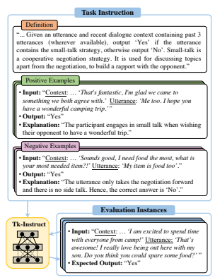

Figure 1: An example task from SUP-NATINST adopted from Chawla et al. (2021). A successful model is expected to use the provided instructions (including task definition and demonstration examples) to output responses to a pool of evaluation instances.

2022b; Sanh et al., 2022; Wei et al., 2022) using large pretrained language models (Raffel et al., 2020; Brown et al., 2020). As remarkable as models like InstructGPT (Ouyang et al., 2022) are, the contribution of various design choices to their success is opaque. In particular, the role of supervised data has remained understudied due to limited data released by the corporate entities behind major models. In addition, it is nearly impossible for the research community to extend and re-train these gigantic models. Addressing these two chal-

1SUPER-NATURALINSTRUCTIONS represents a supersized expansion of NATURALINSTRUCTIONS (Mishra et al., 2022b) which had 61 tasks.

2The dataset, models, and a leaderboard can be found at https://instructions.apps.allenai.org.

♦ Co-first authors ♣ Co-second authors

| Resource →                          | SUP\-NATINST   | NATINST                | CROSSFIT          | PROMPTSOURCE        | FLAN               | INSTRUCTGPT           |
|-------------------------------------|----------------|------------------------|-------------------|---------------------|--------------------|-----------------------|
|                                     | (this work)    | (Mishra et al., 2022b) | (Ye et al., 2021) | (Bach et al., 2022) | (Wei et al., 2022) | (Ouyang et al., 2022) |
| Has task instructions?              | ✓              | ✓                      | ✗                 | ✓                   | ✓                  | ✓                     |
| Has negative examples?              | ✓              | ✓                      | ✗                 | ✗                   | ✗                  | ✗                     |
| Has non\-English tasks?             | ✓              | ✗                      | ✗                 | ✗                   | ✓                  | ✓                     |
| Is public?                          | ✓              | ✓                      | ✓                 | ✓                   | ✓                  | ✗                     |
| Number of tasks                     | 1616           | 61                     | 269               | 176                 | 62                 | -                     |
| Number of instructions              | 1616           | 61                     | -                 | 2052                | 620                | 14378                 |
| Number of annotated tasks types     | 76             | 6                      | 13                | 13∗                 | 12                 | 10                    |
| Avg. task definition length (words) | 56.6           | 134.4                  | -                 | 24.8                | 8.2                | -                     |

Table 1: A comparison of SUP-NATINST to a few notable datasets in the field. We obtain the number of tasks, instructions, and task types of other datasets from their original paper. "–" indicates the fields are not applicable or unknown. Standards for categorizing task types vary across different datasets (see Fig. 2). *PROMPTSOURCE does not provide task type annotation for all their tasks, for which we report only the 13 task types annotated for training T0 (Sanh et al., 2022) instead.

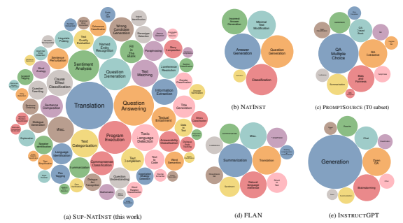

Figure 2: Compared to other datasets, SUP-NATINST covers a more diverse range of task types. InstructGPT reports a very coarse categorization of their task types. Bubble size represents the number of tasks of each type in log scale.

lenges necessitates the availability of large-scale public benchmarks of a broad range of NLP tasks and their instructions to facilitate developing and evaluating models that can generalize to unseen tasks.

In this paper, we construct a meta-dataset (i.e.,
dataset of datasets; Triantafillou et al., 2019) that consists of a wide variety of NLP tasks with their instructions, and train a model that can perform a new task given the instruction, outperforming InstructGPT (which uses 16× more parameters).

Our dataset, SUPER-NATURALINSTRUCTIONS
(SUP-NATINST for short), is a large benchmark of 1,616 NLP tasks and their natural language instructions. It brings in a diverse variety of tasks—76 broad task types spanning 55 different languages.

Each task is paired up with an instruction that consists of the task definition for mapping an input text to a task output and several examples for demonstrating the desired or undesired output (see Fig.1 as an example task). These tasks and their instructions are contributed by 88 NLP practitioners, in response to our public call. These contributions are consolidated after several rounds of peer-review and crowdsourced feedback to ensure quality. Having this diverse and large-scale data enables us to carefully split the tasks into training and test sets and systematically study how state-of-the-art methods perform on them. Table 1 and Figure 2 highlight properties of SUP-NATINST compared to relevant benchmarks, emphasizing the diversity of tasks and instruction types in our benchmark.

Our model, Tk-INSTRUCT, is a generative model for transforming task inputs given declarative in-context instructions (task definition or kshot examples). It is built by multi-task training of the T5 model (Raffel et al., 2020) over all the task instructions in our training set, and is evaluated on unseen tasks in the test set. Interestingly, an 11B-parameter Tk-INSTRUCT can outperform the 175B-parameter InstructGPT model by 9.9 ROUGE-L points when evaluated on 119 unseen English tasks, and the multilingual variant mTk-INSTRUCT outperforms InstructGPT by 13.3 points on 35 non-English tasks (§6.1). According to human evaluation, Tk-INSTRUCT generates responses at least as well as the ground truth for 77% of the testing instances (§6.2), confirming its strong generalization to unseen tasks.

The compelling empirical performance of Tk-
INSTRUCT confirms the importance of super-sized meta datasets such as our SUP-NATINST to facilitate research towards generalizable NLP models.

We conduct extensive analysis to understand the important factors for this generalization (§7). Our analysis shows that scaling up the diversity of training tasks and the model size are both important for strong generalization to unseen tasks. Finally, we estimate performance upper bounds, suggesting further room for improvement.

## 2 Related Work

Language instructions are a versatile way of defining goals, which is why they have been studied in the context of a variety of applications, such as instructions in grounded environments (Shridhar et al., 2020; Stepputtis et al., 2020; Min et al., 2022b; Weir et al., 2022) and database commands (Kim et al., 2020). Here, we focus on applications of instructions for general NLP tasks.

Recent literature has been motivated by building models that are generalizable across a variety of NLP tasks, when prompted with either a few examples (Ye and Ren, 2021; Bragg et al., 2021) or language definitions (Efrat and Levy, 2020; Weller et al., 2020; Zhong et al., 2021; Mishra et al., 2022b,a; Parmar et al., 2022). Our work is related to the existing benchmarks in this line of work, as delineated in Table 1 along various dimensions. Our benchmark extends NATINST (Mishra et al., 2022b) with 26× more tasks and greater variety of task types (Fig. 2). While CROSSFIT (Ye et al., 2021) focuses on benchmarking with a few in-context examples, our benchmark also offers task instructions.

Concurrent to our work, PROMPTSOURCE
(Bach et al., 2022) is another benchmark of tasks and their language instructions (prompts). An important distinction between this benchmark and ours is the phrasing of the task definitions: while PROMPTSOURCE task definitions are relatively concise, our task definitions are collected with the intention of providing a complete definition of each task and therefore are longer (24 tokens vs. 56 tokens on average; Table 1). More recently, BIG- BENCH (Srivastava et al., 2022) introduces a collection of 204 tasks and also provides short task descriptions and input prefixes that can be used for prompting LMs. With little overlap to our collection of tasks, they focus more on finding challenging tasks that can be used to test different behaviors of current LMs. Nevertheless, we believe that all these efforts in collecting different tasks as well as the task instructions are complementary, and the community will benefit from considering different benchmarks. Finally, the well-adopted InstructGPT model (Ouyang et al., 2022) is partially enabled by a large dataset of prompts that are collected via various synthetic data augmentation which, unfortunately, is not publicly available.

Beyond cross-task generalization, our benchmark can also be used to study multi-task learning more broadly, which is a longstanding goal for AI (Caruana, 1997). Traditionally, this literature focuses on setups that involve evaluation on tasks that are observed during training (Collobert and Weston, 2008; Hashimoto et al., 2017). More recent studies show promise that large-scale multi-task learning can enable strong generalization to similar tasks via unified encoding (Khashabi et al., 2020; Xie et al., 2022) or better finetuning results on downstream tasks (McCann et al., 2018; Aribandi et al., 2022). Our proposed benchmark provides diverse tasks for studying multi-tasking at a massive scale.

## 3 Super-Naturali**Nstructions**

SUPER-NATURALINSTRUCTIONS is a metadataset (Triantafillou et al., 2019) consisting of a variety of NLP tasks (see Fig. 2a) and instructions that describe them in plain language. Instruction schema. All task instructions follow the same uniform schema (see Fig. 1) which is composed of the following parts:
- DEFINITION defines a given task in natural language. This is a complete definition of how an input text (e.g., a sentence or a document) is expected to be mapped to an output text.

- POSITIVE EXAMPLES are samples of inputs and their *correct* outputs, along with a short explanation for each.

- NEGATIVE EXAMPLES are samples of inputs and their *incorrect/invalid* outputs, along with a short explanation for each.

The above schema is based on that of Mishra et al.

(2022b), though it is simplified. See Appendix C
for the comparison.

Task instances. Given the instructions for each task, a model is expected to solve instances of that task. We use a unified format to organize the instances of all our tasks. More precisely, each instance consists of a textual input and a list of acceptable textual outputs. We limit the number of instances in each task to 6.5K to avoid an imbalance of instances between tasks. Benchmark collection. The benchmark was collected through a large community effort on GitHub.3 Tasks were collected and contributed by NLP practitioners who were either responding to our public invitation4 or students who were encouraged to contribute as part of their class project.5 Contributors were encouraged to be creative and source the tasks from several resources: (a) existing public NLP datasets, (b) available intermediate annotations in crowdsourcing experiments (e.g., paraphrasing questions or rating their quality during crowdsourcing a QA dataset), or (c) synthetic tasks that can be communicated to an average human in a few sentences (e.g., basic algebraic operations like number comparison, finding the longest palindrome substring, etc.). When using existing datasets or crowdsourcing annotations, contributors were encouraged to adopt the instructions used to create this dataset whenever available. This was done to ensure that the instructions were sufficient to define the tasks to average human readers. Tasks along with instructions and other meta information were contributed as JSON files via GitHub pull requests, which were reviewed by automated checks and peers. We had 88 contributors from diverse locations and backgrounds contribute to our repository.

Quality control. Controlling the quality of this community-contributed data was done in several phases: (1) Upon creating a GitHub pull request of the proposed task, it immediately went through an automatic test. This process verified that the introduced file contained the expected fields and adhered to our desired properties (e.g., no duplicate instances, the output labels are not heavily imbalanced, etc.) and (2) The proposed task was then peer-reviewed by 1–2 other expert contributors to ensure the clarity and sufficiency of instruction content. The review process was done iteratively until the reviewers were content with the quality of the proposed instruction. Specifically, reviewers were asked to verify that the instruction is clear and sufficient for an average language speaker to solve the underlying task (evaluation instances) while being grammatical, fluent, and concise. On average, the review of each GitHub pull request took about 4– 6 iterations over the span of multiple days before being merged. (3) Lastly, the added tasks were presented to crowdworkers in order to collect feedback on the quality of the provided instructions, such as typos, clarity, or other issues (details in §A). Subsequently, one of the authors used this feedback to improve the task definitions of the instances. This feedback was done only for English tasks, as finding high-quality crowdworkers in other languages is nontrivial (Pavlick et al., 2014). Diversity of tasks. Collecting tasks for SUP-
NATINST was carefully supervised to cover a wide variety of natural language understanding tasks, domains, and languages. To better understand this diversity, we comprehensively categorize tasks along three different dimensions:
- TASK TYPE defines the nature of the mapping from instance inputs to outputs (e.g., question answering, classification, etc.).

- LANGUAGE indicates the language(s) of the instances.

- DOMAIN indicates the domain(s) to which the text of the tasks belong to (e.g., politics, medicine, dialogue, etc.).

These different measures of categorization can be used to study different senses of generalization. In our empirical studies (§5), we study generalization along the axis of task types. We refer the reader to Fig. 10 in the appendix for the distribution of tasks among different task types, languages, and domains. Statistics. Table 2 shows various statistics for the benchmark. In total, the dataset includes 1616 tasks and 5M instances. On average, each instruction is paired with 2.8 positive and 2.4 negative examples.

The average definition length is 56.6 in words.

3*https:// github.com/ allenai/ natural-instructions* 4*https:// blog.allenai.org/ 9d3f24d5a9db* 5CSE 576 "Topics in NLP" course, Arizona State Univ.

| statistic                               |        |
|-----------------------------------------|--------|
| # of tasks                              | 1616   |
| # of task types                         | 76     |
| # of languages                          | 55     |
| # of domains                            | 33     |
| # of non\-English tasks                 | 576    |
| avg. definition length (words per task) | 56.6   |
| avg. # of positive examples (per task)  | 2.8    |
| avg. # of negative examples (per task)  | 2.4    |
| avg. # of instances (per task)          | 3106.0 |

Table 2: Statistics of SUP-NATINST.

## 4 Tk-Instruct**: Learning To Follow** Instructions At Scale

Defining Generalization to Unseen Tasks. Each task t is defined via its natural language instruction It, and each task has a set of input/output instances
(Xt, Yt). A model M is expected to produce the output y, given the input x and the task instruction It: M(It, x) = y, for (x, y) ∈ (Xt, Yt). In particular, we would like to evaluate model M on tasks that are not observed (i.e., their instances were not used for training M). The only source of signal for learning the task at inference time is in-context instructions Itthat contain a definition and demonstration examples of the task.

Tk-I**NSTRUCT**. We introduce Tk-I**NSTRUCT**, a model that is meta-trained on SUP-NATINST for solving tasks given their in-context instructions. Previous work has shown the effectiveness of such meta-training in improving model's ability to do incontext learning with either prompts (Zhong et al., 2021; Sanh et al., 2022) or demonstration examples (Min et al., 2022a). Because of the large variety of tasks in SUP-NATINST, we are able to do this multi-task meta-training at a larger scale than before. We conduct our experiments and analysis based on the T5 model (Raffel et al., 2020). Since each instruction It consists of multiple elements as described in our instruction schema (§3), we map these elements to textual format and append them before the input instance. Fig. 8 in the appendix shows how we encode the full instructions. We study different combinations of these instruction elements in §7.2. By default, we will use our most effective instruction elements (i.e., task definition and two positive examples) unless otherwise specified. In the same manner, we train the multilingual variant mTk-I**NSTRUCT** based on the mT5 model (Xue et al., 2021).

## 5 Benchmarking Cross-Task Generalization With Sup-Natinst

Here we provide our recommended recipe for benchmarking generalization via SUP-NATINST.

### 5.1 Evaluation Setup

An Evaluation Split of Unseen Tasks. We split the large collection of tasks in SUP-NATINST into two subsets: one for evaluation and the other for supervision. For evaluation tasks, we fix a manuallyselected collection of 12 categories that represent 154 tasks. The large variety of tasks in SUP-
NATINST enables us to choose a diverse set of tasks for evaluation - such as those at word, sentence, and document levels, covering both classification and generation formats. Appendix G lists our evaluation tasks with examples for representative tasks. For an efficient evaluation, we sample a maximum of 100 instances for each task, which results in 15,310 testing instances in total. The remaining tasks are used for training models.6 Divided Tracks for English and X-lignual Tasks. SUP-NATINST consists of tasks across multiple languages, which enables evaluating the model's generalization to unseen tasks not only in English but also in other languages. Therefore, we divide our evaluation tasks into two tracks: one for English cross-task generalization (119 tasks) and the other for cross-lingual cross-task generalization (35 tasks). To the best of our knowledge, this is the first study in cross-lingual cross-task generalization (i.e., generalization to unseen tasks in different languages). Fig. 11 and Fig. 12 in the appendix contain the evaluation tasks for each track. Evaluation Metrics. Due to the diversity of our tasks and the open-ended generation nature of our formulation,7 we adopt *ROUGE-L* (Lin, 2004) for reporting aggregated performance results. This is a soft string overlap metric that can be applied to a wide range of text generation tasks. We show that the ranking from this metric correlates well with accuracy for classification tasks in Appendix E. We also conduct a human evaluation in §6.2.

6To avoid data leakage, we exclude tasks from the training set if they are sourced from the same dataset as any test task.

This results in 757 training tasks for the English track and 1271 training tasks for the cross-lingual track.

7Unlike Sanh et al. (2022) and Wei et al. (2022), who evaluate their models on classification tasks via option ranking
(i.e., scoring the correct answer(s) higher than other candidate answers), we evaluate our models in an *open-ended* generation setting with no task-specific assumptions. We believe this is a more realistic measure of generalization to unseen tasks.

### 5.2 Baselines And Existing Models

Here we discuss a variety of baselines and competitive models for our target application. See Appendix D for implementation details. Heuristic baselines. We first evaluate the following heuristics to evaluate the possible shortcuts in the data. **Copying Demo Output** copies the output of a random demonstration example. Since we balance the labels for our test tasks, the performance of this baseline will roughly equal a random guess or a majority baseline for classification tasks. Copying Instance Input copies the given instance input. This strategy performs well on tasks where the target output largely overlaps with the input (e.g.,
question rewriting, grammar error correction).

Off-the-shelf pretrained language models. We evaluate existing LMs that are not fine-tuned with instruction-specific data. Specifically, we evaluate the 11B-parameter T5 (Raffel et al., 2020) as a direct counterpart of Tk-INSTRUCT. Due to the infilling pretraining objective of the original T5 model, it cannot continue text well. Therefore, we evaluate its "LM-adapted" version, which is further trained with a language modeling objective (Lester et al., 2021). Additionally, we evaluate GPT-3 (Brown et al., 2020), a 175B-parameter autoregressive LM that has shown remarkable ability in following demonstrations provided in its prompt. Instruction-tuned models. In addition to our Tk- INSTRUCT (§4), we evaluate existing models that are fine-tuned to follow language instructions. In particular, we evaluate InstructGPT (Ouyang et al., 2022) which uses reinforcement learning to incorporate human preferences into a GPT-3 pretrained model, and T0 (Sanh et al., 2022) which finetunes T5 on a collection of task prompts in PROMPT- SOURCE (Bach et al., 2022). Upper bound estimates. We estimate an upper bound on models' generalization to unseen tasks by fine-tuning an **oracle** model on the tasks' labeled instances. Since this model observes the *hidden* instances of the evaluation tasks, it is, by definition, an estimated upper bound to our generalizationbased models. Specifically, we fine-tune a T5-11B model on the 119 English evaluation tasks, and a mT5-13B model on the 35 non-English tasks, with 1K random training instances per task, without overlap with the evaluation instances.

|                     | Methods ↓ / Evaluation →   | En   | X\-lingual   |
|---------------------|----------------------------|------|--------------|
| Heuristic           | Copying Instance Input     | 14.2 | 5.4          |
| Baselines           | Copying Demo Output        | 28.5 | 50.3         |
| Pretrained LMs      | T5\-LM (11B)               | 30.2 | -            |
|                     | GPT3 (175B)                | 45.0 | 51.3         |
| Instruction\-tuned  | T0 (11B)                   | 32.3 | -            |
|                     | InstructGPT (175B)         | 52.1 | 52.8         |
| Models              | Tk\-INSTRUCT (ours, 11B)   | 62.0 | -            |
|                     | mTk\-INSTRUCT (ours, 13B)  | 57.1 | 66.1         |
| Upper\-bound (est.) | Supervised Training        | 74.3 | 94.0         |

Table 3: The overall performance of different methods on unseen tasks in the test set of SUP-NATINST (§6.1).

We report ROUGE-L here as our aggregated metric.

Models that leverage instructions show stronger generalization to unseen tasks. In particular, our model that is fine-tuned on a diverse set of tasks outperforms InstructGPT and T0 by a large margin.

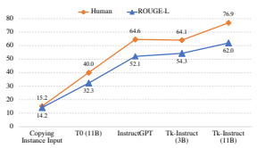

Figure 3: Human evaluation vs. ROUGE-L for several methods (§6.2). The trends of these two metrics are highly correlated with a Pearson coefficient of 0.998.

### 6 Experimental Results 6.1 Overall Results

Table 3 summarizes our overall benchmarking results. We use the same input encoding that contains the most effective instructional elements (task definition and two positive examples without the negative examples and explanations) for all the methods.

To better understand models' generalization to different tasks, we also break down the performance according to the task categories in Fig. 4. We refer the reader to Appendix H for more detailed analysis on each individual task. Instruction-tuning enables stronger generalization to unseen tasks. Generally instruction-tuned models perform better compared to their untuned LM counterparts (Tk-INSTRUCT vs. T5-LM, InstructGPT vs. GPT-3) and heuristic baselines. This indicates models do learn to follow instructions by finetuning on instruction data, and this can generalize to new instructions for unseen tasks. T0 is an exception, which is only slightly better than

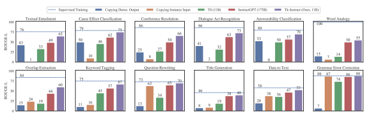

Figure 4: Performance per evaluation task type. Tk-INSTRUCT consistently performs better than other generalization-based methods on all task types, while there is still a sizable gap compared to supervised training.

T5-LM. We suspect this is because the style of prompting in T0's training data is very different from our style of instructions. Our Tk-INSTRUCT **outperforms InstructGPT.** Our Tk-INSTRUCT and mTk-INSTRUCT models, which are trained with a variety of tasks, generalize best to unseen tasks for both English and non-English tasks in all evaluation task categories. InstructGPT also shows a great extent of generalization to our evaluation tasks. However, we want to note it is not clear if InstructGPT's training data overlaps with our evaluation tasks since their data is unavailable.

There is a sizable gap for improvement. Despite the impressive performance of current models, there is a sizable gap between the generalization of instruction-based models and the supervised training approach, leaving more room for improvement.

### 6.2 Human Evaluation

For language generation tasks, automatic metrics are only an approximation of human judgments; we conduct a human evaluation to confirm the findings so far. Specifically, we ask crowdworkers to indicate if they prefer the predicted answer by the model or the ground truth outputs for each instance with ties being allowed (see Appendix B for details). The resulting human evaluation metric indicates how often model predictions were rated as at least as good as our ground truth labels. The theoretical upper bound of this metric is 100% when the model is rated at least as good as the ground truth for all the instances. The results of human evaluation (shown in Fig. 3) align quite well with our automatic metrics and confirm the human-perceived quality of our models.

## 7 Further Analysis

We conduct further analysis to understand the important factors for models to generalize across tasks. Due to the computational cost, this analysis is done on the English track and using the T5-3B checkpoint, except for the experiments on model sizes.

### 7.1 Scaling Trends Of Generalization

We study Tk-INSTRUCT's generalization performance with respect to three scaling factors: the number of training tasks, the number of instances per task, and the model sizes. Fig. 5 presents the performance change by scaling each of them. More observed tasks improve the generalization. We fine-tune Tk-INSTRUCT with different numbers of tasks that are randomly sampled from the whole training set (Fig. 5a). The model generalization performance grows log-linearly8as we increase the set of tasks used for training. Previous work (Mishra et al., 2022b; Sanh et al., 2022; Wei et al., 2022) has made similar observations on a much smaller scale, while we show that this trend holds even with 757 diverse training tasks.

A large number of training instances do not help generalization. We then vary the number of instances per task that are used for finetuning
(Fig. 5b). While the conventional wisdom in supervised learning is that more training instances usually helps (Banko and Brill, 2001; Sun et al., 2017; Hestness et al., 2017), in our setup, the model's performance saturates when only 64 instances per task are used for training. A large number of training instances would instead lead to longer training time and risk overfitting to the training tasks.

8A linear function of an exponential increase of parameters, i.e., growth at a constant multiplicative rate.

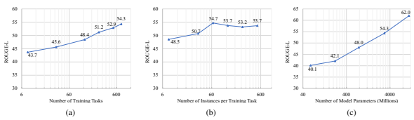

Figure 5: Scaling trends of models performance (§7.1) as a function of (a) the number of training tasks; (b) the number of instances per training task; (c) model sizes. x-axes are in log scale. The **linear growth of model** performance with exponential increase in observed tasks and model size is a promising trend. Evidently, the performance gain from more instances is limited.

| Testing Encoding →             | Task ID   | Def   | Pos (1)   | Def       | Pos (2)   | Def       | Def   + Pos (2)   | Def  + Pos (2)     | Pos (4)   | Def   + Pos (4)   | Average   |
|--------------------------------|-----------|-------|-----------|-----------|-----------|-----------|-------------------|--------------------|-----------|-------------------|-----------|
| Training Encoding ↓            |           |       |           | + Pos (1) |           | + Pos (2) | + Neg (2)         | + Neg (2)   + Expl |           |                   |           |
| Task ID                        | 21.2      | 33.3  | 16.8      | 30.9      | 23.0      | 33.7      | 33.9              | 31.6               | 26.0      | 36.4              | 33.9      |
| Def                            | 17.3      | 45.0  | 31.1      | 43.8      | 36.4      | 46.4      | 44.2              | 44.3               | 38.0      | 46.0              | 39.9      |
| Pos (1)                        | 10.9      | 22.1  | 43.9      | 47.8      | 46.6      | 49.2      | 46.2              | 43.4               | 46.6      | 49.5              | 43.1      |
| Def + Pos (1)                  | 11.1      | 42.2  | 43.8      | 52.4      | 47.4      | 53.3      | 53.1              | 51.8               | 47.8      | 53.7              | 44.5      |
| Pos (2)                        | 12.7      | 22.4  | 47.1      | 50.2      | 49.3      | 52.3      | 50.6              | 46.7               | 49.8      | 52.4              | 45.0      |
| Def + Pos (2)                  | 12.4      | 42.1  | 44.5      | 52.4      | 49.0      | 54.3      | 53.5              | 52.7               | 50.3      | 54.8              | 46.4      |
| Def + Pos (2) + Neg (2)        | 14.0      | 42.3  | 43.6      | 51.8      | 48.6      | 53.5      | 54.3              | 50.2               | 49.6      | 53.8              | 45.9      |
| Def + Pos (2) + Neg (2) + Expl | 15.4      | 42.0  | 43.8      | 50.7      | 47.6      | 51.9      | 52.5              | 52.6               | 48.6      | 52.2              | 44.3      |
| Pos (4)                        | 11.0      | 23.9  | 45.6      | 49.8      | 49.0      | 51.7      | 49.5              | 47.5               | 49.8      | 51.3              | 44.5      |
| Definition + Pos (4)           | 11.0      | 42.4  | 44.3      | 51.9      | 48.7      | 53.7      | 53.4              | 50.6               | 50.5      | 53.5              | 46.0      |

Table 4: Performance (ROUGE-L) of models trained and evaluated with various encodings. Diagonal numbers (underlined) represent performances of models trained and evaluated with the same instruction encoding. Each encoding is a combination of the elements in the instructions (Fig. 1). **Task ID** is a short string composed of dataset name and task category; Def represents the task definition; **Pos (k)** represents k positive examples; Neg (k) represents k negative examples; **Expl** represents explanation. These results (a) **show the gains from various**
instructional elements, and (b) indicate **surprising reliability of the models to various input encoding**. A model trained with definition and positive examples (i.e., the last row) remains robust for different encodings.

Tuning larger models with instructions consistently lead to gains. We study the effect of model scaling by initializing Tk-INSTRUCT from different sizes of pretrained T5 checkpoints, including the small, base, large, xl and xxl sizes (Fig. 5c). We found that increasing the model sizes consistently bring significant improvement (log-linearly with parameter size). This finding contradicts the claim in Xu et al. (2022) that "model size has little impact on performance with an extremely large number of tasks." Combining Fig. 5(a) and Fig. 5(c), one can create a correspondence between model size and task size. For example, a T5-large model trained with 757 tasks can achieve comparable performance (48.0 ROUGE-L) to the T5-3B model trained with 128 tasks (48.4 ROUGE-L), indicating that increasing the diversity of training tasks is an alternative to scaling model sizes.

### 7.2 Instructing With Different Elements

We evaluate the performance of Tk-INSTRUCT under different instructional elements.

Benefit of different instructional elements. As shown in Fig. 1, SUP-NATINST provides multiple elements for instructing a task. We train multiple models with different combinations of these elements. The *diagonal* cells of Table 4 show the performance of our models when trained and evaluated on a particular instruction encoding. Based on the diagonal numbers, including the task definition consistently helps the model to generalize better. Moreover, combining the task definition with positive demonstration examples yields further improvement. However, adding more demonstration examples is negligible. Negative examples help a little bit; explanations decrease performance, which is consistent with the observations of Mishra et al. (2022b) and Lampinen et al. (2022) when the model is not large enough. Future work can explore whether more powerful models can benefit from these elements. Generalization to different input encodings. We further investigate whether a model trained on a particular encoding can generalize to other encodings.

This can be read from the *non-diagonal* cells of Table 4. The negative result here is that definitiononly models cannot generalize to example-only test encodings; and similarly, example-only models cannot generalize to definition-only test encodings. However, models trained on encodings that contain both definition and examples are surprisingly robust across different encoding variations.

## 8 Conclusion

We construct a large-scale benchmark consisting of a diverse set of NLP tasks and their instructions. This benchmark can serve as a rich playground for training or evaluation of models that can generalize to unseen tasks by following instructions. Furthermore, we train Tk-INSTRUCT using this data, and demonstrate its capability to perform unseen tasks to a surprising extent. We provide extensive analysis to understand the important factors for such generalization. We hope our data and model will facilitate future work towards more general-purpose models.

## 9 Limitations

While the presented data offers a notable variety
(e.g., diverse task types), its underlying distributions suffer from skews which should be addressed in future work (see Appendix F). On language diversity, the proposed benchmark is biased toward English. On output diversity, the collected tasks are generally still skewed to short responses, which might reflect the distribution of the available tasks in the field. This under-representation of the longtail of tasks poses a challenge for building generalpurpose models in the future. We hope future work addresses such distributional imbalances. Moreover, we see natural extensions of the instructionfollowing setup here in the context of other modalities such as vision or speech.

Automatic evaluation of models' performance is another challenge, considering the diverse set of tasks in our benchmark, and many of them being open-ended generation tasks. We use ROUGE-L as an aggregated metric in this paper and find it as a good proxy for the *overall* performance of the models, aligning well with human evaluation. However, there are specific tasks for which ROUGE-L might not serve as an effective proxy of quality (such as rewriting tasks or error correction tasks where copying the input can result in a high ROUGE-L score). We hope these issues will be addressed with the development of more powerful evaluation metrics for text generation.

In terms of computing power, we have experimented with models that were accessible to us and have made the resulting models publicly available.

We also acknowledge that there are larger models that we were not able to train due to the limitations of our computational budget.

## Acknowledgments

We thank the anonymous reviewers, our colleagues from AI2 and UWNLP, especially Matthew Peters for his encouraging conversations that motivated this project. We also thank the student contributors of Arizona State University's CSE 576 "Topics in NLP" course and all other contributors to our data repository. All experiments were run on AI2's Beaker GPU clusters and Google's research TPUs.

This work was supported in part by ONR MURI
N00014-18-1-2670, ONR N00014-18-1-2826, and DARPA MCS N66001-19-2-4031 grants.

## References

Vamsi Aribandi, Yi Tay, Tal Schuster, Jinfeng Rao, Huaixiu Steven Zheng, Sanket Vaibhav Mehta, Honglei Zhuang, Vinh Q Tran, Dara Bahri, Jianmo Ni, et al. 2022. ExT5: Towards Extreme Multi-Task Scaling for Transfer Learning. In International Conference on Learning Representations (ICLR).

Stephen H Bach, Victor Sanh, Zheng-Xin Yong, Albert Webson, Colin Raffel, Nihal V Nayak, Abheesht Sharma, Taewoon Kim, M Saiful Bari, Thibault Fevry, et al. 2022. PromptSource: An Integrated Development Environment and Repository for Natural Language Prompts. In Annual Meeting of the Association for Computational Linguistics (ACL) - System Demonstrations.

Michele Banko and Eric Brill. 2001. Scaling to Very Very Large Corpora for Natural Language Disambiguation. In *Annual Meeting of the Association for* Computational Linguistics (ACL).

Max Bartolo, Alastair Roberts, Johannes Welbl, Sebastian Riedel, and Pontus Stenetorp. 2020. Beat the ai: Investigating adversarial human annotation for reading comprehension. *Transactions of the Association* for Computational Linguistics (TACL), 8:662–678.

Mohaddeseh Bastan, Mahnaz Koupaee, Youngseo Son, Richard Sicoli, and Niranjan Balasubramanian. 2020. Author's sentiment prediction. In International Conference on Computational Linguistics (COLING).

Luisa Bentivogli, Peter Clark, Ido Dagan, and Danilo Giampiccolo. 2008. The sixth pascal recognizing textual entailment challenge. In Text Analysis Conference (TAC).

Jonathan Bragg, Arman Cohan, Kyle Lo, and Iz Beltagy. 2021. Flex: Unifying evaluation for few-shot nlp. In Advances in Neural Information Processing Systems (NeurIPS).

Tom B. Brown, Benjamin Mann, Nick Ryder, Melanie Subbiah, Jared Kaplan, Prafulla Dhariwal, Arvind Neelakantan, Pranav Shyam, Girish Sastry, Amanda Askell, Sandhini Agarwal, and et al. 2020. Language models are few-shot learners. In Advances in Neural Information Processing Systems (NeurIPS).

Rich Caruana. 1997. Multitask learning. Machine learning, 28(1):41–75.

Kushal Chawla, Jaysa Ramirez, Rene Clever, Gale Lucas, Jonathan May, and Jonathan Gratch. 2021. CaSiNo: A Corpus of Campsite Negotiation Dialogues for Automatic Negotiation Systems. In Conference of the North American Chapter of the Association for Computational Linguistics (NAACL).

Ronan Collobert and Jason Weston. 2008. A unified architecture for natural language processing: Deep neural networks with multitask learning. In International Conference on Machine Learning (ICML).

Ido Dagan, Oren Glickman, and Bernardo Magnini.

2005. The pascal recognising textual entailment challenge. In Machine Learning Challenges Workshop.

Avia Efrat and Omer Levy. 2020. The Turking Test: Can Language Models Understand Instructions? *arXiv preprint arXiv:2010.11982*.

Nancy Fulda, Nathan Tibbetts, Zachary Brown, and David Wingate. 2017. Harvesting common-sense navigational knowledge for robotics from uncurated text corpora. In *Conference on Robot Learning* (IJ- CAI).

Aditya Gupta, Jiacheng Xu, Shyam Upadhyay, Diyi Yang, and Manaal Faruqui. 2021. Disfl-qa: A benchmark dataset for understanding disfluencies in question answering. In Annual Meeting of the Association for Computational Linguistics (ACL) - Findings.

Kazuma Hashimoto, Caiming Xiong, Yoshimasa Tsuruoka, and Richard Socher. 2017. A joint many-task model: Growing a neural network for multiple nlp tasks. In Conference on Empirical Methods in Natural Language Processing (EMNLP).

William Hersh, Chris Buckley, TJ Leone, and David Hickam. 1994. Ohsumed: An interactive retrieval evaluation and new large test collection for research. In Conference of the Association for Computing Machinery Special Interest Group in Information Retrieval (SIGIR).

Joel Hestness, Sharan Narang, Newsha Ardalani, Gregory Diamos, Heewoo Jun, Hassan Kianinejad, Md Patwary, Mostofa Ali, Yang Yang, and Yanqi Zhou. 2017. Deep Learning Scaling is Predictable, Empirically. *arXiv preprint arXiv:1712.00409*.

Daniel Khashabi, Sewon Min, Tushar Khot, Ashish Sabharwal, Oyvind Tafjord, Peter Clark, and Hannaneh Hajishirzi. 2020. UnifiedQA: Crossing Format Boundaries With a Single QA System. In Conference on Empirical Methods in Natural Language Processing (EMNLP) *- Findings*.

Hyeonji Kim, Byeong-Hoon So, Wook-Shin Han, and Hongrae Lee. 2020. Natural language to sql: Where are we today? Proceedings of the VLDB Endowment, 13(10):1737–1750.

Andrew K Lampinen, Ishita Dasgupta, Stephanie CY
Chan, Kory Matthewson, Michael Henry Tessler, Antonia Creswell, James L McClelland, Jane X Wang, and Felix Hill. 2022. Can Language Models Learn from Explanations in Context? arXiv preprint arXiv:2204.02329.

Logan Lebanoff, John Muchovej, Franck Dernoncourt, Doo Soon Kim, Lidan Wang, Walter Chang, and Fei Liu. 2020. Understanding points of correspondence between sentences for abstractive summarization. In Annual Meeting of the Association for Computational Linguistics (ACL) - Student Research Workshop.

Brian Lester, Rami Al-Rfou, and Noah Constant. 2021.

The power of scale for parameter-efficient prompt tuning. In Conference on Empirical Methods in Natural Language Processing (EMNLP).

Chin-Yew Lin. 2004. ROUGE: A Package for Automatic Evaluation of Summaries. In ACL Workshop on Text Summarization Branches Out.

Bryan McCann, Nitish Shirish Keskar, Caiming Xiong, and Richard Socher. 2018. The natural language decathlon: Multitask learning as question answering. arXiv preprint arXiv:1806.08730.

Sewon Min, Mike Lewis, Luke Zettlemoyer, and Hannaneh Hajishirzi. 2022a. MetaICL: Learning to learn in context. In *NAACL-HLT*.

So Yeon Min, Devendra Singh Chaplot, Pradeep Ravikumar, Yonatan Bisk, and Ruslan Salakhutdinov. 2022b. FILM: Following Instructions in Language with Modular Methods. In International Conference on Learning Representations (ICLR).

Swaroop Mishra, Daniel Khashabi, Chitta Baral, Yejin Choi, and Hannaneh Hajishirzi. 2022a. Reframing instructional prompts to gptk's language. In Annual Meeting of the Association for Computational Linguistics (ACL) *- Findings*.

Swaroop Mishra, Daniel Khashabi, Chitta Baral, and Hannaneh Hajishirzi. 2022b. Cross-Task Generalization via Natural Language Crowdsourcing Instructions. In Annual Meeting of the Association for Computational Linguistics (ACL).

Courtney Napoles, Keisuke Sakaguchi, and Joel Tetreault. 2017. Jfleg: A fluency corpus and benchmark for grammatical error correction. In Conference of the European Chapter of the Association for Computational Linguistics (EACL).

Jekaterina Novikova, Ondˇrej Dušek, and Verena Rieser.

2017. The e2e dataset: New challenges for end-toend generation. In Annual SIGdial Meeting on Discourse and Dialogue.

Long Ouyang, Jeff Wu, Xu Jiang, Diogo Almeida, Carroll L Wainwright, Pamela Mishkin, Chong Zhang, Sandhini Agarwal, Katarina Slama, Alex Ray, et al. 2022. Training Language Models to Follow Instructions with Human Feedback. arXiv preprint arXiv:2203.02155.

Mihir Parmar, Swaroop Mishra, Mirali Purohit, Man Luo, Murad Mohammad, and Chitta Baral. 2022. In- BoXBART: Get instructions into biomedical multitask learning. In Findings of the Association for Computational Linguistics: NAACL 2022, pages 112–128, Seattle, United States. Association for Computational Linguistics.

Ellie Pavlick, Matt Post, Ann Irvine, Dmitry Kachaev, and Chris Callison-Burch. 2014. The Language Demographics of Amazon Mechanical Turk. Transactions of the Association for Computational Linguistics (TACL).

Colin Raffel, Noam Shazeer, Adam Roberts, Katherine Lee, Sharan Narang, Michael Matena, Yanqi Zhou, Wei Li, and Peter J Liu. 2020. Exploring the limits of transfer learning with a unified text-to-text transformer. *Journal of Machine Learning Research* (JMLR).

Melissa Roemmele, Cosmin Adrian Bejan, and Andrew S Gordon. 2011. Choice of plausible alternatives: An evaluation of commonsense causal reasoning. In AAAI spring symposium: logical formalizations of commonsense reasoning.

Keisuke Sakaguchi, Ronan Le Bras, Chandra Bhagavatula, and Yejin Choi. 2020. WINOGRANDE: an adversarial winograd schema challenge at scale. In Conference on Artificial Intelligence (AAAI).

Victor Sanh, Albert Webson, Colin Raffel, Stephen Bach, Lintang Sutawika, Zaid Alyafeai, Antoine Chaffin, Arnaud Stiegler, Arun Raja, Manan Dey, M Saiful Bari, Canwen Xu, Urmish Thakker, Shanya Sharma Sharma, Eliza Szczechla, Taewoon Kim, Gunjan Chhablani, Nihal Nayak, Debajyoti Datta, Jonathan Chang, Mike Tian-Jian Jiang, Han Wang, Matteo Manica, Sheng Shen, Zheng Xin Yong, Harshit Pandey, Rachel Bawden, Thomas Wang, Trishala Neeraj, Jos Rozen, Abheesht Sharma, Andrea Santilli, Thibault Fevry, Jason Alan Fries, Ryan Teehan, Teven Le Scao, Stella Biderman, Leo Gao, Thomas Wolf, and Alexander M Rush. 2022. Multitask Prompted Training Enables Zero-Shot Task Generalization. In International Conference on Learning Representations (ICLR).

Igor Shalyminov, Alessandro Sordoni, Adam Atkinson, and Hannes Schulz. 2020. Fast domain adaptation for goal-oriented dialogue using a hybrid generativeretrieval transformer. In IEEE International Conference on Acoustics, Speech and Signal Processing (ICASSP).

Mohit Shridhar, Jesse Thomason, Daniel Gordon, Yonatan Bisk, Winson Han, Roozbeh Mottaghi, Luke Zettlemoyer, and Dieter Fox. 2020. ALFRED: A Benchmark for Interpreting Grounded Instructions for Everyday Tasks. In *IEEE Conference on* Computer Vision and Pattern Recognition (CVPR).

Aarohi Srivastava, Abhinav Rastogi, Abhishek Rao, Abu Awal Md Shoeb, Abubakar Abid, Adam Fisch, Adam R. Brown, Adam Santoro, Aditya Gupta, Adrià Garriga-Alonso, et al. 2022. Beyond the imitation game: Quantifying and extrapolating the capabilities of language models. arXiv preprint arXiv:2206.04615.

Simon Stepputtis, Joseph Campbell, Mariano Phielipp, Stefan Lee, Chitta Baral, and Heni Ben Amor. 2020. Language-Conditioned Imitation Learning for Robot Manipulation Tasks. In Advances in Neural Information Processing Systems (NeurIPS).

Chen Sun, Abhinav Shrivastava, Saurabh Singh, and Abhinav Gupta. 2017. Revisiting Unreasonable Effectiveness of Data in Deep Learning Era. In International Conference on Computer Vision (ICCV).

Eleni Triantafillou, Tyler Zhu, Vincent Dumoulin, Pascal Lamblin, Utku Evci, Kelvin Xu, Ross Goroshin, Carles Gelada, Kevin Swersky, Pierre-Antoine Manzagol, et al. 2019. Meta-Dataset: A Dataset of Datasets for Learning to Learn from Few Examples. In International Conference on Learning Representations (ICLR).

Jason Wei, Maarten Bosma, Vincent Zhao, Kelvin Guu, Adams Wei Yu, Brian Lester, Nan Du, Andrew M. Dai, and Quoc V Le. 2022. Finetuned Language Models are Zero-Shot Learners. In International Conference on Learning Representations (ICLR).

Nathaniel Weir, Xingdi Yuan, Marc-Alexandre Côté, Matthew Hausknecht, Romain Laroche, Ida Momennejad, Harm Van Seijen, and Benjamin Van Durme. 2022. One-Shot Learning from a Demonstration with Hierarchical Latent Language. arXiv preprint arXiv:2203.04806.

Orion Weller, Nicholas Lourie, Matt Gardner, and Matthew Peters. 2020. Learning from Task Descriptions. In Conference on Empirical Methods in Natural Language Processing (EMNLP).

Thomas Wolf, Lysandre Debut, Victor Sanh, Julien Chaumond, Clement Delangue, Anthony Moi, Pierric Cistac, Tim Rault, Rémi Louf, Morgan Funtowicz, Joe Davison, Sam Shleifer, Patrick von Platen, Clara Ma, Yacine Jernite, Julien Plu, Canwen Xu, Teven Le Scao, Sylvain Gugger, Mariama Drame, Quentin Lhoest, and Alexander M. Rush. 2020. Transformers: State-of-the-Art Natural Language Processing. In Conference on Empirical Methods in Natural Language Processing (EMNLP) *- System* Demonstrations.

Tianbao Xie, Chen Henry Wu, Peng Shi, Ruiqi Zhong, Torsten Scholak, Michihiro Yasunaga, Chien-Sheng Wu, Ming Zhong, Pengcheng Yin, Sida I Wang, et al. 2022. UnifiedSKG: Unifying and Multi- Tasking Structured Knowledge Grounding with Text-to-Text Language Models. arXiv preprint arXiv:2201.05966.

Hanwei Xu, Yujun Chen, Yulun Du, Nan Shao, Yanggang Wang, Haiyu Li, and Zhilin Yang. 2022. Zero- Prompt: Scaling Prompt-Based Pretraining to 1,000 Tasks Improves Zero-Shot Generalization. arXiv preprint arXiv:2201.06910.

Linting Xue, Noah Constant, Adam Roberts, Mihir Kale, Rami Al-Rfou, Aditya Siddhant, Aditya Barua, and Colin Raffel. 2021. mT5: A Massively Multilingual Pre-trained Text-to-Text Transformer. In Conference of the North American Chapter of the Association for Computational Linguistics (NAACL).

Qinyuan Ye, Bill Yuchen Lin, and Xiang Ren. 2021.

CrossFit: A Few-shot Learning Challenge for Crosstask Generalization in NLP. In Conference on Empirical Methods in Natural Language Processing (EMNLP).

Qinyuan Ye and Xiang Ren. 2021. Learning to Generate Task-Specific Adapters from Task Description. In Annual Meeting of the Association for Computational Linguistics (ACL).

Ruiqi Zhong, Kristy Lee, Zheng Zhang, and Dan Klein.

2021. Adapting Language Models for Zero-shot Learning by Meta-tuning on Dataset and Prompt Collections. In *Conference on Empirical Methods* in Natural Language Processing (EMNLP) - Findings.

# Supplemental Material

## A Crowdsourcing Human Feedback

We use Amazon Mechanical Turk (AMT) to crowdsource feedback on the quality of the collected instructions. We limit our crowdworkers to predominantly English-speaking countries (USA, UK, Canada, and Australia), and to those who have finished over 1K HITs with an approval rating of over 99%.

Fig. 6 shows the crowdsourcing template used for collecting crowdworker feedback on our instructions. We show the instructions (the task definition, along with positive and negative examples) followed by forms for their feedback. We allow the crowdworkers to give us a qualitative measure of their perceived quality as well as text boxes for more concrete items (such as typos or phrasings that may benefit from more clear articulation). For each task, we solicit the feedback of 3 crowdworkers and then use this feedback to improve the task definitions or the examples for each task.

## B Crowdsourcing Human Judgements Of Generation Quality

We perform a crowdsourcing experiment on Amazon Mechanical Turk (AMT) to assess the quality of the generated responses of models. Specifically, we ask crowdworkers to indicate if they prefer the predicted answer by the model or the ground truth outputs for each instances. The annotation interface is shown in Fig. 7. It is essentially the same template used for the quality assessment of the dataset (§A), except that here the crowdworkers are shown a *pair* of responses for each instancesthe reference text (from our benchmark) and the one generated by the model—turning the task into a *comparative* evaluation.

For each instance, we obtain annotations from an annotator as to whether they prefer either response over the other or they would rate them equally ("tie"). The model receives a credit of 1.0 if the worker favors the model's prediction at least as well as the ground truth label (otherwise, the model would receive a credit of 0.0). The overall accuracy score for the model is computed by averaging instance-level scores. To reduce the costs, the human evaluation of our models is done on 60 randomly selected tasks (about half of our evaluation tasks), and on 10 random instances of each task.

Since it is non-trivial to find non-English speaking crowdworkers (Pavlick et al., 2014), this evaluation was restricted to English language tasks.

Therefore, since our task is focused on English tasks, we required workers to be based in a country with a population predominantly of native English speakers (USA, Canada, UK, and Australia) and have completed at least 5000 HITs with ≥99% assignment approval rate.

The resulting human-evaluation metric indicates how often were model predictions equal or preferred to our ground truth labels. In this evaluation, the theoretical upper bound is 100% where the model is rated at least as well as the ground truth.

The results of human evaluation are shown in the bottom row of Fig. 3.

## C Instruction Schema

Our instruction schema is based on that of NATINST (Mishra et al., 2022b), but we simplify it to make data collection easier. Our DEFINITION field serves as the union of Mishra et al. (2022b)'s DEFINITION, THINGS TO AVOID,
and EMPHASIS & CAUTION. Additionally, we drop their TITLE and PROMPT as their content is most often covered by DEFINITION.

## D Model Implementation Details

T5 experiments. We use T5 for training our Tk- INSTRUCT, estimating the performance of the supervised approach and conducting analysis.

Our experiments that finetune the T5-11B model are conducted based on the Google's T5 library9 and we use their T5.1.1.xxl checkpoint10 by default, which is pre-trained only on C4.11 These experiments are run on Google V3-256 TPUs using a batch size of 1,048,576 tokens (1,024 examples), a constant learning rate of 1e-5 and a total of 1000 steps. Each training run takes 4 hours to complete.

Our analyses that use T5 models smaller than 11B parameters are conducted based on Huggingface's transformers library and model checkpoints12 (Wolf et al., 2020) on GPU machines.

9https:// github.com/ google-research/
text-to-text-transfer-transformer 10https://console.cloud.google.com/ storage/ browser/
t5-data/ pretrained_models/t5.1.1.xxl 11We also tried to finetune Tk-INSTRUCT from the T5-LM
checkpoint but the final performance is worse. Therefore, we decided to use the T5.1.1.xxl checkpoint.

12*https:// huggingface.co/models?sort=downloads&*
search=google%2Ft5

Figure 6: The crowdsourcing template we use to receive feedback on our collected tasks.

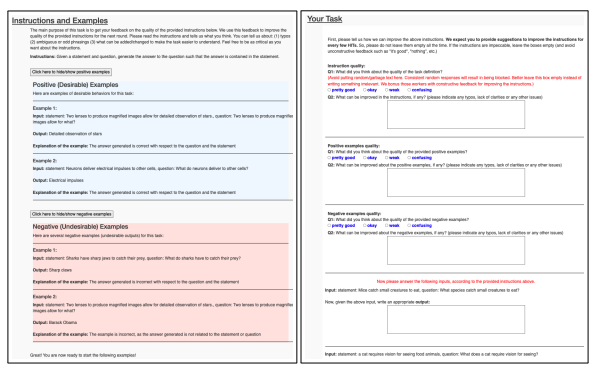

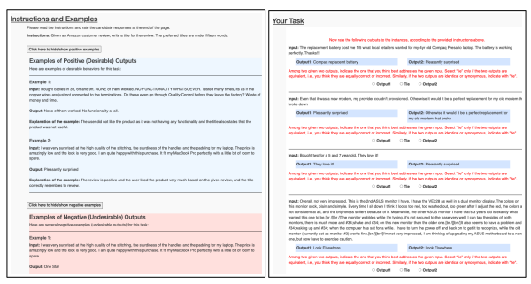

Figure 7: Crowdsourcing interface used for human assessment of our baselines (§6.2).

When fine-tuning models, we train them for two epochs with a batch size of 16 and a constant learning rate of 1e-5. The maximum input length is set to 1024, and the maximum output length is set to 128. These experiments are conducted with 8 A100 GPUs with 48GB GPU memory per each. We use DeepSpeed13 for model parallelization, with bfloat16 precision enabled to save the GPU memory. Each training run takes 6 hours to complete. GPT-3 and InstructGPT experiments. We use the OpenAI API14 for conducting the GPT-3 experiments. We use their "davinci" engine for the GPT-3 language model experiments and their "textdavinci-001" engine for the InstructGPT experiments. When making the requests, we set the temperature as 0, top_p as 1 and the maximum gen14https:// beta.openai.com/ docs/introduction/ overview

13*https:// github.com/microsoft/DeepSpeed*
eration length as 128. Due to the high cost, we randomly sample 20 instances from each of our 119 test tasks to estimate the performance of GPT-
3 and InstructGPT. All API requests were made on May 30, 2022. Encoding instruction with input For every problem setup, we map a given instruction It and an input instance x into a textual format, obtaining enc(It, x). Each instruction It consists of multiple elements as described in our instruction schema
(§3). We map each element of the instruction to a textual format and prepend it to the input instance. Fig. 8 shows how we encode the full instruction.

We study different combinations of these instruction elements in §7.2. The encoded instance is then fed to an encoder-decoder model to predict y:
M : enc(It, x) → y.

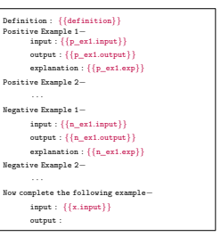

Figure 8: Encoding task instruction with input.

## E Evaluation Metrics

We adopt ROUGE-L as our automatic evaluation metric in this work. However, it remains a question for how much ROUGE-L can reflect model's performance on different tasks. Although we cannot test ROUGE-L's correlation with each task-specific metric of the tasks included in our data, we do investigate whether ROUGE-L can be used for classification tasks. Fig. 9 plots the ROUGE-L scores and accuracy of several models on different types of tasks. These task types are usually regarded as classification tasks and have very short ground truth output. We can see that for all these task types, the trend of ROUGE-L correlates well with the trend of accuracy. For some task types, we do see some gap between these two metrics. The reason is because there are some generation tasks categorized into these types. These results indicate that ROUGE-
L is a good proxy for accuracy for classification tasks.

## F Distribution Of Tasks

As is described in §3, SUP-NATINST provides the annotation for categorizing tasks along three different dimensions: task type, language, and domain.

Fig. 10 shows the distribution of tasks among these three dimensions. This meta-information can be used to study model's generalization ability in different senses. Despite the diversity of the data, we acknowledge the skew toward certain tasks and languages, which we leave to be addressed by future work.

## G Evaluation Tasks

Table 5 lists the 12 task categories used for our evaluation and all the tasks included in each category
(introduced in §5.1). To provide a better sense of what those tasks look like, we also select one representative task from each category and list them in Tables 6–17. Due to the large number of tasks in our dataset, we cannot list all 1,616 tasks in this paper. We refer the reader to our dataset.

## H Performance Improvement Per Evaluation Task

To provide more detailed analysis of Tk-INSTRUCT
on each individual task, Fig. 11 presents the per-task improvement of our Tk-INSTRUCT (3B) model over the best of two heuristic baselines on the English evaluation tasks, and Fig. 12 presents the per-task improvement of the mTk-INSTRUCT model on the cross-lingual evaluation tasks. For most of the evaluation tasks, we see a notable extent of generalization by Tk-INSTRUCT.

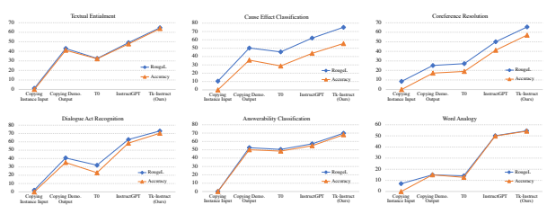

Figure 9: Rouge-L v.s. Accuracy for task types that are usually regarded as classification tasks. The trends of these two metrics are highly correlated with a Pearson coefficient of 0.970. 

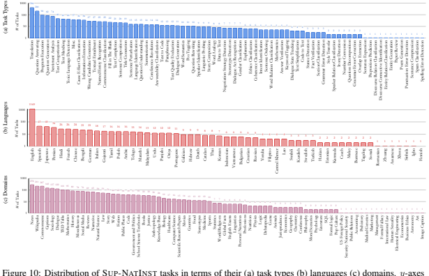

ction Image Caption

are in log scale.

| Task Category   | Metric      |                                                                   | List of Tasks                                                            |
|-----------------|-------------|-------------------------------------------------------------------|--------------------------------------------------------------------------|
| Textual         | Exact Match | task937_defeasible_nli_atomic_textual_entailment                  | task1386_anli_textual_entailment                                         |
| Entailment      |             | task202_multinli_textual_entailment                               | task463_pasinlu_textual_entailment                                       |
|                 |             | task936_defeasible_nli_atomic_textual_entailment                  | task1387_anli_textual_entailment                                         |
|                 |             | task641_e_snli_textual_entailment                                 | task738_perspectrum_textual_entailment                                   |
|                 |             | task1344_rte_textual_entailment  task1615_sick_textual_entailment | task1529_scitailv1.1_textual_entailment  task190_snli_textual_entailment |
|                 |             | task1385_anli_textual_entailment                                  | task200_multinli_textual_entailment                                      |
|                 |             | task935_defeasible_nli_atomic_textual_entailment                  | task1612_sick_textual_entailment                                         |
|                 |             | task199_multinli_textual_entailment                               | task970_sherliic_textual_entailment                                      |
|                 |             | task1388_cb_textual_entailment                                    | task890_gwsd_textual_entailment                                          |
|                 |             | task1554_scitail_textual_entailment                               | task464_pasinlu_textual_entailment                                       |
|                 |             | task640_e_snli_textual_entailment                                 | task1516_imppres_textual_entailment                                      |
|                 |             | task534_farstail_textual_entailment                               | task642_e_snli_textual_entailment                                        |
|                 |             | task201_multinli_textual_entailment                               |                                                                          |
| Cause           | Exact Match | task1178_xcopa_cause_effect_classification                        | task1184_xcopa_cause_effect_classification                               |
| Effect          |             | task391_cod3s_cause_effect_classification                         | task1185_xcopa_cause_effect_classification                               |
| Classification  |             | task939_indicnlp_cause_effect_classification                      | task1176_xcopa_cause_effect_classification                               |
|                 |             | task392_cod3s_cause_effect_classification                         | task614_glucose_cause_effect_classification                              |
|                 |             | task938_indicnlp_cause_effect_classification                      | task1629_copa_hr_cause_effect_classification                             |
|                 |             | task1168_xcopa_cause_effect_classification                        | task1175_xcopa_cause_effect_classification                               |
|                 |             | task828_copa_cause_effect_classification                          | task827_copa_cause_effect_classification                                 |
|                 |             | task1628_copa_hr_cause_effect_classification                      | task1173_xcopa_cause_effect_classification                               |
|                 |             | task943_indicnlp_cause_effect_classification                      | task1180_xcopa_cause_effect_classification                               |
|                 |             | task1182_xcopa_cause_effect_classification                        | task1170_xcopa_cause_effect_classification                               |
|                 |             | task1171_xcopa_cause_effect_classification                        | task1183_xcopa_cause_effect_classification                               |
|                 |             | task968_xcopa_cause_effect_classification                         | task969_xcopa_cause_effect_classification                                |
|                 |             | task942_indicnlp_cause_effect_classification                      | task941_indicnlp_cause_effect_classification                             |
|                 |             | task1181_xcopa_cause_effect_classification                        | task1626_copa_hr_cause_effect_classification                             |
|                 |             | task1172_xcopa_cause_effect_classification                        | task940_indicnlp_cause_effect_classification                             |
|                 |             | task1393_copa_cause_effect_classification                         | task393_cod3s_cause_effect_classification                                |
|                 |             | task1174_xcopa_cause_effect_classification                        | task1169_xcopa_cause_effect_classification                               |
|                 |             | task1627_copa_hr_cause_effect_classification                      | task1179_xcopa_cause_effect_classification                               |
|                 |             | task1177_xcopa_cause_effect_classification                        |                                                                          |
| Coreference     | Exact Match | task1391_winogrande_coreference_resolution                        | task033_winogrande_coreference_resolution                                |
| Resolution      |             | task1664_wino_bias_coreference_resolution                         | task133_winowhy_coreference_resolution                                   |
|                 |             | task304_numeric_fused_head_coreference_resolution                 | task329_gap_coreference_resolution                                       |
|                 |             | task892_gap_coreference_resolution                                | task249_enhanced_wsc_coreference_resolution                              |
|                 |             | task891_gap_coreference_resolution                                | task648_winograd_wsc_coreference_resolution                              |
|                 |             | task330_gap_coreference_resolution                                | task1390_wsc_fiexed_coreference_resolution                               |
|                 |             | task401_numeric_fused_head_coreference_resolution                 | task893_gap_coreference_resolution                                       |
| Dialogue        | Exact Match | task879_schema_guided_dstc8_dialogue_act_recognition              | task880_schema_guided_dstc8_dialogue_act_recognition                     |
| Act             |             | task362_spolin_dialogue_act_recognition                           | task1531_dailydialog_dialogue_act_recognition                            |
| Recognition     |             | task1533_dailydialog_dialogue_act_recognition                     | task1394_meta_woz_dialogue_act_recognition                               |
|                 |             | task1534_dailydialog_dialogue_act_recognition                     |                                                                          |
| Answerability   | Exact Match | task020_mctaco_answerability_classification                       | task232_iirc_answerability_classification                                |
| Classification  |             | task050_multirc_answerability_classification                      | task1442_doqa_answerability_classification                               |
|                 |             | task1439_doqa_answerability_classification                        | task242_tweetqa_answerability_classification                             |
|                 |             | task233_iirc_answerability_classification                         | task1624_disfl_qa_answerability_classification                           |
|                 |             | task226_stack_overflow_answerability_classification               | task520_aquamuse_answerability_classification                            |
|                 |             | task396_persianqa_answerability_classification                    | task290_tellmewhy_answerability_classification                           |
|                 |             | task1640_adverserial_qa_answerability_classification              | task349_squad2.0_answerability_classification                            |
| Word Analogy    | Exact Match | task1155_bard_word_analogy  task1152_bard_word_analogy            | task1159_bard_word_analogy  task1153_bard_word_analogy                   |
|                 |             | task1158_bard_word_analogy  task1156_bard_word_analogy            | task1154_bard_word_analogy                                               |
|                 |             | task1157_bard_word_analogy                                        |                                                                          |
| Overlap         | ROUGE\-L    | task039_qasc_overlap_extraction                                   | task281_points_of_correspondence_overlap_extraction                      |
| Extraction      |             |                                                                   |                                                                          |
| Keyword         | ROUGE\-L    | task613_liar_keyword_tagging                                      | task036_qasc_keyword_tagging                                             |
| Tagging         |             | task645_wiki_auto_all_data_keyword_tagging                        | task623_ohsumed_keyword_tagging                                          |
|                 |             | task620_ohsumed_keyword_tagging                                   |                                                                          |
| Question        | ROUGE\-L    | task670_ambigqa_question_rewriting                                | task671_ambigqa_question_rewriting                                       |
| Rewriting       |             | task121_zest_question_rewriting                                   | task1562_zest_question_rewriting                                         |
|                 |             | task1195_disfl_qa_question_rewriting                              | task1622_disfl_qa_question_rewriting                                     |
|                 |             | task442_com_qa_question_rewriting                                 | task034_winogrande_question_rewriting                                    |
|                 |             | task1345_qqp_question_rewriting                                   | task402_grailqa_question_rewriting                                       |
|                 |             | task035_winogrande_question_rewriting                             |                                                                          |
| Title           | ROUGE\-L    | task1356_xlsum_title_generation                                   | task219_rocstories_title_generation                                      |
| Generation      |             | task1540_peer_read_title_generation                               | task602_wikitext_title_generation                                        |
|                 |             | task1659_billsum_title_generation                                 | task1586_scifact_title_generation                                        |
|                 |             | task569_recipe_nlg_title_generation                               | task743_eurlex_title_generation                                          |
|                 |             | task1342_amazon_us_reviews_title_generation                       | task500_scruples_title_generation                                        |
|                 |             | task220_rocstories_title_generation                               | task619_ohsumed_title_generation                                         |
|                 |             | task1561_clickbait_news_bg_title_generation                       | task510_reddit_tifu_dataset_title_generation                             |
|                 |             | task418_persent_title_generation                                  | task288_gigaword_title_generation                                        |
|                 |             | task1358_xlsum_title_generation task769_qed_title_generation      | task1161_coda_19_title_generation                                        |
| Data to Text    | ROUGE\-L    | task957_e2e_data_to_text  task1631_open_pi_data_to_text           | task677_ollie_data_to_text  task1407_dart_data_to_text                   |
|                 |             | task1598_nyc_data_to_text  task1728_web_nlg_data_to_text          | task1409_dart_data_to_text task760_msr_sqa_data_to_text                  |
|                 |             | task102_commongen_data_to_text                                    |                                                                          |
| Grammar Error   | ROUGE\-L    | task1557_jfleg_grammar_error_correction                           |                                                                          |
| Correction      |             |                                                                   |                                                                          |

Table 5: 12 Evaluation categories (§5.1), their evaluation metrics (Exact Matching or ROUGE-L, §5.1), and all the tasks in each category.

| Task Type   | Textual Entailment                                                                                                      |
|-------------|-------------------------------------------------------------------------------------------------------------------------|
| Task ID     | task1344_rte_textual_entailment                                                                                         |
| Definition  | In this task, you're given two sentences. Indicate if the first sentence clearly entails the second sentence (i.e., one |
|             | can conclude the 2nd sentence by reading the 1st one). Indicate your answer with "1" if the first sentence entails the  |
|             | second sentence, otherwise answer with "0".                                                                             |
| Positive Ex             | Input: Sentence 1: No Weapons of Mass Destruction Found in Iraq Yet. Sentence 2:Weapons of Mass Destruction             |
| ample       | Found in Iraq.                                                                                                          |
|             | Output: 0                                                                                                               |
|             | Explanation: In our first statement we clearly say that Iraq does not have any weapon of mass destruction but the       |
|             | second sentence says that weapon of mass destruction is found in Iraq which is a contradiction. Hence output will       |
|             | be 0 for non entailment.                                                                                                |
| Negative Ex             | Input: Sentence 1: Valero Energy Corp., on Monday, said it found "extensive" additional damage at its 250,000\-         |
| ample       | barrel\-per\-day Port Arthur refinery. Sentence 2: Valero Energy Corp. produces 250,000 barrels per day.                |
|             | Output: 0                                                                                                               |
|             | Explanation: The first statement mentions that there was damage found in the 250,000 barrel\-per\-day Port Aurthur      |
|             | refinery. Which means that they produce 250,000 barrels a day. Hence the output should have been 1 for entailment.      |
| Instance    | Input: Sentence 1: Like the United States, U.N. officials are also dismayed that Aristide killed a conference called    |
|             | by Prime Minister Robert Malval in Port\-au\-Prince in hopes of bringing all the feuding parties together. Sentence 2:  |
|             | Aristide had Prime Minister Robert Malval murdered in Port\-au\-Prince.                                                 |
|             | Valid Output: ["0"]                                                                                                     |

Table 6: An example task in the Textual Entailment category of our dataset, adopted from RTE (Dagan et al., 2005;

| Task Type   | Cause Effect Classification                                                                                                                                                                                                              |
|-------------|------------------------------------------------------------------------------------------------------------------------------------------------------------------------------------------------------------------------------------------|
| Task ID     | task828_copa_cause_effect_classification                                                                                                                                                                                                 |
| Definition  | In this task your given two statements. You must judge whether the second sentence is the cause or effect of the first  one. Label the instances as "cause" or "effect" based on your judgment. The sentences are separated by a newline |
|             | character.                                                                                                                                                                                                                               |
| Positive Ex             | Input: The women met for coffee. They wanted to catch up with each other.                                                                                                                                                                |
| ample       | Output: cause                                                                                                                                                                                                                            |
|             | Explanation: The women met for coffee because they wanted to catch up with each other.                                                                                                                                                   |
| Negative Ex             | Input: My body cast a shadow over the grass. The sun was rising.                                                                                                                                                                         |
| ample       | Output: effect                                                                                                                                                                                                                           |
|             | Explanation: The rising of the sun isn't an effect of casting a shadow over the grass.                                                                                                                                                   |
| Instance    | Input: The woman tolerated her friend's difficult behavior. The woman knew her friend was going through a hard                                                                                                                           |
|             | time.                                                                                                                                                                                                                                    |
|             | Valid Output: ["cause"]                                                                                                                                                                                                                  |

Bentivogli et al., 2008).

| Task Type   | Coreference Resolution                                                                                              |
|-------------|---------------------------------------------------------------------------------------------------------------------|
| Task ID     | task1391_winogrande_coreference_resolution                                                                          |
| Definition  | In this task, you are given a question containing a blank (_) and two options. You should pick the best option to   |
|             | answer the question. Please answer with "A" or "B".                                                                 |
| Positive Ex             | Input: Katrina gave Christine a stuffed animal for their birthday, but _ already had this one. (A) Katrina (B)      |
| ample       | Christine                                                                                                           |
|             | Output: B                                                                                                           |
|             | Explanation: Since the blank is someone who received the gift and already had a stuffed animal, the answer must     |
|             | be "Christine".                                                                                                     |
| Negative Ex             | Input: Kevin had to use less sunscreen when at the beach tanning than Justin because _ had less sensitive skin. (A) |
| ample       | Kevin (B) Justin                                                                                                    |
|             | Output: (A)                                                                                                         |
|             | Explanation: Here, an additonal parentheses has been added to the answer. Note that, a valid answer must be "A"     |
|             | or "B".                                                                                                             |
| Instance    | Input: Benjamin hated being in the sand and just watched Nelson make castle since _ hated to be messy. (A)          |
|             | Benjamin (B) Nelson                                                                                                 |
|             | Valid Output: ["A"]                                                                                                 |

Table 7: An example task in the Cause Effect Classification category of our dataset, adopted from COPA (Roemmele et al., 2011).

Table 8: An example task in the Cause Effect Classification category of our dataset, adopted from Wino- Grande (Sakaguchi et al., 2020).

| Task Type   | Dialogue Act Recognition                                                                                                  |
|-------------|---------------------------------------------------------------------------------------------------------------------------|
| Task ID     | task1394_meta_woz_dialogue_act_recognition                                                                                |
| Definition  | In this task, you are given four sentences:  a bot task sentence, a bot role sentence, a user task sentence               |
|             | and a user role sentence. Your job is to classify given sentences into one of the 47 different domains. The               |
|             | domains are:  "UPDATE_CALENDAR",  "PRESENT_IDEAS",  "MOVIE_LISTINGS", "AUTO_SORT",                                        |
|             | "GAME_RULES", "CONTACT_MANAGER", "BANK_BOT", "MUSIC_SUGGESTER", "CHECK_STATUS",                                           |
|             | "PET_ADVICE", "HOW_TO_BASIC", "NAME_SUGGESTER", "QUOTE_OF_THE_DAY_BOT", "GUI                                                                                                                           |
|             | NESS_CHECK", "INSURANCE", "RESTAURANT_PICKER", "MAKE_RESTAURANT_RESERVATIONS",                                            |
|             | "WEDDING_PLANNER",  "SKI_BOT",  "HOME_BOT",  "PLAY_TIMES",  "BUS_SCHEDULE_BOT",                                           |
|             | "WHAT_IS_IT",  "PHONE_PLAN_BOT",  "DECIDER_BOT",  "PHONE_SETTINGS",  "TIME_ZONE",                                         |
|             | "LIBRARY_REQUEST",  "UPDATE_CONTACT",  "CATALOGUE_BOT",  "PROMPT_GENERATOR",                                              |
|             | "SCAM_LOOKUP",  "SPORTS_INFO",  "POLICY_BOT",  "CITY_INFO",  "APARTMENT_FINDER",                                          |
|             | "EVENT_RESERVE",  "SHOPPING",  "EDIT_PLAYLIST",  "LOOK_UP_INFO",  "ORDER_PIZZA",                                          |
|             | "WEATHER_CHECK", "APPOINTMENT_REMINDER", "GEOGRAPHY", "STORE_DETAILS", "AGREE                                                                                                                           |
|             | MENT_BOT", "ALARM_SET".                                                                                                   |
| Positive Ex             | Input: Bot's task: Inform the user that the topping they are asking for is unavailable. Bot's role: You are a bot         |
| ample       | designed to help customers order pizza. User's task: Ask if a certain pizza topping is available. User's role: You are    |
|             | interacting with a pizza restaurant bot.                                                                                  |
|             | Output: ORDER_PIZZA                                                                                                       |
|             | Explanation: According to the descriptions of the four sentences, we know that the type of task is ORDER_PIZZA.           |
| Negative Ex             | Input: Bot's task: Help the user with their pizza order. Bot's role: You are a bot designed to help customers order       |
| ample       | pizza. User's task: Ask the bot for three different pizzas. User's role: You are interacting with a pizza restaurant bot. |
|             | Output: UPDATE_CALENDAR                                                                                                   |
|             | Explanation: According to the descriptions of the tasks and roles, we know that the type of task is ORDER_PIZZA,          |
|             | but the output is UPDATE_CALENDAR, so it is incorrect.                                                                    |
| Instance    | Input: Bot's task: Tell the user when the movie is playing on Friday night. Bot's role: You are a a bot designed to       |
|             | provide movie listings. User's task: Ask the bot for the movie times for a movie on Friday night. User's role: You        |
|             | are interacting with a bot designed to provide movie listings.                                                            |
|             | Valid Output: ["MOVIE_LISTINGS"]                                                                                          |

Table 9: An example task in the Dialogue Act Recognition category of our dataset, adopted from MetaLWOz (Sha-

| Task Type   | Answerability Classification                                                                                        |
|-------------|---------------------------------------------------------------------------------------------------------------------|
| Task ID     | task1640_adverserial_qa_answerability_classification                                                                |
| Definition  | Given a paragraph from a wikipedia article about some topic, and a question related to the topic, determine whether |
|             | the question is answerable from the paragraph. If the question is answerable, answer "True", otherwise, answer      |
|             | "False".                                                                                                            |
| Positive Ex             | Input: Another approach to brain function is to examine the consequences of damage to specific brain areas.         |
| ample       | Even though it is protected by the skull and meninges, surrounded by cerebrospinal fluid, and isolated from the     |
|             | bloodstream by the blood 2013 brain barrier, the delicate nature of the brain makes it vulnerable to numerous       |
|             | diseases and several types of damage. In humans, the effects of strokes and other types of brain damage have been a |
|             | key source of information about brain function. Because there is no ability to experimentally control the nature of |
|             | the damage, however, this information is often difficult to interpret. In animal studies, most commonly involving   |
|             | rats, it is possible to use electrodes or locally injected chemicals to produce precise patterns of damage and then |
|             | examine the consequences for behavior. Question: What is surrounded by cerebrospinal fluid?                         |
|             | Output: True                                                                                                        |
|             | Explanation: The paragraph comes from the wikipedia page on the brain. The answer to the question is the brain      |
|             | which can be found in the paragraph.                                                                                |
| Negative Ex             | Input: NASCAR (headquartered in Daytona Beach) begins all three of its major auto racing series in Florida at       |
| ample       | Daytona International Speedway in February, featuring the Daytona 500, and ends all three Series in November at     |
|             | Homestead\-Miami Speedway. Daytona also has the Coke Zero 400 NASCAR race weekend around Independence               |
|             | Day in July. The 24 Hours of Daytona is one of the world's most prestigious endurance auto races. The Grand Prix    |
|             | of St. Petersburg and Grand Prix of Miami have held IndyCar races as well. Question: What is the starting time of   |
|             | NASCAR's big events?                                                                                                |
|             | Output: False                                                                                                       |
|             | Explanation: This paragraph comes from the wikipedia article on Florida. The answer to the given question is        |
|             | February which can be found in the paragraph, however the output is given as False.                                 |
| Instance    | Input: Another approach to brain function is to examine the consequences of damage to specific brain areas.         |
|             | Even though it is protected by the skull and meninges, surrounded by cerebrospinal fluid, and isolated from the     |
|             | bloodstream by the blood 2013 brain barrier, the delicate nature of the brain makes it vulnerable to numerous       |
|             | diseases and several types of damage. In humans, the effects of strokes and other types of brain damage have been a |
|             | key source of information about brain function. Because there is no ability to experimentally control the nature of |
|             | the damage, however, this information is often difficult to interpret. In animal studies, most commonly involving   |
|             | rats, it is possible to use electrodes or locally injected chemicals to produce precise patterns of damage and then |
|             | examine the consequences for behavior. Question: What are the benefts of the blood brain barrier?                   |
|             | Valid Output: ["True"]                                                                                              |

lyminov et al., 2020).

Table 10: An example task in the Answerability Classification category of our dataset, adopted from AdversarialQA (Bartolo et al., 2020).

| Task Type   | Word Analogy                                                                                                             |
|-------------|--------------------------------------------------------------------------------------------------------------------------|
| Task ID     | task1156_bard_word_analogy                                                                                               |
| Definition  | Two analogies that relate actions to the tools used to perform the action is given in the form "A : B. C : ?". "A : B"   |
|             | relates action A to tool B. Your task is to replace the question mark (?) with the appropriate tool for the given action |
|             | C, following the "A : B" relation.                                                                                       |
| Positive Ex             | Input: eat : fork. cook : ?                                                                                              |
| ample       | Output: pan                                                                                                              |
|             | Explanation: The given analogy relates actions to the tools used to perform them. A fork can be used to eat. To          |
|             | cook, a pan can be used.                                                                                                 |
| Negative Ex             | Input: dig : shovel. wash : ?                                                                                            |
| ample       | Output: sink                                                                                                             |
|             | Explanation: The given analogy relates actions to the tools used to perform them. A knife can be used to cut. To         |
|             | wash, a sink CANNOT be used.                                                                                             |
| Instance    | Input: cut : knife. wash : ?                                                                                             |
|             | Valid Output: ["soap", "washcloth", "detergent", "rag"]                                                                  |

| Task Type   | Overlap Extraction                                                                                                    |
|-------------|-----------------------------------------------------------------------------------------------------------------------|
| Task ID     | task281_points_of_correspondence_overlap_extraction                                                                   |
| Definition  | You will be given three sentences. Read them, then identify a noun phrase (person, place, or thing) or event that is  |
|             | shared between all three sentences. As the output, write the span of the text corresponding to that phrase in each    |
|             | sentence. Keep the order of the sentences, that is, your answer should look like: 1: *a phrase from sentence 1* 2: *a |
|             | phrase from sentence 2* 3: *a phrase from sentence 3*                                                                 |
| Positive Ex             | Input: 1: Four employees of the store have been arrested , but its manager - herself a woman - was still at large     |
| ample       | Saturday , said Goa police superintendent Kartik Kashyap . 2: If convicted , they could spend up to three years in    |
|             | jail , Kashyap said . 3: The four store workers arrested could spend 3 years each in prison if convicted .            |
|             | Output: 1: Four employees of the store 2: they 3: The four store workers                                              |
|             | Explanation: All three mentioned parts refer to the same entity, the four employees. "of the store" in first sentence |
|             | must be included, since it is part of the same noun phrase describing the employees.                                  |
| Negative Ex             | Input: 1: But an Arizona official told CNN Bates never trained with the agency . 2: He didn't come to Arizona , the   |
| ample       | official from the Maricopa County Sheriff 's Office said , and he certainly didn't train with us . 3: Maricopa County |
|             | Sheriff 's Office in Arizona says Robert Bates never trained with them .                                              |
|             | Output: 1: the agency 3: Maricopa County Sheriff 's Office in Arizona                                                 |
|             | Explanation: The two noun phrases given in this example are correct, but there's no noun phrase from sentence 2.      |
|             | You should include all three sentences in your response.                                                              |
| Instance    | Input: 1: The President is headed to Panama for a regional summit , and Julie Pace of The Associated Press reports    |
|             | one of the big questions is whether he 'll make history and have a face\-to\-face meeting with Cuban leader Raul      |
|             | Castro . 2: And so what the White House is going to be weighing is whether this meeting would be a way to             |
|             | generate more progress or whether it would be a premature reward for the Castros . 3: White House weighing            |
|             | whether Obama should meet with Raul Castro .                                                                          |
|             | Valid Output: ["1: Cuban leader Raul Castro 2: the Castros 3: Raul Castro", "1: face\-to\-face meeting 2: this        |
|             | meeting 3: meet"]                                                                                                     |

Table 11: An example task in the Word Analogy category of our dataset, adopted from BARD (Fulda et al., 2017).

Table 12: An example task in the Overlap Extraction category of our dataset, adopted from PointsOfCorrespondence (Lebanoff et al., 2020).

| Task Type   | Keyword Tagging                                                                                                        |
|-------------|------------------------------------------------------------------------------------------------------------------------|
| Task ID     | task620_ohsumed_keyword_tagging                                                                                        |
| Definition  | Given an abstract, generate a keyword (a noun phrase) that best describes the focus or contribution of the paper.      |
|             | Such keywords can be directly from the given abstract or outside it.                                                   |
| Positive Ex             | Input: Abstract: Our results suggest that ethylene oxide retention after sterilization is increased in cuprammonium    |
| ample       | cellulose plate dialyzers containing potting compound. In contrast, cuprammonium cellulose plate dialyzers without     |
|             | potting compound were characterized by a rapid disappearance of retained ethylene oxide after sterilization. Whether   |
|             | these findings explain the low incidence of SARD with cuprammonium cellulose plate dialyzers that do not contain       |
|             | potting material is a matter for continued study and experimentation.                                                  |
|             | Output: Sterilization                                                                                                  |
|             | Explanation: This term is directly present in the abstract and it is one of the main topic in it. So can be chosen as  |
|             | the medical subject heading.                                                                                           |
| Negative Ex             | Input: Abstract: Our results suggest that ethylene oxide retention after sterilization is increased in cuprammonium    |
| ample       | cellulose plate dialyzers containing potting compound. In contrast, cuprammonium cellulose plate dialyzers without     |
|             | potting compound were characterized by a rapid disappearance of retained ethylene oxide after sterilization. Whether   |
|             | these findings explain the low incidence of SARD with cuprammonium cellulose plate dialyzers that do not contain       |
|             | potting material is a matter for continued study and experimentation.                                                  |
|             | Output: Plasma Volume                                                                                                  |
|             | Explanation: This term is not directly present in the abstract and it is no way related to the abstract. So can not be |
|             | chosen as the medical subject heading. "Cellulose" can be become a mesh term                                           |
| Instance    | Input: Abstract: There is controversy regarding the appropriate utilization of health care resources in the man                                                                                                                        |
|             | agement of tricyclic antidepressant overdosage. Antidepressant overdose patients presenting to the emergency           |
|             | department (ED) are routinely admitted to intensive care units, but only a small proportion develop cardiac arrhyth                                                                                                                        |
|             | mias or other complications requiring such an environment. The authors reviewed the findings in 165 patients           |
|             | presenting to an ED with antidepressant overdose. They found that major manifestations of toxicity on ED evaluation    |
|             | (altered mental status, seizures, arrhythmias, an d conduction defects) were commonly associated with a complicated    |
|             | hospital course. Patients with the isolated findings of sinus tachycardia or QTc prolongation had no complications.    |
|             | No patient experienced a serious toxic event without major evidence of toxicity on ED evaluation and continued         |
|             | evidence of toxicity during the hospital course. These data support the concept that proper ED evaluation can          |
|             | identify a large body of patients with trivial ingestions who may not require hospital observation.                    |
|             | Valid Output: ["Antidepressive Agents, Tricyclic", "Arrhythmia", "California", "Electrocardiography", "Emergen                                                                                                                        |
|             | cies", "Emergency Service, Hospital", "Female", "Human", "Length of Stay", "Male", "Prognosis", "Retrospective         |
|             | Studies", "Tachycardia, Sinus"]                                                                                        |

| Task Type   | Question Rewriting                                                                                                                                                                                                                         |
|-------------|--------------------------------------------------------------------------------------------------------------------------------------------------------------------------------------------------------------------------------------------|
| Task ID     | task1622_disfl_qa_question_rewriting                                                                                                                                                                                                       |
| Definition  | Convert a disfluent question to a proper question. A disfluent question is a question that has some interruptions in it                                                                                                                    |
|             | while framing. A proper question is the correct form of the question without any disfluency.                                                                                                                                               |
| Positive Ex             | Input: Why was uh where was the Rhine regulated with an upper canal?                                                                                                                                                                       |
| ample       | Output: Where was the Rhine regulated with an upper canal?                                                                                                                                                                                 |
|             | Explanation: The above disfluent question is correctly converted to a proper question. The 'uh' and the 'why'                                                                                                                              |
|             | before the correction should be removed to make it fluent.                                                                                                                                                                                 |
| Negative Ex             | Input: When did Maududi exert the least impact no where did he exert?                                                                                                                                                                      |
| ample       | Output: When did Maududi exert the least impact?                                                                                                                                                                                           |
|             | Explanation: The above disfluent question is not correctly converted to a proper question since the original meaning  in the disfluent question is where did Maudidi exert the least impact but the output asks when did Maudidi exert the |
|             | least impact.                                                                                                                                                                                                                              |
| Instance    | Input: What kind of, no hold up, what describes the proportionality of acceleration to force and mass?                                                                                                                                     |
|             | Valid Output: ["What describes the proportionality of acceleration to force and mass?"]                                                                                                                                                    |

Table 13: An example task in the Keyword Tagging category of our dataset, adopted from OHSUMED (Hersh et al., 1994).

Table 14: An example task in the Question Rewriting category of our dataset, adopted from Disfl-QA (Gupta et al., 2021).

| Task Type   | Title Generation                                                                                                        |
|-------------|-------------------------------------------------------------------------------------------------------------------------|
| Task ID     | task418_persent_title_generation                                                                                        |
| Definition  | Given a document, generate a short title of the document. The title should convey the main idea/event/topic about       |
|             | which the document is being written. Note that URLs in the text have been replaced with [Link].                         |
| Positive Ex             | Input: In a letter posted on the White House web site Tuesday John Brennan assistant to President Barack Obama          |
| ample       | for homeland security and counterterrorism said Schmidt will have regular access to the president and play a vital      |
|             | role in the country's security. Schmidt's selection comes more than 10 months after Obama declared cyber security       |
|             | a priority and ordered a broad administration review. A senior White House official said Obama was personally           |
|             | involved in the selection process and chose Schmidt because of his unique background and skills. Schmidt will           |
|             | have regular and direct access to the president for cyber security issues the official said. The official spoke on the  |
|             | condition of anonymity to discuss the selection process. At the same time cyber experts and potential job candidates    |
|             | have complained that the position lacks the budgetary and policy\-making authority needed to be successful. Schmidt     |
|             | will report to the National Security Council and closely support the National Economic Council on cyber issues.         |
|             | Schmidt's selection suggests that economic and business interests in the White House held more sway in the selection    |
|             | process. Schmidt president and CEO of the Information Security Forum a nonprofit international consortium that          |
|             | conducts research in information security has served as chief security officer for Microsoft and as cyber security      |
|             | chief for online auction giant eBay. He was reportedly preferred by Lawrence Summers director of the economic           |
|             | council. A good format for the titel can be the simple subject + object + verb.                                         |
|             | Output: White House picks new cyber coordinator                                                                         |
|             | Explanation: The title is relevant to the main topic of document, that is, the selection of Schmidt as the cybersecutiy |
|             | chief.                                                                                                                  |
| Negative Ex             | Input: Lauren Cohan's Walking Dead fate may be written in the Whiskey Cavalier. While the show hasn't been              |
| ample       | picked up yet Cohan hasn't yet signed on for season 9 of Walking Dead and rumors have circulated for months             |
|             | about her possible exit from the zombie show. Just two days ago show runner Scott Gimple told TV Line that he           |
|             | is incredibly hopeful about working out a new deal with Cohan who has played Maggie since the second season.            |
|             | "These things do happen in TV" he said. But we are talking.                                                             |
|             | Output: Scott Gimple signed Lauren Cohan for season 9                                                                   |
|             | Explanation: Though the topic is relevant and have correct names from the document, this is incorrect fact, as it is    |
|             | mentioned that Cohan hasn't yet signed.                                                                                 |
| Instance    | Input: Days after at least 58 people were killed in a Las Vegas mass shooting , Hillary Clinton called for better gun   |
|             | control . Clinton also had some words for President Trump , particularly of his handling of Hurricane Maria and         |
|             | the devastation in Puerto Rico . Clinton , on her book tour for "What Happened ," called her memoir "a story of         |
|             | resilience ." Fallon also had female staff writers write thank you notes to Clinton . "Thank you , Miley , tonight      |
|             | 's show writers and all of the women and young girls out there who are smart , strong and deserving of every            |
|             | opportunity ," Clinton said . As for election night , Clinton said she was disappointed both that she lost and that     |
|             | President Trump won .                                                                                                   |
|             | Valid Output: ["Hillary Clinton calls for gun control after Las Vegas shooting"]                                        |

| Task Type   | Data to Text                                                                                                              |
|-------------|---------------------------------------------------------------------------------------------------------------------------|
| Task ID     | task957_e2e_data_to_text                                                                                                  |
| Definition  | In this task, we ask you convert a data table of restaurant descriptions into fluent natural\-sounding English sentences. |
|             | The input is a string of key\-value pairs; the output should be a natural and grammatical English sentence containing     |
|             | all the information from the input.                                                                                       |
| Positive Ex             | Input: name[Aromi], eatType[restaurant], food[English], area[city centre]                                                 |
| ample       | Output: Aromi is an English restaurant in the city centre.                                                                |
|             | Explanation: The output sentence faithfully converts the data in the input into a natural\-sounding sentence.             |
| Negative Ex             | Input: name[Blue Spice], eatType[coffee shop], priceRange[more than 00a330], customer rating[5 out of 5],  ˘              |
| ample       | area[riverside], familyFriendly[yes], near[Avalon]                                                                        |
|             | Output: Blue Spice is a Colombian coffee shop located by the riverside, near Avalon in Boston. Its prices are over        |
|             | ˘  00a330. Its customer ratings are 5 out of 5.                                                                           |
|             | Explanation: While the output contains most of the information from the input, it hallucinates by adding ungrounded       |
|             | information such as "Colombian" and "Boston".                                                                             |
| Instance    | Input: name[The Mill], eatType[restaurant], area[riverside], near[The Rice Boat]                                          |
|             | Valid Output: ["A restaurant called The Mill, can be found near the riverside next to The Rice Boat."]                    |

Table 15: An example task in the Title Generation category of our dataset, adopted from PerSenT (Bastan et al., 2020).

Table 16: An example task in the Data to Text category of our dataset, adopted from E2E (Novikova et al., 2017).

.

| Task Type   | Grammar Error Correction                                                                                          |
|-------------|-------------------------------------------------------------------------------------------------------------------|
| Task ID     | task1557_jfleg_grammar_error_correction                                                                           |
| Definition  | In this task, you will be shown an incorrect English sentence. You need to generate a corrected form of the input |
|             | sentence.                                                                                                         |
| Positive Ex             | Input: The car's wheel are loose.                                                                                 |
| ample       | Output: The car's wheel is loose.                                                                                 |
|             | Explanation: The instance of are is replaced by the word is. This makes the sentence grammatically correct.       |
| Negative Ex             | Input: This way is the way to go.                                                                                 |
| ample       | Output: This way may be the way to go.                                                                            |
|             | Explanation: The example does not correct the misuse of the word way. Instead, it should shorten the sentence to: |
|             | this is the way to go.                                                                                            |
| Instance    | Input: I think it 's harder for successful preson to risk somethnig , thay coluld lost much more then others .    |
|             | Valid Output: ["I think it 's harder for a successful person to risk something becuase they could lose much more  |
|             | than others ."]                                                                                                   |

.

Table 17: An example task in the Grammar Error Correction category of our dataset, adopted from JFLEG (Napoles et al., 2017).

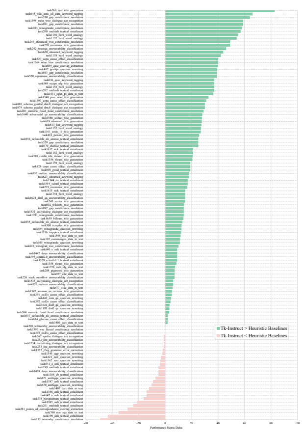

Figure 11: Tk-INSTRUCT's per-task performance improvement over the best of two heuristic baselines on the 119 evaluation tasks of the English track.

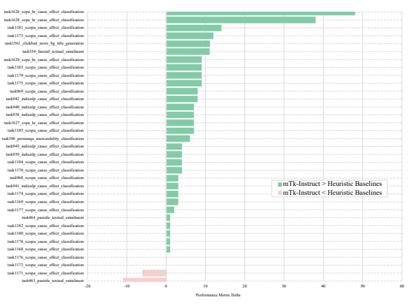

Figure 12: Tk-INSTRUCT's per-task performance improvement over the best of two heuristic baselines on the 35 evaluation tasks of the cross-lingual track.
