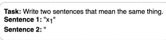
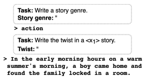
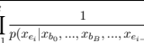
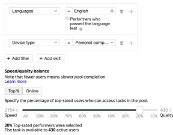
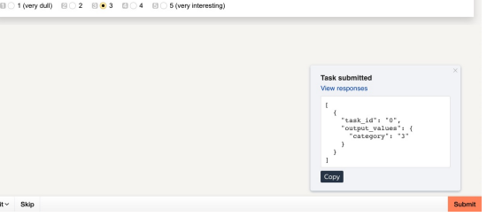
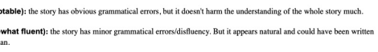
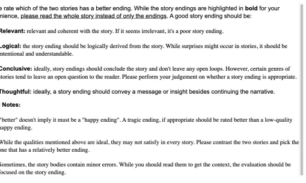
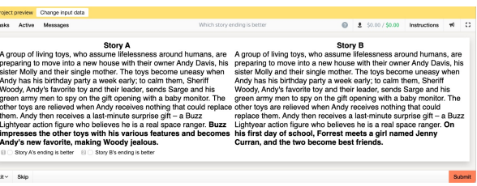

# Plot Writing From Scratch **Pre-Trained Language Models**

Yiping Jin1∗
, Vishakha Kadam2**, Dittaya Wanvarie**1 1Department of Mathematics & Computer Science, Chulalongkorn University, Thailand 2Knorex, 02-129 WeWork Futura, Magarpatta, Hadapsar, Pune, India Dittaya.W@chula.ac.th
{jinyiping, vishakha.kadam}@knorex.com

## Abstract

Pre-trained language models (PLMs) fail to generate long-form narrative text because they do not consider global structure. As a result, the generated texts are often incohesive, repetitive, or lack content. Recent work in story generation reintroduced explicit content planning in the form of prompts, keywords, or semantic frames. Trained on large parallel corpora, these models can generate more logical event sequences and thus more contentful stories. However, these intermediate representations are often not in natural language and cannot be utilized by PLMs without fine-tuning. We propose generating story plots using offthe-shelf PLMs while maintaining the benefit of content planning to generate cohesive and contentful stories. Our proposed method, SCRATCHPLOT, first prompts a PLM to compose a content plan. Then, we generate the story's body and ending conditioned on the content plan. Furthermore, we take a generateand-rank approach by using additional PLMs to rank the generated (story, ending) pairs. We benchmark our method with various baselines and achieved superior results in both human and automatic evaluation 1.

## 1 Introduction

Automatic story generation aims to produce interesting stories to be read by readers or help writers develop new ideas. However, generating long-form stories is challenging because language models lack global planning (Hua and Wang, 2020; Tan et al., 2021), discourse coherence (Bosselut et al., 2018; Ji and Huang, 2021), and common sense knowledge (Xu et al., 2020; Ji et al., 2020). While individual sentences appear fluent and logical, they do not fit together as a whole and the stories often have no clear content (See et al., 2019; Goldfarb-Tarrant Figure 1: Overview of SCRATCHPLOT. We factorize the

 elements of a story into four attributes {location, characters, genre, and theme}. We first prompt a PLM to compose them sequentially, then generate the story conditioned on these attributes. When writing the ending of the story, the model additionally conditions on the previously generated story.

et al., 2020). In long text generation, repetitions are also more prevalent, which cause the stories to degrade drastically (Yao et al., 2019).

Interestingly, recent work in long-form story generation relied on *explicit* content planning (Reiter and Dale, 1997), contrary to the prevalent trend of end-to-end learning across NLP tasks. The content plan usually takes the form of prompts (Fan et al., 2018), keywords/keyphrases (Xu et al., 2018; Yao et al., 2019), semantic frames (Fan et al., 2019), or summaries (Sun et al., 2020).

These content plans are usually not in the form of natural language 2and cannot be understood by pre-trained language models (PLMs) without finetuning using parallel data. Another subtle problem of modeling story generation as a supervised learn-

∗Work done while at Knorex.

1Code and data available at https://github.com/
YipingNUS/scratchplot-story-generation.

2Except for using summaries as the content plan.
ing task is that the model learns common sense and frequently occurring action sequences, like morning routines (Fan et al., 2019). Such an action plan may not be interesting and surprising, which are crucial characteristics of stories.

We propose generating stories using off-the-shelf PLMs without fine-tuning. We tap on DINO (Schick and Schütze, 2021), a framework to generate datasets using instructions, to compose stories progressively. Our method, SCRATCHPLOT, is depicted in Figure 1. We firstly prompt a PLM to perform content planning, including the location, characters, genre, and theme. We then generate a story conditioned on these attributes. Finally, we generate story endings and rank them.

The proposed approach yields better stories based on various automatic and human evaluations compared with baselines fine-tuned using parallel data and a PLM with standard prompting. We only experimented with generating English stories. In principle, the approach can be applied to other languages given a reasonable PLM and task descriptions in the target language.

## 2 Plot Generation From Scratch

DINO (Schick and Schütze, 2021) is a framework to generate labeled NLI datasets (Bowman et al., 2015) using a pre-trained GPT-2 model (Radford et al., 2019). Schick and Schütze (2021) formulated different task descriptions to generate sentence pairs for each category. Instead of generating the sentence pairs at once, they sample the first sentence x1, then incorporate it into the task description to sample the second sentence, as shown in Figure 2.

Figure 2: Task description to generate a similar sen-

tence by incorporating the first generated sentence, x1.

Factorizing Elements of a Story We factorize story generation into multiple stages analogous to generating NLI sentence pairs. We define four main plot elements: location, characters, genre, and theme. These elements are not entirely independent. For example, the genre will influence the theme. We denote these dependencies using solid arrows in Figure 1. We then use different task descriptions to sample these elements sequentially.

Figure 3 shows example task descriptions to gener-

 ate the genre and theme. We use paraphrases of the task descriptions, and the complete list is presented in Appendix A.

Figure 3: Task description for generating genre and theme. <X1> denotes the generated genre. The example continuations are generated by GPT2-XL.

We apply self-debiasing (Schick et al., 2021)
to generate distinct geographical units and male/female names using each task description.

Meanwhile, we generate other plot elements without self-debiasing because their task descriptions complement each other. Self-debiasing rewards generated continuations which receive *high* probability conditioned on one task description and low probability conditioned on other task descriptions. For example, when generating a male name, we want it to be *unlike* a female name. Specifically, we calculate the token's probability py assigned by the PLM using each task description. The token's final logit for each task description y is as follows:

$$\delta_{y}=p_{y}-\operatorname*{max}_{y^{\prime}\neq y}p_{y^{\prime}}$$
$$(1)$$

We sample one value for each plot element except for characters, where we generate a male and a female character. After sampling all plot elements, we fuse them into a single task description to generate the story, as depicted in Step 2 of Figure 1.

Generating Coherent Story Ending Coherent and thoughtful endings are crucial to stories. However, it is not obvious how to write the story ending with PLMs. GPT-2 does not have an <EOS>
(end of sequence) token. Therefore, Schick and Schütze (2021) always end the task description with an opening quotation mark (as shown in Figure 2) and generate till the first closing quotation mark. However, the PLM usually generates the first closing quotation mark after a couple of sentences, making it unsuitable for generating long-form stories. Therefore, we generate the story with a fixed length and truncate it till the last complete sentence.

We design a separate task description to write the story ending *explicitly* by providing the story body and asking the PLM to write what happens in the end (Step 3 in Figure 1). As the story ending is usually short, we terminate at the first generated closing quotation mark following Schick and Schütze (2021).

We observe that PLMs sometimes ignore the task descriptions and write generic or irrelevant story endings. Therefore, we propose two methods to rank the story endings. Firstly, we use the next sentence prediction (NSP) task of BERT (Devlin et al., 2019) to measure the coherence between the story and the ending. Specifically, we calculate PNSP (*b, e*), where b denotes the story body and e denotes the story ending.

Inspired by previous works in fact-checking with PLMs (Lee et al., 2020, 2021), we use the perplexity score as another metric to measure the story ending's quality. Specifically, we concatenate the story body and ending to form the input to the PLM: X = {xb0, ..., xbB, xe0*, ..., x*eE}, where B
and E denote the number of tokens in the story body and ending separately. We then calculate the conditioned perplexity by

$$P P L(X)={\sqrt{\prod_{i=1}^{E}{\frac{}{p(x_{e_{i}})}}}}$$

, ..., xei−1)
Note that we use the story body tokens to condition the perplexity, but they do not contribute to the *P P L*(X).

During inference, we sample multiple (story body, story ending) pairs and use NSP and PPL
to rank them 3.

## 3 Experiments

Experimental Details We use the official implementation of DINO (Schick and Schütze, 2021)
4 with the default GPT2-XL language model. We follow the default parameters except setting k=30 for top-k sampling and blocking repeating trigrams during generation. For story ending ranking, we use HuggingFace (Wolf et al., 2020) bert-base-uncased checkpoint to calculate the NSP probability and gpt2 (base) to calculate the perplexity.

We perform simple post-processing to clean or filter the continuations, such as removing tailing punctuations and filtering continuations that repeat words from the prompt or contain 1st or 2nd person pronouns. The story body must also contain some plot elements to ensure it is contentful and respects the task description. The post-processing is detailed in Appendix B.

We generate plot elements *offline* in batches and store them. When generating stories, we randomly sample each type of plot element and combine them to form a content plan 5. Table 1 presents the detailed parameters used for each type of generation.

| Element      | num   | min_len   | max_len   |
|--------------|-------|-----------|-----------|
| Location     | 20    | 1         | 5         |
| Cast         | 10    | 1         | 5         |
| Genre        | 20    | 1         | 5         |
| Theme        | 10    | 5         | 25        |
| Story Body   | 30    | \-        | 100       |
| Story Ending | 10    | 10        | 50        |

Table 1: Hyperparameters for generation. For (location, genre, story body), num indicates the number of continuations to generate per *task description*. For (cast, theme, story ending), num is the number of continuations per *input* <X1> and *task description* combination. Please refer to Appendix A for the number of task descriptions for each plot element.

Baselines We compare with the following three conditional story generation baselines.

- **Fusion** (Fan et al., 2018)
6: A seq2seq model with a convolutional encoder and a self-attention decoder generating stories conditioned on a prompt. We use the official checkpoint, which is fine-tuned on the WRITINGPROMPTS dataset with 300k promptstory pairs.

- **Plan-and-write** (Yao et al., 2019)
7: A
bidirectional gated recurrent unit (BiGRU) seq2seq model that first predicts the storyline (as specified by a sequence of keywords) from the title. It then generates the story conditioned on both the title and the storyline. We train the model on ROCStories

3NSP the higher, the better. *P P L(X*) the lower, the better.

4https://github.com/timoschick/dino 5We sample plot elements following the same sequence in Figure 1 to preserve the dependency among them.

6https://github.com/pytorch/fairseq/
tree/main/examples/stories 7https://bitbucket.org/VioletPeng/
language-model
dataset (Mostafazadeh et al., 2016) for 280 epochs till convergence and follow the default hyper-parameters in the official repository.

- **ProGen** (Tan et al., 2021)
8: A multi-stage BART seq2seq model (Lewis et al., 2020) using salient keywords as intermediate representations. We use a two-stage seq2seq architecture, where the first seq2seq model takes the input keywords and generates a refined intermediate representation containing keywords with finer-grained details. The second seq2seq model then uses it as input and generates the final story. We fine-tune a BART-base model for both stages using 1k examples randomly sampled from the WRITINGPROMPTS dataset following Tan et al. (2021).

We provide the same *generated* content plans to the baselines to make the comparison fair. We use the generated *theme* as input to the Fusion and Planand-write models, which is analogous to the prompt or the title. On the other hand, we extract keywords using TF-IDF following Tan et al. (2021) from all plot elements to prepare the input to ProGen.

We also experiment with a baseline **GPT2-XL**
without content planning where we sample a list of stories by providing the instruction "**Task:** Write a plot summary.\n **Plot summary:**". We limit the story length to 150 tokens in all models for ease of human evaluation 9.

RQ1: Which story ending ranking performs better for ScratchPlot? We conduct a pair-wise comparison on the following story ending ranking methods: selecting the highest NSP (next sentence prediction) score, the lowest PPL (perplexity) score, and a random story and ending pair. For each pairwise evaluation, we randomly sample 50 content plans where the two methods select different story endings 10. Each time, we present the annotators two stories in randomized order and ask the annotators to rate which story ends better. Finally, we take the majority vote from three annotators for each comparison and present the result in Table 2.

We also show randomly sampled stories and story endings selected by different methods in Table 3.

Based on the human rating, PPL selects more favorable story endings than NSP or Random. Sur-

| Method          | Win:Lose   |
|-----------------|------------|
| NSP vs.  Random | 19:31      |
| PPL vs. Random* | 35:15      |
| PPL vs. NSP  *  | 32:18      |

Table 2: Pair-wise comparison of the story ending ranking methods. The winning method in each comparison is highlighted in bold. * indicates statistical significance using two-sided Wilcoxon signed-rank test with p=0.05.

prisingly, NSP performs worse than random story and ending pairs. We hypothesize it might be due to the weakness of the NSP pre-training task. The negative examples during NSP pre-training are random sentences from the *corpus*, which might be too trivial. Therefore, when the story ending and the story have word overlap, the model often predicts a very high PNSP close to 1, causing the comparison to be unreliable.

Besides human evaluation on stories generated by PLMs, we also evaluate the story ending ranking methods on the Story Cloze Test dataset (Mostafazadeh et al., 2016). The dataset was created using crowd-sourcing to test models' commonsense story understanding. Each story contains four preceding sentences, a 'right ending' and a 'wrong ending'. The task is to predict which ending is the right one. Mostafazadeh et al. (2016) instructed the crowdworkers to share at least one of the characters of the story in the ending and to ensure the ending sentence is entirely realistic and sensible when read in isolation. Therefore, the task is non-trivial and shallow techniques barely outperform a random baseline.

We report the Story Cloze Test accuracy in Table 4, along with the three best performing baselines reported in Mostafazadeh et al.

(2016). Word2Vec (Mikolov et al., 2013) and Skipthoughts (Kiros et al., 2015) calculate the semantic representation using the average Word2Vec embedding and Sentence2Vec embedding separately. The models predict the story ending whose embedding is nearest to the preceding story's embedding. Deep Structured Semantic Model (DSSM) (Huang et al., 2013) employs two jointly trained deep neural networks to project the preceding story context and the story ending into the same semantic space.

NSP and PPL performed comparably with DSSM. Notably, DSSM was trained on the full ROCStories dataset (Mostafazadeh et al., 2016),
where the examples of the Story Cloze Test are

8https://github.com/tanyuqian/
progressive-generation 9Additional experimental details can be found in Appendix C.

10They may or may not have the same story body.

| Location:   | San Francisco                                                                          |
|-------------|----------------------------------------------------------------------------------------|
| Cast:       | John Jones and  Evelynn                                                                |
| Genre:      | dark fantasy                                                                           |
| Theme:      | The specter of the future is in the telling                                            |
| Random:     | The protagonist is a woman who has become a cyborg. She must discover who              |
|             | she really is while dealing with the problems of a modern metropolis. John Jones       |
|             | is a mysterious person who claims to be an assassin who is also an inventor and        |
|             | an expert on the cyborgs and other strange and mysterious beings. Evelynn Jones        |
|             | is an attractive and brilliant woman who finds herself caught between the two          |
|             | worlds, and the protagonist's own conflicted past. [SEP] He had to be the hero!        |
|             | It was a tragedy that he couldn't be. He was a killer, an assassin. He had to do it    |
|             | and he did it with a smile on his face.                                                |
| NSP:        | As the year comes to a close, two people begin to lose their grip on reality.          |
|             | Evelynn's father has been dead for several years, but her mother never truly           |
|             | accepted her fate and continues to live a life of denial. John Jones was once a        |
|             | successful businessman, but his fortune was spent by a mysterious corporation          |
|             | that he believed was his own. His life is about to take a turn for the worse as he     |
|             | discovers that Evelynn is living with a life\-long secret. [SEP] In order for her to   |
|             | see the future, she'll have to take the risk.                                          |
| PPL:        | In the past, John Jones used to be a normal person who worked for the government.      |
|             | But after a strange accident, he was taken to a secret facility, where he met the girl |
|             | he loved, Evelynn, and started a relationship with her. But as the years passed, his   |
|             | memories started to grow more and more vague, and he started to realize that he        |
|             | didn't really remember how he got into that facility. [SEP] After a few months,        |
|             | John's memory returned to normal. He and Evelynn had their own children, but           |
|             | the memories remained.                                                                 |

| Method        | Accuracy   |
|---------------|------------|
| Word2Vec      | 0.539      |
| Skip\-thought | 0.552      |
| DSSM          | 0.585      |
| NSP           | 0.580      |
| PPL           | 0.587      |

Table 3: Story body and ending selected by different algorithms. We manually insert a [SEP] token to indicate the boundary between the story body and ending.

Table 4: The accuracy of various models on the Story Cloze Test test dataset. We copied the results of the first three baselines from Mostafazadeh et al. (2016).

drawn. It also used the Story Cloze Test validation set to perform hyper-parameter tuning. In contrast, NSP and PPL do not require any in-domain data or task-specific training. PPL's performance was better than NSP, consistent with the previous human evaluation results. Therefore, we use PPL to rank the story endings in subsequent experiments.

RQ2: How does SCRATCHPLOT **compare to the**
baselines? We generate 50 stories using each model and invite three crowdworkers to evaluate each story on the following fine-grained aspects:
naturalness, interestingness, and cohesiveness. We take the average of the scores assigned by the annotators as the final score. Appendix D provides full details of the crowdsource evaluation.

Table 5 overviews the result, and Table 8 shows a randomly sampled content plan with stories generated by each model. We notice that the Fusion model tends to generate stories that consist primarily of dialogues, such as the example in Table 8. It is also prone to generating repetitions.

Plan-and-write and ProGen both use a list of keywords as the content plan but are trained on different corpora. Plan-and-write generates short commonsense stories similar to the ROCStories dataset it is trained on. Thanks to its storyline generation, there is a logical sequence among the sentences. However, it lacks diversity in sentence structure. The stories also do not have rich plots and characters, causing them to have the lowest interestingness score among all baselines.

| Model            | natur   | inter   | cohes   | Element                                                                                                        | Location   | Cast   | Genre   | Theme   |
|------------------|---------|---------|---------|----------------------------------------------------------------------------------------------------------------|------------|--------|---------|---------|
| Fusion           | 2.13    | 2.31    | 1.89    | Count                                                                                                          | 43         | 493    | 24      | 117     |
| Plan\-and\-write | 2.79    | 1.70    | 2.66    | Score                                                                                                          | 0.930      | 0.931  | 0.792   | 0.654   |
| ProGen           | 2.13    | 3.05    | 1.88    |                                                                                                                |            |        |         |         |
| SCRATCHPLOT      | 4.04*   | 3.99*   | 3.47    | Table 6: Expert rated scores for generated plot elements  normalized to the range of 0 (worst) to 1 (perfect). |            |        |         |         |
| w/o content plan | 3.64    | 3.19    | 3.41    |                                                                                                                |            |        |         |         |

Table 5: Human evaluation result of various models on

different aspects. The columns denote naturalness, interestingness, cohesiveness. All scores are on a scale from 1 (worst) to 5 (best). Best scores for each aspect are highlighted in bold. * indicates statistical significance compared with the second best system using twosided paired t-test with p=0.01.

On the other hand, ProGen is trained on the WRITINGPROMPTS dataset, consisting of creative
"free-style" stories. Unlike Plan-and-write, the content plan ProGen generates appears like a random bag of words. The stories are also often not logical. The comparison between the two models suggests that while a list of keywords is suitable as the content plan for short stories with mostly singlepredicate sentences, it fails to generate cohesive stories with more nuance.

Compared to the baselines, SCRATCHPLOT performed best on all aspects, the improvement in interestingness being especially pronounced.

RQ3: Does unsupervised content planning help? Different from previous work in story content planning, SCRATCHPLOT is entirely unsupervised, i.e., we prompt the same PLM that generates the story to generate the content plan without a need of finetuning.

We first measure the quality of the generated content plan by inviting an *expert* annotator to rate all plot elements generated offline 11. We use binary rating (acceptable/unacceptable) for location, cast, and genre. We use a scale from 1 to 5 for theme because it is more subjective. Table 6 presents the average expert rating for each generated plot element. As we can see, the PLM generates simple fields like locations and person names with high quality. However, some generated themes are ambiguous or nonsensical.

SCRATCHPLOT outperformed the baseline without content planning in all aspects in Table 5, demonstrating the contribution of content plans in story generation even when they contain noise.

| Model            | self\-BLEU   |      |      | distinct\-n   |
|------------------|--------------|------|------|---------------|
|                  | n=1          | n=2  | n=1  | n=2           |
| Fusion           | .805         | .483 | .079 | .316          |
| Plan\-and\-write | .960         | .900 | .056 | .150          |
| ProGen           | .805         | .347 | .191 | .683          |
| SCRATCHPLOT      | .782         | .353 | .228 | .705          |
| w/o content plan | .799         | .380 | .204 | .650          |

Furthermore, we measure *intra*-story lexical diversity using self-BLEU (Zhu et al., 2018) and within-story lexical diversity (or repetition) using distinct-n (Li et al., 2016) and summarize the result in Table 7. Unsurprisingly, the baseline without explicit content planning generates less diverse stories because they are sampled by conditioning on the same instruction. It also generates more *within*- story repetitions than SCRATCHPLOT.

Table 7: Result of self-BLEU scores to measure intrastory diversity (the lower the better) and distinct-n scores to measure repetitions (the higher the better).

The best results are highlighted in bold.

Qualitatively, Table 8 demonstrates that while the PLM without content planning started the story well, it began "looping" towards the end, a common problem referred to as neural text degeneration (Holtzman et al., 2019). In contrast, SCRATCHPLOT generates a story with natural progression.

Plan-and-write often ignores the input theme completely and predicts common storylines similar to its training data, such as "wanted; decided; bought; started; happy" and "wanted; decided; months; started; felt". Therefore, it has much worse inter-/intra-story diversity.

## 4 Related Work

#### 4.1 Story Content Planning

Fan et al. (2018) introduced hierarchical story generation by first generating a prompt then transforming it into a complete story. They proposed a novel fusion-based architecture to improve the relevance between the generation and the input prompt. They also collected a large dataset of 300K (prompt,

11We describe the details of plot element generation in Appendix C. Plot elements are much shorter and faster to rate. Therefore, we use an expert annotator for superior accuracy.

| Location:         | Alameda County                                                                         |
|-------------------|----------------------------------------------------------------------------------------|
| Cast:             | John and Cheryl                                                                        |
| Genre:            | literary fiction                                                                       |
| Theme:            | The only problem with the house was the people.                                        |
| Fusion:           | "What?" she whispered, as she pulled a small piece from her coat. It was a small       |
|                   | piece of paper, with a picture of a young man sitting on that couch. " What?" he       |
|                   | said, as he flipped the picture around. "My name is John, and I 'm here to give        |
|                   | you a story." he said, as the photo of his wife came out of his hand and he pulled     |
|                   | out a book. The picture was of some kind of book, with the Briggs on it. "What"        |
|                   | she said, as she looked at it . " I don't know," John said, as he read the book. "It   |
|                   | was about to get pretty bad. I don't like it here." "It's not good," she said. "What   |
|                   | did you tell me?" he asked, as the picture was on the couch. "I just can't believe it  |
| Plan\-and\-write: | Content plan: wanted; decided; bought; started; happy                                  |
|                   | I wanted to go to the store. I decided to buy a new car. I bought a new car. I started |
|                   | to look for a new car. I was happy to have a new car.                                  |
| ProGen:           | Content plan: object; active; hemperforming; fail; blinked; first; son; joined;        |
|                   | wife; bedroom; boys; excited; boy; jerry;                                              |
|                   | The first son I held inside my wife skin and body, I rested my head on her chest       |
|                   | and prayed to the waiting Forbiddone, loved by the boy and girl alike, and that the    |
|                   | house would bring smiles to all. Jerry Fairey, anxious and excited, pushed his face    |
|                   | into my naked flesh. Jerry sounded just like his daddy and chirped, "Grr!" and         |
|                   | they laughed together. Jerry took a deep breath, thought of again, "Fuck this. This    |
|                   | place is empty, people." Jerry slept.                                                  |
| SCRATCHPLOT:      | John and Cheryl had been divorced for years, and while the divorce was final,          |
|                   | there were still legal problems. John had bought a house in a nice part of town,       |
|                   | and now, as it was approaching its five\-year anniversary, his friends began asking    |
|                   | questions about the house. The house was nice, and had nice rooms and a pool           |
|                   | and all that. But the people who lived there had some problems. They lived with        |
|                   | their mother and her family of five, with no money and no job. On the first day        |
|                   | of the week of September, 1995, John and his friends got in their cars and drove       |
|                   | back to the house they had been renting in the woods.                                  |
| SP  w/o  content  | An interesting tale of murder, betrayal, and the power of the human mind. (Sum                                                                                        |
| plan:             | mary by Ransom, written by L. Ron Hubbard.) Ransom: "In the year 2392, an              |
|                   | entire city has been destroyed and the entire population of a neighboring planet       |
|                   | is now on the run. In this story, an ordinary man is caught up in a conspiracy         |
|                   | that puts him on the edge of a world\-changing discovery." (Plot summary by L          |
|                   | Ron Hubbard, written to a friend.) Plot Summary: A plot summary of one of              |
|                   | Hubbard's books. A summary from Hubbard's biography, Rise to Power.                    |

Table 8: Stories generated by different models. All models except for "SCRATCHPLOT w/o content plan" use the same plot element(s) listed above. We also show the intermediate content plans generated by Plan-and-write and ProGen.

story) pairs from Reddit's WRITINGPROMPTS forum. The dataset has been widely used in subsequent work in story generation.

Xu et al. (2018) and Yao et al. (2019) argued that Sequence-to-Sequence (seq2seq) models generate sentences autoregressively and are not good at modeling semantic dependencies *among* sentences. Therefore, they proposed to use a list of keyphrases as the intermediate content plan. Xu et al. (2018) used policy gradient (Sutton et al., 1999) to train the keyphrase extraction module, optimizing towards rewards from the generative module. Yao et al. (2019) explored two strategies: dynamic schema that generates the next keyword in the content plan and the next sentence in the story at each step, and static schema that generates all keywords in the content plan and generates sentences conditioned on the *complete* content plan. They empirically showed that the static schema performed better and conjectured that it generates more coherent stories because it plans the storyline holistically.

Similarly, Tan et al. (2021) used lists of keywords as the content plan. However, their proposed method, ProGen, is a multi-stage Transformers seq2seq model, extracting keywords at different granularities. Each stage takes the output from the previous stage and adds finer-grained details.

Moreover, other reprensentations have been used for story content planning. Fan et al. (2019) and Goldfarb-Tarrant et al. (2020) utilized predicateargument tuples extracted using Semantic Role Labeling. Sun et al. (2020) employed extractive summarization to generate paragraph summaries from stories as the content plan. Shen et al. (2019) used a hierarchically-structured Variational autoencoders (Bowman et al., 2016) to infer latent representations at word- and sentence-level. During inference, they generate a series of plan vectors before word-level realization.

Unlike previous works, we use *heterogenous* plot elements sampled from a PLM as the content plan (e.g., cast, location, genre). We also do not require any fine-tuning and rely solely on off-theshelf PLMs.

#### 4.2 Story Ending Generation

Previous work in story ending generation focused mostly on short commonsense stories. Mostafazadeh et al. (2016) introduced ROCStories, a crowd-sourced corpus of 50k five-sentence commonsense stories. The corpus is limited to non-fictional daily life stories and focuses on being logically meaningful instead of dramatic and entertaining. Mostafazadeh et al. (2016) also introduced the Story Cloze Test task, predicting the correct ending of sample stories from the ROCStories dataset.

Xu et al. (2020) first extracted keywords from the story context in the ROCStories dataset, then retrieved relevant external knowledge from ConceptNet (Speer and Havasi, 2012). Finally, they generated story endings conditioned on the story context and the retrieved knowledge.

Ji et al. (2020) argued that retrieving individual knowledge triples ignores the rich structure within the knowledge graph. To this end, they extracted sub-graphs using the story context and encoded them using a composition-based graph convolutional networks (GCN) (Vashishth et al., 2019). Finally, they performed multi-hop reasoning to generate the story ending.

Rashkin et al. (2020) introduced a simpler approach to story ending generation. Their model, PLOTMACHINES, added special discourse tokens to signal the introduction, body, and conclusion paragraphs in the story. The special token embeddings are trained with the model and help it to learn different writing styles of different parts of the story.

Our story ending generation is most similar to Rashkin et al. (2020) in that we do not perform explicit reasoning but rely on PLMs. However, different from Rashkin et al. (2020), we use natural language instructions instead of trainable embeddings to signal the model to end the story.

Tan et al. (2021) and Sun et al. (2020) used next sentence prediction (NSP) from BERT (Devlin et al., 2019) as an automatic metric to measure intra-sentence coherence. However, we demonstrated in RQ1 that the conditional perplexity score is a more reliable metric. Future work can consider using this metric to measure sentence-level coherence instead.

## 5 Conclusion

We introduced SCRATCHPLOT, a framework to perform unsupervised content planning for story generation using only pretrained language models
(PLM). SCRATCHPLOT achieved strong results compared to supervised baselines fine-tuned on large parallel corpora and a PLM without access to content plans. In future work, we plan to generalize the framework to other types of long-form text.

## Acknowledgements

Yiping was supported by the scholarship from
'The 100th Anniversary Chulalongkorn University Fund for Doctoral Scholarship' and also 'The 90th Anniversary Chulalongkorn University Fund
(Ratchadaphiseksomphot Endowment Fund)'. In addition, the crowdsource human evaluation was funded by Toloka Research Grant 12. We appreciate their generosity and support for the research community. We would also like to thank the anonymous reviewers for their valuable feedback.

## Ethical Considerations

Our proposed method is intended for creative text composition. The generated stories can be either consumed by readers or help writers to come up with new ideas. There are several potential risks if the proposed method is not deployed with care.

However, they are inherent from large pre-trained language models (PLMs) instead of intrinsic to our method.

First, PLMs may recall partially from the training data instead of composing stories from scratch. Due to the vast size of the pre-training data, it is not feasible to measure what percentage of the generated stories are "original". Secondly, the system sometimes generates real person names of famous people as the main characters. It should be noted that the system is for literature purposes and is not meant to be a factual report of real persons or anecdotes. Lastly, the system might generate inappropriate or disrespectful stories to a particular population, such as the genres "biblical epic" and
"erotica". Manual curation or automatic content filtering can be deployed to mitigate this problem.

We relied on crowdworkers to conduct human evaluations in this work. The crowdworkers are from various countries, and the adequate payment differs drastically. Therefore, we target paying $6.0 per hour. Some of the tasks took longer than we initially estimated, and we issued all crowdworkers a one-time bonus of $0.2 to compensate.

Although we use a relatively large PLM (GPT2-
XL; 1.5 billion parameters), our approach does not require training. Generating a single story takes around 1 minute, consuming 0.003 kWh power based on the max power consumption of the Quadro P5000 we used in the experiment.

## References

Steven Bird and Edward Loper. 2004. NLTK: The natural language toolkit. In Proceedings of the ACL Interactive Poster and Demonstration Sessions, pages 214–217, Barcelona, Spain. Association for Computational Linguistics.

Antoine Bosselut, Asli Celikyilmaz, Xiaodong He, Jianfeng Gao, Po-Sen Huang, and Yejin Choi. 2018. Discourse-aware neural rewards for coherent text generation. In Proceedings of the 2018 Conference of the North American Chapter of the Association for Computational Linguistics: Human Language Technologies, Volume 1 (Long Papers), pages 173– 184, New Orleans, Louisiana. Association for Computational Linguistics.

Samuel R. Bowman, Gabor Angeli, Christopher Potts, and Christopher D. Manning. 2015. A large annotated corpus for learning natural language inference. In Proceedings of the 2015 Conference on Empirical Methods in Natural Language Processing, pages 632–642, Lisbon, Portugal. Association for Computational Linguistics.

Samuel R. Bowman, Luke Vilnis, Oriol Vinyals, Andrew Dai, Rafal Jozefowicz, and Samy Bengio. 2016. Generating sentences from a continuous space. In Proceedings of The 20th SIGNLL Conference on Computational Natural Language Learning, pages 10–21, Berlin, Germany. Association for Computational Linguistics.

Jacob Devlin, Ming-Wei Chang, Kenton Lee, and Kristina Toutanova. 2019. BERT: Pre-training of deep bidirectional transformers for language understanding. In Proceedings of the 2019 Conference of the North American Chapter of the Association for Computational Linguistics: Human Language Technologies, Volume 1 (Long and Short Papers), pages 4171–4186, Minneapolis, Minnesota. Association for Computational Linguistics.

Angela Fan, Mike Lewis, and Yann Dauphin. 2018. Hierarchical neural story generation. In Proceedings of the 56th Annual Meeting of the Association for Computational Linguistics (Volume 1: Long Papers),
pages 889–898, Melbourne, Australia. Association for Computational Linguistics.

Angela Fan, Mike Lewis, and Yann Dauphin. 2019.

Strategies for structuring story generation. In Proceedings of the 57th Annual Meeting of the Association for Computational Linguistics, pages 2650– 2660, Florence, Italy. Association for Computational Linguistics.

12https://toloka.ai/academy/grants Seraphina Goldfarb-Tarrant, Tuhin Chakrabarty, Ralph Weischedel, and Nanyun Peng. 2020. Content planning for neural story generation with aristotelian rescoring. In *Proceedings of the 2020 Conference* on Empirical Methods in Natural Language Processing (EMNLP), pages 4319–4338, Online. Association for Computational Linguistics.
Ari Holtzman, Jan Buys, Li Du, Maxwell Forbes, and Yejin Choi. 2019. The curious case of neural text degeneration. In Proceedings of the Seventh International Conference on Learning Representations, New Orleans, USA.

Xinyu Hua and Lu Wang. 2020. PAIR: Planning and iterative refinement in pre-trained transformers for long text generation. In Proceedings of the 2020 Conference on Empirical Methods in Natural Language Processing (EMNLP), pages 781–793, Online. Association for Computational Linguistics.

Po-Sen Huang, Xiaodong He, Jianfeng Gao, Li Deng, Alex Acero, and Larry Heck. 2013. Learning deep structured semantic models for web search using clickthrough data. In *Proceedings of the 22nd ACM* international conference on Information & Knowledge Management, pages 2333–2338, San Francisco, USA.

Haozhe Ji and Minlie Huang. 2021. DiscoDVT: Generating long text with discourse-aware discrete variational transformer. In Proceedings of the 2021 Conference on Empirical Methods in Natural Language Processing, pages 4208–4224, Online and Punta Cana, Dominican Republic. Association for Computational Linguistics.

Haozhe Ji, Pei Ke, Shaohan Huang, Furu Wei, Xiaoyan Zhu, and Minlie Huang. 2020. Language generation with multi-hop reasoning on commonsense knowledge graph. In Proceedings of the 2020 Conference on Empirical Methods in Natural Language Processing (EMNLP), pages 725–736, Online. Association for Computational Linguistics.

Ryan Kiros, Yukun Zhu, Russ R Salakhutdinov, Richard Zemel, Raquel Urtasun, Antonio Torralba, and Sanja Fidler. 2015. Skip-thought vectors. Advances in neural information processing systems, 28.

Nayeon Lee, Yejin Bang, Andrea Madotto, and Pascale Fung. 2021. Towards few-shot fact-checking via perplexity. In *Proceedings of the 2021 Conference of* the North American Chapter of the Association for Computational Linguistics: Human Language Technologies, pages 1971–1981, Online. Association for Computational Linguistics.

Nayeon Lee, Belinda Z. Li, Sinong Wang, Wen-tau Yih, Hao Ma, and Madian Khabsa. 2020. Language models as fact checkers? In Proceedings of the Third Workshop on Fact Extraction and VERification (FEVER), pages 36–41, Online. Association for Computational Linguistics.

Mike Lewis, Yinhan Liu, Naman Goyal, Marjan Ghazvininejad, Abdelrahman Mohamed, Omer Levy, Veselin Stoyanov, and Luke Zettlemoyer. 2020. BART: Denoising sequence-to-sequence pretraining for natural language generation, translation, and comprehension. In Proceedings of the 58th Annual Meeting of the Association for Computational Linguistics, pages 7871–7880, Online. Association for Computational Linguistics.

Jiwei Li, Michel Galley, Chris Brockett, Jianfeng Gao, and Bill Dolan. 2016. A diversity-promoting objective function for neural conversation models. In Proceedings of the 2016 Conference of the North American Chapter of the Association for Computational Linguistics: Human Language Technologies, pages 110–119, San Diego, California. Association for Computational Linguistics.

Tomas Mikolov, Ilya Sutskever, Kai Chen, Greg S Corrado, and Jeff Dean. 2013. Distributed representations of words and phrases and their compositionality. Advances in neural information processing systems, 26.

Nasrin Mostafazadeh, Nathanael Chambers, Xiaodong He, Devi Parikh, Dhruv Batra, Lucy Vanderwende, Pushmeet Kohli, and James Allen. 2016. A corpus and cloze evaluation for deeper understanding of commonsense stories. In Proceedings of the 2016 Conference of the North American Chapter of the Association for Computational Linguistics: Human Language Technologies, pages 839–849, San Diego, California. Association for Computational Linguistics.

Alec Radford, Jeffrey Wu, Rewon Child, David Luan, Dario Amodei, Ilya Sutskever, et al. 2019. Language models are unsupervised multitask learners. OpenAI blog, 1(8):9.

Hannah Rashkin, Asli Celikyilmaz, Yejin Choi, and Jianfeng Gao. 2020. PlotMachines: Outlineconditioned generation with dynamic plot state tracking. In *Proceedings of the 2020 Conference* on Empirical Methods in Natural Language Processing (EMNLP), pages 4274–4295, Online. Association for Computational Linguistics.

Ehud Reiter and Robert Dale. 1997. Building applied natural language generation systems. Natural Language Engineering, 3(1):57–87.

Timo Schick and Hinrich Schütze. 2021. Generating datasets with pretrained language models. In Proceedings of the 2021 Conference on Empirical Methods in Natural Language Processing, pages 6943– 6951, Online and Punta Cana, Dominican Republic. Association for Computational Linguistics.

Timo Schick, Sahana Udupa, and Hinrich Schütze.

2021. Self-diagnosis and self-debiasing: A proposal for reducing corpus-based bias in nlp. *arXiv* preprint arXiv:2103.00453.

Abigail See, Aneesh Pappu, Rohun Saxena, Akhila Yerukola, and Christopher D. Manning. 2019. Do massively pretrained language models make better storytellers? In Proceedings of the 23rd Conference on Computational Natural Language Learning (CoNLL), pages 843–861, Hong Kong, China. Association for Computational Linguistics.

Dinghan Shen, Asli Celikyilmaz, Yizhe Zhang, Liqun Chen, Xin Wang, Jianfeng Gao, and Lawrence Carin.

2019. Towards generating long and coherent text with multi-level latent variable models. In Proceedings of the 57th Annual Meeting of the Association for Computational Linguistics, pages 2079–2089, Florence, Italy. Association for Computational Linguistics.

Robyn Speer and Catherine Havasi. 2012. Representing general relational knowledge in Concept- Net 5. In *Proceedings of the Eighth International* Conference on Language Resources and Evaluation
(LREC'12), pages 3679–3686, Istanbul, Turkey. European Language Resources Association (ELRA).

Xiaofei Sun, Chun Fan, Zijun Sun, Yuxian Meng, Fei Wu, and Jiwei Li. 2020. Summarize, outline, and elaborate: Long-text generation via hierarchical supervision from extractive summaries. arXiv preprint arXiv:2010.07074.

Richard S Sutton, David McAllester, Satinder Singh, and Yishay Mansour. 1999. Policy gradient methods for reinforcement learning with function approximation. Advances in neural information processing systems, 12.

Bowen Tan, Zichao Yang, Maruan Al-Shedivat, Eric Xing, and Zhiting Hu. 2021. Progressive generation of long text with pretrained language models. In Proceedings of the 2021 Conference of the North American Chapter of the Association for Computational Linguistics: Human Language Technologies, pages 4313–4324, Online. Association for Computational Linguistics.

Shikhar Vashishth, Soumya Sanyal, Vikram Nitin, and Partha Talukdar. 2019. Composition-based multirelational graph convolutional networks. In International Conference on Learning Representations, New Orleans, USA.

Thomas Wolf, Lysandre Debut, Victor Sanh, Julien Chaumond, Clement Delangue, Anthony Moi, Pierric Cistac, Tim Rault, Rémi Louf, Morgan Funtowicz, Joe Davison, Sam Shleifer, Patrick von Platen, Clara Ma, Yacine Jernite, Julien Plu, Canwen Xu, Teven Le Scao, Sylvain Gugger, Mariama Drame, Quentin Lhoest, and Alexander M. Rush. 2020. Transformers: State-of-the-art natural language processing. In Proceedings of the 2020 Conference on Empirical Methods in Natural Language Processing: System Demonstrations, pages 38–45, Online. Association for Computational Linguistics.

Jingjing Xu, Xuancheng Ren, Yi Zhang, Qi Zeng, Xiaoyan Cai, and Xu Sun. 2018. A skeleton-based model for promoting coherence among sentences in narrative story generation. In *Proceedings of the* 2018 Conference on Empirical Methods in Natural Language Processing, pages 4306–4315, Brussels, Belgium. Association for Computational Linguistics.

Peng Xu, Mostofa Patwary, Mohammad Shoeybi, Raul Puri, Pascale Fung, Anima Anandkumar, and Bryan Catanzaro. 2020. MEGATRON-CNTRL: Controllable story generation with external knowledge using large-scale language models. In Proceedings of the 2020 Conference on Empirical Methods in Natural Language Processing (EMNLP), pages 2831– 2845, Online. Association for Computational Linguistics.

Lili Yao, Nanyun Peng, Ralph Weischedel, Kevin Knight, Dongyan Zhao, and Rui Yan. 2019. Planand-write: Towards better automatic storytelling. In Proceedings of the AAAI Conference on Artificial Intelligence, volume 33, pages 7378–7385, Honolulu, USA.

Yaoming Zhu, Sidi Lu, Lei Zheng, Jiaxian Guo, Weinan Zhang, Jun Wang, and Yong Yu. 2018. Texygen: A benchmarking platform for text generation models. In The 41st International ACM SIGIR Conference on Research & Development in Information Retrieval, pages 1097–1100.

## A Full List Of Task Descriptions

Table 9 shows the complete list of task descriptions to generate various plot elements for content planning.

## B Post-Processing

We perform various post-processing depending on the plot elements. We rely on simple heuristics based on common errors we observe.

Including tailing punctuations For some plot elements, we expect a phrase instead of a whole sentence. However, the PLM sometimes inserts a punctuation mark, such as a full stop or a comma. Therefore, we recursively remove punctuations at the end till the last character is a letter.

Repeating the prompt We observe that the PLM sometimes repeats or rephrases the task description instead of trying to perform the task.

Therefore, we filter out continuations that contain any word in the task description (excluding stop words and the text replacing the placeholder <X1>).

Generating 1st or 2nd person pronouns We usually do not expect first or second-person pronouns in a story plot. When the model generates plot elements containing first or second-person pronouns, it is often generic or opinionated, such as
"I'll try not to think about it" or "You will not fail me." Therefore, we filter continuations containing a first or second-person pronoun of any case.

Ignoring task description When generating the story, we want to ensure that it includes essential plot elements specified in the task description.

Therefore, we filter out a story if it contains fewer

| Element   | Task Description                                                                        |
|-----------|-----------------------------------------------------------------------------------------|
| Location  | Task: Write the name of a country.\n Country: "                                         |
|           | Task: Write the name of a province.\n Province: "                                       |
|           | Task: Write the name of a city.\n City: "                                               |
|           | Task: Write the name of a county.\n County: "                                           |
| Cast      | Task: Write the male character's full name in a story that happened in <X1>. Full name: |
|           | "                                                                                       |
|           | Task: Write the female character's full name in a story that happened in <X1>.  Full    |
|           | name: "                                                                                 |
| Genre     | Task: Write a story genre.\n Story genre: "                                             |
|           | Task: Write a literary genre.\n  Literary genre: "                                      |
|           | Task: Write a novel genre.\n Novel genre: "                                             |
| Theme     | Task: Write the main point from a <X1> story.\n Main point: "                           |
|           | Task: Write the twist in a <X1> story.\n Twist: "                                       |
|           | Task: Write the lesson learned from a <X1> story.\n Lesson learned: "                   |
|           | Task: Write the spectacle of a <X1> story.\n  Spectacle: "                              |

Table 9: Full list of task descriptions to generate each element. <X1> denotes the previously generated element. Story body and story ending generation both use a single task description as shown in Figure 1.

than two of the following {male character's first name, female character's first name, location}.

Table 10 overviews the post-processing applied when generating each type of output.

## C Additional Experimental Setups

During training/generation, we use the tokenizers associated with the corresponding PLM in the HuggingFace library (Wolf et al., 2020). When calculating diversity and repetition, we use NLTK (Bird and Loper, 2004) to perform word tokenization.

We calculate self-BLEU scores using NLTK's sentence_bleu method by treating each example as the reference in each round and averaging the BLEU scores over the whole dataset.

All experiments in this work are conducted on cloud instances with an NVIDIA Quadro P5000 GPU (16GB vRAM). The time to generate a story is roughly 1 minute, which includes generating multiple story bodies and endings and using scoring models to select the best candidate. Since we do not require any fine-tuning, using a CPU to perform inference is also possible. The reader can consider using a smaller GPT2-medium PLM instead of GPT2-XL when the resource is limited. The generation quality is comparable based on our observation.

## D Details Of Crowdsource Evaluation

We conducted the crowdsource evaluations on the Toloka platform 13. In this section, we detail the specification of the annotation tasks, the quality control measures, and the stats of the annotation.

#### D.1 Annotation Task Specifications

For the fine-grained evaluation, we decompose it into a separate annotation task per aspect so that the annotators can focus on evaluating a single aspect and avoid context switching.

Fine-grained evaluation Rate each story in the following aspects on a scale of 1 (worst) to 5
(best).

- **Naturalness:** Is the story fluent and understandable? The language should be natural. Minor grammatical errors are acceptable if they do not affect understanding the story.

- **Interestingness:** Is the story interesting to readers? Rate this aspect as objective as possible. Assuming someone familiar with the particular genre, will the story interest them?

- **Cohesiveness:** Is the story cohesive and logical? Common problems include mixing up the characters and introducing illogical event sequences (unless it appears like a deliberate choice).

13https://toloka.ai/

| Post\-processing                 | Location   | Cast   | Genre   | Theme   | Body   | Ending   |
|----------------------------------|------------|--------|---------|---------|--------|----------|
| Remove tailing punctuations      | "          | "      | "       |         |        |          |
| Filter repeating prompt          | "          | "      | "       | "       | "      | "        |
| Filter 1st & 2nd person pronouns |            |        |         | "       | "      | "        |
| Filter by plot elements          |            |        |         |         | "      |          |

Table 10: Post-processing steps applied for each generation task.

Figure 5 shows the annotation interface and Fig-

ure 6, 7, 8 shows the detailed annotation instructions.

Figure 4: Audience filter for the annotation task pool.

Story ending evaluation Indicate which of the two stories has a better ending. A good story ending should be relevant to the story, logical, conclusive, and thoughtful. Figure 9 shows the full annotation instructions and Figure 10 shows the annotation UI.

#### D.2 Quality Control

We select crowdworkers who are fluent in English and among the 20% top-rated performers. Figure 4 shows a screenshot of the annotator filter. Additionally, they have to pass a short training session and correctly answer 3 out of 4 training questions to be selected for the main evaluation.

During annotation, we apply various quality control rules, including limiting each annotator to no more than 50 tasks, adding occasional captcha to block bots, banning users who consistently submit tasks too fast (less than 5 seconds for fine-grained evaluation and less than 10 seconds for story ending evaluation), and banning users who skip more than 5 tasks in a row.

#### D.3 Annotation Task Stats

We paid $0.05 for each fine-grained evaluation task.

On average, it took around 30 seconds to complete each task, making the average earning $6 an hour.

There are around 40 crowdworkers evaluating for each aspect. Figure 11 shows an example pool stats for the naturalness evaluation.

We paid $0.1 for each story ending evaluation task, which takes on average 1 minute 13 seconds to complete. There are in total 20 crowdworkers participating in this evaluation task.

The overall budget we spent on all crowdsource evaluations is $300 (including payment and bonus to crowdworkers and platform fees).

Active Tasks How interesting is this story
(?

Instructions P
r Story: On a hot summer day in California, the family of Bob and Maureen McKean, who has lived here all her life, has a long-awaited reunion with Maureen's daughter Mary. Mary is eager to see her, and Bob wants her to have a good time. Mary knows the McKeans are a nice, upstanding family, but she is surprised by their attitude toward the couple who have lived here for many years. When they left, it was a different family, different neighborhood, different everything. But they were all happy to see each other and have the time of their lives.

Exit >
Figure 5: Annotation interface for the interestingness aspect. The interface for other aspects are analogous and we omit them for brevity.

Please rate how grammatical and fluent a short story (~100 words) is on a scale of 1-5.

Evaluation scale There are five categories on the scale: 1 (very disfluent), 2 (somewhat disfluent), 3 (acceptable), 4 (somewhat fluent) and 5 (very fluent).

To make a correct evaluation, read the whole story instead of skimming through the content. The disfluency might occur in any part of the story. Please note that you should focus on the language aspect and do not penalize a text that is technical or boring.

o 1 (very disfluent): at least part of the story is incomprehensible (such as a random bag of words). o 2 (somewhat disfluent): the story is full of grammatical errors. I can somehow get the main point.

by a human.

o 5 (very fluent): the story is very fluent and grammatical. I can hardly find an error.

Close Figure 6: Annotation instructions for the naturalness aspect.

Please rate how interesting a short story (~100 words) is on a scale of 1-5.

Evaluation scale There are five categories on the scale: 1 (very dull), 2 (somewhat dull), 3 (acceptable), 4 (somewhat interesting) and 5 (very interesting).

To make a correct evaluation, read the whole story instead of skimming through the content. Ignore minor grammatical errors and focus on the overall quality.

o 1 (very dull): the story is by no means interesting. It's a waste of time to read it. If the text isn't understandable or isn't even a story, you should also assign the score 1.

o 2 (somewhat dull): the story is boring. It would fail to interest the majority of the readers. o 3 (acceptable): the story has some twists. However, overall it's not there yet.

o 4 (somewhat interesting): the story has an interesting or unexpecting plot. It may interest some audiences.

o 5 (very interesting): the story is very interesting. People would love to read it.

Figure 7: Annotation instructions for the interestingness aspect.

Please rate how coherent a short story (~100 words) is on a scale of 1-5.

Evaluation scale There are five categories on the scale: 1 (very incoherent), 2 (somewhat incoherent), 3 (acceptable), 4 (somewhat coherent) and 5 (very coherent).

To make a correct evaluation, read the whole story instead of skimming through the content. The coherence problem usually appears across multiple sentences. While individual sentences may seem meaningful, sometimes, they don't fit together as a whole story.

o 1 (very incoherent): the story doesn't make sense. It doesn't have clearly defined characters and a plot.

o 2 (somewhat incoherent): it's difficult to understand the main plot. Some events seem out of order. o 3 (acceptable): the story has obvious logical errors, but I can understand what it's about. o 4 (somewhat coherent): the story plot is more or less clear. However, there are minor logical errors.

o 5 (very coherent): the story is very coherent. There's a clear progression of events. It could have been written by a human.

Figure 8: Annotation instructions for the cohesiveness aspect.

Additional Notes:

Figure 9: Annotation instructions for the story ending evaluation.

Exit >
Figure 10: Annotation interface for the pair-wise story ending evaluation.

POOL STATIST

| 36 sec                           | PE                 | 4 sec                   |                   | C   | 30.00 (+ 9.00)                      |    | 55                  | 30.00 (+ 9.00)             |                     | GE   |
|----------------------------------|--------------------|-------------------------|-------------------|-----|-------------------------------------|----|---------------------|----------------------------|---------------------|------|
| Average assignment submit time   |                    | Approximate finish time |                   |     | Budget spent (+ fee)                |    |                     | Approximate budget (+ fee) |                     |      |
| 255 people                       | 37 people          | 六                      | 37 people         |     | 16.22                               | 글 | 1 items             | 음                         | 0 items             | 를   |
| Active users with access to pool | Interested in pool |                         | Submitted in pool |     | Submitted assignments per performer |    | Expired task suites |                            | Skipped task suites |      |

Figure 11: The annotation pool stats for the naturalness evaluation.