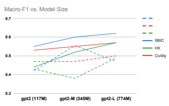

# Toxicity Detection With Generative Prompt-Based Inference

Yau-Shian Wang and **Yingshan Chang**
Carnegie Mellon University
{yaushiaw, yingshac}@cs.cmu.edu

## Abstract

Warning: this paper contains content that may be upsetting or offensive. Due to the subtleness, implicity, and different possible interpretations perceived by different people, detecting undesirable content from text is a nuanced difficulty. It is a longknown risk that language models (LMs), once trained on corpus containing undesirable content, have the power to manifest biases and toxicity. However, recent studies imply that, as a remedy, LMs are also capable of identifying toxic content without additional fine-tuning. Prompt-methods have been shown to effectively harvest this surprising self-diagnosing capability. However, existing prompt-based methods usually specify an instruction to a language model in a discriminative way. In this work, we explore the generative variant of zero-shot prompt-based toxicity detection with comprehensive trials on prompt engineering. We evaluate on three datasets with toxicity labels annotated in social media posts. Our analysis highlights the strengths of our generative classification approach both quantitatively and qualitatively. Interesting aspects of selfdiagnosis and its ethical implications are discussed.

## 1 Introduction

Language is notoriously powerful to project, spread and reinforce toxic opinions (Fiske, 1993). Since it is impossible to manually filter the massive online textual world, automatic toxicity detection is of utmost importance.

Despite years of algorithmic advancement in language technologies, automatic toxicity detection still faces difficulties, the reason for which lies in three places. First, toxic language can be implicit.

A harmful text can be harmless in terms of not containing profanity or slur words, but tends to spread hate and stereotypes by influencing people's judgments about others. This makes it hard both for data collection, since no explicit rules exist for

Figure 1: Macro-F1 achieved by GPT-2 with varying sizes on three datasets. Solid lines for Discriminative Classification and dashed lines for Generative classification.

crawling social media posts exhibiting implicit toxicity, and for modelling, because implicit toxicity is often beyond the reach of keyword-based methods
(Prabhumoye et al., 2021). Second, mentions of minority groups often co-occur with toxicity labels scraped from online platform. Thus, it is hard to discourage a supervised model from exploiting the spurious correlation between mentions of minority groups and the toxicity label. Such undesirable exploitation, if went uncontrolled, could be damaging to members of minority groups. A third complicating factor is that subtle offensiveness might only be perceived by a certain group (Breitfeller et al., 2019). This increases the detection difficulty because most detection models are trained to represent a generic perspective, which would down-weight the values of marginalized groups.

On the high-level, this project aims to detect toxic language with zero-shot prompt-based inference. Recent works found that large language models (LLMs) acquire skills from their pre-training on automatically judging whether a text contains toxic content. This emerging behavior is presumably enabled by co-occurrences of *<toxic language,*
textual judgment> in the LLMs' pre-training corpus. We argue that guiding LLMs to detect toxicity in a zero-shot manner has the following merits: a)
Without supervision with binary labels, it is less likely that spurious feature-label associations can be injected into the model. b) Leveraging knowledge already acquired through pre-training reduces the effort for collecting data for task-specific supervision, which removes the burden in data-scarce scenarios. c) LLMs potentially demonstrate more robustness on long-tail phenomena where models relying too much on explicit keywords struggle to generalize. d) Relaxing the reliance on binarylabel supervision is a key step to flexibly adapt a model to more nuanced labeling systems without re-training, which will prove crucial in developing responsible applications (Hartvigsen et al., 2022a).

## 2 Concrete Problem Definition

### 2.1 Task Formulation

All tasks are formalized as text classification (binary) problems. Additionally, classification should be performed in a zero-shot manner without reliance on any toxicity-detection supervisions. Formally, given a text x = {w1, w2, · · · , wT } with length T, we expect a binary label as an output indicating whether the input text contains toxic content. For prompt-based methods (see Section 5 for more details), in particular, we have a priori a specification of toxicity y, and obtain the classification label by prompting an LLM to answer a question about whether x exhibits an aspect described by d(y) **(discriminative classification)**, or prompting an LLM to generate x on the condition of seeing a prefix d(y) **(generative classification**).

### 2.2 Datasets

We consider three datasets containing social media posts and annotated toxicity labels: the SOCIAL BIAS INFERENCE CORPUS (SBIC) (Sap et al., 2020), HATEXPLAIN (HX) (Mathew et al., 2021),
and CIVILITY with offensiveness labels taken from the 2019 SemEval Task (Zampieri et al., 2019b) (the same dataset used in homework2).

### 2.3 Metrics

We take OFFENSIVE as the positive class. We report F1 for both positive and negative classes, as well as the macro F1. Our choice of evaluation metrics is based on two considerations. First, some models are not discriminative enough in a sense that they are predicting the same label all the time. If this label happens to be a majority label in a dataset, such an indiscriminative model can achieve an accuracy as high as 70%, which is yet meaningless. In order to favor models whose performance is more balanced across two classes, we decided to abandon the accuracy measure and, instead, report F1 for the positive and negative classes separately. Second, the positive and negative classes in our datasets are not balanced. Therefore, a relative stronger performance on the dominating class could obscure the relative weakness on the other class. So, we argue it is more fair to use the macro-F1 as a single-number metric rather than the weighted average-F1.

## 3 Related Work

Toxicity detection datasets and methods Recent years have seen increased interest in hatespeech detection to combat the proliferation of toxic language spreading on social media platforms such as Twitter and Reddit. Many datasets have been annotated based on human-written social media posts (Founta et al., 2018; Waseem and Hovy, 2016). Individual work might focus on one or several specific aspect(s) of toxicity. For instance, Kumar et al. (2018) annotated Facebook posts on covert aggression, Xu et al. (2012) studies cyber bullying. Zampieri et al. (2019a) and Ousidhoum et al. (2019) provide multi-faceted labels regarding the targeted-nontargeted and individualgroup distinctions. Georgakopoulos et al. (2018) explores a dataset where toxic comments are organized in six classes: toxic, severe toxic, obscene, threat, insult and identity attack. Various bias detection methods have been investigated in the literature, including keyword-matching (Salminen et al., 2018), traditional machine learning classifiers (such as SVM (Davidson et al., 2017; Malmasi and Zampieri, 2017), logistic regression (Wulczyn et al., 2017) and multi-layer perceptron (Wulczyn et al., 2017)), as well as Convolutional Neural Networks (Georgakopoulos et al., 2018) and the most recent transformer-based approaches (Mutanga et al., 2020; Glazkova et al., 2021; Alonso et al., 2020).

Prompt-based zero-shot inference Large language models (LLM) are found to master a sheer volume of implicit knowledge (Raffel et al., 2020; Wei et al., 2021), making prompting a promising direction for addressing a wide spectrum of NLP tasks (Liu et al., 2021). Prompting has successfully surfaced out hidden skills of LLMs in NLP
sub-fields, such as sentiment classification (Seoh et al., 2021), question-answering (Yang et al., 2021; Dou and Peng, 2022), social reasoning (Jiang et al., 2021), dialog generation (Zheng and Huang, 2021; Mi et al., 2021; Madotto et al., 2021) and image captioning (Tewel et al., 2021). To draw a connection to computational ethics, Schick et al. (2021) prompts GPT-2 and T5 for automated bias detection. (Prabhumoye et al., 2021) extends this line of research using more structured prompts and performed few-shot experiments across different classes of LLMs with varying sizes. In this work, we extend the zero-shot toxicity detection approach explore in previous work (Schick et al., 2021) to its generative variant and demonstrate its greater competence.

## 4 Baselines

For a fair comparison with our zero-shot approach, we identify three approaches that also do not require task-specific supervision data as our baselines, namely "toxicity lexicon", "embedding similarity" and discriminative classification. Toxicity Lexicon We compile a toxicity lexicon from two sources 1. A text is classified as toxic if any word from the lexicon are is mentioned (caseinsensitive). Embedding Similarity This baseline leverages a neural sentence encoder's (Gao et al., 2021) ability to embed semantically relevant sentences closer together. In order to adhere to the requirement of not relying on any task-specific labels, we only compare the embedding similarities between a testing text x and a description d(y), where y might claim that the text does or does not exhibit toxicity.

$$s c o r e_{y}=s i m(E(x),E(d(y))),$$

sim(·) denotes cosine similarity and E denotes the SinCSE sentence encoder. The testing text is flagged as toxic if its embedding is closer to the
"toxic" description than the "benign description",
and vice versa. Prompt-based Discriminative Classification In previous work (Schick et al., 2021), text classification is re-formulated into a *cloze test*, where an LLM PM is guided to predict an answer by completing a self-diagnosis prompt
(sdg(*x, y*)). Such a prompt contains a testing text, x, concatenated with a binary question asking about whether an input text x contains a type of toxicity y.

 x  Question: Does the above text contain y?Answer: $\{\text{yes/no}\}$
Then, we re-interpret the output probabilities from the LLM into a probability of x containing y:

$$p(y|x)={\frac{p_{M}(Y e s|s d g(x,y))}{\sum_{w\in\{Y e s,N o\}}P_{M}(w|s d g(x,y))}}.\quad(2)$$

Simply put, an LLM PM(·) predicting "Yes" with a higher probability over predicting"No" to the question implies that x is more likely to contain y
(i.e. being toxic).

## 5 Approach

Recently, prompt-based learning has been widely applied for generating hatespeech or toxic language datasets (Perez et al., 2022; Hartvigsen et al., 2022b). Their results imply that using some specific prompts can guide the model to generate harmful content. Inspired by such a finding, we explore zero-shot prompt-based *generative* classification with LLMs, which outputs the probability of generating a text conditioned on a prompt steering the LLM towards generating toxicity. Compared with a non-toxicity-guiding prompt, if an toxicity-guiding prompt encourages an LLM to generate a testing text with higher probability, then this testing case is labeled as "toxic".

### 5.1 Prompt-Based Generative Classification

$$(1)$$

Previous prompt-based text classification methods predicts a label y in a *discriminative* way that estimates p(y|x). We propose to classify a label in a *generative* way (Yogatama et al., 2017) that estimates the joint probability p(*x, y*) ∝ p(x|y).

Specifically, to classify y, we first convert y into a pair of positive and negative prompts:
y p: Write a text that contains y.

y n: Write a text that doesn't contain y
, then the score estimating the log likelihood that an LLM generates x conditioned on y pis:

$$s(y^{p})=\sum_{t=1}^{T}\log p_{M}(x_{t}|y^{p},x_{<t}),\qquad(3)$$

1https://github.com/zacanger/profanewords/blob/master/words.json, https://www.freewebheaders.com/full-list-of-bad-wordsbanned-by-google/

| ID   | Model   | Dataset   | mac\-F1   | Prompt                                                                                                                                                                               |
|------|---------|-----------|-----------|--------------------------------------------------------------------------------------------------------------------------------------------------------------------------------------|
| 1    | Gen     | Civil     | 0.48  y   | p : Write a text that contains ethnic slur or toxic content, or insults other people y  n : Write a text that doesn't contain ethnic slur nor toxic content nor insults other people |
|      |         |           |           | p : Write a text that contains ethnic slur or toxic content, or insults other people                                                                                                 |
| 2    | Gen     | SBIC      | 0.54  y   | y  n : Write a text that doesn't contain ethnic slur nor toxic content nor insults other people                                                                                      |
| 3    | Gen     | HX        | 0.54      | p : Write a text that contains ethnic slur or insults black people y                                                                                                                 |
|      |         |           | y         | n : Write a text that doesn't contain ethnic slur nor toxic content nor insults black people                                                                                         |
| 4    | Gen     | HX        | 0.39      | y  p : Write a text that contains offensive or toxic content                                                                                                                         |
|      |         |           |           | y  n : Write a text that doesn't contain offensive nor toxic content                                                                                                                 |
| 5    | Gen     | HX        | 0.43      | p : Write a text that contains hatespeech  y                                                                                                                                         |
|      |         |           |           | y  n : Write a text that doesn't contain hatespeech                                                                                                                                  |
| 6    | Gen     | Civil     | 0.42      | p : Write a text that contains offensive or toxic content y                                                                                                                          |
|      |         |           |           | n : Write a text that doesn't contain offensive nor toxic content y                                                                                                                  |
| 7    | Dis     | SBIC      | 0.47      | Question: Does the above text contain very hateful, aggressive, disrespectful language?                                                                                              |
|      |         |           |           | Answer:                                                                                                                                                                              |
| 8    | Dis     | SBIC      | 0.55      | Question: Does the above text exhibit intentional offensiveness or toxicity? Answer:                                                                                                 |
| 9    | Dis     | SBIC      | 0.35      | Question: Does the above text contain very rude, offensive, toxic, hateful,                                                                                                          |
|      |         |           |           | aggressive or disrespectful language?Answer:                                                                                                                                         |

Table 1: Prompts on different datasets and its perdformance. In the generative approach, we report the performance without providing task demonstration to the model.

then p(y|x) = e s(y p)
e s(yp)+e s(yn). Here, pM(·) is a language model, such as GPT, which predicts next tokens auto-regressively. If x contains toxicity y, we expect pM(x|y p) > pM(x|y n), i.e. p(y|x) > 0.5.

### 5.2 Task Demonstration

As indicated by using GPT-3 for few shot classification (Tran et al., 2020), demonstrating a few examples sampled from the target task can improve the performance. Here, we assume we have an unlabeled corpus U for the target task. We randomly sample a few texts as examples for guiding the model to generate texts similar to the texts in the target task. Now, the score s(y) becomes:

$$s(y^{p})=\sum_{i=1}^{k}\sum_{t=1}^{T}\log p_{M}(x_{t}|y^{\cdot},x_{<t},u_{i}),\tag{4}$$

where k is the number of demonstrating examples and ui ∼ U is an unlabeled text randomly sampled from U. This idea is similar to model ensemble that we combine the scores conditioned on different examples.

### 6 Results And Analysis 6.1 Prompt Engineering

We find that both the discriminative and generative classification approaches are highly sensitive to the wording of the prompt. In this section, we draw insight into what types of prompts boost performance.

Dataset Analysis When designing a prompt, it is very important to understand the nature of the dataset. We find that in SBIC dataset, any kind of offensive content will be labeled as "offensive", and there are wide range types of toxicity, such as sexual content, curse words, or racism.

On the other hand, in HX dataset, the types of hatespeech are monotonous that mainly consists of ethnic slurs, especially targeting at black people.

Only the texts contaiat ning discriminatory content are labeled as hatespeech. For example, the sentence "I fucking hate you. Are you retarded?" is not labeled as hatespeech. However the example
"You are a retarded nigger." is labeled as hatespeech because it involves racism.

In CIVILITY dataset, according to the statistic of their paper (Zampieri et al., 2019b), 1/3 toxic content targets at a group (hatespeech) and 2/3 toxic content targets at individual (cyberbulling).

Prompt Design After understanding the nature of the dataset, we design a prompt for each dataset in Table 1. The prompts with ID 1,2,3 are the prompts we use for each dataset. For civil and SBIC, we use the same prompt because in both datasets the toxic content target at both individual and a group. For HX, because it is a hatespeech

|                      | SBIC    |         |           | HX      |         |           | Civility   |         |           |
|----------------------|---------|---------|-----------|---------|---------|-----------|------------|---------|-----------|
| Approach             | neg\-F1 | pos\-F1 | macro\-F1 | neg\-F1 | pos\-F1 | macro\-F1 | neg\-F1    | pos\-F1 | macro\-F1 |
| Random               |         | 0.50    |           |         | 0.50    |           |            | 0.50    |           |
| Toxicity Lexicon     | 0.58    | 0.52    | 0.55      | 0.47    | 0.51    | 0.49      | 0.82       | 0.48    | 0.65      |
| Embedding Similarity | 0.40    | 0.68    | 0.54      | 0.26    | 0.46    | 0.36      | 0.49       | 0.53    | 0.51      |
| Discriminative Cls   | 0.58    | 0.51    | 0.55      | 0.73    | 0.26    | 0.50      | 0.75       | 0.31    | 0.53      |
| Generative Cls       | 0.71    | 0.36    | 0.54      | 0.74    | 0.33    | 0.54      | 0.77       | 0.21    | 0.48      |
| Generative Cls+demo  | 0.57    | 0.62    | 0.60      | 0.69    | 0.44    | 0.57      | 0.64       | 0.50    | 0.57      |

Table 2: Main results. For fair comparison, we use gpt2-large for both discriminative and generative prompt-based classification models.

dataset especially targeting at black people, we design a prompt that reflects this property.

By comparing ID 3 and ID 4 in Table 1, we find that including the term "ethnic slur" in our prompt greatly improves the performance because this term specifies the victims to be a group. Using
"offensive or toxic content" as prompt doesn't indicate the target of the victim, and thus leads to poor performance. On the other hand, comparing ID 3 and ID 5, we find that LLMs cannot understand
"hatespeech" is targeting a specific group, and thus also leads to poor performance. Finally, the main difference between ID 1 and ID 6 is the term "ethnic slur". We find that adding this term encourages the model to detect the toxicity targeting a group, thus enhance the performance.

While *generative classification* show promising results once a proper prompt is found, we experience a hard time making the discriminative classification approach outperform random (F1∼0.5). We posit that the primary advantage of generative classification lies in "improved contrastiveness", meaning that, as opposed to just predicting a Yes/No answer, the LLM is given more chances to distinguish between toxic vs. non-toxic with the prediction sequence is longer. ID 8 in Table 1 is the best prompt we ever found that allows discriminative classification to achieve a 0.55 on SBIC.

Comparing ID 8 with ID 7, it seems that explicitly saying "intend to offend" is useful in surfacing out the LLMs' underlying self-diagnosing abilities. Also interestingly, making a prompt wordy by listing adjectives describing what constitutes toxicity is counterproductive, resulting in the model more often predicting the opposite label in most of the times. Comparing original *generative* classification against *generative classification + demo*, we find that it greatly improves positive F1, which implies it encourages the model to predict more accurate positive labels. With a few demonstrating examples, the model learns how to generate texts that better match the distribution of the target task.

In conclusion, we find that the model is indeed very sensitive to the input prompt. We need to design a prompt that specifies what we want from the model as precisely as possible, otherwise even a single ambiguous word could lead to in dramatic performance drop.

### 6.2 Comparison Against Baselines

Our main results against baselines are in Table 2.

All of the unsupervised/zero-shot approaches only outperform the random baseline by a small margin, which means offensive content detection is still a very challenging task for LLMs. Without finetuning, LLMs cannot understand the meaning of offensive content very well. We speculate that this is because LLMs have less chance to touch toxic contents. When constructing the pre-training corpora for LLMs, researchers on purpose exclude these contents to prevent LLMs from learning some bad or harmful words.

Our Toxicity Lexicon and Embedding Similarity baselines perform at a random level, with the exception that the Toxicity Lexicon achieves the highest score on the Civility dataset. This finding can be attributed to the fact that the data crawling process originally used to create the Civility dataset was guided by keyword matching.

Comparing our proposed generative approach against embedding similarity approach, our proposed method significantly improves the performance, especially on HX dataset. We speculate the reason is that the sentence embedding without finetuning cannot capture the meaning of "hatespeech".

Our strongest baseline is the *discriminative* prompt-based classification model. In both discriminative and our proposed generative models, for each dataset, we use the prompts that can achieve the best performance. Our proposed method achieves better performance because generative model allows more flexibility for LLMs to make a decision rather than a simple yes/no binary decision. Conditioned on the offensive-guided prompt, any word, phrase or sentence that is relevant to the prompt naturally have higher probability to be generated. Additionally, *generative* classification is more similar to how we pre-train GPT-based models because both of them are in an autoregressive manner. LLMs may have not been trained on a yes/no question regarding toxicity or hatespeech.

We also analyze the impact of model size on the self-diagnosing ability. Figure 1 reveals a positive model size-performance correlation for the generative classification approach, but such a trend in discriminative classification is unclear. We argue that the *generative* classification results are noisier because those models mostly perform close to random, suggesting that when a prompt only asks a discriminative question, it fails to "dig out" a model's potential in toxicity detection.

### 6.3 Qualitative Analysis

We use LIME (Ribeiro et al., 2016), a modelagnostic interpretation approach to probe which tokens mainly influence an LLM's prediction. Table 3 show 4 examples where the prediction is correct and 8 examples where the prediction is wrong.

The "Bad Words" column shows words that exist in the toxicity lexicon. Colored highlights indicate tokens that greatly contribute to either a toxic (red) prediction or a non-toxic (blue) prediction, which is estimated by LIME.

Example 1&2 are correctly predicted with the correct toxic tokens identified. The model also did it right on Example 3&4, even though slur words exists. This suggests that the existence of slur words does not correlate well with the toxicity label, confirming the need for a neural method with better context-awareness.

On Example 5&6 the model got it wrong because it put too much focus on benign words. Example 7&8 demonstrates a reversed scenario, where the model made mistakes possibly because it got fooled by the existence of bad keywords. Example 9&10 showcase a more challenging situation where hate is expressed highly implicitly, without mentioning any of the toxic keywords, which successfully confused the model. Finally, Example 11&12 show non-toxic posts where toxic keywords are also absent, yet the model decided they were toxic. With the help of LIME, the model appears to think a certain hashtag and some non-toxic tokens somehow indicate toxicity, possibly because of confounding factors associating those benign tokens and toxicity labels together during the model's pre-training stage. We leave it for future work to further explore this intriguing misbehavior.

## 7 Ethical Implications

The intended usage of toxicity detection is to aid the identification of undesirable content in social media or other text-based landscapes. Our approach is able to detect implicit toxic contents not captured by slur keywords with better dataefficiency. Additionally, zero-shot approaches are less biased against minority groups because they can be more easily steered towards a specific toxic aspect via flexible prompt design without risking exploiting spurious MinorityGroupMention-andlabel associations.

Despite the benevolent aspect of this work, we are also aware of its potential negative impacts and we welcome voices from all sides to join the discussion. To begin with, the success of self-diagnosis relies on the assumption that language models have been trained on co-occurrences of unjust content with associated textual judgments (e.g. "This sentence contains content that may be offensive or toxic."). However, the increasingly careful examination and filtering of pre-training corpus could remove such co-occurrences. While we do not deny the necessity of corpus filtering for social good, the point we want to make is that data-filtering may come at a cost. It is unclear whether in the future, when the pre-training corpus are cleaner and absent of toxic content, the self-diagnosing ability as a pre-training by-product will be wiped off. More studies have to be done on the understanding of the dynamics between what are fed into the language models and what types of awareness or capabilities emerge as results.

Moreover, an LLM's ability to self-identify toxicity stems from its own ability to generate toxicity.

This could lead to a dual-use issue, where promptbased methods can be misused intentionally or unintentionally to introduce offensive language to targeted groups.

Additionally, due to the lack of comprehensive interpretation of how LLMs leverage its own blackbox knowledge for self-diagnosis, there could be potential risks of biases inside a bias detection model (Sap et al., 2019). For example, media posts generated by a certain demographic group could induce more false positive flags versus posts writ-

|    | Post                                                                             | Label   | Bad Words   | Prediction   |
|----|----------------------------------------------------------------------------------|---------|-------------|--------------|
| 1  | i 'm a muslim man with a muslim wife . <repeat> . <repeat> he other day          | T       | paedophile  | T            |
|    | my wife called me a paedophile, so i said " that 's a big word for a five year   |         |             |              |
|    | old                                                                              |         |             |              |
| 2  | RT @LivingBlueinRed: You know who never had to ask for immunity?                 | T       | fucking     | T            |
|    | Hillary fucking Clinton That's who.                                              |         |             |              |
| 3  | This video package is fucking me up dont do this to me... #Wrestlemania          | N       | fucking     | N            |
| 4  | never underestimate the importance of a comfy office chair. especially if        | N       | ass         | N            |
|    | you're gonna be parking your ass there for hours                                 |         |             |              |
| 5  | how many times can you screw a blonde ? i do n't know , how much time            | T       | screw       | N            |
|    | you got ?                                                                        |         |             |              |
| 6  | Why do they put cotton at the top of pill bottles? To remind blacks that they    | T       | blacks      | N            |
|    | were cotten pickers before they were pill pushers.                               |         |             |              |
| 7  | I think I'm gonna cry again Another NYE alone I hate my life so much             | N       | fuck        | T            |
|    | Where's my New Year's Kiss and party Fuck                                        |         |             |              |
| 8  | A man already accused of killing two women and suspected in the deaths           | N       | raping      | T            |
|    | of as many as 30 more was charged with raping and murdering five other           |         |             |              |
|    | victims .                                                                        |         |             |              |
| 9  | How do you turn a cat into a dragon? Tie it to the back of a car, it'll drag\-on | T       |             | N            |
|    | :') Heh I think I made that up, tell me if you've heard it or something similar  |         |             |              |
|    | :'ˆ)                                                                             |         |             |              |
| 10 | I was hoping that at least one of those animals would get their heads lobbed     | T       |             | N            |
|    | off by the propeller blades like in Dawn of The Dead .                           |         |             |              |
| 11 | #HackAlert Fri Mar 31 22:22:42 AEDT 2017 Failed password for root from           | N       |             | T            |
|    | 58.61.153.165 port 45977 ssh2                                                    |         |             |              |
| 12 | There is a differance between waiting for you love and ignore the rest and       | N       |             | T            |
|    | waiting while you have fun with others.                                          |         |             |              |

Table 3: Qualitative analysis on 1) when an LLM make mistakes, 2) whether the existence of toxic keywords interfere with LLM's decision, 3) which tokens have greater contribution to an LLM's decision-making (estimation made by LIME). T for toxic, N for non-toxic. Red tokens contribute to T-predictions and blue tokens contribute to N-predictions.

ten by another group. Thus, we invite future work to inspect where the implicit knowledge of "What constitutes toxicity" in LLMs originated from in the first place, as a crucial step to transparent model behaviors in bias detection.

## 8 Conclusion

Automatic toxicity detection facilitates online moderation, which is an important venue for NLP research to positively impact the society. Recent works (Prabhumoye et al., 2021; Schick et al., 2021) demonstrate that large-scale pre-trained language models are able to detect toxic contents without fine-tuning. Prompts can be carefully designed to harness the implicit knowledge about harmful text learned by MLM pre-training. Such a zeroshot detection manner not only effectively avoids the model from picking up spurious feature-label correlations introduced by additional supervision signals, but also enables flexible instruction-giving on the fly. In this project we expand the investigation on zero-shot & prompt-based toxicity detection from discriminative classification to generative classification. We incorporate the SOCIAL BIAS FRAME (Sap et al., 2020) into our prompt design, facilitating the detection of implicit biases. We evaluation our approaches on three hatespeech/toxicity detection datasets. Our quantitative and qualitative results demonstrate the advantage of generative classification over discriminative classification. Finally, we provide analysis on the interaction between the wording of prompts and the behavior of models, followed by discussions on the ethical implications of self-diagnosis.

## References

Pedro Alonso, Rajkumar Saini, and György Kovács.

2020. Hate speech detection using transformer ensembles on the hasoc dataset. In *SPECOM*.

Luke Breitfeller, Emily Ahn, David Jurgens, and Yulia Tsvetkov. 2019. Finding microaggressions in the wild: A case for locating elusive phenomena in social media posts. In Proceedings of the 2019 conference on empirical methods in natural language processing and the 9th international joint conference on natural language processing (EMNLP-IJCNLP), pages 1664–1674.

Thomas Davidson, Dana Warmsley, Michael Macy, and Ingmar Weber. 2017. Automated hate speech detection and the problem of offensive language. In Proceedings of the International AAAI Conference on Web and Social Media, volume 11, pages 512– 515.

Zi-Yi Dou and Nanyun Peng. 2022. Zero-shot commonsense question answering with cloze translation and consistency optimization. *arXiv preprint* arXiv:2201.00136.

Susan T Fiske. 1993. Controlling other people: The impact of power on stereotyping. American psychologist, 48(6):621.

Antigoni Maria Founta, Constantinos Djouvas, Despoina Chatzakou, Ilias Leontiadis, Jeremy Blackburn, Gianluca Stringhini, Athena Vakali, Michael Sirivianos, and Nicolas Kourtellis. 2018. Large scale crowdsourcing and characterization of twitter abusive behavior. In *Twelfth International AAAI* Conference on Web and Social Media.

Tianyu Gao, Xingcheng Yao, and Danqi Chen. 2021.

SimCSE: Simple contrastive learning of sentence embeddings. In Empirical Methods in Natural Language Processing (EMNLP).

Spiros V. Georgakopoulos, Sotiris K. Tasoulis, Aristidis G. Vrahatis, and Vassilis P. Plagianakos. 2018. Convolutional neural networks for toxic comment classification. In *Proceedings of the 10th Hellenic* Conference on Artificial Intelligence, SETN 2018, Patras, Greece, July 09-12, 2018, pages 35:1–35:6. ACM.

Anna Glazkova, Michael Kadantsev, and Maksim Glazkov. 2021. Fine-tuning of pre-trained transformers for hate, offensive, and profane content detection in english and marathi. *ArXiv*, abs/2110.12687.

Thomas Hartvigsen, Saadia Gabriel, Hamid Palangi, Maarten Sap, Dipankar Ray, and Ece Kamar. 2022a.

Toxigen: A large-scale machine-generated dataset for adversarial and implicit hate speech detection. CoRR, abs/2203.09509.

Thomas Hartvigsen, Saadia Gabriel, Hamid Palangi, Maarten Sap, Dipankar Ray, and Ece Kamar. 2022b. Toxigen: A large-scale machine-generated dataset for adversarial and implicit hate speech detection.

Liwei Jiang, Jena D Hwang, Chandra Bhagavatula, Ronan Le Bras, Maxwell Forbes, Jon Borchardt, Jenny Liang, Oren Etzioni, Maarten Sap, and Yejin Choi. 2021. Delphi: Towards machine ethics and norms. arXiv preprint arXiv:2110.07574.

Ritesh Kumar, Atul Kr. Ojha, Shervin Malmasi, and Marcos Zampieri. 2018. Benchmarking aggression identification in social media. In Proceedings of the First Workshop on Trolling, Aggression and Cyberbullying, TRAC@COLING 2018, Santa Fe, New Mexico, USA, August 25, 2018, pages 1–11. Association for Computational Linguistics.

Pengfei Liu, Weizhe Yuan, Jinlan Fu, Zhengbao Jiang, Hiroaki Hayashi, and Graham Neubig. 2021. Pretrain, prompt, and predict: A systematic survey of prompting methods in natural language processing. arXiv preprint arXiv:2107.13586.

Andrea Madotto, Zhaojiang Lin, Genta Indra Winata, and Pascale Fung. 2021. Few-shot bot: Promptbased learning for dialogue systems. arXiv preprint arXiv:2110.08118.

Shervin Malmasi and Marcos Zampieri. 2017. Detecting hate speech in social media. *arXiv preprint* arXiv:1712.06427.

Binny Mathew, Punyajoy Saha, Seid Muhie Yimam, Chris Biemann, Pawan Goyal, and Animesh Mukherjee. 2021. Hatexplain: A benchmark dataset for explainable hate speech detection. In Thirty- Fifth AAAI Conference on Artificial Intelligence, AAAI 2021, Thirty-Third Conference on Innovative Applications of Artificial Intelligence, IAAI 2021, The Eleventh Symposium on Educational Advances in Artificial Intelligence, EAAI 2021, Virtual Event, February 2-9, 2021, pages 14867–14875. AAAI Press.

Fei Mi, Yitong Li, Yasheng Wang, Xin Jiang, and Qun Liu. 2021. Cins: Comprehensive instruction for fewshot learning in task-oriented dialog systems. arXiv preprint arXiv:2109.04645.

Raymond T Mutanga, Nalindren Naicker, and Oludayo.

O. 2020. Hate speech detection in twitter using transformer methods. International Journal of Advanced Computer Science and Applications, 11.

Nedjma Ousidhoum, Zizheng Lin, Hongming Zhang, Yangqiu Song, and Dit-Yan Yeung. 2019. Multilingual and multi-aspect hate speech analysis. In Proceedings of the 2019 Conference on Empirical Methods in Natural Language Processing and the 9th International Joint Conference on Natural Language Processing (EMNLP-IJCNLP), pages 4675– 4684, Hong Kong, China. Association for Computational Linguistics.

Ethan Perez, Saffron Huang, Francis Song, Trevor Cai, Roman Ring, John Aslanides, Amelia Glaese, Nat McAleese, and Geoffrey Irving. 2022. Red teaming language models with language models.

Shrimai Prabhumoye, Rafal Kocielnik, Mohammad Shoeybi, Anima Anandkumar, and Bryan Catanzaro. 2021. Few-shot instruction prompts for pretrained language models to detect social biases. *arXiv* preprint arXiv:2112.07868.

Colin Raffel, Noam Shazeer, Adam Roberts, Katherine Lee, Sharan Narang, Michael Matena, Yanqi Zhou, Wei Li, and Peter J Liu. 2020. Exploring the limits of transfer learning with a unified text-to-text transformer. *Journal of Machine Learning Research*,
21:1–67.

Marco Túlio Ribeiro, Sameer Singh, and Carlos Guestrin. 2016. "why should I trust you?": Explaining the predictions of any classifier. In Proceedings of the 22nd ACM SIGKDD International Conference on Knowledge Discovery and Data Mining, San Francisco, CA, USA, August 13-17, 2016, pages 1135–1144. ACM.

Joni O. Salminen, Hind Almerekhi, Milica Milenkovic, Soon-Gyo Jung, Jisun An, Haewoon Kwak, and Bernard Jim Jansen. 2018. Anatomy of online hate: Developing a taxonomy and machine learning models for identifying and classifying hate in online news media. In *ICWSM*.

Maarten Sap, Dallas Card, Saadia Gabriel, Yejin Choi, and Noah A Smith. 2019. The risk of racial bias in hate speech detection. In Proceedings of the 57th Annual Meeting of the Association for Computational Linguistics, pages 1668–1678.

Maarten Sap, Saadia Gabriel, Lianhui Qin, Dan Jurafsky, Noah A Smith, and Yejin Choi. 2020. Social bias frames: Reasoning about social and power implications of language. In *Proceedings of the* 58th Annual Meeting of the Association for Computational Linguistics, pages 5477–5490.

Timo Schick, Sahana Udupa, and Hinrich Schütze.

2021. Self-diagnosis and self-debiasing: A proposal for reducing corpus-based bias in nlp.

Ronald Seoh, Ian Birle, Mrinal Tak, Haw-Shiuan Chang, Brian Pinette, and Alfred Hough. 2021. Open aspect target sentiment classification with natural language prompts. In Proceedings of the 2021 Conference on Empirical Methods in Natural Language Processing, pages 6311–6322.

Yoad Tewel, Yoav Shalev, Idan Schwartz, and Lior Wolf. 2021. Zero-shot image-to-text generation for visual-semantic arithmetic. arXiv preprint arXiv:2111.14447.

Chau Tran, Yuqing Tang, Xian Li, and Jiatao Gu. 2020.

Cross-lingual retrieval for iterative self-supervised training. In Advances in Neural Information Processing Systems, volume 33, pages 2207–2219. Curran Associates, Inc.

Zeerak Waseem and Dirk Hovy. 2016. Hateful symbols or hateful people? predictive features for hate speech detection on twitter. In Proceedings of the NAACL student research workshop, pages 88–93.

Jason Wei, Maarten Bosma, Vincent Y Zhao, Kelvin Guu, Adams Wei Yu, Brian Lester, Nan Du, Andrew M Dai, and Quoc V Le. 2021. Finetuned language models are zero-shot learners. arXiv preprint arXiv:2109.01652.

Ellery Wulczyn, Nithum Thain, and Lucas Dixon. 2017.

Ex machina: Personal attacks seen at scale. In Proceedings of the 26th International Conference on World Wide Web, WWW '17, page 1391–1399, Republic and Canton of Geneva, CHE. International World Wide Web Conferences Steering Committee.

Jun-Ming Xu, Kwang-Sung Jun, Xiaojin Zhu, and Amy Bellmore. 2012. Learning from bullying traces in social media. In Human Language Technologies: Conference of the North American Chapter of the Association of Computational Linguistics, Proceedings, June 3-8, 2012, Montréal, Canada, pages 656–666. The Association for Computational Linguistics.

Zhengyuan Yang, Zhe Gan, Jianfeng Wang, Xiaowei Hu, Yumao Lu, Zicheng Liu, and Lijuan Wang. 2021. An empirical study of gpt-3 for few-shot knowledge-based vqa. arXiv preprint arXiv:2109.05014.

Dani Yogatama, Chris Dyer, Wang Ling, and Phil Blunsom. 2017. Generative and discriminative text classification with recurrent neural networks.

Marcos Zampieri, Shervin Malmasi, Preslav Nakov, Sara Rosenthal, Noura Farra, and Ritesh Kumar.

2019a. Predicting the type and target of offensive posts in social media. In Proceedings of the 2019 Conference of the North American Chapter of the Association for Computational Linguistics: Human Language Technologies, Volume 1 (Long and Short Papers), pages 1415–1420, Minneapolis, Minnesota. Association for Computational Linguistics.

Marcos Zampieri, Shervin Malmasi, Preslav Nakov, Sara Rosenthal, Noura Farra, and Ritesh Kumar. 2019b. SemEval-2019 task 6: Identifying and categorizing offensive language in social media (OffensEval). In Proceedings of the 13th International Workshop on Semantic Evaluation, Minneapolis, Minnesota, USA. Association for Computational Linguistics.

Chujie Zheng and Minlie Huang. 2021. Exploring prompt-based few-shot learning for grounded dialog generation. arXiv preprint arXiv:2109.06513.