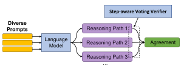
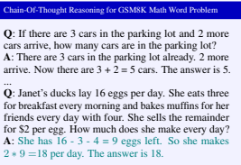
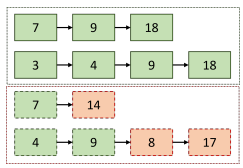
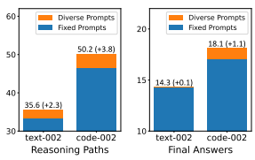
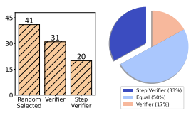
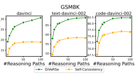
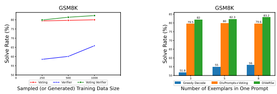

# Making Large Language Models Better Reasoners With Step-Aware Verifier

Yifei Li1,2∗
, Zeqi Lin2, Shizhuo Zhang2, Qiang Fu2**, Bei Chen**2, Jian-Guang Lou2**, Weizhu Chen**2 1 National Key Laboratory for Multimedia Information Processing, School of Computer Science, Peking University 2 Microsoft Corporation
{yifeili, zeqi.lin, v-shizzhang, qifu, bei.chen, jlou, wzchen}@microsoft.com liyifei@stu.pku.edu.cn

## Abstract

Few-shot learning is a challenging task that requires language models to generalize from limited examples. Large language models like GPT-3 and PaLM have made impressive progress in this area, but they still face difficulties in reasoning tasks such as GSM8K, a benchmark for arithmetic problems. To improve their reasoning skills, previous work has proposed to guide the language model with prompts that elicit a series of reasoning steps before giving the final answer, achieving a significant improvement on GSM8K from 17.9% to 58.1% in problem-solving rate. In this paper, we present DIVERSE (Diverse Verifier on Reasoning Step), a novel approach that further enhances the reasoning capability of language models. DIVERSE has three main components: first, it generates diverse prompts to explore different reasoning paths for the same question; second, it uses a verifier to filter out incorrect answers based on a weighted voting scheme; and third, it verifies each reasoning step individually instead of the whole chain. We evaluate DIVERSE on the latest language model code-davinci-002 and show that it achieves new state-of-the-art results on six of eight reasoning benchmarks (e.g., GSM8K 74.4% → 83.2%).

## 1 Introduction

Large pretrained language models (PLMs) have shown remarkable performance on various natural language processing tasks, either by few-shot learning with prompts (Radford et al., 2019; Le Scao and Rush, 2021; Jin et al., 2022) or by fine-tuning (Houlsby et al., 2019; Hu et al., 2021; He et al., 2022). However, despite the increasing size and capacity of PLMs such as GPT-3 with 175B parameters (Brown et al., 2020) and PaLM with 540B parameters (Chowdhery et al., 2022), their reasoning abilities are still limited and often require mul-

Figure 1: Our proposed method, DIVERSE (Diverse

Verifier on Reasoning Step).

tiple steps to produce correct answers, especially for tasks involving arithmetic, commonsense, or inductive reasoning (Cobbe et al., 2021). Recent works (Wei et al., 2022; Zhou et al., 2022; Kojima et al., 2022; Lampinen et al., 2022) have demonstrated that PLMs possess some latent reasoning capabilities, but they need carefully designed prompts to activate them. For instance, Wei et al. (2022) proposed chain-of-thought reasoning, which inserts multi-step reasoning paths before generating the final answers, and achieved significant improvement on the GSM8K arithmetic benchmark
(Cobbe et al., 2021). Wang et al. (2022c) further introduced a voting mechanism to select the most consistent answer among different reasoning paths, and achieved state-of-the-art results on several reasoning benchmarks using the PaLM model (Chowdhery et al., 2022). Building on these successes, this paper continues this line of research and advances the reasoning capabilities of PLMs in three aspects, as illustrated in Figure 1. First, we propose to increase the diversity of reasoning paths by not only sampling from a single prompt, but also varying the prompt itself. We hypothesize that different prompts can elicit different ways of thinking, while the correct answer should be robust to these variations. Second, we propose to use a verifier to score the quality of each reasoning path and guide the voting mechanism. We argue that not all reasoning paths are equally good

∗Work was done during an internship at Microsoft Research Asia.

Figure 2: Chain-of-thought reasoning for GSM8K math word problem. The prompt is colored black and the reasoning path produced by the language model is colored teal. This reasoning path contains two reasoning steps.

or reliable, and some may contain errors or inconsistencies that can be detected by the verifier. Third, we propose to assign a fine-grained label to each step of the reasoning path and use a step-aware verifier to attribute the correctness or wrongness of the final answer to each step. We conjecture that some steps may be correct but followed by wrong steps or vice versa, and identifying these cases can help diagnose and improve the reasoning process.

We name our method as DIVERSE (diverse verifier on reasoning step) and evaluate it on eight reasoning benchmarks that require different types of reasoning skills. We use three OpenAI PLMs (davinci, *text-davinci-002*, and *code-davinci-002*)
and compare our results with recent state-of-the-art methods. We find that DIVERSE can consistently and significantly improve the performance of PLMs on these tasks, and achieve new state-of-the-art results on six of them1: GSM8K (74.4% → 83.2%),
AsDiv (81.9% → 88.7%), MultiArith (99.3% →
99.8%), SVAMP(86.6% → 87.0%), SingleEq
(79.5% → 94.9%), and CLUTRR (67.0% → 95.9%).

Our data is publicly available at https://github.

com/microsoft/DiVeRSe.

## 2 Diverse Verifier On Reasoning Step

Figure 1 shows the overview of DIVERSE. The key insights are three-fold: (1) leveraging diverse prompts to induce more diverse reasoning paths from the language models (Section 2.1); (2) training a *voting verifier* to better derive the final answers from multiple reasoning paths (Section 2.2);
(3) leveraging *step correctness* to further boost the voting verifier (Section 2.3).

### 2.1 Diverse Prompts

To reason effectively, it is beneficial to explore diverse reasoning paths, following the idea that
"*All Roads lead to Rome*". Wang et al. (2022c)
proposed to generate various reasoning paths from language models by *sampling decoding*. However, their method relies on a fixed set of exemplars for all prompts, which may introduce bias and limit the diversity of the generated reasoning paths. To address this issue, we randomly select M1 different prompts for each question, and then sample M2 reasoning paths for each prompt using sampling decoding. This way, we obtain M = M1 × M2 diverse reasoning paths for each question.2

### 2.2 Voting Verifier

Verifier. The verifier takes a question and a candidate reasoning path as input, and outputs the probability that the reasoning path leads to the correct answer. We use *deberta-v3-large* (He et al., 2021) as the backbone model, with a small scalar head that outputs predictions on the [CLS] token. Training the verifier. For each training question, we generate multiple candidate reasoning paths using chain-of-thought reasoning. We regard the reasoning paths that match the ground truth final answer as positive, and the others as negative.

Voting Verifier. Wang et al. (2022c) use majority voting to aggregate the predictions of different reasoning paths. This method may fail when the majority of the reasoning paths are misled, while the minority of the reasoning paths are reasonable.

We propose *voting verifier*, which leverages both voting and *verifier*:

$$\hat{\mathbf{y}}=\arg\max_{\mathbf{y}}\sum_{i=1}^{M}\mathbbm{1}_{\mathbf{y}_{i}=\mathbf{y}}\cdot f(\mathbf{x}_{i},\mathbf{z}_{i},\mathbf{y}_{i}),\quad(1)$$  $\mathbbm{1}_{\mathbf{y}_{i}=\mathbf{y}}$ is an indicator function that returns $1$.  
where 1yi=y is an indicator function that returns 1
(or 0) if yi = y (or not), and f(·) is the probability produced by the verifier.

### 2.3 Step-Aware Voting Verifier

Each reasoning path consists of several steps. We hypothesize that not all the steps in an incorrect 2Our main experiments use M1 = 5 and M2 = 20.

1Most of the previous SOTA results were achieved by selfconsistency on PaLM-540B(Chowdhery et al., 2022).

Figure 3: How step-level labels are extracted. This

 figure shows four reasoning paths for a math word problem: the first two are positive and the bottom two are negative. The path 7 → 9 → 18 means that the first step calculates 7, the second step calculates 9, and the third step calculates the final answer 18. For the last path, the third step (which calculates 8) has never occurred in any positive reasoning paths, thus we regard this step and all steps after it as negative steps.

reasoning path are equally wrong, and some steps may still be useful for reasoning. To exploit this, we extend the voting verifier to a step-aware voting verifier by introducing an extended loss function:

$$\begin{array}{c}{\cal L}={\cal L}_{0}+\alpha\cdot{\cal L}_{1},\\ \\ {\cal L}_{1}=\sum_{i=1}^{|D|}\sum_{j=1}^{|S_{i}|}\mbox{BCE}(\mbox{label}_{i,j},f^{\prime}(\mbox{input}_{i},j)).\end{array}\tag{2}$$

α is a hyperparameter to balance the original loss L0 and the step-level auxiliary loss L1; Si,1, Si,2*, ..., S*i,|Si| are the steps in zi; labeli,j indicates whether Si,j is correct or not; f
′(inputi, j)
represents the probability of the positive label for Si,j .

3 To obtain the step-level labels (i.e., labeli,j ) for negative training data with wrong answers, we design an algorithm that compares intermediate results among steps in positive/negative reasoning paths. Figure 3 illustrates this algorithm. This algorithm can not only work on math word problems, but also generalize to other reasoning tasks: we use an off-the-shelf natural language inference model, *roberta-large-mnli* (Liu et al., 2019), to check whether two reasoning steps are semantically equivalent or not. Given a reasoning step, if we cannot find any semantically equivalent step in the positive reasoning paths, we label it and all the subsequent steps as negative steps.

## 3 Experimental Setup

### 3.1 Reasoning Tasks

Arithmetic Reasoning. Following Wang et al.

(2022c), we use AsDiv (Miao et al., 2020), SingleEq (Koncel-Kedziorski et al., 2015), MultiArith
(Roy and Roth, 2015), SVAMP (Patel et al., 2021),
and GSM8K (Cobbe et al., 2021). Commonsense Reasoning. Following Wang et al. (2022c), we use CommonsenseQA (Talmor et al., 2019) and StrategyQA (Geva et al., 2021). Inductive Reasoning. We use CLUTRR (Sinha et al., 2019), a diagnostic benchmark for inductive reasoning, requiring inferring kinship relations between characters in short stories.

### 3.2 Details

Language Models. We use three OpenAI language models: davinci, *text-davinci-002* and codedavinci-002. We use the default parameters except a temperature of 0.5 in sampling.

Exemplars. For arithmetic/commonsense/inductive reasoning, each prompt contains 5/7/7 exemplars. For DIVERSE, each question has 5 different prompts, and 20 reasoning paths are sampled from the language model for each prompt. For arithmetic reasoning, the exemplars are randomly sampled from the training dataset of GSM8K; for CLUTRR, the exemplars are sampled from its training dataset, with reasoning paths synthesized by handcraft rules (detailed settings for CLUTRR are listed in Appendix D); for StrategyQA and CommonsenseQA, their original datasets do not contain enough exemplars with well-annotated reasoning paths, so we construct 1, 000 pseudo exemplars by
"self-teaching" (the approach and the noise issue are discussed in Appendix B) from "seed" exemplars provided by Wei et al. (2022).

Training Datasets. For each task, we sample 1, 000 ⟨question, answer⟩ pairs from the training dataset to train the verifier. Verifier. We fine-tune *deberta-v3-large* (He et al.,
2021) with learning rate 1 × 10−5and batch size 128. For the step-aware verifier, we select the best α among 0.0/0.1/0.2/0.3.

3Specifically, f
′(inputi
, j) is predicted from the hidden state of the last token of Si,j in DEBERTA-V3-LARGE, similar to token classification tasks.

| Method                              | GSM8K        | AsDiv       | MultiArith   | SVAMP       | SingleEq     | CommonsenseQA   | StrategyQA   | CLUTRR       |
|-------------------------------------|--------------|-------------|--------------|-------------|--------------|-----------------|--------------|--------------|
| Previous SOTA (Fine\-tuning)        | 57a          | 75.3b       | 60.5c        | 57.4d       | 32.5e        | 91.2f           | 73.9g        | 67.0 h       |
| 9–12 year olds (Cobbe et al., 2021) | 60           | \-          | \-           | \-          | \-           | \-              | \-           | \-           |
| LaMDA 137B:                         |              |             |              |             |              |                 |              |              |
| Greedy Decode                       | 17.1         | 49.0        | 51.8         | 38.9        | 56.6         | 57.9            | 65.4         | \-           |
| Self\-Consistency                   | 27.7         | 58.2        | 75.7         | 53.3        | \-           | 63.1            | 67.8         | \-           |
| PaLM 540B:                          |              |             |              |             |              |                 |              |              |
| Greedy Decode                       | 56.5         | 74.0        | 94.7         | 79.0        | 79.5         | 79.0            | 75.3         | \-           |
| Self\-Consistency                   | 74.4         | 81.9        | 99.3         | 86.6        | \-           | 80.7            | 81.6         | \-           |
| GPT\-3 davinci (175B):              |              |             |              |             |              |                 |              |              |
| Greedy Decode                       | 8.7          | 31.4        | 31.4         | 21.2        | 38.2         | 48.2            | 59.2         | 33.6         |
| Self\-Consistency                   | 18.9         | 52.8        | 68.6         | 44.6        | 59.6         | 57.4            | 65.6         | 42.5         |
| DIVERSE                             | 30.9 (+12.0) | 57.6 (+4.8) | 87.6 (+19.0) | 46.9 (+2.3) | 65.1 (+5.5)  | 75.0 (+17.6)    | 66.3 (+0.7)  | 92.5 (+50.0) |
| text\-davinci\-002:                 |              |             |              |             |              |                 |              |              |
| Greedy Decode                       | 37.1         | 60.8        | 70.7         | 60.0        | 73.3         | 65.5            | 57.8         | 32.4         |
| Self\-Consistency                   | 58.2         | 76.9        | 88.4         | 78.2        | 87.2         | 72.9            | 69.8         | 34.9         |
| DIVERSE                             | 70.2 (+12.0) | 83.5 (+6.6) | 96.4 (+8.0)  | 82.7 (+4.5) | 86.5 (\-0.7) | 79.2 (+6.3)     | 74.8 (+5.0)  | 93.8 (+58.9) |
| code\-davinci\-002:                 |              |             |              |             |              |                 |              |              |
| Greedy Decode                       | 55.3         | 75.5        | 88.8         | 70.5        | 87.5         | 73.4            | 72.0         | 32.9         |
| Self\-Consistency                   | 76.7         | 86.2        | 98.6         | 85.8        | 93.7         | 77.3            | 77.6         | 35.6         |
| DIVERSE                             | 82.3 (+5.6)  | 88.7 (+1.5) | 99.8 (+1.2)  | 87.0 (+1.2) | 94.9 (+1.2)  | 79.9 (+2.6)     | 78.6 (+1.0)  | 95.9 (+60.3) |

| Question                              | Self\-Consistency                                   | DIVERSE                                            |
|---------------------------------------|-----------------------------------------------------|----------------------------------------------------|
| [GSM8K] Mark decides to buy packs     | Mark bought 3 packs for $1800 each for a total of   | The cheaper cards are worth a total of 30 * 50 =   |
| of old magic cards and open them to   | $1800 * 3 = 5400 (68.1%) . He got 1 card worth      | 1500 (84.4%) . So all the cards together are worth |
| sell. He buys 3 packs for $1800 each. | $4000 and another card worth $1000 for a total of   | 1500 + 4000 + 1000 = 6500 (83.3%) . The cost       |
| He gets 1 card that is worth $4000    | $4000 + $1000 = $5000 (72.1%) . There were 30       |                                                    |
| and another card worth $1000. There   |                                                     | for the cards was 1800 * 3 = 5400 (80.1%) . So     |
| are 30 more cards worth an average    | more cards worth an average of $50 each for a total |                                                    |
| of $50 each. How much money profit    | of $50 * 30 = 1500 (63.7%) . Mark made a profit     | he made a profit of 6500 \- 5400 = 1100 (70.0%) .  |
|                                       |                                                     | The answer is 1100.                                |
| did he make?                          | of $5000 + $1500 = 6500 (40.5%) . The answer is     | Answer: 1100 (Correct)  Score: 91.2%               |
|                                       | 6500.                                               |                                                    |
|                                       | Answer: 6500 (Wrong)  Score: 62.3%                  |                                                    |

Table 1: The comparison of DIVERSE, Greedy Decode and *Self-Consistency*. The previous SOTA results (fine-tuned on non-gigantic pretrained transformers) are: a: Cobbe et al. (2021), b: Miao et al. (2020), c: Roy and Roth (2015), d: Pi et al. (2022), e: Hu et al. (2019a), f: Xu et al. (2021), g: Chowdhery et al. (2022), h: Sinha et al. (2019). The parameter number of either text-davinci-002 or *code-davinci-002* is hidden to us.

Table 2: A GSM8K example (*code-davinci-002*) with step-level scores given by the step-aware verifier. The scores can not only improve the performance but also help the understanding of where the reasoning paths start to be incorrect.

## 4 Main Results

Table 1 shows the overall experimental results. We mainly compare DIVERSE with two baselines: (1) greedily decoding a single reasoning path (Wei et al., 2022), referred to as *Greedy Decode*; (2)
sampling 100 reasoning paths, then select the final answer via majority voting (Wang et al., 2022c), referred to as *Self-Consistency*.

### 4.1 Effectiveness

Experimental results clearly demonstrate that DI- VERSE can bring significant and consistent improvements over recent strong baselines. The improvements are across different models (davinci, text-davinci-002 and *code-davinci-002*) as well as different reasoning skills (eight tasks in three reasoning skills). Taking GSM8K as an example, compared to *Greedy Decoding* and *Self-Consistency*,
DIVERSE brings improvements of 22.2%/12.0%
on davinci, 33.1%/12.0% on *text-davinci-002*, and 27.0%/5.6% on *code-davinci-002*. Compared to Self-Consistency, DIVERSE achieves average improvements of 5.6%/5.1%/54.3% on the three reasoning skills, respectively.

### 4.2 Comparing To Previous Sotas

In Table 1, we also compare DIVERSE with: (1) previous SOTA results based on fine-tuning; (2) recent SOTA results (Wei et al., 2022) based on PaLM (Chowdhery et al., 2022), a gigantic language model with 540 billion parameters.4 On all the five arithmetic reasoning tasks, DI-
VERSE (with *code-davinci-002*) achieves new SOTA results, with an average improvement of 6.2%. On the two commonsense reasoning tasks, the performance of DIVERSE is slightly lower
(−1.9%) than that of PaLM-based self-consistency. We speculate that the reason might be: these two commonsense reasoning tasks are multiple-choice tasks rather than open-ended generation tasks, re-

4DIVERSE can also be applied to PaLM, but PaLM is not publicly available.

| Method              | GSM8K   | CQA   | CLUTRR   |
|---------------------|---------|-------|----------|
| davinci:            |         |       |          |
| M1 = 1, M2 = 100    | 18.9    | 57.4  | 42.5     |
| M1 = 5, M2 = 20     | 21.3    | 57.5  | 45.9     |
| text\-davinci\-002: |         |       |          |
| M1 = 1, M2 = 100    | 58.2    | 72.9  | 34.9     |
| M1 = 5, M2 = 20     | 61.3    | 77.3  | 35.6     |
| code\-davinci\-002: |         |       |          |
| M1 = 1, M2 = 100    | 76.7    | 77.3  | 35.6     |
| M1 = 5, M2 = 20     | 80.0    | 78.8  | 43.8     |

| ⟨M1, M2⟩   |           |       | GSM8K   |
|------------|-----------|-------|---------|
| M1         | = 1, M2   | = 100 | 76.7    |
| M1         | = 5, M2   | = 20  | 80.0    |
| M1         | = 10, M2  | = 10  | 79.8    |
| M1         | = 100, M2 | = 1   | 73.0    |

Table 3: The effectiveness of diverse prompts (⟨5, 20⟩) compared to pure sampling decoding (Wang et al., 2022c), under majority voting.

Table 4: GSM8K majority voting results for different
⟨M1, M2⟩ settings on *code-davinci-002*.

sulting in more false-positive exemplars in the pseudo exemplar base (Details will be discussed in Section B.2). Regarding inductive reasoning, DI-
VERSE achieves a surprisingly good performance of 95.9% on the CLUTRR task, outperforming
(+28.9%) previous SOTA result with fine-tuning
(Sinha et al., 2019).5

## 5 Case Study

Table 2 shows an example of step-level scores given by the step-aware verifier. Steps in the correct reasoning path have relatively high scores, while the scores in the wrong reasoning path show where the path starts to be wrong. This indicates that besides improving the performance, the step-aware verifier can also bring interpretability to show the step-level correctness. We also show some extra examples of majority-voting in Table 10.

### 6 Analysis

We also conduct ablation experiments and analysis to investigate the keys to the success of DIVERSE.

Figure 4: Diverse prompts increase the diversity of GSM8K reasoning paths and their final answers. This is beneficial for the voting verifier. Left: the average number of distinct reasoning paths per question (we consider two reasoning paths to be the same if they have the same intermediate result chain as shown in Figure 3). Right: the average number of distinct final answers per question.

### 6.1 The Effectiveness Of Diverse Prompts

By diversifying both prompts and reasoning paths
(⟨M1 = 5, M2 = 20⟩), we consistently improve performance over the sampling decoding approach
(⟨M1 = 1, M2 = 100⟩) of Wang et al. (2022c), as shown in Table 3. Both methods use majority voting. Table 4 further reveals that neither only using diverse prompts nor only using sampling is optimal. In other words, the best performance is achieved by combining diverse prompts and sampling. Moreover, Figure 4 demonstrates that diverse prompts lead to more diverse reasoning paths. We hypothesize that this diversity contributes to the performance improvement by: (1) making correct results more distinguishable from varied errors during inference; and (2) providing more diverse negative samples for enhancing the verifier's generalizability during training.

### 6.2 The Effectiveness Of Voting Verifier

We compare three algorithms to conclude the agreement from diverse reasoning paths: majority voting, verifier, and voting verifier. Table 5 shows the results. Compared to majority voting, our voting verifier can significantly and consistently boost reasoning performance across different tasks and different language models. Verifier without voting often outperforms majority voting, but extending it to voting verifier can further boost the performance.

5Sinha et al. (2019) also introduced a method with 100%
accuracy. We do not take it into the comparison, as this method requires a domain-specific system with complicated rules to extract a knowledge graph for each input text.

| Method              | GSM8K   | CQA   | CLUTRR   |
|---------------------|---------|-------|----------|
| davinci:            |         |       |          |
| Voting              | 21.3    | 57.4  | 45.9     |
| Verifier            | 27.0    | 74.1  | 93.2     |
| Voting Verifier     | 30.6    | 75.0  | 92.5     |
| text\-davinci\-002: |         |       |          |
| Voting              | 61.3    | 77.3  | 35.6     |
| Verifier            | 62.7    | 77.9  | 93.8     |
| Voting Verifier     | 68.9    | 79.2  | 93.8     |
| code\-davinci\-002: |         |       |          |
| Voting              | 80.0    | 75.4  | 43.8     |
| Verifier            | 65.9    | 78.8  | 95.9     |
| Voting Verifier     | 82.3    | 78.8  | 95.9     |

Table 5: The effectiveness of voting verifier. All exepriments in this table use ⟨M1, M2⟩ = ⟨5, 20⟩.

(a) The number of correct reasoning paths containing redundant steps.

(b) With the step-aware mechanism, incorrect paths contain more correct steps.

Figure 5: Human evaluation on GSM8K shows the effectiveness of the step-aware mechanism for verifier.

### 6.3 The Effectiveness Of Step-Aware Verifier

We evaluate the impact of incorporating step-level information into the voting verifier of DIVERSE. Table 6 shows the performance of DIVERSE with and without the step-aware mechanism on both the GSM8K and the CommonsenseQA datasets. We find that *using the step-aware verifier improves the* performance in most of the experiments. The only exception is *code-davinci-002* on GSM8K, where the step-aware verifier slightly lowers the performance. We hypothesize that *code-davinci-002* is more capable of generating high-quality reasoning paths, and thus does not benefit much from the step-level information. Detailed Human Evaluation of Reasoning Steps.

We further analyze the quality of generated reasoning steps, by asking human annotators to judge

Figure 6: The distribution of error types in incorrect reasoning steps.

whether the GSM8K reasoning steps produced by DIVERSE (with/without step-aware mechanism) are good or not. Here "good" means not only correct formulas and calculation results but also textual fluency and logical coherence.

We further examine the quality of the reasoning steps generated by DIVERSE (with/without stepaware mechanism) for GSM8K, by asking human annotators to rate them based on correctness, fluency, and coherence. For each test question, we compare three reasoning paths produced by codedavinci-002: the one with the highest verifier score, the one with the highest step-aware verifier score, and a randomly chosen one. The annotators (master students) label any incorrect or unsatisfactory reasoning steps in each path (single-blind) and explain why. We collect annotations for 200 test questions, half of which have correct final answers from all three paths, and half of which have incorrect final answers from all three paths.

We find that **all the reasoning paths with correct**
final answers are also correct in every intermediate step, which shows that *code-davinci-002* can reliably generate accurate reasoning steps, not just lucky guesses. However, we also find that **many** of the correct reasoning paths have unnecessary steps. Figure 5(a) shows that 40% of the random paths have redundant steps, and the verifier can lower this percentage to 31%. We also find that the step-aware verifier can further eliminate redundant reasoning steps from 31% to 20%.

Furthermore, for the incorrect reasoning paths, we find that the step-aware mechanism helps produce more correct steps before making mistakes. For each failed test question, we compare the number of correct steps in the path with the highest verifier score and the path with the highest step-aware verifier score (by human evaluation). Figure 5(b)

|                        | GSM8K   | CommonsenseQA   |
|------------------------|---------|-----------------|
| davinci:               |         |                 |
| DIVERSE (without step) | 30.6    | 75.0            |
| DIVERSE (with step)    | 30.9    | 76.0            |
| text\-davinci\-002:    |         |                 |
| DIVERSE (without step) | 68.9    | 79.2            |
| DIVERSE (with step)    | 70.2    | 79.8            |
| code\-davinci\-002:    |         |                 |
| DIVERSE (without step) | 82.3    | 78.8            |
| DIVERSE (with step)    | 81.5    | 79.9            |

Table 6: The effectiveness of step-aware voting verifier, with ⟨M1, M2⟩ = ⟨5, 20⟩.

shows that for 33%/17% of the failed test cases, the step-aware verifier generates more/fewer correct steps than the verifier without the step-aware mechanism.

Step Error Types. Figure 6 shows the distribution of error types in the incorrect reasoning steps.

We see that 95% of the errors are caused by incorrect formulations (i.e., using wrong intermediate results or operators and generating invalid formulas, which lead to incorrect answers). We also see that, although *code-davinci-002* often makes division calculation errors (e.g., 10/3 = 3), both the verifier and the step-aware verifier can effectively assign low scores to such paths, thus improving the performance.

### 6.4 **How Many Diverse Outputs Do We Need?**

Figure 7 shows the accuracy at different M values, where M is the number of reasoning paths sampled from the 100 generated paths for each question. We observe that: (1) the accuracy increases with more reasoning paths, but the improvement becomes marginal at M ≥ 50; (2) DIVERSE outperforms self-consistency significantly and consistently at different M values.

### 6.5 How Many Training Data Do We Need?

DIVERSE requires a dataset with reasoning paths for training the verifier. Figure 8 shows how the size of this dataset affects the performance. We observe that: the performance is only reduced by about 2%, even if the size of training data is cut by 75% (from 1, 000 to 250). With the same reasoning paths, voting verifier performs better than majority voting, while verifier without voting causes significant performance drops.

lve R
ate 
(%

) 

So

Figure 7: GSM8K accuracy at different M values (how many reasoning paths are used for each question).

### 6.6 The Impact Of The Number Of Exemplars

We conduct experiments for k = 3/5/8 (k is the number of exemplars used in each prompt) on GSM8K. Figure 9 shows the results. We observe that: using 8 exemplars in each prompt can further boost the accuracy of GSM8K to 83.2%.

## 7 Related Work

Reasoning Skills. Researchers in the literature have proposed many benchmarks requiring various reasoning skills, including commonsense reasoning
(Zellers et al., 2018; Talmor et al., 2019; Bhagavatula et al., 2019; Geva et al., 2021) numerical reasoning (Dua et al., 2019), multi-hop reasoning
(Yang et al., 2018), arithmetic reasoning (Koncel-
Kedziorski et al., 2015; Roy and Roth, 2015; Miao et al., 2020; Patel et al., 2021; Cobbe et al., 2021), logical reasoning (Liu et al., 2020; Yu et al., 2020), inductive reasoning (Sinha et al., 2019) and tabular reasoning (Chen et al., 2020; Zhu et al., 2021). Reasoning with Symbolic Systems. Much research in the literature enhances the reasoning capabilities of machine learning systems by exploiting symbolic systems, including knowledge graphs (Mihaylov and Frank, 2018; Bauer et al.,
2018; Kundu et al., 2019; Wang et al., 2019; Lin et al., 2019; Ding et al., 2019; Feng et al., 2020; Wang et al., 2022b), or question taxonomies (Dua et al., 2019; Andor et al., 2019; Hu et al., 2019b; Wang et al., 2022a). Although these methods work well on specific benchmarks, they usually require domain-specific designs and human efforts, thus limiting the generalizability.

Reasoning via Language Models. This line of work aims to address reasoning tasks in a general sequence-to-sequence manner, empowered by reasoning-aware pre-training or fine-tuning of language models. For example, Deng et al. (2021)

 

Figure 8: DIVERSE performance (*code-davinci-002*)
on GSM8K with different sizes of the training dataset (without labeled reasoning paths).

Figure 9: DIVERSE performance (*code-davinci-002*) on GSM8K when each prompt contains 3/5/8 exemplars.

proposed to train the language model with crawled data from the internet; Asai and Hajishirzi (2020)
proposed a logic-guided data augmentation method to pre-train the language model; Shen et al. (2021); Cobbe et al. (2021) proposed to train a verifier to rank solutions sampled from fine-tuned language models; Geva et al. (2020); Yoran et al. (2022); Campagna et al. (2020); Wang et al. (2022a) proposed to equip language models with reasoning abilities by generating training examples with human-designed templates; Pi et al. (2022) proposed to inject reasoning capabilities into language models by continual pre-training on program execution data. Reasoning via Prompting Gigantic Language Models. Gigantic language models like GPT-3 (Brown et al., 2020) have demonstrated impressive few-shot learning capabilities in many tasks and have attracted many research interests on making gigantic language models better few-shot learners
(Zhao et al., 2021; Holtzman et al., 2021; Min et al.,
2021; Liu et al., 2022; Lu et al., 2021; Rubin et al., 2021; Min et al., 2022). However, these methods struggle to address tasks requiring reasoning skills. To mitigate this, recently there is a line of research that focuses on unleashing the reasoning capabilities of gigantic language models via better prompting strategies. Wei et al. (2022) proposed chainof-thought reasoning, of which the key insight is the insertion of multi-step reasoning paths before generating the final answers; Wang et al. (2022c)
proposed to improve chain-of-thought reasoning via *self-consistency*, of which the key insight is to conclude the most consistent answer from different reasoning paths sampled from the language model; Zhou et al. (2022); Creswell et al. (2022)
proposed to leverage gigantic language models to decompose questions into sub-questions, thereby addressing them in an iterative manner; Kojima et al. (2022) proposed that gigantic language models can even be good zero-shot reasoners, by designing prompts that can induce language models to do reasoning step-by-step; Lampinen et al. (2022) proposed building a prompt by selecting examples and explanations together, thus substantially improving performance over selecting examples alone. Despite their great successes, these works come with their limitations. This paper is a continuation of this line of research, focusing on diverse verifier on reasoning steps.

## 8 Conclusion And Future Work

In this paper, we present DIVERSE, a novel and general method to enhance the reasoning abilities of large language models. Our method builds on the idea of prompting language models with multistep reasoning paths, but introduces three key innovations: diverse prompts, voting verifier, and stepwise verifier. The latter is especially novel and effective, as it verifies each reasoning step separately and we provides a detailed analysis of the model's behavior in each step. We demonstrate the superiority of DIVERSE through extensive experiments. For instance, using *code-davinci-002*, our method achieves state-of-the-art performance on most reasoning tasks, surpassing the 540B PaLM model with previous prompting techniques.

There are many directions for our future work. (1) As discussed in Appendix B.2, we will continue to investigate how to reduce or recognize false positive pseudo exemplars. (2) We plan to investigate mechanisms to produce better diverse prompts than simple sampling. (3) We will extend DIVERSE to other tasks and continue to design better prompting techniques to elicit the power of gigantic language models.

## 9 Limitations

Computing Resources. Despite the surprising performance it achieves, our framework needs to be applied to large language models like GPT-
3 or PaLM. Inference with these models costs more time and budgets than fine-tuning models like RoBERTa (Liu et al., 2019).

Faithfulness. Although DIVERSE can significantly improve the accuracy of final answers, we still cannot guarantee that the reasoning paths produced by the language models are 100 percent faithful. This is the key challenge and future direction for this line of research (chain-of-thought reasoning). More Training Data. DIVERSE needs more labeled data with well-annotated reasoning paths to construct diverse prompts, and it also needs a training dataset for supervising the verifier. However, from another point of view, this limitation can also be regarded as a contribution that studies how chain-of-thought reasoning can be further improved if we have more training data than just a few exemplars. Human Evaluation of Reasoning Steps. We use human evaluation to measure the quality of the intermediate steps in reasoning paths since few current works provide reliable frameworks to evaluate the quality of reasoning steps.

## References

Daniel Andor, Luheng He, Kenton Lee, and Emily Pitler. 2019. Giving BERT a calculator: Finding operations and arguments with reading comprehension. In Proceedings of the 2019 Conference on Empirical Methods in Natural Language Processing and the 9th International Joint Conference on Natural Language Processing (EMNLP- IJCNLP), pages 5947–5952, Hong Kong, China.

Association for Computational Linguistics.

Akari Asai and Hannaneh Hajishirzi. 2020. Logicguided data augmentation and regularization for consistent question answering. In Proceedings of the 58th Annual Meeting of the Association for Computational Linguistics, pages 5642–5650, Online. Association for Computational Linguistics.

Lisa Bauer, Yicheng Wang, and Mohit Bansal.

2018. Commonsense for generative multi-hop question answering tasks. In Proceedings of the 2018 Conference on Empirical Methods in Natural Language Processing, pages 4220–4230, Brussels, Belgium. Association for Computational Linguistics.

Chandra Bhagavatula, Ronan Le Bras, Chaitanya Malaviya, Keisuke Sakaguchi, Ari Holtzman, Hannah Rashkin, Doug Downey, Scott Wen-tau Yih, and Yejin Choi. 2019. Abductive commonsense reasoning.

Tom Brown, Benjamin Mann, Nick Ryder, Melanie Subbiah, Jared D Kaplan, Prafulla Dhariwal, Arvind Neelakantan, Pranav Shyam, Girish Sastry, Amanda Askell, et al. 2020. Language models are few-shot learners. *Advances in neural* information processing systems, 33:1877–1901.

Giovanni Campagna, Agata Foryciarz, Mehrad Moradshahi, and Monica Lam. 2020. Zero-shot transfer learning with synthesized data for multidomain dialogue state tracking. In *Proceedings* of the 58th Annual Meeting of the Association for Computational Linguistics, pages 122–132, Online. Association for Computational Linguistics.

Wenhu Chen, Hanwen Zha, Zhiyu Chen, Wenhan Xiong, Hong Wang, and William Yang Wang.

2020. HybridQA: A dataset of multi-hop question answering over tabular and textual data. In Findings of the Association for Computational Linguistics: EMNLP 2020, pages 1026–1036, Online. Association for Computational Linguistics.

Aakanksha Chowdhery, Sharan Narang, Jacob Devlin, Maarten Bosma, Gaurav Mishra, Adam Roberts, Paul Barham, Hyung Won Chung, Charles Sutton, Sebastian Gehrmann, et al. 2022.

Palm: Scaling language modeling with pathways.

arXiv preprint arXiv:2204.02311.

Karl Cobbe, Vineet Kosaraju, Mohammad Bavarian, Jacob Hilton, Reiichiro Nakano, Christopher Hesse, and John Schulman. 2021. Training verifiers to solve math word problems. *arXiv* preprint arXiv:2110.14168.

Antonia Creswell, Murray Shanahan, and Irina Higgins. 2022. Selection-inference: Exploiting large language models for interpretable logical reasoning.

Xiang Deng, Yu Su, Alyssa Lees, You Wu, Cong Yu, and Huan Sun. 2021. ReasonBERT: Pretrained to reason with distant supervision. In Proceedings of the 2021 Conference on Empirical Methods in Natural Language Processing, pages 6112–6127, Online and Punta Cana, Dominican Republic. Association for Computational Linguistics.

Ming Ding, Chang Zhou, Qibin Chen, Hongxia Yang, and Jie Tang. 2019. Cognitive graph for multi-hop reading comprehension at scale.

In Proceedings of the 57th Annual Meeting of the Association for Computational Linguistics, pages 2694–2703, Florence, Italy. Association for Computational Linguistics.

Dheeru Dua, Yizhong Wang, Pradeep Dasigi, Gabriel Stanovsky, Sameer Singh, and Matt Gardner. 2019. DROP: A reading comprehension benchmark requiring discrete reasoning over paragraphs. In *Proceedings of the 2019* Conference of the North American Chapter of the Association for Computational Linguistics:
Human Language Technologies, Volume 1 (Long and Short Papers), pages 2368–2378, Minneapolis, Minnesota. Association for Computational Linguistics.

Yanlin Feng, Xinyue Chen, Bill Yuchen Lin, Peifeng Wang, Jun Yan, and Xiang Ren. 2020.

Scalable multi-hop relational reasoning for knowledge-aware question answering.

Mor Geva, Ankit Gupta, and Jonathan Berant. 2020.

Injecting numerical reasoning skills into language models. In Proceedings of the 58th Annual Meeting of the Association for Computational Linguistics, pages 946–958, Online. Association for Computational Linguistics.

Mor Geva, Daniel Khashabi, Elad Segal, Tushar Khot, Dan Roth, and Jonathan Berant. 2021. Did aristotle use a laptop? a question answering benchmark with implicit reasoning strategies.

Transactions of the Association for Computational Linguistics, 9:346–361.

Junxian He, Chunting Zhou, Xuezhe Ma, Taylor Berg-Kirkpatrick, and Graham Neubig. 2022.

Towards a unified view of parameter-efficient transfer learning. In International Conference on Learning Representations.

Pengcheng He, Xiaodong Liu, Jianfeng Gao, and Weizhu Chen. 2021. Deberta: Decodingenhanced bert with disentangled attention. In International Conference on Learning Representations.

Ari Holtzman, Peter West, Vered Shwartz, Yejin Choi, and Luke Zettlemoyer. 2021. Surface form competition: Why the highest probability answer isn't always right.

Neil Houlsby, Andrei Giurgiu, Stanislaw Jastrzebski, Bruna Morrone, Quentin De Laroussilhe, Andrea Gesmundo, Mona Attariyan, and Sylvain Gelly. 2019. Parameter-efficient transfer learning for nlp. In *International Conference on* Machine Learning, pages 2790–2799. PMLR.

Edward J Hu, Yelong Shen, Phillip Wallis, Zeyuan Allen-Zhu, Yuanzhi Li, Shean Wang, Lu Wang, and Weizhu Chen. 2021. Lora: Low-rank adaptation of large language models. arXiv preprint arXiv:2106.09685.

Minghao Hu, Yuxing Peng, Zhen Huang, and Dongsheng Li. 2019a. A multi-type multi-span network for reading comprehension that requires discrete reasoning. In Proceedings of the 2019 Conference on Empirical Methods in Natural Language Processing and the 9th International Joint Conference on Natural Language Processing (EMNLP-IJCNLP), pages 1596–1606.

Minghao Hu, Yuxing Peng, Zhen Huang, and Dongsheng Li. 2019b. A multi-type multi-span network for reading comprehension that requires discrete reasoning. In *Proceedings of the 2019* Conference on Empirical Methods in Natural Language Processing and the 9th International Joint Conference on Natural Language Processing (EMNLP-IJCNLP), pages 1596–1606, Hong Kong, China. Association for Computational Linguistics.

Woojeong Jin, Yu Cheng, Yelong Shen, Weizhu Chen, and Xiang Ren. 2022. A good prompt is worth millions of parameters: Low-resource prompt-based learning for vision-language models. In Proceedings of the 60th Annual Meeting of the Association for Computational Linguistics (Volume 1: Long Papers), pages 2763–2775, Dublin, Ireland. Association for Computational Linguistics.

Takeshi Kojima, Shixiang Shane Gu, Machel Reid, Yutaka Matsuo, and Yusuke Iwasawa. 2022.

Large language models are zero-shot reasoners.

Rik Koncel-Kedziorski, Hannaneh Hajishirzi, Ashish Sabharwal, Oren Etzioni, and Siena Dumas Ang. 2015. Parsing algebraic word problems into equations. Transactions of the Association for Computational Linguistics, 3:585–597.

Souvik Kundu, Tushar Khot, Ashish Sabharwal, and Peter Clark. 2019. Exploiting explicit paths for multi-hop reading comprehension. In Proceedings of the 57th Annual Meeting of the Association for Computational Linguistics, pages 2737–2747, Florence, Italy. Association for Computational Linguistics.

Andrew K Lampinen, Ishita Dasgupta, Stephanie CY Chan, Kory Matthewson, Michael Henry Tessler, Antonia Creswell, James L McClelland, Jane X Wang, and Felix Hill. 2022. Can language models learn from explanations in context? *arXiv preprint* arXiv:2204.02329.

Teven Le Scao and Alexander M Rush. 2021. How many data points is a prompt worth? In Proceedings of the 2021 Conference of the North American Chapter of the Association for Computational Linguistics: Human Language Technologies, pages 2627–2636.

Bill Yuchen Lin, Xinyue Chen, Jamin Chen, and Xiang Ren. 2019. KagNet: Knowledge-aware graph networks for commonsense reasoning. In Proceedings of the 2019 Conference on Empirical Methods in Natural Language Processing and the 9th International Joint Conference on Natural Language Processing (EMNLP- IJCNLP), pages 2829–2839, Hong Kong, China.

Association for Computational Linguistics.

Jiachang Liu, Dinghan Shen, Yizhe Zhang, Bill Dolan, Lawrence Carin, and Weizhu Chen. 2022.

What makes good in-context examples for GPT-
3? In *Proceedings of Deep Learning Inside Out*
(DeeLIO 2022): The 3rd Workshop on Knowledge Extraction and Integration for Deep Learning Architectures, pages 100–114, Dublin, Ireland and Online. Association for Computational Linguistics.

Jian Liu, Leyang Cui, Hanmeng Liu, Dandan Huang, Yile Wang, and Yue Zhang. 2020. Logiqa: A challenge dataset for machine reading comprehension with logical reasoning.

Yinhan Liu, Myle Ott, Naman Goyal, Jingfei Du, Mandar Joshi, Danqi Chen, Omer Levy, Mike Lewis, Luke Zettlemoyer, and Veselin Stoyanov. 2019. Roberta: A robustly optimized bert pretraining approach. arXiv preprint arXiv:1907.11692.

Yao Lu, Max Bartolo, Alastair Moore, Sebastian Riedel, and Pontus Stenetorp. 2021. Fantastically ordered prompts and where to find them:
Overcoming few-shot prompt order sensitivity.

Shen-Yun Miao, Chao-Chun Liang, and Keh-Yih Su. 2020. A diverse corpus for evaluating and developing english math word problem solvers. In Proceedings of the 58th Annual Meeting of the Association for Computational Linguistics, pages 975–984.

Todor Mihaylov and Anette Frank. 2018. Knowledgeable reader: Enhancing cloze-style reading comprehension with external commonsense knowledge. In Proceedings of the 56th Annual Meeting of the Association for Computational Linguistics (Volume 1: Long Papers), pages 821–
832, Melbourne, Australia. Association for Computational Linguistics.

Sewon Min, Mike Lewis, Luke Zettlemoyer, and Hannaneh Hajishirzi. 2021. Metaicl: Learning to learn in context.

Sewon Min, Xinxi Lyu, Ari Holtzman, Mikel Artetxe, Mike Lewis, Hannaneh Hajishirzi, and Luke Zettlemoyer. 2022. Rethinking the role of demonstrations: What makes in-context learning work?

Arkil Patel, Satwik Bhattamishra, and Navin Goyal.

2021. Are nlp models really able to solve simple math word problems? In Proceedings of the 2021 Conference of the North American Chapter of the Association for Computational Linguistics: Human Language Technologies, pages 2080–2094.

Xinyu Pi, Qian Liu, Bei Chen, Morteza Ziyadi, Zeqi Lin, Yan Gao, Qiang Fu, Jian-Guang Lou, and Weizhu Chen. 2022. Reasoning like program executors. *arXiv preprint arXiv:2201.11473*.

Alec Radford, Jeffrey Wu, Rewon Child, David Luan, Dario Amodei, Ilya Sutskever, et al. 2019. Language models are unsupervised multitask learners. *OpenAI blog*, 1(8):9.

Subhro Roy and Dan Roth. 2015. Solving general arithmetic word problems. In Proceedings of the 2015 Conference on Empirical Methods in Natural Language Processing, pages 1743–1752.

Ohad Rubin, Jonathan Herzig, and Jonathan Berant.

2021. Learning to retrieve prompts for in-context learning.

Jianhao Shen, Yichun Yin, Lin Li, Lifeng Shang, Xin Jiang, Ming Zhang, and Qun Liu. 2021. Generate & rank: A multi-task framework for math word problems. In Findings of the Association for Computational Linguistics: EMNLP 2021, pages 2269–2279.

Koustuv Sinha, Shagun Sodhani, Jin Dong, Joelle Pineau, and William L Hamilton. 2019. Clutrr:
A diagnostic benchmark for inductive reasoning from text. In Proceedings of the 2019 Conference on Empirical Methods in Natural Language Processing and the 9th International Joint Conference on Natural Language Processing
(EMNLP-IJCNLP), pages 4506–4515.

Alon Talmor, Jonathan Herzig, Nicholas Lourie, and Jonathan Berant. 2019. Commonsenseqa: A question answering challenge targeting commonsense knowledge. In *Proceedings of the 2019* Conference of the North American Chapter of the Association for Computational Linguistics:
Human Language Technologies, Volume 1 (Long and Short Papers), pages 4149–4158.

Siyuan Wang, Wanjun Zhong, Duyu Tang, Zhongyu Wei, Zhihao Fan, Daxin Jiang, Ming Zhou, and Nan Duan. 2022a. Logic-driven context extension and data augmentation for logical reasoning of text. In Findings of the Association for Computational Linguistics: ACL 2022, pages 1619–1629, Dublin, Ireland. Association for Computational Linguistics.

Xiaoyan Wang, edu Kapanipathi, Ryan Musa, Mo Yu, Kartik Talamadupula, Ibrahim Abdelaziz, Maria Chang, Achille Fokoue, Bassem Makni, Nicholas Mattei, and Michael Witbrock. 2019. Improving natural language inference using external knowledge in the science questions domain. In Proceedings of the Thirty-Third AAAI Conference on Artificial Intelligence and Thirty-First Innovative Applications of Artificial Intelligence Conference and Ninth AAAI Symposium on Educational Advances in Artificial Intelligence, AAAI'19/IAAI'19/EAAI'19. AAAI
Press.

Xiting Wang, Kunpeng Liu, Dongjie Wang, Le Wu, Yanjie Fu, and Xing Xie. 2022b. Multi-level recommendation reasoning over knowledge graphs with reinforcement learning. In The Web Conference 2022.

Xuezhi Wang, Jason Wei, Dale Schuurmans, Quoc Le, Ed Chi, Sharan Narang, Aakanksha Chowdhery, and Denny Zhou. 2022c. Self-consistency improves chain of thought reasoning in language models.

Jason Wei, Xuezhi Wang, Dale Schuurmans, Maarten Bosma, Ed Chi, Quoc Le, and Denny Zhou. 2022. Chain of thought prompting elicits reasoning in large language models. *arXiv* preprint arXiv:2201.11903.

Yichong Xu, Chenguang Zhu, Shuohang Wang, Siqi Sun, Hao Cheng, Xiaodong Liu, Jianfeng Gao, Pengcheng He, Michael Zeng, and Xuedong Huang. 2021. Human parity on commonsenseqa: Augmenting self-attention with external attention. *arXiv preprint arXiv:2112.03254*.

Zhilin Yang, Peng Qi, Saizheng Zhang, Yoshua Bengio, William Cohen, Ruslan Salakhutdinov, and Christopher D. Manning. 2018. HotpotQA: A dataset for diverse, explainable multi-hop question answering. In Proceedings of the 2018 Conference on Empirical Methods in Natural Language Processing, pages 2369–2380, Brussels, Belgium. Association for Computational Linguistics.

Ori Yoran, Alon Talmor, and Jonathan Berant. 2022.

Turning tables: Generating examples from semistructured tables for endowing language models with reasoning skills. In Proceedings of the 60th Annual Meeting of the Association for Computational Linguistics (Volume 1: Long Papers), pages 6016–6031, Dublin, Ireland. Association for Computational Linguistics.

Weihao Yu, Zihang Jiang, Yanfei Dong, and Jiashi Feng. 2020. Reclor: A reading comprehension dataset requiring logical reasoning.

Eric Zelikman, Yuhuai Wu, and Noah D Goodman.

2022. Star: Bootstrapping reasoning with reasoning. *arXiv preprint arXiv:2203.14465*.

Rowan Zellers, Yonatan Bisk, Roy Schwartz, and Yejin Choi. 2018. SWAG: A large-scale adversarial dataset for grounded commonsense inference. In Proceedings of the 2018 Conference on Empirical Methods in Natural Language Processing, pages 93–104, Brussels, Belgium. Association for Computational Linguistics.

Tony Z. Zhao, Eric Wallace, Shi Feng, Dan Klein, and Sameer Singh. 2021. Calibrate before use: Improving few-shot performance of language models.

Denny Zhou, Nathanael Schärli, Le Hou, Jason Wei, Nathan Scales, Xuezhi Wang, Dale Schuurmans, Olivier Bousquet, Quoc Le, and Ed Chi. 2022. Least-to-most prompting enables complex reasoning in large language models.

Fengbin Zhu, Wenqiang Lei, Youcheng Huang, Chao Wang, Shuo Zhang, Jiancheng Lv, Fuli Feng, and Tat-Seng Chua. 2021. Tat-qa: A question answering benchmark on a hybrid of tabular and textual content in finance.

[STRATEGYQA] Yes or no: Could a llama birth twice during War in Vietnam (1945-46)? ▷ The War in Vietnam was 6 months. The gestation period for a llama is 11 months. So a llama could not give birth twice during the War in Vietnam. The answer is no.

[CLUTRR] Roy was eating lunch with his son John and his wife Mary. What kind of relative is John to Mary? ▷ John is the son of Roy. Roy is the husband of Mary. Thus, John is the son of Mary. The answer is son.

Table 7: Besides arithmetic reasoning, we also investigate commonsense and inductive reasoning.

This is the Appendix for the paper: "On the Advance of Making Language Models Better Reasoners".

## A Preliminaries

Prompting. Prompting means prepending a few exemplars to the task input x and generating the output y from the pretrained language model:

$$p(\mathbf{y}|C,\mathbf{x})=\prod_{t=1}^{|\mathbf{y}|}p_{\mathrm{LM}}(y_{t}|C,\mathbf{x},y_{<t}),$$

where C is the concatenation of K exemplars:

$$C=(\overline{{{\bf x}}}_{1},\overline{{{\bf y}}}_{1});(\overline{{{\bf x}}}_{2},\overline{{{\bf y}}}_{2});...;(\overline{{{\bf x}}}_{K},\overline{{{\bf y}}}_{K}).\quad(4)$$

We denote **prompt** as the concatenation of the exemplars C and the input x. Reasoning Paths. For reasoning tasks that aim to generate an answer y for a question x, Wei et al. (2022) proposed the insertion of a reasoning path z before generating the answer y:

$$C^{\prime}=(\overline{{{\mathbf{x}}}}_{1},\overline{{{\mathbf{z}}}}_{1},\overline{{{\mathbf{y}}}}_{1});\ldots;(\overline{{{\mathbf{x}}}}_{K},\overline{{{\mathbf{z}}}}_{K},\overline{{{\mathbf{y}}}}_{K}),$$

where ziis a text **reasoning path** of how the answer yiis reasoned step-by-step for question xi.

Then, during inference, a reasoning path z will be generated before the answer y:

$$p(\mathbf{y}|C^{\prime},\mathbf{x})=p(\mathbf{z}|C^{\prime},\mathbf{x})\cdot p(\mathbf{y}|C^{\prime},\mathbf{x},\mathbf{z}).\quad(6)$$

Figure 10 demonstrates this idea in arithmetic reasoning (GSM8K), and Table 7 demonstrates this idea in commonsense reasoning (StrategyQA) and inductive reasoning (CLUTRR).

Prompt & Samples Q: If there are 3 cars in the parking lot and 2 more cars arrive, how many cars are in the parking lot? A: There are 3 cars in the parking lot already. 2 more arrive. Now there are 3 + 2 = 5 cars. The answer is 5. ... Q: Janet's ducks lay 16 eggs per day. She eats three for breakfast every morning and bakes muffins for her friends every day with four. She sells the remainder for $2 per egg. How much does she make every day? A: [Sample 1] She has 16 - 3 - 4 = 9 eggs left. So she makes 2 ∗ 9 =18 per day. The answer is 18. (✓)
[Sample 2] This means she uses 3 + 4 = 7 eggs every day. So in total she sells 7 * 2 =14 per day. The answer is 14. (%)
[Sample 3] She eats 3 for breakfast, so she has 16 - 3 = 13 left. Then she bakes muffins, so 13 - 4 = 9 eggs left. She makes 9 * $2 = $18. The answer is 18. (✓)
Figure 10: Prompting large language models to generate different reasoning paths, then selecting the final answer via majority voting (Wang et al., 2022c).

$$({\mathfrak{I}})$$

## B Boosting Reasoning Paths Via Self-Teaching

In this section, we first introduce self-teaching, the method we use to construct a larger exemplar base when the original dataset does not contain enough data with well-annotated reasoning paths
(Appendix B.1). We then discuss the noise issue when facing multiple-choice tasks (Appendix B.2).

### B.1 Self Teaching

$$(5)$$

A critical issue of DIVERSE is **how to provide**
diverse prompts.

6 Supposing that there is an exemplar base E, we can sample K exemplars from it to construct a prompt, and repeat this M1 times independently to construct M1 prompts with diverse exemplars. For scenarios that do not have sufficient exemplars (i.e., |E| < K ∗ M1), we propose to bootstrap the diversity of prompts by "self-teaching", i.e., generating pseudo reasoning paths from a few exemplars and some ⟨question, answer⟩ pairs without reasoning paths.7 Suppose that D is a dataset without reasoning paths, consisting of

6Wang et al. (2022c) tried an ensemble-based approach, i.e., to permutate exemplars in the original prompt. However, this strategy does not increase diversity in terms of exemplars.

7This is motivated by Zelikman et al. (2022).

| Dataset       | N    | Example Question                                                           |
|---------------|------|----------------------------------------------------------------------------|
| GSM8K         | 1319 | James decides to run 3 sprints 3 times a week. He runs 60 meters each      |
|               |      | sprint. How many total meters does he run a week?                          |
| AsDiv         | 2096 | Seven red apples and two green apples are in the basket. How many          |
|               |      | apples are in the basket?                                                  |
| MultiArith    | 600  | The school cafeteria ordered 42 red apples and 7 green apples for students |
|               |      | lunches. But, if only 9 students wanted fruit, how many extra did the      |
|               |      | cafeteria end up with?                                                     |
| SVAMP         | 1000 | Paco had 26 salty cookies and 17 sweet cookies. He ate 14 sweet cookies    |
|               |      | and 9 salty cookies. How many salty cookies did Paco have left?            |
| SingleEq      | 508  | Terez has 44 cows on his farm. 50 percent of the cows are female, and 50   |
|               |      | percent of the females are pregnant. How many pregnant female cows         |
|               |      | does Terez have?                                                           |
| CommonsenseQA | 3387 | Sammy wanted to go to where the people were. Where might he go?            |
|               |      | Options: (a) race track (b) populated areas (c) desert (d) apartment (e)   |
|               |      | roadblock                                                                  |
| StrategyQA    | 2280 | Could you go to New York Public Library and the Six Flags Great Escape     |
|               |      | in the same day?                                                           |
| CLUTRR        | 447  | Kelly and her mother Ernest made breakfast together. Constance and her     |
|               |      | husband Ernest wanted a child badly What kind of relative is Kelly to      |
|               |      | Constance? The possible relationships are: sister, son, aunt,              |
|               |      | granddaughter, father, grandfather, grandmother, mother\-in\-law, uncle,   |
|               |      | niece, mother, brother, daughter, nephew, grandson, son\-in\-law,          |
|               |      | father\-in\-law, daughter\-in\-law.                                        |

Table 8: Reasoning benchmarks we use in this paper with examples. N means the number of test cases.

(x, y
∗) pairs. Given the small exemplar base E, for each (x, y
∗) ∈ D, we can use prompting to generate a reasoning path z and the predicted answer y.

We define the pseudo exemplar base E′as:

E
′ = {(x, z, y)|(x, y
∗) ∈ D, y = y
∗}, (7)
then E ∪ E′can be regarded as the new exemplar base for generating diverse prompts.

### B.2 Noises In Multiple Choice Tasks

In our experimental setup, StrategyQA and CommonsenseQA are more challenging than other tasks, as they use pseudo exemplars generated through
"self-teaching" (Appendix B.1).

"Self-teaching" may lead to bad exemplars, whose reasoning paths are invalid but happen to yield answers coinciding with the ground truth. Questions in StrategyQA/CommonsenseQA are twochoice/four-choice questions, respectively. Therefore, such noise would be more serious in StrategyQA than in CommonsenseQA. This somehow explains why DIVERSE can achieve comparable performance (−0.8%) as the PaLM-based SOTA
on CommonsenseQA, while it sees a 3.0% performance decline to PaLM on StrategyQA, which has only two choices. In other words, it is easier for StrategyQA to yield a right answer but a misleading reasoning path.

## C Data Statistics

Table 8 shows the reasoning benchmarks we use in this paper with examples. We use the same test sets as Wei et al. (2022) for GSM8K, AsDiv, MultiArith, SVAMP, SingleEq, and CommonsenseQA.

For StrategyQA, there are 2, 290 test cases (i.e.,
questions paired with TRUE/FALSE labels), but there is no other case that can be leveraged by DIVERSE to construct diverse exemplars (as introduced in Section 2.1). To address this problem, we randomly divide these 2, 290 test cases into two equal parts (denoted as T1 and T2). For each DI-
VERSE experiment of SQA, we conduct two runs:
using T1 to construct diverse exemplars and T2 as the test set, and vice versa. The final reported solve rate is the average solve rate of these two runs.

For CLUTRR, Sinha et al. (2019) provided several versions: clean, supporting, *irrelevant*, and disconnected. The *clean* version is the basic dataset, while the others are the perturbed variations of it. Our experiments are conducted on the *clean* version.

## D Our Changes To Clutrr

In our experiments, two changes are applied to the CLUTRR benchmark: (1) appending candidate answers to each question; (2) constructing reasoning paths based on rules. Table 9 shows an example of CLUTRR data after our modification. Candidate Answers. Besides the original questions (e.g., "Mary, a female, took her husband who is a male, Roy, out for lunch. Ernest bought to dress for his father Roy. What kind of relative is Ernest to Mary?"), we also provide all the candidate answers (i.e., "The possible relationships are: sister, son, aunt, granddaughter, father, grandfather, grandmother, mother-in-law, uncle, niece, mother, brother, daughter, nephew, grandson, son-in-law, father-in-law, daughter-in-law") in the input sequence. Our preliminary experiments show that, the gigantic language models cannot reach more than 50% accuracy without the sequence of candidate answers. Reasoning Paths. For each question, Sinha et al. (2019) also provided a knowledge graph that formulates the relations directly mentioned in the question. Each knowledge graph consists of several
⟨e1*, r, e*2⟩ triplets, which means there is a relation r from e1 to e2. Take the aforementioned question as an example, the knowledge graph consists of two triplets: ⟨Mary, husband, Roy⟩ and ⟨Ernest, father, Roy⟩. For each question, we construct the reasoning path based on its knowledge graph. We first topologically sort all triplets in the knowledge graph. For each triplet, we convert it to a reasoning step using the template "{e2} is the {r*} of {*e1}". After that, we can get the reasoning path by concatenating these reasoning steps. Take the aforementioned question as an example, the reasoning path is: "Roy is the husband of Mary. Roy is the father of Ernest. Thus, Ernest is the son of Mary."

| Variant    | Input Example                                        |
|------------|------------------------------------------------------|
| CLUTRR     | Input: Story: Kelly and her mother Ernest made       |
| for NLI    | breakfast together.  Constance and her husband       |
| (Original) | Ernest wanted a child badly. Query: Kelly, Con                                                      |
|            | stance                                               |
|            | Output: daughter                                     |
| CLUTRR     | Input: Kelly and her mother Ernest made break                                                      |
| for NLG    | fast together. Constance and her husband Ernest      |
| (Ours)     | wanted a child badly. What kind of relative is Kelly |
|            | to Constance? The possible relationships are: sis                                                      |
|            | ter, son, aunt, granddaughter, father, grandfather,  |
|            | grandmother, mother\-in\-law, uncle, niece, mother,  |
|            | brother, daughter, nephew, grandson, son\-in\-law,   |
|            | father\-in\-law, daughter\-in\-law.                  |
|            | Output: Kelly is the daughter of Ernest. Ernest is   |
|            | the husband of Constance. Thus, Kelly is the         |
|            | daughter of Constance. So the answer is daughter.    |

the class information (marked with red) after the input question as the input, and constructed reasoning paths

Table 9: Examples of the original and our constructed CLUTRR data. In our experiments, we concatenated
(marked with blue) via a simple text template as the output.

| Question                              | Self\-Consistency                                    | DIVERSE                                            |
|---------------------------------------|------------------------------------------------------|----------------------------------------------------|
| [GSM8K] Siobhan has 2 fewer jewels    | Aaron has 2 more jewels than half of Raymond's       | Raymond has 40 jewels. Half of Raymond's jewels    |
| than Aaron. Aaron has 5 more jewels   | jewels. So Aaron has 40 / 2 + 2 = 22 jewels. Siob                                                      | is 40 / 2 = 20. Aaron has 5 more jewels than half  |
| than half of Raymond's jewels. If     | han has 2 fewer jewels than Aaron so she has 22 \- 2 | of Raymond's jewels, so he has 20 + 5 = 25 jewels. |
| Raymond has 40 jewels, how many       | = 20 jewels. So the answer is 20.                    | Siobhan has 2 fewer jewels than Aaron, so she has  |
| jewels does Siobhan have?             | Answer: 20 (Wrong)  Count: 33                        | 25 \- 2 = 23 jewels. So the answer is 23.          |
|                                       |                                                      | Answer: 23 (Correct)  Count: 32                    |
| [StrategyQA] Could you go to New      | The New York Public Library is in Manhattan. The     | The New York Public Library is in New York City.   |
| York Public Library and the Six Flags | Six Flags Great Escape is in Queensbury. Manhat                                                      | The Six Flags Great Escape is in Queensbury, New   |
| Great Escape in the same day?         | tan and Queensbury are too far apart to go to both   | York. Queensbury is about 3.5 hours away from      |
|                                       | in a single day. Thus, you could not go to New York  | New York City by car. Thus, you could go to the    |
|                                       | Public Library and the Six Flags Great Escape in     | New York Public Library and the Six Flags Great    |
|                                       | the same day. So the answer is no.                   | Escape in the same day. So the answer is yes.      |
|                                       | Answer: no (Wrong)  Count: 62                        | Answer: yes (Correct)  Count: 38                   |

Table 10: Examples of *code-davinci-002* on GSM8K. Compared to *self-consistency* (majority voting), DIVERSE can select the correct-but-not-most answer out of the sampled candidates, thus improving the reasoning performance.