# Pythae: Unifying Generative Autoencoders In Python A Benchmarking Use Case

Clément Chadebec Université Paris Cité, INRIA, Inserm, SU
Centre de Recherche des Cordeliers ∗
clement.chadebec@inria.fr Louis J. Vincent Implicity †
Université Paris Cité, INRIA, Inserm, SU
Centre de Recherche des Cordeliers ∗
louis.vincent@inria.fr Stéphanie Allassonnière Université Paris Cité, INRIA, Inserm, SU
Centre de Recherche des Cordeliers ∗
stephanie.allassonniere@inria.fr

## Abstract

In recent years, deep generative models have attracted increasing interest due to their capacity to model complex distributions. Among those models, variational autoencoders have gained popularity as they have proven both to be computationally efficient and yield impressive results in multiple fields. Following this breakthrough, extensive research has been done in order to improve the original publication, resulting in a variety of different VAE models in response to different tasks. In this paper we present **Pythae**, a versatile *open-source* Python library providing both a *unified implementation* and a dedicated framework allowing *straightforward*, reproducible and *reliable* use of generative autoencoder models. As an example of application, we propose to use this library to perform a case study benchmark where we present and compare 19 generative autoencoder models representative of some of the main improvements on downstream tasks such as image reconstruction, generation, classification, clustering and interpolation. The open-source library can be found at https://github.com/clementchadebec/benchmark_VAE.

## 1 Introduction

Over the past few years, generative models have proven to be a promising approach for modelling datasets with complex inherent distributions such a natural images. Among those, Variational AutoEncoders (VAE) [37, 56] have gained popularity due to their computational efficiency and scalability, leading to many applications such as speech modelling [10], clustering [24, 70], data augmentation [14] or image generation [54]. Similarly to autoencoders, these models encourage good reconstruction of an observed input data from a latent representation, but they further assume latent vectors to be random variables involved in the generation process of the observed data. This imposes a latent structure wherein latent variables are driven to follow a prior distribution that can then be used to generate new data. Since this breakthrough, various contributions have been made to enrich the original VAE scheme through new generating strategies [24, 65, 27, 5, 50], reconstruction objectives
[41, 61] and more adapted latent representations [30, 35, 66, 3, 14] to cite a few. A drawback of VAEs is that due to the intractability of the log-likelihood objective function, VAEs have to resort

∗15 Rue de l'École de Médecine, 75006 Paris †https://www.implicity.com - Implicity Paris, France.

36th Conference on Neural Information Processing Systems (NeurIPS 2022) Track on Datasets and Benchmarks.
to optimizing a lower bound on the true objective as a proxy, which has been mentionned as a major limitation of the model [11, 1, 30, 21, 71]. Hence, extensive research has been proposed to improve this bound through richer distributions [57, 55, 38, 13]. More recently, it has been shown that autoencoders can be turned into generative approaches through latent density estimation [27], extending the concept of *Generative AutoEncoders* (GAE) to a more general class of autoencoder models. Nonetheless, most of this research has been done in parallel across disjoint sub-fields of research and to the best of our knowledge little to no work has been done on homogenising and integrating these distinct methods in a common framework. Moreover, for many of the aforementioned publications, implementations may not be available or maintained, therefore requiring time-consuming re-implementation. This induces a strong bottleneck for research to move forward in this field and makes reproducibility challenging, which calls for the need of a unified generative autoencoder framework. To address this issue we introduce Pythae (**Pyth**on AutoEncoder), a versatile open source Python library for generative autoencoders providing unified implementations of common methods, along with a reproducible framework allowing for easy model training, data generation and experiment tracking. We then propose to illustrate the usefulness of the proposed library on a benchmark case study of 19 generative autoencoder methods on classical image datasets. We consider five different downstream tasks: image reconstruction and generation, latent vector classification and clustering, and image interpolation on three well known imaging datasets.

## 2 Variational Autoencoders

In this section, we recall the original VAE setting and present some of the main improvements that were proposed to enhance the model.

## 2.1 Background

Given x ∈ R
D, a set of observed variables deriving from an unknown distribution p(x), a VAE
assumes that there exists z ∈ R
dsuch that z is a latent representation of x. The generation process of

$x$ thus decomposes as  $$p_{\theta}(x)=\int_{\mathbb{Z}}p_{\theta}(x|z)p_{z}(z)dz\,,\tag{1}$$  where $p_{z}$ is the _prior distribution_ on the latent space $\mathbb{R}^{d}$. The distribution $p_{\theta}(x|z)$ is referred to as the _descend_ and is modelled with a similar parametric distribution whose parameters are given by 
the *decoder* and is modelled with a simple parametric distribution whose parameters are given by a neural network. Since the true posterior pθ(z|x) is most of the time intractable due to the integral in

Eq. (1) recourse to Variational Inference [32] is needed and a variational distribution qϕ(z|x) which we refer to as the encoder is introduced. The approximate posterior qϕ is again taken as a simple parametric distribution whose parameters are also modelled by a neural network. This allows to define an unbiased estimate pbθ of the marginal distribution pθ(x) using importance sampling with qϕ(z|x) i.e. pbθ(x) =  pθ(x|z)pz(z) qϕ(z|x)and Ez∼qϕ -pbθ = pθ. Applying Jensen's inequality leads to a lower bound on the likelihood given in Eq. (1): log Ez∼qϕ -pbθ(x) | {z } pθ(x) ≥ Ez∼qϕ -log pbθ(x)= Ez∼qϕ [log pθ(x|z)] | {z } reconstruction − DKL-qϕ(z|x)||pz(z) | {z } regularisation ,(2)
where DKL(p||q) is the Kullback-Leibler divergence between distributions p and q. This bound is referred to as the Evidence Lower Bound (ELBO) [37] and is used as the training objective to maximize in the traditional VAE scheme. It can be interpreted as a two terms objective [27] where the *reconstruction* loss forces the output of the decoder to be close to the original input x, while the regularisation loss forces the posterior distribution qϕ(z|x) outputted by the encoder to be close to the prior distribution pz(z). Under standard VAE assumption, the prior distribution is a multivariate standard Gaussian pz = N (0, Id), the approximate posterior is set to qϕ(z|x) = Nzµ(x), Σ(x)
where µ(x), Σ(x)are outputs of the encoder network.

## 2.2 Improvements Upon The Classical Vae Method

Building on the breakthrough of VAEs, several papers have proposed improvements to the model.

In this section we present 4 axes which we consider to be representative of the major advancements

$$(\mathbb{I})$$

made on VAEs, as well as classical models characterising the main improvements within each of these axes.

Improving the prior It has been shown that the role of the prior distribution pz is crucial in the good performance of the VAE [31] and choosing a family of overly simplistic priors can lead to over-regularization [20] and poor reconstruction performance [22]. In particular, it was shown that the prior maximizing the ELBO objective is the *aggregated posterior* q(z) = 1N
PN
i=1 qϕ(z|xi)
[65]. However, it should be noted that a perfect fit between the prior and the aggregated posterior is not necessarily desired since it has been shown in [6, 65] that it may lead to over-fitting as it essentially amounts to the model memorising the training set. Hence, multi-modal priors [48, 24, 65] were proposed, followed by hierarchical latent variable models [62, 39] and prior learning based approaches [17, 2] to address the poor expressiveness of the prior distribution and model richer generative distributions. Considering a specific geometry of the latent space also led to alternative priors taking into account geometrical aspects of the latent space [23, 25, 45, 3, 15, 59, 34, 14].

Another interesting approach proposed for instance in [66, 27] consists in using density estimation post training with another distribution or normalising flows [55] on the learned latent codes. Towards a better lower bound Another major axis of improvement of the VAE model has been to tighten the gap between the ELBO objective and the true log probability [11, 1, 30, 21, 71]. The ELBO objective can indeed be written as the difference between the true log probability and a KL
divergence between the approximate posterior and the true posterior

$${\mathcal{L}}_{\mathrm{ELBO}}(x)=\log p_{\theta}(x)-{\mathcal{D}}_{K L}\left[q_{\phi}(z|x)||p(z|x)\right].$$
$\left({3\over2}\right)$. 
LELBO(x) = log pθ(x) − DKL-qϕ(z|x)||p(z|x). (3)
Hence, if one wants to make the ELBO gap tighter, particular attention should be paid to the choice in the approximate posterior qϕ(z|x). In the original model, qϕ(z|x) is chosen as a simple distribution for tractability of the ELBO in Eq. (2). However, several approaches have been proposed to extend the choice of qϕ to a wider class of distributions using MCMC sampling [57] or normalising flows
[55]. For instance, Kingma et al. [38] improve upon the works of [55] with an inverse auto-regressive normalising flow (IAF), a new type of normalizing flow that better scales to high-dimensional latent spaces. With this objective in mind a Hamiltonian VAE aimed at targeting the true posterior during training with a Hamiltonian Monte Carlo [49] inspired scheme was proposed [13] and extended to Riemannian latent spaces in [14].

Encouraging disentanglement Although there is no clear consensus upon the definition of disentanglement, it is commonly referred to as the independence between features in a representation [46]. This is a desirable behaviour for VAEs, as it is argued that disentangled features may be more representative and interpretable [30]. In that regard, several approaches have been proposed encouraging a better disentanglement of the features in the latent space. Higgins et al. [30] first argue that increasing the weight of the KL divergence term in the ELBO loss enforces a higher disentanglement of the latent features as the posterior probability is forced to match a multivariate normal standard Gaussian. Following this idea, [12] propose to achieve disentanglement by gradually increasing the proximity between the posterior and the prior [12]. Other methods challenge the view that disentanglement can be achieved by simply forcing the posterior to match the prior, or raise the point that in this case disentanglement is achieved at the cost of a bad reconstruction. From these observations, new approaches arise such as [35] who augment the VAE objective with a penalty that encourages factorial representation of the marginal distributions, or [16] that enforce a penalty on the total correlation favouring disentanglement. Amending the distance between distributions It can be stressed that the reconstruction term Ez∼qϕ(z|x)[log pθ(x|z)] in eq. (2) has a crucial role in the reconstruction and that its choice should be dependent of the application. For instance, methods using a discriminator [41] or using a deterministic differentiable loss function [61] acting as a distance between the input data and its reconstruction were also proposed. The second term in the ELBO measures the distance between the approximate posterior and the prior distribution through the KL divergence and it has however been argued that other distances between probability distributions could be used instead. Hence, approaches using a GAN to distinguish samples from the posterior from samples from the prior distribution [44] or methods based on optimal transport have also been proposed [64, 72].

## 3 The Pythae Library

Why Pythae ? To the best of our knowledge, although some well referenced libraries grouping different Variational Auto-Encoder methods exist (*e.g.* [63]), there exists no framework providing both adaptable and easy-to-use unified implementations of state-of-the-art Generative AutoEncoder
(GAE) methods. This induces both a strong brake for reproducible research and democratisation of the models since implementations might be difficult to adapt to other use-cases, no longer maintained, or completely unavailable. Project vision Starting from this observation, we created **Pythae**, an open-source python library inspired from [53, 69] providing unified implementations of generative autoencoding methods, allowing for easy use and training of GAE models. Pythae is designed with the following points in mind:
- **Usable by all** Pythae makes GAE models accessible to all - beginners to experts. This means beginners can run *ready-to-use* models with a few lines of code, while more advanced users can easily access and adapt different methods to their specific use-cases, with custom encoder/decoder definition. Indeed, the library was designed to be flexible enough to allow users to use existing implementations on their own data, with custom model hyperparameters, training configurations and network architectures.

The library has an online documentation3and is also explained and illustrated through tutorials available either on a local machine or on the *Google Colab* platform [9].

- **Unified implementation** The brick-like structure of Pythae allows for seamless but efficient interchange between models, sampling techniques, network architectures, model hyperparameters and training schemes. Pythae is unit-tested ensuring code quality and continuous development with a code coverage of 98% as of release 0.6. The library is made available on pip and *conda* allowing an easy integration. Its development is performed through releases that ensure stable and robust implementations.

- **A reproducible research environment** Pythae is open to all and as such encourages transparent and reproducible research, as illustrated in the next section. With a variety of different interchangeable models gathered in a common library, it can be used as a sandbox for research and applications. Moreover, the library also integrates an easy-to-use experiment tracking tool (*wandb*) [8] allowing to monitor runs launched with Pythae and compare them through a graphic interface, and an online model sharing tool, the HuggingFace Hub, allowing to share models with peers.

- **Evolving and driven by the community** Pythae's design is intended to evolve with the addition of new models to enrich the existing model base. Furthermore, peers can contribute by reviewing and submitting models to enrich the library, a few of which have already been added at the time of this publication.

Code structure Pythae was thought for easy model training and data generation, while striving for simplicity with a quick and user-friendly model selection and configuration. The backbone of the library is the module *pythae.models* in which all the autoencoder models are implemented. Each model implementation is accompanied with a configuration *dataclass* containing any hyperparameters relative to the model and allowing easing configuration loading and saving from *json* files. All the models are implemented using a common API allowing for a seamless integration with pythae.trainers (for training) and *pythae.samplers* (for generation) along with a simplified usage as illustrated in Fig. 1. In particular, Pythae provides pipelines allowing to train an autoencoder model or to generate new data with only a few lines of code, as shown in Appendix. A. It mainly relies on the Pytorch [52] framework and in its basic usage only essential hyper-parameter configurations and data (arrays or tensors) are needed to launch a model training or generation. More advanced options allowing further flexibility such as defining custom encoder and decoder neural-networks are also available and can be found in the documentation and tutorials. It can adapt to various types of data through the use of different already-implemented or user provided encoder

3The full documentation can be found at https://pythae.readthedocs.io/en/latest/.
and decoder neural-network architectures. In addition, Pythae also provides several ways to generate new data through different popular sampling methods in the *pythae.samplers* module. We detail some aspects of the library in Appendix. A.

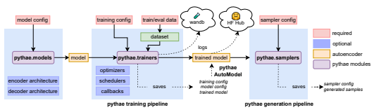

Figure 1: Pythae library diagram

## 4 Case Study Benchmark

By nature of its structured framework, Pythae allows for easy comparison between models on any chosen task. As an illustrative purpose, we propose a case study where we use Pythae to perform a straightforward benchmark comparison of models implemented in Pythae on a selection of wellknown elementary tasks. The aim of these tasks is to underline general trends within groups of GAEs, based on common behaviours, as well as judge the versatility of the models. However, this benchmark should not be considered as a means to rank models on these tasks, as performances depend on sometimes complex hyper-parameter tuning and training, which we consider to be outside of the scope of this benchmarking use case. The scripts used for the benchmark are provided in supplementary materials.

## 4.1 Benchmark Setting

In this section, we present the setting of the benchmark. Comprehensive results for all the experiments are available through the monitoring tool [8] used in Pythae to allow complete transparency. The data To perform the different tasks presented in this paper, 3 classical and widely used image datasets are considered: MNIST [42], CIFAR10 [40] and CELEBA [43]. These datasets are publicly available, widely used for generative model related papers and have well known associated metrics in the literature. Each dataset is split into a train set, a validation set and a test set. For MNIST and CIFAR10 the validation set is composed of the last 10k images extracted from the official train set and the test set corresponds to the official one. For CELEBA, we use the official train/val/test split. The models We propose to compare 19 generative autoencoder models representative of the improvements proposed in the literature and presented in Sec. 2.2. Descriptions and explanations of each implemented model can be found in Appendix. D. We use as baseline an Autoencoder (AE) and a Variational Autoencoder (VAE). To assess the influence of a *more expressive prior*, we propose using a VAE with VAMP prior (**VAMP**) [65] and regularised autoencoders with either a gradient penalty (**RAE-GP**) or a L2 penalty on the weights of the decoder (**RAE-L2**) that use *ex-post* density estimation [27]. To represent models trying to reach a *better lower bound*, we choose a Importance Weighted Autoencoder (**IWAE**) [11] and VAEs adding either simple linear normalising flows (**VAE-lin-NF**) [55] or using IAF (**VAE-IAF**) [38]. For *disentanglement-based models*, we select a β**-VAE** [30], a **FactorVAE** [35] and a β**-TC VAE** [16]. To stress the *influence of the distance* used between distributions we add a Wasserstein Autoencoder (WAE)[64] and an **InfoVAE** [72] with either Inverse Multi-Quadratic (IMQ) or a Radial Basis Function kernel (RBF) together with an Adversarial Autoencoder (AAE)[44], a **VAEGAN**[41] and a VAE using structural similarity metric for reconstruction (**MSSSIM-VAE**) [61]. Finally, we add a **VQVAE** [66] since having a discrete latent space has shown to yield promising results. Models implemented in Pythae requiring too much training time or more intricate hyper-parameter tuning were excluded from the benchmarks.

In the following, we will distinguish *AE-based* (autoencoder-based) methods (AE, RAE, WAE and VQVAE) from the other *variational-based* methods.

Training paradigm Each of the aforementioned models is equipped with the same neural network architecture for both the encoder and decoder leading to a comparable number of parameters 4. For each task, 10 different configurations are considered for each model, allowing a simple exploration of the models' hyper-parameters, leading to 10 trained models for each dataset and each neural network type (ConvNet or ResNet) leading to a total of 1140 models5. It is important to note that the hyper-parameter exploration is not exhaustive and models sensitive to hyper-parameter tuning may have better performances with a more extensive parameter search. The sets of hyper-parameters explored are detailed in Appendix. D for each model.

## 4.2 Experiments

In this section, we present the main results observed on 5 downstream tasks.

## 4.2.1 Fixed Latent Dimension

In this first part, latent dimensions are set to 16, 256 and 64 for the MNIST, CIFAR10 and CELEBA datasets respectively, as we observed those latent dimensions to lead to good performances. See results per model and across the 10 configurations specified in Appendix. D to assess the influence of the parameters on the tasks. Task 1: Image reconstruction For each model, reconstruction error is evaluated by selecting the configuration minimising the Mean Square Error (MSE) between the input and the output of the model on the validation set, while results are shown on the test set6. We show in Table. 1 the MSE and Frechet Inception Distance7(FID) [29] of the reconstructions from this model on the test set. It is important to note that using the MSE as a metric places models using different reconstruction losses (VAEGAN and MSSSIM-VAE) at a disadvantage. As expected, the autoencoder-based models seem to perform best for the reconstruction task. Nonetheless, this experiment also shows the interest of adding regularisation to the autoencoder since improvements over the AE (RAE-GP, RAE-L2) achieve better performance than the regular AE. Moreover, β-VAE type models demonstrate their versatility as small enough β values can lead to less regularisation, therefore favouring a better reconstruction. Task 2: Image generation We consider an image generation task with the trained models. In this experiment, we also explore different ways of sampling new data, either 1) using a simple distribution chosen as N (0, Id) and corresponding to the standard prior for variational approaches (N ); 2) fitting a 10 components mixture of Gaussian in the latent space post training as proposed in [27] (GMM), 3) fitting a normalising flow taken as a Masked Autoregressive Flow (MAF) [51] or 4) fitting a VAE in a similar fashion as [22]. For the MAF, two-layer MADE [26] are used. For each sampler, we select the models achieving the lowest FID on the validation set and compute the Inception Score8(IS) [58] and the FID on the test set9. It should be noted that although the use of IS and FID has been criticised
[4, 60, 18, 47, 33], we still choose to use those metrics for clarity's sake as they are within the most commonly used metrics for image generation on generative models. The main results are shown in Table. 3 for the normal and GMM sampler (see Appendix. D for the other sampling schemes).

One of the key findings of this experiment is that performing *ex-post* density (therefore not using the standard Gaussian prior) for the variational approach tends to almost always lead to better generation

4Some models may actually have additional parameters in their intrinsic structure *e.g.* a VQVAE learns a dictionary of embeddings, a VAMP learns the pseudo-inputs, a VAE-IAF learns auto-regressive flows. Nonetheless, since we work on images, the number of parameters remains in the same order of magnitude.

5The training setting (curves, configs ...) can be found at https://wandb.ai/benchmark_team/
trainings while detailed experimental set-up is available in Appendix. C.

6See the whole results at https://wandb.ai/benchmark_team/reconstructions 7We used the implementation of https://github.com/bioinf-jku/TTUR 8We used the implementation of https://github.com/openai/improved-gan 9See the whole results at https://wandb.ai/benchmark_team/generations
metrics even when a simple 10-components mixture of Gaussian is used. Interestingly, we note that when a more advanced density estimation model such as a MAF is used, results appear equivalent to those of the GMM (see Appendix. D). This may be due to the simplicity of the database we used and in consequence of the distribution of the latent codes that can be approximated well enough with a GMM. It should nonetheless be noted that the number of components in the GMM remains a key parameter which was set to the number of classes for MNIST and CIFAR10 since it is known, however too high a value may lead to overfitting while a low one may lead to worse results.

Task 3: Classification To measure the meaningfulness of the learned latent representations we perform a simple classification task with a single layer classifier as proposed in [19]. The rationale behind this is that if a GAE succeeds in learning a disentangled latent representation a simple linear classifier should perform well [7]. A single layer classifier is trained in a supervised manner on the latent embeddings of MNIST and CIFAR10. The train/val/test split used is the same as for the autoencoder training. For each model configuration, we perform 20 runs of the classifier on the latent embeddings and define the best hyper-parameter configuration as the one achieving the highest mean accuracy on these 20 runs on the validation set. We report the mean accuracy on the test set across the 20 runs for the selected configuration in Table. 2 (left)10. As expected, models explicitly encouraging disentanglement in the latent space such as the β-VAE
and β-TC VAE achieve better classification when compared to a standard VAE. Nonetheless, AE- based models seem again the best suited for such a task since variational approaches tend to enforce a continuous space, consequently bringing latent representations of different classes closer to each other. As a general observation, we can state that models with a more flexible prior achieve better results on this task.

Task 4: Clustering As a complement to the previous task, performing clustering directly in the latent space of the trained autoencoders can give insights on the quality of the latent representation. Indeed, a well defined latent space will maintain the separation of the classes inherent to the datasets, leading to easy and stable k-means performances. To do so, we propose to fit 100 separate runs of the k-means algorithm and we show the mean accuracy obtained on the train embeddings in Table. 2
(right)11. This experiment allows us to explore and measure the *clusterability* of the generated latent spaces [7]. To measure accuracy we assign the label of the most prevalent class to each cluster.

The conclusions of this experiment are slightly different from the previous one since models targeting disentanglement seem to be equalled by the original VAE. Interestingly, adversarial approaches and other alternatives to the standard VAE KL regularisation method seem to achieve the best results.

Task 5: Interpolation Finally, we propose to assess the ability of the model to perform meaningful interpolations. For this task, we consider a starting and ending image in the test set of MNIST and CIFAR10 and perform a linear interpolation in the generated latent spaces between the two encoded images. We show in Appendix. B the decoding along the interpolation curves. For this task, no metric was found relevant since the notion of "good" interpolation can be disputable. Nonetheless, the obtained interpolated images can be reconstructed and qualitatively evaluated. For this task, variational approaches were found to obtain better results as the inherent structure the posterior distribution imposes in the latent space results in a "smoother" transition from one image to another when compared to autoencoders that mainly superpose images, especially in higher dimensional latent spaces.

## 4.2.2 Varying Latent Dimension

An important parameter of autoencoder models which is too often neglected in the literature is the dimension of the latent space. We now propose to keep the same configurations as previously but re-evaluate Tasks 1 to 5 with the latent space varying in the range [16, 32, 64, 128, 256, 512]. Results are shown in Fig. 2 for MNIST and a ConvNet12 (see Appendix. D for CIFAR, ResNet and interpolations). For the generation task, we select the sampler with lowest FID on the validation set.

10See the whole results at https://wandb.ai/benchmark_team/classifications 11See the whole results at https://wandb.ai/benchmark_team/clustering 12MSSSIM-VAE was removed from this plot for visualisation purposes.
Assessing the influence of the latent dimension A clear difference in behaviour is exhibited between variational-based and AE-based methods. For each given task, AEs share a common trend with respect to the evolution of the latent dimension: a common optimal latent dimension within the range [16, 32, 64, 128, 256, 512] is found for each task, but differs drastically among different tasks (*e.g.* 512 for reconstruction, 16 for generation, either 16 or 512 for classification and 512 for clustering with the MNIST dataset). This suggests the existence of a common intra-group optimal latent space dimension for a given task. In addition, we observe that β-VAE type methods (with the right hyper-parameter choice) can exhibit similar behaviours to AE models. The same observation can be made for variational-based methods, where it is interesting to note that although lower performances are achieved, the apparent optimal latent dimension varies less with respect to the choice of the task. Therefore, a latent dimension of 16 to 32 appears to be the optimal choice for all 4 Tasks on the MNIST dataset, and 32 to 128 on the CIFAR10 dataset. It should be noted that unsupervised tasks such as clustering of the latent representation of the CIFAR10 dataset are hard and models are expected to perform poorly, leading to less interpretable results.

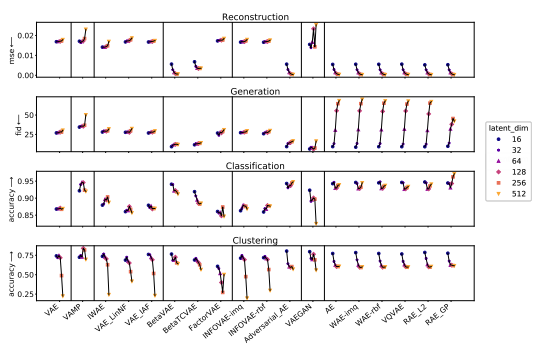 

Figure 2: *From top to bottom:* Evolution of the reconstruction MSE, generation FID, classification accuracy and clustering accuracy with respect to the latent space dimension on the MNIST dataset.

## 5 Conclusion

In this paper, we introduce **Pythae**, a new open-source Python library unifying common and stateof-the-art Generative AutoEncoder (GAE) implementations, allowing reliable and reproducible model training, data generation and experiment tracking. This library was designed as an open model testing environment driven by the community, wherein peers are encouraged to contribute by adding their own models, and by doing so favour reproducible research and accessibility to readyto-use GAE models. As an illustration of the capabilities of Pythae, we perform a benchmarking of 19 generative autoencoder models on 5 downstream tasks (image reconstruction, generation, classification, clustering and interpolation) leading to some interesting findings on the general behaviours of generative autoencoder models. We hope that the library will continue to be adopted by the community and expand thanks to the increasing number of contributions.

| Model        | MNIST (16)   |       |       | ConvNet   CIFAR10 (256)   |       | CELEBA (64)   | MNIST (16)   |       | CIFAR10 (256)   | ResNet   | CELEBA (64)   |        |
|--------------|--------------|-------|-------|---------------------------|-------|---------------|--------------|-------|-----------------|----------|---------------|--------|
|              | MSE ↓        | FID ↓ | MSE ↓ | FID ↓                     | MSE ↓ | FID ↓         | MSE ↓        | FID ↓ | MSE ↓           | FID ↓    | MSE ↓         | FID ↓  |
| VAE          | 16.85        | 30.71 | 16.24 | 218.66                    | 9.83  | 49.22         | 17.24        | 36.06 | 16.33           | 176.63   | 10.59         | 58.75  |
| VAMP         | 24.17        | 44.95 | 17.45 | 221.40                    | 10.81 | 51.64         | 17.11        | 37.58 | 16.87           | 177.03   | 11.50         | 60.89  |
| IWAE         | 14.14        | 34.28 | 16.19 | 237.14                    | 9.47  | 50.00         | 15.79        | 38.74 | 16.02           | 183.37   | 10.14         | 60.18  |
| VAE\-lin\-NF | 16.75        | 31.14 | 16.57 | 221.39                    | 9.90  | 49.84         | 17.23        | 36.74 | 16.59           | 177.08   | 10.68         | 58.73  |
| VAE\-IAF     | 16.71        | 30.64 | 16.33 | 223.65                    | 9.87  | 50.05         | 17.05        | 35.98 | 16.39           | 177.05   | 10.63         | 58.41  |
| β\-VAE       | 5.61         | 10.55 | 3.60  | 50.55                     | 7.28  | 46.96         | 5.87         | 15.81 | 2.40            | 55.67    | 7.78          | 51.59  |
| β\-TC VAE    | 6.78         | 14.11 | 5.06  | 53.49                     | 7.65  | 50.82         | 7.12         | 18.44 | 4.05            | 66.89    | 8.08          | 52.70  |
| Factor VAE   | 17.27        | 30.39 | 16.41 | 224.3                     | 10.16 | 53.61         | 18.13        | 37.97 | 16.55           | 176.8    | 10.93         | 59.46  |
| InfoVAE\-IMQ | 16.65        | 30.62 | 16.19 | 216.44                    | 9.81  | 50.51         | 17.17        | 37.33 | 16.32           | 173.79   | 10.63         | 58.04  |
| InfoVAE\-RBF | 16.59        | 30.63 | 16.23 | 217.52                    | 9.85  | 50.14         | 17.01        | 37.04 | 16.32           | 175.37   | 10.64         | 58.68  |
| AAE          | 5.59         | 10.87 | 2.60  | 40.66                     | 7.25  | 50.22         | 5.98         | 17.01 | 2.33            | 55.93    | 7.76          | 50.97  |
| MSSSIM\-VAE  | 32.60        | 37.91 | 39.42 | 276.70                    | 35.60 | 124.52        | 33.67        | 40.25 | 39.61           | 254.34   | 35.43         | 119.92 |
| VAEGAN       | 15.49        | 5.54  | 31.40 | 289.35                    | 8.91  | 86.58         | 23.25        | 11.35 | 30.22           | 300.07   | 9.32          | 86.32  |
| AE           | 5.47         | 11.61 | 2.82  | 41.98                     | 7.03  | 51.08         | 6.13         | 13.74 | 2.34            | 55.43    | 7.74          | 50.54  |
| WAE\-IMQ     | 5.55         | 11.29 | 2.81  | 41.79                     | 7.04  | 52.11         | 5.78         | 16.21 | 2.34            | 56.55    | 7.74          | 50.50  |
| WAE\-RBF     | 5.53         | 11.34 | 2.82  | 42.21                     | 7.03  | 51.43         | 5.80         | 16.14 | 2.34            | 56.00    | 7.74          | 51.38  |
| VQVAE        | 5.59         | 11.02 | 2.84  | 44.60                     | 7.06  | 52.27         | 6.00         | 15.27 | 2.34            | 55.84    | 7.73          | 50.29  |
| RAE\-L2      | 5.24         | 15.37 | 2.25  | 49.28                     | 6.90  | 53.98         | 5.76         | 17.27 | 2.35            | 57.85    | 7.74          | 51.07  |
| RAE\-GP      | 5.31         | 12.08 | 2.81  | 41.15                     | 7.06  | 51.85         | 5.83         | 15.69 | 2.34            | 56.71    | 7.76          | 51.36  |

Table 1: Mean Squared Error (10−3) and FID (lower is better) computed with 10k samples on the test set. For each model, the best configuration is the one achieving the lowest MSE on the validation set.

|              |              | Classification   |              |              |              |              | Clustering   |              |
|--------------|--------------|------------------|--------------|--------------|--------------|--------------|--------------|--------------|
| Model        |              | ConvNet          | ResNet       |              | ConvNet      |              |              | ResNet       |
|              | MNIST        | CIFAR10          | MNIST        | CIFAR10      | MNIST        | CIFAR10      | MNIST        | CIFAR10      |
| VAE          | 86.75 (0.05) | 32.61 (0.03)     | 86.80 (0.03) | 32.37 (0.03) | 69.71 (2.01) | 17.18 (0.68) | 74.21 (0.97) | 18.12 (0.74) |
| VAMP         | 92.17 (0.02) | 33.46 (0.17)     | 92.58 (0.04) | 33.03 (0.22) | 67.26 (1.25) | 24.03 (0.24) | 72.48 (0.96) | 23.35 (0.11) |
| IWAE         | 87.96 (0.04) | 31.86 (0.04)     | 88.18 (0.03) | 32.26 (0.04) | 63.93 (1.73) | 19.55 (0.67) | 73.66 (2.30) | 18.44 (0.86) |
| VAE\-lin\-NF | 86.04 (0.04) | 31.57 (0.02)     | 85.85 (0.05) | 31.74 (0.03) | 65.48 (2.76) | 17.09 (0.64) | 68.80 (3.65) | 18.74 (0.68) |
| VAE\-IAF     | 88.32 (0.02) | 33.52 (0.02)     | 87.91 (0.02) | 32.41 (0.02) | 75.31 (1.69) | 17.81 (0.73) | 76.11 (2.15) | 18.42 (0.66) |
| β\-TC VAE    | 90.96 (0.02) | 45.40 (0.05)     | 91.91 (0.02) | 42.17 (0.07) | 65.68 (0.91) | 24.14 (0.65) | 68.98 (2.67) | 25.57 (0.61) |
| Factor VAE   | 86.08 (0.06) | 31.38 (0.04)     | 83.44 (0.05) | 31.76 (0.04) | 51.02 (1.73) | 15.77 (0.60) | 60.79 (2.06) | 17.56 (0.68) |
| InfoVAE\-IMQ | 86.33 (0.04) | 32.48 (0.02)     | 86.31 (0.06) | 32.10 (0.05) | 68.17 (2.34) | 16.65 (0.80) | 71.31 (2.62) | 18.10 (0.79) |
| InfoVAE\-RBF | 85.94 (0.03) | 32.50 (0.03)     | 86.12 (0.04) | 31.67 (0.03) | 66.02 (1.14) | 16.22 (0.69) | 71.93 (1.91) | 18.61 (0.67) |
| AAE          | 93.28 (0.03) | 43.93 (0.07)     | 94.31 (0.03) | 40.62 (0.11) | 74.19 (3.22) | 24.72 (0.75) | 80.41 (2.09) | 24.76 (0.53) |
| MSSSIM\-VAE  | 78.30 (0.03) | 20.26 (0.06)     | 76.54 (0.03) | 20.24 (0.04) | 49.33 (1.32) | 11.70 (0.19) | 48.58 (1.37) | 11.70 (0.17) |
| VAEGAN       | 92.34 (0.02) | 26.56 (0.04)     | 90.31 (0.03) | 29.90 (0.03) | 77.29 (1.19) | 17.20 (0.45) | 79.67 (0.90) | 22.23 (0.44) |
| AE           | 93.81 (0.02) | 42.15 (0.07)     | 94.26 (0.03) | 40.47 (0.13) | 73.55 (0.60) | 23.19 (0.52) | 77.30 (0.84) | 23.18 (0.37) |
| WAE\-IMQ     | 93.60 (0.02) | 45.89 (0.07)     | 94.62 (0.03) | 41.35 (0.03) | 72.33 (2.92) | 23.81 (0.61) | 78.46 (3.48) | 25.09 (0.82) |
| WAE\-RBF     | 93.72 (0.02) | 43.38 (0.08)     | 94.51 (0.02) | 40.63 (0.08) | 74.20 (1.94) | 23.70 (0.71) | 77.33 (1.92) | 24.66 (0.63) |
| VQVAE        | 93.45 (0.02) | 42.89 (0.07)     | 94.63 (0.04) | 40.40 (0.09) | 72.61 (0.40) | 23.85 (0.48) | 76.68 (2.36) | 23.68 (0.37) |
| RAE\-L2      | 94.75 (0.01) | 42.76 (0.08)     | 94.43 (0.03) | 40.22 (0.05) | 74.07 (0.36) | 23.77 (0.54) | 78.66 (0.29) | 24.84 (0.73) |
| RAE\-GP      | 94.10 (0.02) | 43.66 (0.07)     | 94.45 (0.02) | 40.93 (0.14) | 72.88 (0.52) | 24.84 (0.53) | 77.66 (1.29) | 23.86 (0.32) |

Table 2: *Left:* Mean test accuracy of a single layer classifier on the embedding obtained in the latent spaces of each model average on 20 runs. *Right:* Mean accuracy of 100 k-means fitted on the training embeddings coming from the autoencoders.

|                     | MNIST     |           | ConvNet      |           |             |           |            |           | ResNet        |           |             |           |
|---------------------|-----------|-----------|--------------|-----------|-------------|-----------|------------|-----------|---------------|-----------|-------------|-----------|
| Model  Sampler      |           |           |              | CIFAR10   | CELEBA      |           | MNIST      |           | CIFAR10       |           | CELEBA      |           |
|                     | FID ↓     | IS ↑      | FID          | IS        | FID         | IS ↑      | FID ↓      | IS ↑      | FID           | IS        | FID         | IS        |
| N  VAE              | 28.5      | 2.1       | 241.0        | 2.2       | 54.8        | 1.9       | 31.3       | 2.0       | 181.7         | 2.5       | 66.6        | 1.6       |
| GMM                 | 26.9      | 2.1       | 235.9        | 2.3       | 52.4        | 1.9       | 32.3       | 2.1       | 179.7         | 2.5       | 63.0        | 1.7       |
| VAMP  VAMP          | 64.2      | 2.0       | 329.0        | 1.5       | 56.0        | 1.9       | 34.5       | 2.1       | 181.9         | 2.5       | 67.2        | 1.6       |
| N                   | 29.0      | 2.1       | 245.3        | 2.1       | 55.7        | 1.9       | 32.4       | 2.0       | 191.2         | 2.4       | 67.6        | 1.6       |
| IWAE  GMM           | 28.4      | 2.1       | 241.2        | 2.1       | 52.7        | 1.9       | 34.4       | 2.1       | 188.8         | 2.4       | 64.1        | 1.7       |
| N                   | 29.3      | 2.1       | 240.3        | 2.1       | 56.5        | 1.9       | 32.5       | 2.0       | 185.5         | 2.4       | 67.1        | 1.6       |
| VAE\-lin NF  GMM    | 28.4      | 2.1       | 237.0        | 2.2       | 53.3        | 1.9       | 33.1       | 2.1       | 183.1         | 2.5       | 62.8        | 1.7       |
| N                   | 27.5      | 2.1       | 236.0        | 2.2       | 55.4        | 1.9       | 30.6       | 2.0       | 183.6         | 2.5       | 66.2        | 1.6       |
| VAE\-IAF  GMM       | 27.0      | 2.1       | 235.4        | 2.2       | 53.6        | 1.9       | 32.2       | 2.1       | 180.8         | 2.5       | 62.7        | 1.7       |
| N                   | 21.4      | 2.1       | 115.4        | 3.6       | 56.1        | 1.9       | 19.1       | 2.0       | 124.9         | 3.4       | 65.9        | 1.6       |
| β\-VAE  GMM         | 9.2       | 2.2       | 92.2         | 3.9       | 51.7        | 1.9       | 11.4       | 2.1       | 112.6         | 3.6       | 59.3        | 1.7       |
| N                   | 21.3      | 2.1       | 116.6        | 2.8       | 55.7        | 1.8       | 20.7       | 2.0       | 125.8         | 3.4       | 65.9        | 1.6       |
| β\-TC VAE  GMM      | 11.6      | 2.2       | 89.3         | 4.1       | 51.8        | 1.9       | 13.3       | 2.1       | 106.5         | 3.7       | 59.3        | 1.7       |
| N                   | 27.0      | 2.1       | 236.5        | 2.2       | 53.8        | 1.9       | 31.0       | 2.0       | 185.4         | 2.5       | 66.4        | 1.7       |
| FactorVAE  GMM      | 26.9      | 2.1       | 234.0        | 2.2       | 52.4        | 2.0       | 32.7       | 2.1       | 184.4         | 2.5       | 63.3        | 1.7       |
| N                   | 27.5      | 2.1       | 235.2        | 2.1       | 55.5        | 1.9       | 31.1       | 2.0       | 182.8         | 2.5       | 66.5        | 1.6       |
| InfoVAE \- RBF  GMM | 26.7      | 2.1       | 230.4        | 2.2       | 52.7        | 1.9       | 32.3       | 2.1       | 179.5         | 2.5       | 62.8        | 1.7       |
| N                   | 28.3      | 2.1       | 233.8        | 2.2       | 56.7        | 1.9       | 31.0       | 2.0       | 182.4         | 2.5       | 66.4        | 1.6       |
| InfoVAE \- IMQ  GMM | 27.7      | 2.1       | 231.9        | 2.2       | 53.7        | 1.9       | 32.8       | 2.1       | 180.7         | 2.6       | 62.3        | 1.7       |
| N                   | 16.8      | 2.2       | 139.9        | 2.6       | 59.9        | 1.8       | 19.1       | 2.1       | 164.9         | 2.4       | 64.8        | 1.7       |
| AAE  GMM            | 9.3       | 2.2       | 92.1         | 3.8       | 53.9        | 2.0       | 11.1       | 2.1       | 118.5         | 3.5       | 58.7        | 1.8       |
| N                   | 26.7      | 2.2       | 279.9        | 1.7       | 124.3       | 1.3       | 28.0       | 2.1       | 254.2         | 1.7       | 119.0       | 1.3       |
| MSSSIM\-VAE  GMM    | 27.2      | 2.2       | 279.7        | 1.7       | 124.3       | 1.3       | 28.8       | 2.1       | 253.1         | 1.7       | 119.2       | 1.3       |
| N                   | 8.7       | 2.2       | 199.5        | 2.2       | 39.7        | 1.9       | 12.8       | 2.2       | 198.7         | 2.2       | 122.8       | 2.0       |
| VAEGAN  GMM         | 6.3       | 2.2       | 197.5        | 2.1       | 35.6        | 1.8       | 6.5        | 2.2       | 188.2         | 2.6       | 84.3        | 1.7       |
| N                   | 26.7      | 2.1       | 201.3        | 2.1       | 327.7       | 1.0       | 221.8      | 1.3       | 210.1         | 2.1       | 275.0       | 2.9       |
| AE  GMM             | 9.3       | 2.2       | 97.3         | 3.6       | 55.4        | 2.0       | 11.0       | 2.1       | 120.7         | 3.4       | 57.4        | 1.8       |
| N  WAE \- RBF       | 21.2      | 2.2       | 175.1        | 2.0       | 332.6       | 1.0       | 21.2       | 2.1       | 170.2         | 2.3       | 69.4        | 1.6       |
| GMM  N              | 9.2  18.9 | 2.2   2.2 | 97.1   164.4 | 3.6   2.2 | 55.0   64.6 | 2.0   1.7 | 11.2  20.3 | 2.1   2.1 | 120.3   150.7 | 3.4   2.5 | 58.3   67.1 | 1.7   1.6 |
| WAE \- IMQ  GMM     | 8.6       | 2.2       | 96.5         | 3.6       | 51.7        | 2.0       | 11.2       | 2.1       | 119.0         | 3.5       | 57.7        | 1.8       |
| VQVAE  N            | 28.2      | 2.0       | 152.2        | 2.0       | 306.9       | 1.0       | 170.7      | 1.6       | 195.7         | 1.9       | 140.3       | 2.2       |
| GMM                 | 9.1       | 2.2       | 95.2         | 3.7       | 51.6        | 2.0       | 10.7       | 2.1       | 120.1         | 3.4       | 57.9        | 1.8       |
| RAE\-L2  N          | 25.0      | 2.0       | 156.1        | 2.6       | 86.1        | 2.8       | 63.3       | 2.2       | 170.9         | 2.2       | 168.7       | 3.1       |
| GMM                 | 9.1       | 2.2       | 85.3         | 3.9       | 55.2        | 1.9       | 11.5       | 2.1       | 122.5         | 3.4       | 58.3        | 1.8       |
| RAE \- GP  N        | 27.1      | 2.1       | 196.8        | 2.1       | 86.1        | 2.4       | 61.5       | 2.2       | 229.1         | 2.0       | 201.9       | 3.1       |
| GMM                 | 9.7       | 2.2       | 96.3         | 3.7       | 52.5        | 1.9       | 11.4       | 2.1       | 123.3         | 3.4       | 59.0        | 1.8       |

Table 3: Inception Score (higher is better) and FID (lower is better) computed with 10k samples on the test set. For each model and sampler we report the results obtained by the model achieving the lowest FID score on the validation set.

## Acknowledgments And Disclosure Of Funding

The research leading to these results has received funding from the French government under management of Agence Nationale de la Recherche as part of the "Investissements d'avenir" program, reference ANR-19-P3IA-0001 (PRAIRIE 3IA Institute) and reference ANR-10-IAIHU-06 (Agence Nationale de la Recherche-10-IA Institut Hospitalo-Universitaire-6). This work was granted access to the HPC resources of IDRIS under the allocation AD011013517 made by GENCI (Grand Equipement National de Calcul Intensif).

## References

[1] Alexander A Alemi, Ian Fischer, Joshua V Dillon, and Kevin Murphy. Deep variational information bottleneck. In *International Conference on Learning Representations*, 2017.

[2] Jyoti Aneja, Alexander Schwing, Jan Kautz, and Arash Vahdat. NCP-VAE: Variational autoencoders with noise contrastive priors. *arXiv:2010.02917 [cs, stat]*, 2020.

[3] Georgios Arvanitidis, Lars Kai Hansen, and Sören Hauberg. Latent space oddity: On the curvature of deep generative models. In *6th International Conference on Learning Representations, ICLR 2018*, 2018.

[4] Shane Barratt and Rishi Sharma. A note on the inception score. *arXiv preprint arXiv:1801.01973*, 2018.

[5] Matthias Bauer and Andriy Mnih. Resampled priors for variational autoencoders. In The 22nd International Conference on Artificial Intelligence and Statistics, pages 66–75. PMLR, 2019.

[6] Matthias Bauer and Andriy Mnih. Resampled priors for variational autoencoders. pages 66–75. PMLR,
2019. ISBN 2640-3498.

[7] David Berthelot*, Colin Raffel*, Aurko Roy, and Ian Goodfellow. Understanding and improving interpolation in autoencoders via an adversarial regularizer. In International Conference on Learning Representations, 2019. URL https://openreview.net/forum?id=S1fQSiCcYm.

[8] Lukas Biewald. Experiment tracking with weights and biases, 2020. URL https://www.wandb.com/.

Software available from wandb.com.

[9] Ekaba Bisong. *Google Colaboratory*, pages 59–64. Apress, Berkeley, CA, 2019. ISBN 978-1-4842-4470-8.

doi: 10.1007/978-1-4842-4470-8_7. URL https://doi.org/10.1007/978-1-4842-4470-8_7.

[10] Merlijn Blaauw and Jordi Bonada. Modeling and transforming speech using variational autoencoders.

Morgan N, editor. Interspeech 2016; 2016 Sep 8-12; San Francisco, CA.[place unknown]: ISCA; 2016. p.

1770-4., 2016. Publisher: International Speech Communication Association (ISCA).

[11] Yuri Burda, Roger Grosse, and Ruslan Salakhutdinov. Importance weighted autoencoders.

arXiv:1509.00519 [cs, stat], 2016.

[12] Christopher P. et al. Burgess. Understanding disentangling in β-vae. *arXiv preprint arXiv:1804.03599*,
2018.

[13] Anthony L Caterini, Arnaud Doucet, and Dino Sejdinovic. Hamiltonian variational auto-encoder. In Advances in Neural Information Processing Systems, pages 8167–8177, 2018.

[14] Clément Chadebec, Elina Thibeau-Sutre, Ninon Burgos, and Stéphanie Allassonnière. Data Augmentation in High Dimensional Low Sample Size Setting Using a Geometry-Based Variational Autoencoder. arXiv preprint arXiv:2105.00026, 2021.

[15] Nutan Chen, Alexej Klushyn, Richard Kurle, Xueyan Jiang, Justin Bayer, and Patrick Smagt. Metrics for deep generative models. In *International Conference on Artificial Intelligence and Statistics*, pages 1540–1550. PMLR, 2018.

[16] Ricky TQ Chen, Xuechen Li, Roger B Grosse, and David K Duvenaud. Isolating sources of disentanglement in variational autoencoders. *Advances in neural information processing systems*, 31, 2018.

[17] Xi Chen, Diederik P Kingma, Tim Salimans, Yan Duan, Prafulla Dhariwal, John Schulman, Ilya Sutskever, and Pieter Abbeel. Variational lossy autoencoder. *arXiv preprint arXiv:1611.02731*, 2016.

[18] Min Jin Chong and David Forsyth. Effectively unbiased fid and inception score and where to find them. In Proceedings of the IEEE/CVF conference on computer vision and pattern recognition, pages 6070–6079, 2020.

[19] Adam Coates, Andrew Ng, and Honglak Lee. An analysis of single-layer networks in unsupervised feature learning. In *Proceedings of the fourteenth international conference on artificial intelligence and statistics*, pages 215–223. JMLR Workshop and Conference Proceedings, 2011.

[20] Marissa Connor, Gregory Canal, and Christopher Rozell. Variational autoencoder with learned latent structure. In *International Conference on Artificial Intelligence and Statistics*, pages 2359–2367. PMLR,
2021.

[21] Chris Cremer, Xuechen Li, and David Duvenaud. Inference suboptimality in variational autoencoders. In International Conference on Machine Learning, pages 1078–1086. PMLR, 2018.

[22] Bin Dai and David Wipf. Diagnosing and Enhancing VAE Models. In *International Conference on* Learning Representations, 2018.

[23] Tim R Davidson, Luca Falorsi, Nicola De Cao, Thomas Kipf, and Jakub M Tomczak. Hyperspherical variational auto-encoders. In *34th Conference on Uncertainty in Artificial Intelligence 2018, UAI 2018*,
pages 856–865. Association For Uncertainty in Artificial Intelligence (AUAI), 2018.

[24] Nat Dilokthanakul, Pedro A. M. Mediano, Marta Garnelo, Matthew C. H. Lee, Hugh Salimbeni, Kai Arulkumaran, and Murray Shanahan. Deep unsupervised clustering with gaussian mixture variational autoencoders. *arXiv:1611.02648 [cs, stat]*, 2017.

[25] Luca Falorsi, Pim de Haan, Tim R. Davidson, Nicola De Cao, Maurice Weiler, Patrick Forré, and Taco S.

Cohen. Explorations in homeomorphic variational auto-encoding. *arXiv:1807.04689 [cs, stat]*, 2018.

[26] Mathieu Germain, Karol Gregor, Iain Murray, and Hugo Larochelle. Made: Masked autoencoder for distribution estimation. In *International Conference on Machine Learning*, pages 881–889. PMLR, 2015.

[27] Partha Ghosh, Mehdi SM Sajjadi, Antonio Vergari, Michael Black, and Bernhard Schölkopf. From variational to deterministic autoencoders. In 8th International Conference on Learning Representations, ICLR 2020, 2020.

[28] Arthur Gretton, Karsten M Borgwardt, Malte J Rasch, Bernhard Schölkopf, and Alexander Smola. A
kernel two-sample test. *The Journal of Machine Learning Research*, 13(1):723–773, 2012.

[29] Martin Heusel, Hubert Ramsauer, Thomas Unterthiner, Bernhard Nessler, and Sepp Hochreiter. Gans trained by a two time-scale update rule converge to a local nash equilibrium. In Advances in Neural Information Processing Systems, 2017.

[30] Irina Higgins, Loic Matthey, Arka Pal, Christopher Burgess, Xavier Glorot, Matthew Botvinick, Shakir Mohamed, and Alexander Lerchner. beta-VAE: Learning basic visual concepts with a constrained variational framework. *ICLR*, 2(5):6, 2017.

[31] Matthew D Hoffman and Matthew J Johnson. Elbo surgery: yet another way to carve up the variational evidence lower bound. In *Workshop in Advances in Approximate Bayesian Inference, NIPS*, volume 1, page 2, 2016.

[32] Michael I Jordan, Zoubin Ghahramani, Tommi S Jaakkola, and Lawrence K Saul. An introduction to variational methods for graphical models. *Machine Learning*, 37(2):183–233, 1999.

[33] Steffen Jung and Margret Keuper. Internalized biases in fréchet inception distance. In NeurIPS 2021 Workshop on Distribution Shifts: Connecting Methods and Applications, 2021.

[34] Dimitrios Kalatzis, David Eklund, Georgios Arvanitidis, and Soren Hauberg. Variational autoencoders with riemannian brownian motion priors. In *International Conference on Machine Learning*, pages 5053–5066. PMLR, 2020.

[35] Hyunjik Kim and Andriy Mnih. Disentangling by factorising. In International Conference on Machine Learning, pages 2649–2658. PMLR, 2018.

[36] Diederik P Kingma and Jimmy Ba. Adam: A method for stochastic optimization. arXiv preprint arXiv:1412.6980, 2014.

[37] Diederik P. Kingma and Max Welling. Auto-encoding variational bayes. *arXiv:1312.6114 [cs, stat]*, 2014. [38] Durk P. Kingma, Tim Salimans, Rafal Jozefowicz, Xi Chen, Ilya Sutskever, and Max Welling. Improved variational inference with inverse autoregressive flow. *Advances in neural information processing systems*,
29, 2016.

[39] Alexej Klushyn, Nutan Chen, Richard Kurle, and Botond Cseke. Learning Hierarchical Priors in VAEs.

Advances in neural information processing systems, page 10, 2019.

[40] Alex Krizhevsky, Geoffrey Hinton, et al. Learning multiple layers of features from tiny images. 2009. [41] Anders Boesen Lindbo Larsen, Søren Kaae Sønderby, Hugo Larochelle, and Ole Winther. Autoencoding beyond pixels using a learned similarity metric. In *International conference on machine learning*, pages 1558–1566. PMLR, 2016.

[42] Yann LeCun. The MNIST database of handwritten digits. 1998.

[43] Ziwei Liu, Ping Luo, Xiaogang Wang, and Xiaoou Tang. Deep learning face attributes in the wild. In Proceedings of International Conference on Computer Vision (ICCV), December 2015.

[44] Alireza et al. Makhzani. Adversarial autoencoders. *arXiv preprint arXiv:1511.05644*, 2016. [45] Emile Mathieu, Charline Le Lan, Chris J Maddison, Ryota Tomioka, and Yee Whye Teh. Continuous hierarchical representations with poincaré variational auto-encoders. In Advances in neural information processing systems, pages 12565–12576, 2019.

[46] Emile Mathieu, Tom Rainforth, Nana Siddharth, and Yee Whye Teh. Disentangling disentanglement in variational autoencoders. In *International Conference on Machine Learning*, pages 4402–4412. PMLR,
2019.

[47] Stanislav Morozov, Andrey Voynov, and Artem Babenko. On self-supervised image representations for gan evaluation. In *International Conference on Learning Representations*, 2020.

[48] Eric Nalisnick, Lars Hertel, and Padhraic Smyth. Approximate inference for deep latent gaussian mixtures.

In *NIPS Workshop on Bayesian Deep Learning*, volume 2, page 131, 2016.

[49] Radford M Neal. Hamiltonian importance sampling. In *talk presented at the Banff International Research* Station (BIRS) workshop on Mathematical Issues in Molecular Dynamics, 2005.

[50] Bo Pang, Tian Han, Erik Nijkamp, Song-Chun Zhu, and Ying Nian Wu. Learning latent space energy-based prior model. *Advances in Neural Information Processing Systems*, 33, 2020.

[51] George Papamakarios, Theo Pavlakou, and Iain Murray. Masked autoregressive flow for density estimation.

Advances in neural information processing systems, 30, 2017.

[52] Adam Paszke, Sam Gross, Soumith Chintala, Gregory Chanan, Edward Yang, Zachary DeVito, Zeming Lin, Alban Desmaison, Luca Antiga, and Adam Lerer. Automatic differentiation in pytorch. 2017.

[53] F. Pedregosa, G. Varoquaux, A. Gramfort, V. Michel, B. Thirion, O. Grisel, M. Blondel, P. Prettenhofer, R. Weiss, V. Dubourg, J. Vanderplas, A. Passos, D. Cournapeau, M. Brucher, M. Perrot, and E. Duchesnay. Scikit-learn: Machine learning in python. *Journal of Machine Learning Research*, 12:2825–2830, 2011.

[54] Ali Razavi, Aaron van den Oord, and Oriol Vinyals. Generating diverse high-fidelity images with vq-vae-2.

Advances in Neural Information Processing Systems, 2020.

[55] Danilo Rezende and Shakir Mohamed. Variational inference with normalizing flows. In *International* Conference on Machine Learning, pages 1530–1538. PMLR, 2015.

[56] Danilo Jimenez Rezende, Shakir Mohamed, and Daan Wierstra. Stochastic backpropagation and approximate inference in deep generative models. In *International conference on machine learning*, pages 1278–1286. PMLR, 2014.

[57] Tim Salimans, Diederik Kingma, and Max Welling. Markov chain monte carlo and variational inference:
Bridging the gap. In *International Conference on Machine Learning*, pages 1218–1226, 2015.

[58] Tim Salimans, Ian Goodfellow, Wojciech Zaremba, Vicki Cheung, Alec Radford, and Xi Chen. Improved techniques for training gans. *Advances in neural information processing systems*, 29, 2016.

[59] Hang Shao, Abhishek Kumar, and P. Thomas Fletcher. The riemannian geometry of deep generative models. In *2018 IEEE/CVF Conference on Computer Vision and Pattern Recognition Workshops (CVPRW)*,
pages 428–4288. IEEE, 2018. ISBN 978-1-5386-6100-0. doi: 10.1109/CVPRW.2018.00071.

[60] Konstantin Shmelkov, Cordelia Schmid, and Karteek Alahari. How good is my gan? In Proceedings of the European Conference on Computer Vision (ECCV), pages 213–229, 2018.

[61] Jake Snell, Karl Ridgeway, Renjie Liao, Brett D Roads, Michael C Mozer, and Richard S Zemel. Learning to generate images with perceptual similarity metrics. In *2017 IEEE International Conference on Image* Processing (ICIP), pages 4277–4281. IEEE, 2017.

[62] Casper Kaae Sønderby, Tapani Raiko, Lars Maaløe, Søren Kaae Sønderby, and Ole Winther. Ladder variational autoencoder. In 29th Annual Conference on Neural Information Processing Systems (NIPS 2016), 2016.

[63] A.K Subramanian. Pytorch-vae. https://github.com/AntixK/PyTorch-VAE, 2020. [64] I Tolstikhin, O Bousquet, S Gelly, and B Schölkopf. Wasserstein auto-encoders. In 6th International Conference on Learning Representations (ICLR 2018), 2018.

[65] Jakub Tomczak and Max Welling. Vae with a vampprior. In International Conference on Artificial Intelligence and Statistics, pages 1214–1223. PMLR, 2018.

[66] Aaron Van Den Oord, Oriol Vinyals, et al. Neural discrete representation learning. Advances in neural information processing systems, 30, 2017.

[67] Zhou Wang, Eero P Simoncelli, and Alan C Bovik. Multiscale structural similarity for image quality assessment. In *The Thrity-Seventh Asilomar Conference on Signals, Systems & Computers, 2003*, volume 2, pages 1398–1402. Ieee, 2003.

[68] Zhou Wang, Alan C Bovik, Hamid R Sheikh, and Eero P Simoncelli. Image quality assessment: from error visibility to structural similarity. *IEEE transactions on image processing*, 13(4):600–612, 2004.

[69] Thomas Wolf, Lysandre Debut, Victor Sanh, Julien Chaumond, Clement Delangue, Anthony Moi, Pierric Cistac, Tim Rault, Rémi Louf, Morgan Funtowicz, Joe Davison, Sam Shleifer, Patrick von Platen, Clara Ma, Yacine Jernite, Julien Plu, Canwen Xu, Teven Le Scao, Sylvain Gugger, Mariama Drame, Quentin Lhoest, and Alexander M. Rush. Transformers: State-of-the-art natural language processing. In Proceedings of the 2020 Conference on Empirical Methods in Natural Language Processing: System Demonstrations, pages 38–45, Online, October 2020. Association for Computational Linguistics. URL https://www.aclweb. org/anthology/2020.emnlp-demos.6.

[70] Linxiao Yang, Ngai-Man Cheung, Jiaying Li, and Jun Fang. Deep clustering by gaussian mixture variational autoencoders with graph embedding. In Proceedings of the IEEE/CVF International Conference on Computer Vision, pages 6440–6449, 2019.

[71] Cheng Zhang, Judith Bütepage, Hedvig Kjellström, and Stephan Mandt. Advances in variational inference.

IEEE Transactions on Pattern Analysis and Machine Intelligence, 41(8):2008–2026, 2018.

[72] Shengjia Zhao, Jiaming Song, and Stefano Ermon. Infovae: Information maximizing variational autoencoders. *arXiv preprint arXiv:1706.02262*, 2016.

## A Usage Of Pythae

In this section we illustrate through simple examples how to use **Pythae** pipelines. The library is documented13 and also available on pypi14 allowing a wider use and easier integration in other codes.

All of the implementations proposed in the library are adaptations of the official code when available and allowed by the licence. If not, the method is re-implemented. Table. 4 lists all the implemented models as of June 2022.

1. **Training configuration** Before launching a model training, one must specify the training configuration that should be used. This can be done easily by instantiating a BaseTrainerConfig instance taking as input all the hyper-parameters related to the training (number of training epochs, learning rate to apply...). See the full documentation for additional arguments that can be passed to the **BaseTrainerConfig**.

| 1   | from pythae.trainers import BaseTrainerConfig   |
|-----|-------------------------------------------------|
| 2   | # Set up the model configuration                |
| 3   | my_training_config = BaseTrainerConfig(         |
| 4   | output_dir='my_model',                          |
| 5   | num_epochs=50,                                  |
| 6   | learning_rate=1e\-3,                            |
| 7   | batch_size=200)                                 |

13https://pythae.readthedocs.io/en/latest/?badge=latest 14https://pypi.org/project/pythae/
2. **Model configuration** Similarly to the TrainerConfig, the model can then be instantiated with the model configuration specifying any hyper-parameters relevant to the model. Note that each model has its own configuration with specific hyper-parameters. See the online documentation for more details.

1 from pythae.models import BetaVAE, BetaVAEConfig 2 *\# Set up the model configuration* 3 my_vae_config = BetaVAEConfig( 4 input_dim=(1, 28, 28), 5 latent_dim=16, 6 beta=2) 7 *\# Build the model* 8 my_vae_model = BetaVAE(model_config=my_vae_config)
3. **Training** A model training can then be launched by simply using the built-in training pipeline in which only the training/evaluation data need to be specified.

7 train_data=your_train_data, *\# arrays or tensors* 8 eval_data=your_eval_data) *\# arrays or tensors* 4. **Model reloading** The weights and configuration of the trained model can be reloaded using the **AutoModel** instance proposed in Pythae.

1 from pythae.models import AutoModel 2 my_trained_vae = AutoModel.load_from_folder('path/to/trained_model')
5. **Data generation** A data generation pipeline can be instantiated similarly to a model training.

The pipeline can then be called with any relevant arguments such as the number of samples to generate or the training and evaluation data that may be needed to fit the sampler.

1 from pythae.samplers import GaussianMixtureSamplerConfig 2 from pythae.pipelines import GenerationPipeline 3 *\# Define your sampler configuration* 4 gmm_sampler_config = GaussianMixtureSamplerConfig(

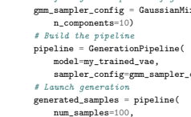

14 train_data=train_data, 15 eval_data=None)
1 from pythae.pipelines import TrainingPipeline 2 pipeline = TrainingPipeline( 3 training_config=my_training_config, 4 model=my_vae_model) 5 *\# Launch the Pipeline* 6 pipeline( 13 return_gen=True,

| Table 4: List of implemented VAEs                  |                          |
|----------------------------------------------------|--------------------------|
| Name                                               | Reference                |
| Variational Autoencoder (VAE)                      | Kingma and Welling [37]  |
| Beta Variational Autoencoder (BetaVAE)             | Higgins et al. [30]      |
| VAE with Linear Normalizing Flows (VAE_LinNF)      | Rezende and Mohamed [55] |
| VAE with Inverse Autoregressive Flows (VAE_IAF)    | Kingma et al. [38]       |
| Disentangled β\-VAE (DisentangledBetaVAE)          | Higgins et al. [30]      |
| Disentangling by Factorising (FactorVAE)           | Kim and Mnih [35]        |
| Beta\-TC\-VAE (BetaTCVAE)                          | Chen et al. [16]         |
| Importance Weighted Autoencoder (IWAE)             | Burda et al. [11]        |
| VAE with perceptual metric similarity (MSSSIM_VAE) | Snell et al. [61]        |
| Wasserstein Autoencoder (WAE)                      | Tolstikhin et al. [64]   |
| Info Variational Autoencoder (INFOVAE_MMD)         | Zhao et al. [72]         |
| VAMP Autoencoder (VAMP)                            | Tomczak and Welling [65] |
| Hyperspherical VAE (SVAE)                          | Davidson et al. [23]     |
| Adversarial Autoencoder (Adversarial_AE)           | Makhzani [44]            |
| Variational Autoencoder GAN (VAEGAN)               | Larsen et al. [41]       |
| Vector Quantized VAE (VQVAE)                       | Van Den Oord et al. [66] |
| Hamiltonian VAE (HVAE)                             | Caterini et al. [13]     |
| Regularized AE with L2 decoder param (RAE_L2)      | Ghosh et al. [27]        |
| Regularized AE with gradient penalty (RAE_GP)      | Ghosh et al. [27]        |
| Riemannian Hamiltonian VAE (RHVAE)                 | Chadebec et al. [14]     |

Maintenance plan: We intend for this library to be maintained in the long term. In that view, the main author's contact details will remain available and up-to-date on the github repository, which will remain the main discussion channel. Additionally, we are currently considering adding back-up contributors that will also support this effort in the long-term. Since this library has already started to be a community effort with external contributors, we further hope that the community will also continue to help reviewing and updating the current implementations.

Original papers reproducibility We validate the implementations by reproducing some results presented in the original publications when the official code has been released or when enough details about the experimental section of the papers were available (we indeed noted that in many papers key elements for reproducibility were missing such as the data split considered, which criteria is used to select the model on which the metrics are computed, the hyper-parameters are not fully disclosed or the network architectures is unclear making reproduction very hard if not impossible in certain cases). This insists on the fact that the framework is flexible enough to reproduce results from publications. Finally, we have open-sourced the scripts, configurations and results on the repository at https://github.com/clementchadebec/benchmark_VAE/tree/ main/examples/scripts/reproducibility and made the trained models available on the HuggingFace Hub (e.g. https://huggingface.co/clementchadebec/reproduced_iwae).

## B Interpolations

In this section, we show the interpolations obtained on the three considered datasets. For each model, we select both a starting image and an ending image from the test set and perform a linear interpolation between the corresponding embeddings in the learned latent space. We then show the decoded trajectory all along the interpolation line. For this task, we use the model configuration that obtained the lowest FID on the validation set with a GMM sampler from the generation task. We show the resulting interpolations for latent spaces of dimension 16 and 256 for MNIST, 32 and 256 for CIFAR10 and 64 for CELEBA. As mentioned in the paper, for this complex task, variational approaches tend to outperform the AE-based methods. This is well illustrated on MNIST with a latent space of dimension 256 since all the AE-based approaches eventually superpose the starting and ending image, making the interpolation visually irrelevant. Impressively, the regularisation imposed by the variational approaches prevents such undesirable behaviours from occurring. This adds to the observation made in Sec. 4.2.2 of the paper where we note some robustness to the latent dimension for the variational methods. Nonetheless, as stated in the paper this regularisation can also degrade image reconstruction, leading to very blurry interpolations, as illustrated on Fig. 5.

|                | MNIST (16)   | MNIST (256)   |
|----------------|--------------|---------------|
| VAE            |              |               |
| VAMP           |              |               |
| IWAE           |              |               |
| VAE\-lin\-NF   |              |               |
| VAE\-IAF       |              |               |
| β\-VAE         |              |               |
| β\-TC\-VAE     |              |               |
| Factor\-VAE    |              |               |
| InfoVAE \- IMQ |              |               |
| InfoVAE \- RBF |              |               |

Figure 3: Interpolations on MNIST with the same starting and ending images for latent spaces of dimension 16 and 256. For each model we select the configuration achieving the lowest FID on the generation task on the validation set with a GMM sampler.

|             | MNIST (16)   | MNIST (256)   |
|-------------|--------------|---------------|
| AAE         |              |               |
| MSSSIM\-VAE |              |               |
| VAEGAN      |              |               |
| AE          |              |               |
| WAE\-IMQ    |              |               |
| WAE\-RBF    |              |               |
| VQVAE       |              |               |
| RAE\-l2     |              |               |
| RAE\-GP     |              |               |

Figure 4: Interpolations on MNIST with the same starting and ending images for latent spaces of dimension 16 and 256. For each model we select the configuration achieving the lowest FID on the generation task on the validation set with a GMM sampler.

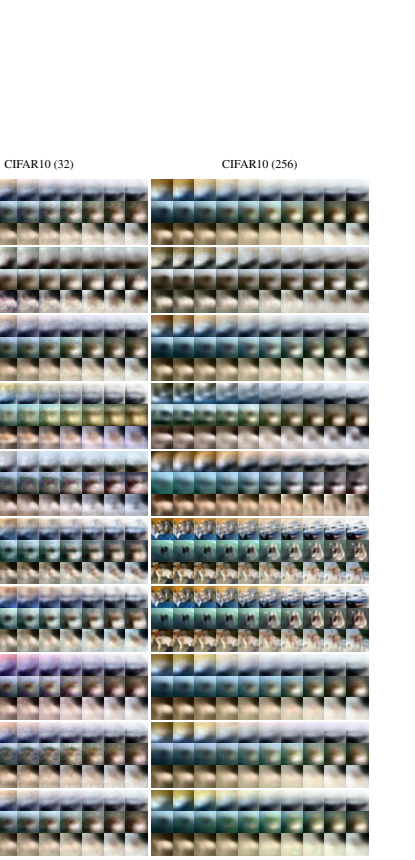

|                | CIFAR10 (32)   | CIFAR10 (256)   |
|----------------|----------------|-----------------|
| VAE            |                |                 |
| VAMP           |                |                 |
| IWAE           |                |                 |
| VAE\-lin\-NF   |                |                 |
| VAE\-IAF       |                |                 |
| β\-VAE         |                |                 |
| β\-TC\-VAE     |                |                 |
| Factor\-VAE    |                |                 |
| InfoVAE \- IMQ |                |                 |
| InfoVAE \- RBF |                |                 |

Figure 5: Interpolations on CIFAR10 with the same starting and ending images for latent spaces of dimension 32 and 256. For each model we select the configuration achieving the lowest FID on the generation task on the validation set with a GMM sampler.

|             | CIFAR10 (32)   | CIFAR10 (256)   |
|-------------|----------------|-----------------|
| AAE         |                |                 |
| MSSSIM\-VAE |                |                 |
| VAEGAN      |                |                 |
| AE          |                |                 |
| WAE\-IMQ    |                |                 |
| WAE\-RBF    |                |                 |
| VQVAE       |                |                 |
| RAE\-l2     |                |                 |
| RAE\-GP     |                |                 |

Figure 6: Interpolations on CIFAR10 with the same starting and ending images for latent spaces of dimension 32 and 256. For each model we select the configuration achieving the lowest FID on the generation task on the validation set with a GMM sampler.

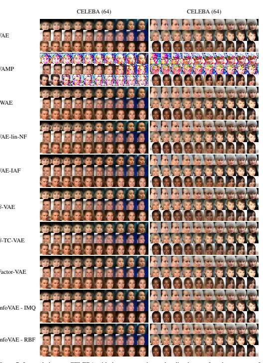

Figure 7: Interpolations on CELEBA with the same starting and ending images for a latent space of dimension 64. For each model we select the configuration achieving the lowest FID on the generation task on the validation set with a GMM sampler.

|             | CELEBA (64)   | CELEBA (64)   |
|-------------|---------------|---------------|
| AAE         |               |               |
| MSSSIM\-VAE |               |               |
| VAEGAN      |               |               |
| AE          |               |               |
| WAE\-IMQ    |               |               |
| WAE\-RBF    |               |               |
| VQVAE       |               |               |
| RAE\-l2     |               |               |
| RAE\-GP     |               |               |

Figure 8: Interpolations on CELEBA with the same starting and ending images for a latent space of dimension 64. For each model we select the configuration achieving the lowest FID on the generation task on the validation set with a GMM sampler.

## C Detailed Experiments Set-Up

We detail here the main experimental set-up and implementation choices made in the benchmark. We let the reader refer to the code available online for specific implementation aspects The data To perform the benchmaks presented in the paper, we select 3 classical *free-to-use* image datasets: MNIST [42], CIFAR10 [40] and CELEBA [43]. These datasets are publicly available, widely used for generative model related papers and have well known associated metrics in the literature. Each dataset is split into a train set, a validation set and a test set. For MNIST and CIFAR10 the validation set is composed of the last 10k images extracted from the official train set and the test set corresponds to the official one. For CELEBA, we use the official train/val/test split. Training paradigm We equip each model used in the benchmark with the same neural network architecture for both the encoder and decoder, taken as a ConvNet and ResNet (architectures given in Tables. 5 and 6) leading to a comparable number of parameters 15. For the 19 considered models, due to computational limitations, 10 different configurations are considered, allowing a simple exploration of the models' hyper-parameters. The sets of hyper-parameters explored are detailed in Appendix. D for each model. The models are then trained on MNIST and CIFAR10 for 100 epochs, a starting learning rate of 1e
−4and batch size of 100 with Adam optimizer [36]. A scheduler reducing the learning rate by half if the validation loss does not improve for 10 epochs is also used. For CELEBA, we use the same setting but we train the models for 50 epochs with a starting learning rate of 1e
−3.

Models with unstable training (NaN, huge training spikes...) are iteratively retrained with a starting learning rate divided by 10 until training stabilises. All 19 models are trained on a single 32GB V100 GPU. This leads to 10 trained models for each method, each dataset (MNIST, CIFAR10 or CELEBA) and each neural network (ConvNet or ResNet) leading to a total of 1140 models. The training setting (curves, configs ...) can be found at https://wandb.ai/benchmark_team/trainings. Sampling paradigm for the MAF and VAE samplers For the Masked Autoregressive Flow sampler used for sampling we use a 3-layer MADE [26] with 128 hidden units and ReLU activation for each layer and stack 2 blocks of MAF to create the flow. For the masked layers, the mask is made sequentially and the ordering is reversed between each MADE. For this normalising flow we consider a starting distribution given by a standard Gaussian. For the auxiliary VAE sampling method proposed in [22], we consider a simple VAE with a Multi Layer Perceptron (MLP) encoder and decoder, with 2 hidden layers composed of 1024 units and ReLU activation. Both samplers are fitted with 200 epochs using the train and evaluation embeddings coming from the trained autoencoder models. A learning rate of 1e
−4, a scheduler decreasing the learning rate by half if the validation loss does not improve for 10 epochs and a batch size of 100 are used for these samplers.

|         | MNIST                      | CIFAR10                    | CELEBA                     |
|---------|----------------------------|----------------------------|----------------------------|
| Encoder | (1, 28, 28)                | (3, 32, 32)                | (3, 64, 64)                |
| Layer 1 | Conv(128, 4, 2), BN, ReLU  | Conv(128, 4, 2), BN, ReLU  | Conv(128, 4, 2), BN, ReLU  |
| Layer 2 | Conv(256, 4, 2), BN, ReLU  | Conv(256, 4, 2), BN, ReLU  | Conv(256, 4, 2), BN, ReLU  |
| Layer 3 | Conv(512, 4, 2), BN, ReLU  | Conv(512, 4, 2), BN, ReLU  | Conv(512, 4, 2), BN, ReLU  |
| Layer 4 | Conv(1024, 4, 2), BN, ReLU | Conv(1024, 4, 2), BN, ReLU | Conv(1024, 4, 2), BN, ReLU |
| Layer 5 | Linear(1024, latent_dim)*  | Linear(4096, latent_dim)*  | Linear(16384, latent_dim)* |
| Decoder |                            |                            |                            |
| Layer 1 | Linear(latent_dim, 16384)  | Linear(latent_dim, 65536)  | Linear(latent_dim, 65536)  |
| Layer 2 | ConvT(512, 3, 2), BN, ReLU | ConvT(512, 4, 2), BN, ReLU | ConvT(512, 5, 2), BN, ReLU |
| Layer 3 | ConvT(256, 3, 2), BN, ReLU | ConvT(256, 4, 2), BN, ReLU | ConvT(256, 5, 2), BN, ReLU |
| Layer 4 | Conv(1, 3, 2), Sigmoid     | Conv(3, 4, 1), Sigmoid     | ConvT(128, 5, 2), BN, ReLU |
| Layer 5 | \-                         | \-                         | ConvT(3, 5, 1), Sigmoid    |

Table 5: Neural network architecture used for the convolutional networks.

15Some models may actually have additional parameters in their intrinsic structure *e.g.* a VQVAE learns a dictionary of embeddings, a VAMP learns the pseudo-inputs, a VAE-IAF learns the auto-regressive flows. Nonetheless, since we work on images, the number of parameters remains in the same order of magnitude.

|         |                           | Table 6: Neural network architecture used for the residual networks.   |                           |
|---------|---------------------------|------------------------------------------------------------------------|---------------------------|
|         | MNIST                     | CIFAR10                                                                | CELEBA                    |
| Encoder | (1, 28, 28)               | (3, 32, 32)                                                            | (3, 64, 64)               |
| Layer 1 | Conv(64, 4, 2)            | Conv(64, 4, 2)                                                         | Conv(64, 4, 2)            |
| Layer 2 | Conv(128, 4, 2)           | Conv(128, 4, 2)                                                        | Conv(128, 4, 2)           |
| Layer 3 | Conv(128, 3, 2)           | Conv(128, 3, 1)                                                        | Conv(128, 3, 2)           |
| Layer 4 | ResBlock**                | ResBlock**                                                             | Conv(128, 3, 2)           |
| Layer 5 | ResBlock**                | ResBlock**                                                             | ResBlock**                |
| Layer 6 | Linear(2048, latent_dim)* | Linear(8192, latent_dim)*                                              | ResBlock**                |
| Layer 7 | \-                        | \-                                                                     | Linear(2048, latent_dim)* |
| Decoder |                           |                                                                        |                           |
| Layer 1 | Linear(latent_dim, 2048)  | Linear(latent_dim, 8192)                                               | Linear(latent_dim, 2048)  |
| Layer 2 | ConvT(128, 3, 2)          | ResBlock**                                                             | ConvT(128, 3, 2)          |
| Layer 3 | ResBlock**                | ResBlock**                                                             | ResBlock**                |
| Layer 4 | ResBlock**, ReLU          | ConvT(64, 4, 2)                                                        | ResBlock**                |
| Layer 5 | ConvT(64, 3, 2), ReLU     | ConvT(3, 4, 2), Sigmoid                                                | ConvT(128, 5, 2), Sigmoid |
| Layer 6 | ConvT(1, 3, 2), Sigmoid   | \-                                                                     | ConvT(64, 5, 2), Sigmoid  |
| Layer 6 | \-                        | \-                                                                     | ConvT(3, 4, 2), Sigmoid   |

**The ResBlocks are composed of one Conv(32, 3, 1) followed by Conv(128, 1, 1) with ReLU.

26

## D Additional Results D.1 Effect Of The Latent Dimension On The 4 Tasks With The Cifar10 Database

Analogously to the results shown in the paper on the MNIST dataset for the 4 chosen tasks (reconstruction, generation, classification and clustering), Fig. 9 shows the impact the choice of the latent space dimension has on the performances of the models on the CIFAR10 dataset, whose image arguably have a greater intrinsic latent dimension than images of the MNIST dataset. Similarly to MNIST, two distinct groups appear: the AE-based methods and variational methods. Again, for all tasks but clustering, variational based methods demonstrate good robustness properties with respect to the dimension of the latent space when compared to AE approaches.

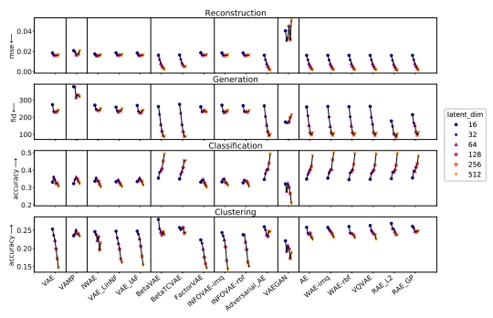 

Figure 9: *From top to bottom:* Evolution of the reconstruction MSE, generation FID, classification accuracy and clustering accuracy with respect to the latent space dimension on the CIFAR dataset.

## D.2 Complete Generation Table

In Table. 7 are presented the full results obtained for generation *i.e.* including the MAF and 2-stage VAE sampler [22]. As mentioned in the paper, it is interesting to note that fitting a GMM instead of using the prior for the variational-based approaches seems to often allow a better image generation since it allows a better prospecting of the learned latent space of each model. Interestingly, it seems that fitting more complex density estimators such as a normalising flow (MAF sampler) or another VAE (2-stage sampler) does not improve the generation results when compared to the GMM for those datasets.

Table 7: Inception Score (higher is better) and FID (lower is better) computed with 10k samples on the test set. For each model and sampler we report the results obtained by the model achieving the lowest FID score on the validation set.

| ConvNet             |            |     |            |            |            | Model  MNIST  CIFAR10  CELEBA  MNIST  CIFAR10  CELEBA   | Sampler   |            |           |              |           |             |           |            |           | ResNet        |           |             |           |
|---------------------|------------|-----|------------|------------|------------|---------------------------------------------------------|-----------|------------|-----------|--------------|-----------|-------------|-----------|------------|-----------|---------------|-----------|-------------|-----------|
| FID ↓               |            |     |            |            |            | IS ↑   IS  FID  IS ↑  IS ↑   IS                         |           |            |           | FID          |           |             |           | FID ↓      |           | FID           |           | FID         | IS        |
| N                   |            |     |            |            |            |                                                         |           | 28.5       | 2.1       | 241.0        | 2.2       | 54.8        | 1.9       | 31.3       | 2.0       | 181.7         | 2.5       | 66.6        | 1.6       |
| GMM                 |            |     |            |            |            | VAE                                                     |           | 26.9       | 2.1       | 235.9        | 2.3       | 52.4        | 1.9       | 32.3       | 2.1       | 179.7         | 2.5       | 63.0        | 1.7       |
| VAE                 |            |     |            |            |            |                                                         |           | 40.3       | 2.0       | 337.5        | 1.7       | 70.9        | 1.6       | 48.7       | 1.8       | 358.0         | 1.3       | 76.4        | 1.4       |
| MAF                 |            |     |            |            |            |                                                         |           | 26.8       | 2.1       | 239.5        | 2.2       | 52.5        | 2.0       | 31.0       | 2.1       | 181.5         | 2.5       | 62.9        | 1.7       |
| VAMP                |            |     |            |            |            |                                                         | VAMP      | 64.2       | 2.0       | 329.0        | 1.5       | 56.0        | 1.9       | 34.5       | 2.1       | 181.9         | 2.5       | 67.2        | 1.6       |
| N                   |            |     |            |            |            |                                                         |           | 29.0       | 2.1       | 245.3        | 2.1       | 55.7        | 1.9       | 32.4       | 2.0       | 191.2         | 2.4       | 67.6        | 1.6       |
| GMM                 |            |     |            |            |            |                                                         |           | 28.4       | 2.1       | 241.2        | 2.1       | 52.7        | 1.9       | 34.4       | 2.1       | 188.8         | 2.4       | 64.1        | 1.7       |
| IWAE                |            |     |            |            |            |                                                         |           |            |           |              |           |             |           |            |           |               |           |             |           |
| VAE                 |            |     |            |            |            |                                                         |           | 42.4       | 2.0       | 346.6        | 1.5       | 74.3        | 1.5       | 50.1       | 1.9       | 364.8         | 1.2       | 76.4        | 1.4       |
| MAF                 |            |     |            |            |            |                                                         |           | 28.1       | 2.1       | 243.4        | 2.1       | 52.7        | 1.9       | 32.5       | 2.1       | 190.4         | 2.4       | 64.3        | 1.7       |
| N                   |            |     |            |            |            |                                                         |           | 29.3       | 2.1       | 240.3        | 2.1       | 56.5        | 1.9       | 32.5       | 2.0       | 185.5         | 2.4       | 67.1        | 1.6       |
| GMM                 |            |     |            |            |            |                                                         |           | 28.4       | 2.1       | 237.0        | 2.2       | 53.3        | 1.9       | 33.1       | 2.1       | 183.1         | 2.5       | 62.8        | 1.7       |
| VAE\-lin NF         |            |     |            |            |            |                                                         |           |            |           |              |           |             |           |            |           |               |           |             |           |
| VAE                 |            |     |            |            |            |                                                         |           | 40.1       | 2.0       | 311.0        | 1.6       | 71.1        | 1.6       | 49.7       | 1.9       | 296.2         | 1.7       | 75.6        | 1.4       |
| MAF                 |            |     |            |            |            |                                                         |           | 27.7       | 2.1       | 239.1        | 2.1       | 53.4        | 2.0       | 32.4       | 2.0       | 184.2         | 2.5       | 62.7        | 1.7       |
| N                   |            |     |            |            |            |                                                         |           | 27.5       | 2.1       | 236.0        | 2.2       | 55.4        | 1.9       | 30.6       | 2.0       | 183.6         | 2.5       | 66.2        | 1.6       |
| GMM                 |            |     |            |            |            | VAE\-IAF                                                |           | 27.0       | 2.1       | 235.4        | 2.2       | 53.6        | 1.9       | 32.2       | 2.1       | 180.8         | 2.5       | 62.7        | 1.7       |
| VAE                 |            |     |            |            |            |                                                         |           | 39.4       | 2.0       | 330.5        | 1.1       | 73.0        | 1.5       | 44.8       | 1.9       | 322.7         | 1.5       | 76.7        | 1.4       |
| MAF                 |            |     |            |            |            |                                                         |           | 26.9       | 2.1       | 236.8        | 2.2       | 53.6        | 1.9       | 30.6       | 2.1       | 182.5         | 2.5       | 63.0        | 1.7       |
| N                   |            |     |            |            |            |                                                         |           | 21.4       | 2.1       | 115.4        | 3.6       | 56.1        | 1.9       | 19.1       | 2.0       | 124.9         | 3.4       | 65.9        | 1.6       |
| GMM                 |            |     |            |            |            | β\-VAE                                                  |           | 9.2        | 2.2       | 92.2         | 3.9       | 51.7        | 1.9       | 11.4       | 2.1       | 112.6         | 3.6       | 59.3        | 1.7       |
| VAE                 |            |     |            |            |            |                                                         |           | 14.0       | 2.2       | 139.6        | 3.6       | 55.0        | 1.9       | 20.3       | 2.1       | 152.5         | 3.5       | 61.5        | 1.7       |
| MAF                 |            |     |            |            |            |                                                         |           | 9.5        | 2.2       | 100.9        | 3.5       | 51.5        | 2.0       | 12.0       | 2.1       | 120.0         | 3.6       | 59.7        | 1.8       |
| N                   |            |     |            |            |            |                                                         |           | 21.3       | 2.1       | 116.6        | 2.8       | 55.7        | 1.8       | 20.7       | 2.0       | 125.8         | 3.4       | 65.9        | 1.6       |
| GMM                 |            |     |            |            |            | β\-TC VAE                                               |           | 11.6       | 2.2       | 89.3         | 4.1       | 51.8        | 1.9       | 13.3       | 2.1       | 106.5         | 3.7       | 59.3        | 1.7       |
| VAE                 |            |     |            |            |            |                                                         |           | 18.4       | 2.2       | 127.9        | 4.2       | 59.7        | 1.8       | 28.3       | 2.0       | 164.0         | 3.3       | 66.4        | 1.5       |
| MAF                 |            |     |            |            |            |                                                         | N         | 12.0  27.0 | 2.2   2.1 | 95.6   236.5 | 3.6   2.2 | 52.2   53.8 | 1.9   1.9 | 13.7  31.0 | 2.1   2.0 | 116.6   185.4 | 3.4   2.5 | 60.1   66.4 | 1.7   1.7 |
| GMM                 |            |     |            |            |            |                                                         |           | 26.9       | 2.1       | 234.0        | 2.2       | 52.4        | 2.0       | 32.7       | 2.1       | 184.4         | 2.5       | 63.3        | 1.7       |
| FactorVAE           |            |     |            |            |            |                                                         | VAE       | 41.2       | 1.9       | 338.3        | 1.5       | 75.0        | 1.5       | 54.7       | 1.8       | 316.2         | 1.3       | 77.7        | 1.4       |
| MAF                 |            |     |            |            |            |                                                         |           | 26.7       | 2.2       | 236.7        | 2.2       | 52.7        | 1.9       | 32.8       | 2.1       | 185.8         | 2.5       | 63.4        | 1.7       |
| N                   |            |     |            |            |            |                                                         |           | 27.5       | 2.1       | 235.2        | 2.1       | 55.5        | 1.9       | 31.1       | 2.0       | 182.8         | 2.5       | 66.5        | 1.6       |
| GMM                 |            |     |            |            |            |                                                         |           | 26.7       | 2.1       | 230.4        | 2.2       | 52.7        | 1.9       | 32.3       | 2.1       | 179.5         | 2.5       | 62.8        | 1.7       |
| InfoVAE \- RBF  2.0 |            |     |            |            |            |                                                         | VAE       | 39.7       |           | 327.2        | 1.5       | 73.7        | 1.5       | 50.6       | 1.9       | 363.4         | 1.2       | 75.8        | 1.4       |
| MAF                 | 2.1  233.5 |     |            |            |            |                                                         |           | 25.9       |           |              | 2.2       | 52.2        | 2.0       | 30.5       | 2.1       | 181.3         | 2.5       | 62.7        | 1.7       |
| N                   |            |     |            |            |            |                                                         |           | 28.3       | 2.1       | 233.8        | 2.2       | 56.7        | 1.9       | 31.0       | 2.0       | 182.4         | 2.5       | 66.4        | 1.6       |
| GMM                 |            | 2.1 |            |            |            | InfoVAE \- IMQ                                          |           | 27.7       |           | 231.9        | 2.2       | 53.7        | 1.9       | 32.8       | 2.1       | 180.7         | 2.6       | 62.3        | 1.7       |
| VAE                 |            |     | 1.9  323.8 |            |            |                                                         |           | 40.4       |           |              | 1.6       | 73.7        | 1.5       | 49.9       | 1.9       | 341.8         | 1.8       | 75.7        | 1.4       |
| MAF                 |            |     |            | 2.1  232.3 |            |                                                         |           | 27.2       |           |              | 2.1       | 53.8        | 2.0       | 30.6       | 2.1       | 182.5         | 2.5       | 62.6        | 1.7       |
| N                   |            |     |            |            | 2.2  139.9 |                                                         |           | 16.8       |           |              | 2.6       | 59.9        | 1.8       | 19.1       | 2.1       | 164.9         | 2.4       | 64.8        | 1.7       |
| AAE                 |            |     |            |            |            |                                                         |           |            |           |              |           |             |           |            |           |               |           |             |           |
| MAF                 |            |     |            |            |            |                                                         |           | 9.3        | 2.2       | 101.1        | 3.2       | 53.8        | 2.0       | 11.9       | 2.1       | 133.6         | 3.1       | 59.2        | 1.8       |
| N                   |            |     |            |            |            |                                                         |           | 26.7       | 2.2       | 279.9        | 1.7       | 124.3       | 1.3       | 28.0       | 2.1       | 254.2         | 1.7       | 119.0       | 1.3       |
| GMM                 |            |     |            |            |            |                                                         |           | 27.2       | 2.2       | 279.7        | 1.7       | 124.3       | 1.3       | 28.8       | 2.1       | 253.1         | 1.7       | 119.2       | 1.3       |
| MSSSIM\-VAE         |            |     |            |            |            |                                                         | VAE       | 51.2       | 1.9       | 355.5        | 1.1       | 137.9       | 1.2       | 51.6       | 1.9       | 372.1         | 1.1       | 136.5       | 1.2       |
| MAF                 |            |     |            |            |            |                                                         |           | 26.9       | 2.2       | 279.8        | 1.7       | 124.0       | 1.3       | 27.5       | 2.1       | 254.1         | 1.7       | 119.5       | 1.3       |
| N                   |            |     |            |            |            |                                                         |           | 8.7        | 2.2       | 199.5        | 2.2       | 39.7        | 1.9       | 12.8       | 2.2       | 198.7         | 2.2       | 122.8       |           |
| GMM                 |            |     |            |            |            |                                                         |           | 6.3        | 2.2       | 197.5        | 2.1       | 35.6        | 1.8       | 6.5        | 2.2       | 188.2         | 2.6       | 84.3        | 1.7       |
| VAEGAN              |            |     |            |            |            |                                                         | VAE       | 11.2       | 2.1       | 310.9        | 2.0       | 54.5        | 1.6       | 9.2        | 2.1       | 272.7         | 2.0       | 88.8        | 1.6       |
| MAF                 |            |     |            |            |            |                                                         |           | 6.9        | 2.3       | 199.0        | 2.1       | 36.7        | 1.8       | 6.6        | 2.2       | 191.9         | 2.5       | 84.8        |           |
| N                   |            |     |            |            |            |                                                         |           |            |           |              |           |             |           |            |           |               |           |             |           |
| 57.4                |            |     |            |            |            | AE                                                      | GMM       | 9.3        | 2.2       | 97.3         | 3.6       | 55.4        | 2.0       | 11.0       | 2.1       | 120.7         | 3.4       |             | 1.8       |
| MAF                 |            |     |            |            |            |                                                         |           | 9.9        | 2.2       | 108.3        | 3.1       | 55.7        | 2.0       | 12.0       | 2.1       | 136.5         | 3.0       | 58.3        | 1.8       |
| N                   |            |     |            |            |            |                                                         |           | 21.2       | 2.2       | 175.1        | 2.0       | 332.6       | 1.0       | 21.2       | 2.1       | 170.2         | 2.3       | 69.4        | 1.6       |
| WAE \- RBF          |            |     |            |            |            |                                                         |           |            |           |              |           |             |           |            |           |               |           |             | 1.7       |
|                     |            |     |            |            |            |                                                         |           |            |           |              |           |             |           |            |           |               |           |             | 1.8       |
| N                   |            |     |            |            |            |                                                         |           | 18.9       | 2.2       | 164.4        | 2.2       | 64.6        | 1.7       | 20.3       | 2.1       | 150.7         | 2.5       | 67.1        |           |
| MAF                 |            |     |            |            |            |                                                         |           | 9.5        | 2.2       | 107.8        | 3.1       | 51.6        | 2.0       | 11.8       | 2.1       | 130.2         | 3.0       | 58.7        | 1.7       |
| N(0, 1)             |            |     |            |            |            |                                                         |           | 28.2       | 2.0       | 152.2        | 2.0       | 306.9       | 1.0       | 170.7      | 1.6       | 195.7         | 1.9       | 140.3       | 2.2       |
| VQVAE               |            |     |            |            |            |                                                         | GMM       | 9.1        | 2.2       | 95.2         | 3.7       | 51.6        | 2.0       | 10.7       | 2.1       | 120.1         | 3.4       | 57.9        | 1.8       |
| MAF                 |            |     |            |            |            |                                                         |           | 9.6        | 2.2       | 104.7        | 3.2       | 52.3        | 1.9       | 11.7       | 2.2       | 136.8         | 3.0       | 57.9        | 1.8       |
| N                   |            |     |            |            |            |                                                         |           | 25.0       | 2.0       | 156.1        | 2.6       | 86.1        | 2.8       | 63.3       | 2.2       | 170.9         | 2.2       | 168.7       |           |
| RAE\-L2             |            |     |            |            |            |                                                         | GMM       | 9.1        | 2.2       | 85.3         | 3.9       | 55.2        | 1.9       | 11.5       | 2.1       | 122.5         | 3.4       | 58.3        | 1.8       |
| MAF                 |            |     |            |            |            |                                                         |           | 9.5        | 2.2       | 93.4         | 3.5       | 55.2        | 2.0       | 12.3       | 2.2       | 136.6         | 3.0       | 59.1        | 1.7       |
| N                   |            |     |            |            |            |                                                         |           | 27.1       | 2.1       | 196.8        | 2.1       | 86.1        | 2.4       | 61.5       | 2.2       | 229.1         | 2.0       | 201.9       | 3.1       |
| RAE \- GP           |            |     |            |            |            | 9.7  96.3  11.4  123.3  59.0                            | GMM  MAF  | 9.7        | 2.2  2.2  | 106.3        | 3.7  3.2  | 52.5  52.5  | 1.9  1.9  | 12.2       | 2.1  2.2  | 139.4         | 3.4  3.0  | 59.5        | 1.8  1.8  |
| GMM                 |            |     |            |            |            |                                                         |           | 9.3        | 2.2       | 92.1         | 3.8       | 53.9        | 2.0       | 11.1       | 2.1       | 118.5         | 3.5       | 58.7        | 1.8       |
| VAE                 |            |     |            |            |            |                                                         |           | 13.4       | 2.2       | 144.0        | 3.4       | 58.2        | 1.8       | 15.1       | 2.1       | 145.2         | 3.6       | 59.0        | 1.7       |
|                     |            |     |            |            |            |                                                         |           |            |           |              |           |             |           |            |           |               |           |             | 2.0       |
|                     |            |     |            |            |            |                                                         |           |            |           |              |           |             |           |            |           |               |           |             | 1.7       |
| 26.7                |            |     |            |            |            |                                                         |           |            | 2.1       | 201.3        | 2.1       | 327.7       | 1.0       | 221.8      | 1.3       | 210.1         | 2.1       | 275.0       | 2.9       |
| GMM                 |            |     |            |            |            |                                                         |           | 9.2        | 2.2       | 97.1         | 3.6       | 55.0        | 2.0       | 11.2       | 2.1       | 120.3         | 3.4       | 58.3        |           |
| MAF                 |            |     |            |            |            |                                                         |           | 9.8        | 2.2       | 108.2        | 3.1       | 56.0        | 2.0       | 11.8       | 2.2       | 135.3         | 3.0       | 58.3        |           |
|                     |            |     |            |            |            |                                                         |           |            |           |              |           |             |           |            |           |               |           |             | 1.6       |
| WAE \- IMQ          |            |     |            |            |            |                                                         | GMM       | 8.6        | 2.2       | 96.5         | 3.6       | 51.7        | 2.0       | 11.2       | 2.1       | 119.0         | 3.5       | 57.7        | 1.8       |
|                     |            |     |            |            |            |                                                         |           |            |           |              |           |             |           |            |           |               |           |             | 3.1       |

28

## D.3 Further Interesting Results

Generated samples In addition to quantitative metrics, we also provide in Fig. 10 and Fig. 11 some samples coming from the different models using either a N (0, Id) or fitting a GMM with 10 components on MNIST and CELEBA. This allows to visually differentiate the quality of the different sampling methods.

|                | MNIST \- N  MNIST \- GMM   |
|----------------|----------------------------|
| VAE            |                            |
| IWAE           |                            |
| VAE\-lin\-NF   |                            |
| VAE\-IAF       |                            |
| β\-VAE         |                            |
| β\-TC\-VAE     |                            |
| Factor\-VAE    |                            |
| InfoVAE \- IMQ |                            |
| InfoVAE \- RBF |                            |
| AAE            |                            |
| MSSSIM\-VAE    |                            |
| VAEGAN         |                            |
| AE             |                            |
| WAE\-IMQ       |                            |
| WAE\-RBF       |                            |
| VQVAE          |                            |
| RAE\-L2        |                            |
| RAE\-GP        |                            |

Figure 10: Generated samples on MNIST for a latent space of dimension 16 and ConvNet architecture. For each model, we select the configuration achieving the lowest FID on the validation set.

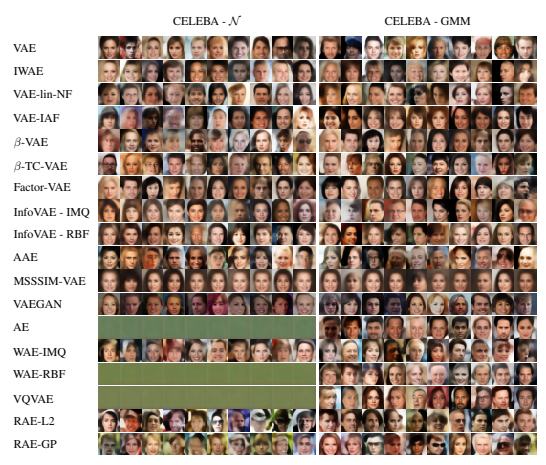

Figure 11: Generated samples on CELEBA for a latent space of dimension 64 and ConvNet architecture. For each model, we select the configuration achieving the lowest FID on the validation set.

Sampler ablation study Fig. 12 shows the same results as Table. 7 but under a different prism. In this plot, we show the influence each sampler has on the generation quality for all the models considered in this study. Note that sampling using a N (0, Id) for an AE, RAE or VQVAE is far from being optimal since those models do not enforce explicitly the latent variables to follow this distribution. As mentioned in the paper, this experiment shows that using more complex density estimators such as a GMM or a normalising flow almost always improves the generation metric.

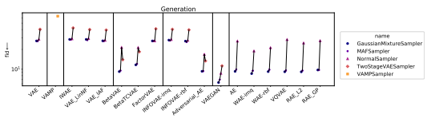 
 

Figure 12: Evolution of the FID for the generation task depending on the sampler, for a ConvNet, the MNIST dataset and a latent dimension of 16. For each sampler and model, we select the configuration achieving the lowest FID on the validation set.

Neural network architecture ablation study As explained in the paper and in Appendix. C, we consider two different neural architectures for the encoder and decoder of each model: a ConvNet (convolutional neural network) and a ResNet (residual neural network). Fig. 13 shows the influence the choice of the neural architecture has on the ability of the model to perform the 4 tasks presented in the paper. The results are computed for each model on MNIST and a latent dimension of 16. The ConvNet architecture has approximately 20 times more parameters than the ResNet in such conditions. We select the best configuration for each model and each task on the validation set and report the results on the test set. Unsuprisingly, we see in Fig. 13 that the ConvNet architecture, more adapted to capture features intrinsic to images, leads to the best performances for reconstruction and generation. Interestingly, the ResNet outperforms the ConvNet for the classification and clustering tasks, meaning that in addition to the network complexity, its structure can play a major role in the representation learned by the models. Training time Fig. 14 shows the training times required for each model for both network architectures on the MNIST dataset. For each model, we show the results obtained with the configuration giving the best performances on the generation task with fixed latent dimension 16. It is interesting to note that although VAEGAN outperforms other models on the generation task, it is at the price of a higher computational time. This is due to the discriminator network (a convolutional neural net) that is called several times during training and takes images as inputs. It should be noted that methods applying normalising flows to the posterior (VAE-lin-NF and VAE-IAF) maintain a reasonable training time, as the flows were chosen for their scalability.

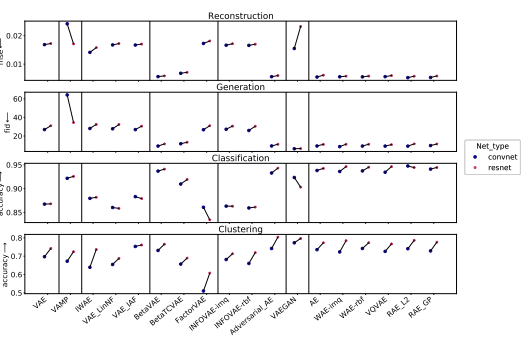 

Figure 13: Evolution of the metrics for the 4 tasks depending on the network type on the MNIST dataset and a latent dimension of 16.

Traini ng ti me (
minut

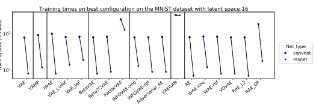

Figure 14: Total training time for the models trained on the MNIST dataset with latent dimension 16 with the best performance on the generation task.

## D.4 Configurations And Results By Models

In this section we briefly explain each model considered in the benchmark, and show the evolution of performances on the 4 tasks and the training speed with respect to the choice of the hyper-parameters. For all 4 tasks we consider the MNIST dataset and a fixed latent space of dimension 16, as well as the Normal Gaussian sampler (if applicable) and the convolutional network architecture. For each model, 10 configuration runs with different hyper-parameters were tested. It should be noted that this configuration search was done empirically and is not exhaustive, therefore models with multiple hyper-parameters or that are sensitive to the choice of hyper-parameters will tend to have sub-optimal configuration choices. Although hyper-parameter choices are dependant on both the auto-encoder architecture and the dataset, it is interesting to note the relative evolution of the performances on the different tasks and the training time induced by different hyper-parameter choices.

Notations In order to better underline the differences between different models and for clarity purposes, we set the following unified notations:
- X = {x1, . . . , xN *} ∈ X* N the input dataset - x ∈ X an observation from the dataset, and z ∈ Z = R
dits corresponding latent vector
- xˆ the reconstruction of x by the auto-encoder model
- pz(z) the prior distribution, with pz ≡ N (0, Id) under standard VAE assumption - qϕ(z|x) the approximate posterior distribution, modelled by the encoder. Kingma and Welling [37] set qϕ(z|x) ≡ N µϕ(x), Σϕ(x))
where Σϕ(x) = *diag*[σϕ(x)] and µϕ(x), σϕ(x)∈ R
2×dare outputs of the encoder network. The sampling process z ∼ qϕ(z|x) is therefore performed by sampling ε ∼ N (0, Id) and setting z = µϕ(x) + Σϕ(x)
1/2· ε (re-parametrization trick).

- pθ(x|z) the distribution of x given z
- pθ(x) = RZ
pθ(x|z)pz(z)dz the marginal distribution of x
- qϕ(z) = 
1 N
PN
i=1 qϕ(z|xi) the aggregated posterior integrated over the training set.

- DKL the Kullback-Leibler divergence We further recall that Kingma and Welling [37] use the unbiased estimate pbθ(x) of pθ(x) defined as

$${\widehat{p}}_{\theta}(x)={\frac{p_{\theta}(x|z)p_{z}(z)}{q_{\phi}(z|x)}}$$
$\mu$ p. 
to derive the standard Evidence Lower Bound (ELBO) of the log probability log pθ(x) which we wish to maximize:
with

$${\mathcal{L}}_{E L B O}=$$
LELBO = Ex∼pθ(x)-L*ELBO*(x)
$\mathcal{L}_{ELBO}(x)=\underbrace{\mathbb{E}_{z\sim q_{\phi}}\left[\log p_{\theta}(x|z)\right]}_{\text{reconstruction}}-\underbrace{\mathcal{D}_{KL}\left[q_{\phi}(z|x)||p_{z}(z)\right]}_{\text{regularisation}}$
The *reconstruction* loss is maximized when xˆ is close to x, thus encouraging a good reconstruction of the input x, while the *regularisation* term is maximized when qϕ(z|x) is close to pz(z), encouraging the posterior distribution to follow the chosen prior distribution.

The integration over pθ(x) is approximated by the empirical distribution of the training dataset, and the negative ELBO function acts as a loss function to minimize for the encoder and decoder networks.

VAE with a VampPrior (VAMP) Starting from the observation that a standard Gaussian prior may be too simplistic, Tomczak and Welling [65] proposes a less restrictive prior: the Variational Mixture of Posteriors (VAMP). A VAE with a VAMP prior aims at relaxing the posterior constraint by replacing the conventional normal prior with a multimodal aggregated posterior given by:

$$p_{z}(z)=\frac{1}{K}\sum_{k=1}^{K}q_{\phi}(z|u_{k})\,,$$

where uk are pseudo-inputs living in the data space X learned through back-propagation and acting as anchor points for the prior distribution. For the VAMP VAE implementation, we use the same architecture as the authors' implementation for the network generating the pseudo-inputs: a MLP with a single layer and Tanh activation. Results by configuration

| Table 8: VAMP configurations   |    |    |    |     |     |     |     |     |     |     |
|--------------------------------|----|----|----|-----|-----|-----|-----|-----|-----|-----|
| Config                         | 1  | 2  | 3  | 4   | 5   | 6   | 7   | 8   | 9   | 10  |
| Number of pseudo\-inputs (K)   | 10 | 20 | 30 | 500 | 100 | 150 | 200 | 250 | 300 | 500 |

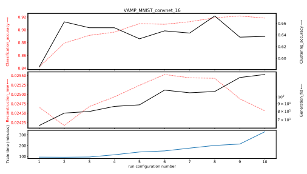

Clu y u
_
rin g fid
_
n G
n 

Figure 15: Results on VAMP

Importance Weighted Autoencoder (IWAE) Burda et al. [11] introduce an alternative lower bound to maximize, derived from importance weighting where the new unbiased estimate pbθ(x) of the marginal distribution pθ(x) is computed with L samples z1*, . . . , z*L ∼ qϕ(z|x) :

$$\widehat{p}_{\theta}(x)=\frac{1}{L}\sum_{i=1}^{L}\frac{p_{\theta}(x|z_{i})p_{z}(z_{i})}{q_{\phi}(z_{i}|x)}\,.$$

This estimate induces a new lower bound of the true marginal distribution pθ(x) using Jensen's inequality:

$$\mathcal{L}_{\mathrm{IWARE}}(x):=\mathbb{E}_{z_{1},\ldots,z_{L}\sim q(z|x)}\Bigg[\log\frac{1}{L}\sum_{i=1}^{L}\frac{p_{\theta}(x|z_{i})p_{z}(z_{i})}{q_{\phi}(z_{i}|x)}\Bigg]\leq\log\underbrace{\mathbb{E}_{z_{1},\ldots,z_{L}\sim q(z|x)}\big[\widehat{p}_{\theta}(x)\big]}_{p_{\theta}(x)}.$$

As the number of samples L increases, LIWAE(x) becomes closer to log pθ(x), therefore providing a tighter bound on the true objective. Note that when L = 1 we recover the original VAE framework.

As expected the reconstruction quality increases with the number of samples. Nonetheless, we note that increasing the number of samples has a significant impact on the computation of a single training step, therefore leading to a much slower training process. Results by configuration

| Table 9: IWAE configurations   |        |    |    |    |    |    |    |    |    |    |
|--------------------------------|--------|----|----|----|----|----|----|----|----|----|
| 1                              | Config | 2  | 3  | 4  | 5  | 6  | 7  | 8  | 9  | 10 |
| Number of samples (L)          | 2      | 3  | 4  | 5  | 6  | 7  | 8  | 9  | 10 | 12 |

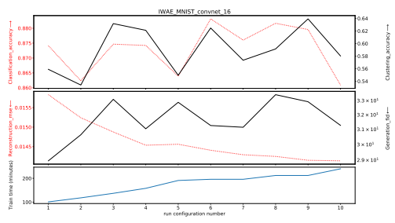

Clu y u
_
rin g G
fid
_
n n

Figure 16: Results on IWAE

Variational Inference with Normalizing Flows (VAE-lin-NF) In order to model a more complex family of approximate posterior distributions, Rezende and Mohamed [55] propose to use a succession of normalising flows to transform the simple distribution qϕ(z|x), allowing it to model more complex behaviours. In practice, after having sampled z0 ∼ qϕ(z|x), z0 is passed through a chain of K
invertible smooth mappings from the latent space R
dto itself:

$$z_{K}=f_{K}\circ\cdots\circ f_{2}\circ f_{1}(z_{0})\,.$$

The modified latent vector zK is then used as input z for the decoder network. In their paper, the authors propose to use two types of transformations: planar and radial flows.

$$f_{\mathrm{planar}}(z)=z+u h(w^{\top}z+b)\quad\,\quad;\quad\,f_{\mathrm{radial}}(z)=z+\beta g(\alpha,r)(z-z_{0})\,,$$

where h is a smooth non-linearity with tractable derivatives and g(*α, r*) = 1 α+r
. The parameters are such that r = ∥z − z0∥, *u, w, z*0 ∈ R
d, α ∈ R
+ and *b, β* ∈ R. We can easily compute the resulting density q given by

$$\log q(z_{K})=\log q_{\phi}(z_{0}|x)-\sum_{k=1}^{K}\log\left|\operatorname*{det}{\frac{\partial f_{k}}{\partial z}}\right|.$$

This makes the ELBO tractable and optimisation possible. Results by configuration

| Table 10: VAE\-lin\-NF configurations                    |       |       |       |     |     |     |     |            |     |            |
|----------------------------------------------------------|-------|-------|-------|-----|-----|-----|-----|------------|-----|------------|
| Config                                                   | 1     | 2     | 3     | 4   | 5   | 6   | 7   | 8          | 9   | 10         |
| Flow sequence                                            | PPPPP | RRRRR | PRPRP | 10P | 15P | 20P | 30P | PRPRPRPRPR | PPP | PRPPRPPPPR |
| 'P' stands for planar flow \- 'R' stands for radial flow |       |       |       |     |     |     |     |            |     |            |

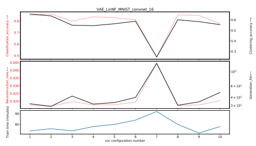

G 

Figure 17: Results on VAE-lin-NF

Variational Inference with Inverse Autoregressive Flow (VAE-IAF) Kingma et al. [38] improve upon the works of [55] with a new type of normalising flow that better scales to high-dimensional latent spaces. The main idea is again to apply several transformations to a sample from a simple distribution in order to model richer distributions. Starting from z0 ∼ qϕ(z|x), the proposed IAF flow consists in applying consecutively the following transformation zk = µk + σk · zk−1 ,
where µk and σk are the outputs of an autoregressive neural network taking zk−1 as input. Inspired from the original paper, to implement one Inverse Autoregressive Flow we use MADE [26] and stack multiple IAF together to create a richer flow. The MADE mask is made sequentially for the masked autoencoders and the ordering is reversed after each MADE.

|                             |      |      |      | Table 11: VAE\-IAF configurations   |      |      |      |      |      |       |
|-----------------------------|------|------|------|-------------------------------------|------|------|------|------|------|-------|
| Config                      | 1    | 2    | 3    | 4                                   | 5    | 6    | 7    | 8    | 9    | 10    |
| hidden size in MADE         | 32.0 | 32.0 | 32.0 | 32.0                                | 32.0 | 32.0 | 32.0 | 32.0 | 64.0 | 128.0 |
| number hidden units in MADE | 2.0  | 2.0  | 2.0  | 2.0                                 | 2.0  | 2.0  | 4.0  | 6.0  | 2.0  | 2.0   |
| number of IAF blocks        | 1.0  | 2.0  | 5.0  | 10.0                                | 20.0 | 4.0  | 4.0  | 4.0  | 4.0  | 4.0   |

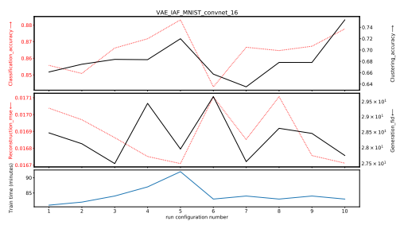

Clu y u
_
rin g G
_
fid n n

Figure 18: Results on VAE-IAF

β**-VAE** Higgins et al. [30] argue that increasing the weight of the KL divergence term in the ELBO loss enforces a stronger disentanglement of the latent features as the posterior probability is forced to match a multivariate standard Gaussian. They propose to add a hyper-parameter β in the ELBO leading to the following objective to maximise:
Lβ-VAE(x) = Ez∼qϕ[log pθ(x|z)] − βDKL-qϕ(z|x)||pz(z).

Although the original publication specifies β > 1 to encourage a better disentanglement, a smaller value of β can be used to relax the regularisation constraint of the VAE. Therefore, for this model we consider a range of values for β from 1e
−3to 1e 3.

As expected, we see in Fig. 19 a trade-off appearing between reconstruction and generation. Indeed, a very small β will tend to less regularise the model since the latent variables will no longer be driven to follow the prior, favouring a better reconstruction. On the other hand, a higher value for β will constrain the model, leading to a better generation quality. Moreover, as can be seen in Fig. 19, too high a value of β will lead to over-regularisation, resulting in poor performances on all evaluated tasks. Results by configuration

|        |        |        |        | Table 12: β\-VAE configurations   |    |    |    |    |       |       |
|--------|--------|--------|--------|-----------------------------------|----|----|----|----|-------|-------|
| Config | 1      | 2      | 3      | 4                                 | 5  | 6  | 7  | 8  | 9     | 10    |
| β      | −3  1e | −2  1e | −1  1e | 0.5                               | 2  | 5  | 10 | 20 | 2  1e | 3  1e |

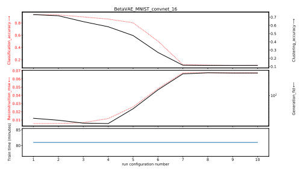

G 

Figure 19: Results on β-VAE

β**-TC-VAE** Chen et al. [16] extend on the ideas of Higgins et al. [30] by rewriting and re-weighting specific terms in the ELBO loss with multiple hyperparameters. The authors note that the KL- divergence term of the ELBO loss can be rewritten as

$$\mathbb{E}_{x\sim p_{\theta}}\left[\mathcal{D}_{KL}\left[q_{\phi}(z|x)||p_{z}(z)\right]\right]=\underbrace{I(x,z)}_{\text{Mutal information}}+\underbrace{\mathcal{D}_{KL}\left[q_{\phi}(z)||\prod_{j=1}^{d}q_{\phi}(z_{j})\right]}_{\text{TC-loss}}$$ $$+\underbrace{\sum_{j=1}^{d}\mathcal{D}_{KL}\left[q_{\phi}(z_{j})||p_{z}(z_{j})\right]}_{\text{Dimension-wise KL}}$$
Dimension-wise KL
- The mutual information term corresponds to the amount of information shared by x and its latent representation z. It is claimed that maximising the mutual information encourages better disentanglement and a more compact representation of the data.

- The TC-loss corresponds to the total correlation between the latent distribution and its fully disentangled version, maximising it enforces the dimensions of the latent vector to be uncorrelated.

- Maximising the dimension-wise KL prevents the marginal distribution of each latent dimension from diverging too far from the prior Gaussian distribution The authors therefore propose to replace the classical regularisation term with the more general term

$${\mathcal{L}}_{\mathrm{reg}}:=\alpha I(x,n)+\beta{\mathcal{D}}_{K L}\big[q_{\phi}(z)||\prod_{j}q_{\phi}(z_{j})\big]+\gamma\sum_{j}{\mathcal{D}}_{K L}\big[q_{\phi}(z_{j})||p_{z}(z_{j})\big]\,.$$

Similarly to the authors, we set α = γ = 1 and only perform a search on the parameter β. Fig. 20 shows a reconstruction-generation trade-off similar to the β-VAE model Results by configuration

|        | Table 13:   |        |        |     | β\-TC\-VAE configurations   |    |    |    |    |       |
|--------|-------------|--------|--------|-----|-----------------------------|----|----|----|----|-------|
| Config | 1           | 2      | 3      | 4   | 5                           | 6  | 7  | 8  | 9  | 10    |
| β      | −3  1e      | −2  1e | −1  1e | 0.5 | 1                           | 2  | 5  | 10 | 50 | 2  1e |

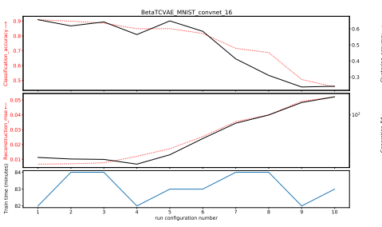

Clustering_accuracy Generation_fid ←

Figure 20: Results on ß-TC-VAE

Factor VAE Kim and Mnih [35] augment the VAE objective with a penalty that encourages factorial representation of the marginal distributions, enforcing a stronger disentangling of the latent space. Noting that a high β value in β-VAE ELBO loss encourages disentanglement at the expense of reconstruction quality, FactorVAE proposes a new lower bound of the log likelihood with an added disentanglement term:

$${\mathcal{L}}_{\mathrm{FactorVAE}}(x):={\mathcal{L}}_{E L B O}(x)-\gamma{\mathcal{D}}_{K L}\big(q_{\phi}(z)||\bar{q}_{\phi}(z)\big)\ ,{\mathrm{with~}}\bar{q}_{\phi}(z):=\prod_{j=1}^{d}q_{\phi}(z_{j})\ .$$

The distribution of representations qϕ(z) = 1N
PN
i=1 qϕ(z|xi) of the entire dataset is therefore forced to be close to its fully-disentangled equivalent q¯ϕ(z) while leaving the ELBO loss as it is. They further propose to approximate the KL divergence with a discriminator network D that is trained jointly to the VAE:

 $\mathcal{D}_{KL}\big(q(z)||\bar{q}(z)\big)\approx\mathbb{E}_{q_z(z)}\bigg[\log\dfrac{D(z)}{1-D(z)}\bigg]$  's more the discriminator is set as a MLR code. 
As suggested in the authors's paper, the discriminator is set as a MLP composed of 6 layers each with 1000 hidden units and LeakyReLU activation.

Results by configuration

|        |    |    |    |    | Table 14: FactorVAE configurations   |    |    |    |    |     |
|--------|----|----|----|----|--------------------------------------|----|----|----|----|-----|
| Config | 1  | 2  | 3  | 4  | 5                                    | 6  | 7  | 8  | 9  | 10  |
| γ      | 1  | 2  | 5  | 10 | 15                                   | 20 | 30 | 40 | 50 | 100 |

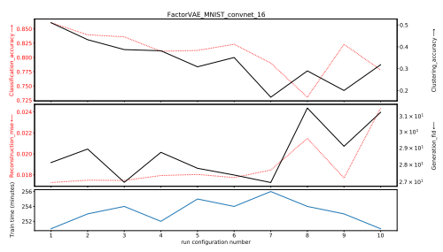

G 

Figure 21: Results on FactorVAE

InfoVAE Zhao et al. [72] note that the traditional VAE ELBO objective can lead to both inaccurate amortized inference and VAE models that tend to ignore most of the latent variables, therefore not fully taking advantage of the modelling capacities of the VAE scheme and learning less meaningful latent representations. In order to counteract these two issues, they propose to rewrite and re-weight the ELBO objective in order to counterbalance the imbalance between the distribution in the data space and the latent space, and add a mutual information term between x and z to encourage a stronger dependency between the two variables, preventing the model from ignoring the latent encoding. One can re-write the ELBO loss in order to explicit the KL divergence between the marginalised posterior and the prior

$${\mathcal{L}}_{\mathrm{ELBO}}(x):=-{\mathcal{D}}_{K L}[q_{\phi}(z)||p_{z}(z)]-\mathbb{E}_{z\sim p_{z}}\bigg[{\mathcal{D}}_{K L}[q_{\phi}(x|z)||p_{\theta}(x|z)]\bigg]\;.$$

Introducing an additional mutual information term Iq(x; z) and extending the objective function to use any given divergence D between probability measures instead of the KL objective, the authors propose a new objective defined as

$${\mathcal{L}}_{\mathrm{InfoVAE}}(x):=-\lambda D[q_{\phi}(z)||p_{z}(z)]-\mathbb{E}_{z\sim p_{z}}\bigg[{\mathcal{D}}_{K L}[q_{\phi}(x|z)||p_{\theta}(x|z)]\bigg]+\alpha I_{q}(x;z)$$

where λ and α are hyperparameters. In our experiments, α is set to 0 as recommended in the paper in the case where pθ(x|z) is a simple distribution. D is chosen as the Maximum Mean Discrepancy
(MMD) [28], defined as

$$\mathrm{MMD}_{k}(p_{\lambda}(z),q_{\phi}(z))=||\int_{\mathcal{Z}}k(z,.)d p_{\lambda}(z)-\int_{\mathcal{Z}}k(z,.)d q_{\phi}(z)||_{\mathcal{H}_{k}}.$$

with k : *Z × Z →* R a positive-definite kernel and its associated RKHS Hk. We choose to differentiate 2 cases in the benchmark: one with a Radial Basis Function (RBF) kernel, the other with the Inverse MultiQuadratic (IMQ) kernel as proposed in [64] where the kernel is given by k(*x, y*) = P
s∈S
s·C
s·C+∥x−y∥
22 with s ∈ [0.1, 0.2, 0.5, 1, 2, 5, 10] and C = 2 · d · σ 2, d being the dimension of the latent space and σ a parameter part of the hyper-parameter search.

The authors underline that choosing λ > 0, α = 1 − λ and D = DKL, we recover the β-VAE model
[30], while choosing α = λ = 1 and setting D as the Jensen Shannon divergence we recover the Adversarial AE model [44]. Results by configuration

|                       |        |        |     | Table 15: InfoVAE configurations   |        |    |     |     |    |    |
|-----------------------|--------|--------|-----|------------------------------------|--------|----|-----|-----|----|----|
| Config                | 1      | 2      | 3   | 4                                  | 5      | 6  | 7   | 8   | 9  | 10 |
| kernel bandwidth \- σ | −2  1e | −1  1e | 0.5 | 1                                  | 1      | 1  | 1   | 1   | 2  | 5  |
| λ                     | 10     | 10     | 10  | −2  1e                             | −1  1e | 10 | 100 | 100 | 10 | 10 |

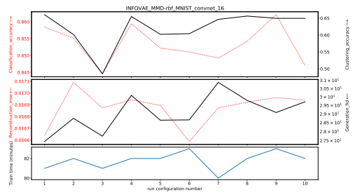

Clu y a u a
_
rin g e G
fid
_
tio n a e n e

Figure 22: Results on InfoVAE-RBF

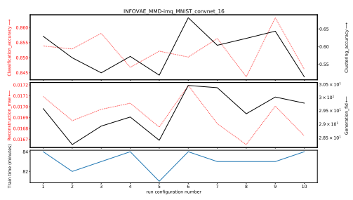

Clu y u
_
rin g G
fid
_
n n

Figure 23: Results on InfoVAE-IMQ

Adversarial AE (AAE) Makhzani [44] propose to use a GAN-like approach by replacing the regularisation induced by the KL divergence with a discriminator network D trained to differentiate between samples from the prior and samples from the posterior distribution. The encoder network therefore acts as a generator network, leading to the following objective

$$C_{\mathrm{AAE}}(x)=\mathbb{E}_{z}$$

LAAE(x) = Ez∼qϕ(z|x)[log pθ(x|z)] + αLGAN ,
with LGAN the standard GAN loss defined by

$${\mathcal{L}}_{\mathrm{GAN}}=\mathbb{E}_{\bar{z}\sim p_{z}(z)}\bigg[\log(1-D(\bar{z}))\bigg]+\mathbb{E}_{x\sim p_{\theta}}\bigg[\mathbb{E}_{z\sim q_{\phi}(z|x)}[\log D(z)]\bigg]\,,$$

For the Adversarial Autoencoder implementation, we use a MLP neural network for the discriminator composed of a single hidden layer with 256 units and ReLU activation. We observe a similar trade-off between reconstruction and generation quality as observed with β-VAE type models, as the α term acts like the β term, balancing between regularisation and reconstruction. Results by configuration

|        |        |        |        |      | Table 16: AAE configurations   |      |     |      |      |       |
|--------|--------|--------|--------|------|--------------------------------|------|-----|------|------|-------|
| Config | 1      | 2      | 3      | 4    | 5                              | 6    | 7   | 8    | 9    | 10    |
| α      | −3  1e | −2  1e | −1  1e | 0.25 | 0.5                            | 0.75 | 0.9 | 0.95 | 0.99 | 0.999 |

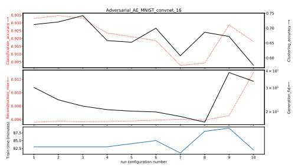

G 

Figure 24: Results on Adversarial AE

EL-VAE (MSSSIM-VAE) Snell et al. [61] propose an extension of the ELBO loss to a more general case where any deterministic reconstruction loss ∆(x, xˆ) can be used by replacing the probabilistic decoder pθ with a deterministic equivalent fθ such that the reconstruction xˆ of x given z ∼ qϕ(z|x) is defined as xˆ = fθ(z). The modified ELBO objective is thus defined as LEL−VAE(x) = ∆(x, xˆ) − βDKLqϕ(z|x)||p(z),
with β ≤ 1. As suggested in the original paper we use a multi scale variant of the single scale SSIM [68]: the Multi Scale Structural Similarity Metric (MS-SSIM) [67]. Results by configuration

|                       |        |        | Table 17: MSSSIM\-VAE configurations   |        |        |        |    |    |    |    |
|-----------------------|--------|--------|----------------------------------------|--------|--------|--------|----|----|----|----|
| Config                | 1      | 2      | 3                                      | 4      | 5      | 6      | 7  | 8  | 9  | 10 |
| β                     | −2  1e | −2  1e | −2  1e                                 | −1  1e | −1  1e | −1  1e | 1  | 1  | 1  | 1  |
| window size in MSSSIM | 3      | 5      | 11                                     | 5      | 3      | 11     | 11 | 5  | 3  | 15 |

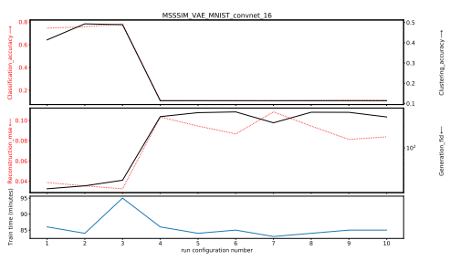

Clu y u
_
rin g fid
_
G
n n 

Figure 25: Results on MSSSIM-VAE

VAE-GAN Larsen et al. [41] use a GAN like approach by training a discriminator to distinguish real data from reconstructed data. In addition, the discriminator learns to distinguish between real data and data generated by sampling from the prior distribution in the latent space. Noting that intermediate layers of a discriminative network trained to differentiate real from generated data can act as data-specific features, the authors propose to replace the reconstruction loss of the ELBO with a Gaussian log-likelihood between outputs of intermediate layers of a discriminative network D:

$${\mathcal{L}}_{\mathrm{VAE\_GAN}}=\underbrace{\mathbb{E}_{z\sim q_{\pi}(z|x)}\bigg[\log{\mathcal{N}}\big(D_{l}(x)|D_{l}(\hat{x}),I\big)\bigg]}_{\mathrm{reconstruction}}-\underbrace{\mathcal{D}_{K L}\big[q_{\phi}(z|x)||p_{z}(z)\big]}_{\mathrm{regularization}}-{\mathcal{L}}_{G A N}\;,$$

where Dlis the output of the l th layer of the discriminator D, chosen to be representative of abstract intermediate features learned by the discriminator, and LGAN is the standard GAN objective defined as

$${\mathcal{L}}_{\mathrm{GAN}}=\log\left({\frac{D(x)}{1-D(x_{\mathrm{gen}})}}\right),$$

where xgen is generated using z ∼ pz(z). As encouraged by the authors, we add a hyper-parameter α to the reconstruction loss for the decoder only, such that a higher value of α will encourage better reconstruction abilities with respect to the features extracted at the l th layer of the discriminator network, whereas a smaller value will encourage fooling the discriminator, therefore favouring regularisation toward the prior distribution. For the VAEGAN implementation, we use a discriminator whose architecture is similar to the model's encoder given in Table. 5. For MNIST and CIFAR we remove the BatchNorm layer and change the activation of layer 2 to Tanh instead of ReLU. For CELEBA, the BatchNorm layer is kept and the activation of layer 2 is also changed to Tanh. For all datasets, the output size of the last linear layer is set to 1 instead of d and followed by a Sigmoid activation.

Results by configuration

| Table 18: VAEGAN configurations   |                             |     |     |     |     |     |     |      |       |
|-----------------------------------|-----------------------------|-----|-----|-----|-----|-----|-----|------|-------|
| 3                                 | Config  1                   | 2   | 4   | 5   | 6   | 7   | 8   | 9    | 10    |
| 0.7                               | α  0.3                      | 0.5 | 0.8 | 0.8 | 0.8 | 0.9 | 0.9 | 0.99 | 0.999 |
| 3                                 | reconstruction layer (l)  3 | 3   | 3   | 2   | 4   | 3   | 3   | 3    | 3     |

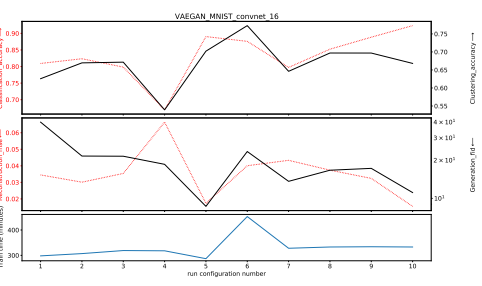

Clu y u
_
rin g G
fid
_
n n 

Figure 26: Results on VAEGAN

Wasserstein Autoencoder (WAE) Tolstikhin et al. [64] generalise the VAE objective by replacing both terms in the ELBO: similarly to [61] (EL-VAE), the reconstruction loss is replaced by any measurable cost function ∆, and the standard KL divergence is substituted with any arbitrary divergence D between two distributions, leading to the following objective function Eqϕ(z|x)[∆(x, xˆ)] + λDz(pz(z), qϕ(z)),
with λ a hyper-parameter. The authors propose two different penalties for Dz:

## 1. **Gan-Based: Wae-Gan**

An adversarial discriminatory network D(*z, z*′) is trained jointly to separate the "true" points sampled from the prior pz(z) from the "fake" ones sampled from qϕ(z|x), similarly to [44]
(Adversarial AE).

## 2. **Mmd-Based**

The Maximum Mean Discrepancy is used as a distance between the prior and the posterior distribution. This is the case considered in the benchmark. We choose to differentiate 2 cases in the benchmark: one with a Radial Basis Function (RBF) kernel, the other with the Inverse MultiQuadratic (IMQ) kernel as proposed in [64] where the kernel is given by k(*x, y*) = P
s∈S
s·C
s·C+∥x−y∥
2 2 with s ∈ [0.1, 0.2, 0.5, 1, 2, 5, 10] and C = 2 · d · σ 2, d being the dimension of the latent space and σ a parameter part of the hyper-parameter search. As proposed by the authors, for this model we choose to use a deterministic encoder meaning that qϕ(z|x) = δµϕ(x).

| Table 19: WAE configurations   |                           |        |     |        |        |    |    |     |    |    |
|--------------------------------|---------------------------|--------|-----|--------|--------|----|----|-----|----|----|
| 1                              | Config                    | 2      | 3   | 4      | 5      | 6  | 7  | 8   | 9  | 10 |
| −2                             | kernel bandwidth \- σ  1e | −1  1e | 0.5 | 1      | 1      | 1  | 1  | 1   | 2  | 5  |
| 1                              | λ                         | 1      | 1   | −2  1e | −1  1e | 1  | 10 | 100 | 1  | 1  |

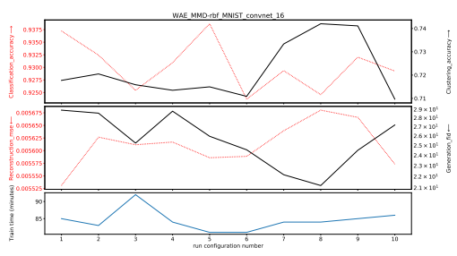

Clu y u
_
rin g G
fid
_
n n

Figure 27: Results on WAE-RBF

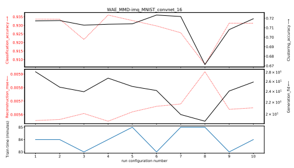

Clu y u
_
rin g G
fid
_
n n

Figure 28: Results on WAE-IMQ

Vector Quantized VAE (VQ-VAE) Van Den Oord et al. [66] propose to use a discrete space. Therefore, the latent embedding space is defined as a R
K×D vector space of K different D dimensional embedding vectors E = {e1*, . . . , e*K} which are learned and updated at each iteration.

Given an embedding size d and an input x, the output of the encoder ze(x) is of size R
d×D. Each of its d elements is then assigned to the closest embedding vector resulting in an embedded encoding zq(x) ∈ Edsuch that zq(x)j
= el where l = argmin1≤l≤d ||(ze(x))j − el||2 for j ∈ [1, d]. Since the argmin operation is not differentiable, learning of the embeddings and regularisation of the latent space is done by introducing the stopgradient operator sg in the training objective:
LVQ-VAE(x) := log p(x|zq(x)) + α||sg[ze(x)] − e||22 + β||ze(x) − sg[e]||22.

For the VQVAE implementation we use the Exponential Moving Average update as proposed in [66]
to replace the term ||sg[ze(x)] − e||22in the loss. Thus, we consider only two hyper-parameters in the search: the size of the dictionary of embeddings K and the regularisation factor β.

|        |      |      |     |     | Table 20: VQVAE configurations   |      |      |      |      |      |
|--------|------|------|-----|-----|----------------------------------|------|------|------|------|------|
| Config | 1    | 2    | 3   | 4   | 5                                | 6    | 7    | 8    | 9    | 10   |
| K      | 128  | 256  | 512 | 512 | 512                              | 512  | 512  | 512  | 1024 | 2948 |
| β      | 0.25 | 0.25 | 0.9 | 0.1 | 0.5                              | 0.25 | 0.75 | 0.25 | 0.25 | 0.25 |

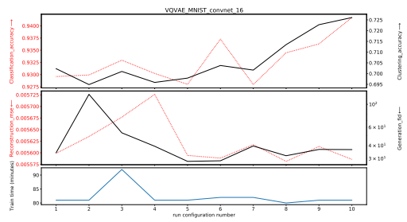

Clu y u
_
rin g G
fid
_
n n

Figure 29: Results on VQVAE

RAE L2 and RAE GP Ghosh et al. [27] propose to replace the stochastic VAE with a deterministic autoencoder by adapting the ELBO objective to a deterministic case. Under standard VAE assumption with Gaussian decoder, both the reconstruction and the regularisation terms in the ELBO loss can be written in closed form as

$$\begin{cases}\mathcal{L}_{\mathrm{reconstruction}}(x)=||x-\hat{x}||_{2}^{2}\,,\\ \mathcal{L}_{\mathrm{regularisation}}(x)=\frac{1}{2}\Big[||z||_{2}^{2}-d+\sum_{i=1}^{d}(\sigma_{\phi}(x)_{i}-\log\sigma_{\phi}(x)_{i})\Big]\,.\end{cases}$$

Arguing that the regularisation of the VAE model is done through a noise injection mechanism by sampling from the approximate posterior distribution z ∼ N (µϕ*, diag*(σϕ)), the authors propose to replace this stochastic regularisation with an explicit regularisation term, leading to the following deterministic objective:

$${\cal L}_{\rm RAE}=||x-\hat{x}||_{2}^{2}+\frac{\beta}{2}||z||_{2}^{2}+\lambda{\cal L}_{\rm REG}\,,\tag{1}$$

where LREG is an explicit regularisation. They propose to use either
- a L2 loss on the weights of the decoder (RAE-L2), which amounts to applying weight decay on the parameters of the decoder.

- a gradient penalty on the output of the decoder (RAE-GP), which amounts to applying a L2 norm on the gradient of the output of the decoder.

|        |        |        |        |        | Table 21: RAE configurations   |        |        |        |        |        |
|--------|--------|--------|--------|--------|--------------------------------|--------|--------|--------|--------|--------|
| Config | 1      | 2      | 3      | 4      | 5                              | 6      | 7      | 8      | 9      | 10     |
| β      | −6  1e | −4  1e | −3  1e | −3  1e | −3  1e                         | −3  1e | −3  1e | −2  1e | −1  1e | 1      |
| λ      | −3  1e | −3  1e | −6  1e | −4  1e | −2  1e                         | −1  1e | 1      | −3  1e | −3  1e | −3  1e |

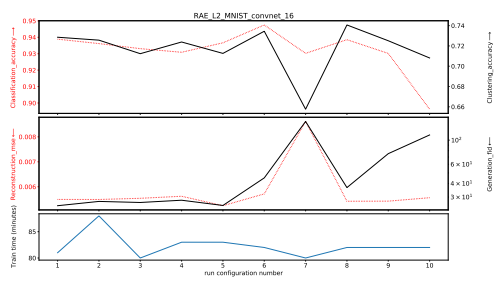

Clu

$$(4)$$

y a u a
_
rin g e
_
fid tio n G
a e n e 

Figure 30: Results on RAE-L2

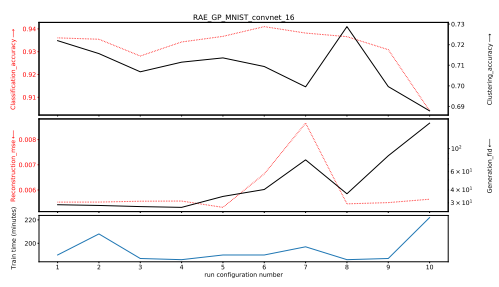

Figure 31: Results on RAE-GP
