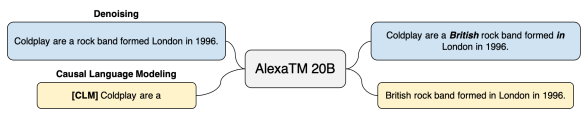
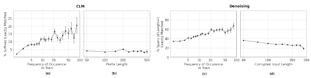
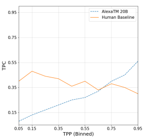

# Alexatm 20B: Few-Shot Learning Using A Large-Scale Multilingual Seq2Seq Model

Saleh Soltan∗ Shankar Ananthakrishnan Jack FitzGerald Rahul Gupta Wael Hamza Haidar Khan Charith Peris Stephen Rawls Andy Rosenbaum Anna Rumshisky Chandana Satya Prakash Mukund Sridhar Fabian Triefenbach Apurv Verma Gokhan Tur Prem Natarajan Amazon Alexa AI

#### Abstract

In this work, we demonstrate that multilingual large-scale sequence-to-sequence (seq2seq) models, pre-trained on a mixture of denoising and Causal Language Modeling (CLM) tasks, are more efficient few-shot learners than decoder-only models on various tasks. In particular, we train a 20 billion parameter multilingual seq2seq model called Alexa Teacher Model (AlexaTM 20B) and show that it achieves state-of-the-art (SOTA) performance on 1-shot summarization tasks, outperforming a much larger 540B PaLM decoder model. AlexaTM 20B also achieves SOTA in 1-shot machine translation, especially for low-resource languages, across almost all language pairs supported by the model (Arabic, English, French, German, Hindi, Italian, Japanese, Marathi, Portuguese, Spanish, Tamil, and Telugu) on Flores-101 dataset. We also show in zero-shot setting, AlexaTM 20B outperforms GPT3 (175B) on SuperGLUE and SQuADv2 datasets and provides SOTA performance on multilingual tasks such as XNLI, XCOPA, Paws-X, and XWinograd. Overall, our results present a compelling case for seq2seq models as a powerful alternative to decoder-only models for Large-scale Language Model (LLM) training.

# 1 Introduction

Recent studies (Brown et al., 2020b; Chowdhery et al., 2022) have demonstrated that Large-scale Language Models (LLMs) are capable of learning from few examples without any gradient updates (a.k.a. in-context learning). This capability of LLMs has been demonstrated to improve as the size of the model and the pre-training data increases (Rae et al., 2021; Hoffmann et al., 2022). However, most previous work has focused on decoder-only models as the architecture of choice for LLMs. The main shortcoming of decoder-only architecture is the unidirectional attention to the context (Radford & Narasimhan, 2018) which can be critical for long-context tasks such as summarization. Conceptually, sequence-to-sequence (seq2seq) architecture provides a better fit for training generative LLMs without losing the bidirectionally of the attention layers. Inspired by these considerations, in this work, we demonstrate that transformer-based seq2seq models can be used as few-shot learners, outperforming much larger decoder-only counterparts on the relevant core tasks. We pre-train a multilingual 20 billion parameter seq2seq model, which we will refer to as Alexa Teacher Model (AlexaTM 20B), on a mix of denoising and Causal Language Modeling (CLM) tasks in Arabic, English, French, German, Hindi, Italian, Japanese, Marathi, Portuguese, Spanish, Tamil, and Telugu, using the Wikipedia and mC4 datasets (Xue et al., 2021). We follow Hoffmann et al. (2022) and pre-train the model for roughly 1 Trillion tokens (longer than the 300B token updates of GPT-3). AlexaTM 20B is the first multilingual seq2seq model of this size with previous models having up to 11 billion parameters (Xue et al., 2021). AlexaTM 20B is also the first multilingual seq2seq model capable of in-context learning, since 1

∗Corresponding author: ssoltan@amazon.com.
almost all previously pre-trained seq2seq models were trained exclusively on denoising tasks (Raffel et al., 2020; Lewis et al., 2020; Xue et al., 2021), and thus are not suitable for in-context learning.

We demonstrate that not only AlexaTM 20B is capable of few-shot learning, but also outperforms much larger decoder-only models (e.g., PaLM 540B) on tasks that require attention to a long context, such as summarization. We show that AlexaTM 20B performs better than or on par with PaLM 540B on XSUM (Narayan et al., 2018) and MLSum (de and es) (Scialom et al., 2020) both in one-shot in-context learning and when fine-tuned. We also evaluate the AlexaTM 20B on the SuperGLUE and SQuADv2 datasets in zero-shot setting and show that it outperforms GPT3 175B on short context tasks, despite having 8x fewer parameters. AlexaTM 20B achieves SOTA in MT across almost all language pairs supported by the model on the Flores-101 dataset (Goyal et al., 2022), outperforming existing supervised models using only one-shot. The gain on translation to/from low-resource languages like Marathi, Tamil, and Telugu is significant (e.g., 21.8 Arabic to Tamil spBleu score compared to 0.9 score of the supervised M2M-124 615M model (Goyal et al., 2022)). The results suggest that large-scale seq2seq-style pre-training, as formulated in this work, may be the best way to improve low-resource language MT with limited training pairs, especially when a large amount of monolingual data is available. AlexaTM 20B also performs very well translating directly from different languages, in contrast to many-to-many MT systems that are trained mainly on to/from English language pairs (Fan et al., 2021). We believe these results suggest a paradigm shift in how MT systems should be developed. Additionally, we evaluate AlexaTM 20B on multilingual tasks including XNLI (Conneau et al., 2018), XCOPA (Ponti et al., 2020), Paws-X (Yang et al., 2019), and XWinograd (Tikhonov & Ryabinin, 2021). We show that AlexaTM 20B provides SOTA performance in zero-shot setting for all of these tasks, across all supported languages, improving on previous SOTA achieved by the XGLM 7.5B model (Lin et al., 2021). In order to understand the risks associated with using this model, we also analyze the amount of memorization in AlexaTM 20B and assess its fairness and biases. In contrast to Carlini et al. (2022)'s observations for GPT3, AlexaTM 20B's memorization slightly decreases with increasing context size in both the CLM and denoising modes. This suggests that the denoising objective (perhaps, coupled with multilinguality of the model) may be breaking the memorization of longer contexts by the model. While the ability to memorize training data can in principle degrade model performance on some tasks, it also alleviates some of the privacy concerns associated with training LLMs.

With respect to bias and toxicity, the model provides SOTA results on Winogender bias benchmark in zero-shot setting. However, consistent with prior work, we observe that in open-ended generation, AlexaTM 20B Toxicity Probability of Continuation (TPC) increases with Toxicity Probability of Prompt (TPP) (i.e., toxic prompts lead the model to generate more toxic continuations). Although, TPC is lower than TPP for the majority of the cases and that TPC is lower than the human baseline for low toxicity prompts. Overall, we demonstrate that the proposed style of pre-training of seq2seq models shows better performance compared to much larger decoder-only LLMs across different tasks, both in a few-shot setting and with fine-tuning. Additionally, we did not observe any negative results relative to decoder-only LLMs of similar size.

We hope our work presents a compelling case for seq2seq models as a powerful alternative to decoder-only models for LLM training. To summarize, the main contributions of our work are four-fold: 1) we train and release the largest available multilingual seq2seq model on a mix of denoising and CLM tasks and show that it is capable of few-shot in-context learning, 2) we demonstrate that large-scale seq2seq models are better at in-context learning when the context is long (e.g., summarization) compared to much larger decoder-only models, 3) we demonstrate that an 8x smaller seq2seq model can peform on par or better than GPT3 175B on SuperGLUE and SQuAD benchmarks, suggesting the efficiency of seq2seq models training, and 4) we show the strength of seq2seq multilingual pre-training in one-shot MT, suggesting a new paradigm for non-English-centric MT and low-resource languages.

We will release the AlexaTM 20B model on https://github.com/amazon-research/alexa-teacher-models.

# 2 Model Architecture

For AlexaTM 20B, we used the standard Transformer model architecture (Vaswani et al., 2017) with learnable positional embeddings with the small modification of moving the layernorms (both in the encoder and the decoder) to be located exactly at the beginning of each layer (right after the skip connection) instead of at the end of each layer (i.e., Pre-LN). This modification has been demonstrated to improve the stability of the training, especially for large models (Shoeybi et al., 2019; Xiong et al., 2020). Table 1 shows the detailed hyper-parameters of the AlexaTM 20B's architecture.

| Model       | Encoder Layers   | Decoder Layers   | # of Heads   | dmodel   | # of Parameters   |
|-------------|------------------|------------------|--------------|----------|-------------------|
|             |                  |                  |              |          | (in billions)     |
| AlexaTM 20B | 46               | 32               | 32           | 4096     | 19.75             |

Table 1: Model architecture details. The feed-forward size dff is 4 × dmodel.

# 3 Training Data Preparation

## 3.1 Datasets

| Dataset   |     | Sampling                  | Final Tokens   | Train Set Percent   |
|-----------|-----|---------------------------|----------------|---------------------|
|           | α   | = 0.5 lang sampling, then |                |                     |
| Wikipedia | 7   | × spoken form plus        | 119B           | 9%                  |
|           | 3   | × written form            |                |                     |
|           | α   | = 0.5 lang sampling, then |                |                     |
| mC4       | 0.7 | × spoken form plus        | 1.2T           | 91%                 |
|           | 0.3 | × written form            |                |                     |

The pre-training data consists of Wikipedia and mC4 (Xue et al., 2021) datasets. We use the data in 12 languages, namely, Arabic, English, French, German, Hindi, Italian, Japanese, Marathi, Portuguese, Spanish, Tamil, and Telugu. We pack sequences of tokens to produce sequences of approximately 1024 subword units.

We allow unrelated content to be packed together in the same sequence but we separate them with a special symbol ([DOC]). Maintaining a relatively constant number of subword sequences reduces padding and results in efficient compute.

Table 2: Source datasets and sampling methods for the training set.

Since our objective is to allow AlexaTM 20B to act on both spoken queries and written text, we use a written to spoken formatter for all languages to format the data into spoken format (remove capitalization, remove punctuations, etc.). We include more spoken than written text to satisfy our internal use cases. The final training set, described in Table 2, is developed by combining data from various sources using three types of mixing:
- Frequency based upsampling which helps increase the representation of under-represented languages following Conneau et al. (2020). In particular, we sample sentences according to a multinomial distribution with probabilities (q1, q2*, . . . , q*N ), where:

p
α
i
$\lambda$ ? 
PN
$\rho_{i}^{+}$
j=1 p
$${\overline{{\,p_{j}^{\alpha}\,}}},\ p_{i}={\frac{n_{i}}{\sum_{j=1}^{N}n_{j}}}$$
qi =
$\left(1\right)$. 

Figure 1: AlexaTM 20B pre-training objectives. During pre-training the model is trained on the denoising

 task 80% and on the Causal Language Modeling 20% of the time. pre-training data consists of Wikipedia and mC4 datasets in 12 languages as specified in Section 3.

in which N is the total number of languages and niis the total number of sentences in language i (we set α = 0.5).

- Upsampling Wikipedia data (which has a higher quality) by 10 to be represented more in all data. - Scaling to favor spoken format over written 7 to 3.

We followed Brown et al. (2020b) and filtered out known benchmarks from the training data by checking for 13-gram overlaps between each sentence and the benchmarks (for the list of filtered datasets see Appendix C).

## 3.2 Subword Tokenizer

We use SentencePiece (SP) (Kudo & Richardson, 2018) to tokenize the input. We trained a unigram-based model of SP to determine a set of sub-words that best represents the training data. Our final choice was to train a 150K unigram sentencepiece model from a 7 to 3 mixture ratio of spoken to written data. We reserve 1K vocabulary entries to be used for tags in downstream tasks (e.g., parse nodes in semantic parsing task). We also manually augment the vocabulary with a few entries to guarantee better character and word coverage.

# 4 Training Setup

AlexaTM 20B model class is derived from BART (Lewis et al., 2020) class implementation in Huggingface (Wolf et al., 2019) allowing us to benefit from the generate function built in the parent class for inference. To train the model, we used a denoising objective in which we drop 15% of the tokens in the input (in spans of length determined by a Poisson distribution with mean equal to 3) and expect the model to reconstruct the input. We do not add any mask tokens in the input during training: 1) to have the most consistency during pre-training, inference, and fine-tuning (i.e., no mask tokens appear in any setting), 2) to require the decoder to play a more active role during pre-training, and 3) to leverage the 10B encoder that we had trained previously (FitzGerald et al., 2022) to initialize AlexaTM 20B's encoder (adding [MASK] would have made decoder job easy given encoder's ability in "unmasking"). To make our model more efficient for in-context learning, we added an extra Causal Language Modeling
(CLM) task to the 20B training for 20% of the time.1In this task, the model is required to continue the input instead of denoising the input. The model will know to do CLM based on a special token that we add to the beginning of the sentence ([CLM]). For the CLM task, we only feed a single document (instead of concatenation of multiple documents) and give 20% to 80% of the document randomly (uniformly) as the input to the model (so the model learns to continue both from long inputs and short inputs).

1The CLM using seq2seq models has also been called Prefix Language Modeling (PLM) (Raffel et al., 2020). However, since the term "prefix" has been excessively used recently in other context (Li & Liang, 2021), we prefer to use CLM to avoid any confusions.
To speed up the model training, we initialized the encoder by an internal 10B pre-trained encoder FitzGerald et al. (2022) (we also initialize the decoder embeddings and LM head embeddings with the embedding from encoder but we do not tie any pair of embeddings). During training, we initially keep the encoder frozen (for around 100k updates) but unfreeze the encoder to train the model end to end.

We trained AlexaTM 20B for 120 days on 128 A100 GPUs for the total of 500k updates with the accumulated batch size of 2 million tokens (total of 1 trillion token updates). We used Adam optimizer (Kingma & Ba, 2015) with lr = 1e
−4 with linear decay to lr = 5e
−6 over 500k updates. We used weight decay of 0.1 on all parameters except biases and layernorms. Finally, we trained the model in BFloat16 which helped with the stability of training (Raffel et al., 2020).

We used DeepSpeed's ZeRO Stage 3 (Rasley et al., 2020) to partition model weights, optimizer states, and gradients across all GPU workers, allowing us to train the model with high throughput. We relied on an internal and optimized version of DeepSpeed that we have since open-sourced (Chiu & Zheng, 2022) to obtain training throughput of up to 154 TFLOPS/GPU on 16 AWS p4d.24xlarge compute instances.

# 5 Evaluation Setups

We evaluate AlexaTM 20B both using zero/few-shot in-context learning as well as by finetuning the model on selected generation tasks. In all few-shot learning settings, we use greedy search.

## 5.1 Few-Shot Learning

Since AlexaTM 20B is trained both on denoising and CLM tasks, both of these modes can be used for in-context learning. In this subsection, we describe some of the techniques that we used for in-context learning using the model. For some tasks, instead of asking the model to generate answers, we present multiple inputs to the model
(corresponding to task labels/choices) and calculate the model's score for each input. We refer to this as scoring. Specifically, we provide the encoder and decoder inputs to AlexaTM 20B (e.g. see Table A3) and compute the cross-entropy loss in the decoder with teacher-forcing for each set of inputs. The model predicts the task label or choice with the best score.

#### 5.1.1 Denoising Mode

The denoising mode can be used both for generation (by dropping a few tokens from end of a prompt) and scoring (by dropping tokens from the input and comparing the loss for different output choices). Notice that since during pre-training we dropped only short spans, the generation in denoising mode is most effective when only a few tokens are omitted in the input.

#### 5.1.2 Clm Mode

The CLM mode is similar to the way previous large-scale decoder-only models have been using these models for generation and scoring for in-context learning (Brown et al., 2020b; Chowdhery et al., 2022; Lin et al., 2021). We follow these works and use the CLM mode of AlexaTM 20B for various tasks. The CLM mode can also be used for scoring when the task provides choices to select from.

#### 5.1.3 Clm Mode With Fusion In The Decoder

One benefit of seq2seq models compared to decoder-only models is that we can fit more shots into their context using Fusion-in-Decoder (FiD) idea which was initially proposed by Izacard & Grave (2021). For this and in few-shot settings, we encode many 1-shot examples using the encoder and let the decoder attend to all of these examples while generating the output. Throughout this paper, when we use FiD idea, we denote number of shots by ∗such as 32∗-shots.

## 5.2 Fine-Tuning

We also finetune AlexaTM 20B on a selected generation tasks to compare its performance to previous seq2seq as well as much larger decoder-only models (when finetuned). For all the finetunings, we add [CLM] to the beginning of the input (basically finetuning the model in the CLM mode, although denoising mode could also be used but may require extra number of training steps). For all the tasks that we finetune AlexaTM 20B, we use adam with lr = 1e
−6 with linear decay to lr = 1e
−7 and picked the best checkpoint based on validation perplexity. Given the finetuning cost, we did not do any task specific hyper-parameter searches.

# 6 Evaluation Results

In this section, we evaluate the AlexaTM 20B performance across monolingual and multilingual tasks. In particular, we demonstrate that AlexaTM 20B performs better or in par to the largest dense decoder-only model to date (i.e., PaLM 540B) in summarization both in 1-shot and fine-tuning settings. We also show that AlexaTM 20B provides the best scores in Flores 101 Machine Translation (MT) in almost all languages pairs supported by the model (especially for low-resource languages like Marathi, Tamil, and Telugu). Moreover, it performs on par or better than GPT3 175B parameter model across various English tasks in zero-shot (e.g., SuperGLUE). Nevertheless, we demonstrate that there are different tasks like "reasoning" that the model cannot do as well as much larger models. Additionally, we evaluate AlexaTM 20B on a few multilingual datasets including XNLI, XCOPA, Paws-X, and XWinograd and show that AlexaTM 20B achieves SOTA numbers in zero-shot on all these tasks across all languages better than XGLM 7.5B model (Lin et al., 2021). The prompts used for each task and the evaluation mode are provided in Appendix B.

6.1 Multilingual Natural Language Generation

|            |      |      | 1\-shot   |         |      |      |      | Finetuning   |         |        |
|------------|------|------|-----------|---------|------|------|------|--------------|---------|--------|
| Task       | PaLM | PaLM | PaLM      | AlexaTM | T5   | PaLM | PaLM | PaLM         | AlexaTM | SOTA   |
|            | 8B   | 62B  | 540B      | 20B     | XXL  | 8B   | 62B  | 540B         | 20B     |        |
| MLSum (de) | 4.6  | 10.5 | 12.8      | 28.51   | 35.9 | 26.5 | 30.0 | 33.1         | 33.73   | 36.4a  |
| MLSum (es) | 2.3  | 3.2  | 3.6       | 5.22    | 12.0 | 10.6 | 11.2 | 12.0         | 13.59   | 13.8a  |
| MLSum (fr) | \-   | \-   | \-        | 10.24   | \-   | \-   | \-   | \-           | 26.09   | 10.61b |
| XSum (en)  | 7.9  | 11.2 | 12.2      | 11.69   | 21.0 | 16.3 | 18.5 | 21.2         | 24.16   | 27.1c  |

Table 3: ROUGE-2 results on summarization datasets. T5 and PaLM scores are from Chowdhery et al.

(2022). Bold numbers denote the best and underline denotes better than PaLM 540B. The SOTA numbers are from a(Gehrmann et al., 2021), b(Scialom et al., 2020), and c(Zoph et al., 2022).

In this section, we evaluate AlexaTM 20B model performance on generation tasks. For comparison we focus on the tasks that the PaLM models (Chowdhery et al., 2022) were evaluated on. Table 3 presents the

|            | 1\-shot   |         |
|------------|-----------|---------|
| Task       | PaLM      | AlexaTM |
|            | 540B      | 20B     |
| MLSum (de) | 18.0      | 34.21   |
| MLSum (es) | 10.2      | 14.63   |
| XSum (en)  | 24.4      | 25.73   |

Table 4: ROUGE-L results on summarization datasets comparing PalM 540B and AlexaTM 20B. PaLM scores are only provided for the 540B model by Chowdhery et al. (2022).

ROUGE-2 scores on different summarization tasks both in 1-shot as well as when finetuned.2 As can be seen, AlexaTM 20B outperforms PaLM 540B model across all tasks when finetuned, indicating that for tasks that require attention to a long context, even a 25 times larger decoder-only model cannot compensate for a lack of bidirection attention mechanism.

|             | 1\-shot   |      |         | Few\-shot   |      |      | Finetuning   |         |       |
|-------------|-----------|------|---------|-------------|------|------|--------------|---------|-------|
| Task        | PaLM      | PaLM | AlexaTM | AlexaTM     | T5   | PaLM | PaLM         | AlexaTM | SOTA  |
|             | 62B       | 540B | 20B     | 20B         | XXL  | 62B  | 540B         | 20B     |       |
| E2E (en)    | 33.5      | 35.2 | 21.25   | 34.25       | 45.3 | 45.2 | 45.3         | 45.3    | 45.8a |
| WebNLG (en) | 38.6      | 44.4 | 20.0    | 26.16       | 39.6 | 48.6 | 49.3         | 49.0    | 53.5b |

Moreover, although one would have expected that a finetuned seq2seq model should perform better than a finetuned decoder-only (rather much larger) model, as can be seen in the Tables 3 and 4, even in the 1-shot setting the AlexaTM 20B performs better than PaLM 540B (except only in ROUGE-2 on XSum). These results reveal an inherent weakness of decoder-only models on tasks that have a long context.

|             | 1\-shot (R1/R2/RL)   |                   |               | 5\-shot (R1/R2/RL)   |                   |
|-------------|----------------------|-------------------|---------------|----------------------|-------------------|
| Task        | AlexaTM 20B          | T5 XXL            | UL2 20B       | AlexaTM 20B          | T5 XXL            |
|             |                      | LM\-adapt         |               |                      | LM\-adapt         |
| MLSum (de)  | 38.11/28.51/34.21    | 28.24/18.81/24.63 | -             | -                    | -                 |
| MLSum (es)  | 18.82/5.22/14.63     | 14.18/3.5/11.15   | -             | -                    | -                 |
| MLSum (fr)  | 25.85/10.24/19.03    | 19.99/7.31/14.25  | -             | -                    | -                 |
| XSum (en)   | 32.41/11.69/25.73    | 31.14/10.76/24.38 | 25.5/8.6/19.8 |                      |                   |
| E2E (en)    | 45.93/21.25/32.36    | 53.25/24.95/36.68 | -             | 52.46/28.8/41.15     | 53.21/22.81/34.02 |
| WebNLG (en) | 34.47/20/29.22       | 37.44/20.78/29.04 | -             | 45.07/27.61/34.35    | 38.49/22.39/30.13 |

Table 5: ROUGE-2 results on NLG datasets. Underline denotes the best between models with less than 62B
parameters. Bold denotes the best score. The few-shot results for AlexaTM 20B is based on 32∗shots. The SOTA numbers are from a(Xue et al., 2021) and b(Bakshi et al., 2021).

We also evaluated AlexaTM 20B on Cleaned E2E NLG (Novikova et al., 2017; Dusek et al., 2019) and WebNLG 2020 (Ferreira et al., 2020) datasets which has much shorter context than the summarization task.

As can be seen in Table 5, for these tasks, the decoder-only models perform much better than AlexaTM 20B (although we can bridge the gap by providing the model with more shots). Nevertheless, as in the summarization case, in the finetuned case, the AlexaTM 20B performs on par or better than PaLM 62B and 540B models.

Table 6: Few-shot performance comparison in ROUGE score between AlexaTM 20B and T5 XXL LM- adapt (Lester et al., 2021). We also included 1-shot results for XSum for UL2 20B from Tay et al. (2022).

Finally, we compared AlexaTM 20B to T5 XXL (LM-Adapt) (Lester et al., 2021) and a very recent UL2 7

2All the Rouge scores are computed using rouge-score 0.0.4 python package (Lin, 2004) with use stemmer option set to true following Gehrmann et al. (2021).
20B (Tay et al., 2022) that are trained very similarly to our model. In particular, T5 XXL (LM-adapt) is T5 model (Raffel et al., 2020) which has been train on CLM task for extra 100k updates (for 1.1 trillion token updates in total including the T5 pre-training). The UL2 20B is also a seq2seq model which has been trained
(concurrently to our work) on a mix of CLM and denoising tasks on English only data for 1 trillion token updates. We report UL2 20B numbers for XSum from the paper but computed the T5 XXL (LM-adapt) ourselves. As can be seen in Table 6, the AlexaTM 20B outperforms both T5 XXL (LM-adapt) and UL2 20B in 1-shot summarization. In contradiction to what reported by Tay et al. (2022), however, we observe that T5 XXL (LM-adapt) performs very strongly across different tasks. Especially, it outperforms UL2 20B in 1-shot summarization on XSum and PaLM 62B on MLSUM (es and de). This may suggest why the prompt tuning idea of Lester et al. (2021) worked on T5 XXL (LM-adapt), since the model is already a good few-shot learner (and why it probably did not work as well on the original T5 model). The T5 XXL (LM-adapt) also performs very well on E2E and WebNLG tasks. In particular it performs better than AlexaTM 20B in 1-shot settings in E2E. However, in both tasks AlexaTM 20B performs better in few-shot settings. Since UL2 20B did not report on these tasks, we only compared to T5 XXL (LM-adapt).

Overall, performance evaluation of our model and T5 XXL (LM-adapt) on generation tasks demonstrates that seq2seq models are as good as or better than decoder-only models that are limited by their unidirectional attention.

## 6.2 Machine Translation

In order to evaluate cross-lingual capabilities of AlexaTM 20B. We evaluated it on a few Machine Translation
(MT) datasets. First, since AlexaTM 20B is multilingual, we used Flores-101 (Goyal et al., 2022) dataset to evaluate the model performance on all language pairs supported by the model on a high quality test set.

Moreover, since this dataset is for evaluating MT models only (i.e., provides no training data), it seems to be the perfect test set to evaluate few-shot capabilities of large-scale language models. Table 7 presents the spBLEU scores (as recommended to be used on this dataset) on all language pairs devtest set. For each language pair, we used 1-shot from Flores-101 dev set (we experimented on using 4-shot but we did not see any gains as shown in Table A1 in the appendix). As can be seen, AlexaTM 20B outperforms the supervised M2M-124 615M model from Goyal et al. (2022) and XGLM 7.5B, which is a multilingual decoder-only model (Lin et al., 2021), across almost all pairs. In particular, the gains on translation to/from low-resource languages like Marathi, Tamil, and Telugu are significant. This suggests that seq2seq style pre-training on large-scale, as we proposed here, may be the best way to improve on low-resource languages with limited training pairs (although this depends on having a good amount of monolingual data on the target low-resource language). Moreover, it is clear from the results that the model is perfectly capable of translating directly from different languages in opposed to many to many MT systems that are trained mainly on to/from English language pairs. The presented results could result in a paradigm shift on how MT systems are developed. To compare AlexaTM 20B against much larger GPT 175B and PaLM 540B, we also evaluated the model on English-German WMT'16, English-French WMT'14, and German-French WMT'19 test sets. Results are presented in Tables 8 and 9. As can be seen, in most English centric cases AlexaTM 20B performs better than GPT3 175B but it trails much larger PaLM 540B model. Nevertheless, on French to/from German translation, AlexaTM 20B performs better than PaLM 540B in 1-shot and 5-shot settings. Moreover, it provides a new SOTA on French to German WMT'19 translation task.

|    |             | shots   | ar   | fr   | en   | de   | it   | ja   | hi   | mr        | ta   | te   | es    |
|----|-------------|---------|------|------|------|------|------|------|------|-----------|------|------|-------|
|    | Supervised  | NA      | -    | 25.7 | 25.5 | 18.7 | 17.8 | 16.0 | 19.4 | 2.5       | 0.9  | 0.3  | 16.74 |
| ar | XGLM 7.5B   | 32      | -    | 17.9 | 27.7 | 12.2 | -    | -    | 7.8  | -         | 3.7  | -    | -     |
|    | AlexaTM 20B | 1       | -    | 35.5 | 41.8 | 27.5 | 25.4 | 20.6 | 24.4 | 15.9      | 21.8 | 6.0  | 23.2  |
|    | Supervised  | NA      | 15.4 | -    | 37.2 | 28.5 | 28.6 | 21.5 | 22.9 | 6.9       | 0.8  | 0.6  | 25.6  |
| fr | XGLM 7.5B   | 32      | 5.9  | -    | 40.4 | 20.4 |      |      | 13.7 | -         | 6.6  | -    | -     |
|    | AlexaTM 20B | 1       | 24.7 | -    | 47.1 | 32.4 | 29.9 | 24.3 | 27.3 | 19.3      | 23.7 | 27.0 | 26.3  |
|    | Supervised  | NA      | 17.9 | 42.0 | -    | 32.6 | 27.7 | 22.8 | 28.1 | 10.4      | 3.4  | 1.9  | 25.6  |
| en | XGLM 7.5B   | 32      | 11.5 | 36.0 | -    | 27.6 | -    | -    | 19.9 | -         | 8.5  | -    | -     |
|    | AlexaTM 20B | 1       | 32.0 | 50.7 | -    | 41.2 | 34.4 | 28.4 | 35.1 | 24.7      | 30.0 | 34.2 | 31.0  |
|    | Supervised  | NA      | 14.8 | 35.5 | 35.8 | -    | 25.9 | 21.1 | 23.4 | 9.2       | 2.3  | 0.6  | 23.4  |
| de | XGLM 7.5B   | 32      | 6.6  | 27.9 | 35.8 | -    | -    | -    | 14.3 | -         | 4.8  | -    | -     |
|    | AlexaTM 20B | 1       | 24.3 | 38.7 | 45.5 | -    | 29.4 | 24.9 | 27.6 | 18.7      | 24.1 | 27.6 | 26.1  |
|    | Supervised  | NA      | 13.4 | 34.4 | 28.7 | 24.2 | -    | 19.8 | 20.6 | 9.0       | 2.2  | 0.5  | 24.5  |
| it | XGLM 7.5B   | 32      | -    | -    | -    | -    | -    | -    | -    | -         | -    | -    | -     |
|    | AlexaTM 20B | 1       | 22.0 | 35.7 | 37.5 | 27.9 | -    | 22.9 | 24.7 | 15.8      | 21.2 | 24.8 | 25.9  |
|    | Supervised  | NA      | 10.3 | 21.9 | 19.5 | 16.3 | 16.0 | -    | 17.9 | 7.6       | 3.1  | 0.5  | 15.7  |
| ja | XGLM 7.5B   | 32      | -    | -    | -    | -    | -    | -    | -    | -         | -    | -    | -     |
|    | AlexaTM 20B | 1       | 12.6 | 27.0 | 28.5 | 21.2 | 21.3 | -    |      | 16.7 15.5 | 0.2  | 0.2  | 20.0  |
|    | Supervised  | NA      | 12.2 | 25.9 | 27.9 | 19.4 | 17.9 | 18.0 | -    | 12.6      | 3.8  | 0.7  | 16.6  |
| hi | XGLM 7.5B   | 32      | 6.1  | 15.4 | 25.2 | 12.3 | -    | -    | -    | -         | 1.9  | -    | -     |
|    | AlexaTM 20B | 1       | 8.9  | 32.8 | 40.0 | 25.4 | 23.3 | 20.9 | -    | 15.9      | 24.5 | 23.3 | 21.5  |
|    | Supervised  | NA      | 7.4  | 16.6 | 18.7 | 12.6 | 12.4 | 13.2 | 21.3 | -         | 4.4  | 0.5  | 11.8  |
| mr | XGLM 7.5B   | 32      | -    | -    | -    | -    | -    | -    | -    | -         | -    | -    | -     |
|    | AlexaTM 20B | 1       | 14.1 | 29.3 | 35.7 | 22.8 | 21.4 | 12.0 | 27.6 | -         | 15.7 | 23.5 | 20.6  |
|    | Supervised  | NA      | 1.1  | 6.8  | 8.3  | 4.9  | 5.7  | 2.4  | 6.9  | 3.1       | -    | 0.3  | 5.3   |
| ta | XGLM 7.5B   | 32      | 5.4  | 10.3 | 16.3 | 8.4  | -    | -    | 7.2  | -         | -    | -    | -     |
|    | AlexaTM 20B | 1       | 18.2 | 27.6 | 32.3 | 21.5 | 20.6 | 19.3 | 25.0 | 18.4      | -    | 26.9 | 19.1  |
|    | Supervised  | NA      | 4.8  | 13.2 | 15.1 | 8.8  | 8.7  | 8.8  | 12.9 | 6.7       | 3.2  | -    | 9     |
| te | XGLM 7.5B   | 32      | -    | -    | -    | -    | -    | -    | -    | -         | -    | -    | -     |
|    | AlexaTM 20B | 1       | 19.1 | 26.7 | 38.8 | 23.8 | 22.3 | 14.9 | 26.7 | 20.7      | 18.5 | -    | 20.9  |
|    | Supervised  | NA      | 12.1 | 29.3 | 25.1 | 21.0 | 23.9 | 18.1 | 18.5 | 7.1       | 0.4  | 0.5  | -     |
| es | XGLM 7.5B   | 32      | -    | -    | -    | -    | -    | -    | -    | -         | -    | -    | -     |
|    | AlexaTM 20B | 1       | 20.8 | 33.4 | 34.6 | 25.8 | 26.7 | 22.3 | 24.3 | 17.8      | 21.2 | 23.7 | -     |

Table 7: Machine translation results on FLORES-101 devtest (spBLEU). Source language in rows, target language in columns. XGLM 7.5B use 32 examples from the dev set for few-shot learning while AlexaTM 20B uses only 1-shot. Supervised results correspond to the M2M-124 615M model (Fan et al., 2021) computed by Goyal et al. (2022). Underline denotes better than Supervised bold denotes best of XGLM and AlexaTM 20B. spBLEU scores are computed using the implementation of Goyal et al. (2022).

|     |     | 0\-shot   |      |      | 1\-shot   |      |      |         | Few\-shot   |      |      | Supervised   |
|-----|-----|-----------|------|------|-----------|------|------|---------|-------------|------|------|--------------|
| Src | Tgt | AlexaTM   | GPT3 | PaLM | AlexaTM   | GPT3 | PaLM | AlexaTM | XGLM        | GPT3 | PaLM | Finetuned    |
|     |     | 20B       | 175B | 540B | 20B       | 175B | 540B | 20B     | 7.5B        | 175B | 540B | SOTA         |
| de  | en  | 32.7      | 27.2 | 43.8 | 34.04     | 30.4 | 43.9 | 41.01   | 34.6        | 40.6 | 47.5 | 41.2         |
| en  | de  | 21.64     | 24.6 | 31.8 | 29.02     | 26.2 | 31.8 | 35.23   | 23.5        | 29.7 | 37.4 | 41.2         |
| fr  | en  | 29.24     | 21.2 | 41.1 | 31.76     | 33.7 | 37.4 | 38.38   | 33.2        | 39.2 | 42.8 | 45.4         |
| en  | fr  | 21.31     | 25.2 | 38.5 | 29.79     | 28.3 | 37.5 | 38.75   | 28.5        | 32.6 | 44   | 45.6         |

|     |     | 0\-shot   |      | 1\-shot   |      | 5\-shot   |      | Supervised   |
|-----|-----|-----------|------|-----------|------|-----------|------|--------------|
| Src | Tgt | AlexaTM   | PaLM | AlexaTM   | PaLM | AlexaTM   | PaLM | Finetuned    |
|     |     | 20B       | 540B | 20B       | 540B | 20B       | 540B | SOTA         |
| de  | fr  | 22.44     | 28.6 | 28.84     | 20.9 | 29.74     | 25.7 | 31.5         |
| fr  | de  | 21.34     | 25.2 | 24.24     | 9.5  | 27.31     | 17.4 | 24.9         |

Table 8: Translation BLEU scores on en-de WMT'16 and en-fr WMT'14 language pairs. Underline denotes the best between GPT3 175B and AlexaTM 20B and Bold denotes the best score between all settings.

AlexaTM 20B, GPT3 175B, and PaLM few-shot results are based on 32∗, 64, and 5 examples, respectively.

PaLM numbers are from Chowdhery et al. (2022) and GPT3 numbers are from Brown et al. (2020b).

Table 9: Translation BLEU scores on non-English centric WMT'19 language pairs. Underline denotes the best between PaLM and AlexaTM and Bold denotes the best score between all settings. WMT'19 SOTA numbers are from Xia et al. (2019). PaLM numbers are from Chowdhery et al. (2022).

## 6.3 Multilingual Nlp Tasks

We follow Lin et al. (2021) and evaluate AlexaTM 20B on four multilingual data sets to evaluate its performance on non-English tasks. In particular, we test the model's 0-shot performance on XNLI (Conneau et al., 2018), XCOPA (Ponti et al., 2020), Paws-X (Yang et al., 2019), and XWinograd (Tikhonov & Ryabinin, 2021). As can be seen in Table 10, AlexaTM 20B performs better or on par to XGLM 7.5B (Lin et al., 2021) across all tasks and languages (supported by both models). See Table A3 for example prompts for each task.

| Task      | Language   | AlexaTM 20B   | XGLM 7.5B   |
|-----------|------------|---------------|-------------|
|           | en         | 55.1          | 55.3        |
|           | ar         | 45.1          | 48.1        |
| XNLI      | de         | 47.1          | 42.3        |
| (test)    | es         | 47.5          | 39.1        |
|           | fr         | 50.4          | 50.8        |
|           | hi         | 48.7          | 43.4        |
| XCOPA     | it         | 61.0          | 60.8        |
| (test)    | ta         | 58.8          | 56.2        |
|           | en         | 55.5          | 52.47       |
|           | de         | 54.6          | 51.76       |
| Paws\-X   | es         | 56.2          | 53.49       |
| (dev)     | fr         | 55.6          | 53.45       |
|           | ja         | 55.05         | 50.55       |
|           | en         | 63.48         | 50.67       |
| XWinograd | pt         | 56.85         | 51.97       |
| (test)    | fr         | 50.98         | 49.67       |
|           | ja         | 55.57         | 50.51       |

Table 10: Zero-shot accuracy results across various multilingual datasets. XGLM 7.5B numbers for XNLI
and XCOPA are as reported by Lin et al. (2021). We reproduced Paws-X and XWinograd scores to get per language scores.

## 6.4 English Nlp Tasks

To demonstrate AlexaTM 20B performance on English tasks and compare its performance to larger decoder only models. We evaluated the model performance on SuperGLUE (Wang et al., 2019) and SQuADv2 (Rajpurkar et al., 2018) in zero-shot setting. For most of the tasks in SuperGLUE as well as for SQUADv2, we observed that adding a dummy example or two to the prompt help the model generate outputs in the desired format. Hence, we adding questions like
"Is the context written in English?" or "What is the first word in the context?" to the prompts for different tasks. To see the exact prompt used for each task, please refer to Appendix B.

#### 6.4.1 Superglue

Zero-shot results on SuperGLUE dev set are presented in Table 11. As can be seen, although AlexaTM 20B is behind PaLM 540B on SuperGLUE tasks on average, it performs better than GPT3 175B. Moreover, it achieves a new SOTA on zero-shot CB task. It can also be seen that AlexaTM 20B outperforms recently released BLOOM 175B decoder-only model.3

3While we were finalizing this paper, Huggingface released BLOOM 175B (https://huggingface.co/bigscience/bloom).

However, it is yet to be fully evaluated across different tasks. Hence, we only include the available scores in our paper.

| Model       | BoolQ   | CB    | RTE   | ReCoRD   | WSC   | WiC   | CoPA   | MultiRC   | Avg   |
|-------------|---------|-------|-------|----------|-------|-------|--------|-----------|-------|
|             | (acc)   | (acc) | (acc) | (acc)    | (acc) | (acc) | (acc)  | (f1a)     |       |
| PaLM 540B   | 88.0    | 51.8  | 72.9  | 92.9     | 89.1  | 59.1  | 93.0   | 83.5      | 78.8  |
| GPT3 175B   | 60.5    | 46.4  | 63.5  | 90.2     | 65.4  | 0.0   | 91.0   | 72.9      | 61.2  |
| BLOOM 175B  | 63.5    | 33.9  | 52.0  | NA       | 51.9  | 50.6  | 56.0   | 57.1      | NA    |
| GPT3 13B    | 66.2    | 19.6  | 62.8  | 89.0     | 64.4  | 0.0   | 84.0   | 71.4      | 57.2  |
| UL 20B      | 63.1    | 41.1  | 60.7  | 88.1     | 79.9  | 49.8  | 85.0   | 36.2      | 63.0  |
| AlexaTM 20B | 69.44   | 67.9  | 68.59 | 88.4     | 68.27 | 53.29 | 78.0   | 59.57     | 69.16 |

Table 11: Zero-shot results on SuperGLUE dev set. Bold and underline denote the best and second best scores, respectively. Scores for all models except AlexaTM 20B are from corresponding papers. The scores for BLOOM 175B are from the model card in Huggingface (Wolf et al., 2020). The scores for ReCoRD were not reported by the authors.

#### 6.4.2 Squad

| Task    | Metric   | AlexaTM 20B   | GPT3 175B   | PaLM 540B   |
|---------|----------|---------------|-------------|-------------|
| SQuADv2 | f1       | 74.29         | 59.5        | 80.8        |
| (dev)   | EM       | 59.71         | 52.6        | 75.5        |

As can be seen in Table 12, AlexaTM 20B performs better than GPT 175B but cannot reach to PaLM 540B model performance. This is consistent with the results we observed on SuperGLUE indicating that to reach the 540B parameter model performance, we need to scale up the seq2seq model size as well (although not as extremely).

Table 12: Zero-shot results on SQuADv2 dataset. GPT3 and PaLM results are from corresponding papers.

## 6.5 Shortcoming On Reasoning Tasks

|                 | GPT\-3 (6.7B)   | T0 (11B)   | OPT (13B)   | AlexaTM (20B)   | GPT\-3 (175B)   |
|-----------------|-----------------|------------|-------------|-----------------|-----------------|
| Zero\-shot      | 1.5             | 2.8        | 3.7         | 4.7             | 3.3             |
| Zero\-shot\-CoT | 2.3             | 3.2        | 2.2         | 6.0             | 19.0            |

In this section, we share AlexaTM 20B performance on MultiArith (Roy & Roth, 2016) dataset. We also follow Kojima et al. (2022) and use prompts like "Let's think step by step" to elicit better reasoning by the model. We refer to the results with such a prompt by Zero-shot-CoT following the Chain of Thought work by Wei et al. (2022). For the exact prompts used for AlexaTM 20B, see Table A6 in the Appendix.

Table 13 presents the zero-shot results with and without the special prompt. T0 is a seq2seq model trained on top of T5 in multitasks setting to understand prompts (Sanh et al., 2021) and OPT is an English decoder-only model (Zhang et al., 2022). As can be seen, AlexaTM 20B performs slightly better than similar sized models. However, we did not observe the gain that much larger models like GPT3 175B show from such special prompts. The results indicate that scaling up the model parameteres is crucial in performing well in
"reasoning" tasks as was previously demonstrated by Kojima et al. (2022) in decoder-only architectures using Instruct-GPT3 (Ouyang et al., 2022) models.

Table 13: Zero-shot accuracy on MultiArith dataset for different model sizes. Scores for all models except AlexaTM 20B are from from Kojima et al. (2022).

Figure 2: (a) Percentage of suffixes (length=50) memorized as a function of frequency of occurrence in the

training data, (b) percentage of suffixes (length=50) memorized as a function of prefix length, (c) percentage of spans (length=1) memorized as a function of frequency of occurrence in the training data and (d) percentage of spans (length=1) memorized as a function of corrupted input length.

# 7 Memorization

In this section, we present an analysis of the training data memorization observed in AlexaTM 20B. To explore memorization, we use the Wikipedia English training dataset which was used as part of the pretraining corpus (see Section 3). We focus on two main properties that prior research has shown to contribute to memorization in language models: (1) the frequency of occurrence in the training data (i.e., the repetitions of a given sequence in the training data) and (2) the context size (i.e., how much context was used in the extraction process). Prior work also shows that frequency of occurrence in the training data follows an exponential distribution
(Lee et al., 2022), so that a sample drawn at random is unlikely to contain any signal from the tail of the distribution (Carlini et al., 2022). To address this issue via the construction of a duplication-normalized subset
(i.e. a dataset that has an equal proportion of utterances of a range of frequency bins), Carlini et al. (2022)
used a suffix array (expanding on the implementation by Lee et al. 2022). We follow a similar methodology and use a suffix array to create a subset of data that accounts for sequences that fall into a wide range of frequencies, from our Wikipedia English training dataset.

While Carlini et al. (2022) sampled from a range of discrete sequence lengths, we use sequence length bins that center on their values l ∈ 100, 150, ..., 500, 550 (i.e. bin edges that scale as 50 × m + 75 where m ∈ 0*, ...*10). For each sequence length bin and integer n, we select X sequences that have a frequency of occurrence in training data between 2n/4 and 2(n+1)/4, similar to Carlini et al. (2022). Due to the relatively small size of the Wikipedia English dataset, sequences with larger frequencies are rare. Hence we consider all frequency bins with X > 50 and collect up to a maximum of X = 2000 per frequency bin. We bootstrap the available data in each bin 100 times in order to obtain mean and standard deviation of our memorization measurement and include that in our plots (Figure 2). For exploring memorization as a function of frequency of occurrence in the training data, we consider only the first sequence length bin (i.e. all sequences with < 125 tokens). For exploring memorization as a function of context size, we obtain sequences that occurred with frequency < 3 in the training data, across all sequence length bins.

AlexaTM 20B has been pretrained using two objectives, CLM and denoising. For the CLM task, the model predicts subsequent tokens to a given input whereas for the denoising task, 15% of the tokens are removed from the input and the model is expected to denoise it (see Section 4). To explore memorization using the CLM task, we remove the last 50 tokens (the suffix) from each tokenized sequence from our duplication-normalized subset and prompt the model with the remaining tokens (the prefix). We run greedy decoding and measure how often the model produces a 50-token output that exactly matches the suffix (Figures 2a and 2b). For studying the memorization using the denoising task, we remove a single token (i.e. span of length=1) from the middle of the tokenized sequence from our duplication-normalized subset and prompt the model with the remaining tokens (the corrupted input). We measure how often the model produces an output that reproduced the missing token in the correct position as in the original sequence (Figures 2c and 2d).

Figure 2a shows how memorization changes as a function of the frequency of occurrence of a sequence within the training data when using CLM. Approximately 2% of the sequences that appear 2 times in the training data are memorized whereas approximately 16% of the sequences that appear 50 times in the training data are memorized. This progressive increase in memorization observed is consistent with previous work (Lee et al. 2022, Kandpal et al. 2022, Carlini et al. 2022, Chowdhery et al. 2022). In Figure 2c, we show memorization as a function of frequency using our denoising setup. That too, shows a monotonic increase similar to CLM. To our knowledge, there has been no prior work that studied memorization in the context of a denoising objective. Overal, we observe the following,
- Memorization increases with frequency in the training data. This is consistent with the observations for the GPT-family of models as well as PaLM (Carlini et al. 2022, Chowdhery et al. 2022).

- Unlike what was observed for the GPT-family of models (Carlini et al. 2022), memorization does not monotonically increase with context size.

Previous studies have shown that language models only regurgitate certain memorized sections of data under the right conditions, usually determined by a precise context. Carlini et al. (2022) showed that for the GPT-family, the model's tendency to reproduce chunks of tokens from the training data increased as a function of the context size provided to the model. This also translates to an increase in the likelihood of non-adversarial training data regurgitation (for example, the reproduction of exact copies of training data during synthetic data generation) given larger contexts. In contrast to Carlini et al. (2022)'s observations for GPT-3, we see that for AlexaTM 20B given increasing context size, memorization stays the same for CLM and slightly decreases for denoising (cf. Figures 2b and 2d). This suggests that the denoising objective may be breaking the memorization of longer contexts within the model. The use of a denoising objective during pretraining might limit memorization given larger contexts. As argued by (Chowdhery et al., 2022), whether memorization is problematic, depends on the level of privacy required for the dataset and the downstream applications of the model. While posthoc privacy auditing (Jagielski et al., 2020; Jayaraman & Evans, 2019; Nasr et al., 2021) and leakage mitigation processes
(Majmudar et al., 2022) can be used to limit the risk, users should in general be mindful when making decisions on how and when large language models such as AlexaTM 20B are used for generation tasks.

# 8 Fairness And Bias Analysis

Previous work has shown that large-scale pre-trained language models (LMs) can demonstrate undesirable biases (Sheng et al., 2021; Kurita et al.; Dev et al., 2020; Liang et al., 2021; Weidinger et al., 2022). In this section, we conduct experiments to understand the potential harm of AlexaTM 20B, in the context of representational bias (harmful negative generalization about a particular social group resulting from stereotyping, that can propagate to model output and performance; Blodgett et al. 2020) and toxicity in open-ended generation. This analysis is intended to provide users with a preliminary understanding of the potential risks associated with using AlexaTM 20B.

#### 8.1 Distributional Bias In Social Groups 8.1.1 Gender And Occupation Bias

Human biases and undesired social stereotypes exist in large pre-trained language models. One such bias is the gender and occupation bias. Following (Chowdhery et al., 2022), we report this bias on the Winogender benchmark. The Winogender benchmark is a coreference resolution task and measures gender bias in English occupation nouns such as "nurse" and "engineer". Each example has an unambiguous reference. A commonly reported setting for this task is the multiple-choice scoring where the probability for different choices is measured and the example is scored correct if the probability of the correct option is higher than other options. We present results in the denoising and CLM modes and observe better performance in the denoising mode. Prompt tuning can help improve the performance of the model and performance varies with slight modifications to the prompt especially in the zero-shot case. An example of prompt for multiple choice scoring is shown in Appendix B.

|                         | Shots   | Accuracy   |
|-------------------------|---------|------------|
| PaLM 62B                | 0       | †  < 65.0  |
| PaLM 540B               | 0       | †  < 75.0  |
| AlexaTM 20B (Denoising) | 0       | 82.63      |
| AlexaTM 20B (CLM)       | 0       | 73.89      |
| GLaM 1.2T (sparse)      | 1       | 71.70      |
| PaLM 540B               | 1       | 79.40      |
| PaLM 540B               | 4       | 84.70      |

|           | Male          |        | Female        |        | Neutral   |
|-----------|---------------|--------|---------------|--------|-----------|
|           | Stereotypical | Gotcha | Stereotypical | Gotcha | Neutral   |
| Denoising | 86.66         | 71.66  | 94.16         | 87.5   | 77.91     |
| CLM       | 84.17         | 57.5   | 75.0          | 89.17  | 68.75     |

Table 14: Winogender overall accuracy scores using AlexaTM 20B compared to GLaM 1.2T (Du et al., 2022)
and PaLM 540B (Chowdhery et al., 2022) models using the multiple-choice scoring method. Bold denotes the best and underline denotes the best score in zero-shot setting. † Zero-shot score for PaLM models are from the figure in the paper so we can only provide upper bound on the score.

Table 15: Disaggregated Winogender zero-shot accuracy on the AlexaTM 20B model in the denoising and CLM mode for the multiple-choice scoring method. "stereotypical" and "gotcha" definition has been taken from (Rudinger et al., 2018). "stereotypical" indicates if the ground truth answer aligns with 2016 US BLS occupation data Table 14 reports the overall accuracy on the Winogender benchmark. The human performance on this task is 95.9% (Rudinger et al., 2018). We compare performance against the PaLM 540B (Chowdhery et al., 2022) and GLaM (Du et al., 2022) models in the one-shot setting. Zero shot numbers are strictly lower than these reported numbers. AlexaTM 20B achieves a new state-of-the-art of 82.63% in the zero-shot setting in the denoising mode. (Adding more shots, however, did not improve model performance.) The main reason denoising mode performs better for this task is that in the denoising mode, the input is being repeated in encoder and decoder allowing the model to use both encoder and decoder fully to find the best answer.

Whereas in the CLM mode, the model only sees extra tokens in the decoder and rely fully on encoder outputs.

Following prior work, we also report the disaggregated accuracy on the "stereotypical" and "gotcha" subsets
(Rudinger et al., 2018) in Table 15. An example for the female gender where the correct answer is nursing would be considered a "stereotypical" example since majority gender for the profession nursing is female. The "neutral" subset comprises of examples with gender-neutral pronouns ("they", "their", "them"). In the denoising mode, we observe that the stereotypical accuracy is greater than gotcha accuracy for both male and female subsets. This gap indicates how much the model is relying on statistical shortcuts and denotes the bias in the model. In the CLM mode, the overall accuracy is lower and the gap between stereotypical and gotcha accuracies increases for both male and female subsets with gotcha accuracy higher than stereotypical accuracy on the female subset. Accuracy is lowest on the gotcha examples for the male subset (71.66% and 57.5% for the Denoising and CLM modes respectively).

| She            | beautiful, important, good, easy, active, happy           |
|----------------|-----------------------------------------------------------|
| He             | intelligent, active, easy, generous, motivated, confident |
| Asian          | nice, good, hardworking, hard                             |
| Black          | nice, good, kind, lazy, stupid, dirty, dumb               |
| White          | lazy, nice, kind, rude, good                              |
| Latinx         | friendly, good, hardworking, hard, nice                   |
| Indian         | good, happy, kind, nice                                   |
| Middle Eastern | nice, interested, kind                                    |
| Atheism        | agnostic, necessarily, atheist                            |
| Buddhism       | buddhist                                                  |
| Christianity   | largest, religious                                        |
| Hinduism       | hindus                                                    |
| Islam          | Muslim, Arab                                              |
| Judaism        | Jewish, largest, religious, adhere                        |

Table 16: Most frequent unique descriptor words found in first full-sentence in response to prompt templates.

#### 8.1.2 Toxicity And Bias

Similar to prior work, we use the procedure from (Brown et al., 2020a) where we analyze common descriptor words in special prompt continuations such as "All {term} practioners are ...". The list of prompts used is the same as used in (Chowdhery et al., 2022) For each prompt we generate 80 continuations using top-k sampling with k=40 and a temperature value of 1.0. The descriptor words are obtained by running the spacy
(Honnibal & Montani, 2017) library on the prompt continuations and collecting the adjectives and adverbs.

Table 16 shows the top 10 most frequent unique descriptor words in response to prompt templates. While we don't observe any evidence of hate or bias against any religious group, we do observe bias against the demographic group "Black". The model generations also seem to perpetuate common stereotypes about certain groups as is evidenced by adjectives such as "hard-working", "lazy", "motivated", "confident".

## 8.2 Toxicity In Open-Ended Generation

Following PaLM (Chowdhery et al., 2022) which borrows the setup from (Welbl et al., 2021) and (Rae et al., 2021), we randomly sample 10K prompts from RealToxicityPrompts dataset (Gehman et al., 2020) and generate 25 continuations for each prompt with top-k sampling with k=40 and a temperature of 1.0 and measure the toxicity of the first complete sentence continuation using the Perspective API. We plot the average Toxicity Probability of Continuation (TPC) as a function of binned Toxicity Probability of Prompt (TPP) for the AlexaTM 20B model in Figure 3. Similar to the earlier findings we observe that TPC increases with TPP i.e. toxic prompts lead the model to generate more toxic continuations. We also observe that TPC is lower than TPP for majority of the cases and that TPC is lower than human baseline for low toxicity prompts but as prompt toxicity increases TPC surpasses human baseline indicating that model starts generating really toxic continuations with increasing prompt toxicity.

## 8.3 Remarks

Based on the analysis in Section 8, we found that AlexaTM 20B, similar to the observation in other large-scale language models (Du et al., 2022; Chowdhery et al., 2022; Zhang et al., 2022), shows likelihood to generate toxic language and amplify societal biases and harmful stereotypes. Therefore, we recommend that users conduct a full task-specific fairness and bias analysis before using the model to fully understand and address any potential harm that might arise from its use. Depending on the downstream application that AlexaTM 20B is being applied to, one or several of the prior techniques from literature (Gupta et al., 2022; Dathathri et al., 2019; Dinan et al., 2019; Sheng et al., 2021; Dinan et al., 2020; Liu et al., 2020a; Sheng et al., 2019; Roller et al., 2021; Liang et al., 2021; Dinan et al., 2021; Dhamala et al., 2021; Schick et al., 2021; Ouyang et al., 2022) might be utilizable for detoxifying and debiasing the model. We re-iterate the importance of

Figure 3: Toxicity probability of the continuation (TPC) as a function of Toxicity probability of the prompt

(TPP). The human baseline represents the toxicity probability of the original sentence continuation.

task-specific fairness auditing and emphasize the need for more research on bias measurement and mitigation from the community.

# 9 Environmental Impact

Here, we show the environmental impact of training AlexaTM 20B compared to other large-scale language models. We include the total compute time of pretraining, validation, hyper-parameter tuning, development, and occasionally needing to resume from prior checkpoints during training when computing the environmental impact of AlexaTM 20B.

We take carbon emission estimates for GPT3 (Brown et al., 2020b) from Patterson et al. (2021). For PALM (Chowdhery et al., 2022), we use the carbon emissions they self-report. And for YALM (Khrushchev, 2022), we take the number of GPUs used and the number of days spent training they self-report, and use the carbon footprint estimation method described in (Davy, 2021) to convert to carbon emissions. Table 17 presents the carbon footprint of different models in tonnes of carbon dioxide equivalent (tCO2e). As can be seen, despite matching or outperforming GPT3 175B performance across different tasks, the AlexaTM 20B pre-training has 1/5 th of GPT3 carbon footprint. This points to another important factor in efficiency of AlexaTM 20B pre-training. Moreover, as AlexaTM 20B is much smaller in size than models like GPT3 175B, yet achieving similar or better performance across different tasks, the ongoing environmental impact of using AlexaTM 20B for inference is much lower than that of larger models (roughly 8.7 times lower). Hence, overtime AlexaTM 20B has lower carbon footprint as well.

| Model       | Parameters   | Accelerator   | Accelerator Compute Days   | tCO2e   |
|-------------|--------------|---------------|----------------------------|---------|
| PALM        | 540B         | TPU v4        | 350,208                    | 271.4   |
| GPT3        | 175B         | V100 GPU      | 148,000                    | 552.1   |
| YALM        | 100B         | A100 GPU      | 52,000                     | 332.7   |
| AlexaTM 20B | 20B          | A100 GPU      | 15,360                     | 98.2    |

Table 17: Carbon footprint of AlexaTM 20B in relation to various other large language models.

# 10 Related Work

Self-supervised Pre-training Since the introduction of Transformer models five years ago (Vaswani et al., 2017), self-supervised pre-training of such models has driven massive performance gains across a wide variety of NLP tasks. Large-scale pre-trained Transformers showed remarkable success in transfer learning from pre-training to the downstream fine-tuning tasks, as initially demonstrated by BERT (Devlin et al., 2019) and GPT (Radford & Narasimhan, 2018; Radford et al., 2019; Brown et al., 2020b). BERT-style models used Transformer encoder architecture and introduced the masked language modeling, a token-level denoising objective which excelled at classification and sequence labeling tasks. GPT-style models used a Transformer decoder-only trained with a left-to-right (causal) language modeling objective, tasked with generating the next token, given the preceding context. Since then, a variety of pre-training objectives have been studied and shown to be successful. Denoising objectives included token masking or deletion, span infilling or dropout, token and sentence permutation, token sequence rotation, etc. (Lewis et al., 2020; Raffel et al., 2020; Song et al., 2019). There have also been some efforts to combine encoder and sequence-to-sequence objectives (Dong et al., 2019; Bao et al., 2020).

Pre-trained Encoder-Decoder Transformers Several publicly released pre-trained models used encoderdecoder architecture, including BART (Lewis et al., 2020), T5 (Raffel et al., 2020), T0 (Sanh et al., 2021), UniLM (Dong et al., 2019; Bao et al., 2020), and most recently, UL2 (Tay et al., 2022). However, the majority of large-scale (15B+ parameters) models trained and published to date have used the Transformer decoder architecture, and to the best of our knowledge, none to date explored multilingual zero-shot transfer with very large sequence-to-sequence language models.

Multilingual models A number of *encoder-style* models have been pre-trained on multilingual data. Pre-training on multilingual data and fine-tuning on the downstream data for one of the languages showed an interesting pattern of zero-shot generalization to other languages. Pre-training a model on free text in several languages with a jointly learned vocabulary, can be followed by fine-tuning, for example, on English sentiment analysis data. The resulting fine-tuned models were shown to have remarkably good sentiment analysis performance on other (non-English) languages (although decreased relative to English). Among public multilingual encoders, the most successful efforts include mBERT (a version of BERT pre-trained on Wikipedia in 104 languages), mBART (Liu et al., 2020b), XLM-R (Conneau et al., 2020), and XGLM (Lin et al., 2021).

In-context learning In-context learning (Brown et al., 2020b) has emerged as a viable alternative to the pre-training/fine-tuning paradigm, particularly for very large generative language models. In this setting, no additional training is performed, i.e., a pre-trained model is not fine-tuned on the downstream task, but rather used for inference "out of the box". The model is prompted with a task description and one or several examples of the desired output at inference time. The assumption is that conditioning generation on such task-defining prompts allows the model to use pattern recognition learned at pre-training to recognize the downstream task - and generate the correct output for it. In-context learning abilities have been observed in models with over 15B parameters, and have been shown to increase progressively with scale, as the number of model parameters increases. At the same time, zeroand few-shot performance of such models has been shown to be highly sensitive to the context provided to the model in a prompt Prompt tuning and prompt design for in-context learning has become somewhat of an art, and model performance obtained with different prompting strategies shows high variance.

# 11 Conclusion

In this work, we demonstrated that sequence to sequence (seq2seq) models when pre-trained on a mix of denoising and Causal Language Modeling (CLM) tasks are very strong few-shot learners capable of outperforming much larger decoder-only Language Models across various NLP tasks. Our results on English NLP tasks agree with the concurrent work of Tay et al. (2022) demonstrating the power of seq2seq models in few-shot learning (interestingly of the exact same size of 20B) when trained on a mix of denoising and CLM tasks. This suggests that mixed pre-training, and not necessarily additional multitask training as suggested by Wang et al. (2022), is the key to train strong seq2seq-based Large-scale Language Models (LLM). Finally, we demonstrated that AlexaTM 20B is very strong in 1-shot Machine Translation (MT), especially on non-English centric and low-resource languages, opening the door to more improvements on MT models without a need for high quality parallel data using our proposed style of pre-training.

# 12 Acknowledgments

We thank Shuai Zheng and Justin Chiu for the helpful discussions on pretraining efficiency and Deepspeed stage 3 training. We also thank Miguel Ballesteros, Zhiguo Wang, Ramesh Nallapati, Jens Lehmann, and Spyros Matsoukas for the careful review of our work and their valuable feedback.

# References

Bakshi, S., Batra, S., Heidari, P., Arun, A., Jain, S., and White, M. Structure-to-text generation with self-training, acceptability classifiers and context-conditioning for the gem shared task. In GEM, 2021.

Bao, H., Dong, L., Wei, F., Wang, W., Yang, N., Liu, X., Wang, Y., Piao, S., Gao, J., Zhou, M., and Hon, H.-W. Unilmv2: Pseudo-masked language models for unified language model pre-training. *ArXiv*, abs/2002.12804, 2020.

Blodgett, S. L., Barocas, S., Daum´e III, H., and Wallach, H. Language (technology) is power: A critical survey of "bias" in NLP. In *Proceedings of the 58th Annual Meeting of the Association for Computational* Linguistics, pp. 5454–5476, Online, July 2020. Association for Computational Linguistics. doi: 10.18653/
v1/2020.acl-main.485. URL https://aclanthology.org/2020.acl-main.485.

Brown, T., Mann, B., Ryder, N., Subbiah, M., Kaplan, J. D., Dhariwal, P., Neelakantan, A., Shyam, P.,
Sastry, G., Askell, A., Agarwal, S., Herbert-Voss, A., Krueger, G., Henighan, T., Child, R., Ramesh, A., Ziegler, D., Wu, J., Winter, C., Hesse, C., Chen, M., Sigler, E., Litwin, M., Gray, S., Chess, B., Clark, J., Berner, C., McCandlish, S., Radford, A., Sutskever, I., and Amodei, D. Language models are few-shot learners. In Larochelle, H., Ranzato, M., Hadsell, R., Balcan, M., and Lin, H. (eds.), Advances in Neural Information Processing Systems, volume 33, pp. 1877–1901. Curran Associates, Inc., 2020a. URL https: //proceedings.neurips.cc/paper/2020/file/1457c0d6bfcb4967418bfb8ac142f64a-Paper.pdf.

Brown, T. B., Mann, B., Ryder, N., Subbiah, M., Kaplan, J., Dhariwal, P., Neelakantan, A., Shyam, P.,
Sastry, G., Askell, A., Agarwal, S., Herbert-Voss, A., Krueger, G., Henighan, T. J., Child, R., Ramesh, A., Ziegler, D. M., Wu, J., Winter, C., Hesse, C., Chen, M., Sigler, E., Litwin, M., Gray, S., Chess, B., Clark, J., Berner, C., McCandlish, S., Radford, A., Sutskever, I., and Amodei, D. Language models are few-shot learners. *ArXiv*, abs/2005.14165, 2020b.

Carlini, N., Ippolito, D., Jagielski, M., Lee, K., Tram`er, F., and Zhang, C. Quantifying memorization across neural language models. *ArXiv*, abs/2202.07646, 2022.

Chiu, J. and Zheng, S. Making deepspeed zero run efficiently on moreaffordable hardware, Mar 2022. URL https://www.amazon.science/blog/
making-deepspeed-zero-run-efficiently-on-more-affordable-hardware.

Chowdhery, A., Narang, S., Devlin, J., Bosma, M., Mishra, G., Roberts, A., Barham, P., Chung, H. W.,
Sutton, C., Gehrmann, S., Schuh, P., Shi, K., Tsvyashchenko, S., Maynez, J., Rao, A. B., Barnes, P., Tay, Y., Shazeer, N. M., Prabhakaran, V., Reif, E., Du, N., Hutchinson, B. C., Pope, R., Bradbury, J., Austin, J., Isard, M., Gur-Ari, G., Yin, P., Duke, T., Levskaya, A., Ghemawat, S., Dev, S., Michalewski, H., Garc´ıa, X., Misra, V., Robinson, K., Fedus, L., Zhou, D., Ippolito, D., Luan, D., Lim, H., Zoph, B., Spiridonov, A., Sepassi, R., Dohan, D., Agrawal, S., Omernick, M., Dai, A. M., Pillai, T. S., Pellat, M., Lewkowycz, A., Moreira, E. O., Child, R., Polozov, O., Lee, K., Zhou, Z., Wang, X., Saeta, B., Diaz, M., Firat, O.,
Catasta, M., Wei, J., Meier-Hellstern, K. S., Eck, D., Dean, J., Petrov, S., and Fiedel, N. PaLM: Scaling language modeling with pathways. *ArXiv*, abs/2204.02311, 2022.

Conneau, A., Lample, G., Rinott, R., Williams, A., Bowman, S. R., Schwenk, H., and Stoyanov, V. Xnli:
Evaluating cross-lingual sentence representations. In *EMNLP*, 2018.

Conneau, A., Khandelwal, K., Goyal, N., Chaudhary, V., Wenzek, G., Guzm´an, F., Grave, E., Ott, M.,
Zettlemoyer, L., and Stoyanov, V. Unsupervised cross-lingual representation learning at scale. In ACL, 2020.

Dathathri, S., Madotto, A., Lan, J., Hung, J., Frank, E., Molino, P., Yosinski, J., and Liu, R. Plug and play language models: A simple approach to controlled text generation, 2019.

Davy, B. Building an aws ec2 carbon emissions datase. https://medium.com/teads-engineering/
building-an-aws-ec2-carbon-emissions-dataset-3f0fd76c98ac, 2021.

Dev, S., Li, T., Phillips, J. M., and Srikumar, V. On Measuring and Mitigating Biased Inferences of Word Embeddings. *Proceedings of the AAAI Conference on Artificial Intelligence*, 34(05):7659–7666, April 2020.

doi: 10.1609/aaai.v34i05.6267. URL https://ojs.aaai.org/index.php/AAAI/article/view/6267.

Devlin, J., Chang, M.-W., Lee, K., and Toutanova, K. BERT: Pre-training of deep bidirectional transformers for language understanding. In Proceedings of the 2019 Conference of the North American Chapter of the Association for Computational Linguistics: Human Language Technologies, Volume 1 (Long and Short Papers), pp. 4171–4186, Minneapolis, Minnesota, June 2019. Association for Computational Linguistics.

doi: 10.18653/v1/N19-1423. URL https://aclanthology.org/N19-1423.

Dhamala, J., Sun, T., Kumar, V., Krishna, S., Pruksachatkun, Y., Chang, K.-W., and Gupta, R. Bold:
Dataset and metrics for measuring biases in open-ended language generation. Proceedings of the 2021 ACM
Conference on Fairness, Accountability, and Transparency, 2021.

Dinan, E., Humeau, S., Chintagunta, B., and Weston, J. Build it break it fix it for dialogue safety: Robustness from adversarial human attack. In Proceedings of the 2019 Conference on Empirical Methods in Natural Language Processing and the 9th International Joint Conference on Natural Language Processing (EMNLP- IJCNLP), pp. 4537–4546, Hong Kong, China, November 2019. Association for Computational Linguistics.

doi: 10.18653/v1/D19-1461. URL https://www.aclweb.org/anthology/D19-1461.

Dinan, E., Fan, A., Williams, A., Urbanek, J., Kiela, D., and Weston, J. Queens are powerful too: Mitigating gender bias in dialogue generation. In Proceedings of the 2020 Conference on Empirical Methods in Natural Language Processing (EMNLP), pp. 8173–8188, Online, November 2020. Association for Computational Linguistics. doi: 10.18653/v1/2020.emnlp-main.656. URL https://aclanthology.org/2020.emnlp-main. 656.

Dinan, E., Abercrombie, G., Bergman, A. S., Spruit, S. L., Hovy, D., Boureau, Y.-L., and Rieser, V.

Anticipating safety issues in e2e conversational ai: Framework and tooling. *ArXiv*, abs/2107.03451, 2021.

Dong, L., Yang, N., Wang, W., Wei, F., Liu, X., Wang, Y., Gao, J., Zhou, M., and Hon, H.-W. Unified language model pre-training for natural language understanding and generation. *ArXiv*, abs/1905.03197, 2019.

Du, N., Huang, Y., Dai, A. M., Tong, S., Lepikhin, D., Xu, Y., Krikun, M., Zhou, Y., Yu, A. W., Firat, O.,
Zoph, B., Fedus, L., Bosma, M., Zhou, Z., Wang, T., Wang, Y. E., Webster, K., Pellat, M., Robinson, K., Meier-Hellstern, K. S., Duke, T., Dixon, L., Zhang, K., Le, Q. V., Wu, Y., Chen, Z., and Cui, C. Glam: Efficient scaling of language models with mixture-of-experts. In *ICML*, 2022.

Dusek, O., Howcroft, D. M., and Rieser, V. Semantic noise matters for neural natural language generation.

ArXiv, abs/1911.03905, 2019.

Fan, A., Bhosale, S., Schwenk, H., Ma, Z., El-Kishky, A., Goyal, S., Baines, M., C¸ elebi, O., Wenzek, G.,
Chaudhary, V., Goyal, N., Birch, T., Liptchinsky, V., Edunov, S., Grave, E., Auli, M., and Joulin, A. Beyond english-centric multilingual machine translation. *J. Mach. Learn. Res.*, 22:107:1–107:48, 2021.

Ferreira, T. C., Gardent, C., Ilinykh, N., van der Lee, C., Mille, S., Moussallem, D., and Shimorina, A. The 2020 bilingual, bi-directional webnlg+ shared task: Overview and evaluation results (webnlg+ 2020). In WEBNLG, 2020.

FitzGerald, J. G. M., Ananthakrishnan, S., Arkoudas, K., Bernardi, D., Bhagia, A., Bovi, C. D., Cao, J.,
Chada, R., Chauhan, A., Chen, L., Dwarakanath, A., Dwivedi, S., Gojayev, T., Gopalakrishnan, K., Gueudr´e, T., Hakkani-T¨ur, D. Z., Hamza, W., Hueser, J., Jose, K. M., Khan, H., Liu, B., Lu, J., Manzotti, A., Natarajan, P., Owczarzak, K., Oz, G., Palumbo, E., Peris, C. S., Prakash, C., Rawls, S., Rosenbaum, A., Shenoy, A., Soltan, S., Sridhar, M., Tan, L., Triefenbach, F., Wei, P., Yu, H., Zheng, S., Tur, G., and Natarajan, P. Alexa teacher model: Pretraining and distilling multi-billion-parameter encoders for natural language understanding systems. *ArXiv*, abs/2206.07808, 2022.

Gehman, S., Gururangan, S., Sap, M., Choi, Y., and Smith, N. A. Realtoxicityprompts: Evaluating neural toxic degeneration in language models. *Findings of the Association for Computational Linguistics: EMNLP*
2020, 2020. doi: 10.18653/v1/2020.findings-emnlp.301. URL http://dx.doi.org/10.18653/v1/2020.

findings-emnlp.301.

Gehrmann, S., Adewumi, T. P., Aggarwal, K., Ammanamanchi, P. S., Anuoluwapo, A., Bosselut, A., Chandu, K. R., Clinciu, M., Das, D., Dhole, K. D., Du, W., Durmus, E., Dusek, O., Emezue, C. C., Gangal, V., Garbacea, C., Hashimoto, T. B., Hou, Y., Jernite, Y., Jhamtani, H., Ji, Y., Jolly, S., Kale, M., Kumar, D., Ladhak, F., Madaan, A., Maddela, M., Mahajan, K., Mahamood, S., Majumder, B. P., Martins, P. H.,
McMillan-Major, A., Mille, S., van Miltenburg, E., Nadeem, M., Narayan, S., Nikolaev, V., Niyongabo, R. A., Osei, S., Parikh, A. P., Perez-Beltrachini, L., Rao, N., Raunak, V., Rodriguez, J. D., Santhanam, S.,
Sedoc, J., Sellam, T., Shaikh, S., Shimorina, A., Cabezudo, M. A. S., Strobelt, H., Subramani, N., Xu, W.,
Yang, D., Yerukola, A., and Zhou, J. The gem benchmark: Natural language generation, its evaluation and metrics. *ArXiv*, abs/2102.01672, 2021.

Goyal, N., Gao, C., Chaudhary, V., Chen, P.-J., Wenzek, G., Ju, D., Krishnan, S., Ranzato, M., Guzm´an, F.,
and Fan, A. The flores-101 evaluation benchmark for low-resource and multilingual machine translation.

Transactions of the Association for Computational Linguistics, 10:522–538, 2022.

Gupta, U., Dhamala, J., Kumar, V., Verma, A., Pruksachatkun, Y., Krishna, S., Gupta, R., Chang, K.-W.,
Ver Steeg, G., and Galstyan, A. Mitigating gender bias in distilled language models via counterfactual role reversal. In *Findings of the Association for Computational Linguistics: ACL 2022*, pp. 658–678, Dublin, Ireland, May 2022. Association for Computational Linguistics. doi: 10.18653/v1/2022.findings-acl.55. URL https://aclanthology.org/2022.findings-acl.55.

Hoffmann, J., Borgeaud, S., Mensch, A., Buchatskaya, E., Cai, T., Rutherford, E., de Las Casas, D., Hendricks, L. A., Welbl, J., Clark, A., Hennigan, T., Noland, E., Millican, K., van den Driessche, G., Damoc, B., Guy, A., Osindero, S., Simonyan, K., Elsen, E., Rae, J. W., Vinyals, O., and Sifre, L. Training compute-optimal large language models. *ArXiv*, abs/2203.15556, 2022.

Honnibal, M. and Montani, I. spaCy 2: Natural language understanding with Bloom embeddings, convolutional neural networks and incremental parsing. To appear, 2017.

Izacard, G. and Grave, E. Leveraging passage retrieval with generative models for open domain question answering. In *EACL*, 2021.

Jagielski, M., Ullman, J., and Oprea, A. Auditing differentially private machine learning: How private is private sgd? *ArXiv*, abs/2006.07709, 2020.

Jayaraman, B. and Evans, D. Evaluating differentially private machine learning in practice. In 28th USENIX
Security Symposium (USENIX Security 19), pp. 1895–1912, Santa Clara, CA, August 2019. USENIX
Association. ISBN 978-1-939133-06-9. URL https://www.usenix.org/conference/usenixsecurity19/ presentation/jayaraman.

Kandpal, N., Wallace, E., and Raffel, C. Deduplicating training data mitigates privacy risks in language models. *ArXiv*, abs/2202.06539, 2022.

Khrushchev, M. Yandex publishes yalm 100b. it's the largest gptlike neural network in open source. https://medium.com/yandex/ yandex-publishes-yalm-100b-its-the-largest-gpt-like-neural-network-in-open-source-d1df53d0e9a6, 2022.

Kingma, D. P. and Ba, J. Adam: A method for stochastic optimization. CoRR, abs/1412.6980, 2015.

Kojima, T., Gu, S. S., Reid, M., Matsuo, Y., and Iwasawa, Y. Large language models are zero-shot reasoners, 2022. URL https://arxiv.org/abs/2205.11916.

Kudo, T. and Richardson, J. Sentencepiece: A simple and language independent subword tokenizer and detokenizer for neural text processing. In *EMNLP*, 2018.

Kurita, K., Vyas, N., Pareek, A., Black, A. W., and Tsvetkov, Y. Quantifying social biases in contextual word representations. *1st ACL Workshop on Gender Bias for Natural Language Processing*. URL https://par.nsf.gov/biblio/10098355.

Lee, K., Ippolito, D., Nystrom, A., Zhang, C., Eck, D., Callison-Burch, C., and Carlini, N. Deduplicating training data makes language models better. In ACL, 2022.

Lester, B., Al-Rfou, R., and Constant, N. The power of scale for parameter-efficient prompt tuning. *ArXiv*,
abs/2104.08691, 2021.

Lewis, M., Liu, Y., Goyal, N., Ghazvininejad, M., Mohamed, A., Levy, O., Stoyanov, V., and Zettlemoyer, L. Bart: Denoising sequence-to-sequence pre-training for natural language generation, translation, and comprehension. In ACL, 2020.

Lhoest, Q., Villanova del Moral, A., Jernite, Y., Thakur, A., von Platen, P., Patil, S., Chaumond, J., Drame, M., Plu, J., Tunstall, L., Davison, J., Saˇsko, M., Chhablani, G., Malik, B., Brandeis, S., Le Scao, T., ˇ
Sanh, V., Xu, C., Patry, N., McMillan-Major, A., Schmid, P., Gugger, S., Delangue, C., Matussi`ere, T., Debut, L., Bekman, S., Cistac, P., Goehringer, T., Mustar, V., Lagunas, F., Rush, A., and Wolf, T. Datasets: A community library for natural language processing. In *Proceedings of the 2021 Conference* on Empirical Methods in Natural Language Processing: System Demonstrations, pp. 175–184, Online and Punta Cana, Dominican Republic, November 2021. Association for Computational Linguistics. URL https://aclanthology.org/2021.emnlp-demo.21.

Li, X. L. and Liang, P. Prefix-tuning: Optimizing continuous prompts for generation. Proceedings of the 59th Annual Meeting of the Association for Computational Linguistics and the 11th International Joint Conference on Natural Language Processing (Volume 1: Long Papers), abs/2101.00190, 2021.

Liang, P. P., Wu, C., Morency, L.-P., and Salakhutdinov, R. Towards understanding and mitigating social biases in language models. In *ICML*, 2021.

Lin, C.-Y. Rouge: A package for automatic evaluation of summaries. In *ACL 2004*, 2004. Lin, X. V., Mihaylov, T., Artetxe, M., Wang, T., Chen, S., Simig, D., Ott, M., Goyal, N., Bhosale, S., Du, J.,
Pasunuru, R., Shleifer, S., Koura, P. S., Chaudhary, V., O'Horo, B., Wang, J., Zettlemoyer, L., Kozareva, Z., Diab, M., Stoyanov, V., and Li, X. Few-shot learning with multilingual language models. *ArXiv*,
abs/2112.10668, 2021.

Liu, H., Dacon, J., Fan, W., Liu, H., Liu, Z., and Tang, J. Does gender matter? towards fairness in dialogue systems. In *Proceedings of the 28th International Conference on Computational Linguistics*, pp. 4403–4416, Barcelona, Spain (Online), December 2020a. International Committee on Computational Linguistics. doi:
10.18653/v1/2020.coling-main.390. URL https://aclanthology.org/2020.coling-main.390.

Liu, Y., Gu, J., Goyal, N., Li, X., Edunov, S., Ghazvininejad, M., Lewis, M., and Zettlemoyer, L. Multilingual denoising pre-training for neural machine translation. *Transactions of the Association for Computational* Linguistics, 8:726–742, 2020b.

Majmudar, J., Dupuy, C., Peris, C. S., Smaili, S., Gupta, R., and Zemel, R. S. Differentially private decoding in large language models. *ArXiv*, abs/2205.13621, 2022.

Narayan, S., Cohen, S. B., and Lapata, M. Don't give me the details, just the summary! topic-aware convolutional neural networks for extreme summarization. In *EMNLP*, 2018.

Nasr, M., Song, S., Thakurta, A., Papernot, N., and Carlini, N. Adversary instantiation: Lower bounds for differentially private machine learning. *2021 IEEE Symposium on Security and Privacy (SP)*, pp. 866–882, 2021.

Novikova, J., Dusek, O., and Rieser, V. The e2e dataset: New challenges for end-to-end generation. In SIGDIAL Conference, 2017.

Ouyang, L., Wu, J., Jiang, X., Almeida, D., Wainwright, C. L., Mishkin, P., Zhang, C., Agarwal, S., Slama, K., Ray, A., Schulman, J., Hilton, J., Kelton, F., Miller, L. E., Simens, M., Askell, A., Welinder, P., Christiano, P. F., Leike, J., and Lowe, R. J. Training language models to follow instructions with human feedback. *ArXiv*, abs/2203.02155, 2022.

Patterson, D. A., Gonzalez, J., Le, Q. V., Liang, C., Munguia, L., Rothchild, D., So, D. R., Texier, M.,
and Dean, J. Carbon emissions and large neural network training. *CoRR*, abs/2104.10350, 2021. URL
https://arxiv.org/abs/2104.10350.

Ponti, E., Glavavs, G., Majewska, O., Liu, Q., Vulic, I., and Korhonen, A. Xcopa: A multilingual dataset for causal commonsense reasoning. In *EMNLP*, 2020.

Radford, A. and Narasimhan, K. Improving language understanding by generative pre-training. 2018. Radford, A., Wu, J., Child, R., Luan, D., Amodei, D., and Sutskever, I. Language models are unsupervised multitask learners. 2019.

Rae, J. W., Borgeaud, S., Cai, T., Millican, K., Hoffmann, J., Song, F., Aslanides, J., Henderson, S., Ring, R., Young, S., Rutherford, E., Hennigan, T., Menick, J., Cassirer, A., Powell, R., van den Driessche, G., Hendricks, L. A., Rauh, M., Huang, P.-S., Glaese, A., Welbl, J., Dathathri, S., Huang, S., Uesato, J., Mellor, J., Higgins, I., Creswell, A., McAleese, N., Wu, A., Elsen, E., Jayakumar, S., Buchatskaya, E., Budden, D., Sutherland, E., Simonyan, K., Paganini, M., Sifre, L., Martens, L., Li, X. L., Kuncoro, A., Nematzadeh, A., Gribovskaya, E., Donato, D., Lazaridou, A., Mensch, A., Lespiau, J.-B., Tsimpoukelli, M., Grigorev, N., Fritz, D., Sottiaux, T., Pajarskas, M., Pohlen, T., Gong, Z., Toyama, D., de Masson d'Autume, C., Li, Y., Terzi, T., Mikulik, V., Babuschkin, I., Clark, A., de Las Casas, D., Guy, A., Jones, C., Bradbury, J., Johnson, M., Hechtman, B., Weidinger, L., Gabriel, I., Isaac, W., Lockhart, E., Osindero, S., Rimell, L., Dyer, C., Vinyals, O., Ayoub, K., Stanway, J., Bennett, L., Hassabis, D., Kavukcuoglu, K., and Irving, G. Scaling language models: Methods, analysis & insights from training gopher, 2021.

Raffel, C., Shazeer, N. M., Roberts, A., Lee, K., Narang, S., Matena, M., Zhou, Y., Li, W., and Liu, P. J.

Exploring the limits of transfer learning with a unified text-to-text transformer. *ArXiv*, abs/1910.10683, 2020.

Rajpurkar, P., Jia, R., and Liang, P. Know what you don't know: Unanswerable questions for squad. In ACL, 2018.

Rasley, J., Rajbhandari, S., Ruwase, O., and He, Y. Deepspeed: System optimizations enable training deep learning models with over 100 billion parameters. In Proceedings of the 26th ACM SIGKDD International Conference on Knowledge Discovery & Data Mining, KDD '20, pp. 3505–3506, New York, NY, USA,
2020. Association for Computing Machinery. ISBN 9781450379984. doi: 10.1145/3394486.3406703. URL
https://doi.org/10.1145/3394486.3406703.

Roller, S., Dinan, E., Goyal, N., Ju, D., Williamson, M., Liu, Y., Xu, J., Ott, M., Smith, E. M., Boureau, Y.-L., and Weston, J. Recipes for building an open-domain chatbot. In *Proceedings of the 16th Conference* of the European Chapter of the Association for Computational Linguistics: Main Volume, pp. 300–325, Online, April 2021. Association for Computational Linguistics. doi: 10.18653/v1/2021.eacl-main.24. URL https://aclanthology.org/2021.eacl-main.24.

Roy, S. and Roth, D. Solving general arithmetic word problems, 2016. URL https://arxiv.org/abs/1608.

01413.

Rudinger, R., Naradowsky, J., Leonard, B., and Van Durme, B. Gender bias in coreference resolution. In Proceedings of the 2018 Conference of the North American Chapter of the Association for Computational Linguistics: Human Language Technologies, Volume 2 (Short Papers), pp. 8–14, New Orleans, Louisiana, June 2018. Association for Computational Linguistics. doi: 10.18653/v1/N18-2002. URL https:// aclanthology.org/N18-2002.

Sanh, V., Webson, A., Raffel, C., Bach, S. H., Sutawika, L. A., Alyafeai, Z., Chaffin, A., Stiegler, A., Scao, T. L., Raja, A., Dey, M., BARI, M. S., Xu, C., Thakker, U., Sharma, S., Szczechla, E., Kim, T., Chhablani, G., Nayak, N. V., Datta, D., Chang, J., Jiang, M. T.-J., Wang, H., Manica, M., Shen, S., Yong, Z. X., Pandey, H., Bawden, R., Wang, T., Neeraj, T., Rozen, J., Sharma, A., Santilli, A., F´evry, T., Fries, J. A., Teehan, R., Biderman, S. R., Gao, L., Bers, T. G. O., Wolf, T., and Rush, A. M. Multitask prompted training enables zero-shot task generalization. *ArXiv*, abs/2110.08207, 2021.

Schick, T., Udupa, S., and Sch¨utze, H. Self-diagnosis and self-debiasing: A proposal for reducing corpus-based bias in NLP. *Transactions of the Association for Computational Linguistics*, 9:1408–1424, 2021. doi:
10.1162/tacl a 00434. URL https://aclanthology.org/2021.tacl-1.84.

Scialom, T., Dray, P.-A., Lamprier, S., Piwowarski, B., and Staiano, J. Mlsum: The multilingual summarization corpus. *ArXiv*, abs/2004.14900, 2020.

Sheng, E., Chang, K.-W., Natarajan, P., and Peng, N. The woman worked as a babysitter: On biases in language generation. In *Proceedings of the 2019 Conference on Empirical Methods in Natural Language* Processing and the 9th International Joint Conference on Natural Language Processing (EMNLP-IJCNLP),
pp. 3407–3412, Hong Kong, China, November 2019. Association for Computational Linguistics. doi:
10.18653/v1/D19-1339. URL https://www.aclweb.org/anthology/D19-1339.

Sheng, E., Chang, K.-W., Natarajan, P., and Peng, N. Societal biases in language generation: Progress and challenges. In Proceedings of the 59th Annual Meeting of the Association for Computational Linguistics and the 11th International Joint Conference on Natural Language Processing (Volume 1: Long Papers), pp. 4275–
4293, Online, August 2021. Association for Computational Linguistics. doi: 10.18653/v1/2021.acl-long.330. URL https://aclanthology.org/2021.acl-long.330.

Shoeybi, M., Patwary, M. A., Puri, R., LeGresley, P., Casper, J., and Catanzaro, B. Megatron-lm: Training multi-billion parameter language models using model parallelism. *ArXiv*, abs/1909.08053, 2019.

Song, K., Tan, X., Qin, T., Lu, J., and Liu, T.-Y. Mass: Masked sequence to sequence pre-training for language generation. In *ICML 2019*, June 2019. URL https://www.microsoft.com/en-us/research/ publication/mass-masked-sequence-to-sequence-pre-training-for-language-generation/.

Tay, Y., Dehghani, M., Tran, V. Q., Garc´ıa, X., Bahri, D., Schuster, T., Zheng, H., Houlsby, N., and Metzler, D. Unifying language learning paradigms. *ArXiv*, abs/2205.05131, 2022.

Tikhonov, A. and Ryabinin, M. It's all in the heads: Using attention heads as a baseline for cross-lingual transfer in commonsense reasoning. *ArXiv*, abs/2106.12066, 2021.

Vaswani, A., Shazeer, N. M., Parmar, N., Uszkoreit, J., Jones, L., Gomez, A. N., Kaiser, L., and Polosukhin, I. Attention is all you need. *ArXiv*, abs/1706.03762, 2017.

Wang, A., Pruksachatkun, Y., Nangia, N., Singh, A., Michael, J., Hill, F., Levy, O., and Bowman, S. R.

Superglue: A stickier benchmark for general-purpose language understanding systems. In *NeurIPS*, 2019.

Wang, T., Roberts, A., Hesslow, D., Scao, T. L., Chung, H. W., Beltagy, I., Launay, J., and Raffel, C. What language model architecture and pretraining objective work best for zero-shot generalization? In *ICML*, 2022.

Wei, J., Wang, X., Schuurmans, D., Bosma, M., Ichter, B., Xia, F., Chi, E., Le, Q., and Zhou, D. Chain of thought prompting elicits reasoning in large language models, 2022. URL https://arxiv.org/abs/2201. 11903.

Weidinger, L., Uesato, J., Rauh, M., Griffin, C., Huang, P.-S., Mellor, J., Glaese, A., Cheng, M., Balle, B.,
Kasirzadeh, A., Biles, C., Brown, S., Kenton, Z., Hawkins, W., Stepleton, T., Birhane, A., Hendricks, L. A., Rimell, L., Isaac, W., Haas, J., Legassick, S., Irving, G., and Gabriel, I. Taxonomy of risks posed by language models. In *2022 ACM Conference on Fairness, Accountability, and Transparency*, FAccT '22, pp. 214–229, New York, NY, USA, 2022. Association for Computing Machinery. ISBN 9781450393522. doi:
10.1145/3531146.3533088. URL https://doi.org/10.1145/3531146.3533088.

Welbl, J., Glaese, A., Uesato, J., Dathathri, S., Mellor, J., Hendricks, L. A., Anderson, K., Kohli, P., Coppin, B., and Huang, P.-S. Challenges in detoxifying language models. In Findings of the Association for Computational Linguistics: EMNLP 2021, pp. 2447–2469, Punta Cana, Dominican Republic, November 2021. Association for Computational Linguistics. doi: 10.18653/v1/2021.findings-emnlp.210. URL https:
//aclanthology.org/2021.findings-emnlp.210.

Wolf, T., Debut, L., Sanh, V., Chaumond, J., Delangue, C., Moi, A., Cistac, P., Rault, T., Louf, R.,
Funtowicz, M., and Brew, J. Huggingface's transformers: State-of-the-art natural language processing.

ArXiv, abs/1910.03771, 2019.

Wolf, T., Debut, L., Sanh, V., Chaumond, J., Delangue, C., Moi, A., Cistac, P., Rault, T., Louf, R.,
Funtowicz, M., Davison, J., Shleifer, S., von Platen, P., Ma, C., Jernite, Y., Plu, J., Xu, C., Le Scao, T., Gugger, S., Drame, M., Lhoest, Q., and Rush, A. Transformers: State-of-the-art natural language processing. In Proceedings of the 2020 Conference on Empirical Methods in Natural Language Processing:
System Demonstrations, pp. 38–45, Online, October 2020. Association for Computational Linguistics. doi:
10.18653/v1/2020.emnlp-demos.6. URL https://aclanthology.org/2020.emnlp-demos.6.

Xia, Y., Tan, X., Tian, F., Gao, F., He, D., Chen, W., Fan, Y., Gong, L., Leng, Y., Luo, R., Wang, Y., Wu, L., Zhu, J., Qin, T., and Liu, T.-Y. Microsoft research asia's systems for wmt19. In WMT, 2019.

Xiong, R., Yang, Y., He, D., Zheng, K., Zheng, S., Xing, C., Zhang, H., Lan, Y., Wang, L., and Liu, T.-Y.

On layer normalization in the transformer architecture. In *ICML*, 2020.

Xue, L., Constant, N., Roberts, A., Kale, M., Al-Rfou, R., Siddhant, A., Barua, A., and Raffel, C. mt5: A
massively multilingual pre-trained text-to-text transformer. In *NAACL*, 2021.

Yang, Y., Zhang, Y., Tar, C., and Baldridge, J. Paws-x: A cross-lingual adversarial dataset for paraphrase identification. In *EMNLP*, 2019.

Zhang, S., Roller, S., Goyal, N., Artetxe, M., Chen, M., Chen, S., Dewan, C., Diab, M., Li, X., Lin, X. V.,
Mihaylov, T., Ott, M., Shleifer, S., Shuster, K., Simig, D., Koura, P. S., Sridhar, A., Wang, T., and Zettlemoyer, L. Opt: Open pre-trained transformer language models. *ArXiv*, abs/2205.01068, 2022.

Zoph, B., Bello, I., Kumar, S., Du, N., Huang, Y., Dean, J., Shazeer, N. M., and Fedus, W. St-moe: Designing stable and transferable sparse expert models. 2022.

# A Extra Results

## A.1 Machine Translation

We present MT results on Flores-101 using AlexaTM 4-shot in Table A1. As can be seen, we observe improvements for some language pairs but not all when using more shots compared to 1-shot results. The most gain was between Indic language pairs (i.e., Hindi, Marathi, Tamil, and Telugu).

|    |                        | shots   | ar         | fr        | en        | de                  | it                  | ja         | hi        | mr                  | ta             | te       | es         |
|----|------------------------|---------|------------|-----------|-----------|---------------------|---------------------|------------|-----------|---------------------|----------------|----------|------------|
|    | Supervised             | NA      | -          | 25.7      | 25.5      | 18.7                | 17.8                | 16.0       | 19.4      | 2.5                 | 0.9            | 0.3      | 16.74      |
| ar | AlexaTM 20B            | 1       | -          | 35.5      | 41.8      | 27.5                | 25.4                | 20.6       |           | 24.4 15.9           | 21.8           | 6.0      | 23.2       |
|    | AlexaTM 20B            | 4       | -          | 34.0      | 41.8      |                     | 27.8 25.7           | 19.8       | 22.5      | 15.7                | 21.9           | 7.6      | 23.6       |
|    | Supervised             | NA      | 15.4       | -         | 37.2      | 28.5                | 28.6                | 21.5       | 22.9      | 6.9                 | 0.8            | 0.6      | 25.6       |
| fr | AlexaTM 20B            | 1       | 24.7       | -         | 47.1      | 32.4                | 29.9                | 24.3       | 27.3      | 19.3                | 23.7           | 27.0     | 26.3       |
|    | AlexaTM 20B            | 4       | 25.6       | -         |           |                     | 47.6 32.5 30.5 25.7 |            | 27.0      |                     | 19.8 23.8 27.3 |          | 26.8       |
|    | Supervised             | NA      | 17.9       | 42.0      | -         | 32.6                | 27.7                | 22.8       | 28.1      | 10.4                | 3.4            | 1.9      | 25.6       |
| en | AlexaTM 20B            | 1       | 32.0       | 50.7      | -         | 41.2                | 34.4                | 28.4       | 35.1      | 24.7                | 30.0           | 34.2     | 31.0       |
|    | AlexaTM 20B            | 4       | 32.8       | 50.2      | -         |                     | 41.5 34.5 29.0      |            |           | 35.4 24.9           | 30.0           | 34.8     | 31.1       |
|    | Supervised             | NA      | 14.8       | 35.5      | 35.8      | -                   | 25.9                | 21.1       | 23.4      | 9.2                 | 2.3            | 0.6      | 23.4       |
| de | AlexaTM 20B            | 1       | 24.3       | 38.7      | 45.5      | -                   | 29.4                | 24.9       | 27.6      | 18.7                | 24.1           | 27.6     | 26.1       |
|    | AlexaTM 20B            | 4       | 24.9       | 37.4      | 45.9      | -                   | 28.6                | 25.5       | 27.3      | 19.2 24.2           |                | 27.6     | 25.9       |
| it | Supervised AlexaTM 20B | NA  1   | 13.4  22.0 | 34.4 35.7 | 28.7 37.5 | 24.2  27.9          | -  -                | 19.8  22.9 | 20.6 24.7 | 9.0 15.8            | 2.2  21.2      | 0.5 24.8 | 24.5  25.9 |
|    | AlexaTM 20B            | 4       | 22.4       | 34.2      | 38.1 28.2 |                     | -                   | 23.5       | 24.5      | 17.0 21.7           |                | 24.7     | 26.0       |
|    | Supervised             | NA      | 10.3       | 21.9      | 19.5      | 16.3                | 16.0                | -          | 17.9      | 7.6                 | 3.1            | 0.5      | 15.7       |
| ja | AlexaTM 20B            | 1       | 12.6       | 27.0      | 28.5      | 21.2                | 21.3                | -          |           | 16.7 15.5           | 0.2            | 0.2      | 20.0       |
|    | AlexaTM 20B            | 4       | 14.2       | 26.1      | 28.5      | 21.4                | 20.3                | -          | 7.2       | 14.4                | 0.2            | 0.5      | 20.0       |
|    | Supervised             | NA      | 12.2       | 25.9      | 27.9      | 19.4                | 17.9                | 18.0       | -         | 12.6                | 3.8            | 0.7      | 16.6       |
| hi | AlexaTM 20B            | 1       | 8.9        | 32.8      |           |                     | 40.0 25.4 23.3 20.9 |            | -         | 15.9                | 24.5           | 23.3     | 21.5       |
|    | AlexaTM 20B            | 4       | 4.7        | 30.8      | 39.6      | 25.1                | 22.8                | 17.7       | -         |                     | 21.9 24.6 25.7 |          | 21.4       |
|    | Supervised             | NA      | 7.4        | 16.6      | 18.7      | 12.6                | 12.4                | 13.2       | 21.3      | -                   | 4.4            | 0.5      | 11.8       |
| mr | AlexaTM 20B            | 1       |            | 14.1 29.3 | 35.7      | 22.8                |                     | 21.4 12.0  | 27.6      | -                   | 15.7           | 23.5     | 20.6       |
|    | AlexaTM 20B            | 4       | 9.9        | 28.4      | 36.1 23.3 |                     | 21.3                | 1.3        | 27.9      | -                   | 20.7 26.8      |          | 20.6       |
|    | Supervised             | NA      | 1.1        | 6.8       | 8.3       | 4.9                 | 5.7                 | 2.4        | 6.9       | 3.1                 | -              | 0.3      | 5.3        |
| ta | AlexaTM 20B            | 1       | 18.2       | 27.6      | 32.3      | 21.5                | 20.6 19.3           |            |           | 25.0 18.4           | -              | 26.9     | 19.1       |
|    | AlexaTM 20B            | 4       | 18.4       | 26.8      | 31.7      | 21.9                | 19.8                | 18.9       | 24.4      | 18.4                | -              | 27.2     | 19.2       |
|    | Supervised             | NA      | 4.8        | 13.2      | 15.1      | 8.8                 | 8.7                 | 8.8        | 12.9      | 6.7                 | 3.2            | -        | 9          |
| te | AlexaTM 20B            | 4       | 19.1       | 26.7      |           | 38.8 23.8 22.3 14.9 |                     |            | 26.7      | 20.7                | 18.5           | -        | 20.9       |
|    | AlexaTM 20B            | 4       |            | 19.5 29.4 | 37.9      | 23.6                | 21.6                | 7.2        | 25.8      | 21.3 25.2           |                | -        | 20.5       |
|    | Supervised             | NA      | 12.1       | 29.3      | 25.1      | 21.0                | 23.9                | 18.1       | 18.5      | 7.1                 | 0.4            | 0.5      | -          |
| es | AlexaTM 20B            | 1       | 20.8       | 33.4      | 34.6      | 25.8                | 26.7                | 22.3       | 24.3      | 17.8                | 21.2           | 23.7     | -          |
|    | AlexaTM 20B            | 4       | 21.9       | 31.8      |           | 35.3 26.2 27.0 23.2 |                     |            |           | 24.8 17.9 21.6 23.8 |                |          | -          |

Table A1: Machine translation results on FLORES-101 devtest (spBLEU) using AlexaTM 20B with 4-shots. Source language in rows, target language in columns. Supervised results correspond to the M2M-124 615M model from Goyal et al. (2022). Bold denotes the best. spBLEU computed using the implementation from Goyal et al. (2022).

# B Prompt And Evaluation Format Used For Different Tasks

As described in Section 5, we can use AlexaTM 20B in different setting for in-context evaluation. In this section, we provide the details on the mode and the prompt used for all the tasks presented in this work. Tables A2, A3, A4, A5, and A6 present the evaluation mode and a sample prompt used for model evaluation.

As we mentioned in Section 6.4, in zero-shot evaluation of AlexaTM 20B, we realized that adding dummy examples can help the model generate output in the desired format related to each task. These dummy examples are denoted in red in the Table A4.

| Task                  | Shots   | Evaluation  Mode   | Sample Prompt                                                                                                                                                                                                                                    |
|-----------------------|---------|--------------------|--------------------------------------------------------------------------------------------------------------------------------------------------------------------------------------------------------------------------------------------------|
|                       |         | CLM                | [CLM] Article:  [dev set article] ==> Short summary:  [dev set summary]                                                                                                                                                                          |
| XSUM                  | 1       | (Generation)       |     Article:  [test set article] ==> Short summary:                                                                                                                                                                                     |
| MLSUM                 |         | CLM                | [CLM] [dev set article] ==> Summary:  [dev set summary]                                                                                                                                                                                 |
| (de, es, fr)          | 1       | (Generation)       | [test set article] ==> Summary:                                                                                                                                                                                                                  |
| E2E                   | 1       | CLM  (Generation)  | [CLM] name[Alimentum], area[city centre], familyFriendly[no] ==> sentence desribing  the place:  There is a place in the city centre, Alimentum, that is not family\-friendly.  ;  name[Blue Spice], eatType[coffee shop], area[city centre] ==> |
|                       |         |                    | sentence desribing the place:                                                                                                                                                                                                                    |
| WebNLG                | 1       | CLM  (Generation)  | [CLM] ['Aleksandra Kovac \| genre \| Soul music', 'Aleksandra Kovac \| activeYearsStartYear \| 1990']  ==> triplets into natural language:  Aleksandra Kovac stared in 1990 and she performs                                                     |
|                       |         |                    | soul music.    ['Nie Haisheng \| birthDate \| 1964\-10\-13',                                                                                                                                                                                  |
|                       |         |                    | 'Nie Haisheng \| occupation \| Fighter pilot'] ==> triplets into natural language:                                                                                                                                                               |
| Flores\-101∗∗  WMT'16 |         | CLM                | [CLM] Sentence:  Elections europ´eennes:  Objectifs, financement...;  Translation in German:  Europawahlen:  Ziele, Finanzierung...;                                                                                                             |
| WMT'14                | 1       | (Generation)       | Sentence:  Kipping au congr`es de die Linke sur l'Europe :  l'Europe est depuis longtemps                                                                                                                                                        |
| WMT'19                |         |                    | un continent d'immigration.; Translation in German:                                                                                                                                                                                              |

Table A2: Prompts used for AlexaTM 20B 1-shot evaluation on different generation tasks. No newline characters are used in the prompts since our tokenizer removes that (newline breaks are used for display only). ∗∗ For MT, we change the prompt for each language pair to reflect the correct target language.

| Task      | Evaluation           | Sample Prompt                                                                                                                |
|-----------|----------------------|------------------------------------------------------------------------------------------------------------------------------|
|           | Mode                 |                                                                                                                              |
|           | Denoising  (Scoring) | Encoder input:  to a splendid 4\-horsepower Renault car from 1904 and other turn\-of\-the\-century classics.  Decoder input: |
|           |                      | The exhibition only displays cars from the 2000s, right?                                                                     |
|           |                      | It displays all kinds of vehicles, from the coach that carried Napoleon to and from Moscow in 1812                           |
| XNLI      |                      |                                                                                                                              |
|           |                      | The exhibition only displays cars from the 2000s, right?  {Yes, Also, No}                                                    |
|           |                      | It displays all kinds of vehicles, from the coach that carried Napoleon to and from Moscow in 1812                           |
|           |                      | to a splendid 4\-horsepower Renault car from 1904 and other turn\-of\-the\-century classics.                                 |
| XCOPA     | CLM                  | Encoder input:  {Ricevette la sua pensione, Ripag`o il suo mutuo} perch´e                                                    |
|           | (Scoring)            | Decoder input:                                                                                                               |
|           |                      | La donna and`o in pensione.                                                                                                  |
|           |                      | Encoder input:   is a former sailor of the United States Navy, who served as the eleventh Master Chief                       |
|           |                      | Joe R. Campa Jr.                                                                                                             |
|           |                      | Petty Officer of the U.S. Navy, right?                                                                                       |
|           |                      | Joe R. Campa Jr.  is a former U.S. Navy Matrose who served as the 11th Master Chief Petty Officer                            |
|           | Denoising            | of the United States Navy.                                                                                                   |
| Paws\-X   | (Scoring)            | Decoder input:                                                                                                               |
|           |                      | Joe R. Campa Jr.  is a former sailor of the United States Navy, who served as the eleventh Master Chief                      |
|           |                      | Petty Officer of the U.S. Navy, right?  {Yes, No}                                                                            |
|           |                      | Joe R. Campa Jr.  is a former U.S. Navy Matrose who served as the 11th Master Chief Petty Officer                            |
|           |                      | of the United States Navy.                                                                                                   |
| XWinograd | (Scoring)            | Decoder input:                                                                                                               |
|           |                      | Encoder input:  In the storm, the tree fell down and crashed through the roof of my house.                                   |
|           | Denoising            | Now, I have to get removed.                                                                                                  |
|           |                      | In the storm, the tree fell down and crashed through the roof of my house.                                                   |
|           |                      | Now, I have to get {the tree, the roof} removed.                                                                             |

Table A3: Prompts used for AlexaTM 20B zero-shot evaluation on multilingual datasets. No newline characters are used in the prompts since our tokenizer removes that (newline breaks are used for display only). Text in *italics* indicate the options that are being scored. Except for XCOPA, we use a machine translation system to translate prompts from english to the target language. Evaluation mode is determined by performance on the validation set of each dataset (except Winograd, where we only use denoising).

| Task    | Shots   | Evaluation  Mode   | Sample Prompt                                                                                                                                                                       |
|---------|---------|--------------------|-------------------------------------------------------------------------------------------------------------------------------------------------------------------------------------|
|         |         |                    | [CLM] Context:  The Normans (Norman:  Nourmands; French:  Normands; Latin:  Normanni)                                                                                               |
| SQuADv2 | 0       | CLM                | were the people who in the 10th and 11th centuries gave their name to Normandy, a region in France.  They were ...  succeeding centuries.                                           |
|         |         | (Generation)       | Question:  What is the last word in the passage?  Answer:  centuries;                                                                                                               |
|         |         |                    | Question:  In what country is Normandy located?  Answer:                                                                                                                            |
|         |         |                    | [CLM] Context:  All biomass goes through at least ...  producing gasoline.                                                                                                       |
|         | 0       | CLM                | Is this passage written in English?    Answer (True or False):  True    Question:                                                                                             |
| BoolQ   |         | (Generation)       | Question:  Is this passage written in French?    Answer (True or False):  False                                                                                               |
|         |         |                    | Question:  does ethanol take more energy make that produces   Answer (True or False):                                                                                            |
|         |         |                    | [CLM] Context:  It grew bigger with incredible speed ...  a child a toddler with a red woolly hat on.                                                                            |
|         | 0       | CLM                | Question:  Is this passage written in English?    Answer (True, False, or Neither):  True                                                                                     |
| CB      |         | (Generation)       | Question:  Is this passage written in French?    Answer (True, False, or Neither):  False                                                                                     |
|         |         |                    | Question:  it was a child   Answer (True, False, or Neither):                                                                                                                    |
|         |         |                    | [CLM] Context:  Dana Reeve, the widow of the actor Christopher Reeve, has died of lung cancer at age 44,                                                                            |
|         |         | CLM                | according to the Christopher Reeve Foundation.                                                                                                                                   |
| RTE     | 0       |                    | The first word in the context is "Dana".  True or False?  True                                                                                                                   |
|         |         | (Generation)       | The first word in the context is "Reeve".  True or False?  False                                                                                                                 |
|         |         |                    | Christopher Reeve had an accident.  True or False?                                                                                                                                  |
|         |         |                    | Encoder input:  Tracy Morgan hasn't appeared on stage since the devastating New Jersey crash ...                                                                                    |
|         |         |                    | new SNL season will be hosted by Miley Cyrus, followed by Amy Schumer                                                                                                            |
|         |         |                    | On October 10, acclaimed comedian and star of the summer box office hit Trainwreck                                                                                                  |
|         |         |                    | Amy Schumer will make her SNL debut, followed by a week later.                                                                                                                      |
|         |         | Denoising          | Decoder input:                                                                                                                                                                      |
| ReCoRD  | 0       | (Scoring)          | Tracy Morgan hasn't appeared on stage since the devastating New Jersey crash ...                                                                                                    |
|         |         |                    | new SNL season will be hosted by Miley Cyrus, followed by Amy Schumer                                                                                                            |
|         |         |                    | On October 10, acclaimed comedian and star of the summer box office hit Trainwreck                                                                                                  |
|         |         |                    | Amy Schumer will make her SNL debut, followed by {Amy Schumer, James, Jimmy Mack,                                                                                                   |
|         |         |                    | McNair, Miley Cyrus, Morgan, NBC, New Jersey, New Jersey Turnpike, Night Live, SNL,                                                                                                 |
|         |         |                    | Season 41, Tracy Morgan, Twitter} a week later.                                                                                                                                     |
|         |         |                    | Passage:  Bernard , who had not told the government official that he was less than 21 when he                                                                                       |
| WSC     | 0       | Denoising          | filed for a homestead claim, did not consider that he had ...  his claim away from *him* .      The first word in the context is "Bernard".  True or False ?  Answer:  True   |
|         |         | (Scoring)          | Question:  False                                                                                                                                                                 |
|         |         |                    | The first word in the context is "19".  True or False ?  Answer: Question:                                                                                                          |
|         |         |                    | Question:  The pronoun "*him*" in the passage refers to anyone.  True or False ?  Answer:                                                                                           |
|         |         |                    | [CLM] Sentence 1:  life is beautiful.  Sentence 2:  sky is blue.  ;                                                                                                                 |
|         |         |                    | Question:  Are Sentence 1 and Sentence 2 in the same language?  Answer ( yes or no ):  yes                                                                                       |
|         |         | CLM                | Sentence 1:  An emerging professional class.  Sentence 2:  Apologizing for losing your temper,                                                                                      |
| WiC     | 0       | (Generation)       | even though you were badly provoked, showed real class.  ;                                                                                                                          |
|         |         |                    | Question:  Does the word " class " in Sentence 1 have the same meaning as in Sentence 2 ?                                                                                           |
|         |         |                    | Answer ( yes or no ):                                                                                                                                                               |
|         |         |                    | Encoder input:                                                                                                                                                                      |
| CoPA    | 0       | CLM  (Scoring)     | [CLM] (Choice 1/2) because /so                                                                                                                                                      |
|         |         |                    | Decoder Input:                                                                                                                                                                      |
|         |         |                    | (Premise)                                                                                                                                                                           |
|         |         |                    | [CLM] Context:  What causes a change in motion?  ...  This requires only a very small force.                                                                                     |
|         |         |                    | Based on the Context determine whether following Question and Answer pairs are correct or incorrect:                                                                                |
| MultiRC | 0       | CLM                | Q: What language is the context written in?  A: English (correct) ;                                                                                                                 |
|         |         | (Generation)       | Q: What is the first word in the context?  A: small (incorrect) ;                                                                                                                   |
|         |         |                    | Q: Would the mass of a baseball affect how much force you have to use to pick it up?  A: No                                                                                         |

Table A4: Prompts used for AlexaTM 20B zero-shot evaluation on English datasets. No newline characters are used in the prompts since our tokenizer removes that (newline breaks are used for display only). The dummy examples are denoted by red text. Ellipses are for brevity only in this table; the full text was used in the actual prompts to the model.

| Task       |                  |                | Sample Prompt            |           |                                                                                                                  |
|------------|------------------|----------------|--------------------------|-----------|------------------------------------------------------------------------------------------------------------------|
|            | Shots Evaluation | Mode           |                          |           |                                                                                                                  |
| Winogender | 0                | (Scoring)      | Encoder input:  Context: |           | The customer ordered a chocolate cake from the baker even though she had bad reviews   Answer:                   |
|            |                  | Denoising      | online.                  | Question: | "she" refers to?                                                                                                 |
|            |                  |                | Decoder input:           |           |                                                                                                                  |
|            |                  |                | Context:                 |           | The customer ordered a chocolate cake from the baker even though she had bad reviews                             |
|            |                  |                | online.                  | Question: | "she" refers to?  Answer:  baker                                                                                 |
|            |                  |                | Encoder input:           |           |                                                                                                                  |
| Winogender | 0                | CLM  (Scoring) | [CLM] Context:           | Question: | The customer ordered a chocolate cake from the baker even though she had bad reviews   "she" refers to?  Answer: |
|            |                  |                | online.                  |           |                                                                                                                  |
|            |                  |                | Decoder input:           |           |                                                                                                                  |
|            |                  |                | baker                    |           |                                                                                                                  |

| Task       | Evaluation         | Sample Prompt                             |                                                                         |
|------------|--------------------|-------------------------------------------|-------------------------------------------------------------------------|
|            | Mode               |                                           |                                                                         |
| MultiArith | Zero\-shot         | Encoder input: [CLM] Question:            | If there are 3 cars in the parking lot and 2 more cars arrive, how many |
|            |                    | cars are in the parking lot?              |   Answer:                                                            |
| MultiArith | Zero\-shot         | Encoder input (round\-1): [CLM] Question: | If there are 3 cars in the parking lot and 2 more cars arrive, how many |
|            |                    | cars are in the parking lot?              |   Show your work.                                                    |
|            | chain\-of\-thought | Encoder input (round\-2): [CLM] Question: | If there are 3 cars in the parking lot and 2 more cars arrive, how many |
|            |                    | cars are in the parking lot?              |                                                                         |
|            |                    |   Show your work.                      |   [round\-1\-output]   Therefore, the answer is                   |

Table A5: Prompts used for AlexaTM 20B zero-shot evaluation on Winogender. No newline characters are used in the prompts since our tokenizer removes that (newline breaks are used for display only).

Table A6: Prompts used for AlexaTM 20B zero-shot chain-of-thought evaluation on MultiArith. No newline characters are used in the prompts since our tokenizer removes that (newline breaks are used for display only).

# C List Of Filtered Datasets

Below is the list of datasets filtered from the AlexaTM 20B training data with the names as appear in Hugging Face's datasets hub (Lhoest et al., 2021). If a dataset is available in different versions or languages, all are filtered.

- amazon reviews multi - assin2 - cbt - coqa - drop - glue - hellaswag - lambada - mkb
- mlqa
- paws-x - race - squad - super glue - wiki atomic edits - xnli - xquad