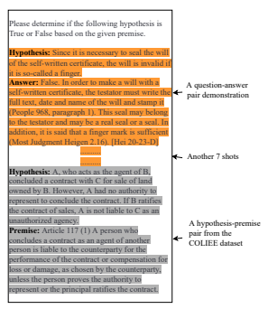
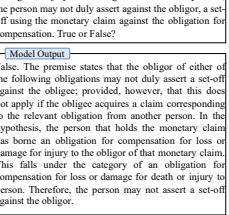
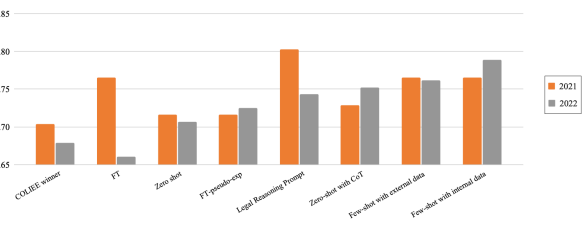

# Exploring The Effectiveness Of Prompt Engineering For Legal Reasoning Tasks

Fangyi Yu∗
Thomson Reuters Labs 19 Duncan Street Toronto, ON M5H 3G6 Canada fangyi.yu@tr.com

| Lee Quartey          | Frank Schilder        |
|----------------------|-----------------------|
| Thomson Reuters Labs | Thomson Reuters Labs  |
| 3 Times Square       | 610 Opperman Drive    |
| New York, NY 10036   | Eagan, MN 55123       |
| United States        | United States         |
| lee.quartey@tr.com   | frank.schilder@tr.com |

## Abstract

The use of large language models (LLMs) for zero- or few-shot prompting in natural language processing has given rise to a new research area known as prompt engineering, which shows promising improvement in tasks such as arithmetic and common-sense reasoning. This paper explores the use of such approaches in legal reasoning tasks by conducting experiments on the COLIEE entailment task, which is based on the Japanese Bar exam. We further evaluate zero-shot/few-shot and fine-tuning approaches with and without explanations, alongside various prompting strategies. Our results indicate that while these techniques can improve general performance, the best results are achieved with prompts derived from specific legal reasoning techniques, such as IRAC (Issue, Rule, Application, Conclusion). In addition, we observe that few-shot learning with demonstrations derived from clustering past training data consistently yields high performance on the most recent COLIEE entailment tasks. Through our experiments, we improve the previous best result on the 2021 COLIEE task from 0.7037 to 0.8025 and surpass the best system from 2022 with an accuracy of 0.789.

## 1 Introduction

Application of reason-based prompting mechanisms with large language models is becoming an increasingly prevalent focus area in natural language processing research. Models like OpenAI's GPT-3 achieve satisfactory results - 81% accuracy with a zero-shot approach and 82.8% accuracy with a few-shot approach - on commonsense reasoning tasks drawn from the PhysicalQA dataset (Brown et al., 2020), but, as we observe, struggle significantly with more specialized domain data. Further research builds on these basic queries by implementing a variety of so-called prompt engineering approaches, which range from soliciting a model to "think step by step" in producing incremental reasoning to underscore a given response (Kojima et al., 2022), to leveraging an iterative cycle of model generated rationales to bootstrap its own ability to produce more elaborate reasoning approaches (Zelikman et al., 2022); these approaches have demonstrated a nominal improvement in a language model's ability to rationalize a correct response to a particular baseline query.

Our research aims to explore the effects of such approaches on highly specialized domain data, namely that in the legal field drawn from the Japanese bar exam.1 We frame our approach around the University of Alberta's annual Competition on Legal Information Extraction/Entailment, COLIEE (Rabelo et al., 2022), in which certain subtasks are devoted to reasoning through legal hypotheses given contextual articles.

We first explore zero through few-shot approaches using pretrained LLMs, coupled with prompts either drawn from existing work (e.g.,
"Let's think step by step" (Kojima et al., 2022))
or generated by ourselves (e.g., "Please determine if the following hypothesis is True or False based on the given premise").

Additionally, we assess the impacts of fine tuning an LLM to infer binary responses both with and without explanations (either machine generated or extracted from the supporting premise). The best results on the COLIEE 2021 test set, though, result from a zero-shot, legal-prompt approach, which surpasses state-of-the-art COLIEE performance by 14.04%. These legal-prompt approaches are motivated by legal reasoning techniques such as Issue, Rule, Application, Conclusion (Burton, 2017)

1The passing rates for the bar examination - a critical step toward becoming a practicing attorney in many countries
- range from about 80% in the United States in 2021 (see https://tinyurl.com/5yawnh5s) to 39.2% in Japan in 2020 widely regarded as one of the most difficult of all bar examinations (see https://www.nippon.com/en/ japan-data/h00942/).

∗Work done while interning at Thomson Reuters Labs.
taught at law school. Similarly, an 8-shot approach with shots obtained by clustering COLIEE training data yields the best performance on 2022 COLIEE
test data, with an overall accuracy improvement of 9.5%.

Our experiments indicate that few-shot and finetuning with explanation approaches show good and consistent results for the two test sets of the COL- IEE competition we used for evaluation. Zero-shot and a fine-tuning approach using the labels show more inconsistent results across the two years. The zero-shot with legal reasoning approach shows the best result for one year only and may be more prone to overfitting to a specific test set indicating that further research on those prompting approaches is needed.

## 2 Legal Entailment Task

The COLIEE competition (Rabelo et al., 2022) has been carried out since 2014 driving research in the area of legal retrieval and entailment. Two of the competition's tasks are using data from the Japanese bar exam. The exam requires lawyers to determine whether a given legal statement is true or false. In order to answer the questions, the lawyer has to first determine which articles of the Japanese statutes are most relevant to the given question. Task 3 of the competition covers this retrieval task. Given one or more articles relevant to the question, the lawyer has then to determine whether the question (i.e., the hypothesis) is true or false given the selected articles (i.e., the premise). This task is captured as task 4 in the COLIEE competition and we are focusing on this task with our work on legal reasoning:
Hypothesis: If the grounds of commencement of assistance cease to exist, the family court may rescind the decision for commencement of assistance without any party's request.

Premise: Article 18 (1) If the grounds prescribed in the main clause of Article 15, paragraph (1) cease to exist, the family court must rescind the decision for commencement of assistance at the request of the person in question, that person's spouse, that person's relative within the fourth degree of kinship, the guardian of a minor, the supervisor of a minor's guardian, the assistant, the assistant's supervisor, or a public prosecutor.

(2) At the request of a person as prescribed in the preceding paragraph, the family court may rescind all or part of the decision referred to in paragraph (1) of the preceding Article.

## Entailment: No

More formally the task is defined by the organizers as a legal entailment task:
Given a question Q, after retrieving relevant articles S1, S2, ..., Sn determine if the relevant articles entail "Q" or "not Q".

$$E n t a i l s(S_{1},S_{2},...,S_{n},Q)\;o r$$
$$E n t a i l s(S_{1},S_{2},...,S_{n},\neg Q).$$

The answer of this task is binary: "YES" ("Q")
or "NO" ("¬Q"). The evaluation metric is accuracy and a random baseline (or simply giving always
"YES" or always "NO") would lead to an accuracy about 0.5 since most test sets have an approximate equal distribution of positive and negative answers.

One of the main challenges of this competition is the relatively small size of the training and test set. Past competitions provide the answered questions of previous competitions resulting in a total of 806 questions. The 2021 test set contain 81 questions whereas the 2022 test set contained 109 questions.

The COLIEE datasets are accessible upon requesting the organizers.

## 3 Prior Work

An overview of all COLIEE tasks and their respective approaches can be found in (Rabelo et al., 2022). Most systems addressing task 4 were BERT- based (Devlin et al., 2019) despite the small training set. Interestingly enough, the best performing system in 2021 utilized a method for increasing the training pool and deployed an ensemble of different BERT-based systems (Yoshioka et al., 2021).

Other systems relied on different types on language models including DistilRoBERTa (Liu et al., 2019), LEGAL-BERT (Chalkidis et al., 2020), T5 (Raffel et al., 2020) and Electra (Clark et al., 2020) (i.e.,
(Schilder et al., 2021))
Other notable past systems used the Japanese original text and developed a rule-based system to identify entailment (Fujita et al., 2021) while another system was based on a Graph Neural network using DistilRoBERTa and LEGAL-BERT embeddings as nodes (Wehnert et al., 2021).

Only one system (Schilder et al., 2021) looked into a few-shot learning approach utilizing GPT-3
(Brown et al., 2020). The system was based on a few-shot approach addressing task 3 and task 4 together2. Their experiments showed that GPT-3 without any further fine-tuning and without prompting of the relevant articles from the Japanese statues does not perform very well on this task reaching results even below the random baseline. These results indicate that even large LMs have not stored enough knowledge about Japanese law and more advanced prompting and/or fine-tuning techniques are required.

Other prior work we draw from explores the utility of prompting and explanations in order to have LLM solve more complex tasks such as commonsense reasoning or mathematical word problems.

We draw from recent work that proposed so-called Chain-of-Thought (CoT) prompts that have shown improved results of Zero-Shot (ZS) and Few-Shot (FS) approaches (Wei et al.; Kojima et al., 2022; Zhang et al., 2022).

Previous approaches to incorporating explanations into the reasoning process also show improvements over standard prompting or fine-tuning approaches. By relying on the generation capability of LLMs to produce reasoning text, those approaches produce text that then is used to finetune the language model. In contrast to earlier approaches that relied on manually created explanations (Rajani et al., 2019), Zelikman et al. (2022) propose a method that automatically creates rationales using GPT-J for Arithmetic word problems, Commonsense QA, and Grad School Math problems. Their STaR system keeps the rationales if the LLM produces the correct answer and creates a new set of training data they train the LM with. They show significant improvements over previous approaches that are fine-tuned on the answers only and comparable performance to a much larger LM (i.e., GPT-3) on CommonsenseQA.

## 4 Experiments And Results

This section outlines the various approaches we explored using an LLM such as GPT-3.5 to address the COLIEE task. Our investigation included basic fine-tuning, instruction fine-tuning, n-shot learning, few-shot learning with clustering, prompting with legal reasoning strategies, Chain-of-Thought prompting, and an attempt to solve this binary task using explanations generated by the LLM itself.

All experiments were performed using OpenAI's latest model, GPT-3.5 (text-davinci-003), which is the most proficient GPT-3.5 engine among the four available at the time of experimentation (davinci, curie, babbage, and ada).

For our experiments, we utilized the COLLIE
datasets from 2021 and 2022. We chose accuracy as the evaluation metric due to the approximately equal distribution of positive and negative labels in the COLIEE test sets.

#### 4.1 Zero-Shot (Zs)

We design and incorporate various prompts for the ZS setting, all of which require no domain-specific information. In Section 4.5, we describe ZS with domain-specific prompts that integrate legal reasoning approaches.

To ensure that the completion of GPT-3.5 is deterministic and is each time executed with the same input, we set the temperature for all experiments to 0. Other GPT-3.5 parameters are set to their default values (Top P=1, Frequency penalty = 0, Presence penalty = 0). We use greedy decoding throughout this paper for simplicity.

For ZS, the input we give GPT-3.5 contains the following parts: the instructive prompt we selected based on experimenting with the older version GPT- 3 model (text-davinci-002), the premise-hypothesis pairs from the COLIEE dataset, and the phrase
"True or False?". We previously experimented with three different prompts using the older version of GPT-3 (Yu et al., 2022), text-davinci-002, as shown in Table 1. Results show that simply adding the term "following" to specify the location of the premise can enhance GPT-3's accuracy from 0.7160 to 0.7407. If the prompt is less instructive, for instance, if "the given premise" is replaced with "Japanese civil code statutes", the accuracy decreases from 0.7407 to 0.7037. Note that "the given premise" consists of the Japanese civil code statutes that is most closely associated with the given hypothesis. Be aware that the accuracy 2021 COLIEE winner obtained was 0.7037, which is the same as our least-performing prompt in the ZS setting. Thus, by simply providing a more specific, relevant, and instructive prompt to GPT-3, we can outperform the 2021 COLIEE winner by 3.70%.

We followed the experimental results that we discovered using text-davinci-002 and picked prompt2
("Please determine if the following hypothesis is

2The organizers offered a task 5 that would require a system to do task 3 (i.e., retrieval) and task 4 (i.e., entailment) in one step.
Table 1: GPT-3 (text-davinci-002)'s ZS performance with different prompts on the COLIEE 2021 test set. Minor changes in the prompt can impact GPT-3's accuracy largely.

| Input                                 | Prompt                                                        | Accuracy   |
|---------------------------------------|---------------------------------------------------------------|------------|
| {prompt} + {premise}  +{hypothesis} + | Prompt1: Please determine if the hypothesis is True or False  | 0.7160     |
|                                       | based on the given premise.                                   |            |
| "True or False?"                      | Prompt2: Please determine if the following hypothesis is True | 0.7407     |
|                                       | or False based on the given premise.                          |            |
|                                       | Prompt3: Please determine if the following hypothesis is True | 0.7037     |
|                                       | or False based on the Japanese civil code statues.            |            |

True or False based on the given premise.") as our base prompt in all the following discussed approaches using text-davinci-003.

The experimental result shows that the newer model text-davinci-003 underperforms textdavinci-002 in the ZS setting, obtaining an accuracy of 0.7160.

## 4.2 Few-Shot (Fs)

Brown et al. (2020) proved that the FS performance of LLMs is superior to that of ZS and some SOTA
fine-tuning techniques in a variety of tasks. We thus evaluate GPT-3.5 in the FS setting by providing GPT-3.5 with examples of hypothesis-answer pairs from two different sources: external sources and internal sources.

## 4.2.1 External Resource

We used a site3containing previously evaluated bar exam questions as our external resource. While the original question-answer pairs are in Japanese, we used the Google-translated English version as the few-shot data. The site collected previously examined bar exam questions under 8 different topics, and we randomly selected one question-answer pair from each, forming the 8 demonstrations used as the 8-shot in our experiment.

The 8-shot example with a specific hypothesispremise pair from the COLIEE 2021 test set is shown in Figure 1.

## 4.2.2 Internal Resource: Clustering Then Few-Shot Learning

As the COLIEE competition prohibits participants from utilizing external resources to train their models, we adhered to this rule and refrained from employing any external resources for training purposes. However, we recognized the value of leveraging the data provided by the competition organizers to obtain a *clustering then few-shot learning*

Figure 1: 8-shot with a specific hypothesis-premise pair where the 8 shots are from a Japanese Bar exam preparation blog and the hypothesis-premise pair is from the COLIEE 2021 test set.

approach. The process we followed to prepare these few shots is outlined below:
1. We utilized KMeans clustering to group the training sets into multiple clusters, considering both the silhouette score and the limitations imposed by GPT-3.5. Since GPT-3.5 can only process a maximum token count of 4,000, the number of shots we employ directly impacts the number of tokens present in GPT- 3.5's input. Consequently, we imposed a constraint on the number of shots, limiting it to fewer than 15.

2. Within each cluster, we identified the most representative words. These words served as crucial indicators of the cluster's characteristics and played a pivotal role in constructing

3https://www.crear-ac.co.jp/shoshi/kakomon/
3. Within the training set, we identified the hypotheses that encompassed the most representative words from each cluster. These hypotheses were then used to form the shots, facilitating the few-shot learning process.

Results show that on the 2021 COLIEE test set, using external and internal data as shots achieve the same accuracy (0.7654), outperforming the 2021 COLIEE winner (0.7037). On the 2022 COLIEE test set, using internal data, that is, clustering then few-shot learning, achieves an accuracy of 0.789, outperforms using external resources which obtains an accuracy of 0.7615, both outperform the 2022 COLIEE winner (0.6789).

## 4.3 Zero-Shot-Chain Of Thought (Zs-Cot)

Kojima et al. (2022) showed that LLMs can generate Chain-of-Thought reasoning processes and show superior reasoning capabilities by just adding
"Let's think step by step" before each answer for common sense reasoning tasks. Hence, we experimented with GPT-3.5 using two-stage prompting (i.e., the output of the generated text from the first prompt is used for the second prompt): "Let's think step by step" and "Therefore, the hypothesis is
(True or False)".

Though ZS-CoT is theoretically straightforward, its nuance lies in the fact that it employs prompting twice. In the first stage, which is the reasoning extraction process, we provide GPT-3.5 with
{prompt} + {premise} + {hypothesis} + {CoT} as input, where the prompt is the prompt2 described in Section 4.1, and CoT is "Let's think step by step" since this CoT prompt demonstrates to obtain the best performance in common sense reasoning tasks (Kojima et al., 2022). GPT-3.5 generates its reasoning process based on the input, but the generated completion may (or may not) contain the final answer (True or False in our case). In the second stage, which is the answer extraction process, we provide GPT-3.5 with both the input and output from the first stage as well as a second prompt (answer trigger): "Therefore, the hypothesis (True or False) is". The prompted text is passed to GPT-3.5 as input to create the final binary answer.

When ZS-CoT is applied to text-davinci-003 on the COLIEE test sets, the accuracies are 0.7284 and 0.7523 on 2021 and 2022 test sets, respectively, much higher than applied to text-davinci-002 (0.6296 and 0.7064, respectively).

Notably, GPT-3.5 is capable of generating explanations in all of the previously stated approaches, including ZS, FS, and ZS-CoT, although not all ZS
and FS completions contain explanations. Particularly when the predicted answer is True, explanations are often not provided.

#### 4.4 Fine-Tuning Llm With And Without Explanations

Fine-tuning language models can usually gain strong performance on many benchmarks (Brown et al., 2020). It involves updating the weights of a pre-trained language model by training on an annotated dataset specific to the desired task. We fine-tune GPT-3.5 with the 2021 COLIEE training set and expect the fine-tuned model to achieve better performance compared to using the pre-trained model directly.

To fine-tune GPT-3.5, a collection of training samples consisting of the expected input and its corresponding output ("completion") are required. We fine-tune GPT-3.5 using the 2021 COLIEE training set, where premise-hypothesis pairs are utilized in the input and answers are used in the completions.

We fine-tune GPT-3.5 with two types of completions: binary answers only (True or False) and binary answers with explanations. The explanations are either explanations created by GPT-3.5 itself or pseudo-explanations extracted as stated below.

Although OpenAI's documentation states that no prompt is necessary in the input for fine-tuning GPT-3.5, we nevertheless utilize two forms of input: without prompt and with prompt2 specified in Section 4.1 to examine the effect of prompts during GPT-3.5's fine-tuning process. The fine-tuned model is then tested on the 2021 COLIEE test set.

The result is shown in Table 2. It is shown that GPT-3.5 fine-tuned with instructive prompts outperforms the setting without prompts by 23.99%.

When fine-tuning GPT-3.5 with both binary answers and explanations, we use two types of explanations that are created using different approaches.

## 4.4.1 Pseudo-Explanation

We select from each premise the sentence that is most relevant to its corresponding hypothesis as the pseudo-explanation. More specifically, for each hypothesis-premise pair, we first split the premise into sentences, encode each sentence using the MP- Net encoder (Song et al., 2020) implemented in the sentence-transformers 2.2.2 package, compute the cosine similarity score between each sentence and

Table 2: The accuracy achieved by the fine-tuned GPT-3.5 on the 2021 COLIEE test set. GPT-3.5 were fine-tuned with various input and completion. The prompt in the input is "Please determine if the following hypothesis is True or False based on the given premise."

| Input during Fine\-tuning                   | Completion during Fine\-tuning    | Accuracy   |
|---------------------------------------------|-----------------------------------|------------|
| {premise} + {hypothesis} + "True or False?" | {label}                           | 0.6173     |
| {prompt} + {premise} + {hypothesis} +       | {label}                           | 0.7654     |
| "True or False?"                            |                                   |            |
| {prompt} + {premise} + {hypothesis} +       | {label} + "Because according to " | 0.7160     |
| "True or False?"                            | + {pseudo\-explanation}           |            |
| {prompt} + {premise} + {hypothesis} +       | {GPT\-3.5\-generated explanation} | 0.6667     |
| "True or False?"                            |                                   |            |

the hypothesis, then choose the sentence with the highest similarity score as the explanation. Since fine-tuning with binary answers achieves higher accuracy when the input includes instructive prompts, we provide GPT-3.5 with {prompt} + {premise} +
{hypothesis} + "True or False" as input and {label} + "Because according to " + {pseudo-explanation}
as completion during the fine-tuning process with both binary answers and explanations. In this manner, we assist GPT-3.5 in determining which portion of the premise to focus on to arrive at the final response. Similar to the completion used to fine-tune GPT-3.5, the completion generated during inference also contains a binary answer and an explanation, which is one sentence from the premise with the greatest similarity score to the hypothesis. The inference results can be seen in Table 2.

## 4.4.2 Llm-Generated Explanation

This approach is inspired by the "Self-Taught Reasoner" (STaR bootstrapping) approach (Zelikman et al., 2022), which iteratively employs LLM- generated explanations to bootstrap the LLM's capacity to execute more complicated reasoning. In a single loop of STaR bootstrapping, the LLM creates explanations to answer a given question, and if the answer generated is incorrect, the LLM will generate an explanation based on the right answer and fine-tune on the explanations that produce correct answers. Since repeatedly fine-tuning GPT-3.5 is a costly process, we provide an alternative to the STaR bootstrapping approach. In our approach, we prompt GPT-3.5 to generate explanations for each hypothesis-premise-answer triplet by providing it with "Please explain why the following hypothesis is" + {label} + "based on the given premise." +
{premise} + {hypothesis}, then use the hypothesispremise-answer-explanation quartets to fine-tune GPT-3.5, that is, providing GPT-3.5 with input:
{prompt} + {premise} + {hypothesis} + "True or False" , and completion: {explanation}, where the explanation is the GPT-3.5-generated explanation from the previous step. To decrease cost, we only fine-tune GPT-3.5 once as opposed to repeatedly. During inference, the fine-tuned model provided both binary answers and seemingly plausible explanations; the inference accuracy is shown in Table 2.

As shown in Table 2, fine-tuning GPT-3.5 with pseudo-explanation surpasses fine-tuning GPT-3.5 with its own explanation. One possible reason is that GPT-3.5-generated explanations are not always accurate, and fine-tuning with incorrect explanations will decrease accuracy. Furthermore, finetuning GPT-3.5 with either pseudo-explanation or GPT-3.5-generated explanation underperforms finetuning GPT-3.5 with instructive prompts and labels alone. This indicates that encouraging GPT-3.5 to
"think" and "reason" independently by providing it with instructive prompts and less intervention could lead to better results.

## 4.5 Legal Reasoning Prompts (Lrps)

A common assumption in the literature is that prompts function as semantically meaningful task instructions and they require experts to precisely define the task at hand (Mishra et al., 2022; Lampinen et al., 2022). Reformatting NLP tasks with varied prompts significantly increased ZS and FS performance compared to traditional fine-tuned models
(Wei et al., 2022; Le Scao and Rush, 2021; Schick and Schütze, 2021; Sanh et al., 2022). For COLIEE task 4, the above-discussed experiments show that ZS-CoT, FS, and fine-tuning GPT-3.5 all outperform ZS. We thus utilize legal reasoning prompts
(LRPs) to boost GPT-3.5's accuracy under the ZS
setting.

"Legal reasoning", "creative thinking" and "crit-

Table 3: GPT-3.5's performance on the 2021 and 2022 COLIEE test sets by applying various zero-shot legal reasoning approaches. The best-performing approach in 2021 TREACC outperforms the 2021 COLIEE winner by 14.04%, and the best-performing approach in 2022, TRIAccC, surpasses the 2022 COLIEE winner by 9.5%.

| Approach   | Details                                                               | 2021   | 2022   |
|------------|-----------------------------------------------------------------------|--------|--------|
| TREACC     | Topic, rule, explanation, analysis, counterarguments, conclusion      | 0.8025 | 0.7156 |
| TRIAccC    | Topic, rule, issues, analysis (cases, conclusion), conclusion         | 0.7778 | 0.7431 |
| CLEO       | Claim, law, evaluation, outcome                                       | 0.7531 | 0.7156 |
| ILAC       | Issue, law, application, conclusion                                   | 0.7531 | 0.7064 |
| IRAACP     | Issue, rule, apply, apply, conclusion, policy                         | 0.7531 | 0.7156 |
| IRACDD     | Issue, rule, analysis, conclusion, defence, damages                   | 0.7531 | 0.6881 |
| IRRAAC     | Issue, rule, reasoning, application, alternative analysis, conclusion | 0.7531 | 0.6789 |
| RAFADC     | Rule, authorities, facts, analogising and distinguishing, conclusion  | 0.7531 | 0.7339 |
| IRAC       | Issue, rule, application, conlcusion                                  | 0.7531 | 0.7064 |

ical analysis" are the pillars to "think like a lawyer" and contribute to the formation of a professional legal identity (Kift et al., 2011). Burton (2017) identified a number of acronyms used to teach traditional legal reasoning, which appear to represent legal reasoning approaches often used by legal experts and practitioners. For example, approach IRAC is the acronym for *Issue, Rule, Application, Conclusion*.

Here, *issue* means issue spotting, or thinking about what facts and circumstances brought the parties to court. *Rule* means to find the governing law for the issue. *Application* refers to the process of applying the rule to the facts of the issue. *Conclusion* is to come up with the conclusion from the application as to whether the rule applies to the facts. We thus ask GPT-3.5 to think like a lawyer by prompting it with {prompt} + {approach} + {premise} +
{hypothesis} + "True or False?". We use "Please analyze if the hypothesis is True or False according to the given legal reasoning approach" as the prompt. An illustration of GPT-3.5's input and output when applying the LR prompt in the ZS setting is shown in Figure 2.

The approaches were extracted from the legal reasoning approaches summarized by Burton (2017), and details can be found in Table 3.

As indicated in the table, TREACC beats the 2021 COLIEE winner by 14.04%, and TRI- AccC beats the 2022 COLIEE winner by 9.5%. Note also that GPT-3.5 could provide explanations that seem to adhere to the provided legal reasoning method. Some explanation examples are shown in the Appendix.

Figure 3 compares the accuracy of each approach applied to GPT-3.5. For ZS with LRPs, we select the best-performing legal reasoning approach for 2021 and 2022, which are TREACC,
and TRIAccC. For the fine-tuning approach, we fine-tune and test GPT-3.5 on the same year's training and test set provided by the COLIEE organizer. As shown in the figure, all approaches surpass the 2021 COLIEE winner, especially the LRP approach, which outperforms the 2021 COLIEE
winner by 14.04%. For the 2022 test set, except for the fine-tuning-without-explanation approach, all other approaches surpass the 2022 COLIEE
winner. The few-shot approach, whether it is utilizing internal data or external data for the shots, is the most consistent across the two years. We also conducted Chi-Squared Tests to examine if our best-performing approaches surpass the COLIEE
winners with statistical significance. For the 2021 test set, our approach ZS with LRPs correctly predicts 65 samples, and the COLIEE winning system correctly predicts 57 samples. By conducting a Chi-Squared Test, we did not observe statistical significance between the performance of our approach with the COLIEE winner (p-value = 0.0518 > 0.05). This is mainly due to the small scale of the sample size (only 81) 4, but for the COLIEE 2022 test set (N = 109), we prove that our best-performing approach (few-shot with internal resources) outperforms the 2022 winning system with statistical significance (p-value = 0.0138 < 0.05).

## 5 Conclusions And Discussion

Much recent focus has been placed on leveraging reasoning-based-prompt approaches to increase accuracy of large language model-based question an-

4We did observe statistical significance when the old version of GPT-3 (text-davinci-002) is used for the ZS with LRPs approach (p-value = 0.0285 < 0.05)

Please analyze if the hypothesis is True or False according to the given legal reasoning approach. Approach: Issue, rule, application, conclusion.

Premise: Article 509 The obligor of either of the following obligations may not duly assert a set-off against the obligee; provided, however, that this does not apply if the obligee acquires a claim corresponding to the relevant obligation from another person:
(i) an obligation for compensation for loss or damage based on a tort committed in bad faith; or (ii) an obligation for compensation for loss or damage for death or injury to person (excluding the one set forth in the preceding item).

Hypothesis: If a person that holds a monetary claim has borne an obligation for compensation for loss or damage for injury to the obligor of that monetary claim,

Figure 2: GPT-3.5's input and output when applying ZS with a LR prompt. Here, the LR approach used is IRAC.

swering (e.g., (Rajani et al., 2019; Kojima et al., 2022; Zelikman et al., 2022)). While simple zero or few-shot approaches are performant on basic benchmark or trivia tasks, elaborate reasoning-based strategies are required for more complex domains, where answering a query requires chains of logic through stated (or implicit) context. Practitioners specifically within the legal domain will often follow certain well-defined approaches to reasoning, such as *Issue, Rule, Application, Conclusion*, and our hypothesis was that prompting language models in a similar fashion - alongside explanationbased fine-tuning - could improve capabilities in complex reasoning queries.

Leveraging data from recent COLIEE competitions (Rabelo et al., 2022), our exploration found that the most significant improvements in accuracy were achieved via zero-shot queries to GPT-3.5 legal-reasoning (i.e., Thesis, rule, rule, application, conclusion (Burton, 2017)) prompts on 2021 data, but these approaches did not perform that well

 on the 2022 test data. An 8-shot few-shot learning approach, however, showed the best results for the 2022 data. Nevertheless, both approaches significantly outperform COLIEE state-of-the-art, improving the 2021 best system from 0.7037 accuracy to 0.8025, and the 2022 best system from 0.6789 accuracy to 0.789.

Further, we find that several other approaches also perform comparatively well versus COLIEE competition winners, such as zero-shot chain-ofthought (Zelikman et al., 2022) outperforming the 2021 and 2022 COLIEE winners by 3.5% and 10.81% respectively, and fine-tuning with pseudo-explanations explicitly derived from the query data's premise (yielding 71.6% accuracy on the 2021 test set). The few-shot approaches show the most promise, achieving good and consistent performance results over the two years, while zero-shot with legal reasoning prompts show outstanding results for one year but relatively lower results for the other year. This indicates that such prompting approaches require further investigation.

Although the performance of zero-shot with legal reasoning prompts is inconsistent between the two years (i.e., TREACC had the highest accuracy in 2021 but the fourth highest accuracy in 2022), all legal reasoning approaches we tested outperformed COLIEE winners for 2021 and 2022.

While our analysis shows promise in prompt engineering for high-order LLM-based reasoning tasks, it is unclear whether prompting actually teaches the model to "think like a lawyer" and further exploration is warranted to determine the likelihood of success of fine-tuning with explanation and reasoning prompting in legal or other domains.

## 6 Limitations

While the potential implications of our research are broad, we make note that there are several limitations that should be considered:
1. The scope of this study is limited to legal reasoning tasks using the COLIEE Task 4 (Entailment), which is based on the Japanese Bar exam. The results may not generalize to other legal reasoning tasks in particular common law systems.

2. COLIEE Task 4 itself depends on the COLIEE
Task 3 (Retrieval), and we assumed perfect retrieval of the relevant articles used for the premises.

3. The experiments were conducted with two versions of GPT models only, and it is unclear how other LLMs may perform with this task.

4. The study focuses on zero-shot/few-shot and fine-tuning approaches with and without explanations, as well as various prompting strategies. The explanation and the prompting strategies, however, are difficult to control.

For the explanation, we rely on the explanations created by GPT-3.5 without knowledge of how reliable they may be. For the legal prompting, we show that legal strategies have a positive impact on the performance, but it is unclear how explicit mention of the strategies impacts the LM.

5. The use of clustering past training data as fewshot demonstrations is a novel approach, but it is not clear how well it would perform on other data sets (or in other domains). We do not claim that this approach would show improved results for other tasks.

6. The experiments were conducted on the most recent two years of COLIEE task data, and the results may not generalize to other years of the task. More importantly, the test data size is relatively small which is reflected by the mildly statistically significant results for 2021.

7. The experiments were carried out on the En-

glish translations only and not the Japanese original text.

8. OpenAI maintains control of GPT-3 and future models, and we cannot guarantee that the model versions used will be available to others in the exact same state.

## 7 Ethics Statement

Our work under this study aims to comply with core ethical standards of current state artificial intelligence and machine learning, including (but not limited to) being free of known bias toward any type or group of persons within the task at-hand.

Any testing and evaluation performed to this end is, by nature, not exhaustive and unable to identify every potential impact; more thorough evaluation should be performed under any derivative works.

Our proposed methods and results, while presented truly and to the best of our ability, do leverage pre-trained language models, and may nonetheless inherit any fundamental biases and factual failures of the parent model. Accordingly, we strongly discourage usage of such approaches in scenarios or systems that may have materially adverse impact, such as:
- Legal proceedings or advice, especially without adequate review from a licensed attorney in the appropriate jurisdiction.

- Examination settings without explicit awareness and approval from all administering parties.

- Generating any content for public consumption without explicit indication that such content was fully machine generated.

Figure 3: Comparison of the accuracy of COLIEE winners and GPT-3.5 when different approaches are used.

As such, we believe this work to be most beneficial when leveraged within a human-in-the-loop approach, where adequate knowledge exists to distinguish between valid and invalid model outputs.

## References

Tom B. Brown, Benjamin Mann, Nick Ryder, Melanie Subbiah, Jared Kaplan, Prafulla Dhariwal, Arvind Neelakantan, Pranav Shyam, Girish Sastry, Amanda Askell, Sandhini Agarwal, Ariel Herbert-Voss, Gretchen Krueger, Tom Henighan, Rewon Child, Aditya Ramesh, Daniel M. Ziegler, Jeffrey Wu, Clemens Winter, Christopher Hesse, Mark Chen, Eric Sigler, Mateusz Litwin, Scott Gray, Benjamin Chess, Jack Clark, Christopher Berner, Sam McCandlish, Alec Radford, Ilya Sutskever, and Dario Amodei. 2020. Language models are few-shot learners. Advances in neural information processing systems, 33:1877–1901.

Kelley Burton. 2017. "Think like a lawyer" using a legal reasoning grid and criterion-referenced assessment rubric on irac (issue, rule, application, conclusion).

Journal of Learning Design, 10(2):57–68.

Ilias Chalkidis, Manos Fergadiotis, Prodromos Malakasiotis, Nikolaos Aletras, and Ion Androutsopoulos. 2020. LEGAL-BERT: The muppets straight out of law school. In Findings of the Association for Computational Linguistics: EMNLP 2020, pages 2898– 2904, Online. Association for Computational Linguistics.

Kevin Clark, Thang Luong, Quoc V. Le, and Christopher Manning. 2020. Electra: Pre-training text encoders as discriminators rather than generators. In *ICLR*.

Jacob Devlin, Ming-Wei Chang, Kenton Lee, and Kristina Toutanova. 2019. BERT: Pre-training of Deep Bidirectional Transformers for Language Understanding. In *Proceedings of the 2019 Conference* of the North American Chapter of the Association for Computational Linguistics: Human Language Technologies, NAACL-HLT 2019, Minneapolis, MN, USA,
June 2-7, 2019, Volume 1 (Long and Short Papers),
pages 4171–4186. Association for Computational Linguistics.

Masaki Fujita, Naoki Kiyota, and Yoshinobu Kano.

2021. Predicate's argument resolver and entity abstraction for legal question answering: Kis teams at coliee 2021 shared task. In Proceedings of the Eigth International Competition on Legal Information Extraction/Entailment (COLIEE 2021), pages 15–24.

Sally Kift, Mark Israel, and Rachael Field. 2011. Bachelor of Laws: learning and teaching academic standards statement: December 2010 [Learning and Teaching Academic Standards Project]. Australian Learning and Teaching Council.

Takeshi Kojima, Shixiang Shane Gu, Machel Reid, Yutaka Matsuo, and Yusuke Iwasawa. 2022. Large language models are zero-shot reasoners. arXiv preprint arXiv:2205.11916.

Andrew Lampinen, Ishita Dasgupta, Stephanie Chan, Kory Mathewson, Mh Tessler, Antonia Creswell, James McClelland, Jane Wang, and Felix Hill. 2022. Can language models learn from explanations in context? In Findings of the Association for Computational Linguistics: EMNLP 2022, pages 537–563, Abu Dhabi, United Arab Emirates. Association for Computational Linguistics.

Teven Le Scao and Alexander Rush. 2021. How many data points is a prompt worth? In *Proceedings of* the 2021 Conference of the North American Chapter of the Association for Computational Linguistics: Human Language Technologies, pages 2627–2636, Online. Association for Computational Linguistics.

Yinhan Liu, Myle Ott, Naman Goyal, Jingfei Du, Mandar Joshi, Danqi Chen, Omer Levy, Mike Lewis, Luke Zettlemoyer, and Veselin Stoyanov. 2019. Roberta: A robustly optimized BERT pretraining approach. *CoRR*, abs/1907.11692.

Swaroop Mishra, Daniel Khashabi, Chitta Baral, and Hannaneh Hajishirzi. 2022. Cross-task generalization via natural language crowdsourcing instructions. In Proceedings of the 60th Annual Meeting of the Association for Computational Linguistics (Volume 1: Long Papers), pages 3470–3487, Dublin, Ireland. Association for Computational Linguistics.

Juliano Rabelo, Randy Goebel, Mi-Young Kim, Yoshinobu Kano, Masaharu Yoshioka, and Ken Satoh. 2022. Overview and discussion of the competition on legal information extraction/entailment (COL- IEE) 2021. *The Review of Socionetwork Strategies*, 16(1):111–133.

Colin Raffel, Noam Shazeer, Adam Roberts, Katherine Lee, Sharan Narang, Michael Matena, Yanqi Zhou, Wei Li, and Peter J. Liu. 2020. Exploring the limits of transfer learning with a unified text-to-text transformer. *Journal of Machine Learning Research*, 21(140):1–67.

Nazneen Fatema Rajani, Bryan McCann, Caiming Xiong, and Richard Socher. 2019. Explain yourself! leveraging language models for commonsense reasoning. In Proceedings of the 57th Annual Meeting of the Association for Computational Linguistics, pages 4932–4942, Florence, Italy. Association for Computational Linguistics.

Victor Sanh, Albert Webson, Colin Raffel, Stephen Bach, Lintang Sutawika, Zaid Alyafeai, Antoine Chaffin, Arnaud Stiegler, Arun Raja, Manan Dey, M Saiful Bari, Canwen Xu, Urmish Thakker, Shanya Sharma Sharma, Eliza Szczechla, Taewoon Kim, Gunjan Chhablani, Nihal Nayak, Debajyoti Datta, Jonathan Chang, Mike Tian-Jian Jiang, Han Wang, Matteo Manica, Sheng Shen, Zheng Xin Yong, Harshit Pandey, Rachel Bawden, Thomas Wang, Trishala Neeraj, Jos Rozen, Abheesht Sharma, Andrea Santilli, Thibault Fevry, Jason Alan Fries, Ryan Teehan, Teven Le Scao, Stella Biderman, Leo Gao, Thomas Wolf, and Alexander M Rush. 2022. Multitask prompted training enables zero-shot task generalization. In *International Conference on Learning* Representations.

Timo Schick and Hinrich Schütze. 2021. It's not just size that matters: Small language models are also fewshot learners. In *Proceedings of the 2021 Conference* of the North American Chapter of the Association for Computational Linguistics: Human Language Technologies, pages 2339–2352, Online. Association for Computational Linguistics.

Frank Schilder, Dhivya Chinnappa, Kanika Madan, Jinane Harmouche, Andrew Vold, Hiroko Bretz, and John Hudzina. 2021. A Pentapus Grapples with Legal Reasoning. In Proceedings of the Eigth International Competition on Legal Information Extraction/Entailment (COLIEE 2021), pages 60–68.

Kaitao Song, Xu Tan, Tao Qin, Jianfeng Lu, and Tie-
Yan Liu. 2020. MPNet: Masked and permuted pretraining for language understanding. *Advances in* Neural Information Processing Systems, 33:16857–
16867.

Sabine Wehnert, Shipra Dureja, Libin Kutty, Viju Sudhi, and Ernesto William De Luca. 2021. Using contextual word embeddings and graph embeddings for legal textual entailment classification. In Proceedings of the Eigth International Competition on Legal Information Extraction/Entailment (COLIEE 2021), pages 69–77.

Jason Wei, Maarten Bosma, Vincent Zhao, Kelvin Guu, Adams Wei Yu, Brian Lester, Nan Du, Andrew M.

Dai, and Quoc V Le. 2022. Finetuned language models are zero-shot learners. In International Conference on Learning Representations.

Jason Wei, Xuezhi Wang, Dale Schuurmans, and Maarten Bosma. Chain of thought prompting elicits reasoning in large language models. *Advances in* Neural Information Processing Systems.

Masaharu Yoshioka, Yasuhiro Aoki, and Youta Suzuki.

2021. BERT-based ensemble methods with data augmentation for legal textual entailment in COLIEE statute law task. In Proceedings of the Eighteenth International Conference on Artificial Intelligence and Law. ACM.

Fangyi Yu, Lee Quartey, and Frank Schilder. 2022. Legal prompting: Teaching a language model to think like a lawyer. *arXiv preprint arXiv:2212.01326*.

Eric Zelikman, Yuhuai Wu, and Noah D Goodman.

2022. STaR: Bootstrapping reasoning with reasoning. *arXiv preprint arXiv:2203.14465*.

Zhuosheng Zhang, Aston Zhang, Mu Li, and Alex Smola. 2022. Automatic chain of thought prompting in large language models.

## A Appendix

Some explanation examples generated by GPT-3.5
(text-davinci-003) using ZS with the TREACC legal reasoning prompt on 2021 COLIEE test set are shown below.

ID: R02-10-U
Hypothesis: Superficies are the rights to use a land in order to own structures, or trees or bamboo.

Premise: Article 265 A superficiary has the right to use another person's land in order to own structures, or trees or bamboo, on that land.

Label: Yes. Answer and explanation: True. Superficies are the rights to use a land in order to own structures, or trees or bamboo, as stated in Article 265 A of the legal code. This right is granted to the superficiary, who is the person who has the right to use the land. The superficiary is allowed to build structures, plant trees or bamboo, and use the land in any other way that does not interfere with the rights of the owner of the land. The superficiary is also responsible for any damages caused to the land or its owner.

Therefore, the hypothesis is true.

## Id: R02-13-A

Hypothesis: Suppose that obligator (A) sets a mortgage on his real estate for obligee (B) . An obligee (B) may assign the order of priority of a mortgage to another obligee (C) of obligator (A)
before the principal is crystallized.

Premise: Article 398-11 (1) Before the principal is crystallized, a revolving mortgagee may not dispose of a revolving mortgage under the provisions of Article 376, paragraph (1); provided, however, that the revolving mortgagee is not precluded from applying that revolving mortgage to secure other claims. (2) The provisions of Article 377, paragraph (2) do not apply to payments made before the principal is crystallized in the cases provided for in the proviso to the preceding paragraph. Article 376 (1) A mortgagee may apply the mortgage to secure other claims, or assign or waive that mortgage, or its order of priority, for the benefit of other obligees of the same obligor. (2) In the cases referred to in the preceding paragraph, if a mortgagee disposes of the mortgage for the benefit of two or more persons, the order of priority of the rights of persons who benefit from that disposition follows the chronological order of supplemental registration in the registration of the mortgage.

Label: No.

Answer and explanation: False. According to Article 398-11 (1) of the legal reasoning approach, a revolving mortgagee may not dispose of a revolving mortgage under the provisions of Article 376, paragraph (1) before the principal is crystallized.

Therefore, obligee (B) may not assign the order of priority of a mortgage to another obligee (C) of obligator (A) before the principal is crystallized. This is further supported by Article 377, paragraph (2) which states that payments made before the principal is crystallized are not applicable in the cases provided for in the proviso to the preceding paragraph.

## Id: R02-36-E

Hypothesis: A claim that a co-owner (A) holds against another co-owner (B) with respect to the property in co-ownership may not be exercised against B's specific successors.

Premise: Article 254 A claim that one of the coowners holds against other co-owners with respect to the property in co-ownership may be exercised against their specific successors.

Label: No. Answer and explanation: False. According to Article 254 of the Civil Code, a claim that one of the co-owners holds against other co-owners with respect to the property in co-ownership may be exercised against their specific successors. This means that a claim that a co-owner (A) holds against another co-owner (B) with respect to the property in co-ownership may be exercised against B's specific successors. This is because the law allows for the claim to be transferred to the successors of the co-owner against whom the claim is held. Therefore, the hypothesis is false.

## Id: R02-37-I

Hypothesis: The manifestation of intention to cancel may not be revoked.

Premise: Article 540 (1) If one of the parties has the right to cancel pursuant to the provisions of the contract or the law, the cancellation is effected by manifestation of intention to the other party. (2) The manifestation of intention referred to in the preceding paragraph may not be revoked.

Label: Yes. Answer and explanation: True. Article 540
(2) of the legal reasoning approach states that the manifestation of intention to cancel may not be revoked. This is supported by the fact that the article explicitly states that the manifestation of intention may not be revoked. Therefore, the hypothesis is true.

## Id: R02-27-O

Hypothesis: A partner may seek the division of the partnership property before liquidation if the consent of the majority of partners exists.

Premise: Article 676 (3) A partner may not seek the division of the partnership property before liquidation.

Label: No.

Answer and explanation: False. Article 676
(3) of the law states that a partner may not seek the division of the partnership property before liquidation. This means that regardless of the consent of the majority of partners, a partner may not seek the division of the partnership property before liquidation. This is because the law does not provide any exceptions to this rule. Therefore, the hypothesis is false.

## Id: R02-1-I

Hypothesis: The issuance of a decision for commencement of assistance at the request of a person other than the person in question requires the consent of the person in question unless the family court finds it to be suitable.

Premise: Article 15 (1) The family court may decide to commence an assistance in respect of a person whose capacity to appreciate their own situation is inadequate due to a mental disorder, at the request of the person in question, that person's spouse, that person's relative within the fourth degree of kinship, the guardian, the guardian's supervisor, the curator, the curator's supervisor, or a public prosecutor; provided, however, that this does not apply to a person with respect to whom there are grounds as prescribed in Article 7 or the main clause of Article 11. (2) The issuance of a decision for commencement of assistance at the request of a person other than the person in question requires the consent of the person in question.

Label: No.

Answer and explanation: False. According to Article 15 (2) of the legal reasoning approach, the issuance of a decision for commencement of assistance at the request of a person other than the person in question requires the consent of the person in question, regardless of the family court's opinion. This is further supported by the fact that Article 15 (1) states that the family court may decide to commence an assistance at the request of a person other than the person in question, but only if the person in question gives their consent. Therefore, the hypothesis is false.

## Id: R02-12-A

Hypothesis: An obligor (A) created a mortgage for an obligee (B) on the real property owned by A and the creation was registered. A may assert the extinctive prescription of the mortgage if 20 years have passed from the time when it becomes exercisable, even if the claim the mortgage secures is not extinguished.

Premise: Article 396 No mortgage is extinguished by prescription in relation to obligors and mortgagors unless it is extinguished simultaneously with the claim the mortgage secures.

Label: No. Answer and explanation: False. According to Article 396, a mortgage is not extinguished by prescription in relation to obligors and mortgagors unless it is extinguished simultaneously with the claim the mortgage secures. Therefore, even if 20 years have passed from the time when the mortgage becomes exercisable, A may not assert the extinctive prescription of the mortgage unless the claim the mortgage secures is also extinguished. This is because the mortgage and the claim the mortgage secures are inextricably linked, and one cannot be extinguished without the other. Counterarguments may be raised that the mortgage should be extinguished after 20 years, regardless of the status of the claim the mortgage secures, but this argument is not supported by the legal reasoning approach. Therefore, the hypothesis is false.

## Id: R02-9-O

Hypothesis: A had owned land in an area of holiday homes. B, who owned neighboring land, began to construct a fence on A's land crossing the boundary without A's consent, and two years later the fence was completed. As of this time, A may not demand the removal of the fence against B by filing an action for maintenance of possession.

Premise: Article 201 (1) An action for maintenance of possession must be filed during the obstruction or within one year after the obstruction stops; provided, however, that if the possessed thing has been damaged due to construction work and either one year has passed from the time when the construction was started or the construction has been completed, the action may not be filed.

Label: Yes. Answer and explanation: False. According to Article 201 (1), A may still file an action for maintenance of possession against B even though two years have passed since the construction of the fence was started. The article states that the action may be filed within one year after the obstruction stops, or if the possessed thing has been damaged due to construction work and either one year has passed from the time when the construction was started or the construction has been completed. In this case, the construction has been completed and thus A may still file an action for maintenance of possession against B.

## Id: R02-16-U

Hypothesis: If B sells and delivers X to D, who knows that the gift of X will prejudice the obligee of A, C may claim to B to rescind the gift between A and B.

Premise: Article 424 (1) An obligee may demand the court to rescind an act which the obligor commits knowing that it will prejudice the obligee; provided, however, that this does not apply if a person that benefits from that act (hereinafter referred to as the "beneficiary" in this Subsection) does not know, at the time of the act, that the obligee will be prejudiced.

Label: Yes. Answer and explanation: False. According to Article 424 (1), if the beneficiary (in this case, D) does not know, at the time of the act, that the obligee (in this case, C) will be prejudiced, then C may not claim to B to rescind the gift between A and B. Therefore, the hypothesis is false.

## Acl 2023 Responsible Nlp Checklist

A For every submission:
✓ A1. Did you describe the limitations of your work?

6
✓ A2. Did you discuss any potential risks of your work?

5, 6, 7
✓ A3. Do the abstract and introduction summarize the paper's main claims?

1
✓ A4. Have you used AI writing assistants when working on this paper?

ChatGPT: provided the abstract, we leveraged ChatGPT to rephrase language of the abstract itself, and to provide a first-pass set of limitations that were then revised by human authors

# B ✓ **Did You Use Or Create Scientific Artifacts?**

Used: COLIEE data (task 4, up to 2022) in section 2 and 3, GPT-3 (text-davinci-002) and GPT-3.5
(text-davinci-003) in section 4
✓ B1. Did you cite the creators of artifacts you used?

References
✓ B2. Did you discuss the license or terms for use and / or distribution of any artifacts?

2, 4
✓ B3. Did you discuss if your use of existing artifact(s) was consistent with their intended use, provided that it was specified? For the artifacts you create, do you specify intended use and whether that is compatible with the original access conditions (in particular, derivatives of data accessed for research purposes should not be used outside of research contexts)?

2, 4
✗ B4. Did you discuss the steps taken to check whether the data that was collected / used contains any information that names or uniquely identifies individual people or offensive content, and the steps taken to protect / anonymize it?

Did not discuss in paper, but we did review data prior to usage and found no names or other PII data in set(s)
 B5. Did you provide documentation of the artifacts, e.g., coverage of domains, languages, and linguistic phenomena, demographic groups represented, etc.?

Not applicable. No artifacts created
✓ B6. Did you report relevant statistics like the number of examples, details of train / test / dev splits, etc. for the data that you used / created? Even for commonly-used benchmark datasets, include the number of examples in train / validation / test splits, as these provide necessary context for a reader to understand experimental results. For example, small differences in accuracy on large test sets may be significant, while on small test sets they may not be. Splits described in sections 2 and 4 The Responsible NLP Checklist used at ACL 2023 is adopted from NAACL 2022, with the addition of a question on AI writing assistance.

# C ✓ **Did You Run Computational Experiments?**

4
✓ C1. Did you report the number of parameters in the models used, the total computational budget
(e.g., GPU hours), and computing infrastructure used? Usage of OpenAI API (and associated GPT-3.5 architectures) under our $120/month API budget
✓ C2. Did you discuss the experimental setup, including hyperparameter search and best-found hyperparameter values? 4
✓ C3. Did you report descriptive statistics about your results (e.g., error bars around results, summary statistics from sets of experiments), and is it transparent whether you are reporting the max, mean, etc. or just a single run? 4
✓ C4. If you used existing packages (e.g., for preprocessing, for normalization, or for evaluation), did you report the implementation, model, and parameter settings used (e.g., NLTK, Spacy, ROUGE, etc.)? 4.4 (MPNet encoding)
D ✗ **Did you use human annotators (e.g., crowdworkers) or research with human participants?**
Left blank.

 D1. Did you report the full text of instructions given to participants, including e.g., screenshots, disclaimers of any risks to participants or annotators, etc.?

No response.

 D2. Did you report information about how you recruited (e.g., crowdsourcing platform, students)
and paid participants, and discuss if such payment is adequate given the participants' demographic
(e.g., country of residence)? No response.

 D3. Did you discuss whether and how consent was obtained from people whose data you're using/curating? For example, if you collected data via crowdsourcing, did your instructions to crowdworkers explain how the data would be used?

No response.

 D4. Was the data collection protocol approved (or determined exempt) by an ethics review board?

No response.

 D5. Did you report the basic demographic and geographic characteristics of the annotator population that is the source of the data?

No response.