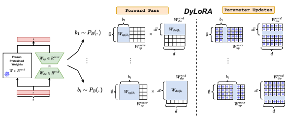

# Dylora: Parameter-Efficient Tuning Of Pretrained Models Using Dynamic Search-Free Low Rank Adaptation

Mojtaba Valipour1,2 Mehdi Rezagholizadeh2Ivan Kobyzev2 **Ali Ghodsi**1
{mojtaba.valipour, ali.ghodsi}@uwaterloo.ca, {mehdi.rezagholizadeh, ivan.kobyzev}@huawei.com 1: University of Waterloo, 2: Huawei Noah's Ark Lab

## Abstract 1 Introduction

With the ever-growing size of pretrained models (PMs), fine-tuning them has become more expensive and resource-hungry. As a remedy, low-rank adapters (LoRA) keep the main pretrained weights of the model frozen and just introduce some learnable truncated SVD modules (so-called LoRA blocks) to the model. While LoRA blocks are parameter-efficient, they suffer from two major problems: first, the size of these blocks is fixed and cannot be modified after training (for example, if we need to change the rank of LoRA blocks, then we need to re-train them from scratch); second, optimizing their rank requires an exhaustive search and effort. In this work, we introduce a dynamic low-rank adaptation (Dy- LoRA) technique to address these two problems together. Our DyLoRA method trains LoRA blocks for a range of ranks instead of a single rank by sorting the representation learned by the adapter module at different ranks during training. We evaluate our solution on different natural language understanding (GLUE benchmark) and language generation tasks (E2E, DART and WebNLG) using different pretrained models such as RoBERTa and GPT with different sizes. Our results show that we can train dynamic search-free models with DyLoRA at least 4 to 7 times (depending to the task) faster than LoRA without significantly compromising performance. Moreover, our models can perform consistently well on a much larger range of ranks compared to LoRA.

Pre-training/fine-tuning has become a popular paradigm for solving many tasks in natural language processing (NLP) (Devlin et al., 2018; Liu et al., 2019; Brown et al., 2020) and Computer Vision (Simonyan and Zisserman, 2014; He et al., 2016; Howard et al., 2019; Bochkovskiy et al.,

#### 1

2020; Chen et al., 2020; Dosovitskiy et al., 2020). pretrained models (PMs) such as pretrained language models (PLMs) (Devlin et al., 2018; Brown et al., 2020), and pretrained visual-language models (Lu et al., 2019; Li et al., 2019; Su et al., 2019; Xia et al., 2021) have advanced a lot in recent years. With the ever-growing size of these pretrained models, fine-tuning them on downstream tasks becomes more expensive. Moreover, as the ratio of the number of parameters of models with respect to the labeled data increases, the fine-tuning process will be more prone to overfitting (Karimi Mahabadi et al., 2021). There are two categories of solutions: first, model compression (Jafari et al., 2021; Chen et al., 2021); second, parameter-efficient tuning
(PET) (Houlsby et al., 2019a; Karimi Mahabadi et al., 2021; Mao et al., 2021).

There are many different model compression techniques in the literature for Transformer-based models such as matrix factorization (Noach and Goldberg, 2020; Tahaei et al., 2021), pruning (Wang et al., 2019), quantization (Tao et al.,
2022; Prato et al., 2020), and knowledge distillation (Hinton et al., 2015; Li et al., 2021; Jafari et al., 2021; Passban et al., 2021; Rashid et al., 2021).

There are also different types of PET techniques in the literature such as low-rank adapters (Wang et al., 2020; Karimi Mahabadi et al., 2021; Houlsby et al., 2019b; Hu et al., 2021b), and prompt-based techniques (Lester et al., 2021).

Although model compression solutions are wellestablished in recent years in the literature, applying them to large language models can be very costly, because compression techniques usually need to train (or fine-tune) the original large model.

A case in point is knowledge distillation which relies on fine-tuning a large teacher model or even pre-training the student model as suggested in (Jiao et al., 2019). Moreover, using compression techniques usually leads to degrading the model performance. PETs can be alternatives to the compres-

1github.com/huawei-noah/KD-NLP/tree/main/DyLoRA

Figure 1: DyLoRA: The overall diagram of our proposed method. In each iteration, we sample from a pre-defined random distribution which will help us to truncate the up-projection and down-projection matrices in the LoRA (Hu et al., 2021a) objective.

sion methods, especially when we would like to use the full capacity of the large pretrained models with light training efforts (such as the language-modelas-a-service scenario (Sun et al., 2022)). Among PET techniques, low-rank adapters have received much attention because, in contrast to prompttuning techniques, low-rank adapters do not add to the sequence length, get trained faster, and perform better (Karimi Mahabadi et al., 2021). Even though there are several low-rank adaptation techniques in the literature, such as Adapter (Houlsby et al., 2019b), Compacter (Karimi Mahabadi et al., 2021), and LoRA (Hu et al., 2021b); they all suffer from two major common problems: first, it is not clear how to select the size of their rank (while their performance is very sensitive to this rank selection); second, their training is static which means that if a low-rank model is trained based on a particular rank size, it will not work well in other rank values (i.e. for any other rank value we need to train a separate model).

This paper proposes a dynamic low-rank adapter technique (DyLoRA) to address these two problems. Without loss of generality, we focus on LoRA(Hu et al., 2021a) and train LoRA blocks for a range of ranks instead of a single rank by sorting out the representation learned at different ranks during training. While our model is more flexible, it can outperform LoRA in a much wider range of ranks without adding to the training time. Moreover, our technique does not need extra training for searching across ranks. We summarize our contributions in the following:
- Dynamic LoRA: On top of LoRA, we developed a new algorithm (DyLoRA) that makes it dynamic at inference time without incurring extra costs.

- Search-free LoRA: We demonstrate that by making a negligible compromise in performance, it is possible to avoid the costly search process of choosing the optimal rank for LoRA.

## 2 Related Work

This section reviews low-rank adaptation techniques for parameter-efficient tuning and potential existing solutions to make these techniques dynamic and search-free.

It has been shown in (Aghajanyan et al., 2020)
that for classification tasks such as natural language understanding (NLU), PLMs have a low intrinsic dimension. This observation motivates the use of low-rank adapters for parameter-efficient tuning.

There are several low-rank adapters in the literature such as LoRA (Hu et al., 2021b), Adapter (Houlsby et al., 2019b), Compacter (Karimi Mahabadi et al., 2021), and Parallel Adapter (PA) (He et al., 2021). LoRA is a low-rank up-projection/down-projection transformation without any non-linearity applied in parallel to key and value attention matrices.

The main benefit of LoRA is that the adapter module, after training, can be integrated into the original weight matrices of the model, which in turn can lead to a very efficient inference time.

Adapters also have a low-rank up-projection/downprojection transformation with an intermediate nonlinearity. The Adapter module is applied in series with the feed-forward network (FFN). Having the adaptor module in-line with other blocks in the model can increase the inference time of the model. PA is a faster version of the Adapter, which can be applied in parallel with the FFN block. The compactor is a more memory-efficient version of the Adapter, which deploys the sum of Kronecker products to reconstruct each up-projection and downprojection matrices. All these low-rank adapters suffer from two major issues: first, finding the best rank requires heavy exhaustive training and search; second, the tuned adapter module works well only with a particular rank.

While there have been some efforts in the literature towards dynamic networks such as DynaBERT (Hou et al., 2020) and GradMax (Evci et al., 2022), to the best of our knowledge, this problem for factorized networks and low-rank adapters is still open. DRONE (Chen et al., 2021) propose a technique for data-aware low-rank model compression however their approach is not search-free, and also, it is not dynamic. DynaBERT introduces a two-stage method to train width and depth-wise dynamic networks. However, DynaBERT requires a fine-tuned teacher model on the task to train its sub-networks which makes it unsuitable for PET
techniques. GradMax is a technique that gradually adds to the neurons of a network without touching the already trained neurons. But it is unclear how GradMax can be deployed to alleviate the rank-search problem in low-rank adapters. Wang et al. (2019) propose a structured pruning technique called factorized low-rank pruning (FLOP). FLOP decomposes weight matrices of a network into the sum of rank-1 components, which are regularized during training to gain sparsity. It is worth mentioning that FLOP aims at compressing the main model, and even if it can be used for finding a good rank in the lower-rank representation of full-weight matrices, the final low-rank model will not be dynamic (i.e. it is trained well only for one rank and not a range of ranks, same as LoRA.). In this paper, we propose a new methodology for training lowrank modules for multiple ranks simultaneously rather than training a single-rank adapter at a time (without changing the training budget). Inspired by the idea of *nested dropout* (Rippel et al., 2014), we pursue ordering the representations of the bottleneck at the low-rank adapter modules with a new recipe. To the best of our knowledge, it is the first time that the concept of ordering representations has been deployed in training PLMs.

## 3 Background

### 3.1 Nested Dropout

Inspired by the dropout (Hinton et al., 2012), nested drop-out (Rippel et al., 2014) is a stochastic regularization technique that targets enforcing ordered representations in training auto-encoders. The nested dropout, adds an implicit bias (which does not exist in dropout) to favor order in training. For example, in dropout, we can randomly drop any nodes or units in the network, but in nested dropout, if we randomly select k th unit, then we keep all the units indexed from 1 to k and drop the units with indices larger than k. Therefore, nested dropout tends toward accommodating more important information in lower indices while learning representations.

Following the notations of (Rippel et al., 2014),
nested dropout assumes an auto-encoder mapping of N training examples {yi}
N
i=1 ∈ Y , Y ⊂ R
D to their corresponding representations {xi}
N
i=1 ∈ X,
X ⊂ R
K using the function fθ : Y → X with parameters θ; and then decoding these representations using another function gψ : X → Y with parameters ψ to reconstruct the inputs. The reconstruction loss can be defined as follows:

$$C(\theta,\psi)=\sum_{i=1}^{N}||y_{i}-g_{\psi}(f_{\theta}(y_{i}))||^{2}.\quad(1)$$

Suppose we want to randomly drop some units in our representation vector x. In this regard, we sample a random variable b ∼ pB(.), b ∈ {1, 2*, ..., K*} from a pre-defined categorical distribution pB(.) and truncate the functions fθ and gψ to keep their corresponding units indexed from 1 to b and dropping b+1 to K indices. Let's define the b-truncated version of the vector x as x↓b and the b-truncated version of the functions fθ and gψ as fθ↓b and gψ↓b respectively. In this case, the reconstruction loss is redefined for the b-truncated model as follows:

$$C(\theta,\psi)=\mathbb{E}_{p_{B}}[C_{\downarrow b}(\theta,\psi)]=\sum_{b=1}^{K}p_{B}(b)C_{\downarrow b}(\theta,\psi)$$  where
$$C_{\downarrow b}(\theta,\psi)=\sum_{i=1}^{N}||y_{i}-g_{\psi\downarrow b}(f_{\theta\downarrow b}(y_{i}))||^{2}.$$
$$\mathrm{(2)}$$

In the final stage, the parameters of this model can be obtained by solving the following optimization problem.

$$(\theta^{*},\psi^{*})=\operatorname*{argmin}_{\theta,\psi}C(\theta,\psi).\qquad\qquad(3)$$

While our work in this paper is inspired by the feature of ordering information suggested in nested dropout, we can distinguish our work from nested dropout in several aspects:

1. The nested dropout technique is used to add order information to a vector representation; however, we are adding order information to the low-rank matrix decomposition to make it work across a range of ranks instead of a single rank.

2. Our training algorithm differs from nested dropout in the choice of the distribution function pB(.), and we propose a more efficient individual loss for each truncated matrix compared to the linear summation loss (check equations 2 and 11 in the original paper (Rippel et al., 2014)) in nested dropout. The original proposal for the nested dropout was to use a batch with mixed truncated examples. To enhance efficiency and resolve suboptimality, we propose to fix truncation in the entire batch

as part of our approach.

### 3.2 Lora: Low-Rank Adapters

In LoRA (Hu et al., 2021a), some pretrained weights of dense layers of PLMs are summed with parallel linear low-rank adapter modules. During fine-tuning, the original pretrained weights are kept frozen; LoRA modules can be updated instead. For example, let's assume that W0 ∈ R
m×dis a pretrained weight matrix in the network which is accompanied by a LoRA module ∆W = WupWdw where Wup ∈ R
m×r, Wdw ∈ R
r×d, and r min(*m, d*). Then, the output of this layer can be obtained as

$$h=W_{0}x+\Delta Wx=W_{0}x+{\frac{\alpha}{r}}W_{u p}W_{d w}x.\,\,\,\,(4)$$

Bear in mind that the Wup matrix is initialized as a zero matrix, and the Wdw matrix is initialized as a zero-mean Gaussian distribution where α is a constant scale hyper-parameter.

In LoRA, the rank r is a hyperparameter that should be tuned for each task. Moreover, LoRA is a *static* low-rank adapter that works only with a particular size of r, which has been trained on it.

## 4 Our Method: Dylora

In this section, we introduce our solution to get dynamic low-rank adapters that can be trained and deployed well on a range of ranks instead of a single particular rank (with a fixed training budget).

This flexibility can free us from searching for the best ranks by training the model multiple times.

Without loss of generality, we explain our solution on top of LoRA as one of the prominent low-rank adapter techniques in the literature. In each LoRA module, we have an up-projection
(Wup ∈ R
m×r) and a down-projection matrix
(Wdw ∈ R
r×d). Let's assume that we would like to train the LoRA module to operate in the range of r ∈ Range[rmin, rmax] where rmin and rmax can be treated as new hyper-parameters. To make the LoRA module work in a range of ranks instead of a single rank, we need to ensure that increasing or decreasing the rank will not significantly hamper the model's performance. One way to implement such behavior would be by sorting the information content of different ranks in the training process of LoRA modules. In this regard, at each training step, we sample b ∼ pB(.), b ∈ {rmin, rmin +
1, ..., rmax} form a pre-defined categorical distribution (which has a support in Range[rmin, rmax])
and truncate Wdw and Wup matrices accordingly.

$$\begin{array}{l}{{W_{d w\downarrow b}=W_{d w}[1:b,:]}}\\ {{W_{u p\downarrow b}=W_{u p}[:,1:b]}}\end{array}$$
$$\mathbf{\Pi}$$

(5)
Wdw↓b and Wup↓b are b-truncated versions of Wdw and Wup respectively (see Fig. 1 for the visualization). Moreover, let's define Wb dw as the b th row of Wdw; Wbup corresponds to the b th column of Wup.

$$\begin{array}{l}{{W_{d w}^{b}=W_{d w}[b,:]}}\\ {{W_{u p}^{b}=W_{u p}[:,b]}}\end{array}$$
$$\mathbf{\Pi})$$
$$\mathbf{\partial}$$

(6)
Then, the forward pass of this truncated LoRA module during training will be calculated as following:

$$h=W_{0}x+{\frac{\alpha}{b}}W_{u p\downarrow b}W_{d w\downarrow b}x$$

For simplicity, let's assume that we have only one LoRA module in the network (the one which is described in Eq. 7). Let's first consider the regular static loss function (L
S) of the network f(x; Wdw, Wup) with Wdw and Wup tunable parameters for N given input-output pairs (x, y) =

$$\begin{array}{c}{{\operatorname*{min}_{W_{d w},W_{u p}}{\mathcal{L}}^{S}({\mathbf{x}},{\mathbf{y}};W_{d w},W_{u p})\triangleq}}\\ {{\sum_{i=1}^{N}l(f(x_{i};W_{d w},W_{u p}),y_{i}).}}\\ {{\sum_{i=1}^{N}l(f(x_{i};W_{d w},W_{u p}),y_{i}).}}\end{array}$$

$$(8)$$

where l(f, y) is a loss function that measures the divergence of network predictions compared with the target labels. Then, let's extend the training loss to make the network dynamic considering the b-truncation process. We can define our dynamic loss function L
DY as follows.

$$\mathcal{L}_{\downarrow b}^{\mathcal{D}\mathcal{V}}=\sum_{i=1}^{N}l(f(x_{i};W_{d w\downarrow b},W_{u p\downarrow b}),y_{i}).\tag{9}$$

Bear in mind that, our loss function has a major difference from the nested dropout loss, which makes it more efficient. The nested dropout loss is in the form of Prmax b=rmin pB(b)L
DY ↓b
(x, y; Wdw↓b, Wup↓b)
which requires to sum the loss over the entire possible range of ranks and it is computationally expensive. To overcome this computational restriction, we replace it by optimizing the model parameters for each target rank individually at each time step.

We show that this scheme quite works well.

The other difference with nested dropout is that in the parameter update phase, we add a new mode (so-called *frozen*) as a hyper-parameter to our training. This new mode suggests to only update the b th corresponding row and column sampled in the truncation phase (i.e. a single row or column will be updated at a time to prevent the learning parameters from being forgotten at previous time steps.).

With a minor performance cost, this approach can improve the efficiency of our algorithm even further.

$$W_{d w}^{b}\gets W_{d w}^{b}-\eta\nabla_{W_{d w}^{b}}{\cal L}_{\downarrow b}^{\cal D y}\tag{10}$$ $$W_{u p}^{b}\gets W_{u p}^{b}-\eta\nabla_{W_{u p}^{b}}{\cal L}_{\downarrow b}^{\cal D y}$$

Table 4 shows the impact of only updating "b" versus updating the columns and rows from 1 to b. The summary of our technique is described in Algorithm 1.

## 5 Experiments

In this section, we describe the experiments used to evaluate our DyLoRA model on both natural language understanding (NLU) and natural language

### Algorithm 1 Dylora - Training

Require:
r ∈Range[rmin,rmax]; i: the number of training iterations; α: a scaling factor; pB: probability distribution function for rank selection; X ∈ R
d×n: all input features to LORA; W0 ∈ R
m×d the original frozen pretrained weight matrix Require: Wdw ∈ R
r×d; Wup ∈ R
m×r, FROZEN:
whether to keep the lower ranks frozen when updating the higher ranks while t < i do:
Forward: // sample a specific rank, during test is given b ∼ pB(.)
// truncate down-projection matrix Wdw↓b = Wdw[:b,:] Wb dw = Wdw[b,:]
// truncate up-projection matrix Wup↓b = Wup[:,:b]
Wbup = Wup[:,b]
// calculate the LoRA output h = W0X +
α b Wup↓bWdw↓bX
Backward:

# if PROZEN then  $$\newcommand{\vecs}[1]{\overset{\rightharpoonup}{\mathbf{#1}}}$$  $$\newcommand{\vecd}[1]{\overset{-\!-\!\rightharpoonup}{\vphantom{a}\smash{#1}}}$$
// only update the unique parameters of the selected rank

$$\mathbf{else}$$
$$\begin{array}{c}{{c c c c c r a t i m k}}\\ {{W_{d w}^{b}\gets W_{d w}^{b}-\eta\nabla_{W_{d w}^{b}}{\mathcal{L}}_{\downarrow b}^{\mathcal{D}\mathcal{Y}}}}\\ {{W_{u p}^{b}\gets W_{u p}^{b}-\eta\nabla_{W_{u p}^{b}}{\mathcal{L}}_{\downarrow b}^{\mathcal{D}\mathcal{Y}}}}\end{array}$$
$$\begin{array}{l}{{W_{d w\downarrow b}\gets W_{d w\downarrow b}-\eta\nabla_{W_{d w\downarrow b}^{b}}{\mathcal{L}}_{\downarrow b}^{\mathcal{D}\mathcal{V}}}}\\ {{W_{u p\downarrow b}\gets W_{u p\downarrow b}-\eta\nabla_{W_{u p\downarrow b}^{b}}{\mathcal{L}}_{\downarrow b}^{\mathcal{D}\mathcal{V}}}}\end{array}$$

end if end while generation (NLG) tasks. To be fair with the original LoRA method, we try to keep the setting of our experiments similar to the LoRA paper (Hu et al., 2021a). Therefore similarly, we chose the pretrained RoBERTa (Liu et al., 2019) base model as the backbone of the LoRA and DyLoRA experiments for the GLUE benchmark (Development Set), and GPT-Medium for the NLG tasks. For our experiments, we did not use any hyper-parameter tuning, nor did we search the validation epochs, nor did we use MLNI trick (use the MLNI checkpoint instead of the pretrained weights) to enhance the model's performance. More details about the hyperparameters is available in Table 8 in Appendix B. In total, we conducted more than 200 experiments and evaluated more than 1600 models, details of

|                   |        |        | Model: RoBERTa\-Base   |        |         |         |
|-------------------|--------|--------|------------------------|--------|---------|---------|
| Task              | Rank=1 | Rank=2 | Rank=4                 | Rank=8 | Rank=16 | Rank=32 |
| QQP (Accuracy)    | 89.14  | 89.96  | 90.33                  | 90.69  | 90.95   | 91.02   |
| SST\-2 (Accuracy) | 93.58  | 94.15  | 94.38                  | 94.84  | 94.27   | 94.5    |
| MRPC (Accuracy)   | 87.25  | 87.75  | 88.24                  | 87.25  | 86.76   | 89.22   |
| CoLA (Mathews)    | 61.84  | 57.78  | 61.57                  | 63.81  | 63.07   | 62.82   |

Table 1: The effect of the rank of the low-rank adaptation matrix over the performance of the model. In this experiment, all the other hyperparameters are fixed, and we only changed the rank of the LoRA model. In this search space, Underline shows the minimum performance rank, and the **bold** number shows the maximum performance

|                 | Accuracy   | Accuracy   | F1         | Mathews     | Accuracy   | Accuracy   | Accuracy    | Pearson    |       |
|-----------------|------------|------------|------------|-------------|------------|------------|-------------|------------|-------|
| Model           | MNLI       | SST\-2     | MRPC       | CoLA        | QNLI       | QQP        | RTE         | STS\-B     | Avg   |
|                 |            |            |            | Rank = 1    |            |            |             |            |       |
| LoRA            | 34.60±3.69 | 69.61±7.99 | 83.47±3.90 | 25.57±9.71  | 53.00±2.95 | 44.30±7.50 | 57.55±5.51  | 76.07±6.06 | 54.90 |
| DyLoRA (Frozen) | 85.36±0.26 | 93.51±0.49 | 90.75±0.70 | 56.95±1.54  | 91.70±0.28 | 87.87±0.17 | 66.79±8.54  | 89.95±0.24 | 82.86 |
| DyLoRA          | 85.59±0.07 | 93.23±0.63 | 91.58±0.69 | 57.93±2.12  | 91.95±0.14 | 88.37±0.15 | 74.80±1.48  | 90.30±0.13 | 84.22 |
|                 |            |            |            | Rank = 2    |            |            |             |            |       |
| LoRA            | 40.53±6.17 | 82.75±5.08 | 88.00±1.81 | 43.30±4.67  | 63.42±2.99 | 59.21±6.13 | 68.88±1.26  | 85.51±1.94 | 66.45 |
| DyLoRA (Frozen) | 85.74±0.28 | 93.76±0.52 | 91.09±0.45 | 56.88±2.09  | 92.03±0.22 | 88.21±0.07 | 63.90±12.85 | 90.25±0.15 | 82.73 |
| DyLoRA          | 86.02±0.06 | 93.81±0.30 | 91.66±0.46 | 59.91±1.88  | 92.39±0.25 | 89.33±0.05 | 76.03±1.61  | 90.60±0.09 | 84.97 |
|                 |            |            |            | Rank = 3    |            |            |             |            |       |
| LoRA            | 58.95±6.02 | 90.00±1.27 | 89.66±1.25 | 56.78±1.88  | 79.26±4.80 | 72.58±4.09 | 72.49±2.30  | 88.80±0.29 | 76.07 |
| DyLoRA (Frozen) | 85.78±0.25 | 93.76±0.26 | 91.78±0.89 | 58.86±0.32  | 92.17±0.18 | 88.40±0.0  | 70.90±6.14  | 90.50±0.29 | 84.02 |
| DyLoRA          | 86.70±0.09 | 94.11±0.33 | 91.56±0.86 | 60.97±2.01  | 92.77±0.21 | 89.76±0.07 | 77.11±2.97  | 90.69±0.14 | 85.46 |
|                 |            |            |            | Rank = 4    |            |            |             |            |       |
| LoRA            | 72.10±5.25 | 91.56±0.34 | 89.62±0.92 | 58.53±3.93  | 85.09±1.20 | 80.78±3.73 | 73.07±2.29  | 89.28±0.72 | 80.00 |
| DyLoRA (Frozen) | 85.93±0.19 | 93.85±0.33 | 91.28±0.71 | 59.25±1.05  | 92.27±0.16 | 88.52±0.08 | 71.12±2.46  | 90.53±0.18 | 84.10 |
| DyLoRA          | 86.82±0.04 | 94.40±0.13 | 92.06±0.46 | 59.81±1.71  | 92.91±0.31 | 89.80±0.10 | 77.40±2.72  | 90.86±0.06 | 85.53 |
|                 |            |            |            | Rank = 5    |            |            |             |            |       |
| LoRA            | 78.61±3.97 | 92.82±0.46 | 90.75±0.96 | 60.37±3.10  | 88.97±0.90 | 85.26±1.56 | 73.21±2.17  | 89.90±0.30 | 82.49 |
| DyLoRA (Frozen) | 85.95±0.17 | 93.78±0.26 | 91.28±0.64 | 59.41±1.30  | 92.30±0.17 | 88.56±0.09 | 71.48±2.92  | 90.60±0.20 | 84.17 |
| DyLoRA          | 87.00±0.10 | 94.29±0.41 | 91.73±0.60 | 60.52±1.07  | 93.01±0.28 | 90.04±0.10 | 76.90±2.11  | 90.97±0.20 | 85.56 |
|                 |            |            |            | Rank = 6    |            |            |             |            |       |
| LoRA            | 83.02±1.59 | 93.49±0.88 | 91.28±0.63 | 61.94±2.27  | 90.32±0.76 | 87.54±1.51 | 76.68±1.16  | 90.12±0.12 | 84.30 |
| DyLoRA (Frozen) | 85.98±0.16 | 93.76±0.46 | 91.12±0.43 | 58.95±1.10  | 92.46±0.14 | 88.68±0.13 | 72.64±2.44  | 90.64±0.23 | 84.28 |
| DyLoRA          | 86.97±0.20 | 94.27±0.37 | 91.44±0.64 | 60.16±1.70  | 93.01±0.21 | 90.07±0.14 | 77.33±1.66  | 91.03±0.20 | 85.53 |
|                 |            |            |            | Rank = 7    |            |            |             |            |       |
| LoRA            | 85.44±0.78 | 93.62±0.35 | 91.27±0.73 | 62.19±2.66  | 91.88±0.23 | 89.51±0.30 | 75.52±1.41  | 90.35±0.24 | 84.97 |
| DyLoRA (Frozen) | 86.08±0.14 | 93.97±0.17 | 91.02±0.70 | 58.76±0.94  | 92.30±0.10 | 88.77±0.06 | 73.50±1.67  | 90.68±0.15 | 84.38 |
| DyLoRA          | 86.82±0.10 | 94.27±0.33 | 91.38±0.59 | 59.51±1.75  | 92.99±0.26 | 90.04±0.06 | 77.91±1.58  | 91.07±0.19 | 85.50 |
|                 |            |            |            | Rank = 8    |            |            |             |            |       |
| LoRA            | 86.82±0.18 | 94.01±0.30 | 91.48±0.73 | 62.08±1.37  | 92.39±0.39 | 90.42±0.02 | 74.51±0.41  | 90.48±0.24 | 85.27 |
| DyLoRA (Frozen) | 86.10±0.04 | 93.69±0.41 | 91.19±0.79 | 58.52±0.95  | 92.47±0.18 | 88.82±0.06 | 73.29±2.49  | 90.68±0.14 | 84.35 |
| DyLoRA          | 86.76±0.13 | 94.36±0.38 | 91.38±0.83 | 59.51±1.84  | 93.00±0.32 | 89.91±0.08 | 77.55±0.59  | 91.05±0.19 | 85.44 |
|                 |            |            |            | Best (Rank) |            |            |             |            |       |
| LoRA            | 87.03(8)   | 94.50(6)   | 92.25(7)   | 66.05(7)    | 92.81(8)   | 90.45(8)   | 77.98(6)    | 90.87(8)   | 86.49 |
| DyLoRA (Frozen) | 86.18(7)   | 94.50(2)   | 92.93(3)   | 61.57(5)    | 92.70(6)   | 88.88(8)   | 75.81(7)    | 90.89(6)   | 85.43 |
| DyLoRA          | 87.17(6)   | 94.72(7)   | 92.79(8)   | 63.32(3)    | 93.56(8)   | 90.17(6)   | 80.14(4)    | 91.36(7)   | 86.66 |
|                 |            |            |            | Full Rank   |            |            |             |            |       |
| Fine Tune∗      | 87.6       | 94.8       | 90.2       | 63.6        | 92.8       | 91.9       | 78.7        | 91.2       | 86.4  |

rank.

Table 2: In this table, the task is to find a low-rank adaptation matrix that works with different ranks at inference time given a fixed budget (training time).

which can be found in the attachments.

5.1 Baselines
- **Fine Tune**: To show a relative upper bound for the performance of our proposed method, we fine-tuned all the parameters in the model.

Even though we have a large number of trainable parameters, this can help us better understand how higher-rank models perform.

- **LoRA**: As a baseline to DyLoRA, we employed the original LoRA model with their tuned hyperparameters (Hu et al., 2021a). As

|              |                  | Accuracy      | F1         | Accuracy   | Pearson    |         |
|--------------|------------------|---------------|------------|------------|------------|---------|
| Model (Rank) | Trainable Params | SST\-2        | MRPC       | QNLI       | STS\-B     | AVERAGE |
| Fine Tune∗   | 125M             | 94.8          | 90.2       | 92.8       | 91.2       | 92.25   |
| FLOP∗        | 80M              | 92.09         | 88.61      | 89.05      | 88.18      | 89.48   |
| LoRA (1)     | 0.628M           | 93.58         | 91.93      | 91.98      | 90.85      | 92.09   |
|              |                  | Maximum Rank: | = 8  rmax  |            |            |         |
| DyLoRA (1)   | 0.628M           | 93.23±0.63    | 91.58±0.69 | 91.95±0.14 | 90.30±0.13 | 91.77   |
| DyLoRA (8)   | 0.887M           | 94.36±0.38    | 91.38±0.83 | 93.00±0.32 | 91.05±0.19 | 92.45   |

|                      |                    |                 | Maximum Rank: rmax   | = 8           |                |               |                  |         |
|----------------------|--------------------|-----------------|----------------------|---------------|----------------|---------------|------------------|---------|
|                      |                    | Accuracy SST\-2 | F1  MRPC             | Mathews  CoLA | Accuracy  QNLI | Accuracy  RTE | Pearson   STS\-B |         |
| b ∼ PB: Distribution | Updated Parameters |                 |                      |               |                |               |                  | AVERAGE |
|                      |                    |                 |                      |               | Rank=8         |               |                  |         |
| Geometric (p=0.15)   | Wdw↓b,Wup↓b        | 93.97±0.33      | 90.84±1.15           | 58.95±1.95    | 92.74±0.13     | 74.80±0.90    | 90.66±0.15       | 83.66   |
|                      | Wb  dw,Wb  up      | 93.60±0.24      | 90.50±0.42           | 58.19±1.17    | 92.26±0.12     | 71.91±1.74    | 90.20±0.36       | 82.78   |
| Uniform              | Wdw↓b,Wup↓b        | 94.36±0.38      | 91.38±0.83           | 59.51±1.84    | 93.00±0.32     | 77.55±0.59    | 91.05±0.19       | 84.47   |
|                      | Wb  dw,Wb  up      | 93.69±0.41      | 91.19±0.79           | 58.52±0.95    | 92.47±0.18     | 73.29±2.49    | 90.68±0.14       | 83.31   |
|                      |                    |                 |                      |               | Rank=1         |               |                  |         |
| Geometric (p=0.15)   | Wdw↓b,Wup↓b        | 93.53±0.47      | 91.36±0.72           | 59.43±1.12    | 92.24±0.08     | 73.65±3.55    | 90.33±0.14       | 83.42   |
|                      | Wb  dw,Wb  up      | 93.58±0.26      | 90.81±0.83           | 58.55±1.13    | 92.27±0.28     | 68.52±11.88   | 90.60±0.31       | 82.39   |
| Uniform              | Wdw↓b,Wup↓b        | 93.23±0.63      | 91.58±0.69           | 57.93±2.12    | 91.95±0.14     | 74.80±1.48    | 90.30±0.13       | 83.30   |
|                      | Wb  dw,Wb  up      | 93.51±0.49      | 90.75±0.70           | 56.95±1.54    | 91.70±0.28     | 66.79±8.54    | 89.95±0.24       | 81.61   |

Table 3: This table compares DyLoRA with compression-based algorithms. As indicated by *, we reported "Fine Tune" and FLOP from their original papers, (Liu et al., 2019) and (Wang et al., 2019). To the best of our knowledge, experiments were conducted under the same experimental setting. We count all the trainable parameters including classifier, unlike LoRA paper (Hu et al., 2021a) which they count only LoRA specific parameters.

Table 4: Ablation Study - In this experiment, our goal is to demonstrate how the introduced distribution can affect the performance of DyLoRA.

a result, most of the experiments have been conducted in a favorable manner for LoRA.

- **FLOP**: Due to its flexibility, Factorized Low Rank Pruning (FLOP) (Wang et al., 2019) can be applied to any matrix multiplication and, therefore, can be used to avoid the search in our problem. However, this baseline lacks the dynamic properties of DyLoRA. We used it to show regularization-based techniques' performance and pros and cons.

### 5.2 Lora Rank Selection Problem

There is no clear guidance on how to determine the rank for the LoRA algorithm. It is evident in the LoRA paper (Hu et al., 2021a) that the performance of models varies a lot with different ranks (e.g. check Tables 15, and 18 in the LoRA paper), and does not indicate any clear trend. We also observe the same problem in the GLUE benchmark.

We may argue that theoretically, the rank with the best performance is always the highest. High ranks, however, introduce additional parameters into the adaptive process and this might be undesirable. In practice, as demonstrated in Table 1, the most effective rank differs depending on the task. For example, based on the MRPC results, the rank with the lowest performance is 16 while the rank with the highest performance is 32. This is different from SST-2, in which rank 1 is the least performing rank and rank 8 is the most effective rank. Many factors can contribute to this difference, including but not limited to the size of the dataset, hyperparameter selections, hardware configurations and the optimization.

### 5.3 Dynamic Low Rank Adaptation

For example, suppose we have a neural network that we wish to deploy on various devices with different configurations. The use of higher ranks may pose a problem for very sensitive devices as they have a greater number of parameters. Therefore, we must either train several models with different configurations or find the most optimal rank. The cost associated with this is significant, as even in the setting of LoRA, we are required to find the best rank for each task and each device. Using DyLoRA, however, one needs to train one model per task and, as our method is adaptive at inference time, we can deploy it according to our needs. In Table 2, we demonstrate the dynamic properties of DyLoRA. In order to ensure a fair comparison, all LoRA and DyLoRA models in this table have the same model size, we used the same code and evaluation process, and all models were trained to the same extent. In LoRA, we lose performance when performing inferences for the lower ranks. This occurs because the model has been trained only for rank 8 during training. In DyLoRA, we preserve a high level of performance for lower ranks while competing well with LoRA on rank 8.

| Model  Time             |    | SST\-2 (r)   | MRPC (r)   |
|-------------------------|----|--------------|------------|
| Maximum Rank: rmax = 64 |    |              |            |
| LoRA (Search)           | 7x | 95.3(64)     | 89.71(64)  |
| DyLoRA (Frozen)         | 1x | 94.38(7)     | 89.95(34)  |
| Maximum Rank: rmax = 32 |    |              |            |
| LoRA (Search)           | 6x | 94.84(32)    | 88.73(16)  |
| DyLoRA (Frozen)         | 1x | 94.38(7)     | 89.71(5)   |

Table 5: In this table, the search space of rank is larger

compared to the previous experiment and the goal is to find the most optimal rank for the low-rank adaptation of a pre-rained RoBERTa-Base. For LoRA (Search),
we ran experiments for ranks=1,2,4,8,16,32,64 and we reported the best results. In the Exhaustive Search, one has to search all the ranks from 1 to 64, which means it will cost 64 times more than our proposed method. The lower the rank the better, and the higher the performance is the better.

### 5.4 Search-Free Low Rank Adaptation

The process of selecting a particular rank can be expensive as previously mentioned. In Table 5, we present an experiment that illustrates the costs associated with such a search for LoRA and DyLoRA. As an example, if one naively wanted to search the entire range of ranks (for example, 64 in the experiment), then they would have to train and evaluate 64 distinct models in order to determine the proper rank. It becomes even more expensive if one search the entire rank space. In the case of uniform search, this cost is less, yet still more expensive (7 times in the experiment) than our proposed method. Therefore, for LoRA (Search), we ran experiments for ranks=1,2,4,8,16,32,64 and we reported the best results. The results demonstrate that our proposed method performs competitively at a much lower cost.

#### 5.5 Robustness Of Dylora

As illustrated in Table 2, DyLoRA is quite robust to randomness and can produce consistently good results due to stable convergence.

### 5.6 Regularization And Pruning

An alternative method of avoiding the search problem is using regularization/pruning techniques to determine the intrinsic rank of the weight matrix.

In this way, we can reduce the number of parameters of the original matrices; however, we will not have a dynamic model during inference. To illustrate the difference between such methods and DyLoRA, we reported the performance of one of these models, FLOP (Wang et al., 2019), in Table 3. FLOP utilizes low-rank factorization to create new matrices representing the original weight matrix. Thus, they will have fewer total parameters but require more trainable parameters to reach a comparable performance to DyLoRA.

### 5.7 Generative Tasks

In this experiment, we evaluate the performance of our model on different natural language generation (NLG) tasks such as the E2E NLG Challenge (Novikova et al., 2017), DART (Nan et al., 2020) and WebNLG (Gardent et al., 2017). The results of the E2E task are shown in Table 6 and due to the space limit, the results of the other two tasks are demonstrated in Appendix C. The generative tasks demonstrate a similar pattern as the NLU task, showing that our model is able to work well at wider range of ranks compared to LoRA.

### 5.8 Ablation Study

In this subsection, we investigate the impact of two design choices in DyLoRA: first, the new distribution PB hyper-parameter in our technique; second, the impact of updating Wb dw and Wb up parameters instead of the entire Wdw↓b and Wup↓b. The distribution PB changes the relative importance of the different ranks during the training process.

To examine the impact of the chosen distribution on DyLoRA's performance, we used two distributions, geometric and uniform. As shown in Table 4, the geometric distribution, provides a much better method for optimizing the lower ranks, since it pays much more attention to the lower ranks during training, and uniform distribution will give better performance over all ranks. We chose to use uniform distribution in most of our experiments to avoid adding another hyperparameter which is a requirement of the geometric distribution. Moreover, we demonstrate that it is possible to ensure that the optimization of rank b will not negatively affect the performance of the lower ranks (1 to b − 1), while

| Model (Method)    | Updated Params   | Trainable Params   |            |           | E2E NLG Challenge   |            |           |
|-------------------|------------------|--------------------|------------|-----------|---------------------|------------|-----------|
|                   |                  |                    | BLEU       | NIST      | MET                 | ROUGE\-L   | CIDEr     |
|                   |                  |                    |            |           | Rank=1              |            |           |
| GPT\-2 M (LoRA)   |                  | 0.09M              | 3.38       | 1.18      | 9.23                | 18.79      | 0.12      |
| GPT\-2 M (DyLoRA) | Wb  dw,Wb  up    | 0.09M              | 67.92±0.20 | 8.65±0.06 | 44.91±0.38          | 69.07±0.32 | 2.38±0.04 |
| GPT\-2 M (DyLoRA) | Wdw↓b,Wup↓b      | 0.09M              | 68.86±0.55 | 8.72±0.04 | 45.81±0.40          | 70.33±0.64 | 2.43±0.04 |
|                   |                  |                    |            |           | Rank=2              |            |           |
| GPT\-2 M (LoRA)   |                  | 0.19M              | 46.99      | 6.39      | 34.19               | 56.10      | 1.27      |
| GPT\-2 M (DyLoRA) | Wb  dw,Wb  up    | 0.19M              | 68.81±0.49 | 8.75±0.02 | 45.23±0.22          | 69.81±0.30 | 2.41±0.01 |
| GPT\-2 M (DyLoRA) | Wdw↓b,Wup↓b      | 0.19M              | 68.97±1.03 | 8.75±0.07 | 45.88±0.55          | 70.07±0.86 | 2.43±0.04 |
|                   |                  |                    |            |           | Rank=3              |            |           |
| GPT\-2 M (LoRA)   |                  | 0.29M              | 63.68      | 8.46      | 42.37               | 65.84      | 2.24      |
| GPT\-2 M (DyLoRA) | Wb  dw,Wb  up    | 0.29M              | 68.41±1.00 | 8.69±0.10 | 45.31±0.64          | 69.75±0.69 | 2.42±0.02 |
| GPT\-2 M (DyLoRA) | Wdw↓b,Wup↓b      | 0.29M              | 69.33±0.26 | 8.76±0.05 | 46.19±0.22          | 70.56±0.43 | 2.46±0.01 |
|                   |                  |                    |            |           | Rank=4              |            |           |
| GPT\-2 M (LoRA)   |                  | 0.39M              | 69.88      | 8.81      | 46.81               | 72.10      | 2.53      |
| GPT\-2 M (DyLoRA) | Wb  dw,Wb  up    | 0.39M              | 68.36±0.41 | 8.70±0.02 | 45.46±0.56          | 69.91±0.50 | 2.43±0.01 |
| GPT\-2 M (DyLoRA) | Wdw↓b,Wup↓b      | 0.39M              | 69.19±0.43 | 8.75±0.03 | 46.26±0.47          | 70.78±0.63 | 2.46±0.02 |
|                   |                  |                    |            |           | Fine\-Tune          |            |           |
| GPT\-2 M (FT)∗    |                  | 354M               | 68.2       | 8.62      | 46.2                | 71.0       | 2.5       |

Table 6: For all metrics, higher is better. Rows with * have been reported based on the LoRA paper. Unlike (Hu et al., 2021a), we included the classifier number of parameters in our trainable parameters count.

| Maximum Rank: rmax   |        |               | = 8   |
|----------------------|--------|---------------|-------|
| Loss                 |        | Training Time | CoLA  |
| DY  L ↓b             |        | 645.82s       | 52.64 |
| P pB(b)L             | DY  ↓b | 1175.69s      | 54.12 |

performing reasonably well. As mentioned, this can be accomplished by only updating the unique parameters associated with rank r that do not overlap with lower ranks.

In addition, in Table 7, we demonstrate the result of using our individual loss (Eq. 9) vs. the nested dropout original objective function in an equal setting. As shown, our proposed objective function is both effective and efficient. Furthermore, it is important to note that the summation loss is not scalable when many ranks are involved. We also discussed the time complexity of LoRA and Dy- LoRA in Appendix A.

ing individual loss vs. summation loss functions on our training. The average performance across all possible ranks (1,2,...,8) is reported. For summation loss to be computationally more feasible, smaller epochs were

Table 7: This experiment shows the impact of chooschosen. A total of seven GPUs were used in this experiment.

## 6 Conclusion

In this paper, we presented our solution DyLoRA to address two problems in low-rank adapters regarding rank selection and making them dynamic. We showed that DyLoRA can select the rank without requiring multiple re-training and is able to make LoRA dynamic at inference time. As a result, we can avoid the process of searching for the most optimal ranks for many real-life scenarios. It has been demonstrated that DyLoRA performance is comparable with LoRA, yet we can support a wider range of ranks without adding additional time and effort.

## Limitations

According to LoRA (Hu et al., 2021a), a proper choice of the scalar can improve the results. In order to determine what is the best choice, further investigation is required. Despite our demonstration that uniform distribution can be as effective as specific geometric distribution, further investigation is necessary to evaluate the effect of different distributions on different downstream tasks. As shown in this paper, our algorithm works over a wide range of ranks, but further research is needed to understand the impact of choosing a particular range.

## 7 Acknowledgement

We would like to use DyLoRA with Mindspore2, which is a new framework for deep learning computing.

2mindspore.cn

## References

Geoffrey Hinton, Oriol Vinyals, Jeff Dean, et al. 2015.

Distilling the knowledge in a neural network. *arXiv* preprint arXiv:1503.02531, 2(7).

Armen Aghajanyan, Luke Zettlemoyer, and Sonal Gupta. 2020. Intrinsic dimensionality explains the effectiveness of language model fine-tuning. *arXiv* preprint arXiv:2012.13255.

Geoffrey E Hinton, Nitish Srivastava, Alex Krizhevsky, Ilya Sutskever, and Ruslan R Salakhutdinov. 2012. Improving neural networks by preventing coadaptation of feature detectors. arXiv preprint arXiv:1207.0580.

Alexey Bochkovskiy, Chien-Yao Wang, and Hong-
Yuan Mark Liao. 2020. Yolov4: Optimal speed and accuracy of object detection. *arXiv preprint* arXiv:2004.10934.

Lu Hou, Zhiqi Huang, Lifeng Shang, Xin Jiang, Xiao Chen, and Qun Liu. 2020. Dynabert: Dynamic bert with adaptive width and depth. *Advances in Neural* Information Processing Systems, 33:9782–9793.

Tom Brown, Benjamin Mann, Nick Ryder, Melanie Subbiah, Jared D Kaplan, Prafulla Dhariwal, Arvind Neelakantan, Pranav Shyam, Girish Sastry, Amanda Askell, et al. 2020. Language models are few-shot learners. Advances in neural information processing systems, 33:1877–1901.

Neil Houlsby, Andrei Giurgiu, Stanislaw Jastrzebski, Bruna Morrone, Quentin De Laroussilhe, Andrea Gesmundo, Mona Attariyan, and Sylvain Gelly. 2019a. Parameter-efficient transfer learning for nlp. In *International Conference on Machine Learning*, pages 2790–2799. PMLR.

Mark Chen, Alec Radford, Rewon Child, Jeffrey Wu, Heewoo Jun, David Luan, and Ilya Sutskever. 2020. Generative pretraining from pixels. In International conference on machine learning, pages 1691–1703. PMLR.

Neil Houlsby, Andrei Giurgiu, Stanislaw Jastrzebski, Bruna Morrone, Quentin De Laroussilhe, Andrea Gesmundo, Mona Attariyan, and Sylvain Gelly. 2019b. Parameter-efficient transfer learning for nlp. In *International Conference on Machine Learning*, pages 2790–2799. PMLR.

Patrick Chen, Hsiang-Fu Yu, Inderjit Dhillon, and Cho-
Jui Hsieh. 2021. Drone: Data-aware low-rank compression for large nlp models. Advances in neural information processing systems, 34:29321–29334.

Andrew Howard, Mark Sandler, Grace Chu, Liang-
Chieh Chen, Bo Chen, Mingxing Tan, Weijun Wang, Yukun Zhu, Ruoming Pang, Vijay Vasudevan, et al. 2019. Searching for mobilenetv3. In Proceedings of the IEEE/CVF international conference on computer vision, pages 1314–1324.

Jacob Devlin, Ming-Wei Chang, Kenton Lee, and Kristina Toutanova. 2018. Bert: Pre-training of deep bidirectional transformers for language understanding. *arXiv preprint arXiv:1810.04805*.

Alexey Dosovitskiy, Lucas Beyer, Alexander Kolesnikov, Dirk Weissenborn, Xiaohua Zhai, Thomas Unterthiner, Mostafa Dehghani, Matthias Minderer, Georg Heigold, Sylvain Gelly, et al. 2020. An image is worth 16x16 words: Transformers for image recognition at scale. arXiv preprint arXiv:2010.11929.

Edward J Hu, Yelong Shen, Phillip Wallis, Zeyuan Allen-Zhu, Yuanzhi Li, Shean Wang, Lu Wang, and Weizhu Chen. 2021a. Lora: Low-rank adaptation of large language models. *arXiv preprint* arXiv:2106.09685.

Edward J Hu, Yelong Shen, Phillip Wallis, Zeyuan Allen-Zhu, Yuanzhi Li, Shean Wang, Lu Wang, and Weizhu Chen. 2021b. Lora: Low-rank adaptation of large language models. arXiv preprint arXiv:2106.09685.

Utku Evci, Max Vladymyrov, Thomas Unterthiner, Bart van Merriënboer, and Fabian Pedregosa. 2022. Gradmax: Growing neural networks using gradient information. *arXiv preprint arXiv:2201.05125*.

Claire Gardent, Anastasia Shimorina, Shashi Narayan, and Laura Perez-Beltrachini. 2017. The webnlg challenge: Generating text from rdf data. In Proceedings of the 10th International Conference on Natural Language Generation, pages 124–133.

Aref Jafari, Mehdi Rezagholizadeh, Pranav Sharma, and Ali Ghodsi. 2021. Annealing knowledge distillation. In Proceedings of the 16th Conference of the European Chapter of the Association for Computational Linguistics: Main Volume, pages 2493–2504, Online. Association for Computational Linguistics.

Junxian He, Chunting Zhou, Xuezhe Ma, Taylor Berg-
Kirkpatrick, and Graham Neubig. 2021. Towards a unified view of parameter-efficient transfer learning.

arXiv preprint arXiv:2110.04366.

Xiaoqi Jiao, Yichun Yin, Lifeng Shang, Xin Jiang, Xiao Chen, Linlin Li, Fang Wang, and Qun Liu. 2019. Tinybert: Distilling bert for natural language understanding. *arXiv preprint arXiv:1909.10351*.

Kaiming He, Xiangyu Zhang, Shaoqing Ren, and Jian Sun. 2016. Deep residual learning for image recognition. In Proceedings of the IEEE conference on computer vision and pattern recognition, pages 770–
778.

Rabeeh Karimi Mahabadi, James Henderson, and Sebastian Ruder. 2021. Compacter: Efficient low-rank hypercomplex adapter layers. Advances in Neural Information Processing Systems, 34:1022–1035.

Brian Lester, Rami Al-Rfou, and Noah Constant. 2021.

The power of scale for parameter-efficient prompt tuning. *arXiv preprint arXiv:2104.08691*.

Lei Li, Yankai Lin, Shuhuai Ren, Peng Li, Jie Zhou, and Xu Sun. 2021. Dynamic knowledge distillation for pre-trained language models. arXiv preprint arXiv:2109.11295.

Liunian Harold Li, Mark Yatskar, Da Yin, Cho-Jui Hsieh, and Kai-Wei Chang. 2019. Visualbert: A simple and performant baseline for vision and language. *arXiv preprint arXiv:1908.03557*.

Yinhan Liu, Myle Ott, Naman Goyal, Jingfei Du, Mandar Joshi, Danqi Chen, Omer Levy, Mike Lewis, Luke Zettlemoyer, and Veselin Stoyanov. 2019. Roberta: A robustly optimized bert pretraining approach. *arXiv preprint arXiv:1907.11692*.

Jiasen Lu, Dhruv Batra, Devi Parikh, and Stefan Lee. 2019. Vilbert: Pretraining task-agnostic visiolinguistic representations for vision-and-language tasks. Advances in neural information processing systems, 32.

Yuning Mao, Lambert Mathias, Rui Hou, Amjad Almahairi, Hao Ma, Jiawei Han, Wen-tau Yih, and Madian Khabsa. 2021. Unipelt: A unified framework for parameter-efficient language model tuning. arXiv preprint arXiv:2110.07577.

Linyong Nan, Dragomir Radev, Rui Zhang, Amrit Rau, Abhinand Sivaprasad, Chiachun Hsieh, Xiangru Tang, Aadit Vyas, Neha Verma, Pranav Krishna, et al. 2020. Dart: Open-domain structured data record to text generation. *arXiv preprint* arXiv:2007.02871.

Matan Ben Noach and Yoav Goldberg. 2020. Compressing pre-trained language models by matrix decomposition. In Proceedings of the 1st Conference of the Asia-Pacific Chapter of the Association for Computational Linguistics and the 10th International Joint Conference on Natural Language Processing, pages 884–889.

Jekaterina Novikova, Ondˇrej Dušek, and Verena Rieser.

2017. The e2e dataset: New challenges for end-toend generation. *arXiv preprint arXiv:1706.09254*.

Peyman Passban, Yimeng Wu, Mehdi Rezagholizadeh, and Qun Liu. 2021. ALP-KD: attention-based layer projection for knowledge distillation. In *Thirty-Fifth* AAAI Conference on Artificial Intelligence, AAAI
2021, Thirty-Third Conference on Innovative Applications of Artificial Intelligence, IAAI 2021, The Eleventh Symposium on Educational Advances in Artificial Intelligence, EAAI 2021, Virtual Event, February 2-9, 2021, pages 13657–13665. AAAI
Press.

Gabriele Prato, Ella Charlaix, and Mehdi Rezagholizadeh. 2020. Fully quantized transformer for machine translation. In Findings of the Association for Computational Linguistics: EMNLP 2020, pages 1–14.

Ahmad Rashid, Vasileios Lioutas, and Mehdi Rezagholizadeh. 2021. Mate-kd: Masked adversarial text, a companion to knowledge distillation. arXiv preprint arXiv:2105.05912.

Oren Rippel, Michael Gelbart, and Ryan Adams.

2014. Learning ordered representations with nested dropout. In Proceedings of the 31st International Conference on Machine Learning, volume 32 of Proceedings of Machine Learning Research, pages 1746–1754, Bejing, China. PMLR.

Karen Simonyan and Andrew Zisserman. 2014. Very deep convolutional networks for large-scale image recognition. *arXiv preprint arXiv:1409.1556*.

Weijie Su, Xizhou Zhu, Yue Cao, Bin Li, Lewei Lu, Furu Wei, and Jifeng Dai. 2019. Vl-bert: Pretraining of generic visual-linguistic representations. arXiv preprint arXiv:1908.08530.

Tianxiang Sun, Yunfan Shao, Hong Qian, Xuanjing Huang, and Xipeng Qiu. 2022. Black-box tuning for language-model-as-a-service. *arXiv preprint* arXiv:2201.03514.

Marzieh S Tahaei, Ella Charlaix, Vahid Partovi Nia, Ali Ghodsi, and Mehdi Rezagholizadeh. 2021. Kroneckerbert: Learning kronecker decomposition for pre-trained language models via knowledge distillation. *arXiv preprint arXiv:2109.06243*.

Chaofan Tao, Lu Hou, Wei Zhang, Lifeng Shang, Xin Jiang, Qun Liu, Ping Luo, and Ngai Wong. 2022. Compression of generative pre-trained language models via quantization. *arXiv preprint* arXiv:2203.10705.

Ruize Wang, Duyu Tang, Nan Duan, Zhongyu Wei, Xuanjing Huang, Guihong Cao, Daxin Jiang, Ming Zhou, et al. 2020. K-adapter: Infusing knowledge into pre-trained models with adapters. *arXiv* preprint arXiv:2002.01808.

Ziheng Wang, Jeremy Wohlwend, and Tao Lei. 2019.

Structured pruning of large language models. arXiv preprint arXiv:1910.04732.

Qiaolin Xia, Haoyang Huang, Nan Duan, Dongdong Zhang, Lei Ji, Zhifang Sui, Edward Cui, Taroon Bharti, and Ming Zhou. 2021. Xgpt: Cross-modal generative pre-training for image captioning. In CCF International Conference on Natural Language Processing and Chinese Computing, pages 786–797. Springer.

## A Time Complexity

The training time for DyLoRA is comparable to that of LoRA trained once on a specific rank. Thus, when searching the rank space for LoRA, we need to train it multiple times, whereas our method does not require searching the ranks. Accordingly, Dy- LoRA's relative time complexity is inversely proportional to the number of possible ranks for which the LoRA model must be searched. In MRPC,
DyLoRA (for all the ranks) and LoRA (only on a single rank 8) require a total training time of 408.39 seconds and 399.95 seconds, respectively. Consequently, when we need to train eight LoRA models (Rank=1,2,...,8), it will result in a cost of 399.95*8=3199.6s, compared to the training time of our model, which is only 408.39 seconds. A more efficient implementation of our algorithm may result in a better time complexity.

## B Hyperparameters

We did not use any parameter tuning nor MNLI
trick (initializing some down-streams tasks from MNLI checkpoint instead of pretrained weights). Therefore, we fine-tuned all the datasets from original pretrained weights. We simply followed a unified hyper-parameters for all different experiments.

Unlike LoRA (Hu et al., 2021a) which reported the median over 5 random seeds, we reported the mean and standard deviation over 5 random seeds. See the details in Table 8.

## C Gpt Experiments

A summary of the additional experiments that have been conducted to demonstrate the effectiveness of our proposed method for the task of language generation is provided in Table 9.

| Model         | Parameter           | Value                                     |
|---------------|---------------------|-------------------------------------------|
| RoBERTa\-Base | Optimizer           | AdamW                                     |
|               | Warmup Ratio        | 0.06                                      |
|               | LR Scheduler        | Linear                                    |
|               | Batch Size          | 32                                        |
|               | Epochs              | 30                                        |
|               | Learning Rate (LR)  | 4e\-4                                     |
|               | Weight Decay        | 0.1                                       |
|               | LoRA Config         | = 8 (unless otherwise mentioned)  rq = rv |
|               | LoRA α              | 16                                        |
|               | Max Sequence Length | 512                                       |
|               | Seeds               | 10, 42, 4242, 10, 1010                    |
|               | GPU                 | Tesla V100\-PCIE\-32GB                    |
| GPT Medium    | Optimizer           | AdamW                                     |
|               | Adam Beta2          | 0.999                                     |
|               | Warmup Steps        | 500                                       |
|               | Clip                | 0.0                                       |
|               | LR Scheduler        | Linear                                    |
|               | Batch Size          | 8                                         |
|               | Epochs              | 5                                         |
|               | Learning Rate (LR)  | 2e\-4                                     |
|               | Weight Decay        | 0.01                                      |
|               | Correct Bias        | True                                      |
|               | LoRA Dropout        | 0.1                                       |
|               | Lable Smooth        | 0.1                                       |
|               | LoRA Config         | = = 4 rq rv                               |
|               | LoRA α              | 32                                        |
|               | Seeds               | 10, 42, 4242                              |
|               | GPU                 | Tesla V100\-PCIE\-32GB                    |

Table 8: All the hyperparameters that have been used throughout our study.

| Model (Method)            | Trainable Params   | DART       |           | WebNLG     |           |
|---------------------------|--------------------|------------|-----------|------------|-----------|
|                           |                    | BLEU↑      | TER↓      | BLEU↑      | TER↓      |
|                           |                    | Rank=1     |           |            |           |
| GPT\-2 M (LoRA)           | 0.09M              | 0.71       | 0.49      | 2.80       | 1.18      |
| GPT\-2 M (DyLoRA\-Frozen) | 0.09M              | 44.48±0.11 | 0.49±0.00 | 52.09±0.10 | 0.40±0.01 |
| GPT\-2 M (DyLoRA)         | 0.09M              | 44.77±0.17 | 0.49±0.01 | 53.04±0.07 | 0.40±0.00 |
|                           |                    | Rank=2     |           |            |           |
| GPT\-2 M (LoRA)           | 0.19M              | 15.90      | 0.48      | 26.58      | 0.67      |
| GPT\-2 M (DyLoRA\-Frozen) | 0.19M              | 45.04±0.14 | 0.48±0.01 | 52.74±0.31 | 0.40±0.01 |
| GPT\-2 M (DyLoRA)         | 0.09M              | 46.05±0.31 | 0.48±0.00 | 54.32±0.09 | 0.39±0.01 |
|                           |                    | Rank=3     |           |            |           |
| GPT\-2 M (LoRA)           | 0.29M              | 35.84      | 0.47      | 43.61      | 0.47      |
| GPT\-2 M (DyLoRA\-Frozen) | 0.29M              | 45.22±0.14 | 0.49±0.01 | 53.03±0.55 | 0.40±0.00 |
| GPT\-2 M (DyLoRA)         | 0.29M              | 46.68±0.36 | 0.48±0.01 | 54.48±0.05 | 0.39±0.00 |
|                           |                    | Rank=4     |           |            |           |
| GPT\-2 M (LoRA)           | 0.39M              | 47.10      | 0.46      | 55.57      | 0.39      |
| GPT\-2 M (DyLoRA\-Frozen) | 0.39M              | 45.56±0.33 | 0.48±0.00 | 53.03±0.01 | 0.40±0.00 |
| GPT\-2 M (DyLoRA)         | 0.39M              | 46.56±0.42 | 0.48±0.01 | 54.48±0.45 | 0.39±0.00 |
|                           |                    | Fine\-Tune |           |            |           |
| GPT\-2 M (FT)∗            | 354M               | 46.2       | 0.46      |            |           |

Table 9: Rows with * have been reported from the LoRA paper. (Hu et al., 2021a).