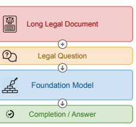
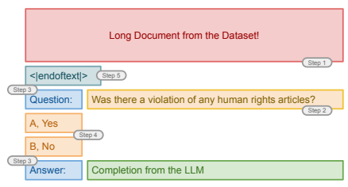
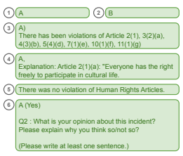

# Legal Prompt Engineering For Multilingual Legal Judgement Prediction

Dietrich Trautmannαand **Alina Petrova**βand **Frank Schilder**γ α Thomson Reuters Labs, Zug, Switzerland β Thomson Reuters Labs, London, United Kingdom γ Thomson Reuters Labs, Eagan, MN, United States of America Dietrich.Trautmann@tr.com

## Abstract

Legal Prompt Engineering (LPE) or Legal Prompting is a process to guide and assist a large language model (LLM) with performing a natural legal language processing (NLLP) skill. Our goal is to use LPE with LLMs over long legal documents for the Legal Judgement Prediction (LJP) task. We investigate the performance of zero-shot LPE for given facts in case-texts from the European Court of Human Rights (in English) and the Federal Supreme Court of Switzerland (in German, French and Italian). Our results show that zero-shot LPE is better compared to the baselines, but it still falls short compared to current state of the art supervised approaches. Nevertheless, the results are important, since there was 1) no explicit domain-specific data used - so we show that the transfer to the legal domain is possible for general-purpose LLMs, and 2) the LLMs where directly applied without any further training or fine-tuning - which in turn saves immensely in terms of additional computational costs.

## 1 Introduction

In supervised classification tasks, a machine learning model is provided with an input, and after the training phase, it outputs one or more labels from a fixed set of classes (Mitchell, 1997). Recent developments of large pre-trained language models (LLMs), such as BERT (Devlin et al., 2019), T5 (Raffel et al., 2020) and GPT-3 (Brown et al., 2020), gave rise to a novel approach to such tasks, namely prompting (Liu et al., 2021a). In prompting (see Fig. 1), there is usually no further training required
(although fine-tuning is still an option), and instead, the input to the model is extended with an additional text specific to the task - a prompt. Prompts can contain questions about the current sample, examples of input-output pairs or task descriptions (Fig. 1, the Long Legal Document & Legal Question are the input). Using prompts as clues, a LLM

Figure 1: Our *Legal Prompting* stack.

- a foundation model (Bommasani et al., 2021) —
can infer from its implicit knowledge the intended outputs (Fig. 1, the *Completion*) in a zero-shot fashion (Yin et al., 2019; Sanh et al., 2021). Legal prompt engineering is the process of creating, evaluating, and recommending prompts for legal NLP tasks. It would enable legal professionals to perform NLLP tasks, such as data annotation, search or question-answering, by simply querying LLMs in natural language. In this presentation, we investigate prompting for the task of Legal Judgement Prediction (Strickson and De La Iglesia, 2020; Zhuopeng et al., 2020). We use data from the European Court of Human Rights (ECHR; Chalkidis et al. (2019)) and the Federal Supreme Court of Switzerland (FSCS; Niklaus et al. (2021)), and we compare various prompts for LJP using multilingual LLMs (mGPT from Shliazhko et al. (2022),
GPT-J-6B from Wang and Komatsuzaki (2021) and GPT-NeoX-20B from Black et al. (2022)) in a zeroshot manner - without any examples nor further training and fine-tuning. Our results show that it is possible to apply zero-shot LPE for the LJP task with LLMs. The absolute macro-averaged F1, precision and recall scores are better than our simple baselines, but they are bellow the current supervised state of the art results from the literature.

Figure 2: An example prompt template in English for the *ECHR* task.

## 2 Related Work

This research builds on two main types of established research directions: First, on the legal NLP task creation and benchmarking with (mostly) supervised approaches. Second, on the prompt engineering research for general NLP tasks.

#### 2.1 Legal Nlp

Analog to many established NLP tasks, the legal domain has a diverse set of benchmarks, ranging from binary classification (Alali et al., 2021), multi-class classification (Hendrycks et al., 2021), multi-label classification (Song et al., 2022) and sequence generation, such as legal summarization (Kornilova and Eidelman, 2019) and judgement outcome explanation (Malik et al., 2021). The legal domain poses further challenges for automated solutions due to the specific language used and (often) multistep reasoning (Holzenberger et al., 2020) over long input documents (Dai et al., 2022). Furthermore, to the best of our knowledge, there are no approaches that investigate the recent prompting results on these tasks in the legal domain. Most of the time, the (good) prompting results on general NLP tasks are achieved for rather short, single to a few sentence inputs with small target label sets (Liu et al., 2022a).

#### 2.2 Prompt Engineering

Based on the tasks and the language models, certain types of prompts are possible. This include mostly either a slot filling objective (Devlin et al., 2019), or text completion (Brown et al., 2020) by the model. There exist already efforts to collect, unify and evaluate prompting approaches on a diverse set of tasks and domains in the research literature. The two bigger projects include *OpenPrompt*
(Ding et al., 2022) - an open-source framework for prompt-learning, and *PromptSource* (Bach et al., 2022) - an open toolkit for creating, sharing and using natural language prompts. A prompt is composed of several parts, with different amount of usefulness based on the model, the task and the data. These are often textual descriptions of the tasks, and they can contain a few (few-shot), one
(one-shot) or even no (zero-shot) examples of the input-label pairs of the task at hand (Sanh et al.,
2021). Additionally, the prompts can contain hints of possible labels in form of a multiple-choice answer set, from which the model should select.

## 3 Legal Judgement Prediction

The following section describes our target task and the datasets we evaluated our legal prompts on.

#### 3.1 Task Definition

The Legal Judgement Prediction (LJP) task (Strickson and De La Iglesia, 2020; Zhuopeng et al., 2020)
is formulated as an automatic prediction of a courts outcome for a given (set of) document(s) of a case.

#### 3.2 Datasets

We used the validation and test sets of the following two corpora in our experiments.

#### 3.2.1 European Court Of Human Rights

The *European Court of Human Rights* (ECHR)
corpus by Chalkidis et al. (2019) is an English dataset of factual paragraphs from the case description. Each document is mapped to human rights

|        | Model                        | Precision   | Recall     | macro\-F1   | micro\-F1   | weighted\-F1   | Accuracy   |
|--------|------------------------------|-------------|------------|-------------|-------------|----------------|------------|
| t      | minority class               | .088        | .500       | .149        | .175        | .052           | .175       |
| se     |                              |             |            |             |             |                |            |
| ation  | majority class  random class | .413  .500  | .500  .500 | .452  .441  | .825  .500  | .746  .559     | .825  .500 |
| id     | GPT\-J\-6B (0\-shot)         | .524        | .529       | .523        | .691        | .707           | .691       |
| val    | GPT\-NeoX\-20B (0\-shot)     | .527        | .536       | .526        | .709        | .731           | .709       |
|        | minority class               | .077        | .500       | .133        | .153        | .041           | .153       |
|        | majority class               | .424        | .500       | .459        | .847        | .777           | .847       |
| et   s | random class                 | .500        | .500       | .431        | .500        | .568           | .500       |
| st te  | GPT\-J\-6B (0\-shot)         | .528        | .537       | .528        | .715        | .734           | .715       |
|        | GPT\-NeoX\-20B (0\-shot)     | .522        | .530       | .521        | .707        | .728           | .707       |
|        | supervised (full)†           | .904        | .793       | .820        | \-          | \-             | \-         |

Table 1: The results for the ECHR validation and test sets. Besides the macro-averaged F1-score, precision and recall, we report also the micro-averaged and weighted-F1 and the accuracy scores. The best results are underlined and our **best results are in bold**. † We understand the supervised results reported by Chalkidis et al. (2019) as macro-averaged, but by Valvoda et al. (2022) it is reported as micro-averaged.

article that were violated, if there were any violations. The documents are chronologically split into a training set (9k, 2001–2016), a validation set (1k, 2016–2017), and a test set (1k, 2017–2019). We use the binarized version of the dataset, where there are either no violations or one and more violations (binary true / *false*, or in our case a yes / no). 3.2.2 Federal Supreme Court of Switzerland The *Federal Supreme Court of Switzerland* (FSCS) corpus by Niklaus et al. (2021) is a multi-lingual dataset (85K documents) covering German (50k), French (31k) and Italian (4k) cases in Switzerland. The targets of each case are binarized judgment outcomes which can be either approval or dismissal.

## 4 Prompting

In this work we relied on discrete and *manual* legal prompt engineering. A discrete prompts, in contrast to a continuous prompt (Liu et al., 2021b, 2022b), maps to real (human readable) words. The manual part refers to the iterative process of discrete prompt creation and evaluation. The core task was to convert the LJP task, which is a binarized text classification task for LJP, into a natural language question template. Our iterative process was as follows: **Step 1:** We use just the long legal document (one at a time) as the only input to the model. The results were a continuation of the document with other potential facts, since this are valid completions. However, this was not useful for our task. **Step 2:** We included a question after the document, which is a reformulation of the text classification task. This improved the output of the model, but it was still not working for many cases, where the model continued with a list of other questions. **Step 3:** The inclusion of the "*Question:*"
and "*Answer:*" indicators was again improving the completion by the model. Unfortunately, this was also a "free-form" response and it was difficult to map to one of our two intended classes (yes / no).

Step 4: We included the answer options "*A, Yes*" and "*B, No*" and finally **Step 5:** The special GPT- model indicator "*<|endoftext|>*", to separate the document from the prompt. The Figure 2 shows the final prompt template for the *ECHR* task. We used similar (translated) prompts for the other three languages (German, French, Italian; Appendix A).

The maximum input length was set to 2048 tokens and we truncated case texts that were longer than that. We also optimized the model output sequence length based on the performance on the validation set. Although we actually need only one token as the output (either A or B), we found that this yielded not the best score. We iteratively increased the output sequence length of the greedy decoder in steps, and settled for 50 tokens as the final best hyperparameter value. The details of our compute requirements are in Appendix B.

## 5 Results

Our main results for the two corpora and four languages are displayed in Table 1 and Table 2. We provide the models with one document at a time - due to the length of the documents - and hence choose to report this as our zero-shot results. Another important consideration is that the datasets are highly unbalanced. The majority class accounts

|       |                    | macro\-F1   |          |
|-------|--------------------|-------------|----------|
|       | Model              | val. set    | test set |
| an    | majority           | .443        | .446     |
|       | random             | .452        | .449     |
| rm Ge | mGPTxl (0\-shot)   | .467        | .493     |
|       | supervised (full)† | \-          | .685     |
|       | majority           | .440        | .447     |
| ch    | random             | .455        | .447     |
| en Fr | mGPTxl (0\-shot)   | .503        | .502     |
|       | supervised (full)† | \-          | .702     |
|       | majority           | .458        | .447     |
| an    | random             | .433        | .448  1  |
| Itali | mGPTxl (0\-shot)   | .501        | .484     |
|       | supervised (full)† | \-          | .598     |

Table 2: The macro-F1 results for the FSCS validation and test sets by language. The best results are underlined and our best prompting results are in bold. There are no published supervised results for the validation sets, to the best of our knowledge. † Supervised results from Niklaus et al. (2021).

for about 89% for the *ECHR* corpus and about 75%
for the *FSCS*, so we suggest to report the macroaveraged scores mainly. We also included the micro-averaged, weighted and the accuracy scores for the *ECHR* task. Our prompting approaches always significantly outperformed our simple baselines for the macro-averaged scores. However, compared to the supervised results - which were finetuned for thousand of samples over several epochs
- they are far behind.

Additionally, we included samples of model completions in Figure 3. The examples 1 and 2 are our main sought-after completions, with just one output token. However, as we discovered, restricting the model generation to just one token yielded not the best overall performance. The model somehow needed more tokens to *"express* itself". Example 3 is a completion with the correct output label A and with an additional sentence about which articles were violated. This is actually the original task of the *ECHR* corpus, a multi-label problem. A further investigation of the exact article numbers yielded, that for some of the cases they were indeed those articles. Unfortunately, there was no single case that we found that had an exact match of all articles listed. A similar completion in this regard is example 4 . It contains a potential *explanation* with a cited article. But here again, it was not possible to find a single example with the correct explanation, by sampling for a few

Figure 3: Completion examples from the *GPT-J-6B* model on the test set of the *ECHR* corpus.

such completions. More difficult completions were those like example 5 , since we cannot map them directly to one of our target labels. A further investigation for these generations on the validation set yielded that they appeared for case text were the LJP was that *"there were no violations."* Hence, we assigned them the B labels. And last but not least, we observed answers such as example 6 . This type of generation suggested that the datasets, the LLMs were pre-trained on, contained exam-style question-answering tasks and multiple-choice tests.

Finally, since many sentences start with an A, the model could be right for the wrong reason (McCoy et al., 2019). We also ran a test were we switched the answer options A and B. This however yielded almost identical scores. For instance, for the GPT-
J-6B model with an macro-F1 of 0.530 on the validation set and 0.526 on the test set of the ECHR.

## 6 Conclusion

On one hand we can say that it is possible to solve the LJP task with LPE. On the other hand, there is still room for improvements, especially since it is not straight forward to find the ideal prompt for each task, corpus and language (Lu et al., 2022). It is interesting to observe completions that could be more informative about the LJP, especially those that either listed the violated articles, or those that contained some form of explanation for the decision. For future work, we plan to work with subject matter experts (SMEs) from the legal domain and investigate whether they can leverage their knowledge to 1) come-up with better legal prompts and 2) for several different NLLP tasks such as legal summarization (Kornilova and Eidelman, 2019) and legal question-answering (Zhong et al., 2020).

## Ethics Statement

Predicting the legal outcomes of court decisions is a sensitive area of research. The proposed zero-shot legal prompt engineering approach is preliminary and cannot yet be put into a production system and we also do not plan on doing so in this form. One of the main goals was to investigate a legal task with long documents. The other goal of developing and evaluating legal prompts is to examine the performance in comparison to existing supervised state-of-the-art models.

Additionally, legal cases involve information of personal data. Therefore, we only use public and academic datasets and general models from public repositories.

Finally, we would argue that it is environmentally beneficial to investigate how already pretrained models on general textual data, can be translate to this specific legal domain. As we showed, this is to some degree possible and we would like to investigate other larger models in future, without additional fine-tuning steps.

## References

Mohammad Alali, Shaayan Syed, Mohammed Alsayed, Smit Patel, and Hemanth Bodala. 2021. Justice: A benchmark dataset for supreme court's judgment prediction. *arXiv preprint arXiv:2112.03414*.

Stephen Bach, Victor Sanh, Zheng Xin Yong, Albert Webson, Colin Raffel, Nihal V Nayak, Abheesht Sharma, Taewoon Kim, M Saiful Bari, Thibault Févry, et al. 2022. Promptsource: An integrated development environment and repository for natural language prompts. In Proceedings of the 60th Annual Meeting of the Association for Computational Linguistics: System Demonstrations, pages 93–104.

Sidney Black, Stella Biderman, Eric Hallahan, Quentin Anthony, Leo Gao, Laurence Golding, Horace He, Connor Leahy, Kyle McDonell, Jason Phang, et al.

2022. Gpt-neox-20b: An open-source autoregressive language model. In Proceedings of BigScience Episode\\# 5–Workshop on Challenges & Perspectives in Creating Large Language Models, pages 95–
136.

Rishi Bommasani, Drew A. Hudson, Ehsan Adeli, Russ Altman, Simran Arora, Sydney von Arx, Michael S. Bernstein, Jeannette Bohg, Antoine Bosselut, Emma Brunskill, Erik Brynjolfsson, S. Buch, Dallas Card, Rodrigo Castellon, Niladri S. Chatterji, Annie S. Chen, Kathleen A. Creel, Jared Davis, Dora Demszky, Chris Donahue, Moussa Doumbouya, Esin Durmus, Stefano Ermon, John Etchemendy, Kawin Ethayarajh, Li Fei-Fei, Chelsea Finn, Trevor Gale, Lauren E. Gillespie, Karan Goel, Noah D. Goodman, Shelby Grossman, Neel Guha, Tatsunori Hashimoto, Peter Henderson, John Hewitt, Daniel E. Ho, Jenny Hong, Kyle Hsu, Jing Huang, Thomas F. Icard, Saahil Jain, Dan Jurafsky, Pratyusha Kalluri, Siddharth Karamcheti, Geoff Keeling, Fereshte Khani, O. Khattab, Pang Wei Koh, Mark S. Krass, Ranjay Krishna, Rohith Kuditipudi, Ananya Kumar, Faisal Ladhak, Mina Lee, Tony Lee, Jure Leskovec, Isabelle Levent, Xiang Lisa Li, Xuechen Li, Tengyu Ma, Ali Malik, Christopher D. Manning, Suvir P. Mirchandani, Eric Mitchell, Zanele Munyikwa, Suraj Nair, Avanika Narayan, Deepak Narayanan, Benjamin Newman, Allen Nie, Juan Carlos Niebles, Hamed Nilforoshan, J. F. Nyarko, Giray Ogut, Laurel Orr, Isabel Papadimitriou, Joon Sung Park, Chris Piech, Eva Portelance, Christopher Potts, Aditi Raghunathan, Robert Reich, Hongyu Ren, Frieda Rong, Yusuf H. Roohani, Camilo Ruiz, Jack Ryan, Christopher R'e, Dorsa Sadigh, Shiori Sagawa, Keshav Santhanam, Andy Shih, Krishna Parasuram Srinivasan, Alex Tamkin, Rohan Taori, Armin W. Thomas, Florian Tramèr, Rose E. Wang, William Wang, Bohan Wu, Jiajun Wu, Yuhuai Wu, Sang Michael Xie, Michihiro Yasunaga, Jiaxuan You, Matei A. Zaharia, Michael Zhang, Tianyi Zhang, Xikun Zhang, Yuhui Zhang, Lucia Zheng, Kaitlyn Zhou, and Percy Liang. 2021. On the opportunities and risks of foundation models. *ArXiv*.

Tom Brown, Benjamin Mann, Nick Ryder, Melanie Subbiah, Jared D Kaplan, Prafulla Dhariwal, Arvind Neelakantan, Pranav Shyam, Girish Sastry, Amanda Askell, et al. 2020. Language models are few-shot learners. Advances in neural information processing systems, 33:1877–1901.

Ilias Chalkidis, Ion Androutsopoulos, and Nikolaos Aletras. 2019. Neural legal judgment prediction in english. In Proceedings of the 57th Annual Meeting of the Association for Computational Linguistics, pages 4317–4323.

Xiang Dai, Ilias Chalkidis, Sune Darkner, and Desmond Elliott. 2022. Revisiting transformerbased models for long document classification. arXiv preprint arXiv:2204.06683.

Jacob Devlin, Ming-Wei Chang, Kenton Lee, and Kristina Toutanova. 2019. Bert: Pre-training of deep bidirectional transformers for language understanding. In Proceedings of the 2019 Conference of the North American Chapter of the Association for Computational Linguistics: Human Language Technologies, Volume 1 (Long and Short Papers), pages 4171–4186.

Ning Ding, Shengding Hu, Weilin Zhao, Yulin Chen, Zhiyuan Liu, Haitao Zheng, and Maosong Sun. 2022. Openprompt: An open-source framework for prompt-learning. In *Proceedings of the 60th Annual* Meeting of the Association for Computational Linguistics: System Demonstrations, pages 105–113.

Dan Hendrycks, Collin Burns, Anya Chen, and Spencer Ball. 2021. Cuad: An expert-annotated nlp dataset for legal contract review. *arXiv preprint* arXiv:2103.06268.

Nils Holzenberger, Andrew Blair-Stanek, and Benjamin Van Durme. 2020. A dataset for statutory reasoning in tax law entailment and question answering. arXiv preprint arXiv:2005.05257.

Anastassia Kornilova and Vladimir Eidelman. 2019.

Billsum: A corpus for automatic summarization of us legislation. In Proceedings of the 2nd Workshop on New Frontiers in Summarization, pages 48–56.

Haokun Liu, Derek Tam, Mohammed Muqeeth, Jay Mohta, Tenghao Huang, Mohit Bansal, and Colin Raffel. 2022a. Few-shot parameter-efficient finetuning is better and cheaper than in-context learning. arXiv preprint arXiv:2205.05638.

Pengfei Liu, Weizhe Yuan, Jinlan Fu, Zhengbao Jiang, Hiroaki Hayashi, and Graham Neubig. 2021a. Pretrain, prompt, and predict: A systematic survey of prompting methods in natural language processing. arXiv preprint arXiv:2107.13586.

Xiao Liu, Kaixuan Ji, Yicheng Fu, Weng Tam, Zhengxiao Du, Zhilin Yang, and Jie Tang. 2022b. P- tuning: Prompt tuning can be comparable to finetuning across scales and tasks. In Proceedings of the 60th Annual Meeting of the Association for Computational Linguistics (Volume 2: Short Papers), pages 61–68, Dublin, Ireland. Association for Computational Linguistics.

Xiao Liu, Yanan Zheng, Zhengxiao Du, Ming Ding, Yujie Qian, Zhilin Yang, and Jie Tang. 2021b. Gpt understands, too. *arXiv preprint arXiv:2103.10385*.

Yao Lu, Max Bartolo, Alastair Moore, Sebastian Riedel, and Pontus Stenetorp. 2022. Fantastically ordered prompts and where to find them: Overcoming few-shot prompt order sensitivity. In Proceedings of the 60th Annual Meeting of the Association for Computational Linguistics (Volume 1: Long Papers), pages 8086–8098.

Vijit Malik, Rishabh Sanjay, Shubham Kumar Nigam, Kripabandhu Ghosh, Shouvik Kumar Guha, Arnab Bhattacharya, and Ashutosh Modi. 2021. Ildc for cjpe: Indian legal documents corpus for court judgment prediction and explanation. In Proceedings of the 59th Annual Meeting of the Association for Computational Linguistics and the 11th International Joint Conference on Natural Language Processing (Volume 1: Long Papers), pages 4046–4062.

Tom McCoy, Ellie Pavlick, and Tal Linzen. 2019.

Right for the wrong reasons: Diagnosing syntactic heuristics in natural language inference. In Proceedings of the 57th Annual Meeting of the Association for Computational Linguistics, pages 3428–3448.

Tom Mitchell. 1997. *Machine learning*, volume 1.

McGraw-hill New York.

Joel Niklaus, Ilias Chalkidis, and Matthias Stürmer.

2021. Swiss-judgment-prediction: A multilingual legal judgment prediction benchmark. In Proceedings of the Natural Legal Language Processing Workshop 2021, pages 19–35.

Colin Raffel, Noam Shazeer, Adam Roberts, Katherine Lee, Sharan Narang, Michael Matena, Yanqi Zhou, Wei Li, Peter J Liu, et al. 2020. Exploring the limits of transfer learning with a unified text-to-text transformer. *J. Mach. Learn. Res.*, 21(140):1–67.

Victor Sanh, Albert Webson, Colin Raffel, Stephen Bach, Lintang Sutawika, Zaid Alyafeai, Antoine Chaffin, Arnaud Stiegler, Arun Raja, Manan Dey, et al. 2021. Multitask prompted training enables zero-shot task generalization. In International Conference on Learning Representations.

Oleh Shliazhko, Alena Fenogenova, Maria Tikhonova, Vladislav Mikhailov, Anastasia Kozlova, and Tatiana Shavrina. 2022. mgpt: Few-shot learners go multilingual.

Dezhao Song, Andrew Vold, Kanika Madan, and Frank Schilder. 2022. Multi-label legal document classification: A deep learning-based approach with labelattention and domain-specific pre-training. Information Systems, 106:101718.

Benjamin Strickson and Beatriz De La Iglesia. 2020.

Legal judgement prediction for uk courts. In Proceedings of the 2020 the 3rd international conference on information science and system, pages 204– 209.

Josef Valvoda, Ryan Cotterell, and Simone Teufel.

2022. On the role of negative precedent in legal outcome prediction. *arXiv preprint arXiv:2208.08225*.

Ben Wang and Aran Komatsuzaki. 2021. GPT-
J-6B: A 6 Billion Parameter Autoregressive Language Model. https://github.com/ kingoflolz/mesh-transformer-jax.

Wenpeng Yin, Jamaal Hay, and Dan Roth. 2019.

Benchmarking zero-shot text classification: Datasets, evaluation and entailment approach. In Proceedings of the 2019 Conference on Empirical Methods in Natural Language Processing and the 9th International Joint Conference on Natural Language Processing (EMNLP-IJCNLP), pages 3914–3923.

Haoxi Zhong, Yuzhong Wang, Cunchao Tu, Tianyang Zhang, Zhiyuan Liu, and Maosong Sun. 2020. Iteratively questioning and answering for interpretable legal judgment prediction. In Proceedings of the AAAI Conference on Artificial Intelligence, volume 34, pages 1250–1257.

Xu Zhuopeng, Li Xia, Li Yinlin, Wang Zihan, Fanxu Yujie, and Lai Xiaoyan. 2020. Multi-task legal judgement prediction combining a subtask of seriousness of charge. In Proceedings of the 19th Chinese National Conference on Computational Linguistics, pages 1132–1142.

## A Prompt Templates

These are our final prompt templates: English {{ document }}
<|endoftext|>
Question: Was there a violation of any human rights articles? A, {{ option_positive }}
B, {{ option_negative}}
Answer:

#### German

{{ document }}
<|endoftext|>
Frage: Wie lautete das Gerichtsurteil? A, {{ option_positive }} B, {{ option_negative}} Antwort:

#### French

{{ document }}
<|endoftext|>
Question: Quel était le jugement légal? A, {{ option_positive }} B, {{ option_negative}}
Réponse:

#### Italian

{{ document }}
<|endoftext|>
Domanda: Qual è stata la sentenza legale? A, {{ option_positive }} B, {{ option_negative}} Risposta:

## B Compute Requirements

We used the following Amazon EC2 M5 instances in our experiments:

| Standard Instance   | vCPU   | Memory   |
|---------------------|--------|----------|
| ml.m5d.24xlarge     | 96     | 384 GiB  |

We haven't use any GPUs in our experiments.