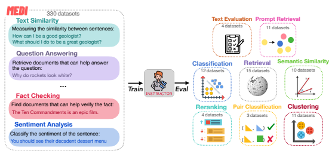
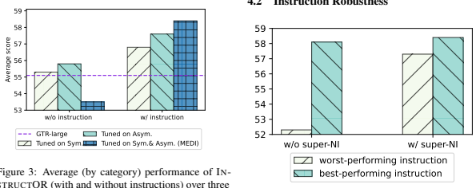
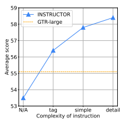
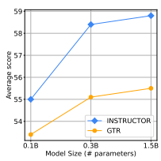
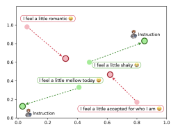

# One Embedder, Any Task: Instruction-Finetuned Text Embeddings

Hongjin Su♠∗ Weijia Shi♣∗ Jungo Kasai♣ Yizhong Wang♣ **Yushi Hu**♣
Mari Ostendorf♣ Wen-tau Yih♢ Noah A. Smith♣♡ Luke Zettlemoyer♣♢ **Tao Yu**♠
♠
The University of Hong Kong ♣University of Washington ♢Meta AI
♡Allen Institute for AI
{hjsu,tyu}@cs.hku.hk, {yushihu,ostendor}@uw.edu scottyih@meta.com
{swj0419,jkasai,yizhongw,nasmith,lsz}@cs.washington.edu

## Abstract

We introduce INSTRUCTOR, a new method for computing text embeddings given task instructions: every text input is embedded together with instructions explaining the use case (e.g., task and domain descriptions). Unlike encoders from prior work that are more specialized, INSTRUCTOR is a single embedder that can generate text embeddings tailored to different downstream tasks and domains, *without* any further training. We first annotate instructions for 330 diverse tasks and train INSTRUCTOR
on this multitask mixture with a contrastive loss. We evaluate INSTRUCTOR on 70 embedding evaluation tasks (66 of which are *unseen* during training), ranging from classification and information retrieval to semantic textual similarity and text generation evaluation. INSTRUCTOR, while having an order of magnitude fewer parameters than the previous best model, achieves state-of-the-art performance, with an average improvement of 3.4% compared to the previous best results on the 70 diverse datasets. Our analysis suggests that INSTRUCTOR is robust to changes in instructions, and that instruction finetuning mitigates the challenge of training a single model on diverse datasets. Our model, code, and data are available at https:
//instructor-embedding.github.io.

## 1 Introduction

Text embeddings represent discrete text inputs (e.g., sentences, documents, and code) as fixed-sized vectors that can be used in many downstream tasks. These tasks include semantic textual similarity (Agirre et al., 2012; Marelli et al., 2014; Cer et al., 2017; Lin et al., 2018), information retrieval (Mitra et al., 2017; Karpukhin et al., 2020; Izacard et al., 2022), automatic text evaluation (Zhang et al., 2020; Sellam et al., 2020; Hessel et al., 2021), prompt retrieval for in-context learning (Liu et al., 2022; Rubin et al., 2022; Su et al., 2022), and beyond. Recently, we have seen dramatic advances

Figure 1: At execution time, INSTRUCTOR generates embeddings based on both the text input and the task instruction. The same input (e.g., Who sings the song
"Love Story"?) will be encoded into different embeddings, depending on the end task (e.g., duplicate question detection, information retrieval, and topic classification).

in learning text embeddings (Kiros et al., 2015; Conneau et al., 2017; Logeswaran and Lee, 2018; Reimers and Gurevych, 2019; Gao et al., 2021; Ni et al., 2021, 2022) that perform well on their intended tasks or datasets.

However, most existing embeddings can have significantly degraded performance when applied to new tasks or domains (Thakur et al., 2021; Muennighoff et al., 2022). For example, DPR (Karpukhin et al., 2020) is stronger for retrieval than text similarity tasks, and vice versa for SimCSE (Gao et al., 2021). Moreover, existing embeddings usually perform poorly when applied to the same type of task but in different domains such as medicine and finance. A common method to address this issue is to further finetune the embeddings on datasets in downstream tasks and domains, which often requires a lot of annotated data (Guru-

∗
Equal contribution.

Figure 2: INSTRUCTOR training and evaluation pipeline. INSTRUCTOR is a single embedding model that takes not only text inputs but also task instructions, thereby creating task- and domain-aware embeddings. It is trained on a multitask mixture of 330 diverse datasets with human-written task instructions (MEDI dataset, §2.3). After training on MEDI (left), INSTRUCTOR is evaluated on a variety of 70 embedding datasets (66 of which are not seen during training), spanning various downstream applications (right). INSTRUCTOR outperforms the prior best model by an average of 3.4% over the 70 diverse datasets.

rangan et al., 2020). In this paper, we hypothesize that text embeddings (even for the *same* text input) can be adjusted to different downstream applications using task and domain descriptions, *without* further task- or domain-specific finetuning.

We introduce INSTRUCTOR (**Instruct**ion-based Omnifarious Representations), a single multitask model that generates task- and domain-aware embeddings given a text input and its task instructions. It achieves state-of-the-art performance on massively many downstream embedding tasks without any training. At the core of our approach is instruction-based finetuning (Zhong et al., 2021; Min et al., 2022; Sanh et al., 2022; Wei et al., 2022): we embed every input together with its end task and domain instruction, departing from prior approaches to embeddings that only take text input.

INSTRUCTOR embeds the same input into different vectors for different end goals (e.g., *Who sings* the song "Love Story"? is embedded into three different vectors for different tasks in Fig. 1). As shown in Fig. 2, INSTRUCTOR is trained on MEDI, our new collection of 330 text embedding datasets newly annotated with human-written task instructions (§2.3). We train INSTRUCTOR with a contrastive loss over all datasets that maximizes the similarity between semantically related text pairs while minimizing unrelated pairs.

We extensively evaluate INSTRUCTOR on diverse domains (e.g., finance, medicine, and news)
and a variety of downstream applications (a total of 70 embedding evaluation datasets, including 66 not seen during training), spanning classification, semantic textual similarity, information retrieval, text generation evaluation, and prompt retrieval for incontext learning. INSTRUCTOR significantly outperforms prior state-of-the-art embedding models by an average of 3.4% over the 70 diverse datasets. INSTRUCTOR also outperforms a variant that is trained *without* task instructions (§4), demonstrating the importance of instructions to create taskaware embeddings. Our analysis shows that instruction finetuning addresses the challenge of training a *single* model on *diverse* datasets (§4.1). Further, we demonstrate that the task diversity of MEDI
makes the performance of INSTRUCTOR particularly robust to paraphrases in instructions (§4.2). Overall, these results strongly suggest that instruction finetuning should be adopted broadly for text embeddings, which we support by sharing all of our models and code.

## 2 I**Nstruct**Or

INSTRUCTOR encodes inputs together with task instructions, thereby providing task-specific representations that can be used for many downstream language tasks, *without* any additional training. Here we introduce the architecture of INSTRUC-
TOR (§2.1), present how we perform multitask instruction-based finetuning (§2.2), and describe how we collect and annotate the MEDI training data (§2.3). By default, we refer "task" to a dataset, and use them interchangeably throughout the paper, while a "task category", such as Retrieval, includes many tasks.

## 2.1 Embedding Architecture

We build INSTRUCTOR, based on the single encoder architecture (Izacard and Grave, 2021; Ni et al., 2021, 2022). Following prior work (Ni et al., 2021, 2022), we use GTR models as the backbone encoder (GTR-Base for INSTRUCTOR-Base, GTR- Large for INSTRUCTOR, GTR-XL for INSTRUC- TOR-XL). The GTR models are initialized from T5 models, pretrained on a web corpus, and finetuned on information search datasets. The availability of different sizes in the GTR model family allows us to explore the scaling behaviors of instructionfinetuned embedding models. Given an input text x and a task instruction Ix, INSTRUCTOR encodes their concatenation Ix ⊕ x. We then generate a fixed-sized, task-specific embedding EI (Ix, x) by applying mean pooling to the last hidden representations over the tokens in x.

## 2.2 Training Objective

INSTRUCTOR is trained by formulating a wide variety of tasks as a text-to-text problem of distinguishing good/bad candidate outputs y ∈ {y
+
, y
−
i }
given an input x, where a training sample corresponds to the tuple (x, Ix*, y, I*y), with Ix and Iy being instructions associated with x and y, respectively. For example, in a retrieval task, x is a query, and good/bad y is a relevant/irrelevant document from some document collection. For a textual similarity task, the input and output have a similar form and typically come from the same source collection.

For a classification task, training samples can be formed by choosing y as text sequences associated with the same vs. different classes for good vs. bad examples (Details about pair construction are in §2.3). The input and output instructions depend on the task. For **symmetric** tasks such as textual similarity, where the input and output have the same form and encoding objective, the instructions are the same. For **asymmetric** tasks such as retrieval, where the input is a single sentence query and the output is a document, the instructions reflect that difference.

The goodness of candidate y for input x is given by similarity s(x, y) that is the cosine between their INSTRUCTOR embeddings:
s(x, y) = cos(EI (Ix ⊕ x), EI (Iy ⊕ y))
Following Ni et al. (2021), we maximize the similarity between positive pairs (*x, y*
+
) and minimize negative pairs {(*x, y*
−
i )}k i=1, where k denotes the number of negative pairs per positive pair. Specifically, our training objective is:

$${\mathcal{L}}={\frac{e^{s(x,y^{+})/\gamma}}{\sum_{y\in{\mathcal{B}}}e^{s(x,y)/\gamma}}},$$

where γ is the softmax temperature and B is a union of (*x, y*
+
) and {(*x, y*
−
i )}k i=1. Further following Ni et al. (2021), we compute the same loss with x and y swapped and add it to the previous loss (i.e., bidirectional in-batch sampled loss).

## 2.3 Medi: Multitask Embedding Data With Instructions

There are no existing datasets that consist of a variety of tasks for embedding training with instructions. We thus construct a collection of 330 datasets with instructions across diverse task categories and domains: Multitask Embeddings Data with Instructions (MEDI).

Data Construction We build MEDI
by combining 300 datasets from Super- NaturalInstructions (super-NI; Wang et al., 2022b) with 30 datasets from existing collections designed for embedding training.

The super-NI datasets come with natural language instructions, but positive and negative pairs are not provided. We construct these pairs by using Sentence-T5 embeddings (Ni et al., 2022),1denoted with E(⋅). For the classification datasets, we calculate the pairwise cosine similarity between examples based on input text embeddings cos(E(xi), E(xj)). An example xi with a high similarity to xjis used to create a positive pair if both examples have the same class label (y
+
j = yi),
and a negative pair if the labels differ (y
−
j ≠ yi).

For the remaining tasks where the output labels are text sequences, the following scores are first computed:
spos = cos(E(xi), E(xj)) + cos(E(yi), E(yj))

$$s_{n e g}=\cos(\mathbf{E}(x_{i}),\mathbf{E}(x_{j}))-\cos(\mathbf{E}(y_{i}),\mathbf{E}(y_{j}))$$
$$\mathbb{B}\;x),\mathbf{E}_{I}(I_{y}\oplus y))$$

1We do not include instruction for Sentence-T5 as it is not fine-tuned with instructions.

| Task type      | # of Datasets   | Task                    | Instruction                                                      |
|----------------|-----------------|-------------------------|------------------------------------------------------------------|
|                |                 |                         | Query instruction: Represent the Wikipedia question for re                                                                  |
| Retrieval      | 15              | Natural Question (BEIR) | trieving supporting documents:, Doc instruction: Represent the   |
|                |                 |                         | Wikipedia document for retrieval:                                |
| Reranking      | 4               | MindSmallReranking      | Query instruction: Represent the News query for retrieving arti                                                                  |
|                |                 |                         | cles: Doc instruction: Represent the News article for retrieval: |
| Clustering     | 11              | MedrxivClusteringS2S    | Represent the Medicine statement for retrieval:                  |
| Pair Clas sification                | 3               | TwitterSemEval2015      | Represent the Tweet post for retrieving duplicate comments:      |
| Classification | 12              | ImdbClassification      | Represent the Review sentence for classifying emotion as posi                                                                  |
|                |                 |                         | tive or negative:                                                |
| STS            | 10              | STS12                   | Represent the statement:                                         |
| Summarization  | 1               | SummEval                | Represent the Biomedical summary for retrieving duplicate sum                                                                  |
|                |                 |                         | maries:                                                          |
| Text Eval                | 3               | Mscoco                  | Represent the caption for retrieving duplicate captions:         |
| uation         |                 |                         |                                                                  |
| Prompt         | 11              | GeoQuery                | Represent the Geography example for retrieving duplicate exam                                                                  |
| Retrieval      |                 |                         | ples:                                                            |

Table 1: Instruction examples for evaluation datasets. Our embedding evaluation includes 70 diverse datasets in 9 different downstream applications, ranging from classification and semantic textual similarity to information retrieval and text generation evaluation. The first two tasks are **asymmetric** and require two distinct instructions. Instructions for the MEDI training data can be found in Tables 7 and 8 in the appendix.

We select example pairs with the highest spos as positive pairs and highest sneg as hard negative pairs. We use one hard negative together with inbatch sampled negatives in the training. Our later analysis shows that the training data from super-NI particularly improve the instruction robustness in evaluation due to the diverse task definitions (§4.2).

The other 30 embedding training datasets come from the Sentence Transformers embedding data,2 KILT (Petroni et al., 2021), and MedMCQA (Pal et al., 2022). These 30 datasets already contain positive pairs; a few of them, such as MS- MARCO (Bajaj et al., 2016) and Natural Questions (Kwiatkowski et al., 2019), also contain hard negative pairs. Following Ni et al. (2021), we use four negative pairs (hard or in-batch negatives) during the model finetuning process. Since all of these datasets do not have instructions, we develop a unified instruction template and manually write a specific prompt for each dataset, as described next.3 We release these instructions together with our MEDI data. Instruction Annotation Each training instance from MEDI is a tuple (x, Ix*, y, I*y), where the natural language instructions Ix and Iy describe how the embeddings of x and y are used for the task. For example, in open-domain QA (e.g., Natural Questions in Table 1), Ix is "Represent the Wikipedia question for retrieving supporting documents; Input: ," and Iy is "Represent the Wikipedia document for retrieval; Input: ."
To make instructions consistent across all datasets in MEDI, we design a unified instruction format that consists of the following parts (see Table 4 in the appendix for instances of each part):
- **Text Type** specifies the type of input text that we encode using the embedding model. For example, for an open-domain QA task, the input type of the query is a question, while the input type of the target is a document.

- **Task Objective (Optional)** describes the objective of how the input text is used in a task. For example, for a classification task, the task objective is to classify the sentence into some category, while the task objective of the retrieval is to retrieve a relevant document. Because not all sentences are associated with a specific task (e.g., STS targets general encoding), we make this part optional.

- **Domain (Optional)** describes the task domain. For example, for NewsIR, the domain of the task is news. Because not all tasks spec-

2https://huggingface.co/datasets/
sentence-transformers/embedding-training-data.

3All prompts are reviewed by multiple authors independently to make sure they consistently follow our template.

| Benchmark                          |        |        |         | MTEB   |        |      |      |      | Billboard   | Prompt   | Avg.   |
|------------------------------------|--------|--------|---------|--------|--------|------|------|------|-------------|----------|--------|
| Task category                      | Retri. | Rerank | Cluster | Pair.  | Class. | STS  | Sum. | Avg. | Text Eval.  | Retri.   |        |
| # datasets                         | 15     | 4      | 11      | 3      | 12     | 10   | 1    | 56   | 3           | 11       | 70     |
| Small Models for reference (<500M) |        |        |         |        |        |      |      |      |             |          |        |
| SimCSE (110M)                      | 21.9   | 47.5   | 33.4    | 73.7   | 67.3   | 79.1 | 23.3 | 48.7 | 29.4        | 58.3     | 48.2   |
| coCondenser (110M)                 | 33.0   | 51.8   | 37.6    | 81.7   | 64.7   | 76.5 | 29.5 | 52.4 | 31.5        | 59.6     | 51.8   |
| Contriever (110M)                  | 41.9   | 53.1   | 41.1    | 82.5   | 66.7   | 76.5 | 30.4 | 56.0 | 29.0        | 57.3     | 53.2   |
| GTR\-Large (335M)                  | 47.4   | 55.4   | 41.6    | 85.3   | 67.1   | 78.2 | 29.5 | 58.3 | 31.2        | 59.8     | 55.1   |
| INSTRUCTOR (335M)                  | 47.6   | 57.5   | 45.3    | 85.9   | 73.9   | 83.2 | 31.8 | 61.6 | 36.9        | 63.2     | 58.4   |
| Relative gain (%)                  | +0.4   | +4.5   | +8.9    | +0.7   | +10.1  | +6.4 | +7.8 | +5.7 | +18.3       | +5.7     | +5.9   |
| Large Models for reference(≥500M)  |        |        |         |        |        |      |      |      |             |          |        |
| Sent\-T5\-XXL (4.8B)               | 42.2   | 56.4   | 43.7    | 85.1   | 73.4   | 82.6 | 30.1 | 59.5 | 33.9        | 61.5     | 56.5   |
| GTR\-XXL (4.8B)                    | 48.1   | 56.7   | 42.4    | 86.1   | 67.4   | 78.4 | 30.6 | 58.9 | 32.0        | 60.8     | 55.8   |
| SGPT\-NLI (5.8B)                   | 32.3   | 52.3   | 37.0    | 77.0   | 70.1   | 80.5 | 30.4 | 53.7 | 29.6        | 57.9     | 51.9   |
| GTR\-XL (1.5B)                     | 48.0   | 56.0   | 41.5    | 86.1   | 67.1   | 77.8 | 30.2 | 58.4 | 32.0        | 60.4     | 55.5   |
| INSTRUCTOR\-XL (1.5B)              | 49.3   | 57.3   | 44.7    | 86.6   | 73.2   | 83.1 | 32.0 | 61.8 | 34.1        | 68.6     | 58.8   |
| Relative gain (%)                  | +2.7   | +2.3   | +7.7    | +0.6   | +9.1   | +6.9 | +6.0 | +5.8 | +6.6        | +13.6    | +5.9   |

Table 2: Results on the massive text embedding benchmark (MTEB; Muennighoff et al., 2022), Billboard (Kasai et al., 2022a), and prompt retrieval (Su et al., 2022). The last column averages performance scores over 9 categories (7 from MTEB, 1 from Billboard, and 1 from prompt retrieval). Out of the 70 evaluation datasets, 66 (50 from MTEB, 3 from BillBoard, and 11 from prompt retrieval) are unseen tasks during finetuning. Retri., Pair., Class., Sum., Text Eval. refer to retrieval, pair classification, classification, summarization, and text evaluation, respectively. Instruction finetuning improves performance by 5.9% compared to GTR(335M/1.5B) and achieves 3.4% and 4.1% performance gains over the state-of-the-art model Sent-T5-XXL for INSTRUCTOR (335M/1.5B). The relative gain (%) indicates INSTRUCTOR's improvement relative to the original GTR model of the same size.

ify a domain (e.g., STS deals with general statements),this part is also optional.

The final instruction takes the following format:
"REPRESENT THE (DOMAIN) TEXT TYPE FOR
TASK O**BJECTIVE**:." Appendix 8 shows instructions for each dataset in MEDI.

## 3 Experiments

We train INSTRUCTOR on the MEDI data and evaluate it on a wide range of 70 downstream tasks. Specifically, we use the MTEB benchmark from recent work (Muennighoff et al., 2022), which consists of 56 datasets over 7 diverse task categories, such as classification, reranking, and information retrieval. We then further apply INSTRUCTOR to prompt retrieval for in-context learning and text generation evaluation. In all three settings, IN- STRUCTOR achieves the state-of-the-art performance. See Appendix §A and §B for our detailed settings.

## 3.1 Main Results

Table 2 presents the results from INSTRUCTOR and the baselines over the three benchmarks: MTEB, Billboard, and prompt retrieval. We conduct headto-head comparison between INSTRUCTOR and GTR models with the same size. We also include the performance of other representative models for reference, while they are not meant for direct comparison.

INSTRUCTOR achieves the best performance on all three benchmarks on average. Compared to GTR-Large (335M), from which INSTRUC-
TOR is initialized, instruction finetuning enhances the performance by 5.7%, 18.3%, and 5.7% in MTEB, Billboard, and prompt retrieval respectively. Specifically, among all task categories, IN- STRUCTOR (335M) demonstrates large improvements over GTR-Large on the text evaluation
(18.3%), classification (10.1%), and clustering tasks (8.9%). Particularly noteworthy is INSTRUC-
TOR's performance compared to the previous stateof-the-art model, Sent-T5-XXL (58.4 vs. 56.5 on average), despite the fact that INSTRUCTOR has one order of magnitude fewer parameters (335M
vs. 4.8B).

As expected, the retrieval-based models (e.g.,
GTR-XXL) show strong performance on retrieval and reranking but significantly lag behind on STS
and classification. Conversely, similarity-based models (e.g., Sent-T5-XXL) perform well on STS, classification, and text evaluation, but not on retrieval. It suggests that these baselines tend to generate specialized embeddings that only excel at certain tasks, while INSTRUCTOR provides universal embeddings that perform well on diverse task categories.

## 4 Analysis And Ablations

We demonstrate INSTRUCTOR enables universal text embeddings for many diverse tasks. Here we analyze our results from various perspectives: the importance of instructions (§4.1), instruction robustness (§4.2) and complexity (§4.3), model sizes (§4.4), domain shifts (§4.5), and qualitative analysis (§4.6). By default, we report average performance across all categories.

types of data (entire MEDI). In contrast, finetuning with instructions enables the model to benefit from the combination of symmetric and asymmetric data (see that the rightmost bar gets additive performance gains from the asymmetric and symmetric tasks). This result demonstrates the importance of instruction finetuning when diverse data are used for embedding training. Note that training on symmetric tasks only without instructions is similar to Sent-T5. Similarly, training on asymmetric tasks only without instructions is similar to GTR, which is also trained on asymmetric opendomain QA datasets. Departing from these prior methods, instruction-based finetuning enables diverse training on both types.

4.2 Instruction Robustness

types of training data: symmetric data, asymmetric data, or both (entire MEDI). The model finetuned with instructions on both data is the original INSTRUCTOR model. The diverse training data with both types **hurt** the performance when finetuned without instructions but **improve** when instructions are used.

## 4.1 Instructions Enable Diverse Training

Here we analyze the importance of instructions when training data are diverse. We first split MEDI
into symmetric (e.g., text similarity) and asymmetric groups (e.g., open-domain QA), as defined in §2.3 (see Table §5 in the appendix for details about the symmetric and asymmetric groups). We then train INSTRUCTOR with or *without* instructions on each group separately.

As shown in Fig. 3, INSTRUCTOR finetuned without instructions yields performance similar to or better than the original GTR model (dotted line), if the data are symmetric or asymmetric only. However, INSTRUCTOR suffers if finetuned without task instructions on the combination of both

Figure 4: Comparison of the model performance across five paraphrased instructions. W/o super-NI (w/ super-
NI) refers to the inclusion (exclusion) of the 300 datasets from Super-NaturalInstructions in MEDI. These diverse datasets with task instructions improve the robustness of INSTRUCTOR to instruction paraphrases (i.e., smaller performance gaps between best- and worst-performing instructions).

Previous work (Sanh et al., 2022; Zhou et al.,
2022) shows that instruction-finetuned language models are not robust to paraphrased instructions. Here we measure INSTRUCTOR's robustness to variation in human-written instructions.

Specifically, we write five paraphrased instructions for all evaluation datasets (Table 6 in Appendix) and measure INSTRUCTOR's performance gap between the best-performing and the worstperforming instructions. Fig. 4 shows that inclusion of 300 super-NI datasets is critical to the robustness of INSTRUCTOR. Removing these datasets from training (w/o super-NI) substantially increases the performance gap between the best- and worstperforming instructions, suggesting that super-NI's diverse instructions help the model handle different formats and styles.

4.3 Complexity of Instructions

Figure 5: Average performance over varying degrees of instruction details. As the instructions become more detailed, the performance improves. N/A: no instructions are given; tag: dataset names are prepended; simple: one word or two for the task domain are given (e.g.,
Wikipedia); and detailed: our proposed instructions
(§2.3).

Here we further analyze the role of instructions over varying degrees of their complexity. Specifically, we consider four levels of instruction complexity: N/A (no instructions), dataset tags, simple instructions, and detailed instructions (the original instruction format, §2.3). In the dataset tag setup, each example is prepended with its dataset name. For instance, on the Natural Questions dataset, the query is formatted as "Natural Questions; Input: who sings the song Love Story"). In the simple instruction setup, we use one or two words to describe the domain (e.g., for Natural Questions, the input query is Wikipedia Questions; Input: who sings the song Love Story). Fig. 5 shows their average performances across all task categories.

Even with trivial dataset tags, INSTRUCTOR outperforms the original GTR model, illustrating the effectiveness of instructions for diverse training. As more information is provided in the instruction (from tag to simple and from simple to detail), we observe consistent improvements.

## 4.4 Model Sizes And Instruction Finetuning

Fig. 6 studies the influence of model sizes. Specifically, we use GTR-Base (0.1B), GTR-Large (0.3B), and GTR-XL (1.5B). They are pretrained on the same corpus and differ only in the encoder size

Figure 6: Average performance comparisons with varying sizes of models. INSTRUCTOR benefits more from scaling up, perhaps because instructions require additional computations.

(the embedding sizes are the same). We compare models of various sizes and report the average performance across all the categories. As the encoder transformer model scales up, the performance continues to increase for both GTR and INSTRUCTOR.

Nonetheless, the improvement in INSTRUCTOR is more pronounced, perhaps because embeddings with instructions benefit from larger capacities. This implies that large models are more generalizable to compute texts in various domains and task types, providing embeddings for general purposes. Further scale-ups are left to future work.

## 4.5 Instructions Mitigate Domain Shifts

One advantage of instruction-based finetuning is that it improves models' ability to generalize to unseen domains and tasks. To demonstrate this effectiveness, we found three unseen domains that INSTRUCTOR was not trained on: geography, biology, and civil comments. As shown in Table 3, INSTRUCTOR largely improves (above the average improvement) GTR-Large's performance on all three domains, indicating that instructions can help more when applying models to unseen or uncommon domains.

## 4.6 Qualititive Analysis

In this qualitative analysis, we use T-SNE (van der Maaten and Hinton, 2008) to visualize two example of classification with and without instructions. The desired outcome is, for pairs with the same sentiment to be closer together, and pairs with different sentiment to be farther apart. As shown in Fig. 7, without instructions, the green dot pairs (different

| Model             | Geography   | Biology   | Civil   |
|-------------------|-------------|-----------|---------|
| GTR\-Large        | 53.4        | 25.7      | 71.8    |
| INSTRUCTOR        | 64.2        | 31.3      | 77.2    |
| Relative gain (%) | +20.2       | +21.8     | +7.5    |

Table 3: Results of GTR-Large and INSTRUCTOR on

 unseen domains: geography, biology and civil comments. Domain-specific datasets benefit particularly from instruction finetuning. More results can be found in Tables 9 and 10 in the appendix; they also show similar trends.

Figure 7: Visualization of pair classification examples without (dot) and with instruction (dot with a solid border). The red dot pairs that have the same sentiment should be closer together, while the green dot pairs with different sentiment should be farther apart. When embedded with the instruction, the distance between the green dot pair becomes farther.

sentiment) are closer together in the embedding space, while the red dot pairs (same sentiment)
are farther apart. However, with instructions, our method (INSTRUCTOR) successfully encodes the red dot pairs into close embeddings and correctly classifies the pairs. The distance between the green dot pairs with different sentiment is also larger in the embedding space with instructions.

## 5 Related Work

Text Embeddings Text embeddings are useful in many applications such as information retrieval (Thakur et al., 2021), text similarity (Gao et al., 2021), prompt retrieval for in-context learning (Su et al., 2022), classification (Reimers and Gurevych, 2019), and beyond. Much prior work develops different embedding models for different applications. For example, SBERT (Reimers and Gurevych, 2019) and SimCSE (Gao et al., 2021) are applied solely to text similarity and classification tasks, while DPR (Karpukhin et al., 2020) and Contriever (Izacard et al., 2022) focus on information retrieval. Different from Sentence-T5 trained only on symmetric data or GTR trained only on asymmetric data, we combine both groups of datasets and build MEDI, which is then used to train INSTRUCTOR with instructions. Muennighoff et al. (2022) introduced the massive text embedding benchmark (MTEB), which can be used to evaluate embedding models on a variety of embedding tasks, spanning reranking, classification, information retrieval, bitext mining, pair classification, STS, and summarization. Their benchmark shows that models performing well on one task may not perform well on other tasks. The poor zero-shot transfer abilities of existing embedding models make it difficult to use them in applications where only few labeled data are available. This motivates us to develop a single embedding model that is applicable to a variety of tasks and has better generalization to unseen tasks. Wang et al. (2022a) recently proposed E5, weakly-supervised contrastive pre-trained text embeddings, which achieve strong performance across various tasks on the MTEB benchmark, employing a larger embedding dimension compared to INSTRUCTOR. Instruction Finetuning Recent work demonstrated that instruction-finetuned language models could perform new tasks given a natural language instruction (Mishra et al., 2022; Zhong et al., 2021; Min et al., 2022; Sanh et al., 2022; Wei et al., 2022; Wang et al., 2022b; Ouyang et al., 2022). Nonetheless, instruction finetuning has yet to be studied in the context of broadly-applicable embeddings. In this work, we explore finetuning embedding models to follow human instructions where the instruction specifies eventual use cases. Concurrent work demonstrated that instructions could facilitate information retrieval (Asai et al., 2022), which is related to our INSTRUCTOR design. They used instructions to build a task-aware retrieval system and conducted evaluations on the retrieval task; we build a general-purpose embedding model with instructions that can be applied to 8 tasks categories
(Fig. 2), including retrieval, text similarity, clustering, and text evaluation.

## 6 Conclusion

We introduced INSTRUCTOR, a single model that creates broadly-applicable text embeddings using natural language instructions. We constructed MEDI, a collection of diverse datasets, to finetune INSTRUCTOR with instructions. Our extensive experiments showed that INSTRUCTOR achieves state-of-the-art performance on text embedding benchmarks, as well as prompt retrieval for fewshot in-context learning. We hope that researchers and practitioners will benefit from our embeddings or our datasets for tasks of their interest.

## 7 Limitations

Although INSTRUCTOR significantly improves the baseline GTR performance, we were only able to use four negative examples during the model finetuning process due to computation constraints. However, negative examples have been shown to play an important role in contrastive learning (Robinson et al., 2021). We hope that future work will scale up the number of negatives used during finetuning and investigate various methods for mining hard negatives. Additionally, we do not have enough computation resources to apply multitask instruction finetuning to GTR-XXL (4.8B parameters), which is also an area for future exploration.

At the core of INSTRUCTOR is the instruction design. While our current unified instruction format has demonstrated effectiveness, future research can explore other instructional elements to further improve performance. For example, previous work (Wang et al., 2022b) have shown that incorporating demonstration examples and explanations can be beneficial for instruction-finetuned language models.

## Acknowledgements

We thank Akari Asai, Jack Lin, Minghan Li, and the ARK group at UW for their helpful feedback on this work.

## References

Eneko Agirre, Daniel Cer, Mona Diab, and Aitor Gonzalez-Agirre. 2012. SemEval-2012 task 6: A pilot on semantic textual similarity. In Proc. of SemEval.

Akari Asai, Timo Schick, Patrick Lewis, Xilun Chen, Gautier Izacard, Sebastian Riedel, Hannaneh Hajishirzi, and Wen-tau Yih. 2022. Task-aware retrieval with instructions.

Payal Bajaj, Daniel Campos, Nick Craswell, Li Deng, Jianfeng Gao, Xiaodong Liu, Rangan Majumder, Andrew McNamara, Bhaskar Mitra, Tri Nguyen, et al. 2016. MS MARCO: A human generated machine reading comprehension dataset. In *Proc. of CoCo*.

Loïc Barrault, Magdalena Biesialska, Ondˇrej Bojar, Marta R. Costa-jussà, Christian Federmann, Yvette Graham, Roman Grundkiewicz, Barry Haddow, Matthias Huck, Eric Joanis, Tom Kocmi, Philipp Koehn, Chi-kiu Lo, Nikola Ljubešic, Christof ´ Monz, Makoto Morishita, Masaaki Nagata, Toshiaki bnghvtcf Nakazawa, Santanu Pal, Matt Post, and Marcos Zampieri. 2020. Findings of the 2020 conference on machine translation (WMT20). In Proc. of WMT.

Samuel R Bowman, Gabor Angeli, Christopher Potts, and Christopher D Manning. 2015. A large annotated corpus for learning natural language inference. In Proc. of EMNLP.

Daniel Cer, Mona Diab, Eneko Agirre, Inigo Lopez-
Gazpio, and Lucia Specia. 2017. SemEval-2017 task 1: Semantic textual similarity-multilingual and crosslingual focused evaluation. In *Proc. of SemEval*.

Arman Cohan, Sergey Feldman, Iz Beltagy, Doug Downey, and Daniel S. Weld. 2020. SPECTER: Document-level representation learning using citation-informed transformers. In *Proc. of ACL*.

Alexis Conneau and Douwe Kiela. 2018. SentEval: An evaluation toolkit for universal sentence representations. In *Proc. of LREC*.

Alexis Conneau, Douwe Kiela, Holger Schwenk, Loïc Barrault, and Antoine Bordes. 2017. Supervised learning of universal sentence representations from natural language inference data. In *Proc. of EMNLP*.

William Coster and David Kauchak. 2011. Simple english Wikipedia: a new text simplification task. In Proc. of ACL.

Emily Dinan, Stephen Roller, Kurt Shuster, Angela Fan, Michael Auli, and Jason Weston. 2019. Wizard of Wikipedia: Knowledge-powered conversational agents. In *Proc. of ICLR*.

Hady Elsahar, Pavlos Vougiouklis, Arslen Remaci, Christophe Gravier, Jonathon Hare, Frederique Laforest, and Elena Simperl. 2018. T-rex: A large scale alignment of natural language with knowledge base triples. In *Proc. of LREC*.

Alexander R Fabbri, Wojciech Krysci ´ nski, Bryan Mc- ´
Cann, Caiming Xiong, Richard Socher, and Dragomir Radev. 2021. SummEval: Re-evaluating summarization evaluation. TACL.

Anthony Fader, Luke Zettlemoyer, and Oren Etzioni.

2014. Open question answering over curated and extracted knowledge bases. In *Proc. of KDD*.

Angela Fan, Yacine Jernite, Ethan Perez, David Grangier, Jason Weston, and Michael Auli. 2019. ELI5: long form question answering. In *Proc. of ACL*.

Markus Freitag, George Foster, David Grangier, Viresh Ratnakar, Qijun Tan, and Wolfgang Macherey. 2021.

Experts, errors, and context: A large-scale study of human evaluation for machine translation. TACL.

Luyu Gao and Jamie Callan. 2022. Unsupervised corpus aware language model pre-training for dense passage retrieval. In *Proc. of ACL*.

Tianyu Gao, Xingcheng Yao, and Danqi Chen. 2021.

SimCSE: Simple contrastive learning of sentence embeddings. In *Proc. of EMNLP*.

Mansi Gupta, Nitish Kulkarni, Raghuveer Chanda, Anirudha Rayasam, and Zachary C Lipton. 2019. AmazonQA: A review-based question answering task. In *Proc. of IJCAI*.

Suchin Gururangan, Ana Marasovic, Swabha ´
Swayamdipta, Kyle Lo, Iz Beltagy, Doug Downey, and Noah A. Smith. 2020. Don't stop pretraining: Adapt language models to domains and tasks. In Proc. of ACL.

Felix Hamborg, Norman Meuschke, Corinna Breitinger, and Bela Gipp. 2017. news-please: A generic news crawler and extractor. In *Proc. of ISI*.

Ruining He and Julian McAuley. 2016. Ups and downs:
Modeling the visual evolution of fashion trends with one-class collaborative filtering. In *Proc. of WWW*.

Jack Hessel, Ari Holtzman, Maxwell Forbes, Ronan Le Bras, and Yejin Choi. 2021. CLIPScore: A referencefree evaluation metric for image captioning. In Proc. of EMNLP.

Doris Hoogeveen, Karin M Verspoor, and Timothy Baldwin. 2015. CQADupStack: A benchmark data set for community question-answering research. In *Proc. of* ADCS.

Hamel Husain, Ho-Hsiang Wu, Tiferet Gazit, Miltiadis Allamanis, and Marc Brockschmidt. 2019. Code-
SearchNet challenge: Evaluating the state of semantic code search.

Gautier Izacard, Mathilde Caron, Lucas Hosseini, Sebastian Riedel, Piotr Bojanowski, Armand Joulin, and Edouard Grave. 2022. Unsupervised dense information retrieval with contrastive learning. *TMLR*.

Gautier Izacard and Edouard Grave. 2021. Leveraging passage retrieval with generative models for open domain question answering. In *Proc. of EACL*.

Mandar Joshi, Eunsol Choi, Daniel Weld, and Luke Zettlemoyer. 2017. TriviaQA: A Large Scale Distantly Supervised Challenge Dataset for Reading Comprehension. In *Proc. of ACL*.

Vladimir Karpukhin, Barlas Oguz, Sewon Min, Patrick Lewis, Ledell Wu, Sergey Edunov, Danqi Chen, and Wen-tau Yih. 2020. Dense passage retrieval for opendomain question answering. In *Proc. of EMNLP*.

Jungo Kasai, Keisuke Sakaguchi, Ronan Le Bras, Lavinia Dunagan, Jacob Morrison, Alexander R. Fabbri, Yejin Choi, and Noah A. Smith. 2022a. Bidimensional leaderboards: Generate and evaluate language hand in hand. In *Proc. of NAACL*.

Jungo Kasai, Keisuke Sakaguchi, Lavinia Dunagan, Jacob Morrison, Ronan Le Bras, Yejin Choi, and Noah A. Smith. 2022b. Transparent human evaluation for image captioning. In *Proc. of NAACL*.

Daniel Khashabi, Amos Ng, Tushar Khot, Ashish Sabharwal, Hannaneh Hajishirzi, and Chris Callison- Burch. 2021. GooAQ: Open question answering with diverse answer types. In Findings of the ACL: EMNLP 2021.

Daniel Khashabi, Gabriel Stanovsky, Jonathan Bragg, Nicholas Lourie, Jungo Kasai, Yejin Choi, Noah A. Smith, and Daniel S. Weld. 2022. GENIE: Toward reproducible and standardized human evaluation for text generation. In *Proc. of EMNLP*.

Ryan Kiros, Yukun Zhu, Russ R Salakhutdinov, Richard Zemel, Raquel Urtasun, Antonio Torralba, and Sanja Fidler. 2015. Skip-thought vectors. In Proc. of NeurIPS.

Mahnaz Koupaee and William Yang Wang. 2018. Wiki-
How: A large scale text summarization dataset.

Tom Kwiatkowski, Jennimaria Palomaki, Olivia Redfield, Michael Collins, Ankur Parikh, Chris Alberti, Danielle Epstein, Illia Polosukhin, Jacob Devlin, Kenton Lee, et al. 2019. Natural questions: a benchmark for question answering research. *TACL*.

Omer Levy, Minjoon Seo, Eunsol Choi, and Luke Zettlemoyer. 2017. Zero-shot relation extraction via reading comprehension. In *Proc. of CoNLL*.

Patrick Lewis, Yuxiang Wu, Linqing Liu, Pasquale Minervini, Heinrich Küttler, Aleksandra Piktus, Pontus Stenetorp, and Sebastian Riedel. 2021. PAQ: 65 million probably-asked questions and what you can do with them. *TACL*.

Shuyang Li. 2020. INTERVIEW: NPR media dialog transcripts.

Lucy H. Lin, Scott B. Miles, and Noah A. Smith. 2018.

Semantic matching against a corpus: New methods and applications.

Tsung-Yi Lin, Michael Maire, Serge J. Belongie, Lubomir D. Bourdev, Ross B. Girshick, James Hays, Pietro Perona, Deva Ramanan, Piotr Dollár, and C. Lawrence Zitnick. 2014. Microsoft COCO: common objects in context. In *Proc. of ECCV*.

Jiachang Liu, Dinghan Shen, Yizhe Zhang, Bill Dolan, Lawrence Carin, and Weizhu Chen. 2022. What makes good in-context examples for GPT-3? In Proc. of DeeLIO 2022.

Pengfei Liu, Weizhe Yuan, Jinlan Fu, Zhengbao Jiang, Hiroaki Hayashi, and Graham Neubig. 2021. Pretrain, prompt, and predict: A systematic survey of prompting methods in natural language processing.

Kyle Lo, Lucy Lu Wang, Mark Neumann, Rodney Kinney, and Daniel Weld. 2020. S2ORC: The semantic scholar open research corpus. In Proc. of ACL.

Lajanugen Logeswaran and Honglak Lee. 2018. An efficient framework for learning sentence representations. In *Proc. of ICLR*.

Marco Marelli, Stefano Menini, Marco Baroni, Luisa Bentivogli, Raffaella Bernardi, and Roberto Zamparelli. 2014. A SICK cure for the evaluation of compositional distributional semantic models. In Proc. of LREC.

Sewon Min, Mike Lewis, Luke Zettlemoyer, and Hannaneh Hajishirzi. 2022. MetaICL: Learning to learn in context. In *Proc. of NAACL*.

Swaroop Mishra, Daniel Khashabi, Chitta Baral, and Hannaneh Hajishirzi. 2022. Cross-task generalization via natural language crowdsourcing instructions.

In Proceedings of the 60th Annual Meeting of the Association for Computational Linguistics (Volume 1: Long Papers), pages 3470–3487.

Bhaskar Mitra, Fernando Diaz, and Nick Craswell. 2017.

Learning to match using local and distributed representations of text for web search. In *Proc. of WWW*.

Niklas Muennighoff. 2022. SGPT: GPT sentence embeddings for semantic search.

Niklas Muennighoff, Nouamane Tazi, Loic Magne, and Nils Reimers. 2022. MTEB: Massive text embedding benchmark.

Shashi Narayan, Shay B. Cohen, and Mirella Lapata.

2018. Don't give me the details, just the summary! topic-aware convolutional neural networks for extreme summarization. In *Proc. of EMNLP*.

Jianmo Ni, Gustavo Hernandez Abrego, Noah Constant, Ji Ma, Keith Hall, Daniel Cer, and Yinfei Yang. 2022.

Sentence-T5: Scalable sentence encoders from pretrained text-to-text models. In Findings of the ACL:
ACL 2022.

Jianmo Ni, Chen Qu, Jing Lu, Zhuyun Dai, Gustavo Hernández Ábrego, Ji Ma, Vincent Y. Zhao, Yi Luan, Keith B. Hall, Ming-Wei Chang, and Yinfei Yang. 2021. Large dual encoders are generalizable retrievers. In *Proc. of EMNLP*.

Long Ouyang, Jeff Wu, Xu Jiang, Diogo Almeida, Carroll L Wainwright, Pamela Mishkin, Chong Zhang, Sandhini Agarwal, Katarina Slama, Alex Ray, et al. 2022. Training language models to follow instructions with human feedback. In *Proc. of NeurIPS*.

Ankit Pal, Logesh Kumar Umapathi, and Malaikannan Sankarasubbu. 2022. MedMCQA: A large-scale multi-subject multi-choice dataset for medical domain question answering. In *Proc. of CHIL*.

Fabio Petroni, Aleksandra Piktus, Angela Fan, Patrick Lewis, Majid Yazdani, Nicola De Cao, James Thorne, Yacine Jernite, Vladimir Karpukhin, Jean Maillard, Vassilis Plachouras, Tim Rocktäschel, and Sebastian Riedel. 2021. KILT: a benchmark for knowledge intensive language tasks. In *Proc. of NAACL*.

Pranav Rajpurkar, Jian Zhang, Konstantin Lopyrev, and Percy Liang. 2016. SQuAD: 100,000+ questions for machine comprehension of text. In *Proc. of EMNLP*.

Nils Reimers and Iryna Gurevych. 2019. Sentence-
BERT: Sentence embeddings using Siamese BERT- networks. In *Proc. of EMNLP*.

Joshua David Robinson, Ching-Yao Chuang, Suvrit Sra, and Stefanie Jegelka. 2021. Contrastive learning with hard negative samples. In International Conference on Learning Representations.

Andrew Rosenberg and Julia Hirschberg. 2007. V-
measure: A conditional entropy-based external cluster evaluation measure. In *Proc. of EMNLP*.

Ohad Rubin, Jonathan Herzig, and Jonathan Berant.

2022. Learning to retrieve prompts for in-context learning. In *Proc. of NAACL*.

Victor Sanh, Albert Webson, Colin Raffel, Stephen H.

Bach, Lintang Sutawika, Zaid Alyafeai, Antoine Chaffin, Arnaud Stiegler, Teven Le Scao, Arun Raja, Manan Dey, M Saiful Bari, Canwen Xu, Urmish Thakker, Shanya Sharma, Eliza Szczechla, Taewoon Kim, Gunjan Chhablani, Nihal V. Nayak, Debajyoti Datta, Jonathan Chang, Mike Tian-Jian Jiang, Han Wang, Matteo Manica, Sheng Shen, Zheng Xin Yong, Harshit Pandey, Rachel Bawden, Thomas Wang, Trishala Neeraj, Jos Rozen, Abheesht Sharma, Andrea Santilli, Thibault Févry, Jason Alan Fries, Ryan Teehan, Stella Rose Biderman, Leo Gao, Tali Bers, Thomas Wolf, and Alexander M. Rush. 2022. Multitask prompted training enables zero-shot task generalization. In *Proc. of ICLR*.

Thibault Sellam, Dipanjan Das, and Ankur P Parikh.

2020. BLEURT: Learning robust metrics for text generation. In *Proc. of ACL*.

Prithviraj Sen, Galileo Namata, Mustafa Bilgic, Lise Getoor, Brian Galligher, and Tina Eliassi-Rad. 2008. Collective classification in network data. AI magazine.

Rodrigo FG Silva, Klérisson Paixão, and Marcelo de Almeida Maia. 2018. Duplicate question detection in stack overflow: A reproducibility study. In Proc. of SANER.

Hongjin Su, Jungo Kasai, Chen Henry Wu, Weijia Shi, Tianlu Wang, Jiayi Xin, Rui Zhang, Mari Ostendorf, Luke Zettlemoyer, Noah A. Smith, and Tao Yu. 2022. Selective annotation makes language models better few-shot learners.

Nandan Thakur, Nils Reimers, Andreas Rücklé, Abhishek Srivastava, and Iryna Gurevych. 2021. BEIR: A heterogeneous benchmark for zero-shot evaluation of information retrieval models. In *Proc. of NeurIPS*.

James Thorne, Andreas Vlachos, Christos Christodoulopoulos, and Arpit Mittal. 2018. Fever: a large-scale dataset for fact extraction and verification. In *Proc. of NAACL*.

Laurens van der Maaten and Geoffrey Hinton. 2008.

Visualizing data using t-SNE. *JMLR*.

Ben Wang and Aran Komatsuzaki. 2021. GPT-J-
6B: A 6 Billion Parameter Autoregressive Language Model. https://github.com/kingoflolz/ mesh-transformer-jax.

Liang Wang, Nan Yang, Xiaolong Huang, Binxing Jiao, Linjun Yang, Daxin Jiang, Rangan Majumder, and Furu Wei. 2022a. Text embeddings by weaklysupervised contrastive pre-training.

Yizhong Wang, Swaroop Mishra, Pegah Alipoormolabashi, Yeganeh Kordi, Amirreza Mirzaei, Anjana Arunkumar, Arjun Ashok, Arut Selvan Dhanasekaran, Atharva Naik, David Stap, Eshaan Pathak, Giannis Karamanolakis, Haizhi Gary Lai, Ishan Purohit, Ishani Mondal, Jacob Anderson, Kirby Kuznia, Krima Doshi, Maitreya Patel, Kuntal Kumar Pal, Mehrad Moradshahi, Mihir Parmar, Mirali Purohit, Neeraj Varshney, Phani Rohitha Kaza, Pulkit Verma, Ravsehaj Singh Puri, Rushang Karia, Shailaja Keyur Sampat, Savan Doshi, Siddhartha Mishra, Sujan Reddy, Sumanta Patro, Tanay Dixit, Xudong Shen, Chitta Baral, Yejin Choi, Hannaneh Hajishirzi, Noah A. Smith, and Daniel Khashabi. 2022b. Super-NaturalInstructions: Generalization via declarative instructions on 1600+ NLP tasks. In Proc. of EMNLP.

Jason Wei, Maarten Bosma, Vincent Zhao, Kelvin Guu, Adams Wei Yu, Brian Lester, Nan Du, Andrew M. Dai, and Quoc V. Le. 2022. Finetuned language models are zero-shot learners. In *Proc. of ICLR*.

Adina Williams, Nikita Nangia, and Samuel Bowman.

2018. A broad-coverage challenge corpus for sentence understanding through inference. In *Proc. of* NAACL.

Zhilin Yang, Peng Qi, Saizheng Zhang, Yoshua Bengio, William W. Cohen, Ruslan Salakhutdinov, and Christopher D. Manning. 2018. HotpotQA: A dataset for diverse, explainable multi-hop question answering. In *Proc. of EMNLP*.

Peter Young, Alice Lai, Micah Hodosh, and Julia Hockenmaier. 2014. From image descriptions to visual denotations: New similarity metrics for semantic inference over event descriptions. *TACL*.

Tianyi Zhang, Varsha Kishore, Felix Wu, Kilian Q.

Weinberger, and Yoav Artzi. 2020. BERTScore:
Evaluating text generation with BERT. In Proc. of ICLR.

Xiang Zhang, Junbo Zhao, and Yann LeCun. 2015.

Character-level convolutional networks for text classification. In *Proc. of NeurIPS*.

Chunting Zhou, Junxian He, Xuezhe Ma, Taylor Berg-
Kirkpatrick, and Graham Neubig. 2022. Prompt consistency for zero-shot task generalization.

# Appendices

## A Training Setups

Minibatch Sampling Training is performed on a combination of all training datasets in MEDI. Since the number of examples in each dataset is different in orders of magnitude, we downsample large ones. Details for the downsampled numbers of examples on each dataset are shown in Table 5 in the appendix. At each step, we first randomly select a dataset and then construct a minibatch *only* using the examples from that dataset. In this way, we ensure that in-batch negatives are sampled from the same dataset, thereby preventing the model from using task differences to predict the negative label. We use the maximum batch size that fits the machine memory and run all our experiments on 40GB A100 GPUs.

Training We initialize INSTRUCTOR with the GTR-Large model (Ni et al., 2021, 335M parameters)4and finetune it on MEDI using the AdamW
optimizer with learning rate 2 × 10−5and warmup ratio 0.1. We use a softmax temperature of 0.01 and finetune INSTRUCTOR for 20K steps. Baselines We use the official MTEB benchmark for comparisons, but here we highlight several strong baselines with the following two types.

The first class of baselines is embedding models specializing in information retrieval: Contriever- MS (Izacard et al., 2022), GTR (Ni et al., 2021), and **coCondenser-MS** (Gao and Callan, 2022).

They are all trained on open-domain QA datasets such as MS MARCO (Bajaj et al., 2016). The second class of baselines focuses on semantic textual similarity: **SimCSE** (Gao et al., 2021), Sent-
T5 (Ni et al., 2022), and **SGPT-NLI** (Muennighoff, 2022). They are mainly trained on symmetric paraphrase datasets such as NLI (Williams et al.,
2018) and the Quora question pairs.5 All of these baselines are based on pretrained language models, achieving strong performance on the MTEB leaderboard. In particular, Sent-T5-XXL and GTR-XXL

Ruiqi Zhong, Kristy Lee, Zheng Zhang, and Dan Klein.

2021. Adapting language models for zero-shot learning by meta-tuning on dataset and prompt collections.

In *Findings of the ACL: EMNLP 2021*.

4https://huggingface.co/sentence-transformers/
gtr-t5-large.

5https://www.quora.com/q/quoradata/.
(both with 4.8B parameters) achieve the first and second best average performances.

## B Embedding Evaluations

Here we provide a high-level summary of the evaluation tasks (Table 1). Following MTEB (Muennighoff et al., 2022), Billboard (Kasai et al., 2022a), and prompt retrieval (Su et al., 2022), we split 70 evaluation datasets into 9 categories by task objectives. Out of the 70 evaluation tasks, 66 are unseen during training (See Table 5 for datasets included during training), Table 1 for examples and instructions for the evaluation datasets.

## B.1 Massive Text Embedding Benchmark

MTEB (Muennighoff et al., 2022) is a comprehensive embedding evaluation benchmark that aims to provide a holistic view of current embedding models' performance and to discover universal text embeddings applicable to a wide range of tasks. It combines several conventional benchmarks (e.g., BEIR, Thakur et al., 2021, and STS, Cer et al., 2017) and spans a wide range of domain-specific datasets, including science, biology, and medicine.

Following Muennighoff et al. (2022), we also report the average performance over 56 datasets. For each task family, we briefly describe the task objective, evaluation metric, and how embeddings are used.

Retrieval Given a query q and a corpus D =
{p1, p2*...p*n}, retrieval aims to find the most relevant documents piin D for query q. The embedding model is used to embed q and p1*...p*n into fixed-sized vectors, and then the similarity between q and piis measured by their embedding cosine similarity. There are 14 diverse datasets (e.g., Natural Questions, Scifact, and NFCorpus) together with the community question-answering (CQA) benchmark (Hoogeveen et al., 2015). We use NDCG@10 (Normalized Discounted cumulative gain at rank position 10) to measure the performance. Reranking Reranking ranks a list of documents based on their relevance to a query. Given a query q and a list of documents D = {p1, p2*...p*n}, the embedding model computes embeddings of both the query and documents, which are then used to rank the documents based on their cosine similarities.

We use MAP (mean average precision), a standard metric in reranking, to measure performance.

Clustering The goal of clustering is to group similar documents into meaningful clusters. Given a set of documents, the encoder maps each document into an embedding. The k-means clustering algorithm is then used to partition the embedded documents into clusters. The clustering performance is measured by the v-measure that is independent of the permutations of clustering labels (Rosenberg and Hirschberg, 2007).

Pair Classification Pair classification tasks aim to predict a binary label for a pair of texts. An example of this task is paraphrase identification, where the goal is to predict whether two sentences are paraphrases of each other. Given a sentence pair
(t1, t2), the embedding model encodes t1 and t2 separately. The cosine similarity between the two embeddings is then used to predict the label. The average precision score is measured for evaluation.

Classification Classification is a popular way to evaluate the quality of embeddings (Conneau and Kiela, 2018). For each example in the classification dataset, the embedding of the input text is used as features to a classifier. The classifier is trained on the training data while sentence embedings are kept frozen. We report the classification accuracy on the test set as the evaluation metric.

STS Semantic textual similarity (STS) tasks evaluate the similarity between two sentences. Given a sentence pair (t1, t2), the embedding model maps t1 and t2 into embeddings separately, and then the similarity between t1 and t2 is measured by their embedding cosine similarity. The evaluation metric is Spearman's rank correlation, which measures the correlation between the similarity scores and human judgements.

Summarization Automatic summarization evaluation aims to evaluate the quality of a machinegenerated summary given a reference summary.

While human evaluations are considered more accurate, automatic evaluations allow for fast, inexpensive development cycles (Khashabi et al., 2022).

Given a reference summary r and a machinegenerated summary t, the embedding model maps them into embeddings separately, and we compute the cosine similarity between r and t. Spearman's rank correlation is reported between human judgements and automatic scores.

|                | Examples                                 |
|----------------|------------------------------------------|
| Text type      | question, query, answer, summary, sen                                          |
|                | tence, review, post, comment, statement, |
|                | paragraph, passage, document             |
| Text objective | classify the sentence as positive or neg                                          |
|                | ative, retrieve a duplicate sentence, re                                          |
|                | trieve the supporting document           |
| Domain         | wikipedia, news, medicine, biology, red                                          |
|                | dit, stackoverflow, science, quora, coro                                          |
|                | navirus, math, physics                   |

Table 4: Examples of text types, objectives, and domains.

## B.2 Prompt Retrieval

Large language models have demonstrated the ability of in-context learning, where the model can perform downstream tasks by conditioning generation on a few task demonstrations (Liu et al., 2021). Su et al. (2022) introduce the prompt retrieval task, where the goal is to retrieve a few in-context learning (i.e., demonstration) examples from annotated examples given a test instance. The embedding model is used to encode all annotated examples and to find the few most similar examples to the test instance based on the cosine similarity. Following Su et al. (2022), we use the retrieved examples for in-context learning on GPT-J (Wang and Komatsuzaki, 2021) over 11 diverse downstream tasks (e.g., classification, multiple choice, and textto-SQL) that are not included in MEDI (thus zeroshot settings). We compare different embedding methods by measuring the average performance on these downstream tasks.

## B.3 Automatic Evaluation For Generation

Similar to summarization evaluation in MTEB, we use the Billboard benchmark (Kasai et al., 2022a) to apply INSTRUCTOR to automatic evaluations for three additional text generation tasks: MSCOCO image captioning (Lin et al., 2014; Kasai et al., 2022b), CNN/DailyMail news summarization (Fabbri et al., 2021), and WMT21 Chinese-to-English translation (Barrault et al., 2020; Freitag et al., 2021). Following Kasai et al. (2022a), we measure the cosine similarity between the generated text and each reference text and take the maximum similarity score over all references available (Zhang et al., 2020). We evaluate all embedding models by the Pearson correlation with the human judgments, again following Kasai et al. (2022a). We then report the average correlation scores over the three datasets. Note that we do not use the English-to-
German dataset in Billboard because our models are trained only on English data.

## C Full Instructions

We list all instructions for each dataset in MEDI in Table 7 and Table 8

## D Full Results

We provide the detailed evaluation scores in MTEB,
Billboard and prompt retrieval benchmarks in Table 9 & 10.

| Dataset                                         | Symmetric/Asymmetric   | Number   |
|-------------------------------------------------|------------------------|----------|
| gooaq_pairs (Khashabi et al., 2021)             | Asymmetric             | 25,000   |
| yahoo_answers_title_answer (Zhang et al., 2015) | Asymmetric             | 25,000   |
| stackexchange (Silva et al., 2018)              | Symmetric              | 25,000   |
| eli5_question_answer (Fan et al., 2019)         | Asymmetric             | 25,000   |
| squad_pairs (Rajpurkar et al., 2016)            | Asymmetric             | 25,000   |
| NQ∗ (Kwiatkowski et al.,  2019)                 | Asymmetric             | 50,000   |
| amazon\-qa (Gupta et al., 2019)                 | Asymmetric             | 100,000  |
| WikiAnswers (Fader et al., 2014)                | Symmetric              | 25,000   |
| agnews (Zhang et al., 2015)                     | Asymmetric             | 45,000   |
| AllNLI (Bowman et al., 2015)                    | Symmetric              | 50,000   |
| npr (Li, 2020)                                  | Asymmetric             | 25,000   |
| specter_train_triples (Cohan et al., 2020)      | Symmetric              | 50,000   |
| ccnews_title_text (Hamborg et al., 2017)        | Asymmetric             | 25,000   |
| triviaqa (Joshi et al., 2017)                   | Asymmetric             | 50,000   |
| zero_shot_re (Levy et al., 2017)                | Asymmetric             | 15,000   |
| flickr30k_captions (Young et al., 2014)         | Symmetric              | 25,000   |
| xsum (Narayan et al., 2018)                     | Asymmetric             | 10,000   |
| code_search (Husain et al., 2019)               | Asymmetric             | 15,000   |
| ∗ msmarco   (Bajaj et al., 2016)                | Asymmetric             | 175,000  |
| hotpotqa∗ (Yang et al.,  2018)                  | Asymmetric             | 40,000   |
| fever∗ (Thorne et al.,  2018)                   | Asymmetric             | 75,000   |
| amazon_review_2018 (He and McAuley, 2016)       | Asymmetric             | 100,000  |
| S2ORC_title_abstract (Lo et al., 2020)          | Asymmetric             | 100,000  |
| PAQ_pairs (Lewis et al., 2021)                  | Asymmetric             | 25,000   |
| wow (Dinan et al., 2019)                        | Asymmetric             | 30,000   |
| trex (Elsahar et al., 2018)                     | Asymmetric             | 30,000   |
| pubmed (Sen et al., 2008)                       | Asymmetric             | 30,000   |
| medmcqa (Pal et al., 2022)                      | Asymmetric             | 30,000   |
| wikihow (Koupaee and Wang, 2018)                | Asymmetric             | 5,000    |
| simple_wiki (Coster and Kauchak, 2011)          | Asymmetric             | 5,000    |
| Super\-NI (300 datasets) (Wang et al., 2022b)   | Symmetric              | 180,000  |

| Dataset        | Instruction                                                                                                                                             |
|----------------|---------------------------------------------------------------------------------------------------------------------------------------------------------|
|                | Instruction 1: Represent the Amazon comment for classifying the sentence as positive or negative:                                                       |
| Amazon         | Instruction 2: Represent the Amazon review comment for classifying the emotion as positive or negative:                                                 |
| Polarity       | Instruction 3: Represent the Amazon sentence for classifying its sentiment as positive or negative:                                                     |
| Classification | Instruction 4: Represent an Amazon post for classifying its sentiment as positive or negative:                                                          |
|                | Instruction 5: Represent the Amazon review for classifying the review sentiment as negative or positive:                                                |
|                | Query instruction 2: Represent the financial question for retrieving supporting documents:                                                              |
|                | Query instruction 1: Represent the finance query for retrieving supporting documents:  Doc instruction 1: Represent the finance document for retrieval: |
|                | Doc instruction 2: Represent the financial document for retrieval:                                                                                      |
| FIQA2018       | Query instruction 3: Represent the finance query for retrieving related documents:                                                                      |
|                | Doc instruction 3: Represent the finance document for retrieval:                                                                                        |
|                | Query instruction 4: Represent a finance query for retrieving relevant documents:                                                                       |
|                | Doc instruction 4: Represent the financial document for retrieval:                                                                                      |
|                | Query instruction 5: Represent the finance query for retrieving supporting passages:                                                                    |
|                | Doc instruction 5: Represent the finance passage for retrieval:                                                                                         |

Table 5: Number of training instances in each dataset. The dataset with * indicates that its test-split is included in the evaluation.

Table 6: Example paraphrased instructions for AmazonPolarityClassification and FIQA2018. They follow the unified template (§2.3) with the same information and only differ in wording choices.

| Dataset                    | Instruction                                                                                                                                            |
|----------------------------|--------------------------------------------------------------------------------------------------------------------------------------------------------|
| MSMARCO                    | Query instruction: Represent the [domain] question for retrieving evidence documents:  Doc instruction: Represent the domain document for retrieval:   |
| gooaq_pairs                | Query instruction: Represent the Google question for retrieving answers:                                                                               |
|                            | Doc instruction: Represent the Google answer for retrieval:                                                                                            |
| yahoo_answers_title_answer | Query instruction: Represent the Yahoo question for retrieving answers:                                                                                |
|                            | Doc instruction: Represent the Yahoo answer for retrieval:                                                                                             |
| eli5_question_answer       | Query instruction: Represent the ELI5 question for retrieving answers:  Doc instruction: Represent the ELI5 answer for retrieval:                      |
| squad_pairs                | Query instruction: Represent the Squad question for retrieving evidence documents:  Doc instruction: Represent the Squad document for retrieval:       |
|                            | Query instruction: Represent the Wikipedia question for retrieving supporting documents:                                                               |
| Natural Question           | Doc instruction: Represent the Wikipedia document for retrieval:                                                                                       |
| amazon\-qa                 | Query instruction: Represent the Amazon question for retrieving answers:                                                                               |
|                            | Doc instruction: Represent the Amazon answer for retrieval:                                                                                            |
| agnews                     | Query instruction: Represent the news title for retrieving relevant articles:                                                                          |
|                            | Doc instruction: Represent the news article for retrieval:                                                                                             |
| npr                        | Query instruction: Represent the news title for retrieving relevant articles:                                                                          |
|                            | Doc instruction: Represent the news article for retrieval:                                                                                             |
| ccnews_title_text          | Query instruction: Represent the news title for retrieving relevant articles:  Doc instruction: Represent the news article for retrieval:              |
|                            | Query instruction: Represent the question for retrieving evidence documents:                                                                           |
| triviaqa                   | Doc instruction: Represent the evidence document for retrieval:                                                                                        |
| zero_shot_re               | Query instruction: Represent the Wikipedia question for retrieving evidence documents:                                                                 |
|                            | Doc instruction: Represent the Wikipedia document for retrieval:                                                                                       |
| xsum                       | Query instruction: Represent the news title for retrieving relevant articles:                                                                          |
|                            | Doc instruction: Represent the news article for retrieval:                                                                                             |
| code_search                | Query instruction: Represent the comment for retrieving corresponding codes:                                                                           |
|                            | Doc instruction: Represent the code for retrieval:                                                                                                     |
| hotpotqa                   | Query instruction: Represent the Wikipedia question for retrieving supporting documents:                                                               |
|                            | Doc instruction: Represent the Wikipedia document for retrieval:                                                                                       |
| fever                      | Query instruction: Represent the fact for retrieving supporting evidence:                                                                              |
|                            | Doc instruction: Represent the evidence for retrieval:                                                                                                 |
| amazon_review_2018         | Query instruction: Represent the Amazon title for retrieving relevant reviews:                                                                         |
|                            | Doc instruction: Represent the Amazon review for retrieval:                                                                                            |
| S2ORC_title_abstract       | Query instruction: Represent the Scientific title for retrieving relevant abstracts:, Doc                                                              |
|                            | instruction: Represent the Scientific abstract for retrieval:                                                                                          |
| PAQ_pairs                  | Query instruction: Represent the question for retrieving evidence documents:, Doc                                                                      |
|                            | instruction: Represent the evidence document for retrieval:                                                                                            |
| wow                        | Query instruction: Represent the Wikipedia question for retrieving supporting docu ments:, Doc instruction: Represent the Wikipedia document for retrieval:                                                                                                                                                        |
|                            | Query instruction: Represent the Wikipedia question for retrieving supporting docu                                                                                                                                                        |
| trex                       | ments:, Doc instruction: Represent the Wikipedia document for retrieval:                                                                               |
| pubmed                     | Query instruction: Represent the Medicine sentence for retrieving relevant documents:,                                                                 |
|                            | Doc instruction: Represent the Medicine document for retrieval:                                                                                        |
| medmcqa                    | Query instruction: Represent the Medicine question for retrieving supporting answers:,                                                                 |
|                            | Doc instruction: Represent the Medicine answer for retrieval:                                                                                          |
| wikihow                    | Query instruction: Represent the Wikipedia summary for retrieving relevant passages:,  Doc instruction: Represent the Wikipedia passage for retrieval: |
| simple_wiki                | Query instruction: Represent the Wikipedia sentence for retrieving simplified sentences:,                                                              |
|                            | Doc instruction: Represent the Wikipedia sentence for retrieval:                                                                                       |

Table 7: Instructions of asymmetric training dataset. We use Kmeans clustering to put MSMARCO examples into 30 groups, and label the domain for each group.

| Dataset               | Instruction                                                                           |
|-----------------------|---------------------------------------------------------------------------------------|
| stackexchange         | Instruction: Represent the StackExchange question for retrieving duplicate questions: |
| WikiAnswers           | Instruction: Represent the Wikipedia question for retrieving duplicate questions:     |
| AllNLI                | Instruction: Represent the sentence for retrieving duplicate sentences:               |
| specter_train_triples | Instruction: Represent the scientific title for retrieving duplicate titles:          |
| flickr30k_captions    | Instruction: Represent the caption for retrieving duplicate captions:                 |
| super\-NI             | Instruction: Represent the example for the following task: [dataset definition]:      |

| Category   | Dataset                         | GTR   | INSTRUCTOR   | GTR   | INSTRUCTOR   |
|------------|---------------------------------|-------|--------------|-------|--------------|
|            |                                 | 335M  | 335M         | 1.5B  | 1.5B         |
|            | SciFact                         | 63.8  | 64.3         | 64.2  | 64.6         |
|            | NFcorpus                        | 32.4  | 34.1         | 33.3  | 36.0         |
|            | ArguAna                         | 52.1  | 57.1         | 52.8  | 55.7         |
|            | CQADupstackWebmastersRetrieval  | 35.7  | 46.4         | 36.5  | 45.1         |
|            | CQADupstackEnglishRetrieval     | 46.8  | 50.8         | 46.5  | 49.3         |
|            | CQADupstackGamingRetrieval      | 56.3  | 63.1         | 55.8  | 63.3         |
|            | CQADupstackGisRetrieval         | 33.7  | 39.5         | 34.6  | 40.6         |
|            | CQADupstackAndroidRetrieval     | 46.1  | 55.9         | 44.9  | 55.0         |
|            | CQADupstackTexRetrieval         | 25.1  | 30.0         | 26.1  | 29.1         |
|            | CQADupstackUnixRetrieval        | 35.3  | 44.7         | 36.6  | 42.5         |
|            | CQADupstackMathematicaRetrieval | 24.8  | 30.7         | 27.4  | 30.8         |
|            | CQADupstackStatsRetrieval       | 30.4  | 34.6         | 30.1  | 35.7         |
| Retrieval  | CQADupstackPhysicsRetrieval     | 38.5  | 47.8         | 39.7  | 45.3         |
|            | CQADupstackProgrammersRetrieval | 38.5  | 47.5         | 39.6  | 44.9         |
|            | CQADupstackWordpressRetrieval   | 28.2  | 34.9         | 30.4  | 35.5         |
|            | ClimateFEVER                    | 26.9  | 27.8         | 27.0  | 26.5         |
|            | FEVER                           | 72.7  | 72.7         | 72.2  | 70.0         |
|            | FiQA2018                        | 42.8  | 45.5         | 44.2  | 47.0         |
|            | HotpotQA                        | 57.9  | 55.2         | 58.9  | 55.9         |
|            | MSMARCO                         | 42.7  | 39.7         | 43.5  | 41.6         |
|            | NQ                              | 55.1  | 50.1         | 56.2  | 57.3         |
|            | QuoraRetrieval                  | 88.5  | 88.4         | 88.9  | 88.9         |
|            | SCIDOCS                         | 15.5  | 18.6         | 15.7  | 17.4         |
|            | DBPedia                         | 39.6  | 36.7         | 39.7  | 40.2         |
|            | TRECCOVID                       | 56.7  | 58.1         | 60.1  | 71.4         |
|            | Touche2020                      | 28.3  | 21.6         | 25.3  | 23.4         |

Table 8: Instructions of symmetric training dataset. We use the task definitions of Super-NaturalInstructions as the task objective.

Table 9: All Retrieval results in MTEB benchmark.

| Category            | Dataset                                | GTR   | INSTRUCTOR   | GTR   | INSTRUCTOR   |
|---------------------|----------------------------------------|-------|--------------|-------|--------------|
|                     |                                        | 335M  | 335M         | 1.5B  | 1.5B         |
| Summarization       | SummEval                               | 29.5  | 31.8         | 30.2  | 32.0         |
|                     | AskUbuntuDupQuestions                  | 61.6  | 64.3         | 63.1  | 65.4         |
| Reranking           | StackOverflowDupQuestions              | 51.6  | 52.2         | 52.8  | 52.5         |
|                     | SciDocsRR                              | 76.4  | 82.0         | 76.5  | 79.5         |
|                     | MindSmallReranking                     | 31.8  | 31.7         | 31.5  | 31.8         |
|                     | BiorxivClusteringS2S                   | 25.7  | 31.3         | 26.1  | 30.6         |
|                     | MedrxivClusteringS2S                   | 27.4  | 32.0         | 26.7  | 30.8         |
|                     | TwentyNewsgroupsClustering             | 51.6  | 54.1         | 51.2  | 53.3         |
|                     | ArxivClusteringP2P                     | 37.5  | 43.2         | 37.9  | 42.5         |
|                     | ArxivClusteringS2S                     | 30.6  | 32.6         | 30.5  | 32.2         |
| Clustering          | BiorxivClusteringP2P                   | 29.6  | 37.6         | 30.5  | 37.5         |
|                     | MedrxivClusteringP2P                   | 28.7  | 34.2         | 28.7  | 33.2         |
|                     | RedditClustering                       | 61.7  | 63.7         | 61.3  | 63.4         |
|                     | RedditClusteringP2P                    | 61.7  | 64.6         | 61.1  | 65.1         |
|                     | StackExchangeClustering                | 69.9  | 68.8         | 70.0  | 68.4         |
|                     | StackExchangeClusteringP2P             | 33.2  | 36.1         | 32.7  | 35.1         |
|                     | SprintDuplicateQuestions               | 95.1  | 93.1         | 95.5  | 94.9         |
| Pair Classification | TwitterSemEval2015                     | 76.0  | 77.4         | 77.8  | 78.0         |
|                     | TwitterURLCorpus                       | 84.9  | 87.2         | 85.1  | 86.9         |
|                     | STS12                                  | 70.3  | 76.3         | 69.1  | 75.3         |
|                     | STS13                                  | 82.2  | 88.2         | 81.8  | 87.4         |
|                     | STS14                                  | 77.2  | 81.9         | 77.1  | 81.9         |
|                     | STS15                                  | 86.3  | 89.0         | 86.0  | 88.9         |
| STS                 | STS16                                  | 81.9  | 85.5         | 82.2  | 85.4         |
|                     | STS17                                  | 83.9  | 90.3         | 84.9  | 90.5         |
|                     | STS22                                  | 64.3  | 67.4         | 66.6  | 68.6         |
|                     | BIOSSES                                | 84.9  | 84.4         | 78.9  | 84.2         |
|                     | SICK\-R                                | 73.4  | 81.3         | 73.6  | 81.7         |
|                     | STSBenchmark                           | 77.6  | 86.9         | 77.7  | 86.6         |
|                     | Banking77Classification                | 81.2  | 78.5         | 82.2  | 82.7         |
|                     | TweetSentimentExtractionClassification | 54.1  | 64.1         | 54.8  | 61.7         |
|                     | AmazonReviewsClassification            | 37.2  | 47.9         | 38.2  | 43.0         |
|                     | EmotionClassification                  | 46.3  | 52.7         | 45.5  | 53.2         |
|                     | AmazonCounterfactualClassification     | 70.0  | 88.1         | 68.6  | 85.1         |
| Classification      | ImdbClassification                     | 70.9  | 88.3         | 68.2  | 80.1         |
|                     | MassiveIntentClassification            | 70.1  | 68.9         | 70.2  | 71.5         |
|                     | MassiveScenarioClassification          | 75.5  | 73.4         | 75.9  | 76.5         |
|                     | MTOPIntentClassification               | 63.9  | 68.0         | 65.9  | 72.3         |
|                     | MTOPDomainClassification               | 94.0  | 93.9         | 93.6  | 95.1         |
|                     | AmazonPolarityClassification           | 73.9  | 91.5         | 74.6  | 86.5         |
|                     | ToxicConversationsClassification       | 68.7  | 71.1         | 67.6  | 70.3         |
|                     | RTE                                    | 56.1  | 58.8         | 56.8  | 59.3         |
|                     | SST\-5                                 | 52.4  | 53.8         | 53.2  | 60.1         |
|                     | coda19_title_generation                | 21.2  | 23.6         | 21.4  | 27.8         |
|                     | multirc_answerability                  | 62.5  | 63.6         | 63.7  | 72.6         |
|                     | MRPC                                   | 60.3  | 65.4         | 60.8  | 72.9         |
| Prompt Retrieval    | HellaSwag                              | 61.6  | 62.8         | 63.4  | 72.4         |
|                     | Amazon                                 | 36.0  | 38.0         | 36.0  | 48.0         |
|                     | Dbpedia_14                             | 91.7  | 93.0         | 91.7  | 94.0         |
|                     | GeoQuery                               | 53.4  | 64.2         | 53.5  | 63.2         |
|                     | Multi\-Woz                             | 90.8  | 94.4         | 91.0  | 95.2         |
|                     | CivilComments                          | 71.8  | 77.2         | 72.6  | 88.3         |
|                     | mscoco                                 | 32.3  | 41.6         | 33.2  | 39.7         |
| Billboard           | cnn summary                            | 25.8  | 30.3         | 26.1  | 31.9         |
|                     | machine translation                    | 35.4  | 38.9         | 36.6  | 30.6         |

Table 10: All Prompt retrieval, Billboard, and MTEB English results, cont.
