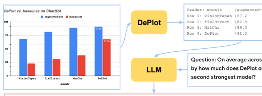
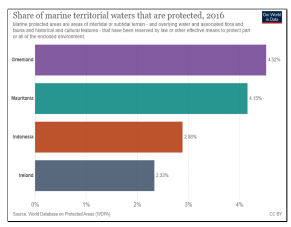
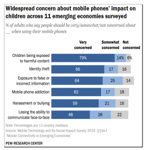
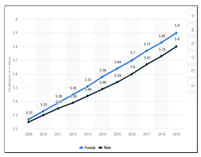
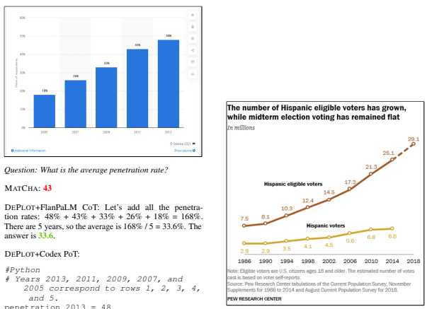
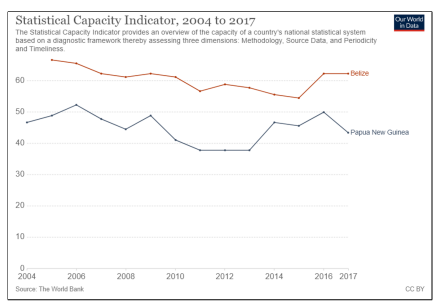

# Deplot**: One-Shot Visual Language Reasoning** By Plot-To-Table Translation

Fangyu Liu♠♣∗ § **Julian Martin Eisenschlos**♣∗
Francesco Piccinno♣ Syrine Krichene♣ Chenxi Pang♣ **Kenton Lee**♣
Mandar Joshi♣ Wenhu Chen♣ Nigel Collier♠ **Yasemin Altun**♣
♣Google DeepMind ♠University of Cambridge

# Abstract

Visual language such as charts and plots is ubiquitous in the human world. Comprehending plots and charts requires strong reasoning skills. Prior state-of-the-art (SOTA) models require at least tens of thousands of training examples and their reasoning capabilities are still much limited, especially on complex humanwritten queries. This paper presents the first few(one)-shot solution to visual language reasoning. We decompose the challenge of visual language reasoning into two steps: (1) plot-to-text translation, and (2) reasoning over the translated text. The key in this method is a modality conversion module, named as DE- PLOT, which translates the image of a plot or chart to a linearized table. The output of DE-
PLOT can then be directly used to prompt a pretrained large language model (LLM), exploiting the few-shot reasoning capabilities of LLMs. To obtain DEPLOT, we standardize the plot-to-table task by establishing unified task formats and metrics, and train DEPLOT endto-end on this task. DEPLOT can then be used off-the-shelf together with LLMs in a plugand-play fashion. Compared with a SOTA model finetuned on thousands of data points, DEPLOT+LLM with just one-shot prompting achieves a 29.4% improvement over finetuned SOTA on human-written queries from the task of chart QA.12

# 1 Introduction

Multimodal reasoning on visual language such as plots and charts is an extremely complex task. For downstream tasks such as question answering (QA) on plots/charts, a model needs to first extract relevant information from the image, organize them in a sensible manner, then perform reasoning over the entries extracted. Previous studies have proposed end-to-end solutions to such methods (Lee et al., 2023; Liu et al., 2023a). Whilst being an effective solution, end-to-end methods need to be finetuned on large amounts of task data and they still lag behind on queries that require complex reasoning even after finetuning. As an example, the current SOTA model MATCHA (Liu et al., 2023a) achieves only 38.2% accuracy on ChartQA (Masry et al.,
2022) (human written queries).

In the meantime, large language models (LLMs)
such as GPT-3 (Brown et al., 2020) and PaLM
(Chowdhery et al., 2022) have demonstrated exceptional few-shot reasoning skills, without requiring expensive human annotations. However, it is an open question how multimodal reasoning tasks could benefit from LLMs. In this work, we propose to decompose the multimodal visual language reasoning problem into: (1) converting the input plot image to a linearized table and (2) passing the linearized table to LLMs for one-shot reasoning.

The key of the method is a modality conversion module called DEPLOT that maps charts and plots to the underlying data table. While there has been prior works in chart information extraction, they are usually hybrid systems combining complex handdesigned rules, OCR, keypoint detection, and object segmentation modules (Siegel et al., 2016; Luo et al., 2021; Masry et al., 2022). For different types of charts, distinct approaches have been used (Rane et al., 2021; Kato et al., 2022). Besides, there does not exist a unified, consistent, and accurate framework for evaluating chart information extraction –
metrics specific to certain types of charts (Siegel et al., 2016) or overly-simplified number matching metrics (Luo et al., 2021) have been used. Our proposed DEPLOT is an end-to-end image-to-text Transformer model trained with the task of plotto-table translation. A combination of synthetic and web-crawled charts and plots and their underlying data table are collected as the training corpus.

∗Work done during Google internship. §Equal contributions.

1Code and models: github.com/google-research/googleresearch/tree/master/deplot 2For questions please contact fl399@cam.ac.uk and eisenjulian@google.com.
Header: models |augmented-set|human-set

Codex: \# DePlot is on row 4, the second strongest is on row 3. deplot_augmented_set = 91.0 deplot_human_set = 67.6 matcha_augmented_set = 89.0 matcha_human_set = 38.0

| Pytho   | 15.8   |
|---------|--------|

Figure 1: An illustration of the DEPLOT+LLM method. This is a real example using FlanPaLM (Chung et al., 2022) with Chain-of-Thoughts prompting (Wei et al., 2022) and Codex (Chen et al., 2021) with Program-of-Thoughts prompting (Chen et al., 2022). The light blue boxes are input (or intermediate forms of the input) to the LLM and the light red box contains the answer generated by the LLMs. Key reasoning steps are highlighted.

We demonstrate that DEPLOT significantly outperforms hybrid systems and can uniformly handle all types of charts. To accurately capture plot-totable systems' effectiveness (and avoid error propagation to downstream tasks), we propose a novel table matching metric that considers both textual and numeric entries with relative error tolerance, and is invariant to transpositions, row and column permutations.

After accurately translating plot images to texts
(as linearized tables), we can pass the output from DEPLOT in conjunction with a query to LLMs to compute the answer. We take advantage of novel prompting techniques such as Chain of Thoughts (CoT) (Wei et al., 2022), Self-Consistency (SC)
(Wang et al., 2023), and Program of Thoughts
(PoT) (Chen et al., 2022) to elicit more accurate answers. An illustration of the whole process can be seen in Figure 1.

To summarize, this work has the following contributions: (1) We standardize the plot-to-table task and propose a unified and informative metric for table comparison. (2) We propose a highly-effective modality conversion model DEPLOT to translate a multimodal task into a language-only task and then leverage LLMs to solve it with just one shot.

(3) DEPLOT+LLM achieves SOTA on ChartQA with just one-shot supervision, outperforming the second best method (which is fully supervised) by 29.4% on human-written queries.

# 2 Background

Plug-and-play of multimodal pretrained models. Numerous large pretrained models, either for cross-modal tasks such as CLIP (Radford et al., 2021), or single-modal tasks, such as GPT-3 and PaLM, have been introduced in the past few years.

These pretrained models' strong zero/few-shot inference capabilities have enabled creative solutions to more complex multimodal tasks. Socratic Models (Zeng et al., 2023) combine multimodal pretrained models using multimodal prompts for tasks such as multimodal assistive dialogue and robot perception & planning. Minds' Eyes (Liu et al., 2023b) converts physical reasoning queries into code that could be executed in physical engines. MAGIC (Su et al., 2022) inserts visual control using CLIP in text generation models for unsupervised image captioning. Similar our work, Yang et al. (2022) also translates natural images into texts and leverage GPT-3 for knowledge-based VQA.

However, all above approaches focus on natural

FlanPaLM: Let's find the average of DePlot across the two sets. We add the two numbers in the DePlot row and divide by 2: 91.0+67.6=158.6/2=79.3. Let's find the second strongest model across the two sets. We find the row with the second highest average: Row 3. We find the average of MatCha across the two sets. We add the two numbers in the MatCha row and divide by 2: 89.0+38.0=127.0/2=63.5. We subtract the second strongest 
average from the strongest average: 79.3-63.5=15.8. The answer is **15.8**.

ans = (deplot_augmented_set - matcha_augmented_set + deplot_human_set - matcha_human_set) / 2__ 
images and the tasks of interest usually only require capturing very basic visual information such as types of objects. Visual language reasoning poses a different set of challenges from natural image reasoning - it requires, first, accurate and detailed information extraction (IE) from complex visual language data (plots and charts in this work); and secondly very strong numerical reasoning skills to answer queries based on information extracted.

While end-to-end fully-supervised models struggle to answer complex human-written queries, DE-
PLOT when combined with LLMs can outperform the supervised SOTA by 29.4%. This is achieved by decomposing the two key challenges in visual language reasoning into leveraging two strong pretrained models that excel at their own respective tasks.

Zero & few-shot reasoning over tables. Traditionally, table reasoning tasks are dominated by end-to-end neural models with table-specific architectural designs (Herzig et al., 2020; Yin et al., 2020; Andrejczuk et al., 2022). Recently, there has been a surge in using LLMs to process tables for downstream tasks such as QA. Chen (2023) shows that with just one-shot in-context demonstration, GPT-3 could reach near SOTA performance on table QA datasets, on par with end-to-end models trained with at least thousands of training examples. Beyond pure LLM approaches, Binder
(Cheng et al., 2023), Program of Thoughts (Chen et al., 2022), and Program-Aided Language models (Gao et al., 2022) all combine LLMs with compilers/program executors for table reasoning tasks and have achieved SOTA performance. DEPLOT can be combined with pure LLMs and also any of the aforementioned neural-symbolic methods in a plug-and-play style.

Information extraction from plots and charts. Prior works on plot/chart IE is usually pipelinebased, combining OCR, object detection/segmentation systems, and hand-crafted rules. Such specialized systems are frequently designed for specific types of graphs, e.g., Kato et al. (2022) for line graphs, and Rane et al. (2021) for bar plots. Chart- BERT (Akhtar et al., 2023) adopts an OCR-based method for text extraction from charts and uses two more stages of neural methods for processing the extracted texts. ChartOCR (Luo et al., 2021) is a hybrid system that accepts all types of chart inputs and has been adopted by downstream task models for chart QA (Masry et al., 2022) and summarization (Kantharaj et al., 2022). DEPLOT, as an end-to-end neural model, outperforms ChartOCR by very large margins on plot-to-table conversion.

Beyond methodology, the evaluation of plot data extraction tasks has traditionally been ununified. Siegel et al. (2016); Luo et al. (2021); Kato et al.

(2022) design different metrics for different types of charts and the metrics can be defined upon coordinates, bounding boxes, or keypoints of the graphs' objects. However, this measures only the intermediate steps of the data extraction process rather than the quality of data extraction itself. We formulate chart data extraction as a plot-to-table translation task since the ultimate goal of chart IE is obtaining the underlying data table. Besides our work, Masry et al. (2022) also considers chart IE as plot-to-table conversion. However, the metric used in Masry et al. (2022) is a number set matching metric, ignoring table structure (i.e., correct organization of the extracted numbers). We propose a better table comparison metric and discuss more in §3.

# 3 Standardizing The Plot-To-Table Task

To perform visual language reasoning, we propose to decompose a visual language reasoning task on plots into two steps: (1) converting plots to texts (in the form of linearized tables) using DEPLOT and
(2) inputing the linearized table to LLMs for reasoning. Accurately performing plot-to-table translation is essential for the downstream visual language reasoning tasks. Plot-to-table is also an important task standalone as it addresses IE from plots/charts, which can benefit applications such as automatic reports and documents digitization. We will standardize the plot-to-table conversion task in §3.1 and propose a new metric for evaluating plot-totable conversion quality. Then in §3.2, we introduce the DEPLOT model and training procedure for performing plot-to-table conversion.

#### 3.1 Task Definition

Prior research in table similarity metric is limited. Masry et al. (2022) has introduced a metric based on the graph IE metric proposed in Luo et al. (2021), which we denote *Relative Number* Set Similarity or RNSS. The metric looks only at the unordered set of numeric entries predicted and measures how the predicted set matches the target set of numbers. In the following, we first introduce RNSS more formally and then discuss our rationales of proposing a more well-rounded metric *Relative Mapping Similarity* or RMS.

Relative Number Set Similarity (RNSS). Let the model predicted numbers in table be P =
{pi}1≤i≤N and numbers in target tables be T =
{tj}1≤j≤M. We compute the pairwise set of relative distances between them:

$$\mathbf{D}(p,t)=\operatorname*{min}\left(1,{\frac{\|p-t\|}{\|t\|}}\right).$$

Then the N ×M matrix of distances can be used to find a minimal cost matching between the elements in P and T , expressed in the form of binary matrix X ∈ R
N×M. The final score is computed as

$$\mathrm{RNN}=1-{\frac{\sum_{i=1}^{N}\sum_{j=1}^{M}\mathbf{X}_{i j}\mathbf{D}(p_{i},t_{j})}{\operatorname*{max}(N,M)}}.\quad(1)$$

However, RNSS has several key limitations: it does not distinguish the position of numbers within the table; it completely ignores all non numeric content; it gives credit to very high relative errors; and it does not distinguish precision versus recall losses in table reconstruction.

In contrast, we argue that a metric to measure similarity between tables should satisfy the following desiderata:
1. Be invariant to transpositions, as well as per-

mutations of column and rows.

2. Allow but penalize small errors in numeric or textual values up to a certain threshold.

3. Clearly reflect losses in precision or recall.

Relative Mapping Similarity (RMS). In order to address all of these requirements, we propose RMS, which views tables not as sets of numbers but as unordered collection of mappings from row and column headers (*r, c*) to a single value v, which we write pi = (p r i, pc i, pv i) and tj = (t rj, tcj, tv j) for each entry in the predicted table P = {pi}1≤i≤N
and the target table T = {tj}1≤j≤M respectively.

Following Biten et al. (2019), the distance between textual entries can be measured with Normalized Levenshtein Distance, or NLτ where the variable τ is such that values above τ are set to the maximum of 1, in order to prevent partial credit for very dissimilar texts. Therefore the distance of two keys pi and tj is NLτ (p r||p c, tr||t c) where || denotes string concatenation. The distance between numeric entries is computed using relative distance Dθ(p, t) = min(1, kp − tk/ktk) and distances above θ are set to the maximum of 1. Combining this two distances we can compute the similarity between two entries in a mapping Dτ,θ(*p, t*) as
(1 − NLτ (p r||p c, tr||t c)) (1 − Dθ (p v, tv)). When both the keys and values are similar, the similarity Dτ,θ is close to 1 (close to 0 when dissimilar).

To compute RMS, we first compute the pairwise similarity between keys in P and T using the cost function 1 − NLτ (p r||p c, tr||t c). We obtain a similarity matrix with shape N × M and with the matrix we can identify the minimal cost matching X ∈ R
N×M between the keys (in the form of a binary matrix). Then we can compute the precision and recall between two full mappings as the total similarities of the correspondingly matched entries:

$$\text{RMS}_{\text{precision}}=1-\frac{\sum_{i=1}^{N}\sum_{j=1}^{M}\mathbf{X}_{ij}\text{D}_{\tau,\theta}(p_{i},t_{j})}{N},\tag{2}$$  $$\text{RMS}_{\text{recall}}=1-\frac{\sum_{i=1}^{N}\sum_{j=1}^{M}\mathbf{X}_{ij}\text{D}_{\tau,\theta}(p_{i},t_{j})}{M}.\tag{3}$$

The RMSF1 score can be computed the harmonic mean of the precision and recall. Because permutations of columns and rows yield the same set of column header, row header, value entries, the resulting metric is invariant to them. In order to allow for table transpositions, we just consider both the table and its transposed version and return the one that corresponds to highest RMSF1 score.

#### 3.2 Training Plot-To-Table Conversion Models

Unlike prior works that combine rule-based heuristics, OCR systems, and object/keypoint segmentation/detection systems (Siegel et al., 2016; Luo et al., 2021; Kato et al., 2022), we propose DE- PLOT as an end-to-end solution to plot information extraction. DEPLOT is conceptually simple yet can robustly work for all types of charts (line, dot, bar, and pie charts) without requiring type-specific engineering and hybrid components. Specifically, we initialize an image-to-text encode-decoder Transformer model with the architecture and weights of the SOTA visual language model MATCHA (Liu et al., 2023a). We continue finetuning the MATCHA checkpoint with the task of mapping plots to their underlying data tables. The table is linearized as a textual sequence (markdown format) with | separating cells and \n separating rows. DEPLOT is trained to generate the table from left to right autoregressively.

The training corpus is a set of parallel plottable pairs collected similar to Liu et al. (2023a)
- both synthetic data and real world plot-table pairs are combined to form a finetuning corpus.

Specifically, three sources of plot-table pairs are used: (1) synthetic data generated by Liu et al. (2023a); (2) synthetic data generated by Methani et al. (2020) (also used in PlotQA dataset); (3) realworld data crawled by Masry et al. (2022) (also used in ChartQA). (3) is sourced from four websites, they are statista.com, pewresearch. com, ourworldindata.org, and oecd.org. The three corpora are mixed with the rate of 1:1:1.

The size of each can be seen in Liu et al. (2023a).

To avoid data leackage in downstream evaluation, only training set charts from the above datasets are used. We call our finetuned checkpoint DEPLOT.

3

#### 3.3 Human Eval Of Plot-To-Table Metrics

To verify that RMS is indeed more sensitive and robust than previously proposed table comparison metric, we conduct human evaluation to compare RMSF1 with the previously used RNSS metric.

Specifically, we sample 50 plot-table pairs where the tables are predictions of the plot-to-table conversion models (to be introduced in more details in
§5.2). We score the 50 pairs with RNSS and RMSF1.

Then we collect human judgment of the table prediction quality from 6 human annotators on the 50 examples.4 For each instance, the human annotators are given a plot, the model's predicted table, and three questions regarding different aspects of the quality of the predicted table. The three questions are (1) "Does the model overgenerate columns/rows or some rows/columns are missing?", (2)
"Are the x, y label/index names, and title correct?",
and (3) "Are numbers close to the true values and associated with the correct column, row labels/indexes?". Annotators should rate the table from 1–5
(the higher the better). We attach the full annotation form in Appx. §B. The final human score for a plot-table pair is the average of the scores across the three questions across all human annotators.

We compute the Pearson's r and Spearman's ρ cor-

| Metric       | RNSS   | RMSF1   |
|--------------|--------|---------|
| Pearson's r  | 0.46   | 0.87    |
| Spearman's ρ | 0.84   | 0.96    |

Table 1: Correlations between human judgments and

metric scores (both RNSS and RMSF1).

relations between metric scores and human scores.

As shown in Table 1, under both correlation metrics, we can observe a great improvement of RMSF1 over the baseline RNSS, suggesting that RMSF1 is a much more sensitive and informative metric for evaluating the model generated tables.

# 4 Prompting Llms For Reasoning

With DEPLOT introduced in §3, we can convert a given chart/plot into its textual form (as a linearized table). We can then construct textual prompts by concatenating the linearized tables and the questions for QA tasks. We follow the typical in-context learning paradigm to prepend a one-shot example before the current prompt.

The full prompts use either Chain-of-Thoughts
(CoT) (Wei et al., 2022) or Program-of-Thoughts (PoT) (Chen et al., 2022) and can be seen in Appx. §C. They are slightly modified versions of the ones used by Chen (2023) and Chen et al.

(2022) for evaluating reasoning on tabular data. Besides CoT prompting, we also explore combining DEPLOT+LLM with self-consistency (SC) (Wang et al., 2023), which samples a diverse set of reasoning paths and choose the majority-voted answer instead of relying on one greedily-decoded answer as in CoT. In order to simplify performing arithmetic on large numbers, we also tested prompting the models to generate python code that can be passed through an interpreter. In order to do that, we adapt the paradigm from Chen et al. (2022); Gao et al.

(2022) to the context of tables. Future work could alternatively take advantage of finetuned tabular QA models such as Herzig et al. (2020) or use LLMs that generate SQL programs (Cheng et al., 2023) and might require multiple LLM iterative invocations to perform different atomic operations.

# 5 Experiment

We introduce the experimental setup in §5.1 and then the results in §5.2 including both plot-to-table translation and downstream QA tasks.

3Note that the original MATCHA model is also pretrained with the task of plot derendering (which includes plot-to-table), however for a different purpose - i.e., transferring knowledge to downstream finetuning tasks. Our continue finetuning focuses solely on the task of plot-to-table conversion. We also use a much longer sequence length (512 vs. 192) to accommodate long tables.

4The 6 annotators are all experienced NLP researchers in information extraction with at least a Master's degree.

| Component         | Rate   | Size   | Dataset           | # Tables   | # QA Pairs   |
|-------------------|--------|--------|-------------------|------------|--------------|
| synthetic (by us) | 33.3%  | 270K   | ChartQA (Human)   | 625        | 1,250        |
| ChartQA           | 33.3%  | 22K    | ChartQA (Machine) | 987        | 1,250        |
| PlotQA            | 33.3%  | 224K   | PlotQA (v1)       | 33K        | 1.2M         |
|                   |        |        | PlotQA (v2)       | 33K        | 4.3M         |

Table 2: Data statistics for the training data of plot-totable task.

Table 3: Dataset statistics of the test sets for ChartQA
and PlotQA.

#### 5.1 Experimental Setup

Training and inference. DEPLOT is trained for 10k steps with a maximum sequence length of 512. The other hyperparameters are identical to MATCHA pretraining as introduced in Liu et al.

(2023a). In DEPLOT inference we set temperature to 0 (so the output is deterministic). For LLM prompting, in all cases we use temperature of 0.4.

Datasets and metrics. We evaluate on two chart/plot question answering benchmarks ChartQA (Masry et al., 2022) and PlotQA (Methani et al., 2020). ChartQA contains two sets: augmented (aug.) and human where the augmented set is synthetically generated and the human set is human written. Human written queries usually are more diverse and complex, requiring more reasoning while synthetic questions are usually highly templatic. PlotQA is purely synthetic. It contains v1 & v2 sets where v1 is mostly extractive questions and v2 focuses more on numerical reasoning. Both RNSS and RMSF1 are used for evaluating plot-to-table translation (though we have argued that RMSF1 is the more informative metric). Following Masry et al. (2022); Methani et al. (2020), exact match accuracy with 5% tolerance on numerical error is used to report all QA numbers.

We list data statistics of plot-to-table training in Table 2. Note that the plot-table pairs are only from ChartQA and PlotQA training sets (not their validation/test sets). The statistics of PlotQA and ChartQA test data are listed in Table 3. Note that we are also using plot-table pairs from the PlotQA test set for evaluating the plot-to-table task (plottable pairs from v1 and v2 are identical). Hardware. We train and evaluate our models using 64 GCP-TPUv3. The training of DEPLOT can be completed in roughly 5 hours. Parameters. DEPLOT has 282M parameters. FlanPaLM has 540B parameters. Codex and GPT3 have roughly 175B parameters.

#### 5.2 Main Results

| Model↓, Metric→                        | RNSS   | RMSF1   |
|----------------------------------------|--------|---------|
| ChartOCR (Luo et al.,  2021)           | 81.0   | 60.1    |
| PaLI\-17B (res. 224) + plot\-to\-table | 77.2   | 24.8    |
| PaLI\-17B (res. 588) + plot\-to\-table | 90.5   | 74.9    |
| MATCHA (Liu et al., 2023a)             | 95.4   | 92.3    |
| DEPLOT                                 | 97.1   | 94.2    |

Plot-to-table translation. We evaluate plot-totable conversion against an OCR and keypoint detection based system proposed by Luo et al. (2021) called ChartOCR. This system also relies on multiple hand-crafted rules that depend on the type of chart. We also compare against two PaLI models (Chen et al., 2023) (of different input resolutions) finetuned with the same plot-to-table corpus as DEPLOT. Finally, we compare with the MATCHA base model off-the-shelf. The results are shown in Table 4.

Table 4: Benchmarking plot-to-table conversion accuracy on the PlotQA dataset (all individual plots in PlotQA test sets). Both a pipeline-bsed based method the shortcomings of baselines such as ChartOCR with much greater sensitivity.

(ChartOCR) and end-to-end methods (PaLI-17B and MATCHA) are used as baselines. RMSF1 can capture

On both metrics, DEPLOT outperforms the baseline ChartOCR by very significant margins. The gap is especially large on RMSF1 since ChartOCR
might suffice to extract numbers from the plot but can struggle to organize the extracted numbers into a structured table with the correct row and column labels. When compared against PaLI and MATCHA, DEPLOT is also better, suggesting that a visual-language-specific architecture/initialization and task-specific finetuning can both boost plot-to-table accuracy. It is also worth noting that PaLI-17B (res. 588) performs much better than the 224-resolution variant, indicating that high input resolution is a key ingredient for chart information extraction.

|        |                              |      | ChartQA   |      |      | PlotQA   |      |
|--------|------------------------------|------|-----------|------|------|----------|------|
|        | Model↓                       | aug. | human     | avg. | v1   | v2       | avg. |
|        | human ceiling                | \-   | \-        | \-   | \-   | \-       | 80.5 |
|        | CRCT                         | \-   | \-        | \-   | 76.9 | 34.4     | 55.7 |
| ed     | VL\-T5\-OCR                  | \-   | \-        | 41.6 | 75.9 | 56.0     | 66.0 |
| is     | T5\-OCR                      | \-   | \-        | 41.0 | 72.6 | 56.2     | 64.4 |
| uperv  | VisionTapas\-OCR             | \-   | \-        | 45.5 | 65.3 | 42.5     | 53.9 |
| \-s    | PaLI\-17B (res. 224)         | 6.2  | 12.6      | 9.4  | 56.9 | 13.1     | 35.0 |
| lly    | PaLI\-17B (res. 588)         | 64.9 | 30.4      | 47.6 | 64.5 | 15.2     | 39.8 |
| Fu     | Pix2Struct                   | 81.6 | 30.5      | 56.0 | 73.2 | 71.9     | 72.5 |
|        | MATCHA                       | 90.2 | 38.2      | 64.2 | 92.3 | 90.7     | 91.5 |
| S)     | DEPLOT+GPT3 CoT              | 37.3 | 36.5      | 36.9 | 31.9 | 51.3     | 41.6 |
| OUR    | DEPLOT+GPT3 SC               | 42.6 | 41.9      | 42.3 | 35.0 | 51.6     | 43.3 |
| (      | DEPLOT+FlanPaLM CoT          | 76.7 | 57.8      | 67.3 | 51.3 | 44.9     | 48.1 |
| \-shot | DEPLOT+FlanPaLM SC           | 78.8 | 62.2      | 70.5 | 57.8 | 50.1     | 53.9 |
| ne     | DEPLOT+Codex PoT SC          | 91.8 | 61.6      | 76.7 | 58.8 | 69.8     | 64.3 |
| O      | DEPLOT+FlanPaLM+Codex PoT SC | 91.0 | 67.6      | 79.3 | 62.2 | 71.0     | 66.6 |

Table 5: Main experimental results on two plot/chart QA benchmarks ChartQA & PlotQA. " " denotes humanwritten queries while " " denotes synthetic queries. Detailed introduction of the baselines can be found in Appx. §A. The last six rows show DEPLOT+LLM results - the only one-shot setup. CoT denotes chain-of-thought prompting, SC denotes self-consistency, PoT denotes program-of-thought prompting. The best results are achieved for ChartQA by majority voting across joint 10 CoT and 10 PoT predictions.

Downstream tasks. We list the main results on ChartQA (Masry et al., 2022) and PlotQA (Methani et al., 2020) in Table 5. We evaluate different DEPLOT+LLM setups. We evaluate chain-ofthoughts (CoT) (Wei et al., 2022) prompts for GPT- 3 (Brown et al., 2020) (text-davinci-003) and FlanPaLM (Chung et al., 2022) (540B). In addition, we use self-consistency (SC) (Wang et al., 2023) across 10 predictions. Finally, we use program-of-thoughts (PoT) (Chen et al., 2022) to prompt Codex (Chen et al., 2021) (code-davinci-002) to generate python snippets that can be subsequently executed by an interpreter to extract an answer.5 Since some reasoning operations are better done by plain language (like computing an argmax) and some by code snippets (like floating point arithmetic), we find optimal results by doing self-consistency across both CoT
and PoT predictions.

DEPLOT+LLM performs especially strong on the ChartQA human set (denoted with " ") which contains complex human written queries. Compared with prior SOTA MATCHA, DEPLOT+LLM when combined with FlanPaLM and Codex and Self-Consistency (SC) achieves an improvement of 29.4% (38.2%→67.6%). This is also the best setup for PlotQA. On the heavily synthetic queries from PlotQA v1 and v2 (denoted with " "), DE- PLOT+LLM models underperform the end-to-end SOTA MATCHA.

In summary, DEPLOT+LLM significantly outperforms finetuned SOTA on human-written chart QA queries and overall underperforms finetuned SOTA on synthetic QA queries. We believe it is especially important to achieve good performance on the human set as it is much more diverse and reflects the real-world challenges. The results suggest DEPLOT+LLM's strong capability in solving novel human queries unseen in demonstration. It is also worth emphasizing again that DEPLOT+LLM requires much less supervision than the finetuned SOTA methods (one shot vs. tens of thousands of training examples). We will discuss why DE- PLOT+LLM underperforms on PlotQA in error analysis (§6.1).

Besides one-shot learning, we also experimented with zero- and few-shot inference. We found the models generally fail without demonstration and few-shot has similar performance as one-shot. After the submission of this paper, we experimented with RLHF-ed LLMs such as ChatGPT6, GPT- 4 (OpenAI, 2023), and Bard7, finding that such

5We also evaluated PaLM and FlanPaLM for code generation but found Codex to be more likely to write correct code instead of do the reasoning in comment blocks.

6openai.com/blog/chatgpt 7bard.google.com
aligned conversational models are capable of processing the DEPLOT-generated tables in a zeroshot manner. This can potentially further improve DEPLOT+LLM's performance on academic benchmarks by large margins.

# 6 Analyses And Discussions

In this section, we first conduct case studies and error analysis in §6.1 to better understand DEPLOT' wins and losses against end-to-end methods. Then in §6.2 we study the performance of DEPLOT when exposed to out-of-distribution web charts and plots.

#### 6.1 Case Study And Error Analysis

To more concretely demonstrate the strengths and weaknesses of DEPLOT+LLM, we present two case studies for the downstream task ChartQA. We compare DEPLOT+FlanPaLM using either PoT or CoT.

First, in Table 6 we show an example demonstrating the benefit of using LLM and prompting techniques for stronger numerical reasoning. While the finetuned SOTA MATCHA wrongly predicts the answer, DEPLOT+FlanPaLM (using either CoT or PoT) produces accurately the answer.

Second, we show an example where the DE-
PLOT+LLM framework fails in Table 7. The LLMs are unable to accurately identify the "highest value of the gray bar" since they do not have information about the color of bars. In Table 7, though DEPLOT+FlanPaLM correctly predicted "Yes", it is correct for the wrong reason - FlanPaLM randomly chose the highest value in light blue bars which also happens to be smaller than the average of "identity theft". This is a typical failure mode where the query refers to a visual attribute but such attribute is lost in plot-to-table translation. In future work, we plan to develop a table encoding scheme that also considers visual attributes to avoid such errors.

While DEPLOT+LLM has surpassed finetuned SOTA on ChartQA, we notice that the picture on PlotQA is different - DEPLOT underperforms finetuned SOTA MATCHA by a large margin (66.6% vs. 91.5%). Through error analysis, we observe that there are two major reasons. First, synthetic queries are highly templatic and covers only restricted types of questions. Models finetuned with thousands of examples can learn to solve such templatic questions, even better than humans do (human ceiling on PlotQA is just 80.5% compared with MATCHA performance of 91.5%). How-

Question: What is the difference between the sum shares of

 Indonesia and Ireland and the share of Mauritania?

MATCHA: **0.07**
DEPLOT+FlanPaLM CoT: Let's find the sum of shares of Indonesia and Ireland: 2.88+2.33=5.21. Let's subtract the share of Mauritania: 5.21-4.15=1.06. The answer is **1.06**.

DEPLOT+Codex PoT: indonesia = 2.88 ireland = 2.33 mauritania = 4.15 ans=(indonesia+ireland)-mauritania Compiler output: **1.06**
Table 6: DEPLOT+LLM shows much stronger numerical reasoning skills than the finetuned MATCHA.

ever, DEPLOT+LLMs only learn from one-shot in-context example and thus cannot exploit such bias encoded in the training set. The second reason is the loss of information in plot-to-table translation. Synthetic queries are usually highly extractive and include questions asking visual attributes such as color, shape, or direction of objects in a plot. When plots are converted to tables, such information is lost. We plan to also decode visual attributes in future work when training the plot-to-table model.

More successful and failure case analyses are available in Appx. §D.

#### 6.2 Out-Of-Distribution Analysis

One limitation of our evaluation setup is that the kind and style of charts that are part of DEPLOT's training corpus are in the same domain as those in the evaluation sets from ChartQA and PlotQA.

This raises the question of whether DEPLOT will generalize to charts sourced from different websites or built using completely different tools. However, few public resources exist containing both charts

Question: Is the average of all the bars in "identity theft"

 greater than the highest value of the gray bar?

MATCHA: No DEPLOT+FlanPaLM CoT: Let's find the average of all the bars in "Identity theft". The sum of all the bars is 66+17+16 = 99. The average is 99/3 = 33. The highest value of the gray bar is 26. 33 is greater than 26. The answer is Yes. DEPLOT+Codex PoT:

| ans = 66 > 79   |
|-----------------|

\#Identity theft corresponds to row 5 \#Numbers on row 5 are [66, 17, 16] \#Highest value of the gray bar is 79 Compiler output: No Table 7: DEPLOT+LLM struggles with queries related to visual attributes such as color (which is lost in plotto-table translation).

#### And Their Associated Tables.

In order to estimate the out-of-distribution capabilities of DEPLOT we annotate 10 charts from the recently released TaTa dataset (Gehrmann et al., 2022), sourced from dhsprogram.com. We skip choropleth maps since none have been seen during training. We find DEPLOT obtains an average 78% RMSF1 score in reconstructing the underlying tables. We observed two limitations in DEPLOT which we outline below and can attributed to the nature of the training datasets used. First the model could get distracted by adjacent text, such as references to external sources, and it benefited from cropping the chart in advance. Secondly, DEPLOT struggled to understand labels or values linked to their corresponding bar/pie section by an arrow. We will address these issues in future work by making the synthetic data creation pipeline more robust.

# 7 Conclusion

We have proposed DEPLOT+LLM, a method for visual language reasoning by decomposing the task into two steps. The first step is converting a plot into linearized table using an image-to-text Transformer model finetuned for the conversion. The second step is combining the plot-to-text model with an off-the-shelf LLM to reason on the linearized table with just one-shot supervision.

We standardize the plot-to-table conversion task by proposing a new table similarity comparison metric that considers the structure of the table and the numeric values but is invariant to column/row permutation. With the new metric, we compare our image-to-text model DEPLOT's performance with an OCR-based baseline and three end-to-end baselines, achieving the best improvement. The conversion model is then used for downstream tasks of ChartQA and PlotQA. On ChartQA human-query set, the one-shot DEPLOT+LLM model achieves
+29.4% performance compared with end-to-end SOTA finetuned with thousands of examples. We have also conducted comprehensive analyses to understand the wins and loses of the DEPLOT+LLM
framework and highlight that encoding visual attributes can be a fruitful direction for future exploration.

# Limitations

DEPLOT's strength is highly dependent on the accuracy of plot-to-text(table) conversion. To obtain effective plot-to-text conversion, large amounts of diverse and in-domain plot-table parallel data are usually needed. It is unknown to which extent DEPLOT can work for out-of-domain (OOD) plotto-text conversion. We investigated this in section §6.2 but in the future a wider range of web charts can be used to gain a deeper understanding into DEPLOT's robustness for OOD plots.

Beyond, DEPLOT does not work for visual language that does not have a clear latent textual representation such as textbook figures where the visual illustrations are created using specialized software and do not have clear structured representations.

Another limitation of the current DEPLOT approach is that we ignore any layout information such as orientation and color of the visual elements/objects. In future work, we can incorporate such attributional information by including them in the decoding target.

# Ethics Statement

To the best of our knowledge, DEPLOT is of low risk to the society since it is an information extraction model that converts graphics information from image to textual information in the form of table. That said, when combined with LLMs, DE-
PLOT+LLM can demonstrate potential risk such as generating toxic content similar to when LLMs are used standalone. As a result, we should proceed with caution when deploying DEPLOT+LLM in the real-world and take necessary precautions such as having a filtering stage after the generation.

In terms of data used, all training and evaluation data are either synthetically created using rules or publicly available data on the web with appropriate permissive licenses.

# References

Mubashara Akhtar, Oana Cocarascu, and Elena Simperl. 2023. Reading and reasoning over chart images for evidence-based automated fact-checking. In Findings of the Association for Computational Linguistics: EACL 2023, pages 399–414, Dubrovnik, Croatia. Association for Computational Linguistics.

Ewa Andrejczuk, Julian Eisenschlos, Francesco Piccinno, Syrine Krichene, and Yasemin Altun. 2022. Table-to-text generation and pre-training with TabT5. In Findings of the Association for Computational Linguistics: EMNLP 2022, pages 6758–6766, Abu Dhabi, United Arab Emirates. Association for Computational Linguistics.

A. Furkan Biten, R. Tito, A. Mafla, L. Gomez, M. Rusinol, M. Mathew, C. Jawahar, E. Valveny, and D. Karatzas. 2019. Icdar 2019 competition on scene text visual question answering. In 2019 International Conference on Document Analysis and Recognition (ICDAR), pages 1563–1570, Los Alamitos, CA, USA. IEEE Computer Society.

Tom Brown, Benjamin Mann, Nick Ryder, Melanie Subbiah, Jared D Kaplan, Prafulla Dhariwal, Arvind Neelakantan, Pranav Shyam, Girish Sastry, Amanda Askell, et al. 2020. Language models are few-shot learners. Advances in neural information processing systems, 33:1877–1901.

Mark Chen, Jerry Tworek, Heewoo Jun, Qiming Yuan, Henrique Ponde de Oliveira Pinto, Jared Kaplan, Harrison Edwards, Yuri Burda, Nicholas Joseph, Greg Brockman, Alex Ray, Raul Puri, Gretchen Krueger, Michael Petrov, Heidy Khlaaf, Girish Sastry, Pamela Mishkin, Brooke Chan, Scott Gray, Nick Ryder, Mikhail Pavlov, Alethea Power, Lukasz Kaiser, Mohammad Bavarian, Clemens Winter, Philippe Tillet, Felipe Petroski Such, Dave Cummings, Matthias Plappert, Fotios Chantzis, Elizabeth Barnes, Ariel Herbert-Voss, William Hebgen Guss, Alex Nichol, Alex Paino, Nikolas Tezak, Jie Tang, Igor Babuschkin, Suchir Balaji, Shantanu Jain, William Saunders, Christopher Hesse, Andrew N. Carr, Jan Leike, Joshua Achiam, Vedant Misra, Evan Morikawa, Alec Radford, Matthew Knight, Miles Brundage, Mira Murati, Katie Mayer, Peter Welinder, Bob McGrew, Dario Amodei, Sam McCandlish, Ilya Sutskever, and Wojciech Zaremba. 2021. Evaluating large language models trained on code. arXiv preprint arXiv:2107.03374.

Wenhu Chen. 2023. Large language models are few(1)-
shot table reasoners. In Findings of the Association for Computational Linguistics: EACL 2023, pages 1120–1130, Dubrovnik, Croatia. Association for Computational Linguistics.

Wenhu Chen, Xueguang Ma, Xinyi Wang, and William W Cohen. 2022. Program of thoughts prompting: Disentangling computation from reasoning for numerical reasoning tasks. arXiv preprint arXiv:2211.12588.

Xi Chen, Xiao Wang, Soravit Changpinyo, AJ Piergiovanni, Piotr Padlewski, Daniel Salz, Sebastian Goodman, Adam Grycner, Basil Mustafa, Lucas Beyer, et al. 2023. Pali: A jointly-scaled multilingual language-image model. In The Eleventh International Conference on Learning Representations.

Zhoujun Cheng, Tianbao Xie, Peng Shi, Chengzu Li, Rahul Nadkarni, Yushi Hu, Caiming Xiong, Dragomir Radev, Mari Ostendorf, Luke Zettlemoyer, et al. 2023. Binding language models in symbolic languages. In The Eleventh International Conference on Learning Representations.

Jaemin Cho, Jie Lei, Hao Tan, and Mohit Bansal.

2021. Unifying vision-and-language tasks via text generation. In International Conference on Machine Learning, pages 1931–1942. PMLR.

Aakanksha Chowdhery, Sharan Narang, Jacob Devlin, Maarten Bosma, Gaurav Mishra, Adam Roberts, Paul Barham, Hyung Won Chung, Charles Sutton, Sebastian Gehrmann, et al. 2022. PaLM: Scaling language modeling with pathways. arXiv preprint arXiv:2204.02311.

Hyung Won Chung, Le Hou, Shayne Longpre, Barret Zoph, Yi Tay, William Fedus, Eric Li, Xuezhi Wang, Mostafa Dehghani, Siddhartha Brahma, et al. 2022. Scaling instruction-finetuned language models. *arXiv preprint arXiv:2210.11416*.

Alexey Dosovitskiy, Lucas Beyer, Alexander Kolesnikov, Dirk Weissenborn, Xiaohua Zhai, Thomas Unterthiner, Mostafa Dehghani, Matthias Minderer, Georg Heigold, Sylvain Gelly, et al. 2021. An image is worth 16x16 words: Transformers for image recognition at scale. In *International* Conference on Learning Representations.

Luyu Gao, Aman Madaan, Shuyan Zhou, Uri Alon, Pengfei Liu, Yiming Yang, Jamie Callan, and Graham Neubig. 2022. PAL: Program-aided language models. *arXiv preprint arXiv:2211.10435*.

Sebastian Gehrmann, Sebastian Ruder, Vitaly Nikolaev, Jan A Botha, Michael Chavinda, Ankur Parikh, and Clara Rivera. 2022. TaTa: A multilingual table-totext dataset for african languages. *arXiv preprint* arXiv:2211.00142.

Jonathan Herzig, Pawel Krzysztof Nowak, Thomas Müller, Francesco Piccinno, and Julian Eisenschlos. 2020. TaPas: Weakly supervised table parsing via pre-training. In Proceedings of the 58th Annual Meeting of the Association for Computational Linguistics, pages 4320–4333, Online. Association for Computational Linguistics.

Shankar Kantharaj, Rixie Tiffany Leong, Xiang Lin, Ahmed Masry, Megh Thakkar, Enamul Hoque, and Shafiq Joty. 2022. Chart-to-text: A large-scale benchmark for chart summarization. In *Proceedings* of the 60th Annual Meeting of the Association for Computational Linguistics (Volume 1: Long Papers), pages 4005–4023, Dublin, Ireland. Association for Computational Linguistics.

Hajime Kato, Mitsuru Nakazawa, Hsuan-Kung Yang, Mark Chen, and Björn Stenger. 2022. Parsing line chart images using linear programming. In Proceedings of the IEEE/CVF Winter Conference on Applications of Computer Vision, pages 2109–2118.

Kenton Lee, Mandar Joshi, Iulia Turc, Hexiang Hu, Fangyu Liu, Julian Eisenschlos, Urvashi Khandelwal, Peter Shaw, Ming-Wei Chang, and Kristina Toutanova. 2023. Pix2Struct: Screenshot parsing as pretraining for visual language understanding. In Proceedings of the 40th International Conference on Machine Learning.

Matan Levy, Rami Ben-Ari, and Dani Lischinski. 2022.

Classification-regression for chart comprehension. In *European Conference on Computer Vision*, pages 469–484. Springer.

Fangyu Liu, Francesco Piccinno, Syrine Krichene, Chenxi Pang, Kenton Lee, Mandar Joshi, Nigel Collier, Yasemin Altun, and Julian Martin Eisenschlos. 2023a. MatCha: Enhancing visual language pretraining with math reasoning and chart derendering. In Proceedings of the 61st Annual Meeting of the Association for Computational Linguistics. Association for Computational Linguistics.

Ruibo Liu, Jason Wei, Shixiang Shane Gu, Te-Yen Wu, Soroush Vosoughi, Claire Cui, Denny Zhou, and Andrew M Dai. 2023b. Mind's eye: Grounded language model reasoning through simulation. In The Eleventh International Conference on Learning Representations.

Junyu Luo, Zekun Li, Jinpeng Wang, and Chin-Yew Lin. 2021. ChartOCR: Data extraction from charts images via a deep hybrid framework. In 2021 IEEE Winter Conference on Applications of Computer Vision (WACV). The Computer Vision Foundation.

Ahmed Masry, Do Long, Jia Qing Tan, Shafiq Joty, and Enamul Hoque. 2022. ChartQA: A benchmark for question answering about charts with visual and logical reasoning. In Findings of the Association for Computational Linguistics: ACL 2022, pages 2263–2279, Dublin, Ireland. Association for Computational Linguistics.

Nitesh Methani, Pritha Ganguly, Mitesh M Khapra, and Pratyush Kumar. 2020. PlotQA: Reasoning over scientific plots. In Proceedings of the IEEE/CVF Winter Conference on Applications of Computer Vision, pages 1527–1536.

OpenAI. 2023. GPT-4 Technical Report. arXiv preprint arXiv:2303.08774.

Alec Radford, Jong Wook Kim, Chris Hallacy, Aditya Ramesh, Gabriel Goh, Sandhini Agarwal, Girish Sastry, Amanda Askell, Pamela Mishkin, Jack Clark, et al. 2021. Learning transferable visual models from natural language supervision. In International Conference on Machine Learning, pages 8748–8763. PMLR.

Colin Raffel, Noam Shazeer, Adam Roberts, Katherine Lee, Sharan Narang, Michael Matena, Yanqi Zhou, Wei Li, Peter J Liu, et al. 2020. Exploring the limits of transfer learning with a unified text-to-text transformer. *J. Mach. Learn. Res.*, 21(140):1–67.

Chinmayee Rane, Seshasayee Mahadevan Subramanya, Devi Sandeep Endluri, Jian Wu, and C Lee Giles. 2021. ChartReader: Automatic parsing of barplots. In 2021 IEEE 22nd International Conference on Information Reuse and Integration for Data Science (IRI), pages 318–325. IEEE.

Noah Siegel, Zachary Horvitz, Roie Levin, Santosh Divvala, and Ali Farhadi. 2016. FigureSeer: Parsing result-figures in research papers. In European Conference on Computer Vision, pages 664–680. Springer.

Yixuan Su, Tian Lan, Yahui Liu, Fangyu Liu, Dani Yogatama, Yan Wang, Lingpeng Kong, and Nigel Collier. 2022. Language models can see: Plugging visual controls in text generation. arXiv preprint arXiv:2205.02655.

Xuezhi Wang, Jason Wei, Dale Schuurmans, Quoc Le, Ed Chi, Sharan Narang, Aakanksha Chowdhery, and Denny Zhou. 2023. Self-consistency improves chain of thought reasoning in language models. In The Eleventh International Conference on Learning Representations.

Jason Wei, Xuezhi Wang, Dale Schuurmans, Maarten Bosma, brian ichter, Fei Xia, Ed H. Chi, Quoc V Le, and Denny Zhou. 2022. Chain of thought prompting elicits reasoning in large language models. In Advances in Neural Information Processing Systems.

Zhengyuan Yang, Zhe Gan, Jianfeng Wang, Xiaowei Hu, Yumao Lu, Zicheng Liu, and Lijuan Wang. 2022. An empirical study of gpt-3 for few-shot knowledge-based vqa. *Proceedings of the AAAI* Conference on Artificial Intelligence, 36(3):3081– 3089.

Pengcheng Yin, Graham Neubig, Wen-tau Yih, and Sebastian Riedel. 2020. TaBERT: Pretraining for joint understanding of textual and tabular data. In Proceedings of the 58th Annual Meeting of the Association for Computational Linguistics, pages 8413– 8426, Online. Association for Computational Linguistics.

Andy Zeng, Maria Attarian, brian ichter, Krzysztof Marcin Choromanski, Adrian Wong, Stefan Welker, Federico Tombari, Aveek Purohit, Michael S Ryoo, Vikas Sindhwani, Johnny Lee, Vincent Vanhoucke, and Pete Florence. 2023. Socratic models: Composing zero-shot multimodal reasoning with language. In *The Eleventh International* Conference on Learning Representations.

# A Details Of Baselines

We introduce below the details of the baselines used in Table 5.

T5 is an encode-decoder Transformer model proposed by Raffel et al. (2020). The baseline model T5 takes the concatenation of a linearized table (and a query, when the task is QA) as input, and aims to decode the target (answer or summarization).

When the gold table is availible, the gold table is used as the input and the chart image is not used directly. VL-T5 proposed by Cho et al. (2021) is similar to T5 but also takes a visual input (i.e., the chart image) on the encoder side. VisionTaPas (Masry et al., 2022) is modified from TaPas (Herzig et al., 2020) to incorporate the visual modality by adding a ViT model (Dosovitskiy et al., 2021) and crossmodal fusion layers. T5-OCR, VL-T5-OCR, and VisionTaPas-OCR are the same model as T5, VL- T5, and VisionTaPas, respectively. However, they do not assume the existence of gold table but use an OCR-based system to extract the data table from the chart image. The above mentioned models and their performance numbers are all extracted from Masry et al. (2022) and Kantharaj et al. (2022).

Please see the original paper for more details. Classification - Regression Chart Transformer (CRCT) (Levy et al., 2022) is the best performing model on PlotQA according to the PlotQA benchmark on paperswithcode.com. It uses a detector that extracts all textual and visual elements of chart then processes these elements with a multimodal Transformer. PaLI (Chen et al., 2023) with 17B parameters is a SOTA on multiple vision-language tasks in the natural image domain however fails significantly on chart understanding tasks. MatCha Liu et al. (2023a) is the strongest supervised baseline and uses a mixture of image-to-text tasks as pretraining to inject math reasoning and chart layout understanding knowledge to the base model. In downstream tasks ChartQA and PlotQA, the full-supervised models are finetuned with the corresponding training sets (ChartQA has ∼33k data points and PlotQA has ∼37M). The fully supervised results are collected from Liu et al. (2023a).

# B Human Evaluation Questions

We list below (Figure 2) the annotation form of the three questions asked when producing the human judgment scores of plot-table pairs. Each question asks one aspect regarding the quality of the generated table and the annotator needs to rate the table from 1 to 5. The final table score is the average score from the three questions.

# C Chain-Of-Thoughts And Program-Of-Thoughts Prompt

In Figure 3 we show the one-shot prompt used across all experiments CoT. It is taken from development set examples in combination with prompts used by Chen (2023). We also modified this prompt to output Python code when needing to compute arithmetic operations in Figure 4.

# D More Case Study

Successes. In Table 8 and Table 9 we demon-

strate two more cases where DEPLOT+LLM are successful due to its stronger numerical reasoning capabilities.

Question: Can you identify how many points the female data moved from 2009 to 2019?

#### Matcha: 0.8

DEPLOT+FlanPaLM CoT: Let's find the row of year 2009, that's Row 11. Let's extract the number on Row 11, that's 5.27. Let's find the row of year 2019, that's Row 1. Let's extract the number on Row 1, that's 5.9. 5.9-5.27=0.63.

The answer is **0.63**.

DEPLOT+Codex PoT: \#Python \#year 2009 corresponds to row 11 \#year 2019 corresponds to row 1 female_2009 = 5.27 female_2019 = 5.9 ans = female_2019 - female_2009 Compiler output: **0.63**
Table 8: A line plot example that requires numerical reasoning which is easily solved by DEPLOT+LLM but failed by MATCHA.

[plot] [generated table] Questions (rate 1 to 5; the higher the better): 1. Does the model overgenerate columns/rows or some rows/columns are missing? (1 means lots of extra or missing columns/rows, 5 means no extra columns/rows and all necessary columns/rows are presented)
Answer: 2. Are the x, y label/index names, and title correct? (1 means nothing is accurate, 5 means all information are exactly correct)
Answer: 3. Are numbers close to the true values and associated with the correct column, row labels/indexes? (1 means nothing is accurate, 5 means all values and their associated labels/indexes are accurate)
Answer:
Figure 2: Questions for producing human scores of plot-table pairs.

Read the table below to answer the following questions.

| Header: Year \|   |      | Democrats   |          |    | \| Republicans \|   | Independents   |
|-------------------|------|-------------|----------|----|---------------------|----------------|
| Row 1:            | 2004 | \| 68.1%    | \| 45.0% | \| | 53.0%               |                |
| Row 2:            | 2006 | \| 58.0%    | \| 42.0% | \| | 53.0%               |                |
| Row 3:            | 2007 | \| 59.0%    | \| 38.0% | \| | 45.0%               |                |
| Row 4:            | 2009 | \| 72.0%    | \| 49.0% | \| | 60.0%               |                |
| Row 5:            | 2011 | \| 71.0%    | \| 51.2% | \| | 58.0%               |                |
| Row 6:            | 2012 | \| 70.0%    | \| 48.0% | \| | 53.0%               |                |
| Row 7:            | 2013 | \| 72.0%    | \| 41.0% | \| | 60.0%               |                |

Q: In which year republicans have the lowest favor rate? A: Let's find the column of republicans. Then let's extract the favor rates, they [45.0, 42.0, 38.0, 49.0, 51.2, 48.0, 41.0]. The smallest number is 38.0, that's Row 3. Row 3 is year 2007. The answer is 2007. Q: What is the sum of Democrats' favor rates of 2004, 2012, and 2013? A: Let's find the rows of years 2004, 2012, and 2013. We find Row 1, 6, 7. The favor dates of Democrats on that 3 rows are 68.1, 70.0, and 72.0. 68.1+70.0+72=210.1. The answer is 210.1. Q: By how many points do Independents surpass Republicans in the year of 2011? A: Let's find the row with year = 2011. We find Row 5. We extract Independents and Republicans' numbers. They are 58.0 and 51.2. 58.0-51.2=6.8. The answer is 6.8. Q: Which group has the overall worst performance? A: Let's sample a couple of years. In Row 1, year 2004, we find Republicans having the lowest favor rate 45.0 (since 45.0<68.1, 45.0<53.0). In year 2006, Row 2, we find Republicans having the lowest favor rate 42.0 (42.0<58.0, 42.0<53.0). The trend continues to other years. The answer is Republicans. Q: Which party has the second highest favor rates in 2007? A: Let's find the row of year 2007, that's Row 3. Let's extract the numbers on Row 3: [59.0, 38.0, 45.0]. 45.0 is the second highest. 45.0 is the number of Independents. The answer is Independents.

Figure 3: Prompt used for question answering on tables.

Read the table below and write code to answer the following questions using the variable ans.

| Header: Year \|   |      | Democrats   |          |    | \| Republicans \|   | Independents   |
|-------------------|------|-------------|----------|----|---------------------|----------------|
| Row 1:            | 2004 | \| 68.1%    | \| 45.0% | \| | 53.0%               |                |
| Row 2:            | 2006 | \| 58.0%    | \| 42.0% | \| | 53.0%               |                |
| Row 3:            | 2007 | \| 59.0%    | \| 38.0% | \| | 45.0%               |                |
| Row 4:            | 2009 | \| 72.0%    | \| 49.0% | \| | 60.0%               |                |
| Row 5:            | 2011 | \| 71.0%    | \| 51.2% | \| | 58.0%               |                |
| Row 6:            | 2012 | \| 70.0%    | \| 48.0% | \| | 53.0%               |                |
| Row 7:            | 2013 | \| 72.0%    | \| 41.0% | \| | 60.0%               |                |

Q: What was the average difference in approval rates between democrats and republicans in 2006 and 2007?

\#Python democrats_2006 = 58.0 republicans_2006 = 42.0 difference_2006 = democrats_2006 - republicans_2006 democrats_2007 = 59.0 republicans_2007 = 38.0 difference_2007 = democrats_2007 - republicans_2007 ans = (difference_2006 + difference_2007) / 2 Q: What is the average of Democrats' favor rates of 2004, 2012, and 2013?

\#Python
\# Years 2004, 2012, and 2013 correspond to rows 1, 6 and 7. democrats_2004 = 68.1 democrats_2012 = 70.0 democrats_2013 = 72.0 ans = (democrats_2004 + democrats_2012 + democrats_2013) / 3 Q: Which party had less than 50% approval rate in 2013? \#Python \# year 2013 corresponds to row 7. Numbers on row 7 are [72.0, 41.0, 60.0] \# Republicans are the only with less than 50. ans = "Republicans" Q: What is percentage of relative increase in approval rate for democrats from 2012 to 2013?

\#Python \# year 2012 and 2013 correspond to rows 6 and 7. \# Numbers on row 6 are [70.0, 48.0, 53.0] \# Numbers on row 7 are [72.0, 41.0, 60.0] democrats_2012 = 70.0 democrats_2013 = 72.0 ans = 100 * (democrats_2013 - democrats_2012) / democrats_2012 Q: What is the difference between republicans in 2011 and democrats in 2006? \#Python \# year = 2011 corresponds to row 5 and the republicans had a 51.2 rate republicans_2011 = 51.2 \# year = 2006 corresponds to row 2 and the democrats had a 58.0 rate democrats_2006 = 58.0
\# The difference between A and B is A - B which may be negative ans = republicans_2011 - democrats_2006 Figure 4: Prompt used for question answering on tables using Python code.

penetration_2011 = 43 penetration_2009 = 33 penetration_2007 = 26 penetration_2005 = 18 ans = (penetration_2013 +
penetration_2011 + penetration_2009
+ penetration_2007 +
penetration_2005) / 5 Compiler output: **33.6**
Table 9: DEPLOT+LLM is especially suitable for more complex numerical computations such as computing the average for multiple numbers as shown in this example.

Failures. For questions concerning color or other visual attributes of the graph, the DEPLOT+LLM framework is unable to handle since such information is lost in modality translation and not considered in the current textual table encoding scheme.

We show an additional examples in Table 10.

Besides color, plot-to-table conversion can ignore other visual attributes such as the example in Table 11. There does not exist a one-to-one alignment between dots on the line graphs and x labels. The DEPLOT model produces a table with only x labels and the extrapolated y values and ignore the dots in the graph.

Question: What's the median value of the red graph?

MATCHA: **10.3** DEPLOT+FlanPaLM CoT: Let's find the median value of red graph. The median is the middle value of the data set. The data set is [2, 2, 3.5, 0, 4.5, 5.6, 6.6, 6.8, 0].

The middle value is 4.5. The answer is 4.5.

#### Deplot+Codex Pot:

\#Python \# The median of the red graph is the number in the middle of the sorted list of values.

\# The values are 2, 2, 3.5, 0, 4.5, 5.6, 6.6, 6.8, 0.

\# The median is 4.5. ans = 4.5 Compiler output: 4.5 Table 10: All models made mistakes. For the finetuned model MATCHA, the error seems to be numerical reasoning since its 10.3 is from the correct graph. However, for DEPLOT+LLMs, the error originates from identifying the wrong graph as the red graph.

Question: Which country's line bar shows three data points in the same place between 2010 and 2014?

#### Matcha: **Belize**

DEPLOT: Entity | 2004 | 2006 | 2008 | 2010 | 2012 | 2014 | 2016 | 2017 Belize | 65.0 | 65.0 | 61.0 | 61.0 | 58.0 | 55.0 | 62.0 | 62.0 Papua New Guinea | 44.0 | 52.0 | 44.0 | 41.0 | 37.0 | 46.0 | 47.0 | 43.0 DEPLOT+FlanPaLM CoT: Let's find the rows with countries. We find Row 1, 2. Let's find the years between 2010 to 2014. We find Row 6, 7. We find the data in the same place between 2010 to 2014. We find 61.0, 61.0, 41.0, 41.0. The answer is **Belize**. DEPLOT+Codex PoT: \#Python \# Row 1 corresponds to Belize. Numbers on row 1 are [65.0, 65.0, 61.0, 61.0, 58.0, 55.0, 62.0, 62.0]
\# Row 2 corresponds to Papua New Guinea. Numbers on row 2 are [44.0, 52.0, 44.0, 41.0, 37.0, 46.0, 47.0, 43.0]
\# Belize has three data in the same place between 2010 to 2014.

ans = "Belize" Compiler output: **Belize**
Table 11: An error caused by plot-to-table translation. The dots on the lines and the x labels (years) are not exactly aligned, causing challenges in the translation.

#### Acl 2023 Responsible Nlp Checklist

A For every submission:
✓ A1. Did you describe the limitations of your work?

Limitations (after the conclusion §7)
✓ A2. Did you discuss any potential risks of your work?

Ethics Statement
✓ A3. Do the abstract and introduction summarize the paper's main claims?

§1
✗ A4. Have you used AI writing assistants when working on this paper?

Left blank.

B ✓ **Did you use or create scientific artifacts?**
§3
✓ B1. Did you cite the creators of artifacts you used?

§5
✓ B2. Did you discuss the license or terms for use and / or distribution of any artifacts?

Ethics Statement
✓ B3. Did you discuss if your use of existing artifact(s) was consistent with their intended use, provided that it was specified? For the artifacts you create, do you specify intended use and whether that is compatible with the original access conditions (in particular, derivatives of data accessed for research purposes should not be used outside of research contexts)? §3 & §5 B4. Did you discuss the steps taken to check whether the data that was collected / used contains any information that names or uniquely identifies individual people or offensive content, and the steps taken to protect / anonymize it?

Not applicable. The data are all publicly available benchmark datasets.

✓ B5. Did you provide documentation of the artifacts, e.g., coverage of domains, languages, and linguistic phenomena, demographic groups represented, etc.? §3
✓ B6. Did you report relevant statistics like the number of examples, details of train / test / dev splits, etc. for the data that you used / created? Even for commonly-used benchmark datasets, include the number of examples in train / validation / test splits, as these provide necessary context for a reader to understand experimental results. For example, small differences in accuracy on large test sets may be significant, while on small test sets they may not be.

Left blank.

# C ✓ **Did You Run Computational Experiments?**

§5
✓ C1. Did you report the number of parameters in the models used, the total computational budget
(e.g., GPU hours), and computing infrastructure used? Appendix §C
The Responsible NLP Checklist used at ACL 2023 is adopted from NAACL 2022, with the addition of a question on AI writing assistance.

✓ C2. Did you discuss the experimental setup, including hyperparameter search and best-found hyperparameter values? §5
✓ C3. Did you report descriptive statistics about your results (e.g., error bars around results, summary statistics from sets of experiments), and is it transparent whether you are reporting the max, mean, etc. or just a single run? §5
✗ C4. If you used existing packages (e.g., for preprocessing, for normalization, or for evaluation), did you report the implementation, model, and parameter settings used (e.g., NLTK, Spacy, ROUGE, etc.)?

Left blank.

D ✓ **Did you use human annotators (e.g., crowdworkers) or research with human participants?**
§3
✓ D1. Did you report the full text of instructions given to participants, including e.g., screenshots, disclaimers of any risks to participants or annotators, etc.? §3
✓ D2. Did you report information about how you recruited (e.g., crowdsourcing platform, students)
and paid participants, and discuss if such payment is adequate given the participants' demographic
(e.g., country of residence)?

§3 D3. Did you discuss whether and how consent was obtained from people whose data you're using/curating? For example, if you collected data via crowdsourcing, did your instructions to crowdworkers explain how the data would be used?

Not applicable. We are using synthetic data from a publicly available benchmark.

 D4. Was the data collection protocol approved (or determined exempt) by an ethics review board?

Not applicable. We only annotate examples among the authors for error analyses.

✓ D5. Did you report the basic demographic and geographic characteristics of the annotator population that is the source of the data? §3