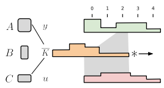
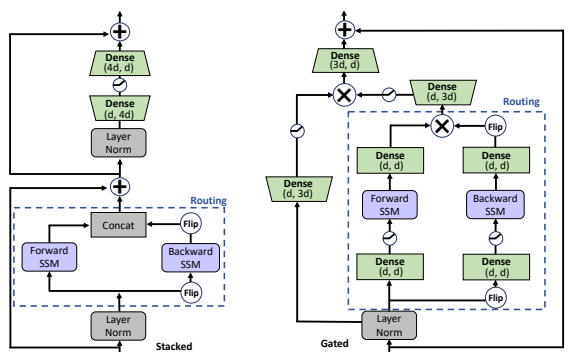
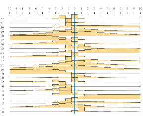
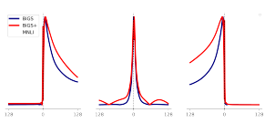
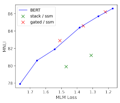
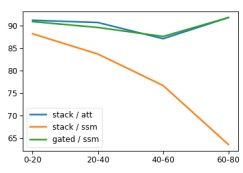
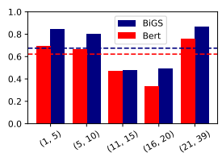
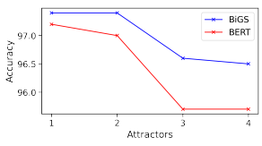
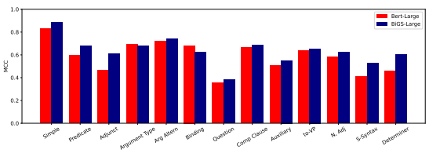

# Pretraining Without Attention

| Junxiong Wang   | Jing Nathan Yan   |
|-----------------|-------------------|
| Cornell         | Cornell           |

## Abstract

Transformers have been essential to pretraining success in NLP. While other architectures have been used, downstream accuracy is either significantly worse, or requires attention layers to match standard benchmarks such as GLUE. This work explores pretraining without attention by using recent advances in sequence routing based on state-space models (SSMs). Our proposed model, Bidirectional Gated SSM (BiGS), combines SSM layers with a multiplicative gating architecture that has been effective in simplified sequence modeling architectures. The model learns static layers that do not consider pair-wise interactions. Even so, BiGS is able to match BERT pretraining accuracy on GLUE and can be extended to long-form pretraining of 4096 tokens without approximation. Analysis shows that while the models have similar average accuracy, the approach has different inductive biases than BERT in terms of interactions and syntactic representations.

## 1 Introduction

| Alexander M. Rush   | Cornell   |
|---------------------|-----------|

| Albert Gu DeepMind   |
|----------------------|

Transformers are the *de facto* model architecture for NLP pretraining (Vaswani et al., 2017). Since BERT (Devlin et al., 2018), they have proven central to NLP tasks with their ability to learn effectively on large unlabeled datasets. Specifically, the use of attention as a central routing component seems to be critical to empirical success on downstream tasks. Other architectures have been proposed but require attention layers for high-accuracy (Tay et al., 2020b; Lee-Thorp et al., 2021).

Is the centrality of attention in pretraining due to inductive bias or computational convenience?

This question is complicated by the properties of common sequence routing layers: recurrent neural network (RNN) models due not scale as well as attention, whereas convolutional neural networks
(CNNs) can not easily model long-distance dependencies.

State-space models (SSMs) for deep learning provide a promising alternative. Recent works show that SSMs are a competitive architecture for long-range sequence modeling (Gu et al., 2021). SSMs achieve strong results on speech generation (Goel et al., 2022) and on the Long Range Arena benchmark (Tay et al., 2020a) outperform standard and long-range transformer architectures (Gu et al., 2021; Gupta, 2022; Gu et al., 2022; Smith et al., 2022). In addition to improving accuracy, SSM-based routing does not have quadratic complexity as the length of the sequence grows. Concretely, the model provides a way to achieve RNN-like long-range dependencies with CNN-like training speed.

This work proposes an architecture for applying SSMs using a *Bidirectional Gated SSM* (BiGS) model for BERT-style pretraining. BiGS uses SSM- routing at its core as a replacement for attention.

However, this change alone significantly degrades the representational capacity of the model. To target this issue, we develop a multiplicative gating architecture (Dauphin et al., 2017; Hua et al., 2022; Mehta et al., 2022). In combination, this leads to a simpler routing approach that remains surprisingly effective at modeling necessary interactions.

Experiments compare SSMs to standard NLP
pretraining. While we find that SSMs by themselves underperform on NLP pretraining tasks, BiGS is able to match the performance of a BERT model when trained on the same data in a controlled setting. By additionally pretraining on longerlength instances, the model is able to grow without approximation to extend to input sequences of length 4,096. Analysis shows that importance of multiplicative gating in fixing specific issues of variable-length textual input. All models from this work are available at https://github.com/
jxiw/BiGS.

## 2 Related Work

Prior to BERT, promising pretraining approaches for learning contextual representations were learned using RNN-based models (McCann et al., 2017; Peters et al., 2018). While important precursors, their accuracy did not scale with data or compute as well as Transformers. This gap remains even when back-porting best-practices from Transformer pretraining (Peters et al., 2019). Recently Tay et al. (2021) explored pretraining with several convolutional (CNN) variants. Results show that CNN without attention does not perform well, although they note benefits in routing speed. Lee-Thorp et al. (2021) propose FNet which replaces the attention layer with a Fourier transform.

Without attention, this achieves 92-97% results on GLUE (Wang et al., 2018). Other works have used CNN-based models with multiplicative gating for NLP tasks such as machine translation (Dauphin et al., 2017). We believe BiGS is the first model to achieve BERT-level transfer learning on the GLUE benchmark without attention.

Researchers have begun to use state-space models for NLP tasks, and have primarily focused on auto-regressive language modeling. In S4 (Gu et al., 2021) and its variants (Gupta, 2022; Gu et al., 2022), researchers experimented with language modeling, achieving promising results, though slightly worse than transformers. Gated State Space adapts a SSM plus gating approach to language modeling (Mehta et al., 2022). Concurrent to this work, Dao et al. (2022) propose H3 which closes the gap in auto-regressive language modeling, and with two attention layers outperforms transformers on OpenWebText. Finally, a related method, MEGA (Ma et al., 2022) combines exponential moving average routing with a simple attention unit to outperform transformer baselines. Our approach instead focuses on bidirectional masked language modeling and questions of downstream generalization.

## 3 Background

### 3.1 State Space Models

A state space model (SSM) is a general-purpose tool for describing the relationship between a continuous-time scalar input u(t) to scalar output y(t) by the following differential equations:

$$x^{\prime}(t)=A x(t)+B u(t),\quad y(t)=C x(t)+D u(t).$$

Figure 1: A SSM learns a one-dimensional kernel K,

which is convolved with the input sequence u to produce output y. Unlike attention, routing is static and does not depend on the input. In BiGS we use only two kernels per layer (forward and backward). Figure 3 shows all the kernels used in the fully trained model.

Where x(t) ∈ R
N is a continuous-time state vector, x 0(t) is its derivative, and the equation is parameterized by A ∈ R
N×N , B ∈ R
N×1, C ∈
R
1×N , D ∈ R
1×1.

When applied to a discrete-time scalar input sequence u1*, . . . u*L, the SSM equations and parameters can be discretized, leading to the following recursion,

$$x_{k}={\overline{{A}}}x_{k-1}+{\overline{{B}}}u_{k},\quad y_{k}={\overline{{C}}}x_{k}+{\overline{{D}}}u_{k}.$$

Where A, B, C, D are functions of the original parameters and a discretization rate.

This equation can be computed like an RNN
where xk ∈ R
N is a hidden state at time k. Unlike an RNN though, the linearity of the recursion allows y1 *. . . y*L to be computed directly using a convolution with precomputed kernel K ∈ R
L ,

$\overline{\bf K}=(\overline{\bf C}\overline{\bf B},\overline{\bf C}\overline{\bf A}\overline{\bf B},\ldots,\overline{\bf C}\overline{\bf A}^{L-1}\overline{\bf B})$  $\overline{\bf y}=\overline{\bf K}\ast u$
The process is illustrated in Figure 1. In a practical sense, after training, this kernel K fully characterizes the SSM, i.e. the model is a 1D convolution with a very long kernel.

### 3.2 Learning Ssms

Gu et al. (2020, 2021) demonstrate an effective approach for using SSMs in neural networks. The core insight is to propose a parameterization of the transition matrix A, known as HiPPO,

$$A_{n k}=-\begin{cases}(2n+1)^{1/2}(2k+1)^{1/2}&{\mathrm{if}}\ n>k\\ n+1&{\mathrm{if}}\ n=k\\ 0&{\mathrm{if}}\ n<k\end{cases}$$

Figure 2: Model Variants. (STACK) is the standard transformer architecture, (GATED) is based on the gated unit (Mehta et al., 2022; Hua et al., 2022). For the Routing component (dashed lines), we consider both a bidirectional SSM (shown) and standard self-attention. The gate (⊗) represents element-wise multiplication. The BiGS
model uses GATED with SSM.

This matrix yields a stable training regime that can also be efficiently trained. The full model, S4, retains the SSM ability to model long-term sequences while being more efficient than RNNs to train.

Recently, researchers (Gu et al., 2022; Gupta, 2022) have proposed simplified diagonalized versions of S4, which achieve comparable results with a simpler approximation of the original parameterization. In preliminary experiments, we used several different S4 parameterizations but did not find a significant difference in accuracy. Throughout the work, we use S4D as the parameterization.

While the specifics of SSM discretization, parameterizations, and training are beyond the scope of this work, at a high-level, we note that each of the models leads to the form in the previous section.

The model can be therefore be trained by backpropagation though the convolution and discretization without the serial bottleneck of RNNs, and applied without the quadratic cost of attention. Each SSM
itself has O(N2) parameters, and we use N = 64 throughout the work.

### 3.3 Multiplicative Gating

Gating units have been widely used to improve the performance of various architectures such as MLP,
CNN, and Transformers (Dauphin et al., 2017; Shazeer, 2020; Narang et al., 2021). One example of such a gating unit is the Gated Linear Unit
(GLU) which has been used effectively for CNN-
based NLP systems (Dauphin et al., 2017). Let u represent an input activation. GLU first computes both a gating vector and a linear transform, σ(Wu)
and Vu respectively. The output of the layer is then the element-wise product σ(Wu) ⊗ (Vu).

Recent work has shown that gating can increase the performance of models using simplified routing. Hua et al. (2022) show that linear time attention models can benefit form improved gating.

Mehta et al. (2022) propose a Gated State Space architecture using gating for unidirectional SSM models. Multiplicative gating may restore some of the interaction capacity from full attention-based interactions.

## 4 Bigs Model

We consider two different architectures for SSM
pretraining: a stacked architecture (STACK) and a multiplicative gated architecture (GATED) shown in Figure 2. Transformer Architecture The STACK architecture with self-attention is equivalent to the BERT /
transformer model. We replace the attention block with two sequential SSM blocks to mimic the nature of bi-directional self-attention. Gated Architecture The GATED architecture is a bidirectional adaptation of the gated unit of Hua et al. (2022). Specifically, let Xi ∈ R
L×d be activations at the i-th layer where the length is L, and the model size is d. We use the activation GELU (Hendrycks and Gimpel, 2016) for σ. The first stage computes,

| X = LayerNorm(Xi)   | ∈ R   | L×d   |
|---------------------|-------|-------|
| V = σ(WvX)          | ∈ R   | L×3d  |
| F = σ(WfX)          | ∈ R   | L×d   |
| B = σ(WbFlip(X))    | ∈ R   | L×d   |

The second stage uses 2 sequential blocks (i.e., a forward and backward SSM layer) with a multiplicative gate.

$$\begin{array}{l}{{\mathbf{U}_{1}=\mathbf{W}_{u_{1}}\operatorname{SSM}(\mathbf{F})}}\\ {{\mathbf{U}_{2}=\mathbf{W}_{u_{2}}\operatorname{SSM}(\mathbf{B})}}\\ {{\mathbf{U}=\sigma(\mathbf{W}_{u}(\mathbf{U}_{1}\otimes\operatorname{Flip}(\mathbf{U}_{2})))}}\end{array}$$
$$\in\mathbb{R}^{L\times d}$$
$\in\mathbb{R}^{L\times d}$  $\in\mathbb{R}^{L\times3d}$. 
The third stage uses a feed-forward layer again with gating, to replace the two dense blocks in the traditional transformer architecture. We sum this output O with the original input Xi finally as the input Xi+1 of the next layer i + 1.

$$\mathbf{O}=\mathbf{W}_{o}(\mathbf{U}\otimes\mathbf{V})$$ $$\mathbf{X}_{i+1}=\mathbf{O}+\mathbf{X}_{i}$$
$$\begin{array}{l}{{\in\mathbb{R}^{L\times d},}}\\ {{\in\mathbb{R}^{L\times d}}}\end{array}$$

The number of parameters per layer in gated SSM is roughly 13d 2 while the number of parameters per layer in the stack is 12d 2. We compensate for this difference by using fewer gated layers. SSM Layer The SSM layer under both architectures is a map over vector sequences, SSM(X) : R
L×d7→ R
L×d. However SSMs are defined for scalar sequences. Past work, creates d differently parameterized SSMs for each dimension (Gu et al.,
2021). Experimentally though, we found it just as effective to use the same parameterization (and therefore kernel K) for each hidden dimension.

This simplifies model analysis and makes the total number of SSM parameters negligible.

## 5 Experimental Setup

Experiments compare the performance of SSM- based models to attention-based models on several standard fine-tuning benchmarks. Experiments control for total parameter-size and amount of pretraining in terms of number of tokens. All models are on the order of magnitude of BERT-Large at around 350M parameters; all GATED SSM models use 23 layers and STACK models 24 to match parameter count. In order to run ablation tests, we consider three different pretraining scales: 11B (short), 29B
(medium), and 97B (full). Models and architectures are roughly similar in training speed at this length. The 11B (short) training scale is roughly equivalent to the "24h BERT" setting typically used in research studies (Izsak et al., 2021). Full training is closer to the original BERT model which was trained on 128B tokens.

For all pretraining, we follow the training data and masking strategy of Izsak et al. (2021). Following RoBERTa (Liu et al., 2019), we use only masked language modeling and not next-sentence prediction. We preprocess and mask tokens offline for all models for consistency, with maximal sequence length to be 128. We use a grid search on perplexity to select configurations of weight decay and learning rate; other hyperparameters follow Izsak et al. (2021). For SSM, we use a cosine decay learning rate scheduler, which starts at 0, warms up to the peak learning rate, and then decays back (Gu et al., 2021).

Pretraining is done with length 128 token sequences. In order to adapt to longer sequences we apply continued pretraining. To adapt to 512 tokens for the SQuAD dataset, we follow the protocol of Wettig et al. (2022) and train on longer sequences of the same pretraining dataset. To adapt to 4,096 tokens, we follow the Longformer (Beltagy et al., 2020) protocol and continue training the BiGS model on the text of length up to 4,096 tokens long, for 10k more steps using their proposed training corpus of longer documents. For 4,096 tokens, use a smaller BiGS model (119M) so that it is comparable in size Longformer-base and BART- base models. We note that Longformer (LED) and BART are based on superior underlying models that are trained significantly longer.

Our SSM implementation is based on the Annotated S41(Rush, 2022), and our pretraining uses 

1https://srush.github.io/annotated-s4

|       | Arch / Route   | MNLI      | QNLI   | QQP   | RTE             | SST2                             | MRPC       | COLA   | STSB   | AVG   |
|-------|----------------|-----------|--------|-------|-----------------|----------------------------------|------------|--------|--------|-------|
|       |                | 393k      | 105k   | 364k  | 2.5k            | 67k                              | 3.7k       | 8.5k   | 7k     |       |
|       |                |           |        |       |                 | Short Training / ∼ 11B Tokens    |            |        |        |       |
| BERT  | STACK / ATT    | 82.7      | 90.1   | 87.7  | 76.8            | 91.5                             | 90.8       | 58.6   | 88.6   | 83.3  |
|       | STACK / SSM    | 78.4      | 83.5   | 85.6  | 60.5            | 91.6                             | 83.9       | 53.1   | 81.3   | 77.2  |
|       | GATED /  ATT   | 82.2      | 88.3   | 87.4  | 71.7            | 91.3                             | 88.5       | 58.8   | 86.5   | 81.8  |
| BiGS  | GATED / SSM    | 82.6      | 89.2   | 87.6  | 73.8            | 92.8                             | 88.9       | 63.2   | 88.4   | 83.3  |
|       |                |           |        |       |                 | Medium Training / ∼ 29B Tokens   |            |        |        |       |
| BERT  | STACK /  ATT   | 85.0      | 90.9   | 87.9  | 80.5            | 93.0                             | 90.9       | 60.8   | 89.2   | 84.8  |
|       | STACK / SSM    | 80.1      | 86.5   | 87.2  | 65.6            | 92.3                             | 86.5       | 56.5   | 83.4   | 79.8  |
|       | GATED /  ATT   | 83.5      | 90.2   | 87.6  | 72.0            | 91.7                             | 88.7       | 61.6   | 87.5   | 82.9  |
| BiGS  | GATED / SSM    | 84.5      | 90.2   | 88.3  | 78.6            | 94.4                             | 89.6       | 63.9   | 89.3   | 84.8  |
|       |                |           |        |       | Full Training / | ∼                                | 97B Tokens |        |        |       |
| BiGS  | GATED / SSM    | 86.2      | 90.9   | 88.3  | 79.4            | 94.6                             | 89.5       | 67.3   | 90.1   | 85.8  |
|       |                |           |        |       |                 | Non\-Attention Based Pretraining |            |        |        |       |
| CNN   | STACK / CNN    | ∼75       | \-     | \-    | \-              | 92.2                             | \-         | \-     | \-     | \-    |
| ELMo  | STACK / RNN    | 68.6      | 71.2   | 84.3  | 53.4            | 91.5                             | 70.5       | 44.1   | 82.3   | 68.7  |
| FNetL | STACK / FNT    | 78.0      | 85.0   | 85.0  | 69.0            | 94.0                             | 88.0       | \-     | 84.0   | \-    |
|       |                |           |        |       |                 | GLUE Test Result                 |            |        |        |       |
| BERT1 | STACK / SSM    | 86.7/85.9 | 92.7   | 72.1  | 70.1            | 94.9                             | 88.9       | 60.5   | 86.5   | 79.6  |
| BERT2 | STACK / SSM    | 86.0/85.2 | 92.6   | 72.0  | 78.3            | 94.5                             | 89.9       | 60.9   | 87.5   | 83.0  |
| BiGS  | GATED /  SSM   | 86.1/85.0 | 91.6   | 71.2  | 77.6            | 94.9                             | 88.7       | 64.4   | 87.5   | 83.0  |

Table 1: GLUE Results. (Top) Comparison of different architectures and routing in a controlled setting (Izsak et al., 2021). See Figure 2 for details. We fine-tune RTE, MRPC, and STS-B from a MNLI checkpoint following the the result using an MNLI checkpoint for other NLI tasks (Izsak et al., 2021). We use − to denote those results were not reported by previous research.

convention by (Izsak et al., 2021). We report accuracy by averaging the results of six runs for MNLI, QNLI, RTE, SST-2 and F1 score for QQP, MRPC and Matthew's correlation for CoLA and Spearman's correlation for STS-B. All models are comparable to BERT-Large in size. (Bottom) Reported comparable results for other non-attentionbased pretraining models based on CNNs, LSTMs and FNet (Peters et al., 2018; Tay et al., 2021; Lee-Thorp et al.,
2021; Wang et al., 2018). BERT1 represents the official BERT result (Devlin et al., 2018), and BERT2 represents

the template from Hugging Face Transformers2
(Wolf et al., 2020). We experimented with variants of S4 SSMs and found they performed similarly; experiments use S4D (Gu et al., 2022) for simplicity. Note that for a fair comparison, we keep the size of gated architecture comparable to a stacked architecture and our BERT's implementation.

## 6 Results

### 6.1 Glue

Table 1 (Top) shows the main results for different pretrained models on the GLUE benchmark. In short and medium training, we note that the STACK
2https://github.com/huggingface/transformers architecture is significantly better with attention than with SSM-routing. However, with the GATED architecture, the SSM achieves competitive results.

To confirm this is not simply from a better architecture, we try gating with attention but find it does not improve. On full training, BiGS continues to improve in accuracy.

Table 1 (Bottom) compares the BiGS architecture to other reported results on GLUE. First, we compare to other non-attention based pretrained models based on RNNs and CNNs (Peters et al., 2019; Tay et al., 2021; Lee-Thorp et al., 2021). Results from these works all show significant degradation in transfer learning with GLUE scores far

|      |              | SQuAD 1.1   |
|------|--------------|-------------|
| BERT | (512)        | 90.9        |
| BERT | (128 →  512) | 87.3        |
| BiGS | (128 → 512)  | 89.5        |

Table 2: SQuAD F1 Dev Results. Models are trained by adapting full 128 token models to 512 tokens (Wettig et al., 2022), which under-performs 512-token

|      | Length   | QALT      | CNLI   |
|------|----------|-----------|--------|
| LED  | 1024     | 26.6/27.2 | 73.4   |
| LED  | 4096     | 26.6/27.3 | 71.5   |
| LED  | 16384    | 25.8/25.4 | 71.5   |
| BART | 256      | 26.0/25.8 | 69.8   |
| BART | 512      | 26.8/27.4 | 71.6   |
| BART | 1024     | 26.0/25.9 | 77.4   |
| BiGS | 128      | 32.3/30.0 | 68.7   |
| BiGS | 4096     | 32.8/31.7 | 71.4   |

BERT (Devlin et al., 2018).

Table 3: SCROLLS Encoder Test set results. Baseline models are both encoder-decoder models, one based on Longformer (LED) (Beltagy et al., 2020) and the other on BART (Lewis et al., 2019). Inputs are truncated at length.

below BERT. Next, we compare BiGS to the full BERT results as reported in past work, both from the original paper (Devlin et al., 2018) and from follow-up works with an improved fine-tuning convention (Izsak et al., 2021). We see that the BiGS model achieves comparable test scores. While the final GLUE score is nearly identical we do see that the models perform differently on the underlying tasks, which we explore more below.

We also apply BiGS to SQuAD (Rajpurkar et al.,
2016). SQuAD requires extending the length of the model from 128 to 512 tokens through additional training. We report the F1 score in Table 2. We see that BiGS outperform BERT when adapted with this procedure (Wettig et al., 2022). We note that both of these models underperform BERT which was pretrained fully on 512 tokens.

### 6.2 Long-Form Classification

An advantage of SSM-based routing is that the models can extend to longer-ranges without requiring approximation. To adapt to longer range classification, we continue pretraining on longer data (4,096). Table 3 shows results on encoder-

Figure 3: Complete SSM routing learned in BiGS.

 Shows forward and backward kernels K at each layer
(0-22). Values indicate absolute value of contribution of each relative position (-10, *. . .*, 10) cropped from the full 2 × 128. Min-max scaling of absolute values is used for visual normalization.

Figure 4: Change in SSM kernel after finetuning. Shows K after pretraining and after MNLI finetuning for Layer 14, Layer 18, and Layer 17 over all relative positions(-128, *. . .* , 128).

supported3experiments in the SCROLLS (Shaham et al., 2022), a recent long-range language modeling benchmark. We can compare the model to Longformer Encoder-Decoder (LED) and BART. On these long-range tasks, it performs as well or better, taking advantage of the long-range context.

## 7 Analysis

### 7.1 Role Of Ssm

Compared to multi-head attention where routing is determined by L
2attention coefficients per head per layer, the BiGS SSM routing is relatively compact. Each layer has only 2L static values. Figure 3 shows these values in the form of the forward and backward kernels. These kernels correspond partially to local aggregations such as the next word
(layer 1) or a preceding trigram (layer 6), and par-

3We have not attempted to develop a BiGS model that performs generation.
tially to long-term future or past information (layer 14, layer 17).

Figure 4 shows how these kernels change during finetuning. In particular, during MNLI finetuning, the model needs to look at more long-distance information to match between sentences. This results in most local kernels remaining the same, but long distance kernels adjusting. The figure shows three kernels expanding their scope outward.

### 7.2 Role Of Gating

GLUE results show a significant improvement in

 downstream accuracy with the GATED model; however, we find that STACK SSM has a similar pretraining MLM loss. Figure 5 illustrates the difference of MLM loss and MNLI accuracy for both GATED and STACK SSM, compared to the MLM loss and expected MNLI values presented in BERT (Devlin et al., 2018). The figure shows that the gated model tracks closely the anticipated pretraining gains, while stack does not.

Figure 5: Comparison of pretraining loss and down-

 stream accuracy. Plots MNLI accuracy with respect to MLM loss. BERT values from (Devlin et al., 2018). Gated SSM shows similar transferability as BERT, whereas Stack SSM does not.

Figure 6: Accuracy by binned length on QNLI.

| Model   | Arch         | H P   | H ∼ P   |
|---------|--------------|-------|---------|
|         | STACK /  SSM | 77.4  | 69.7    |
| BiGS    | GATED / SSM  | 77.4  | 77.7    |

|                              | BiGS   | BERT   | LSTM   |
|------------------------------|--------|--------|--------|
| SUBJECT\-VERB:               |        |        |        |
| Simple                       | 100.0  | 100.0  | 94.0   |
| Sentential complement        | 85.1   | 85.6   | 99.0   |
| Short VP coordination        | 91.0   | 86.5   | 90.0   |
| Long VP coordination         | 97.5   | 97.5   | 61.0   |
| Across prep phrase           | 88.6   | 84.8   | 57.0   |
| Across subj relative clause  | 88.4   | 84.9   | 56.0   |
| Across obj relative clause   | 89.9   | 85.1   | 50.0   |
| Across obj relative (\-that) | 86.9   | 81.1   | 52.0   |
| In obj relative clause       | 97.2   | 99.1   | 84.0   |
| In obj relative (\-that)     | 88.7   | 81.6   | 71.0   |
| REFL ANAPHORA:               |        |        |        |
| Simple                       | 97.1   | 98.9   | 83.0   |
| In a sentential complement   | 79.9   | 86.2   | 86.0   |
| Across a relative clause     | 79.1   | 75.9   | 55.0   |

Table 4: Adversarial variant of QNLI. Distractor phrases (∼) are added between the Hypothesis and Premise to increase the distance between relevant phrases.

Table 5: Results on the (Marvin and Linzen, 2018) stimuli. BiGS and BERT results are comparable as they are in the exact same experiment setup. Numbers of LSTM models are taken from (Goldberg, 2019).

We speculate that multiplicative gating helps the SSM model generalize to long-distance interactions. Table 6 compares accuracy of examples binned by length on the QNLI task. We see that the stack SSM decreases greatly in accuracy as the bins get larger, unlike for BERT and BiGS. We further probe this issue with a synthetic adversarial task.

We collect a dataset of examples from QNLI that have the same label prediction from both the STACK and GATE versions of the SSM model. We add distractor phrases (∼), chosen to be non-ambiguous, in between the hypothesis (H) and premise (P) to see if the model has learned to skip over these to match H and P. Table 4 shows that the gated model performs significantly better at this task.

### 7.3 Syntactic Analysis

BiGS seems to perform well on syntactic tasks such as CoLA (Warstadt et al., 2019) (Figure 7).

We speculate that these results indicate that SSM-
routing may have different inductive biases than

M C

Figure 7: Performance of CoLA w.r.t sentence length

using matthews correlation coefficient(MCC). The red and navy dashed lines in the graph represent the mean value obtained from multiple rounds of evaluation.

Figure 8: Syntactic Attractors task from (Linzen et al., 2016). Tests ability of models to match word agreement in the presence of intervening attractors.

transformer, in particular in terms of locality. We follow Goldberg (2019) in adapting two preliminary experiments with of syntactic tests for masked language modeling:
Linzen et al. (2016) test a model's ability to distinguish agreement in the presence of spurious intervening "agreement attractors". For example the sentence "Yet the **ratio** of men who survive to the women and children who survive [is] not clear in this story" has three attractors for the masked work [is]. Figure 8 shows that BiGS consistently outperforms BERT as number of attractors grows.

Marvin and Linzen (2018) develop pairs of manually constructed examples targeting various syntax phenomena and difficulties. Given a pair of examples from this stimuli: "No students have ever lived here" and "Most *students have ever lived here"*,
we feed an adapted version "[MASK] students have ever lived here" into a model and compare the predicted scores for the masked position "No" and
"Most" from it. Results are reported in Table 5 and again show that SSM outperforms BERT on several

| Length   | BiGS    | BERT    |
|----------|---------|---------|
| 128      | 8.1E+10 | 7.9E+10 |
| 512      | 3.2E+11 | 3.4E+11 |
| 1024     | 6.5E+11 | 7.2E+11 |
| 4096     | 2.6E+12 | 4.1E+12 |

Table 6: FLOP comparison between BiGS and BERT with respect to input token length. We calculated FLOP with a batch size of 1 and considered both the forward and backward passes.

### Agreement Phenomena.

While more experiments are needed, it is possible that the sequential nature of BiGS leads to an inductive bias to a more stack-like representation, since it cannot rely only on long-range matching.

### 7.4 Efficiency And Flop Analysis

Table 6 gives the Floating Point Operations
(FLOPs) for both BiGS and BERT models. FLOPs measures a best case computational cost of models.

By comparing the FLOPs of BiGS and BERT for different input token lengths, we can better understand their relative efficiency and scalability. We calculate the training complexity, including both forward and backward passes for both BiGS and BERT, assuming single instance per batch. When the input token length is 128, BiGS shows slightly lower FLOPs than BERT, indicating a marginal advantage in terms of computational complexity.

As the input token length increases to 512, BiGS
surpasses BERT by a noticeable margin. This increasing efficiency gap trend continues nonlinearly with token lengths of 1024 and 4096 respectively, implying that BiGS is better equipped to handle applications with longer input sequences.

While SSMs have a theoretical computational benefit compared to attention, current implementations and hardware do not yet show this benefit. In our experiments, models are roughly the same speed. On longer range tasks, the SSM element is more tractable than the attention component, but concerns like training memory require careful optimization. Related work by Dao et al. (2022) considers specialized kernels for SSM computation.

## 8 Limitations

While SSMs are a promising technology for pretraining, there are some limitations for their use.

- This work considers SSMs for bidirectional

pretraining, and not autoregressive language modeling. In this setting, some of the benefits of SSMs are less apparent, such as being able to utilize RNN based generation.

- In our preliminary studies in applying BiGS
to long-range question answering (WikiQA (Yang et al., 2015), TriviaQA (Joshi et al., 2017)), we did not see direct benefit of SSM. One issue was that some tasks have specialized loss functions, and adapting these to SSM
training may require additional care.

## 9 Conclusion

We propose BiGS as a model for pretraining without attention. BiGS makes use of both SSM-based routing and multiplicative gating. Results show that SSMs alone perform poorly in a stacked architecture, but gating helps them to generalize. As far as we are aware, this architecture is the first to replicate BERT results without attention.

This work opens up many interesting future questions. We experimented with adapting to longer text, but SSM-based models could be pretrained fully on much longer sequences. Additionally, SSMs have the potential to be significantly faster than attention with further optimization. Finally, we took the first steps in exploring the interesting syntactic properties of SSMs, but it would be interesting to see further probing of how their internal representation leads to these properties.

## 10 Ethical Considerations

Our models are trained using a corpus consisting of existing collections of text from Wikipedia and books. Recent research has uncovered potential societal biases that are embedded within many established corpora. While it is beyond the scope of this paper to delve into these biases in depth, we acknowledge the potential risk that our pre-trained models may inherit these biases. In light of this, we are interested in exploring whether previous research on language bias detection can be applied to BiGS, as part of future work. Additionally, in this paper, we have focused solely on the English corpus, and it would be interesting to investigate how BiGS can contribute to multi-lingual language modeling in the future.

## 11 Acknowledgement

We gratefully acknowledge the support of Google's TPU Research Cloud (TRC) program in providing Cloud TPU resources for this research. AR is supported by NSF CAREER 2037519, NSF 1704834, and a Sloan Fellowship

## References

Iz Beltagy, Matthew E Peters, and Arman Cohan.

2020. Longformer: The long-document transformer. arXiv preprint arXiv:2004.05150.

Tri Dao, Daniel Y Fu, Khaled K Saab, Armin W
Thomas, Atri Rudra, and Christopher Ré. 2022. Hungry hungry hippos: Towards language modeling with state space models. *arXiv preprint* arXiv:2212.14052.

Yann N Dauphin, Angela Fan, Michael Auli, and David Grangier. 2017. Language modeling with gated convolutional networks. In *International conference on* machine learning, pages 933–941. PMLR.

Jacob Devlin, Ming-Wei Chang, Kenton Lee, and Kristina Toutanova. 2018. Bert: Pre-training of deep bidirectional transformers for language understanding. *arXiv preprint arXiv:1810.04805*.

Karan Goel, Albert Gu, Chris Donahue, and Christopher Ré. 2022. It's raw! audio generation with statespace models. *arXiv preprint arXiv:2202.09729*.

Yoav Goldberg. 2019. Assessing bert's syntactic abilities. *arXiv preprint arXiv:1901.05287*.

Albert Gu, Tri Dao, Stefano Ermon, Atri Rudra, and Christopher Ré. 2020. Hippo: Recurrent memory with optimal polynomial projections. Advances in Neural Information Processing Systems, 33:1474– 1487.

Albert Gu, Karan Goel, and Christopher Ré. 2021. Efficiently modeling long sequences with structured state spaces. *arXiv preprint arXiv:2111.00396*.

Albert Gu, Ankit Gupta, Karan Goel, and Christopher Ré. 2022. On the parameterization and initialization of diagonal state space models. arXiv preprint arXiv:2206.11893.

Ankit Gupta. 2022. Diagonal state spaces are as effective as structured state spaces. *arXiv preprint* arXiv:2203.14343.

Dan Hendrycks and Kevin Gimpel. 2016. Gaussian error linear units (gelus). arXiv preprint arXiv:1606.08415.

Weizhe Hua, Zihang Dai, Hanxiao Liu, and Quoc Le.

2022. Transformer quality in linear time. In International Conference on Machine Learning, pages 9099–9117. PMLR.

Peter Izsak, Moshe Berchansky, and Omer Levy. 2021.

How to train bert with an academic budget. arXiv preprint arXiv:2104.07705.

Mandar Joshi, Eunsol Choi, Daniel S Weld, and Luke Zettlemoyer. 2017. Triviaqa: A large scale distantly supervised challenge dataset for reading comprehension. In Proceedings of the 55th Annual Meeting of the Association for Computational Linguistics (Volume 1: Long Papers), pages 1601–1611.

James Lee-Thorp, Joshua Ainslie, Ilya Eckstein, and Santiago Ontanon. 2021. Fnet: Mixing tokens with fourier transforms. arXiv preprint arXiv:2105.03824.

Mike Lewis, Yinhan Liu, Naman Goyal, Marjan Ghazvininejad, Abdelrahman Mohamed, Omer Levy, Ves Stoyanov, and Luke Zettlemoyer. 2019. Bart: Denoising sequence-to-sequence pre-training for natural language generation, translation, and comprehension. *arXiv preprint arXiv:1910.13461*.

Tal Linzen, Emmanuel Dupoux, and Yoav Goldberg.

2016. Assessing the ability of lstms to learn syntaxsensitive dependencies. Transactions of the Association for Computational Linguistics, 4:521–535.

Yinhan Liu, Myle Ott, Naman Goyal, Jingfei Du, Mandar Joshi, Danqi Chen, Omer Levy, Mike Lewis, Luke Zettlemoyer, and Veselin Stoyanov. 2019. Roberta: A robustly optimized bert pretraining approach. *arXiv preprint arXiv:1907.11692*.

Xuezhe Ma, Chunting Zhou, Xiang Kong, Junxian He, Liangke Gui, Graham Neubig, Jonathan May, and Luke Zettlemoyer. 2022. Mega: moving average equipped gated attention. *arXiv preprint* arXiv:2209.10655.

Rebecca Marvin and Tal Linzen. 2018. Targeted syntactic evaluation of language models. arXiv preprint arXiv:1808.09031.

Bryan McCann, James Bradbury, Caiming Xiong, and Richard Socher. 2017. Learned in translation: Contextualized word vectors. Advances in neural information processing systems, 30.

Harsh Mehta, Ankit Gupta, Ashok Cutkosky, and Behnam Neyshabur. 2022. Long range language modeling via gated state spaces. arXiv preprint arXiv:2206.13947.

Sharan Narang, Hyung Won Chung, Yi Tay, William Fedus, Thibault Fevry, Michael Matena, Karishma Malkan, Noah Fiedel, Noam Shazeer, Zhenzhong Lan, et al. 2021. Do transformer modifications transfer across implementations and applications? arXiv preprint arXiv:2102.11972.

Matthew E. Peters, Mark Neumann, Mohit Iyyer, Matt Gardner, Christopher Clark, Kenton Lee, and Luke Zettlemoyer. 2018. Deep contextualized word representations. In Proceedings of the 2018 Conference of the North American Chapter of the Association for Computational Linguistics: Human Language Technologies, NAACL-HLT 2018, New Orleans, Louisiana, USA, June 1-6, 2018, Volume 1
(Long Papers), pages 2227–2237. Association for Computational Linguistics.

Matthew E Peters, Sebastian Ruder, and Noah A Smith.

2019. To tune or not to tune? adapting pretrained representations to diverse tasks. *arXiv preprint* arXiv:1903.05987.

Pranav Rajpurkar, Jian Zhang, Konstantin Lopyrev, and Percy Liang. 2016. Squad: 100,000+ questions for machine comprehension of text. In *Proceedings of* the 2016 Conference on Empirical Methods in Natural Language Processing, pages 2383–2392.

Alexander Rush. 2022. The annotated s4. International Conference on Learning Representations.

Uri Shaham, Elad Segal, Maor Ivgi, Avia Efrat, Ori Yoran, Adi Haviv, Ankit Gupta, Wenhan Xiong, Mor Geva, Jonathan Berant, et al. 2022. Scrolls: Standardized comparison over long language sequences. arXiv preprint arXiv:2201.03533.

Noam Shazeer. 2020. Glu variants improve transformer. *arXiv preprint arXiv:2002.05202*.

Jimmy TH Smith, Andrew Warrington, and Scott W
Linderman. 2022. Simplified state space layers for sequence modeling. *arXiv preprint* arXiv:2208.04933.

Yi Tay, Mostafa Dehghani, Samira Abnar, Yikang Shen, Dara Bahri, Philip Pham, Jinfeng Rao, Liu Yang, Sebastian Ruder, and Donald Metzler. 2020a. Long range arena: A benchmark for efficient transformers. *arXiv preprint arXiv:2011.04006*.

Yi Tay, Mostafa Dehghani, Dara Bahri, and Donald Metzler. 2020b. Efficient transformers: A survey. arXiv preprint arXiv:2009.06732.

Yi Tay, Mostafa Dehghani, Jai Gupta, Dara Bahri, Vamsi Aribandi, Zhen Qin, and Donald Metzler. 2021. Are pre-trained convolutions better than pre-trained transformers? *arXiv preprint* arXiv:2105.03322.

Ashish Vaswani, Noam Shazeer, Niki Parmar, Jakob Uszkoreit, Llion Jones, Aidan N Gomez, Łukasz Kaiser, and Illia Polosukhin. 2017. Attention is all you need. Advances in neural information processing systems, 30.

Alex Wang, Amanpreet Singh, Julian Michael, Felix Hill, Omer Levy, and Samuel R Bowman. 2018. Glue: A multi-task benchmark and analysis platform for natural language understanding. *arXiv preprint* arXiv:1804.07461.

Alex Warstadt and Samuel R Bowman. 2019. Linguistic analysis of pretrained sentence encoders with acceptability judgments. arXiv preprint arXiv:1901.03438.

Alex Warstadt, Amanpreet Singh, and Samuel R Bowman. 2019. Neural network acceptability judgments. Transactions of the Association for Computational Linguistics, 7:625–641.

Alexander Wettig, Tianyu Gao, Zexuan Zhong, and Danqi Chen. 2022. Should you mask 15% in masked language modeling? *arXiv preprint* arXiv:2202.08005.

Thomas Wolf, Lysandre Debut, Victor Sanh, Julien Chaumond, Clement Delangue, Anthony Moi, Pierric Cistac, Tim Rault, Rémi Louf, Morgan Funtowicz, et al. 2020. Transformers: State-of-the-art natural language processing. In *Proceedings of the* 2020 conference on empirical methods in natural language processing: system demonstrations, pages 38–45.

Yi Yang, Wen-tau Yih, and Christopher Meek. 2015.

Wikiqa: A challenge dataset for open-domain question answering. In Proceedings of the 2015 conference on empirical methods in natural language processing, pages 2013–2018.

## A Appendix

### A.1 Pre-Training Procedure

All models are pretrained using a single cloud TPU-
v3. Table 7 shows hyperparameter configurations that we examine in our pretraining.

BiGS with 512 token length model is trained with 10,000 steps (53,248 tokens per batch) using learning rate 4e-5.

To compare with LED (Beltagy et al., 2020) and BART (Lewis et al., 2019) in the scroll experiment, we first train a BiGS with 12 layers (119M parameters in total) and 128 maximal sentence length using 500,000 steps and later extend it to 4096 token length with 10k more training steps using learning rate 3e-5.

| Hyperparameter      | BiGS                         | BERT           |
|---------------------|------------------------------|----------------|
| Number of Layers    | 23                           | 24             |
| Hidden size         | 1024                         | 1024           |
| Intermediate size   | 3072                         | 4096           |
| Dropout             | 0.1                          | 0.1            |
| Learning Rate Decay | {Cosine, Linear}             | {Linear}       |
| Weight Decay        | {0.05, 0.01}                 | {0.01}         |
| Learning Rate       | {2e\-4, 4e\-4, 6e\-4, 8e\-4} | {2e\-4, 4e\-4} |
| Optimizer           | AdamW                        | AdamW          |
| Adam                      | 1e\-6                        | 1e\-6          |
| Adam β1             | 0.9                          | 0.9            |
| Adam β2             | 0.98                         | 0.98           |
| Gradient Clipping   | 0.0                          | 0.0            |
| Batch Size          | {760, 1048, 1136}            | {840}          |
| Warmup Proportion   | {1%}                         | {2%}           |

### A.2 Downstream Tasks

All models are finetuned using either a single cloud TPU-v3 or TPU-v2.

Table 7: Hyperparameters used for pretraining BiGS

and BERT models

Table 8: Hyperparameters used for finetuning our model on GLUE benchmark tasks.

| Hyperparameter    | GLUE                                |
|-------------------|-------------------------------------|
| Learning Rate     | {1e\-5, 2e\-5, 3e\-5, 5e\-5, 6e\-5} |
| Weight Decay      | {0.01, 0.1}                         |
| Batch Size        | {16, 32}                            |
| Max Epochs        | {3, 5, 8}                           |
| Warmup Proportion | {0.1}                               |

| Hyperparameter    | SQuAD          | QALT/CNLI      |
|-------------------|----------------|----------------|
| Learning Rate     | {4e\-5, 6e\-5} | {3e\-5, 5e\-5} |
| Weight Decay      | {0, 0.01}      | {0, 0.01}      |
| Batch Size        | {32}           | {16, 24}       |
| Max Epochs        | {2}            | {5, 8, 10}     |
| Warmup Proportion | {0.1}          | {0.1}          |

Table 9: Hyperparameters used for finetuning our model in SQuAD and QALT/CNLI tasks.

### A.2.1 Glue

Table 8 shows hyperparameter configurations used to finetune GLUE tasks.

### A.2.2 Other Tasks

Table 9 shows hyperparameter configurations used to finetune SQuAD and QALT/CNLI tasks.

### A.3 Annotated Cola

The CoLA corpus collection, as described in (Warstadt et al., 2019), is a vital task within the GLUE benchmark (Wang et al., 2018) for evaluating the acceptability of language models. This corpus has been specifically annotated with 13 different syntactic phenomena in order to more accurately quantify the linguistic knowledge of pretrained language models (LLMs) (Warstadt and Bowman, 2019). We utilized the annotated instances from this corpus to conduct a detailed analysis of the mistakes made by BiGS and BERT models. Specifically, we used the annotated instances to break down the errors made by these models and understand where they struggle with linguistic knowledge. Results are shown in Figure 9. We discovered that in 9 out of the 13 categories of syntactic phenomena, the BiGS model performed better than the BERT model, and significantly so in two domains. We hypothesize that the inductive bias that BiGS learned during training may have contributed to its superior performance in understanding these syntactic phenomena. It is likely that the specific inductive biases encoded in the

Figure 9: CoLA Results in Different Categories as annotated by Warstadt and Bowman (2019). MCC was used to measure the performance.

BiGS model enabled it to better comprehend the nuances of these syntactic phenomena, leading to its improved performance.