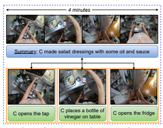
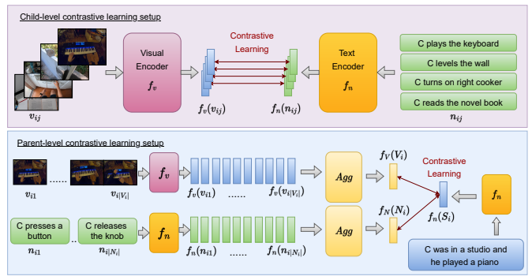
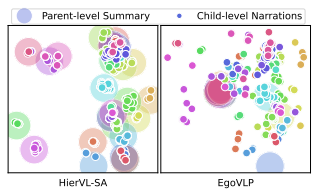
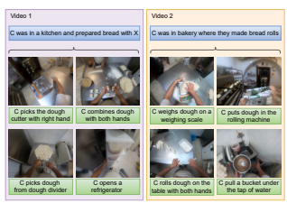

# Hiervl: Learning Hierarchical Video-Language Embeddings

Kumar Ashutosh1, Rohit Girdhar2, Lorenzo Torresani2, Kristen Grauman1,2 1UT Austin, 2FAIR, Meta AI

## Abstract

Video-language embeddings are a promising avenue for injecting semantics into visual representations, but existing methods capture only short-term associations between seconds-long video clips and their accompanying text. We propose HierVL, a novel hierarchical video-language embedding that simultaneously accounts for both long-term and short-term associations. As training data, we take videos accompanied by timestamped text descriptions of human actions, together with a high-level text summary of the activity throughout the long video (as are available in Ego4D). We introduce a hierarchical contrastive training objective that encourages text-visual alignment at both the clip level and video level. While the clip-level constraints use the step-by-step descriptions to capture what is happening in that instant, the video-level constraints use the summary text to capture why it is happening, i.e., the broader context for the activity and the intent of the actor. Our hierarchical scheme yields a clip representation that outperforms its single-level counterpart as well as a long-term video representation that achieves SotA results on tasks requiring long-term video modeling. HierVL successfully transfers to multiple challenging downstream tasks (in EPIC-KITCHENS-100, Charades-Ego, HowTo100M) in both zero-shot and fine-tuned settings.

## 1. Introduction

Understanding human activity in video is a fundamental vision problem with abundant applications in augmented reality, robotics, and information retrieval. The field has made exciting advances, from new models for recognition [24, 53, 86] and self-supervised representations [55, 58, 61, 90] to major datasets [16, 34, 63, 74, 106]. Nonetheless, activity understanding in video lags noticeably behind object understanding in images, where today's AI models compete well with people.

One key reason for this discrepancy is the fact that whereas objects present themselves directly in the pixelsno subtext required—activity naturally has broad temporal

Standard Embedding Our Hierarchical Embedding Figure 1. Conventional video-language embeddings are trained to match short-term clips with their corresponding descriptions, e.g., open tap (in orange boxes), thus capturing what is happening. Our hierarchical video-language embedding (in dotted blue box) learns both short-term and long-term visual-text relations, thereby capturing *why is it happening* (e.g., making salad dressing). Long-term intent is conveyed by textual summaries (blue) that give an abstractive summary of the whole video, and complement the more literal step-by-step narrations (green).

context rooted in the human actor's (latent) intentions. Not only does an activity stretch across video frames, but also its interpretation relies on the larger context of what the person is trying to accomplish. Thus, there is a natural *hierarchy* of information in video, starting with the short-term "what the person is literally doing right now" (e.g., reaching for the stove) and going all the way to the long-term "what the person aims to do" (e.g., cook dinner).

As a step towards capturing this hierarchy, we explore video-language representation learning. Video often has accompanying timestamped text, whether from spoken narrations in a how-to video [63, 75, 106], closed caption text and scripts [9,76], or deliberate text annotations [16,34,91].

Existing video-language models learn a correspondence between the two modalities by matching short video segments with their text counterpart, typically with a learned embed-

Website: https://vision.cs.utexas.edu/projects/hiervl/
ding [3,55,61,90] that produces a language-enriched video clip encoder. However, this standard approach risks capturing only the short-term actions. Granular comments such as "now I pour milk in the pan" or "he picked up a water hose" fail to capture the overall goal of the activity, like making a coffee or *cleaning a car*. As a result, at inference time their encodings for unseen videos can be myopic and miss sequential dependencies between observed events.

To tackle this problem, we introduce HierVL: a novel hierarchical video-language model that captures both shortterm actions and long-term intents in video. Unlike standard video-language embeddings, our method aims to simultaneously capture the immediate observed actions as well as their contribution to the longer-term goal. To that end, given training video accompanied by timestamped clip-level text descriptions as well as global (video-level) text *summaries*, HierVL learns a video-text embedding for hierarchical temporal understanding using two layers of contrastive learning. The top (parent) layer encourages the aggregated video clips to be close to the overarching textual summary (e.g., he makes spaghetti dinner), while the bottom (child) layer trains individual clips to be similar to their respective descriptions (e.g., *he turns on the cooker*). See Fig. 1.

To our knowledge, ours is the first work to create a hierarchical video-language embedding. Our idea to blend abstract textual summaries with literal text descriptions is new. Furthermore, our model design addresses constituent technical challenges—namely, we circumvent the typical expense of long-term feature learning [4, 43, 86] by using aggregation of short-term features, and we show how to jointly train with two levels of annotation in a way that staves off catastrophic forgetting of either layer.

This hierarchical training yields not only global videolevel representations that capture long-term information (e.g., intent and temporal dependencies), but also clip-level video features that are more expressive than those traditionally learned via single-level schemes. This happens by means of our parent-child learning framework, which requires the aggregation of clip features within a video to match the long-term context captured by the summary.

We demonstrate our model by training with the narrations and summaries in the 3,670-hour egocentric video dataset Ego4D [13, 34]. We show that HierVL outperforms strong baselines and state-of-the-art methods for multiple video benchmarks, successfully transferring its pretrained representation for inference on Charades-Ego [74], EPIC-
KITCHENS [16], and HowTo100M [63].1 We evaluate our representations on both hierarchy levels. In particular, at the time of submission, HierVL achieves state-of-theart performance on Ego4D Long Term Anticipation (LTA), Charades-Ego Action Recognition, EPIC-KITCHENS-100 Multi-Instance Retrieval (zero-shot and fine-tuned settings), and HowTo100M Long Video Classification.

## 2. Related Work

Activity recognition and detection. Video understanding spans tasks like action recognition [24, 32, 48, 53, 86], action anticipation [2, 26, 28, 30, 60], procedure learning [5, 8, 10, 64, 102], and action localization [90, 94, 101, 106]. Various video datasets facilitate research in these directions, including Internet video collections like HowTo100M [63], YouCookII [105], and CrossTask [106], as well as freshly recorded datasets like CharadesEgo [74], EPIC- KITCHENS [16], and Ego4D [13, 34]. As a training resource, we use Ego4D [13,34], a large-scale diverse collection of in-the-wild wearable camera videos of daily-life activity around the world. The Ego4D videos have low-level text descriptions ("narrations") of every action performed by the camera wearer, as well as video-level summaries, making them well-suited for our idea.

Long-form video representations. Longer videos introduce computational bottlenecks, making long-form video understanding challenging. There are several workarounds to make the task computationally feasible. Traditional methods include using pre-computed features that minimize backpropagation requirements [1, 20, 31, 85, 95] or decreasing the frame-rate [25, 38, 43, 46, 54, 87, 97, 104, 107]. Recent methods mitigate the computational requirements by creating a "feature-bank" [84] or caching memory [86]. Structured state space sequence models (S4) [35, 39] reduce the quadratic complexity of self-attention to linear, enabling efficient training of long-sequence tasks. Another promising approach is to aggregate fine-grained clip-level features [4, 27, 62, 67, 77, 78, 80, 82, 96] into an overall video representation, as typically employed for video classification tasks. While all these methods are video-only, we propose a multi-modal long-form representation for both visual and textual modalities.

Joint video and language learning. The idea of projecting visual and language representations in the same embedding space is widely used for multi-modal understanding [3, 55, 61, 63, 90]. Such joint representations enable several tasks, like language grounding in images [14, 21, 57, 59, 72], image captioning [36, 51, 65, 81, 98], and image retrieval [19, 37, 44, 49, 99], as well as text-to-video retrieval [11,23,58,90,103], video captioning [29,58,79,89], and video question answering [45,47,50,69,92,93]. Several of these methods [55, 58, 61, 63, 90] use contrastive learning (e.g., InfoNCE [66]) and match video clips (or images) with their narrations (or captions) in a self-supervised manner. The self-supervised model in [70] uses both narrow and broad windows of visual and audio, and focuses on shortform video (e.g., Kinetics 5s clips). HERO [50] uses a hierarchical loss between video clips (few seconds long) and

1Note that we do not need any text or summary annotations for these downstream datasets and tasks.
their frames using only clip-level text, while [100] enhances parent-level understanding for video-to-para retrieval and action recognition by concatenating text sentences to form (non-abstractive) paragraphs for hierarchical training.

All these methods only focus on localized narrations/captions. A single text sentence is matched to a clip that is typically a few seconds long. There are two reasons for choosing smaller temporal windows: a) the narrations typically span only a few seconds, and b) longer clips introduce computational overload that makes training difficult.

In contrast, we devise a hierarchical approach to use both clip-level narrations spanning a few seconds and abstractive video-level summaries spanning several minutes. We show that clip feature aggregation makes learning computationally feasible, and that using such hierarchical text descriptions improve both clip-level and video-level tasks.

## 3. Technical Approach

We propose HierVL, a novel video-language model that captures both clip- and video-level relations. Fig. 2 overviews our method. Next, we describe the annotations (Sec. 3.1), formalize the embedding learning approach (Sec. 3.2), and discuss the feature aggregation strategy (Sec. 3.3). Finally, we describe the loss function (Sec. 3.4), training process (Sec. 3.5), and implementation details (Sec. 3.6).

### 3.1. Hierarchical Video Annotations

Consider a hierarchically annotated video dataset, DL = {(Vi, Ni, Si)}
|DL| i=1 where Viis a long video, Ni is a sequence of text narrations describing every atomic action in the video, and Siis a high-level text summary for the whole video. Notationally, Vi = {vij}
|Vi| j=1 is an ordered collection of short clips v (each spanning a few seconds)
and Ni = {nij}
|Ni| j=1 is an ordered collection of narrations n. Note that there is no constraint on the temporal span of the video Vi, but in our experiments they are typically in minutes. As an illustration, nij can be "he cleans the painting brush" or *"he rubs the excess paint"* whereas high-level summary Si will be *"he was painting in a drawing room"*. The clip vij contains a visual demonstration of the narration nij , whereas Siis an abstractive summary of the full video Vi. The idea is for clip-level representations to capture finegrained actions in a video, while video-level representations should capture the overall goal of the task.

We leverage the Ego4D dataset [13, 34] for training our model. Ego4D consists of 3,670 hours of wearable camera video of daily-life activity, as captured by 931 unique camera wearers around the world. Among the Ego4D annotations are text descriptions ("narrations") of every action performed by the camera wearer, as well as videolevel text summaries, which meet our requirements for N
and S, respectively. The free-form narrations are written at timepoints selected by the annotators to capture every action performed. Specifically, annotators first watched a full 5-minute video and wrote a short 1-3 sentence summary for the overall activity and environment. Then annotators were asked to pretend they were describing everything occurring in the video to a friend on the phone who cannot see the video. The result is a temporally dense play-by-play description—13.2 sentences per minute on average, for a total of 3.85M sentences (see Appendix D in [34] for details).

### 3.2. Hierarchical Joint Video And Text Embedding

In our hierarchical setup, we have short-term video segment v and short-term text n. We want to learn shortterm representations fv(v) and fn(n), which we refer to as the visual short-term features and the textual short-term features. At the long-term level, we have V and N as a collection of multiple v and multiple n, respectively. Simultaneously, we want to learn long-term representations fV (V ) and fN (N) (referred to as long-term visual feature and long-term text feature, respectively). Finally, we have fn(S), the long-term summary feature, which is typically a few sentences long and hence is also encoded with fn.

The goal is to project *v, n, V, N, S* into a common space such that semantically related features are close. Mathematically, for any suitably selected similarity metric sim() and
∀i1, i2, j1, j2 such that (i1, j1) ̸= (i2, j2), we would like to fulfill a *child-level* matching constraint:

$$sim\left(f_{v}(v_{i_{1}j_{1}}),f_{n}(n_{i_{1}j_{1}})\right)>sim(f_{v}(v_{i_{1}j_{1}}),f_{n}(n_{i_{1}j_{2}})),\tag{1}$$
(1)
and ∀*i, j* such that i ̸= j, as well as *parent-level* matching constraints:

$$sim(f_{V}(V_{i}),f_{n}(S_{i}))>sim(f_{V}(V_{i}),f_{n}(S_{j}))\tag{2}$$ $$sim(f_{N}(N_{i}),f_{n}(S_{i}))>sim(f_{N}(N_{i}),f_{n}(S_{j})).\tag{3}$$

Overall, Eq. 1 implies corresponding short-term representations should have higher similarity than non-matching ones, Eq. 2 (and Eq. 3) implies a video (and narrations) should have a higher similarity with its summary than with other summaries. Note that since we project both short-term and long-term features into a common space, we are allowing features even at different hierarchical levels to come close in the embedding space if they are semantically similar.

### 3.3. Efficient Long-Term Features Via Aggregation

Obtaining long-term features is challenging in both visual and text modalities. Directly computing a long-term visual feature requires more resources due to its large video size and often leads to inferior performance and memory overflows [4, 43, 84, 86]. Self-attention models are suitable architectures for capturing long-term dependencies, but

Figure 2. Schematic representation of our proposed approach. In the clip-level contrastive learning setup (top), we match video clips with their corresponding narrations. The selected clips in one batch are from different videos, as shown. In our novel parent-level contrastive learning setup (bottom), we sample short-term features and aggregate them into a long-term representation followed by contrastive matching with the summary feature. These clips are sampled from the same video. Note that fv and fn are common in both stages, and also trainable in both. (For simplicity, figure only shows positive pairs in the contrastive setup.)

they are challenging to apply to large collections of text sentences (e.g., long documents) due to quadratic dependence on the token sequence length in transformer models [18]. Longformer [6] mitigates this problem by multi-level global and local attentions.

Taking inspiration from these works in both visual and textual domains, we use aggregations of short-term features as long-term representations fV and fN . Following this strategy, we define the long-term visual representation fV
as fV (Vi) = Agg {fv(vij )}
|Vi| j=1. Similarly, the longterm textual representation fN is defined as fN (Ni) =
Agg {fn(nij )}
|Ni| j=1. We consider two aggregator functions Agg(.). The first uses a self-attention transformer block in order to capture long-term dependencies over the entire video. We use positional encodings in order to provide the model with the ability to embed temporal order information in the video-level representation. We denote with HierVL-SA the variant of our model based on this selfattention aggregator. The second form of aggregation that we consider is simple average pooling (i.e., a parameter-free aggregator), which produces long-term features with equal contributions from all short-term features. This aggregator does not preserve order information. We name his version HierVL-Avg. We use the same aggregator in both modalities since f(v) and f(n) have the same dimensions (and, in fact, equal values for matching visual-text pairs in an ideal contrastive training).

### 3.4. Contrastive Pretraining Objective

As introduced previously, we learn the representations at two levels—child-level fv, fn and parent-level fV , fN . For child level representations, the pretraining objective is similar to prior work [55, 61, 63, 90] that relates short-term visual representations to short-term textual representations. In particular, we use a variant of EgoNCE [55], an action- and scene-aware variation of InfoNCE [66]. EgoNCE groups similar actions as positives and temporally close distinct actions as hard negatives. In contrast, we omit the latter, since our hierarchical setup *ought* to bring together distinct actions with the same camera-wearer intent. Overall, the short-term pretraining objective is:

$${\mathcal{L}}_{c h i l d}={\frac{1}{|{\vec{B}}|}}\sum_{i\in{\vec{B}}}\log\left({\frac{\sum_{j\in{\vec{p}}_{i}}\exp(f_{v}(v_{i})^{T}f_{n}(n_{j}))}{\sum_{j\in{\vec{B}}}\exp(f_{v}(v_{i})^{T}f_{n}(n_{j}))}}\right)$$
!
where B˜ is the overall set of short-term features and P˜ is the per-instance set of action-aware positive samples (see [55] for details). See Fig. 2 (top).

At the parent level, we use a similar pretraining objective between S-V and S-N. See Fig. 2 (bottom). As discussed in Sec. 3.3, we aggregate v to obtain V (and aggregate n to get N). Since the short-term matching already contrasts v and n, we do not contrast fV and fN again at the parent-level. Overall, the long-term pretraining objective is L*parent* = L
SV
parent + L
SN
parent where

$${\mathcal{L}}_{p a r e n t}^{S V}={\frac{1}{|{\vec{B}}|}}\sum_{i\in{\mathcal{B}}}\log\left({\frac{\sum_{j\in{\mathcal{P}}_{i}}\exp(f_{V}(V_{i})^{T}f_{n}(S_{j}))}{\sum_{j\in{\mathcal{B}}}\exp(f_{V}(V_{i})^{T}f_{n}(S_{j}))}}\right)$$
!
and similarly for L
SN
parent. For the parent-level feature, negatives for a summary text Si are both visual and textual representations chosen from outside the temporal span of Si.

### 3.5. Training Strategy

So far, we discussed our approach for hierarchical videolanguage pretraining. To realize this setup, we employ a joint training approach. First, we train m batches of shortterm visual and textual pairs (v, n) - thus training fv and fn. Subsequently, we train one batch of long-term features - thereby training fV and fN . Recall that fV (.) = Agg(fv(.)) and fN (.) = Agg(fn(.)). Therefore, in this batch, we update the weights of Agg as well as short-term fv and fn. The contrastive objective is detailed in Sec. 3.4.

The motivation behind training both levels of annotations together is to ensure the functions fv and fn optimize for both short-term and long-term features, i.e., both are influenced by the text summaries. Other alternatives are (a) using separate models for clip-level and video-level features, but that increases the parameters in the model and makes the training difficult (both in terms of convergence and GPU usage), and (b) training with only clip-level data and fine-tuning it for video-level (or vice-versa), but such strategies are known to lead to catastrophic forgetting [33, 41, 42].

Fig. 3 visualizes the learned features for 500 summary texts and their child narrations using our fn (left) and EgoVLP's features (right). While summary features in EgoVLP are unrelated to the narrations, HierVL captures their natural hierarchy, as seen by the colors clustering together in the embedding space. This reshaping of the features reflects how our clip-level features convey context about the higher-level intent of the camera wearer.

### 3.6. Implementation Details

Network architecture. To learn the video feature extractor fv, we use a standard FrozenInTime [3] video backbone, which is a slight deviation from TimeSformer [7] and inspired from ViT [22]. ViT-based vision transformers are frequently used as a feature extractor [55, 68] owing to their superior performance compared to other backbones. The video representation fv is learned from scratch;

Figure 3. T-SNE plot of learned features from our HierVL-SA (left) and EgoVLP [55] (right). See text and Supp. for details.

the output representation is the output of the final CLS token. We choose frames at 1 fps for short-term clips. Next, the text feature extractor fn is a DistillBERT [71] architecture which achieves performance on-par with BERT [18] but offers the benefit of being lighter. Aggregator. Our HierVL-SA variant is implemented by means of a 6-layer self-attention block of the TimeSformer architecture [7] and HierVL-Avg is averaging of features. In order to have a constant batch size, for both HierVL-SA and HierVL-Avg, we aggregate 16 short-term representations uniformly sampled from the entire video. Training setup and parameters. We pretrain our architecture on 4 nodes, each with eight 32 GB NVIDIA V100 GPUs for 10 epochs for two days. We use AdamW [56]
optimizer with a learning rate of 3 × 10−5. We train one batch of video-level aggregation after every m = 5 epoch of clip-level training. We use a batch size of 16 per GPU for short-term contrastive learning and 1 per GPU for long-term video-level contrastive learning. Recall that one video-level batch consists of 16 clips of the same video.

## 4. Experiments

We first pretrain our architecture with the setup and parameters discussed in Sec. 3.6 and report its results on multiple tasks aimed directly at gauging the quality of the learned video features (Sec. 4.1). Next, we show that our pretrained model improves the state of the art on a variety of downstream tasks covering both short- and long-term understanding (Sec. 4.2).

### 4.1. Pretraining Evaluation

We use Ego4D [13, 34] for our contrastive pretraining.

Ego4D has two-level hierarchical annotations—short-term step-by-step narrations and a long-term summary of the demonstration as observed by an annotator. We maintain the same training and validation split as in [55]. Overall, there are 3.8M short-term narrations and 120K long-term

|                         | Joint   |      |      |                 |          |             |              | EgoMCQ       |
|-------------------------|---------|------|------|-----------------|----------|-------------|--------------|--------------|
| Method                  | train   | Hier | Summ | Aggregation     | Summ MCQ | Shuffle MCQ | Inter\-video | Intra\-video |
| EgoVLP [55]             |         |      |      |                 | -        | -           | 90.6         | 57.2         |
| EgoVLP (reproduced)     | -       | ✗    | ✗    | ✗               | 89.0     | 20.0        | 90.1         | 54.0         |
| HierVL\-Avg (Ours)      | ✓       | ✓    | ✓    | Average         | 95.2     | 20.0        | 90.3         | 53.1         |
| HierVL\-SA (Ours)       | ✓       | ✓    | ✓    | Self\-attention | 95.4     | 26.8        | 90.5         | 52.4         |
| HierVL\-w/o Joint       | ✗       | ✗    | ✓    | ✗               | 89.8     | 24.2        | 72.0         | 29.4         |
| HierVL\-w/o Hier        | ✓       | ✗    | ✓    | ✗               | 93.7     | 20.0        | 90.7         | 50.5         |
| HierVL\-w/o Summ        | ✓       | ✓    | ✗    | Self\-attention | 20.0     | 22.1        | 90.8         | 52.1         |
| HierVL\-w/o Summ ↔ Narr | ✓       | ✓    | ✓    | Self\-attention | 94.7     | 26.1        | 90.4         | 50.0         |

Table 1. Pretraining accuracy on EgoMCQ, SummaryMCQ, and ShuffleMCQ on Ego4D pretraining, compared to EgoVLP (top) and ablations. For all validation sets, chance corresponds to 20.0 accuracy. Our proposed method using both hierarchy and long-term summary performs better than all baselines on the long-term SummaryMCQ and ShufleMCQ tasks. As expected, both methods are comparable in the short-term MCQ task. —: N/A, bold is best, underline is second best.

summary annotations. Pretraining evaluation tasks. We evaluate the quality of pretraining on three tasks defined on the Ego4D dataset: EgoMCQ (multiple-choice-question, introduced in EgoVLP [55]), as well as two new benchmarks that we propose - SummaryMCQ and ShuffleMCQ. In **EgoMCQ**, the model is given a narration prompt along with five candidate clips and must match the prompt with the correct video clip, with accuracy as the performance metric. Intra-video and Inter-video are two splits of the validation data where the candidate video clips are selected from the same or the other videos, respectively. **SummaryMCQ** mimics the videolanguage matching test of EgoMCQ but here the model is given a *summary* and five candidate *long-term* video options. The options are videos spanning the whole summary duration. While EgoMCQ validates clip-level performance, SummaryMCQ validates video-level performance. Finally, ShuffleMCQ is designed to evaluate temporal understanding: a summary text is given, and only the correct option maintains the temporal order among clips. The other four video options are generated by randomly reshuffling clips of the original video. Comparison to EgoVLP. Our main comparison is to EgoVLP [55], since our model adopts the same architecture and uses its EgoNCE as the short-term loss in the objective. However, while our method leverages a hierarchical contrastive training that makes use of summary information, EgoVLP only focuses on short-term visual-textual correspondences. For SummaryMCQ, we use parameterfree averaging to compute the aggregate representation.

Table 1 shows the results.2 EgoVLP [55] and both variants of our HierVL perform similarly on EgoMCQ, consistent with the fact this task requires short-term information only. In contrast, HierVL-SA obtains significantly better accuracy on the video-level (long-term) tasks, SummaryMCQ and ShuffleMCQ. Specifically, HierVL-SA outperforms EgoVLP by more than 6% on SummaryMCQ. This highlights our model's ability to capture long-term intent more effectively than the aggregated short-term features of EgoVLP. On ShuffleMCQ, both EgoVLP and HierVL-Avg are no better than chance (20%). This reflects how neither model captures the temporal order information that is essential to distinguish between the original summary and shuffled videos. Conversely, HierVL-SA exhibits stronger performance, producing a gain of 6.8% over these models (a relative gain of 34%). In short, our hierarchical learning shines for the long-term video tasks, successfully encoding the longer-term dependencies between events. We also observe that HierVL-SA outperforms EgoVLP with varying model sizes. Thus, further scaling models would not diminish the need for our architecture (see Supp). Ablating design choices. The bottom portion of Table 1 includes several variants of our HierVL, in order to ablate the different design choices. Our proposed architecture has three distinct components: (a) a hierarchical model that operates at two levels (parent-level summaries and child-level narrations), (b) use of text summaries as a supervision, and (c) the joint training of these hierarchical annotations.

HierVL-w/o Joint is a variant used to investigate the effectiveness of joint training (component c). We start HierVL-w/o Joint with EgoVLP pretrained weights and train the whole network (fv, fn*, Agg*) using summaries only, i.e., *without* narrations. In this variant, the clip representations are indirectly supervised by means of the parent loss. We can see that while HierVL-w/o Joint achieves decent results on the two video-level tasks, its performance on EgoMCQ is much lower than that achieved by EgoVLP, which is its initialization. This suggests that summaries by themselves are not sufficient to supervise the learning of strong clip-level representations.

HierVL-w/o Hier uses (b, c) but not (a), i.e., we use

2The first row corresponds to the numbers reported in EgoVLP [55]
and the second row corresponds to the numbers that we reproduced using the same codebase. We attribute the difference in performance to different hardware configurations.

Figure 4. Examples of video segments that are close in the embedding space despite coming from different videos and representing different short-term steps. Both the videos have the same highlevel objective, i.e. making bread.

summary supervision without a hierarchical model. We randomly assign the summary text annotation to one of the short-term segments. Importantly, this baseline uses the same amount of supervision as our proposed HierVL, yet it has overall lower performance (except for a marginal gain on EgoMCQ Inter-video). This highlights the effectiveness of our hierarchical training scheme.

HierVL-w/o Summ uses (a, c) but not (b), i.e., the supervision does not come from the summary text. Note, this represents the main idea from [100]. The parent-level positives for contrastive learning are fV and fN . The objective of this ablation is to determine if high-level summaries are needed, or whether an aggregation of narrations can serve as a high-level representation. We observe that this variant is considerably less effective than HierVL-SA on the two video-level tasks of SummaryMCQ and ShuffleMCQ. This is an important result, as it suggests that the high-level intent expressed by the human annotator in the summary is effectively captured by HierVL-SA and this human supervision cannot be adequately replaced by an aggregation of short-term narrations.

Finally, HierVL-w/o Summ↔**Narr** investigates the need for an additional text-only parent-level matching, as given in Eq. (3). This ablation checks the effect of only matching fV (V ) ↔ fn(S) vs. matching both fV (V ) ↔ fn(S) and fN (N) ↔ fn(S). We see that imposing additional supervision between child and parent text features does increase the performance on all validation sets.

### 4.2. Downstream Evaluation

We evaluate the representation learned by HierVL on multiple downstream tasks. Datasets. In addition to **Ego4D** [34] we use Charades- Ego [74], which consists of 7,860 videos recorded from both first and third person viewpoints, with 157 action

| Method              | Verb ED ↓   | Noun ED ↓   | Act. ED ↓   |
|---------------------|-------------|-------------|-------------|
| Ego4D baseline [34] | 0.7389      | 0.7800      | 0.9432      |
| Robovision [17]     | 0.7389      | 0.7688      | 0.9412      |
| I\-CVAE [60]        | 0.7526      | 0.7489      | 0.9308      |
| HierVL\-w/o Hier    | 0.7691      | 0.7454      | 0.9451      |
| HierVL\-Avg (Ours)  | 0.7223      | 0.7527      | 0.9401      |
| HierVL\-SA (Ours)   | 0.7239      | 0.7349      | 0.9275      |

Table 2. Errors on Ego4D Long Term Anticipation (LTA) Challenge. ED is the edit distance at Z = 20, lower the better.

classes; **EPIC-Kitchens-100** [15, 16], an egocentric video of 100 hours of unscripted activities in 45 home kitchens in 4 cities; and **HowTo100M** [63], a large-scale YouTube dataset covering 23K visual "how-to" tasks.

Downstream tasks. We consider the following tasks:
- **Long-Term Anticipation (LTA).** Ego4D's LTA challenge requires the model to predict the next 20 actions given the current action (verb, noun). Metric is Edit Distance (ED) [34].

- **Action Recognition.** Charades-Ego's task requires predicting the action among 157 categories. Metric is mAP (mean average precision). We evaluate both the zero-shot and fine-tuned settings.

- **Multi-Instance Retrieval (MIR).** EPIC-Kitchens100's MIR is a text-to-video and video-to-text retrieval task. Metrics are mAP and nDCG (normalized Discounted Cumulative Gain) for both V→T and T→V. We report their averages. Again, we evaluate in both zero-shot and fine-tuned settings.

- **Video Classification.** To demonstrate the transfer ability of our pretraining, we perform linear probing on the most frequent 100 classes in HowTo100M. Metric is classification accuracy.

Throughout, we report relevant comparisons from the best existing methods in the literature, as well as the "w/o Hier" ablation, which uses the exact same summary data/supervision as HierVL, hence pinpointing the influence of our hierarchical training idea.

Ego4D LTA: Tab. 2 shows results on the test set of Ego4D LTA challenge. The models need to forecast the future 20 actions, which is non-trivial even for humans. We improve the state of the art in both verb and noun predictions. Additionally, ours is the best performing method on the public leaderboard at the time of submission (in Tab. 2 we only compare with published works). HierVL-w/o Hier does not perform well despite also having access to the summaries, thus asserting the effectiveness of our hierarchical training. We use our learned representations fv and Agg

| Zero\-shot         |               |      |             |
|--------------------|---------------|------|-------------|
| Method             | Task ckpt mAP |      | PT ckpt mAP |
| EgoVLP [55]        | 25.0          |      | 19.4        |
| HierVL\-w/o Hier   | 24.6          |      | 24.5        |
| HierVL\-Avg (Ours) | 25.2          |      | 23.9        |
| HierVL\-SA (Ours)  | 26.0          |      | 25.0        |
| Fine\-tuned        |               |      |             |
| Method             |               | mAP  |             |
| Actor [73]         |               | 20.0 |             |
| SSDA [12]          |               | 23.1 |             |
| I3D [12]           |               | 25.8 |             |
| Ego\-Exo [52]      |               | 30.1 |             |
| EgoVLP [55]        |               | 32.1 |             |
| HierVL\-w/o Hier   |               | 32.6 |             |
| HierVL\-Avg (Ours) |               | 32.6 |             |
| HierVL\-SA (Ours)  |               | 33.8 |             |

| Zero\-shot             |      |          |
|------------------------|------|----------|
| Method  mAP Avg        |      | nDCG Avg |
| EgoVLP [55]            | 16.6 | 23.1     |
| HierVL\-w/o Hier       | 17.8 | 24.1     |
| HierVL\-Avg (Ours)     | 16.7 | 23.5     |
| HierVL\-SA (Ours)      | 18.9 | 24.7     |
| Fine\-tuned            |      |          |
| Method  mAP Avg        |      | nDCG Avg |
| MI\-MM w/ S3D [88]     | 29.2 | 44.7     |
| MME [83] w/ TBN [40]   | 38.5 | 48.5     |
| JPoSE [83] w/ TBN [40] | 44.0 | 53.5     |
| EgoVLP [55]            | 45.0 | 59.4     |
| HierVL\-w/o Hier       | 44.7 | 59.8     |
| HierVL\-Avg (Ours)     | 44.9 | 59.8     |
| HierVL\-SA (Ours)      | 46.7 | 61.1     |

| Method             | Inference       | Accuracy   |
|--------------------|-----------------|------------|
| EgoVLP [55]        | Avg             | 53.4       |
| HierVL\-SA (Ours)  | Self\-attention | 54.6       |
| HierVL\-Avg (Ours) | Avg             | 63.3       |
| HierVL\-SA (Ours)  | Avg             | 64.6       |

Table 3. Zero-shot (top) and fine-tuned (bottom) accuracy on Charades-Ego action recognition. We outperform EgoVLP and resist overfitting in the zero-shot case. Our fine-tuned performance is the best reported in the literature to-date for this dataset.

Table 4. Zero-shot and fine-tuned performance on EPIC-Kitchens100 dataset for multi-instance retrieval task.

Table 5. Linear probe results on HowTo100M video classification.

followed by a multi-headed decoder, as in the baseline [34]. This result shows the effectiveness of both our learned feature aggregator (long-term) as well as short-term visual encoder fv.

Charades-Ego Action Recognition. Tab. 3 (top) shows the zero-shot results. EgoVLP [55] reports overfitting when transferring from Ego4D to Charades-Ego and hence chooses another pretraining checkpoint. There is a significant gap in the performance between the two checkpoints. We report results on both—best performing pretraining checkpoint (denoted as PT ckpt) and the checkpoint chosen by EgoVLP (denoted as Task ckpt). Our model does not overfit when transferring to Charades-Ego; our performance on the corresponding checkpoints are 5.6% and 1.0% higher. In this downstream evaluation, only the shortterm visual encoder fv (frozen) is required. Clearly, our hierarchical pretraining improves short-term features as well.

Tab. 3 (bottom) shows the fine-tuned results for the same task. Here, to compare against state-of-the-art methods, we fine-tune the model starting from our best pretrained checkpoint (having 25.0% mAP for HierVL-SA). We outperform the current state-of-the-art EgoVLP [55]. We fine-tune fv for this task, showing improvement in the short-term features. To our knowledge, ours is the best reported result for this dataset in the literature.

EPIC-Kitchens-100 Multi-Instance Retrieval. Tab. 4
(top) shows the zero-shot results. We observe a gain of 2.3% mAP and 1.6% increase between the best method and our HierVL-SA. Our HierVL-Avg is also slightly better than the state-of-the-art method. In this task, we use both the short-term encoders fv and fn (both frozen) and thus this experiment also validates our claim of improved shortterm representations via hierarchical learning. Tab. 4 (bottom) shows our fine-tuning results for the same task. We fine-tune both fv and fn. We increase both metrics compared to the state-of-the-art.

HowTo100M Video Classification. Tab. 5 shows the results. In this linear probe setting, all of fv, fn and Agg are frozen and only one additional linear layer is trainable (trainable parameters 25.7K). We see that all of our learned representations are better than the baseline EgoVLP. Parameter-free averaging works well in video classification [4]. Therefore, we add a special case of HierVL-SA
where we retain the pretrained fv and replace SA with average. This additional experiment also shows the superiority of short-term features fv in HierVL-SA compared to HierVL-Avg.

## 5. Conclusion

We introduce a novel hierarchical video-language embedding. Whereas current embeddings are oblivious to the long-term activity intent, HierVL focuses on both shortterm "what is the person doing now" and long-term "what the person aims to do". Through extensive experiments, we show that this improves both short-term and long-term video understanding. Our model pushes the state-of-the-art on a variety of video challenges, including the overall best performance in the literature on Charades-Ego action recognition and Ego4D long-term anticipation.

Acknowledgements: We thank Ziad Al-Halah and Tushar Nagarajan for feedback on the manuscript. KG is paid as a research scientist at Meta. UT Austin is supported in part by the IFML NSF AI Institute and NSF-CCRI.

## References

[1] Sami Abu-El-Haija, Nisarg Kothari, Joonseok Lee, Paul Natsev, George Toderici, Balakrishnan Varadarajan, and Sudheendra Vijayanarasimhan. Youtube-8m: A largescale video classification benchmark. *arXiv preprint* arXiv:1609.08675, 2016. 2
[2] Yazan Abu Farha, Alexander Richard, and Juergen Gall.

When will you do what?-anticipating temporal occurrences of activities. In Proceedings of the IEEE conference on computer vision and pattern recognition, pages 5343–5352, 2018. 2
[3] Max Bain, Arsha Nagrani, Gul Varol, and Andrew Zisser- ¨
man. Frozen in time: A joint video and image encoder for end-to-end retrieval. In *Proceedings of the IEEE/CVF* International Conference on Computer Vision, pages 1728– 1738, 2021. 2, 5
[4] Max Bain, Arsha Nagrani, Gul Varol, and Andrew Zisser- ¨
man. A clip-hitchhiker's guide to long video retrieval. arXiv preprint arXiv:2205.08508, 2022. 2, 3, 8
[5] Siddhant Bansal, Chetan Arora, and CV Jawahar. My view is the best view: Procedure learning from egocentric videos. arXiv preprint arXiv:2207.10883, 2022. 2
[6] Iz Beltagy, Matthew E Peters, and Arman Cohan. Longformer: The long-document transformer. arXiv preprint arXiv:2004.05150, 2020. 4
[7] Gedas Bertasius, Heng Wang, and Lorenzo Torresani. Is space-time attention all you need for video understanding? In ICML, volume 2, page 4, 2021. 5
[8] Jing Bi, Jiebo Luo, and Chenliang Xu. Procedure planning in instructional videos via contextual modeling and modelbased policy learning. In Proceedings of the IEEE/CVF International Conference on Computer Vision, pages 15611– 15620, 2021. 2
[9] Fabian Caba Heilbron, Victor Escorcia, Bernard Ghanem, and Juan Carlos Niebles. Activitynet: A large-scale video benchmark for human activity understanding. In Proceedings of the ieee conference on computer vision and pattern recognition, pages 961–970, 2015. 1
[10] Chien-Yi Chang, De-An Huang, Danfei Xu, Ehsan Adeli, Li Fei-Fei, and Juan Carlos Niebles. Procedure planning in instructional videos. In *European Conference on Computer* Vision, pages 334–350. Springer, 2020. 2
[11] Xing Cheng, Hezheng Lin, Xiangyu Wu, Fan Yang, and Dong Shen. Improving video-text retrieval by multi-stream corpus alignment and dual softmax loss. arXiv preprint arXiv:2109.04290, 2021. 2
[12] Jinwoo Choi, Gaurav Sharma, Manmohan Chandraker, and Jia-Bin Huang. Unsupervised and semi-supervised domain adaptation for action recognition from drones. In Proceedings of the IEEE/CVF Winter Conference on Applications of Computer Vision, pages 1717–1726, 2020. 8
[13] Ego4D Consortium. Egocentric live 4d perception (Ego4D)
database: A large-scale first-person video database, supporting research in multi-modal machine perception for daily life activity. *https://sites.google.com/* view/ego4d/home. 2, 3, 5
[14] Bo Dai, Yuqi Zhang, and Dahua Lin. Detecting visual relationships with deep relational networks. In Proceedings of the IEEE conference on computer vision and Pattern recognition, pages 3076–3086, 2017. 2
[15] Dima Damen, Hazel Doughty, Giovanni Maria Farinella,
, Antonino Furnari, Jian Ma, Evangelos Kazakos, Davide Moltisanti, Jonathan Munro, Toby Perrett, Will Price, and Michael Wray. Rescaling egocentric vision: Collection, pipeline and challenges for epic-kitchens-100. International Journal of Computer Vision (IJCV), 130:33–55, 2022. 7
[16] Dima Damen, Hazel Doughty, Giovanni Maria Farinella, Antonino Furnari, Evangelos Kazakos, Jian Ma, Davide Moltisanti, Jonathan Munro, Toby Perrett, Will Price, et al. Rescaling egocentric vision: collection, pipeline and challenges for epic-kitchens-100. International Journal of Computer Vision, 130(1):33–55, 2022. 1, 2, 7
[17] Srijan Das and Michael S Ryoo. Video+ clip baseline for ego4d long-term action anticipation. *arXiv preprint* arXiv:2207.00579, 2022. 7
[18] Jacob Devlin, Ming-Wei Chang, Kenton Lee, and Kristina Toutanova. Bert: Pre-training of deep bidirectional transformers for language understanding. *arXiv preprint* arXiv:1810.04805, 2018. 4, 5
[19] Haiwen Diao, Ying Zhang, Lin Ma, and Huchuan Lu. Similarity reasoning and filtration for image-text matching. In Proceedings of the AAAI Conference on Artificial Intelligence, volume 35, pages 1218–1226, 2021. 2
[20] Jeffrey Donahue, Lisa Anne Hendricks, Sergio Guadarrama, Marcus Rohrbach, Subhashini Venugopalan, Kate Saenko, and Trevor Darrell. Long-term recurrent convolutional networks for visual recognition and description. In Proceedings of the IEEE conference on computer vision and pattern recognition, pages 2625–2634, 2015. 2
[21] Qi Dong, Zhuowen Tu, Haofu Liao, Yuting Zhang, Vijay Mahadevan, and Stefano Soatto. Visual relationship detection using part-and-sum transformers with composite queries. In Proceedings of the IEEE/CVF International Conference on Computer Vision, pages 3550–3559, 2021. 2
[22] Alexey Dosovitskiy, Lucas Beyer, Alexander Kolesnikov, Dirk Weissenborn, Xiaohua Zhai, Thomas Unterthiner, Mostafa Dehghani, Matthias Minderer, Georg Heigold, Sylvain Gelly, et al. An image is worth 16x16 words: Transformers for image recognition at scale. arXiv preprint arXiv:2010.11929, 2020. 5
[23] Han Fang, Pengfei Xiong, Luhui Xu, and Yu Chen.

Clip2video: Mastering video-text retrieval via image clip. arXiv preprint arXiv:2106.11097, 2021. 2
[24] Christoph Feichtenhofer, Haoqi Fan, Jitendra Malik, and Kaiming He. Slowfast networks for video recognition. In Proceedings of the IEEE/CVF international conference on computer vision, pages 6202–6211, 2019. 1, 2
[25] Tsu-Jui Fu, Linjie Li, Zhe Gan, Kevin Lin, William Yang Wang, Lijuan Wang, and Zicheng Liu. Violet: End-toend video-language transformers with masked visual-token modeling. *arXiv preprint arXiv:2111.12681*, 2021. 2
[26] Antonino Furnari and Giovanni Maria Farinella. Rollingunrolling lstms for action anticipation from first-person video. IEEE transactions on pattern analysis and machine intelligence, 43(11):4021–4036, 2020. 2
[27] Adrien Gaidon, Zaid Harchaoui, and Cordelia Schmid.

Temporal localization of actions with actoms. IEEE transactions on pattern analysis and machine intelligence, 35(11):2782–2795, 2013. 2
[28] Jiyang Gao, Zhenheng Yang, and Ram Nevatia. Red: Reinforced encoder-decoder networks for action anticipation.

arXiv preprint arXiv:1707.04818, 2017. 2
[29] Simon Ging, Mohammadreza Zolfaghari, Hamed Pirsiavash, and Thomas Brox. Coot: Cooperative hierarchical transformer for video-text representation learning. *Advances in neural information processing systems*, 33:22605–22618, 2020. 2
[30] Rohit Girdhar and Kristen Grauman. Anticipative video transformer. In Proceedings of the IEEE/CVF International Conference on Computer Vision, pages 13505– 13515, 2021. 2
[31] Rohit Girdhar, Deva Ramanan, Abhinav Gupta, Josef Sivic, and Bryan Russell. Actionvlad: Learning spatio-temporal aggregation for action classification. In Proceedings of the IEEE conference on computer vision and pattern recognition, pages 971–980, 2017. 2
[32] Rohit Girdhar, Mannat Singh, Nikhila Ravi, Laurens van der Maaten, Armand Joulin, and Ishan Misra. Omnivore: A single model for many visual modalities. In Proceedings of the IEEE/CVF Conference on Computer Vision and Pattern Recognition, pages 16102–16112, 2022. 2
[33] Ian J Goodfellow, Mehdi Mirza, Da Xiao, Aaron Courville, and Yoshua Bengio. An empirical investigation of catastrophic forgetting in gradient-based neural networks. arXiv preprint arXiv:1312.6211, 2013. 5
[34] Kristen Grauman, Andrew Westbury, Eugene Byrne, Zachary Chavis, Antonino Furnari, Rohit Girdhar, Jackson Hamburger, Hao Jiang, Miao Liu, Xingyu Liu, et al. Ego4d: Around the world in 3,000 hours of egocentric video. In Proceedings of the IEEE/CVF Conference on Computer Vision and Pattern Recognition, pages 18995–19012, 2022. 1, 2, 3, 5, 7, 8
[35] Albert Gu, Karan Goel, and Christopher Re. Efficiently ´
modeling long sequences with structured state spaces. arXiv preprint arXiv:2111.00396, 2021. 2
[36] Xiaowei Hu, Zhe Gan, Jianfeng Wang, Zhengyuan Yang, Zicheng Liu, Yumao Lu, and Lijuan Wang. Scaling up vision-language pre-training for image captioning. In Proceedings of the IEEE/CVF Conference on Computer Vision and Pattern Recognition, pages 17980–17989, 2022. 2
[37] Yan Huang, Qi Wu, Chunfeng Song, and Liang Wang.

Learning semantic concepts and order for image and sentence matching. In *Proceedings of the IEEE Conference* on Computer Vision and Pattern Recognition, pages 6163– 6171, 2018. 2
[38] Noureldien Hussein, Efstratios Gavves, and Arnold WM
Smeulders. Timeception for complex action recognition. In Proceedings of the IEEE/CVF Conference on Computer Vision and Pattern Recognition, pages 254–263, 2019. 2
[39] Md Mohaiminul Islam and Gedas Bertasius. Long movie clip classification with state-space video models. *arXiv* preprint arXiv:2204.01692, 2022. 2
[40] Evangelos Kazakos, Arsha Nagrani, Andrew Zisserman, and Dima Damen. Epic-fusion: Audio-visual temporal binding for egocentric action recognition. In Proceedings of the IEEE/CVF International Conference on Computer Vision, pages 5492–5501, 2019. 8
[41] Ronald Kemker, Marc McClure, Angelina Abitino, Tyler Hayes, and Christopher Kanan. Measuring catastrophic forgetting in neural networks. In Proceedings of the AAAI Conference on Artificial Intelligence, volume 32, 2018. 5
[42] James Kirkpatrick, Razvan Pascanu, Neil Rabinowitz, Joel Veness, Guillaume Desjardins, Andrei A Rusu, Kieran Milan, John Quan, Tiago Ramalho, Agnieszka Grabska- Barwinska, et al. Overcoming catastrophic forgetting in neural networks. Proceedings of the national academy of sciences, 114(13):3521–3526, 2017. 5
[43] Bruno Korbar, Du Tran, and Lorenzo Torresani. Scsampler: Sampling salient clips from video for efficient action recognition. In Proceedings of the IEEE/CVF International Conference on Computer Vision, pages 6232–6242, 2019. 2, 3
[44] Kuang-Huei Lee, Xi Chen, Gang Hua, Houdong Hu, and Xiaodong He. Stacked cross attention for image-text matching. In *Proceedings of the European conference on* computer vision (ECCV), pages 201–216, 2018. 2
[45] Jie Lei, Tamara L Berg, and Mohit Bansal. Revealing single frame bias for video-and-language learning. *arXiv preprint* arXiv:2206.03428, 2022. 2
[46] Jie Lei, Linjie Li, Luowei Zhou, Zhe Gan, Tamara L Berg, Mohit Bansal, and Jingjing Liu. Less is more: Clipbert for video-and-language learning via sparse sampling. In Proceedings of the IEEE/CVF Conference on Computer Vision and Pattern Recognition, pages 7331–7341, 2021. 2
[47] Jie Lei, Licheng Yu, Tamara L Berg, and Mohit Bansal.

Tvqa+: Spatio-temporal grounding for video question answering. *arXiv preprint arXiv:1904.11574*, 2019. 2
[48] Kunchang Li, Yali Wang, Junhao Zhang, Peng Gao, Guanglu Song, Yu Liu, Hongsheng Li, and Yu Qiao. Uniformer: Unifying convolution and self-attention for visual recognition. *arXiv preprint arXiv:2201.09450*, 2022. 2
[49] Kunpeng Li, Yulun Zhang, Kai Li, Yuanyuan Li, and Yun Fu. Visual semantic reasoning for image-text matching. In Proceedings of the IEEE/CVF international conference on computer vision, pages 4654–4662, 2019. 2
[50] Linjie Li, Yen-Chun Chen, Yu Cheng, Zhe Gan, Licheng Yu, and Jingjing Liu. Hero: Hierarchical encoder for video+ language omni-representation pre-training. arXiv preprint arXiv:2005.00200, 2020. 2
[51] Xiujun Li, Xi Yin, Chunyuan Li, Pengchuan Zhang, Xiaowei Hu, Lei Zhang, Lijuan Wang, Houdong Hu, Li Dong, Furu Wei, et al. Oscar: Object-semantics aligned pretraining for vision-language tasks. In European Conference on Computer Vision, pages 121–137. Springer, 2020. 2
[52] Yanghao Li, Tushar Nagarajan, Bo Xiong, and Kristen Grauman. Ego-exo: Transferring visual representations from third-person to first-person videos. In *Proceedings of* the IEEE/CVF Conference on Computer Vision and Pattern Recognition, pages 6943–6953, 2021. 8
[53] Yanghao Li, Chao-Yuan Wu, Haoqi Fan, Karttikeya Mangalam, Bo Xiong, Jitendra Malik, and Christoph Feichtenhofer. Mvitv2: Improved multiscale vision transformers for classification and detection. In Proceedings of the IEEE/CVF Conference on Computer Vision and Pattern Recognition, pages 4804–4814, 2022. 1, 2
[54] Ji Lin, Chuang Gan, and Song Han. Tsm: Temporal shift module for efficient video understanding. In Proceedings of the IEEE/CVF International Conference on Computer Vision, pages 7083–7093, 2019. 2
[55] Kevin Qinghong Lin, Alex Jinpeng Wang, Mattia Soldan, Michael Wray, Rui Yan, Eric Zhongcong Xu, Difei Gao, Rongcheng Tu, Wenzhe Zhao, Weijie Kong, et al. Egocentric video-language pretraining. In *NeurIPS*, 2022. 1, 2, 4, 5, 6, 8
[56] Ilya Loshchilov and Frank Hutter. Decoupled weight decay regularization. *arXiv preprint arXiv:1711.05101*, 2017. 5
[57] Gen Luo, Yiyi Zhou, Xiaoshuai Sun, Liujuan Cao, Chenglin Wu, Cheng Deng, and Rongrong Ji. Multitask collaborative network for joint referring expression comprehension and segmentation. In Proceedings of the IEEE/CVF Conference on computer vision and pattern recognition, pages 10034–10043, 2020. 2
[58] Huaishao Luo, Lei Ji, Botian Shi, Haoyang Huang, Nan Duan, Tianrui Li, Jason Li, Taroon Bharti, and Ming Zhou. Univl: A unified video and language pre-training model for multimodal understanding and generation. *arXiv preprint* arXiv:2002.06353, 2020. 1, 2
[59] Junhua Mao, Jonathan Huang, Alexander Toshev, Oana Camburu, Alan L Yuille, and Kevin Murphy. Generation and comprehension of unambiguous object descriptions. In Proceedings of the IEEE conference on computer vision and pattern recognition, pages 11–20, 2016. 2
[60] Esteve Valls Mascaro, Hyemin Ahn, and Dongheui Lee.

Intention-conditioned long-term human egocentric action forecasting@ ego4d challenge 2022. arXiv preprint arXiv:2207.12080, 2022. 2, 7
[61] Antoine Miech, Jean-Baptiste Alayrac, Lucas Smaira, Ivan Laptev, Josef Sivic, and Andrew Zisserman. End-to-end learning of visual representations from uncurated instructional videos. In Proceedings of the IEEE/CVF Conference on Computer Vision and Pattern Recognition, pages 9879–
9889, 2020. 1, 2, 4
[62] Antoine Miech, Ivan Laptev, and Josef Sivic. Learnable pooling with context gating for video classification. *arXiv* preprint arXiv:1706.06905, 2017. 2
[63] Antoine Miech, Dimitri Zhukov, Jean-Baptiste Alayrac, Makarand Tapaswi, Ivan Laptev, and Josef Sivic. Howto100m: Learning a text-video embedding by watching hundred million narrated video clips. In *Proceedings of* the IEEE/CVF International Conference on Computer Vision, pages 2630–2640, 2019. 1, 2, 4, 7
[64] Zwe Naing and Ehsan Elhamifar. Procedure completion by learning from partial summaries. In *British Machine Vision* Conference, 2020. 2
[65] Van-Quang Nguyen, Masanori Suganuma, and Takayuki Okatani. Grit: Faster and better image captioning transformer using dual visual features. arXiv preprint arXiv:2207.09666, 2022. 2
[66] Aaron van den Oord, Yazhe Li, and Oriol Vinyals. Representation learning with contrastive predictive coding. arXiv preprint arXiv:1807.03748, 2018. 2, 4
[67] Hamed Pirsiavash and Deva Ramanan. Parsing videos of actions with segmental grammars. In *Proceedings of the* IEEE conference on computer vision and pattern recognition, pages 612–619, 2014. 2
[68] Alec Radford, Jong Wook Kim, Chris Hallacy, Aditya Ramesh, Gabriel Goh, Sandhini Agarwal, Girish Sastry, Amanda Askell, Pamela Mishkin, Jack Clark, Gretchen Krueger, and Ilya Sutskever. Learning transferable visual models from natural language supervision. In Marina Meila and Tong Zhang, editors, Proceedings of the 38th International Conference on Machine Learning, volume 139 of Proceedings of Machine Learning Research, pages 8748–
8763. PMLR, 18–24 Jul 2021. 5
[69] Santhosh Ramakrishnan, Ziad Al-Halah, and Kristen Grauman. Naq: Leveraging narrations as queries to supervise episodic memory. In CVPR, 2023. 2
[70] Adria Recasens, Pauline Luc, Jean-Baptiste Alayrac, Luyu Wang, Florian Strub, Corentin Tallec, Mateusz Malinowski, Viorica Patr ˘ aucean, Florent Altch ˘ e, Michal Valko, et al. ´ Broaden your views for self-supervised video learning. In Proceedings of the IEEE/CVF International Conference on Computer Vision, pages 1255–1265, 2021. 2
[71] Victor Sanh, Lysandre Debut, Julien Chaumond, and Thomas Wolf. Distilbert, a distilled version of bert: smaller, faster, cheaper and lighter. *arXiv preprint* arXiv:1910.01108, 2019. 5
[72] Hengcan Shi, Hongliang Li, Fanman Meng, and Qingbo Wu. Key-word-aware network for referring expression image segmentation. In Proceedings of the European Conference on Computer Vision (ECCV), pages 38–54, 2018. 2
[73] Gunnar A Sigurdsson, Abhinav Gupta, Cordelia Schmid, Ali Farhadi, and Karteek Alahari. Actor and observer: Joint modeling of first and third-person videos. In Proceedings of the IEEE Conference on Computer Vision and Pattern Recognition, pages 7396–7404, 2018. 8
[74] Gunnar A Sigurdsson, Abhinav Gupta, Cordelia Schmid, Ali Farhadi, and Karteek Alahari. Charades-ego: A largescale dataset of paired third and first person videos. arXiv preprint arXiv:1804.09626, 2018. 1, 2, 7
[75] Yansong Tang, Dajun Ding, Yongming Rao, Yu Zheng, Danyang Zhang, Lili Zhao, Jiwen Lu, and Jie Zhou. Coin: A large-scale dataset for comprehensive instructional video analysis. In Proceedings of the IEEE/CVF Conference on Computer Vision and Pattern Recognition, pages 1207– 1216, 2019. 1
[76] Makarand Tapaswi, Yukun Zhu, Rainer Stiefelhagen, Antonio Torralba, Raquel Urtasun, and Sanja Fidler. Movieqa: Understanding stories in movies through question-answering. In Proceedings of the IEEE conference on computer vision and pattern recognition, pages 4631– 4640, 2016. 1
[77] Gul Varol, Ivan Laptev, and Cordelia Schmid. Long- ¨
term temporal convolutions for action recognition. *IEEE* transactions on pattern analysis and machine intelligence, 40(6):1510–1517, 2017. 2
[78] Jue Wang, Gedas Bertasius, Du Tran, and Lorenzo Torresani. Long-short temporal contrastive learning of video transformers. In Proceedings of the IEEE/CVF Conference on Computer Vision and Pattern Recognition (CVPR), pages 14010–14020, June 2022. 2
[79] Junke Wang, Dongdong Chen, Zuxuan Wu, Chong Luo, Luowei Zhou, Yucheng Zhao, Yujia Xie, Ce Liu, Yu-Gang Jiang, and Lu Yuan. Omnivl: One foundation model for image-language and video-language tasks. arXiv preprint arXiv:2209.07526, 2022. 2
[80] Jue Wang and Anoop Cherian. Learning discriminative video representations using adversarial perturbations. In Proceedings of the European Conference on Computer Vision (ECCV), pages 685–701, 2018. 2
[81] Jianfeng Wang, Zhengyuan Yang, Xiaowei Hu, Linjie Li, Kevin Lin, Zhe Gan, Zicheng Liu, Ce Liu, and Lijuan Wang. Git: A generative image-to-text transformer for vision and language. *arXiv preprint arXiv:2205.14100*, 2022. 2
[82] Limin Wang, Yuanjun Xiong, Zhe Wang, Yu Qiao, Dahua Lin, Xiaoou Tang, and Luc Van Gool. Temporal segment networks: Towards good practices for deep action recognition. In *European conference on computer vision*, pages 20–36. Springer, 2016. 2
[83] Michael Wray, Diane Larlus, Gabriela Csurka, and Dima Damen. Fine-grained action retrieval through multiple parts-of-speech embeddings. In Proceedings of the IEEE/CVF International Conference on Computer Vision, pages 450–459, 2019. 8
[84] Chao-Yuan Wu, Christoph Feichtenhofer, Haoqi Fan, Kaiming He, Philipp Krahenbuhl, and Ross Girshick.

Long-term feature banks for detailed video understanding. In Proceedings of the IEEE/CVF Conference on Computer Vision and Pattern Recognition, pages 284–293, 2019. 2, 3
[85] Chao-Yuan Wu and Philipp Krahenbuhl. Towards longform video understanding. In Proceedings of the IEEE/CVF Conference on Computer Vision and Pattern Recognition, pages 1884–1894, 2021. 2
[86] Chao-Yuan Wu, Yanghao Li, Karttikeya Mangalam, Haoqi Fan, Bo Xiong, Jitendra Malik, and Christoph Feichtenhofer. Memvit: Memory-augmented multiscale vision transformer for efficient long-term video recognition. In Proceedings of the IEEE/CVF Conference on Computer Vision and Pattern Recognition, pages 13587–13597, 2022. 1, 2, 3
[87] Chao-Yuan Wu, Manzil Zaheer, Hexiang Hu, R Manmatha, Alexander J Smola, and Philipp Krahenb ¨ uhl. Compressed ¨ video action recognition. In Proceedings of the IEEE conference on computer vision and pattern recognition, pages 6026–6035, 2018. 2
[88] Saining Xie, Chen Sun, Jonathan Huang, Zhuowen Tu, and Kevin Murphy. Rethinking spatiotemporal feature learning: Speed-accuracy trade-offs in video classification. In Proceedings of the European conference on computer vision (ECCV), pages 305–321, 2018. 8
[89] Hu Xu, Gargi Ghosh, Po-Yao Huang, Prahal Arora, Masoumeh Aminzadeh, Christoph Feichtenhofer, Florian Metze, and Luke Zettlemoyer. Vlm: Task-agnostic videolanguage model pre-training for video understanding. *arXiv* preprint arXiv:2105.09996, 2021. 2
[90] Hu Xu, Gargi Ghosh, Po-Yao Huang, Dmytro Okhonko, Armen Aghajanyan, Florian Metze, Luke Zettlemoyer, and Christoph Feichtenhofer. Videoclip: Contrastive pretraining for zero-shot video-text understanding. arXiv preprint arXiv:2109.14084, 2021. 1, 2, 4
[91] Jun Xu, Tao Mei, Ting Yao, and Yong Rui. Msr-vtt: A large video description dataset for bridging video and language. In *Proceedings of the IEEE conference on computer vision* and pattern recognition, pages 5288–5296, 2016. 1
[92] Antoine Yang, Antoine Miech, Josef Sivic, Ivan Laptev, and Cordelia Schmid. Just ask: Learning to answer questions from millions of narrated videos. In Proceedings of the IEEE/CVF International Conference on Computer Vision, pages 1686–1697, 2021. 2
[93] Antoine Yang, Antoine Miech, Josef Sivic, Ivan Laptev, and Cordelia Schmid. Zero-shot video question answering via frozen bidirectional language models. *arXiv preprint* arXiv:2206.08155, 2022. 2
[94] Jianwei Yang, Yonatan Bisk, and Jianfeng Gao. Taco:
Token-aware cascade contrastive learning for video-text alignment. In Proceedings of the IEEE/CVF International Conference on Computer Vision, pages 11562– 11572, 2021. 2
[95] Joe Yue-Hei Ng, Matthew Hausknecht, Sudheendra Vijayanarasimhan, Oriol Vinyals, Rajat Monga, and George Toderici. Beyond short snippets: Deep networks for video classification. In Proceedings of the IEEE conference on computer vision and pattern recognition, pages 4694–4702, 2015. 2
[96] Joe Yue-Hei Ng, Matthew Hausknecht, Sudheendra Vijayanarasimhan, Oriol Vinyals, Rajat Monga, and George Toderici. Beyond short snippets: Deep networks for video classification. In Proceedings of the IEEE conference on computer vision and pattern recognition, pages 4694–4702, 2015. 2
[97] Rowan Zellers, Ximing Lu, Jack Hessel, Youngjae Yu, Jae Sung Park, Jize Cao, Ali Farhadi, and Yejin Choi. Merlot: Multimodal neural script knowledge models. Advances in Neural Information Processing Systems, 34:23634– 23651, 2021. 2
[98] Yan Zeng, Xinsong Zhang, and Hang Li. Multi-grained vision language pre-training: Aligning texts with visual concepts. *arXiv preprint arXiv:2111.08276*, 2021. 2
[99] Yan Zeng, Xinsong Zhang, and Hang Li. Multi-grained vision language pre-training: Aligning texts with visual concepts. *arXiv preprint arXiv:2111.08276*, 2021. 2
[100] Bowen Zhang, Hexiang Hu, and Fei Sha. Cross-modal and hierarchical modeling of video and text. In Proceedings of the european conference on computer vision (ECCV), pages 374–390, 2018. 3, 7
[101] Chenlin Zhang, Jianxin Wu, and Yin Li. Actionformer:
Localizing moments of actions with transformers. *arXiv* preprint arXiv:2202.07925, 2022. 2
[102] He Zhao, Isma Hadji, Nikita Dvornik, Konstantinos G Derpanis, Richard P Wildes, and Allan D Jepson. P3iv: Probabilistic procedure planning from instructional videos with weak supervision. In Proceedings of the IEEE/CVF Conference on Computer Vision and Pattern Recognition, pages 2938–2948, 2022. 2
[103] Shuai Zhao, Linchao Zhu, Xiaohan Wang, and Yi Yang.

Centerclip: Token clustering for efficient text-video retrieval. *arXiv preprint arXiv:2205.00823*, 2022. 2
[104] Bolei Zhou, Alex Andonian, Aude Oliva, and Antonio Torralba. Temporal relational reasoning in videos. In Proceedings of the European conference on computer vision
(ECCV), pages 803–818, 2018. 2
[105] Luowei Zhou, Chenliang Xu, and Jason J Corso. Towards automatic learning of procedures from web instructional videos. In *AAAI Conference on Artificial Intelligence*, pages 7590–7598, 2018. 2
[106] Dimitri Zhukov, Jean-Baptiste Alayrac, Ramazan Gokberk Cinbis, David Fouhey, Ivan Laptev, and Josef Sivic. Crosstask weakly supervised learning from instructional videos. In Proceedings of the IEEE/CVF Conference on Computer Vision and Pattern Recognition, pages 3537–3545, 2019. 1, 2
[107] Mohammadreza Zolfaghari, Kamaljeet Singh, and Thomas Brox. Eco: Efficient convolutional network for online video understanding. In Proceedings of the European conference on computer vision (ECCV), pages 695–712, 2018. 2