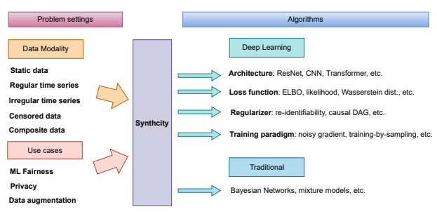
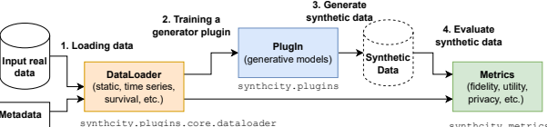

# Synthcity: Facilitating Innovative Use Cases Of Synthetic Data In Different Data Modalities

Zhoazhi Qian zhaozhi.qian@maths.cam.ac.uk DAMTP, University of Cambridge Bogdan-Constantin Cebere *bcc38@cam.ac.uk* DAMTP, University of Cambridge Mihaela van der Schaar *mv472@cam.ac.uk* DAMTP, University of Cambridge The Alan Turing Institute

# Abstract

Synthcity is an open-source software package for innovative use cases of synthetic data in ML fairness, privacy and augmentation across diverse tabular data modalities, including static data, regular and irregular time series, data with censoring, multi-source data, composite data, and more. Synthcity provides the practitioners with a single access point to cutting edge research and tools in synthetic data. It also offers the community a playground for rapid experimentation and prototyping, a one-stop-shop for SOTA benchmarks, and an opportunity for extending research impact. The library can be accessed on GitHub and pip. We warmly invite the community to join the development effort by providing feedback, reporting bugs, and contributing code.

# 1 Synthetic Data Technology Promises To Empower Ai

Access to high quality data is the lifeblood of AI. Although AI holds strong promise in numerous high-stakes domains, the lack of high-quality datasets creates a significant hurdle for the development of AI, leading to missed opportunities. Specifically, three prominent issues contribute to this challenge: data scarcity, *privacy*, and *bias* [Mehrabi et al., 2021, Gianfrancesco et al., 2018, Tashea, 2017, Dastin, 2018]. As a result, the dataset may not be available, accessible, or suitable for building performant and socially responsible AI systems [Sambasivan et al., 2021]. Synthetic data has the potential to fuel the development of AI by unleashing the information in datasets that are small, sensitive or biased. This topic has recently achieved much excitement and attention in the AI community, which led to the proposal of many novel methodologies [Jordon et al., 2018, Yoon et al., 2020, Ho et al., 2021, Mehrabi et al., 2021, van Breugel et al., 2021, Zhu et al., 2017, Yoon et al., 2018, Saxena and Cao, 2021]. In contrast to traditional generative models, whose sole objective is to learn the distribution of the input data, the new class of generators are designed to produce high-fidelity synthetic data while satisfying additional constraints and properties, such as differential privacy [Dwork, 2008], counterfactual fairness [Kusner et al., 2017], and causal invariances [Pearl, 2009]. Training downstream AI algorithms on the synthetic data would imbue them with these desirable properties, thereby providing better privacy, fairness, and robustness.

1

Figure 1: Synthcity covers diverse problem settings by mapping different data modalities and use cases to a host of deep learning and traditional data generation algorithms.

# 2 The Software Challenge For Synthetic Data

Despite the great progress in synthetic data research, its practical application is still in infancy. Much of the difficulty arises from two interlinked challenges in developing software for synthetic data generation, as depicted in Figure 1 and detailed below. 1. The problem settings are diverse. The combination of different *data modalities* and *use cases* creates a large number of problem settings where no single generator (or class of generators) can expect to capture. The datasets in practical applications have diverse modalities ranging from images, videos, and texts to tabular data which can be static, temporal or subject to various types of missingness and censoring. There also exist datasets collected from multiple sources, environments or views. Furthermore, the three main use cases (fairness, privacy and augmentation)
involve different formalism, assumptions and methodology. Hence, while there exist many software libraries that can handle certain specific settings, a general platform that provides solutions to a wide range of problems is still lacking (as shown later in Table 4). This creates an obstacle for wide adoption of synthetic data technology. For instance, a practitioner may very often find that the problem at hand cannot be solved by any of the existing software. In addition, having many specialized software also creates difficulty in software testing and maintenance, which are essential for high stake applications. The practitioner may also find it difficult to trust a library that has only been applied to narrow scenarios by a small user community.

2. The model choice is contextual. The community has developed a large number of generative models in the last decades. However, all models have their unique area of strengths and they encode different prior assumptions and inductive biases [Bond-Taylor et al., 2021]. Hence, it is no surprise that prior works have repeatedly shown that no model consistently performs the best across all data modalities and use cases. For instance, deep generative models, such as GANs, excel at large image datasets, but they may fall short at small tabular data if not carefully trained and regularized. This observation brings the conclusion that practitioners need a big arsenal of methods available at hand to address the diverse problem settings encountered in real applications. Yet, many cutting edge methods are currently implemented in individual code repositories that are not modular, reusable or interoperable. Such repositories are usually made public along with the accepted paper and only implements one or few methods. Although beneficial for reproducibility, these repositories often cannot be easily extended, reused or combined. This creates a significant hurdle for experimenting and comparing different methods or extend them to broader settings. Creating a master repository that superficially collects many individual repositories is not an adequate solution because it does not fundamentally address the interoperability issue. In order to enable wider adoption of synthetic data and facilitate translational research in this promising area, the community needs a software platform that implements a large collection of state-of-the-art generators in a modular, reusable and composable way.

# 3 The Synthcity Library

To address the challenges above, we started the synthcity project, an open-source initiative to create a software platform that facilitates innovative use cases of synthetic data in fairness, privacy and augmentation across diverse data modalities. We are now excited to announce the initial beta release of synthcity library (available on pip and GitHub). Synthcity is the first software library that covers all the major use cases of synthetic data including fairness, privacy, and augmentation in addition to the standard generation task. Furthermore, it also provides a diverse list of evaluation metrics to measure the quality of synthetic data. Last but not least, synthcity contains many utility functions to automate and streamline the workflow (e.g. automatically benchmarking the performance of multiple data generators). In this version, we have focused on the generation of *tabular data* due to its commonality in various industries and applications. Tabular data is widespread in industries where data is based on relational databases including healthcare, finance, manufacturing etc. It is often in these regulated industries that data access is a challenge, making synthetic data beneficial. We also emphasize that
"tabular data" encapsulates many different data modalities, including static tabular data, time series data, and censored survival data, all of which may contain a mix of continuous and discrete features (columns). Synthcity can also handle composite datasets composed of multiple subsets of data. In future versions, we plan to include more data modalities and implements additional generators. Synthcity is a live project under continuous development. We cordially invite the community to join the development effort by submitting comments, bug reports, and pull requests on GitHub.

## 3.1 Overview Of The Synthcity Workflow

The synthcity library captures the entire workflow of synthetic data generation and evaluation.

The typical workflow contains the following steps, as illustrated in Figure 2:
1. **Loading the dataset using a DataLoader**. The DataLoader class provides a consistent interface for loading and storing different types of input data (e.g. tabular, time series, and survival data). The user can also provide meta-data to inform downstream algorithms (e.g. specifying the sensitive columns for privacy-preserving algorithms).

2. **Training the generator using a Plugin**. In synthcity, the users instantiate, train, and apply different data generators via the Plugin class. Each Plugin represents a specific data generation algorithm. The generator can be trained using the fit() method of a Plugin.

synthcity.metrics
Figure 2: Standard workflow of generating and evaluating synthetic data with synthcity.

3. **Generating synthetic data**. After the Plugin is trained, the user can use the generate()
method to generate synthetic data. Some plugins also allow for conditional generation.

4. **Evaluating synthetic data**. Synthcity provides a large set of metrics for evaluating the fidelity, utility, and privacy of synthetic data. The Metrics class allows users to perform evaluation.

In addition, synthcity also has a Benchmark class that wraps around all the four steps, which is helpful for comparing and evaluating different generators. After the synthetic data is evaluated, it can then be used in various downstream tasks.

## 3.2 Data Modalities 3.2.1 Single Dataset

We start by introducing the most fundamental case where there is a single training dataset (e.g. a single DataFrame in Pandas). We characterize the data modalities by two axes: the *observation* pattern and the *feature type*.

The observation pattern describes whether and how the data are collected over time. There are three most prominent patterns, all supported by synthcity:
1. *Static*. All features are observed in a snapshot. There is no temporal ordering.

2. *Regular time series*. Observations are made at regular intervals t ∈ {1, 2*, . . . , T*i}, where Ti ∈ N
∗is the maximum time horizon for series i ∈ [N]. Of note, this implies that different series may have different number of observations.

3. *Irregular time series*. Observations are made at irregular intervals (ti1, ti2*, . . . , t*iTi
), where Ti ∈ N
∗, ∀j ∈ [Ti], tij ∈ R
+, and i ∈ [N] represents different series. Note that, for different series i, the observation times may vary.

The feature type describes the domain of individual features. Synthcity supports the following three types. It also supports multivariate cases with a mixture of different feature types.

1. Continuous feature, x ∈ [*a, b*] ⊂ R, where *a, b* ∈ R are the lower and upper bounds. 2. Categorical feature, x ∈ S, where S is a finite set of allowed categories.

| Obs pattern \feature type   | Continuous   | Categorical   | Integer   | Censored   |
|-----------------------------|--------------|---------------|-----------|------------|
|                             | √            | √             | √         | √          |
| Static                      | √            | √             | √         | √          |
| Regular time series         | √            | √             | √         | √          |
| Irregular time series       |              |               |           |            |

Table 1: synthcity supports combinations of different observation patterns and feature types.

3. Integer feature, x ∈ [*a, b*] ⊂ Z, where *a, b* ∈ Z are the lower and upper bounds.

4. Censored feature, (x, c), where x ∈ R
+ represents the survival time and c ∈ {0, 1} is the censoring indicator.

The combination of observation patterns and feature types give rise to an array of data modalities (as illustrated in Table 1). Synthcity supports all combinations.

## 3.2.2 Composite Dataset

A composite dataset involves multiple sub datesets. For instance, it may contain datesets collected from different sources or domains (e.g. from different countries). It may also contain both static and time series data. Such composite data are quite often seen in practice. For example, a patient's medical record may contain both static demographic information and longitudinal follow up data. synthcity can handle the generation of differnet classes of composite datasets. Currently, it supports (1) multiple static datasets, (2) a static and a regular time series dataset, and (3) a static and a irregular time series dataset.

## 3.2.3 Metadata

Very often we have access to metadata that describes the properties of the underlying data. Synthcity can make use of these information to guide the generation and evaluation process. It supports the following types of metadata:
1. sensitive features: indicator of sensitive features that should be protected for privacy 2. outcome features: indicator of outcome feature that will be used as the target in downstream prediction tasks.

3. domain: information about the data type and allowed value range.

## 3.2.4 Missing Data

Currently, synthcity does not support training and generation of data with missingness. The user needs to first impute the missing data with an additional tool such as HyperImpute [Jarrett et al., 2022] and then present synthcity with the imputed data. We plan to add native support for missing data in future versions of synthcity.

#### 3.3 Use Cases And Algorithms

In this Section, we go through the use cases of synthetic data and the corresponding synthcity Plugins and algorithms.

| Data Modality        | Plugin            | Standard Gen   |    | Privacy   | Fairness   |        |
|----------------------|-------------------|----------------|----|-----------|------------|--------|
|                      |                   | √              | DP | TM        | Balance    | Causal |
|                      | NF                |                |    |           |            |        |
|                      | Bayesian Net      | √              |    |           |            |        |
|                      |                   | √              |    |           | √          |        |
|                      | TVAE              | √              |    |           | √          |        |
|                      | RTVAE             |                |    |           |            |        |
|                      |                   | √              |    |           | √          |        |
| Static               | CTGAN             | √              | √  |           |            |        |
|                      | PrivBayes         | √              | √  |           |            |        |
|                      | DPGAN             |                |    |           |            |        |
|                      |                   | √              | √  |           |            |        |
|                      | PATEGAN           | √              |    | √         |            |        |
|                      | ADSGAN            | √              |    |           |            | √      |
|                      | DECAF             |                |    |           |            |        |
|                      | Survival GAN      | √              |    | √         | √          |        |
|                      |                   | √              |    |           |            |        |
|                      | Survival VAE      | √              |    |           |            |        |
| Static (Censored)    | Survival CTGAN    |                |    |           |            |        |
|                      |                   | √              |    |           |            |        |
|                      | Survival NF       |                |    |           |            |        |
|                      |                   | √              |    |           | √          |        |
|                      | TimeGAN           | √              |    |           |            |        |
| Time Series          | TimeVAE           |                |    |           |            |        |
| (regular, irregular, | FourierFlow*      | √              |    |           |            |        |
|                      |                   | √              |    |           |            |        |
| censored)            | Probabilistic AR* |                |    |           |            |        |
|                      |                   | √              |    |           | √          |        |
| Multi\-source        | RadialGAN         |                |    |           |            |        |

| Static           | Censored               | Time Series       |
|------------------|------------------------|-------------------|
| Fully connected  | Weibull AFT            | LSTM              |
| Residual network | Cox PH                 | GRU               |
|                  | Random Survival Forest | RNN               |
|                  | Survival Xgboost       | Transformer       |
|                  | Deephit                | MLSTM_FCN         |
|                  | Tenn                   | TCN               |
|                  | Date                   | InceptionTime     |
|                  |                        | InceptionTimePlus |
|                  |                        | XceptionTime      |
|                  |                        | ResCNN            |
|                  |                        | OmniScaleCNN      |
|                  |                        | XCM               |

Table 2: Plugins available in synthcity for different data modalities and use cases. Abbreviations: Differential Privacy (DP), Threat Model (TM). *FourierFlow and Probabilistic AR is compatible with regular time series only while TimeGAN and TimeVAE support both.

Table 3: Available network architectures and survival models in synthcity for different data modalities. These components are compatible with multiple algorithms.

## 3.3.1 Standard Data Generation

Standard data generation refers to the most basic generation task, where the synthetic data should be generated as faithful as possible to the real-data distribution. Most existing works on generative modeling fall into this category [Bond-Taylor et al., 2021]. Formally speaking, let X be the random variable of interest (which could be static, temporal or censored). The generator is trained using the training set D = {xi}
N
i=1, where xi ∼ P(X) are sampled from the true (but unknown) distribution. During training, the generator (explicitly or implicitly) learns the distribution Pˆ(X) in order to sample from it. Typically, the training is performed by minimizing certain distributional distance between P(X) and Pˆ(X), such as the Wasserstein distance and KL-divergence. Table 2 lists the plugins in synthcity for different data modalities. All of them support standard generation with appropriate configurations, although some may have additional use cases to be discussed later. Many algorithms above are based on deep neural networks. As such, the user can further specify their network architecture for the problem at hand (for instance, CNNs are better suited for highly frequently sampled time series than LSTM or Transformer). Table 3 lists the network architectures that are compatible with each data modality.

## 3.3.2 Synthetic Data For Ml Fairness

Existing research have considered two different ways where Synthetic data could promote fairness. Table 2 shows the corresponding plugins in synthcity. 1. Balancing distribution. In this setting, certain group(s) of people is underrepresented in the dataset for training downstream ML systems, which may lead to bias [Lu et al., 2018, de Vassimon Manela et al., 2021, Kadambi, 2021]. As a remedy, one could generate synthetic data of the minority group to augment the real data, thereby achieving balance in distribution. This often requires the data generator to learn the conditional distribution P(X|G), where G is the group label. 2. Causal fairness. The second approach is to generate fairer synthetic data from a biased real dataset and to use synthetic data alone in downstream tasks [Zemel et al., 2013, Xu et al., 2018, 2019, van Breugel et al., 2021]. In this setting, it is postulated that the real distribution P(X) reflects existing biases (e.g. unequal access to healthcare). The task for the generator is to learn a distribution Pˆ(X) that is free from such biases but also stay as close to P(X) as possible (to ensure high data fidelity). Typically, notions of causality are employed in the bias removal process. This approach is also compatible with a host of criterion for algorithmic fairness, such as Fairness Through Unawareness, Demographic Parity and Conditional Fairness.

#### 3.3.3 Synthetic Data For Privacy

Methods for generating privacy-preserving synthetic data mainly fall into two categories: the ones that employ differential privacy, and the ones that are designed to defend against specific attack modes. 1. Differential privacy (DP). DP is a formal way to describe how private a data generator is [Dwork, 2008]. Typically, generators with DP property introduces additional noise in the training procedure [Jordon et al., 2022]. For example, adding noise in the gradient or using a noisy discriminator in a GAN architecture [Abadi et al., 2016, Jordon et al., 2018, Long et al., 2019]. It is worth noticing that DP is a formal property of the data generator, rather than the synthetic dataset. Hence, it is difficult to empirically verify if a particular synthetic data is private in a DP sense without knowing the exact data generating procedure. 2. Threat model (TM). While DP focuses on giving formal guarantees, the TM approach is designed for specific threat models, such as membership inference, attribute inference, and re-identification [Shokri et al., 2017, Kosinski et al., 2013, Dinur and Nissim, 2003]. The goodness of a TM-powered generator can be empirically evaluated using simulated attacks. However, such synthetic data are still subject to attack modes that are not considered or still unknown.

## 3.3.4 Cross Domain Augmentation

Here we consider a composite dataset that is collected from multiple domains or sources (e.g. data from different countries). Often one is interested in augmenting one particular data source that suffers from data scarcity issues (e.g. it is difficult to collect data from remote areas) by leveraging other related sources. This challenges has been studied in the deep generative model literature [Antoniou et al., 2017, Dina et al., 2022, Das et al., 2022, Bing et al., 2022]. By learning domain-specific and domainagnostic representations, the generator is able to transfer knowledge across domains, making data augmentation more efficient. Synthcity currently supports this mode of cross-domain generation.

## 3.4 Evaluation Of Synthetic Data

Before releasing or using synthetic data in any downstream task, the quality of the data needs to be evaluated first. Synthetic data evaluation is also important when it comes to the selection and comparison of generative models. Synthcity provides the users with a comprehensive list of metrics to evaluate various aspects of synthetic data. The metrics broadly measures three aspects of synthetic data (outlined below). A full list of metrics can be found in Table 5. Fidelity. The fidelity of synthetic data captures how much the synthetic data resembles real data. The fidelity metrics typically evaluate the closeness between the true distribution P and the distribution learned by the generator Pˆ using samples from these two distributions. Synthcity supports distributional divergence measures (e.g. Jensen-Shannon distance, Wasserstein distance, and maximal mean discrepancy) as well as two sample detection scores (i.e. using a classifier to distinguish real verses synthetic data) [Snoke et al., 2018]. Utility. The utility of synthetic data reflects how useful the synthetic data is to a downstream task. This captures the common scenario of train-on-synthetic evaluate-on-real [Beaulieu-Jones et al., 2019]. Synthcity supports various types of downstream tasks, including regression, classification and survival analysis. In addition to linear models, synthcity supports xgboost and neural nets as downstream models due to their wide adoption in analytics. Privacy. Synthcity includes a list of well-established privacy metrics (e.g. k-anonymity and ldiversity). Furthermore, it can measure privacy of data by performing simulated privacy attack (e.g. re-identification attack). The success (or failure) of such attack quantifies the degree of privacy preservation.

# 4 Comparison With Existing Libraries

In this section, we compare synthcity with other popular open source libraries for synthetic data. Table 4 shows that synthcity supports much broader data modalities and use cases than the alter-

| Setting \Software     | Synthcity   | YData   | Gretel   | SDV   | DataSynthesizer   | SmartNoise   | nbsynthetic   |
|-----------------------|-------------|---------|----------|-------|-------------------|--------------|---------------|
| Data modalities       | √           | √       | √        | √     | √                 | √            | √             |
| Static data           | √           | √       | √        | √     |                   |              |               |
| Regular time series   | √           |         |          |       |                   |              |               |
| Irregular time series | √           |         |          |       |                   |              |               |
| Censored features     | √           |         |          | √     |                   |              |               |
| Composite data        |             |         |          |       |                   |              |               |
| Use cases             | √           | √       | √        | √     | √                 | √            | √             |
| Generation            | √           | √       | √        | √     |                   |              | √             |
| Fairness (balance)    | √           |         |          |       |                   |              |               |
| Fairness (causal)     | √           |         | √        |       |                   | √            |               |
| Privacy (DP)          | √           |         |          |       |                   |              |               |
| Privacy (TM)          | √           |         |          |       |                   |              |               |
| Cross domain aug.     |             |         |          |       |                   |              |               |

Table 4: The data modalities and use cases supported by synthcity and other open source synthetic data libraries. Comparisons are based on the software versions available at the time of writing.

natives. A more detailed comparison of the supported data generators and evaluation metrics are available in Table 2 and 5.

# 5 Example Usage Scenarios

To better contextualize the utility of synthcity, here we conceive several illustrative use cases in different industries. This is by no means a comprehensive list, and we encourage the reader to come up with other usage scenarios and share the story with us.

#### 5.1 De-Biasing Medical Datasets To Build Better And Fairer Prognostic Scores

Electronic health records (EHR) and biobanks can be used by medical researchers to build disease prognostic scores. Such scores allow the healthcare service to allocate medical resources more efficiently (e.g. performing triage). They can also inform the design and execution of clinical trials (e.g. stratifying patient population). However, EHR and biobanks may often under-represent certain populations (e.g. the ones with less privileged access to health service). As a result, naively building prognostic scores on these data may lead to undesirable and unfair decisions. To mitigate the bias, one may re-balance the real data by augmenting it with synthetically generated minority groups. Synthcity facilitates this use case by providing a variety of standard, conditional, and multi-domain generative models as well as tools for evaluating the synthetic data.

## 5.2 Using Synthetic Multi-Source Data To Select The Target Audience Of Marketing Campaigns

To maximize the performance of a digital marketing campaign, the marketeer needs to locate the right customer segment to display the ad. This requires analyzing historical data from different segments. However, the data might be scarce for certain customer segments (e.g. the VIP users) and cannot fully support the analytics. In this case, one may consider augmenting the data using knowledge from other segments. Synthcity supports cross-domain data augmentation with deep

| Aspect   | Evaluation Metric \Software                    | Synthcity   | YData   | Gretel   | SDV   | DataSynthesizer   | SmartNoise   | nbsynthetic   |
|----------|------------------------------------------------|-------------|---------|----------|-------|-------------------|--------------|---------------|
|          | Jensen\-Shannon distance                       | √  √        |         |          |       |                   |              |               |
|          | Wasserstein distance                           |             |         |          |       |                   |              |               |
|          | Total variation distance                       | √           |         |          | √     |                   |              |               |
|          | KL divergence                                  |             |         |          | √     |                   |              |               |
|          | Skewness  Max\-mean discrepancy                | √           |         |          |       |                   |              | √             |
|          |                                                | √           |         |          | √     |                   |              | √             |
|          | KS test PRDC                                   | √           |         |          |       |                   |              |               |
| Fedelity |                                                | √           |         |          |       |                   |              |               |
|          | Alpha–precision                                | √           |         |          |       |                   |              |               |
|          | Survival Kaplan\-Meier dist. Detection: linear | √           |         |          | √     |                   |              |               |
|          | Detection: NN                                  | √           |         |          |       |                   |              |               |
|          |                                                | √           |         |          |       |                   |              |               |
|          | Detection: XGB Detection: GMM                  | √           |         |          | √     |                   |              |               |
|          | Detection: Bayesian                            |             |         |          | √     |                   |              |               |
|          | Linear model                                   | √           |         |          | √     |                   |              |               |
|          |                                                | √           |         |          | √     |                   |              |               |
|          | MLP  XGBoost                                   | √           |         |          | √     |                   |              |               |
| Utility  | Static survival                                | √           |         |          |       |                   |              |               |
|          |                                                | √           |         |          |       |                   |              |               |
|          | Time\-series  Survival time\-series            | √           |         |          |       |                   |              |               |
|          | Correct attribution prob. K\-anonymity         | √ √  √      |         |          | √     |                   |              |               |
| Privacy  | K\-map  Delta\-presence                        | √  √        |         |          |       |                   |              |               |
|          | L\-diversity  Identifiability score            | √           |         |          |       |                   |              |               |

Table 5: The evaluation metrics supported by synthcity and other open source synthetic data libraries. Comparisons are based on the software versions available at the time of writing.

generative models. The augmented synthetic data can then be combined with real data to inform the campaign setup.

## 5.3 Outsourcing Analytics To Contractors Or The Open Science Community

The data holder may be interested in outsourcing the analytical modeling task to a contractor or the open science community (e.g. running a data science competition). However, the data holder cannot share real data with these external parties due to the sensitivity of data. A possible solution is to use the privacy-preserving generators in synthcity to create synthetic datasets. After evaluating the datasets in terms of fidelity and privacy, the data holder may share the synthetic data to the external parties to build the analytical models. The trained models can then be transferred to the data holders for evaluation and deployment on real data.

# 6 Further Involvement In The Synthcity Project

We welcome the practitioners, researchers, and open source community to further engage in the synthcity project. We will run a series of tutorials and labs in the coming months to demonstrate the practical utility of synthcity. If you would like to stay tuned for the upcoming events and releases, please sign up for our mailing list.

| Algorithm \Software   | Synthcity   | YData   | Gretel   | SDV   | DataSynthesizer   | SmartNoise   | nbsynthetic   |
|-----------------------|-------------|---------|----------|-------|-------------------|--------------|---------------|
|                       | √           | √       |          | √     |                   |              | √             |
| CTGAN                 |             |         | √        |       |                   |              |               |
| ACTGAN                | √           |         |          | √     |                   |              |               |
| TVAE                  | √           |         |          |       |                   |              |               |
| Bayesian Network      | √           |         |          |       |                   |              |               |
| Normalizing Flows     | √           |         |          |       |                   |              |               |
| Survial GAN           | √           |         |          |       |                   |              |               |
| Survival VAE          |             |         | √        |       |                   |              |               |
| DoppelGANger          | √           | √       |          |       |                   |              |               |
| TimeGAN               | √           |         |          |       |                   |              |               |
| FourierFlows          | √           |         |          | √     |                   |              |               |
| Probabilistic AR      | √           |         |          |       |                   |              |               |
| DECAF                 | √           |         |          |       |                   |              |               |
| RadialGAN             | √           |         |          |       |                   |              |               |
| ADSGAN                | √           |         | √        |       |                   | √            |               |
| DPGAN                 | √           |         |          |       |                   | √            |               |
| PATEGAN               | √           |         |          |       | √                 |              |               |
| PrivBayes             |             |         |          |       |                   |              |               |

Table 6: The data generating algorithms supported by synthcity and other open source synthetic data libraries. Comparisons are based on the software versions available at the time of writing.

We are keen to receive your comments and feedback. Together, we can build a software to better extract the potentials of synthetic data technology.

# References

Martín Abadi, Andy Chu, Ian Goodfellow, H Brendan Mcmahan, Ilya Mironov, Kunal Talwar, and Li Zhang. Deep Learning with Differential Privacy. Proceedings of the 2016 ACM SIGSAC Conference on Computer and Communications Security, 2016. doi: 10.1145/2976749. URL
http://dx.doi.org/10.1145/2976749.2978318.

Antreas Antoniou, Amos Storkey, and Harrison Edwards. Data Augmentation Generative Adversarial Networks. 11 2017. URL http://arxiv.org/abs/1711.04340.

Brett K Beaulieu-Jones, Zhiwei Steven Wu, Chris Williams, Ran Lee, Sanjeev P Bhavnani, James Brian Byrd, and Casey S Greene. Privacy-preserving generative deep neural networks support clinical data sharing. *Circulation: Cardiovascular Quality and Outcomes*, 12(7):e005122, 2019.

Simon Bing, Andrea Dittadi, Stefan Bauer, and Patrick Schwab. Conditional Generation of Medical Time Series for Extrapolation to Underrepresented Populations. 2022.

Sam Bond-Taylor, Adam Leach, Yang Long, and Chris G. Willcocks. Deep Generative Modelling: A Comparative Review of VAEs, GANs, Normalizing Flows, Energy-Based and Autoregressive Models. *IEEE Transactions on Pattern Analysis and Machine Intelligence*, 3 2021. doi: 10.1109/TPAMI.2021.3116668. URL http://arxiv.org/abs/2103.04922http:
//dx.doi.org/10.1109/TPAMI.2021.3116668.

Hari Prasanna Das, Ryan Tran, Japjot Singh, Xiangyu Yue, Geoffrey Tison, Alberto Sangiovanni-
Vincentelli, and Costas J Spanos. Conditional synthetic data generation for robust machine learning applications with limited pandemic data. In Proceedings of the AAAI Conference on Artificial Intelligence, volume 36, pages 11792–11800, 2022.

Jeffrey Dastin. Amazon scraps secret AI recruiting tool that showed bias against women. *Reuters*,
2018.

Daniel de Vassimon Manela, David Errington, Thomas Fisher, Boris van Breugel, and Pasquale Minervini. Stereotype and Skew: Quantifying Gender Bias in Pre-trained and Fine-tuned Language Models. In Proceedings of the 16th Conference of the European Chapter of the Association for Computational Linguistics: Main Volume, pages 2232–2242, Online, 4 2021. Association for Computational Linguistics. URL https://www.aclweb.org/anthology/2021.eacl-main.190.

Ayesha S. Dina, A. B. Siddique, and D. Manivannan. Effect of Balancing Data Using Synthetic Data on the Performance of Machine Learning Classifiers for Intrusion Detection in Computer Networks. 4 2022. doi: 10.48550/arxiv.2204.00144. URL https://arxiv.org/abs/2204.00144v1.

Irit Dinur and Kobbi Nissim. Revealing information while preserving privacy. In Proceedings of the twenty-second ACM SIGMOD-SIGACT-SIGART symposium on Principles of database systems, pages 202–210, 2003.

Cynthia Dwork. Differential privacy: A survey of results. In International conference on theory and applications of models of computation, pages 1–19. Springer, 2008.

Milena A Gianfrancesco, Suzanne Tamang, Jinoos Yazdany, and Gabriela Schmajuk. Potential biases in machine learning algorithms using electronic health record data. *JAMA internal medicine*, 178(11):1544–1547, 2018.

Stella Ho, Youyang Qu, Bruce Gu, Longxiang Gao, Jianxin Li, and Yong Xiang. Dp-gan: Differentially private consecutive data publishing using generative adversarial nets. Journal of Network and Computer Applications, 185:103066, 2021.

Daniel Jarrett, Bogdan C Cebere, Tennison Liu, Alicia Curth, and Mihaela van der Schaar. Hyperimpute: Generalized iterative imputation with automatic model selection. In International Conference on Machine Learning, pages 9916–9937. PMLR, 2022.

James Jordon, Jinsung Yoon, and Mihaela Van Der Schaar. Pate-gan: Generating synthetic data with differential privacy guarantees. In *International conference on learning representations*, 2018.

James Jordon, Lukasz Szpruch, Florimond Houssiau, Mirko Bottarelli, Giovanni Cherubin, Carsten Maple, Samuel N. Cohen, and Adrian Weller. Synthetic Data - what, why and how? 5 2022. doi: 10.48550/arxiv.2205.03257. URL https://arxiv.org/abs/2205.03257v1.

Achuta Kadambi. Achieving fairness in medical devices. *Science*, 372(6537):30–31, 2021. Michal Kosinski, David Stillwell, and Thore Graepel. Private traits and attributes are predictable from digital records of human behavior. *Proceedings of the national academy of sciences*, 110 (15):5802–5805, 2013.

Matt J Kusner, Joshua Loftus, Chris Russell, and Ricardo Silva. Counterfactual fairness. *Advances* in neural information processing systems, 30, 2017.

Yunhui Long, Boxin Wang, Zhuolin Yang, Bhavya Kailkhura, Aston Zhang, Carl A. Gunter, and Bo Li. G-PATE: Scalable Differentially Private Data Generator via Private Aggregation of Teacher Discriminators. In *Advances in Neural Information Processing Systems*, 6 2019. doi: 10.48550/arxiv.1906.09338. URL https://arxiv.org/abs/1906.09338v2.

Kaiji Lu, Piotr Mardziel, Fangjing Wu, Preetam Amancharla, and Anupam Datta. Gender Bias in Neural Natural Language Processing. CoRR, abs/1807.11714, 2018. URL http://arxiv.org/
abs/1807.11714.

Ninareh Mehrabi, Fred Morstatter, Nripsuta Saxena, Kristina Lerman, and Aram Galstyan. A
survey on bias and fairness in machine learning. *ACM Computing Surveys (CSUR)*, 54(6):1–35, 2021.

Judea Pearl. *Causality*. Cambridge university press, 2009. Nithya Sambasivan, Shivani Kapania, Hannah Highfill, Diana Akrong, Praveen Paritosh, and Lora M Aroyo. "everyone wants to do the model work, not the data work": Data cascades in high-stakes ai. In proceedings of the 2021 CHI Conference on Human Factors in Computing Systems, pages 1–15, 2021.

Divya Saxena and Jiannong Cao. Generative adversarial networks (gans) challenges, solutions, and future directions. *ACM Computing Surveys (CSUR)*, 54(3):1–42, 2021.

Reza Shokri, Marco Stronati, Congzheng Song, and Vitaly Shmatikov. Membership inference attacks against machine learning models. In 2017 IEEE symposium on security and privacy
(SP), pages 3–18. IEEE, 2017.

Joshua Snoke, Gillian M Raab, Beata Nowok, Chris Dibben, and Aleksandra Slavkovic. General and specific utility measures for synthetic data. Journal of the Royal Statistical Society: Series A (Statistics in Society), 181(3):663–688, 2018.

Jason Tashea. Courts Are Using AI to Sentence Criminals. That Must Stop Now. *WIRED*, 4 2017. URL https://www.wired.com/2017/04/
courts-using-ai-sentence-criminals-must-stop-now/.

Boris van Breugel, Trent Kyono, Jeroen Berrevoets, and Mihaela van der Schaar. Decaf: Generating fair synthetic data using causally-aware generative networks. Advances in Neural Information Processing Systems, 34:22221–22233, 2021.

Depeng Xu, Shuhan Yuan, Lu Zhang, and Xintao Wu. Fairgan: Fairness-aware generative adversarial networks. In *2018 IEEE International Conference on Big Data (Big Data)*, pages 570–575, 2018.

Depeng Xu, Yongkai Wu, Shuhan Yuan, Lu Zhang, and Xintao Wu. Achieving causal fairness through generative adversarial networks. In IJCAI International Joint Conference on Artificial Intelligence, volume 2019-August, pages 1452–1458. International Joint Conferences on Artificial Intelligence, 2019. ISBN 9780999241141. doi: 10.24963/ijcai.2019/201.

Jinsung Yoon, James Jordon, and Mihaela Schaar. Radialgan: Leveraging multiple datasets to improve target-specific predictive models using generative adversarial networks. In International Conference on Machine Learning, pages 5699–5707. PMLR, 2018.

Jinsung Yoon, Lydia N Drumright, and Mihaela Van Der Schaar. Anonymization through data synthesis using generative adversarial networks (ads-gan). *IEEE journal of biomedical and health* informatics, 24(8):2378–2388, 2020.

Rich Zemel, Yu Wu, Kevin Swersky, Toni Pitassi, and Cynthia Dwork. Learning fair representations.

In *International conference on machine learning*, pages 325–333, 2013.

Jun-Yan Zhu, Taesung Park, Phillip Isola, and Alexei A Efros. Unpaired image-to-image translation using cycle-consistent adversarial networks. In Proceedings of the IEEE international conference on computer vision, pages 2223–2232, 2017.