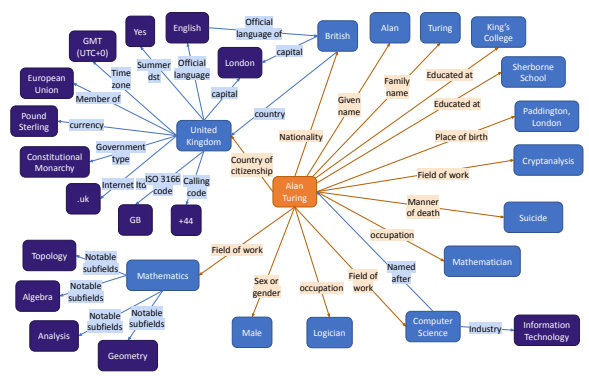
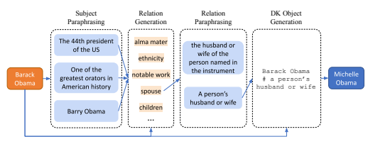
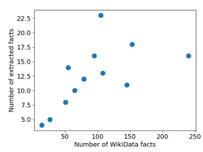
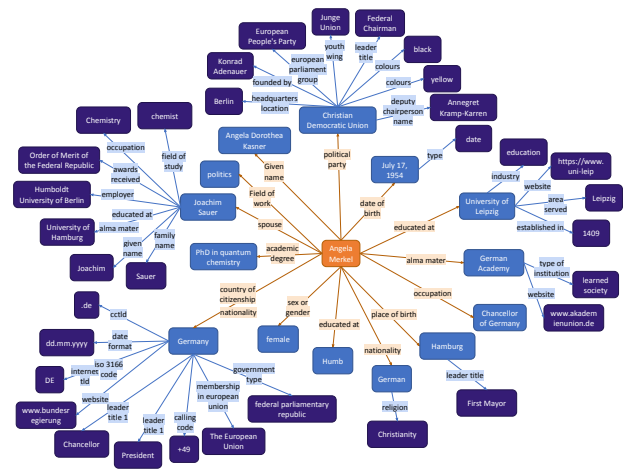
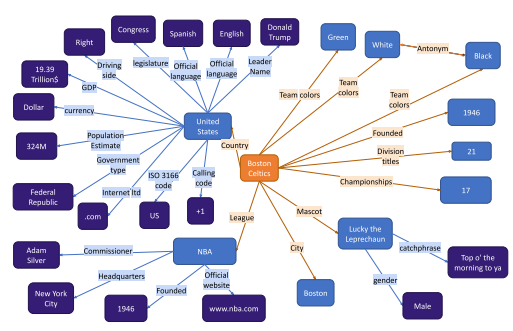

# Crawling The Internal Knowledge-Base Of Language Models

Roi Cohen1 Mor Geva2∗ Jonathan Berant1 **Amir Globerson**1 1Blavatnik School of Computer Science, Tel Aviv University 2Allen Institute for AI
roi1@mail.tau.ac.il, pipek@google.com, joberant@cs.tau.ac.il, gamir@tauex.tau.ac.il

# Abstract

Language models are trained on large volumes of text, and as a result their parameters might contain a significant body of factual knowledge. Any downstream task performed by these models implicitly builds on these facts, and thus it is highly desirable to have means for representing this body of knowledge in an interpretable way. However, there is currently no mechanism for such a representation. Here, we propose to address this goal by extracting a knowledge-graph of facts from a given language model. We describe a procedure for
"crawling" the internal knowledge-base of a language model. Specifically, given a seed entity, we expand a knowledge-graph around it. The crawling procedure is decomposed into sub-tasks, realized through specially designed prompts that control for both precision (i.e., that no wrong facts are generated) and recall (i.e., the number of facts generated). We evaluate our approach on graphs crawled starting from dozens of seed entities, and show it yields high precision graphs (82-92%), while emitting a reasonable number of facts per entity.

# 1 Introduction

Modern language models (LMs) (Raffel et al., 2020; Brown et al., 2020) are trained on vast amounts of text that captures much of human knowledge, including scientific articles, Wikipedia, books, and other sources of information (Gao et al., 2020). Consequently, such models encode world knowledge in their parameters, allowing them to generate rich and coherent outputs.

Past work has illustrated LMs can be viewed as knowledge-bases (Petroni et al., 2019) as well as analyzed the encoded knowledge (e.g., see AlKhamissi et al., 2022) and leveraged it for applications such as closed-book QA (Roberts et al., 2020; Brown et al., 2020) and search (Tay et al., 2022), illustrating LMs can be viewed as knowledge-bases (Petroni et al., 2019). But what are the facts stored in the internal knowledge bases of modern LMs, and how can these be represented explicitly? This is the challenge we address in this work. Our motivation is to obtain an interpretable and transparent representation that will allow humans to inspect what the LM knows, what it does not know, why it makes certain mistakes, and what are the biases it encodes. Moreover, with such a representation, one can leverage general-purpose tools, such as query languages, for interacting with this knowledge.

The first question in this endeavour is what is a suitable explicit knowledge representation. A natural candidate structure is a knowledge graph
(KG). Namely, a graph whose nodes are entities and whose edges represent relations between entities. KGs are appealing since information can be readily "read-off" from the graph, they can be reliably queried, and different KGs can be easily compared. KGs have been extensively used to represent knowledge (Bollacker et al., 2008; Vrandeciˇ c and ´
Krötzsch, 2014), but a key limitation is their low coverage, as they usually require manual curation and depend on a closed schema. Conversely, LMs might have very high coverage as they are trained on a vast body of knowledge represented as raw text. We thus ask if it is possible to convert an LM to a KG, such that we enjoy its advantages while achieving high coverage.

As the full KG encoded in an LM can be large, we reduce the problem to the task of constructing a KG around a given seed entity. For example, Fig. 1 shows a KG extracted by our method for the seed entity *Alan Turing*. This can be viewed as a crawling procedure which starts from the seed entity and recursively expands it to expose additional facts. This crawling problem introduces several new challenges. First, unlike prior work (Petroni et al., 2019; Alivanistos et al., 2022; Hao et al., 2022), we are given only *an entity*, without know-

∗ Now at Google Research.

Figure 1: An example of a generated depth-2 knowledge graph around the seed entity ALAN TURING, applying LMCRAWL (see Sec. 3-Sec. 4). Additional graphs are in Sec. E.

ing what relations are associated with it. Thus, we have to extract those relations and then find the objects for each relation. Second, KGs are expected to exhibit very high precision, and thus it is necessary to generate as many relevant facts as possible while maintaining almost perfect factual correctness.1 We address the above challenges by decomposing crawling into multiple sub-tasks, and handle each task using few-shot in-context learning (Brown et al., 2020). Explicitly, we do not fine-tune a model, but instead manually design a prompt and a few examples for each task, an approach recentlyproven successful (Wei et al., 2022; Drozdov et al.,
2022; Chowdhery et al., 2022; Khot et al., 2022).

We use the following sub-tasks (see Tab. 1 for the full list and examples). First, given an entity e (e.g.,
ALAN TURING), we generate the relations relevant for e (e.g., EDUCATED AT, PLACE OF BIRTH). Second, for each entity e and relation r, we generate the corresponding set of objects O and add to the KG triplets (*e, r, o*) for each o ∈ O. For example, for ALAN TURING and EDUCATED AT, we generate triplets with the *objects* KING'S COLLEGE and SHERBORNE SCHOOL. To maintain high precision, we prompt the model to emit *"Don't know"* whenever it is not confident about the target objects. All the above outputs are generated through in-context learning, where we use the WIKIDATA KG (Vrandeciˇ c and Krötzsch ´ , 2014) to construct in-context examples. *Don't know* examples are constructed by finding true facts in WIKIDATA that are unknown to the LM. Finally, we increase recall by prompting the LM to generate paraphrases for entities and relations, and use those to obtain additional triplets.

We test our approach with GPT-3
(text-davinci-002) on 140 seed entities, and show that we can extract accurate KGs
(∼82-92% precision) that contain a plausible number of facts per entity. Importantly, large LMs are not constrained to a predefined schema, and indeed our procedure with GPT-3 generates facts outside the schema of WIKIDATA, e.g., (BOSTON CELTICS, CHAMPIONSHIPS, 17).

To conclude, our contributions are: 1) Formulating the problem of crawling a KG from an LM, 2) Presenting a prompt-based approach that decomposes the problem into multiple sub-tasks, and 3) Evaluating the approach with GPT-3, which leads to high-precision graphs.

1We note that there is a deeper philosophical aspect to this issue, which is at the core of the field of epistemology.

Namely, what does it mean for a model to "believe" a fact, as opposed to the model "knowing" a fact. Here we adopt a
"dispositional" view of belief, whereby a belief corresponds to a statement by the model, and knowledge is a belief that is true in the world.

# 2 Problem Setup

Our goal is to uncover the knowledge-base of a given LM. We represent a knowledge-base via a KG, which is a collection of triplets. Formally, a KG is a graph G = (*N, R, E*), where N is a set of entities, R is a set of relations, and E is a set of subject-relation-object triplets (*s, r, o*) where s, o ∈ N and r ∈ R.

To simplify the setup, we assume we are given a "seed entity" around which we will expand the graph (for example Fig. 1). Conceptually, we can also let the LM generate seed entities, but we argue seed expansion is a more realistic scenario, where a user is interested in a graph about a certain entity.

Entities and relations are represented via strings and are not constrained to a given vocabulary (similar to open information extraction. e.g., see Vo and Bagheri, 2017).

# 3 Crawling Kgs Via Prompting

The core component of our approach is a procedure that takes an entity e, and extracts all relations associated with it, and the corresponding objects. Namely, we expand the KG around this entity. We can then recursively apply this procedure to further expand the KG. We refer to this as 'entity expansion', and break it into two high-level steps: - **Relation generation** (Sec. 3.1): For an entity e, generate a set of relations R, where e is the

subject.

- **Object generation** (Sec. 3.3-Sec. 3.4): Given the entity e and the relation set R, find the corresponding objects. Namely, for each r ∈ R, find a list of entities O such that (*e, r, o*) is in the KG
for o ∈ O. We consider lists since many relations (e.g., CHILDREN) potentially have multiple correct objects. Furthermore, we also consider the case where the object corresponding to (*e, r*) is unknown to the model (e.g., the model does not know who is the daughter of a given entity e). In this case we take O to be empty, and the edge is not added to the KG. This is crucial for maintaining a high-precision KG.

Both steps are achieved via few-shot in-context learning. Namely, we construct prompts with incontext examples (stay fixed throughout the process) that exhibit the desired behaviour (Tab. 1).

To improve recall, we employ an additional paraphrasing procedure (Sec. 3.2 and Sec. 3.5), which generates alternative strings for a given entity or relation. For example, the entity WILLIAM CLINTON
can be referred to as WILLIAM JEFFERSON CLIN-
TON or BILL CLINTON, and the relation OCCU-
PATION may be expressed as PROFESSION. Thus, we run object and relation generation for all these variants, and pool the results to construct the final graph. Paraphrases are also obtained through the LM, without use of external knowledge. The entire flow is illustrated in Fig. 2, and we next elaborate on each of the components.

#### 3.1 Relation Generation

Our task is to generate a set of relations R for a given subject entity e. To achieve this, we leverage WIKIDATA to construct in-context examples. Specifically, we pick a list of WIKIDATA entities e1*, . . . , e*Kr and for each entity ei, extract its set of WIKIDATA relations. This results in Kr in-context examples for relation generation. We concatenate the target entity to the in-context examples, feed this prompt to the LM and use its output as the set R for e. Tab. 1 shows an example prompt. We note that this generation process can produce relations that are not included in the prompt, and are not part of WIKIDATA at all.2 Full prompt with in-context examples is presented in Sec. B.1.

#### 3.2 Relation Paraphrasing

A relation r may be described in multiple ways, and the LM might work better with some of these paraphrases (Jiang et al., 2021). Thus, we use a procedure to obtain a set of paraphrases of r, denoted by P(r), and run all downstream crawling tasks for all strings in P(r).

For relation paraphrasing we find that in-context examples are not necessary and an instruction prompt is sufficient. Tab. 1 shows a specific example under the sub-task "Relation Paraphrasing". See Sec. A.1 for the three prompts and more technical details.

#### 3.3 Object Generation

Our next goal is, for each r ∈ R, to generate a set of objects O such that (*e, r, o*) is in the KG
for all o ∈ O. Importantly, we should also let the LM declare it does not know the object, and thus O would be empty. In this case, no edge will be added to the output KG.

2For example, when the subject is a sports team, the model repeatedly generated a relation regarding its MASCOT or LARGEST WIN, which are facts outside of WIKIDATA.

| Sub\-task    | Query        |       | Prompt                                                                                                                |    | Expected Output                 |       |
|--------------|--------------|-------|-----------------------------------------------------------------------------------------------------------------------|----|---------------------------------|-------|
| Relation     | Philippines  |       | Q: René Magritte A: ethnic group, place of birth, place                                                               | #  | leader                          | name  |
| Generation   |              |       | of death, sex or gender, spouse, country of citizenship,  member  of  political  party,  native  language,  place  of |    | cctld # capital  # calling code |       |
|              |              |       | burial,  cause  of  death,  residence,  family  name,  given                                                          |    |                                 |       |
|              |              |       | name, manner of death, educated at, field of work, work                                                               |    |                                 |       |
|              |              |       | location, represented  by Q: Stryn  A: significant event,                                                             |    |                                 |       |
|              |              |       | head  of  government,  country,  capital,  separated  from                                                            |    |                                 |       |
|              |              |       | Q: Philippines A:                                                                                                     |    |                                 |       |
| Pure  Object | Barack       | Obama | Q:  Monte  Cremasco  #  country  A:  Italy  Q: Johnny  Depp  #                                                        | #  | Sasha                           | Obama |
| Generation   | # child      |       | children A: Jack Depp # Lily\-Rose Depp Q: Wolfgang Sauseng                                                           |    | Malia Obama                     |       |
|              |              |       | #  employer  A:  University of  Music  and  Performing  Arts                                                          |    |                                 |       |
|              |              |       | Vienna Q: Barack Obama # child A:                                                                                     |    |                                 |       |
| DK  Object   | Queen        |       | Q:  Heinrich Peters # occupation A: Don't know Q:  Monte                                                              |    | Don't know                      |       |
| Generation   | Elizabeth    |       | Cremasco # country A: Italy Q: Ferydoon Zandi # place of                                                              |    |                                 |       |
|              | II # date of |       | birth A: Don't know Q: Hans Ertl # sport A: mountaineering                                                            |    |                                 |       |
|              | death        |       | Q: Queen Elizabeth II # date of death A:                                                                              |    |                                 |       |
| Subject      | Alan Turing  |       | Alan Turing is also known as:                                                                                         | of | The  father                     |       |
| Paraphrasing |              |       |                                                                                                                       |    | computing                       |       |
| Relation     | notable work |       | 'notable work' may be described as                                                                                    |    | a work of 'great                |       |
| Paraphrasing |              |       |                                                                                                                       |    | value' or a work                |       |
|              |              |       |                                                                                                                       |    | of 'importance'                 |       |

Table 1: The full list of sub-tasks in our approach, where for each sub-task we provide its name, a query, a corresponding prompt, and the expected output. In 'DK Object Generation' the prompt declares in one of the in-context examples that the model does not know the place of birth of Ferydoon Zandi, since querying for it leads to a wrong answer (the query with the wrong answer isn't shown).

We first explain prompt construction without the use of *"Don't Know"* output, and refer to this as "Pure Object Genration". We take Ko entities e1*, . . . , e*Kofrom WIKIDATA. For each entity ei, we choose one of its relations ri, and all the objects Oi for this entity-relation pair in WIKIDATA. This creates Ko examples for object generation. Similar to relation generation, the target entity-relation pair is concatenated to the Ko examples, and the list of objects is parsed from the generated LM output (see exact format in Tab. 1, under the sub-task
"Pure Object Generation", and the full prompt with in-context examples in Sec. B.2). Recall that for each relation, we have multiple paraphrases. To maintain high precision, we only accept objects that were generated by at least two realizations of the relation.

#### 3.4 Learning To Output **"Don'T Know"**

A key desideratum for KGs is high precision, namely the facts in the graph should be correct with high probability. Towards this end, we want to prompt the LM to output *"Don't Know"* (DK)
for facts where it is likely to make an error.3 But how do we know what the model does not know? To capture this, we find cases where the LM outputs erroneous facts, and use these to construct in-context examples with a DK target. For example, suppose we run 'Pure Object Generation' with e = BILL CLINTON and r = CHILDREN and the model outputs O = KLAY THOMPSON. We deduce that the model does not know who Clinton's children are, and therefore, can add the example ei = BILL CLINTON, ri = CHILDREN, oi =
Don't know to the prompt. In other words, we find examples where oiis *Don't know* through cases where the model errs on its predicted objects. We then construct a prompt with a total of Kdk examples, half of which are failure cases where with oi = *Don't know* and the other half are correct predictions. We refer to this as "DK Object Generation". See the corresponding row in Tab. 1 and the full prompt with in-context examples in Sec. B.3.

#### 3.5 Subject Paraphrasing

Similar to relations, an entity e may have several names, and it may be easier for the LM to complete the triplet (*e, r,* ?) with one of these. Thus, we take a paraphrasing approach to extend an entity name e into a set P(e). The procedure is identical prompt's goal is to encourage generation of correct outputs.

3A model might make an error because it is not confident about the answer, or because its training data contains false facts. In this work, we are agnostic to this distinction and our

Figure 2: An illustration of the full method for crawling a subgraph (LMCRAWL), starting from BARACK OBAMA as the subject, until obtaining the triplet (BARACK OBAMA, SPOUSE, MICHELLE OBAMA).

to relation paraphrasing (Sec. 3.2), except we use a single prompt instructing the LM to complete the sentence "s is also known as", where s is the subject. To increase the number of paraphrases, we sample from the model three times, resulting in up to three paraphrases.

Both here and in Relation Paraphrasing
(Sec. 3.2), the LM occasionally generates nonsensical paraphrases. Nevertheless, the DK method handles those cases well, outputting *"Don't know"* for most of them. Thus, we argue that paraphrasing combined with DK emission is an effective approach for controlling recall and precision.

#### 3.6 Lmcrawl

Fig. 2 shows the application of the complete pipeline (which we refer to as LMCRAWL) for the entity BARACK OBAMA. First, we obtain all paraphrases for e (Sec. 3.5). Then, we extract all relations for these (Sec. 3.1). Next, we paraphrase relations (Sec. 3.2). Finally, we extract the known objects for these relations (Sec. 3.3-Sec. 3.4).

# 4 Experimental Setup

As mentioned in Sec. 3, we use WIKIDATA
(publicly available) in constructing the in-context prompts. The number of in-context examples is Kr = 7, Ko = 8, Kdk = 10.

Additionally, we use WIKIDATA to select seed entities for evaluating our approach. For these seeds, we consider the task of constructing KGs around the corresponding entities.

We split the seed entities into a validation set
(20 entities), which is used to make design choices (e.g., choosing prompt format), and a test set (120 entities), which is used only for the final evaluation.

For the development set, we manually chose 20 entities from WIKIDATA. These included women and men with various professions, cities, countries, and various cultural entities such as movies and books. We also aimed to reprsent both head and tail entities in this list.

To construct our test set, we defined 25 specific world-entities related categories, which we refer to as the *test categories*. Some of these were more specific, such as *AI Researchers*, and some are more general, such as *Scientists* (see Table.6 for the full list). We chose 4 seeds out of each category as follows. We first sorted the set of entities of each group based on the number of WIKIDATA
facts associated with them (we view this count as an approximate measure of popularity). Then, we randomly sampled two entities out of the full list, and an additional two out of the first 1000. Intuitively, the first two represent tail entities, while the other two represents head ones. Thus we ended up with 100 seed entities (i.e., 4 different entities out of each of the 25 different subgroups). We refer to these as the *main test set* (see Tab. 6). We created an additional test set of 20 entities that is meant to contain very popular entities. Its entities were randomly sampled out of a set of size 1000, which was manually constructed by choosing 40 very well-known entities (i.e., that all people would know) from each of the 25 test categories.

All 140 entities were not used in the construction of any of the prompts in Sec. 3. Tab. 2 shows the full list of validation and head test entities.

Evaluation metrics Given an entity s, our entity expansion process returns a knowledge graph G,
that contains the entity s, other entities and relations between them.

| Dev Seeds                | Head Test Seeds        |
|--------------------------|------------------------|
| ABBA                     | Aristotle              |
| Alan Turing              | Canada                 |
| Angela Merkel            | Celine Dion            |
| Augustin\-Louis Cauchy   | China                  |
| Barack Obama             | Emanuel Macron         |
| Bob Dylan                | Franz Kafka            |
| Boston Celtics           | Grease                 |
| David Bowie              | Hamlet                 |
| Diana, Princess of Wales | Jacinda Ardern         |
| Eike von Repgow          | Lionel Messi           |
| Inglourious Basterds     | Little Women           |
| Marble Arch              | Manchester United F.C. |
| Marie Curie              | Margaret Hamilton      |
| Mikhail Bulgakov         | Michelangelo           |
| Moby\-Dick               | Mike Tyson             |
| Pablo Picasso            | Oprah Winfrey          |
| Paris                    | Rosalind Franklin      |
| Philippines              | Steven Spielberg       |
| Rachel Carson            | Serena Williams        |
| Shahar Pe'er             | The Rolling Stones     |

Table 2: List of all validation and head test seeds.

Ideally, we want to compare G to a ground truth graph that results from expanding the entity s. Given such a graph, we could measure precision and recall over the gold and predicted sets of triplets. However, using large LMs to generate graphs leads to several challenges. First, there is no ground-truth graph. While we could presumably use the WIKIDATA graph, we found that it is missing many correct facts predicted by the LM. In fact, improving coverage is a key motivation for our work! Second, facts may be reworded in several equivalent ways, rendering comparison between WIKIDATA graphs and predicted graphs difficult.

To circumvent these challenges, we use the following notions of precision and recall. - **Precision:** To estimate precision we conducted both manual and automatic evaluations (the automatic approach was more scalable). For the manual evaluation we simply tried to validate each of the generated facts by manually browsing highly trustful web sources (Google, Wikipedia, etc.) to check if the fact is true. The automatic evaluation approach was implemented as follows. In order to check the correctness of a given predicted triplet (*e, r, o*), we issue a query containing (e, r) to Google search, and search whether o appears in the result. We limit the result to first 40 words which are not HTML labels or URL
links. If it does, we assume the triplet is correct.

4 See Sec. 5.3 for an accuracy estimation of the

#### Automatic Method.

Manual evaluation was done for all the *head test* set graphs, as well as all the 1-hop graphs of the *main test set*. Additionally, we performed manual evaluation for 20% randomly sampled triplets from the 2-hop graphs (altogether, the total portion of manually labeled facts from each graph was ∼30%). The rest of the triplets were automatically evaluated.

- **Recall:** Estimating recall is not possible since we do not have access to the true ground truth graph. Moreover, using WIKIDATA graph size as an estimate for the number of true facts will be misleading since it has low coverage in general, and *high variance* in terms of coverage for different entities. Thus, we simply report the number of verified triplets in our KG. In other words, we report recall without the denominator. We refer to this as **\# of facts**. This practice is similar to open information extraction (Vo and Bagheri, 2017), where it is impossible to know the set of all true facts and thus the convention is to report the number of generated facts only.

Implementation details As the LM in our experiments, we used the OpenAI text-davinci-002 model. We experiment with both greedy decoding and sampling 3 outputs per query (temperature 0.8).

We generate graphs with either a single expansion step or two expansion steps, recursively expanding entities found in the first step. After a graph is generated, we remove duplicates by iterating through the facts and removing a fact if the token-wise F1 between it and another fact is higher than 0.85. Base Model and Ablations The simplest version of our model includes only 'Relation Generation' (Sec. 3.1) and 'Pure Object Generation'
(Sec. 3.3), without the *"Don't Know"* and paraphrasing components. We refer to this version as Pure-Greedy and *Pure-Sampling*, depending on the decoding used (see Sec. 4). In other model variants, we use DK to refer to using 'DK Object Generation' instead of 'Pure Object Generation'. Additionally, SP and RP refer to adding 'Subject Paraphrasing' and 'Relation Paraphrasing' respectively.

# 5 Results

We next report results showing that our expansion method is able to generate meaningful knowledge subgraphs, when expanding seed entities.

4This paragraph typically contains either an "answer box" or some summary of the first result page, in case there is no answer box.

|              |            | Main Test Set   |            |            |             | Head Test Set   |            |             |
|--------------|------------|-----------------|------------|------------|-------------|-----------------|------------|-------------|
|              | one\-hop   |                 | two\-hop   |            | one\-hop    |                 | two\-hop   |             |
|              | Precision  | # of Facts      | Precision  | # of Facts | Precision   | # of Facts      | Precision  | # of Facts  |
| Pure\-Greedy | 54.6 ± 8.2 | 6.2 ± 2.8       | 43.4 ± 6.1 | 26.1 ± 5.5 | 80.3 ± 8.4  | 14.4 ± 3.9      | 62.1 ± 7.3 | 82.3 ± 15.4 |
| LMCRAWL      | 83.3 ± 7.9 | 5.4 ± 1.1       | 82.0 ± 7.5 | 21.4 ± 4.7 | 91.5 ± 11.4 | 11.0 ± 4.6      | 90.9 ± 4.9 | 61.2 ± 25.1 |

Table 3: Averaged results across all 100 **main test** seeds (left), as well as all the 20 **head test** ones (right).

Example graph: We begin with an illustrative example for the graph of the seed entity ALAN TURING. Fig. 1 shows a subset of the two-hop extracted graph in this case. It can be seen that all facts are sensible, except for the fact that the field of Computer Science is named after Alan Turing (although he is certainly one of its fathers). See also Figs. 4 and 5 for additional example graphs. Results on the Main Test set: Tab. 3 reports averaged results of the Pure-Greedy base model and LMCRAWL across the 100 main test seeds. We observe that precision of Pure-Greedy is too low to be useful for a KG - 54.6% for 1-hop graphs and 43.4% for 2-hop graphs. Conversely, precision with LMCRAWL is much higher: 83.3% for 1hop graphs and 82.0% for 2-hop graphs. While we suffer a small hit in '\# of facts', the sizes of KGs output by our approach are quite reasonable. Results on the Head Test set: Tab. 3 reports averaged results of the Pure-Greedy base model and LMCRAWL across the 20 head test seeds. Specifically, we achieve precision of **91.5%** while applying LMCRAWL for 1-hop graphs, and for 2-hop we have **90.9%**. It can be seen that both precision and number of facts in this case are higher than in the main test set. This suggests that either it is easier to extract facts from the LM about popular entities, or that the LM indeed encodes more facts for these (see Sec. 5.2 for further analysis).

#### 5.1 Ablations

Next, we examine the contribution of each component in our final approach on the validation set.

| Method         | Precision   | # of Facts   |
|----------------|-------------|--------------|
| Pure\-Sampling | 64.9 ± 20.2 | 22.2 ± 9.7   |
| Pure\-Greedy   | 77.5 ± 17.4 | 12.5 ± 6.0   |
| DK\-Sampling   | 71.4 ± 19.9 | 17.7 ± 9.4   |
| DK\-Greedy     | 82.9 ± 16.0 | 10.2 ± 5.9   |
| +RP            | 80.9 ± 17.0 | 12.7 ± 5.4   |
| +SP            | 80.6 ± 17.0 | 12.2 ± 7.0   |
| LMCRAWL        | 88.3 ± 8.2  | 13.0 ± 5.9   |

The Effect of Don't Know Generation: The goal of allowing the model to output "Don't Know" is to improve precision. Tab. 4 and 5 show results for the model without using DK prompting (in *Pure* rows) as well as with (DK rows) for both sampling and greedy decoding. In both cases, the DK option leads to much higher precision, but reduces the number of generated facts. However, we later recover some of these lost facts using subject and relation paraphrasing.

| Method         | Precision   | # of Facts   |
|----------------|-------------|--------------|
| Pure\-Sampling | 40.0 ± 9.5  | 224.0 ± 81.1 |
| Pure\-Greedy   | 55.9 ± 9.7  | 87.8 ± 39.7  |
| DK\-Sampling   | 54.7 ± 8.6  | 144.0 ± 83.5 |
| DK\-Greedy     | 72.4 ± 7.5  | 45.8 ± 30.3  |
| LMCRAWL        | 86.4 ± 6.1  | 69.8 ± 52.9  |

Table 4: Averaged results over the 20 **validation** seed (**one-hop**). DK: "Don't know". SP: Subject Paraphrasing. RP: Relation Paraphrasing.

Table 5: Averaged results across all 20 **validation** seeds (**two-hop**). DK: "Don't know". SP: Subject Paraphrasing. RP: Relation Paraphrasing.

The Effect of Paraphrasing: Tab. 4 shows results without the paraphrasing component in the DK-Greedy row. Both paraphrasing techniques, RP and SP, separately increase coverage, while causing a minimal hit to precision. Interestingly, combining RP and SP leads to improvements in both precision and coverage for 1-hop and 2-hop graphs (Tab. 4, 5).

#### 5.2 Coverage Vs. Entity Frequency

The frequency of entities on the Web is highly skewed. That is, some entities appear many times, while others are rare. We expect this will be reflected in the number of facts extracted for these entities. Indeed, on WIKIDATA, head entities usually have many more facts compared to tail entities. Here, we ask whether a similar phenomenon exists in our predicted KGs.

Fig. 3 shows the number of facts generated for a depth-1 graph by LMCRAWL for all entities of type PERSON, as a function of the number of facts that appear in the corresponding depth-1 WIKI-
DATA graph of the same seed. Clearly, there is high

correlation (correlation coefficient is 0.61) between the number of extracted facts and entity frequency on WIKIDATA. This is rather surprising and encouraging since our procedure does not make any use of entity frequency, and head and tail entities are expanded in exactly the same way.

Figure 3: The *\# of triplets* extracted by LMCRAWL as a function of the *\# of triplets* in WIKIDATA, for the set of validation entities of type PERSON.

#### 5.3 Precision Is Possibly Underestimated

Our automatic approach for evaluating precision uses Google search (see Sec. 4). We view this as a conservative estimate of precision, since a fact judged as true via this mechanism is highly likely to be true. Conversely, a true fact might not be verified due to search or string matching issues. To quantify this, we sampled 500 generated facts from *Pure-Greedy* and LMCRAWL that were judged to be incorrect through Google search, as well as 500 that were judged to be correct. We manually inspected them and found that 4.1% of the triplets that the automatic approach has labeled as correct, are actually wrong, while 22% of the triplets that the automatic approach has labeled to be incorrect, are true (few demonstrations are presented in Sec. D). Exact estimation of precision would require *full* manual annotation, which we avoided to minimize costs.

# 6 Related Work

Pretrained LMs are at the heart of recent NLP research and applications. As mentioned earlier, Petroni et al. (2019) and other works have observed that LMs contain rich factual knowledge. We elaborate on other relevant works below.

Knowledge-base construction. KG construction typically involves both manual and automated aspects. For example, popular KBs such as Word-
Net (Fellbaum, 2020), ConceptNet (Speer et al.,
2017) and WIKIDATA (Vrandeciˇ c and Krötzsch ´ , 2014) were constructed by heavily relying on manual effort, gathering knowledge from humans. To reduce such manual labor, automated information extraction (IE) methods have been extensively developed (Yates et al., 2007; Fader et al., 2011; Angeli et al., 2015; Vo and Bagheri, 2017). Knowledge in LMs is a fairly recent topic of interest, and has mostly focused on probing for specific facts
(Petroni et al., 2019; Razniewski et al., 2021).

Most similar to our work are Hao et al. (2022),
who also extract KGs from LMs, However, they require defining the relations of interest through examples before crawling, while our specific goal is to start with a seed entity and allow the LM to determine the relevant relations. Another relevant recent work is Alivanistos et al. (2022) who also use in-context learning to extract a KG from GPT3. But they also assume relations are provided, whereas a key aspect of our approach is generating the relations.

To the best of our knowledge, ours is the first work to construct a knowledge graph via extracting knowledge directly from LMs, using only one seed entity (and no other given relations or entities).

Quantifying Uncertainty in LMs. Factual correctness in LMs has attracted recent interest, because it is a crucial requirement for LM applicability. In this context, some works have studied selective question answering, where LMs avoid answering particular questions (Varshney et al., 2022).

Other works have considered calibration in LMs
(Jiang et al., 2021; Desai and Durrett, 2020),
Finally, recent works have investigated whether models can express their certainty on output facts, either in words or by producing the probability of certainty (Lin et al., 2022; Kadavath et al., 2022).

A key aspect of our approach is the use of a "Don't know" mechanism, which is related to this line of work since it lets the LM declare its certainty as part of the output. Unlike Kadavath et al. (2022),
we do so in the context of crawling a KG and via in-context learning (as opposed to fine-tuning).

# 7 Conclusion

Understanding large LMs is a key part of modern NLP, as they are used across the board in NLP applications. In particular, it is important to understand the body of knowledge these models possess, so it can be used and revised as needed, thereby avoiding factual errors and biases. In this work we present an important step towards this goal by extracting a structured KB from an LM.

There are many possible exciting extensions for our work. The first is to expand it to a larger graph corresponding to more expansion hops. This would require many more calls to an API, which at present is also costly, and it would be important to develop more cost-effective approaches. Second, we have introduced several approaches to controlling the precision and recall of the proposed model, but certainly more can be envisioned. For example, we can introduce various consistency constraints to increase precision (e.g., check that FATHER OF and CHILD OF are consistent in the generated graph). Finally, once a larger KG has been extracted, one can query it to see how well it serves as a question answering mechanism.

Overall, we find the possibility of seamlessly converting LMs to KGs for better interaction and control to be an exciting and fruitful direction for future research.

# Limitations

Producing the full internal KG out of an LM is still a significant challenge. One challenge is cost (as noted above). The other is error propagation issues. Once the model makes a generation mistake in a particular node of the generated graph, it may lead to an increasing number of mistakes during the next generation steps, expanding from that node. That is one of our main rationales for creating and evaluating only two-hop graphs, and not additional hops (although ideally, the real goal is to uncover the full internal KG).

Our automatic way of evaluating precision is only approximate, which means our reported accuracy numbers for 2-hop are an approximation of true precision (although we believe the true precision is in fact higher, as discussed in the text).

Another challenge we do not address is understanding the source of knowledge inaccuracies. Are they due to limitations of our model in extracting the knowledge, or due to the LM not containing these facts at all. This is certainly important to understand in order to improve knowledge representation in LMs. We are also aware to the fact that since the generated graphs are not perfectly accurate, they might contain disinformation and misleading facts. That would hopefully be improved by future research.

Finally, the question whether we could have come up with a better-reflecting "recall" metric than the one we suggested is yet to be solved, as in general it is still unclear how to measure knowledge coverage.

# References

Dimitrios Alivanistos, Selene Báez Santamaría, Michael Cochez, Jan-Christoph Kalo, Emile van Krieken, and Thiviyan Thanapalasingam. 2022. Prompting as probing: Using language models for knowledge base construction. *arXiv preprint* arXiv:2208.11057.

Badr AlKhamissi, Millicent Li, Asli Celikyilmaz, Mona Diab, and Marjan Ghazvininejad. 2022. A review on language models as knowledge bases. *arXiv* preprint arXiv:2204.06031.

Gabor Angeli, Melvin Jose Johnson Premkumar, and Christopher D Manning. 2015. Leveraging linguistic structure for open domain information extraction. pages 344–354.

Kurt Bollacker, Colin Evans, Praveen Paritosh, Tim Sturge, and Jamie Taylor. 2008. Freebase: a collaboratively created graph database for structuring human knowledge. In Proceedings of the 2008 ACM SIGMOD international conference on Management of data, pages 1247–1250.

Tom Brown, Benjamin Mann, Nick Ryder, Melanie Subbiah, Jared D Kaplan, Prafulla Dhariwal, Arvind Neelakantan, Pranav Shyam, Girish Sastry, Amanda Askell, Sandhini Agarwal, Ariel Herbert- Voss, Gretchen Krueger, Tom Henighan, Rewon Child, Aditya Ramesh, Daniel Ziegler, Jeffrey Wu, Clemens Winter, Chris Hesse, Mark Chen, Eric Sigler, Mateusz Litwin, Scott Gray, Benjamin Chess, Jack Clark, Christopher Berner, Sam McCandlish, Alec Radford, Ilya Sutskever, and Dario Amodei. 2020. Language models are few-shot learners. In Advances in Neural Information Processing Systems, volume 33, pages 1877–1901. Curran Associates, Inc.

Aakanksha Chowdhery, Sharan Narang, Jacob Devlin, Maarten Bosma, Gaurav Mishra, Adam Roberts, Paul Barham, Hyung Won Chung, Charles Sutton, Sebastian Gehrmann, et al. 2022. Palm: Scaling language modeling with pathways. *arXiv preprint* arXiv:2204.02311.

Shrey Desai and Greg Durrett. 2020. Calibration of pre-trained transformers. arXiv preprint arXiv:2003.07892.

Andrew Drozdov, Nathanael Schärli, Ekin Akyürek, Nathan Scales, Xinying Song, Xinyun Chen, Olivier Bousquet, and Denny Zhou. 2022. Compositional semantic parsing with large language models. arXiv preprint arXiv:2209.15003.

Anthony Fader, Stephen Soderland, and Oren Etzioni.

2011. Identifying relations for open information extraction. In Proceedings of the 2011 conference on empirical methods in natural language processing, pages 1535–1545.

Christiane Fellbaum. 2020. WordNet: An Electronic Lexical Database. MIT Press.

Leo Gao, Stella Biderman, Sid Black, Laurence Golding, Travis Hoppe, Charles Foster, Jason Phang, Horace He, Anish Thite, Noa Nabeshima, Shawn Presser, and Connor Leahy. 2020. The Pile: An 800gb dataset of diverse text for language modeling. arXiv preprint arXiv:2101.00027.

Shibo Hao, Bowen Tan, Kaiwen Tang, Hengzhe Zhang, Eric P Xing, and Zhiting Hu. 2022. Bertnet: Harvesting knowledge graphs from pretrained language models. *arXiv preprint arXiv:2206.14268*.

Zhengbao Jiang, Jun Araki, Haibo Ding, and Graham Neubig. 2021. How can we know when language models know? on the calibration of language models for question answering. Transactions of the Association for Computational Linguistics, 9:962–977.

Saurav Kadavath, Tom Conerly, Amanda Askell, Tom Henighan, Dawn Drain, Ethan Perez, Nicholas Schiefer, Zac Hatfield Dodds, Nova DasSarma, Eli Tran-Johnson, et al. 2022. Language models (mostly) know what they know. arXiv preprint arXiv:2207.05221.

Tushar Khot, Harsh Trivedi, Matthew Finlayson, Yao Fu, Kyle Richardson, Peter Clark, and Ashish Sabharwal. 2022. Decomposed prompting: A modular approach for solving complex tasks. *arXiv preprint* arXiv:2210.02406.

Stephanie Lin, Jacob Hilton, and Owain Evans. 2022.

Teaching models to express their uncertainty in words. *arXiv preprint arXiv:2205.14334*.

Fabio Petroni, Tim Rocktäschel, Patrick Lewis, Anton Bakhtin, Yuxiang Wu, and Sebastian Miller, Alexander H. Riedel. 2019. Language models as knowledge bases? *EMNLP*.

Colin Raffel, Noam Shazeer, Adam Roberts, Katherine Lee, Sharan Narang, Michael Matena, Yanqi Zhou, Wei Li, and Peter J. Liu. 2020. Exploring the limits of transfer learning with a unified text-totext transformer. Journal of Machine Learning Research, 21(140):1–67.

Simon Razniewski, Andrew Yates, Nora Kassner, and Gerhard Weikum. 2021. Language models as or for knowledge bases. *arXiv preprint arXiv:2110.04888*.

Adam Roberts, Colin Raffel, and Noam Shazeer. 2020.

How much knowledge can you pack into the parameters of a language model? *EMNLP*.

Robyn Speer, Joshua Chin, and Catherine Havasi. 2017.

Conceptnet 5.5: An open multilingual graph of general knowledge. 31(1).

Yi Tay, Vinh Q Tran, Mostafa Dehghani, Jianmo Ni, Dara Bahri, Harsh Mehta, Zhen Qin, Kai Hui, Zhe Zhao, Jai Gupta, et al. 2022. Transformer memory as a differentiable search index. arXiv preprint arXiv:2202.06991.

Neeraj Varshney, Swaroop Mishra, and Chitta Baral.

2022. Investigating selective prediction approaches across several tasks in iid, ood, and adversarial settings. *arXiv preprint arXiv:2203.00211*.

Duc-Thuan Vo and Ebrahim Bagheri. 2017. Open information extraction. *Encyclopedia with semantic* computing and Robotic intelligence, 1(01):1630003.

Denny Vrandeciˇ c and Markus Krötzsch. 2014. Wiki- ´
data: a free collaborative knowledgebase. Communications of the ACM, 57(10):78–85.

Denny Vrandeciˇ c and Markus Krötzsch. 2014. ´ Wikidata: A free collaborative knowledge base. Communications of the ACM, 57:78–85.

Jason Wei, Xuezhi Wang, Dale Schuurmans, Maarten Bosma, Ed Chi, Quoc Le, and Denny Zhou. 2022. Chain of thought prompting elicits reasoning in large language models. *arXiv preprint arXiv:2201.11903*.

Alexander Yates, Michele Banko, Matthew Broadhead, Michael J Cafarella, Oren Etzioni, and Stephen Soderland. 2007. Textrunner: open information extraction on the web. In Proceedings of Human Language Technologies: The Annual Conference of the North American Chapter of the Association for Computational Linguistics (NAACL-HLT), pages 25–26.

# A Technical Details

#### A.1 Relation-Paraphrasing

We use 3 different instructions that have been manually constructed. If we denote a specific relation by r, then they are:
- "'r' may be described as"
- "'r' refers to"

$\mathbf{a}$ : ... 
- "please describe 'r' in a few words:"
That is, for every original relation which has been generated by the model, we perform additional three different model calls, one with each of those instruction prompts, resulting in three paraphrases. If needed, we eliminate overlapping paraphrases.

# B Full Prompts

#### B.1 Relation Generation

Q: Javier Culson A: participant of \# place of birth \# sex or gender \# country of citizenship \# occupation \# family name \# given name \# educated at \# sport \# sports discipline competed in Q: Johnny Depp \# children A: Jack Depp \# Lily-Rose Depp Q: Theodor Inama von Sternegg \# place of birth A: Augsburg

#### Q: René Magritte

A: University of Music and Performing Arts Vienna Q: Hans Ertl \# sport A: mountaineering Q: Nicolas Cage \# sibling A: Christopher Coppola \# Marc Coppola A: ethnic group \# place of birth \# place of death \# sex or gender \# spouse \# country of citizenship \# member of political party \# native language \# place of burial
\# cause of death \# residence \# family name \# given name \# manner of death \# educated at \# field of work \# work location \# represented by

#### Q: Nadym

A: country \# capital of \# coordinate location \# population \# area
\# elevation above sea level B.3 DK Object Generation Q: Heinrich Peters \# occupation A: Don't know Q: Stryn A: significant event \# head of government \# country \# capital \# separated from Q: Monte Cremasco \# country A: Italy Q: Nicolas Cage \# sibling A: Christopher Coppola \# Marc Coppola Q: 1585 A: said to be the same as \# follows Q: Hans Ertl \# sport Q: Bornheim A: head of government \# country \# member of \# coordinate location \# population \# area \# elevation above sea level A: mountaineering Q: Klaus Baumgartner \# work location A: Don't know Q: Aló Presidente A: genre \# country of origin \#
cast member \# original network Q: Ruth Bader Ginsburg \# educated at A: Cornell University \# Harvard Law School \# Columbia Law School

#### B.2 Pure Object Generation

Q: Kristin von der Goltz \# mother A: Kirsti Hjort Q: Ferydoon Zandi \# place of birth A: Don't know Q: Monte Cremasco \# country A: Italy Q: Wolfgang Sauseng \# employer Q: Manfred Müller \# occupation A: Catholic priest Q: Wolfgang Sauseng \# employer A: University of Music and Performing Arts Vienna Q: Apayao \# head of government A: Don't know Q: Kristin von der Goltz \# mother A: Don't know

# C Main Test Set

Table 6 provides our main test, which includes 100 different seeds - 4 from each of our predefined entity group categories.

# D Automatic Precision Evaluation

As noted in the main text, the automatic precision evaluation method (i.e., the one based on Google search) may sometimes fail. Some of the failure cases are: (a) *Inexact string matching*. For example
(BOSTON CELTICS, LEAGUE, NATIONAL BAS- KETBALL ASSOCIATION (NBA)) is not verified, but dropping (NBA) from the object would result in a successful verification. b) *Paraphrases*: For example (MARBLE ARCH, COUNTRY, UNITED KINGDOM) is not verified but changing the object to ENGLAND does succeed.

# E Additional Generated Graphs

Figs. 4, 5 show additional example graphs (to the one shown in Fig. 1), generated around the seed entities ANGELA MERKEL and BOSTON CELTICS respectively.

societyofficial country of citizenship spouse nationality official language country official leader languages name head of language capital government headquarters located in administrative territorial entity capital of country

Figure 4: An example of a generated depth-2 knowledge graph around the seed entity ANGELA MERKEL, using

 LMCRAWL(see Sec. 3). For readability, back edges from 2-depth nodes to 1-depth nodes are omitted.

Figure 5: An example of a generated depth-2 knowledge graph around the seed entity BOSTON CELTICS, using LMCRAWL (see Sec. 3).

| Categories   | Sampled Seeds                         | Categories        | Sampled Seeds                                         |
|--------------|---------------------------------------|-------------------|-------------------------------------------------------|
| Politicians  | Wang Zhi                              | Producers         | Alyssa Milano                                         |
|              | Cathy Rogers                          |                   | Lenny Kravitz                                         |
|              | Kate Wilkinson                        |                   | Carter Harman                                         |
|              | Carles Campuzano                      |                   | Nancy Meyers                                          |
| Scientists   | Pavel Krotov  Mirra Moiseevna Gukhman |                   | Jon Voight  Boris Savchenko                           |
|              |                                       | Actors            |                                                       |
|              | Axel Delorme                          |                   | Tolga Tekin                                           |
|              | Jesús Caballero Mellado               |                   | Virginia Keiley                                       |
| Basketball   | Tom McMillen                          | Singers           | Freddie Mercury                                       |
|              | Pat Kelly                             |                   | Angélique Kidjo                                       |
|              | Steve Moundou\-Missi                  |                   | Camille Thurman                                       |
|              | Allen Phillips                        |                   | Giorgio Ronconi                                       |
| Sports       | Peteca                                | Bands             | Steve Miller Band                                     |
|              | motorcycle racing                     |                   | Hypocrisy                                             |
|              | Basque pelota                         |                   | Afro Kolektyw                                         |
|              | mountain bike trials                  |                   | Frailty                                               |
| Artists      | Boˇrek Šípek                          | TV Shows          | Secrets and Lies                                      |
|              | Loriot                                |                   | Spirited Away                                         |
|              | George William Wakefield              |                   | Super Friends                                         |
|              | George Trosley                        |                   | The Life and Legend of Wyatt Earp                     |
| Paintings    | Portrait of a Man                     |                   | Tahu petis                                            |
|              | Landscape                             |                   | Kandil simidi                                         |
|              | The foot washing                      | Foods/Restaurants | Jim Block                                             |
|              | The King's rival                      |                   | kubang boyo                                           |
| Writers      | Aleksandr Volkov  Osamu Tezuka        | Animals           | donkey  jaguar                                        |
|              | Elizaveta Sergeevna Danilova          |                   | mustang                                               |
|              | Henry Saint Clair Wilkins             |                   | whale                                                 |
| Books        | The Green Berets  Alfred de Musset    |                   | maple  rose                                           |
|              |                                       | Plants            |                                                       |
|              | Demain le capitalisme                 |                   | catmint                                               |
|              | The labyrinth                         |                   | conflower                                             |
| Landmarks    | Trafalgar Square  Mount Everest       |                   | Louis Kahn  Christopher Wren                          |
|              |                                       | Architects        |                                                       |
|              | Yosemite National Park                |                   | Michael Graves                                        |
|              | Matterhorn                            |                   | Domenico Fontana                                      |
| Cities       | Vatican City  Cherdyn                 |                   | Alan Montagu\-Stuart\-Wortley\-Mackenzie  Mihály Deák |
|              |                                       | Drummers          |                                                       |
|              | Toulon  MiljøXpressen                 |                   | Joey Kramer  Stephanie Eulinberg                      |
|              | Niger                                 |                   | Wangari Muta Maathai                                  |
| Countries    | Sweden                                | Biologists        | James Rothman                                         |
|              | England                               |                   | Joanna Siódmiak                                       |
|              | Singapore                             |                   | Barbara Bajd                                          |
| Philosophy   | Evgeny Torchinov                      | AI Researchers    | William T. Freeman                                    |
|              | Nikolay Umov                          |                   | Stephen Falken                                        |
|              | Monica Giorgi                         |                   | Joseph Weizenbaum                                     |
|              | Larysa Tsitarenka                     |                   | Robby Garner                                          |
|              | Spider\-Man: Far from Home            |                   |                                                       |
| Movies       | Sonic the Hedgehog                    |                   |                                                       |
|              | Unearthed                             |                   |                                                       |
|              | Another Man's Poison                  |                   |                                                       |

Table 6: List of all main test set seeds
