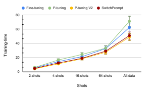

# Switchprompt: Learning Domain-Specific Gated Soft Prompts For Classification In Low-Resource Domains

Koustava Goswami1,2∗, Lukas Lange2**, Jun Araki**3, Heike Adel2 1 Adobe Research Bangalore, India 2 Bosch Center for Artificial Intelligence, Renningen, Germany 3 Bosch Research North America koustavag@adobe.com, {Lukas.Lange,Heike.Adel}@de.bosch.com, Jun.Araki@us.bosch.com

# Abstract

Prompting pre-trained language models leads to promising results across natural language processing tasks but is less effective when applied in low-resource domains, due to the domain gap between the pre-training data and the downstream task. In this work, we bridge this gap with a novel and lightweight prompting methodology called *SwitchPrompt* for the adaptation of language models trained on datasets from the general domain to diverse low-resource domains. Using domain-specific keywords with a trainable gated prompt, SwitchPrompt offers domain-oriented prompting, that is, effective guidance on the target domains for general-domain language models. Our few-shot experiments on three text classification benchmarks demonstrate the efficacy of the general-domain pre-trained language models when used with *SwitchPrompt*. They often even outperform their domain-specific counterparts trained with baseline state-of-the-art prompting methods by up to 10.7% performance increase in accuracy. This result indicates that *SwitchPrompt* effectively reduces the need for domain-specific language model pre-training.

# 1 Introduction

Recent work showed promising results on different natural language processing tasks when prompting pre-trained language models (LMs) instead of finetuning them, especially in low-resource settings (Schucher et al., 2022). Most LMs which are publicly available have been trained on general-domain corpora (Devlin et al., 2019; Liu et al., 2019; Goyal et al., 2021), such as Wikipedia or the BooksCorpus (Zhu et al., 2015). Applying them to tasks from a special domain results in a domain gap.

For some special domains, domain-specific LMs exists, e.g., Clinical BERT (Alsentzer et al.,
2019) or BioBERT (Lee et al., 2019). However, pre-training deep language models requires large amounts of text data.1 While we can assume the availability of large-scale text data in the general domain, this assumption might not hold for lowresource domains, making the creation of domainspecific LMs challenging. Moreover, training different models for each and every new domain might be inefficient from a computation point of view.2 Even if there are domain-specific texts and computational resources available, domain-specific LMs may not be able to get sufficient domain-oriented guidance through traditional prompting techniques because, for instance, domain-specific knowledge might be represented by a large and diverse vocabulary. As a result, both prompting LMs from the general domain and from a special domain might be ineffective, especially in low-resource settings.

Motivated by these challenges, we explore domain-oriented prompts and propose a novel and lightweight method, *SwitchPrompt*, to effectively retrieve domain-specific knowledge from pre-trained LMs. It extends the sequence of softprompting vectors with a sequence of vectors representing domain-specific keywords and introduces gates to allow the model to dynamically switch between a general soft prompt and a domain-specific one based on the input sentence. We hypothesize that this approach helps to effectively retrieve domain-specific knowledge from pre-trained LMs.

Our experiments on benchmark datasets from different domains indicate that *SwitchPrompt* outperforms different state-of-the-art prompting methods. It improves results in both in-domain and out-of-domain settings, effectively reducing domain gaps among pre-training and downstream task data. We find that it is especially suitable for low-

∗Research work conducted during internship at Bosch Center for Artificial Intelligence. Contact: koustavag@adobe.com 1Clinical BERT (Alsentzer et al., 2019), for instance, was trained on the MIMIC-III v1.4 database (Johnson et al., 2016)
which includes 2 million notes.

2Lee et al. (2019) used eight NVIDIA V 100 GPUs for 23 days to train the BioBERT.
resource settings (both little data and little computational resources) as it neither requires pre-training domain-specific LMs nor fine-tuning LMs for the downstream task. The code base for *SwitchPrompt* is available online.3

# 2 Related Work

Language model prompting. Prompting pretrained LMs has been shown effective for different NLP tasks (Brown et al., 2020). While discrete prompts are intuitively understandable, their design requires non-trivial human involvement and they may be outperformed by fine-tuning (Shin et al., 2020; Jiang et al., 2020; Gao et al., 2021). Recent studies address this issue by optimizing so-called soft prompts in continuous space. Li and Liang (2021a) propose prefix tuning that optimizes prefix activations prepended to the input layer and each layer in the encoder stack. Lester et al. (2021) prepend trainable continuous embeddings to the original sequence of input word embeddings. Liu et al. (2021) propose P-tuning in which an LSTM encoder captures the sequential representations of the soft prompts. Liu et al. (2022)
use a deep prompting methodology which injects prompts at each layer of the pre-trained LM. In contrast to those prior works, we propose a new soft prompting method that is especially suited for low-resource domains.

Language models in special domains. Most popular pre-trained LMs are trained on data from the general domain. Tailoring an LM towards a domain can be done via domain-specific pre-training from scratch (i.a., Alsentzer et al., 2019; Lee et al., 2019) or adaptation of an existing model to target domain data with continued pre-training (i.a., Gururangan et al., 2020; Xu et al., 2020; Lange et al.,
2022). We refer to the survey of Hedderich et al.

(2021) for more information on language model adaptation for low-resource domains. In this paper, we take a different approach and investigate to which extend LMs that were pre-trained on the general domain can be prompted for domain knowledge in few-shot settings as this requires only a minimal amount of domain-specific data.

# 3 Method

We now present *SwitchPrompt*, and give an example of an architecture in which it can be applied. In 3https://github.com/boschresearch/switchprompt our architectural setup, the underlying pre-trained language model is fixed (i.e., not fine-tuned).

### 3.1 Domain-Specific Soft Prompts

The motivation behind our proposed prompts P ∈ R
l×eis to allow the model to dynamically switch between a general-domain prompt Pg and a domain-specific prompt Pd in order to retrieve different kinds of knowledge from the pre-trained LM
based on the current input, where e is the embedding dimension, and l is the length of the prompt
(i.e., number of soft-prompt vectors). We implement this with a sigmoid-based gating function:

$$\begin{array}{l}{{P=g_{1}(\mathrm{{\small{pad(}}}P_{g}))+(1-g_{1})P_{d}}}\\ {{g_{1}=\sigma(w_{1}^{\top}s_{\mathrm{input}})}}\end{array}$$
(1)  (2) $\frac{1}{2}$  (3) $\frac{1}{2}$  (4) $\frac{1}{2}$  (5) $\frac{1}{2}$  (6) $\frac{1}{2}$  (7) $\frac{1}{2}$  (8) $\frac{1}{2}$  (9) $\frac{1}{2}$  (10) $\frac{1}{2}$  (11) $\frac{1}{2}$  (12) $\frac{1}{2}$  (13) $\frac{1}{2}$  (14) $\frac{1}{2}$  (15) $\frac{1}{2}$  (16) $\frac{1}{2}$  (17) $\frac{1}{2}$  (18) $\frac{1}{2}$  
where pad is a function that pads Pg to length l. The prompts Pg and Pd will be defined in Equations 3 and 6, respectively. Gate g1 is calculated based on the representation of the input sentence sinput (in our case the representation of the [CLS]
token when feeding the input sentence into the pretrained LM) and a weight vector w1 ∈ R
ethat is randomly initialized and updated during training.

The general-domain prompt is implemented as a sequence of randomly initialized vectors v1*, . . . , v*m that are trained on the downstream task, similar to Lester et al. (2021) and Liu et al. (2022):

$$P_{g}=[v_{1};v_{2};\ldots;v_{m}]=V_{m}$$
$\eqref{eq:walpha}$
The sequence length m is a hyperparameter of the model and '[;]' denotes concatenation.

The domain-specific prompt is designed to incorporate a sequence of vectors Kn = [k1; *. . .* ; kn]
that represent domain-specific keywords. The intuition is to inject the semantic information of the special domains using the domain-specific keywords. We define the set of keywords using a term-frequency-based approach. In particular, we estimate a score c for each word w from the target domain based on the normalized term frequencies estimated on documents from the general domain tfg(w) and domain-specific documents tfd(w):

$$\begin{array}{c}{{c(w)=\alpha\cdot\mathrm{tf}_{g}(w)+\mathrm{tf}_{d}(w),\alpha<0}}\\ {{t_{i}=\{w|\mathrm{rank}(c(w))=i\},1\leq i\leq n}}\end{array}$$
)  $\text{i)}$  $\text{j)}$
Using α < 0, we are able to select terms that are representative for the target domain and avoid terms that are frequent in the general domain. In Equation 5, we select the n words from the target domain with the highest scores c as our keywords.

Each keyword tiis then represented as a vector ki, using the same language model as for prompting.

Initial experiments showed that it is not enough to simply set Pd = Kn = [k1, k2*, . . . , k*n] but that the sequence of keywords should actually be combined with the sequence of soft prompts. Thus, we implement the domain-specific prompt as follows:

$$P_{d}=g_{2}[V_{m};K_{n}]+(1-g_{2})[K_{n};V_{m}]\tag{6}$$ $$g_{2}=\sigma(w_{2}^{\top}s_{\rm input})\tag{7}$$

We combine the sequence of keywords of length n with the sequence of soft prompts of length m with concatenation, yielding a sequence of length l = m + n. We let the model decide with a second gate g2 in which order the sequences should be concatenated. Again, the gate is calculated based on the representation of the input sentence and a trainable weight vector w2 ∈ R
e, where e is the embedding dimension. Thus, although the same domain-specific keywords are used for all inputs, the resulting soft prompt is dependent on the input sentence.

### 3.2 Prompting Architecture

Since our proposed method is a new definition of soft prompts, it can be integrated into any existing model that uses soft prompts. In our experiments, we adopt the *P-Tuning v2* architecture (Liu et al., 2022) because of its high efficacy on different natural language understanding tasks. P-Tuning v2 is an adaptation of deep prompt tuning (Qin and Eisner, 2021; Li and Liang, 2021b) that injects soft prompts at every layer of the pre-trained LM. During training, the prompts are tuned but the LM stays fixed. For the class prediction of the downstream task, a randomly initialized classification head is added on top of the pre-trained LM.

# 4 Experiments

In this section, we describe the setup (datasets, training details and baselines) and the results of our experiments.

### 4.1 Datasets

For our experiments, we use classification benchmark datasets from different domains: question classification from the general domain (TREC, Voorhees and Tice, 2000) and from the clinical domain (GARD, Kilicoglu et al., 2016), as well as experiment classification from the materials sci-

ence domain (SOFC-Exp, Friedrich et al., 2020). Statistics of the datasets can be found in Table 1.

| Dataset   | Domain            | Instances   | Classes   |
|-----------|-------------------|-------------|-----------|
| GARD      | Clinical          | 1253        | 11        |
| SOFC\-Exp | Materials science | 2042        | 2         |
| TREC      | General           | 4893        | 7         |

Table 1: Statistics of text classification datasets.

Among them, the SOFC-Exp dataset offers a binary sentence classification task with positive and negative labels whereas GARD and TREC are multi-class question classification datasets.

To investigate very-low-resource settings, we construct *few-shot datasets* by randomly sampling N shots per class with N ∈ {2, 4, 16, 64}. Following the proposed theory for realistic *low-resource* regimes (Perez et al., 2021; Kann et al., 2019), we also create *few-shot development sets* by keeping the number of shots in the training and development sets in sync. In the 4-shot scenario, for example, both the training and the development set consist of 4 examples for each class. For all datasets, we use accuracy (%) as evaluation metric.

To give a closer insight into the challenges of the different domains that we use in our experiments, we present example instances from the datasets in Table 2. The examples show that the models need to cope with domain-specific terminology, such as
"perisylvian polymicrogyria" (clinical domain) or "electrochemical" (materials science domain), and domain-specific labels, for instance, "diagnosis".

### 4.2 Training Details

We use open-sourced HuggingFace language models4for our experiments. We train our models with a batch size of 32. The maximum sequence length is set to 128 and we use dropout with rate 0.1 on the classification layer. We use the *ExponentialLR*5 learning rate scheduler with a gamma value of 0.95 and the Adam optimizer. All experiments are performed on a V 100 GPU.6 Each reported result is the average performance of five runs.

### 4.3 Baselines

We compare our method to different baselines: (i)
Fine-tuning of the pre-trained LM, (ii) prompting

4https://huggingface.co/models 5https://pytorch.org/docs/stable/optim.html#
torch.optim.Optimizer 6We ran our experiments on a carbon-neutral GPU cluster.

| Domain       | Input                                                                                                         | Output    |
|--------------|---------------------------------------------------------------------------------------------------------------|-----------|
| Clinical     | How is it different from bilateral perisylvian polymicrogyria in how it presents ?                            | Diagnosis |
| Clinical     | Are there products other than cigarette tobacco associated with Buerger disease ?                             | Cause     |
| Mat. science | They called this phenomenon nonfaradaic electrochemical modification of catalytic activity (NEMCA).           | Negative  |
| Mat. science | It is possible to reduce up to 35% of NO present when the cell stacks are polarized with 1.5 V for each cell. | Positive  |
| General      | What is the name of the largest city in Chile , South America ?                                               | Location  |
| General      | What was the average life expectancy during the Stone Age ?                                                   | Number    |

| Methodology Model   |               |            |            | 2\-shots 4\-shots 16\-shots 64\-shots All   |            |                    | Methodology Model                    |           |                                                   | 2\-shots 4\-shots 16\-shots 64\-shots All   |            |            |
|---------------------|---------------|------------|------------|---------------------------------------------|------------|--------------------|--------------------------------------|-----------|---------------------------------------------------|---------------------------------------------|------------|------------|
| BERT Fine\-tuning   |               | 21.2       | 25.5       | 40.8                                        | 67.4       | 81.8  Fine\-tuning | BERT                                 | 33.3      | 53.3                                              | 71.4                                        | 88.7       | 95.7       |
| BERT  P\-tuning     | Clinical BERT | 35.9 48.3  | 40.4 48.9  | 56.3  53.1                                  | 68.1  68.1 | 82.5   82.0        | P\-tuning V2  BERT SwitchPrompt BERT | 56.0 66.7 | 63.3  72.4                                        | 79.4   88.3                                 | 92.5  91.2 | 96.8  97.6 |
| Clinical BERT 49.2  |               |            | 53.1       | 58.2                                        | 69.6       | 82.8               |                                      |           |                                                   |                                             |            |            |
| BERT P\-tuning V2   | Clinical BERT | 27.2  34.3 | 44.4  48.7 | 61.9  63.4                                  | 79.1 82.3  | 84.0  86.7         |                                      |           | Table 5: Results on general\-domain dataset TREC. |                                             |            |            |
| SwitchPrompt BERT   |               | 36.3       | 54.2       | 64.0                                        | 81.1       | 85.4               |                                      |           |                                                   |                                             |            |            |
| Clinical BERT 40.9  |               |            | 55.2       | 65.1                                        | 81.9       | 86.9               |                                      |           |                                                   |                                             |            |            |

| Methodology Model   |      |      |      | 2\-shots 4\-shots 16\-shots 64\-shots All   |      |      |
|---------------------|------|------|------|---------------------------------------------|------|------|
| Fine\-tuning        | BERT | 18.2 | 26.1 | 48.5                                        | 54.6 | 61.9 |
| SciBERT             |      | 29.4 | 32.7 | 50.4                                        | 56.2 | 64.7 |
| P\-tuning           | BERT | 37.5 | 38.2 | 52.6                                        | 58.5 | 64.9 |
| SciBERT             |      | 42.1 | 43.4 | 54.8                                        | 59.3 | 66.2 |
| P\-tuning V2        | BERT | 30.8 | 31.2 | 52.8                                        | 59.9 | 68.4 |
| SciBERT             |      | 33.7 | 35.6 | 53.9                                        | 61.4 | 69.7 |
| SwitchPrompt BERT   |      | 32.4 | 34.3 | 53.4                                        | 61.0 | 69.9 |
| SciBERT             |      | 36.2 | 37.1 | 55.9                                        | 62.5 | 70.6 |

Table 2: Example sentences and their labels from our domain-specific and general-domain datasets.

Table 3: Results on special-domain dataset GARD.

Table 4: Results on special-domain dataset SOFC-Exp.

using P-tuning (Liu et al., 2021), and (iii) prompting using P-Tuning v2 (Liu et al., 2022). For all methods, we report results for using either a general-domain LM (BERT (Devlin et al., 2019))
or domain-specific LMs (Clinical BERT (Alsentzer et al., 2019) and SciBERT (Beltagy et al., 2019)).

### 4.4 Results

Low-resource domains. Tables 3 and 4 show the results of our model for the clinical and materials science domain in comparison to state-of-theart baseline approaches. In general, the prompting methods outperform fine-tuning, with especially large margins for very-few-shot settings (2 and 4 shots). This highlights the limitations of fine-tuning with limited training datasets. Another general trend is that using domain-specific LMs (Clinical BERT and SciBERT, respectively) outperforms BERT from the general domain. Our proposed method *SwitchPrompt* outperforms other state-of-the-art prompting methods up to 2.1%
points. We further note that (i) our method prompting general-domain LMs even outperforms other methods prompting domain-specific LMs, and (ii) our method reduces the performance gap between using an LM from the general domain vs. a domainspecific one.

For very-few-shot settings (2,4-shots), P-tuning outperforms our method. We assume that the reason is that it replaces the input of the LM with differential embeddings from the prompt-encoder, while in our method we consider the vanilla inputs of the LM, reducing the complexity and training time (see Figure 1) of our model.

General domain. To investigate the behavior of our method in the general domain, we now evaluate its performance on TREC. Table 5 shows that our method outperforms both fine-tuning and other prompting methods in almost all dataset settings, up to 10.7 accuracy points. Thus, even on the general domain, *SwitchPrompt* can boost the performance of pre-trained LMs.

# 5 Analysis

In this section, we report the results of our ablation study, give more insights into what our model learned and analyze its training time. We also provide a qualitative error analysis.

Ablation study. Our ablation study in Table 7 shows the impact of the different components of our prompting function, evaluated with the full GARD dataset. Row (1) corresponds to Switch-
Prompt, and row (6) corresponds to the previous state-of-the-art prompting model P-Tuning v2. Row (2) shows that the concatenation of keywords and the general-domain soft prompt is important to the model. Row (3) and (4) show the large impact of the second gate g2, and row (5) and (6) show that neither the domain-specific keywords Kn nor

| Domain       | Keywords                                                                                                                                    |
|--------------|---------------------------------------------------------------------------------------------------------------------------------------------|
| Clinical     | Diagnosed, Prognosis, Cantrell, Idiopathic, Tourette, Opitz, Testotoxicosis, Late\-onset, Amniocentesis, Prenatally                         |
| Mat. science | Fuel, Oxide, D8\-Discover, Viscometer, Hydroxide/poly, Room\-temperature, Ion\-conductor, Electrocatalytic, Cobalt\-doped, Non\-homogeneous |
| General      | Cholera, Tasman, Conservancy, Boil, Premier, Consumption, Conditioner, Foster, Chemiosmotic, Registers                                      |

| Prompt                                                         | Acc   |
|----------------------------------------------------------------|-------|
| (1) g1(pad(Vm)) + (1 − g1)(g2[Vm; Kn] + (1 − g2)[Kn; Vm]) 85.4 |       |
| (2) g1(pad(Vm)) + (1 − g1)(g2Vm + (1 − g2)Kn)                  | 82.6  |
| (3) g1(pad(Vm)) + (1 − g1)[Vm; Kn]                             | 81.4  |
| (4) g1(pad(Vm)) + (1 − g1)[Kn; Vm]                             | 77.6  |
| (5) Kn                                                         | 54.8  |
| (6) Vm                                                         | 84.0  |

| Input                                                        | Prediction   | Gold Output    |
|--------------------------------------------------------------|--------------|----------------|
| How can this be?                                             | Management   | Susceptibility |
| Will we be okay?                                             | Information  | Prognosis      |
| What is the treatment of mixed  connective tissue disorder ? | Information  | Management     |
| What are the  expected  out                                                              |              |                |
| comes  for  individuals  with                                | Information  | Prognosis      |
| cryoglobulinemia ?                                           |              |                |

Table 6: Automatically selected 10 keywords per domain by our approach.

Table 7: Impact of prompt design choices in the fulldata setting of the GARD dataset using BERT embeddings. Row (1) corresponds to *SwitchPrompt*, and row (6) corresponds to P-Tuning v2.

Table 8: Error analysis on GARD dataset.

the general soft-prompting vectors Vm alone are sufficient to achieve the highest performance.

Domain-specific keywords. The keywords are an integral part of *SwitchPrompt*. Since we compute keywords automatically (see Section 3), we analyze the extracted keywords in more detail.

Table 6 shows the 10 keywords that have been selected by our method. For the clinical and materials science domain, the keywords are domain-specific terms while for the general domain, the keywords cover a broad range of topics.

Training time analysis. During training time, the underlying LM is frozen in the *SwitchPrompt* framework. This substantially reduces training time and computational memory, compared to alternative approaches, such as fine-tuning or P-Tuning. Figure 1 illustrates this. P-Tuning v2 is a little bit faster than our approach as it does not need to train the gating parameters. However, the time difference is considerably small (2.2 min for 10 epochs in the all-data setting, i.e., 0.22 min per epoch).

Qualitative error analysis. Finally, we manually conduct a qualitative error analysis on the

Figure 1: Training time in minutes for 10 epochs for

different methods on the GARD dataset.

GARD dataset. The results are displayed in Table 8. We find that our method mainly fails when the input sentences convey little domain-specific information (see examples in first two rows). Another category of errors is the prediction of a more general class ("Information" instead of "Management" or "Prognosis" in the last two rows).

# 6 Conclusion

In this paper, we proposed a new methodology called *SwitchPrompt* for effectively prompting pretrained language models in low-resource domains. Integral parts of our method are domain-specific keywords and gates, which allow the language model to dynamically retrieve domain-specific knowledge. Experiments on sentence classification datasets from different domains show that our method outperforms various baseline methods in few-shot and all-data settings. In particular, it reduces the performance gap between generaldomain and domain-specific language models. Future work can investigate the impact on sequencelabeling tasks as well as on mixed-domain datasets.

# Acknowledgments

We would like to thank the members of the BCAI
NLP & NS-AI research group and the anonymous reviewers for their helpful comments.

# Limitation

In preliminary experiments, we found that our method is sensitive to the selection of keywords. While we found an automatic and domainindependent way for extracting them (see Section 3), its efficacy needs to be tested on more domains and possibly also on mixed domain datasets.

# References

Emily Alsentzer, John Murphy, William Boag, Wei-
Hung Weng, Di Jindi, Tristan Naumann, and Matthew McDermott. 2019. Publicly available clinical BERT embeddings. In Proceedings of the 2nd Clinical Natural Language Processing Workshop, pages 72–78, Minneapolis, Minnesota, USA. Association for Computational Linguistics.

Iz Beltagy, Kyle Lo, and Arman Cohan. 2019. Scibert: A pretrained language model for scientific text. In Proceedings of the 2019 Conference on Empirical Methods in Natural Language Processing and the 9th International Joint Conference on Natural Language Processing, EMNLP-IJCNLP 2019, Hong Kong, China, November 3-7, 2019, pages 3613– 3618. Association for Computational Linguistics.

Tom Brown, Benjamin Mann, Nick Ryder, Melanie Subbiah, Jared D Kaplan, Prafulla Dhariwal, Arvind Neelakantan, Pranav Shyam, Girish Sastry, Amanda Askell, Sandhini Agarwal, Ariel Herbert- Voss, Gretchen Krueger, Tom Henighan, Rewon Child, Aditya Ramesh, Daniel Ziegler, Jeffrey Wu, Clemens Winter, Chris Hesse, Mark Chen, Eric Sigler, Mateusz Litwin, Scott Gray, Benjamin Chess, Jack Clark, Christopher Berner, Sam McCandlish, Alec Radford, Ilya Sutskever, and Dario Amodei. 2020. Language models are few-shot learners. In Proceedings of NeurIPS, volume 33, pages 1877–
1901.

Jacob Devlin, Ming-Wei Chang, Kenton Lee, and Kristina Toutanova. 2019. BERT: Pre-training of deep bidirectional transformers for language understanding. In *Proceedings of the 2019 Conference* of the North American Chapter of the Association for Computational Linguistics: Human Language Technologies, Volume 1 (Long and Short Papers),
pages 4171–4186, Minneapolis, Minnesota. Association for Computational Linguistics.

Annemarie Friedrich, Heike Adel, Federico Tomazic, Johannes Hingerl, Renou Benteau, Anika Marusczyk, and Lukas Lange. 2020. The SOFC-exp corpus and neural approaches to information extraction in the materials science domain. In Proceedings of the 58th Annual Meeting of the Association for Computational Linguistics, pages 1255–1268, Online. Association for Computational Linguistics.

Tianyu Gao, Adam Fisch, and Danqi Chen. 2021.

Making pre-trained language models better few-shot learners. In Proceedings of the 59th Annual Meeting of the Association for Computational Linguistics and the 11th International Joint Conference on Natural Language Processing (Volume 1: Long Papers),
pages 3816–3830, Online. Association for Computational Linguistics.

Naman Goyal, Jingfei Du, Myle Ott, Giri Anantharaman, and Alexis Conneau. 2021. Larger-scale transformers for multilingual masked language modeling. In Proceedings of the 6th Workshop on Representation Learning for NLP (RepL4NLP-2021), pages 29– 33, Online. Association for Computational Linguistics.

Suchin Gururangan, Ana Marasovic, Swabha ´
Swayamdipta, Kyle Lo, Iz Beltagy, Doug Downey, and Noah A. Smith. 2020. Don't stop pretraining: Adapt language models to domains and tasks. In Proceedings of the 58th Annual Meeting of the Association for Computational Linguistics, pages 8342–8360, Online. Association for Computational Linguistics.

Michael A. Hedderich, Lukas Lange, Heike Adel, Jannik Strötgen, and Dietrich Klakow. 2021. A survey on recent approaches for natural language processing in low-resource scenarios. In Proceedings of the 2021 Conference of the North American Chapter of the Association for Computational Linguistics: Human Language Technologies, pages 2545–2568, Online. Association for Computational Linguistics.

Zhengbao Jiang, Frank F. Xu, Jun Araki, and Graham Neubig. 2020. How can we know what language models know? *Transactions of the Association for* Computational Linguistics, 8:423–438.

Alistair EW Johnson, Tom J Pollard, Lu Shen, Liwei H Lehman, Mengling Feng, Mohammad Ghassemi, Benjamin Moody, Peter Szolovits, Leo Anthony Celi, and Roger G Mark. 2016. MIMIC-III, a freely accessible critical care database. Scientific data, 3(1):1–9.

Katharina Kann, Kyunghyun Cho, and Samuel R. Bowman. 2019. Towards realistic practices in lowresource natural language processing: The development set. In Proceedings of the 2019 Conference on Empirical Methods in Natural Language Processing and the 9th International Joint Conference on Natural Language Processing (EMNLP-IJCNLP), pages 3342–3349, Hong Kong, China. Association for Computational Linguistics.

Halil Kilicoglu, Asma Ben Abacha, Yassine Mrabet, Kirk Roberts, Laritza Rodriguez, Sonya Shooshan, and Dina Demner-Fushman. 2016. Annotating named entities in consumer health questions. In Proceedings of the Tenth International Conference on Language Resources and Evaluation (LREC'16), pages 3325–3332, Portorož, Slovenia. European Language Resources Association (ELRA).

Lukas Lange, Heike Adel, Jannik Strötgen, and Dietrich Klakow. 2022. CLIN-X: pre-trained language models and a study on cross-task transfer for concept extraction in the clinical domain. Bioinformatics, 38(12):3267–3274.

Jinhyuk Lee, Wonjin Yoon, Sungdong Kim, Donghyeon Kim, Sunkyu Kim, Chan Ho So, and Jaewoo Kang. 2019. BioBERT: a pretrained biomedical language representation model for biomedical text mining. *Bioinformatics*, 36(4):1234–1240.

Brian Lester, Rami Al-Rfou, and Noah Constant. 2021.

The power of scale for parameter-efficient prompt tuning. In Proceedings of the 2021 Conference on Empirical Methods in Natural Language Processing, pages 3045–3059, Online and Punta Cana, Dominican Republic. Association for Computational Linguistics.

Xiang Lisa Li and Percy Liang. 2021a. Prefix-tuning:
Optimizing continuous prompts for generation. In Proceedings of the 59th Annual Meeting of the Association for Computational Linguistics and the 11th International Joint Conference on Natural Language Processing (Volume 1: Long Papers), pages 4582–4597, Online. Association for Computational Linguistics.

Xiang Lisa Li and Percy Liang. 2021b. Prefix-tuning:
Optimizing continuous prompts for generation. In Proceedings of the 59th Annual Meeting of the Association for Computational Linguistics and the 11th International Joint Conference on Natural Language Processing, ACL/IJCNLP 2021, (Volume 1: Long Papers), Virtual Event, August 1-6, 2021, pages 4582–4597. Association for Computational Linguistics.

Xiao Liu, Kaixuan Ji, Yicheng Fu, Weng Tam, Zhengxiao Du, Zhilin Yang, and Jie Tang. 2022. P-tuning: Prompt tuning can be comparable to fine-tuning across scales and tasks. In Proceedings of the 60th Annual Meeting of the Association for Computational Linguistics (Volume 2: Short Papers), pages 61–68, Dublin, Ireland. Association for Computational Linguistics.

Xiao Liu, Yanan Zheng, Zhengxiao Du, Ming Ding, Yujie Qian, Zhilin Yang, and Jie Tang. 2021. GPT
understands, too. CoRR, abs/2103.10385.

Yinhan Liu, Myle Ott, Naman Goyal, J Du, M Joshi, D Chen, O Levy, M Lewis, L Zettlemoyer, and V Stoyanov. 2019. RoBERTa: A robustly optimized BERT pretraining approach. arXiv preprint arXiv:1907.11692.

Ethan Perez, Douwe Kiela, and Kyunghyun Cho. 2021.

True few-shot learning with language models. In Advances in Neural Information Processing Systems 34: Annual Conference on Neural Information Processing Systems 2021, NeurIPS 2021, December 614, 2021, virtual, pages 11054–11070.

Guanghui Qin and Jason Eisner. 2021. Learning how to ask: Querying lms with mixtures of soft prompts.

In Proceedings of the 2021 Conference of the North American Chapter of the Association for Computational Linguistics: Human Language Technologies, NAACL-HLT 2021, Online, June 6-11, 2021, pages 5203–5212. Association for Computational Linguistics.

Nathan Schucher, Siva Reddy, and Harm de Vries.

2022. The power of prompt tuning for low-resource semantic parsing. In Proceedings of the 60th Annual Meeting of the Association for Computational Linguistics (Volume 2: Short Papers), pages 148–156, Dublin, Ireland. Association for Computational Linguistics.

Taylor Shin, Yasaman Razeghi, Robert L. Logan IV,
Eric Wallace, and Sameer Singh. 2020. AutoPrompt: Eliciting Knowledge from Language Models with Automatically Generated Prompts. In Proceedings of the 2020 Conference on Empirical Methods in Natural Language Processing (EMNLP), pages 4222–4235, Online. Association for Computational Linguistics.

Ellen M. Voorhees and Dawn M. Tice. 2000. The TREC-8 question answering track. In Proceedings of the Second International Conference on Language Resources and Evaluation (LREC'00), Athens, Greece. European Language Resources Association (ELRA).

Hu Xu, Bing Liu, Lei Shu, and Philip Yu. 2020.

DomBERT: Domain-oriented language model for aspect-based sentiment analysis. In Findings of the Association for Computational Linguistics: EMNLP 2020, pages 1725–1731, Online. Association for Computational Linguistics.

Yukun Zhu, Ryan Kiros, Richard S. Zemel, Ruslan Salakhutdinov, Raquel Urtasun, Antonio Torralba, and Sanja Fidler. 2015. Aligning books and movies: Towards story-like visual explanations by watching movies and reading books. In 2015 IEEE International Conference on Computer Vision, ICCV 2015, Santiago, Chile, December 7-13, 2015, pages 19–27. IEEE Computer Society.