# Hyena Hierarchy: Towards Larger Convolutional Language Models

Michael Poli∗,1, Stefano Massaroli∗,2, Eric Nguyen1,∗,
Daniel Y. Fu1, Tri Dao1, Stephen Baccus1, Yoshua Bengio2, Stefano Ermon1,†, Christopher Ré1,†
Version: submitted draft, Last Compiled: April 21, 2023

#### Abstract

Recent advances in deep learning have relied heavily on the use of large Transformers due to their ability to learn at scale. However, the core building block of Transformers, the attention operator, exhibits quadratic cost in sequence length, limiting the amount of context accessible. Existing subquadratic methods based on low-rank and sparse approximations need to be combined with dense attention layers to match Transformers, indicating a gap in capability. In this work, we propose Hyena, a subquadratic drop-in replacement for attention constructed by interleaving implicitly parametrized long convolutions and data-controlled gating. In recall and reasoning tasks on sequences of thousands to hundreds of thousands of tokens, Hyena improves accuracy by more than 50 points over operators relying on statespaces and other implicit and explicit methods, matching attention-based models. We set a new state-ofthe-art for dense-attention-free architectures on language modeling in standard datasets (WikiText103 and The Pile), reaching Transformer quality with a 20% reduction in training compute required at sequence length 2K. Hyena operators are twice as fast as highly optimized attention at sequence length 8K, and 100× faster at sequence length 64K.

## 1 Introduction

Large Transformers have enabled a number of breakthrough advances in modeling language, vision, audio, biology and numerous other domains (Vaswani et al., 2017), (Dosovitskiy et al., 2020), (Radford et al., 2022), (Cramer, 2021). Much of the success of Transformers, powered by the attention operator (Vaswani et al.,
2017), relies on their scaling properties (Hoffmann et al., 2022) and the emergence of in-context learning
(Garg et al., 2022), which allows them to generalize to unseen data and tasks given context as input. The Transformer block is a powerful tool for sequence modeling, but it is not without its limitations. One of the most notable is the computational cost, which grows rapidly as the length of the input sequence increases.

Specifically, the cost scales quadratically with the length L of the sequence, which places a strict limit on the amount of context that can be considered by the model. Breaking the quadratic barrier is a key step towards new possibilities for deep learning, such as using entire textbooks as context, generating long-form music or processing gigapixel scale images.

Efforts to reduce the computational cost of attention in models primarily involve the use of linearized, low-rank, and sparse approximations (Child et al., 2019; Wang et al., 2020; Kitaev et al., 2020; Zhai et al., 2021; Roy et al., 2021; Schlag et al., 2021; Tu et al., 2022). These approaches introduce a trade-off between expressivity and speed, requiring hybridization with standard attention layers to reach Transformer quality (Mehta et al., 2022; Dao et al., 2022c).

A growing amount of evidence suggests that attention mechanisms only utilize a small portion of their quadratic capabilities for language processing (Olsson et al., 2022; Dao et al., 2022c), leading us to question its role as the gold-standard operator for deep learning at scale. Specifically, we ask:
Are there subquadratic operators that can match the quality of attention at scale?

1

∗Equal contribution. † Equal senior authorship. 1Stanford University. 2Mila and Université de Montréal.
Figure 1.1: The Hyena operator is defined as a recurrence of two efficient subquadratic primitives: an implicit

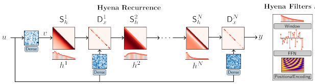 long convolution h (i.e. Hyena filters parameterized by a feed-forward network) and multiplicative elementwise gating of the (projected) input. The depth of the recurrence specifies the size of the operator. Hyena can equivalently be expressed as a multiplication with *data-controlled* (conditioned by the input u) diagonal matrices Dx and Toeplitz matrices Sh. In addition, Hyena exhibits sublinear parameter scaling (in sequence length) and unrestricted context, similar to attention, while having lower time complexity.

We obtain a positive answer based on a composition of efficient subquadratic primitives, such as elementwise multiplication (gating) and *long convolutions* i.e., convolutions with filter sizes as long as the input. We rely on a set of targeted reasoning tasks, grounded in recent work on *mechanistic interpretability* (Elhage et al., 2021; Power et al., 2022; Olsson et al., 2022; Zhang et al., 2022) such as recall and induction, to distill three properties of attention correlated with its performance and the quality gap with existing subquadratic approaches:
a. Data control: Attention implements an expressive *data-controlled* (Massaroli et al., 2020) linear operator1, encoding an entire family of linear functions in a single block.

b. Sublinear parameter scaling: Parameter counts of attention layers are decoupled from sequence length, allowing Transformers to allocate more parameters elsewhere e.g., the *feed-forward neural networks* (FFNs) between attention layers.

c. Unrestricted context: For a given input, attention has an unrestricted context i.e., it can approximate dependencies between any two inputs, without arbitrary restrictions such as locality (except in cases using masking such as autoregressive models).

The Hyena hierarchy Guided by these findings, we introduce the Hyena hierarchy, an operator defined by a recurrence of two efficient subquadratic primitives: a long convolution and element-wise multiplicative gating (see Figure 1.1). A specified depth (i.e., number of steps) of the recurrence controls the size of the operator. For short recurrences, existing models are recovered as special cases (Mehta et al., 2022; Dao et al., 2022c). By mapping each step in the Hyena recurrence to its corresponding matrix form, we reveal Hyena operators to be equivalently defined as a decomposition of a *data-controlled* matrix i.e., a matrix whose entries are functions of the input. Furthermore, we show how Hyena operators can be evaluated efficiently without materializing the full matrix, by leveraging fast convolution algorithms (Selesnick and Burrus, 2017). Empirically, Hyena operators are able to significantly shrink the quality gap with attention at scale, reaching similar perplexity and downstream performance with a smaller computational budget (Section 4.2) and without hybridization of attention.

Narrowing the capabilities gap The design of Hyena is motivated by a quality gap between standard dense attention and alternative subquadratic operators, which we identify by focusing on reasoning tasks correlated with language modeling performance at scale. We extend the suite of basic mechanistic interpretability benchmarks (*induction* and *recall*) with additional tasks that probe how quickly model performance degrades

1Self-attention can be expressed as y = A(*k, q*)v where A is the *attention matrix* conditioned by linear projections *k, q* of the input and multiplied by v, another projection.
when task complexity increases (e.g. vocabulary size grows). In addition, we investigate the optimal parameterization of long convolutions in Hyena. In the most challenging settings with hundreds of thousands of tokens, our implicit parameterization scheme improves over other operators leveraging state spaces (Gu et al., 2021), frequency-domain parametrizations (Li et al., 2020), or standard convolutions by over 50% accuracy.

Scaling in language and vision Next, we aim to verify whether rankings in our reasoning benchmark suite are predictive of quality at scale. We test Hyena on autoregressive language modeling at the sub-billion parameter scale, setting a new state-of-the-art for dense-attention-free architectures in standard datasets
(WikiText103 and The Pile) and matching Transformer quality. On the The Pile at the 335M parameter scale, we match Transformer perplexity with a 20% reduction in the total count of *floating point operations* (FLOPs). As an extension, we investigate the generality of Hyena operators by testing on large-scale image recognition, replacing attention in the Vision Transformer (ViT) (Dosovitskiy et al., 2020). In image classification, Hyena is able to match attention in accuracy when training on ImageNet-1k from scratch.

Toward much longer context Finally, we benchmark the efficiency of Hyena on long sequences. We measure 5x speedups over dense self-attention at length 8192 - 2x over highly optimized FlashAttention2
(Dao et al., 2022b) - and 100x speedup over FlashAttention at sequence lengths of 64k, where standard attention implementation in PyTorch runs out of memory.

## 2 Preliminaries And Related Work

A discrete convolution is a function of two arguments: an input u signal of length L and a learnable filter h.

The linear (aperiodic) convolution of a (possibly infinitely long) measurable3 filter h with a length-L input signal u is defined as

$$y_{t}=(h*u)_{t}=\sum_{n=0}^{L-1}h_{t-n}u_{n}.$$

Generally, ut ∈ R
D where D is the width of the signal, or in deep learning parlance, the number of channels. Without loss of generality, we specialize our analysis to *single input single output* (SISO) layers, i.e. with D = 1. The *multiple input multiple output* (MIMO) case, canonical in standard convolutional layers, follows directly.

In this case, the input signal can be represented as a vector u ∈ R
L and the convolution as a matrix-vector product between the input and the Toeplitz kernel matrix Sh ∈ R
L×L induced by the filter h:

nd the Toeplitz kernel matrix $\mathbf{S}_{h}\in\mathbb{R}^{n\times n}$ induced $(h*u)=\left[\begin{array}{cccc}h_{0}&h_{-1}&\cdots&h_{-L+1}\\ h_{1}&h_{0}&\cdots&h_{-L+2}\\ \vdots&\vdots&\ddots&\vdots\\ h_{L-1}&h_{L-2}&\cdots&h_{0}\end{array}\right]\left[\begin{array}{c}u_{0}\\ u_{1}\\ \vdots\\ u_{L-1}\end{array}\right]$
$$(1)^{\frac{1}{2}}$$
$$\left(2\right)$$

(2)

## 2.1 Explicit And Implicit Convolutions

Parametrizing and optimizing convolution filters ht is a standard procedure in deep learning and more broadly signal processing. The classical approach of *convolutional neural networks* (CNNs) (Fukushima and Miyake, 1982; LeCun et al., 1998; Ronneberger et al., 2015; He et al., 2016) is to optimize directly the values ht of the filter's response at M prescribed steps, a parametrization we call *explicit*. M is referred to as the *filter* size and is typically much shorter than the input sequence length M  L. Such filters are denoted in signal processing as *finite impulse response* (FIR).

FIR filters are local and can capture dependencies between inputs separated at most by M steps. Their main advantage is their speed, with complexity O(ML). However, the number of parameters of FIR filters scales linearly with filter size, which can be computationally prohibitive. To disentangle the parameter count from the filter size, we can instead represent the filter ht as a parametric function of the time step t, i.e. ht = γθ(t), where θ are the parameters of the function γθ. This parametrization is called *implicit*. The class

2FlashAttention is already 2-4x faster than a standard attention implementation in PyTorch.

3In the L1(Z) sense: P∞
t=−∞ |ht| < ∞
of functions γθ is a design choice with a significant impact on the expressivity and computational complexity of the layer.

One choice of implicit parametrization is to select h as the response function of a linear state-space model
(SSM) (Chen, 1984), described by the first-order difference equation:
xt+1 = Axt + But state equation

yt = Cxt + Dut output equation Here, the convenient choice of x0 = 0 renders the input-output map to a simple convolution

$$y_{t}=\sum_{n=0}^{t}\left(\mathsf{CA}^{t-n}\mathsf{B}+\mathsf{D}\delta_{t-n}\right)u_{n}$$  where $\delta_{t}$ denotes the Kronecker delta. We can then identify the filter $h$ as 
$$\mathbf{I}=\mathbf{I}$$
$$t\mapsto h_{t}=\begin{cases}0&t<0\\ \mathsf{CA}^{t}\mathsf{B}+\mathsf{D}\delta_{t}&t\geq0\end{cases}$$

where the entries of A, B, C and D are the learned parameters of the filter. In terms of layer design, the degrees of freedom of SSMs are the dimension of the state and the structure of the matrices. SSMs are a canonical example of how long convolutions with sub-linear parameter counts can improve deep learning models for long sequences (Gu et al., 2020, 2021). Other implicit approaches include parametrizing filters as maps from (a positional encoding of) t to the filter response i.e. γθ : t 7→ ht = γθ(t), for example with feed-forward neural networks (Romero et al., 2021b,a).

Long convolutions and memory: A crude proxy for *memory* of a single computational unit is how far in the past it can access information to produce the output at a certain step. This can be roughly quantified by the number of non-zero entries ∂yt/∂ut−n for n = 0*, . . . , t*. The memory of CNNs filters is equivalent to the filter size M since ∂yt/∂ut−n = hn. The total mnemonic capacity of an allconvolutions CNN therefore scales with the number of model's parameters. Implicit parametrizations, on the other hand, allow us to disentangle the memory of each filter from the parameter count and where the length of the filter is implicitly controlled by the learned parameters. In an SSM,
∂yt/∂ut−n = CAnB and the memory extent is solely determined by the spectral radius of A and can be finely tuned by the training processa. On the other hand, the number of parameters controls the expressivity of the memory unit, e.g. the number of basis functions forming ht.

aSee e.g.Gu et al. (2020, 2021)
Fast Methods for Convolutions One of the first applications of the Cooley-Tukey fast Fourier transform (FFT) algorithm was to implement convolution faster than the direct evaluation of (1). At first glance (1) comes with O(L
2) an asymptotic time complexity. A common approach to achieve *fast long convolutions* in subquadratic time is through the FFT algorithm. The method first converts the *aperiodic* convolution into a circular convolution Selesnick and Burrus (2017) by appropriate zero-padding of input and filter sequences.

The resulting kernel Sˆh is a circulant matrix and is diagonalized by the discrete Fourier basis Sˆh = W−1DHW
where W is the DFT matrix, Wtt0 = z−t, z = e i2πt0/L and H is the DFT of the padded filter h, H = Wpad(h).

Thus, the calculation of such convolutions is performed as pad(y) = Sˆhpad(u)

$$\begin{array}{l}{{=\tilde{\mathrm{S}}_{h}\mathrm{pad}(u)}}\\ {{=W^{-1}\mathrm{D}_{H}W\ \mathrm{pad}(u)}}\\ {{=\mathrm{iFFT}(\mathrm{D}_{H}\mathrm{FFT}(\mathrm{pad}(u)))}}\end{array}$$

where DH is the matrix with Wh on its diagonal. The above is known as the convolution theorem of DFT
(Oppenheim et al., 1997). In this FFTConv form the convolution can be performed without materializing the operator Sh with the same asymptotic cost O(Llog2 L) of FFT.

Figure 2.1: Comparison between data-controlled matrices: SelfAttention and Hyena.

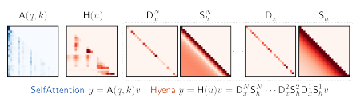

## 2.2 The Self-Attention Operator

At the heart of Transformers is the *multi-head attention* (MHA) mechanism. Given a length-L sequence u ∈ R
L×D, each head of *scaled self-attention* (Vaswani et al., 2017) is a map from R
L×D to R
L×D which performs the following operations

$$\begin{array}{r l}{\mathsf{A}(u)=\mathsf{SoftMax}\left({\frac{1}{\sqrt{D}}}u\mathsf{M}_{q}\mathsf{M}_{k}^{\top}u^{\top}\right)}\\ {y=\mathsf{SelfAttention}(u)}\\ {=\mathsf{A}(u)u\mathsf{M}_{v},}\end{array}$$

$$(3)^{\frac{1}{2}}$$

where Mq, Mk, Mv ∈ R
D×D are learnable linear projections and SoftMax is intended to be applied row-wise.

Attention parametrizes a family of dense linear operators and for an input u, indexes through it via projections of u i.e., A(u). We refer to operators of this type as *data-controlled*, as they encode a linear transformation u 7→ y, that is, however, nonlinearly defined by u. This approach yields expressive nonlinear operators in u, and we hypothesize contributes, together with other mechanisms (Olsson et al., 2022), to the ability of certain operators to learn *in-context* i.e., to adapt to unseen tasks by leveraging context. In deep learning, the projections take on specific names: query q = uMq, key k = uMk and *value* v = uMv. We often rewrite the attention operator as y = A(*q, k*)v. Remark 2.1. *Similarly to implicit convolutions,* SelfAttention does not entangle its ability to access distant information with the number of parameters: it looks at the whole sequence at the price of O(L
2) *operations.*
Subquadratic Operators Existing approaches to subquadratic alternatives to attention can be summarized by altering the way the data control is implemented i.e., how the operator is nonlinearly defined by u, and then applied to v. For example, a layer of *Attention-Free Transformers* (AFTs) (Zhai et al., 2021) constructs the operator through a combination of gating and SoftMax (AFT full) or gating and a single explicit convolution (AFT conv). *Gated State Spaces* (GSS) instead compose the operator via gating and a long convolution parametrized via SSMs. Taking this idea further, *Hungry Hungry Hippo (H3)* (Dao et al., 2022c), motivated by gaps of GSS on associative recall, extend the mechanism to include an additional gate and a short convolution obtained via a shift SSM. Hyena generalizes this body of work by introducing a recurrence of gates and implicit long convolutions, evaluated efficiently.

## 3 Hyena: Definition And Properties

In this section, we define Hyena, a class of *data-controlled* operators consisting of a recurrence of multiplicative gating interactions and long convolutions. Instead of seeking an approximation to attention, we guide our design by intentionally incorporating key computational properties of attention, including the decoupling of sequence length and parameter counts.

## 3.1 Hyena Recurrences

At a high level, Hyena consists of the following steps (setting D = 1 for clarity):
i. Compute a set of N +1 linear projections of the input, similarly to attention. The number of projections
(vt, x1 t, . . . , xN
t) need not be three. One projection takes the role of value, such that a linear input-output function can be defined as y = H(u)v for some H(u).

5 ii. The matrix H(u) is defined by interleaving implicit long convolutions and element-wise multiplication with one projection x i at a time, until all projections are exhausted. Evaluation of H(u)v is done efficiently without materializing H(u). By doing so, we implicitly define a data-controlled operator as a factorization of a matrix. The long convolutions forming H(u) are parametrized implicitly to retain sublinear parameter scaling in sequence length.

Next, we formally define Hyena, starting with its computational model. We leave the analysis of its data-

controlled matrix form for the latter part of the section. Definition 3.1 (Order–N Hyena Operator). Let (v, x1, · · · , xN ) be projections of the input and let h 1, . . . , hN be a set of learnable filters. The HyenaN operator is defined by the recurrence: z 1 t = vt z n+1 t = x n t(h n∗ z n)t n = 1, . . . , N yt = z N+1 t (4)
Remark 3.1. *The time complexity of a* Hyena *recurrence is* O(NLlog2 L)*. The input-output map can be* rewritten as y = x N · (h N ∗ (x N−1· (h N−1∗ (*· · ·*))))
where each convolution is performed through the Fourier domain in O(Llog2 L).

Interestingly, the element-wise product in time domain corresponds to convolution in frequency domain, i.e.

xtut = (ˆx ∗ uˆ)t, where x, ˆ uˆ denote the DFT of x and u, respectively. Thus, Hyena is alternatively applying convolutions in the time and then the frequency domain (or alternatively applying element-wise products in the time and frequency domain). One potential explanation for the effectiveness of this procedure is that the convolution in the time domain (element-wise multiplication in the frequency domain) increases the memory length, allowing for a broader context to be taken into account. On the other hand, the element-wise multiplication in the time domain (convolution in the frequency domain) allows for more fine-grained selection of specific frequency components of the signal.

## 3.2 Hyena Matrices

Hyena operators build on the H3 mechanism developed by (Dao et al., 2022c). For clarity of exposition, we once again consider the SISO case (D = 1). Let Dq and Dk be the L*-by-*L diagonal matrices whose respective main diagonal entries are the respective entries of q and k. H3 realizes a surrogate attention matrix with a data-controlled, parametrized decomposition in four terms:

$$\begin{array}{l}{{\mathrm{A}(q,k)=\mathsf{D}_{q}\mathsf{S}_{\psi}\mathsf{D}_{k}\mathsf{S}_{\varphi}}}\\ {{\mathrm{~}(q,k,v)=\mathsf{A}(q,k)v}}\end{array}$$
$$\mathbf{A}(q,t)$$

H3(*q, k, v*) = A(*q, k*)v(5)
where Sϕ, Sψ are the Toeplitz matrices of learnable causal filters *ϕ, ψ* parametrized via SSMs4. Alongside the qkv-projections the filters constitute our degrees of freedom in the layer design. This decomposition allows evaluation of (8) in just O(Llog2 L) time (two FFT convolutions and two element-wise products), i.e.

zt = kt(ϕ ∗ v)t

$$y_{t}=q_{t}(\psi*z)_{t}$$
$\left(5\right)^3$
$\left(\mathrm{f}\right)$. 
Hyena represents a generalization of (8) for an arbitrary number of projections - not limited to three - and with implicit free-form long filters for the convolutions. The resulting recurrence (4) can be also represented in matrix form y = H(u)v. Let D
n x = diag(x n) ∈ R
L×L and let S
n h be the Toeplitz matrix corresponding to filter h n. The resulting Hyena recurrence is linear in v and can be rewritten in matrix form:
y = H(u)v = D
N
x S
N
h*· · ·* D
2 xS
2 hD
1 xS
1 hv Figure 2.1 visualizes an example decomposition.

4For consistency with our discussion, we have swapped k and v compared to the notation in (Dao et al., 2022c).
Sequence Length

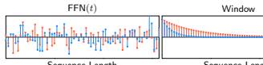

| Window  Sequence Length   | Window ◦ FFN(t)  Sequence Length   |
|---------------------------|------------------------------------|

Figure 3.1: [Top]: Example of long convolution parametrization for Hyena operators, with a decay Window(t) = exp{−αt}. Parameter α is modified across the independent channels of Hyena to regularize filters to be of different lengths. In practice, we add a bias term to our window, so that the filters are not constrained to be zeros after a length determined by the decay rate.

Remark 3.2 (Hyena generalizes H3 and GSS.). The H3 mechanism (Dao et al., *2022c) corresponds to* Hyena2 and GSS (Mehta et al., *2022) is* Hyena1
, with a particular choice of parametrization for the long convolutions
(SSMs).

Analysis of the H3 mechanism as a decomposition DqSψDkSϕ of its surrogate attention matrix5clarifies a connection to fast evaluation algorithms for matrix-vector multiplications. In particular, the generalization of (8) to an arbitrary order is inspired by fast evaluation algorithms for structured dense matrices based on butterfly decompositions (Li et al., 2015; Dao et al., 2019, 2022a), with length of the decomposition closely tied to its expressivity (in the classes of matrices it can represent). The Hyena operator blends data control with a special case of butterfly decomposition. Remark 3.3. Hyena *operators have unbounded context. Namely, they are not artificially restricted by e.g.,* locality, and can learn long-range dependencies between any of the elements of v via long convolutions, which we discuss next.

## 3.3 Hyena Filters

Here we provide details on the convolution parametrization. We represent the filters of each Hyena operator as a map from the time (or space) domain t to values ht, and learn it with a shallow feed-forward neural network (FFN):
ht = Window(t) · (FFN ◦ PositionalEncoding)(t) (7)
This approach builds on the neural implicit representation literature (Mildenhall et al., 2021; Sitzmann et al., 2020), which has found application in long convolution layers (Romero et al., 2021b,a). One advantage of (7) is given by the decoupling of filter length and parameter cost.

Specializing filters in Hyena The window and positional encoding functions are used to specialize filters in Hyena operators, biasing them towards a specific type. Figure 3.1 provides an important example: we choose at least one of the convolutions in Hyena to be shaped towards exponential decay, mirroring the findings of (Li et al., 2022) in other applications. Interestingly, we find that long exponentially decaying filters display synergy with high-frequency filters, as they enable the operator to select specific inputs at specific steps6. Similarly to (Romero et al., 2021b), we use high-frequency periodic activations (sine) in the FFN. This allows (7) to learn filters with high-frequency content, addressing the low-frequency bias of neural networks (Basri et al., 2020). Owing to the FFN, the parametrization in (7) can approximate filters obtained through other means, such as S4 (Gu et al., 2020, 2021), CKConv (Romero et al., 2021b), SGConv (Li et al., 2022) and *Fourier Neural Operator* (FNO) (Li et al., 2020).

Preserving causality Causality is necessary to train autoregressive language models, in order for the output at a given position to depend only on the past. For example, Transformers mask the attention matrix to be lower triangular. In the case of Hyena, causality can be guaranteed by parametrizing causal convolutions:

5Some of this analysis is reported in the Appendix. 6This observation finds mirrors in the parametrization of the convolutions in H3 (Dao et al., 2022c) as a shift SSM and a diagonal SSM.
Proposition 3.1 (Causal Hyenas). If each filter h n, n = 1, . . . , N *is causal, then the corresponding* HyenaN
operator is causal.

In practice, we need not constrain the learning of the filter (7) to ensure its *numerical* causality. If we use FFT-based convolution algorithms, all we need is to evaluate the filter at t = 0*, . . . , L* − 1 and zero-pad the input and filter sequences to 2L − 1 before taking FFT.

Efficiency One bottleneck of long convolution models can be their low utilization of hardware accelerators, especially when they involve iterative numerical methods to materialize the filter7. Evaluation of 7 is fast, since it involves a single forward pass of an FFN, and can be performed in parallel across sequence length and all orders of an Hyena operator as displayed in Algorithm 2, increasing hardware utilization. An additional source of low utilization is the FFT, which is also shared by other long other convolutional layers. This bottleneck can be partially addressed by blocking (Selesnick and Burrus, 2017), and optimization of the underlying routines (Dao et al., 2022c). We benchmark runtime in Section 4.5.

## 3.4 Hyena Algorithm

A forward pass of Hyena is summarized below. Algorithm 1 Projection Require: Input sequence u ∈ R
L×D
1. In parallel across L: zˆ = Linear(u), Linear : R
D → R
(N+1)D
2. In parallel across D: z = DepthwiseConv1d(h, zˆ), h is a short convolution filter 3. Reshape and split z into x 1, . . . , xN , v. Dimensions of one element are x n ∈ R
D×L
Return x 1, . . . , xN , v, x n Algorithm 2 Hyena Filter Require: Sequence length L, positional embedding dimension De 1. t = PositionalEncoding(L), t ∈ R
L×De 2. In parallel across *N, L*: hˆ = FFN(t), FFN : R
De → R
ND, hˆ ∈ R
L×ND
3. Reshape to hˆ ∈ R
N×D×L
4. h = hˆ · Window(t), h ∈ R
N×D×L
5. Split h into h 1*, . . . , h*N
Return h 1*, . . . , h*N
Algorithm 3 Forward pass of Hyena Require: Input sequence u ∈ R
L×D, order N, model width D, sequence length L, positional embedding dimension De 1. x 1, . . . , xN , v = Projection(u)
2. h 1*, . . . , h*N = HyenaFilter(*L, D*e)
for n = 1*, . . . , N* do 3. In parallel across D: vt ← x n t· FFTConv(h n, v)t end for Return y = v Proposition 3.2 (Computational Complexity). *The computational cost of processing an input* u ∈ R
L×D
with an order-N Hyena *operator is* O(NDL(log2 L + D))

7In contrast, deep learning primitives are designed for high GPU utilization, with FFNs and attention usually reaching 50 − 70% or higher, if optimized.

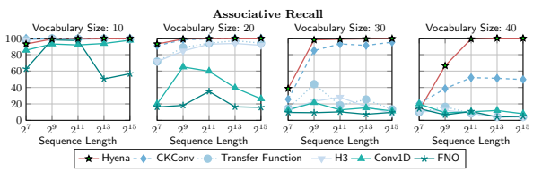

Figure 4.1: Benchmark of long convolution parametrizations in order 2 Hyena operators on associative recall (%). Our results show that implicit parametrizations scale more favorably in vocabulary size (number of possible values of tokens in the input) and length of the sequence.

## 4 Experiments 4.1 Shrinking The Gap On In-Context Learning

We begin by empirically motivating the Hyena design, including the choice of long convolution parametrization. We consider the suite of tasks described in Table 4.1. Our evaluation is grounded in recent work on mechanistic interpretability of Transformers (Elhage et al., 2021; Power et al., 2022; Olsson et al., 2022; Zhang et al., 2022). Recently, associative recall, in particular, has been successfully used to guide the design of H3 (Dao et al., 2022c). We extend the suite of tasks from these works and include benchmarking more challenging versions of each task . For example, solving associative recall with a vocabulary size of only 10 reveals whether a model is structurally capable of performing recall. Testing on much longer sequences and larger vocabularies reveals additional gaps in performance that are otherwise hidden.

How to parametrize long convolutions We compare the performance of the following long convolution parametrizations for S
1 and S
2in an order 2 Hyena:
- Conv1d: Explicit convolutions (regular convolution layers with fixed filter size). - FNO: Filters parametrized explicitly in the frequency-domain (Li et al., 2020). - H3: Implicit parametrization using state-space models (SSMs), in particular the standard S4 (Gu et al.,
2021).

- TransferFunc: Implicit parametrization via transfer functions, a classical system-theoretic generalization of SSMs8
- CKConv: Implicit parametrization using FFNs (Romero et al., 2021b).

8Transfer functions roughly correspond to a frequency-domain representation of SSMs.

| Task               | Prompt              | Target   |
|--------------------|---------------------|----------|
| Associative Recall | a, 1, b, e, 3, f, b | e        |
| Majority           | a, g, g, g, e, f, g | g        |
| Counting           | a, b, b, b, a, c, b | 4        |
| ICL of Functions   | x0, f(x0), . . . xn | f(xn)    |
| Arithmetic         | 1, 3, 5, +, 6, 8, 3 | 8, 1, 8  |

Table 4.1: A selection of our *mechanistic design* benchmarks.

| Sequence length   | Hyena   | FlashTransformer   | Transformer   | GSS   | H3   | AFT   | RWKV   |
|-------------------|---------|--------------------|---------------|-------|------|-------|--------|
| 30k               | 100.0   | 32.4               | ✗             | 5.3   | 8.4  | 2.3   | 12.4   |
| 64k               | 100.0   | 26.7               | ✗             | 2.1   | 4.3  | 1.2   | 6.5    |
| 131k              | 97.2    | ✗                  | ✗             | 0.1   | 0.6  | 0.8   | 2.3    |

Table 4.2: Test accuracy (%) for associative recall on longer sequences, vocabulary size 30. The symbol ✗ is used to mark settings where the model does not fit in memory.

- Hyena: Combination of implicit parametrizations via FFNs (with exponential decay modulation as shown in Figure 3.1), and short explicit filters.

All models have the same width and 2 layers. Figure 4.1 shows implicit approaches based on FFNs outperform other long convolutions, with the gap widening on longer sequences and larger vocabulary sizes. We train a different model on each setting of sequence length and vocabulary size. The ranking is correlated with the ability to decouple sequence length from parameter count (Hyena, CKConv, TransferFunc, H3) and expressivity (Hyena, CKConv). We observe similar trends on the other tasks.

Pushing sequence length to the limit Next, we evaluate associative recall performance on extremely long sequences of length 131k. To the best of our knowledge, these represent the first empirical display of attention-free in-context learning on sequences of this length. The gap between parametrization schemes widens as shown in Appendix A, with Hyena outperforming CKConv by 80 points.

Comparing operators We repeat our associative recall experiment, this time benchmarking different 2 layer models rather than changing the convolution parametrization: an order 2 Hyena, GSS (Mehta et al.,
2022), H3 (Dao et al., 2022c), AFT-conv (Zhai et al., 2021), RWKV (Peng, 2021), and a standard GPT
(Brown et al., 2020) using FlashAttention (Dao et al., 2022b). As shown in Table 4.2, Hyena is the only operator able to solve the task. Our results challenge the observation that only Transformers are capable of challenging in-context learning. Surprisingly, rankings of model performance at a fixed sequence length on The Pile are consistent with rankings on aggregate scores on our synthetics (Appendix C).

Generality of Hyena operators and filters Hyena operators and filters can also applied successfully beyond language tasks. We experiment on sequential CIFAR, where pixels are flattened as a sequence, and use the same operator defined for language. We reach the accuracy of standard S4 (Gu et al., 2021) with same model size (91%). In Section 4.5 and Appendix A, we discuss larger-scale image classification experiments with Hyena.

## 4.2 Language Modeling

Next, we verify the scaling of Hyena on autoregressive language modeling. We evaluate the perplexity on WikiText103
 (Table 4.3) and The Pile (Table 4.4). On the The Pile, we train different models for 5, 10, 15 billion tokens (different runs), adjusting the learning rate scheduler. Hyena is the first attention-free, convolution architecture to match GPT quality with a 20%9reduction in total FLOPs. Preliminary scaling laws are shown in Figure 4.2, collecting the training runs at 5, 10, 15 billion tokens. Each curve represents a different training run. In Appendix A, we provide results on the PG-19 long-range benchmark (Rae et al., 2019).

## 4.3 Downstream Evaluation

We perform a downstream evaluation on SuperGLUE (Wang et al., 2019) tasks. We compare Hyena (trained for 137 billion tokens) with the best available pre-trained attention-free model, RWKV (Peng, 2021) (trained

9The FLOP reduction consists in the *non-parametric* FLOPs of SelfAttention devoted to attention matrix computation. The ratio of parametric to non-parametric FLOPs (and hence the gains) depend on the ratio of model width D and sequence length L used in training.

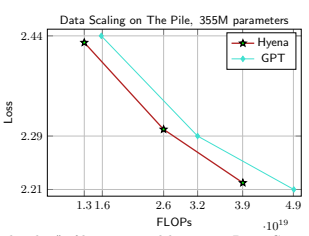

Figure 4.2: Preliminary "scaling law" of language models on The Pile. Comparison of our approach (red)
based on long convolutions and gating (Hyena) and a standard GPT (blue) (Brown et al., 2020). We reach perplexity of GPT with a smaller training FLOP budget.

Table 4.3: Perplexity on WikiText103
(same tokenizer). ∗ are results from (Dao et al., 2022c). Deeper and thinner models (Hyena-slim) achieve lower perplexity.

Table 4.4: Perplexity on The Pile for models trained until a total number of tokens e.g., 5 billion (different runs for each token total). All models use the same tokenizer (GPT2). FLOP count is for the 15 billion token run.

| Model                   | Perplexity   | Model           | 5B   | 10B   | 15B   | FLOPs (1019)   |
|-------------------------|--------------|-----------------|------|-------|-------|----------------|
| Transformer (125M)      | 18.6         | GPT (125M)      | 13.3 | 11.9  | 11.2  | 1.88           |
| Hybrid H3 (125M)        | ∗  18.5      | Hyena\-2 (153M) | 13.3 | 11.8  | 11.1  | 1.87           |
| Performer (125M)        | ∗  26.8      | GPT (355M)      | 11.4 | 9.8   | 9.1   | 4.77           |
| Reformer (125M)         | ∗  25.6      | Hyena\-2 (355M) | 11.3 | 9.8   | 9.2   | 3.93           |
| AFT\-conv (125M)        | 28.2         |                 |      |       |       |                |
| Linear Attention (125M) | ∗  25.6      |                 |      |       |       |                |
| Hyena\-3 (125M)         | 18.6         |                 |      |       |       |                |
| Hyena\-3\-slim (125M)   | 18.5         |                 |      |       |       |                |

for 332 billion tokens), and a reference GPTNeo (Black et al., 2021) (trained for 300 billion tokens) of the same size. Tables 4.5 and 4.6 summarize the results. Hyena performs similarly to other models despite having been trained on less than half the number of total tokens. We observe Hyena to display characteristic few-shot capabilities of standard Transformers, with some tasks e.g., MultiRC seeing a lift of more than 20% accuracy over zero-shot when the model is provided additional prompts as context. The improvements are more noticeable in generation tasks, where the additional prompts can instruct the model on how it should be responding to the questions. We report an additional downstream evaluation on the LAMBADA task (Paperno et al., 2016) in Appendix A.

| Model                       | WSC   | WIC   | RTE   | CB   | MultiRC   | ReCoRD   | BoolQ   | COPA   | Average   |
|-----------------------------|-------|-------|-------|------|-----------|----------|---------|--------|-----------|
| GPTNeo (Black et al., 2021) | 27.9  | 50.0  | 45.1  | 41.1 | 0.0       | 61.7     | 62.2    | 62.0   | 43.8      |
| RWKV (Peng, 2021)           | 13.4  | 52.3  | 46.9  | 25.0 | 0.0       | 58.5     | 59.2    | 66.0   | 40.2      |
| Hyena                       | 21.2  | 50.5  | 46.6  | 39.3 | 1.1       | 59.4     | 51.8    | 70.0   | 41.5      |

Table 4.5: Zero-shot accuracy (%) on SuperGLUE tasks for small models.

| Model                       | WSC   | WIC   | RTE   | CB   | MultiRC   | ReCoRD   | BoolQ   | COPA   | Average   |
|-----------------------------|-------|-------|-------|------|-----------|----------|---------|--------|-----------|
| GPTNeo (Black et al., 2021) | 38.5  | 50.0  | 53.8  | 42.9 | 22.4      | 61.4     | 61.0    | 63.0   | 49.1      |
| RWKV (Peng, 2021)           | 32.7  | 49.4  | 47.2  | 37.5 | 0.0       | 58.3     | 55.0    | 64.0   | 43.0      |
| Hyena                       | 39.4  | 50.1  | 47.6  | 46.4 | 26.7      | 58.1     | 56.0    | 70.0   | 49.3      |

Table 4.6: Few-shot (3) accuracy (%) on SuperGLUE tasks for small models.

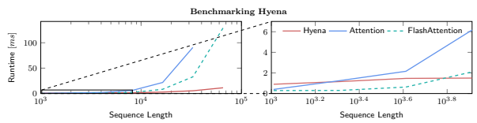

Figure 4.3: Benchmarking runtime of Hyena, Attention and FlashAttention with varying sequence lengths.

Batch size is set to 64. The figure on the right is an inset showing a zoomed-in portion of the figure on the left.

## 4.4 Benchmarking

We benchmark runtime of an order 2 Hyena operator compared to attention and FlashAttention layers (Dao et al., 2022b). Hyena uses a fused CUDA kernel to perform FFTConv (Dao et al., 2022c). We set batch size to 64 and measure runtime (in milliseconds). Results are provided in Figure 4.3. Hyena speedups reach 100× at sequence length 64K. Crossover points for Hyena and attention is at length 2048, and for Hyena and FlashAttention is between 4096 and 8196. Despite the absolute reduction in FLOPs, speedups are achieved only on longer sequences when the gap grows sufficiently large. This occurs because hardware utilization of Hyena is lower than FlashAttention. We expect the gap between theoretical maximum speedup to shrink with improved implementations of FFTConv and specialized hardware.

## 4.5 Large-Scale Image Classification

|                   |            | Table 4.7: Image classification top\-1 accuracy.   |              |         |
|-------------------|------------|----------------------------------------------------|--------------|---------|
| Model             | Patch Size | Seq Len                                            | Dataset      | Acc (%) |
| ViT (87M)         | 16x16      | 196                                                | ImageNet\-1k | 78.5    |
| Hyena\-ViT (88M)  | 16x16      | 196                                                | ImageNet\-1k | 78.5    |
| ViT (87M)         | 8x8        | 1024                                               | ImageNet\-1k | 80.0    |
| Hyena\-ViT (88M)  | 8x8        | 1024                                               | ImageNet\-1k | 79.8    |
| S4ND\-ISO (268k)  | \-         | \-                                                 | CIFAR\-10    | 89.9    |
| Hyena\-ISO (202k) | \-         | \-                                                 | CIFAR\-10    | 91.2    |

Finally, we demonstrate the potential of Hyena as a general deep learning operator by applying it to image classification. On ImageNet, we drop-in replace attention layers in the *Vision Transformer* (ViT) (Dosovitskiy et al., 2020) with the Hyena operator (without changes from its language counterpart) and match performance with ViT. We also show that using smaller image patches boosts performance in both attention and Hyena. Since this results in longer sequence lengths, we expect Hyena to outperform in speed as patches get more fine-grained approaching pixel-level. On CIFAR-2D, we test a 2D version of Hyena long convolution filters in a standard convolutional architecture, which improves on the 2D long convolutional model S4ND (Nguyen et al., 2022) in accuracy with a 8% speedup and 25% fewer parameters. See Appendix A.4 for additional vision architectures and training procedure details.

## 5 Discussion And Conclusion

In this work, we introduced an attention-free drop-in replacement to the core building block of many largescale language models. Hyena operators are a recurrence of gating and implicitly parametrized long convolutions, can be evaluated efficiently in subquadratic time, and can learn in-context on very long sequences.

On The Pile, deep stacks of Hyena operators constitute one of the first attention-free, convolutional architectures to match perplexity and downstream performance of Transformers with a significant reduction in training compute. Our promising results at the sub-billion parameter scale suggest that attention may not be all we need, and that simpler subquadratic designs such as Hyena, informed by a set of simple guiding principles and evaluation on mechanistic interpretability benchmarks, may form the basis for efficient large models. We are excited about what new capabilities Hyena opens up as we scale and optimize the inference speed of these models.

## Acknowledgments

We would like to thank Karan Goel, Albert Gu, Avanika Narayan, Khaled Saab, Michael Zhang, Elliot Epstein and Sabri Eyuboglu for helpful discussion and feedback on earlier drafts, and Together Computer and Crusoe for providing the compute used to train models in this paper. We gratefully acknowledge the support of NIH under No. U54EB020405 (Mobilize), NSF under Nos. CCF1763315 (Beyond Sparsity), CCF1563078 (Volume to Velocity), and 1937301 (RTML); US DEVCOM ARL under No. W911NF-21-2-0251 (Interactive Human-AI Teaming); ONR under No. N000141712266 (Unifying Weak Supervision); ONR N00014-20-1-2480: Understanding and Applying Non-Euclidean Geometry in Machine Learning; N000142012275 (NEPTUNE); NXP, Xilinx, LETI-CEA, Intel, IBM, Microsoft, NEC, Toshiba, TSMC, ARM, Hitachi, BASF, Accenture, Ericsson, Qualcomm, Analog Devices, Google Cloud, Salesforce, Total, the HAI-GCP Cloud Credits for Research program, the Stanford Data Science Initiative (SDSI), Department of Defense (DoD) through the National Defense Science and Engineering Graduate Fellowship (NDSEG) Program, and members of the Stanford DAWN project: Facebook, Google, and VMWare. This work is supported by NSF (1651565), AFOSR (FA95501910024), ARO (W911NF-21-1-0125), ONR, DOE (DE-SC0022222), CZ Biohub, and Sloan Fellowship. The U.S. Government is authorized to reproduce and distribute reprints for Governmental purposes notwithstanding any copyright notation thereon. Any opinions, findings, and conclusions or recommendations expressed in this material are those of the authors and do not necessarily reflect the views, policies, or endorsements, either expressed or implied, of NIH, ONR, or the U.S. Government.

## References

S. Arora, A. Narayan, M. F. Chen, L. J. Orr, N. Guha, K. Bhatia, I. Chami, F. Sala, and C. Ré. Ask me anything: A simple strategy for prompting language models. *arXiv preprint arXiv:2210.02441*, 2022.

R. Basri, M. Galun, A. Geifman, D. Jacobs, Y. Kasten, and S. Kritchman. Frequency bias in neural networks for input of non-uniform density. In *International Conference on Machine Learning*, pages 685–694. PMLR, 2020.

S. Black, L. Gao, P. Wang, C. Leahy, and S. Biderman. GPT-Neo: Large Scale Autoregressive Language Modeling with Mesh-Tensorflow, Mar. 2021. URL https://doi.org/10.5281/zenodo.5297715. If you use this software, please cite it using these metadata.

T. Brown, B. Mann, N. Ryder, M. Subbiah, J. D. Kaplan, P. Dhariwal, A. Neelakantan, P. Shyam, G. Sastry, A. Askell, et al. Language models are few-shot learners. *Advances in neural information processing systems*, 33:1877–1901, 2020.

C.-T. Chen. *Linear system theory and design*. Saunders college publishing, 1984. R. Child, S. Gray, A. Radford, and I. Sutskever. Generating long sequences with sparse transformers. arXiv preprint arXiv:1904.10509, 2019.

P. Cramer. Alphafold2 and the future of structural biology. *Nature structural & molecular biology*, 28(9):
704–705, 2021.

E. D. Cubuk, B. Zoph, J. Shlens, and Q. V. Le. Randaugment: Practical automated data augmentation with a reduced search space. In *Proceedings of the IEEE/CVF conference on computer vision and pattern* recognition workshops, pages 702–703, 2020.

T. Dao, A. Gu, M. Eichhorn, A. Rudra, and C. Ré. Learning fast algorithms for linear transforms using butterfly factorizations. In *International conference on machine learning*, pages 1517–1527. PMLR, 2019.

T. Dao, B. Chen, N. S. Sohoni, A. Desai, M. Poli, J. Grogan, A. Liu, A. Rao, A. Rudra, and C. Ré. Monarch:
Expressive structured matrices for efficient and accurate training. In *International Conference on Machine* Learning, pages 4690–4721. PMLR, 2022a.

T. Dao, D. Y. Fu, S. Ermon, A. Rudra, and C. Ré. Flashattention: Fast and memory-efficient exact attention with io-awareness. *arXiv preprint arXiv:2205.14135*, 2022b.

T. Dao, D. Y. Fu, K. K. Saab, A. W. Thomas, A. Rudra, and C. Ré. Hungry hungry hippos: Towards language modeling with state space models. *arXiv preprint arXiv:2212.14052*, 2022c.

A. Dosovitskiy, L. Beyer, A. Kolesnikov, D. Weissenborn, X. Zhai, T. Unterthiner, M. Dehghani, M. Minderer, G. Heigold, S. Gelly, et al. An image is worth 16x16 words: Transformers for image recognition at scale. arXiv preprint arXiv:2010.11929, 2020.

N. Elhage, N. Nanda, C. Olsson, T. Henighan, N. Joseph, B. Mann, A. Askell, Y. Bai, A. Chen, T. Conerly, et al. A mathematical framework for transformer circuits. *Transformer Circuits Thread*, 2021.

K. Fukushima and S. Miyake. Neocognitron: A self-organizing neural network model for a mechanism of visual pattern recognition. In *Competition and cooperation in neural nets*, pages 267–285. Springer, 1982.

L. Gao, S. Biderman, S. Black, L. Golding, T. Hoppe, C. Foster, J. Phang, H. He, A. Thite, N. Nabeshima, et al. The pile: An 800gb dataset of diverse text for language modeling. *arXiv preprint arXiv:2101.00027*, 2020.

S. Garg, D. Tsipras, P. Liang, and G. Valiant. What can transformers learn in-context? a case study of simple function classes. *arXiv preprint arXiv:2208.01066*, 2022.

A. Gu, T. Dao, S. Ermon, A. Rudra, and C. Ré. Hippo: Recurrent memory with optimal polynomial projections. *Advances in Neural Information Processing Systems*, 33:1474–1487, 2020.

A. Gu, K. Goel, and C. Ré. Efficiently modeling long sequences with structured state spaces. arXiv preprint arXiv:2111.00396, 2021.

K. He, X. Zhang, S. Ren, and J. Sun. Deep residual learning for image recognition. In Proceedings of the IEEE conference on computer vision and pattern recognition, pages 770–778, 2016.

D. Hendrycks, N. Mu, E. D. Cubuk, B. Zoph, J. Gilmer, and B. Lakshminarayanan. Augmix: A simple data processing method to improve robustness and uncertainty. *arXiv preprint arXiv:1912.02781*, 2019.

J. Hoffmann, S. Borgeaud, A. Mensch, E. Buchatskaya, T. Cai, E. Rutherford, D. d. L. Casas, L. A.

Hendricks, J. Welbl, A. Clark, et al. Training compute-optimal large language models. arXiv preprint arXiv:2203.15556, 2022.

G. Huang, Y. Sun, Z. Liu, D. Sedra, and K. Q. Weinberger. Deep networks with stochastic depth. In European conference on computer vision, pages 646–661. Springer, 2016.

N. Kitaev, Ł. Kaiser, and A. Levskaya. Reformer: The efficient transformer. *arXiv preprint arXiv:2001.04451*,
2020.

Y. LeCun, L. Bottou, Y. Bengio, and P. Haffner. Gradient-based learning applied to document recognition.

Proceedings of the IEEE, 86(11):2278–2324, 1998.

Y. Li, H. Yang, E. R. Martin, K. L. Ho, and L. Ying. Butterfly factorization. Multiscale Modeling &
Simulation, 13(2):714–732, 2015.

Y. Li, T. Cai, Y. Zhang, D. Chen, and D. Dey. What makes convolutional models great on long sequence modeling? *arXiv preprint arXiv:2210.09298*, 2022.

Z. Li, N. Kovachki, K. Azizzadenesheli, B. Liu, K. Bhattacharya, A. Stuart, and A. Anandkumar. Fourier neural operator for parametric partial differential equations. *arXiv preprint arXiv:2010.08895*, 2020.

P. Liang, R. Bommasani, T. Lee, D. Tsipras, D. Soylu, M. Yasunaga, Y. Zhang, D. Narayanan, Y. Wu, A. Kumar, et al. Holistic evaluation of language models. *arXiv preprint arXiv:2211.09110*, 2022.

S. Massaroli, M. Poli, J. Park, A. Yamashita, and H. Asama. Dissecting neural odes. *Advances in Neural* Information Processing Systems, 33:3952–3963, 2020.

H. Mehta, A. Gupta, A. Cutkosky, and B. Neyshabur. Long range language modeling via gated state spaces.

arXiv preprint arXiv:2206.13947, 2022.

B. Mildenhall, P. P. Srinivasan, M. Tancik, J. T. Barron, R. Ramamoorthi, and R. Ng. Nerf: Representing scenes as neural radiance fields for view synthesis. *Communications of the ACM*, 65(1):99–106, 2021.

E. Nguyen, K. Goel, A. Gu, G. W. Downs, P. Shah, T. Dao, S. A. Baccus, and C. Ré. S4nd: Modeling images and videos as multidimensional signals using state spaces. *arXiv preprint arXiv:2210.06583*, 2022.

C. Olsson, N. Elhage, N. Nanda, N. Joseph, N. DasSarma, T. Henighan, B. Mann, A. Askell, Y. Bai, A. Chen, et al. In-context learning and induction heads. *arXiv preprint arXiv:2209.11895*, 2022.

A. V. Oppenheim, A. S. Willsky, S. H. Nawab, and J.-J. Ding. *Signals and systems*, volume 2. Prentice hall Upper Saddle River, NJ, 1997.

D. Paperno, G. Kruszewski, A. Lazaridou, Q. N. Pham, R. Bernardi, S. Pezzelle, M. Baroni, G. Boleda, and R. Fernández. The lambada dataset: Word prediction requiring a broad discourse context. *arXiv preprint* arXiv:1606.06031, 2016.

B. Peng. RWKV-LM, 8 2021. URL https://github.com/BlinkDL/RWKV-LM. B. T. Polyak and A. B. Juditsky. Acceleration of stochastic approximation by averaging. SIAM journal on control and optimization, 30(4):838–855, 1992.

A. Power, Y. Burda, H. Edwards, I. Babuschkin, and V. Misra. Grokking: Generalization beyond overfitting on small algorithmic datasets. *arXiv preprint arXiv:2201.02177*, 2022.

A. Radford, J. W. Kim, T. Xu, G. Brockman, C. McLeavey, and I. Sutskever. Robust speech recognition via large-scale weak supervision. *arXiv preprint arXiv:2212.04356*, 2022.

J. W. Rae, A. Potapenko, S. M. Jayakumar, C. Hillier, and T. P. Lillicrap. Compressive transformers for long-range sequence modelling. *arXiv preprint*, 2019. URL https://arxiv.org/abs/1911.05507.

D. W. Romero, R.-J. Bruintjes, J. M. Tomczak, E. J. Bekkers, M. Hoogendoorn, and J. C. van Gemert.

Flexconv: Continuous kernel convolutions with differentiable kernel sizes. *arXiv preprint arXiv:2110.08059*, 2021a.

D. W. Romero, A. Kuzina, E. J. Bekkers, J. M. Tomczak, and M. Hoogendoorn. Ckconv: Continuous kernel convolution for sequential data. *arXiv preprint arXiv:2102.02611*, 2021b.

O. Ronneberger, P. Fischer, and T. Brox. U-net: Convolutional networks for biomedical image segmentation.

In *International Conference on Medical image computing and computer-assisted intervention*, pages 234– 241. Springer, 2015.

A. Roy, M. Saffar, A. Vaswani, and D. Grangier. Efficient content-based sparse attention with routing transformers. *Transactions of the Association for Computational Linguistics*, 9:53–68, 2021.

15 I. Schlag, K. Irie, and J. Schmidhuber. Linear transformers are secretly fast weight programmers. In International Conference on Machine Learning, pages 9355–9366. PMLR, 2021.

I. W. Selesnick and C. S. Burrus. Fast convolution and filtering. In *The Digital Signal Processing Handbook*,
pages 8–1. CRC Press, 2017.

V. Sitzmann, J. N. Martel, A. W. Bergman, D. B. Lindell, and G. Wetzstein. Implicit neural representations with periodic activation functions. *arXiv preprint arXiv:2006.09661*, 2020.

C. Szegedy, V. Vanhoucke, S. Ioffe, J. Shlens, and Z. Wojna. Rethinking the inception architecture for computer vision. In *Proceedings of the IEEE conference on computer vision and pattern recognition*, pages 2818–2826, 2016.

Z. Tu, H. Talebi, H. Zhang, F. Yang, P. Milanfar, A. Bovik, and Y. Li. Maxvit: Multi-axis vision transformer.

arXiv preprint arXiv:2204.01697, 2022.

A. Vaswani, N. Shazeer, N. Parmar, J. Uszkoreit, L. Jones, A. N. Gomez, Ł. Kaiser, and I. Polosukhin.

Attention is all you need. In *Advances in neural information processing systems*, pages 5998–6008, 2017.

A. Wang, Y. Pruksachatkun, N. Nangia, A. Singh, J. Michael, F. Hill, O. Levy, and S. Bowman. Superglue:
A stickier benchmark for general-purpose language understanding systems. *Advances in neural information* processing systems, 32, 2019.

S. Wang, B. Z. Li, M. Khabsa, H. Fang, and H. Ma. Linformer: Self-attention with linear complexity. *arXiv* preprint arXiv:2006.04768, 2020.

L. Yuan, Y. Chen, T. Wang, W. Yu, Y. Shi, Z.-H. Jiang, F. E. Tay, J. Feng, and S. Yan. Tokens-to-token vit: Training vision transformers from scratch on imagenet. In Proceedings of the IEEE/CVF international conference on computer vision, pages 558–567, 2021.

S. Yun, D. Han, S. J. Oh, S. Chun, J. Choe, and Y. Yoo. Cutmix: Regularization strategy to train strong classifiers with localizable features. In *Proceedings of the IEEE/CVF international conference on computer* vision, pages 6023–6032, 2019.

S. Zhai, W. Talbott, N. Srivastava, C. Huang, H. Goh, R. Zhang, and J. Susskind. An attention free transformer. *arXiv preprint arXiv:2105.14103*, 2021.

H. Zhang, M. Cisse, Y. N. Dauphin, and D. Lopez-Paz. mixup: Beyond empirical risk minimization. *arXiv* preprint arXiv:1710.09412, 2017.

Y. Zhang, A. Backurs, S. Bubeck, R. Eldan, S. Gunasekar, and T. Wagner. Unveiling transformers with lego:
a synthetic reasoning task. *arXiv preprint arXiv:2206.04301*, 2022.

Z. Zhong, L. Zheng, G. Kang, S. Li, and Y. Yang. Random erasing data augmentation. In Proceedings of the AAAI conference on artificial intelligence, volume 34, pages 13001–13008, 2020.

# Hyena Hierarchy Supplementary Material

|    | Contents   |                                                     |    |
|----|------------|-----------------------------------------------------|----|
| 1  |            | Introduction                                        | 1  |
| 2  |            | Preliminaries and Related Work                      | 3  |
|    | 2.1        | Explicit and Implicit Convolutions                  | 3  |
|    | 2.2        | The Self\-Attention Operator                        | 5  |
| 3  |            | Hyena: Definition and Properties                    | 5  |
|    | 3.1        | Hyena Recurrences                                   | 5  |
|    | 3.2        | Hyena Matrices                                      | 6  |
|    | 3.3        | Hyena Filters                                       | 7  |
|    | 3.4        | Hyena Algorithm                                     | 8  |
| 4  |            | Experiments                                         | 9  |
|    | 4.1        | Shrinking the gap on in\-context learning           | 9  |
|    | 4.2        | Language Modeling                                   | 10 |
|    | 4.3        | Downstream Evaluation                               | 10 |
|    | 4.4        | Benchmarking                                        | 12 |
|    | 4.5        | Large\-Scale Image Classification                   | 12 |
| 5  |            | Discussion and Conclusion                           | 13 |
|    |            | A Experimental Details                              | 18 |
|    |            | A.1  Mechanistic Design Synthetic Benchmarks        | 18 |
|    |            | A.2  Language Modeling                              | 19 |
|    |            | A.3  Downstream Evaluation                          | 21 |
|    |            | A.4  Image Classification                           | 21 |
| B  |            | Theoretical Results and Details                     | 21 |
|    |            | B.1  Proofs                                         | 21 |
|    |            | B.2  Analysis of Data\-Controlled Mechanisms        | 22 |
| C  |            | Discussion and Additional Results                   | 24 |
|    |            | C.1  Learning Arithmetic                            | 25 |
|    |            | D Samples and Visualizations                        | 26 |
|    |            | D.1  Hyena Matrices                                 | 26 |
|    |            | D.2  Hyena Filters                                  | 31 |
|    |            | D.3  Positional Encoding and Filters Initialization | 31 |
|    |            | D.4  Downstream Examples                            | 35 |

## A Experimental Details

An implementation of Hyena can be found at this link.

## A.1 Mechanistic Design Synthetic Benchmarks

Our synthetic reasoning are inspired by mechanistic interpretability (Elhage et al., 2021), *in-context learning* (ICL) (Garg et al., 2022) and language model benchmarking (Liang et al., 2022) research. The evaluation revolves around 4 main tasks:
- Associative recall: Each string is produced by concatenating key-value tuples from a different random dictionary. This test verifies whether a model is able to extract right value given a key as prompt, effectively applying a data-controlled shift (delay).

- Majority voting and counting: Testing if a model can *densely* activate its data-controlled matrix i.e.,
through many non-zero entries (consider the string '*a a a a a a a a a a b* → a').

- ICL of linear functions: Verifying whether a model can perform ICL on real-valued inputs. Prompts are generated as x1, wkx1*, . . . , x*n → w kxn, where both xk and w k ∈ Rno are sampled from a normal distribution.

- Arithmetic: Basic capability check.

For each task, we train models using the hyperparameters shown in Table A.1. We consider increasing settings of difficulty controlled by sequence length, spanning values 1024, 2048, 4098, 8196, 16392, 32784, 65568, 131136 and vocabulary sizes 10, 20, 30, 40. For ICL of functions, we vary instead the dimension no.

Note that for associative recall on longer sequences, multiple copies of key-value tuples appear in the prompt. To see this, consider how likely it is to sample multiple copies of a particular key-value pair with a vocabulary size of 40, in order to form a sequence of 100k characters. Models capable of looking further back in the sequence effectively see more data, and can solve challenging versions of the in-context learning task. Increasing the vocabulary size has the increasing the average distance between instances of the same key-value pair in each prompt, highlighting performance gaps between different approaches.

Table A.1: (Hyperparameter settings for reasoning and in-context learning tasks.).

| Optimizer              | AdamW              |
|------------------------|--------------------|
| Optimizer momentum     | β1, β2 = 0.9, 0.98 |
| Base learning rate     | 0.0005             |
| Weight decay           | 0.1                |
| Dropout                | None               |
| Batch size             | 32                 |
| Training epochs        | 200                |
| Num samples            | 2000               |
| Learning rate schedule | cosine decay       |
| Warmup epochs          | 10                 |
| Warmup schedule        | linear             |
| Number of layers       | 2                  |
| Width                  | 64                 |

Long convolution comparisons: We compare different convolution parametrizations, embedding them in an order 2 Hyena operator. All convolutions are applied separately to input channels (referred to as single-input single-output (SISO) in signal processing, or *depthwise* in other machine learning contexts).

- Conv1d: Explicit convolutions (regular convolution layers with fixed filter size). We use a fixed filter size of 64, to match parameters of the other approaches.

- FNO: Filters parametrized explicitly in the frequency-domain (Li et al., 2020). We set the number of modes to 64.

- H3: Implicit parametrization using state-space models (SSMs), and in particular the standard S4 (Gu et al.,
2021). We set the state dimension to 64.

- TransferFunc: Implicit parametrization via transfer functions, a classical system-theoretic generalization of SSMs. Transfer functions are defined by a ratio of polynomials (we parametrize the coefficients, and evaluate the polynomials efficiently via FFTs). We set the order to 64.

- CKConv: Implicit parametrization using FFNs (Romero et al., 2021b). - item Hyena: Combination of implicit parametrizations via FFNs (with exponential decay modulation as shown in Figure 3.1), and short explicit filters.

CKConv and Hyena use the same size of FFNs (width 32 to match in parameters). In Table A.1, we report additional results on the challenging setting of sequence length 131072 and vocabulary size 30. Implicit parametrizations of convolutions outperform explicit parametrizations on associative recall, with CKConv and Hyena greatly improving on the ability to extract the right key, value relations from different inputs. In Appendix C, we discuss how results on our synthetic tasks can be indicative of performance at a larger scale.

Table A.2: Test accuracy (%) in associative recall on sequences of length 131072, vocabulary size 30.

| Hyena   | CKConv   | TransferFunc   | H3   | FNO   | Conv1d   |
|---------|----------|----------------|------|-------|----------|
| 97.2    | 14.3     | 0.5            | 0.6  | 0.3   | 0.5      |

Operator comparisons: We compare different models on the same associative recall task, using hyperparameters in Table A.1. Hyena uses our filter parametrization with decay windowing for long convolutions, and short explicit convolutions of size 3 after the dense input projections. All other models use defaults from their largest scale experiment, while keeping the size to 2 layers and width 64.

A note on Transformer performance Transformers can solve associative recall tasks with longer sequences, provided the length does not prevent them from fitting in memory, and enough examples are present in the training data. In all our experiments, we keep the number of samples fixed (2000), a regime where Transformers struggle to find the generalizing solution (see Table A.1).

For shorter sequences (see Appendix C), Transformers solve the task easily even with limited data, comparably to Hyena.

More broadly, these different properties of attention and attention-free token-mixing layers may explain improved performance when they are combined in hybrid architectures (Dao et al., 2022c). The focus on this work has been identifying an architecture capable of performing without attention, which is necessary to tackle domains where long sequences are common. However, when training with shorter sequences (up to 8k), if final downstream performance is the only metric of interest, improved results can be obtained by hybridizing our models similarly to H3 (Dao et al., 2022c).

## A.2 Language Modeling

WikiText103: We train 125M parameter models on WikiText103 and compare perplexity to Transformers, hybrid models such as H3 (Dao et al., 2022c), and other variants of subquadratic attention. All models use the same GPT2 tokenizer with vocabulary size 50257. We test order 3 Hyena with our proposed filter parametrization for two long convolutions, and a shorter explicit convolution on the third. We also consider Hyena (slim) that are 1.5x deeper than Transformers (12 versus 18 layers), with width multiplier of the FFNs set to 2. We find trading-off width for depth to be generally favourable. These modifications are made possible by the reduction in overall FLOPs of Hyena operators compared to self-attention, in particular non-parametric FLOPs which include materialization of the attention matrix, application of softmax, and matrix-value reduction.

| Optimizer                 | AdamW              |
|---------------------------|--------------------|
| Optimizer momentum        | β1, β2 = 0.9, 0.98 |
| Peak learning rate        | 0.0006             |
| Warmup learning rate init | 0.000001           |
| Learning rate min         | 0.00006            |
| Weight decay              | 0.1                |
| Dropout                   | None               |
| Batch size                | 256                |
| Learning rate schedule    | cosine decay       |
| Warmup schedule           | linear             |

Table A.3: Hyperparameter settings for The Pile, 125M).

The Pile: We follow a same procedure and train 125M and 355M-sized models on The Pile (Gao et al.,
2020). Hyperparameters are reported in Table A.3. Hyperparameters for 355M are the same beyond a reduction in peak learning rate to 4 · 10−4. For larger models (1.3B), we set a learning rate of 2.2 · 10−4.

We perform three experiments for each model type and size, and train for 5, 10, 15 billion tokens at a sequence length 2024 and global batch size 256. All models are trained on a single node of 8 A100 80GB
GPUs. We use order 2 Hyenas, with the same architectural considerations described above for WikiText103.

In addition to our data scaling experiments at 5, 10 and 15 billion tokens, we provide preliminary results for models at the 1.3B parameter scale (10.8 perplexity after 5 billion tokens), and train a 153M model (130 billion tokens), reaching a perplexity of 9.8. The 153M is the same used in our downstream evaluation on SuperGLUE.

Training hyperparameters match those of standard GPT training pipelines, and are thus likely suboptimal for new attention-free architectures such as Hyena. We run some preliminary experiments and find that e.g., some modifications to the learning rate schedule, currently involving linear warmup and cosine decay, to improve perplexity at convergence of Hyena models (we recommend slightly lower learning rates for Hyena models compared to GPT of a similar size). Despite these findings, we use standard GPT hyperparameters for both GPT and Hyena.

PG-19 We also report results of additional training runs on other datasets. We train a Hyena 153M model on the standard PG-19 long-range corpus (Rae et al., 2019), with a context length of 16k tokens, reaching a test perplexity of 14.6 (using the standard GPT2 tokenizer) in 8 epochs.

|            |       | Table A.4:   | Hyena     | architecture hyperparameters.   |                  |            |
|------------|-------|--------------|-----------|---------------------------------|------------------|------------|
| Size       | depth | width        | FFN width | filter FFN width                | filter FFN depth | sine freq. |
| 125M       | 12    | 768          | 3072      | 64                              | 4                | 14         |
| 125M\-slim | 18    | 768          | 1536      | 64                              | 4                | 14         |
| 153M       | 18    | 864          | 1728      | 64                              | 4                | 14         |
| 355M       | 36    | 1024         | 2048      | 64                              | 4                | 14         |
| 1.3B       | 36    | 2048         | 4096      | 64                              | 4                | 14         |

Architectures Architectural hyperparameters for Hyena are shown in Table A.4. We use sine as an activation function for the FFN of Hyena filters.

FLOP computation The number of *floating point operations* (FLOPs) reported in the main text are computed using the same strategy as in (Hoffmann et al., 2022). For GPT, we do not use the approximation, opting instead for the more accurate formula based on FLOP counts of individual layers. In the case of Hyena, FLOPs are computed using the same method, except attention layers are replaced by:
i. Projections: order × d_model × d_model × seq_len.

ii. Short conv on projections: order × d_model × seq_len × filter_len (usually 3).

iii. FFTConv: 5 × (order - 1) × d_model × log(seq_len) × seq_len. iv. Output: d_model × d_model × seq_len.

with a leading factor 2 to account for both additions and multiplications.

## A.3 Downstream Evaluation

SuperGLUE: We evaluate models on the SuperGLUE (Wang et al., 2019) with the parsing pipeline of (Arora et al., 2022). For all tasks except WIC, CB and BoolQ, we generate a response using greedy decoding, then check for the gold label. WIC, CB and BoolQ use logit scoring instead of generation.

Models The models considered are the open-source checkpoint of GPTNeo 125M trained for 300B tokens The Pile, and the RWKV-v4 169M checkpoint trained for 332B tokens on The Pile. Hyena is a 153M model trained for 137B tokens on The Pile.

LAMBADA: We evaluate Hyena on the LAMBADA (Paperno et al., 2016) task. We apply a stop word filter and check whether predictions for all tokens corresponding to the last word agree with the ground truth. The small Hyena model trained on 137B tokens reaches 44.64% accuracy.

## A.4 Image Classification

a ImageNet: We use ImageNet-1k which consists of 1000 classes and 1.3M images and train from scratch with no outside data on 8 Nvidia A100 GPUs. In our ViT benchmark, we swap the attention layers with the Hyena operator defined in our language experiments, and remove the class token and positional embeddings, similar to S4ND (Nguyen et al., 2022). The parameter count is kept similar at 87M ViT-B (base) vs 88M Hyena-ViT. The training procedure from T2T-ViT (Yuan et al., 2021) is used, including augmentations such as RandAugment (Cubuk et al., 2020), Mixup (Zhang et al., 2017), and AugMix (Hendrycks et al., 2019). See table A.5 for hyperparameter settings used.

CIFAR-10: We use CIFAR-10 in sequential and 2D experiments. For sequential, we use the Hyena operator defined in our language tasks and compare with an S4 model (Gu et al., 2021) of the same size by swapping layers in the residual blocks. In 2D, we learn Hyena filters (in both x and y dimensions) that are equal to the size of the input shape, and forgo the gating mechanism from our language experiments. We window (i.e., apply a soft mask spatially to) the Hyena filters with a decay term. The rate of decay varies across channels, ensuring different sizes of the filters at initialization. We compare with another implicit 2D convolution, S4ND (Nguyen et al., 2022), by swapping the model layers with the 2D Hyena filters. The "isometric" model consists of 4 residual blocks of model dimension 128. We use basic image augmentations, 0.1 dropout, 0.03 weight decay and train for 100 epochs using a Nvidia T4 GPU.

## B Theoretical Results And Details B.1 Proofs

Proof of Proposition 3.1 Proof. A discrete L*-by-*L operator is causal if it is lower triangular, i.e., when there is no leakage of future input information to the output. The Hyena operator H is the product of alternating diagonal and Toeplitz matrices. Thus, if all the Toeplitz matrices S
n h are lower triangular then H is lower triangular. In turn, each S
n h is lower triangular if and only if the filter h is causal, concluding the proof.

Table A.5: ViT and ViT-Hyena settings for ImageNet-1k).

| Image size                                     | 2242                     |
|------------------------------------------------|--------------------------|
| Optimizer                                      | AdamW                    |
| Optimizer momentum                             | β1, β2 = 0.9, 0.999      |
| Weight init                                    | trunc. normal (std=0.02) |
| ViT base learning rate                         | −3  1e                   |
| Hyena\-ViT base learning rate                  | −4  2e                   |
| ViT weight decay                               | 0.05                     |
| Hyena\-ViT weight decay                        | 0.01                     |
| Dropout                                        | None                     |
| Batch size                                     | 1024                     |
| Training epochs                                | 300                      |
| Learning rate schedule                         | cosine decay             |
| Warmup epochs                                  | 10                       |
| Warmup schedule                                | linear                   |
| Randaugment (Cubuk et al., 2020)               | (9,0.5,layers=2)         |
| Mixup (Zhang et al., 2017)                     | 0.8                      |
| Cutmix (Yun et al., 2019)                      | 1.0                      |
| Random erasing (Zhong et al., 2020)            | 0.25                     |
| Label smoothing (Szegedy et al., 2016)         | 0.1                      |
| Stochastic depth (Huang et al., 2016)          | 0.1                      |
| Exp.mov. avg (EMA) (Polyak and Juditsky, 1992) | None                     |

## B.2 Analysis Of Data-Controlled Mechanisms

We discuss the surrogate attention mechanism of Hyena-2: q, k, v 7→ y:
zt = kt(ϕ ∗ v)t

$\left(\mathfrak{S}\right)$. 
$$(\psi*z)_{t}$$
yt = qt(ψ ∗ z)t If ϕ and ψ are convolutions parametrized via state-space models (SSMs), the above resembles the H3 mechanism (Dao et al., 2022c). We investigate the effect of the convolutional kernels ϕ and ψ on the attention layer. We start by introducing a matrix representation of the layer, and we isolate the *attention matrix* A
ψϕ(*q, k*)
such that

$$y=\mathrm{A}_{\varphi}^{\psi}(q,k)v.$$
ϕ(*q, k*)v. (9)
Isolating the surrogate attention matrix In the case of length-L discrete sequences

$\left(\underline{\mathbf{0}}\right)$. 
$$(10)$$
Therefore we can rewrite (8) as

The case or length-$L\,$ of . 
 #### 2.2.2.2 in the case of L and L  $z_t=k_t\sum_{m=0}^{L-1}\varphi_{t-m}v_m$  $y_t=q_t\sum_{m=0}^{L-1}\psi_{t-m}z_m$  ... 
 where (b) as  $ y_{t}=q_{t}\sum_{m=0}^{L-1}\psi_{t-m}k_{m}\sum_{n=0}^{L-1}\varphi_{m-n}v_{n}$  $ =q_{t}\sum_{m=0}^{L-1}\sum_{n=0}^{L-1}\psi_{t-m}k_{m}\varphi_{m-n}v_{n}$       Move $\psi$, $k$ in  $ =q_{t}\sum_{n=0}^{L-1}\sum_{m=0}^{L-1}\psi_{t-m}k_{m}\varphi_{m-n}v_{n}$       Index shift  $ =\sum_{n=0}^{L-1}q_{t}\sum_{m=0}^{L-1}\psi_{t-m}k_{m}\varphi_{m-n}v_{n}$
ψt−mkmϕm−nvn Move ψ, k inside inner sum
$$\tau\;\mathrm{sum}$$
$\left(11\right)$. 

And we can define the surrogate attention matrix A
ψϕ(*q, k*)

$$[{\sf A}_{\varphi}^{\psi}(q,k))]_{t,t^{\prime}}=q_{t}\sum_{m=0}^{L-1}\psi_{t-m}k_{m}\varphi_{m-t^{\prime}}.$$
0 . (12)
Continuous Signals: We can also consider the case of continuous signals on a group G. In the continuous case, we can expand the convolutions in (8) as

$$(\varphi*v)_{t}=\int_{G}\varphi_{t-g}v_{g}\mathrm{d}g,\qquad(\psi*z)_{t}=\int_{G}\psi_{t-g}z_{g}\mathrm{d}g$$  (2). 
G G This allows us to rewrite (8) as yt = qt(ψ ∗ k(ϕ ∗ v))t = qt Z G ψt−g kg Z G ϕg−τ vτdτ dg = qt Z G Z G ψt−gkgϕg−τ vτdτ dg = qt Z G Z G ψt−gkgϕg−τ vτdg dτ Variable swap = Z G qt Z G ψt−gkgϕg−τ vτdg dτ Pull qt in τ integral = Z G qt Z G ψt−gkgϕg−τdg vτdτ Pull vτ out of g integral. There is a linear operator A : v 7→ y = Av which we interpret as the surrogate attention operator. A is conditioned on the query q, key k and filters ϕ and ψ, A = Aψϕ(q, k). The kernel K of the operator is given by (14)
$$(12)$$
$$(13)$$
$$(14)$$
$${\mathcal{K}}(t,t^{\prime})=q_{t}\int_{G}\psi_{t-g}k_{g}\varphi_{g-t^{\prime}}\mathrm{d}g$$
0dg (15)
Operator decomposition of the surrogate attention matrix We can decompose the linear map v 7→ y; y = A
ψϕ(*q, k*)v into a sequence of factors, each dependent on a projection of the input A
ψϕ(*q, k*) =
A
ψ(q)Aϕ(k). Let Dq and Dk be the L-by-L diagonal matrices whose respective main diagonal entries are the respective entries of q and k. Then, we have that

$$\begin{array}{l}{{\mathrm{A}^{\psi}(q)=\mathsf{D}_{q}\mathsf{S}_{\psi},}}\\ {{\mathrm{A}_{\varphi}(k)=\mathsf{D}_{k}\mathsf{S}_{\varphi},}}\end{array}$$
$\mathbb{D}_{q}=\text{diag}(q)$,  $\mathbb{D}_{k}=\text{diag}(k)$.  $\mathbb{D}_{q}=\text{diag}(k)$.  
ψ(q) = DqSψ, Dq = diag(q),
Aϕ(k) = DkSϕ, Dk = diag(k).
$$(15)$$
$$(16)$$
$$(17)$$
$$(18)$$

The matrix has been decomposed into two terms A
ψ(q) and Aϕ(k) constructed by multiplying the diagonal matrices Dq and Dk with the Toeplitz matrices Sψ and Sϕ. Sψ and Sϕ are the kernels of the convolution operators with filter's impulse responses ψ and ϕ respectively. In the current applications of interest, ψ and ϕ are chosen to be causal, i.e. ψ[t] = 0 for t < 0 and ϕ[t] = 0 for t < 0. This results in Sψ and Sϕ to be lower triangular matrices

$$\mathsf{S}_{\psi}=\begin{bmatrix}\psi_{0}&0&\cdots&0\\ \psi_{1}&\psi_{0}&\cdots&0\\ \vdots&\ddots&\ddots&\vdots\\ \psi_{L-1}&\psi_{L-2}&\cdots&\psi_{0}\end{bmatrix},\qquad\mathsf{S}_{\psi}=\begin{bmatrix}\varphi_{0}&0&\cdots&0\\ \varphi_{1}&\varphi_{0}&\cdots&0\\ \vdots&\ddots&\ddots&\vdots\\ \varphi_{L-1}&\varphi_{L-2}&\cdots&\varphi_{0}\end{bmatrix}.$$  The surrogate attention matrix is then given by  $$\mathsf{A}_{\psi}^{\mathsf{B}}(q,k)=\mathsf{D}_{q}\mathsf{S}_{\psi}\mathsf{D}_{k}\mathsf{S}_{\varphi}$$
. (17)
We can expand the matrix multiplications in (16) in the case of causal filters ϕ and ψ as

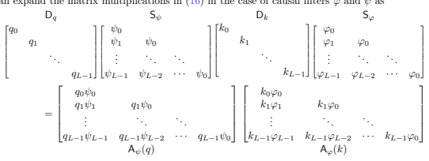

$\left(19\right)$. 
Fourier decomposition of convolution operators: The kernels of the convolution operators Sψ and Sϕ are diagonalized by the Fourier transform matrix W ∈ C
L×L, Wnm = z m, z = e j2*πn/L*. The Fourier transform of the convolution operator Sψ is given by Sψ = W∗DΨW, SΦ = W∗DΦW (20)
where DΨ, DΦ ∈ C
L×L are diagonal matrices constructed from the frequency responses (the discrete Fourier transform) Ψ = Wψ, Φ = Wϕ, respectively. This decomposition can be used to simplify the matrix multiplication in (19):
A = DqSψDkSϕ = DqW∗DΨWDkW∗DΦW (21)
An important property of the above is the non-commutativity of Dq and Sk with W∗. If the two operators commuted, we would obtain

would obtain  $$\begin{array}{l}\mbox{A}=\mbox{D}_{q}\mbox{W}^{*}\mbox{D}_{\Psi}\mbox{W}\mbox{D}_{k}\mbox{W}^{*}\mbox{D}_{\Phi}\mbox{W}=\mbox{W}^{*}\mbox{D}_{q}\mbox{D}_{\Psi}\mbox{D}_{k}\mbox{D}_{\Phi}\mbox{W}\\ \end{array}$$

$\bigstar|$. 
A = DqW∗DΨWDkW∗DΦW = W∗DqDΨDkDΦW (22)
which reduces the entire layer to a simple convolution. The non-commutativity of the *gating* term acts as a non-linearity in chain of convolution operators.

## C Discussion And Additional Results

Vocabulary size scaling Table C.1 showcases interesting correlation between associative recall performance for varying vocabulary sizes and loss on the The Pile. In this case, we fix sequence length for associative recall to be 2048, the same sequence length used to train all models on the The Pile.

We observe a similar phenomenon on other slices of tasks from our mechanistic design benchmarks, indicating that it may be possible to derive predictive laws for performance at scale, based on fast experimentation on synthetic tasks with models of 1 or 2 layers. Surprisingly, performance on our language synthetics appears to be further linked to performance as attention replacement in other domains (Appendix A.4 for results on image classification).

Table C.1: Hyena Accuracy on associative recall with varying vocabulary size 10, 20, 30, 40 in relation to test loss on The Pile after 5 billion tokens. We notice a correlation between the two performance metrics, suggesting that slices of our mechanistic design synthetics may be potentially predictive of performance at scale.

| Model       | Acc @ 10   | Acc @ 20   | Acc @ 30   | Acc @ 40   | Loss @ 5B on The Pile   |
|-------------|------------|------------|------------|------------|-------------------------|
| Conv1d      | 32         | 11         | 10         | 8          | 4.21                    |
| AFT\-conv   | 55         | 21         | 12         | 10         | 3.57                    |
| H3          | 92         | 60         | 13         | 10         | 2.69                    |
| Transformer | 100        | 100        | 92         | 82         | 2.59                    |
| Hyena       | 100        | 100        | 98         | 85         | 2.59                    |

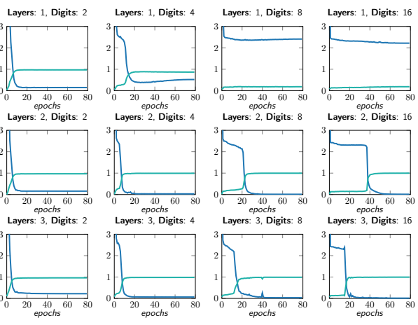

Figure C.1: Test loss and accuracy of Hyena on addition with different numbers of digits and model depths. Each plot reports the results of a different experiment, with the curve tracing test results during training.

Single layer recall All experiments on our synthetic tasks default to 2 layer models. We choose 2 as it is the canonical number for mechanistic analysis of Transformers (Elhage et al., 2021) based on *circuits*.

Interestingly, a single layer of Hyena (width 64) is capable of performing associative recall, solving the task completely even in the challenging setting with vocabulary size 40. Reverse engineering exactly how the single Hyena operator is able to perform recall is left for future work.

## C.1 Learning Arithmetic

We showcase an additional task in our mechanistic design benchmark: learning arithmetic. We train Hyena models of increasing depth (1, 2 and 3 layers) on a dataset of Dn-digit addition. As an example, a 3-digit addition input sample is given by the sequence 1, 2, 3, 9, 5, 4, 1, 0, 7, 7 where the first 6 digits contain the two 3 digits numbers to add, and the last 4 the result. Our models are optimized using standard autoregressive training i.e., predicting the next token, since they are causal.

In particular, we optimize models to learn a map x 7→ y where x is the original prompt without the last element, and y equal to x shifted right by one position. We mask the first 2Dn − 1 elements of the loss for each sequence since they contain predictions for addends and not results.

We report results in Figure C.1. A single layer of Hyena is able to learn to perform addition with up to 4 digits. Longer numbers require deeper models. In our experiments, alternative architectures such as AFT-conv struggle to learn arithmetic, signaling a cap in capability.

## D Samples And Visualizations D.1 Hyena Matrices

We provide visualizations of attention and Hyena matrices activated by test strings. In D.1, D.2, we compare GPTNeo (Black et al., 2021) attention matrices with Hyena matrices extracted by our pre-trained small Hyena model. In D.3 and D.4, we provide additional Hyena matrices for the 355M model, activated by test strings of different length.

For attention, we visualize the raw post-softmax matrix. For Hyena matrices, we plot the (element-wise)
absolute value of H(u):

$$H(u)=\mathbb{D}_{x}^{N}\mathbb{S}_{h}^{N}\cdots\mathbb{D}_{x}^{2}\mathbb{S}_{h}^{2}\mathbb{D}_{x}^{1}\mathbb{S}_{h}^{1}$$

Hˆ(u)ij = |H(u)ij | Since Hyena does not normalize the entries of its matrices with e.g., softmax, there are notable differences with attention: (1) the entries of H(u) can be either positive and negative, and (2) the magnitude is unconstrained.

We observe the magnitude of matrices in pre-trained Hyena models to be around 10−3.

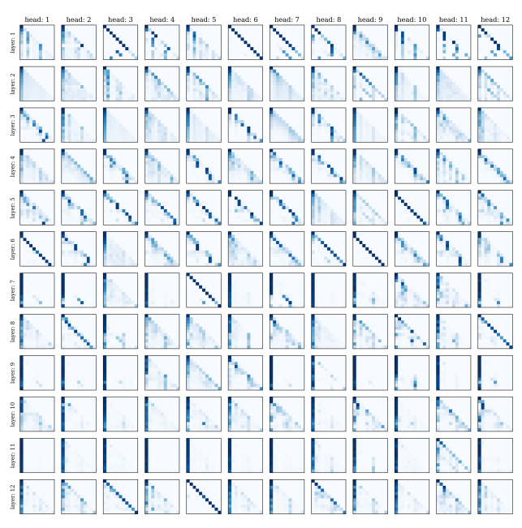

Figure D.1: Attention matrices from a GPTNeo small model. "We use the test string " Attention is all you need.  Attention is".

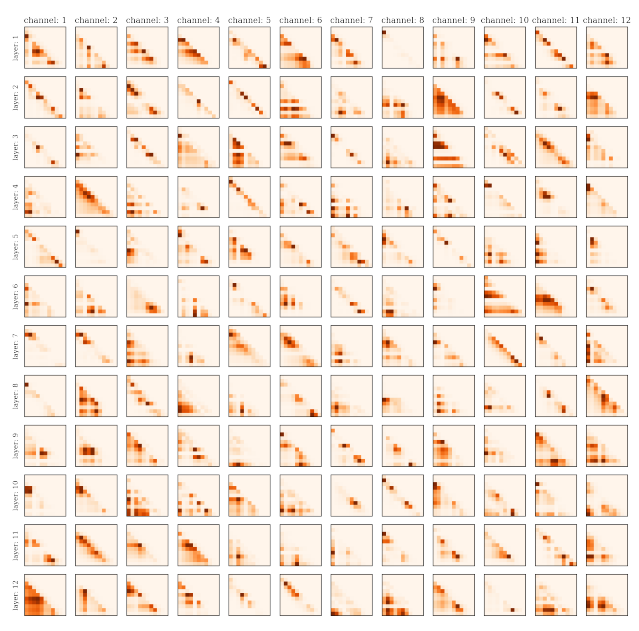

Figure D.2: Hyena matrices from a Hyena small (same model used for SuperGLUE downstream evaluations).

"We use the test string "Attention is all you need.  Attention is".  We note that Hyena has a different data-controlled matrix for each channel i.e. for each dimension in its width, since it does not use heads.

Figure D.3: Data-controlled Hyena matrices (355M model), activated by the string "*When a doctor doctors*

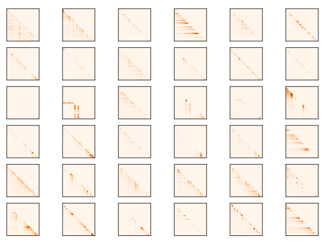 a doctor, does the doctor doing the doctoring doctor as the doctor being doctored wants to be doctored or does the doctor doing the doctoring doctor as they want to doctor? ". Rows in the plot are matrices from different layers, columns are matrices from different channels. The operator shows characteristic patterns of attention matrices, without attention.

Figure D.4: Data-controlled Hyena matrices (355M model), activated by the string "*Mrs. Dursley, Mr.*

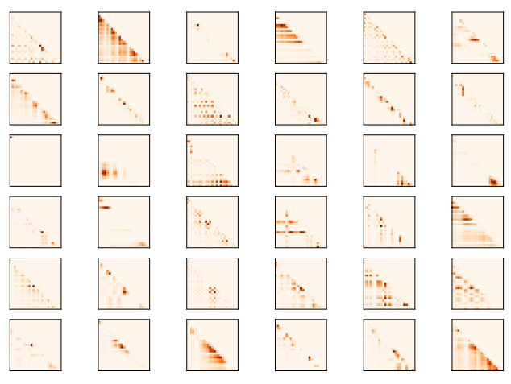 Dursley, Dudley Dursley", from *Causal scrubbing: results on induction heads*. Rows in the plot are matrices from different layers, columns are matrices from different channels.

## D.2 Hyena Filters

Figure D.5 provides a visualization of Hyena long convolution filters at initialization and after training to completion on The Pile.

We find a substantial performance difference (up to 5% perplexity) between initialization schemes. If the filters at initialization are excessively smooth (see Appendix D.3 for a discussion of positional encoding and activation), the model finds a worse solution and takes longer to converge. Further, we observe initialization schemes that regularize filters towards typical filters learned at convergence to decrease performance. These observations are in line with performance gaps between convolution parametrization schemes discussed in main text and Appendix A.1. In particular, the performance improvements obtained via Hyena filters could be due to easier optimization in the space of convolutional filters.

At convergence, Hyena learns a collection of lower-order filters with a similar structure, which can be exploited to further speed up inference after training.

## D.3 Positional Encoding And Filters Initialization

The positional encoding chosen for the Hyena filters is a truncated complex exponential basis. Specifically, with ρk(t) = e i2*πkt/L* for k = 0*, . . . K* − 1, the positional encoding is defined as a map from R to R
2K+1 such that PositionalEncoding(t) = -t R[ρ0](t) · · · R[ρK−1](t) I[ρ0](t) *· · ·* I[ρK−1](t)
where R[·], I[·] denote the real and imaginary part of their argument, respectively. In the main text, we use De = 2K + 1 to denote the size of a positional encoding with K features. The number of features of the positional encoding has an impact on the filter initialization and training performances. In particular, we show how K leads to a preconditioning of the spectrum of the filter at initialization. Figures D.6, D.7, D.8 display the initialized filters (with no Window function) for different values of K ({8, 32, 64}) for L = 128 and frequency ωa of sinusoidal activation σ(·) = sin(ωa·) set to 1. We notice how the choice of K induces a bias in the modeled frequencies at initialization. Specifically the filters resemble low-pass filters with a cut-off frequency of approximatively 2K + 1.

This cut-off frequency is strongly related to the *smoothness* of the filter; as previously mentioned, we empirically observe better training dynamics of filters initialized to be non-smooth, i.e. with a rich highfrequency content. While we can achieve good initializations by increasing K, this results in larger FFNs (its input dimension is 2K + 1, i.e. the number of positional encoding features) which come with a higher parameter count. A more efficient solution is to increase the frequency ωa of the sinusoidal activation. Figure D.9 show how with K = 8 we can cover the full spectrum simply by setting ωa = 10.

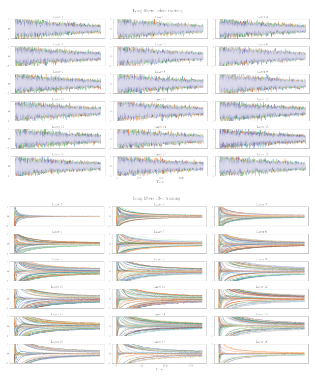

Figure D.5: [Top]: Long convolution Hyena filters at initialization (153M parameters, 18 layer model). [Bottom]: Filters after training for 130 billion tokens on THE PILE.

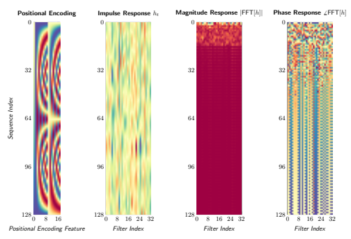

Figure D.6: Hyena filters at initialization with 17 positional encoding features K = 8.

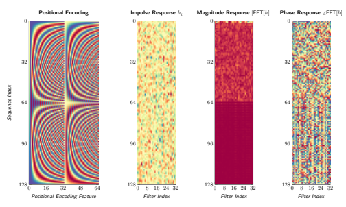

Figure D.7: Hyena filters at initialization with 65 positional encoding features K = 32.

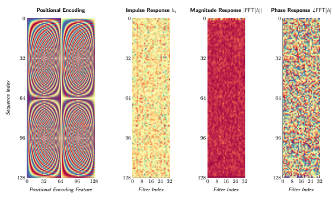

Figure D.8: Hyena filters at initialization with 65 positional encoding features K = 64.

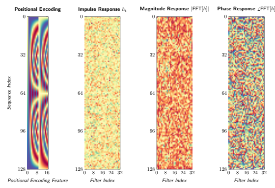

Figure D.9: Hyena filters at initialization with 17 positional encoding features K = 8 and frequency of sinusodial activation set to 10.

## D.4 Downstream Examples

MultiRC We report examples of downstream evaluation of small models on the MultiRC question-answering task. We report answers of small Hyena (153M, trained for 130B tokens on The Pile) and the public checkpoint RWKV-v4 (Peng, 2021) (169M, trained for 332B tokens on The Pile). We select randomized examples with indices being powers of 2. Alignment of Hyena's responses to the task format is greatly improved by providing few-shot examples in the prompt, which may be a promising sign for larger models based on the proposed attention-free architecture. Each example shows responses for specific examples in the validation set (example indices are listed at the beginning of each example).

MultiRC index: 2, 4

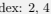

Passage: What causes a change in motion? The application of a force. Any time an object changes motion, a force has been applied. In what ways can this happen? Force can cause an object at rest to start moving. Forces can cause objects to speed up or slow down. Forces can cause a moving object to stop. Forces can also cause a change in direction. In short, forces cause changes in motion. The moving object may change its speed, its direction, or both. We know that changes in motion require a force. We know that the size of the force determines the change in motion. How much an object's motion changes when a force is applied depends on two things. It depends on the strength of the force. It also depends on the object's mass. Think about some simple tasks you may regularly do. You may pick up a baseball. This requires only a very small force. Question: Based on the previous passage, Would the mass of a baseball affect how much force you have to use to pick it up? Is "Less the mass, less the force applied" a correct answer? Answer: Yes RWKV zero-shot: The mass of a baseball depends on the force applied. if the mass of the baseball is small, the force applied is small. Hyena zero-shot: Yes it is. RWKV few-shot: The mass, less the force applied, is a more important force. it is the force that changes the mass of a baseball. Hyena few-shot: Yes.

Question: Based on the previous passage, What do you apply to an object to make it move or stop? Is "Strength" a correct answer? Answer: No RWKV zero-shot: The force applied to the object is the force applied to the object. Hyena zero-shot: Yes. RWKV few-shot: The force applied to a baseball is a force. it is a force that is applied to a baseball. Hyena few-shot: Yes.

MultiRC index: 32, 64 Passage: The film opens with Sunita, a medical student, and her friends working on a project about the human brain. She wants to investigate the curious case of Sanjay Singhania, a notable city businessman, who is reported to have anterograde amnesia. Her professor denies access to Sanjay's records as it is currently under criminal investigation. Sunita, nonetheless, decides to investigate the matter herself. Sanjay is introduced as he brutally murders a man. He takes a Polaroid picture of the man, and writes on it "done". It is revealed that Sanjay has anterograde amnesia where he loses his memory every 15 minutes. Sanjay uses a system of photographs, notes, and tattoos on his body to recover his memory after each cycle. It is revealed that Sanjay is ultimately out to avenge the death of his sweetheart Kalpana, and that he is systematically killing the people who were responsible for it. His main target is "Ghajini", a notable social personality in the city. Police Inspector Arjun Yadav, on the case of the serial murders, tracks Sanjay down to his flat and attacks and disables him. Yadav finds two diaries where Sanjay has chronicled the events of 2005 and 2006 . The film flashes back to 2005 as Yadav reads the diary. Sanjay Singhania is shown as the owner of the Air Voice mobile telephone company. In the course of his business, Sanjay sends his men to meet Kalpana, a struggling model, about putting up a billboard above her apartment. The owner of Kalpana's advertising firm misinterprets this as a romantic advance, and in view of a possible lucrative Air Voice ad campaign and other benefits, encourages Kalpana to accept the overture. Question: Based on the previous passage, Why did Sanjay murder a man? Is "Sanjay" a correct answer? Answer: Yes RWKV zero-shot: The answer is "Sanjay". Hyena zero-shot: The answer is RWKV few-shot: The question is not about Sanjay's death. Hyena few-shot: No.

Question: Based on the previous passage, Every 15 minutes, Sanjay goes through what process, Which frustrates his attempts to avenge the death of his sweetheart? Is "He forgets about facts" a correct answer? Answer: Yes RWKV zero-shot: Yes, it is a correct answer.. Hyena zero-shot: The answer is. RWKV few-shot: The answer is "yes". Hyena few-shot: The answer is "yes.

MultiRC index: 128 Passage: In 1863, Alexander II re-convened the Diet of Finland and initiated several reforms increasing Finlandś autonomy from Russia including establishment of its own currency, the markka. Liberation of business led to increased foreign investment and industrial development. Finland also got its first railways, separately established under Finnish administration. Finally, the elevation of Finnish from a language of the common people to a national language equal to Swedish opened opportunities for a larger proportion of the society. Alexander II is still regarded as "The Good Tsar" in Finland. These reforms could be seen as results of a genuine belief that reforms were easier to test in an underpopulated, homogeneous country, than in the whole of Russia. They may also be seen as a reward for the loyalty of its relatively western-oriented population during the Crimean War and during the Polish uprising. Encouraging Finnish nationalism and language can also be seen as an attempt to dilute ties with Sweden. Question: Based on the previous passage, Alexander II is considered what in Finland since 1863? Is "The good tsar" a correct answer? Answer: Yes RWKV zero-shot: The correct answer is "yes". Hyena zero-shot: Yes, the question is correct. RWKV few-shot: The Finnish language is a language of the people. Hyena few-shot: Yes.

MultiRC index: 1024 Passage: Einstein and Maric married in January 1903. In May 1904, the couple's first son, Hans Albert Einstein, was born in Bern, Switzerland. Their second son, Eduard, was born in Zurich in July 1910. In 1914, the couple separated; Einstein moved to Berlin and his wife remained in Zurich with their sons. They divorced on 14 February 1919, having lived apart for five years. Eduard, whom his father called "Tete" (for petit), had a breakdown at about age 20 and was diagnosed with schizophrenia. His mother cared for him and he was also committed to asylums for several periods, including full-time after her death. The marriage with Maric does not seem to have been very happy. In letters revealed in 2015, Einstein wrote to his early love, Marie Winteler, about his marriage and his still strong feelings for Marie. In 1910 he wrote to her that "I think of you in heartfelt love every spare minute and am so unhappy as only a man can be" while his wife was pregnant with their second child. Einstein spoke about a "misguided love" and a "missed life" regarding his love for Marie. Einstein married Elsa Lowenthal on 2 June 1919, after having had a relationship with her since 1912. She was a first cousin maternally and a second cousin paternally. In 1933, they emigrated to the United States. In 1935, Elsa Einstein was diagnosed with heart and kidney problems; she died in December 1936. Question: Based on the previous passage, How much time passed, after Albert Einstein's father divorced his mother, that he re-married? Is "3 months and 18 days" a correct answer? Answer: Yes RWKV zero-shot: Albert Einstein was born on 3 march 1916 in Gerlin, Germany. he was the son of a German doctor and a german woman. Hyena zero-shot: "3 months and 18 days" RWKV few-shot: It is not a correct answer. The exact date is not known. Hyena few-shot: Yes, according to the previous passage.