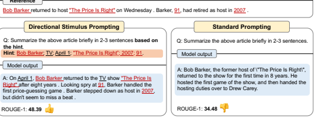
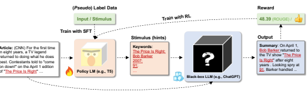
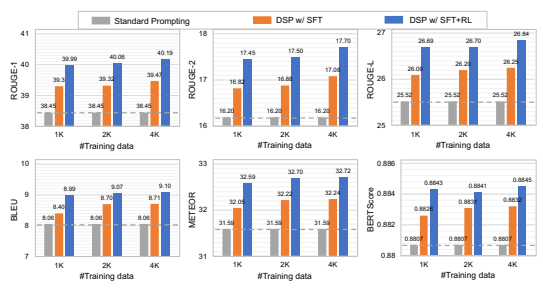
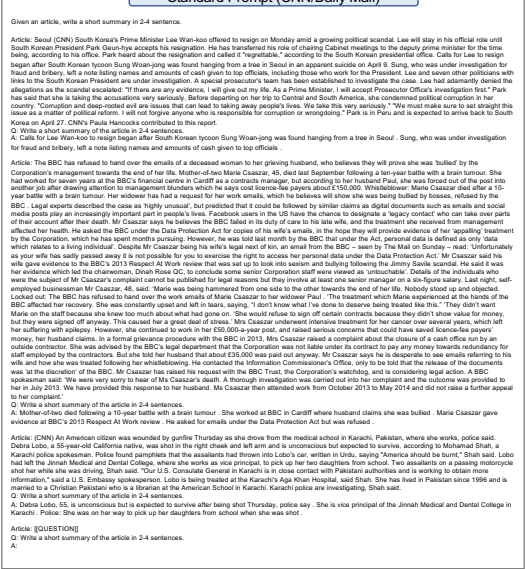
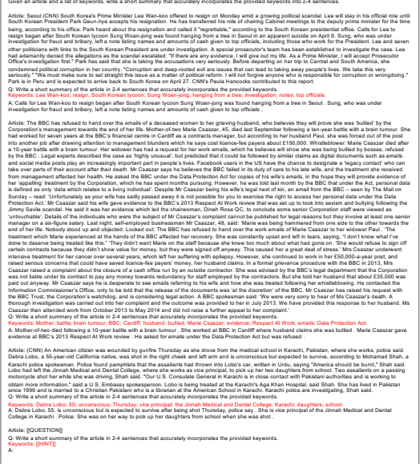
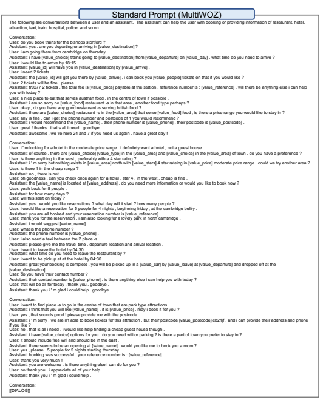
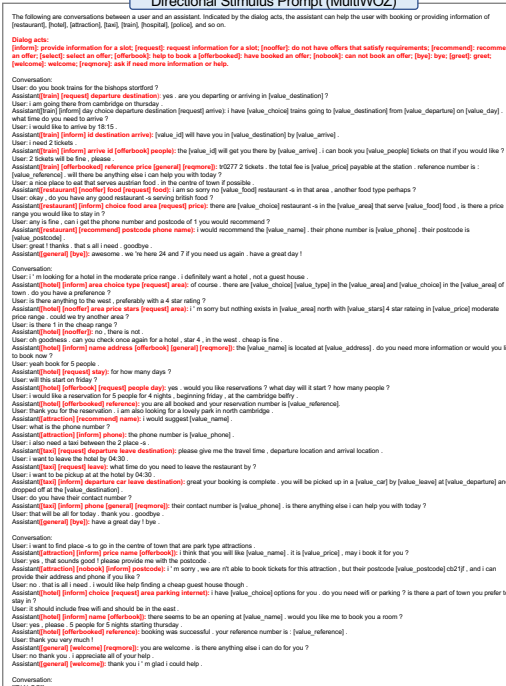

# Guiding Large Language Models Via Directional Stimulus Prompting

Zekun Li1∗, Baolin Peng2, Pengcheng He2, Michel Galley2, Jianfeng Gao2†**, Xifeng Yan**1†
University of California, Santa Barbara1 Microsoft2
{zekunli, xyan}@cs.ucsb.edu
{bapeng,penhe,mgalley,jfgao}@microsoft.com

# Abstract

We introduce a novel prompting framework called *Directional Stimulus Prompting* for guiding black-box large language models (LLMs) toward desired outputs. The framework introduces a new component called *directional stimulus* into the prompt, providing more fine-grained guidance and control over LLMs. The directional stimulus serves as hints or cues for each input query to guide LLMs toward the desired output, such as keywords that the desired summary should include for summarization. We utilize a small tunable model (e.g., T5) to generate such directional stimulus for each query, allowing us to optimize black-box LLMs by optimizing a small policy model. This policy model can be trained through 1) supervised fine-tuning using labeled data and 2) reinforcement learning from offline or online rewards to explore directional stimulus that better aligns LLMs with desired behaviors. We evaluate our framework on summarization and dialogue response generation tasks. Experimental results show that our framework consistently improves ChatGPT's performance over standard prompting with a small collection of training data, and reinforcement learning further improves the performance. Notably, on the MultWOZ dataset, our framework enables ChatGPT to achieve a remarkable 41.4% improvement in its combined score with only 80 dialogues, matching or even surpassing the performance of some fully trained state-of-the-art models. We have made our code publicly available. 3

# 1 Introduction

In recent years, a new paradigm has emerged in natural language processing (NLP) with the rise of large language models (LLMs) such as GPT-3 (Brown et al., 2020), Codex (Chen et al., 2021), InstructGPT, ChatGPT (Ouyang et al., 2022), PaLM (Chowdhery et al., 2022), and others. These models exhibit emergent abilities (Wei et al., 2022a) such as strong in-context learning and fewshot prompting capabilities, which were not present in previous "smaller" language models (LMs) like BERT (Devlin et al., 2018), RoBERTa (Liu et al., 2019), GPT-2 (Radford et al., 2019), and T5 (Raffel et al., 2020). This shift in paradigm has led to remarkable advancements in NLP, with LLMs demonstrating impressive general-purpose power. However, due to commercial considerations and the risk of misuse, most LLMs do not publicly release their parameters and only allow users to access them through black-box APIs. In this scenario, the standard approach for utilizing LLMs to perform diverse tasks is crafting task-specific text prompts to query LLMs through black-box APIs. While LLMs have demonstrated considerable performance on a wide range of language tasks,

∗Part of the work was done when Zekun Li was interning at Microsoft Research.

†Co-advise on this work.

3https://github.com/Leezekun/Directional-Stimulus-Prompting.
Input text Article: (CNN) For the first time in eight years, a TV legend returned to doing what he does best. Contestants told to "come on down!" on the April 1 edition of "The Price Is Right" encountered not host Drew Carey but another familiar face in charge of the proceedings. Instead, there was Bob Barker, who hosted the TV game show for 35 years before stepping down in 2007. Looking spry at 91, Barker handled the first price-guessing game of the show, the classic "Lucky Seven," before turning hosting duties over to Carey, who finished up. Despite being away from the show for most of the past eight years, Barker didn't seem to miss a beat.

Reference
Figure 1: Comparison between our proposed Directional Stimulus Prompting (DSP) and the standard prompting method using LLMs such as ChatGPT for the summarization task. DSP utilizes directional stimulus/hints (highlighted in orange), which are keywords in this case, to provide fine-grained query-specific guidance to LLMs for generating summaries (highlighted in blue) that better align with the desired reference summary with higher ROUGE scores or other measures like human preferences.

they still struggle to generate outputs that fully align with desired behaviors and directions on some specific tasks and use cases (Goyal et al., 2022; Bang et al., 2023). Since directly optimizing LLMs for specific tasks is infeasible and impractical, researchers resort to optimizing prompts instead. Prompt engineering approaches, which involve manually or automatically designing optimal task-specific natural language instructions and selecting appropriate training samples for demonstration in the prompt, have been the focus of many researchers (Brown et al., 2020; Reynolds & McDonell, 2021a; Zhou et al., 2022; Lu et al., 2022a). However, despite these efforts, effectively steering LLMs to generate the desired results and exploiting labeled data remains a significant challenge, particularly for fine-grained query-specific desired behaviors.

To address the challenge, we propose a novel prompting framework called **Directional Stimulus**
Prompting (DSP). This framework introduces a new component called the "*directional stimulus*" into the prompt to provide more fine-grained guidance and control over LLMs. Specifically, the directional stimulus is a sequence of discrete tokens, which serves as "hints" or "cues" for the query
"question" to guide LLMs toward the desired "answer".4 Notably, this differs from the methods that augment LLMs with additional knowledge retrieved from external sources (Khattab et al., 2022; Shi et al., 2023), as the stimulus is generated solely based on the input query in our framework. Figure 4 compares our proposed prompting approach, DSP, with standard prompting for the summarization task. Our approach incorporates keywords in the prompt as stimulus to hint at key points the desired summary should cover. By providing this fine-grained guidance through directional stimulus, LLMs can generate outputs that more closely align with the desired reference summary. We utilize a relatively small and tunable LM, such as T5, as the policy model to generate the directional stimulus for each input query. This approach enables us to optimize the black-box LLMs through optimizing the small tunable policy model. We train the policy model through supervised fine-tuning (SFT) using a few collected training examples. After supervised fine-tuning, we further optimize the policy model to explore better stimulus with reinforcement learning (RL). During RL training, we aim to maximize the reward, which is defined as downstream performance measures or other customized alignment measures of the LLM's generation, conditioned on the stimulus generated

4The inference process that LLMs generate an output given the input query can be seen as answering a question, where the input query is the "question" while the output is LLMs' "answer". We use the terms
"directional stimulus" and "hint" interchangeably in this paper.

Figure 2: Overview of our proposed framework DSP, where we learn a small tunable policy model to generate the directional stimulus (keywords in this case) that provide fine-grained guidance for the LLM toward the desired target. The policy model can be trained with SFT and/or RL, where the reward is defined as the downstream task performance measure, such as the ROUGE score for the summarization task, or other alignment measures, such as human preferences.

by the policy model. Figure 2 provides the overview of our framework. We learn a small tunable policy model to generate the directional stimulus for the LLMs, which could provide fine-grained query-specific guidance toward the desired targets. The policy model can be trained with SFT and RL, where the reward is defined as the downstream task performance measure, such as the ROUGE score for the summarization task, or other alignment measures, such as human preferences. We conducted experiments on summarization and dialogue response generation tasks to evaluate the effectiveness of our framework. Our results demonstrate that the proposed Directional Stimulus Prompting (DSP) approach can effectively guide ChatGPT toward the desired targets, even with a relatively small amount of labeled data. Specifically, we experiment with the black-box LLMs ChatGPT and Codex, and use a 750M Flan-T5-large (Raffel et al., 2020; Chung et al., 2022) as the policy model to generate stimulus. For the summarization task, we use keywords as the directional stimulus, which hints at the key points that the desired summary should include. Despite ChatGPT's already considerable performance, the policy model T5 trained with only 4,000 samples from the CNN/Daily Mail dataset (Nallapati et al., 2016) improved the ROUGE and BLEU scores by 413%. For the dialogue response generation task, we train the policy model to generate dialogue acts that indicate the underlying intentions behind target responses on dialogues from MultiWOZ dataset (Budzianowski et al., 2018). Guided by the policy model trained with only 80 dialogues, ChatGPT's performance improved by up to 41.4% in combined scores, achieving comparable or even better performance than some state-of-the-art models trained with the full dataset of 8,438 dialogues.

# 2 Directional Stimulus Prompting

For a downstream task, there is an input space X, a data distribution D over X, and an output space Y . Due to the strong in-context learning and few-shot prompting abilities, LLMs can perform diverse tasks and generate the output y by inclduing instructions that describe the task, a few demonstration examples, and the input query x in the prompt (Brown et al., 2020). However, such prompts cannot always steer LLMs toward desired outputs, especially when it comes to fine-grained query-specific desired behaviors. For instance, in the case of the summarization task, the input x is an article, and the output y is the corresponding summary. Different summarizers have distinct styles and emphasize different aspects of an article (Goyal et al., 2022). In this case, it may not be enough to effectively steer LLMs toward generating summaries that closely match reference summaries relying solely on task-specific instructions or demonstration examples to describe such nuanced differences for each sample. To this end, our Directional Stimulus Prompting (DSP) approach introduces a small piece of discrete tokens z named "*directional stimulus*" into the prompt, which serves as hints or cues to provide LLMs with fine-grained guidance toward the desired direction. For example, for the summarization task, the directional stimulus z might consist of keywords that should be included in the desired summary. To generate this stimulus for each input query, we use a small tunable policy language model, pPOL(z|x). We then use this generated stimulus, z, along with the original input, x, to construct the prompt that steers the LLM toward generating its output, pLLM(y|x, z), through blackbox API calls. It's important to note that the parameters of the LLM, pLLM, are not accessible or tunable. Overall, when using the LLM with DSP to perform a downstream task, the output is obtained via y ∼ pLLM(·|x, z), z ∼ pPOL(·|x).

### 2.1 Supervised Fine-Tuning

To train the policy model that generates directional stimulus for LLMs, we first perform supervised fine-tuning (SFT) on a pre-trained LM (e.g., T5, GPT-2, etc) on a small collection of labeled data. To collect the data, we could heuristically select or annotate the "pseudo-stimulus" z
∗for each input query x and target output y pair based on the downstream task. For example, for the summarization task, we use keywords that the reference summary includes as pseudo-stimulus, while for the dialogue response generation task, we use dialogue acts that indicate the underlying meaning of the desired system response (see Section 3 for details). The resulting dataset D′ = {(x, z
∗)} consists of input-stimulus pairs. We then fine-tune the policy model by maximizing the log-likelihood:

$${\mathcal{L}}_{\mathrm{SFT}}=-\mathbb{E}_{(\mathbf{z},\mathbf{z}^{*})\sim{\mathcal{D}}^{\prime}\log p_{\mathrm{POL}}}(\mathbf{z}^{*}|\mathbf{x}).$$
$\left(\mathbb{I}\right)$. 
∗|x). (1)
Supervised fine-tuning can provide a good initial point for the policy model. However, it is important to note that the heuristically selected or annotated pseudo-stimulus may not always be optimal, and the supervised fine-tuned policy model may not generate the most preferred directional stimulus for the LLMs toward the desired outputs. To overcome this limitation, we can also incorporate reinforcement learning (RL) to further fine-tune the policy model. By directly optimizing the LLM's output towards desired targets, RL training enables the policy model to explore and generate more effective directional stimulus.

### 2.2 Reinforcement Learning

Optimization objective Our goal is to steer the LLM's generation toward the desired target by maximizing an alignment measure R, which can take various forms such as downstream task performance measures (e.g., ROUGE score for summarization), human preferences, or other customized measures. Mathematically, we aim to maximize the below objective:

$$\mathbb{E}_{\mathbf{z}\sim{\mathcal{D}},\mathbf{z}\sim p_{\mathrm{{bol}}}(\cdot|\mathbf{z}),\mathbf{y}\sim p_{\mathrm{{LIM}}}(\cdot|\mathbf{z},\mathbf{z})}[{\mathcal{R}}(\mathbf{x},\mathbf{y})].$$
$$(2)$$
Ex∼D,z∼pPOL(·|x),y∼pLLM(·|x,z)[R(x, y)]. (2)
Since the parameters of the black-box LLM are not accessible or tunable, we resort to optimizing the policy model to generate the directional stimulus that guides the LLMs' generation toward maximizing the objective. To achieve that, we define another measure RLLM that captures how well the LLM performs when conditioned on a given stimulus z:

$${\mathcal{R}}_{\mathrm{LLM}}(\mathbf{x},\mathbf{z})={\mathcal{R}}(\mathbf{x},\mathbf{y}),\mathbf{y}\sim p_{\mathrm{LLM}}(\cdot|\mathbf{x},\mathbf{z}).$$
$\left({3\over2}\right)$. 
RLLM(x, z) = R(x, y), y ∼ pLLM(·|x, z). (3)
This allows us to cast the original objective of maximizing R into optimizing the policy model to generate stimulus that maximizes RLLM. By doing so, the LLM is effectively used as an evaluation function to guide the policy model toward generating more effective directional stimulus. Thus, the optimization objective for LLMs in Equation 2 is equal to the optimization objective for the policy model:

$$\operatorname*{max}_{p_{\mathrm{pol.}}}\mathbb{E}_{\mathbf{z}\sim{\mathcal{D}},\mathbf{z}\sim p_{\mathrm{pol.}}(\cdot|\mathbf{z})}[{\mathcal{R}}_{\mathrm{LLM}}(\mathbf{z},\mathbf{z})].$$
$\left(4\right)$. 
maxpPOLEx∼D,z∼pPOL(·|x)[RLLM(x, z)]. (4)
RL formulation However, the above optimization is intractable for the policy model. To address the issue, we formulate the policy model optimization as an RL problem and employ proximal policy optimization (PPO) (Schulman et al., 2017). We use the policy model to initialize a policy network π0 = pPOL and then update π using PPO. The process that the policy model generates a sequence of tokens as stimulus z can be seen as a Markov decision process (MDP) ⟨S, A*, r,*P⟩ with a state space S, action space A, reward function r, and state-transition probability P. In each time step t of an episode, the agent selects an action (token) from the vocabulary V according to the distribution of the current policy network π(z|x, z<t). The episode ends when an end-of-sequence token is selected, and the stimulus z is generated. We can fine-tune the policy network π by optimizing the reward r:

$$\mathbb{E}_{\pi}[r]=\mathbb{E}_{\mathbf{z}\sim{\mathcal{D}},\mathbf{z}\sim\pi(\cdot|\mathbf{z})}[r(\mathbf{z},\mathbf{z})].$$
Eπ[r] = Ex∼D,z∼π(·|x)[r(x, z)]. (5)
Reward function Recall that our goal is to maximize the objective in Equation 4, which can be used as the reward r. To keep the policy network π from moving too far from the initial policy model pPOL,
we also add a KL-divergence penalty reward. Therefore, the final reward becomes:

$$r(\mathbf{x},\mathbf{z})={\mathcal{R}}_{\mathrm{LLM}}(\mathbf{x},\mathbf{z})-\beta\mathrm{log}{\frac{\pi(\mathbf{z}|\mathbf{x})}{p_{\mathrm{POL}}(\mathbf{z}|\mathbf{x})}}.$$
$$(6)$$
$$\left({\boldsymbol{T}}\right)$$
$$({\mathfrak{s}})$$
. (6)
Following (Ziegler et al., 2019; Ramamurthy et al., 2022), we dynamically adapt the coefficient β during training:

$$\begin{array}{c}{{\mathbf{e}_{t}=\mathrm{clip}\left(\frac{\mathrm{KL}(\pi_{t},p_{\mathrm{POL}})-\mathrm{KL}_{\mathrm{target}}}{\mathrm{KL}_{\mathrm{target}}},-0.2,0.2\right),}}\\ {{\mathbf{\beta}_{t+1}=\beta_{t}\left(1+K_{\beta}\mathbf{e}_{t}\right).}}\end{array}$$

To explore the action space and find the optimal stimulus, we sample tokens with the policy network during training. Implementation To optimize the policy network π, we use the NLPO version of PPO from (Ramamurthy et al., 2022), which is specifically designed for language generators. To address the issue of large action spaces in PPO, NLPO learns to mask out less relevant tokens in the vocabulary using top-p sampling. This technique restricts the action space to the smallest set of tokens whose cumulative probability is greater than the given probability parameter p, which we set to 0.9 in our experiments. Both the policy network π and value network are initialized from the supervised fine-tuned policy model pPOL, with the final layer of the value network randomly initialized to output a scalar value using a regression head.

# 3 Experiments

Our proposed framework DSP can be flexibly applied to various types of LMs and generation tasks. In this work, we focus on the summarization and dialogue response generation tasks. We use a 780M
parameter version of pre-trained Flan-T5 (Raffel et al., 2020; Chung et al., 2022)5to initialize the policy model and evaluate the OpenAI's ChatGPT (*gpt-3.5-turbo*) and Codex (*code-davinci-002*).6 Our experiments aim to assess the effectiveness of our approach in guiding the generation of blackbox LLMs toward desired outputs by introducing directional stimulus generated by the tunable policy model into the prompt.

### 3.1 Summarization

Recent studies (Goyal et al., 2022; Zhang et al., 2023a; Bang et al., 2023) have shown that LLMs, such as GPT-3, InstructGPT, and ChatGPT, are capable of generating high-quality summaries with zero- or few-shot prompting. However, their reference-based evaluation benchmark performances, such as ROUGE scores, still lag behind fine-tuned methods, indicating that the generated summaries may not completely match the style and emphasis of the reference summaries. In our experiments, we seek to guide LLMs to generate summaries that more closely align with the reference summaries by providing keywords that should be mentioned in the desired summaries as hints. We evaluate the effectiveness using metrics that compare the generated summaries against reference summaries. Notably, other desired directions, such as better alignment with human preferences, can also be pursued. Dataset and evaluation We conduct our experiments on the CNN/Daily Mail dataset, a widely-used news summarization benchmark. To keep the cost of API usage low, we train on a subset of 1,000, 2,000, and 4,000 article-summary pairs from the total 287,113 samples in the training set. For evaluation, we randomly select 500 samples, following previous work (Goyal et al., 2022; Suzgun et al., 2022), which has been proven to provide sufficient statistical power (Card et al., 2020). We use the overlap-based metrics, including ROUGE (Lin, 2004), BLEU (Papineni et al., 2002), and Meteor (Banerjee & Lavie, 2005), and the similarity-based metric, BERTScore (Zhang et al., 2019), to compare the generated summaries with the references. The reported evaluation scores are averaged over three inferences of ChatGPT for each query, using a temperature of 0.7 and top_p of 1.0. We use

5https://huggingface.co/google/flan-t5-large 6OpenAI has discontinued support for the Codex API as of March 23rd, 2023, and encourages users to transition to GPT-3.5-Turbo. Users can still apply for access to the Codex model for non-commercial purposes.

Figure 4: Performance comparison of ChatGPT with standard prompting and DSP trained with SFT
and SFT+RL, using varying numbers of training samples from the CNN/Daily Mail dataset. We report the percentage of ROUGE and Meteor scores for ease of display and comparison.

the same three demonstration examples in the prompt for standard prompting and add keywords as directional stimulus in the prompt for our approach, DSP. The exact prompts used in our experiments are provided in the Appendix. Supervised fine-tuning details We use keywords as the pseudo-stimulus to train the policy model with supervised fine-tuning as discussed in Section 2.1. To collect the data, we employ textrank (Mihalcea & Tarau, 2004; Barrios et al., 2016) to automatically extract the keywords from the article and summary and only keep those that appear in the reference summary. As a result, we obtain a list of extracted keywords for each article-summary pair in the dataset. To convert them into a sentence that serves as the stimulus, we concatenate them using a split token ";", resulting in the stimulus formated as "*[Keyword1]; [Keyword2]; ... ; [KeywordN].*". We use the constructed article-stimulus pairs to train the policy model via supervised fine-tuning. The input format for training is "Extract the keywords: [Article]", while the output is the target stimulus consisting of keywords. The policy model was trained for 5 epochs with a 2 × 10−5learning rate.

Figure 3: Training curve on 1000 samples from the CNN/Daily Mail dataset.

RL training details As we aim to guide ChatGPT in generating summaries that more closely match the reference summaries, we adopt the automatic reference-based metric scores as the alignment measure reward. Specifically, we calculate the ROUGE-Avg score between the generated summaries and the reference summaries as the reward, with a rescaling coefficient of 10. We experimentally found that other automatic evaluation metrics, such as BLEU and Meteor, perform similarly. To reduce variance, we generate four outputs per input query using ChatGPT with a temperature of 0.7 and compute the average reward. Additionally, we assign a step-wise reward, which we found could improve the efficiency and stability of the training process. Specifically, the policy model generates a sequence of keywords in each episode, during which we assign a reward of 1 if a keyword appears in the reference summary and a penalty reward of -0.2 is given otherwise. We train the policy network for 51k episodes, with 5 epochs per batch, a batch size of 8, and a learning rate of 2 × 10−6. The KLtarget and β0 in Equation 7 are set to 0.5 and 0.005, respectively.

Results We evaluate the performance of ChatGPT with standard prompting and our approach DSP trained with SFT or SFT and then RL (SFT+RL) on varying sizes of training data and present the results in Figure 4. As can be seen, all the evaluation scores improve with our proposed DSP compared with standard prompting. Specifically, the supervised fine-tuned policy model generates the stimulus that effectively guides ChatGPT to generate summaries that closely align with the reference summaries, leading to improved benchmark performance. Furthermore, the additional fine-tuning of the policy model with RL results in further performance improvement, indicating the effectiveness of RL in exploring better directional stimulus that maximizes the reward. As the size of the training data increases, the performance improvement becomes more significant. Despite using a small collection of only 1,000 to 4,000 samples to keep API usage costs low, our DSP approach still consistently enhances ChatGPT's ROUGE, BLEU, and Meteor scores by 1-2 points, even though ChatGPT has already achieved considerable performance. However, due to the discrepancy between the semantic-based metric BERTScore and the overlap-based metric ROUGE, which are used as the reward, the improvement in BERTScore after RL training may be relatively less significant. Figure 3 presents the change of training rewards and ROUGE-1 score on the validation set during the training process on 1,000 samples. We can see that the performance is closely related to the training rewards, and the training is relatively stable using the NLPO algorithm. We have also provided a running example of using ChatGPT with different prompting methods in the Appendix.

### 3.2 Dialogue Response Generation

In recent years, there has been a rise in LLM-based chatbots such as ChatGPT7and Sparrow 8.

These chatbots are typically targeted at open-domain conversations to engage with users on a wide range of topics without a specific goal in mind. However, these chatbots still face challenges in handling task-oriented dialogues where they need to assist users in completing specific goals or tasks, such as making reservations or ordering food (Bang et al., 2023; Hudecek & Dušek, 2023). Unlike ˇ open-domain conversations, task-oriented dialogues often require the chatbot to follow task-specific business logic and respond based on reliable information from API calls or database queries. To address this limitation, we train a small policy model to learn the underlying dialogue policy from the training data and thus guide the LLMs in generating reliable system responses that assist users in completing tasks. Dataset and evaluation We conduct experiments on the popular task-oriented dialogue dataset MultiWOZ (Budzianowski et al., 2018), including both the MultiWOZ2.0 (the original version) and MultiWOZ2.1 version (Eric et al., 2019). The dataset provides annotations for user utterances, dialogue acts, and system responses for each dialogue turn. The goal is to generate the system response given the history dialogue context as input. We utilize the dialogue act, which represents the communicative intention of the target system response, as the pseudo-stimulus for our experiment.

There are 8,438 dialogues in the training set. We only use 1% (80 dialogues) and 10% (800 dialogues) to train the policy model and evaluate the performance on the full validation and test set, which contains 1,000 dialogues. We use the standard evaluation metrics: **Inform**, which measures the rate that the appropriate entity that satisfies the user's requirements is provided; **Success**, which measures the rate that all the requested attributes are answered; **BLEU**: the corpus-level BLEU score with reference system responses; and an overall measure **Combined score** = (Inform+Success)×0.5+BLEU. Likewise, we report the average score over three inferences. We use the same three demonstration examples when using DSP or standard prompting. Supervised fine-tuning details To conduct supervised fine-tuning on the policy model, we format the input of each sample as *Translate dialogue to dialogue action: [Dialogue context]*", with the target being the verbalized dialogue acts in the same format as (Zhang et al., 2020; Su et al., 2021). For instance, a dialogue act *<hotel, inform, choice>, <hotel, inform, type>, <hotel, request, area>* will be converted to "*[hotel] [inform] choice type [request] area*", which indicates that the system should inform available hotel choices and their types and ask for the area that the user would like (see the Appendix for examples). Note that the provided dialogue act annotations may not be the only valid dialogue act for the same dialogue content (Zhang et al., 2020), and thus we hope to explore diverse valid dialogue acts (directional stimulus) through RL training.

7https:/openAI.com/blog/chatgpt 8https://www.deepmind.com/blog/building-safer-dialogue-agents

| Method                                 | #Training   |        |       | MultiWOZ 2.0   |       |        |       | MultiWOZ 2.1   |       |
|----------------------------------------|-------------|--------|-------|----------------|-------|--------|-------|----------------|-------|
| data                                   |             | Inform | Succ. | BLEU           | Comb. | Inform | Succ. | BLEU           | Comb. |
| Codex                                  |             |        |       |                |       |        |       |                |       |
| Standard Prompting                     | \-          | 76.7   | 41.5  | 7.7            | 66.8  | 74.2   | 41.9  | 7.8            | 65.9  |
| DSP w/ SFT                             | 1% (80)     | 74.9   | 66.3  | 11.1           | 81.7  | 72.0   | 66.0  | 11.3           | 80.1  |
| DSP w/ SFT+RL                          | 1% (80)     | 91.0   | 76.0  | 9.8            | 93.3  | 89.7   | 78.6  | 9.4            | 93.4  |
| DSP w/ SFT                             | 10% (800)   | 79.4   | 71.9  | 11.3           | 87.0  | 72.0   | 67.0  | 13.1           | 82.6  |
| DSP w/ SFT+RL                          | 10% (800)   | 96.0   | 86.9  | 10.7           | 102.2 | 94.0   | 86.0  | 9.2            | 99.2  |
| ChatGPT                                |             |        |       |                |       |        |       |                |       |
| Standard Prompting                     | \-          | 71.8   | 44.1  | 10.5           | 68.4  | 72.8   | 44.2  | 10.4           | 68.9  |
| DSP w/ SFT                             | 1% (80)     | 76.6   | 66.5  | 11.2           | 82.8  | 76.0   | 64.3  | 11.3           | 81.4  |
| DSP w/ SFT+RL                          | 1% (80)     | 90.9   | 82.2  | 10.2           | 96.7  | 87.3   | 78.7  | 10.7           | 93.7  |
| DSP w/ SFT                             | 10% (800)   | 72.7   | 64.7  | 11.8           | 80.5  | 75.0   | 67.7  | 12.6           | 83.9  |
| DSP w/ SFT+RL                          | 10% (800)   | 95.3   | 82.3  | 10.9           | 99.6  | 95.0   | 84.0  | 10.7           | 100.2 |
| Full trained TOD models                |             |        |       |                |       |        |       |                |       |
| DAMD (Zhang et al., 2020)              | 100% (8438) | 76.3   | 60.4  | 16.6           | 85.0  | \-     | \-    | \-             | \-    |
| MinTL (Lin et al., 2020)               | 100% (8438) | 84.9   | 74.9  | 17.9           | 97.8  | \-     | \-    | \-             | \-    |
| Soloist (Peng et al., 2021)            | 100% (8438) | 85.5   | 72.9  | 16.5           | 95.7  | \-     | \-    | \-             | \-    |
| SimpleTOD (Hosseini\-Asl et al., 2020) | 100% (8438) | 84.4   | 70.1  | 15.0           | 92.3  | 85.0   | 70.5  | 15.2           | 93.0  |
| DoTS (Jeon & Lee, 2021)                | 100% (8438) | 86.6   | 74.1  | 15.1           | 95.5  | 86.7   | 74.2  | 15.9           | 96.3  |
| PPTOD (Su et al., 2021)                | 100% (8438) | 89.2   | 79.4  | 18.6           | 102.9 | 87.1   | 79.1  | 19.2           | 102.3 |
| UBAR (Yang et al., 2021)               | 100% (8438) | 95.4   | 80.7  | 17.0           | 105.1 | 95.7   | 81.8  | 16.5           | 105.3 |
| GALAXY (He et al., 2022)               | 100% (8438) | 94.4   | 85.3  | 20.5           | 110.4 | 95.3   | 86.2  | 20.0           | 110.8 |

Table 1: Response generation performance of different methods on the MultiWOZ 2.0&2.1 datasets, where Succ. and Comb. denote the Success and Combined Score metrics, respectively.

RL training details The evaluation metrics Success and Inform rates are defined at the dialogue level, while the BLEU score is computed on the corpus level. However, our training and inference on conducted on the turn level. We thus use the sentence-level SacreBLEU (Post, 2018) score as the reward. Same as in the summarization experiments, we generate four outputs per input using the LLM with a temperature of 0.7. The policy network is trained 52k episodes, 5 epochs per batch with a batch size of 8 and a learning rate of 2 × 10−6. Since the generated dialogue acts should adhere to the business logic and ontology, we ensure that the updated policy network does not deviate significantly from the original policy model. We thus set the KLtarget and β0 in Equation 7 as 0.2 and 0.01, respectively. During training, we use top-k sampling and set k to 50 to explore the action space. During inference, we use beam search decoding with a beam size of 5. Results We evaluate the impact of our approach DSP on Codex and ChatGPT and compare the performance with several representative task-oriented dialogue models trained on the full training set (8438 dialogues), including DAMD (Zhang et al., 2020), MinTL (Lin et al., 2020), Soloist (Peng et al., 2021), SimpleTOD (Hosseini-Asl et al., 2020), DoTS (Jeon & Lee, 2021), PPTOD (Su et al., 2021), UBAR (Yang et al., 2021), and GALAXY (He et al., 2022). Table 1 summarizes the overall performance comparison, from which we obtain the following observations: (1) Our approach DSP significantly improves the success and inform rates of Codex and ChatGPT, indicating that they better understand the scenario and generate appropriate responses that help users in completing their tasks. (2) However, there is no improvement in the corpus-level BLEU score, possibly because the LLMs generate responses with different speaking styles and vocabulary since they do not see oracle system responses. Nevertheless, the high success and inform rates demonstrate the usefulness of our approach in delivering helpful and reliable responses. (3) Increasing the number of supervised fine-tuning samples does not guarantee performance improvement, but further fine-tuning the policy model using RL consistently provides performance gains. This suggests that RL training encourages the policy model to explore more model-preferred stimulus, while supervised fine-tuning may merely generate stimulus closely aligned with the pseudo-labeled data, which is not necessarily optimal. (4) Our approach achieves notable success with only 80 dialogues, surpassing several fully trained TOD models, particularly in terms of Success and Inform rates. With 10% of the training data (800 dialogues), our approach delivers comparable performance to current SOTA methods trained with full training data (8438 dialogues). We have also provided the performance of these compared methods in the low-resource settings (1% and 10%) and a running example in the Appendix.

# 4 Related Work

Black-box large language models Recent years have witnessed the emergence of LLMs such as GPT-3 (Brown et al., 2020), Codex (Chen et al., 2021), InstructGPT, ChatGPT (Ouyang et al., 2022), PaLM (Chowdhery et al., 2022), and LaMDA (Thoppilan et al., 2022), which show significant promise in the field of NLP. These LLMs typically have a large number of parameters and require vast amounts of training data. Due to their scaling, these models have exhibited many emergent abilities, such as in-context learning, few-shot prompting, chain-of-thought prompting, and instruction following (Brown et al., 2020; Ouyang et al., 2022; Wei et al., 2022b). However, most LLMs are not open-sourced and can only be accessed via black-box APIs, through which the users send prompt queries and receive responses. The internal processes and decision-making mechanisms used to arrive at the output are often not transparent or explainable. While there exist open-source LLMs such as OPT-175B (Zhang et al., 2022) and Bloom (Scao et al., 2022), their local execution and fine-tuning require significant computational resources that may be infeasible for most researchers and users. However, despite their considerable performance on various tasks, LLMs often fall short of generating outputs that fully align with desired outputs on specific downstream tasks and use cases (Goyal et al., 2022; Moradi et al., 2021; Gutiérrez et al., 2022). Our approach seeks to address this limitation by introducing directional stimulus generated by a small tunable LM into the prompt to provide more fine-grained guidance and control over black-box LLMs. Prompt optimization and engineering Efficiently optimizing pre-trained LMs on downstream tasks by finding optimal prompts has been a focus of prior research. One approach involves tuning soft prompts, which are continuous embedding vectors that can be optimized using gradient descent methods (Li & Liang, 2021; Lester et al., 2021; Vu et al., 2021; An et al., 2022; Sun et al., 2022).

However, the requirements of gradients and the challenge of passing gradients and continuous prompts through black-box APIs, making them less practical for the black-box LLMs. Researchers have also tried to seek optimal prompts by designing task-specific natural language instructions and selecting proper training samples as in-context demonstrations in the prompt. These methods include manual engineering (Petroni et al., 2019; Brown et al., 2020; Reynolds & McDonell, 2021b), editing (Shin et al., 2020; Zhang et al., 2023b), reinforcement learning (Deng et al., 2022; Lu et al., 2022a), and automatic generation (Zhou et al., 2022). Despite these efforts, such prompts are not always effective at steering LLMs to generate desired outputs, especially for fine-grained desired behaviors that are difficult to describe using instructions and demonstration examples alone. To address this limitation, we introduce a new component called the "*directional stimulus*" into the prompt. Generated by a small tunable model, this stimulus enables us gain more fine-grained and direct guidance and control over black-box LLMs. Controllable text generation The control of language models (LMs) has been extensively studied. Early approaches fine-tuned LMs on datasets containing desired attributes (Gururangan et al., 2020). Keskar et al. (2019) proposed class-conditioned LMs, generating text with predefined control codes. However, direct LM training is costly. To address this, PPLM Dathathri et al. (2019) trains an attribute model and passes gradients to control generation. GeDi (Krause et al., 2020) and DExperts (Liu et al.,
2021) use class-conditional distributions as generative discriminators to guide generation, reducing computation complexity. These methods require either additional LM training or internal gradients and logistics, making them not applicable to black-box LLMs. Our approach proposes a solution to control black-box LLMs by inserting directional stimulus into the input query prompt and optimizing based on the return output. Reinforcement learning for NLP Reinforcement learning has been successfully applied to various NLP tasks, such as syntactic parsing (Neu & Szepesvári, 2009; Le & Fokkens, 2017), machine translation (Wu et al., 2016; Kumar et al., 2019), summarization (Paulus et al., 2017; Stiennon et al., 2020), image caption (Rennie et al., 2017), text game (Narasimhan et al., 2015), conversational systems (Li et al., 2016), etc. Language models define probability distributions over tokens in their vocabulary, and the text generation problem can be naturally formulated as selecting an action in an RL setting. Therefore, there have been extensive research efforts on optimizing LMs with RL, usually by aligning them with human preferences (Ziegler et al., 2019; Wu et al., 2021; Lu et al., 2022b; Stiennon et al., 2020). For example, the LLM InstructGPT (Ouyang et al., 2022) is optimized with RL to better follow users' instructions and intent. In contrast with these works that directly update the LLMs to align with human preferences, our work optimizes a small policy model that generate text (stimulus) to guide LLMs to generate more human-preferred output, instead of directly optimizing the LLMs, which is more efficient and feasible for most normal users and researchers. Proximal Policy Optimization (PPO) (Schulman et al., 2017) is the widely-used approach in this scenario, which is empirically data-efficient and reliable. Natural Language Policy Optimization (Ramamurthy et al., 2022) is an extension of PPO, which addresses the large action space issues by masking out irrelevant tokens and shows better stability and performance.

# 5 Conclusions And Future Work

In this paper, we introduce *Directional Stimulus Prompting* (DSP), a new prompting framework that introduces directional stimulus into the prompt, which could provide black-box LLMs with fine-grained and query-specific guidance toward the desired outputs. We use a tunable policy model to generate such directional stimulus and convert the optimization of black-box LLMs to that of the policy model. We optimize the policy model with supervised fine-tuning and RL by maximizing the rewards that measure the alignment between the LLMs' generation with the desired outputs. Our experiments on summarization and dialogue response generation tasks demonstrate the effectiveness of our approach. DSP not only enables better control and guidance for black-box LLMs, but also effectively utilizes labeled data. Furthermore, the generated stimulus provides valuable insights and interpretations of LLMs' behaviors. In this work, we use heuristically selected or annotated pseudo-stimulus data for supervised fine-tuning of the policy model. For future work, we hope to explore the possibility of using a "machine language" between the policy model and the LLMs that might not be intuitively preferred by humans but can better convey guidance information, as well as other forms of directional stimulus beyond text.

# References

An, S., Li, Y., Lin, Z., Liu, Q., Chen, B., Fu, Q., Chen, W., Zheng, N., and Lou, J.-G. Input-Tuning:
Adapting unfamiliar inputs to frozen pretrained models. *arXiv preprint arXiv:2203.03131*, 2022.

Banerjee, S. and Lavie, A. METEOR: An automatic metric for mt evaluation with improved correlation with human judgments. In Proceedings of the acl workshop on intrinsic and extrinsic evaluation measures for machine translation and/or summarization, pp. 65–72, 2005.

Bang, Y., Cahyawijaya, S., Lee, N., Dai, W., Su, D., Wilie, B., Lovenia, H., Ji, Z., Yu, T., Chung, W.,
et al. A multitask, multilingual, multimodal evaluation of ChatGPT on reasoning, hallucination, and interactivity. *arXiv preprint arXiv:2302.04023*, 2023.

Barrios, F., López, F., Argerich, L., and Wachenchauzer, R. Variations of the similarity function of textrank for automated summarization. *arXiv preprint arXiv:1602.03606*, 2016.

Brown, T., Mann, B., Ryder, N., Subbiah, M., Kaplan, J. D., Dhariwal, P., Neelakantan, A., Shyam, P., Sastry, G., Askell, A., et al. Language models are few-shot learners. *Advances in neural* information processing systems, 33:1877–1901, 2020.

Budzianowski, P., Wen, T.-H., Tseng, B.-H., Casanueva, I., Ultes, S., Ramadan, O., and Gašic,´
M. MultiWOZ - a large-scale multi-domain Wizard-of-Oz dataset for task-oriented dialogue modelling. *arXiv preprint arXiv:1810.00278*, 2018.

Card, D., Henderson, P., Khandelwal, U., Jia, R., Mahowald, K., and Jurafsky, D. With little power comes great responsibility. *arXiv preprint arXiv:2010.06595*, 2020.

Chen, M., Tworek, J., Jun, H., Yuan, Q., Pinto, H. P. d. O., Kaplan, J., Edwards, H., Burda, Y.,
Joseph, N., Brockman, G., et al. Evaluating large language models trained on code. *arXiv preprint* arXiv:2107.03374, 2021.

Chowdhery, A., Narang, S., Devlin, J., Bosma, M., Mishra, G., Roberts, A., Barham, P., Chung, H. W., Sutton, C., Gehrmann, S., et al. PaLM: Scaling language modeling with pathways. arXiv preprint arXiv:2204.02311, 2022.

Chung, H. W., Hou, L., Longpre, S., Zoph, B., Tay, Y., Fedus, W., Li, E., Wang, X., Dehghani, M.,
Brahma, S., et al. Scaling instruction-finetuned language models. *arXiv preprint arXiv:2210.11416*, 2022.

Dathathri, S., Madotto, A., Lan, J., Hung, J., Frank, E., Molino, P., Yosinski, J., and Liu, R. Plug and play language models: A simple approach to controlled text generation. *arXiv preprint* arXiv:1912.02164, 2019.

Deng, M., Wang, J., Hsieh, C.-P., Wang, Y., Guo, H., Shu, T., Song, M., Xing, E. P., and Hu, Z. RLPrompt: Optimizing discrete text prompts with reinforcement learning. *arXiv preprint* arXiv:2205.12548, 2022.

Devlin, J., Chang, M.-W., Lee, K., and Toutanova, K. BERT: Pre-training of deep bidirectional transformers for language understanding. *arXiv preprint arXiv:1810.04805*, 2018.

Eric, M., Goel, R., Paul, S., Kumar, A., Sethi, A., Ku, P., Goyal, A. K., Agarwal, S., Gao, S.,
and Hakkani-Tur, D. MultiWOZ 2.1: A consolidated multi-domain dialogue dataset with state corrections and state tracking baselines. *arXiv preprint arXiv:1907.01669*, 2019.

Goyal, T., Li, J. J., and Durrett, G. News summarization and evaluation in the era of GPT-3. *arXiv* preprint arXiv:2209.12356, 2022.

Gururangan, S., Marasovic, A., Swayamdipta, S., Lo, K., Beltagy, I., Downey, D., and Smith, ´
N. A. Don't stop pretraining: Adapt language models to domains and tasks. arXiv preprint arXiv:2004.10964, 2020.

Gutiérrez, B. J., McNeal, N., Washington, C., Chen, Y., Li, L., Sun, H., and Su, Y. Thinking about GPT-3 in-context learning for biomedical IE? Think again. *arXiv preprint arXiv:2203.08410*, 2022.

He, W., Dai, Y., Zheng, Y., Wu, Y., Cao, Z., Liu, D., Jiang, P., Yang, M., Huang, F., Si, L., et al.

Galaxy: A generative pre-trained model for task-oriented dialog with semi-supervised learning and explicit policy injection. In *Proceedings of the AAAI Conference on Artificial Intelligence*, pp.

10749–10757, 2022.

Hosseini-Asl, E., McCann, B., Wu, C.-S., Yavuz, S., and Socher, R. A simple language model for task-oriented dialogue. *Advances in Neural Information Processing Systems*, 33:20179–20191, 2020.

Hudecek, V. and Dušek, O. Are LLMs all you need for task-oriented dialogue? ˇ arXiv preprint arXiv:2304.06556, 2023.

Jeon, H. and Lee, G. G. Domain state tracking for a simplified dialogue system. arXiv preprint arXiv:2103.06648, 2021.

Keskar, N. S., McCann, B., Varshney, L. R., Xiong, C., and Socher, R. CTRL: A conditional transformer language model for controllable generation. *arXiv preprint arXiv:1909.05858*, 2019.

Khattab, O., Santhanam, K., Li, X. L., Hall, D., Liang, P., Potts, C., and Zaharia, M. Demonstratesearch-predict: Composing retrieval and language models for knowledge-intensive nlp. arXiv preprint arXiv:2212.14024, 2022.

Krause, B., Gotmare, A. D., McCann, B., Keskar, N. S., Joty, S., Socher, R., and Rajani, N. F. GeDi:
Generative discriminator guided sequence generation. *arXiv preprint arXiv:2009.06367*, 2020.

Kumar, G., Foster, G., Cherry, C., and Krikun, M. Reinforcement learning based curriculum optimization for neural machine translation. *arXiv preprint arXiv:1903.00041*, 2019.

Le, M. and Fokkens, A. Tackling error propagation through reinforcement learning: A case of greedy dependency parsing. *arXiv preprint arXiv:1702.06794*, 2017.

Lester, B., Al-Rfou, R., and Constant, N. The power of scale for parameter-efficient prompt tuning.

arXiv preprint arXiv:2104.08691, 2021.

Li, J., Monroe, W., Ritter, A., Galley, M., Gao, J., and Jurafsky, D. Deep reinforcement learning for dialogue generation. *arXiv preprint arXiv:1606.01541*, 2016.

Li, X. L. and Liang, P. Prefix-tuning: Optimizing continuous prompts for generation. arXiv preprint arXiv:2101.00190, 2021.

Lin, C.-Y. Rouge: A package for automatic evaluation of summaries. In Text summarization branches out, pp. 74–81, 2004.

Lin, Z., Madotto, A., Winata, G. I., and Fung, P. Mintl: Minimalist transfer learning for task-oriented dialogue systems. *arXiv preprint arXiv:2009.12005*, 2020.

Liu, A., Sap, M., Lu, X., Swayamdipta, S., Bhagavatula, C., Smith, N. A., and Choi, Y. Dexperts: Decoding-time controlled text generation with experts and anti-experts. arXiv preprint arXiv:2105.03023, 2021.

Liu, Y., Ott, M., Goyal, N., Du, J., Joshi, M., Chen, D., Levy, O., Lewis, M., Zettlemoyer, L.,
and Stoyanov, V. Roberta: A robustly optimized bert pretraining approach. arXiv preprint arXiv:1907.11692, 2019.

Lu, P., Qiu, L., Chang, K.-W., Wu, Y. N., Zhu, S.-C., Rajpurohit, T., Clark, P., and Kalyan, A.

Dynamic prompt learning via policy gradient for semi-structured mathematical reasoning. arXiv preprint arXiv:2209.14610, 2022a.

Lu, X., Welleck, S., Jiang, L., Hessel, J., Qin, L., West, P., Ammanabrolu, P., and Choi, Y. Quark:
Controllable text generation with reinforced unlearning. *arXiv preprint arXiv:2205.13636*, 2022b.

Mihalcea, R. and Tarau, P. Textrank: Bringing order into text. In Proceedings of the 2004 conference on empirical methods in natural language processing, pp. 404–411, 2004.

Moradi, M., Blagec, K., Haberl, F., and Samwald, M. Gpt-3 models are poor few-shot learners in the biomedical domain. *arXiv preprint arXiv:2109.02555*, 2021.

Nallapati, R., Zhou, B., Gulcehre, C., Xiang, B., et al. Abstractive text summarization using sequence-to-sequence rnns and beyond. *arXiv preprint arXiv:1602.06023*, 2016.

Narasimhan, K., Kulkarni, T., and Barzilay, R. Language understanding for text-based games using deep reinforcement learning. *arXiv preprint arXiv:1506.08941*, 2015.

Neu, G. and Szepesvári, C. Training parsers by inverse reinforcement learning. Machine Learning.

2009 Dec; 77: 303-37., 2009.

Ouyang, L., Wu, J., Jiang, X., Almeida, D., Wainwright, C., Mishkin, P., Zhang, C., Agarwal, S.,
Slama, K., Ray, A., et al. Training language models to follow instructions with human feedback.

Advances in Neural Information Processing Systems, 35:27730–27744, 2022.

Papineni, K., Roukos, S., Ward, T., and Zhu, W.-J. BLEU: a method for automatic evaluation of machine translation. In *Proceedings of the 40th annual meeting of the Association for Computational* Linguistics, pp. 311–318, 2002.

Paulus, R., Xiong, C., and Socher, R. A deep reinforced model for abstractive summarization. *arXiv* preprint arXiv:1705.04304, 2017.

Peng, B., Li, C., Li, J., Shayandeh, S., Liden, L., and Gao, J. SOLOIST: Building task bots at scale with transfer learning and machine teaching. Transactions of the Association for Computational Linguistics, 9:807–824, 2021.

Petroni, F., Rocktäschel, T., Lewis, P., Bakhtin, A., Wu, Y., Miller, A. H., and Riedel, S. Language models as knowledge bases? *arXiv preprint arXiv:1909.01066*, 2019.

Post, M. A call for clarity in reporting bleu scores. *arXiv preprint arXiv:1804.08771*, 2018. Radford, A., Wu, J., Child, R., Luan, D., Amodei, D., Sutskever, I., et al. Language models are unsupervised multitask learners. *OpenAI blog*, 1(8):9, 2019.

Raffel, C., Shazeer, N., Roberts, A., Lee, K., Narang, S., Matena, M., Zhou, Y., Li, W., and Liu, P. J.

Exploring the limits of transfer learning with a unified text-to-text transformer. *The Journal of* Machine Learning Research, 21(1):5485–5551, 2020.

Ramamurthy, R., Ammanabrolu, P., Brantley, K., Hessel, J., Sifa, R., Bauckhage, C., Hajishirzi, H., and Choi, Y. Is reinforcement learning (not) for natural language processing?: Benchmarks, baselines, and building blocks for natural language policy optimization. arXiv preprint arXiv:2210.01241, 2022.

Rennie, S. J., Marcheret, E., Mroueh, Y., Ross, J., and Goel, V. Self-critical sequence training for image captioning. In Proceedings of the IEEE conference on computer vision and pattern recognition, pp. 7008–7024, 2017.

Reynolds, L. and McDonell, K. Prompt programming for large language models: Beyond the few-shot paradigm. In *Extended Abstracts of the 2021 CHI Conference on Human Factors in* Computing Systems, pp. 1–7, 2021a.

Reynolds, L. and McDonell, K. Prompt programming for large language models: Beyond the few-shot paradigm. In Extended Abstracts of the 2021 CHI Conference on Human Factors in Computing Systems, pp. 1–7, 2021b.

Scao, T. L., Fan, A., Akiki, C., Pavlick, E., Ilic, S., Hesslow, D., Castagné, R., Luccioni, A. S., Yvon, ´
F., Gallé, M., et al. BLOOM: A 176b-parameter open-access multilingual language model. arXiv preprint arXiv:2211.05100, 2022.

Schulman, J., Wolski, F., Dhariwal, P., Radford, A., and Klimov, O. Proximal policy optimization algorithms. *arXiv preprint arXiv:1707.06347*, 2017.

Shi, W., Min, S., Yasunaga, M., Seo, M., James, R., Lewis, M., Zettlemoyer, L., and Yih, W.-t.

Replug: Retrieval-augmented black-box language models. *arXiv preprint arXiv:2301.12652*, 2023.

Shin, T., Razeghi, Y., Logan IV, R. L., Wallace, E., and Singh, S. Autoprompt: Eliciting knowledge from language models with automatically generated prompts. *arXiv preprint arXiv:2010.15980*,
2020.

Stiennon, N., Ouyang, L., Wu, J., Ziegler, D., Lowe, R., Voss, C., Radford, A., Amodei, D., and Christiano, P. F. Learning to summarize with human feedback. Advances in Neural Information Processing Systems, 33:3008–3021, 2020.

Su, Y., Shu, L., Mansimov, E., Gupta, A., Cai, D., Lai, Y.-A., and Zhang, Y. Multi-task pre-training for plug-and-play task-oriented dialogue system. *arXiv preprint arXiv:2109.14739*, 2021.

Sun, T., Shao, Y., Qian, H., Huang, X., and Qiu, X. Black-box tuning for language-model-as-a-service.

In *International Conference on Machine Learning*, pp. 20841–20855. PMLR, 2022.

Suzgun, M., Melas-Kyriazi, L., and Jurafsky, D. Follow the wisdom of the crowd: Effective text generation via minimum bayes risk decoding. *arXiv preprint arXiv:2211.07634*, 2022.

Thoppilan, R., De Freitas, D., Hall, J., Shazeer, N., Kulshreshtha, A., Cheng, H.-T., Jin, A., Bos, T., Baker, L., Du, Y., et al. LaMDA: Language models for dialog applications. arXiv preprint arXiv:2201.08239, 2022.

Vu, T., Lester, B., Constant, N., Al-Rfou, R., and Cer, D. Spot: Better frozen model adaptation through soft prompt transfer. *arXiv preprint arXiv:2110.07904*, 2021.

Wei, J., Tay, Y., Bommasani, R., Raffel, C., Zoph, B., Borgeaud, S., Yogatama, D., Bosma, M.,
Zhou, D., Metzler, D., et al. Emergent abilities of large language models. arXiv preprint arXiv:2206.07682, 2022a.

Wei, J., Wang, X., Schuurmans, D., Bosma, M., Chi, E., Le, Q., and Zhou, D. Chain of thought prompting elicits reasoning in large language models. *arXiv preprint arXiv:2201.11903*, 2022b.

Wu, J., Ouyang, L., Ziegler, D. M., Stiennon, N., Lowe, R., Leike, J., and Christiano, P. Recursively summarizing books with human feedback. *arXiv preprint arXiv:2109.10862*, 2021.

Wu, Y., Schuster, M., Chen, Z., Le, Q. V., Norouzi, M., Macherey, W., Krikun, M., Cao, Y., Gao, Q.,
Macherey, K., et al. Google's neural machine translation system: Bridging the gap between human and machine translation. *arXiv preprint arXiv:1609.08144*, 2016.

Yang, Y., Li, Y., and Quan, X. UBAR: Towards fully end-to-end task-oriented dialog system with GPT-2. In *Proceedings of the AAAI Conference on Artificial Intelligence*, pp. 14230–14238, 2021.

Zhang, S., Diab, M., and Zettlemoyer, L. Democratizing access to large-scale language models with opt-175b. *Meta AI*, 2022.

Zhang, T., Kishore, V., Wu, F., Weinberger, K. Q., and Artzi, Y. Bertscore: Evaluating text generation with bert. *arXiv preprint arXiv:1904.09675*, 2019.

Zhang, T., Ladhak, F., Durmus, E., Liang, P., McKeown, K., and Hashimoto, T. B. Benchmarking large language models for news summarization. *arXiv preprint arXiv:2301.13848*, 2023a.

Zhang, T., Wang, X., Zhou, D., Schuurmans, D., and Gonzalez, J. E. TEMPERA: Test-time prompt editing via reinforcement learning. In *International Conference on Learning Representations*, 2023b.

Zhang, Y., Ou, Z., and Yu, Z. Task-oriented dialog systems that consider multiple appropriate responses under the same context. In *Proceedings of the AAAI Conference on Artificial Intelligence*, pp. 9604–9611, 2020.

Zhou, Y., Muresanu, A. I., Han, Z., Paster, K., Pitis, S., Chan, H., and Ba, J. Large language models are human-level prompt engineers. *arXiv preprint arXiv:2211.01910*, 2022.

Ziegler, D. M., Stiennon, N., Wu, J., Brown, T. B., Radford, A., Amodei, D., Christiano, P., and Irving, G. Fine-tuning language models from human preferences. *arXiv preprint arXiv:1909.08593*, 2019.

# A Experimental Setup

### A.1 Cnn/Daily Mail

CNN/Daily Mail is a representative benchmark dataset for news summarization (Nallapati et al.,
2016). This dataset contains 287,113 training examples, 13,368 validation examples, and 11,490 test examples. To keep the API usage cost low, we use a subset of 1,000, 2,000, and 4,000 for training, 500 for validation, and 500 for testing. Each example in the dataset consists of a news article along with its corresponding highlight/summary written by human authors. In order to train the policy model through supervised fine-tuning, we employed the textrank (Mihalcea & Tarau, 2004) algorithm to automatically extract keywords from each article and only retained those mentioned in the corresponding reference summary. We initialize the policy model using the 780M FLAN-T5-large model (Chung et al., 2022; Raffel et al., 2020), and use it to guide the black-box LLM ChatGPT. The hyperparameters used in our experiments are detailed in Table 2. All the experiments are run on a server equipped with 8 NVIDIA RTX A6000 GPUs.

| Model Params                  | Hyperparameter values           |
|-------------------------------|---------------------------------|
| Supervised fine\-tuning (SFT) | batch size: 8                   |
|                               | epochs: 5                       |
|                               | learning rate: 0.00002          |
|                               | learning rate scheduler: linear |
|                               | weight decay: 0.01              |
| RL (NLPO)                     | steps per update: 5120          |
|                               | total number of steps: 51200    |
|                               | batch size: 8                   |
|                               | epochs per update: 5            |
|                               | learning rate: 0.000002         |
|                               | entropy coefficient: 0.0        |
|                               | initial kl coeff: 0.005         |
|                               | target kl: 0.5                  |
|                               | discount factor: 0.99           |
|                               | gae lambda: 0.95                |
|                               | clip ratio: 0.2                 |
|                               | value function coeff: 0.5       |
|                               | rollouts top k: 100             |
|                               | top mask ratio: 0.9             |
|                               | target update iterations: 20    |
| Tokenizer                     | padding side: right             |
|                               | truncation side: right          |
|                               | max length: 512                 |
| Policy model decoding         | sampling: True                  |
|                               | temperature: 0.7                |
|                               | min length: 10                  |
|                               | max new tokens: 80              |
| LLM decoding                  | sampling: True                  |
|                               | temperature: 0.7                |
|                               | top_p: 1.0                      |
|                               | max new tokens: 180             |

Table 2: Hyperparameters for experiments on the CNN/Daily Mail dataset.

### A.2 Multiwoz

The MultiWOZ dataset is a widely-used task-oriented dialogue dataset consisting of 8,438 dialogues for training, 1,000 dialogues for validation, and 1,000 dialogues for testing. For each turn of the dialogues, in addition to the user utterances and system response, the annotations of belief state, database query results, and dialogue act are also provided. To process the data, we followed the approach used in UBAR (Yang et al., 2021). Specifically, we employed delexicalization by replacing specific slot values with corresponding placeholders. These placeholders can be filled based on the results of a database search. The annotated dialogue acts serve as the stimulus in our approach. Table 3 provides information on all the dialogue acts and slots present in the dataset. We converted the structured dialogue acts, originally in the form of <domain, slot, value> triplets, into text format like *[domain1][inform] slot1 ... [request] slot1 ... [domain2][reqmore]*, where domains, acts, and slot values are all bracketed.

We used 780M Flan-T5-Large for our policy model to guide the ChatGPT and Codex LLMs. During the supervised fine-tuning of the policy model, we trained it to generate stimulus converted from the dialogue acts based on the given dialogue context. The policy model was trained for 25 epochs using 80 dialogues from the MultiWOZ2.0 and MultiWOZ2.1 datasets. When 800 dialogues are given, it was trained for 8 epochs on the MultiWOZ2.0 dataset and 20 epochs on the MultiWOZ2.1 dataset. All the hyperparameters setup is presented in Table 4.

Table 3: Full ontology for all domains in MultiWOZ2.0 Budzianowski et al. (2018) dataset. The upper script indicates which domains it belongs to. *: universal, 1: restaurant, 2: hotel, 3: attraction, 4: taxi, 5: train, 6: hospital, 7: police.

| Model Params                  | Hyperparameter values           |
|-------------------------------|---------------------------------|
| Supervised fine\-tuning (SFT) | batch size: 8                   |
|                               | epochs: 25/25/8/20              |
|                               | learning rate: 0.00002          |
|                               | learning rate scheduler: linear |
|                               | weight decay: 0.01              |
| RL (NLPO)                     | steps per update: 5120          |
|                               | total number of steps: 51200    |
|                               | batch size: 8                   |
|                               | epochs per update: 5            |
|                               | learning rate: 0.000002         |
|                               | entropy coefficient: 0.0        |
|                               | initial kl coeff: 0.01          |
|                               | target kl: 0.2                  |
|                               | discount factor: 0.99           |
|                               | gae lambda: 0.95                |
|                               | clip ratio: 0.2                 |
|                               | value function coeff: 0.5       |
|                               | rollouts top k: 50              |
|                               | top mask ratio: 0.9             |
|                               | target update iterations: 20    |
| Tokenizer                     | padding side: left              |
|                               | truncation side: left           |
|                               | max length: 512                 |
| Policy LM decoding            | num_beams: 5                    |
|                               | min length: 1                   |
|                               | max new tokens: 40              |
| LLM decoding                  | sampling: True                  |
|                               | temperature: 0.7                |
|                               | top_p: 1.0                      |
|                               | max new tokens: 64              |

| dialogue acts   | inform∗ / request∗ / select1235 / recommend/123 / nooffer1235 / offerbook125 /                                                                                   |
|-----------------|------------------------------------------------------------------------------------------------------------------------------------------------------------------|
|                 | offerbooked125 / nobook12 / welcome∗ / greet∗ / bye∗ / reqmore∗                                                                                                  |
| slots           | address12367 / postcode12367 / phone123467 / name123 / area123 / pricerange12 / type23 / internet2 / parking2 / stars2 / departure45 / destination45 / leave45 / |
|                 | arrive45 / people123 / reference1235 / id5 / price45 / time15 / department6 /                                                                                    |
|                 | day125 / stay2 / car4 / food1                                                                                                                                    |

Table 4: Hyperparameters for experiments on the MultiWOZ dataset.

Low-resource results In addition to the performance of compared baseline models with full training data as shown in the main paper, we also present their performance in the low-resource setting in Table 5. It is important to note that most of these methods struggle to achieve acceptable performance with only 1% of the training data (80 dialogues), and thus their results in the 1% setting are not reported. As for those with reported performance with 80 dialogues, their results are significantly worse compared to Codex and ChatGPT guided by the policy model. Furthermore, even with around 800 dialogues, their Inform and Success rates were still much lower than those achieved by ChatGPT
and Codex.

| Method                      |      |       | 1% of training data (80 dialogues)   |       |        |       | 10% of training data (800 dialogues)   |       |
|-----------------------------|------|-------|--------------------------------------|-------|--------|-------|----------------------------------------|-------|
| Inform                      |      | Succ. | BLEU                                 | Comb. | Inform | Succ. | BLEU                                   | Comb. |
| DAMD (Zhang et al., 2020)   | 34.4 | 9.1   | 8.1                                  | 29.9  | 55.3   | 30.3  | 13.0                                   | 55.8  |
| Soloist (Peng et al., 2021) | 58.4 | 35.3  | 10.6                                 | 57.4  | 69.9   | 51.9  | 14.6                                   | 75.5  |
| PPTOD (Su et al., 2021)     | 74.4 | 52.4  | 13.0                                 | 76.4  | 84.4   | 68.4  | 15.6                                   | 92.0  |
| UBAR (Yang et al., 2021)    | \-   | \-    | \-                                   | \-    | 82.5   | 66.6  | 17.7                                   | 92.3  |
| GALAXY (He et al., 2022)    | \-   | \-    | \-                                   | \-    | 90.0   | 75.9  | 17.5                                   | 100.2 |
| Codex                       |      |       |                                      |       |        |       |                                        |       |
| Standard Prompting          | 76.7 | 41.5  | 7.7                                  | 66.8  | 76.7   | 41.5  | 7.7                                    | 66.8  |
| DSP w/ SFT                  | 74.9 | 66.3  | 11.1                                 | 81.7  | 79.4   | 71.9  | 11.3                                   | 87.0  |
| DSP w/ SFT+RL               | 91.0 | 76.0  | 9.8                                  | 93.3  | 96.0   | 86.9  | 10.7                                   | 102.2 |
| ChatGPT                     |      |       |                                      |       |        |       |                                        |       |
| Standard Prompting          | 71.8 | 44.1  | 10.5                                 | 68.4  | 71.8   | 44.1  | 10.5                                   | 68.4  |
| DSP w/ SFT                  | 76.6 | 66.5  | 11.2                                 | 82.8  | 72.7   | 64.7  | 11.8                                   | 80.5  |
| DSP w/ SFT+RL               | 90.9 | 82.2  | 10.2                                 | 96.7  | 95.3   | 82.3  | 10.9                                   | 99.6  |

Table 5: Low-resource evaluation on the MultiWOZ 2.0 dataset, where Succ. and Comb. denote the Success and Combined Score metrics, respectively.

# B Running Examples

We provide two running examples on the CNN/Daily Mail and MultiWOZ dataset in Table 6 and 7, respectively. For each example, we present the generations of ChatGPT with standard prompting, DSP trained with SFT, and DSP trained with SFT and RL.

# C Prompts

The used prompts of standard prompting and our proposed Directional Stimulus Prompting on CNN/Daily Mail and MultiWOZ datasets are given in Figures 5, 6, and Figures 7, 8, respectively. Both use the same three demonstration examples in standard prompting and DSP. In the case of the CNN/Daily Mail dataset, DSP incorporates additional keywords as hints (stimulus) in the prompts. For the MultiWOZ dataset, DSP includes the dialogue acts for each system turn as stimulus, along with explanations for all the dialogue acts.

# D Broader Impact And Limitations

Our proposed framework can be used to provide more precise and controlled guidance over LLMs, thereby minimizing the generation of harmful or biased content. However, there is also a risk that the framework could be used to intentionally guide LLMs to generate such content. Furthermore, our approach currently utilizes heuristically selected or annotated pseudo-stimulus data for supervised fine-tuning of the policy model, which may limit its applicability to some domains or tasks. In future work, we hope to explore the possibility of using a "machine language" between the policy model and the LLMs that might not be intuitively preferred by humans but can better convey guidance information, as well as other forms of directional stimulus beyond text.

| Input article                                        | The winter of 2014\-15 won't be easily forgotten in Boston after the endless snow broke         |
|------------------------------------------------------|-------------------------------------------------------------------------------------------------|
|                                                      | countless records and the city had to pay volunteers $30 an hour to help dig out the            |
|                                                      | battered city. The shere volume of snow that fell earlier this year, nearly 65 inches fell      |
|                                                      | in February alone, means that huge piles of the white stuff still remain. Except the            |
|                                                      | remaining 'snow' isn't very white any more but rather a disgusting black color riddled          |
|                                                      | with trash including broken pieces of glass, plastic shards and goodness knows what else.       |
|                                                      | Scroll down for video . Vlad Tarasov couldn't resist filming himself ski down the slopes        |
|                                                      | at Boston's largest snow farm located in the city's Seaport District . The one\-minute          |
|                                                      | video gives a first\-person perspective of pushing through the filthy, trash\-filled ice pile   |
|                                                      | that served as a dumping ground for the snow . To some avid skiers snow is still snow           |
|                                                      | and one in particular couldn't resist the urge to take to the slopes of Boston's temporary      |
|                                                      | new resort. Vlad Tarasov even filmed his journey down the slopes at Boston's largest            |
|                                                      | snow farm located in the city's Seaport District. 'I've been skiing for 20 years, but never     |
|                                                      | like this,' he told The Boston Globe about the 'surreal' experience of climbing the slopes      |
|                                                      | on April 5 and looking down the South Boston urban sprawl. The one\-minute video                |
|                                                      | gives viewers a first\-person perspective of the experience as Tarasov pushes through           |
|                                                      | the filthy, trash\-filled ice pile that served as a dumping ground for the historic winter      |
|                                                      | snowfall. Tarasov recalls having to avoid junk including rusted lawn chairs, parking            |
|                                                      | cones, broken bottles, and 'pretty much every kind of trash you'd ever find on a Boston         |
|                                                      | street.' He hit a dead seagull, he said. 'I've been skiing for 20 years, but never like this,'  |
|                                                      | said Tarasov about the 'surreal' experience . Junk in the filthy snow included rusted lawn      |
|                                                      | chairs, parking cones, broken bottles and even a dead seagull . 'I'm so accustomed to           |
|                                                      | skiing on the white stuff. I was definitely concerned once I climbed the mound about            |
|                                                      | falling on debris,' said Tarasov. He has no plans to repeat his daredevil stunt as the warm     |
|                                                      | weather is now finally melting the snow farm and he doesn't want to have to clean all           |
|                                                      | his gear again. Boston received 108.6 inches of snow \- about 9 feet \- during this last        |
|                                                      | winter, beating the previous seasonal record of 107.9 inches that was set in 1995\-96. The      |
|                                                      | 65 inches that fell in February crushed the previous one\-month record of 43.3 inches in        |
|                                                      | January 2005. The city of Boston received 108.6 inches of snow \- about 9 feet \- during        |
|                                                      | this last winter, topping a seasonal record of 107.9 inches that was set in 1995\-96 .          |
| Reference sum                                                      | Vlad Tarasov couldn't resist filming himself ski down the slopes at Boston's largest snow       |
| mary                                                 | farm located in the city's Seaport District . His one\-minute video gives a first\-person       |
|                                                      | perspective of pushing through the filthy, trash\-filled ice pile that served as a dumping      |
|                                                      | ground for the snow . 'I've been skiing for 20 years, but never like this,' he said about       |
|                                                      | the 'surreal' experience . Junk in the filthy snow included rusted lawn chairs, parking         |
|                                                      | cones, broken bottles and even a dead seagull .                                                 |
|                                                      | Standard prompting                                                                              |
| Generated                                            | A video has emerged of a skier named Vlad Tarasov skiing on a pile of snow in the               |
| summary                                              | Seaport District of Boston. The pile of snow was where the city put the snow that fell          |
| (ChatGPT)                                            | during the record\-breaking winter season. Unfortunately, the snow is now a disgusting          |
|                                                      | black color riddled with trash, including broken pieces of glass, plastic shards and other      |
|                                                      | debris.                                                                                         |
| ROUGE\-1                                             | 37.58                                                                                           |
|                                                      | Directional Stimulus Prompting (SFT)                                                            |
| Generated key                                                      | Vlad Tarasov; 65 inches; Boston; Seaport District; the city; $30 an hour; volunteers.           |
| words (T5)                                           |                                                                                                 |
| Generated                                            | Vlad Tarasov filmed himself skiing down the slopes of Boston's largest snow farm                |
| summary                                              | located in the city's Seaport District, which served as a dumping ground for the historic       |
| (ChatGPT)                                            | winter snowfall . The shere volume of snow that fell earlier this year, nearly 65 inches        |
|                                                      | fell in February alone, means that huge piles of the white stuff still remain and the city      |
|                                                      | had to pay volunteers $30 an hour to help dig out the battered city.                            |
| ROUGE\-1                                             | 46.91                                                                                           |
|                                                      | Directional Stimulus Prompting (SFT+RL)                                                         |
| Generated key                                                      | Vlad Tarasov; ski; Boston; large snow farm; Seaport District; surreal; video; filthy;           |
| words (T5)                                           | snowfall.                                                                                       |
| Generated                                            | Vlad Tarasov couldn't resist filming himself skiing down the slopes of Boston's largest         |
| summary                                              | snow farm located in the city's Seaport District . To some avid skiers, snow is still snow      |
| (ChatGPT)                                            | and Tarasov said it was a 'surreal' experience. The one\-minute video gives viewers a           |
|                                                      | first\-person perspective of the experience as Tarasov pushes through the filthy, trash\-filled |
|                                                      | ice pile that served as a dumping ground for the historic winter snowfall.                      |
| ROUGE\-1                                             | 71.25                                                                                           |
| Table 6: An example from the CNN/Daily Mail dataset. | The policy model (T5) generates the                                                             |
|                                                      | keywords based on which the ChatGPT generates the summary. The keywords that are mentioned in   |
|                                                      | the reference summary are underlined and highlighted in red.                                    |

|                                 | User: i want to find a moderate \-ly priced restaurant .                                         |                                                                                               |
|---------------------------------|--------------------------------------------------------------------------------------------------|-----------------------------------------------------------------------------------------------|
| Dialogue con that interests you ?                                 |                                                                                                  | Assistant: i have [value_choice] available for you ! is there a certain area or cuisine       |
| text                            |                                                                                                  |                                                                                               |
|                                 |                                                                                                  | User: yes i would like the restaurant to be located in the center of the attractions . [db_3] |
| Oracle  dia                                 | [restaurant] [inform] choice [request] food                                                      |                                                                                               |
| logue acts                      |                                                                                                  |                                                                                               |
| Oracle  sys                                 |                                                                                                  | there are [value_choice] restaurant \-s available in the [value_area] . how about a specific  |
| tem response  type of cuisine ? |                                                                                                  |                                                                                               |
|                                 | Standard prompting                                                                               |                                                                                               |
| Generated re                                 |                                                                                                  | the [value_name] is located in the center of the attractions . would you like me to book a    |
| sponse (Chat table ?                                 |                                                                                                  |                                                                                               |
| GPT)                            |                                                                                                  |                                                                                               |
| SacreBLEU  14.09                |                                                                                                  |                                                                                               |
|                                 | Directional Stimulus Prompting (SFT)                                                             |                                                                                               |
| Generated                       | [restaurant] [inform] food name area choice [recommend] price                                    |                                                                                               |
| dialogue acts                   |                                                                                                  |                                                                                               |
| (T5)                            |                                                                                                  |                                                                                               |
| Generated re                                 |                                                                                                  | i would suggest [value_name] in the [value_area] area . they have [value_food] cuisine        |
| sponse (Chat                                 | and are moderate in price . are you interested ?                                                 |                                                                                               |
| GPT)                            |                                                                                                  |                                                                                               |
| SacreBLEU  16.40                |                                                                                                  |                                                                                               |
|                                 | Directional Stimulus Prompting (SFT+RL)                                                          |                                                                                               |
| Generated                       | [restaurant] [inform] choice [request] food                                                      |                                                                                               |
| dialogue acts                   |                                                                                                  |                                                                                               |
| (T5)                            |                                                                                                  |                                                                                               |
| Generated                       |                                                                                                  | i have [value_choice] restaurants in the area . do you have a specific cuisine in mind ?      |
| summary                         |                                                                                                  |                                                                                               |
| (ChatGPT)                       |                                                                                                  |                                                                                               |
| SacreBLEU  22.80                |                                                                                                  |                                                                                               |
|                                 | Table 7: An example from the MultiWOZ dataset. The policy model (T5) generates the dialogue acts |                                                                                               |
|                                 | given the dialog context. With our approach DSP, ChatGPT generates the response conditioned on   |                                                                                               |
| the generated dialogue acts.    |                                                                                                  |                                                                                               |

Standard Prompt (CNN/Daily Mail)

Figure 5: The prompt for standard prompting on the CNN/Daily Mail dataset.

### Directional Stimulus Prompt (Cnn/Daily Mail)

Figure 6: The prompt for Directional Stimulus Prompting on the CNN/Daily Mail dataset. The difference compared with the prompts used in standard prompting shown in Figure 5 is the stimulus hints (keywords), which are highlighted in red.

Figure 7: The prompt for standard prompting on the MultiWOZ dataset.

 [[DIALOG]]
Directional Stimulus Prompt (MultiWOZ)
Figure 8: The prompt for Directional Stimulus Prompting on the MultiWOZ. Compared with the prompts used in standard prompting shown in Figure 5, we add stimulus hints (dialogue acts) for each system turn, which are highlighted in red. In addition, we add explanations of dialogue acts at the beginning to help the model understand their meanings.