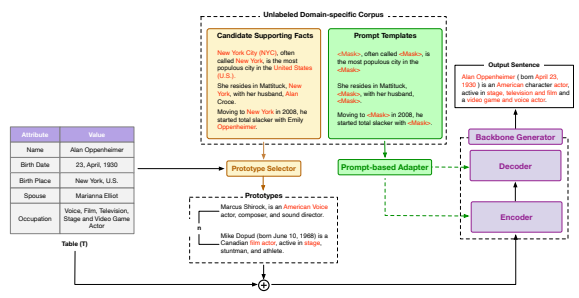
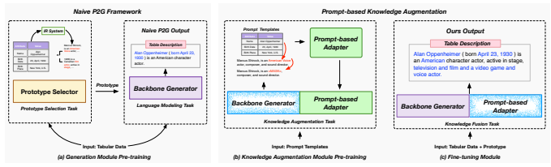
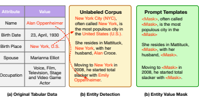
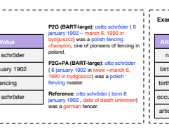

# Few-Shot Table-To-Text Generation With Prompt-Based Adapter

Zhixin Guo, Minyxuan Yan, Jiexing Qi, Jianping Zhou, Ziwei He, Zhouhan Lin, Guanjie Zheng, and Xinbing Wang, *Senior Member, IEEE*

1

Abstract**—Pre-trained language models (PLMs) have made**
remarkable progress in table-to-text generation tasks. However, the topological gap between tabular data and text and the lack of domain-specific knowledge make it difficult for PLMs to produce faithful text, especially in real-world applications with limited resources. In this paper, we mitigate the above challenges by introducing a novel augmentation method: Promptbased Adapter (PA), which targets table-to-text generation under few-shot conditions. The core insight design of the PA is to inject prompt templates for augmenting domain-specific knowledge and table-related representations into the model for bridging the structural gap between tabular data and descriptions through adapters. Such prompt-based knowledge augmentation method brings at least two benefits: (1) enables us to fully use the large amounts of unlabelled domain-specific knowledge, which can alleviate the PLMs' inherent shortcomings of lacking domain knowledge; (2) allows us to design different types of tasks supporting the generative challenge. Extensive experiments and analyses are conducted on three open-domain few-shot NLG datasets: human, song, and book. Compared to previous stateof-the-art approaches, our model achieves superior performance in terms of both fluency and accuracy as judged by human and automatic evaluations.

Index Terms**—Few-shot generation, table-to-text generation,**
prompt learning, knowledge augmentation.

## I. Introduction

G
ENERATING descriptive text from structured data [1], i.e., table-to-text generation, is an important research problem for various downstream natural language generation (NLG) applications. Some representative examples are question answering [2]–[4], dialog [5], report generation [6]–[8], and biographical description [9], demonstrating the great potential of table-to-text generation for use in extensive real-world scenarios.

The main challenge in table-to-text generation is the structural difference between the table and the natural language text. With the blossoming of deep neural networks, PLM-based NLG systems have shown a remarkable ability to produce fluent text with informative content and have achieved state-of-the-art performance in many table-to-text Zhixin Guo, Mingxuan Yan, Jiexing Qi, Jianping Zhou, Ziwei He, and Xinbing Wang are with the School of Electronic Information and Electical Engineering, Shanghai Jiao Tong University. E-mail: {stjgzx, galaxy ymx, qi jiexing, jianpingzhou, ziwei.he, xwang8}@sjtu.edu.cn Zhouhan Lin and Guanjie Zheng are with John Hopcroft Center for Computer Science, Shanghai Jiao Tong University. E-mail: lin.zhouhan@gmail.com, gjzheng@sjtu.edu.cn

| Attribute   | Value                              | Linearization: Name is Alan   Oppenheimer; Birth Date is 23, April,   |
|-------------|------------------------------------|-----------------------------------------------------------------------|
| Name        | Alan Oppenheimer                   | 1930; Birth Place is New York, U.s.;                                  |
|             |                                    | Spouse is Marianna Elliot; Occupation                                 |
| Birth Date  | 23, April, 1930                    | is Voice, Film, Television, Stage and                                 |
|             |                                    | Video Game Actor                                                      |
| Birth Place | New York, U.S.                     |                                                                       |
|             |                                    | Description: Alan Oppenheimer                                         |
| Spouse      | Marianna Elliot                    | ( born April 23, 1930 ) is an American                                |
|             |                                    | character actor, active in stage,                                     |
| Occupation  | Vioce, Film, Television, Stage and | television and film and a video game                                  |
|             | Video Game Actor                   | and voice actor.                                                      |

Fig. 1. An example of a table-text pair for the few-shot table-to-text generation from the Humans datasets. On the right is the template of the key-value pair for table linearization and the description of the table. Blue text indicates the content supported by the tabular data.

tasks, such as WIKIBIO [10], RotoWire [11], and ToTTo [12]. However, these methods depend on a large training dataset. The data-hungry nature prevents neural models from being widely adopted for real-world applications. To mitigate this challenge, researchers are investigating the use of large PLMs with various techniques, such as switch policy [13] and table structure reconstruction [14]. Recently, with the development of prompt learning, the "prompt-tuning" paradigm with PLMs has also been explored in table-totext generation. Prefix-tuning [15] and prefix-controlled generation [16] modify the encoder-decoder architecture with task-specific vectors as prompts, aiming to fully exploit the prior knowledge of PLMs. These methods rely on fine-tuning the semantic knowledge and linguistic patterns learned from the large corpus during pre-training. Although fluency improves significantly with the help of PLMs, these methods always hallucinate phrases unsupported by the table due to the insufficient to capture the representation difference between tabular data and descriptions and the limitation of domain-specific knowledge. [17], which first attempts the knowledge augmentation method through a retrieval-based framework for providing related background information, significantly improves few-shot table-to-text generation. However, due to the input length limitation of PLMs, they only take the top n retrieved sentences, leaving out most of the information. In general, it is still under-explored for few-shot table-to-text generation due to the following challenges: First, the topological gap between tabular data and descriptions results in low fidelity; Second, the inherent shortcoming of PLMs in lacking domain-specific knowledge for real-world applications becomes a bottleneck in improving the generation quality.

To address the above problems, we propose the Promptbased Adapter that injects domain-specific knowledge and table-related representation to guide and inform the model about bridging the topological gap between the tabular data and the texts. In addition to the previous study, we adopt the same unlabelled corpus as the source of domain-specific knowledge. We design and generate table-related prompt templates and inject them into PA through a modularized pretraining strategy. To comprehensively evaluate our approach, we evaluate the proposed method on a multi-domain tableto-text dataset. Compared with previous state-of-the-art approaches, our model achieves remarkable improvement in fluency and faithfulness of the generated contents as judged by human and automatic evaluations. Moreover, we also perform extensive ablation studies of the PA. In particular, the results also illustrate that our model outputs are highly faithful and fluent. In short, our contributions can be summarized as follows:
- We propose the Prompt-based Adapter, a novel knowledge augmentation method for few-shot table-to-text generation that attempts to bridge the topological gap between tabular data and text. PA enables the model to make full use of a large amount of domain-specific knowledge corpus, which is able to alleviate the insufficient data problem.

- We design a simple yet effective modularized pretraining strategy for injecting table-related representation and domain-specific knowledge. The modularized pretraining strategy effectively integrates different types of tasks that support the generative challenge.

- We conducted extensive experiments on three table-totext datasets from different domains: Humans, Books, and Songs. Both automatic and human evaluations report state-of-the-art performance.

## Ii. Related Work

As it is an essential objective in many real-world scenarios, researchers have investigated natural language generation from tabular data (NLG) for many years. Early conventional generation systems follow the pipeline paradigm, such as macro/micro planning [18] and template-based content selection [19]–[21]. Such pipeline approaches significantly rely on feature engineering and template designing. Later works, with the blooming of deep neural networks, neuralbased methods have achieved remarkable performance on table-to-text generative challenges like WIKIBIO [10], RotoWire [11], WebNLG [22], E2E [23], and ToTTo [12]. Researchers explored optimizing deep neural networks to bridge the gap between structured data and text, such as copy mechanism [24] and content-aware generation [14]. However, such methods rely on a tremendous amount of labeled data. Towards targeting real-world applications, studies of low-resource generation from structured data gain increasing attention. Zero-shot learning for question generation from knowledge graphs [25], and open-domain few-shot table-to-text generation [13] illustrates that PLMs suffer from limited labeled data in a few-shot setting due to the lack of domain-specific knowledge.

To alleviate labeled data dependency, researchers attempt to modify the architecture of the PLM to improve the efficiency of using prior information of PLMs. A semanticallyconditioned variational autoencoder (SCVAE) [26] is proposed for the semantic-controlled generation. Learning domaininvariant representations achieves impressive performance to improve SCLSTM low-resource settings. Similarly, [27] aligns with the same idea of designing a refinement adjustment LSTM-based component to select better and control the semantic information. Apart from that, represented by model-agnostic meta-learning (MAML) [28], algorithms for improving parameter efficiency are also investigated in NLG. For example, [29] proposes Meta-NLG for task-oriented dialogue systems based on the MAML algorithm by defining meta-tasks for adapting to the low-resource NLG tasks. [30] suggest a structured meta-learning towards knowledge-aware algorithm for text classification. However, these explorations can barely be generalized directly to table-to-text generation due to the challenges difference.

Recently, prompt tuning has achieved impressive success in table-to-text NLG. Prefix tuning [15] prepends learned task-specific vectors and performs well. Prefix-controlled [16] generators use the prefix vectors as a planned signal to guide and control the output of PLMs. Plan-then-generate [31] uses a content planner to generate key facts as a prompt signal to instruct generation. Although these approaches reduce the number of parameters in the model compared to previous methods following the "prompt-tuning" paradigm, the lack of domain-specific knowledge still needs to be addressed. [17] demonstrates a retrieval-based generation framework to provide background knowledge and commonsense reasoning information. However, due to the input length limitation of PLMs, they only take the top n retrieved sentences, leaving out most of the information. Unlike the previous work, we explore PA for table-to-text generation and focus on improving fluency and accuracy with a modularized pre-training strategy for injecting table-related representation and domain-specific knowledge.

## Iii. Preliminaries

In this section, we briefly introduce the relevant research lines of our work: table-to-text generation, P2G framework, and parameter-efficient adapter.

Table-to-text generation Table-to-text task aims to generate a fluent and faithful natural language description corresponding to the table. In this study, the training data set is denoted as D = {(*T, R*)i}
|D| i=1. (1) Tiis a linearized table consisting of one or more tabular data Ti = t1, · · · , t|n|. For each tabular data, ti = {ai; vi} refers to the attribute-value pair of the table contents. ai and vi can be a string/number, a phrase, or a sentence. (2) The Ri =ri, · · · , r|m| denotes the reference texts. Each riis a description corresponding to the table Ti.

3

Fig. 2. An overview of the P2G framework augmented by PA. The P2G framework consists of a prototype selector and language generator, which promise a reliable generation of table-to-text generation under few-shot setting. We insert PA after the final layer of each encoder and decoder. In addition, we utilize the same unlabelled corpus to generate table-related prompt templates and pre-train PA to learn the representation of the linguistic and semantic patterns and inject the domain-specific knowledge. PA brings at least two benefits: (1) enables us to fully use the large amounts of unlabelled domain-specific knowledge, which can alleviate the PLMs' inherent shortcomings of lacking domain knowledge; (2) allows us to design various tasks supporting the generative challenge.

Unlike the rich corpus data used for PLMs, tabular data contains complex topology structures with few narrative descriptions, which is far from natural language representations. Figure 1 illustrates an example of tabular data from the Humans dataset. According to the experimental results of [14], the tabular data format significantly enhances generation performance. In this paper, to make the tabular data more compatible with the internal representations of PLMs, we leverage the template for table linearization. As shown in Figure 1, we template the key-value pair "name: Alan Oppenheimer" as "Name is Alan Oppenheimer", then stack all key-value pairs to form a sentence, that is, "Name is Alan Oppenheimer; Birth Date is 23, April, 1930; Birth Place is New York, U.s.; ...".

P2G framework Previous work by P2G [17] has achieved impressive improvements over previous research. They design a retrieval-based framework by retrieving domain-related information from the external information retrieval (IR) system as prototype memory to guide the PLM in generating fluent and faithful sentences. Given the input tabular data T with reference text r, the P2G first retrieves n most related corresponding sentences from the IR system and generates the prototype memory according to the semantic features of the candidates. Then they concatenate the prototype memory with the tabular data as the input of PLM for producing corresponding descriptions. As their reliable achievements in improving fluency and faithfulness, we adopt P2G as our backbone framework.

Parameter-efficient adapter Adapter exploration [32]–[34]
has been widely used in transfer learning due to its superior performance in improving parameter utilization, such as taskoriented dialog systems [35], [36]. In contrast to applying adapters to multiple tasks, our knowledge augmentation task requires an efficient and architecture-agnostic plug-in model to inject prompt and domain-specific knowledge for assistance generation. To meet these requirements, we plug PA [32] into the generation framework as the knowledge augmentation module.

#### Iv. Methodology

In this paper, we first propose the Prompt-based Adapter for the knowledge augmentation method through a modularized pre-training strategy for few-shot table-to-text generation. Figure 2 shows the overall framework of our method. We leverage the P2G as our backbone framework for generation, which promises reliable performance in terms of fluency and fidelity. In addition, we plug PA into each PLM layer to inject prompt templates and domain-specific knowledge. In Figure 3, we decouple the generation module and the knowledge augmentation module and design a modularized pre-training strategy that allows the model to make full use of a large amount of domain-related corpus and allows each sub-module to apply different types of pre-training tasks to support the generative task.

As shown in Figure3(a), we modularize the pre-training of the P2G framework into a generation module consisting of a prototype selection task and a language modeling task. According to the [17] design, the prototype selection task aims to retrieve prototypes from the unlabelled corpus to bridge the structural gap between the tabular data and the descriptions. In addition, the language modeling task employs the PLM to generate fluent sentences.

To further improve the fluency and fidelity of the generated content, we propose the knowledge augmentation task for injecting the table-related prompt templates, which guide

4 Frozen Parameters

Fig. 3. The overall architecture of the proposed modularized pre-training strategy. (a) We divide the generation module into two tasks: prototype selection task and language modeling task. And we pre-train these two tasks separately. (b) We plug PA into the P2G framework and freeze all the parameters except PA during pre-training the knowledge augmentation module. (c) Finally, we fine-tune the pre-trained modularized model on three datasets: Humans, Books, and Songs. Throughout the fine-tuning process, the parameters of PA are frozen to prevent the learned knowledge pre-trained from the knowledge augmentation module.

the model to bridge the representation gap between tabular data and texts and inject domain-specific knowledge. As shown in Figure3(b), the knowledge augmentation module first freezes the generation module and further pre-trains PA independently. Specifically, the pre-training of the knowledge augmentation module relies on the prompts extracted from the unlabeled domain-specific corpus and injects the promptbased knowledge, which is different from the generation task. Such a modularization strategy brings us at least three advantages: (1) each module can be easily integrated; (2) it allows the integration of different types of generation support tasks; (3) it enables the model to make full use of any unlabeled domain-specific corpus.

As shown in Figure3(c), we introduce a fine-tuning module for fusing the linguistic and semantic patterns and the augmented knowledge by pre-training the generation and knowledge augmentation modules separately. Throughout the fine-tuning process, we freeze the parameters of PA to maintain the augmented knowledge.

## A. Generation Module Pre-Training

1) Prototype Selection Task: Following the design of [17],
we employ a prototype retriever to select prototypes that relate to the input tabular data from the IR system. The task of prototype selection is to predict the similarity between the tabular data and the retrieved prototypes. Given the input tabular data T with reference text r, the retriever retrieves n most related corresponding prototypes P from the IR systems B. We utilize a BERT-base model to get the representation of the prototype and evaluate its similarity to the target table T. The similarity score is defined as f(*T, b*) and P is then defined as:

$$P=\operatorname*{arg\,max}_{B^{\prime}\in B,|B^{\prime}|=n}\sum_{b\in B^{\prime}}f(T,b).$$

It is computed by the linear projection of the average embedding of concatenated text [T:b] by BERT. In order to select the most related domain knowledge as the prompt signal, we utilize a hinge loss based objective during the training process. Given the target table T with reference text r and the prototypes B, the learning objective is defined as:

$$L_{P S}=\sum_{i=1}^{k}\operatorname*{max}\left(0,1-f(T,r)+f(T,b_{j})\right)$$

where bj ∈ B and k is the k is the number of text candidates sampled from B.

2) Language Modeling Task: The language modeling task aims to train the PLM to generate sentences that describe the tabular data. Given the structured data T, the prototype P, and the reference text S, the learning objective of the sequence generator is the cross-entropy loss, defined as Equation1:

$$L_{LM}=-\sum_{i=1}^{|R|}\log P_{D}(R_{i}|R_{<i};E([P:T]))\tag{1}$$

where E and D represent the encoder and decoder. While the proposed method is agnostic to the choice of the particular PLM, we leave such validation for future work.

#### B. Knowledge Augmentation Module Pre-Training

1) Prompt Generation: The main idea of generating prompts is to replace the entities associated with the tabular data to teach the knowledge in order to reconstruct the knowledge representation. Unlike data augmentation in other area, we require the augmented knowledge to follow two crucial rules: (1) bridge the structural gap between the tabular data and the texts of their representation; (2) inject domain-specific knowledge to solve the insufficient training data problem. As shown in Figure4, the prompt generation process consists of two steps, *entity detection* and *entity value mask*.

- Entity detection. We first detect all entities and their attributes related to the tabular data in the unlabeled

Fig. 4. Illustration of prompt generation. (a) shows the original tabular data; (b) illustrates the entity detection process, and (c) shows the entity value mask process.

corpus provided by [17]. For example, the "New York, U.S." and "Alan Oppenheim" are detected, which is shown in Figure4(b).

- Entity value mask. We perform entity value mask to generate prompts. As shown in Figure4(c), we replace "New York City (NYC)" to "<Mask>".

2) Knowledge Augmentation Task: We plug a knowledge adapter [32] into the backbone generator to inject the prompts. The intuition of such a design is that the pluggable knowledge adapter satisfies the lightweight, model-agnostic requirement and is adequate for fine-tuning entirely new tasks. The knowledge adapter consists of a down-projection matrix W*down* and an up-projection matrix Wup. In Equation2,

$$h\gets W_{u p}\cdot(W_{d o w n}\cdot h)+r$$
h ← Wup · (Wdown · h) + r (2)
W*down* project the hidden states into lower dimension d*bottleneck* and Wup project back into the original dimension of hidden states with a residual connection r.

The P2G framework is model-agnostic. Thus the backbone generator can be any generation model. Our experiments utilize BART-large [37], an encoder-decoder architecture transformer, as our backbone generator for its remarkable performance in generative challenges. We insert the knowledge adapter after the final layer of the encoder and decoder. All parameters except the knowledge adapter are frozen during the pre-training of the knowledge augmentation, which allows the knowledge adapter to retain the knowledge learned from the knowledge augmentation task. As shown in Figure3, the knowledge augmentation task aims to pre-train the knowledge adapter to learn the linguistic and semantic pattern representation from the prompts and inject the domain-specific knowledge by reconstructing the masked prompts. Given the masked prompts B = {b1, b2, · · · , bi} and the target sentence B¯ =¯b1,
¯b2, *· · ·* ,
¯bi	, the distribution is PKA(B¯|B) and the learning objective is defined as the Equation3:

$$L_{K A}=-\sum_{i=1}^{|B|}\log P_{K A}(\bar{B}_{i}|\bar{B}_{<i};B)$$
log PKA(B¯i|B¯<i; B) (3)
C. Knowledge Fusion through fine-tuning module Finally, after separately pre-training the language generation module and knowledge augmentation module, we show how 5 to fine-tune the pre-trained system through the knowledge fusion task. The knowledge fusion task aims to train the model fuse and exploiting the knowledge learned from the two pretraining modules. Throughout the knowledge fusion process, the parameters of the knowledge adapter are frozen to preserve the augmented knowledge. The other parameters are activated to allow the model to learn and fuse the augmented knowledge.

Given the tabular data T, the prototype P, and the reference text S, the learning objective of the sequence generator is the cross-entropy loss, defined as Equation4:

$$L_{LM}=-\sum_{i=1}^{|R|}\log P_{D}(R_{i}|R_{<i};E([P:T]))\tag{4}$$

where E and D represent the encoder and decoder. While the proposed P2G framework is agnostic to the choice of the particular PLM, we leave such validation for future work.

## V. Experiments A. Datasets And Experiment Setup

Following the setting of [13], we evaluate our method on three benchmarks in different domains of the Wikibio dataset [10]: Humans, Books, and Songs. We also utilize the unlabelled corpus created by [17], which provides 100 sentences for each table. We perform experiments in few-shot settings by varying the training set size from
{50, 100, 200, 500}. The size of the validation set is 1000, and the size of the test set is 13587, 5252, and 11879 for Humans, Books, and Songs, respectively.

$$(2)$$

We use the BART-large model [37] as our backbone generator with the Huggingface Library [38]. Moreover, the implementation of PA is based on the AdapterHub Library [39]. For all parts of our framework, we utilize 3e-5 learning rate optimized by Adam [40] on one NVIDIA GeForce RTX 3090 GPU.

## B. Baseline Models

We compare our approach with previous state-of-the-art methods of few-shot table-to-text generation, which serve as baseline methods. These baseline methods are divided into the naive seq2seq-based, PLM-based, and retrieval-based methods.

## Naive Seq2Seq-Based Models:

- Structure-Aware [10]: A structure-aware seq2seq architecture consisting of a field-gating encoder and a dualattention-based generator can generate coherent and fluent descriptions.

- Pivot [41]: A two-stage generation model, consisting of key fact prediction from tables and surface realization for generation, achieves remarkable performance for a lowresource table-to-next generation.

(3)  $\frac{1}{2}$
PLM-based models:
- Switch Policy with PLM [13]: The first approach suggested for the few-shot NLG task based on PLM.

| Domain                      |         |         | Humans   |         |         |         | Books   |         |         |         | Songs   |         |
|-----------------------------|---------|---------|----------|---------|---------|---------|---------|---------|---------|---------|---------|---------|
| Training set size           | 50      | 100     | 200      | 500     | 50      | 100     | 200     | 500     | 50      | 100     | 200     | 500     |
| Structure\-Aware (R)        | 2.9     | 5.1     | 6.1      | 8.3     | 7.3     | 6.8     | 7.8     | 8.8     | 10.4    | 12.0    | 11.6    | 13.1    |
| Pivot (R)                   | 14.9    | 18.7    | 25.3     | 29.8    | 23.1    | 24.9    | 27.0    | 29.8    | 26.2    | 28.0    | 29.2    | 31.7    |
| SwitchPolicy (R)            | 25.7    | 29.5    | 36.1     | 41.7    | 34.3    | 36.2    | 37.9    | 40.3    | 36.1    | 37.2    | 39.4    | 42.2    |
| TableGPT (R)                | 29.8    | 34.5    | 40.6     | 45.6    | 35.1    | 37.3    | 38.5    | 41.6    | 36.7    | 37.8    | 39.3    | 42.3    |
| T5\-prefix (R)              | 36.8    | 38.7    | 42.9     | 46.6    | 35.3    | 36.3    | 39.8    | 42.3    | 39.4    | 41.9    | 42.8    | 43.4    |
| BART\-large                 | 39.2    | 44.0    | 46.5     | 49.6    | 36.0    | 37.2    | 42.4    | 45.6    | 41.4    | 43.7    | 44.0    | 45.9    |
| Prefix\-Tuning+T5 (R)       | 32.6    | 37.1    | 41.7     | 46.3    | 34.2    | 38.3    | 39.4    | 42.9    | 37.6    | 38.7    | 40.0    | 43.5    |
| PCG (R)                     | 39.9    | 43.3    | 45.8     | 49.4    | 36.6    | 36.9    | 39.0    | 45.6    | 38.0    | 41.7    | 42.5    | 44.5    |
| AMG (R)                     | \-      | \-      | \-       | 49.0    | \-      | \-      | \-      | 43.9    | \-      | \-      | \-      | 50.1    |
| Retri\-Gen(R)               | 7.4     | 10.3    | 13.2     | 16.5    | 12.1    | 13.2    | 14.7    | 15.9    | 13.4    | 14.3    | 16.2    | 17.7    |
| P2G (T5)(R)                 | 39.3    | 42.6    | †  46.2  | †  50.1 | †  41.2 | 43.4    | 46.4    | 49.2    | 42.8    | 45.9    | 47.6    | 50.7    |
| P2G (BART\-large)           | †  40.4 | †  44.5 | 46.0     | 49.9    | 41.0    | †  44.4 | †  47.6 | †  49.8 | †  50.1 | †  50.4 | †  52.2 | †  53.1 |
| P2G+PA (BART\-large) [Ours] | 43.3    | 45.9    | 47.4     | 51.3    | 43.6    | 45.2    | 49.3    | 50.8    | 51.3    | 52.1    | 52.6    | 53.9    |

TABLE I
BLEU-4 RESULTS ON HUMANS, BOOKS, AND SONGS DOMAINS. ALL (R) ARE COPIED FROM THE ORIGINAL PAPER. BOLD DENOTES THE BEST
PERFORMANCE OF THIS EVALUATION. THE SECOND BEST ONES ARE LABELED WITH †.

#### Table Ii

| P2G (T5)(R)   | 27.9   |
|---------------|--------|

| †   | †    | †    | †    | †    | †    | 37.3   | 28.3   | 30.5   | 33.8   | 36.1   | 34.0   | 33   | 35.7   | 37.5   | 40.1   | †   | †   | †   | †   | 41.6   | 43.7   | 44.3   |
|-----|------|------|------|------|------|--------|--------|--------|--------|--------|--------|------|--------|--------|--------|-----|-----|-----|-----|--------|--------|--------|
| †   | 39.2 | 29.6 | 31.1 | 34.6 | 36.9 | 43.7   | 43.9   | 44.8   | 46.1   |        |        |      |        |        |        |     |     |     |     |        |        |        |

ROUGE-4 RESULTS ON HUMANS, BOOKS, AND SONGS DOMAINS. ALL (R) ARE COPIED FROM THE ORIGINAL PAPER. BASELINE, WHICH DOES NOT EVALUATE ROUGE-4 METRIC , IS NOT SHOWN IN THIS TABLE. BOLD DENOTES THE BEST PERFORMANCE OF THIS EVALUATION. THE SECOND BEST
ONES ARE LABELED WITH †. THE RESULT OF HUMANS WITH 200 TRAINING INSTANCES, P2G+PA (BART-LARGE) IS SLIGHTLY BEHIND P2G (T5) BUT
BETTER THAN P2G (BART-LARGE). OUR METHODS STILL ACHIEVES THE BEST PERFORMANCE IN THE CASE OF SIMILAR PARAMETRIC MODELS.

| Domain                      |         |         | Humans   |         |         |         | Books   |         |         |         | Songs   |         |
|-----------------------------|---------|---------|----------|---------|---------|---------|---------|---------|---------|---------|---------|---------|
| Training set size           | 50      | 100     | 200      | 500     | 50      | 100     | 200     | 500     | 50      | 100     | 200     | 500     |
| Switch+GPT\-2 (R)           | 25.7    | 39.5    | 36.1     | 41.7    | 34.3    | 36.2    | 37.9    | 40.3    | 36.1    | 37.2    | 39.4    | 42.2    |
| TableGPT (R)                | 29.8    | 34.5    | 40.6     | 45.6    | 35.1    | 37.3    | 38.5    | 41.6    | 36.7    | 37.8    | 39.3    | 42.3    |
| BART\-large (R)             | 37.6    | 39.3    | 41.2     | 44.3    | 34.2    | 37.1    | 39.8    | 42.9    | 37.7    | 38.9    | 40.1    | 43.9    |
| AMG (R)                     | \-      | \-      | \-       | 49.0    | \-      | \-      | \-      | 43.9    | \-      | \-      | \-      | 45.1    |
| Prefix\-Tuning+T5 (R)       | 34.5    | 39.9    | 41.6     | 44.1    | 35.5    | 37.3    | 39.6    | 41.2    | 37.5    | 38.5    | 40.0    | 41.1    |
| PCG (R)                     | 39.9    | 43.3    | 45.8     | 49.4    | 36.6    | 36.9    | 39.0    | 45.6    | 38.0    | 41.7    | 42.5    | 44.5    |
| P2G (BART\-large)           | †  44.3 | †  48.2 | †  49.3  | †  51.4 | †  44.4 | †  47.4 | 49.2    | †  49.7 | †  45.5 | †  47.0 | 48.5    | †  47.9 |
| P2G+PA (BART\-large) [Ours] | 47.1    | 49.8    | 50.3     | 52.5    | 46.9    | 49.1    | †  48.7 | 49.9    | 47.9    | 48.0    | †  48.3 | 49.3    |

P2G+PA (BART-large) [Ours] **28.2 31.5** 33.3

TABLE III

PARENT-F RESULTS ON HUMANS, BOOKS AND SONGS DOMAINS. ALL (R) ARE COPIED FROM THE ORIGINAL PAPER. BASELINE, WHICH DOES NOT EVALUATE PARENT-F METRIC, IS NOT SHOWN IN THIS TABLE. BOLD DENOTES THE BEST PERFORMANCE OF THIS EVALUATION. THE SECOND BEST
ONES ARE LABELED WITH †.

6 They suggest a switch policy to balance generating or copying from the table contents. Switch+GPT2 and Switch+BART-large are implemented by [13], and [16], respecitvly.

- TableGPT [14]: A further study based on Swtich+GPT2 that utilizes two auxiliary tasks for structure construction and content matching to generate faithful text.

- BART-Large [37]: A powerful PLM for generative challenges.

- T5-Prefix [42]: T5 PLM, which is utilized for the conditional generation with special prefix tokens.

- AMG [43]: A PLM-based approach with multi-grain attention on table slots and tokens with a dynamic memory mechanism to back-track the allocation of table slots.

- Prefix-tuning [15]: A prompt-tuning method that prepends a continuous token to preserve prior knowledge of PLM. The performance of the few-shot table-to-text generation is explored by [16].

- PCG [16]: A prompt-tuning method with both prefixtuning and hard prompt to control generation content.

## Retrieval-Based Models:

- Retri-Gen [44]: A retrieval-based approach that retrieves and edits a prototype response from a pre-defined index for sentence generation.

- P2G [17]: They propose a retrieval-based framework that utilizes an IR system to provide the prototype for improving generation quality.

## C. Automatic Evaluation

Following the previous settings [13], we perform the automatic evaluation with BLEU-4 [45] and ROUGE-4 [46] to measure the similarity between the generations of systems and the reference descriptions. BLEU-4 calculates the geometric mean of the precision over the 4 grams of the output text. ROUGE-4 counts the number of overlapping 4-gram tokens between the generated description and the ideal summaries. In addition, we investigate the automatic evaluation of PARENT [47], a token overlap-based metric that estimates the fidelity of the generated sentence with respect to both the original table and the reference sentence. In our experiments, we report the F1 score of PARENT, denoted PARENT-F.

TableI and TableII show the BLEU4 and ROUGE-4 results of our experiments. Our approach achieves stateof-the-art performance in three domains, demonstrating the robustness and universality of our approach. Under nearparametric conditions, our approach provides a significant boost compared to previous methods. As shown in Figure5, compared with P2G (BART-large), which performs the second-best result with a similar number of parameters, our approach improves on average 4%, 3%, 2% BLEU and 9%,
5%, 4% ROUGE on Humans, Books, and Songs dataset separately. The results show that our method can produce fluent descriptions.

Concerning the results of BLEU4 and ROUGE-4, the PLM-based methods significantly improve the fluency and coherence of the yield sentences compared to the naive Seq2seq methods. By extending GPT2 [48], TableGPT [14], and SwitchPolicy [13] achieve remarkable performance over the previous naive method. By increasing the number of model parameters and optimizing the encoder-decoder, T5 [42], BART-large [37], Prefix-Tuning+T5 [15], PCG
[16] further improve the generated quality. However, the lack of domain-specific knowledge of PLMs becomes the bottleneck to better bridging the gap between tabular data and descriptions. The research of P2G [17] introduces the retrieval-based method via the unlabelled domain-specific knowledge corpus and provides a new way to overcome the shortcomings of PLM-based methods. However, this method leaves out most of the information. Our approach provides an effective solution that targets this shortcoming according to the results.

Our approach also achieves a better performance of PARENT-F than other baseline methods. According to the result, compared to P2G (BART-large), with the help of the Prompt-based Adapter, our performance achieves an average of 3% better in 9 terms and an average of 1% worse in 2 terms of PARENT-F. As we use the result of ROUGE and BLEU as the primary evaluation standards throughout our training process, partial PARENT-F accuracy is sacrificed. At the same time, during the human evaluation, we found that the knowledge augmentation method also affects the PARENT-F score while enriching the generated content.

## D. Human Evaluation

We also conduct a human evaluation to compare the Prompt-based knowledge augmentation method P2G+PA (BART-large) with the closest baseline, P2G (BART-large). All volunteers are postgraduate computer science students. Following the settings in [13], we evaluate each generated sentence with two tasks: faithfulness and fluency evaluation. The experiments are performed on the Humans dataset with 100 training instances. We randomly select 100 generated sentences with the corresponding tabular data. In order to reduce variance caused by humans, each example is scored by three different people.

Faithfulness aims to evaluate the correct information in the generated sentences. Only all information supported by the table makes the generated sentence faithful. Throughout the evaluation, each evaluator was asked to count the number of contained facts supported by the table data, noted as \#Sup, and the number of contradictory facts, noted as \#*Cont*. We report the average number of \#Sup and \#*Cont* in TableVI.

Fluency tries to evaluate the fluency of the generated sentences. The sentence is fluent if it is grammatical and natural. The raters are asked to rate the output in terms of fluency on a 3-point Likert scale (0, 1, or 2). We report the average result in TableVI.

7

TABLE IV
ABLATION STUDY OF BLEU4 RESULTS ON HUMANS, BOOKS, AND SONGS DOMAINS. BOLD DENOTES THE BEST PERFORMANCE OF THIS EVALUATION.

| Domain            |      | Humans   |      |      |      |      | Books   |      |      | Songs   |      |      |
|-------------------|------|----------|------|------|------|------|---------|------|------|---------|------|------|
| Training set size | 50   | 100      | 200  | 500  | 50   | 100  | 200     | 500  | 50   | 100     | 200  | 500  |
| Ours              | 43.3 | 45.9     | 47.4 | 51.3 | 43.6 | 45.2 | 49.3    | 50.8 | 51.3 | 52.1    | 52.6 | 53.9 |
| \-PA              | 40.4 | 44.5     | 46.0 | 49.9 | 41.0 | 44.4 | 47.6    | 49.8 | 50.1 | 50.4    | 52.2 | 53.1 |
| \-P2G             | 40.7 | 44.8     | 48.0 | 50.9 | 36.4 | 37.1 | 42.6    | 45.9 | 41.4 | 43.4    | 44.6 | 46.1 |
| \-PA&P2G          | 39.2 | 44.0     | 46.5 | 49.6 | 36.0 | 37.2 | 42.4    | 45.6 | 41.4 | 43.7    | 44.0 | 45.9 |

ABLATION STUDY OF ROUGE-4 RESULTS ON HUMANS, BOOKS, AND SONGS DOMAINS. BOLD DENOTES THE BEST PERFORMANCE OF THIS
TABLE V
EVALUATION.

Domain **Humans Books Songs** Training set size 50 100 200 500 50 100 200 500 50 100 200 500 Ours **28.2 31.5** 33.3 **39.2 29.6 31.1 34.6 36.9 43.7 43.9 44.8 46.1** -PA 24.8 28.9 31.4 36.6 27.1 30.4 33.6 34.8 42.4 41.6 43.7 44.3 -P2G 26.2 30.9 **34.6** 37.4 24.1 26.4 28.9 31.7 30.8 33.2 34.3 37.4

-PA&P2G 23.7 28.6 32.6 36.7 24.2 26.3 27.6 30.6 30.8 32.5 33.1 35.2

TABLE VI
HUMAN EVALUATION RESULTS. ↑ DENOTES THE HIGHER THE BETTER
AND ↓ DENOTES THE LOWER THE BETTER. BOLD DENOTES THE BEST
PERFORMANCE OF THIS EVALUATION.

|                             | # Sup ↑   | # Cont ↓   | Fluency ↑   |
|-----------------------------|-----------|------------|-------------|
| P2G (BART\-large)           | 3.99      | 0.78       | 2.35        |
| P2G+PA (BART\-large) [Ours] | 4.20      | 0.56       | 2.74        |

## F. Case Study

The results show that our method provides a significant improvement over P2G (BART-large) for all metrics (sign test with p-value <0.05).

#### E. Ablation Study

We perform an ablation study on the BART-large model by incorporating each proposed technique. The -PA indicates only using the P2G (BART-large) framework. Furthermore -P2G indicates only using the Prompt-based Adapter for knowledge augmentation. And -PA&P2G demonstrates the result of only using the backbone generator (BART-large). TableIV, TableV, and TableVII demonstrate the results of BLEU4, ROUGE-4, and PARENT-F of Humans, Books, and Songs (50/100/200/500) separately.

According to the ablation study, both the P2G framework and the Prompt-based Adapter significantly improve performance compared to the result of the Backbone Generator.

The P2G framework performs better than the Prompt-based Adapter for the Books and Songs dataset, and the Promptbased Adapter achieves better performance for the Humans dataset. Using all techniques further improves the experimental results.

8 In Figure5, we present two generated examples of our model against the strongest baseline P2G (BART-large), along with the references from the Humans under 100 instances setting. Blue text indicates facts that are supported by the tabular data, and red text indicates facts that are incorrect or not shown in the tabular data.

As seen in the first example, all attribute-value pairs are mentioned in the references and two generated sentences. The reference sentences refer to "date of death unknown", which contradicts the original input. The two generated sentences introduce the correct "date of death" and the corresponding place via the domain-specific corpus. However, the P2G (BART-large) framework yield fragment "fencing champion" is far from the reference sentence and the tabular data. In contrast, the Prompt-base Adapter augments the P2G framework and has a positive effect on the balancing using the facts of the original table and the domain-specific knowledge. A similar issue can be seen in the second example. P2G (BART-large) generates the fragment "director, producer and journalist", which is not mentioned in the tabular data or the references.

These results further illustrate that the Prompt-based Adapter brings benefits in terms of balancing the use of facts from the original spreadsheet and domain-specific knowledge. Fluency and accuracy were also improved.

## Vi. Conclusion

In this paper, we propose a prompt-based knowledge augmentation method through the Prompt-based Adapter for fewshot table-to-text generation. Taking advantage of the modularized pre-training strategy, we inject the representation of the

| Attribute     | Value          |
|---------------|----------------|
| name          | otto schröder  |
| birth date    | 6 january 1902 |
| sport         | fencing        |
| article title | otto schröder  |

| Attribute     | Value                                       |
|---------------|---------------------------------------------|
| name          | tammy bruce                                 |
| birth date    | 20 august 1962                              |
| birth place   | los angeles, california                     |
| occupatioin   | radio host, writer, political   commentator |
| article title | tammy bruce                                 |

Example 1 Example 2 

Fig. 5. Two example tables from the Human test set and the yield texts from different methods are trained with 100 training data. The red text denotes that

9

| Domain            |      | Humans   |      |      |      |      | Books   |      |      | Songs   |      |      |
|-------------------|------|----------|------|------|------|------|---------|------|------|---------|------|------|
| Training set size | 50   | 100      | 200  | 500  | 50   | 100  | 200     | 500  | 50   | 100     | 200  | 500  |
| Ours              | 47.1 | 49.8     | 50.3 | 52.6 | 46.9 | 49.1 | 48.7    | 49.9 | 47.9 | 48.0    | 48.3 | 49.3 |
| \-PA              | 44.3 | 48.2     | 49.3 | 51.4 | 44.4 | 47.4 | 49.2    | 49.7 | 45.5 | 47.0    | 48.5 | 47.9 |
| \-P2G             | 46.4 | 49.5     | 51.0 | 53.0 | 45.1 | 45.8 | 47.4    | 45.9 | 45.5 | 46.8    | 46.7 | 47.3 |
| \-PA&P2G          | 44.4 | 48.2     | 49.5 | 51.3 | 42.9 | 45.5 | 46.3    | 47.3 | 44.7 | 46.8    | 44.9 | 47.1 |

the incorrect fact conflicts with information in the original table. The blue text indicates the supported fact by the tabular data.

TABLE VII
ABLATION STUDY OF PARENT-F RESULTS ON HUMANS, BOOKS AND SONGS DOMAINS. BOLD DENOTES THE BEST PERFORMANCE OF THIS
EVALUATION.

linguistic and semantic patterns of table-related descriptions and fully exploit a large domain-specific knowledge corpus. With the modularization strategy, our framework can devise various pre-training tasks to enhance the generative task, achieving high fluency and accuracy. Experimental results on three benchmark datasets show that our framework achieves superior performance on both fluency and faithfulness metrics.

#### References

[1] A. Gatt and E. Krahmer, "Survey of the state of the art in natural language generation: Core tasks, applications and evaluation," *Journal* of Artificial Intelligence Research, vol. 61, pp. 65–170, 2018.

[2] Z. Chen, W. Chen, C. Smiley, S. Shah, I. Borova, D. Langdon, R. Moussa, M. Beane, T.-H. Huang, B. R. Routledge *et al.*, "Finqa: A dataset of numerical reasoning over financial data," in Proceedings of the 2021 Conference on Empirical Methods in Natural Language Processing, 2021, pp. 3697–3711.

[3] M. Ghazvininejad, C. Brockett, M.-W. Chang, B. Dolan, J. Gao, W.-t.

Yih, and M. Galley, "A knowledge-grounded neural conversation model," in *Proceedings of the AAAI Conference on Artificial Intelligence*, vol. 32, no. 1, 2018.

[4] W. Chen, M.-W. Chang, E. Schlinger, W. Y. Wang, and W. W. Cohen,
"Open question answering over tables and text," in International Conference on Learning Representations, 2020.

[5] H. He, A. Balakrishnan, M. Eric, and P. Liang, "Learning symmetric collaborative dialogue agents with dynamic knowledge graph embeddings," in Proceedings of the 55th Annual Meeting of the Association for Computational Linguistics (Volume 1: Long Papers), 2017, pp. 1766–
1776.

[6] S. Wiseman, S. M. Shieber, and A. M. Rush, "Challenges in datato-document generation," in Proceedings of the 2017 Conference on Empirical Methods in Natural Language Processing, 2017, pp. 2253– 2263.

[7] S. Murakami, A. Watanabe, A. Miyazawa, K. Goshima, T. Yanase, H. Takamura, and Y. Miyao, "Learning to generate market comments from stock prices," in *Proceedings of the 55th Annual Meeting of the* Association for Computational Linguistics (Volume 1: Long Papers), 2017, pp. 1374–1384.

[8] S. A. Hasan and O. Farri, "Clinical natural language processing with deep learning," in *Data science for healthcare*. Springer, 2019, pp. 147–171.

[9] R. Lebret, D. Grangier, and M. Auli, "Neural text generation from structured data with application to the biography domain," in Proceedings of the 2016 Conference on Empirical Methods in Natural Language Processing, 2016, pp. 1203–1213.

[10] T. Liu, K. Wang, L. Sha, B. Chang, and Z. Sui, "Table-to-text generation by structure-aware seq2seq learning," in Thirty-Second AAAI Conference on Artificial Intelligence, 2018.

[11] H. Iso, Y. Uehara, T. Ishigaki, H. Noji, E. Aramaki, I. Kobayashi, Y. Miyao, N. Okazaki, and H. Takamura, "Learning to select, track, and generate for data-to-text," in Proceedings of the 57th Annual Meeting of the Association for Computational Linguistics, 2019, pp. 2102–2113.

[12] A. Parikh, X. Wang, S. Gehrmann, M. Faruqui, B. Dhingra, D. Yang, and D. Das, "Totto: A controlled table-to-text generation dataset," in Proceedings of the 2020 Conference on Empirical Methods in Natural Language Processing (EMNLP), 2020, pp. 1173–1186.

[13] Z. Chen, H. Eavani, W. Chen, Y. Liu, and W. Y. Wang, "Few-shot nlg with pre-trained language model," in Proceedings of the 58th Annual Meeting of the Association for Computational Linguistics, 2020, pp. 183–190.

[14] H. Gong, Y. Sun, X. Feng, B. Qin, W. Bi, X. Liu, and T. Liu, "Tablegpt:
Few-shot table-to-text generation with table structure reconstruction and content matching," in Proceedings of the 28th International Conference on Computational Linguistics, 2020, pp. 1978–1988.

[15] X. L. Li and P. Liang, "Prefix-tuning: Optimizing continuous prompts for generation," in Proceedings of the 59th Annual Meeting of the Association for Computational Linguistics and the 11th International Joint Conference on Natural Language Processing (Volume 1: Long Papers), 2021, pp. 4582–4597.

[16] Y. Luo, M. Lu, G. Liu, and S. Wang, "Few-shot table-to-text generation with prefix-controlled generator," in Proceedings of the 29th International Conference on Computational Linguistics, 2022, pp. 6493–6504.

[17] Y. Su, Z. Meng, S. Baker, and N. Collier, "Few-shot table-to-text generation with prototype memory," in Findings of the Association for Computational Linguistics: EMNLP 2021, 2021, pp. 910–917.

[18] E. Reiter and R. Dale, "Building applied natural language generation systems," *Natural Language Engineering*, vol. 3, no. 1, pp. 57–87, 1997.

[19] P. Liang, M. I. Jordan, and D. Klein, "Learning semantic correspondences with less supervision," in Proceedings of the Joint Conference of the 47th Annual Meeting of the ACL and the 4th International Joint Conference on Natural Language Processing of the AFNLP, 2009, pp. 91–99.

[20] M. Walker, O. Rambow, and M. Rogati, "Spot: A trainable sentence planner," in Second Meeting of the North American Chapter of the Association for Computational Linguistics, 2001.

[21] W. Lu, H. T. Ng, and W. S. Lee, "Natural language generation with tree conditional random fields," in *Proceedings of the 2009 Conference* on Empirical Methods in Natural Language Processing. Singapore: Association for Computational Linguistics, Aug. 2009, pp. 400–409.

[22] C. Gardent, A. Shimorina, S. Narayan, and L. Perez-Beltrachini, "The webnlg challenge: Generating text from rdf data," in *Proceedings of the* 10th International Conference on Natural Language Generation, 2017, pp. 124–133.

[23] J. Novikova, O. Dusek, and V. Rieser, "The e2e dataset: New challenges for end-to-end generation," in 18th Annual Meeting of the Special Interest Group on Discourse and Dialogue. Association for Computational Linguistics, 2017, pp. 201–206.

[24] A. See, P. J. Liu, and C. D. Manning, "Get to the point: Summarization with pointer-generator networks," in Proceedings of the 55th Annual Meeting of the Association for Computational Linguistics (Volume 1: Long Papers), 2017, pp. 1073–1083.

[25] H. Elsahar, C. Gravier, and F. Laforest, "Zero-shot question generation from knowledge graphs for unseen predicates and entity types," in Proceedings of NAACL-HLT, 2018, pp. 218–228.

[26] B.-H. Tseng, F. Kreyssig, P. Budzianowski, I. Casanueva, Y.-C. Wu, S. Ultes, and M. Gasic, "Variational cross-domain natural language generation for spoken dialogue systems," in *Proceedings of the 19th* Annual SIGdial Meeting on Discourse and Dialogue, 2018, pp. 338– 343.

[27] V.-K. Tran and M. Le Nguyen, "Dual latent variable model for lowresource natural language generation in dialogue systems," in Proceedings of the 22nd Conference on Computational Natural Language Learning, 2018, pp. 21–30.

[28] C. Finn, P. Abbeel, and S. Levine, "Model-agnostic meta-learning for fast adaptation of deep networks," in International conference on machine learning. PMLR, 2017, pp. 1126–1135.

[29] F. Mi, M. Huang, J. Zhang, and B. Faltings, "Meta-learning for lowresource natural language generation in task-oriented dialogue systems," in Proceedings of the 28th International Joint Conference on Artificial Intelligence, 2019, pp. 3151–3157.

[30] H. Yao, Y.-x. Wu, M. Al-Shedivat, and E. Xing, "Knowledge-aware meta-learning for low-resource text classification," in *Proceedings of* the 2021 Conference on Empirical Methods in Natural Language Processing, 2021, pp. 1814–1821.

[31] Y. Su, D. Vandyke, S. Wang, Y. Fang, and N. Collier, "Plan-thengenerate: Controlled data-to-text generation via planning," in Findings of the Association for Computational Linguistics: EMNLP 2021, 2021, pp. 895–909.

[32] N. Houlsby, A. Giurgiu, S. Jastrzebski, B. Morrone, Q. De Laroussilhe, A. Gesmundo, M. Attariyan, and S. Gelly, "Parameter-efficient transfer learning for nlp," in *International Conference on Machine Learning*. PMLR, 2019, pp. 2790–2799.

[33] E. J. Hu, P. Wallis, Z. Allen-Zhu, Y. Li, S. Wang, L. Wang, W. Chen et al., "Lora: Low-rank adaptation of large language models," in International Conference on Learning Representations.

[34] H. Liu, D. Tam, M. Mohammed, J. Mohta, T. Huang, M. Bansal, and C. Raffel, "Few-shot parameter-efficient fine-tuning is better and cheaper than in-context learning," in Advances in Neural Information Processing Systems.

[35] L. Qin, X. Xu, L. Wang, Y. Zhang, and W. Che, "Modularized pretraining for end-to-end task-oriented dialogue," IEEE/ACM Transactions on Audio, Speech, and Language Processing, 2023.

[36] D. Emelin, D. Bonadiman, S. Alqahtani, Y. Zhang, and S. Mansour,
"Injecting domain knowledge in language models for task-oriented dialogue systems," *arXiv preprint arXiv:2212.08120*, 2022.

[37] M. Lewis, Y. Liu, N. Goyal, M. Ghazvininejad, A. Mohamed, O. Levy, V. Stoyanov, and L. Zettlemoyer, "Bart: Denoising sequence-to-sequence pre-training for natural language generation, translation, and comprehension," in *Proceedings of the 58th Annual Meeting of the Association for* Computational Linguistics, 2020, pp. 7871–7880.

[38] T. Wolf, L. Debut, V. Sanh, J. Chaumond, C. Delangue, A. Moi, P. Cistac, T. Rault, R. Louf, M. Funtowicz *et al.*, "Transformers: Stateof-the-art natural language processing," in *Proceedings of the 2020* conference on empirical methods in natural language processing: system demonstrations, 2020, pp. 38–45.

[39] J. Pfeiffer, A. Ruckl ¨ e, C. Poth, A. Kamath, I. Vuli ´ c, S. Ruder, K. Cho, ´
and I. Gurevych, "Adapterhub: A framework for adapting transformers,"
in Proceedings of the 2020 Conference on Empirical Methods in Natural Language Processing (EMNLP 2020): Systems Demonstrations. Online: Association for Computational Linguistics, 2020, pp. 46–54. [Online]. Available: https://www.aclweb.org/anthology/2020.emnlp-demos.7
[40] D. P. Kingma and J. Ba, "Adam: A method for stochastic optimization,"
in 3rd International Conference on Learning Representations, ICLR 2015, San Diego, CA, USA, May 7-9, 2015, Conference Track Proceedings, Y. Bengio and Y. LeCun, Eds., 2015. [Online]. Available: http://arxiv.org/abs/1412.6980
[41] S. Ma, P. Yang, T. Liu, P. Li, J. Zhou, and X. Sun, "Key fact as pivot: A two-stage model for low resource table-to-text generation," in Proceedings of the 57th Annual Meeting of the Association for Computational Linguistics, 2019, pp. 2047–2057.

[42] C. Raffel, N. Shazeer, A. Roberts, K. Lee, S. Narang, M. Matena, Y. Zhou, W. Li, P. J. Liu *et al.*, "Exploring the limits of transfer learning with a unified text-to-text transformer." *J. Mach. Learn. Res.*, vol. 21, no. 140, pp. 1–67, 2020.

[43] W. Zhao, Y. Liu, Y. Wan, and P. Yu, "Attend, memorize and generate: Towards faithful table-to-text generation in few shots," in *Findings of the Association for Computational Linguistics:* EMNLP 2021. Punta Cana, Dominican Republic: Association for Computational Linguistics, Nov. 2021, pp. 4106–4117. [Online]. Available: https://aclanthology.org/2021.findings-emnlp.347
[44] Y. Wu, F. Wei, S. Huang, Y. Wang, Z. Li, and M. Zhou, "Response generation by context-aware prototype editing," in Proceedings of the AAAI Conference on Artificial Intelligence, vol. 33, no. 01, 2019, pp.

7281–7288.

[45] K. Papineni, S. Roukos, T. Ward, and W.-J. Zhu, "Bleu: a method for automatic evaluation of machine translation," in *Proceedings of the 40th* annual meeting of the Association for Computational Linguistics, 2002, pp. 311–318.

[46] C.-Y. Lin, "Rouge: A package for automatic evaluation of summaries,"
in *Text summarization branches out*, 2004, pp. 74–81.

[47] B. Dhingra, M. Faruqui, A. Parikh, M.-W. Chang, D. Das, and W. Cohen,
"Handling divergent reference texts when evaluating table-to-text generation," in Proceedings of the 57th Annual Meeting of the Association for Computational Linguistics, 2019, pp. 4884–4895.

[48] A. Radford, J. Wu, R. Child, D. Luan, D. Amodei, I. Sutskever *et al.*,
"Language models are unsupervised multitask learners."

## Appendixa Experimentdetails

We apply the Adam [40] as our optimizer with the learning rate set to 0.00003. The mini-batch size is set to 16. We use BART-large [37] as our backbone generator with the Huggingface Library [38] with default settings. We set < sep >, *< eos >*, and < context *start >* as special tokens to the BART vocabulary throughout the templating process. Moreover, we insert the knowledge adapter, which is based on the AdapterHub Library [39], into each encoder and decoder layer. For more details, refer to our released code and data at https://github.com/sjtugzx/PromptMize.git. 

## Appendix B Details Of Human Evaluationsetup

To perform the human evaluation, we randomly select 100 generated sentences of the closest baseline, P2G+BART-large, and PromptMize with the corresponding table-reference pairs on the Humans dataset with 100 taring instances. To reduce human bias, we randomly shuffle these 200 samples before presenting them to three annotators. All volunteers are postgraduate students with NLP-related knowledge. Following the previous research [13], we evaluate each generated sentence with two tasks: evaluating faithfulness and language fluency. Throughout the evaluation, all annotators are asked to follow the annotation guidelines, shown in Figure6. 

## Appendix C More Examples Of Generated Results

In this part, we provide more generated examples of ablation studies. The generated results are shown in Figure7. From the results, we can see that our model can generate fluent and diverse sentences. The prompt planner and the knowledge adapter improve the generation fluency and faithfulness to different extents compared with the baseline model BART. After applying all techniques, we see that the generated quality is further improved. These results further demonstrate the applicability and generalization ability of our model.

# Human Evaluation Guidelines

Give original tabular data and the generated descriptions. Annotators are asked to annotate and statistic the following three tasks: 1. \#Sup: Count the content supported by the tabular data. 2. \#Cont: Count the content contradicting the tabular data. 3. Fluency: Estimate the fluency of the generated sentences. (Ignore the faithfulness, the sentence is fluent if it is grammatical and natural.) Likert scale is 1, 2, 3. 1 denotes the sentences containing obvious grammatical errors or are poorly formed. 2 denotes the sentences flow smoothly, with problems that do not affect the reading. 3 denotes that the sentences are fluent without any mistakes.

# Example:

Tabular Data: name : michael phillip wojewoda image : michael phillip wojewoda . jpg caption : wojewoda performing with the rheostatics in 2007 at massey hall background : nonvocalinstrumentalist origin : toronto , ontario , canada genre : indie rock occupation : musician , record producer associated acts : rheostatics space invaders article title : michael phillip wojewoda Generated Sentences:michael phillip wojewoda is an indie rock musician , record producer , and guitarist .

Ranking: \# Sup: 4. Reason: michael phillip wojewoda, indie rock, musician, record producer are supported by the tabular data. \# Cont: 1. Reason: guitarist is not supported by the tabular data. \# Fluency: 2. Reason: The overall expression is fluent. There are no grammatical errors, and any mistakes affect the human reading.

Fig. 6. Human Evaluation Guidelines.

## Input Table

name : diego barrado|fullname : diego armando barrado|birth date : 27 february 1981|birth place : bragado , argentina| height : 1 . 77 0|position : midfielder|currentclub : boca unidos|clubnumber : tba|years : 2004 - 2005 2006 - 2007 2007 - 
2008 2011 - 2014 2014 -|clubs : → racing club ( loan ) → colón ( loan ) → olimpo ( loan ) atlético tucumán boca unidos| caps : 72 29 33 28 122 19|goals : 5 5 0 3 6 0|pcupdate : 21 march 2015|article title : diego barrado

## Referece Sentence

diego armando barrado ( born 27 february 1981 in argentina ) is an argentine footballer . BART-large: diego armando barrado ( born 27 february 1981 ) is an argentinian professional footballer who plays for boca unidos as a midfielder . +P2G: diego armando barrado ( born 27 february 1981 ) is an argentine professional footballer who plays for boca unidos as a midfielder . +PA: diego armando barrado ( born february 27 , 1981 in bragado ) is an argentine footballer who plays for boca unidos as a midfielder .

+PA & P2G (Ours): diego armando barrado ( born 27 february 1981 in bragado ) is an argentinian footballer who plays for boca unidos as a midfielder .

## Input Table

name : joris andringa|office : governor of new netherland|term start : december 15 , 1673 ' ' ( commissioned ) ' '|term end : ' ' never entered upon his duties . ' '|predecessor : anthony colve|birth date : 1635|birth place : netherlands|death date : 28 may 1676|death place : mediterranean sea|profession : naval officer|article title : joris andringa Referece Sentence joris andringa ( 1635 -- may 28 , 1676 ) was a dutch naval officer . BART-large: joris andringa ( ; 1635 -- 28 may 1676 ) was the governor of new netherland from december 15 , 1673 to his death in 1676 . +P2G: joris andringa ( 1635 -- 28 may 1676 ) was the first governor of new netherland .

+PA: joris andringa ( december 15 , 1635 -- may 28 , 1676 ) was the first governor of new netherland .

+PA & P2G (Ours): joris andringa ( 1635 -- 28 may 1676 ) was the first governor of new netherland .

## Input Table

name : alexandra nessmar|birth date : 23 june 1994|birth place : sweden|role : rider|article title : alexandra nessmar Referece Sentence alexandra nessmar ( born 23 june 1994 ) is a swedish racing cyclist . BART-large: alexandra nessmar ( born 23 june 1994 ) is a swedish professional mountain bike racer . +PP: alexandra nessmar ( born 23 june 1994 ) is a sweden actress .

+KA: alexandra nessmar ( born 23 june 1994 ) is a former swedish motorcycle rider . +KA & PP (PromptMize): alexandra nessmar ( born 23 june 1994 ) is a swedish rider .

Fig. 7. Examples of generated result of ablation study. Blue denotes the support information by the tabular data, the red denotes the contradicting information to the tabular data, and the green denotes the grammatical mistake which influence the fluency.