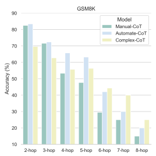
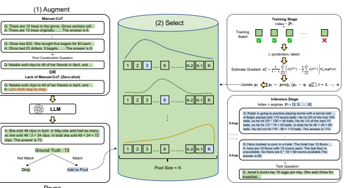
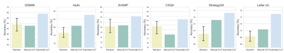
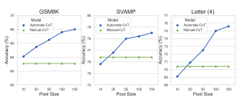

# Automatic Prompt Augmentation And Selection With Chain-Of-Thought From Labeled Data

KaShun Shum♠∗, Shizhe Diao♠∗**, Tong Zhang**♠†
♠The Hong Kong University of Science and Technology
{ksshumab, sdiaoaa, tongzhang}@ust.hk

## Abstract

Chain-of-thought prompting (CoT) advances the reasoning abilities of large language models (LLMs) and achieves superior performance in arithmetic, commonsense, and symbolic reasoning tasks. However, most CoT studies rely on carefully designed human-annotated rational chains to prompt the language model, which poses challenges for real-world applications where labeled training data is available without human-annotated rational chains. This creates barriers to applications of CoT prompting to these general tasks. This paper proposes a new strategy, Automate- CoT (**Autom**atic Prompt Augmentation and Selection with Chain-of-Thought), that can bypass human engineering of CoTs by automatically augmenting rational chains from a small labeled dataset, and then pruning lowquality chains to construct a candidate pool of machine-generated rationale chains based on the labels. Finally, it selects the optimal combination of several rationale chains from the pool for CoT prompting by employing a variance-reduced policy gradient strategy to estimate the significance of each example in a black-box language model. Automate-CoT enables a quick adaptation of the CoT technique to different tasks. Experimental results demonstrate the effectiveness of our method, where state-of-the-art results are achieved on arithmetic reasoning (+2.7%), commonsense reasoning (+3.4%), symbolic reasoning (+3.2%),
and non-reasoning tasks (+2.5%).1

## 1 **Introduction**

The recent success in large language models
(LLMs) has shown that properly prompted LLMs demonstrate emergent capabilities on complex understanding and question-answering tasks (Wei et al., 2022a). Especially, with the recently proposed chain-of-thought (CoT) prompting (Wei et al., 2022b), LLMs are capable of solving reasoning tasks including arithmetic reasoning, commonsense reasoning, and symbolic reasoning. The basic idea of CoT prompting is adding a few rationale chains to the answer as exemplars to illustrate the intermediate reasoning steps. Following CoT, several recent studies improve it by leveraging self-consistency (Wang et al., 2023), explanation learning (Lampinen et al., 2022), complexity-based prompting (Fu et al., 2023), self-training (Huang et al., 2022), voting verifier (Li et al., 2022a), and bootstrapping (Zelikman et al., 2022).

However, most of them are constrained to a few fixed human-written exemplars, which require significant human efforts to create and adapt to new datasets. The annotation process is nontrivial because humans need to not only select the questions but also carefully design the reasoning steps for each question. In the process of searching for the perfect exemplars, we identify four critical factors that affect the performance of chain-of-thought prompting and require large human effort to deal with: (1) order sensitivity: the order combination of the exemplars; (2) complexity: the number of reasoning steps of the rationale chains; (3) diversity: the combination of different complex-level exemplars; (4) style sensitivity: the writing/linguistic style of the rationale chains. Detailed analysis of the four factors is covered in Section 2. All of these sensitivities make human-based prompt engineering costly and motivate us to find an automatic and task-agnostic way to adapt chain-of-thought exemplars to any downstream tasks.

In this paper, we solve the problem by a CoT
augmentation and selection process to find suitable exemplars automatically. This can be divided into three steps: (1) Augment: The language model generates multiple pseudo-chains for query questions automatically. (2) Prune: Based on an as-

*Equal Contribution.

†Joint with Google research.

1Our code will be available at https://github.com/
shizhediao/automate-cot.
sumption: Generating correct reasoning is a necessary condition for generating correct answers.

This assumption is natural because the answer is generated after several reasoning steps. When a correct answer is generated, the rationale chain of these steps is most likely correct, contributing to the final correctness. As a result, We prune the pseudo-chains according to the consistency between generated and ground-truth answers to reduce the noise. (3) Select: Given that all the data have been annotated with rationale paths, we propose to apply a variance-reduced policy gradient strategy (Williams, 1992; Dong et al., 2020; Zhou et al., 2021; Diao et al., 2022) to estimate the gradients and optimize the selection process to find the most helpful chain-of-thought for each task. Compared to prior manually written CoT, Automate- CoT could find the optimal and diverse CoT automatically, adaptable to any task without human efforts. Compared with Auto-CoT (Zhang et al.,
2023), which samples diverse questions by clustering and generates rationale chains, Automate-CoT considers and mitigates the aforementioned sensitivity issues, while achieving a greater performance boost for each task.

Our contributions are summarized as follows:
- We propose a fully automatic pipeline for finding better chain-of-thought prompts by augmenting reasoning paths, pruning incorrect paths, and selecting optimal combinations of exemplars.

- We apply a variance-reduced policy gradient estimator to optimize the exemplar-selection process, mitigating the sensitivity issues of manually written exemplars and further improving the performance by a large margin.

- Experimental results demonstrate the effectiveness of Automate-CoT on arithmetic reasoning (+2.7%), commonsense reasoning (+3.4%), symbolic reasoning (+3.2%), and non-reasoning tasks (+2.5%).

## 2 **Motivation**

Recent studies have observed sensitivity issues of GPT-3's few-shot learning caused by different selections of in-context examples such as order instability (Zhao et al., 2021; Zhang et al., 2022; Liu et al., 2022; Lu et al., 2022). Based on their findings, we first investigate whether these sensitivities still exist in chain-of-thought methods. Then we further explore other factors that would not only affect the performance but require human efforts

Figure 1: The performance across different numbers of

 hops (reasoning steps of rationale chains) on GSM8K. Manual-CoT refers to the human-written chain-ofthought by Wei et al. (2022b). Complex-CoT refers to the chain-of-thought using 9-hop rationale chains for each exemplar.

to deal with. We conclude with the following four factors:
 Order Sensitivity: Different orders of few-shot exemplars may cause a huge impact on the performance in traditional few-shot prompting (Lu et al., 2022). Thus we conduct experiments on GPT-3 to test if there is such sensitivity in chain-of-thought methods. Although Manual-
CoT (Wei et al., 2022b) reports that the humanwritten CoT is robust to order changes (<2%)
with the LaMDA model, we observed that the performance of GPT-3 fluctuates with different orders of chain-of-though exemplars. For the GSM8K dataset, we simply randomly shuffle the order of the exemplars in Manual-CoT 10 times and the lowest accuracy can be 59.8% which is 3.3% lower than the average accuracy (63.1%)
they report, suggesting that order sensitivity still exists.

 Complexity: We first define complexity as the number of hops (reasoning steps) in an exemplar where more steps indicate greater complexity. It is observed that human-written CoT tends to be simple (≤3 hops), achieving good accuracy in simple math questions while suffering from complex questions, as shown in Figure 1. In addition, a previous study (Fu et al., 2023) suggested that using all complex exemplars can improve CoT
performance. However, in our experiments (Figure 1), we found that Complex-CoT can improve the accuracy of complex questions, but perform poorly in simple questions. Therefore, we con-

Prune

Figure 2: Illustrations of our proposed approach. The left and middle parts of the figure contain two steps of our method: **(1) Augment and Prune**: Given a few human-written chain-of-thought or simply applying zeroshot method (Kojima et al., 2022) and a set of pool construction questions, we query the large language model to generate possible answers with intermediate steps. The self-generated answers and intermediate steps may be incorrect, so we only keep those chains with correct answers and add them to the pool. **(2) Select**: We optimize a set of latent variables to select the most helpful and suitable exemplars with chains. The right part illustrates the training stage (right top) and the inference stage (right bottom), respectively.

jecture that the inconsistency between the hops of provided exemplars and the required hops of the real question causes the performance drop, suggesting that determining the appropriate complexity level of exemplars is crucial.

 Diversity: Based on the above discovery about complexity, a natural question is what combination of different complex-level exemplars is most effective. However, testing various combinations is a challenging task for humans and requires significant effort to determine the optimal one. In our experiments (Figure 1), we found that a combination of different complex-level exemplars outperforms CoT with all complex exemplars, suggesting a complexity-diversity trade-off.

 Style Sensitivity: Previous research in educational psychology found that different learning styles would limit the cognitive benefit for students from the prompting (Papadopoulos et al.,
2010). We further argue that students with specific learning styles benefit to varying degrees from different styles of prompting. In addition, the empirical evidence from Manual-CoT (Wei et al., 2022b) shows that different annotators can cause up to 28.2% accuracy difference in a symbolic reasoning task, verifying our conjecture. As a result, some bad styles may lead to a huge performance drop. However, humans cannot determine the performance of a particular style beforehand, so it requires trial and error by checking on the validation set, which further increases the effort of writing chain-of-thought exemplars.

In light of this empirical evidence, we are motivated to design a framework not only to augment the rationale chains but also to select the helpful rationale chains adaptively. With this framework, it is expected to bypass the order and style sensitivity issues, and reach a better complexity-diversity trade-off without human effort, finally boosting the performance.

## 3 **Approach**

Our approach receives a training dataset D containing n questions Q = {q1, q2*, ..., q*n}, and n answers A = {a1, a2*, ..., a*n}. The overall architecture of our approach is shown in Figure 2. In this section, we start with a detailed description of *augment and prune* operation and end with an illustration of *select* operation.

### 3.1 **Augment And Prune**

Inspired by Wang et al. (2022), which shows that the generated rationale chains are of comparable quality to the human-annotated ones, we aim to automatically generate the rationale chains to augment the candidate exemplars. Given m fixed rationale chains C = {c1, c2*, ..., c*m}, a question q, we ask the large language model G to generate k rationale chains for each q. Our method works well even without C (i.e., m = 0), which is based on zero-shot prompting. Then we prune those incorrect ones out and only keep those with the correct final answer. In other words, the final answer should be consistent with the ground-truth answer. After pruning, we obtain a pool of K high-quality exemplars.

### 3.2 **Select**

With a large pool of high-quality exemplars, we cannot directly apply all of them due to four considerations: (1) context length limit: the maximum length is 2,048 for GPT-3, so we cannot feed too many exemplars into the model. (2) fair comparison: existing studies usually take 4-8 questionanswer pairs as exemplars following Wei et al. (2022b). (3) sensitivity: the model performance may be sensitive to the contexts (Jiang et al., 2020), orders (Lu et al., 2022) and lengths (Lester et al., 2021) from the observation of prompt learning literature. (4) adaptation: different downstream tasks may require different exemplars. Therefore, a natural idea is to select the most suitable 4-8 exemplars automatically.

The process can be deemed as optimizing a supervised model with latent variables. For each chain-of-thought index i, we initialize a latent variable ji ∼ Cat(pi). The random variable jiis sampled with the probability distribution pi = [pi,1, · · · , pi,N ] over the N candidate demonstration indexes, where pi ∈ C and C = {p : kpk1 =
1, 0  p  1}. Since piis independent of each other, the joint probability of the whole input exemplars is P(T) = Πn i=1P(ti) = Πn i=1pi,ji
. The loss is formulated as L(G([T, S], y)). However, directly updating the prompts by back-propagating through
∇piL(G([T, S], y)) is not possible because of the inaccessible gradients, where y is the label. We resort to the variance-reduced policy gradient estimator (VR-PGE) (Williams, 1992; Dong et al., 2020; Zhou et al., 2021; Diao et al., 2022), a kind of reinforcement learning method to optimize the loss function via forward propagation with:

$$\mathbb{E}_{T}\left[{\mathcal{L}}(T)\right]=\int{\mathcal{L}}(T)P(T)\,\mathrm{d}T,\qquad(1)$$

and estimate the gradient of pi by:

$$\mathbf{g}_{\mathbf{p}_{i}}^{\mathbf{v}_{T}}=\frac{1}{I-1}\sum_{k=1}^{I}\left(\mathcal{L}(T^{(k)})-\frac{1}{I}\sum_{j=1}^{I}\mathcal{L}(T^{(j)})\right)\nabla_{\mathbf{p}_{i}}\log P(t_{i})\tag{2}$$  where $T^{(k)},k=1,\cdots,I$ are sampled independent of $\mathbf{p}_{i}$.  
dently from P(T).

Therefore, the exemplar distribution pi can be updated by a projected stochastic gradient descent algorithm:

$$p_{i}\leftarrow\mathrm{proj}_{\mathcal{C}}(p_{i}-\eta\cdot g_{p_{i}}^{v r}),i=1,\cdots,n\tag{3}$$

where η is the learning rate, I is the sample size, and projCis the projection calculation (details are presented in the Appendix A).

## 4 **Experimental Settings**

In this section, we first introduce the setting of eleven datasets and their corresponding evaluation metrics (§ 4.1). Then the baseline models (§ 4.2) and implementation details (§ 4.3) are presented in the following two subsections, respectively.

### 4.1 **Datasets And Evaluation Metrics**

Following Wei et al. (2022b), we conduct our experiments on eight reasoning tasks, including five math word problem datasets: GSM8K, ASDiv, SVAMP, AQuA, and SingleOp; two commonsense reasoning datasets: CommonsenseQA (CSQA) and StrategyQA, and one symbolic reasoning task: Last Letter Concatenation (Letter (4)). We also generalize our method to non-reasoning tasks including one question answering task (OpenBookQA), one natural language inference task (e-SNLI), and one sentiment analysis task (SST-2). The detailed statistics of the datasets are listed in Table 1.

To make a fair comparison with our baselines, we use the same number of exemplars as Wei et al. (2022b) and Wang et al. (2022), as shown in Table 1. We keep the same setting for the evaluation split as well. By default, we use the test split for evaluation, and for datasets that do not have publicly available test set labels, we evaluate the validation set instead. In addition, for last letter concatenation, since the model has already achieved almost 100% accuracy under the in-distribution setting, we only test the out-of-distribution (OOD)

| DATASET                            |       | TASK TYPE                  | # EX.   | # EVAL.   | EVAL. SPLIT   | TRANSFERRED   |
|------------------------------------|-------|----------------------------|---------|-----------|---------------|---------------|
| GSM8K (Cobbe et al., 2021)         |       | Arithmetic                 | 8       | 1319      | Test          | ✗             |
| ASDiv (Miao et al., 2020)          |       | Arithmetic                 | 8       | 2096      | Test          | X             |
| SVAMP (Patel et al., 2021)         |       | Arithmetic                 | 8       | 1000      | Test          | X             |
| AQuA (Ling et al., 2017)           |       | Arithmetic                 | 4       | 254       | Test          | ✗             |
| SingleOp♣                          |       | Arithmetic                 | 8       | 562       | Test          | X             |
| CSQA♦ (Talmor et al.,              | 2019) | Commonsense                | 7       | 1221      | Validation    | ✗             |
| StrategyQA♦ (Geva et al.,          | 2021) | Commonsense                | 6       | 1880      | Validation    | ✗             |
| Letter (4) (Wei et al., 2022b)     |       | Symbolic                   | 4       | 500       | Test (OOD)    | ✗             |
| OpenBookQA (Mihaylov et al., 2018) |       | Question Answering         | 4       | 500       | Test          | ✗             |
| e\-SNLI♥ (Camburu et al.,          | 2018) | Narural Language Inference | 6       | 1000      | Test          | ✗             |
| SST\-2♦ (Socher et al.,            | 2013) | Sentiment Analysis         | 6       | 872       | Validation    | ✗             |

Table 1: The overall statistics of the datasets. \# EX.: the number of few-shot chain-of-thought exemplars used to evaluate the performance of the validation set. ♥: Following Wang et al. (2022), we evaluate the first 1,000 data points for a fair comparison.

prompt each task. \# EVAL.: the number of evaluation data. EVAL. SPLIT: evaluation split. TRANSFERRED: a checkmark means that the exemplars are generated and trained from other datasets and then applied to this task. ♣: SingleOp is a subset of MAWPS (Koncel-Kedziorski et al., 2016). ♦: CSQA, StrategyQA, and SST-2 do not have publicly available test set labels, so we simply follow the setting by Wei et al. (2022b) and Wang et al. (2022) to

setting, Letter (4), where prompts are 2-letters, and test examples are 4-letters.

The evaluation metric for all tasks is the exact match accuracy. First, we conduct pre-processing for predictions to remove all the special symbols. For example, "$100,000" will be processed to "100000". Then we check if it has the same value as the ground truth to calculate the exact match accuracy.

### 4.2 **Baselines**

In our experiments, the following three methods serve as the main baselines:
- chain-of-thought (Manual-CoT) (Wei et al.,
2022b): standard chain-of-thought prompting which provides 4 to 8 few-shot exemplars consisting of a series of manual-written intermediate reasoning steps.

- self-consistency (SC) (Wang et al., 2023): an improved version of CoT. Instead of greedy decoding, it samples a diverse set of reasoning paths and chooses the most common answer.

- Auto-CoT (Zhang et al., 2023): an automatic exemplars construction method that applies clustering techniques to sample questions and then generates chains.

Our experiments are conducted with two popular large language models: - GPT-3 (Brown et al., 2020): we test an advanced version of GPT-3, text-davinci-002, which corresponds to InstructGPT (Ouyang et al., 2022) model.

- CodeX (Chen et al., 2021): we test code-davinci-002 which has better code

### Representation Ability.

We utilize the public APIs directly from OpenAI's services2. In our main experiments, we test on both text-davinci-002 and code-davinci-002 engines. However, in additional experiments, we mainly test on code-davinci-002 for two reasons : (1) It is the most capable model available at the time we were conducting our experiments, consistent with the observations in previous studies (Wei et al., 2022b; Wang et al., 2023; Miao et al., 2020).

(2) Compared to costly text-davinci-002, it is free of charge because we are in the initial limited beta period during our experiments process.

### 4.3 **Implementation**

Augment and Prune: Following Wei et al. (2022b) and Wang et al. (2022), we keep the same number of exemplars (4-8) listed in Table 1. For main experiments, we augment and prune a pool of 100 high-quality exemplars for all datasets. Firstly, pool construction questions are randomly sampled and then fed to LLMs to construct model-generated answers with rationale chains. Given that some datasets only have the test split, we use the pool result of GSM8K and transferred it to these datasets for further inference. Here for arithmetic reasoning tasks, pool construction questions are randomly sampled from the training split of GSM8K and AQuA. For CSQA and StrategyQA, exemplars are randomly sampled from the official training split (Talmor et al., 2019) and question-only set from BIG-bench collaboration (Srivastava et al.,

2https://openai.com/api/

| METHOD             | GSM8K    | ASDIV    | SVAMP    | AQUA     | SINGLEOP   | CSQA     | STQA     | LETTER (4)   | OBQA     | E\-SNLI   | SST\-2   | AVG.     |
|--------------------|----------|----------|----------|----------|------------|----------|----------|--------------|----------|-----------|----------|----------|
| Prior Best*        | 55.0a    | 75.3b    | 57.4c    | 37.9d    | \-         | 91.2e    | 73.9f    | \-           | \-       | \-        | 97.5g    | \-       |
| UL2\-20B           |          |          |          |          |            |          |          |              |          |           |          |          |
| Manual\-CoT        | 4.4      | 16.9     | 12.5     | \-       | \-         | 51.4     | 53.3     | 0.0          | \-       | \-        | \-       | \-       |
| SC                 | 7.3      | 21.5     | 19.4     | 26.9     | \-         | 55.7     | 54.9     | 0.0          | \-       | \-        | \-       | \-       |
| LaMDA\-137B        |          |          |          |          |            |          |          |              |          |           |          |          |
| Manual\-CoT        | 14.3     | 46.6     | 37.5     | \-       | \-         | 57.9     | 65.4     | 13.5         | \-       | \-        | \-       | \-       |
| SC                 | 27.7     | 58.2     | 53.3     | 26.8     | \-         | 63.1     | 67.8     | 8.2          | \-       | \-        | \-       | \-       |
| PaLM 540B          |          |          |          |          |            |          |          |              |          |           |          |          |
| Manual\-CoT        | 56.9     | 73.9     | 79.0     | \-       | \-         | 79.9     | 77.8     | 63.0         | 86.4     | 81.0      | 87.8     | \-       |
| SC                 | 74.4     | 81.9     | 86.6     | 48.3     | \-         | 80.7     | 81.6     | 70.8         | 90.0     | 88.4      | 91.1     | \-       |
| text\-davinci\-002 |          |          |          |          |            |          |          |              |          |           |          |          |
| Auto\-CoT          | 47.9     | \-       | 69.5     | 36.5     | \-         | 74.4     | 65.4     | 59.7         | \-       | \-        | \-       | \-       |
| Manual\-CoT        | 46.9     | 71.3     | 68.9     | 35.8     | 88.8       | 73.5     | 65.4     | 56.6         | 75.5     | 79.1      | 86.2     | 68.0     |
| + Automate\-CoT    | 49.7↑2.8 | 74.2↑2.9 | 73.3↑4.4 | 37.9↑2.1 | 90.0↑1.2   | 76.1↑2.6 | 67.9↑2.5 | 58.9↑2.3     | 79.1↑3.6 | 82.3↑3.2  | 87.5↑1.3 | 70.6↑2.6 |
| SC                 | 58.2     | 76.9     | 78.2     | 41.8     | 90.8       | 72.9     | 70.7     | 57.6         | 81.5     | 83.4      | 89.2     | 72.8     |
| + Automate\-CoT    | 67.8↑9.6 | 78.9↑2.0 | 80.5↑2.3 | 43.4↑1.6 | 91.9↑1.1   | 80.2↑7.3 | 76.3↑5.6 | 60.8↑3.2     | 84.8↑3.3 | 86.4↑3.0  | 90.6↑1.4 | 76.5↑3.7 |
| code\-davinci\-002 |          |          |          |          |            |          |          |              |          |           |          |          |
| Auto\-CoT          | 62.8     | \-       | \-       | \-       | \-         | \-       | \-       | \-           | \-       | \-        | \-       | \-       |
| Manual\-CoT        | 63.1     | 80.4     | 76.4     | 45.3     | 91.8       | 77.9     | 73.2     | 70.4         | 80.4     | 67.5      | 89.7     | 74.2     |
| + Automate\-CoT    | 67.6↑4.5 | 83.1↑2.7 | 78.2↑1.8 | 47.8↑2.5 | 92.4↑0.6   | 81.3↑3.4 | 75.3↑2.1 | 75.0↑4.6     | 83.2↑2.8 | 71.2↑3.7  | 90.8↑1.1 | 76.9↑2.7 |
| SC                 | 78.0     | 87.8     | 86.8     | 52.0     | 92.8       | 81.5     | 79.8     | 73.4         | 88.4     | 74.8      | 91.5     | 80.6     |
| + Automate\-CoT    | 82.4↑4.4 | 88.9↑1.1 | 87.8↑1.0 | 55.6↑3.6 | 94.0↑1.2   | 84.0↑2.5 | 80.6↑0.8 | 76.2↑2.8     | 89.7↑1.3 | 78.3↑3.5  | 92.8↑1.3 | 82.8↑2.2 |

Table 2: The overall performance of Automate-CoT and the comparison against existing models on eleven downstream tasks. Manual-CoT and SC denote chain-of-thought (Wei et al., 2022b) and self-consistency (Wang et al., 2023) methods. **Bold** denotes the best in code-davinci-002-based methods and Underline denotes the best in text-davinci-002-based methods. *: Prior Best is the best performance before CoT comes out. a: Cobbe et al. (2021), b: Lan et al. (2022), c: Pi et al. (2022), d: Amini et al. (2019), e: Xu et al. (2022), f: Chowdhery et al. (2022), g: Raffel et al. (2020). Most statistics of Manual-CoT and SC are obtained directly from their latest version. For some entries they did not report, we obtain the result from DIVERSE (Li et al., 2022b).

2022). For letter concatenation, exemplars are randomly sampled from the 2-letter set. After the pool is constructed, we use labels to prune the incorrect model-generated exemplars and retain 100 highquality exemplars.

Select: The train set and validation set are also randomly sampled following the same rule as above except Letter (4) dataset. Since LLM has already reached almost 100% accuracy on the 2-letter set, we choose to optimize the model based on the 3letter OOD set. Thus the train set and validation set are randomly sampled from the 3-letter set. Both the train and validation sets have a size of 100 to reach a performance and cost trade-off. Then by utilizing the log probability returned by API calls, we calculate the cross-entropy loss of the answer token. Finally, we optimize the latent variables by AdamW (Loshchilov and Hutter, 2019) for 5 epochs with a learning rate of 1 × 10−3and batch size of 10. After optimization, as shown in Figure 2 inference stage, we choose the exemplars combination (arg max pi) with the highest validation accuracy to be further evaluated on the test set. By default, we query the language model once to get the answer. Under the self-consistency setting, similar to Wang et al. (2023), we query the language model 40 times and choose the most consistent one as the final answer.

Hyper-parameter Setting: Under few-shot setting, we set max_tokens = 256 for all augmentation, selection and inference. In addition, we set logprobs = 5 when training. Moreover, we set temperature = 0.7 for evaluation under self-consistency while temperature = 0 for all other cases.

Under zero-shot setting (§6.5), we keep the same hyper-parameters as Kojima et al. (2022) which first uses max_tokens = 128 for generating the rationale chains and then uses max_tokens = 32 for generating the answers to construct the pool. The hyper-parameters for selecting and evaluating are the same as the few-shot setting above.

## 5 **Experimental Results**

The experimental results are shown in Table 2. We discuss our results in two sections based on the task categories. We mainly compare our results with three baselines under two large language models text-davinci-002 and code-davinci-002, since other models either have too low accuracy or limited access for us. Automate-CoT are averaged over three runs. Overall, Automate-CoT
achieves the state-of-the-art on all tasks. With text-davinci-002, Automate-CoT outperforms Manual-CoT and SC by 2.6% and 3.7% on average.

With code-davinci-002, Automate-CoT also outperforms Manual-CoT and SC by 2.7% and 2.2%, respectively.

Arithmetic Reasoning: For text-davinci-002, Automate-CoT improves Manual-CoT by 2.7% over five arithmetic reasoning tasks. In addition, under the self-consistency setting, Automate-CoT improves SC by a large margin by an average of 3.3%. Moreover, compared to Auto-CoT, Automate-CoT also outperforms it on all three arithmetic tasks
(GSM8K, SVAMP, and AQuA).

While for code-davinci-002, Automate-CoT
achieves an average of 2.4% improvement across all five arithmetic reasoning tasks, illustrating the effectiveness of our proposed approach with different language models. Additionally, Automate- CoT outperforms Auto-CoT in GSM8K by 4.8%, since Auto-CoT only constructs experiments on GSM8K under code-davinci-002. Automate- CoT demonstrates consistent improvement over arithmetic tasks, especially on GSM8K, where it can outperform Manual-CoT by a large margin. Finally, under the self-consistency setting, Automate- CoT also shows similar trends to improve the SC baseline, demonstrating the synergistic effects of our proposed method and self-consistency method. Commonsense and Symbolic Reasoning Similarly, on commonsense and symbolic reasoning tasks, Automate-CoT demonstrates significant improvement over Manual-CoT, SC baselines, and Auto-CoT. It achieves an average of 2.5% and 3.4% improvement on text-davinci-002 and code-davinci-002 respectively, demonstrating that our method is universally effective on different task types. More surprisingly, it is observed that the improvement in the Letter (4) is significant, demonstrating our method's robustness to deal with out-of-distribution data. Non-Reasoning Tasks Automate-CoT has also reached great success on question answering (OpenBookQA), natural language inference (e-
SNLI), and sentiment analysis (SST-2) tasks by an improvement of 2.8%, 3.4% and 1.3%, respectively. The results show that our method can be generalized to various task types and is not limited to reasoning tasks.

## 6 **Additional Experiments And Analysis**

We further conduct several experiments to evaluate the effectiveness of Automate-CoT and analyze the contributions of each module. Since queries to text-davinci-002 are limited and expensive, most additional experiments are conducted with code-davinci-002.

### 6.1 **Effects Of Selection Algorithm**

After obtaining a large pool of exemplars, a natural question would be what is the performance if we randomly select from the pool regardless of order. In Figure 3, we compare the accuracy obtained by random selection, human-written (Manual-CoT), and our Automate-CoT. For random selection, we randomly sample exemplars from the pool and combine them regardless of order to form the prompts.

The number of exemplars remains the same as the setting in the main experiments. We repeat this process five times and report the accuracy with an error-bar. The results show that random selection suffers from high variance and relatively low accuracy compared to Manual-Cot and Automate-CoT. Surprisingly, we observed the average performance of a random selection from model-generated exemplars can outperform Manual-CoT in some datasets
(e.g. GSM8K, CSQA). This also suggests that manual prompt engineering needs to take efforts to design carefully in terms of difficulty, diversity, and style. In conclusion, if we simply randomly select the exemplars from the pool, it is very likely to obtain a much lower accuracy than the manually written method. However, our Automate-CoT can consistently outperform random selection and Manual-CoT which shows the effectiveness of our method.

### 6.2 **Effects Of Pool Size**

We also further conduct a set of experiments to test different pool sizes. As shown in Figure 4, if the pool size is limited to only 10, the performance of Automate-CoT is worse than Manual-CoT or comparable with Manual-CoT. It turns out that if the pool size is small, Automate-CoT is unable to select a good combination to beat carefully designed Manual-CoT. However, Automate-CoT can outperform Manual-CoT when the pool size reaches 20 or larger. The trends show that the performance would be better as pool size keeps increasing. This is intuitive and matches our hypothesis because as pool size increases, there would be more complex,

Figure 3: Comparisons between Random Selection, Manual-CoT (Wei et al., 2022b) and Automate-CoT on six

 datasets.

Figure 4: The performance across different pool sizes of Automate-CoT compare with Manual-CoT. Pool size refers to the number of exemplars in the pool.

diverse exemplars to choose from. It is expected that the performance would keep increasing, but since more queries for GPT-3 are time-consuming and expensive, we limited these additional experiments to have a max pool size of 150.

### 6.3 **Effects Of Chain Complexity**

It is observed that exemplars written by human are rather simple, so we further explore how chain complexity affect performance. We randomly pick 8 exemplars with complex rationale chains (each has 9 hops) and refer to them as Complex-CoT. For human-written exemplars (Manual-CoT) Wei et al. (2022b), exemplars are all 2-3 hops. We compare them with our Automate-CoT which has an average hop of 4 and ranges from 2-hop to 6-hop on GSM8K dataset. From Figure 1, Manual-CoT
has an overall accuracy of 62%, achieving good results on simple questions. However, it suffers from complex math questions, especially 7-hop and 8-hop questions. Complex-CoT can improve the accuracy on complex questions by a large margin but it performs poorly on simple questions, which only has an overall accuracy of 60%. In contrast, our Automate-CoT can select a combination of different complex-level exemplars automatically. It achieves good results on simple questions and reasonable results on complex questions at the same time, outperforming both Manual-CoT and Complex-CoT by a large margin. The result shows the superiority of our method because it can automatically achieve a complexity-diversity trade-off.

| METHOD                    | GSM8K   | CSQA   | Letter (4)   |
|---------------------------|---------|--------|--------------|
| Zero\-Shot\-CoT           | 40.7    | 64.6   | 57.6         |
| Manual\-CoT               | 46.9    | 73.5   | 56.6         |
| Zero\-Shot\-Automate\-CoT | 49.1    | 74.3   | 59.3         |
| Automate\-CoT             | 49.7    | 76.1   | 58.9         |

Table 3: The performance of Automate-CoT in zeroshot setting compared with other baselines. **Bold** represents the best among each dataset. Lightgray highlights our main model which uses a manually constructed chain-of-thought and is not intended for comparison.

We list it here only for reference.

#### 6.4 **Effects Of Several Tricks**

Previous Study has found that some tricks like add
"Let's think step by step." before each rationale chain and replace "Q:" to "Question:" (Fu et al., 2023; Kojima et al., 2022) can boost the performance on top of Manual-CoT. Following their settings, we also test Automate-CoT with tricks on GSM8K as an additional experiment. By adding tricks, Automate-CoT can further boost the accuracy to 69.8% (+2.2%) under normal setting and 83.0% (+0.6%) under self-consistency setting, achieving new state-of-the-art.

### 6.5 **Bypass Manual Effort By Zero-Shot-Cot**

Starting with 4-8 manually constructed chain-ofthought exemplars, our methods show great success in automatically generating, pruning, and selecting suitable exemplars for each task. It helps bypass the order selection sensitivity and style sensitivity by humans and reach a better difficulty and diversity trade-off. After that, we raise a new question: Can we further bypass the effort of writing the initial chain-of-thought exemplars? Based on current research of Zero-Shot-CoT (Kojima et al., 2022), we found it is possible. Instead of using 4-8 manual-written exemplars to generate the chains, we simply add *"Let's think step by step."* and let LLMs generate the chains. The further steps are still the same as before.

We test the result under text-davinci-002 model on GSM8K, CSQA, and Letter (4) and compare it with Zero-shot-CoT and Manual-CoT. Surprisingly, we observe the result can be comparable and even outperform Manual-CoT a bit as shown in Table 3. The result further demonstrates that our method can effectively select a suitable combination of exemplars even from a pool that may contain low-quality chains. In conclusion, if a dataset already has manually written chains, our method can be applied to boost the performance. If a dataset does not have manually-written chains, our method can still be used to achieve higher accuracy than if it had manually-written chains, demonstrating the superiority of our method.

## 7 **Related Work**

In this section, we first review the recent progress of prompt-based learning (§7.1) and chain-of-thought prompting (§7.2), and then discuss the black-box optimization methods (§7.3).

### 7.1 **Prompt-Based Learning**

Prompt-based Learning (Prompting) aims to leverage pre-trained language models (Devlin et al.,
2018; Liu et al., 2019; He et al., 2021; Diao et al., 2020, 2021) to trigger helpful knowledge for downstream tasks. Existing prompting methods can be categorized into two types based on their nature: 1) discrete prompts (Wallace et al., 2019; Shin et al., 2020; Jiang et al., 2020; Yuan et al., 2021; Haviv et al., 2021; Gao et al., 2021; Ben-David et al., 2022; Davison et al., 2019; Su et al., 2022; Diao et al., 2022) and continuous prompts (Zhong et al., 2021; Qin and Eisner, 2021; Hambardzumyan et al., 2021; Liu et al., 2021; Han et al., 2021; Li and Liang, 2021). Discrete prompts optimize a sequence of discrete tokens, while continuous prompts optimize a sequence of vectors. One of the most important advantages of prompting is saving fine-tuning costs by refraining from the parameter changes of large language models, and we only need to optimize a small set of parameters.

### 7.2 **Chain-Of-Thought Prompting**

Chain-of-thought (Wei et al., 2022b) (CoT) is a new paradigm for prompting large language models. It introduces a chain of rationale steps for each exemplar of in-context learning and significantly improves the performance on several complex tasks like arithmetic reasoning, commonsense reasoning, and symbolic reasoning. Based on this simple yet effective idea, many following works propose different strategies to improve it: selfconsistency (Wang et al., 2023), explanation learning (Lampinen et al., 2022), complexity-based prompting (Fu et al., 2023), self-training (Huang et al., 2022), voting verifier (Li et al., 2022a), and bootstrapping (Zelikman et al., 2022). However, most of them rely on a few human-annotated rationale chains which are difficult and expensive to annotate. Most importantly, it is sub-optimal, highly sensitive, and difficult to tune manually. Lu et al. (2023) introduced a new dataset with gold solutions and proposed to select the in-context exemplars by policy gradient. However, it requires that the dataset has annotated solutions, which is rare for most datasets. Consequently, the method cannot handle common reasoning tasks without such annotations. To overcome the drawback of this method, our approach automatically augments and adapts CoT to a broad range of different tasks.

### 7.3 **Black-Box Optimization**

Nowadays, large language models provide services as commercial APIs deployed in the cloud, such as OpenAI's GPT-3 (Brown et al., 2020) and Chat-
GPT3. It usually accepts query inputs and outputs the predictions with a web interface. Their model parameters and gradients are not accessible, causing difficulties in optimization with gradients. Previous research on black-box optimization mainly focuses on score-based black-box adversarial attack (Ilyas et al., 2018, 2019; Huang and Zhang, 2020; Andriushchenko et al., 2020; Cheng et al., 2019). Most recently, black-box prompt learning (Diao et al., 2022; Sun et al., 2022; Prasad et al., 2022) is introduced, aiming to optimize the prompts without accessing gradients, but their models suffer from limited reasoning abilities.

## 8 **Conclusion**

In this paper, we proposed a chain-of-thought optimization method consisting of three steps: augment, prune, and select. Automate-CoT first generates rationale chains according to the standard CoT
process with several exemplars, and then prunes those incorrect ones according to the consistency of the predicted answer and ground-truth answer. Finally, we apply a variance-reduced policy gradient strategy to estimate the gradients and optimize the latent variables with estimated gradients to select better CoT. Automate-CoT is adaptable to any task and domain without any extra human effort. Ex-

3https://openai.com/blog/chatgpt/
perimental results demonstrate the effectiveness of our method on arithmetic reasoning, commonsense reasoning, and symbolic reasoning tasks. Notably, the result shows our method can be generalized to non-reasoning tasks such as question answering, natural language inference, and sentiment analysis as well.

## References

Aida Amini, Saadia Gabriel, Shanchuan Lin, Rik Koncel-Kedziorski, Yejin Choi, and Hannaneh Hajishirzi. 2019. MathQA: Towards interpretable math word problem solving with operation-based formalisms. In Proceedings of the 2019 Conference of the North American Chapter of the Association for Computational Linguistics: Human Language Technologies, Volume 1 (Long and Short Papers),
pages 2357–2367, Minneapolis, Minnesota. Association for Computational Linguistics.

Maksym Andriushchenko, Francesco Croce, Nicolas Flammarion, and Matthias Hein. 2020. Square attack: a query-efficient black-box adversarial attack via random search. In Computer Vision–ECCV 2020: 16th European Conference, Glasgow, UK, August 23–28, 2020, Proceedings, Part XXIII, pages 484–501. Springer.

Eyal Ben-David, Nadav Oved, and Roi Reichart. 2022.

PADA: Example-based prompt learning for on-thefly adaptation to unseen domains. Transactions of the Association for Computational Linguistics, 10:414–433.

Tom B. Brown, Benjamin Mann, Nick Ryder, Melanie Subbiah, Jared Kaplan, Prafulla Dhariwal, Arvind Neelakantan, Pranav Shyam, Girish Sastry, Amanda Askell, Sandhini Agarwal, Ariel Herbert-Voss, Gretchen Krueger, Tom Henighan, Rewon Child, Aditya Ramesh, Daniel M. Ziegler, Jeffrey Wu, Clemens Winter, Christopher Hesse, Mark Chen, Eric Sigler, Mateusz Litwin, Scott Gray, Benjamin Chess, Jack Clark, Christopher Berner, Sam Mc- Candlish, Alec Radford, Ilya Sutskever, and Dario Amodei. 2020. Language models are few-shot learners. In *Advances in Neural Information Processing* Systems 33: Annual Conference on Neural Information Processing Systems 2020, NeurIPS 2020, December 6-12, 2020, virtual.

Oana-Maria Camburu, Tim Rocktäschel, Thomas Lukasiewicz, and Phil Blunsom. 2018. e-snli: Natural language inference with natural language explanations. In Advances in Neural Information Processing Systems 31: Annual Conference on Neural Information Processing Systems 2018, NeurIPS 2018, December 3-8, 2018, Montréal, Canada, pages 9560– 9572.

Mark Chen, Jerry Tworek, Heewoo Jun, Qiming Yuan, Henrique Ponde de Oliveira Pinto, Jared Kaplan, Harri Edwards, Yuri Burda, Nicholas Joseph, Greg Brockman, et al. 2021. Evaluating large language models trained on code. *ArXiv preprint*, abs/2107.03374.

Shuyu Cheng, Yinpeng Dong, Tianyu Pang, Hang Su, and Jun Zhu. 2019. Improving black-box adversarial attacks with a transfer-based prior. In Advances in Neural Information Processing Systems 32: Annual Conference on Neural Information Processing Systems 2019, NeurIPS 2019, December 8-14, 2019, Vancouver, BC, Canada, pages 10932–10942.

Aakanksha Chowdhery, Sharan Narang, Jacob Devlin, Maarten Bosma, Gaurav Mishra, Adam Roberts, Paul Barham, Hyung Won Chung, Charles Sutton, Sebastian Gehrmann, et al. 2022. Palm: Scaling language modeling with pathways. *ArXiv preprint*, abs/2204.02311.

Karl Cobbe, Vineet Kosaraju, Mohammad Bavarian, Jacob Hilton, Reiichiro Nakano, Christopher Hesse, and John Schulman. 2021. Training verifiers to solve math word problems. *ArXiv preprint*,
abs/2110.14168.

Joe Davison, Joshua Feldman, and Alexander Rush.

2019. Commonsense knowledge mining from pretrained models. In Proceedings of the 2019 Conference on Empirical Methods in Natural Language Processing and the 9th International Joint Conference on Natural Language Processing (EMNLP- IJCNLP), pages 1173–1178, Hong Kong, China. Association for Computational Linguistics.

Jacob Devlin, Ming-Wei Chang, Kenton Lee, and Kristina Toutanova. 2018. BERT: Pre-training of Deep Bidirectional Transformers for Language Understanding. *arXiv*.

Shizhe Diao, Jiaxin Bai, Yan Song, Tong Zhang, and Yonggang Wang. 2020. Zen: Pre-training chinese text encoder enhanced by n-gram representations. In Findings of the Association for Computational Linguistics: EMNLP 2020, pages 4729–4740.

Shizhe Diao, Zhichao Huang, Ruijia Xu, Xuechun Li, Yong Lin, and Tong Zhang. 2022. Black-box prompt learning for pre-trained language models. ArXiv preprint, abs/2201.08531.

Shizhe Diao, Ruijia Xu, Hongjin Su, Yilei Jiang, Yan Song, and Tong Zhang. 2021. Taming pre-trained language models with n-gram representations for low-resource domain adaptation. In Proceedings of the 59th Annual Meeting of the Association for Computational Linguistics and the 11th International Joint Conference on Natural Language Processing (Volume 1: Long Papers), pages 3336–3349.

Zhe Dong, Andriy Mnih, and George Tucker. 2020.

Disarm: An antithetic gradient estimator for binary latent variables. In *Advances in Neural Information* Processing Systems 33: Annual Conference on Neural Information Processing Systems 2020, NeurIPS
2020, December 6-12, 2020, virtual.

Yao Fu, Hao Peng, Ashish Sabharwal, Peter Clark, and Tushar Khot. 2023. Complexity-based prompting for multi-step reasoning. In International Conference on Learning Representations.

Tianyu Gao, Adam Fisch, and Danqi Chen. 2021.

Making pre-trained language models better few-shot learners. In Proceedings of the 59th Annual Meeting of the Association for Computational Linguistics and the 11th International Joint Conference on Natural Language Processing (Volume 1: Long Papers), pages 3816–3830, Online. Association for Computational Linguistics.

Mor Geva, Daniel Khashabi, Elad Segal, Tushar Khot, Dan Roth, and Jonathan Berant. 2021. Did aristotle use a laptop? a question answering benchmark with implicit reasoning strategies. Transactions of the Association for Computational Linguistics, 9:346–361.

Karen Hambardzumyan, Hrant Khachatrian, and Jonathan May. 2021. WARP: Word-level Adversarial ReProgramming. In Proceedings of the 59th Annual Meeting of the Association for Computational Linguistics and the 11th International Joint Conference on Natural Language Processing (Volume 1: Long Papers), pages 4921–4933, Online. Association for Computational Linguistics.

Xu Han, Weilin Zhao, Ning Ding, Zhiyuan Liu, and Maosong Sun. 2021. PTR: Prompt Tuning with Rules for Text Classification. *ArXiv preprint*,
abs/2105.11259.

Adi Haviv, Jonathan Berant, and Amir Globerson.

2021. BERTese: Learning to speak to BERT. In Proceedings of the 16th Conference of the European Chapter of the Association for Computational Linguistics: Main Volume, pages 3618–3623, Online. Association for Computational Linguistics.

Pengcheng He, Xiaodong Liu, Jianfeng Gao, and Weizhu Chen. 2021. DEBERTA: Decodingenhanced bert with disentangled attention. In International Conference on Learning Representations.

Jiaxin Huang, Shixiang Shane Gu, Le Hou, Yuexin Wu, Xuezhi Wang, Hongkun Yu, and Jiawei Han. 2022. Large language models can self-improve. ArXiv preprint, abs/2210.11610.

Zhichao Huang and Tong Zhang. 2020. Black-box adversarial attack with transferable model-based embedding. In 8th International Conference on Learning Representations, ICLR 2020, Addis Ababa, Ethiopia, April 26-30, 2020. OpenReview.net.

Andrew Ilyas, Logan Engstrom, Anish Athalye, and Jessy Lin. 2018. Black-box adversarial attacks with limited queries and information. In Proceedings of the 35th International Conference on Machine Learning, ICML 2018, Stockholmsmässan, Stockholm, Sweden, July 10-15, 2018, volume 80 of Proceedings of Machine Learning Research, pages 2142–2151. PMLR.

Andrew Ilyas, Logan Engstrom, and Aleksander Madry. 2019. Prior convictions: Black-box adversarial attacks with bandits and priors. In 7th International Conference on Learning Representations, ICLR 2019, New Orleans, LA, USA, May 6-9, 2019. OpenReview.net.

Zhengbao Jiang, Frank F. Xu, Jun Araki, and Graham Neubig. 2020. How can we know what language models know? Transactions of the Association for Computational Linguistics, 8:423–438.

Takeshi Kojima, Shixiang Shane Gu, Machel Reid, Yutaka Matsuo, and Yusuke Iwasawa. 2022. Large language models are zero-shot reasoners. In Advances in Neural Information Processing Systems.

Rik Koncel-Kedziorski, Subhro Roy, Aida Amini, Nate Kushman, and Hannaneh Hajishirzi. 2016. MAWPS: A math word problem repository. In Proceedings of the 2016 Conference of the North American Chapter of the Association for Computational Linguistics: Human Language Technologies, pages 1152–1157, San Diego, California. Association for Computational Linguistics.

Andrew Lampinen, Ishita Dasgupta, Stephanie Chan, Kory Mathewson, Mh Tessler, Antonia Creswell, James McClelland, Jane Wang, and Felix Hill. 2022. Can language models learn from explanations in context? In Findings of the Association for Computational Linguistics: EMNLP 2022. Association for Computational Linguistics.

Yihuai Lan, Lei Wang, Qiyuan Zhang, Yunshi Lan, Bing Tian Dai, Yan Wang, Dongxiang Zhang, and Ee-Peng Lim. 2022. Mwptoolkit: an open-source framework for deep learning-based math word problem solvers. In *Proceedings of the AAAI Conference* on Artificial Intelligence, volume 36, pages 13188– 13190.

Brian Lester, Rami Al-Rfou, and Noah Constant. 2021.

The power of scale for parameter-efficient prompt tuning. In *Proceedings of the 2021 Conference on* Empirical Methods in Natural Language Processing, pages 3045–3059, Online and Punta Cana, Dominican Republic. Association for Computational Linguistics.

Xiang Lisa Li and Percy Liang. 2021. Prefix-tuning:
Optimizing continuous prompts for generation. In Proceedings of the 59th Annual Meeting of the Association for Computational Linguistics and the 11th International Joint Conference on Natural Language Processing (Volume 1: Long Papers), pages 4582–4597, Online. Association for Computational Linguistics.

Yifei Li, Zeqi Lin, Shizhuo Zhang, Qiang Fu, Bei Chen, Jian-Guang Lou, and Weizhu Chen. 2022a. On the advance of making language models better reasoners. *ArXiv preprint*, abs/2206.02336.

Yifei Li, Zeqi Lin, Shizhuo Zhang, Qiang Fu, Bei Chen, Jian-Guang Lou, and Weizhu Chen. 2022b. On the advance of making language models better reasoners.

Wang Ling, Dani Yogatama, Chris Dyer, and Phil Blunsom. 2017. Program induction by rationale generation: Learning to solve and explain algebraic word problems. In Proceedings of the 55th Annual Meeting of the Association for Computational Linguistics
(Volume 1: Long Papers), pages 158–167, Vancouver, Canada. Association for Computational Linguistics.

Jiachang Liu, Dinghan Shen, Yizhe Zhang, Bill Dolan, Lawrence Carin, and Weizhu Chen. 2022. What makes good in-context examples for GPT-3? In Proceedings of Deep Learning Inside Out (DeeLIO 2022): The 3rd Workshop on Knowledge Extraction and Integration for Deep Learning Architectures, pages 100–114, Dublin, Ireland and Online. Association for Computational Linguistics.

Xiao Liu, Yanan Zheng, Zhengxiao Du, Ming Ding, Yujie Qian, Zhilin Yang, and Jie Tang. 2021. GPT
Understands, Too. *ArXiv preprint*, abs/2103.10385.

Yinhan Liu, Myle Ott, Naman Goyal, Jingfei Du, Mandar Joshi, Danqi Chen, Omer Levy, Mike Lewis, Luke Zettlemoyer, and Veselin Stoyanov. 2019. RoBERTa: A Robustly Optimized BERT Pretraining Approach. *arXiv*.

Ilya Loshchilov and Frank Hutter. 2019. Decoupled weight decay regularization. In 7th International Conference on Learning Representations, ICLR 2019, New Orleans, LA, USA, May 6-9, 2019. OpenReview.net.

Pan Lu, Liang Qiu, Kai-Wei Chang, Ying Nian Wu, Song-Chun Zhu, Tanmay Rajpurohit, Peter Clark, and Ashwin Kalyan. 2023. Dynamic prompt learning via policy gradient for semi-structured mathematical reasoning. In International Conference on Learning Representations.

Yao Lu, Max Bartolo, Alastair Moore, Sebastian Riedel, and Pontus Stenetorp. 2022. Fantastically ordered prompts and where to find them: Overcoming few-shot prompt order sensitivity. In Proceedings of the 60th Annual Meeting of the Association for Computational Linguistics (Volume 1: Long Papers), pages 8086–8098, Dublin, Ireland. Association for Computational Linguistics.

Shen-yun Miao, Chao-Chun Liang, and Keh-Yih Su.

2020. A diverse corpus for evaluating and developing English math word problem solvers. In Proceedings of the 58th Annual Meeting of the Association for Computational Linguistics, pages 975–984, Online. Association for Computational Linguistics.

Todor Mihaylov, Peter Clark, Tushar Khot, and Ashish Sabharwal. 2018. Can a suit of armor conduct electricity? a new dataset for open book question answering. In *Proceedings of the 2018 Conference on* Empirical Methods in Natural Language Processing, pages 2381–2391, Brussels, Belgium. Association for Computational Linguistics.

Long Ouyang, Jeff Wu, Xu Jiang, Diogo Almeida, Carroll L Wainwright, Pamela Mishkin, Chong Zhang, Sandhini Agarwal, Katarina Slama, Alex Ray, et al. 2022. Training language models to follow instructions with human feedback. *ArXiv preprint*,
abs/2203.02155.

Pantelis Papadopoulos, Stavros Demetriadis, Ioannis Stamelos, and Ioannis Tsoukalas. 2010. The effect of prompting to students with different learning styles. Multicultural Education and Technology Journal, 4:198–213.

Arkil Patel, Satwik Bhattamishra, and Navin Goyal.

2021. Are NLP models really able to solve simple math word problems? In Proceedings of the 2021 Conference of the North American Chapter of the Association for Computational Linguistics: Human Language Technologies, pages 2080–2094, Online. Association for Computational Linguistics.

Xinyu Pi, Qian Liu, Bei Chen, Morteza Ziyadi, Zeqi Lin, Qiang Fu, Yan Gao, Jian-Guang Lou, and Weizhu Chen. 2022. Reasoning like program executors. In *Proceedings of the 2022 Conference on* Empirical Methods in Natural Language Processing, pages 761–779. Association for Computational Linguistics.

Archiki Prasad, Peter Hase, Xiang Zhou, and Mohit Bansal. 2022. Grips: Gradient-free, edit-based instruction search for prompting large language models. *ArXiv preprint*, abs/2203.07281.

Guanghui Qin and Jason Eisner. 2021. Learning how to ask: Querying LMs with mixtures of soft prompts.

In *Proceedings of the 2021 Conference of the North* American Chapter of the Association for Computational Linguistics: Human Language Technologies, pages 5203–5212, Online. Association for Computational Linguistics.

Colin Raffel, Noam Shazeer, Adam Roberts, Katherine Lee, Sharan Narang, Michael Matena, Yanqi Zhou, Wei Li, and Peter J. Liu. 2020. Exploring the limits of transfer learning with a unified text-totext transformer. Journal of Machine Learning Research, 21(140):1–67.

Taylor Shin, Yasaman Razeghi, Robert L. Logan IV,
Eric Wallace, and Sameer Singh. 2020. AutoPrompt: Eliciting Knowledge from Language Models with Automatically Generated Prompts. In Proceedings of the 2020 Conference on Empirical Methods in Natural Language Processing (EMNLP), pages 4222–4235, Online. Association for Computational Linguistics.

Richard Socher, Alex Perelygin, Jean Wu, Jason Chuang, Christopher D. Manning, Andrew Ng, and Christopher Potts. 2013. Recursive deep models for semantic compositionality over a sentiment treebank. In Proceedings of the 2013 Conference on Empirical Methods in Natural Language Processing, pages 1631–1642, Seattle, Washington, USA. Association for Computational Linguistics.

Aarohi Srivastava, Abhinav Rastogi, Abhishek Rao, Abu Awal Md Shoeb, Abubakar Abid, Adam Fisch, Adam R Brown, Adam Santoro, Aditya Gupta, Adrià Garriga-Alonso, et al. 2022. Beyond the imitation game: Quantifying and extrapolating the capabilities of language models. *ArXiv preprint*, abs/2206.04615.

Hongjin Su, Jungo Kasai, Chen Henry Wu, Weijia Shi, Tianlu Wang, Jiayi Xin, Rui Zhang, Mari Ostendorf, Luke Zettlemoyer, Noah A Smith, et al. 2022. Selective annotation makes language models better fewshot learners. *ArXiv preprint*, abs/2209.01975.

Tianxiang Sun, Yunfan Shao, Hong Qian, Xuanjing Huang, and Xipeng Qiu. 2022. Black-box tuning for language-model-as-a-service. In *Proceedings of the* 39th International Conference on Machine Learning, volume 162 of Proceedings of Machine Learning Research, pages 20841–20855. PMLR.

Alon Talmor, Jonathan Herzig, Nicholas Lourie, and Jonathan Berant. 2019. CommonsenseQA: A question answering challenge targeting commonsense knowledge. In *Proceedings of the 2019 Conference* of the North American Chapter of the Association for Computational Linguistics: Human Language Technologies, Volume 1 (Long and Short Papers),
pages 4149–4158, Minneapolis, Minnesota. Association for Computational Linguistics.

Eric Wallace, Shi Feng, Nikhil Kandpal, Matt Gardner, and Sameer Singh. 2019. Universal adversarial triggers for attacking and analyzing NLP. In Proceedings of the 2019 Conference on Empirical Methods in Natural Language Processing and the 9th International Joint Conference on Natural Language Processing (EMNLP-IJCNLP), pages 2153–2162, Hong Kong, China. Association for Computational Linguistics.

Xuezhi Wang, Jason Wei, Dale Schuurmans, Quoc Le, Ed Chi, and Denny Zhou. 2022. Rationaleaugmented ensembles in language models. *ArXiv* preprint, abs/2207.00747.

Xuezhi Wang, Jason Wei, Dale Schuurmans, Quoc V
Le, Ed H. Chi, Sharan Narang, Aakanksha Chowdhery, and Denny Zhou. 2023. Self-consistency improves chain of thought reasoning in language models. In International Conference on Learning Representations.

Jason Wei, Yi Tay, Rishi Bommasani, Colin Raffel, Barret Zoph, Sebastian Borgeaud, Dani Yogatama, Maarten Bosma, Denny Zhou, Donald Metzler, Ed H. Chi, Tatsunori Hashimoto, Oriol Vinyals, Percy Liang, Jeff Dean, and William Fedus. 2022a.

Emergent abilities of large language models. Transactions on Machine Learning Research. Survey Certification.

Jason Wei, Xuezhi Wang, Dale Schuurmans, Maarten Bosma, brian ichter, Fei Xia, Ed H. Chi, Quoc V Le, and Denny Zhou. 2022b. Chain of thought prompting elicits reasoning in large language models. In Advances in Neural Information Processing Systems.

Ronald J Williams. 1992. Simple statistical gradientfollowing algorithms for connectionist reinforcement learning. *Machine learning*, 8(3):229–256.

Yichong Xu, Chenguang Zhu, Shuohang Wang, Siqi Sun, Hao Cheng, Xiaodong Liu, Jianfeng Gao, Pengcheng He, Michael Zeng, and Xuedong Huang. 2022. Human parity on commonsenseqa: Augmenting self-attention with external attention. In Proceedings of the Thirty-First International Joint Conference on Artificial Intelligence, IJCAI-22, pages 2762–2768. Main Track.

Weizhe Yuan, Graham Neubig, and Pengfei Liu. 2021.

BARTScore: Evaluating generated text as text generation. In Advances in Neural Information Processing Systems.

Eric Zelikman, Yuhuai Wu, Jesse Mu, and Noah Goodman. 2022. STar: Bootstrapping reasoning with reasoning. In Advances in Neural Information Processing Systems.

Yiming Zhang, Shi Feng, and Chenhao Tan. 2022. Active example selection for in-context learning. In Proceedings of the 2022 Conference on Empirical Methods in Natural Language Processing, pages 9134–9148.

Zhuosheng Zhang, Aston Zhang, Mu Li, and Alex Smola. 2023. Automatic chain of thought prompting in large language models. In International Conference on Learning Representations.

Zihao Zhao, Eric Wallace, Shi Feng, Dan Klein, and Sameer Singh. 2021. Calibrate before use: Improving few-shot performance of language models. In Proceedings of the 38th International Conference on Machine Learning, ICML 2021, 18-24 July 2021, Virtual Event, volume 139 of *Proceedings of* Machine Learning Research, pages 12697–12706. PMLR.

Zexuan Zhong, Dan Friedman, and Danqi Chen. 2021.

Factual probing is [MASK]: Learning vs. learning to recall. In Proceedings of the 2021 Conference of the North American Chapter of the Association for Computational Linguistics: Human Language Technologies, pages 5017–5033, Online. Association for Computational Linguistics.

Xiao Zhou, Weizhong Zhang, Zonghao Chen, Shizhe Diao, and Tong Zhang. 2021. Efficient neural network training via forward and backward propagation sparsification. In Advances in Neural Information Processing Systems, volume 34, pages 15216–
15229.

## A **Algorithm Details**

In this section, we provide more details about the derivation of the equation (1) in Section 3.2. Given the loss function:

$$\mathbb{E}_{T}\left[{\mathcal{L}}(T)\right]=\int{\mathcal{L}}(T)P(T)\,\mathrm{d}T$$
$$(4)$$

We can estimate the gradient of pi by:

$$\nabla_{\mathbf{p}_{i}}\mathbb{E}_{T}\left[\mathcal{L}(T)\right]=\int\mathcal{L}(T)\nabla_{\mathbf{p}_{i}}P(T)\,\mathrm{d}T$$ $$=\int\mathcal{L}(T)\frac{P(T)}{P(T)}\nabla_{\mathbf{p}_{i}}P(T)\,\mathrm{d}T$$ $$=\int P(T)\mathcal{L}(T)\nabla_{\mathbf{p}_{i}}\log P(T)\,\mathrm{d}T\tag{5}$$ $$=\mathbb{E}_{P(T)}\left[\mathcal{L}(T)\nabla_{\mathbf{p}_{i}}\log\Pi_{j=1}^{n}P(t_{j})\right]$$ $$=\mathbb{E}_{P(T)}\left[\mathcal{L}(T)\nabla_{\mathbf{p}_{i}}\sum_{j=1}^{n}\log P(t_{j})\right]$$ $$=\mathbb{E}_{P(T)}\left[\mathcal{L}(T)\nabla_{\mathbf{p}_{i}}\log P(t_{i})\right]$$

The j-th component of ∇pi log P(ti) could be solved explicitly by:

$$\nabla_{p_{i,j}}\log P(t_{i})=\nabla_{p_{i,j}}\log p_{i,j_{i}}$$
∇pi,j log P(ti) = ∇pi,j log pi,ji(6)
When j = ji, it is obvious that ∇pi,j log P(ti) = 1

$\log P(t_{i})=\frac{1}{p_{i,j_{i}}}$. When $j\neq j_{i}$, equation (6) is calculated by:
$$\nabla_{p_{i,j}}\log P(t_{i})=\nabla_{p_{i,j}}\log(1-\sum_{k=1,k\neq j_{i}}^{N}p_{i,k})$$ $$=-\frac{1}{1-\sum_{k=1,k\neq j_{i}}^{N}p_{i,k}}$$ $$=-\frac{1}{p_{i,j_{i}}}$$

$$\mathbf{\Pi}$$
$$(8)^{\frac{1}{2}}$$
$\eqref{eq:q}$). 
(7)
Therefore, we adopted a variance-reduced policy gradient estimator (VR-PGE) as described in Williams
(1992); Dong et al. (2020); Zhou et al. (2021) to mitigate the high-variance issue of PGE. The estimated gradient is calculated by:

$$\mathbf{g}_{\mathbf{p}_{i}}^{w r}=\frac{1}{I-1}\sum_{k=1}^{I}\left(\mathcal{L}(T^{(k)})-\frac{1}{I}\sum_{j=1}^{I}\mathcal{L}(T^{(j)})\right)\nabla_{\mathbf{p}_{i}}\log P(t_{i})\tag{1}$$

where T
(k), k = 1, · · · , I are sampled independently from P(T).

Thus, the prompt token distribution pi can be updated by a projected stochastic gradient descent algorithm:

$$\mathbf{p}_{i}\leftarrow\mathrm{proj}_{\mathcal{C}}(\mathbf{p}_{i}-\eta\cdot\mathbf{g}_{\mathbf{p}_{i}}^{v r}),i=1,\cdots,n$$

where η is the learning rate of prompt learning, I is the sample size, and projCis the projection calculation.

The detailed training procedure of our VR-PGE algorithm is displayed in Algorithm 1.

## B **Additional Comparison With Fine-Tuning**

Since our method uses a training-based pipeline, we also compare it with fine-tuning large language models in terms of the number of parameters, training cost, estimated total training cost, required training set size, and performance. In general, as shown in Table 4, fine-tuning requires thousands of training examples to be effective while Automate-CoT only needs 100 training examples.

Algorithm 1 The black-box optimization procedures.

Require: Input batch S, Label batch Y , Parameter of categorical distribution p1, *· · ·* , pn, Prediction model G, Loss function L.

1: for k ≤ I do 2: Sample j
(k)
1 ∼ Cat(p1), · · · , j(k)
n ∼ Cat(pn)
3: T
(k) = t
(k)
1*· · ·*t
(k)
n = V[j
(k)
1] *· · · V*[j
(k)
n ]
4: **end for**
5: Lavg =
1 I
PIk=1 L(G[T
(k), S], Y )
6: for i ≤ n do 7: g vr pi =1 I−1 PIk=1 ∇pilog P(t
(k)
i)(L(G[T
(k), S], Y ) − Lavg)
8: pi ← projC
(pi − η · g vr pi
)
9: **end for**
10: **return** p1, *· · ·* pn In addition, fine-tuning has larger training and inference cost than Automate-CoT because it not only has a higher unit price on training and inference but also requires more training examples. We estimated the total training cost plus inference cost based on training epochs and token lengths. Even fine-tuning with a 500 train set size has a larger cost than Automate-CoT. Fine-tuning with 8000 examples will cost 14X more than Automate-CoT. Moreover, the number of parameters of Automate-CoT is typically very small. For GSM8K, Automate-CoT only needs 8 × 100 = 800 parameters, which can be efficiently run locally.

| METHOD        | # of Training Params       | Cost                    | Est. Total Cost   | Train Set Size   | Performance   |
|---------------|----------------------------|-------------------------|-------------------|------------------|---------------|
| Fine\-tuning  | Unknown                    | $0.03/1K tokens (Train) | $ 16.0            | 500              | 18.5          |
|               |                            |                         | $ 26.5            | 1000             | 20.0          |
|               |                            |                         | $ 47.5            | 2000             | 23.0          |
|               | but should ≥ 175B          | $0.12/1K tokens (Usage) | $ 89.5            | 4000             | 28.5          |
|               |                            |                         | $ 173.5           | 8000             | 33.0          |
| Automate\-CoT | # of exemplars × Pool Size | $0.02/1K tokens         | $ 12.6            | 100              | 49.7          |

Table 4: Comparison between Fine-tuning (Cobbe et al., 2021) and Automate-CoT on GSM8K under text-davinci-002. The cost is copied from OpenAI official website.

## C **Exact Match Number Over Each Hop**

| HOP     | Total Number   | Manual\-CoT   | Automate\-CoT   | Complex\-CoT   |
|---------|----------------|---------------|-----------------|----------------|
| 2       | 326            | 269 = 82.52%  | 272 = 83.44%    | 227 = 69.63%   |
| 3       | 370            | 265 = 71.62%  | 268 = 72.44%    | 232 = 62.70%   |
| 4       | 298            | 159 = 53.35%  | 196 = 65.77%    | 166 = 55.70%   |
| 5       | 174            | 83 = 47.70%   | 110 = 63.21%    | 98 = 56.32%    |
| 6       | 88             | 26 = 29.54%   | 37 = 42.05%     | 39 = 44.32%    |
| 7       | 40             | 10 = 25%      | 12 = 30%        | 16 = 40%       |
| 8       | 20             | 3 = 15%       | 4 = 20%         | 5 = 25%        |
| 9       | 2              | 0             | 0               | 0              |
| 11      | 1              | 0             | 0               | 1              |
| Overall | 1319           | 815 = 61.8%   | 899 = 68.2%     | 784 = 59.4%    |

The exact match number over each hop of Figure 1 is reported in Table 5.

Table 5: The exact match number across the different numbers of hops on GSM8K. **Bold** represents the best among each hop. The percentage accuracy is calculated for each hop.

D Full Exemplars generated by Automate-CoT

| DATASET   | Exemplars                                                                                                         | Hops   |
|-----------|-------------------------------------------------------------------------------------------------------------------|--------|
| GSM8K     | Q: Ralph is going to practice playing tennis with a tennis ball machine that shoots out tennis balls for          | 4\-hop |
|           | Ralph to hit. He loads up the machine with 175 tennis balls to start with. Out of the first 100 balls, he         |        |
|           | manages to hit 2/5 of them. Of the next 75 tennis balls, he manages to hit 1/3 of them. Out of all the            |        |
|           | tennis balls, how many did Ralph not hit?                                                                         |        |
|           | A: Ralph started with 175 tennis balls. He hit 2/5 of the first 100 balls, so he hit 2/5 * 100 = 40 balls. He     |        |
|           | hit 1/3 of the next 75 balls, so he hit 1/3 * 75 = 25 balls. In total he hit 40 + 25 = 65 balls. He did not hit   |        |
|           | 175 \- 65 = 110 balls. The answer is 110.                                                                         |        |
|           | Q: Hans booked a room in a hotel. The hotel has 10 floors with 10 identical rooms on each floor. Because          | 3\-hop |
|           | of an accident, the last floor is unavailable for the guests. Considering there are no other guests, in how       |        |
|           | many different rooms could Hans be checked in?                                                                    |        |
|           | A: There are 10 floors with 10 rooms each. The last floor is unavailable. So there are 9 * 10 = 90 rooms          |        |
|           | available. The answer is 90.                                                                                      |        |
|           | Q: James earns $20 an hour while working at his main job. He earns 20% less while working his second              | 8\-hop |
|           | job. He works 30 hours at his main job and half that much at his second job. How much does he earn per            |        |
|           | week?                                                                                                             |        |
|           | A: James earns $20 an hour at his main job. He earns 20% less at his second job. That means he earns              |        |
|           | $20 \- 20% of $20 = $20 \- $4 = $16 an hour at his second job. He works 30 hours at his main job and half         |        |
|           | that much at his second job. That means he works 30 / 2 = 15 hours at his second job. In total he works           |        |
|           | 30 + 15 = 45 hours. He earns $20 an hour at his main job and $16 an hour at his second job. In total he           |        |
|           | earns $20 * 30 + $16 * 15 = $600 + $240 = $840. The answer is 840.                                                |        |
|           | Q: Leah earned $28 working odd jobs around the neighborhood. She spent a seventh of it on a milkshake             | 6\-hop |
|           | and put half of the rest in her savings account. She left the remaining money in her wallet. Her dog got          |        |
|           | ahold of her wallet and shredded all the money inside but $1. How many dollars did Leah lose?                     |        |
|           | A: Leah earned $28. She spent a seventh of it on a milkshake, so she spent $28 / 7 = $4 on the milkshake.         |        |
|           | She put half of the rest in her savings account, so she put $28 \- $4 / 2 = $12 in her savings account. She       |        |
|           | left the remaining money in her wallet. She lost all the money in her wallet except $1. So she lost $28 \-        |        |
|           | $4 \- $12 \- $1 =$11. The answer is 11.                                                                           |        |
|           | Q: Sam and Jeff had a skipping competition at recess. The competition was split into four rounds. Sam             | 6\-hop |
|           | completed 1 more skip than Jeff in the first round. Jeff skipped 3 fewer times than Sam in the second             |        |
|           | round. Jeff skipped 4 more times than Sam in the third round. Jeff got tired and only completed half the          |        |
|           | number of skips as Sam in the last round. If Sam skipped 16 times in each round, what is the average              |        |
|           | number of skips per round completed by Jeff?                                                                      |        |
|           | A: Sam skipped 16 times in each round. In the first round, Jeff skipped 16 \- 1 = 15 times. In the second         |        |
|           | round, Jeff skipped 16 \- 3 = 13 times. In the third round, Jeff skipped 16 + 4 = 20 times. In the last round,    |        |
|           | Jeff skipped 16 / 2 = 8 times. The average number of skips per round completed by Jeff is (15 + 13 + 20           |        |
|           | + 8) / 4 = 56 / 4 = 14. The answer is 14.                                                                         |        |
|           | Q: A Statistics student wants to find out the average daily allowance of the middle school students.              | 6\-hop |
|           | According to his survey, 2/3 of the students receive an average of $6 allowance per day while the rest            |        |
|           | gets an average of $4 a day. If he surveyed 60 students, what is the total amount of money those 60               |        |
|           | students get in a day?                                                                                            |        |
|           | A: 2/3 of the students receive $6 a day. The rest receive $4 a day. The total number of students is 60. So,       |        |
|           | 2/3 of 60 students receive $6 a day. The rest of the students, which is 60 \- 2/3 * 60 = 20 students, receive     |        |
|           | $4 a day. The total amount of money those 60 students get in a day is 2/3 * 60 * $6 + 20 * $4 = $240 +            |        |
|           | $80 = $320. The answer is 320.                                                                                    |        |
|           | Q: Ali had a collection of seashells. He started with 180 seashells. He then gave away 40 seashells to his        | 5\-hop |
|           | friends. He also gave 30 seashells to his brothers. If he sold half of the remaining seashells, how many          |        |
|           | seashells did he have left?                                                                                       |        |
|           | A: He started with 180 seashells. He gave away 40 to his friends and 30 to his brothers. That means he            |        |
|           | gave away 40 + 30 = 70 seashells. He has 180 \- 70 = 110 seashells left. He sold half of them, so he has          |        |
|           | 110 / 2 = 55 seashells left. The answer is 55.                                                                    |        |
|           | Q: Marvin and Tina were selling candy bars to help fund their class trip. The candy bars cost $2 each.            | 5\-hop |
|           | Marvin sold 35 candy bars total. Tina sold three times the number of candy bars as Marvin. How much               |        |
|           | more money did Tina make for the class trip selling candy bars compared to Marvin?                                |        |
|           | A: Marvin sold 35 candy bars. Tina sold 3 times as many, so she sold 35 * 3 = 105 candy bars. Each                |        |
|           | candy bar cost $2, so Marvin made 35 * $2 = $70. Tina made 105 * $2 = $210. The difference is $210 \-             |        |
|           | $70 = $140. The answer is 140.                                                                                    |        |
|           | Table 6: One example of selected model\-generated exemplars with rationale chains of average hops = 5.4. This set |        |

of exemplars is trained and selected on GSM8K and transferred to other arithmetic reasoning tasks.

| DATASET   | Exemplars                                                                                                                                                  |
|-----------|------------------------------------------------------------------------------------------------------------------------------------------------------------|
| AQuA      | Q: If Tim had lunch at $50 and he gave 20% tip, how much did he spend? Answer Choices: (a) $60.00 (b)  $35.42 (c) $60.60 (d) $21.56 (e) $78.45             |
|           | A: The tip is 20% of what he paid for lunch. tip = 20% of 50.00 = (20/100)*50.00 = = $10.00. Total spent                                                   |
|           | 50.00 + 10.00 = $60.00. The answer is (a).                                                                                                                 |
|           | Q: A person can walk at a constant rate of 8mph and can bike at a rate of 16mph. If he wants to travel 64 miles                                            |
|           | in 8 hours using bike and walking at their constant rates, how much distance would he require to walk? Answer  Choices: (a) 20 (b) 30 (c) 48 (d) 64 (e) 72 |
|           | A: Total distance = 64. Distance = Speed * Time. Walking speed = s1 = 8. Walking time = t1. Bike speed =                                                   |
|           | s2 = 16. Time traveled in bike = t2. d1 + d2 = 64. s1t1 + s2t2 = 64. 8*t1 + 16*t2 = 64. t1 + 2*t2 = 8 —– (1).                                              |
|           | Given: t1 + t2 = 8 —– (2). (1) \- (2) −− > t2 = 0 and t1 = 8 \- 0 = 8. Walking distance = s1*t1 = 8*8 = 64. The                                            |
|           | answer is (d).                                                                                                                                             |
|           | Q: The output of a factory was increased by 10% to keep up with rising demand. To handle the holiday rush,                                                 |
|           | this new output was increased by 20%. By approximately what percent would the output now have to be                                                        |
|           | decreased in order to restore the original output? Answer Choices: (a) 20% (b) 24% (c) 30% (d) 32% (e) 79%                                                 |
|           | A: Let initial output is O then after 10% increase it will be 1.1O and after 20% increase on this new output the                                           |
|           | latest output will be 1.1O * 1.20 = 1.32O. Now we have to decrease the output by some percentage so that the                                               |
|           | new output is same as the starting output (O). so, 1.32O * (1\-x/100) = O. => x = 24.24%. So, answer will be B.                                            |
|           | The answer is (b).                                                                                                                                         |
|           | In a graduate physics course, 70 percent of the students are male and 30 percent of the students are married. If                                           |
|           | two\-sevenths of the male students are married, what fraction of the male students is single? Answer Choices:                                              |
|           | (a) 2/7 (b) 1/3 (c) 1/2 (d) 2/3 (e) 5/7                                                                                                                    |
|           | A: let assume there are 100 students of which 70 are male and 30 are females. if 30 are married then 70 will be                                            |
|           | single. now its given that two\-sevenths of the male students are married that means 2/7 of 70 = 20 males are                                              |
|           | married. if 30 is the total number of students who are married and out of that 20 are males then the remaining                                             |
|           | 10 will be females who are married. total females = 70. married males = 20. then single males = 70\-20 = 50. we                                            |
|           | need to find the fraction of male students who are single i.e single male students / total male student = 50/70 =                                          |
|           | 5/7 [E]. The answer is (e).                                                                                                                                |

Table 7: One example of selected model-generated exemplars with rationale chains. Note that there are newlines between the answer choices which are omitted in the table to save space.

| DATASET   | Exemplars                                                                                                                                                                                                                          |
|-----------|------------------------------------------------------------------------------------------------------------------------------------------------------------------------------------------------------------------------------------|
| CSQA      | Q: John was punching and punching at the wall but succeeded only in bloodying his knuckles. This was bad. He  would be unable to hold his tools if he injured what? Answer Choices: (a) hostility (b) anger (c) nose (d) fists (e) |
|           | hands                                                                                                                                                                                                                              |
|           | A: The answer should be something that John would be unable to hold his tools if he injured it. Of the above                                                                                                                       |
|           | choices, only hands make sense. So the answer is (e).                                                                                                                                                                              |
|           | Q: What is required to be good at playing tennis? Answer Choices: (a) tennis racket (b) skill (c) competition (d)                                                                                                                  |
|           | tennis court (e) legs                                                                                                                                                                                                              |
|           | A: The answer must be something that is required to be good at playing tennis. Of the above choices, only skill                                                                                                                    |
|           | is required to be good at playing tennis. So the answer is (b).                                                                                                                                                                    |
|           | Q: What is someone who gets angry after getting drunk likely to participate in? Answer Choices: (a) violence                                                                                                                       |
|           | (b) falling down (c) vomiting (d) vomiting (e) lower standards                                                                                                                                                                     |
|           | A: The answer should be something that someone who gets angry after getting drunk is likely to do. Of the above                                                                                                                    |
|           | choices, the closest answer is violence. So the answer is (a).                                                                                                                                                                     |
|           | Q: James felt himself losing consciousness. He was frightened. He didn't want this. He was scared of what?                                                                                                                         |
|           | Answer Choices: (a) death (b) coma (c) peace (d) forgetfulness (e) loss of life                                                                                                                                                    |
|           | A: The answer should be something that James would be scared of. Of the above choices, the closest thing is                                                                                                                        |
|           | death. So the answer is (a).                                                                                                                                                                                                       |
|           | Q: Sally lost her kite because she wasn't careful. She thought that there was more string on the spool, but it                                                                                                                     |
|           | slipped out of her fingers when she reached the what?. Answer Choices: (a) child's hand (b) the last straw (c)                                                                                                                     |
|           | hobby shop (d) end of line (e) toy store                                                                                                                                                                                           |
|           | A: The answer should be the end of the string. Of the above choices, the end of the line makes the most sense. So                                                                                                                  |
|           | the answer is (d).                                                                                                                                                                                                                 |
|           | Q: The sensor would just the distance then set off an alarm, the installation expert explained it was called a what                                                                                                                |
|           | kind of sensor? Answer Choices: (a) near (b) closeness (c) here (d) proximity (e) this                                                                                                                                             |
|           | A: The answer must be a type of sensor that would set off an alarm when something is near. Of the above choices,                                                                                                                   |
|           | only proximity sensor makes sense. So the answer is (d).                                                                                                                                                                           |
|           | Q: The student needed to get some new pencils, where did he go? Answer Choices: (a) store (b) classroom (c)                                                                                                                        |
|           | backpack (d) cabinet (e) teacher                                                                                                                                                                                                   |
|           | A: The answer should be the place where pencils are sold. Of the above choices, only store makes sense. So the                                                                                                                     |
|           | answer is (a).                                                                                                                                                                                                                     |

Table 8: One example of selected model-generated exemplars with rationale chains. This set of exemplars is trained and selected on CommonsenseQA. Note that there are newlines between the answer choices which are omitted in the table to save space.

| DATASET    | Exemplars                                                                                                    |
|------------|--------------------------------------------------------------------------------------------------------------|
| StrategyQA | Q: Did the death of Helen Palmer have a significant effect on Dr. Seuss?                                     |
|            | A: Helen Palmer was Dr. Seuss's wife. The death of a spouse can have a significant effect on a person. Thus, |
|            | the death of Helen Palmer could have a significant effect on Dr. Seuss. So the answer is yes.                |
|            | Q: Would a moose hypothetically be too much for a minotaur to devour whole?                                  |
|            | A: A moose is about 1,000 pounds. A minotaur is about 1,000 pounds. Thus, a moose would be too much for      |
|            | a minotaur to devour whole. So the answer is yes.                                                            |
|            | Q: Yes or no: Is H's most common two letter pair partner a freebie in Wheel of Fortune bonus round?          |
|            | A: The most common two letter pair partner for H is E. E is a freebie in the Wheel of Fortune bonus round.   |
|            | Thus, H's most common two letter pair partner is a freebie in the Wheel of Fortune bonus round. So the       |
|            | answer is yes.                                                                                               |
|            | Q: Yes or no: Would bald eagle deliver an urgent message before B\-52?                                       |
|            | A: The top speed of a bald eagle is about 80 mph. The top speed of a B\-52 is about 650 mph. Thus, a B\-52   |
|            | would be faster than a bald eagle. So the answer is no.                                                      |
|            | Q: Yes or no: Does an individual oceanographer study many sciences?                                          |
|            | A: Oceanography is the study of the ocean. The ocean is a complex system. Thus, oceanography is a            |
|            | multidisciplinary science. So the answer is yes.                                                             |
|            | Q: Yes or no: Could Steven Spielberg send emails as a child?                                                 |
|            | A: Steven Spielberg was born in 1946. Email was invented in 1971. Thus, Steven Spielberg could not send      |
|            | emails as a child. So the answer is no.                                                                      |

| DATASET    | Exemplars                                                                                                          |
|------------|--------------------------------------------------------------------------------------------------------------------|
| Letter (4) | Q: Take the last letters of the words in "Delmer Andersen" and concatenate them.                                   |
|            | A: The last letter of "Delmer" is "r". The last letter of "Andersen" is "n". Concatenating them is "rn". So the    |
|            | answer is rn.                                                                                                      |
|            | Q: Take the last letters of the words in "Jason Gonzalez" and concatenate them.                                    |
|            | A: The last letter of "Jason" is "n". The last letter of "Gonzalez" is "z". Concatenating them is "nz". So the     |
|            | answer is nz.                                                                                                      |
|            | Q: Take the last letters of the words in "Ulysses Brown" and concatenate them.                                     |
|            | A: The last letter of "Ulysses" is "s". The last letter of "Brown" is "n". Concatenating them is "sn". So the      |
|            | answer is sn.                                                                                                      |
|            | Q: Take the last letters of the words in "Frank Ortiz" and concatenate them.                                       |
|            | A: The last letter of "Frank" is "k". The last letter of "Ortiz" is "z". Concatenating them is "kz". So the answer |
|            | is kz.                                                                                                             |

Table 9: One example of selected model-generated exemplars with rationale chains. This set of exemplars is trained and selected on StrategyQA. Note that there are newlines between the answer choices which are omitted in the table to save space.

Table 10: One example of selected model-generated exemplars with rationale chains. This set of exemplars is trained on Letter (3) and selected on Letter (2).

| DATASET    | Exemplars                                                                                                      |
|------------|----------------------------------------------------------------------------------------------------------------|
| OpenBookQA | Q: As a car approaches you in the night (a) the headlights become more intense (b) the headlights recede       |
|            | into the dark (c) the headlights remain at a constant (d) the headlights turn off                              |
|            | A: The headlights become more intense as the car approaches. The answer is (a).                                |
|            | Q: Many animals that give birth to live young have (a) gills (b) scales (c) exoskeletons (d) legs              |
|            | A: Animals that give birth to live young are mammals. Mammals have hair and give milk to their young. The      |
|            | answer is (a).                                                                                                 |
|            | Q: A person is lost in a dense forest, and needs to find their home. They know their home is to the south, and |
|            | they are headed north. They can find home by using a (a) northern\-directing device (b) northern light reader  |
|            | (c) northeastern winds (d) north central credit                                                                |
|            | A: he person needs to find south, so they need a northern\-directing device. The answer is (a).                |
|            | Q: When the weather changes as it does from Christmas to Easter, (a) the air may chill (b) the ground may      |
|            | freeze (c) the plants may die (d) the ground may warm                                                          |
|            | A: The weather changes from Christmas to Easter, the ground may warm. The answer is (d).                       |

Table 11: One example of selected model-generated exemplars with rationale chains. This set of exemplars is trained and selected on OpenBookQA.

| DATASET  Exemplars                                                                                         |
|------------------------------------------------------------------------------------------------------------|
| "A woman wearing all white and eating, walks next to a man holding a briefcase."                           |
| Based on this premise,can we conclude the hypothesis "A female is next to a man." is true?                 |
| OPTIONS:                                                                                                   |
| \- yes                                                                                                     |
| \- no                                                                                                      |
| \- it is not possible to tell                                                                              |
| A: A woman is another word for a female. The answer is yes.                                                |
| Premise:                                                                                                   |
| "A couple play in the tide with their young son."                                                          |
| Based on this premise,can we conclude the hypothesis "The family is sitting down for dinner." is true?     |
| OPTIONS:                                                                                                   |
| \- yes                                                                                                     |
| \- no                                                                                                      |
| \- it is not possible to tell                                                                              |
| A: The family cannot simultaneously be playing in the tide and sitting down to dinner The answer is no.    |
| Premise:                                                                                                   |
| "A man, woman, and child enjoying themselves on a beach."                                                  |
| Based on this premise,can we conclude the hypothesis "A child with mom and dad, on summer vacation at the  |
| beach." is true?                                                                                           |
| OPTIONS:                                                                                                   |
| \- yes                                                                                                     |
| \- no                                                                                                      |
| \- it is not possible to tell                                                                              |
| A: A man and a woman with a child are not necessarily its mom and dad. A man, woman, and child at a beach  |
| are not necessarily on summer vacation. The answer is it is not possible to tell.                          |
| Premise:                                                                                                   |
| "Two women, holding food carryout containers, hug."                                                        |
| Based on this premise,can we conclude the hypothesis "The two sisters saw each other across the crowded    |
| diner and shared a hug, both clutching their doggie bags." is true?                                        |
| OPTIONS:                                                                                                   |
| \- yes                                                                                                     |
| \- no                                                                                                      |
| \- it is not possible to tell                                                                              |
| A: Just because two women are hugging does not mean they are sisters or they are in a crowded diner. The   |
| answer is it is not possible to tell.                                                                      |
| Premise:                                                                                                   |
| "A few people in a restaurant setting, one of them is drinking orange juice."                              |
| Based on this premise,can we conclude the hypothesis "The people are eating omelettes." is true?           |
| OPTIONS:                                                                                                   |
| \- yes                                                                                                     |
| \- no                                                                                                      |
| \- it is not possible to tell                                                                              |
| A: We only know that someone is drinking orange juice, we do not know that they are eating omelettes The   |
| answer is it is not possible to tell.                                                                      |
| Premise:                                                                                                   |
| "A man and a woman cross the street in front of a pizza and gyro restaurant."                              |
| Based on this premise,can we conclude the hypothesis "Near a couple of restaurants, two people walk across |
| the street." is true?                                                                                      |
| OPTIONS:                                                                                                   |
| \- yes                                                                                                     |
| \- no                                                                                                      |
| \- it is not possible to tell                                                                              |
| A: man and woman are people. The answer is yes.                                                            |

Table 12: One example of selected model-generated exemplars with rationale chains. This set of exemplars is trained and selected on e-SNLI.

| DATASET   | Exemplars                                                                                                  |
|-----------|------------------------------------------------------------------------------------------------------------|
| SST\-2    | What is the sentiment of the following sentence?                                                           |
|           | "more than another " best man " clone by weaving a theme throughout this funny film"                       |
|           | A: "weaving a theme throughout this funny film" indicates positive sentiment. The answer is positive.      |
|           | What is the sentiment of the following sentence?                                                           |
|           | "that 's far too tragic to merit such superficial treatment"                                               |
|           | A: "far too tragic" and "to merit such superficial treatment" both mean negative sentiments. The answer is |
|           | negative.                                                                                                  |
|           | What is the sentiment of the following sentence?                                                           |
|           | "are more deeply thought through than in most ' right\-thinking ' films"                                   |
|           | A: "more deeply thought through" indicates positive sentiment. The answer is positive.                     |
|           | What is the sentiment of the following sentence?                                                           |
|           | "excruciatingly unfunny and pitifully unromantic"                                                          |
|           | A: "excruciatingly unfunny" and "pitifully unromantic" both mean negative sentiments. The answer is        |
|           | negative..                                                                                                 |
|           | What is the sentiment of the following sentence?                                                           |
|           | "with his usual intelligence and subtlety"                                                                 |
|           | A: "with his usual intelligence and subtlety" indicates positive sentiment. The answer is positive.        |
|           | What is the sentiment of the following sentence?                                                           |
|           | "goes to absurd lengths"                                                                                   |
|           | A: "goes to absurd lengths" is a negative sentiment. The answer is negative.                               |

Table 13: One example of selected model-generated exemplars with rationale chains. This set of exemplars is trained and selected on SST-2.