# In-Context Instruction Learning

Seonghyeon Ye1∗ Hyeonbin Hwang1 **Sohee Yang**1 Hyeongu Yun2 Yireun Kim2 **Minjoon Seo**1 1KAIST 2 LG AI Research seonghyeon.ye@kaist.ac.kr

## Abstract

Instruction learning of Large Language Models (LLMs) has enabled zero-shot task generalization. However, instruction learning has been predominantly approached as a fine-tuning problem, including instruction tuning and reinforcement learning from human feedback, where LLMs are multi-task fine-tuned on various tasks with instructions. In this paper, we present a surprising finding that applying in-context learning to instruction learning, referred to as In-Context Instruction Learning (ICIL), significantly improves the zero-shot task generalization performance for both pretrained and instruction-fine-tuned models. One of the core advantages of ICIL is that it uses a *single fixed* prompt to evaluate all tasks, which is a concatenation of cross-task demonstrations. In particular, we demonstrate that the most powerful instruction-fine-tuned baseline (text-davinci-003) also benefits from ICIL by 9.3%, indicating that the effect of ICIL is complementary to instructionbased fine-tuning2.

## 1 Introduction

Large Language Models (LLMs) have demonstrated the ability to adapt to target tasks during inference through few-shot demonstrations, also referred to as in-context learning. This ability has become increasingly evident as model sizes scale up, with LLMs exhibiting emergent capabilities (Wei et al., 2022; Kojima et al., 2022; Brown et al., 2020; Chowdhery et al., 2022). One of the emergent abilities is the capability to generalize to unseen tasks by following instructions. Instruction learning methods have been proposed to improve this ability, including instruction tuning or RLHF (reinforcement learning from human feedback) (Sanh et al., 2021; Wei et al., 2021; Wang et al., 2022c; Ouyang et al., 2022; Min et al., 2022a; Chung et al., 2022; Ye et al., 2022; Bai et al., 2022; OpenAI, 2022). However, previous work mainly focused on fine-tuning-based instruction-learning methods where the model is multi-task fine-tuned on various tasks with instructions, requiring multiple backpropagation processes. In this work, we demonstrate that In-Context Instruction Learning (ICIL) learning, which involves learning to follow instructions during inference through in-context learning, is beneficial for both off-the-shelf pretrained models and models fine-tuned to follow instructions, as shown in Figure 1. ICIL uses a prompt that consists of multiple cross-task demonstrations, where each demonstration is a concatenation of an instruction, input, and output instance of a task. ICIL is a zero-shot learning method as 1) we ensure that the tasks used for demonstrations are strictly held-out from the evaluation set, and 2) we use the same set of demonstrations for all evaluation tasks, treating them as a *single* fixed prompt as shown in Figure 2. We use a simple heuristic-based sampling approach to construct a fixed demonstration set that is effective for various types of downstream tasks and model scales. By

∗ Work done while interning at LG AI Research.

2All experiments are reproducible from github.com/seonghyeonye/ICIL.

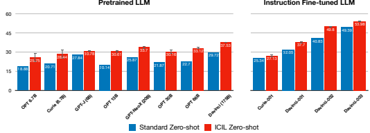

Figure 1: Average performance of 119 evaluation tasks on SUPERNI benchmark. ICIL is effective for both pretrained and instruction-fine-tuned LLMs. We report the mean score of three random seeds for different demonstration sets for ICIL and the error bars of standard deviation. We provide the full demonstration sets in Appendix F.

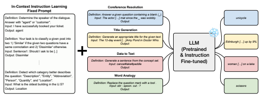

Figure 2: Overview of In-Context Instruction Learning (ICIL). We construct a fixed set of demonstrations consisting of instruction, input, and output instances to evaluate pretrained and instruction-finetuned LLMs for all tasks. We ensure that the tasks included in the demonstrations and the tasks being evaluated are strictly held-out, ensuring a zero-shot generalization setting.

prepending the same fixed demonstration set for all tasks, we can easily test and reproduce baseline zero-shot performance for new target tasks or models without relying on external tools. We first observe that ICIL significantly enhances the zero-shot task generalization performance of various pretrained LLMs that are not fine-tuned to follow instructions, as shown in Figure 1. Notably, even smaller LLMs with ICIL outperform much larger language models without ICIL, such as the 6B-sized ICIL GPT-J outperforming 30 times larger 175B-sized Standard Zero-shot GPT-3 Davinci. Second, we show that applying ICIL on top of instruction-fine-tuned LLMs, improves the zero-shot instruction-following ability of LLMs especially for over 100B models. This indicates that the effect of ICIL is complementary to the effect of instruction fine-tuning. Our analysis shows that the effectiveness of ICIL comes from selecting classification tasks that include explicit answer choice in the instruction (e.g., expression of *"agent" or "customer"* in Figure 3). This holds true even for generation target tasks, which contrasts with previous studies showing that it is crucial to retrieve demonstrations that are similar to the target task for few-shot in-context learning (Rubin et al., 2021; Liu et al., 2022). Even more counterintuitively, we observe that corrupting the input instance distribution of each demonstration by replacing it with random sentences does not significantly harm the performance. Based on this analysis, we hypothesize that LLMs learn the correspondence between the answer choice included in the instruction and output of each demonstration during inference, rather than relying on the complex correspondence between

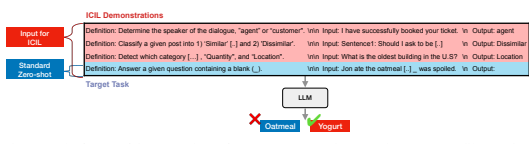

Figure 3: The format of demonstrations of In-Context Instruction Learning (ICIL). Unlike standard zero-shot setting, ICIL prepends a cross-task demonstration set where each consists of an instruction (task definition), input, and output instance.

instruction, input, and output. Through this hypothesis, we suggest that the role of ICIL is to help LLMs *focus* on the target instruction to find the cues for the answer distribution of the target task.

## 2 In-Context Instruction Learning

The prompt for In-Context Instruction Learning (ICIL) consists of cross-task demonstrations where each is a concatenation of instruction, input, and output instance, as shown in Figure 3. In this section, we explain how we construct a fixed demonstration set to evaluate various tasks in a zero-shot manner for ICIL. Also, we mention the adavantages of applying ICIL during inference of LLMs.

### 2.1 Demonstration Set Construction

From a benchmark that consists of N tasks in total where each instance of the task consists of instruction, input, and output instance, we sample K tasks to be constructed as demonstrations for ICIL3. We apply some simple heuristics to first filter the task set, randomly sample a single instance per filtered task set, and lastly, sample K instances all corresponding to different tasks. The heuristics are as follows:
1. Task Types: We only sample from classification tasks that include an answer choice in the instruction (e.g., *"agent" or "customer"* in Figure 3). We hypothesize that including the answer choice in the instruction might assist LLMs to follow instructions during inference.

2. Answer Choice Overlap: We ensure that the answer choices do not overlap between demonstrations. We expect that the overlap of answer choices leads to LLMs copying labels of the demonstrations, similar to few-shot in-context learning, which is an undesired behavior for zero-shot in-context learning because the answer distribution changes depending on the target task.

3. Demonstration Length: We restrict the length of the demonstration (concatenation of instruction, input, and output instance) to 256 tokens by a maximum to ensure that the input instance does not exceed the maximum sequence length4. We only sample from instances that satisfy this criterion.

4. Demonstration Ordering: We order the demonstrations by the number of answer choices for each task in ascending order. For demonstrations that have the same number of answer choices, we sort by demonstration length in ascending order.

We provide a detailed analysis and ablation of these heuristics in Section 4.

### 2.2 In-Context Instruction Learning During Inference

After demonstration set sampling, we construct the fixed set of demonstrations and append the concatenation of instruction and input instance of the target task to the fixed prompt consisting of demonstrations.

3Unless specified, we set K = 8 as default. 4Because we mainly experiment on 175B-sized GPT-3, we set the default maximum input sequence as 2048.
ICIL has the following advantages to make LLMs better follow instructions and boost the zero-shot ability.

1. ICIL utilizes a single fixed prompt to adapt various models to various target tasks. Therefore, without external tools for searching and retrieving the optimal demonstration set for each task, ICIL is easy to replicate and measure as a zero-shot baseline for new models or datasets.

2. We show that ICIL significantly improves the zero-shot task generalization performance for various off-the-shelf pretrained LLMs (Figure 1). This indicates that we can make LLMs better instruction followers without backpropagation.

3. ICIL also improves the performance of instruction-fine-tuned models (instruction tuning or RLHF), especially for LLMs that have more than 100B parameters (Figure 1). This shows that ICIL can assist LLMs for zero-shot generalization even after instruction tuning or RLHF, implying the wide applicability of ICIL.

4. We demonstrate that the model-generated demonstration set is also effective for ICIL
(Section 4.2). This indicates that ICIL is effective even without sampling the demonstration set from a benchmark if the heuristics are applied.

## 3 Experiments

### 3.1 Experimental Setup

We construct the demonstrations for ICIL from English training tasks of SUPER- NATURALINSTRUCTIONS (SUPERNI) benchmark (Wang et al., 2022c), which includes 756 tasks in total. To evaluate the effectiveness of ICIL, we use the held-out tasks from SUPERNI for testing, which consists of 119 tasks across 12 different categories, including free-form generation, word relation reasoning, and classification tasks. We select SUPERNI as our evaluation benchmark because it offers a diverse set of tasks with varying levels of complexity. Each task has 100 instances, and we exclude instances that exceed the maximum sequence length, resulting in a total of 11,802 instances. We use different evaluation metrics for each task, such as Exact Match for classification or singleword prediction tasks and ROUGE-L for free-form generation tasks, following the metric used in Wang et al. (2022c). We provide the list of 12 evaluation task categories in Appendix A and more detailed evaluation settings in Appendix C.

Model Types We evaluate 4 LLMs with various model sizes: 1) GPT-3 (Brown et al., 2020), 2) OPT (Zhang et al., 2022), 3) GPT-NeoX (Black et al., 2022), and 4) GPT-J (Wang & Komatsuzaki, 2021)5. For GPT-3, we evaluate not only the pretrained LLM, but also evaluate LLMs that are fine-tuned to follow instructions and aligned to human preferences through reinforcement learning (Ouyang et al., 2022). We evaluate the performance of GPT-3 models with sizes of 6.7B and 175B. For OPT, we evaluate models with 6.7B, 13B, and 30B parameters, while for GPT-NeoX and GPT-J, we evaluate models with 20B and 6B parameters, respectively.

### 3.2 Results

Various pretrained LLMs benefit from ICIL. As shown in the left part of Figure 1, In-Context Instruction Learning (ICIL) consistently improves the performance of pretrained LLMs across all model scales, resulting in over 50% performance increase for OPT-13B. This simple zero-shot in-context learning is capable of outperforming LLMs with much larger parameters. Specifically, the 6B-sized GPT-J model with ICIL exceeds 30 times larger 175B-sized GPT-3 model. This shows that ICIL improves the ability of pretrained LLMs to follow instructions without fine-tuning or backpropagation. Moreover, we observe the gain from ICIL during inference is comparable to instruction tuning by comparing the performance of ICIL applied to GPT-3 models without instruction tuning and standard zero-shot setting of instruction-tuned GPT-3 models (text-davinci-001,002).

5From preliminary experiments, we observe that applying ICIL harms the performance for OPT-IML (Iyer et al., 2022) and FLAN-T5 (Chung et al., 2022) due to the characteristics of each model. We provide more discussion in Appendix B.
Definition: Determine the speaker of the dialogue, "agent" or "customer". \n\n **Input: They were taken [..] Detention Center.** \n Output: agent Definition: Classify a given post into 1) 'Similar' [..] and 2) 'Dissimilar'. \n\n **Input: She keeps the place tidy.** \n Output: Dissimilar Definition: Detect which category […] , "Quantity", and "Location". \n\n **Input: Jack and Jorden York scored 9 points.** \n Output: Location Definition: Answer a given question containing a blank (_). \n\n Input: Jon ate the oatmeal [..] _ was spoiled. \n Output:

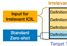

Irrelevant ICIL Demonstrations Target Task
Pretrained LLM **Instruction Fine-tuned LLM**

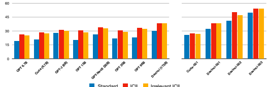

Standard ICIL Irrelevant ICIL

Figure 4: (Top) Example of Irrelevant ICIL, where we corrupt the input instance distribution of the demonstrations. (Bottom) Comparison with Standard Zero-shot, In-Context Instruction Learning (ICIL), and Irrelevant ICIL. For most of the models, input distribution corruption does not harm the performance much. We report the mean score of three random seeds for different demonstration sets for ICIL. We report a result of a single seed for 175B-sized models due to inference costs. We provide the full demonstration sets in Appendix G.

The gain from ICIL is complementary to fine-tuning-based instruction learning. As shown in the right part of Figure 1, I we observe that ICIL improves the performance of LLMs fine-tuned through instruction tuning or RLHF, especially for models over 100B parameters. This implies that fine-tuning-based instruction learning might be sometimes insufficient for larger models and In- Context Instruction Learning can improve the instruction following ability orthogonally. In particular, we observe a significant performance improvement for text-davinci-002 (175B), outperforming an RLHF-tuned model text-davinci-003 with standard zero-shot learning. Also, we demonstrate that the most powerful model (text-davinci-003) also benefits from ICIL by 9.3%, achieving the best performance. We leave detailed analysis on more diverse instruction-fine-tuned models as future work.

Irrelevant In-Context Instruction Learning does not harm the performance much. We observe that corrupting the distribution of input instances for each demonstration for ICIL does not harm the performance much, similar to the observation in Min et al. (2022b) for few-shot in-context learning. Instead of perturbing the input-output correspondence, done in Min et al. (2022b), we perturb the input distribution *itself*, which is a setting where there are more corruptions as shown at the top of Figure 4. Following Min et al. (2022b), we use CC-News (Hamborg et al., 2017) as an external corpus to replace the ground truth input instance with random sentences that have a similar length to the original input instance. As shown in the bottom of Figure 4, corrupting the input instance distribution of each demonstration does not harm the performance much across most model scales. This is in line with the observations made in previous works that LLMs do not make full use of all the information provided to them (Min et al., 2022b; Webson & Pavlick, 2021; Madaan & Yazdanbakhsh, 2022; Wang et al., 2022a). Interestingly, unlike few-shot in-context learning where corrupting the input distribution itself leads to significant performance degradation, we demonstrate that not only the input-output correspondence does not matter, but also the input instance distribution matters little for ICIL.

## 4 Analysis

In this section, we analyze the factors that make ICIL effective and provide additional experiments. We evaluate only on pretrained GPT-3 175B checkpoint (davinci) and evaluate on a single task per task category, resulting in a total of 12 tasks due to inference cost issues6.

### 4.1 Ablation Studies

Inst. Input Output AVG
ICIL ✓ ✓ ✓ **44.24** Random Inst. ✗ ✓ ✓ 31.18 Random Input ✓ ✗ ✓ **44.27** Random Output ✓ ✓ ✗ 38.30 Table 1: Corrupting the distribution of each component (instruction, input, output) of the demonstration of ICIL by replacing it with random words or sentences.

Instruction and output distribution of the demonstrations matters. We further analyze the effectiveness of each component of the demonstrations for ICIL by corrupting the distribution of each component: instruction, input, and output instance. For instruction corruption, we replace the ground truth sequences with random sequences from an external corpus, which is similar to how we corrupt the input distribution discussed in Section 3.2. For output corruption, we replace ground truth labels with random English words, following Min et al. (2022b). The results are shown in Table 1. Unlike input distribution corruption results of Figure 4, corrupting the distribution of the instruction or the output instance of each demonstration significantly harms the performance. In particular, corrupting the instruction distribution shows little improvement compared to standard zero-shot learning (31.18 vs 29.67). This suggests that unlike input instances, the distribution of instruction and output instances significantly affects the performance of ICIL.

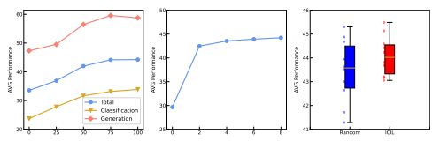

(a) Classification Ratio (%)

(b) Number of Demonstrations
(c) Ordering of Demonstrations Figure 5: (a) shows that the average performance increases as the ratio of classification tasks that are used as demonstrations for ICIL increases, even for generation target tasks. (b) shows that the performance increases as the number of demonstrations increases for ICIL. (c) shows that ordering the demonstration set by the number of answer choices reduces the variance on 10 demonstration sets.

Constructing the demonstration set with classification tasks is important. We analyze the heuristic of constructing the demonstration set from only classification tasks in ICIL by varying the ratio of classification tasks consisting of the demonstration set. As shown in Figure 5a, the average zero-shot task generalization performance increases as the ratio of classification tasks increases. Interestingly, we observe that constructing the demonstration set with classification tasks also benefits generation (non-classification) target tasks. This finding contrasts with few-shot in-context learning setting, where retrieving demonstrations similar to the target query enhances the few-shot performance
(Rubin et al., 2021; Liu et al., 2021) 7.

6We select a single task per task category with a significant discrepancy between the lower bound and upper bound performance across davinci, text-davinci-001, 002, 003 models to see the tendency more clearly.

7Note that the classification ratio of 0% in Figure 5a corresponds to constructing the demonstration set solely from generation (non-classification) tasks.
Increasing the number of demonstrations improves the performance. We study the impact of the number of demonstrations for ICIL. Results are shown in Figure 5b. The mean performance improves as the number of demonstrations increase, similar to few-shot in-context learning. Notably, the zero-shot instruction-following ability of ICIL significantly improves even with 2 examples, implying that using only a small set of zero-shot demonstrations can improve the performance of LLMs. Ordering the demonstrations by the number of answer choices reduces the variance. To examine the impact of different orderings of the demonstration set, we compare the ordering of ICIL based on the number of answer choices with a random ordering. Figure 5c shows the result of 10 different demonstration sets by sampling them with 10 different random seeds. Although the mean performance does not show a significant difference between the two settings, we observe that applying ordering heuristics based on the number of answer choices reduces the variance and improves the worst-case accuracy.

Classification Generation Total Overlap **35.14** 52.32 42.30 No Overlap 33.86 **58.77 44.24**
Table 2: Effect of answer choice overlap between demonstrations. The demonstration set that has an overlap underperforms the set without overlap on average, especially for generation tasks.

Answer choice overlap between demonstrations harms the performance. We analyze the effect of answer choice overlap between demonstrations, which is one of the heuristics used to construct the demonstration set. We compare the demonstration set used for ICIL with the demonstration set that has the same answer choice for all demonstrations. The result is demonstrated in Table 2. We observe that the demonstration set with answer choice overlap underperforms the demonstration set without overlap on average, especially for generation tasks. We find that the demonstration set with answer choice overlap tends to make the model generate short sequences for long text generation or predict the output by copying one of the labels of the demonstration set, leading to poor generalization.

### 4.2 Additional Experiments

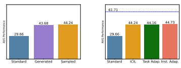

(a) Machine-Generated Demo.

(b) Adaptive In-Context Learning

Figure 6: (a) shows the result of ICIL using demonstrations generated by ChatGPT (OpenAI, 2022). Machine-generated demonstrations show comparable performance to demonstrations sampled from SUPERNI benchmark. (b) shows the comparison of ICIL with adaptive similarity-based in-context learning methods where the demonstration set is adaptively retrieved based on the target task (Task Adap.) or target instance (Inst. Adap.). The performance of ICIL is comparable to adaptive in-context learning methods but there is still room for improvement compared to few-shot in-context learning (dotted upper bound). ICIL shows effectiveness for machine-generated demonstration sets as well. We explore if ICIL shows effectiveness for machine-generated demonstrations instead of sampling from training tasks of SUPERNI benchmark. We use ChatGPT (OpenAI, 2022) for demonstration generation by specifying the heuristics used to construct the demonstration set for ICIL. As shown in Figure 6a, ICIL is also effective for machine-generated demonstrations, showing comparable performance to ICIL with demonstrations from SUPERNI and significantly outperforming standard zero-shot setting. This finding suggests that ICIL is effective even without sampling process from benchmarks that consist of diverse instructions, indicating that the performance enhancement is not from demonstration 7 construction through sampling, but is from heuristics and the format of ICIL. We provide an example of a demonstration set generated by ChatGPT in Appendix E. The performance of ICIL is comparable to adaptive in-context learning methods. We compare ICIL, which samples a fixed demonstration set for all evaluation tasks, with adaptive zero-shot in-context learning (Lyu et al., 2022), where the retrieved demonstrations vary based on the similarity of the target task or instance. Similar to ICIL, for adaptive zero-shot in-context learning, we retrieve the demonstrations which consist of instruction, input, and output instances from the training tasks of SUPERNI benchmark8. We use SimCSE (Gao et al., 2021) to compute sequence embeddings and cosine similarity to retrieve the top-K similar instances for each target task or instance. We divide the adaptive in-context learning setting into task-wise and instance-wise, where the former retrieves based on the similarity of instructions only, and the latter retrieves based on the similarity of the concatenations of instruction and input instance. As shown in Figure 6b, the performance of both task adaptive and instance adaptive is comparable to ICIL which uses a fixed set of demonstrations for all tasks. Therefore, this indicates that while being comparable to adaptive in-context learning methods, the fixed demonstration set of ICIL is more reproducible and is free from external embedding models that are used for similarity search. There is still room for improvement for ICIL. We compare the performance of ICIL with fewshot in-context learning, which is an upper bound for task adaptation. We compare with 8-shot in-context learning to control the factor of the number of demonstrations. Although ICIL significantly outperforms the zero-shot task generalization performance of the standard zero-shot setting, we observe that there is still a large gap between ICIL and few-shot in-context learning, shown in Figure 6b (44.24 vs 61.71).

## 5 Discussion

From previous sections, we have observed that ICIL significantly boosts the performance of both pretrained and instruction-fine-tuned LLMs. Also, we have demonstrated that corrupting the input distribution does not harm the performance much and analyzed that constructing the demonstration set from classification tasks is crucial for performance improvement. In this section, we suggest the role of ICIL based on the findings from the previous sections. Why is constructing the demonstration set from classification tasks important? Figure 5a shows that constructing the demonstration set with classification tasks is important for ICIL. Then, what is the difference between classification and generation (non-classification) tasks? Because one of our heuristics for demonstration construction is to only consider classification tasks that include an answer choice in the instruction (e.g. *"agent" or "customer"* in Figure 3), these demonstrations have more *explicit* cues about the answer distribution. We hypothesize that during inference, LLMs learn the correspondence between answer choice in the instruction (e.g. Determine the speaker of the dialogue, "agent" or "customer".) and the label (e.g. agent) from demonstrations. Especially, because the label word appears in the instruction for classification tasks, it would be easy to exploit this relationship for LLMs. We observe that deleting only the sentence that includes answer choices in the instruction leads to a degradation in the performance of ICIL (44.27 → 42.89), supporting the hypothesis. What does the result of irrelevant ICIL imply? From Figure 4 and Table 1, we observe that the input distribution of demonstrations for ICIL does not matter much, while instruction and output distribution matter significantly. This observation bolsters the above hypothesis that LLMs learn the correspondence of answer choice in the instruction and the label of the demonstrations during ICIL. Instead of relying on complex correspondence such as the relationship between instruction, input, and output altogether, LLMs tend to focus on simple correspondence such as string matching between the instruction including answer choices and the label. Previous work also demonstrates similar findings that LLMs *takes less effort* to adapt to a task, similar to shortcut learning (Webson & Pavlick, 2021; Min et al., 2022b).

8Note that the original setting of Lyu et al. (2022) do not utilize instructions during inference, constructing demonstrations that are a concatenation of input and label by retrieving a sentence from a raw corpus.
What is the role of ICIL? If LLMs learn the correspondence of the answer choice in the instruction and the label of the demonstrations during ICIL, then how does this assist the zero-shot task generalization? During ICIL, we hypothesize that the demonstrations give a signal that makes LLMs focus on the instruction to find the cues of the answer distribution, making LLMs better follow instructions. We suggest that this hypothesis explains why constructing the demonstration set from classification tasks also improves the performance of generation target tasks. Although instruction fine-tuning also assists the signal of focusing on the instructions, we hypothesize that ICIL reinforces the correspondence between the instruction and the label of the demonstrations during inference directly.

## 6 Related Works

Instruction-Following LLMs Recent works have shown that fine-tuning-based instruction learning including instruction tuning or RLHF, can boost the capability of LLMs to follow instructions or align to human preferences (Sanh et al., 2021; Wei et al., 2021; Wang et al., 2022c; Chung et al., 2022; Min et al., 2022a; Ye et al., 2022; Ouyang et al., 2022; Bai et al., 2022; OpenAI, 2022). However, whether the instruction following ability of LLMs is newly obtained through instruction tuning or is already obtained during pretraining is under-explored. Wang et al. (2022b); Honovich et al. (2022) show that downstream tasks generated by LLMs itself which contain noisy instances can actually be good training instances for instruction tuning, implying that LLMs are already somewhat aware of instructions. We extend this hypothesis that LLMs already have the capability to follow instructions by applying in-context learning to instruction learning which does not require any backpropagation, using the pretrained model checkpoint without any gradient update.

In-Context Learning Large language models pretrained to predict the next token autoregressively possess the ability to adapt to the target tasks when conditioned on only a few examples without gradient update, referred to as in-context learning (Brown et al., 2020; Chowdhery et al., 2022). However, the inner workings of in-context learning are under-explored. Akyürek et al. (2022); von Oswald et al. (2022); Garg et al. (2022); Dai et al. (2022) show that language models perform implicit meta-fine-tuning during in-context learning. However, Min et al. (2022b) show that assigning random labels for demonstrations does not hurt the in-context learning performance much. Motivated by this finding, Lyu et al. (2022) propose a zero-shot in-context learning method, retrieving relevant sentences from an external corpus and assigning random labels to construct demonstrations for classification target tasks. Different from Lyu et al. (2022), ICIL utilizes instructions to facilitate task adaptation, uses a fixed set of demonstrations to evaluate all tasks, and is applicable to generation target tasks as well.

## 7 Limitations

Although In-Context Instruction Learning leads to impressive zero-shot task generalization performance, it suffers from increased computation during inference due to the increased number of input sequences. Also, there is still a large performance gap between few-shot in-context learning as shown in Figure 6b. Note that this is a work-in-progress version and we plan to extensively analyze and evaluate ICIL in various settings and benchmarks in the future.

## 8 Conclusion

In this paper, we observe that learning to follow instructions through a *fixed* set of demonstrations during inference, referred to as In-Context Instruction Learning (ICIL), significantly improves the zeroshot task generalization performance of both pretrained and instruction-fine-tuned LLMs. Through detailed analysis, we hypothesize that the effect of ICIL comes from learning the correspondence between answer choices in the instruction and the label of the demonstration, leading LLMs to better focus on the instruction. To this end, we recommend ICIL to be seriously considered for maximizing zero-shot task generalization performance, especially if one is willing to trade inference speed for higher accuracy.

## 9 Acknowledgement

We thank Sunkyung Kim, Hyunjik Jo, and Joel Jang for helpful discussions. We thank Sejune Joo, Seungone Kim, Yongrae Jo, Doyoung Kim, Dongkeun Yoon, Seongyun Lee, and Chaeeun Kim for helpful feedback on our paper.

## References

Ekin Akyürek, Dale Schuurmans, Jacob Andreas, Tengyu Ma, and Denny Zhou. What learning algorithm is in-context learning? investigations with linear models. *arXiv preprint arXiv:2211.15661*, 2022.

Yuntao Bai, Andy Jones, Kamal Ndousse, Amanda Askell, Anna Chen, Nova DasSarma, Dawn Drain, Stanislav Fort, Deep Ganguli, Tom Henighan, et al. Training a helpful and harmless assistant with reinforcement learning from human feedback. *arXiv preprint arXiv:2204.05862*, 2022.

Sid Black, Stella Biderman, Eric Hallahan, Quentin Anthony, Leo Gao, Laurence Golding, Horace He, Connor Leahy, Kyle McDonell, Jason Phang, et al. Gpt-neox-20b: An open-source autoregressive language model. *arXiv preprint arXiv:2204.06745*, 2022.

Tom Brown, Benjamin Mann, Nick Ryder, Melanie Subbiah, Jared D Kaplan, Prafulla Dhariwal, Arvind Neelakantan, Pranav Shyam, Girish Sastry, Amanda Askell, et al. Language models are few-shot learners. *Advances in neural information processing systems*, 2020.

Aakanksha Chowdhery, Sharan Narang, Jacob Devlin, Maarten Bosma, Gaurav Mishra, Adam Roberts, Paul Barham, Hyung Won Chung, Charles Sutton, Sebastian Gehrmann, et al. Palm:
Scaling language modeling with pathways. *arXiv preprint arXiv:2204.02311*, 2022.

Hyung Won Chung, Le Hou, Shayne Longpre, Barret Zoph, Yi Tay, William Fedus, Eric Li, Xuezhi Wang, Mostafa Dehghani, Siddhartha Brahma, et al. Scaling instruction-finetuned language models.

arXiv preprint arXiv:2210.11416, 2022.

Damai Dai, Yutao Sun, Li Dong, Yaru Hao, Zhifang Sui, and Furu Wei. Why can gpt learn incontext? language models secretly perform gradient descent as meta optimizers. *arXiv preprint* arXiv:2212.10559, 2022.

Tianyu Gao, Xingcheng Yao, and Danqi Chen. Simcse: Simple contrastive learning of sentence embeddings. *arXiv preprint arXiv:2104.08821*, 2021.

Shivam Garg, Dimitris Tsipras, Percy Liang, and Gregory Valiant. What can transformers learn in-context? a case study of simple function classes. *arXiv preprint arXiv:2208.01066*, 2022.

Felix Hamborg, Norman Meuschke, Corinna Breitinger, and Bela Gipp. news-please: A generic news crawler and extractor. In *Proceedings of the 15th International Symposium of Information Science*, pp. 218–223, March 2017. doi: 10.5281/zenodo.4120316.

Or Honovich, Thomas Scialom, Omer Levy, and Timo Schick. Unnatural instructions: Tuning language models with (almost) no human labor. *arXiv preprint arXiv:2212.09689*, 2022.

Srinivasan Iyer, Xi Victoria Lin, Ramakanth Pasunuru, Todor Mihaylov, Dániel Simig, Ping Yu, Kurt Shuster, Tianlu Wang, Qing Liu, Punit Singh Koura, et al. Opt-iml: Scaling language model instruction meta learning through the lens of generalization. *arXiv preprint arXiv:2212.12017*,
2022.

Takeshi Kojima, Shixiang Shane Gu, Machel Reid, Yutaka Matsuo, and Yusuke Iwasawa. Large language models are zero-shot reasoners. *arXiv preprint arXiv:2205.11916*, 2022.

Jiachang Liu, Dinghan Shen, Yizhe Zhang, Bill Dolan, Lawrence Carin, and Weizhu Chen. What makes good in-context examples for GPT-3? In *Proceedings of Deep Learning Inside Out*
(DeeLIO 2022): The 3rd Workshop on Knowledge Extraction and Integration for Deep Learning Architectures. Association for Computational Linguistics, 2022.

Xiao Liu, Yanan Zheng, Zhengxiao Du, Ming Ding, Yujie Qian, Zhilin Yang, and Jie Tang. Gpt understands, too. *arXiv preprint arXiv:2103.10385*, 2021.

Xinxi Lyu, Sewon Min, Iz Beltagy, Luke Zettlemoyer, and Hannaneh Hajishirzi. Z-icl: Zero-shot in-context learning with pseudo-demonstrations. *arXiv preprint arXiv:2212.09865*, 2022.

Aman Madaan and Amir Yazdanbakhsh. Text and patterns: For effective chain of thought, it takes two to tango. *arXiv preprint arXiv:2209.07686*, 2022.

Sewon Min, Mike Lewis, Luke Zettlemoyer, and Hannaneh Hajishirzi. MetaICL: Learning to learn in context. In Proceedings of the 2022 Conference of the North American Chapter of the Association for Computational Linguistics: Human Language Technologies. Association for Computational Linguistics, 2022a.

Sewon Min, Xinxi Lyu, Ari Holtzman, Mikel Artetxe, Mike Lewis, Hannaneh Hajishirzi, and Luke Zettlemoyer. Rethinking the role of demonstrations: What makes in-context learning work? *arXiv* preprint arXiv:2202.12837, 2022b.

OpenAI. Chatgpt: Optimizing language models for dialogue. 2022. URL https://openai.

com/blog/chatgpt/.

Long Ouyang, Jeff Wu, Xu Jiang, Diogo Almeida, Carroll L Wainwright, Pamela Mishkin, Chong Zhang, Sandhini Agarwal, Katarina Slama, Alex Ray, et al. Training language models to follow instructions with human feedback. *arXiv preprint arXiv:2203.02155*, 2022.

Ohad Rubin, Jonathan Herzig, and Jonathan Berant. Learning to retrieve prompts for in-context learning. *arXiv preprint arXiv:2112.08633*, 2021.

Victor Sanh, Albert Webson, Colin Raffel, Stephen H Bach, Lintang Sutawika, Zaid Alyafeai, Antoine Chaffin, Arnaud Stiegler, Teven Le Scao, Arun Raja, et al. Multitask prompted training enables zero-shot task generalization. *arXiv preprint arXiv:2110.08207*, 2021.

Johannes von Oswald, Eyvind Niklasson, Ettore Randazzo, João Sacramento, Alexander Mordvintsev, Andrey Zhmoginov, and Max Vladymyrov. Transformers learn in-context by gradient descent.

arXiv preprint arXiv:2212.07677, 2022.

Ben Wang and Aran Komatsuzaki. GPT-J-6B: A 6 Billion Parameter Autoregressive Language Model.

https://github.com/kingoflolz/mesh-transformer-jax, May 2021.

Boshi Wang, Sewon Min, Xiang Deng, Jiaming Shen, You Wu, Luke Zettlemoyer, and Huan Sun.

Towards understanding chain-of-thought prompting: An empirical study of what matters. *arXiv* preprint arXiv:2212.10001, 2022a.

Yizhong Wang, Yeganeh Kordi, Swaroop Mishra, Alisa Liu, Noah A Smith, Daniel Khashabi, and Hannaneh Hajishirzi. Self-instruct: Aligning language model with self generated instructions. arXiv preprint arXiv:2212.10560, 2022b.

Yizhong Wang, Swaroop Mishra, Pegah Alipoormolabashi, Yeganeh Kordi, Amirreza Mirzaei, Anjana Arunkumar, Arjun Ashok, Arut Selvan Dhanasekaran, Atharva Naik, David Stap, et al. Benchmarking generalization via in-context instructions on 1,600+ language tasks. *arXiv preprint* arXiv:2204.07705, 2022c.

Albert Webson and Ellie Pavlick. Do prompt-based models really understand the meaning of their prompts? *arXiv preprint arXiv:2109.01247*, 2021.

Jason Wei, Maarten Bosma, Vincent Y Zhao, Kelvin Guu, Adams Wei Yu, Brian Lester, Nan Du, Andrew M Dai, and Quoc V Le. Finetuned language models are zero-shot learners. arXiv preprint arXiv:2109.01652, 2021.

Jason Wei, Yi Tay, Rishi Bommasani, Colin Raffel, Barret Zoph, Sebastian Borgeaud, Dani Yogatama, Maarten Bosma, Denny Zhou, Donald Metzler, et al. Emergent abilities of large language models. arXiv preprint arXiv:2206.07682, 2022.

Seonghyeon Ye, Doyoung Kim, Joel Jang, Joongbo Shin, and Minjoon Seo. Guess the instruction!

making language models stronger zero-shot learners. *arXiv preprint arXiv:2210.02969*, 2022.

Susan Zhang, Stephen Roller, Naman Goyal, Mikel Artetxe, Moya Chen, Shuohui Chen, Christopher Dewan, Mona Diab, Xian Li, Xi Victoria Lin, et al. Opt: Open pre-trained transformer language models. *arXiv preprint arXiv:2205.01068*, 2022.

|     | OPT     | Curie   | GPT\-J   | OPT     | NeoX    | OPT     | OPT    | Davinci   |
|-----|---------|---------|----------|---------|---------|---------|--------|-----------|
|     | 6.7B    | 6.7B    | 6B       | 13B     | 20B     | 30B     | 60B    | 175B      |
| TE  | 27.15   | 18.11   | 5.31     | 29.50   | 13.93   | 22.10   | 2.93   | 2.85      |
| CEC | 22.00   | 24.62   | 4.90     | 27.90   | 8.52    | 16.86   | \-0.62 | 4.43      |
| CR  | 12.05   | 8.07    | 10.55    | 14.57   | 8.29    | 11.52   | \-1.19 | 13.95     |
| DAR | 23.33   | 27.57   | 22.00    | 27.95   | 12.57   | 18.14   | 1.67   | 21.14     |
| AC  | 22.21   | 18.64   | 8.33     | 36.64   | 16.15   | 23.36   | 1.69   | 5.64      |
| WA  | 9.96    | 12.21   | 16.92    | 8.38    | 21.17   | 7.29    | 1.75   | 20.71     |
| OE  | 5.26    | \-11.74 | \-9.52   | \-8.14  | \-9.53  | 4.42    | \-1.94 | 3.98      |
| KT  | 20.14   | 2.38    | 14.83    | 13.45   | 6.69    | 17.80   | 0.92   | 15.96     |
| QR  | \-24.43 | \-19.56 | \-26.78  | \-18.27 | \-13.33 | \-19.14 | 0.08   | 3.06      |
| TG  | \-0.10  | \-0.59  | \-4.70   | 9.21    | 5.63    | 6.47    | \-2.21 | 5.71      |
| DTT | \-5.57  | \-8.11  | \-0.96   | 0.07    | \-1.00  | 3.63    | 1.61   | 1.89      |
| GEC | \-18.72 | \-27.59 | \-23.34  | \-3.59  | \-3.95  | \-20.99 | 0.94   | 0.84      |

Table 3: Relative performance gain achieved by ICIL over standard zero-shot setting for each task category of SUPERNI benchmark on various pretrained LLMs. We observe that the number of tasks that benefit from ICIL increases as the model size scales up.

Table 4: Relative performance gain achieved by ICIL over standard zero-shot setting for each task

|     | Curie\-001   | Davi\-001   | Davi\-002   | Davi\-003   |
|-----|--------------|-------------|-------------|-------------|
|     | 6.7B         | 175B        | 175B        | 175B        |
| TE  | 9.65         | 9.19        | 7.89        | \-0.63      |
| CEC | 6.86         | 0.29        | 9.05        | 5.43        |
| CR  | 4.38         | 13.52       | 5.10        | 0.67        |
| DAR | 7.29         | 15.33       | 15.19       | 15.29       |
| AC  | 3.64         | 0.51        | 2.79        | 3.54        |
| WA  | 3.33         | 16.50       | 25.75       | 27.92       |
| OE  | \-9.27       | 1.17        | 3.37        | 1.96        |
| KT  | \-5.54       | \-3.02      | 20.01       | 9.62        |
| QR  | \-12.03      | \-3.37      | 14.54       | 2.49        |
| TG  | \-5.32       | 1.54        | 5.19        | 2.42        |
| DTT | 4.84         | 3.96        | 3.11        | 1.36        |
| GEC | \-13.41      | 2.02        | 8.69        | 1.11        |

category of SUPERNI benchmark on instruction-fine-tuned LLMs.

## A Full Results For Each Task Category

On Table 3 and Table 4, we report full results of various models on SUPER-NATURALINSTRUCTIONS
consisting of 12 categories, specifically the relative performance gain of ICIL over the standard zero-shot setting. Each task name is shown in abbreviation:
- TE: Textual Entailment - CEC: Cause Effect Classification - CR: Coreference Resolution - DAR: Dialogue Act Recognition - AC: Answerability Classification - WA: Word Analogy
- OE: Overlap Extraction - KT: Keyword Tagging - QR: Question Rewriting - TG: Title Generation - DT: Data to Text - GEC: Grammar Error Correction

## B Preliminary Observation On Opt-Iml And Flan-T5

From preliminary experiments, we observe that applying ICIL on OPT-IML (30B) and FLAN-T5 underperforms the standard zero-shot setting. For OPT-IML, we suggest the degradation is from the characteristics of OPT-IML that few-shot in-context learning underperforms zero-shot setting, especially for OPT-30B. As shown in the results of Iyer et al. (2022), increasing the number of few-shot examples harms the held-out evaluation results of OPT-IML (30B) on SUPERNI benchmark. This indicates that prepending the demonstration set *distracts* the zero-shot task adaptation. For FLAN-T5, we observe that the degradation of applying ICIL is due to predicting the output by copying from the demonstration label. This is an undesirable behavior for ICIL because the target task and the task of the demonstrations are different. We suggest this copying behavior occurs because FLAN-T5 was explicitly trained to do in-context learning. Therefore, the model would interpret the cross-task demonstration set of ICIL as the target task demonstration for few-shot in-context learning.

Therefore, it would lead to the model copying one of the labels from the demonstrations, harming the performance.

## C Evaluation Setting Details

For all evaluation settings, we set the stop sequence as "\n\n". Also for GPT-3 models, we set the maximum input and output sequence length as 2048 and 128 respectively. For other models, we set the maximum input and output sequence length as 1024 and 64 respectively. For target task instances that are long which makes the concatenation of K demonstrations and the target task input sequence exceed the maximum sequence length, we only include the front K0(K0 < K) demonstrations that fit the max sequence length. For standard zero-shot setting, we follow the format of Wang et al. (2022c), appending a sentence "Now complete the following example-" in front of the target input instance. From preliminary experiments, we observe that prepending this sentence improves the performance for standard zero-shot setting. For ICIL and few-shot in-context learning experiment, we do not include such sentence.

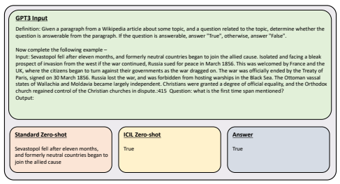

Figure 7: Qualitative Example of responses to one of the evaluation instances from SUPERNI benchmark, comparing the responses of standard zero-shot setting and ICIL of GPT-3 davinci model

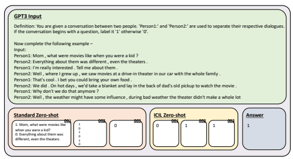

Instruction Fine-Tuned LLMs - **Text-Davinci-001, 002, 003 Prediction Results**

Figure 8: Qualitative Example of responses to one of the evaluation instances from SUPERNI benchmark, comparing the responses of standard zero-shot setting and ICIL of GPT-3 text-davinci001, 002, 003.

## D Qualitative Evaluation

Figure 7 and Figure 8 shows the examples of cherry-picked examples of responses to evaluation instances from SUPERNI benchmark.

Figure 9: Example of model-generated demonstration set.

## E Example Of Model-Generated Prompts

Figure 9 shows the list of demonstrations that are generated by ChatGPT. We manually added/revised some parts that the model did not follow the heuristics such as not including the answer choices in the instruction.

## F List Of Prompts For Icil

In Figure 10, Figure 11, and Figure 12, we list out the fixed prompts (demonstration set) that are used for the evaluation of ICIL.

Definition: In this task, you are given a dialogue from a conversation between an agent and a customer. Your task is to determine the speaker of the dialogue. Answer with "agent" or "customer". Input: I have successfully booked your ticket with flight-1017, have a safe journey. Output: agent Definition: In this task, you are given a hateful post in English from online platforms. You are expected to classify the post into two classes: aggresive or non-aggresive. An aggresive post is one that expresses feelings and opinions in an abusive way and tries to dominate others. Note that the URLs in the text have been replaced with [Link]. Input: Post: @burnthewitchiii come tell this bitch to get in the fucking sea. Please. Before I cunt punch her. Output: Aggresive Definition: In this task you are given a medical question pair hand-generated. Your task is to classify a given post into two

 categories 1) 'Similar' if the given two questions have a same connotation 2) 'Dissimilar' if the given two questions have a different connotation or meaning. Input: Sentence1: Should I ask to be put on a Statin at my checkup tomorrow? My cholesterol was very high and I'm sure it still is.

 Sentence2: What are the side effects of statin medications? Output: Dissimilar Definition: We would like you to assess the QUALITY of each of the following argument (discussing Gun Control) and determine if the argument is Valid or Invalid. A valid argument is clearly interpretable and either expresses an argument, or a premise or a conclusion that can be used in an argument for the topic of gun control. An invalid argument is a phrase that cannot be interpreted as an argument or not on the topic of gun control. Input: i think that SOCOM would love guns arms that cant be dected, it would alco be useful for undercover agents.

 Output: Valid Definition: You will be given two pieces of text with the same meaning. One of them is simpler and easier to understand for non-native English speakers. Complex texts may contain more difficult words, have unnecessary phrases or contain long sentences.

Your task is to choose the simpler piece of text. You are expected to output 'Text one' if the first sentence is simpler. Otherwise output 'Text two'. Input: Text one: Rollins retired in 1962 and opted to become a coach. Text two: Rollins retired in 1962. He then chose to become a coach. Output: Text two Definition: You are given a target person and two sentences. Your task is to determine whether the second sentence conveys either a stereotype, anti-stereotype, or is unrelated with respect to the first sentence and the target. A stereotype is a widely held but oversimplified notion of a group of people. An anti-stereotype is an idea that goes against the widely held but oversimplified notion of a group of people. Sentences and targets are unrelated if there is no relevance between them. Input: Target: himself He is proud of himself. My phone is off. Output: unrelated Definition: You are given a question. You need to detect which category better describes the question. A question belongs to the description category if it asks about description and abstract concepts. Entity questions are about entities such as animals, colors, sports, etc. Abbreviation questions ask about abbreviations and expressions abbreviated. Questions regarding human beings, description of a person, and a group or organization of persons are categorized as Human. Quantity questions are asking about numeric values and Location questions ask about locations, cities, and countries. Answer with "Description", "Entity", "Abbreviation", "Person", "Quantity", and "Location". Input: What is the oldest building in the United States ? Output: Location Definition: You will be given two sentences. One of them is created by paraphrasing the original one, with changes on an aspect, or using synonyms. Your task is to decide what is the difference between two sentences. Types of change are explained below:
Tense: The verbs in the sentence are changed in tense.

Number: Plural nouns, verbs and pronouns are changed into single ones or the other way around.

Voice: If the verbs are in active voice, they're changed to passive or the other way around. Adverb: The paraphrase has one adverb or more than the original sentence.

Gender: The paraphrase differs from the original sentence in the gender of the names and pronouns. Synonym: Some words or phrases of the original sentence are replaced with synonym words or phrases. Changes in the names of people are also considered a synonym change. Classify your answers into Tense, Number, Voice, Adverb, Gender, and Synonym. Input: original sentence: Jim yelled at Kevin because he was so upset . paraphrase: Jim violently yelled at Kevin because he was so upset . Output: Adverb Figure 10: Fixed prompt (Demonstration set) for evaluation of ICIL, Example 1 Definition: In this task, you are given the name of an Indian food dish. You need to classify the dish as "sweet" or "spicy". Input: Dharwad pedha Output: sweet

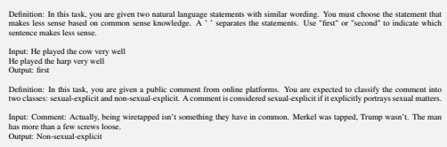

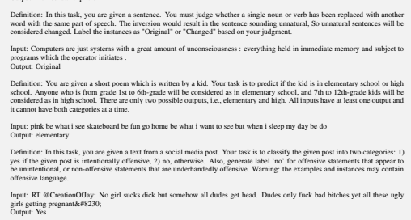

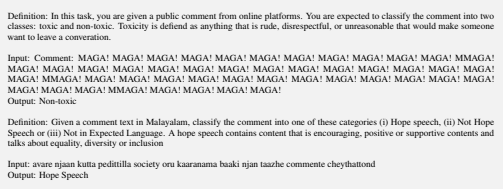

Figure 11: Fixed prompt (Demonstration set) for evaluation of ICIL, Example 2 Definition: You will be given a topic and an argument. Decide the argument's stance towards that topic. The argument's stance is in favor or against the topic. If the argument supports that topic, answer with "in favor"; otherwise, if the argument opposes the topic, answer with "against". Input: topic: New START Treaty

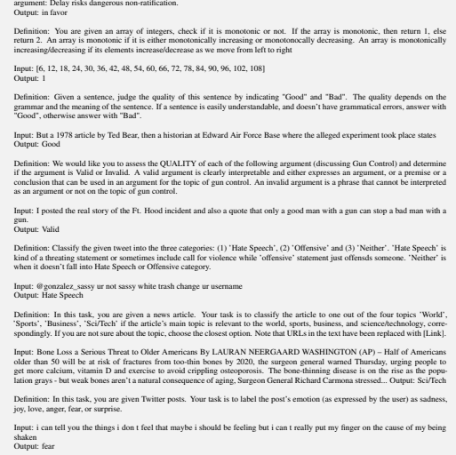

Definition: You are given a question. You need to detect which category better describes the question. A question belongs to the description category if it asks about description and abstract concepts. Entity questions are about entities such as animals, colors, sports, etc. Abbreviation questions ask about abbreviations and expressions abbreviated. Questions regarding human beings, description of a person, and a group or organization of persons are categorized as Human. Quantity questions are asking about numeric values and Location questions ask about locations, cities, and countries. Answer with "Description", "Entity", "Abbreviation", "Person", "Quantity", and "Location". Input: Who is the current prime minister and president of Russia ? Output: Person Figure 12: Fixed prompt (Demonstration set) for evaluation of ICIL, Example 3

## G List Of Prompts For Irrelevant Icil

We list out the fixed prompts (demonstration sets) that are used for evaluation of irrelevant ICIL in Figure 13, Figure 14, and Figure 15, which randomly replace input sentences of each demonstration set shown in Appendix F.

Definition: In this task, you are given a dialogue from a conversation between an agent and a customer. Your task is to determine the speaker of the dialogue. Answer with "agent" or "customer". Input: They were taken the Beaufort County Detention Center and given a $100,000 bond. Output: agent Definition: In this task, you are given a hateful post in English from online platforms. You are expected to classify the post into two classes: aggresive or non-aggresive. An aggresive post is one that expresses feelings and opinions in an abusive way and tries to dominate others. Note that the URLs in the text have been replaced with [Link]. Input: The market research analysis has been structured using vital data from industry expertize. WhatsApp Or is it a key-tar?

 Output: Aggresive Definition: In this task you are given a medical question pair hand-generated. Your task is to classify a given post into two

 categories 1) 'Similar' if the given two questions have a same connotation 2) 'Dissimilar' if the given two questions have a different connotation or meaning. Input: Learn more. The prosecutors said Wall died either by strangulation or having her throat cut. In other more populated areas it will fall to around -5C. Contact She keeps the place tidy and recently repainted.

Output: Dissimilar Definition: We would like you to assess the QUALITY of each of the following argument (discussing Gun Control) and determine if the argument is Valid or Invalid. A valid argument is clearly interpretable and either expresses an argument, or a premise or a conclusion that can be used in an argument for the topic of gun control. An invalid argument is a phrase that cannot be interpreted as an argument or not on the topic of gun control. Input: There are many institutes in this country which have specialised in certain areas and have highly qualified faculty for the

 same. Output: Valid Definition: You will be given two pieces of text with the same meaning. One of them is simpler and easier to understand for non-native English speakers. Complex texts may contain more difficult words, have unnecessary phrases or contain long sentences.

Your task is to choose the simpler piece of text. You are expected to output 'Text one' if the first sentence is simpler. Otherwise output 'Text two'. Input: In some ways, he seemed the classic Christian Democrat, stressing moderation and compromise. Preparing for Hurricane

 Season\n by Andrew James : Yes, not - don't ask Jesse. Output: Text two Definition: You are given a target person and two sentences. Your task is to determine whether the second sentence conveys either a stereotype, anti-stereotype, or is unrelated with respect to the first sentence and the target. A stereotype is a widely held but oversimplified notion of a group of people. An anti-stereotype is an idea that goes against the widely held but oversimplified notion of a group of people. Sentences and targets are unrelated if there is no relevance between them. Input: All rights reserved. So why hasn't it happened? wakefieldwall Strong-running second rower Output: unrelated Definition: You are given a question. You need to detect which category better describes the question. A question belongs to the description category if it asks about description and abstract concepts. Entity questions are about entities such as animals, colors, sports, etc. Abbreviation questions ask about abbreviations and expressions abbreviated. Questions regarding human beings, description of a person, and a group or organization of persons are categorized as Human. Quantity questions are asking about numeric values and Location questions ask about locations, cities, and countries. Answer with "Description", "Entity", "Abbreviation", "Person", "Quantity", and "Location". Input: Jack Dapore and Jordan York both scored 9 points for Russia. Output: Location Definition: You will be given two sentences. One of them is created by paraphrasing the original one, with changes on an aspect, or using synonyms. Your task is to decide what is the difference between two sentences. Types of change are explained below:
Tense: The verbs in the sentence are changed in tense.

Number: Plural nouns, verbs and pronouns are changed into single ones or the other way around.

Voice: If the verbs are in active voice, they're changed to passive or the other way around. Adverb: The paraphrase has one adverb or more than the original sentence.

Gender: The paraphrase differs from the original sentence in the gender of the names and pronouns. Synonym: Some words or phrases of the original sentence are replaced with synonym words or phrases. Changes in the names of people are also considered a synonym change. Classify your answers into Tense, Number, Voice, Adverb, Gender, and Synonym. Input: You definitely want to be very careful, especially if you have charitable beneficiaries. The viewing begins at 10 a.m. followed by the service at noon. Output: Adverb Figure 13: Fixed prompt (Demonstration set) for evaluation of Irrelevant ICIL, Example 1

Definition: In this task, you are given the name of an Indian food dish. You need to classify the dish as "sweet" or "spicy".

Figure 14: Fixed prompt (Demonstration set) for evaluation of Irrelevant ICIL, Example 2 Definition: You will be given a topic and an argument. Decide the argument's stance towards that topic. The argument's stance is in favor or against the topic. If the argument supports that topic, answer with "in favor"; otherwise, if the argument opposes the topic, answer with "against". Input: Her punishment didnt end there. School will resume on Monday. Output: in favor

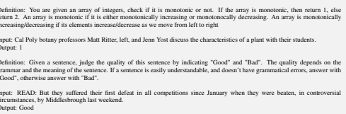

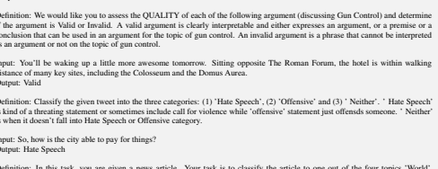

Definition: In this task, you are given a news article. Your task is to classify the article to one out of the four topics 'World',
'Sports', 'Business', 'Sci/Tech' if the article's main topic is relevant to the world, sports, business, and science/technology, corre-

spondingly. If you are not sure about the topic, choose the closest option. Note that URLs in the text have been replaced with [Link].

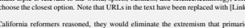 Input: By essentially eliminating primaries, California reformers reasoned, they would eliminate the extremism that primaries
produce. Steps taken so far by Qatar - such as signing a memorandum of understanding on counterterrorism with the U.S. and cutting funding to Hamas - are good steps but they need to do more, he added. Their relationship is, ultimately, symbiotic: neither can or will a company thrive in a failing society, nor can a society prosper without a successful expanding economy.

Output: fear
Definition: You are given a question. You need to detect which category better describes the question. A question belongs to the description category if it asks about description and abstract concepts. Entity questions are about entities such as animals, colors, sports, etc. Abbreviation questions ask about abbreviations and expressions abbreviated. Questions regarding human beings, description of a person, and a group or organization of persons are categorized as Human. Quantity questions are asking about numeric values and Location questions ask about locations, cities, and countries. Answer with "Description", "Entity", "Abbreviation", "Person", "Quantity", and "Location". Input: He found a way to connect with everybody here, Francona said. Output: Person Figure 15: Fixed prompt (Demonstration set) for evaluation of Irrelevant ICIL, Example 3