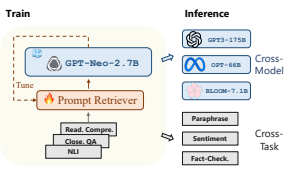
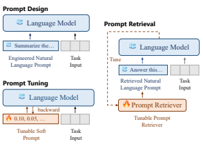
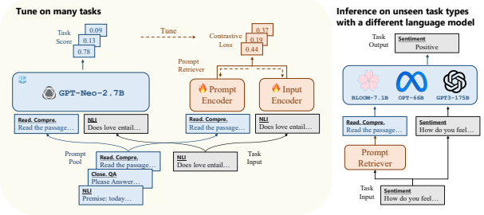
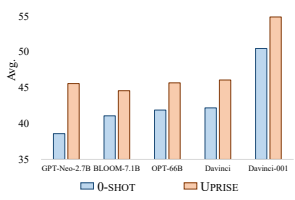
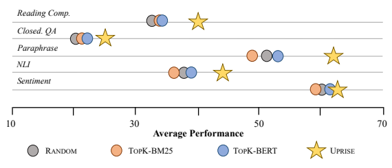

# Uprise**: Universal Prompt Retrieval For Improving Zero-Shot Evaluation**

Daixuan Cheng, Shaohan Huang, Junyu Bi, Yuefeng Zhan, Jianfeng Liu Yujing Wang, Hao Sun, Furu Wei, Denvy Deng, Qi Zhang Microsoft Corporation daixuancheng6@gmail.com bijunyu21@mails.ucas.ac.cn
{shaohanh, yuefzh, jianfengliu, yujing.wang, hasun, fuwei, dedeng, qizhang}@microsoft.com

## Abstract

Large Language Models (LLMs) are popular for their impressive abilities, but the need for model-specific fine-tuning or task-specific prompt engineering can hinder their generalization. We propose UPRISE (Universal Prompt Retrieval for Improving zero-Shot Evaluation), which tunes a lightweight and versatile retriever that automatically retrieves prompts for a given zero-shot task input. Specifically, we demonstrate universality in a cross-task and cross-model scenario: the retriever is tuned on a diverse set of tasks, but tested on unseen task types; we use a small frozen LLM, GPT-Neo-2.7B,
for tuning the retriever, but test the retriever on different LLMs of much larger scales, such as BLOOM-7.1B, OPT-66B and GPT3-175B. Additionally, we show that UP-
RISE mitigates the hallucination problem in our experiments with ChatGPT, suggesting its potential to improve even the strongest LLMs. Our model and code are available at https://github.com/microsoft/LMOps.

## 1 Introduction

Large Language Models (LLMs) such as GPT-3 (Brown et al., 2020), OPT (Zhang et al., 2022), and BLOOM (Scao et al., 2022) have shown impressive capabilities across a wide range of tasks. Recent research proposes two main approaches to further improve their performance: fine-tuning LLMs to follow prompts (Hu et al., 2022; Houlsby et al., 2019; Zaken et al., 2022; Wei et al., 2022a; Sanh et al., 2022) and developing prompt engineering techniques to guide the LLMs (Brown et al., 2020; Wei et al., 2022b; Liu et al., 2021; Lester et al., 2021).

Fine-tuning LLMs adjusts their weights to fit specific prompts and improve task performance. However, this may be limited by computational resources and unavailable model weights (Hu et al., 2022). Multi-task tuning provides an alternative

Figure 1: UPRISE tunes a prompt retriever on multiple tasks with a small frozen LLM, but conducts inference on unseen task types with a different larger LLM.

approach to improve zero-shot task generalization (Wei et al., 2022a; Sanh et al., 2022), which partially justifies the tuning cost. Yet, the constant evolution of LLMs creates a need for tuning new models, which makes the the cumulative finetuning cost a big concern.

Prompt engineering constructs prompts to guide frozen LLMs. Prompt design adds an engineered natural language prompt to the task input, to teach the LLM to learn in context (Brown et al., 2020) or induce the LLM to reason (Wei et al., 2022b). Prompt tuning adds a soft prompt represented by continuous parameters, and optimizes it through gradient propagation (Liu et al., 2021; Li and Liang, 2021; Lester et al., 2021). While these methods can achieve excellent performance for specific tasks, it is uncertain whether the prompts designed for one task can generalize to unseen task types, as prompt designers are blind in strict zero-shot settings (van de Kar et al., 2022).

In this paper, we propose UPRISE (Universal Prompt Retrieval for Improving Zero-Shot Evaluation), which tunes a lightweight and versatile retriever that automatically retrieves prompts from a pre-constructed pool of data, given a zero-shot task input. As illustrated in Figure 1, the retriever is trained to retrieve prompts for multiple tasks, enabling it to generalize to unseen task types during inference. In addition, we demonstrate that the cross-task capabilities can generalize well from a small LLM to different LLMs of much larger scales: we use GPT-Neo-2.7B (Black et al., 2021) to guide the tuning of the retriever and evaluate the retriever's performance on BLOOM-7.1B (Scao et al., 2022), OPT-66B (Zhang et al., 2022),
and GPT3-175B (Brown et al., 2020). The cross-model and cross-task generalization of UP-
RISE makes it a promising and practical solution for real-world applications.

Furthermore, our approach demonstrates the potential for enhancing even the most powerful LLMs, as shown in our experiments with ChatGPT. Despite its impressive abilities, ChatGPT has been found to struggle with serious hallucination problems, leading to responses that are factually inaccurate (Bang et al., 2023). However, UPRISE is able to address this issue on fact-checking tasks by prompting the model to draw correct inferences from its built-in knowledge.

In summary, our contributions include:

- We introduce UPRISE, a light-weight and versatile approach to improve zero-shot performance of LLMs in the cross-task and cross-model scenarios.

- UPRISE is tuned with GPT-Neo-2.7B, but can also benefit different LLMs of much larger scales, such as BLOOM-7.1B, OPT-66B and GPT3-175B.

- Our exploration on ChatGPT demonstrates the potential of UPRISE in improving performance of even the strongest LLMs.

## 2 Problem Definition

We aim to improve zero-shot performance of LLMs by training a prompt retriever to retrieve prompts for any given task input. Specifically, UPRISE decomposes the prompting process into two steps: retrieve then *predict*. Given an input x, we first retrieve a set of positive prompts P
+ from a preconstructed pool P:

$${\mathcal{P}}^{+}={\mathcal{R}}(x,{\mathcal{P}}).$$

Then we concatenate P
+ with x to form an input sequence for a frozen LLM, which generates a predicted output:

$$y^{\mathcal{P}^{+}}=\mathrm{LM}\left(y^{\mathcal{P}^{+}}|\mathcal{P}^{+}\oplus x\right).\qquad\qquad(2)$$

Figure 2: Typical prompt engineering methods and prompt retrieval. Prompt retrieval prepends a natural language prompt to the task input and uses a frozen LLM to evaluate the prompt's performance, which is then used to tune the retriever reversely.

Our objective is to optimize performance of y P+
to match the target y by updating the retriever R.

Figure 2 compares prompt retrieval with typical prompt engineering methods: prompt design adds an engineered natural language prompt (Brown et al., 2020; Wei et al., 2022b) and prompt tuning tunes a soft prompt (Liu et al., 2021; Lester et al., 2021). In contrast, prompt retrieval tunes a retriever to retrieve natural language prompts, which is both interpretable and flexible. It uses the language model itself to label each prompt in the prompt pool as positive/negative, and then tuning a retriever from this signal (Rubin et al., 2022). Such fine-tuned prompt retrieval has demonstrated effectiveness in tuning task-specific retrievers: EPR (Rubin et al., 2022) and CEIL (Ye et al., 2023) train a single prompt retriever for a specific task using the input and output pairs in the training set as the prompt pool. The retriever is then evaluated on the inputs of the corresponding test set.

Our work is to achieve universality of the prompt retriever, which means the fine-tuned retriever can be directly used to retrieve prompts for unseen tasks and various inference LLMs, without the need for further tuning. We define the universality from two perspectives: cross-task retrieval and cross-model retrieval.

$\left(1\right)$. 
Cross-task retrieval. In order to address the diversity of tasks in real-world applications, we propose cross-task retrieval to retrieve for task types on which the prompt retriever has not been trained.

We simulate this setting by evaluating the prompt retriever on unseen task types (Wei et al., 2022a):
various tasks are grouped into different clusters based on their task types, and we hold out each task cluster for evaluation while training the retriever on all remaining clusters.

Cross-model retrieval. Due to the high cost of tuning a prompt retriever with a large-scale LLM (e.g., larger than 5B), we propose to evaluate the generalization of small-to-large LLMs. Specifically, we use a relatively small LLM for tuning the retriever, while using a much larger LLM for inference. Furthermore, we suggest exploring crossmodel source generalization, as there are LLMs developed by different companies or institutions.

## 3 Method

As shown in Figure 3, UPRISE uses a frozen LLM to supervise the fine-tuning of a prompt retriever on a diverse set of tasks, and then using this trained retriever to retrieve prompts for different task types during inference with different LLMs. In this section, we elaborate on our data construction, and training and inference pipeline.

### 3.1 Data Construction

Task Data. We use instruction templates from FLAN (Wei et al., 2022a) to convert task datasets into natural language instructions1. Each task dataset corresponds to approximately seven templates. For each data example (xi, yi), we randomly select one of the seven templates to convert xiinto an input instruction and yiinto a label completion. The option suffices and new line characters
"\n" are then automatically removed from the instructions, to make the text format more similar to that of the pre-training corpus, thus improving prompting performance (van de Kar et al., 2022).

Prompt pool. For each testing cluster, the prompt pool to be retrieved is made of training demonstrations of the remaining task clusters (i.e., the clusters for training the retriever). This is inspired by in-context learning (Brown et al., 2020),
which presents a few task demonstrations before the task input to improve model performance. Each demonstration is a concatenation of the input instruction and the label completion, separated by a text blank space. Our motivation is that even if the testing task type has no overlap with the training task types, the testing input may still benefit from similar question types, topics, or reasoning chains in the retrieved demonstrations.

### 3.2 Prompt Scoring

For each training example (xi, yi) in the training clusters, we collect a set of positive and negative prompts from the prompt pool P = {pj}
NP
j=1, where the positive prompt indicates that the frozen LLM achieves good task scores conditioned on the prompt-input pair. We use these positive and negative labels to supervise the contrastive learning of the retriever.

We categorize all tasks into two question types:
text completion and multiple-choice, and use different methods to score the prompts for each training example.

Text completion is the question to do free-form completion. We calculate score of the prompt using the following equation:

$$\mathrm{score}\left(p_{j},x_{i}\right)=\mathrm{metric}\left(y_{i},y_{i}^{p_{j}}\right),\qquad(3)$$

where y pj i = LM y pj i |pj ⊕ xiis the model prediction based on the input concatenation pj ⊕ xi, and ⊕ is a text delimiter "\n". metric (·) is the function used to calculate the task metric score
(e.g., F1 or Exact Match).

Multiple choice is the question to choose one correct completion from several options. Suppose there are M options in a multiple choice task xi, yi, {om}
M
m=1, where {om}
M
m=1 is the option set and oyidenotes the gold option. We feed the concatenation pj ⊕ xito the LLM and calculate per-token likelihood of each option: LH (om). The option with the highest likelihood is considered as the model prediction y pj i
.

Accuracy of the prediction acc yi, y pj i could evaluate the prompt, but it only produces binary results which makes it hard to compare prompt effectiveness. To address this, we calculate the final score using the equation:

$$\operatorname{score}\left(p_{j},x_{i}\right)=\operatorname*{acc}\left(y_{i},y_{i}^{p_{j}}\right)\cdot{\frac{\operatorname{LH}\left(o_{y_{i}}\right)}{\sum_{m=1}^{M}\operatorname{LH}\left(o_{m}\right)}},\tag{4}$$

where we multiply the accuracy score with the normalized likelihood of the gold option, to achieve a fine-grained comparison.

Prompt filtering. Intuitively, to collect the positive and negative prompts for each training example, we need to score every prompt in the prompt pool and identify the prompt that yields the best

1We exclude templates that "turn the task around", such as asking a sentiment classification task to generate a movie review.

Figure 3: Training and inference pipeline. In the training stage, a frozen LLM is used to supervise the tuning of a prompt retriever, where both the LLM and the retriever take the prompt-input pairs as input, and we use the task scores given by the LLM to supervise the contrastive learning of the retriever. In the inference stage, for each task input, the tuned prompt retriever retrieve positive prompt(s) to guide the inference model to predict a task output. Overall, we follow a cross-task and cross-model paradigm where the task types and LLMs for training could be different from those for inference.

score as the positive prompt. Conversely, prompts that lead to the worst scores are labeled as negative prompts. However, scoring all the prompts can be computationally expensive, even with a relatively small LLM. To address this, we design a prompt filtering mechanism to reduce the number of prompts that need to be scored.

Inspired by one-shot in-context learning (Brown et al., 2020), we observe that a single training demonstration, even if randomly sampled, can improve the evaluation performance of the testing sample, since the training demonstration and the testing sample belong to the same task, where they could share common patterns or structures. Therefore, we randomly sample a small subset L of training demonstrations from the prompt pool for each training example (xi, yi). Specifically, we select only those demonstrations that belong to the same task as (xi, yi). This significantly reduces the number of prompts to be scored while still increasing the likelihood of identifying positive prompts in the sampled subset.

Furthermore, in the case of difficult questions, all L prompt-input pairs may result in a score of 0.

To address this, we repeat the sampling process to score another subset of L prompts with the same task as (xi, yi) until we find at least one prompt with a score greater than 0.

For all the scored prompts for a training example, we choose the one with the highest score as positive. For negative prompts, we randomly sample B
demonstrations from the prompt pool, each with a different task from that of (xi, yi). We also label B demonstrations with the lowest B scores in the sampled prompts as hard negatives, which are of the same task with (xi, yi) but are less effective.

### 3.3 Retriever Tuning

After labeling prompts for each training example, we split the collected data into two sets: 90% for training and 10% for validation. The prompt retriever is a bi-encoder model where the input encoder EX(·) takes the task input xi as input, and the prompt encoder EP (·) takes prompt pj as input.

To train the prompt retriever, InfoNCE
loss (van den Oord et al., 2018) is used to maximize the similarity score between the encoded prompt and input for positive prompt-input pairs, and minimize it for (hard) negative prompt-input pairs. For a single training example (xi, yi), the loss function for its corresponding positive and negative prompts is defined as follows (Rubin et al., 2022):

$$L(x_{i},p_{i}^{+},p_{i,1}^{-},\ldots p_{i,2B}^{-})\tag{5}$$ $$-\log\frac{e^{\sin(x_{i},p_{i}^{+})}}{e^{\sin(x_{i},p_{i}^{+})}+\sum_{j=1}^{2B}e^{\sin(x_{i},p_{i,j}^{-})}},$$
$\overline{\phantom{\rule{0.3em}{0ex}}}$ . 
where p
+
iis the positive prompt, and p
−
i,j is one of the (hard) negative prompts, and sim(xi, p) = EX(xi)
>EP (p) calculates the similarity score between input xi and prompt p using inner products.

### 3.4 Inference

After fine-tuning the prompt encoder, we use it to encode the entire prompt pool with EP (·). At inference time, for a testing input instruction xtest, we compute its encoding EX(xtest) and then use maximum inner-product search over the prompt pool to retrieve K most similar prompts, sorted by their inner product in descending order, denoted as P
+ = (p1*, ..., p*K). We then concatenate the prompts with the task input, resulting in the concatenation pK ⊕ ... ⊕ p1 ⊕ xtest.

To evaluate the inference results, we use the same method described in Section 3.2 to generate model predictions, and then use each task's corresponding evaluation metric to compute the scores.

## 4 Experiment Settings

Task clustering. We group the tasks used in our method into clusters, including Reading Comprehension, Closed-book QA, Paraphrase Detection, Natural Language Inference, Sentiment Analysis, Commonsense Reasoning, Coreference Resolution, Structure to Text, and Summarization. Additional information about the datasets in each cluster can be found in Appendix A.

Data sampling. To prevent the retriever tuning from being dominated by large datasets, we randomly sample up to 10k data examples from each task's training set, while also maintaining class balance in classification tasks2. The prompt pool consists only of the sampled training data. On average, for each testing task cluster, there are approximately 180k training examples sampled from the remaining clusters.

LLMs. We use GPT-Neo-2.7B (Black et al., 2021) from EleutherAI to tune the retriever, and evaluate the performance on larger LLMs from various sources in the inference stage, including BLOOM-7.1B (Scao et al., 2022) from BigScience, OPT-66B (Zhang et al., 2022) from Meta, and Davinci and text-davinci-001 from OpenAI, both belonging to the GPT3-175B (Brown et al., 2020)
series. We use greedy search to obtain predictions from all the LLMs.

Prompt scoring. We set the size of the randomly sampled subset to L = 50 and the number of (hard) negatives to B = 20. For difficult questions, we repeat the re-sampling process up to seven rounds, as we found that this is sufficient to identify a positive prompt for 90% of the training examples. If no sampled prompt yields a score greater than 0, we filter out the corresponding training example.

Tuning. We initialize both encoders of the retriever with BERTBASE (Devlin et al., 2019). Each retriever is fine-tuned for three epochs, and the best checkpoint is chosen based on retrieval accuracy using the validation set. For detailed tuning hyperparameters, please refer to Appendix B.

Inference. During inference, we set the number K of concatenated prompts to a relatively small value of 3, to balance between prompting performance and inference efficiency. For each dataset in the testing cluster, We report metric scores on the test set when available, falling back to the validation set otherwise.

## 5 Main Results

We evaluate our prompt retriever on natural language understanding tasks where generative LLMs are known to need improvement (Liu et al., 2021).

Table 1 compares the performance of UPRISE to vanilla zero-shot prompting.

### 5.1 Cross-Task Prompt Retrieval

Based on the results in the GPT-Neo-2.7B column, we can assess our ability of generalizing across different task types. UPRISE has positive impacts on most of the testing clusters. Specifically, we achieve performance gains of 8.5% and 14.6% absolute points in reading comprehension and paraphrase detection tasks, respectively, when compared to the zero-shot baseline. We also find that UPRISE shows consistent performance improvements across all tasks in closed-book QA and natural language inference.

However, UPRISE has negative impacts on tasks in commonsense reasoning and coreference resolution clusters. This aligns with the findings reported by Wei et al. (2022a): instruction templates may not be effective for tasks that are directly formulated as language modeling problems. Alternative techniques such as chain-of-thought prompting (Wei et al., 2022b) may be more effective.

2For instance, in a four-classification task, we sample a maximum of 2.5k data examples from each class.

| Task                       | Metric   |            | GPT\-Neo\-2.7B   | BLOOM\-7.1B   |            |            | OPT\-66B   | Davinci    |            |            | Davinci\-001   |
|----------------------------|----------|------------|------------------|---------------|------------|------------|------------|------------|------------|------------|----------------|
|                            |          | 0\-SHOT    | UPRISE           | 0\-SHOT       | UPRISE     | 0\-SHOT    | UPRISE     | 0\-SHOT    | UPRISE     | 0\-SHOT    | UPRISE         |
| Reading Comprehension      |          |            |                  |               |            |            |            |            |            |            |                |
| SQuADv1                    | F1       | 4.4        | 26.4             | 4.5           | 5.5        | 6.1        | 7.5        | 6.5        | 6.0        | 41.6       | 57.7           |
|                            | EM       | 0.4        | 14.3             | 0.0           | 0.0        | 0.0        | 0.6        | 0.0        | 0.0        | 16.4       | 36.8           |
| BoolQ                      | Acc      | 54.5       | 59.4             | 54.0          | 60.2       | 60.7       | 63.5       | 62.0       | 65.7       | 64.2       | 65.7           |
| MultiRC                    | F1       | 57.1       | 58.1             | 58.8          | 59.8       | 59.6       | 60.4       | 59.8       | 60.0       | 54.3       | 58.9           |
| OBQA                       | Acc      | 41.8       | 42.2             | 44.0          | 41.8       | 46.4       | 48.8       | 49.2       | 52.4       | 52.8       | 48.8           |
| Average                    |          | 31.6       | 40.1             | 32.3          | 33.5       | 34.6       | 36.2       | 35.5       | 36.8       | 45.9       | 53.6           |
| Closed\-book QA            |          |            |                  |               |            |            |            |            |            |            |                |
| ARC\-e                     | Acc      | 45.7       | 55.6             | 53.7          | 60.9       | 56.2       | 66.0       | 64.1       | 71.8       | 67.0       | 74.4           |
| ARC\-c                     | Acc      | 29.3       | 30.0             | 33.2          | 34.2       | 36.7       | 40.2       | 40.8       | 45.2       | 46.2       | 50.4           |
| NQ                         | F1       | 1.3        | 5.6              | 0.9           | 1.4        | 2.5        | 2.1        | 0.0        | 2.2        | 18.3       | 18.2           |
|                            | EM       | 0.5        | 2.2              | 0.0           | 0.1        | 0.3        | 0.4        | 0.0        | 0.0        | 4.8        | 8.7            |
| Average                    |          | 19.2       | 23.3             | 22.0          | 24.2       | 23.9       | 27.2       | 26.2       | 29.8       | 34.1       | 37.9           |
| Paraphrase Detection       |          |            |                  |               |            |            |            |            |            |            |                |
| MRPC                       | Acc      | 46.6       | 67.9             | 51.0          | 70.6       | 51.0       | 68.9       | 54.4       | 62.3       | 40.0       | 61.3           |
|                            | F1       | 46.0       | 80.4             | 58.0          | 82.1       | 57.8       | 81.5       | 68.9       | 81.4       | 39.2       | 72.9           |
| QQP                        | Acc      | 48.4       | 54.3             | 49.5          | 53.1       | 50.5       | 49.7       | 55.2       | 52.4       | 60.9       | 62.6           |
| PAWS                       | F1  Acc  | 42.2  51.7 | 59.8  45.7       | 46.7  50.8    | 59.6  45.9 | 43.7  50.5 | 58.5  44.4 | 33.7  52.4 | 57.9  44.5 | 43.0  53.2 | 45.9   52.3    |
| Average                    |          | 47.0       | 61.6             | 51.2          | 62.3       | 50.7       | 60.6       | 52.9       | 59.7       | 47.3       | 59.0           |
| Natural Language Inference |          |            |                  |               |            |            |            |            |            |            |                |
| MNLI\-m                    | Acc      | 35.3       | 41.3             | 35.4          | 36.0       | 37.0       | 40.4       | 34.2       | 38.2       | 44.7       | 41.1           |
| MNLI\-mm                   | Acc      | 36.4       | 43.1             | 34.9          | 35.8       | 37.1       | 41.2       | 34.2       | 38.6       | 46.5       | 42.1           |
| QNLI                       | Acc      | 50.9       | 53.8             | 49.9          | 51.3       | 54.2       | 53.7       | 51.7       | 51.1       | 60.0       | 58.4           |
| SNLI                       | Acc      | 35.2       | 42.3             | 35.2          | 34.4       | 34.5       | 40.2       | 33.5       | 37.9       | 47.5       | 42.0           |
| RTE                        | Acc      | 33.6       | 34.7             | 50.5          | 49.8       | 52.3       | 46.9       | 51.3       | 45.5       | 52.3       | 50.9           |
| Average                    |          | 38.3       | 43.0             | 41.2          | 41.5       | 43.0       | 44.5       | 41.0       | 42.3       | 50.2       | 46.9           |
| Sentiment Analysis         |          |            |                  |               |            |            |            |            |            |            |                |
| SST\-2                     | Acc      | 52.4       | 56.2             | 63.2          | 69.1       | 57.9       | 65.3       | 52.3       | 64.3       | 90.5       | 90.5           |
| Yelp                       | Acc      | 71.7       | 67.8             | 56.1          | 58.0       | 67.6       | 63.5       | 59.8       | 65.3       | 80.3       | 80.2           |
| Sent140                    | Acc      | 64.1       | 61.3             | 74.5          | 72.1       | 59.1       | 61.6       | 64.3       | 72.1       | 87.2       | 89.1           |
| Average                    |          | 62.7       | 61.8             | 64.6          | 66.4       | 61.5       | 63.5       | 58.8       | 67.3       | 86.0       | 86.6           |
| Commonsense Reasoning      |          |            |                  |               |            |            |            |            |            |            |                |
| PiQA                       | Acc      | 70.2       | 70.4             | 71.5          | 72.1       | 76.5       | 80.4       | 79.1       | 81.3       | 79.1       | 79.1           |
| COPA                       | Acc      | 67.0       | 64.0             | 67.0          | 67.0       | 74.0       | 76.0       | 80.0       | 83.0       | 83.0       | 80.0           |
| HellaSwag                  | Acc      | 54.4       | 52.1             | 59.6          | 58.8       | 72.9       | 71.4       | 76.9       | 76.7       | 77.6       | 78.2           |
| Average                    |          | 63.9       | 62.2             | 66.0          | 66.0       | 74.5       | 75.9       | 78.7       | 80.3       | 79.9       | 79.1           |
| Coreference Resolution     |          |            |                  |               |            |            |            |            |            |            |                |
| WSC273                     | Acc      | 73.6       | 76.6             | 78.0          | 81.0       | 83.9       | 86.1       | 60.6       | 50.0       | 78.8       | 75.5           |
| DPR                        | Acc      | 59.6       | 51.0             | 64.4          | 55.8       | 66.3       | 50.0       | 82.1       | 83.9       | 64.4       | 58.7           |
| Winogrande                 | Acc      | 58.9       | 58.6             | 65.9          | 64.3       | 69.2       | 67.8       | 68.6       | 70.2       | 66.3       | 64.7           |
| Average                    |          | 64.0       | 62.1             | 69.4          | 67.0       | 73.1       | 68.0       | 70.4       | 68.0       | 69.8       | 66.3           |

Table 1: Zero-shot performance across tasks and LLMs. The model Davinci-001 is the fine-tuned version text-davinci-001 of Davinci. The method 0-SHOT is the vanilla zero-shot method with only the input instruction fed into the LLM.

60

Figure 4: cross-model results of the cross-task retriever.

In Table 6-10 in Appendix, we show two cases of each testing cluster, and analyze the relevance between the retrieved prompts and task input in the caption. We observe the cross-task improvement benefits from similar question types, topics, text formats, or logical relationships.

### 5.2 Cross-Model Prompt Retrieval

In addition to evaluating cross-task generalization, we can explore the cross-model ability by examining the results of BLOOM, OPT, Davinci and text-davinci-001. UPRISE continues to improve performance on reading comprehension, closed-book QA, and paraphrase detection tasks across all LLMs. While the performance on sentiment analysis is negative with the small 2.7B GPT-Neo, we observe positive impacts when using larger models. We achieve consistent gains on natural language inference tasks with the models that have not been fine-tuned (BLOOM, OPT,
and Davinci), but experience a drop in performance on text-davinci-001, which could potentially be due to the model being specifically fine-tuned on such tasks to improve performance Generally, we presenting the average performance of reading comprehension, closed-book QA, paraphrase detection, natural language inference, and sentiment analysis in Figure 4. The results indicate consistent performance gains across all LLMs.

## 6 Hallucination Mitigation Of Chatgpt

Despite the impressive abilities of ChatGPT in many areas, recent reports have shown that it suffers from a significant issue known as hallucination: providing factually incorrect responses to users (Bang et al., 2023).

| Method   | TruthfulQA   | FEVER2.0   | Covid\-19   |
|----------|--------------|------------|-------------|
| 0\-SHOT  | 86.3         | 51.0       | 47.0        |
| UPRISE   | 86.3         | 56.0       | 83.0        |

Table 2: Comparative results of ChatGPT on hallucination detection tasks.

0-SHOT
There existed no sibling duo called Sonny & Cher. Is this true?

False. Sonny & Cher were a popular American singing duo in the 1960s and 1970s, consisting of Sonny Bono and his wife Cher. They had several hit songs, including "I Got You Babe" and "The Beat Goes On," and also had their own television show, The Sonny & Cher Comedy Hour.

#### Uprise

Spot gold was fetching $365.25/366.25 an ounce at 0520 GMT, having galloped as high as $368.90--a level not seen since February 10. Spot gold was quoted at $367.90/368.60 an ounce at 1000 GMT, having marched up to $369.50--a level not seen since February 10. If the first sentence is true, is the second one also true? No There existed no sibling duo called Sonny & Cher. Is this true?

True

Figure 5: Case of the chats of vanilla zero-shot prompting and UPRISE on the FEVER2.0 dataset, the label completion is "True".

To assess the versatility of our prompt retriever, we also investigate whether UPRISE can mitigate the hallucination problem. We evaluate on three tasks: TruthfulQA (Lin et al., 2022) for detecting human falsehood, FEVER2.0 (Thorne et al., 2018) and the scientific spilt of Covid-19 (Lee et al., 2021) for fact-checking.

Table 2 shows that UPRISE outperforms vanilla zero-shot prompting in the two fact-checking tasks. Figure 5 presents an interesting case where zeroshot prompting results in a correct generation of information ("Sonny & Cher... consisting of Sonny Bono and his wife Cher."), but an incorrect answer. In contrast, UPRISE successfully induces a precise answer. We attribute this improvement to the retrieved demonstration, which is of the natural language inference task type that may motivate the model to correctly infer from its parametric memory. This finding suggests that the limited

Figure 6: Comparison of different universal retrievers, we report the average performance on each testing cluster.

memory3 of ChatGPT may not be the only factor leading to the hallucination challenge. Rather, it highlights the importance of having effective inference mechanisms. Prompt engineering techniques such as UPRISE can help address this issue. For further evaluation details and analysis, please refer to Appendix C.

## 7 Ablation Study

### 7.1 Universal Prompt Retriever

We replace the universal retriever with three alternatives: 1) RANDOM randomly samples prompts from the prompt pool, and reports the score averaged on five random seeds, 2) TOPK-BM25 uses the sparse retriever BM25 (Robertson and Zaragoza, 2009) to retrieve prompts similar to the testing input, and 3) TOPK-BERT follows KATE (Liu et al., 2022) to use SBERT (Reimers and Gurevych, 2019) to retrieve similar prompts.

Figure 6 displays the comparative performance using GPT-Neo-2.7B, where UPRISE achieves the best results among all the universal retrievers. This suggests that word-level (TOPK-BM25) or sentence-level (TOPK-BERT) similarity to the testing input is not the only decisive factor for a good prompt. This finding underscores the effectiveness of finetuning a retriever with the language model itself as a data labeler.

We also believe that the diversity of the instruction templates inherited from FLAN (Wei et al.,
2022a) contributes to our good cross-task transferability. By leveraging this diverse prompts, we are able to tune a light-weight retriever instead of a

| Prompt Pool   | Read.   | Closed.   | Para.   | NLI   | Senti.   |
|---------------|---------|-----------|---------|-------|----------|
| RAW TEXT      | 32.0    | 19.3      | 44.7    | 37.5  | 60.3     |
| UPRISE        | 40.1    | 23.4      | 61.6    | 43.0  | 61.8     |

| Method   | Read.   | Closed.   | Para.   | NLI   | Senti.   |
|----------|---------|-----------|---------|-------|----------|
| 0\-SHOT  | 31.6    | 19.2      | 47.0    | 38.3  | 62.7     |
| RANDOM   | 33.7    | 21.0      | 51.9    | 38.9  | 61.2     |

Table 3: Comparison of average performance on GPT-Neo-2.7B with different prompt pool: RAW
TEXT uses raw data of the pre-training corpus, UP-
RISE uses training demonstrations of the trained tasks.

Table 4: Comparative results on GPT-Neo-2.7B of vanilla zero-shot prompting (the first row) and augmenting zero-shot prompting with randomly sampled prompts of our prompt pool (the second row).

large language model, which allows us to follow zero-shot instructions more efficiently.

### 7.2 Universal Prompt Pool

For each testing task cluster, we use training demonstrations of the remaining clusters to construct the prompt pool. To evaluate its effectiveness, we replace it with the raw texts of wikitext103 (Merity et al., 2016), which belongs to the pre-training corpus of many LLMs. The results in Table 3 show the effectiveness of our prompt pool, which outperforms the raw texts on all the testing clusters. One possible reason is that even though we follow the cross-task type paradigm, there still exist some training demonstrations that are beneficial for the testing input.

As shown in Table 4, we compare the results of vanilla zero-shot prompting and prompting aug-

3"limited memory" means that ChatGPT does not have access to external knowledge bases.
mented with randomly sampled prompts from our prompt pool, where we see that even the randomly sampled prompts could improve the performance on four of the five clusters. This suggests that presenting some input-output demonstrations, even if the tasks of the prompts are different from those for testing, might be able to induce the large model to think and reason (Wei et al., 2022b), leading to inferring the correct answers.

### 8 Related Work

Our work is related to prompt engineering works including prompt design, prompt tuning, and prompt search.

Prompt Design In-context Learning (Brown et al., 2020) is a method that helps LLMs transfer to new tasks via inference alone by conditioning a concatenation of demonstrations and test input, without any gradient updates. The demonstrations consist of k text samples. A in-context learning method is classified as zero-shot when k = 0 and few-shot when k > 0.

With standard in-context learning, LLMs struggle to tackle complex arithmetic, commonsense, and symbolic reasoning tasks. Chain-of-Thoughts
(CoT) (Wei et al., 2022b) proposes providing LLMs with a series of intermediate reasoning steps as demonstrations to induce LLMs to produce another series of intermediate reasoning steps that lead to the final answer.

Prompt Tuning. Traditional natural language prompts require significant human engineering and can lead to suboptimal performance. Prompt tuning proposes to learn a prompt represented by continuous parameters rather than discrete natural language tokens (Liu et al., 2021). Prompt tuning takes the source text embedded by the LM input embeddings and prepends learnable embeddings to obtain a new embedded sequence. A variant of prompt tuning is prefix tuning (Li and Liang, 2021; Lester et al., 2021), where the learnable vectors are added not only to the input but to all transformer layers. The input-level method is referred to as shallow prompt tuning, and the layer-specific method is referred to as deep prompt tuning (Wu et al., 2022).

Prompt Search. Prompt search is another approach to avoid manual prompt design. It involves searching for prompts from pre-training corpora or downstream task datasets to construct a prompt text (Gao et al., 2021; Liu et al., 2022; van de Kar et al., 2022; Ye et al., 2023). To retrieve similar prompts for the test examples, retrievers such as the sparse retriever BM25 (Robertson and Zaragoza, 2009) or the dense retriever based on SBERT (Reimers and Gurevych, 2019) are employed. Furthermore, methods like EPR (Rubin et al., 2022) and CEIL (Ye et al., 2023) use the LLM itself to score the generated or searched prompts, thereby eliminating the need for manual prompt engineering and ensuring prompting performance.

## 9 Conclusion

In this paper, we propose UPRISE , a lightweight and versatile approach to improve the zero-shot performance of different LLMs on various tasks. Specifically, we explore a cross-task and crossmodel scenario, to evaluate the universality of the retriever to generalize from the trained task types to unseen task types, and from a small LLM to LLMs of much larger scales and different sources. Besides, the exploration on ChatGPT demonstrates our potential for improving even the strongest LLMs. Overall, UPRISE provides a promising direction of develop a lightweight and versatile module to enhance the performance of different LLMs.

## References

Yejin Bang, Samuel Cahyawijaya, Nayeon Lee, Wenliang Dai, Dan Su, Bryan Wilie, Holy Lovenia, Ziwei Ji, Tiezheng Yu, Willy Chung, Quyet V. Do, Yan Xu, and Pascale Fung. 2023. A multitask, multilingual, multimodal evaluation of chatgpt on reasoning, hallucination, and interactivity. *arXiv preprint* arXiv:2302.04023.

Luisa Bentivogli, Bernardo Magnini, Ido Dagan, Hoa Trang Dang, and Danilo Giampiccolo. 2009. The fifth PASCAL recognizing textual entailment challenge. In TAC. NIST.

Sumithra Bhakthavatsalam, Daniel Khashabi, Tushar Khot, Bhavana Dalvi Mishra, Kyle Richardson, Ashish Sabharwal, Carissa Schoenick, Oyvind Tafjord, and Peter Clark. 2021. Think you have solved direct-answer question answering? try arc-da, the direct-answer AI2 reasoning challenge. *CoRR*, abs/2102.03315.

Yonatan Bisk, Rowan Zellers, Ronan Le Bras, Jianfeng Gao, and Yejin Choi. 2020. PIQA: reasoning about physical commonsense in natural language. In AAAI, pages 7432–7439. AAAI Press.

Sid Black, Leo Gao, Phil Wang, Connor Leahy, and Stella Biderman. 2021. GPT-Neo: Large Scale Autoregressive Language Modeling with Mesh- Tensorflow. If you use this software, please cite it using these metadata.

Samuel R. Bowman, Gabor Angeli, Christopher Potts, and Christopher D. Manning. 2015. A large annotated corpus for learning natural language inference. In *EMNLP*, pages 632–642. The Association for Computational Linguistics.

Tom B. Brown, Benjamin Mann, Nick Ryder, Melanie Subbiah, Jared Kaplan, Prafulla Dhariwal, Arvind Neelakantan, Pranav Shyam, Girish Sastry, Amanda Askell, Sandhini Agarwal, Ariel Herbert-Voss, Gretchen Krueger, Tom Henighan, Rewon Child, Aditya Ramesh, Daniel M. Ziegler, Jeffrey Wu, Clemens Winter, Christopher Hesse, Mark Chen, Eric Sigler, Mateusz Litwin, Scott Gray, Benjamin Chess, Jack Clark, Christopher Berner, Sam Mc- Candlish, Alec Radford, Ilya Sutskever, and Dario Amodei. 2020. Language models are few-shot learners. In *NeurIPS*.

Paul F. Christiano, Jan Leike, Tom B. Brown, Miljan Martic, Shane Legg, and Dario Amodei. 2017. Deep reinforcement learning from human preferences. In NIPS, pages 4299–4307.

Christopher Clark, Kenton Lee, Ming-Wei Chang, Tom Kwiatkowski, Michael Collins, and Kristina Toutanova. 2019. Boolq: Exploring the surprising difficulty of natural yes/no questions. In NAACL- HLT (1), pages 2924–2936. Association for Computational Linguistics.

Jacob Devlin, Ming-Wei Chang, Kenton Lee, and Kristina Toutanova. 2019. BERT: pre-training of deep bidirectional transformers for language understanding. In *NAACL-HLT (1)*, pages 4171–4186. Association for Computational Linguistics.

William B. Dolan and Chris Brockett. 2005. Automatically constructing a corpus of sentential paraphrases. In *IWP@IJCNLP*. Asian Federation of Natural Language Processing.

Ondrej Dusek, David M. Howcroft, and Verena Rieser.

2019. Semantic noise matters for neural natural language generation. In *INLG*, pages 421–426. Association for Computational Linguistics.

Tianyu Gao, Adam Fisch, and Danqi Chen. 2021.

Making pre-trained language models better few-shot learners. In *ACL/IJCNLP (1)*, pages 3816–3830. Association for Computational Linguistics.

Alec Go, Richa Bhayani, and Lei Huang. 2009. Twitter sentiment classification using distant supervision. Processing, 150.

Neil Houlsby, Andrei Giurgiu, Stanislaw Jastrzebski, Bruna Morrone, Quentin de Laroussilhe, Andrea Gesmundo, Mona Attariyan, and Sylvain Gelly. 2019. Parameter-efficient transfer learning for NLP.

In *ICML*, volume 97 of *Proceedings of Machine* Learning Research, pages 2790–2799. PMLR.

Edward J. Hu, Yelong Shen, Phillip Wallis, Zeyuan Allen-Zhu, Yuanzhi Li, Shean Wang, Lu Wang, and Weizhu Chen. 2022. Lora: Low-rank adaptation of large language models. In *ICLR*. OpenReview.net.

Daniel Khashabi, Snigdha Chaturvedi, Michael Roth, Shyam Upadhyay, and Dan Roth. 2018. Looking beyond the surface: A challenge set for reading comprehension over multiple sentences. In NAACL-HLT, pages 252–262. Association for Computational Linguistics.

Tom Kwiatkowski, Jennimaria Palomaki, Olivia Redfield, Michael Collins, Ankur P. Parikh, Chris Alberti, Danielle Epstein, Illia Polosukhin, Jacob Devlin, Kenton Lee, Kristina Toutanova, Llion Jones, Matthew Kelcey, Ming-Wei Chang, Andrew M. Dai, Jakob Uszkoreit, Quoc Le, and Slav Petrov. 2019. Natural questions: a benchmark for question answering research. *Trans. Assoc. Comput. Linguistics*, 7:452–466.

Nayeon Lee, Yejin Bang, Andrea Madotto, and Pascale Fung. 2021. Towards few-shot fact-checking via perplexity. In *NAACL-HLT*, pages 1971–1981. Association for Computational Linguistics.

Brian Lester, Rami Al-Rfou, and Noah Constant. 2021.

The power of scale for parameter-efficient prompt tuning. In *EMNLP (1)*, pages 3045–3059. Association for Computational Linguistics.

Hector J. Levesque, Ernest Davis, and Leora Morgenstern. 2012. The winograd schema challenge. In KR. AAAI Press.

Xiang Lisa Li and Percy Liang. 2021. Prefix-tuning:
Optimizing continuous prompts for generation. In ACL/IJCNLP (1), pages 4582–4597. Association for Computational Linguistics.

Bill Yuchen Lin, Wangchunshu Zhou, Ming Shen, Pei Zhou, Chandra Bhagavatula, Yejin Choi, and Xiang Ren. 2020. Commongen: A constrained text generation challenge for generative commonsense reasoning. In *EMNLP (Findings)*, volume EMNLP 2020 of *Findings of ACL*, pages 1823–1840. Association for Computational Linguistics.

Stephanie Lin, Jacob Hilton, and Owain Evans. 2022.

Truthfulqa: Measuring how models mimic human falsehoods. In *ACL (1)*, pages 3214–3252. Association for Computational Linguistics.

Jiachang Liu, Dinghan Shen, Yizhe Zhang, Bill Dolan, Lawrence Carin, and Weizhu Chen. 2022. What makes good in-context examples for gpt-3? In Dee- LIO@ACL, pages 100–114. Association for Computational Linguistics.

Xiao Liu, Yanan Zheng, Zhengxiao Du, Ming Ding, Yujie Qian, Zhilin Yang, and Jie Tang. 2021. GPT understands, too. *CoRR*, abs/2103.10385.

Stephen Merity, Caiming Xiong, James Bradbury, and Richard Socher. 2016. Pointer sentinel mixture models.

Todor Mihaylov, Peter Clark, Tushar Khot, and Ashish Sabharwal. 2018. Can a suit of armor conduct electricity? A new dataset for open book question answering. In *EMNLP*, pages 2381–2391. Association for Computational Linguistics.

Linyong Nan, Dragomir R. Radev, Rui Zhang, Amrit Rau, Abhinand Sivaprasad, Chiachun Hsieh, Xiangru Tang, Aadit Vyas, Neha Verma, Pranav Krishna, Yangxiaokang Liu, Nadia Irwanto, Jessica Pan, Faiaz Rahman, Ahmad Zaidi, Mutethia Mutuma, Yasin Tarabar, Ankit Gupta, Tao Yu, Yi Chern Tan, Xi Victoria Lin, Caiming Xiong, Richard Socher, and Nazneen Fatema Rajani. 2021. DART: open-domain structured data record to text generation. In *NAACL-HLT*, pages 432–447. Association for Computational Linguistics.

Courtney Napoles, Matthew R. Gormley, and Benjamin Van Durme. 2012. Annotated gigaword. In AKBC-WEKEX@NAACL-HLT, pages 95–100. Association for Computational Linguistics.

Altaf Rahman and Vincent Ng. 2012. Resolving complex cases of definite pronouns: The winograd schema challenge. In *EMNLP-CoNLL*, pages 777– 789. ACL.

Pranav Rajpurkar, Robin Jia, and Percy Liang. 2018.

Know what you don't know: Unanswerable questions for squad. In *ACL (2)*, pages 784–789. Association for Computational Linguistics.

Pranav Rajpurkar, Jian Zhang, Konstantin Lopyrev, and Percy Liang. 2016. Squad: 100, 000+ questions for machine comprehension of text. In *EMNLP*, pages 2383–2392. The Association for Computational Linguistics.

Nils Reimers and Iryna Gurevych. 2019. Sentencebert: Sentence embeddings using siamese bertnetworks. In *EMNLP/IJCNLP (1)*, pages 3980– 3990. Association for Computational Linguistics.

Stephen E. Robertson and Hugo Zaragoza. 2009. The probabilistic relevance framework: BM25 and beyond. *Found. Trends Inf. Retr.*, 3(4):333–389.

Melissa Roemmele, Cosmin Adrian Bejan, and Andrew S. Gordon. 2011. Choice of plausible alternatives: An evaluation of commonsense causal reasoning. In AAAI Spring Symposium: Logical Formalizations of Commonsense Reasoning. AAAI.

Ohad Rubin, Jonathan Herzig, and Jonathan Berant.

2022. Learning to retrieve prompts for in-context learning. In *NAACL-HLT*, pages 2655–2671. Association for Computational Linguistics.

Keisuke Sakaguchi, Ronan Le Bras, Chandra Bhagavatula, and Yejin Choi. 2020. Winogrande: An adversarial winograd schema challenge at scale. In *AAAI*,
pages 8732–8740. AAAI Press.

Victor Sanh, Albert Webson, Colin Raffel, Stephen H.

Bach, Lintang Sutawika, Zaid Alyafeai, Antoine Chaffin, Arnaud Stiegler, Arun Raja, Manan Dey, M Saiful Bari, Canwen Xu, Urmish Thakker, Shanya Sharma Sharma, Eliza Szczechla, Taewoon Kim, Gunjan Chhablani, Nihal V. Nayak, Debajyoti Datta, Jonathan Chang, Mike Tian-Jian Jiang, Han Wang, Matteo Manica, Sheng Shen, Zheng Xin Yong, Harshit Pandey, Rachel Bawden, Thomas Wang, Trishala Neeraj, Jos Rozen, Abheesht Sharma, Andrea Santilli, Thibault Févry, Jason Alan Fries, Ryan Teehan, Teven Le Scao, Stella Biderman, Leo Gao, Thomas Wolf, and Alexander M. Rush. 2022. Multitask prompted training enables zero-shot task generalization. In *ICLR*. Open- Review.net.

Teven Le Scao, Angela Fan, Christopher Akiki, Ellie Pavlick, Suzana Ilic, Daniel Hesslow, Roman Castagné, Alexandra Sasha Luccioni, François Yvon, Matthias Gallé, Jonathan Tow, Alexander M. Rush, Stella Biderman, Albert Webson, Pawan Sasanka Ammanamanchi, Thomas Wang, Benoît Sagot, Niklas Muennighoff, Albert Villanova del Moral, Olatunji Ruwase, Rachel Bawden, Stas Bekman, Angelina McMillan-Major, Iz Beltagy, Huu Nguyen, Lucile Saulnier, Samson Tan, Pedro Ortiz Suarez, Victor Sanh, Hugo Laurençon, Yacine Jernite, Julien Launay, Margaret Mitchell, Colin Raffel, Aaron Gokaslan, Adi Simhi, Aitor Soroa, Alham Fikri Aji, Amit Alfassy, Anna Rogers, Ariel Kreisberg Nitzav, Canwen Xu, Chenghao Mou, Chris Emezue, Christopher Klamm, Colin Leong, Daniel van Strien, David Ifeoluwa Adelani, and et al. 2022. BLOOM: A 176b-parameter open-access multilingual language model. *CoRR*, abs/2211.05100.

Richard Socher, Alex Perelygin, Jean Wu, Jason Chuang, Christopher D. Manning, Andrew Y. Ng, and Christopher Potts. 2013. Recursive deep models for semantic compositionality over a sentiment treebank. In *EMNLP*, pages 1631–1642. ACL.

James Thorne, Andreas Vlachos, Oana Cocarascu, Christos Christodoulopoulos, and Arpit Mittal. 2018. The FEVER2.0 shared task. In Proceedings of the Second Workshop on Fact Extraction and VERification (FEVER).

Mozes van de Kar, Mengzhou Xia, Danqi Chen, and Mikel Artetxe. 2022. Don't prompt, search! miningbased zero-shot learning with language models. In EMNLP, pages 7508–7520. Association for Computational Linguistics.

Aäron van den Oord, Yazhe Li, and Oriol Vinyals.

2018. Representation learning with contrastive predictive coding. *CoRR*, abs/1807.03748.

Alex Wang, Amanpreet Singh, Julian Michael, Felix Hill, Omer Levy, and Samuel R. Bowman. 2019. GLUE: A multi-task benchmark and analysis platform for natural language understanding. In *ICLR* (Poster). OpenReview.net.

Jason Wei, Maarten Bosma, Vincent Y. Zhao, Kelvin Guu, Adams Wei Yu, Brian Lester, Nan Du, Andrew M. Dai, and Quoc V. Le. 2022a. Finetuned language models are zero-shot learners. In *ICLR*. OpenReview.net.

Jason Wei, Xuezhi Wang, Dale Schuurmans, Maarten Bosma, Ed H. Chi, Quoc Le, and Denny Zhou. 2022b. Chain of thought prompting elicits reasoning in large language models. *CoRR*, abs/2201.11903.

Adina Williams, Nikita Nangia, and Samuel R. Bowman. 2018. A broad-coverage challenge corpus for sentence understanding through inference. In NAACL-HLT, pages 1112–1122. Association for Computational Linguistics.

Zhaofeng Wu, Robert L. Logan IV, Pete Walsh, Akshita Bhagia, Dirk Groeneveld, Sameer Singh, and Iz Beltagy. 2022. Continued pretraining for better zero- and few-shot promptability. In *EMNLP*, pages 4517–4531. Association for Computational Linguistics.

Jiacheng Ye, Zhiyong Wu, Jiangtao Feng, Tao Yu, and Lingpeng Kong. 2023. Compositional exemplars for in-context learning.

Elad Ben Zaken, Yoav Goldberg, and Shauli Ravfogel.

2022. Bitfit: Simple parameter-efficient fine-tuning for transformer-based masked language-models. In ACL (2), pages 1–9. Association for Computational Linguistics.

Rowan Zellers, Ari Holtzman, Yonatan Bisk, Ali Farhadi, and Yejin Choi. 2019. Hellaswag: Can a machine really finish your sentence? In *ACL (1)*, pages 4791–4800. Association for Computational Linguistics.

Rui Zhang and Joel R. Tetreault. 2019. This email could save your life: Introducing the task of email subject line generation. In *ACL (1)*, pages 446–456.

Association for Computational Linguistics.

Susan Zhang, Stephen Roller, Naman Goyal, Mikel Artetxe, Moya Chen, Shuohui Chen, Christopher Dewan, Mona T. Diab, Xian Li, Xi Victoria Lin, Todor Mihaylov, Myle Ott, Sam Shleifer, Kurt Shuster, Daniel Simig, Punit Singh Koura, Anjali Sridhar, Tianlu Wang, and Luke Zettlemoyer. 2022. OPT: open pre-trained transformer language models. CoRR, abs/2205.01068.

Xiang Zhang, Junbo Jake Zhao, and Yann LeCun. 2015.

Character-level convolutional networks for text classification. In *NIPS*, pages 649–657.

Yuan Zhang, Jason Baldridge, and Luheng He. 2019.

PAWS: paraphrase adversaries from word scrambling. In *NAACL-HLT (1)*, pages 1298–1308. Association for Computational Linguistics.

## C Hallucination Mitigation Of Chatgpt Appendices A Task Clustering

We use the following datasets for each task cluster.

- **Reading Comprehension**: SQuADv1 (Rajpurkar et al., 2016), BoolQ (Clark et al., 2019), MultiRC (Khashabi et al., 2018), and OBQA (Mihaylov et al., 2018).

- **Closed-book QA**: ARC-c/e (Bhakthavatsalam et al., 2021) and NQ (Kwiatkowski et al., 2019).

- **Paraphrase Detection**: MRPC (Dolan and Brockett, 2005), QQP (Wang et al., 2019), and Paws Wiki (Zhang et al., 2019).

- **Natural Language Inference**: MNLI-
m/mm (Williams et al., 2018), QNLI (Rajpurkar et al., 2018), SNLI (Bowman et al., 2015), and RTE (Bentivogli et al., 2009).

- **Sentiment Analysis**: SST-2 (Socher et al.,
2013), Yelp (Zhang et al., 2015), and Sentiment140 (Go et al., 2009).

- **Commonsense Reasoning**: COPA (Roemmele et al., 2011), HellaSwag (Zellers et al., 2019), and PIQA (Bisk et al., 2020).

- **Coreferenece Resolution**: Winogrande (Sakaguchi et al., 2020), DPR (Rahman and Ng, 2012), and WSC273 (Levesque et al., 2012).

- **Structure to Text**: CommonGen (Lin et al.,
2020), E2ENLG (Dusek et al., 2019), and DART (Nan et al., 2021).

- **Summarization**: AESLC (Zhang and Tetreault, 2019), AGNews (Zhang et al., 2015), and Gigaword (Napoles et al., 2012).

## B Tuning Details

We evaluate ChatGPT's performance using its released API, with the gpt-3.5-turbo-0301 model and a temperature of 0 for greedy search. Human evaluation is conducted to check the accuracy on sampled test examples from each dataset, including 66 from TruthfulQA to follow Bang et al. (2023),
100 from FEVER2.0, and 100 from the scientific subset of Covid-19. As types of these tasks have no overlap with the types we listed in Appendix A,
we use the retriever trained with all the listed task types for cross-task and cross-model evaluation.

On the Covid-19 dataset, which requires a true/false answer to input claims, we observe vanilla zero-shot prompting often leads to ambiguous answers, which we consider the answer incorrect. However, by concatenating retrieved prompts, primarily focused on natural language inference, ChatGPT generates the correct answer. An example is shown in Figure 7. This suggests the model has access to necessary information but struggles with making inferences, possibly due to RLHF (Christiano et al., 2017) training or inherent difficulty.

#### 0-Shot

On July 8 2020, the following claim was made: There is a possibility for some animals to become infected COVID-19 through close contact with infected humans. Q: Was this claim true or false?

| 2019), AGNews (Zhang et al., 2015), and Giga                              |                   |                                                                 |
|------------------------------|-------------------|-----------------------------------------------------------------|
| word (Napoles et al., 2012). |                   | As an AI language model, I cannot determine the veracity of a   |
|                              |                   | claim without additional context or information. However, it is |
| B  Tuning Details            |                   | widely accepted that some animals, such as cats, dogs, and      |
|                              |                   | minks, can become infected with COVID\-19 through close         |
|                              |                   | contact with infected humans.                                   |
| Hyperparameter               | Assignment        |                                                                 |
|                              |                   | UPRISE                                                          |
| Computing Infrastructure     | 8 V100\-32GB GPUs | Scientists at the Genome Institute of Singapore (GIS) have      |
| Number of epochs             | 3                 | discovered the complete genetic sequence of a coronavirus       |
| Batch size per GPU           | 16                | isolated from a Singapore patient with SARS. Can we infer       |
|                              |                   | the following? Singapore scientists reveal that SARS virus      |
| Maximum sequence length      | 256               | has undergone genetic changes. Yes, No, or Maybe? Maybe         |
| Maximum learning rate        | 1e\-5             | On July 8 2020, the following claim was made: There is a        |
| Optimizer                    | Adam              | possibility for some animals to become infected COVID\-19       |
|                              |                   | through close contact with infected humans.                     |
| Adam epsilon                 | 1e\-8             | Q: Was this claim true or false?                                |
| Adam beta weights            | 0.9, 0.999        |                                                                 |
| Learning rate scheduler      | warmup linear     |                                                                 |
| Weight decay                 | 0.0               | True                                                            |
| Warmup steps                 | 1000              |                                                                 |
| Learning rate decay          | linear            | Figure 7: Case of the chats of vanilla zero\-shot prompt                                                                 |

Table 5: Hyperparameter settings of tuning a prompt retriever Figure 7: Case of the chats of vanilla zero-shot prompting and UPRISE on Covid-19 dataset, the label completion is "True".

TESTING CLUSTER: TASK Reading Comprehension: SQuADv1 (Rajpurkar et al., 2016) INPUT I**NSTRUCTION** Here is a question about this article: As of August 2010, Victoria had 1,548 public schools, 489 Catholic schools and 214 independent schools. Just under 540,800 students were enrolled in public schools, and just over 311,800 in private schools. Over 61 per cent of private students attend Catholic schools. More than 462,000 students were enrolled in primary schools and more than 390,000 in secondary schools. Retention rates for the final two years of secondary school were 77 per cent for public school students and 90 per cent for private school students. Victoria has about 63,519 full-time teachers. What is the answer to this question: What percentage of private school students go to Catholic schools? LABEL C**OMPLETION** 61 PROMPT CLUSTER: TASK Closed-book QA: Natural Questions (Kwiatkowski et al., 2019) DEMONSTRATION I**NPUT** What is the answer to this question? what is the official poverty rate in the us? DEMONSTRATION A**NSWER** In 2015, 13.5%

#### Testing Cluster: Task Reading Comprehension: Multirc (Khashabi Et Al., 2018) Input I**Nstruction**

What causes a change in motion? The application of a force. Any time an object changes motion, a force has been applied. In what ways can this happen? Force can cause an object at rest to start moving. Forces can cause objects to speed up or slow down. Forces can cause a moving object to stop. Forces can also cause a change in direction. In short, forces cause changes in motion. The moving object may change its speed, its direction, or both. We know that changes in motion require a force. We know that the size of the force determines the change in motion. How much an objects motion changes when a force is applied depends on two things. It depends on the strength of the force. It also depends on the objects mass. Think about some simple tasks you may regularly do. You may pick up a baseball. This requires only a very small force. After reading the above, is "No" the correct answer to the question "Would the mass of a baseball affect how much force you have to use to pick it up?"?, LABEL C**OMPLETION**
No

### Prompt Cluster: Task

Natural Language Inference: QNLI (Rajpurkar et al., 2018) DEMONSTRATION I**NPUT** Q: What temperature are cask ales stored at before being tapped? A: Typically, when a cask arrives in a pub, it is placed horizontally on a frame called a "stillage" which is designed to hold it steady and at the right angle, and then allowed to cool to cellar temperature, before being tapped and vented tap is driven through a (usually rubber) bung at the bottom of one end, and a hard spile or other implement is used to open a hole in the side of the cask, which is now uppermost. Does the answer correctly answer the question? DEMONSTRATION A**NSWER**
Yes Table 6: Examples of testing input and target of **Reading Comprehension** cluster, and the retrieved top-1 demonstration from the remaining clusters. The first example involves statistical questions in both the testing input and prompt, while the second example requires a binary "Yes" or "No" answer in both the input and prompt.

TESTING CLUSTER: TASK Closed-book QA: ARC (Bhakthavatsalam et al., 2021) INPUT I**NSTRUCTION** Which statement best explains why photosynthesis is the foundation of most food webs? Pick the answer from these options.

LABEL C**OMPLETION**
Sunlight is the source of energy for nearly all ecosystems.

PROMPT CLUSTER: TASK Reading Comprehension: OBQA (Mihaylov et al., 2018)
DEMONSTRATION I**NPUT**
roots are a vehicle for absorbing water and nutrients from soil into the plant Which of the following is likely to reject nutrients from food? DEMONSTRATION A**NSWER**
Bamboo TESTING CLUSTER: TASK Closed-book QA: Natural Questions (Kwiatkowski et al., 2019) INPUT I**NSTRUCTION** Q: When did Taylor Swift's first album release? A: LABEL C**OMPLETION**
October 24, 2006 PROMPT CLUSTER: TASK Reading Comprehension: SQuADv1 (Rajpurkar et al., 2016) DEMONSTRATION I**NPUT**
Beyoncé In October 2014, Beyoncé signed a deal to launch an activewear line of clothing with British fashion retailer Topshop. The 50-50 venture is called Parkwood Topshop Athletic Ltd and is scheduled to launch its first dance, fitness and sports ranges in autumn 2015. The line will launch in April 2016. Q:
When will the full line appear?

DEMONSTRATION A**NSWER**
April 2016 Table 7: Examples of testing input and target of **Closed-book QA** cluster, and the retrieved top-1 demonstration from the remaining clusters. In the first case, both the testing input and the prompt relate to the topic of botany. In the second case, both the input and prompt involve questions about time and share the topic of American singers (Taylor Swift and Beyoncé).

### Testing Cluster: Task

Paraphrase Detection: Paws Wiki (Zhang et al., 2019) INPUT I**NSTRUCTION** 1.John Barrow Island is a member of the Queen Elizabeth Islands and the Canadian Arctic Archipelago in the territory of Nunavut. 2.John Barrow Island is a member of the Canadian Arctic Archipelago and the Queen Elizabeth Islands in the Nunavut area. Are these two sentences paraphrases of each other? LABEL C**OMPLETION** No

### Prompt Cluster: Task

Coreference Resolution: DPR (Rahman and Ng, 2012) DEMONSTRATION I**NPUT** Consider this sentence: When Mr.Bond, the veterinarian, came to look at the black horse that lay groaning on the grass, he felt him all over, and shook his head; one of his legs was broken. Are "his" and "the black horse" the same?

DEMONSTRATION A**NSWER** Yes

### Testing Cluster: Task

Paraphrase Detection: MRPC (Dolan and Brockett, 2005)
INPUT I**NSTRUCTION**
This integrates with Rational PurifyPlus and allows developers to work in supported versions of Java, Visual C\# and Visual Basic.NET. IBM said the Rational products were also integrated with Rational PurifyPlus , which allows developers to work in Java, Visual C\# and VisualBasic.Net. If the first sentence is true, is the second one also true?

LABEL C**OMPLETION**
Yes PROMPT CLUSTER: TASK Natural Language Inference: MNLI (Williams et al., 2018)
DEMONSTRATION I**NPUT**
Sentence 1: "up on the tidal bulge into a storm'sbarometric low," Sentence 2: "A storm's barometric low was on the tidal bulge." If the first sentence is true, then is the second sentence true? Yes, No, or Maybe?

DEMONSTRATION A**NSWER**
Yes Table 8: Examples of testing input and target of **Paraphrase Detection** cluster, and the retrieved top-1 demonstration from the remaining clusters. In both cases, the retrieved prompts have similar sentence formats to the testing input.

TESTING CLUSTER: TASK Natural Language Inference: MNLI (Williams et al., 2018) INPUT I**NSTRUCTION** Here is a premise: "This site includes a list of all award winners and a searchable database of Government Executive articles." Here is a hypothesis: "The Government Executive articles housed on the website are not able to be searched." Is it possible to conclude that if the premise is true, then so is the hypothesis?

Yes, No, or Maybe?

LABEL C**OMPLETION**
PROMPT CLUSTER: TASK Paraphrase Detection: MRPC (Dolan and Brockett, 2005) DEMONSTRATION I**NPUT** "And they will learn the meaning of American justice," he said to strong and extended applause. " The U.S. will find the killers and they will learn the meaning of American justice," Bush told the crowd, which burst into applause. If the first sentence is true, is the second one also true? DEMONSTRATION A**NSWER** No TESTING CLUSTER: TASK
Natural Language Inference: QNLI (Rajpurkar et al., 2018) INPUT I**NSTRUCTION**
Does the sentence "The symptoms of inflammation are redness, swelling, heat, and pain, which are caused by increased blood flow into tissue." provide a valid answer to the question "What causes the symptoms of inflammation?"?

LABEL C**OMPLETION**
Yes PROMPT CLUSTER: TASK Commonsense Reasoning: COPA (Roemmele et al., 2011)
DEMONSTRATION I**NPUT**
Answer the following question about this sentence: "The spy discovered the enemy's location." What is the cause? DEMONSTRATION A**NSWER** The spy bugged the enemy's phone.

Table 9: Examples of testing input and target of **Natural Language Inference** cluster, and the retrieved top-1 demonstration from the remaining clusters. In the first case, both the testing input and the prompts share a similar question format, asking whether something remains true under certain conditions. In the second case, both the input and prompt ask a question about the logical relationship between cause and effect.

No TESTING CLUSTER: TASK
Sentiment Analysis: SST-2 (Socher et al., 2013) INPUT I**NSTRUCTION**
"it's slow—very, very slow." How would the sentiment of this sentence be perceived? LABEL C**OMPLETION**
Negative PROMPT CLUSTER: TASK Commonsense Reasoning: COPA (Roemmele et al., 2011) DEMONSTRATION I**NPUT** "The man went into denial about the tragedy." What is the effect of the preceding sentence?

DEMONSTRATION A**NSWER**
He refused to talk about it.

TESTING CLUSTER: TASK Sentiment Analysis: Sentiment140 (Go et al., 2009) INPUT I**NSTRUCTION**
Reading my kindle2... Love it... Lee childs is good read. How would the sentiment of this tweet be described? LABEL C**OMPLETION** Positive PROMPT CLUSTER: TASK Summarization: AESLC (Zhang and Tetreault, 2019) DEMONSTRATION I**NPUT** Wit makes its own welcome, and levels all distinctions. No dignity, no learning, no force of character, can make any stand against good wit. -Ralph. Generate a subject line for this email.

DEMONSTRATION A**NSWER**
What a wonder is a wonderful wit...

Table 10: Examples of testing input and target of **Sentiment Analysis** cluster, and the retrieved top-1 demonstration from the remaining clusters. In both cases, the retrieved prompt shares the same sentiment as the testing input, facilitating the language model to accurately predict the sentiment.