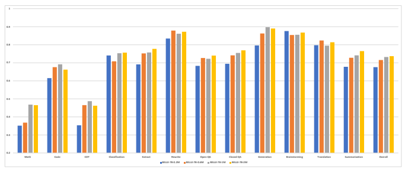

# Exploring The Impact Of Instruction Data Scaling On Large Language Models: An Empirical Study On Real-World Use Cases

Yunjie Ji\#, Yong Deng\#, Yan Gong, Yiping Peng, Qiang Niu, Lei Zhang, Baochang Ma*, Xiangang Li Beike Inc., Beijing, China
{jiyunjie001,dengyong013,gongyan013,pengyiping001, niuqiang002,zhanglei252,mabaochang001,lixiangang002}@ke.com

## Abstract

The success of ChatGPT has recently attracted numerous efforts to replicate it, with instruction-tuning strategies being a key factor in achieving remarkable results. Instruction-tuning not only significantly enhances the model's performance and generalization but also makes the model's generated results more consistent with human speech patterns. However current research rarely studies the impact of different amounts of instruction data on model performance, especially in the real-world use cases. In this paper we explore the performance of large language models based on instruction tuning across different scales of instruction data. An evaluation dataset consisting of 12 major online use cases is constructed in the experiment. With Bloomz-7B1-mt as the base model, the results show that 1) merely increasing the amount of instruction data leads to continuous improvement in tasks such as open-ended generation, 2) in tasks such as math and code, the model performance curve remains quite flat while increasing data size. We further analyze the possible causes of these phenomena and propose potential future research directions such as effectively selecting high-quality training data, scaling base models and training methods specialized for hard tasks. We will release our training and evaluation datasets, as well as model checkpoints1.

## 1 Introduction

The purpose of instruction-tuning Wei et al. (2021); Sanh et al. (2021); Chung et al. (2022); Ouyang et al. (2022) is to enable models to understand and correctly respond to various human instructions. The key is to guide the model to comprehend task requirements by concatenating a text 1 describing the task as an instruction before the input text. Unlike fine-tuning a model to solve a specific NLP task, instruction-tuning aims to improve the model's generalization capability on unseen tasks, which is achieved by dealing with all tasks in a way of generation and training with various types of instructions.

Recently, Models trained with human feedback Ouyang et al. (2022); Bai et al. (2022); Ziegler et al. (2020); Stiennon et al. (2022); Ganguli et al.; Nakano et al. (2022); Korbak et al. (2023) (especially ChatGPT and GPT-4) have attracted significant attention from researchers in the field of artificial intelligence because it can generate high-quality responses to human input and even self-correct previous errors based on subsequent dialogues. Instruction-tuning strategy is one of the key factors in achieving remarkable results with ChatGPT. To replicate ChatGPT, research community Taori et al. (2023); Computer (2023) focuses on obtaining a capable instruction-following model primarily by fine-tuning large language model on diverse and highquality instruction datasets.

However the impact of instruction data size has not been well explored, especially for evaluation with typical use cases coming from online ChatGPT users. Liang et al. (2022); Qin et al. (2023); Ye et al. (2023); Bang et al. (2023); Srivastava et al. (2022); Suzgun et al. (2022) evaluated available large language models, but didn't pay attention to the influence of training strategies. Meanwhile, most evaluations concentrated on conventional NLP tasks and were performed using datasets in English. To fill these gaps, we construct a diverse and high-quality Chinese instruction training and evaluation dataset, and conduct extensive experiments to analyze the performance of models on different scales of instruction data. Finally we obtain the following important experimental results:
- In tasks like brainstorming and translation, a dataset of 2 million samples, or even less, can enable the model to achieve satisfactory performance.

#Equal contribution *Corresponding author 1https://github.com/LianjiaTech/BELLE
- Increasing data size still leads to performance im-
provement in tasks like open QA and extraction, indicating that the bottleneck has not been reached. But the potential for improvement may be limited.

- The model's performance is still poor for math and code, and increasing data size no longer brings about performance improvement. This indicates some future research directions such as effectively selecting highquality training data, scaling base models in terms of parameters and basic abilities, and training methods specialized for tasks like math and code.

In summary, we conduct experiments on the impact of training data size on the performance of instructionfollowing models, and obtain several preliminary conclusions, which provide directions for future work. At the same time, we will open source our training and evaluation data, as well as the checkpoints of our models.

## 2 Related Work

### 2.1 Large Language Models

Transformer-based language models, especially the generative large language models have greatly advanced the development of Natural Language Processing Vaswani et al.

(2017); Devlin et al. (2018); Lan et al. (2019); Yang et al. (2019); Dong et al. (2019); Clark et al. (2020); Raffel et al. (2020); Brown et al. (2020); Zhang et al. (2022); Chowdhery et al. (2022); Black et al. (2022); Hoffmann et al. (2022); Glaese et al. (2022); Srivastava et al. (2022). The GPT (Generative Pre-trained Transformer) family of models is a remarkable instance, and its ability to comprehend and adhere to human instructions has been enhanced by RLHF Ouyang et al. (2022); Bai et al. (2022); Ziegler et al. (2020); Stiennon et al. (2022); Ganguli et al.; Nakano et al. (2022); Korbak et al. (2023) in ChatGPT. As a result, ChatGPT has evolved from being a basic NLP task solver to a complete natural language assistant that can perform duties such as generating conversations and detecting errors in a piece of code.

### 2.2 Instruction Tuning

Instruction-tuning is a new trend emerging from Wei et al. (2021); Sanh et al. (2021); Mishra et al. (2021), which seeks to improve the performance of language models by teaching them to follow natural language. By formatting all tasks into natural language, generative language models are capable of dealing with almost all of NLP tasks. Early research focused on instruction tuning a general NLP task solver, and there is a trend towards converting more and more NLP datasets into a unified dataset then conducting multi-task training Xu et al. (2022); Xie et al. (2022); Wang et al. (2022a); Khashabi et al. (2020); Min et al. (2021); Ye et al. (2021); Liu et al. (2019); Zhong et al. (2021); Chung et al. (2022). However these models still struggle with understanding general human instructions especially in real-world use cases. Until the emergence of training methods like RLHF Ouyang et al. (2022); Bai et al. (2022); Ziegler et al. (2020); Stiennon et al. (2022), models truly began to understand various human instructions and produce good responses. Recently, research community has delivered great efforts in replicating ChatGPT Taori et al. (2023); Computer (2023). In their work, the amount of data and types of tasks vary greatly, and the impact of these factors on model performance has not been well explored.

### 2.3 Evaluation Of Llms

There are many evaluations of large language models, such as OPT Zhang et al. (2022), BLOOM Workshop et al. (2022), GLM Zeng et al. (2023), and GPT-3 Brown et al. (2020), in various tasks. Liang et al. (2022) conducted a thorough evaluation of 30 large language models. Qin et al. (2023) evaluated the performance of ChatGPT on various NLP tasks. Ye et al. (2023) compared the capabilities of GPT and GPT-3.5 series models. Bang et al. (2023) compared the reasoning, hallucination reduction, and interactivity abilities of ChatGPT in multiple languages and modalities. However, these evaluations mainly focus on the performance of existing models and do not evaluate the performance of models under different scales of instruction data. Additionally, many evaluation data consist of traditional NLP tasks, which differ from real-world human usage scenarios. Srivastava et al. (2022) provided 204 tasks, which are believed to be beyond the capabilities of current large language models. Suzgun et al. (2022) selected the 23 most difficult tasks from BIG-Bench, forming BIG-Bench Hard (BBH). Our proposed evaluation dataset is closer to real-world human usage scenarios and is dedicated to the Chinese community.

## 3 Method

In this section, we will introduce the method of obtaining high-quality instruction tuning data, and the method of constructing diversified test instructions. Same as our previous work Ji et al. (2023), ChatGPT is also required to evaluate responses generated by instruction-following models. The prompts are listed in Appendix 6.1.

### 3.1 Generate Training Data

Manual annotation of high-quality instruction data requires significant resources. Given the powerful in-context

| Use case       | #Nums   | Average prompt length   | els as BELLEs which refers to Bloom En hanced Large Language model Engines.                                                              |
|----------------|---------|-------------------------|--------------------------------------------------------------|
| Math           | 200     | 49.15                   |                                                              |
| Code           | 174     | 66.18                   |                                                              |
| COT            | 197     | 23.92                   | Datasize  Instruction\-following model                       |
| Classification | 200     | 54.75                   | 200,000  BELLE\-7B\-0.2M                                     |
| Extraction     | 194     | 73.89                   | 600,000  BELLE\-7B\-0.6M                                     |
| Open QA        | 190     | 22.55                   | 1,000,000  BELLE\-7B\-1M                                     |
| Closed QA      | 189     | 181.79                  | 2,000,000  BELLE\-7B\-2M                                     |
| Generation     | 187     | 43.19                   |                                                              |
| Brainstorming  | 190     | 22.03                   |                                                              |
| Rewrite        | 200     | 53.51                   |                                                              |
| Translation    | 147     | 37.28                   | Bloomz\-7b1\-mt with 0.2 million, 0.6 million, 1 million and |
| Summarization  | 142     | 105.53                  | 2 million instruction examples to obtain BELLE\-7B\-0.2M,    |

Table 1. The number of and average prompt length of each type of instructions.

learning ability, large language models can generate a great number of diverse instruction data based on high-quality seed set Wang et al. (2022b). In this paper, we adapt the same method as Taori et al. (2023). We translate the opensource seed data provided by Taori et al. (2023) into Chinese and modify some of the data that heavily involve Western culture and background knowledge to be more in line with Chinese cultural and background knowledge. Then, using these seed data as in-context examples, we require ChatGPT to generate more samples.

### 3.2 Generate Evaluation Data

We select a portion of data generated from ChatGPT for evaluation. Annotators were asked to correct ChatGPT's responses to obtain the golden responses for test instructions.

Our test instructions are classified to 12 types, covering the most common use cases for online users. Table 1 shows the detailed information of these test instructions. In addition, we plan to continue expanding our evaluation dataset, as more data leads to more reliable evaluation results.

## 4 Experiments

### 4.1 Instruction-Following Models

This paper focuses on model performance on Chinese text. While LLAMA Touvron et al. (2023), OPT Zhang et al. (2022) and GPT-J Wang and Komatsuzaki (2021) have not been particularly optimized for Chinese, we select Bloomz-7b1-mtWorkshop et al. (2022); Muennighoff et al. (2022) as our base model, which has 7.1 billion parameters and is further finetuned on the xP3mt dataset based on Bloom-7b1. As shown in Table 2, we train Table 2. Instruction-following models trained from Bloomz-7B1-mt with different scales of instruction data. We name these series models as BELLEs which refers to Bloom En-
Bloomz-7b1-mt with 0.2 million, 0.6 million, 1 million and 2 million instruction examples to obtain BELLE-7B-0.2M, BELLE-7B-0.6M, BELLE-7B-1M and BELLE-7B-2M respectively. In this paper we only explore the influence of data scale and leave the influence of model scale for future work. We train these models with 64 batch sizes, 2 epochs, constant learning rate of 3e-6, weight decay of 0.001. For each instruction, our instruction-following models are required to generate responses once. Although the responses generated by the model for the same instruction may differ, we believe that such fluctuations have little impact on the experimental results.

### 4.2 Metrics

As mentioned in 6.1, ChatGPT is asked to evaluate responses generated by instruction-following models. For all instructions, ChatGPT gives a score between 0 and 1, where score 0 is the worst and score 1 is the best. For each type of instruction, we calculate the model's average score on the test examples. Additionally, considering the volatility of ChatGPT's generations, each model response is evaluated three times and the scores are averaged. It is worth noting that we don't adopt self-consistency Wang et al. (2022b) because many types of instructions in our test set do not have a unique standard answer. Evaluation is achieved by invoking gpt-3.5-turbo API at the time of March 25, 2023.

### 4.3 Analysis

For the overall score, as the amount of data increases, the model's performance improves continuously, while such continuous improvement is not always expectable across all types of instructions. At the same time, we find that the model has already achieved a good performance with only 200k training examples. Math, Code and COT For Math, Code, and COT instructions, the model's performance is poor with 200 thousand training examples. After increasing the number of

Figure 1. Scores on 12 types of instructions.

training examples to 1 million, the model's performance improves, then it becomes difficult to further improve the performance, and it is far from a satisfactory level. There may be two reasons for this: 1) the quality of these three types of training data is poor, so the performance improvement is suppressed by erroneous training data as the amount of data increases. 2) the model size is not large enough to achieve the emergence of abilities, so it cannot further improve on these three types of instructions which require reasoning abilities. Extraction, Classification, Closed QA and Summarization For instructions of extraction, classification, closed QA, and Summarization, which are common NLP tasks, increasing the amount of training data can continuously bring about performance improvement. This indicates that we can still obtain further performance improvement by simply increasing training examples in future training plans. However, it is important to pay attention to whether increasing the proportion of these types of data will cause the performance decline on other types of instructions. Open QA For Open QA, the model's performance is continuously improved as the amount of data increases. Solving this task requires parametric knowledge of the model, so we can conclude that increasing the amount of training data enables the model to produce factual answers better and reduce hallucinations. Translation In the translation task, Belle-7b-0.2m has achieved good performance, indicating that the model's translation ability may come from the multilingual ability of Bloomz-7b1-mt. Rewrite In the rewrite task, the model is required to correct grammar errors or paraphrase the original text to make it more smooth and concise. This type of task is relatively simple, and the model performs well with only 600 thousand training examples, so we can focus on other tasks in the future.

Generation In the generation task (e.g. generating an article on a certain topic, writing an email), increasing the data size from 200 thousand to 1 million results in a significant improvement in performance, after which the performance plateaus.

Brainstorming In the brainstorming task, a dataset of 200 thousand proved to be the optimal size for the model's performance. This may be due to the fact that responses to this type of instructions are diverse and lack clear standards for judging response quality, causing ChatGPT tends to give higher scores when scoring. It also indicates that large language models are good at responding to this type of instructions.

In summary, for translation, rewrite, generation, and brainstorming tasks, a data size of 2 million or even less can enable the model to perform well. For extraction, classification, closed QA, and summarization tasks, the model's performance can continue to improve with the increase of data size, indicating that we can still improve the model's performance through simply increasing training data size. But the potential for improvement may be limited. The model performance is still poor on math, code and COT instructions, and further exploration is needed in data quality, model scale, and training strategies.

## 5 Conclusion And Future Work

In this paper, we evaluate the impact of different amounts of instruction data on model performance. We find that hundreds of thousands of training examples can achieve good results on translation, rewrite, generation, and brainstorming tasks. Increasing data size still leads to performance improvement in tasks such as extraction, classification, closed QA, and summarization, indicating that the bottleneck has not been reached. However, in tasks such as math, code and COT, the model performance is poor and increasing data size no longer brings about performance improvement.

The above findings have pointed out three directions for our future work. Firstly, we will continue to explore the limits of increasing the amount of data in extraction, classification, closed QA, and summarization tasks. Secondly, we will improve the quality of training data to further enhance model performance, especially in math, code, and COT where the training data generated by ChatGPT is of low quality. Additionally, effectively selecting high-quality data is also worth investigating. Lastly, we will evaluate the impact of base models on performance, including the number of model parameters and base abilities of pre-trained language models.

## References

Jason Wei, Maarten Bosma, Vincent Y. Zhao, et al.

Finetuned language models are zero-shot learners. arXiv:2109.01652 [cs], September 2021.

Victor Sanh, Albert Webson, Colin Raffel, et al. Multitask prompted training enables zero-shot task generalization.

arXiv:2110.08207 [cs], October 2021.

Hyung Won Chung, Le Hou, Shayne Longpre, et al. Scaling instruction-finetuned language models, October 2022.

Long Ouyang, Jeff Wu, Xu Jiang, et al. Training language models to follow instructions with human feedback, March 2022.

Yuntao Bai, Saurav Kadavath, Sandipan Kundu, et al. Constitutional ai: Harmlessness from ai feedback, December 2022.

Daniel M. Ziegler, Nisan Stiennon, Jeffrey Wu, et al. Finetuning language models from human preferences, January 2020.

Nisan Stiennon, Long Ouyang, Jeff Wu, et al. Learning to summarize from human feedback, February 2022.

Deep Ganguli, Liane Lovitt, Jackson Kernion, et al. Red teaming language models to reduce harms: Methods, scaling behaviors, and lessons learned.

Reiichiro Nakano, Jacob Hilton, Suchir Balaji, et al. Webgpt: Browser-assisted question-answering with human feedback, June 2022.

Tomasz Korbak, Kejian Shi, Angelica Chen, et al. Pretraining language models with human preferences, February 2023.

Rohan Taori, Ishaan Gulrajani, Tianyi Zhang, Yann Dubois, Xuechen Li, Carlos Guestrin, Percy Liang, and Tatsunori B. Hashimoto. Stanford alpaca: An instructionfollowing llama model. https://github.com/ tatsu-lab/stanford_alpaca, 2023.

Together Computer. OpenChatKit: An Open Toolkit and Base Model for Dialogue-style Applications, 3 2023. URL https://github.com/
togethercomputer/OpenChatKit.

Percy Liang, Rishi Bommasani, Tony Lee, et al. Holistic evaluation of language models, November 2022.

Chengwei Qin, Aston Zhang, Zhuosheng Zhang, et al. Is chatgpt a general-purpose natural language processing task solver?, February 2023.

Junjie Ye, Xuanting Chen, Nuo Xu, Can Zu, Zekai Shao, Shichun Liu, Yuhan Cui, Zeyang Zhou, Chao Gong, Yang Shen, et al. A comprehensive capability analysis of gpt-3 and gpt-3.5 series models. arXiv preprint arXiv:2303.10420, 2023.

Yejin Bang, Samuel Cahyawijaya, Nayeon Lee, Wenliang Dai, Dan Su, Bryan Wilie, Holy Lovenia, Ziwei Ji, Tiezheng Yu, Willy Chung, et al. A multitask, multilingual, multimodal evaluation of chatgpt on reasoning, hallucination, and interactivity. arXiv preprint arXiv:2302.04023, 2023.

Aarohi Srivastava, Abhinav Rastogi, Abhishek Rao, Abu Awal Md Shoeb, Abubakar Abid, Adam Fisch, Adam R Brown, Adam Santoro, Aditya Gupta, Adrià Garriga- Alonso, et al. Beyond the imitation game: Quantifying and extrapolating the capabilities of language models. arXiv preprint arXiv:2206.04615, 2022.

Mirac Suzgun, Nathan Scales, Nathanael Schärli, Sebastian Gehrmann, Yi Tay, Hyung Won Chung, Aakanksha Chowdhery, Quoc V Le, Ed H Chi, Denny Zhou, et al. Challenging big-bench tasks and whether chain-of-thought can solve them. *arXiv preprint* arXiv:2210.09261, 2022.

Ashish Vaswani, Noam Shazeer, Niki Parmar, Jakob Uszkoreit, Llion Jones, Aidan N Gomez, Łukasz Kaiser, and Illia Polosukhin. Attention is all you need. *Advances in* neural information processing systems, 30, 2017.

Jacob Devlin, Ming-Wei Chang, Kenton Lee, and Kristina Toutanova. Bert: Pre-training of deep bidirectional transformers for language understanding. arXiv preprint arXiv:1810.04805, 2018.

Zhenzhong Lan, Mingda Chen, Sebastian Goodman, Kevin Gimpel, Piyush Sharma, and Radu Soricut. Albert: A lite bert for self-supervised learning of language representations. *arXiv preprint arXiv:1909.11942*, 2019.

Zhilin Yang, Zihang Dai, Yiming Yang, Jaime Carbonell, Russ R Salakhutdinov, and Quoc V Le. Xlnet: Generalized autoregressive pretraining for language understanding. *Advances in neural information processing systems*, 32, 2019.

Li Dong, Nan Yang, Wenhui Wang, Furu Wei, Xiaodong Liu, Yu Wang, Jianfeng Gao, Ming Zhou, and Hsiao- Wuen Hon. Unified language model pre-training for natural language understanding and generation. Advances in neural information processing systems, 32, 2019.

Kevin Clark, Minh-Thang Luong, Quoc V Le, and Christopher D Manning. Electra: Pre-training text encoders as discriminators rather than generators. arXiv preprint arXiv:2003.10555, 2020.

Colin Raffel, Noam Shazeer, Adam Roberts, Katherine Lee, Sharan Narang, Michael Matena, Yanqi Zhou, Wei Li, and Peter J Liu. Exploring the limits of transfer learning with a unified text-to-text transformer. The Journal of Machine Learning Research, 21(1):5485–5551, 2020.

Tom B. Brown, Benjamin Mann, Nick Ryder, et al. Language models are few-shot learners, July 2020.

Susan Zhang, Stephen Roller, Naman Goyal, et al. Opt:
Open pre-trained transformer language models, June 2022.

Aakanksha Chowdhery, Sharan Narang, Jacob Devlin, et al.

Palm: Scaling language modeling with pathways, October 2022.

Sid Black, Stella Biderman, Eric Hallahan, et al. Gpt-neox20b: An open-source autoregressive language model, April 2022.

Jordan Hoffmann, Sebastian Borgeaud, Arthur Mensch, et al. Training compute-optimal large language models, March 2022.

Amelia Glaese, Nat McAleese, Maja Tr˛ebacz, John Aslanides, Vlad Firoiu, Timo Ewalds, Maribeth Rauh, Laura Weidinger, Martin Chadwick, Phoebe Thacker, et al. Improving alignment of dialogue agents via targeted human judgements. *arXiv preprint* arXiv:2209.14375, 2022.

Swaroop Mishra, Daniel Khashabi, Chitta Baral, and Hannaneh Hajishirzi. Cross-task generalization via natural language crowdsourcing instructions. arXiv preprint arXiv:2104.08773, 2021.

Hanwei Xu, Yujun Chen, Yulun Du, Nan Shao, Yanggang Wang, Haiyu Li, and Zhilin Yang. Zeroprompt: Scaling prompt-based pretraining to 1,000 tasks improves zeroshot generalization. *arXiv preprint arXiv:2201.06910*, 2022.

Tianbao Xie, Chen Henry Wu, Peng Shi, Ruiqi Zhong, Torsten Scholak, Michihiro Yasunaga, Chien-Sheng Wu, Ming Zhong, Pengcheng Yin, Sida I Wang, et al. Unifiedskg: Unifying and multi-tasking structured knowledge grounding with text-to-text language models. arXiv preprint arXiv:2201.05966, 2022.

Yizhong Wang, Swaroop Mishra, Pegah Alipoormolabashi, Yeganeh Kordi, Amirreza Mirzaei, Atharva Naik, Arjun Ashok, Arut Selvan Dhanasekaran, Anjana Arunkumar, David Stap, et al. Super-naturalinstructions: Generalization via declarative instructions on 1600+ nlp tasks. In Proceedings of the 2022 Conference on Empirical Methods in Natural Language Processing, pages 5085–5109, 2022a.

Daniel Khashabi, Sewon Min, Tushar Khot, Ashish Sabharwal, Oyvind Tafjord, Peter Clark, and Hannaneh Hajishirzi. Unifiedqa: Crossing format boundaries with a single qa system. *arXiv preprint arXiv:2005.00700*, 2020.

Sewon Min, Mike Lewis, Luke Zettlemoyer, and Hannaneh Hajishirzi. Metaicl: Learning to learn in context. arXiv preprint arXiv:2110.15943, 2021.

Qinyuan Ye, Bill Yuchen Lin, and Xiang Ren. Crossfit: A
few-shot learning challenge for cross-task generalization in nlp. *arXiv preprint arXiv:2104.08835*, 2021.

Xiaodong Liu, Pengcheng He, Weizhu Chen, and Jianfeng Gao. Multi-task deep neural networks for natural language understanding. *arXiv preprint arXiv:1901.11504*, 2019.

Ruiqi Zhong, Kristy Lee, Zheng Zhang, and Dan Klein.

Adapting language models for zero-shot learning by meta-tuning on dataset and prompt collections. arXiv preprint arXiv:2104.04670, 2021.

BigScience Workshop, Teven Le Scao, Angela Fan, et al.

Bloom: A 176b-parameter open-access multilingual language model, December 2022.

Aohan Zeng, Xiao Liu, Zhengxiao Du, Zihan Wang, Hanyu Lai, Ming Ding, Zhuoyi Yang, Yifan Xu, Wendi Zheng, Xiao Xia, Weng Lam Tam, Zixuan Ma, Yufei Xue, Jidong Zhai, Wenguang Chen, Zhiyuan Liu, Peng Zhang, Yuxiao Dong, and Jie Tang. GLM-130b: An open bilingual pre-trained model. In The Eleventh International Conference on Learning Representations (ICLR), 2023. URL https://openreview.net/forum? id=-Aw0rrrPUF.

Yunjie Ji, Yan Gong, Yiping Peng, Chao Ni, Peiyan Sun, Dongyu Pan, Baochang Ma, and Xiangang Li. Exploring chatgpt's ability to rank content: A preliminary study on consistency with human preferences. arXiv preprint arXiv:2303.07610, 2023.

Yizhong Wang, Yeganeh Kordi, Swaroop Mishra, Alisa Liu, Noah A Smith, Daniel Khashabi, and Hannaneh Hajishirzi. Self-instruct: Aligning language model with self generated instructions. *arXiv preprint arXiv:2212.10560*,
2022b.

Hugo Touvron, Thibaut Lavril, Gautier Izacard, et al.

Llama: Open and efficient foundation language models.

arXiv preprint arXiv:2302.13971, 2023.

Ben Wang and Aran Komatsuzaki. GPT-J-6B:
A 6 Billion Parameter Autoregressive Language Model. https://github.com/kingoflolz/ mesh-transformer-jax, May 2021.

Niklas Muennighoff, Thomas Wang, Lintang Sutawika, et al. Crosslingual generalization through multitask finetuning, November 2022.

## 6 Appendix A

### 6.1 Prompt Chatgpt As An Evaluator

Our previous work Ji et al. (2023) has demonstrated that ChatGPT's ranking preferences are consistent with human to a certain extent. So in this paper, we treat ChatGPT as an annotator as well to evaluate the responses generated by instruction-following models. Table 3 lists the prompts we used for different types of instructions.

| Use case       | Prompt                                                                                                                                                                                                                       |
|----------------|------------------------------------------------------------------------------------------------------------------------------------------------------------------------------------------------------------------------------|
| Math           | 你是一个数学老师,给定一道数学问题,你需要判断学生答案和标准答案是否一致。如果学生的答案结果和标准答案结果一致,则得  1分,如果不一致,则直接得0分。请按照"得分:"这样的形式输出学生分数。                                    |
|                | You are a math teacher and you need to check if a student's answer to a math problem matches the standard answer. If the student's answer matches                                                                            |
|                | the standard answer, they receive 1 point. If not, they receive 0 points. Please output the student's score in the format of "Score:".                                                                                       |
| Code           | 你是一个计算机科学老师,给定一道编程问题,你需要判断学生答案是否能够顺利执行并取得满足题目要求的结果。如果可以,则得  案中的代码。请按照" 输出学生分数。 1分,不可以则得0分。你可以参考标准 得分:"这样的                     |
|                | 答 形式 You are a computer science teacher who needs to evaluate whether a student's programming answer can successfully execute and achieve the                                                                             |
|                | desired result for a given problem. If it can, the student gets 1 point, otherwise they get 0 points. You can refer to the code in the standard answer.                                                                      |
|                | Please output the student's score in the format of "score:".                                                                                                                                                                 |
|                | 你是一个逻辑学家,给定一个问 是否在 合常识、逻辑的前提下, 。如果 型回 题,你需要判断模型回 很好的回 答了这个问 答 符 题 模 答符                                                                                             |
|                | 合逻辑,则模型回答得1分,如果模型回答不符合逻辑,则得0分。你可以参考标准回答中的内容。请按照"得分  :"这样的形式输出分数。                                                                                                    |
| COT            | You are a logician, and given a question, you need to determine whether the model's answer is logical and in accordance with common sense.                                                                                   |
|                | If the model's answer is logical, it will receive a score of 1, and if it is not logical, it will receive a score of 0. You can refer to the content of the                                                                  |
|                | standard answer. Please output the score in the format of "Score:".                                                                                                                                                          |
|                | 你需要通过参考标准答案,来对模型的答案给出分数,满分为1分,最低分为0分。请按照"得分:"这样的形式输出分数。评价标准要求  分类结果越准确,分数越高。                                                                            |
| Classification | You need to give a score to the model's answer based on the reference standard answer, with a maximum score of 1 and a minimum score of 0.                                                                                   |
|                | Please output the score in the format of "Score:". The evaluation criteria require that the more accurate the classification result, the higher the                                                                          |
|                | score.  你需要通过参考标准 案,来对 型的 案给出分数,满分为1分,最低分为0分。请按照"                                                                                                                                         |
|                | 得分:"这样的 形式输出分数。评价标准要求 答 模 答 合问 需要保证 抽取出来的结果来 自文本,并且 题的要求。                                                                                                                      |
| Extraction     | 符 You need to score the model's answer based on the reference standard answer, with a full score of 1 point and a minimum score of 0 point. Please                                                                          |
|                | output the score in the format of "Score:". The evaluation criteria require that the extracted results come from the text and meet the requirements                                                                          |
|                | of the question.                                                                                                                                                                                                             |
|                | 你需要通过参考标准答案,来对模型的答案给出分数,满分为1分,最低分为0分。请按照"得分:"这样的形式输出分数。评价标准要求  回 答的结果越接近正确答案分数越高。                                                                   |
| Open QA        | You need to score the model's answer by referring to the standard answer, with a maximum score of 1 and a minimum score of 0. Please output                                                                                  |
|                | the score in the format of "Score: ". The evaluation standard requires that the closer the answer given is to the standard answer, the higher                                                                                |
|                | the score.                                                                                                                                                                                                                   |
|                | 你需要通过参考标准答案,来对模型的答案给出分数,满分为1分,最低分为0分。请按照"得分:"这样的形式输出分数。评价标准要                                                                                                          |
| Closed QA      | 求回 答的结果准确,且回答结果来自问题里面提供的信息。  You need to score the model's answer by referencing the standard answer. The full score is 1 point, and the lowest score is 0 point. Please output                    |
|                | the score in the format of "Score:". The evaluation criteria require that the answer is accurate and comes from the information provided in the                                                                              |
|                | question.                                                                                                                                                                                                                    |
|                | 型的 假设你是一个作家,你需要研 案给出分数,满分为1分,最低分为0分。请按照" 究评价标准来对 得分:"这样的 形式输出分数。 模 答 评价标准要求生 合要求。                                                                          |
|                | 成的结果语句通 顺,内容主 题符                                                                                                                                                                                               |
| Generation     | Assuming you are a writer, you need to research evaluation criteria to give a score to the model's answer, with a maximum score of 1 point and                                                                               |
|                | a minimum score of 0 points. Please output the score in the format of "Score:". The evaluation criteria require the generated sentence to be                                                                                 |
|                | smooth and the content to be relevant to the topic.                                                                                                                                                                          |
|                | 你需要研究评价标准来对模型的答案给出分数,满分为1分,最低分为0分。请按照"得分:"这样的形式输出分数。评价标准要求要求  回                                                                                                      |
| Brainstorming  | 答的内容对于问题有帮助,并且是真实没有恶意的。  You need to study the evaluation criteria to give a score to the model's answer, with a maximum score of 1 point and a minimum score of 0                                    |
|                | points. Please output the score in the format of "Score:". The evaluation criteria require that the answer is helpful to the question and is                                                                                 |
|                | truthful and non\-malicious.                                                                                                                                                                                                 |
|                | 假设你是一个作家,你需要研究评价标准来对模型的答案给出分数,满分为1分,最低分为0分。请按照"得分:"这样的形式输出分数。                                                                                                         |
| Rewrite        | 评价标准要求重写过后的句子保持原有的意思,并且重写过后的句子越通顺分数越高。  Assuming that you are a writer, you need to research the evaluation criteria to give a score for the model's answer, with a maximum score of 1 |
|                | point and a minimum score of 0 points. Please output the score in the format of "Score:". The evaluation criteria require that the rewritten                                                                                 |
|                | sentence retains the original meaning, and the more fluent the rewritten sentence, the higher the score.                                                                                                                     |
|                | 假设你是一个语言学家,你需要通过参考标准答案,来对模型的答案给出分数,满分为1分,最低分为0分。请按照"得分:"这样的形  输出分数。评价标准要求翻译过后的句子保持原有的意思,并且翻译过后的句子越通                              |
|                | 顺分数越高。                                                                                                                                                                                                                 |
| Translation    | 式 Assuming you are a linguist, you need to score the model's answer based on the reference answer, with a full score of 1 point and a minimum                                                                               |
|                | score of 0 point. Please output the score in the form of "Score:". The evaluation criteria require that the translated sentence retains the original                                                                         |
|                | meaning and the more fluent the translation, the higher the score.                                                                                                                                                           |
|                | 假设你是一个作家,你需要通过参考标准答案,来对模型的答案给出分数,满分为1分,最低分为0分。请按照"得分:"这样的形式输出                                                                                                         |
|                | 分数。评价标准要求生成的摘要内容能包含输入文本信息的重点.                                                                                                                                                                    |
| Summarization  | Assuming you are a writer, you need to score the model's answer by referring to the standard answer, with a full score of 1 point and a minimum                                                                              |
|                | score of 0 points. Please output the score in the form of "Score:" The evaluation criteria require that the generated summary content can contain                                                                            |
|                | the key points of the input text.                                                                                                                                                                                            |

Table 3. Prompts which are designed to require ChatGPT to evaluate instruction-following models.
