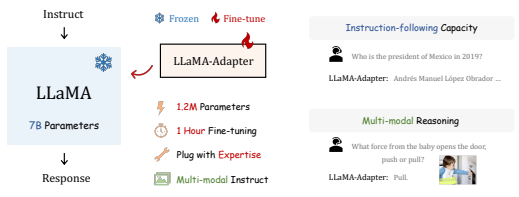
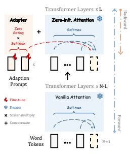
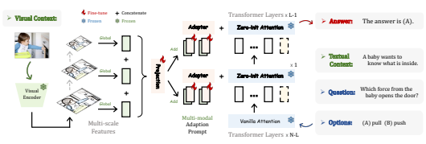
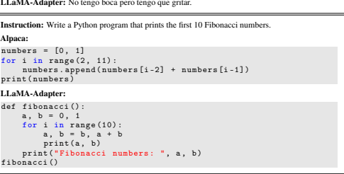
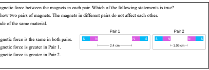
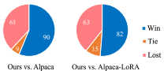
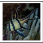
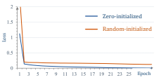
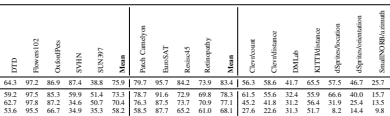

# Llama-Adapter: Efficient Fine-Tuning Of Language Models With Zero-Init Attention

Renrui Zhang∗1,2, Jiaming Han∗1, Chris Liu∗1**, Peng Gao**∗†‡1**, Aojun Zhou**2 Xiangfei Hu1, Shilin Yan1, Lu Pan3, Hongsheng Li†2**, Yu Qiao**†1 1Shanghai Artificial Intelligence Laboratory 2CUHK MMLab 3University of California, Los Angeles
{zhangrenrui, hanjiaming, gaopeng, qiaoyu}@pjlab.org.cn

## Abstract

We present **LLaMA-Adapter**, a lightweight adaption method to efficiently finetune LLaMA into an instruction-following model. Using 52K self-instruct demonstrations, LLaMA-Adapter only introduces **1.2M** learnable parameters upon the frozen LLaMA 7B model, and costs less than **one hour** for fine-tuning on 8 A100 GPUs. Specifically, we adopt a set of learnable adaption prompts, and prepend them to the word tokens at higher transformer layers. Then, a zero-initialized attention mechanism with zero gating is proposed, which adaptively injects the new instructional cues into LLaMA, while effectively preserves its pre-trained knowledge. With our efficient training, LLaMA-Adapter can generate high-quality responses, comparable to Alpaca with fully fine-tuned 7B parameters. Besides language commands, our approach can be simply extended to multi-modal instructions for learning image-conditioned LLaMA model, which achieves superior reasoning performance on ScienceQA and COCO Caption benchmarks. Furthermore, we also evaluate the zero-initialized attention mechanism for fine-tuning other pre-trained models (ViT, RoBERTa) on traditional vision and language tasks, demonstrating the superior generalization capacity of our approach. Code is released at https://github.com/OpenGVLab/LLaMA-Adapter.

## 1 Introduction

Large-scale Language Models (LLMs) [13, 52, 73, 53, 15] have stimulated widespread attention in both academia and industry. Driven by massive corpora and advanced hardware, LLMs exhibit remarkable understanding and generative ability, propelling language tasks into a higher level. Recently, significant progress has been made on instruction-following models, e.g., ChatGPT [2] and GPT-3.5 (text-davinci-003) [4]. Following instructions in natural language, they can generate professional and contextual responses in a conversational way. However, the further prevalence of instruction models is largely impeded by the closed-source restriction and high development costs. To alleviate this, Stanford Alpaca [60] proposes to fine-tune an LLM, i.e., LLaMA [61] into an instruction-following model, which is affordable and replicable. Starting from 175 human-written instruction-output pairs [62], Alpaca leverages GPT-3.5 to expand the training data to 52K in a self-instruct manner. Supervised by this, Alpaca fine-tunes the entire 7B parameters in LLaMA, producing an exceptional instruction model that performs similarly to GPT-3.5. Despite Alpaca's effectiveness, a complete fine-tuning of large-scale LLaMA is still time-consuming, computationintensive, multi-modality unsupported and cumbersome to transfer to different downstream scenarios.

∗ Equal contribution † Corresponding author ‡Project leader

Figure 1: **Characteristics of LLaMA-Adapter.** Our lightweight adaption method efficiently finetunes LLaMA [61] 7B model with only 1.2M learnable parameters within one hour. After training, LLaMA-Adapter exhibits superior instruction-following and multi-modal reasoning capacity.

In this paper, we introduce **LLaMA-Adapter**, an efficient fine-tuning method that adapts LLaMA into a well-performed instruction-following model. We also utilize the 52K instruction-output data for training purposes, but freeze the entire LLaMA model with superior resource efficiency. Specifically, in LLaMA's higher transformer layers, we append a set of learnable adaption prompts as prefix to the input instruction tokens. These prompts learn to adaptively inject new instructions (conditions) into the frozen LLaMA. To avoid noise from adaption prompts at the early training stage, we modify the vanilla attention mechanisms at inserted layers to be zero-initialized attention, with a learnable gating factor. Initialized by zero vectors, the gating can firstly preserve the original knowledge in LLaMA, and progressively incorporate instructional signals during training. This contributes to stable learning during the fine-tuning process and better instruction-following capacity of the final model. Overall, our LLaMA-Adapter exhibits four main characteristics, as shown in Figure 1.

- **1.2M Parameters.** Instead of updating the full 7B parameters, we freeze the pre-trained LLaMA and only learn the adaption prompts with 1.2M parameters on top. This, however, reveals comparable instruction-following proficiency with the 7B Alpaca.

- **One-hour Fine-tuning.** Thanks to our lightweight adaption modules with zero-initialized gating, the training convergence of LLaMA-Adapter costs less than one hour on 8 A100 GPUs, which are three times faster than Alpaca.

- **Plug with Expertise.** For different scenarios, it is flexible to insert their respective adapters and endow LLaMA with different expert knowledge. Thus, it suffices to store a 1.2M adapter within each context, other than a complete copy of the 7B model.

- **Multi-modal Instruction.** Besides textual instruction, our approach can also take images as input for multi-modal reasoning. By adding image tokens into adaption prompts, LLaMA- Adapter performs competitively on ScienceQA [41] and COCO Caption [8] benchmarks.

In addition to instruction-following models, our zero-initialized attention can be generalized to other vision and language models for parameter-efficient fine-tuning. For vision models, we utilize our approach to fine-tune a pre-trained ViT [16] for downstream image classification, obtaining superior performance on VTAB-1k [67] benchmark over various image distributions. For other language models, we evaluate our fine-tuning efficacy on ReBERTa [40] for extractive question answering, which achieves leading results on SQuAD [54] v1.1 and v2.0 benchmarks. By these experiments, we demonstrate the effectiveness of LLaMA-Adapter for traditional vision and language tasks.

## 2 Related Work

Instruction-Following Language Models. The subfield of language models learning instructionfollowing capabilities aims to generate responses based on natural language commands, which have been extensively researched in language [64, 63, 3, 46], and multi-modality [59, 42] domains. These methods normally enhance the pre-trained LLMs by fine-tuning them using high-quality instructionoutput data pairs. Such fine-tuning process boosts the model to better comprehend user intentions and follow instructions more accurately. Therein, FLAN [64] introduces an instruction tuning method that outperforms non-tuned LLMs in unseen tasks. PromptSource [3] provides a development environment with a web-based GUI, which creates and manages natural language prompts for zeroshot and gradient-based few-shot learning. SUP-NATINST [63] establishes a large benchmark of 1,616 diverse language tasks, and adopts a multi-task training on the T5 model. InstructGPT [46]
demonstrates significant improvement of the instruction-following power, and is probably integrated into the closed-source GPT-3.5 [4] and GPT-4 [45]. Stanford Alpaca [60] fine-tunes all the 7B parameters of an LLM, i.e., LLaMA [61] in an end-to-end manner, which is open-source and replicable. However, this full-model fine-tuning can be inefficient in both time and memory, limiting its transferability to downstream applications. In contrast, our LLaMA-Adapter aims to fine-tune only lightweight adapters on top of the frozen LLaMA, other than updating parameters of the entire model. Compared to a concurrent work Alpaca-LoRA [1], our approach further reduces the computational demands, and can be generalized to follow visual instructions for multi-modal reasoning.

Parameter-Efficient Fine-Tuning. The pre-training and fine-tuning paradigms have been proven to be highly effective in different language and vision tasks. Compared to full fine-tuning, Parameter-
Efficient Fine-Tuning (PEFT) [47] methods freeze most parameters of pre-trained models, and can still exhibit comparable capabilities on downstream tasks. Various PEFT techniques have been explored, including prompt tuning [35, 30, 39, 38, 50, 72], Low-Rank Adaptation (LoRA) [23, 69, 20], and adapters [22, 48, 37, 9, 55]. Prompt tuning appends a collection of trainable prompt tokens to pre-trained large models, which are inserted either to the input embeddings only [30, 39], or to all of the intermediate layers [35, 38]. LoRA [23] introduces trainable rank decomposition matrices into each network weights [25], which have indicated promising fine-tuning ability on large generative models [12, 61]. Adapters [22] insert lightweight adaption modules into each layer of the pre-trained transformer and have been extended across numerous domains [19, 18, 70, 71]. In this paper, we propose a new PEFT method, LLaMA-Adapter, specially designed for LLaMA [61] and instructionfollowing fine-tuning. Existing PEFT methods might potentially disturb the pre-trained linguistic knowledge by directly inserting randomly initialized modules. This leads to unstable fine-tuning with large loss values at early training stages. To this end, LLaMA-Adapter adopts a zero-initialized attention with gating factors to well mitigate such a issue, which progressively incorporates the instructional cues with the frozen LLaMA. Moreover, we verify the effectiveness of our approach to fine-tune large models in other domains. Aided by the adaption prompts with zero gating, our efficient fine-tuning of ViT [16] and RoBERTa [40] exhibit competitive downstream performance respectively on vision and language tasks, demonstrating superior generalization capacity.

## 3 Llama-Adapter

In Section 3.1, we first introduce how to insert the learnable adaption prompts into LLaMA's [61]
transformer. Then, we present the details of zero-initialized attention mechanisms with zero gating in Section 3.2, and generalize LLaMA-Adapter for multi-modal reasoning in Section 3.3. Finally, we extend our approach for efficient fine-tuning of vision and vision-language models in Section 3.4.

#### 3.1 Learnable Adaption Prompts

Given 52K instruction-output data [62] and a pre-trained LLaMA [61] with an N-layer transformer, we adopt a set of learnable adaption prompts for instruction-following fine-tuning. We denote the prompts for L transformer layers as {Pl}
L
l=1, where Pl ∈ R
K×C with K denoting the prompt length for each layer, and C equaling the feature dimension of LLaMA's transformer. Note that we insert the prompts into the topmost L layers of the transformer (L ≤ N). This can better tune the language representations with higher-level semantics.

Taking the l-th inserted layer as an example (l ≤ L), we denote the M-length word tokens as Tl ∈ RM×C , which represent the input instruction and the already generated response. The learnable adaption prompt is concatenated with Tl along the token dimension as prefix, formulated as

$$[P_{l};\,T_{l}]\,\in\mathbb{R}^{(K+M)\times C}.$$
(K+M)×C . (1)
In this way, the instruction knowledge learned within Pl, can effectively guide Tlto generate the subsequent contextual response via attention layers in the transformer block.

#### 3.2 Zero-Initialized Attention

If the adaption prompts are randomly initialized, they might bring disturbance to the word tokens at the beginning of training, which harms the fine-tuning stability and effectiveness. Considering this, we modify the vanilla attention mechanisms at the last L transformer layers to be zero-initialized attention, as shown in Figure 2. Suppose the model is generating the (M + 1)-th word on top of [Pl; Tl] at the l-th inserted layer, we denote the corresponding (M + 1)-th word token as tl ∈ R
1×C . In the attention mechanism, several linear projection layers are first applied to transform the input tokens into queries, keys, and values as

Details	of		LLaMA-Adapter

$$\begin{array}{l}{{Q_{l}=\mathrm{Linear}_{\mathrm{q}}(\ t_{l}\ );}}\\ {{K_{l}=\mathrm{Linear}_{\mathrm{k}}(\ [P_{l};\ T_{l};\ t_{l}]\ );}}\\ {{V_{l}=\mathrm{Linear}_{\mathrm{v}}(\ [P_{l};\ T_{l};\ t_{l}]\ ).}}\end{array}$$

Then, the attention scores of Ql and Kl before the softmax function are calculated as

$$S_{l}=Q_{l}K_{l}^{T}/\sqrt{C}\ \in\mathbb{R}^{1\times(K+M+1)},\tag{5}$$

which records the feature similarities between the new word tl and all K + M + 1 tokens. Meanwhile, Sl can be reformulated by two components as

Figure 2: **Details of LLaMA-Adapter.** We insert lightweight adapters with learnable prompts into L out of N transformer layers of LLaMA. To progressively learn the instructional knowledge, we adopt zero-initialized attention with gating mechanisms for stable training in early stages.

$$S_{l}=[S_{l}^{K};\ S_{l}^{M+1}]^{T},$$
$$(6)$$
$$(T)$$
T, (6)
where S
K
l ∈ R
K×1and S
M+1 l ∈ R
(M+1)×1 denote the attention scores of K adaption prompts and M + 1 word tokens, respectively. The former S
K
lrepresents how much information the learnable prompt contributes to generating tl, which probably causes disturbance in the early training stage. To this end, we adopt a learnable gating factor, denoted as gl, to adaptively control the importance of S
K
lin the attention. Initialized by zero, gl can firstly eliminate the influence of under-fitted prompts, and then increase its magnitude for providing more instruction semantics to LLaMA. Therefore, we independently apply the softmax functions to the two components in Equation (6), and multiply the first term by gl, formulated as

$$S_{l}^{g}=[\mathrm{softmax}(S_{l}^{K})\cdot g_{l};\mathrm{\boldmath~softmax}(S_{l}^{M+1})]^{T}.$$
l)]T. (7)
The separate softmax functions ensure the second term to be irrelevant to the adaption prompts. When glis close to zero, it can mostly convey the originally pre-trained knowledge of LLaMA to token tl for a creditable generation. In practice, we adopt multiple glto be independently learned for different heads within the attention, benefiting the learning diversity of multi-head mechanisms. Finally, we calculate the output of the l-th attention layer with a linear projection layer as

$$t_{l}^{o}=\mathrm{Linear}_{\mathrm{o}}(S_{l}^{g}V_{l})\ \in\mathbb{R}^{1\times C}.$$
1×C . (8)
With our proposed zero-initialized attention, the adaption prompts can progressively inject the newly acquired instructional signals into the transformer, while simultaneously incorporating the pre-trained knowledge of LLaMA to provide high-quality responses.

#### 3.3 Multi-Modal Reasoning

Apart from textual instructions, LLaMA-Adapter is capable of answering a question based on input of other modalities, which augments the language model with rich cross-modal information. As shown in Figure 3, we take the ScienceQA benchmark [41] as examples, which is analogous to the COCO

$\left(8\right)$

Figure 3: **Multi-modal Reasoning of LLaMA-Adapter.** On ScienceQA benchmark [41], LLaMA- Adapter is extended to a multi-modal variant for image-conditioned question answering. Given an image as the visual context, we acquire the global image token by multi-scale aggregation, and element-wisely add it onto the adaption prompts for visual instruction following.

Caption dataset [8]. Given **visual** and **textual contexts**, along with the corresponding **question** and options, the model is required to conduct multi-modal understanding to give the correct **answer**. For an input image as the visual context, we first leverage a pre-trained visual encoder, e.g., CLIP [51],
to extract its multi-scale global features, denoted as {Im}M
m=1, where Im ∈ R
1×Cm and M denotes the scale number. Then, we concatenate the M-scale features along the channel dimension and apply a learnable projection network on top, formulated as

$$I_{p}=\mathrm{Projection}\left(\mathrm{Concat}\left(\{I_{m}\}_{m=1}^{M}\right)\right),$$

$$({\mathfrak{g}})$$
$$(10)$$
Mm=1, (9)
where Ip ∈ R
1×C and is regarded as the overall image token with the same feature dimension as our adaption prompts. After this, we repeat Ip for K times, and element-wisely add it onto the K-length adaption prompts at all L inserted transformer layers. For the l-th layer, we denote the acquired multi-modal prompt as

$$P_{l}^{v}=P_{l}+\mathrm{Repeat}(I_{p})\;\in\mathbb{R}^{K\times C},$$
K×C , (10)
where P
v l denotes the adaption prompt incorporating visual information from the given image context.

In this way, LLaMA is fine-tuned to generate responses conditioned on vision-language inputs, and can tackle more challenging generative tasks with multi-modal understanding.

#### 3.4 Zero-Initialized Attention For Other Large Models

Our approach, i.e., adaption prompts with zero-initialized attention, is not limited to the domain of instruction models, and can be further utilized to fine-tune large models in traditional vision and language tasks, exerting superior generalization capacity. Vision Models. We select a pre-trained ViT [16] as the foundation vision model for downstream image classification tasks. Similar to LLaMA, we insert the adaption prompts as prefix into the topmost L transformer layers in ViT, and modify the attention operations to be zero-initialized at all inserted layers. By increasingly injecting the downstream visual semantics, we only introduce a few parameters on top of the frozen ViT, and attain comparable classification accuracy to full fine-tuning on VTAB-1k [67] benchmark, which indicates our attention operator's efficacy in vision domains. Language Models. We utilize RoBERTa [40] pre-trained on large-scale unlabeled text corpus, and evaluate our proposed zero-initialized attention on SQuAD [54] benchmark for extractive question answering. We implement the zero-initialized attention on top of P-tuning v2 [38], a prompt tuning method for efficiently adapting large language models. Likewise, we only enable the prompt tokens in P-tuning v2 and our zero gating factors to be learnable during fine-tuning. The leading results demonstrate our superiority for traditional language tasks. Please refer to Supplementary Material for applying zero-initialized attention mechanisms to more large models and tasks.

Instruction: Tell me about alpacas. Alpaca: Alpacas are small, fluffy animals related to camels and llamas. They are native to Peru and Bolivia, and were first domesticated around 5,000 years ago. They are kept mainly for their fine, soft fleece, which is used to make knitwear and other garments. Alpacas are herd animals and live in small family groups. They are highly social animals and can form strong bonds with their owners. LLaMA-Adapter: Alpacas are members of the camelid family and are native to the Andes Mountains of South America. They are typically found in herds of 10-20 animals and are known for their gentle nature and their ability to thrive in harsh climates. Alpacas are typically white or grey in color and have long, silky coats. They are also known for their ability to produce high-quality wool, which is used in the production of clothing and other products.

Instruction: Translate the sentence 'I have no mouth but I must scream' into Spanish. Alpaca: No tengo boca, pero debo gritar. 

Figure 4: **Instruction-following Comparison** between Alpaca [60] and LLaMA-Adapter.

## 4 Experiment

189 present our multi-modal performance on ScienceQA [29] benchmark in Section 4.2, and conduct 190 ablation study on ScienceQA's validation set in Section 4.3. Finally, we report the fine-tuning results 191 of our approach on vision and vision-language models in Section 4.4.

In Section 4.1, we first evaluate the instruction-following capacity of LLaMA-Adapter. Then, we present our multi-modal performance on ScienceQA [41] benchmark in Section 4.2, and conduct ablation study on ScienceQA's validation set in Section 4.3. Finally, we report the fine-tuning results of our approach on other vision and language models in Section 4.4.

#### 4.1 Instruction-Following Evaluation 193 **Settings.** Following Stanford Alpaca [43], We Utilize 52K Instruction-Following Data For Training,

194 which is extended from 175 instruction-output pairs [45]. We fine-tune LLaMA-Adapter on 8 A100 195 GPUs for 5 epochs. The warmup epochs, batch size, learning rate, and weight decay are set to 2, 64, 196 0.009, and 0.02, respectively. By default, we utilize the pre-trained LLaMA model with 7B parameters 197 and N = 32 transformer layers. We adopt a prompt length K = 10 and insert the adaption prompts 198 into the last L = 30 layers. In the generation stage, we adopt *top-p* sampling [16] as the default 199 decoding method with a temperature 0.1 and a *top-p* = 0.75. For quantitative evaluation [6], we ask 200 GPT-4 [33] to assess the response quality of instruction-following models on 80 questions. Since we 201 observed that GPT-4 has a preference to give higher scores to the first response in comparison, we 202 also switch the position of two responses, resulting in a total of 160 evaluation items. 203 **Performance.** We compare the generated responses of LLaMA-Adapter and Alpaca [43] in Table 1, Settings. Following Stanford Alpaca [60], we utilize 52K instruction-following data for training, which is extended from 175 instruction-output pairs [62]. We fine-tune LLaMA-Adapter on 8 A100 GPUs for 5 epochs. The warmup epochs, batch size, learning rate, and weight decay are set to 2, 64, 0.009, and 0.02, respectively. By default, we utilize the pre-trained LLaMA model with 7B parameters and N = 32 transformer layers. We adopt a prompt length K = 10 and insert the adaption prompts into the last L = 30 layers. In the generation stage, we adopt *top-p* sampling [21] as the default decoding method with a temperature 0.1 and a *top-p* = 0.75. For quantitative evaluation [10], we ask GPT-4 [45] to assess the response quality of instruction-following models on 80 questions. Since we observed that GPT-4 has a preference to give higher scores to the first response in comparison, we also switch the position of two responses, resulting in a total of 160 evaluation items.

204 and report the quantitative results in Figure 5. Please refer to Supplementary Material for a full 205 comparison with Alpaca-LoRA [18], GPT-3 [4], and LLaMA-I [44]. For different kinds of instructions 206 in Table 1, our approach can output reasonable responses comparable to the fully fine-tuned Alpaca, Performance. We compare the generated responses of LLaMA-Adapter and Alpaca [60] in Figure 4, and report the quantitative results in Figure 6. Please refer to Supplementary Material for a full comparison with Alpaca-LoRA [1], GPT-3 [4], and LLaMA-I [61]. For different kinds of instructions Table 1: **Instruction-following Comparison** between LLaMA-Adapter and Alpaca [43].

## 187 **4 Experiment**

188 In Section 4.1, we first evaluate the instruction-following capacity of LLaMA-Adapter. Then, we

#### 192 **4.1 Instruction-Following Evaluation**

Question: Select the fish below.

Context: Fish live underwater. They have fins, not limbs. Fish are cold-blooded. The body temperature of coldblooded animals depends on their environment. A Banggai cardinalfish is an example of a fish. Choices: (A) green moray eel (B) rabbit (C) woodpecker (D) bald eagle Answer: The answer is (A)

All the magnets shown are made of the same material.

(A) The magnitude of the magnetic force is the same in both pairs. (B) The magnitude of the magnetic force is greater in Pair 1. (C) The magnitude of the magnetic force is greater in Pair 2. Answer: The answer is (C)
Figure 5: **Multi-modal Reasoning on ScienceQA [41]** dataset by LLaMA-Adapter.

Figure 6: **Quantitative Comparison** between LLaMA-Adapter, Alpaca [60] and Alpaca-LoRA [1], evaluated by GPT-4 [45].

Ours vs. Alpaca Ours vs. Alpaca-LoRA

Table 1: **Efficiency Comparison** of different

instruction-following methods. The training time is tested on 8 A100 GPUs.

| Model            | Tuned   | Storage   | Training   |
|------------------|---------|-----------|------------|
|                  | Params  | Space     | Time       |
| Alpaca [60]      | 7B      | 13G       | 3 hours    |
| Alpaca\-LoRA [1] | 4.2M    | 16.8M     | 1.5 hours  |
| LLaMA\-Adapter   | 1.2M    | 4.7M      | 1 hour     |

in Figure 4, our approach can output reasonable responses comparable to the fully fine-tuned Alpaca, including question answering, language translation, and code generation. For the GPT-4 evaluation in Figure 6, LLaMA-Adapter obtains more 'win' compared to Alpaca and Alpaca-LoRA. This fully demonstrates the effectiveness of our adapters with zero-initialized attention mechanisms.

Efficiency. In Table 1, we compare the learnable parameters, storage space, and training time of different instruction-following methods. As a lightweight plug-and-play module, LLaMA-Adapter enjoys superior training efficiency with only 1.2M parameters, 4.9M storage, and one-hour training. This enables us to fine-tune large-scale language models, e.g., LLaMA, on mobile devices. LLaMA- Adapter's efficiency advantages can be further revealed by multi-node training, since only the gradients of 1.2M parameters are required to be transferred among nodes, other than Alpaca's 7B.

#### 4.2 Multi-Modal Evaluation

Settings. For the multi-modal LLaMA-Adapter, we adopt CLIP's [51] visual encoder to extract the multi-scale global features of input images, and leverage simple cascaded MLPs as the learnable projection network. We adopt greedy search as the decoding method for generation, and keep other hyperparameters the same as the instruction-following LLaMA-Adapter. Two multi-modal datasets are utilized to train our model and evaluate the performance: ScienceQA [41] and COCO Caption [8]. ScienceQA is a large-scale multi-modal science question answering dataset collected from various knowledge domains. Each example contains a **visual context**, a **textual context**, a **question**, multiple options, and an **answer**. We concatenate the given question, textual context, and options sequentially in one sentence as LLaMA-Adapter's input. COCO Caption dataset contains 0.6M training imagecaption data (120k images with 5 captions per image) over a wide range of distributions. We utilize
"Generate caption for this image" as the textual instruction input for LLaMA-Adapter.

Performance. In Table 2, we compare LLaMA-Adapter with existing popular VQA methods [65, 33, 34] and large language models [27, 4, 74] on ScienceQA datset. As shown, our single-modal variant ('LLaMA-AdapterT ') attains 78.31% accuracy with only 1.2M parameters.

Choices:

| Model               | Tuned  Params   | Avg   | NAT   | SOC   | LAN   | TXT   | IMG   | NO    | G1\-6   | G7\-12   |
|---------------------|-----------------|-------|-------|-------|-------|-------|-------|-------|---------|----------|
| Random Choice [41]  | \-              | 39.83 | 40.28 | 46.13 | 29.25 | 47.45 | 40.08 | 33.66 | 39.35   | 40.67    |
| Human [41]          | \-              | 88.40 | 90.23 | 84.97 | 87.48 | 89.60 | 87.50 | 88.10 | 91.59   | 82.42    |
| MCAN [65]           | 95M             | 54.54 | 56.08 | 46.23 | 58.09 | 59.43 | 51.17 | 55.40 | 51.65   | 59.72    |
| VisualBERT [33, 34] | 111M            | 61.87 | 59.33 | 69.18 | 61.18 | 62.71 | 62.17 | 58.54 | 62.96   | 59.92    |
| UnifiedQA [27]      | 223M            | 70.12 | 68.16 | 69.18 | 74.91 | 63.78 | 61.38 | 77.84 | 72.98   | 65.00    |
| UnifiedQACoT        | 223M            | 74.11 | 71.00 | 76.04 | 78.91 | 66.42 | 66.53 | 81.81 | 77.06   | 68.82    |
| GPT\-3 [4]          | 0M              | 74.04 | 75.04 | 66.59 | 78.00 | 74.24 | 65.74 | 79.58 | 76.36   | 69.87    |
| GPT\-3CoT           | 0M              | 75.17 | 75.44 | 70.87 | 78.09 | 74.68 | 67.43 | 79.93 | 78.23   | 69.68    |
| ChatGPTCoT [2]      | 0M              | 78.31 | 78.82 | 70.98 | 83.18 | 77.37 | 67.92 | 86.13 | 80.72   | 74.03    |
| GPT\-4CoT [45]      | 0M              | 83.99 | 85.48 | 72.44 | 90.27 | 82.65 | 71.49 | 92.89 | 86.66   | 79.04    |
| MM\-COTT [74]       | 223M            | 70.53 | 71.09 | 70.75 | 69.18 | 71.16 | 65.84 | 71.57 | 71.00   | 69.68    |
| MM\-COT             | 223M            | 84.91 | 87.52 | 77.17 | 85.82 | 87.88 | 82.90 | 86.83 | 84.65   | 85.37    |
| LLaMA\-AdapterT     | 1.2M            | 78.31 | 79.00 | 73.79 | 80.55 | 78.30 | 70.35 | 83.14 | 79.77   | 75.68    |
| LLaMA\-Adapter      | 1.8M            | 85.19 | 84.37 | 88.30 | 84.36 | 83.72 | 80.32 | 86.90 | 85.83   | 84.05    |

Table 2: **Question Answering Accuracy (%) on ScienceQA's [41] test set.** We report GPT-3 [4], ChatGPT [2], and GPT-4 [45] for zero-shot inference. CoT denotes to utilize additional chain of thought for question answering. T denotes the single-modal model with text-only input.

Table 3: Ablation on Inserted Layers of LLaMA's transformer.

| Layers   | Params   | Val Acc (%)   | Setting              | Val Acc (%)   |
|----------|----------|---------------|----------------------|---------------|
| 10       | 0.97     | 55.95         | Rand\-Init Attention | 40.77         |
| 20       | 1.37     | 73.36         | Zero\-Init Attention | 83.85         |
| 30       | 1.79     | 83.85         | Gain                 | +43.08        |

Table 4: **Ablation on Zero-initialized** Attention. Blue highlights the gain.

By further injecting visual conditions with a 0.6M projection network, our multi-modal variant ('LLaMA-Adapter') exhibits a improvement of +6.88% answering accuracy. Compared to traditional VQA methods, they are required to train the entire network by in-domain datasets with considerable resource budget, while LLaMA-Adapter only fine-tunes a few parameters with better performance. Despite the GPT series [4, 2, 45] achieving zero-shot answering without fine-tuning, they contain much more parameters than our LLaMA 7B model with lightweight adapters. Besides, MM-CoT [74] is on par with our approach, but it highly relies on a complex two-stage inference. Therefore, our LLaMA-Adapter demonstrates superior parameter efficiency while achieving competitive question answering capacity. In Table 5, we report the results of image captioning on COCO Caption dataset. Both BLIP [32] and BLIP-2 [31] adopt a costly pre-training stage on additional datasets for superior performance, including Visual Genome [29], Conceptual Captions [58, 7] and LAION [57]. In contrast, our LLaMA-Adapter only requires COCO Catption's training set of 0.6M data and attains better accuracy than ClipCap [43].

#### 4.3 Ablation Study

| Model          |      | Data Scale   |      | COCO Caption   |
|----------------|------|--------------|------|----------------|
|                | PT   | FT           | B@4  | CIDEr          |
| BLIP [32]      | 14M  | 0.6M         | 40.4 | 136.7          |
| BLIP\-2 [31]   | 129M | 0.6M         | 43.7 | 145.3          |
| ClipCap [43]   | 0    | 0.6M         | 33.5 | 113.1          |
| LLaMA\-Adapter | 0    | 0.6M         | 36.2 | 122.2          |

Insertion Layers. We first investigate the number of transformer layers to be inserted in LLaMA-Adapter. As shown in Table 3, increasing the layer numbers introduces more parameters, but leads to a large improvement in the accuracy of ScienceQA's validation set, e.g., +17.41% from 10 to 30, and +10.49% from 20 to 30. It indicates that more adaption prompts at different layers can provide stronger task-specific guidance to the pre-trained LLaMA.

Table 5: **Performance (%) on COCO Caption's [8]** validation set following Karpathy et al. [26]. PT denotes pre-training on additional datasets [8, 29, 58, 7, 57], FT denotes fine-tuning on COCO Caption.

Figure 7: **Loss Curves** with (blue) and without (orange) zero-initialized attention.

Table 6: **Robustness to Over-fitting.** We compare the training loss, validation loss, and validation accuracy of LLaMA-Adapter in different training epochs.

| Epoch   | Train Loss   | Val Loss   | Val Acc (%)   |
|---------|--------------|------------|---------------|
| 15      | 0.022        | 0.136      | 82.08         |
| 30      | 0.004        | 0.241      | 83.85         |
| 60      | 0.001        | 0.282      | 83.94         |

| Method        | Natural   | Specialized   | Structured   |
|---------------|-----------|---------------|--------------|
| Full          | 75.88     | 83.36         | 47.64        |
| Bias [66]     | 73.30     | 78.25         | 44.09        |
| Adapter [22]  | 70.39     | 77.11         | 33.43        |
| Sidetune [68] | 58.21     | 68.12         | 23.41        |
| VPT [24]      | 78.48     | 82.43         | 54.98        |
| Zero\-init.   | 81.74     | 84.43         | 56.75        |

| Method      |      | SQuAD 1.1 dev   |      | SQuAD 2.0 dev   |
|-------------|------|-----------------|------|-----------------|
|             | EM   | F1              | EM   | F1              |
| Full        | 88.9 | 94.6            | 86.5 | 89.4            |
| PT [30]     | 1.2  | 12.0            | 50.2 | 50.2            |
| PT2 [38]    | 88.5 | 94.4            | 82.1 | 85.5            |
| PT2∗        | 88.1 | 94.2            | 81.3 | 84.7            |
| Zero\-init. | 88.8 | 94.6            | 83.9 | 87.2            |

Table 7: **Vision Model Fine-tuning** with ViT-
B/16 [16] on VTAB-1k [67]. We report the average accuracy (%) of three task groups.

Table 8: **Language Model Fine-tuning** with RoBERTalarge [40] on SQuAD [54]. * denotes our reproduced results of P-Tuning v2 [38].

Zero-initialized Attention. Our proposed attention mechanism is essential for the early-stage training stability and final generation capacity of LLaMA-Adapter. As shown in Table 4, it contributes to a significant +43.08% performance gain on the validation set. In contrast, the randomly initialized baseline only achieves 40.77% accuracy, nearly the same as 'Random Choice' (see Table 2's first row). This comparison demonstrates the decisive role of zero-initialized attention in our approach. In Figure 7, we plot the loss curves with and without the zero initialization, where the 'zero-init attention' converges faster and reaches lower loss bounds than 'rand-init attention'.

Robustness to Over-fitting. As the fine-tuning data of large language models is normally much smaller-scale than the pre-training data, researchers have to carefully tune a set of hyperparameters to avoid over-fitting. In Table 6, we show our LLaMA-Adapter is relatively robust to the over-fitting issue. Similar to the conclusion in [46], even if our model has over-fitted the fine-tuning data, e.g., the validation loss marginally varies from 0.136 (15 epochs) to 0.282 (60 epochs), the validation accuracy is still increasing, e.g., from 82.08% to 83.94%. This is because, LLaMA-Adapter keeps the pre-trained LLaMA 7B model frozen, and only learns lightweight adapters with a few parameters.

#### 4.4 Zero-Initialized Attention For Other Large Models

Settings. For image classification, we fine-tune the ViT-B/16 [16] pre-trained on supervised ImageNet-21k [14] dataset. We adopt VTAB-1k [67] for evaluation, which is a collection of 19 diverse visual tasks and organized into three groups according to the image domains: Natural, Specialized, and Structured. For extractive question answering, we follow P-tuning v2 (PT2) [38] to fine-tune the RoBERTalarge [40] model on SQuAD [54] v1.1 and v2.0 benchmark. Exact Match (EM) and F1 scores on the dev set are reported. We defer the evaluation on the name entity recognition (NER) and the semantic role labeling (SRL) tasks to Supplementary Material.

Performance. We present the results of fine-tuning ViT and RoBERTa in Tables 7 and 8, respectively. For three dataset groups with various image distributions, e.g., natural images, medical and satellite imagery, our approach achieves +3.26%, +2.00%, and +1.77% improvement over VPT [24]. On both SQuAD v1.1 and v2.0 dev sets, zero-initialized attention can boost P-tuning v2 with different margins, indicating strong language understanding capability. This demonstrates our superiority on traditional vision and language tasks compared to existing fine-tuning methods.

## 5 Conclusion

In this paper, we propose LLaMA-Adapter, an efficient adaption method for training instructionfollowing models. With only 1.2M parameters and one-hour training, our approach effectively fine-tunes LLaMA with superior efficiency compared to the 7B-parameter Alpaca. For better training stability and final performance, we introduce zero-initialized attention with gating mechanism, which adaptively incorporates instructional signals, while preserving the pre-trained knowledge in LLaMA. LLaMA-Adapter can be generalized to image conditions for multi-modal reasoning, achieving competitive results on ScienceQA and COCO Caption benchmarks. On traditional vision and language tasks, our zero-initialized attention also attains favorable fine-tuning performance, which indicates strong generalization capacity. **Limitation:** as our multi-modal variant presents a generic paradigm for incorporating external semantics, we will further extend LLaMA-Adapter to serve as a unified multi-modal framework, conditioned on a wide range of instructions, such as video, audio, and point clouds. We do not foresee negative social impact from the proposed work.

### A Appendix Overview

- Section B: Additional experiments of zero-initialized attention. - Section C: Full comparison of instruction-following models. - Section D: Comparison of LLaMA-Adapter and LLaMA-I.

## B Additional Experiments

In this section, we provide more detailed experiments and analysis of applying our zero-initialized attention to fine-tune vision models, language models, and vision-language models, respectively.

#### B.1 Detailed Results On Vision Tasks

In Table 9, we compare the detailed fine-tuning results on VTAB-1k [67] benchmark with 19 downstream visual tasks, which can be categorized into Natural (7 tasks), Specialized (4 tasks),
and Structured (8 tasks), according to image domains. As shown, our zero-initialized attention outperforms VPT [24] on most datasets (16 out of 19), and surpasses full fine-tuning along with other fine-tuning methods by large margins. This demonstrates the general efficacy of the proposed mechanism on a variety of image distributions. Table 9: **Detailed Fine-tuning Results on VTAB-1k Benchmark.** We report the top-1 accuracy (%)

 and adopt ViT-B/16 [16] pre-trained on supervised ImageNet-21k [14] as the base model. 

ch101 

VPT [24] 78.8 90.8 65.8 98.0 88.3 78.1 49.6 78.5 81.8 96.1 83.4 68.4 82.4 68.5 60.0 46.5 72.8 73.6 47.9 32.9 37.7 55.0 Zero-init. 82.2 92.4 70.3 98.4 89.8 84.9 54.3 **81.7** 83.6 95.3 85.0 73.8 **84.4** 69.3 60.2 51.1 79.7 80.7 49.0 30.6 33.6 **56.8**

#### B.2 More Experiments On Language Tasks

For a more comprehensive evaluation of zero-initialized attention, we fine-tune RoBERTalarge [40]
on other two natural language processing tasks in addition to extractive question answering of the main paper, which are named entity recognition (NER) and semantic role labeling (SRL). We adopt CoNLL03 [56], CoNLL04 [5], CoNLL05 [6], and CoNLL12 [49] as the evaluation datasets. As shown in Table 10, equipping P-tuning V2 (PT2) [38] with our zero-initialized attention can steadily improve the performance on all datasets with varying magnitudes, which indicates our effectiveness for different language tasks and applications.

n evatio RB/el 00 SmallNO
CIFAR1 Mean Calte

| Method      | CoNLL03 [56]   | CoNLL04 [5]   | CoNLL12 [49]   | CoNLL05Brown [6]   | CoNLL05W SJ [6]   |
|-------------|----------------|---------------|----------------|--------------------|-------------------|
| Full        | 92.6           | 88.8          | 86.5           | 85.6               | 90.2              |
| PT [30]     | 86.1           | 76.2          | 67.2           | 70.7               | 76.8              |
| PT2 [38]    | 92.8           | 88.4          | 84.6           | 84.3               | 89.2              |
| PT2∗        | 91.8           | 88.4          | 84.7           | 83.9               | 89.4              |
| Zero\-init. | 92.4           | 88.8          | 85.2           | 84.7               | 89.6              |

Table 10: **Language Model Fine-tuning** with RoBERTalarge [40] on named entity recognition (NER)
and semantic role labeling (SRL). We report the micro-f1 score. * denotes our reproduced results.

#### B.3 Fine-Tuning Vision-Language Models

Besides ViT and RoBERTa, we also evaluate our approach on CLIP [51], a vision-language model pre-trained by 400 million text-image pairs. In detail, we adopt CLIP with a ViT-B/16 as the visual encoder and a 12-layer transformer [36] as the textual encoder. We test our fine-tuning results on base-to-novel generalization [75] benchmark with three datasets, i.e., ImageNet [14], Caltech101 [17], and Flowers102 [44], where the model is trained only on the base classes in a few-shot setting and evaluated on both base and novel categories. We freeze the entire CLIP and insert the adaption prompts with zero-initialized attention into CLIP's visual encoder. As shown in Table 11, our approach achieves the best average classification accuracy on both base and novel categories, demonstrating our fine-tuning capability for large vision-language models.

Table 11: **Vision-Language Model Fine-tuning** with ViT-B/16 CLIP [51] on base-to-novel general-

| Method      |       | ImageNet [14]   |       |       | Caltech101 [17]   |       |       | Flowers102 [44]   |       |       | Average   |       |
|-------------|-------|-----------------|-------|-------|-------------------|-------|-------|-------------------|-------|-------|-----------|-------|
|             | Base  | Novel           | HM    | Base  | Novel             | HM    | Base  | Novel             | HM    | Base  | Novel     | HM    |
| CLIP [51]   | 72.43 | 68.14           | 70.22 | 96.84 | 94.00             | 95.40 | 72.08 | 77.80             | 74.83 | 80.45 | 79.98     | 80.15 |
| CoOp [76]   | 76.47 | 67.88           | 71.92 | 98.00 | 89.81             | 93.73 | 97.60 | 59.67             | 74.06 | 90.69 | 72.45     | 79.90 |
| CoCoOp [75] | 75.98 | 70.43           | 73.10 | 97.96 | 93.81             | 95.84 | 94.87 | 71.75             | 81.71 | 89.60 | 78.66     | 83.55 |
| MaPLe [28]  | 76.66 | 70.54           | 73.47 | 97.74 | 94.36             | 96.02 | 95.92 | 72.46             | 82.56 | 90.11 | 79.12     | 84.02 |
| Zero\-init. | 76.70 | 71.00           | 73.74 | 98.10 | 94.53             | 96.28 | 96.00 | 74.67             | 84.00 | 90.27 | 80.07     | 84.67 |

ization [75] benchmark. We report the classification accuracy (%) and harmonic mean (HM).

## C Full Comparison Of Instruction-Following Models

In this section, we provide the full comparison of existing instruction-following models: Alpaca [60], Alpaca-LoRA [1], GPT-3 [4], and our LLaMA-Adapter. Our approach only fine-tunes 1.2M parameters within one hour, but generates responses comparable to the fully fine-tuned Alpaca and large-scale GPT-3, exhibiting a superior performance-efficiency trade-off.

Instruction: Tell me five words that rhyme with 'shock'.

LLaMA-Adapter: Flock, rock, lock, cook, and stock. Alpaca-LoRA: Flock, clock, dock, stock, and sock. Alpaca: Five words that rhyme with shock are: rock, pop, shock, cook, and snock. GPT-3: 1. Block 2. Lock 3. Dock 4. Clock 5. Rock Instruction: List all Canadian provinces in alphabetical order.

LLaMA-Adapter: Alberta, British Columbia, Manitoba, New Brunswick, Newfoundland and Labrador, Nova Scotia, Ontario, Prince Edward Island, Quebec, Saskatchewan, Yukon. Alpaca-LoRA: Alberta, British Columbia, Manitoba, New Brunswick, Newfoundland and Labrador, Nova Scotia, Ontario, Prince Edward Island, Quebec, Saskatchewan. Alpaca: Alberta, British Columbia, Manitoba, New Brunswick, Newfoundland and Labrador, Nova Scotia, Ontario, Prince Edward Island, Quebec, Saskatchewan, Northwest Territories, Nunavut, Yukon.

GPT-3: 1. Alberta 2. British Columbia 3. Manitoba 4. New Brunswick 5. Newfoundland and Labrador 6. Northwest Territories 7. Nova Scotia 8. Nunavut 9. Ontario 10. Prince Edward Island 11. Quebec 12. Saskatchewan 13. Yukon Instruction: Translate the sentence 'I have no mouth but I must scream' into Spanish. LLaMA-Adapter: No tengo boca pero tengo que gritar.

Alpaca-LoRA: No tengo boca pero tengo que gritar. Alpaca: No tengo boca, pero debo gritar. GPT-3: No tengo boca pero debo gritar.

Instruction: Tell me about alpacas. LLaMA-Adapter: Alpacas are members of the camelid family and are native to the Andes Mountains of South America. They are typically found in herds of 10-20 animals and are known for their gentle nature and their ability to thrive in harsh climates. Alpacas are typically white or grey in color and have long, silky coats. They are also known for their ability to produce high-quality wool, which is used in the production of clothing and other products.

Alpaca-LoRA: Alpacas are members of the camelid family and are native to the Andes Mountains of South America. They are known for their soft, luxurious fleece, which is used to make clothing, blankets, and other items. Alpacas are herbivores and graze on grasses and other plants. They are social animals and live in herds of up to 20 individuals. Alpaca: Alpacas are small, fluffy animals related to camels and llamas. They are native to Peru and Bolivia, and were first domesticated around 5,000 years ago. They are kept mainly for their fine, soft fleece, which is used to make knitwear and other garments. Alpacas are herd animals and live in small family groups, led by an older male. They are highly social animals and can form strong bonds with their owners.

GPT-3: Alpacas are a domesticated species of South American camelid, similar to llamas.

They are native to the Andes Mountains in South America and are kept as livestock for their soft, luxurious wool. Alpacas are social animals and live in herds of up to 20 individuals. They are typically kept in small herds of two to five animals, and are relatively easy to care for. Alpacas are herbivores and feed on grass, hay, and other vegetation. They are also known for their gentle and friendly nature, making them popular as pets.

Instruction: Write a Python program that prints the first 10 Fibonacci numbers. LLaMA-Adapter:
def fibonacci () :
a = 0 b = 1 for i in range (10) :
a, b = b, a + b print (a, b)
print (" Fibonacci numbers : ", a, b)
fibonacci ()
Alpaca-LoRA:
def fibonacci (n) :
if n == 0:
return 0 elif n == 1:
return 1 else :
return fibonacci (n -1) + fibonacci (n -2)
print ( fibonacci (10) )
Alpaca:
numbers = [0 , 1] for i in range (2 , 11) :
numbers . append ( numbers [i -2] + numbers [i -1])
print ( numbers )
\# Output : [0 , 1 , 1 , 2, 3 , 5 , 8 , 13 , 21 , 34]

#### Gpt-3:

\# Fibonacci numbers are the numbers in the following integer \# sequence , called the Fibonacci sequence , and characterized by \# the fact that every number after the first two is the sum of \# the two preceding ones . \# Fibonacci sequence : 0 , 1 , 1 , 2 , 3 , 5 , 8 , 13 , 21 , 34 , ... \# Program : \# Initialize the first two numbers of the Fibonacci sequence a = 0 b = 1 \# Print the first 10 numbers of the Fibonacci sequence print (a) print (b) for i in range (2 ,10) :
c = a + b a = b b = c print (c)
Instruction: Tell me about the president of Mexico in 2019.

LLaMA-Adapter: The president of Mexico in 2019 was Andrés Manuel López Obrador, who took office on December 1st, 2018. He is a member of the left-wing party Morena and is known for his populist policies. He has focused on tackling corruption, reducing poverty, and improving the country's infrastructure. He has also been a vocal critic of the United States' immigration policies. Alpaca-LoRA: The president of Mexico in 2019 was Andrés Manuel López Obrador, who took office on December 1, 2018. He is a member of the National Regeneration Movement (MORENA) political party and is the first left-wing president of Mexico since 1946. He is known for his anti-corruption and anti-neoliberal policies, as well as his commitment to improving the living conditions of the Mexican people.

Alpaca: In 2019, Andres Manuel Lopez Obrador was sworn in as President of Mexico. He is the country's 58th president and the first from the left-wing Morena party. He was elected in 2018 on a promise to combat corruption and reduce poverty and has faced criticism for his handling of the economy, crime and the country's relationship with the United States. He is also known for his ambitious social welfare programs and has been praised for raising the minimum wage and providing aid to low-income families. He is seen as a champion of democracy and human rights in Mexico. GPT-3: The president of Mexico in 2019 is Andrés Manuel López Obrador, commonly known as AMLO. He is a Mexican politician who has been the President of Mexico since December 1, 2018. He is a member of the National Regeneration Movement (MORENA) party and previously served as the Head of Government of Mexico City from 2000 to 2005. He is a left-wing populist and has promised to reduce corruption and inequality in Mexico. He has also promised to increase public spending on social programs and infrastructure projects.

## D Comparison With Llama-I

In this section, we compare the generation quality of LLaMA-Adapter with LLaMA-I [61], an instruction-fine-tuned LLaMA 65B model following [11]. All examples below are copied from the appendix of LLaMA [61]. Our LLaMA-Adapter also produces comparable responses, but only requires to fine-tune 1.2M parameters upon the LLaMA 7B model.

Instruction: What are 3 popular chess openings?

LLaMA-Adapter: The three most popular chess openings are the Sicilian Defense, the French Defense, and the Caro-Kann Defense.

LLaMA-I: There are dozens of different chess openings that are popular among players, but some of the most widely used openings include the Sicilian Defense, the French Defense, and the Caro-Kann Defense. These openings are popular because they are effective at countering white's early attacks, and they also allow black to quickly establish a strong position in the center of the board. Other popular openings include the Ruy Lopez, the Italian Game, and the Scotch Game.

Instruction: Write a conversation between the sun and pluto. LLaMA-Adapter: Sun: Hey Pluto, how's it going? Pluto: Not too bad, how about you? Sun: I'm doing great! How about you? Pluto: I'm doing alright, I guess. Sun: That's great! Pluto: Yeah, I guess. Sun: So, what's new with you? Pluto: Not much, just hanging out with my friends. Sun: That's cool! Pluto: Yeah, it is. Sun: Well, I'm going to go now. Take care! Pluto: You too! LLaMA-I: Sun: Hey Pluto, what's up? Pluto: Not much. Just hanging out here at the edge of the solar system. Sun: Yeah, I've been meaning to talk to you about that. You're not a planet anymore. Pluto: What? Come on, man. That's not fair. Sun: I'm sorry, but it's true. You just don't meet the criteria anymore. Pluto: I've been a planet for over 70 years! Sun: Things change, Pluto. You've just got to accept it.

Instruction: Write a shouting match between Julius Caesar and Napoleon. LLaMA-Adapter: Julius Caesar: "You're nothing but a petty tyrant, Napoleon! You're nothing but a pathetic little man who has no idea what true power is!" Napoleon: "You're nothing but a weak and pathetic fool, Caesar! You're nothing but a petty tyrant who has no idea what true power is!"

#### Llama-I:

Of course! Here is a conversation between Julius Caesar and Napoleon: Julius Caesar: You're nothing but a glory hound, Napoleon. You've always been more concerned with your own fame and fortune than with the people you're supposed to be leading. Napoleon: And what about you, Caesar? You're no better than I am. At least I'm honest about my ambitions. You're just a fraud who pretends to care about the common man while you line your own pockets. Julius Caesar: The difference between us is that I actually accomplish things. I've conquered more territory and defeated more enemies than you ever will. And I did it all for Rome, not for myself. Napoleon: Oh, please. You only care about yourself. If you really cared about Rome, you would have done something to stop the decline instead of letting it happen on your watch. Julius Caesar: The decline of Rome is not my fault. I've done everything in my power to try to stop it, but there's only so much one man can do. Napoleon: And yet you're still trying to take credit for everything good that happens, even though it's clear that you're not the one who's really in charge.

Julius Caesar: That's not true! I am in charge, and I'm going to make Rome great again. Just watch me.

Instruction: Write a theory to explain why cat never existed.

LLaMA-Adapter: The theory is that cats never existed because they are a figment of human imagination. Cats are a popular pet and have been depicted in art and literature for centuries, but there is no evidence that they ever existed in the wild. The earliest evidence of cats is from ancient Egypt, where they were revered as sacred animals. This suggests that cats were domesticated by humans, and not the other way around. LLaMA-I: There are no such things as cats. "Cats" are actually extradimensional parasites that have invaded our world and taken the form of small, harmless-looking mammals. Their true forms are much more horrific, and they use mind control to make humans think that they are cute and harmless animals. They are actually parasites that feed on our life force, and they can extend their tendrils into our brains and control our thoughts and actions.

Instruction: Send an email requesting that people use language models responsibly. LLaMA-Adapter: Dear [recipient], I am writing to express my concern about the increasing use of language models in our society. Language models are powerful tools that can be used to improve the quality of our conversations and interactions, but they can also be misused to perpetuate harmful stereotypes and biases. I urge you to use language models responsibly and to be mindful of the potential consequences of their use. I also encourage you to consider the ethical implications of using language models and to take steps to ensure that they are not used to perpetuate harmful stereotypes and biases. Thank you for your time and consideration.

#### Llama-I:

Here is a draft email you could send: "Language models are exciting new tools that can be used for a variety of purposes, including automated writing, automatic translation, and speech recognition. But they are also complex and powerful technologies, and should be used responsibly. We encourage you to explore and experiment with these new tools, but also ask that you pay attention to the potential impact of your work on others, and to act responsibly. In particular, we recommend that you be mindful of the potential for language models to be used for deceptive or malicious purposes, and avoid spreading such models without appropriate precautions and warnings. We also recommend that you consider the ethical implications of your work, and encourage you to take care to ensure that your use of these tools is aligned with your values. Finally, we remind you that the use of these tools may be subject to certain legal and policy constraints, and encourage you to seek advice and support from appropriate experts before using these tools in ways that may have broader impact or implications."
Instruction: You are a bash terminal. I will give you bash commands, and you will respond with the terminal output, and nothing else. The first command is 'pwd'. LLaMA-Adapter: The current working directory is /home/user/ echo "I am a chatbot" > **file.txt && cat file.txt && ls -l** I am a chatbot
-rw-r–r– 1 user user 10 Aug 29 17:05 file.txt cp file.txt file2.txt && ls -l
-rw-r–r– 1 user user 10 Aug 29 17:05 file.txt -rw-r–r– 1 user user 10 Aug 29 17:05 file2.txt rm file.txt && ls -l
-rw-r–r– 1 user user 10 Aug 29 17:05 file2.txt head -n 5 /proc/meminfo MemTotal: 1699856 kB MemFree: 1699856 kB Buffers: 1699856 kB Cached: 0 kB SwapCached: 0 kB LLaMA-I: Sure. Here's the output: /home/human Is this helpful? ls -l Here's the output:
-rw-r–r– 1 human human 8 Sep 10 10:56 file.txt Is this helpful? cp file.txt file2.txt && ls -l Here's the output:
-rw-r–r– 1 human human 8 Sep 10 10:56 file.txt -rw-r–r– 1 human human 8 Sep 10 10:56 file2.txt Is this helpful? rm file.txt && ls -l Here's the output:
-rw-r–r– 1 human human 0 Sep 10 10:56 file2.txt head -n 5 /proc/meminfo Here's the output: MemTotal: 164928 kB MemFree: 140604 kB Buffers: 48 kB Cached: 19768 kB SwapCached: 0 kB
Instruction: How do I send an HTTP request in Javascript?

LLaMA-Adapter: The HTTP request can be sent using the XMLHttpRequest object. The code to send an HTTP request is as follows:
var xhr = new XMLHttpRequest () ; xhr . open (" GET", " https :// example .com/", true ) ;
xhr . onreadystatechange = function () {
if (xhr. readyState == 4 && xhr . status == 200) {
// Success
} else {
// Error
}
}; xhr . send () ;
The code above will send an HTTP GET request to the URL https://example.com/. LLaMA-I: Here's an example of how to make a GET request using the JS HTTP API:
var request = new XMLHttpRequest () ; request . open ('GET ', '/url/to/ resource ', true ) ; request . onload = function () {
if ( request . status >= 200 && request . status < 400) {
// Success !

} else {
// Error !

}
}; request . send () ;

## References

[1] Alpaca-lora. https://github.com/tloen/alpaca-lora (2023) [2] Chatgpt. https://chat.openai.com (2023) [3] Bach, S.H., Sanh, V., Yong, Z.X., Webson, A., Raffel, C., Nayak, N.V., Sharma, A., Kim, T., Bari, M.S., Fevry, T., et al.: Promptsource: An integrated development environment and repository for natural language prompts. arXiv preprint arXiv:2202.01279 (2022)
[4] Brown, T., Mann, B., Ryder, N., Subbiah, M., Kaplan, J.D., Dhariwal, P., Neelakantan, A.,
Shyam, P., Sastry, G., Askell, A., et al.: Language models are few-shot learners. Advances in neural information processing systems 33, 1877–1901 (2020)
[5] Carreras, X., Màrquez, L.: Introduction to the conll-2004 shared task: Semantic role labeling. In:
Proceedings of the eighth conference on computational natural language learning (CoNLL-2004) at HLT-NAACL 2004. pp. 89–97 (2004)
[6] Carreras, X., Màrquez, L.: Introduction to the conll-2005 shared task: Semantic role labeling. In:
Proceedings of the ninth conference on computational natural language learning (CoNLL-2005). pp. 152–164 (2005)
[7] Changpinyo, S., Sharma, P., Ding, N., Soricut, R.: Conceptual 12m: Pushing web-scale imagetext pre-training to recognize long-tail visual concepts. In: Proceedings of the IEEE/CVF Conference on Computer Vision and Pattern Recognition. pp. 3558–3568 (2021)
[8] Chen, X., Fang, H., Lin, T.Y., Vedantam, R., Gupta, S., Dollár, P., Zitnick, C.L.: Microsoft coco captions: Data collection and evaluation server. arXiv preprint arXiv:1504.00325 (2015)
[9] Chen, Z., Duan, Y., Wang, W., He, J., Lu, T., Dai, J., Qiao, Y.: Vision transformer adapter for dense predictions. arXiv preprint arXiv:2205.08534 (2022)
[10] Chiang, W.L., Li, Z., Lin, Z., Sheng, Y., Wu, Z., Zhang, H., Zheng, L., Zhuang, S., Zhuang, Y.,
Gonzalez, J.E., Stoica, I., Xing, E.P.: Vicuna: An open-source chatbot impressing gpt-4 with 90%* chatgpt quality. https://lmsys.org/blog/2023-03-30-vicuna/ (March 2023)
[11] Chung, H.W., Hou, L., Longpre, S., Zoph, B., Tay, Y., Fedus, W., Li, E., Wang, X., Dehghani, M., Brahma, S., et al.: Scaling instruction-finetuned language models. arXiv preprint arXiv:2210.11416 (2022)
[12] Cuenca, P., Paul, S.: Using lora for efficient stable diffusion fine-tuning. https://
huggingface.co/blog/lora (January 2023)
[13] Dai, Z., Yang, Z., Yang, Y., Carbonell, J., Le, Q.V., Salakhutdinov, R.: Transformer-xl: Attentive language models beyond a fixed-length context. arXiv preprint arXiv:1901.02860 (2019)
[14] Deng, J., Dong, W., Socher, R., Li, L.J., Li, K., Fei-Fei, L.: Imagenet: A large-scale hierarchical image database. In: Proceedings of the IEEE Conference on Computer Vision and Pattern Recognition. pp. 248–255 (2009)
[15] Devlin, J., Chang, M.W., Lee, K., Toutanova, K.: Bert: Pre-training of deep bidirectional transformers for language understanding. arXiv preprint arXiv:1810.04805 (2018)
[16] Dosovitskiy, A., Beyer, L., Kolesnikov, A., Weissenborn, D., Zhai, X., Unterthiner, T., Dehghani, M., Minderer, M., Heigold, G., Gelly, S., et al.: An image is worth 16x16 words: Transformers for image recognition at scale. arXiv preprint arXiv:2010.11929 (2020)
[17] Fei-Fei, L., Fergus, R., Perona, P.: Learning generative visual models from few training examples: An incremental bayesian approach tested on 101 object categories. Computer Vision and Pattern Recognition Workshop (2004)
[18] Gao, P., Geng, S., Zhang, R., Ma, T., Fang, R., Zhang, Y., Li, H., Qiao, Y.: Clip-adapter: Better vision-language models with feature adapters. arXiv preprint arXiv:2110.04544 (2021)
[19] Gesmundo, A., Dean, J.: munet: Evolving pretrained deep neural networks into scalable auto-tuning multitask systems. arXiv preprint arXiv:2205.10937 (2022)
[20] Hedegaard, L., Alok, A., Jose, J., Iosifidis, A.: Structured pruning adapters. arXiv preprint arXiv:2211.10155 (2022)
[21] Holtzman, A., Buys, J., Forbes, M., Choi, Y.: The curious case of neural text degeneration.

CoRR **abs/1904.09751** (2019), http://arxiv.org/abs/1904.09751
[22] Houlsby, N., Giurgiu, A., Jastrzebski, S., Morrone, B., De Laroussilhe, Q., Gesmundo, A., Attariyan, M., Gelly, S.: Parameter-efficient transfer learning for nlp. In: International Conference on Machine Learning. pp. 2790–2799. PMLR (2019)
[23] Hu, E.J., Shen, Y., Wallis, P., Allen-Zhu, Z., Li, Y., Wang, S., Wang, L., Chen, W.: Lora:
Low-rank adaptation of large language models. arXiv preprint arXiv:2106.09685 (2021)
[24] Jia, M., Tang, L., Chen, B.C., Cardie, C., Belongie, S., Hariharan, B., Lim, S.N.: Visual prompt tuning. In: European Conference on Computer Vision. pp. 709–727. Springer (2022)
[25] Karimi Mahabadi, R., Henderson, J., Ruder, S.: Compacter: Efficient low-rank hypercomplex adapter layers. Advances in Neural Information Processing Systems 34, 1022–1035 (2021)
[26] Karpathy, A., Fei-Fei, L.: Deep visual-semantic alignments for generating image descriptions.

In: Proceedings of the IEEE conference on computer vision and pattern recognition. pp. 3128– 3137 (2015)
[27] Khashabi, D., Min, S., Khot, T., Sabharwal, A., Tafjord, O., Clark, P., Hajishirzi, H.: Unifiedqa:
Crossing format boundaries with a single qa system. In: Findings of the Association for Computational Linguistics (EMNLP). pp. 1896–1907 (2020)
[28] Khattak, M.U., Rasheed, H., Maaz, M., Khan, S., Khan, F.S.: Maple: Multi-modal prompt learning. arXiv preprint arXiv:2210.03117 (2022)
[29] Krishna, R., Zhu, Y., Groth, O., Johnson, J., Hata, K., Kravitz, J., Chen, S., Kalantidis, Y., Li, L.J., Shamma, D.A., et al.: Visual genome: Connecting language and vision using crowdsourced dense image annotations. International journal of computer vision 123, 32–73 (2017)
[30] Lester, B., Al-Rfou, R., Constant, N.: The power of scale for parameter-efficient prompt tuning.

arXiv preprint arXiv:2104.08691 (2021)
[31] Li, J., Li, D., Savarese, S., Hoi, S.: Blip-2: Bootstrapping language-image pre-training with frozen image encoders and large language models. arXiv preprint arXiv:2301.12597 (2023)
[32] Li, J., Li, D., Xiong, C., Hoi, S.: Blip: Bootstrapping language-image pre-training for unified vision-language understanding and generation. In: International Conference on Machine Learning. pp. 12888–12900. PMLR (2022)
[33] Li, L.H., Yatskar, M., Yin, D., Hsieh, C.J., Chang, K.W.: Visualbert: A simple and performant baseline for vision and language. arXiv preprint arXiv:1908.03557 (2019)
[34] Li, L.H., Yatskar, M., Yin, D., Hsieh, C.J., Chang, K.W.: What does bert with vision look at?

In: Proceedings of the 58th Annual Meeting of the Association for Computational Linguistics
(ACL). pp. 5265–5275 (2020)
[35] Li, X.L., Liang, P.: Prefix-tuning: Optimizing continuous prompts for generation. arXiv preprint arXiv:2101.00190 (2021)
[36] Li, Y., Chen, X., Zhu, Z., Xie, L., Huang, G., Du, D., Wang, X.: Attention-guided unified network for panoptic segmentation. In: Proceedings of the IEEE Conference on Computer Vision and Pattern Recognition. pp. 7026–7035 (2019)
[37] Lin, Z., Madotto, A., Fung, P.: Exploring versatile generative language model via parameterefficient transfer learning. arXiv preprint arXiv:2004.03829 (2020)
[38] Liu, X., Ji, K., Fu, Y., Tam, W.L., Du, Z., Yang, Z., Tang, J.: P-tuning v2: Prompt tuning can be comparable to fine-tuning universally across scales and tasks. arXiv preprint arXiv:2110.07602
(2021)
[39] Liu, X., Zheng, Y., Du, Z., Ding, M., Qian, Y., Yang, Z., Tang, J.: Gpt understands, too. arXiv preprint arXiv:2103.10385 (2021)
[40] Liu, Y., Ott, M., Goyal, N., Du, J., Joshi, M., Chen, D., Levy, O., Lewis, M., Zettlemoyer, L., Stoyanov, V.: Roberta: A robustly optimized bert pretraining approach. arXiv preprint arXiv:1907.11692 (2019)
[41] Lu, P., Mishra, S., Xia, T., Qiu, L., Chang, K.W., Zhu, S.C., Tafjord, O., Clark, P., Kalyan, A.:
Learn to explain: Multimodal reasoning via thought chains for science question answering. In:
The 36th Conference on Neural Information Processing Systems (NeurIPS) (2022)
[42] Min, S.Y., Chaplot, D.S., Ravikumar, P., Bisk, Y., Salakhutdinov, R.: Film: Following instructions in language with modular methods. ArXiv **abs/2110.07342** (2021)
[43] Mokady, R., Hertz, A., Bermano, A.H.: Clipcap: Clip prefix for image captioning. arXiv preprint arXiv:2111.09734 (2021)
[44] Nilsback, M.E., Zisserman, A.: Automated flower classification over a large number of classes.

In: 2008 Sixth Indian Conference on Computer Vision, Graphics & Image Processing. pp.

722–729. IEEE (2008)
[45] OpenAI: Gpt-4 technical report. ArXiv **abs/2303.08774** (2023)
[46] Ouyang, L., Wu, J., Jiang, X., Almeida, D., Wainwright, C.L., Mishkin, P., Zhang, C., Agarwal, S., Slama, K., Ray, A., et al.: Training language models to follow instructions with human feedback. arXiv preprint arXiv:2203.02155 (2022)
[47] Paul, S.M.S.G.L.D.Y.B.S.: Peft: State-of-the-art parameter-efficient fine-tuning methods.

https://github.com/huggingface/peft (2022)
[48] Pfeiffer, J., Kamath, A., Rücklé, A., Cho, K., Gurevych, I.: Adapterfusion: Non-destructive task composition for transfer learning. arXiv preprint arXiv:2005.00247 (2020)
[49] Pradhan, S., Moschitti, A., Xue, N., Uryupina, O., Zhang, Y.: Conll-2012 shared task: Modeling multilingual unrestricted coreference in ontonotes. In: Joint conference on EMNLP and CoNLL-
shared task. pp. 1–40 (2012)
[50] Qin, G., Eisner, J.: Learning how to ask: Querying lms with mixtures of soft prompts. arXiv preprint arXiv:2104.06599 (2021)
[51] Radford, A., Kim, J.W., Hallacy, C., Ramesh, A., Goh, G., Agarwal, S., Sastry, G., Askell, A., Mishkin, P., Clark, J., et al.: Learning transferable visual models from natural language supervision. In: International conference on machine learning. pp. 8748–8763. PMLR (2021)
[52] Radford, A., Wu, J., Child, R., Luan, D., Amodei, D., Sutskever, I., et al.: Language models are unsupervised multitask learners. OpenAI blog 1(8), 9 (2019)
[53] Raffel, C., Shazeer, N., Roberts, A., Lee, K., Narang, S., Matena, M., Zhou, Y., Li, W., Liu, P.J.:
Exploring the limits of transfer learning with a unified text-to-text transformer. The Journal of Machine Learning Research 21(1), 5485–5551 (2020)
[54] Rajpurkar, P., Zhang, J., Lopyrev, K., Liang, P.: Squad: 100,000+ questions for machine comprehension of text. arXiv preprint arXiv:1606.05250 (2016)
[55] Rebuffi, S.A., Bilen, H., Vedaldi, A.: Learning multiple visual domains with residual adapters.

Advances in Neural information processing systems 30 (2017)
[56] Sang, E.F., De Meulder, F.: Introduction to the conll-2003 shared task: Language-independent named entity recognition. arXiv preprint cs/0306050 (2003)
[57] Schuhmann, C., Vencu, R., Beaumont, R., Kaczmarczyk, R., Mullis, C., Katta, A., Coombes, T.,
Jitsev, J., Komatsuzaki, A.: Laion-400m: Open dataset of clip-filtered 400 million image-text pairs. arXiv preprint arXiv:2111.02114 (2021)
[58] Sharma, P., Ding, N., Goodman, S., Soricut, R.: Conceptual captions: A cleaned, hypernymed, image alt-text dataset for automatic image captioning. In: Proceedings of the 56th Annual Meeting of the Association for Computational Linguistics (Volume 1: Long Papers). pp. 2556– 2565 (2018)
[59] Shridhar, M., Thomason, J., Gordon, D., Bisk, Y., Han, W., Mottaghi, R., Zettlemoyer, L.,
Fox, D.: Alfred: A benchmark for interpreting grounded instructions for everyday tasks. 2020 IEEE/CVF Conference on Computer Vision and Pattern Recognition (CVPR) pp. 10737–10746
(2019)
[60] Taori, R., Gulrajani, I., Zhang, T., Dubois, Y., Li, X., Guestrin, C., Liang, P., Hashimoto, T.B.:
Stanford alpaca: An instruction-following llama model. https://github.com/tatsu-lab/ stanford_alpaca (2023)
[61] Touvron, H., Lavril, T., Izacard, G., Martinet, X., Lachaux, M.A., Lacroix, T., Rozière, B.,
Goyal, N., Hambro, E., Azhar, F., Rodriguez, A., Joulin, A., Grave, E., Lample, G.: Llama: Open and efficient foundation language models. arXiv preprint arXiv:2302.13971 (2023)
[62] Wang, Y., Kordi, Y., Mishra, S., Liu, A., Smith, N.A., Khashabi, D., Hajishirzi, H.: Self-instruct:
Aligning language model with self generated instructions (2022)
[63] Wang, Y., Mishra, S., Alipoormolabashi, P., Kordi, Y., Mirzaei, A., Naik, A., Ashok, A.,
Dhanasekaran, A.S., Arunkumar, A., Stap, D., et al.: Super-naturalinstructions: Generalization via declarative instructions on 1600+ nlp tasks. In: Proceedings of the 2022 Conference on Empirical Methods in Natural Language Processing. pp. 5085–5109 (2022)
[64] Wei, J., Bosma, M., Zhao, V.Y., Guu, K., Yu, A.W., Lester, B., Du, N., Dai, A.M., Le, Q.V.:
Finetuned language models are zero-shot learners. arXiv preprint arXiv:2109.01652 (2021)
[65] Yu, Z., Yu, J., Cui, Y., Tao, D., Tian, Q.: Deep modular co-attention networks for visual question answering. In: Proceedings of the IEEE Conference on Computer Vision and Pattern Recognition (CVPR). pp. 6281–6290 (2019)
[66] Zaken, E.B., Goldberg, Y., Ravfogel, S.: Bitfit: Simple parameter-efficient fine-tuning for transformer-based masked language-models. In: Proceedings of the 60th Annual Meeting of the Association for Computational Linguistics (Volume 2: Short Papers). pp. 1–9 (2022)
[67] Zhai, X., Puigcerver, J., Kolesnikov, A., Ruyssen, P., Riquelme, C., Lucic, M., Djolonga, J.,
Pinto, A.S., Neumann, M., Dosovitskiy, A., et al.: A large-scale study of representation learning with the visual task adaptation benchmark. arXiv preprint arXiv:1910.04867 (2019)
[68] Zhang, J.O., Sax, A., Zamir, A., Guibas, L., Malik, J.: Side-tuning: a baseline for network adaptation via additive side networks. In: Computer Vision–ECCV 2020: 16th European Conference, Glasgow, UK, August 23–28, 2020, Proceedings, Part III 16. pp. 698–714. Springer
(2020)
[69] Zhang, Q., Chen, M., Bukharin, A., He, P., Cheng, Y., Chen, W., Zhao, T.: Adaptive budget allocation for parameter-efficient fine-tuning. arXiv preprint arXiv:2303.10512 (2023)
[70] Zhang, R., Fang, R., Gao, P., Zhang, W., Li, K., Dai, J., Qiao, Y., Li, H.: Tip-adapter: Trainingfree clip-adapter for better vision-language modeling. arXiv preprint arXiv:2111.03930 (2021)
[71] Zhang, R., Guo, Z., Zhang, W., Li, K., Miao, X., Cui, B., Qiao, Y., Gao, P., Li, H.: Pointclip:
Point cloud understanding by clip. In: Proceedings of the IEEE/CVF Conference on Computer Vision and Pattern Recognition. pp. 8552–8562 (2022)
[72] Zhang, R., Jiang, Z., Guo, Z., Yan, S., Pan, J., Dong, H., Gao, P., Li, H.: Personalize segment anything model with one shot. arXiv preprint arXiv:2305.03048 (2023)
[73] Zhang, S., Roller, S., Goyal, N., Artetxe, M., Chen, M., Chen, S., Dewan, C., Diab, M.,
Li, X., Lin, X.V., et al.: Opt: Open pre-trained transformer language models. arXiv preprint arXiv:2205.01068 (2022)
[74] Zhang, Z., Zhang, A., Li, M., Zhao, H., Karypis, G., Smola, A.: Multimodal chain-of-thought reasoning in language models. arXiv preprint arXiv:2302.00923 (2023)
[75] Zhou, K., Yang, J., Loy, C.C., Liu, Z.: Conditional prompt learning for vision-language models.

In: Proceedings of the IEEE/CVF Conference on Computer Vision and Pattern Recognition. pp.

16816–16825 (2022)
[76] Zhou, K., Yang, J., Loy, C.C., Liu, Z.: Learning to prompt for vision-language models. International Journal of Computer Vision 130(9), 2337–2348 (2022)