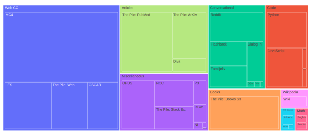
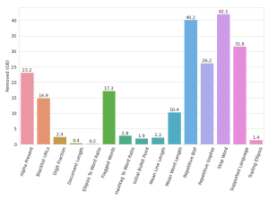
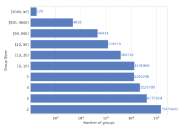
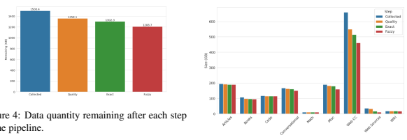
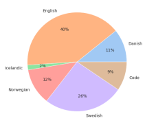
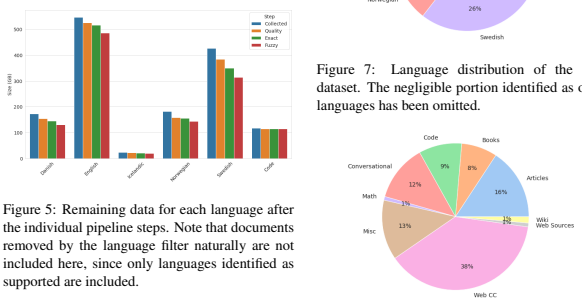

# The Nordic Pile: A 1.2Tb Nordic Dataset For Language Modeling

Joey Ohman, Severine Verlinden, Ariel Ekgren, ¨ ? **Amaru Cuba Gyllensten, Tim Isbister,**
Magnus Sahlgren AI Sweden
?Corresponding author: ariel.ekgren@ai.se Evangelia Gogoulou, Fredrik Carlsson RISE

## Abstract

Pre-training Large Language Models
(LLMs) require massive amounts of text data, and the performance of the LLMs typically correlates with the scale and quality of the datasets. This means that it may be challenging to build LLMs for smaller languages such as Nordic ones, where the availability of text corpora is limited. In order to facilitate the development of the LLMS in the Nordic languages, we curate a high-quality dataset consisting of 1.2TB of text, in all of the major North Germanic languages (Danish, Icelandic, Norwegian, and Swedish), as well as some high-quality English data. This paper details our considerations and processes for collecting, cleaning, and filtering the dataset.

## 1 Introduction

Recent work on Large Language Models (LLMs) show that for current architectures, model performance is strongly correlated with its scale (Brown et al., 2020; Rae et al., 2021; Black et al., 2022; BigScience, 2022; Chowdhery et al., 2022), with some capabilities emerging only past a certain parameter count. However, with the constantly growing model architectures, the optimal dataset size and required to compute increases in a proportional manner (Ghorbani et al., 2022; Hoffmann et al., 2022). This suggests that access to a massive dataset is a fundamental requirement for pre-training such LLMs. For lower-resourced languages, this may be a limiting factor, which often leads practitioners to rely on English or multilingual models.

For the languages in the North Germanic language group, there is limited open access to large textual datasets. This may be a limiting factor for the development of LLMs for these languages.

We therefore create a training dataset consisting of 1.2TB of high-quality multilingual texts in Danish, English, Icelandic, Norwegian, and Swedish. We refer to the dataset as **The Nordic Pile**, since the collection process has been inspired by its English predecessor The Pile (Gao et al., 2021). This paper details our considerations and processes for collecting, cleaning, and filtering the dataset in order to build a well-performing Nordic LLM.

## 2 Related Work

The rapid progress within the field of Natural Language Processing (NLP), has to a great extent benefited from having access to open datasets. These are often derived from Common Crawl1, such as C4 (Raffel et al., 2020), OSCAR (Suarez et al., ´ 2019; Ortiz Suarez et al., 2020) and The Pile (Gao ´ et al., 2021). While the majority of these datasets have included some form of quality filtering and deduplication, recent work has applied more aggressive filters and deduplication processes to their datasets prior to LLM pre-training.

Wenzek et al. (2020) propose an automatic pipeline for extracting massive high-quality monolingual datasets from Common Crawl. The pipeline includes deduplication and language identification using fastText (Joulin et al., 2016b),
and is extended by removing low-quality documents, using a small Kneser-Ney language model trained on Wikipedia. The authors show that their filtering process results in better model performance.

Brown et al. (2020) present GPT-3 and describes their corpus, which is a filtered and deduplicated version of Common Crawl, extended with several curated high-quality datasets. Rae et al.

(2021) train Gopher on their cleaned corpus MassiveText, a diverse dataset with a large portion de-

1commoncrawl.org/the-data/

Figure 1: Tree map visualizing our final dataset.

rived from web data. Their dataset pipeline con-

 sists of six stages: content filtering, text extraction, quality filtering, repetition removal, document deduplication, and test-set filtering. Laurenc¸on et al. (2022) also perform thorough quality filtering to create their 1.6TB multilingual ROOTS dataset.

Lee et al. (2022) extensively experiment with two different deduplication algorithms, MinHash Locality Sensitive Hashing (MinHash LSH) and Exact Substring Matching, and evaluate their effects by training LLMs, showing that deduplication indeed improves the model performance.

Our data pipeline is heavily inspired by the related literature, and parts of the above work are hence revisited and further explained in Section 4.

## 3 Data Collection

When collecting language modeling datasets, both quality and quantity are vital. The largest language models are often pre-trained on more than 1TB of text, with higher quality typically yielding better-performing models. In order to collect these massive amounts of data, manual methods are infeasible. Therefore, The Nordic Pile is composed mostly of existing sources, with a large portion of these originating from derivatives of Common Crawl data, such as OSCAR (Suarez et al., ´ 2019; Ortiz Suarez et al., 2020) and Multilingual ´ C4 (mC4) (Xue et al., 2021), which is a languagefiltered version of C4 (Raffel et al., 2020).

In order to ensure the versatility of models trained on this dataset, we strive for a high degree of diversity in the data. This entails collecting data not only from Common Crawl, but also from other categories of data, such as conversational forums, academic articles, books, code, task-related datasets, and more. While most of the data originate from public pre-curated datasets, parts of The Nordic Pile were scraped using the Trafilatura library (Barbaresi, 2021) or curated from other sources. For instance, after downloading the Reddit data from Pushshift (Baumgartner et al., 2020), we constructed conversational trees in order to enable sampling of sequential conversations. Other examples involve building and translating templates for language-parallel sentences from OPUS2(Tiedemann and Nygaard, 2004) or generated mathematical tasks3(Saxton et al., 2019).

Our data sources can be divided into the following nine categories, based on their domains and quality, illustrated in Figure 1:
- **Articles:** Academic papers. - **Books:** High-quality books, e.g. fiction, novels.

- **Code:** Code in the programming languages Bash, JavaScript, Python, and SQL.

- **Conversational:** Primarily social forums, such as Reddit.

- **Math:** Mathematical problems and solutions.

- **Miscellaneous:** Data which do not belong in any other category, often task-specific, such as parallel data.

2opus.nlpl.eu/index.php 3github.com/deepmind/mathematics\
textunderscoredataset
- **Web CC:** Web data derived from Common Crawl.

- **Web Sources:** Web data from other sources, e.g. scraping.

- **Wikipedia:** Official Wikipedia dumps.

A complete overview of our collected resources is available in Appendix C.

The inclusion of multiple datasets from the same domain inherently introduces overlaps between datasets, which is sub-optimal for efficient pre-training. Our method to address this issue is explained in Sections 4.4 and 4.6. All collected documents are formatted consistently in the JSON
Lines4format as a preparation for further data processing.

## 4 Data Processing Pipeline

Our data processing pipeline consists of 7 steps:
1. normalization, 2. metrics, 3. quality filtering, 4. exact deduplication, 5. language segmentation, 6. fuzzy deduplication, 7. merging.

Each of these steps are described in more detail below. All of these steps, except for deduplication and merging, are done completely on the document-level, and are thus embarrassingly parallel. The source code for the first 3 steps5and 4 last steps6is publicly available on GitHub.

### 4.1 Normalization

This step ensures that documents are consistently encoded, and perform the following operations:
Non-printing character removal removes unwanted characters that may be hidden in the document, for instance, control characters such as soft hyphens or non-breaking spaces.

Whitespace normalization converts any form of whitespace to a standard whitespace.

Unicode normalization of the text using NFC
Unicode normalization7. The motivation to opt for NFC is its non-destructive transformation that maintains a consistent and informative format.

### 4.2 Metrics

After normalizing the text, document-level metrics are added as metadata. This is primarily done to satisfy prerequisites of the following stages of the data processing pipeline, as some of these are later required. Moreover, these metadata metrics assist in the overall data analysis. We add the following metrics to each document:
- *lang*: language identified using fastText
(Joulin et al., 2016c,a),
- num *chars*: number of characters,
- num *utf8bytes*: number of UTF-8 encoded bytes,
- num *words*: number of words, - num *sents*: number of sentences, - md5: 128-bit MD5 hash as hexadecimal string.

### 4.3 Quality Filtering

Documents of poor quality not only negatively impact model performance but may also increase the risk of divergence and other problematic behaviors during LLM pre-training. To remedy this, we have aggressively filtered our data using many different filters. Most of these filters are inspired by the data processing work described in *Gopher* (Rae et al., 2021) and *ROOTS* (Laurenc¸on et al., 2022). Due to the nature of the different categories of data, we have not used all filters for all data categories, see Appendix D for details on where the different filters are used. Whenever a document does not meet a filter criterion, we save that information in the document's metadata to facilitate later data analysis. Furthermore, when a document is removed, it is not present in the succeeding pipeline stages. Below follows descriptions for each of the 16 filters used, if the statement about the document is false, the document is removed.

Alpha Present: at least 80% of the words contain an alphabetic character.

Blacklist URLs: the URL is not malformed, and the domain, file extension, and URL are not blacklisted. If a URL is not available, this filter is skipped.

Digit Fraction: the digit to character ratio is less than 0.2.

Document Length: num *chars* is greater than 50.

Ellipsis To Word Ratio: the ellipsis to word ratio is less than 0.1.

4jsonlines.org 5https://github.com/SeverineVerlinden/
data_analysis_base_pile 6https://github.com/JoeyOhman/
Megatron-deduplication 7unicode.org/reports/tr15/#Norm_Forms

Table 1: Repetitive thresholds used in our implementation of the Repetitive Gopher filter.

| Measurement                            | Threshold   |
|----------------------------------------|-------------|
| Duplicate line fraction                | 0.35        |
| Duplicate paragraph fraction           | 0.35        |
| Duplicate line character fraction      | 0.20        |
| Duplicate paragraph character fraction | 0.20        |
| Top 2\-gram character fraction         | 0.25        |
| Top 3\-gram character fraction         | 0.23        |
| Top 4\-gram character fraction         | 0.21        |
| Duplicate 5\-gram character fraction   | 0.20        |
| Duplicate 6\-gram character fraction   | 0.19        |
| Duplicate 7\-gram character fraction   | 0.18        |
| Duplicate 8\-gram character fraction   | 0.17        |
| Duplicate 9\-gram character fraction   | 0.16        |
| Duplicate 10\-gram character fraction  | 0.15        |

Flagged Words: each flagged word is coupled with a weight in the range [0, 1], where higher weights are worse. The document contains less than 4 total flagged words and less than 3 unique flagged words, and the sum of weights for flagged words in the document is less than num *words/*100.

Hashtag To Word Ratio: the hashtag to word ratio is less than 0.1.

Initial Bullet Point: less than 90% of the lines start with a bullet point, or such lines occur less than 3 times.

Mean Line Length: let *MeanMed* be the operation of computing the mean of the median value and mean value. *MeanMed* number of characters per non-empty line is greater than 9, and MeanMed number of words per non-empty line is greater than or equal to 2.1.

Mean Word Length: average word length is in the range [2, 10].

Repetitive BSP: the document is not considered repetitive, according to the filter for repetition used for *ROOTS* (Laurenc¸on et al., 2022). Details for this filter were found in their source code, and is, complementary to the *Repetitive Gopher* filter, based on characters and words.

Repetitive Gopher: the document is not considered repetitive, according to the Repetition Removal filter described in Gopher (Rae et al., 2021), pages 40-41, based on n-grams, lines, and paragraphs. Our implementation differs in that it is word-based whereas the original implementation is token-based. To account for this, and our multilingual data, the thresholds are adjusted and are shown in Table 1.

Stop Word contains at least 2 stop words, and at least 10% of all words are stop words.

Supported Language *lang* is one of Danish, English, Icelandic, Norwegian, or Swedish.

Trailing Ellipsis less than 30% of the lines end with an ellipsis, or such lines occur less than 3 times.

These filters complement each other, and are designed to capture different characteristics of lowquality documents. While all filters are not active for all data categories, the goal is that the subset of filters that are should capture the majority of non-desired documents. Some filters can be tweaked through parameters and could be adjusted for each language and data category similar to Laurenc¸on et al. (2022). In our data pipeline, however, these are for simplicity fixed to values that seemed overall suitable through quantitative and qualitative evaluation. This is primarily due to limited resources and yields a less specialized yet robust filtering method.

### 4.4 Exact Deduplication

Even if the fuzzy deduplication would most likely also remove identical documents, we perform an initial exact deduplication step. The reason for this is primarily technical; fuzzy deduplication is computationally expensive and requires a lot of memory. Identifying exact duplicates is trivial and can ease the burden of fuzzy deduplication.

We sequentially iterate through all documents and maintain a set of seen MD5 hashes. When a document with a previously seen MD5 hash is encountered, we simply mark it as a duplicate for later analysis and remove it.

#### 4.5 Language Segmentation

The sole purpose of this step is to prepare for fuzzy deduplication. Since fuzzy deduplication is computationally heavy, we separate the supported languages and fuzzily deduplicate them separately. Therefore, using the previously identified document language, documents are split into separate language-specific subsets on the document level.

### 4.6 Fuzzy Deduplication

With the many subsets included in The Nordic Pile, some overlaps emerge, especially within the Common Crawl-based corpora. However, documents may be considered duplicates while not being identical. Consider an example where only a few characters or words differ, or where only a subset of the document is duplicated. These are not trivial to identify and decisions have to be made about how similar documents must be to be considered duplicates. There are two major algorithms used for this in the literature, evaluated and compared by Lee et al. (2022). These are Exact Substring Matching using Suffix Arrays (Manber and Myers, 1993) and MinHash LSH (Broder, 1997). For explanations of how these two methods work and are implemented, along with selected parameters, see Appendix A.

We opted for the MinHash LSH solution, and its purpose is to identify groups of duplicated documents, from which only one is kept. Despite it being an efficient algorithm, deduplication of massive datasets is inevitably computationally expensive. During this work, we had access to machines with at most 256GB RAM. With our limited resources, it is difficult to deduplicate the entire dataset as one. Furthermore, experiments showed that our implementation required roughly three times the dataset size for deduplication. To avoid crashes, we added some margins and never deduplicated subsets of more than 80GB at a time. Therefore, we relied on sharding the data, and deduplicating shards separately
(intra-shard) or pair-wise (inter-shard).

The first form of sharding is a product of the previous Language Segmentation step, and we do not deduplicate anything cross-language. This should not have a major impact on the results, assuming that fuzzy duplicate documents are rarely identified with different languages. For all languages except Icelandic, the datasets were of sizes greater than 80GB, forcing us to further segment the data into smaller shards. We decided that our Nordic-language datasets were more prone to include many duplicate documents since we included several data sources from Common Crawl that may overlap for these languages. So, our English data was deduplicated intra-shard, and the Nordic data (except Icelandic) was deduplicated inter-shard.

### 4.6.1 Intra-Shard Deduplication

Intra-shard deduplication divides the data of one language into shards, each maximally 80GB. Then, each shard is deduplicated separately, and duplicates across shards will not be identified.

This type of shards is hence sub-optimal for finding duplicates, but requires significantly less resources. Since the English data was already to a large extent deduplicated with less overlapping subsets, we deemed this method sufficient. When sharding the English data, we aimed for having each shard include as similar data as possible.

#### 4.6.2 Inter-Shard Deduplication

Inter-shard deduplication is a proxy for complete deduplication and theoretically achieves the same result as deduplicating everything together. We divide the data of a language into shards of at maximum 40GB. This accounts for half of the previous memory constraint, to enable pair-wise deduplication of shards. Using this approach, we sacrifice computational performance to reduce the memory constraint of complete deduplication. After dividing the data into N shards of accepted size, there are two steps to this approach:
Pair-wise deduplication deduplicates all shard pairs separately, each pair as one concatenated dataset. This setup is equivalent to a complete graph with N nodes and E edges, each node and edge corresponding to a shard and pair-wise deduplication respectively. The number of edges of a complete graph is shown in Equation 1. The computational sacrifice of this method is now evident; each shard is part of N − 1 pairs and, therefore, redundantly deduplicated many times. While the stochastic nature of MinHash LSH may entail that more than one deduplication of a single shard is beneficial, it is hardly compute efficient. Nevertheless, this step outputs a set of groups containing duplicate documents, for each shard-pair, which are combined in the next step.

$$E={\binom{N}{2}}={\frac{N(N-1)}{2}}\qquad\qquad(1)$$

Merging of duplicate groups combines the duplicate groups by identifying connected components. The naive approach would keep one document from each of the found groups, but would allow for significantly more duplicate documents to slip through.

Since we have deduplicated all shard pairs, each duplicate group may only contain documents from at most two shards, while a complete deduplication could find groups with documents from all shards. By merging groups from all shard pairs, we can approximate the behavior of a full deduplication. For instance, consider any groups Gij and Gjk, including documents from shards Si, Sj , and Sj , Sk respectively. With at least one common document in these groups, we can consider them part of the same group and hence merge them.

This is equivalent to an undirected graph of document nodes, each node connected to the other nodes in its duplicate group. Additionally, whenever two groups share a document we merge these nodes and thus create a connection between the groups. This reduces the problem to identification of connected components, where only one document is kept from each component.

We have through this process evaded the memory constraints, and achieved thorough fuzzy deduplication of our data in the Nordic languages. Appendix B provides an overview of the selected sharding method for each language. While our solution satisfies the desiderata, there is ample room for improvement. Optimizations may include streaming data structures from disk, and specifically for inter-shard deduplication, part of the work required for each shard, e.g. computing fingerprints, could be reused for the succeeding deduplication.

### 4.7 Language & Shard Merging

This stage is theoretically trivial and was merely a technical hurdle given the data size and a large number of files. At this point in the pipeline, the data is segmented into two levels, language, and shards. Here we merge all non-removed documents to the original unified dataset, divided only into the original categories. Now, the dataset is in its final format, with only documents deemed clean and unique, along with additional documentlevel metadata.

While the absolute majority of the data was processed in the pipeline described, some deviations emerged for practical reasons. Examples of this are more data coming in after the deduplication step and additional filtering required after encountering errors or undesired behavior during tokenization or model training. We list these, mostly negligible, deviations in Appendix F.

### 5 Results

In this section, we present our insights from the analysis of our collected data. More specifically, we visualize the impact of our different pipeline steps on the data. In our data collection, we created a dataset with 1.5TB from which 1.2TB remained after the data pipeline.

Figure 2 shows how much data was marked to be removed by each individual filter. While some filters overlap more than others, this provides a hint of which filters were most vital. A large por-

tion of the removed documents seems to have been filtered via the *Stop Word* and repetitive filters.

Figure 2: The data size removed by each quality filter. Note that one document may be filtered by several filters.

To gain an understanding of the impact of the

fuzzy deduplication process, Figure 3 depicts the distribution over duplicate group sizes. While there are surprisingly large groups present, the majority of fuzzy duplicate documents removed were part of smaller groups. Roughly 7% of these duplicate documents originate from the generated mathematics datasets and compose some of the largest groups. For examples of documents removed and their corresponding group sizes, see Appendix E.

Figure 3: Distribution over duplicate group sizes.

Figure 4 shows the data size in GB remaining after each step in the data pipeline. This illustrates the importance of all steps, with the most prominent steps being quality-filtering and fuzzy deduplication. In total, almost 300GB (20%) was removed.

Figures 5 and 6 show the same form of information, but for each language and category respectively. The pipeline steps removed similar fractions for each language, with the exception of code where little quality filtering and no deduplication were performed. The same exception for code is seen in the categories. Furthermore, the Web CC category was, by a large margin, affected most by the cleaning process.

Figure 6: Remaining data in each category after

 the individual pipeline steps.

The pie charts in Figures 7 and 8 give an overview of the language and category compositions of the final dataset. This shows the difficulty of collecting data for low-resource languages such as Icelandic. The largest portion of our dataset consists of English data, and can if desired be adjusted through subset weighting before training. Similarly, Web CC is the most prominent of our categories. Detailed language and category data sizes are shown in Table 2, with the corresponding fractions in Table 3. For information about individual sources with their collected and final sizes in GB, the number of documents, and mean document size, see Appendix C.

Figure 8: Category distribution of the final dataset.

## 6 Discussion

Our main guiding principles when collecting the Nordic Pile have been to ensure that the data is both representative and of high quality, while at the same time being of sufficient quantity to enable training of LLMs. To ensure that the models can generalize over a variety of different domains, and that they are useful for a range of different applications, we have collected texts that are representative of a variety of language styles and usages,

|                |           |           |           | Table 2: Data sizes for each language and category.   |           |         |          |            |
|----------------|-----------|-----------|-----------|-------------------------------------------------------|-----------|---------|----------|------------|
|                | Danish    | English   | Icelandic | Norwegian                                             | Swedish   | Other   | Code     | Total      |
| Articles       | 0.19 GB   | 173.52 GB | 0 GB      | 0.01 GB                                               | 16.49 GB  | 0 GB    |          | 190.21 GB  |
| Books          | 0.06 GB   | 94.14 GB  | 0 GB      | 0.04 GB                                               | 1.15 GB   | 0 GB    |          | 95.39 GB   |
| Conversational | 2.84 GB   | 81.67 GB  | 0.07 GB   | 0.57 GB                                               | 65.61 GB  | 0.01 GB |          | 150.77 GB  |
| Math           | 0.01 GB   | 4.98 GB   | 0 GB      | 0.01 GB                                               | 4.58 GB   | 0.19 GB |          | 9.77 GB    |
| Miscellaneous  | 13.85 GB  | 56.31 GB  | 10.26 GB  | 48.48 GB                                              | 28.85 GB  | 1.8 GB  |          | 159.55 GB  |
| Web CC         | 111.33 GB | 60.36 GB  | 8.79 GB   | 90 GB                                                 | 188.94 GB | 2.05 GB |          | 461.47 GB  |
| Web Sources    | 1.85 GB   | 0.61 GB   | 0 GB      | 0.03 GB                                               | 7.83 GB   | 0 GB    |          | 10.32 GB   |
| Wikipedia      | 0.38 GB   | 14.77 GB  | 0.05 GB   | 0.48 GB                                               | 1.03 GB   | 0 GB    |          | 16.71 GB   |
| Code           |           |           |           |                                                       |           |         | 114.5 GB | 114.5 GB   |
| Total          | 130.51 GB | 486.36 GB | 19.17 GB  | 139.62 GB                                             | 314.48 GB | 4.05 GB | 114.5 GB | 1208.69 GB |

|                |        |         |           | Table 3: Data fractions in percent for each language and category.   |         |        |        |         |
|----------------|--------|---------|-----------|----------------------------------------------------------------------|---------|--------|--------|---------|
|                | Danish | English | Icelandic | Norwegian                                                            | Swedish | Other  | Code   | Total   |
| Articles       | 0.02 % | 14.36 % | 0.0 %     | 0.0 %                                                                | 1.36 %  | 0.0 %  |        | 15.74 % |
| Books          | 0.0 %  | 7.79 %  | 0.0 %     | 0.0 %                                                                | 0.1 %   | 0.0 %  |        | 7.89 %  |
| Conversational | 0.23 % | 6.76 %  | 0.01 %    | 0.05 %                                                               | 5.43 %  | 0.0 %  |        | 12.47 % |
| Math           | 0.0 %  | 0.41 %  | 0.0 %     | 0.0 %                                                                | 0.38 %  | 0.02 % |        | 0.81 %  |
| Miscellaneous  | 1.15 % | 4.66 %  | 0.85 %    | 4.01 %                                                               | 2.39 %  | 0.15 % |        | 13.2 %  |
| Web CC         | 9.21 % | 4.99 %  | 0.73 %    | 7.45 %                                                               | 15.63 % | 0.17 % |        | 38.18 % |
| Web Sources    | 0.15 % | 0.05 %  | 0.0 %     | 0.0 %                                                                | 0.65 %  | 0.0 %  |        | 0.85 %  |
| Wikipedia      | 0.03 % | 1.22 %  | 0.0 %     | 0.04 %                                                               | 0.09 %  | 0.0 %  |        | 1.38 %  |
| Code           |        |         |           |                                                                      |         |        | 9.47 % | 9.47 %  |
| Total          | 10.8 % | 40.24 % | 1.59 %    | 11.55 %                                                              | 26.02 % | 0.34 % | 9.47 % | 100.0 % |

Table 3: Data fractions in percent for each language and category.

knowledge domains, and social groups. The mix of editorial sources, such as newspaper articles or texts published on the homepages of governmental authorities and public sector organizations, and user-generated content such as blogs and forums assures a wide range of both styles and topics. In our work with the Nordic Pile, we have made significant efforts to both comply with GDPR and at the same time ensure that the data contains as representative and diverse content as possible.

We have explicitly considered the potential advantages, disadvantages, and risks of including the individual datasets in the Nordic Pile. Advantages and disadvantages relate primarily to the quality of the text sources regarding technical processability. As an example, some datasets primarily contain text extracted from PDFs, but because of the pitfalls of PDF text extraction, such datasets were not included in the Nordic Pile. Another reason for dismissing datasets is the occurrence of computergenerated texts, which was the case e.g. for a dataset containing subtitles from YouTube. Risks relate primarily to text sources that we know contain, or that are very likely to contain, large amounts of personal information. Such sources have not been included in the dataset. We have, however, not filtered potentially controversial text content, since that would affect the range of potential applications of a model trained on the data.

Even if we have made considerable efforts to compile the Nordic Pile in a responsible, compliant, and transparent manner, it is clear that the current European legislation does not allow us to distribute and share the processed dataset. This is not a situation we are happy with, but we hope that this paper at least can provide some help for others that undertake their own data collection efforts. We also hope that this paper can help foster a discussion about how we can work with large-scale datasets for LLMs in the Nordic region, in anticipation of future European data initiatives that may facilitate efforts such as this.

In summary, we have created a massive Nordic multilingual dataset consisting of 1.2TB
of cleaned and filtered text. The dataset covers the major North Germanic languages Danish, Icelandic, Norwegian, and Swedish, as well as a sizable portion of high-quality English data. The data contains a large variety of genres, domains and topics, and is thoroughly cleaned, filtered and deduplicated in order to ensure that the resulting dataset will provide a high-quality foundation on which to build state-of-the-art Nordic LLMs. In addition to being sufficiently large for training a multi-billion parameter language model, the Nordic Pile dataset also contains a rich typological variety that we hypothesize will be useful for the model's performance in all of the Nordic languages.

## References

Adrien Barbaresi. 2021. Trafilatura: A Web Scraping Library and Command-Line Tool for Text Discovery and Extraction. In Proceedings of the Joint Conference of the 59th Annual Meeting of the Association for Computational Linguistics and the 11th International Joint Conference on Natural Language Processing: System Demonstrations, pages 122–131. Association for Computational Linguistics.

Jason Baumgartner, Savvas Zannettou, Brian Keegan, Megan Squire, and Jeremy Blackburn. 2020. The Pushshift Reddit Dataset. volume 14, pages 830– 839. AAAI.

BigScience. 2022. BigScience Language Openscience Open-access Multilingual (BLOOM) Language Model. https://huggingface.co/ bigscience/bloom.

Sidney Black, Stella Biderman, Eric Hallahan, Quentin Anthony, Leo Gao, Laurence Golding, Horace He, Connor Leahy, Kyle McDonell, Jason Phang, Michael Pieler, Usvsn Sai Prashanth, Shivanshu Purohit, Laria Reynolds, Jonathan Tow, Ben Wang, and Samuel Weinbach. 2022. GPT-NeoX-20B: An open-source autoregressive language model. In Proceedings of BigScience Episode \#5 - Workshop on Challenges & Perspectives in Creating Large Language Models, pages 95–136, virtual+Dublin. Association for Computational Linguistics.

A.Z. Broder. 1997. On the resemblance and containment of documents. In Proceedings. Compression and Complexity of SEQUENCES 1997 (Cat. No.97TB100171), pages 21–29.

Tom Brown, Benjamin Mann, Nick Ryder, Melanie Subbiah, Jared D Kaplan, Prafulla Dhariwal, Arvind Neelakantan, Pranav Shyam, Girish Sastry, Amanda Askell, Sandhini Agarwal, Ariel Herbert- Voss, Gretchen Krueger, Tom Henighan, Rewon Child, Aditya Ramesh, Daniel Ziegler, Jeffrey Wu, Clemens Winter, Chris Hesse, Mark Chen, Eric Sigler, Mateusz Litwin, Scott Gray, Benjamin Chess, Jack Clark, Christopher Berner, Sam Mc- Candlish, Alec Radford, Ilya Sutskever, and Dario Amodei. 2020. Language models are few-shot learners. In Advances in Neural Information Processing Systems, volume 33, pages 1877–1901. Curran Associates, Inc.

Aakanksha Chowdhery, Sharan Narang, Jacob Devlin, Maarten Bosma, Gaurav Mishra, Adam Roberts, Paul Barham, Hyung Won Chung, Charles Sutton, Sebastian Gehrmann, Parker Schuh, Kensen Shi, Sasha Tsvyashchenko, Joshua Maynez, Abhishek Rao, Parker Barnes, Yi Tay, Noam Shazeer, Vinodkumar Prabhakaran, Emily Reif, Nan Du, Ben Hutchinson, Reiner Pope, James Bradbury, Jacob Austin, Michael Isard, Guy Gur-Ari, Pengcheng Yin, Toju Duke, Anselm Levskaya, Sanjay Ghemawat, Sunipa Dev, Henryk Michalewski, Xavier Garcia, Vedant Misra, Kevin Robinson, Liam Fedus, Denny Zhou, Daphne Ippolito, David Luan, Hyeontaek Lim, Barret Zoph, Alexander Spiridonov, Ryan Sepassi, David Dohan, Shivani Agrawal, Mark Omernick, Andrew M. Dai, Thanumalayan Sankaranarayana Pillai, Marie Pellat, Aitor Lewkowycz, Erica Moreira, Rewon Child, Oleksandr Polozov, Katherine Lee, Zongwei Zhou, Xuezhi Wang, Brennan Saeta, Mark Diaz, Orhan Firat, Michele Catasta, Jason Wei, Kathy Meier-Hellstern, Douglas Eck, Jeff Dean, Slav Petrov, and Noah Fiedel. 2022. Palm: Scaling language modeling with pathways.

Edith Cohen. 2016. *Min-Hash Sketches*, pages 1282–
1287. Springer New York, New York, NY.

Leo Gao, Stella Biderman, Sid Black, Laurence Golding, Travis Hoppe, Charles Foster, Jason Phang, Horace He, Anish Thite, Noa Nabeshima, Shawn Presser, and Connor Leahy. 2021. The pile: An 800gb dataset of diverse text for language modeling.

Behrooz Ghorbani, Orhan Firat, Markus Freitag, Ankur Bapna, Maxim Krikun, Xavier Garcia, Ciprian Chelba, and Colin Cherry. 2022. Scaling laws for neural machine translation. In International Conference on Learning Representations.

Jordan Hoffmann, Sebastian Borgeaud, Arthur Mensch, Elena Buchatskaya, Trevor Cai, Eliza Rutherford, Diego de Las Casas, Lisa Anne Hendricks, Johannes Welbl, Aidan Clark, Tom Hennigan, Eric Noland, Katie Millican, George van den Driessche, Bogdan Damoc, Aurelia Guy, Simon Osindero, Karen Simonyan, Erich Elsen, Jack W. Rae, Oriol Vinyals, and Laurent Sifre. 2022. Training computeoptimal large language models.

Armand Joulin, Edouard Grave, Piotr Bojanowski, Matthijs Douze, Herve J ´ egou, and Tomas Mikolov. ´ 2016a. Fasttext.zip: Compressing text classification models. *arXiv preprint arXiv:1612.03651*.

Armand Joulin, Edouard Grave, Piotr Bojanowski, and Tomas Mikolov. 2016b. Bag of tricks for efficient text classification. arXiv preprint arXiv:1607.01759.

Armand Joulin, Edouard Grave, Piotr Bojanowski, and Tomas Mikolov. 2016c. Bag of tricks for efficient text classification. *arXiv preprint* arXiv:1607.01759.

Hugo Laurenc¸on, Lucile Saulnier, Thomas Wang, Christopher Akiki, Albert Villanova del Moral, Teven Le Scao, Leandro Von Werra, Chenghao Mou, Eduardo Gonzalez Ponferrada, Huu Nguyen, J ´ org ¨
Frohberg, Mario Saˇ sko, Quentin Lhoest, Angelina ˇ
McMillan-Major, Gerard Dupont, Stella Biderman, ´ Anna Rogers, Loubna Ben allal, Francesco De Toni, Giada Pistilli, Olivier Nguyen, Somaieh Nikpoor, Maraim Masoud, Pierre Colombo, Javier de la Rosa, Paulo Villegas, Tristan Thrush, Shayne Longpre, Sebastian Nagel, Leon Weber, Manuel Romero Munoz, Jian Zhu, Daniel Van Strien, Zaid Alyafeai, ˜
Khalid Almubarak, Vu Minh Chien, Itziar Gonzalez- Dios, Aitor Soroa, Kyle Lo, Manan Dey, Pedro Ortiz Suarez, Aaron Gokaslan, Shamik Bose, David Ifeoluwa Adelani, Long Phan, Hieu Tran, Ian Yu, Suhas Pai, Jenny Chim, Violette Lepercq, Suzana Ilic, Margaret Mitchell, Sasha Luccioni, and Yacine Jernite. 2022. The bigscience ROOTS corpus: A 1.6TB composite multilingual dataset. In Thirtysixth Conference on Neural Information Processing Systems Datasets and Benchmarks Track.

Katherine Lee, Daphne Ippolito, Andrew Nystrom, Chiyuan Zhang, Douglas Eck, Chris Callison- Burch, and Nicholas Carlini. 2022. Deduplicating training data makes language models better. In ACL.

Udi Manber and Gene Myers. 1993. Suffix arrays: A
new method for on-line string searches. SIAM Journal on Computing, 22(5):935–948.

Pedro Javier Ortiz Suarez, Laurent Romary, and Beno ´ ˆıt Sagot. 2020. A monolingual approach to contextualized word embeddings for mid-resource languages. In *Proceedings of the 58th Annual Meeting of the* Association for Computational Linguistics, pages 1703–1714, Online. Association for Computational Linguistics.

Jack W. Rae, Sebastian Borgeaud, Trevor Cai, Katie Millican, Jordan Hoffmann, Francis Song, John Aslanides, Sarah Henderson, Roman Ring, Susannah Young, Eliza Rutherford, Tom Hennigan, Jacob Menick, Albin Cassirer, Richard Powell, George van den Driessche, Lisa Anne Hendricks, Maribeth Rauh, Po-Sen Huang, Amelia Glaese, Johannes Welbl, Sumanth Dathathri, Saffron Huang, Jonathan Uesato, John F. J. Mellor, Irina Higgins, Antonia Creswell, Nathan McAleese, Amy Wu, Erich Elsen, Siddhant M. Jayakumar, Elena Buchatskaya, David Budden, Esme Sutherland, Karen Simonyan, Michela Paganini, L. Sifre, Lena Martens, Xiang Lorraine Li, Adhiguna Kuncoro, Aida Nematzadeh, Elena Gribovskaya, Domenic Donato, Angeliki Lazaridou, Arthur Mensch, Jean- Baptiste Lespiau, Maria Tsimpoukelli, N. K. Grigorev, Doug Fritz, Thibault Sottiaux, Mantas Pajarskas, Tobias Pohlen, Zhitao Gong, Daniel Toyama, Cyprien de Masson d'Autume, Yujia Li, Tayfun Terzi, Vladimir Mikulik, Igor Babuschkin, Aidan Clark, Diego de Las Casas, Aurelia Guy, Chris Jones, James Bradbury, Matthew G. Johnson, Blake A. Hechtman, Laura Weidinger, Iason Gabriel, William S. Isaac, Edward Lockhart, Simon Osindero, Laura Rimell, Chris Dyer, Oriol Vinyals, Kareem W. Ayoub, Jeff Stanway, L. L. Bennett, Demis Hassabis, Koray Kavukcuoglu, and Geoffrey Irving. 2021. Scaling language models: Methods, analysis & insights from training gopher. *ArXiv*, abs/2112.11446.

Colin Raffel, Noam Shazeer, Adam Roberts, Katherine Lee, Sharan Narang, Michael Matena, Yanqi Zhou, Wei Li, and Peter J. Liu. 2020. Exploring the limits of transfer learning with a unified text-to-text transformer. *Journal of Machine Learning Research*, 21(140):1–67.

David Saxton, Edward Grefenstette, Felix Hill, and Pushmeet Kohli. 2019. Analysing mathematical reasoning abilities of neural models. In International Conference on Learning Representations.

Pedro Javier Ortiz Suarez, Beno ´ ˆıt Sagot, and Laurent Romary. 2019. Asynchronous pipelines for processing huge corpora on medium to low resource infrastructures. Proceedings of the Workshop on Challenges in the Management of Large Corpora (CMLC-7) 2019. Cardiff, 22nd July 2019, pages 9–16, Mannheim. Leibniz-Institut fur Deutsche ¨ Sprache.

Jorg Tiedemann and Lars Nygaard. 2004. The OPUS ¨
corpus - parallel and free: http://logos.uio. no/opus. In Proceedings of the Fourth International Conference on Language Resources and Evaluation (LREC'04), Lisbon, Portugal. European Language Resources Association (ELRA).

Guillaume Wenzek, Marie-Anne Lachaux, Alexis Conneau, Vishrav Chaudhary, Francisco Guzman, Ar- ´ mand Joulin, and Edouard Grave. 2020. CCNet: Extracting high quality monolingual datasets from web crawl data. In Proceedings of the Twelfth Language Resources and Evaluation Conference, pages 4003–4012, Marseille, France. European Language Resources Association.

Linting Xue, Noah Constant, Adam Roberts, Mihir Kale, Rami Al-Rfou, Aditya Siddhant, Aditya Barua, and Colin Raffel. 2021. mT5: A massively multilingual pre-trained text-to-text transformer. In Proceedings of the 2021 Conference of the North American Chapter of the Association for Computational Linguistics: Human Language Technologies, pages 483–498, Online. Association for Computational Linguistics.

## A Deduplication Algorithms

Exact Substring Matching identifies duplicate substrings across documents and removes them from the documents. A naive approach would be quadratic with respect to the number of documents, and the solution used by Lee et al. (2022) uses Suffix Arrays. All documents are concatenated to one massive sequence, for which the Suffix Array is created in linear time. This data structure enables identification of duplicate substrings with linear complexity. This can also be done over tokenized data which may reduce the compute required. Lee et al. (2022) finds and removes all duplicate substrings longer than 50 BPE tokens.

MinHash LSH identifies approximate duplicates on the document-level, and is widely used in the literature, e.g. (Brown et al., 2020; Gao et al., 2021; Rae et al., 2021). The core idea of this method is to represent a pair of documents as Ci and Cj as sets si and sj , which can be done in many ways (Cohen, 2016), and measure their similarity using the Jaccard Similarity (see Equation 2). We use this approach for fuzzy deduplication, as it is commonly seen in the literature and has available implementations which we could easily adapt and use8.

$$S i m(C_{i},C_{j})={\frac{|s_{i}\cap s_{j}|}{|s_{i}\cup s_{j}|}}\qquad\qquad(2)$$

A naive approach would measure the similarity of each document pair and would result in a quadratic scaling for the hundreds of millions of documents. This algorithm addresses this and includes three primary steps:
1. **Shingling** converts documents to integer sets through character-based n-grams. We use 10grams. This step also hashes each shingle to a 32-bit integer, simply to be able to work with integers in the next step, and should not be confused with the hash functions used there.

2. **MinHashing** converts each large integer set
(document) to a small sequence of p integers, that preserves similarity. While this explanation does not provide strong intuition for why the algorithm works, the concrete steps to create these fingerprints are the following:
Create p hash functions, each acting as a permutation operation π of the integer set shingles9. Define the function hπ(C) as the minimum value of the permuted (hashed) shingles sequence min π(C). For each π, hπ(C)
converts the shingle sequence to a single integer, resulting in a sequence of p integers for each document, often referred to as fingerprints. We use p = 10 hash functions, to achieve balance between computational cost and deduplication accuracy.

3. **Locality-Sensitive Hashing (LSH)** finds signature pairs that are likely created from similar documents. While MinHashing can significantly reduce the computational effort required to find duplicates, by comparing the fingerprints instead of shingles or even whole documents, it still suffers from squared complexity with respect to the number of documents. This step removes the need for comparing all document pairs through hash collisions. First, the fingerprints are sliced into b smaller bands. Each band is then independently managed in its corresponding bin, where it can be compared with other documents' band in the same position. A hash-map is created for each bin, mapping a hashed fingerprint slice to a set (bucket) of documents. Whenever multiple bands are hashed to the same bucket, the corresponding documents are duplication candidates. We used b = 2 bands.

Lastly, all candidates found are iterated and for each candidate pair, the Jaccard Similarity is computed. If the similarity exceeds the Jaccard Threshold the documents are considered duplicates. We used a threshold of 0.5. Now, duplicate documents are connected, and duplicate groups (connected components) can be formed. For each duplicate group, we remove all but one document.

## B Sharding Per Language C Data Sources

A complete overview of the sources of our dataset is illustrated in Table 5.

lsh.pdf

8https://github.com/NVIDIA/Megatron-
LM/tree/main/tools/openwebtext 9http://snap.stanford.edu/class/cs246-2012/slides/03-

Table 4: Shows for each language, the number of shards, and whether pair-wise inter-shard dedupli-

| cation was conducted.   |             |              |
|-------------------------|-------------|--------------|
| Language                | Num. Shards | Inter\-shard |
| Danish                  | 4           | Yes          |
| English                 | 10          | No           |
| Icelandic               | 1           | N/A          |
| Norwegian               | 4           | Yes          |
| Swedish                 | 9           | Yes          |

## D Quality Filter Configurations

Below follows an enumeration of the quality filters, these filter indices are shown as columns in Table 6, illustrating which filters were used for our different subsets. A row either refers to an entire category or one specific data source that required its own configuration.

1. Alpha Present 2. Blacklist URLs 3. Digit Fraction 4. Document Length 5. Ellipsis To Word Ratio 6. Flagged Words 7. Hashtag To Word Ratio 8. Initial Bullet Point 9. Mean Line Length 10. Mean Word Length 11. Repetitive BSP 12. Repetitive Gopher 13. Stop Word 14. Supported Language

### 15. Trailing Ellipsis

So, each data source is mapped to its own configuration if present, otherwise to its category's configuration with the following exceptions/modifications:
- The Articles category uses the Books configuration.

- The Wikipedia category uses the Web Sources configuration.

- Icelandic Gigaword uses the Books configuration.

- The Pile: ArXiv uses the stackexchange configuration.

- dn summarization uses the Books configuration.

- movie scripts uses the Books configuration. - P3 uses the natural instructions configuration.

- OPUS uses the Web CC configuration.

## E Fuzzy Duplicate Group Examples

Table 7 illustrates some examples of documents that are removed in the fuzzy deduplication step and shows typical documents that are similar but not identical.

### F Data Pipeline Deviations

- The Familjeliv data was included after the deduplication step and was, therefore, deduplicated in isolation. We believe the impact of this is minimal since this data was manually scraped by us and should not be present in other datasets using the same conversational format.

- The OPUS data which is composed of parallel sentences was cleaned and deduplicated in isolation prior to being formulated with prompt templates.

| Category        | Source                         | Collected Documents   | Collected Size   | Final Documents   | Final Size   | Mean Document Size   |
|-----------------|--------------------------------|-----------------------|------------------|-------------------|--------------|----------------------|
| Articles        | Danish Gigaword                | 0 M                   | 0.4 GB           | 0 M               | 0.19 GB      | 309.24 KB            |
|                 | Diva                           | 0.2 M                 | 18.32 GB         | 0.17 M            | 16.58 GB     | 94.87 KB             |
|                 | The Pile: ArXiv                | 1.26 M                | 59.52 GB         | 1.25 M            | 59.13 GB     | 47.35 KB             |
|                 | The Pile: PubMed               | 18.62 M               | 115.97 GB        | 18.21 M           | 114.31 GB    | 6.28 KB              |
| Books           | Litteraturbanken               | 0 M                   | 0.31 GB          | 0 M               | 0.3 GB       | 259.58 KB            |
|                 | The Pile: Books S3             | 0.2 M                 | 107.76 GB        | 0.17 M            | 95.08 GB     | 551.08 KB            |
| Code            | Code Parrot GitHub: JavaScript | 6.39 M                | 54.22 GB         | 6.23 M            | 53.46 GB     | 8.58 KB              |
|                 | Code Parrot GitHub: Python     | 7.18 M                | 55.1 GB          | 7.12 M            | 54.51 GB     | 7.66 KB              |
|                 | Code Parrot GitHub: SQL        | 0.61 M                | 4.44 GB          | 0.58 M            | 3.4 GB       | 5.85 KB              |
|                 | Code Parrot GitHub: Shell      | 1.37 M                | 3.16 GB          | 1.34 M            | 3.12 GB      | 2.34 KB              |
| Conversational  | Anforanden ¨                   | 0.03 M                | 0.78 GB          | 0.02 M            | 0.73 GB      | 29.64 KB             |
|                 | Danish Gigaword                | 0.02 M                | 1.95 GB          | 0.02 M            | 1.58 GB      | 102.12 KB            |
|                 | Dialog Inpainting              | 11.26 M               | 24.89 GB         | 11.16 M           | 24.75 GB     | 2.22 KB              |
|                 | Familjeliv                     | 2.68 M                | 29.93 GB         | 2.66 M            | 29.48 GB     | 11.07 KB             |
|                 | Flashback                      | 3.2 M                 | 37.71 GB         | 2.92 M            | 33.75 GB     | 11.57 KB             |
|                 | Parlai                         | 9.62 M                | 3.42 GB          | 1.43 M            | 1.3 GB       | 0.91 KB              |
|                 | Reddit                         | 129.39 M              | 68.92 GB         | 114.45 M          | 59.17 GB     | 0.52 KB              |
| Math            | English Generated Math         | 56.07 M               | 5.11 GB          | 55.36 M           | 5.07 GB      | 0.09 KB              |
|                 | Swedish Generated Math         | 56.07 M               | 5.21 GB          | 49.67 M           | 4.71 GB      | 0.09 KB              |
| Miscellaneous   | DN Summarization               | 0.34 M                | 1.15 GB          | 0.28 M            | 0.92 GB      | 3.27 KB              |
|                 | Icelandic Gigaword             | 4.91 M                | 10.43 GB         | 4.09 M            | 8.85 GB      | 2.17 KB              |
|                 | Movie Scripts                  | 0 M                   | 0.31 GB          | 0 M               | 0.2 GB       | 131.65 KB            |
|                 | Natural Instructions           | 0.15 M                | 2.4 GB           | 0.15 M            | 2.35 GB      | 15.85 KB             |
|                 | Norwegian Colossal Corpus      | 20.83 M               | 43.94 GB         | 17.28 M           | 38.65 GB     | 2.24 KB              |
|                 | OPUS                           | 125.86 M              | 63.39 GB         | 125.86 M          | 63.39 GB     | 0.5 KB               |
|                 | P3, Public Pool of Prompts     | 58.64 M               | 33.98 GB         | 24.59 M           | 11.67 GB     | 0.47 KB              |
|                 | The Pile: Stack Exchange       | 15.62 M               | 34.55 GB         | 15.25 M           | 33.53 GB     | 2.2 KB               |
| Web CC          | LES \- Nordic Web Data         | 141.81 M              | 132.38 GB        | 79.16 M           | 76.83 GB     | 0.97 KB              |
|                 | MC4                            | 104.79 M              | 374.67 GB        | 73.48 M           | 276.86 GB    | 3.77 KB              |
|                 | OSCAR                          | 31.35 M               | 85.58 GB         | 19.77 M           | 49.06 GB     | 2.48 KB              |
|                 | The Pile: Open Web Text        | 17.1 M                | 67.38 GB         | 14.53 M           | 58.74 GB     | 4.04 KB              |
| Web Sources     | Danish Gigaword                | 0.29 M                | 6.06 GB          | 0.13 M            | 1.85 GB      | 13.92 KB             |
|                 | JobTech: Swedish Job Ads       | 6.1 M                 | 12.34 GB         | 3.61 M            | 7.02 GB      | 1.95 KB              |
|                 | Swedish Website Scrape         | 13.68 M               | 17.22 GB         | 0.9 M             | 1.45 GB      | 1.62 KB              |
| Wikipedia       | Official Wikipedia Dumps       | 22.25 M               | 17.51 GB         | 7.64 M            | 16.71 GB     | 2.19 KB              |
| The Nordic Pile |                                | 867.89 M              | 1500.41 GB       | 659.48 M          | 1208.7 GB    | 0.55 KB              |

Table 5: Listing of categories and their data sources, with statistics of collected data, and final training data.

| Data Subset          |    |    |    |    |    |    |    | Active Filters   |    |    |    |    |    |    |    |
|----------------------|----|----|----|----|----|----|----|------------------|----|----|----|----|----|----|----|
| Books                | 1  | 0  | 0  | 1  | 1  | 0  | 1  | 1                | 1  | 1  | 1  | 1  | 1  | 1  | 1  |
| Code                 | 0  | 0  | 1  | 1  | 0  | 0  | 0  | 0                | 0  | 0  | 0  | 0  | 0  | 0  | 0  |
| Conversational       | 1  | 0  | 0  | 1  | 1  | 0  | 1  | 1                | 1  | 1  | 0  | 0  | 1  | 1  | 1  |
| Math                 | 0  | 0  | 0  | 0  | 1  | 0  | 1  | 1                | 0  | 0  | 0  | 0  | 0  | 0  | 1  |
| Web CC               | 1  | 1  | 0  | 1  | 1  | 1  | 1  | 1                | 1  | 1  | 1  | 1  | 1  | 1  | 1  |
| Web Sources          | 1  | 0  | 0  | 1  | 1  | 0  | 1  | 1                | 1  | 1  | 1  | 1  | 1  | 1  | 1  |
| natural instructions | 0  | 0  | 0  | 1  | 1  | 0  | 1  | 1                | 1  | 1  | 0  | 0  | 0  | 0  | 1  |
| ncc                  | 1  | 0  | 0  | 1  | 1  | 0  | 1  | 1                | 1  | 1  | 1  | 1  | 1  | 1  | 1  |
| pubmed central       | 0  | 0  | 0  | 1  | 1  | 0  | 0  | 1                | 1  | 0  | 0  | 0  | 1  | 1  | 1  |
| stackexchange        | 0  | 0  | 0  | 1  | 1  | 0  | 0  | 1                | 0  | 0  | 0  | 0  | 0  | 1  | 1  |

Table 6: Binary matrix, depicting the quality filter configurations for individual categories and data sources. Each row corresponds to a data source or category, and each column corresponds to a filter. Element eij is 1 if filter j was used for data source/category i.

Table 7: Examples of fuzzy duplicate group documents. Group size defines the number of documents that are considered duplicates of each other within the group. For each example document, a snippet of the first 200 characters is shown. Line breaks have been omitted.

| Group Size   | Example Document Snippets                                                                                                                                       |
|--------------|-----------------------------------------------------------------------------------------------------------------------------------------------------------------|
| 1023616      | Ange sannolikheten att valja 3 g d ¨ a tre bokst ˚ aver v ¨ aljs utan ¨ aters ˚ attning fr ¨ an gggjjgggg. Svaret  ˚  ar: 5/12 ¨                                |
|              | Vad ar sannolikheten att v  ¨  alja 2 q and 2 j d ¨ a fyra bokst ˚ aver v ¨ aljs utan ¨ aters ˚ attning fr ¨ an˚ {j: 2, h: 1, q: 7}? 1/10                       |
|              | Hitta sannolikheten att sekvensen ar zz d ¨ a tv ˚ a bokst ˚ aver v ¨ aljs utan ¨ aters ˚ attning fr ¨ an cgzcgcxxhggggxc. Svaret  ˚  ar 0 ¨                    |
| 1006         | Given During the 2008–09 season AFC Ajax participated in the Dutch Eredivisie, the KNVB Cup and the UEFA Cup. The first                                         |
|              | training took place on Monday July 14, 2008. The traditional AFC Ajax Open Day was on Tuesday August 5, 2008, followed by                                       |
|              | a testimonial match for the retired former Ajax defender Jaap Stam. Is it guaranteed true that "Jaap Stam retired from AFC Ajax                                 |
|              | because he wanted to pursue an                                                                                                                                  |
|              | Given During the 2008–09 season AFC Ajax participated in the Dutch Eredivisie, the KNVB Cup and the UEFA Cup. The first                                         |
|              | training took place on Monday July 14, 2008. The traditional AFC Ajax Open Day was on Tuesday August 5, 2008, followed by a                                     |
|              | testimonial match for the retired former Ajax defender Jaap Stam. Is it guaranteed true that "Jaap Stam only played defender his                                |
|              | whole career. "? Yes, no, o                                                                                                                                     |
|              | During the 2008–09 season AFC Ajax participated in the Dutch Eredivisie, the KNVB Cup and the UEFA Cup. The first training took                                 |
|              | place on Monday July 14, 2008. The traditional AFC Ajax Open Day was on Tuesday August 5, 2008, followed by a testimonial match                                 |
|              | for the retired former Ajax defender Jaap Stam. Keeping in mind the above text, consider: Jaap Stam will come out of retirement and                             |
|              | play profe                                                                                                                                                      |
| 638          | PUBLICERADES 30 okt 2014 11:06 Stormen Ivar Detta ar en arkiverad sida  ¨  over h ¨ andelserna efter den 12 december d  ¨  a stormen ˚                          |
|              | Ivar drog in over delar av norra Sverige. Sidan uppdateras inte l  ¨  angre. PUBLICERADES 3 nov 2014 14:38 Stormen Simone Detta  ¨                              |
|              | ar en arkiverad sida med information om stormen Simone som drabbade delar av s  ¨  odra Sverige den 27\-29 oktober 2013. Sidan  ¨                               |
|              | uppdateras inte langre. PUBLICERADE  ¨                                                                                                                          |
|              | PUBLICERADES 5 nov 2014 13:35 Stormen Per Tva˚ ar efter stormen Gudrun drabbades elbolag och skogs  agare i s ¨ odra och v ¨ astra ¨  ˚                         |
|              | Sverige an en g ¨ ang av en sv ˚ ar storm. Ett intensivt l  ˚  agtryck bildades den 13 januari strax v  ˚  aster... PUBLICERADES 3 nov 2014 14:38  ¨            |
|              | Stormen Simone Detta ar en arkiverad sida med information om stormen Simone som drabbade delar av s  ¨  odra Sverige den 27\-29  ¨                              |
|              | oktober 2013. Sidan uppdat                                                                                                                                      |
| 583          | Saljare Vitvaror Vi s  ¨  oker drivna och ambiti  ¨  osa s ¨ aljare tillVitvaror Arbetsbeskrivning I rollen som Butikss  ¨  aljare p ¨ a Media Markt ˚          |
|              | arbetar du huvudsakligen pa n ˚ agon av v ˚ ara nio olika s ˚ aljavdelningar: Data, Foto, HiFi, Spel, Film & Musik, Telefoni, Tillbeh  ¨  or, TV, ¨             |
|              | Stora Vitvaror samt Sma Vitvaror.Vid behov kommer du vara behj  ˚  alplig p ¨ a˚ ovriga avdelningar och expediera kunder.P  ¨  a Media Markt ˚                  |
|              | arbetar vi in                                                                                                                                                   |
|              | Helgsaljare till TV\-avdelningen i Heron City Vi v  ¨  axer och s ¨ oker d ¨ arf ¨ or en driven och ambiti  ¨  os s ¨ aljare till en av Sveriges st  ¨  orsta ¨ |
|              | TV\-avdelningar Arbetsbeskrivning I rollen som saljare p ¨ a Media Markt arbetar du huvudsakligen p  ˚  a n ˚ agon av v ˚ ara nio olika ˚                       |
|              | saljavdelningar: Data, Foto, Ljud, Spel, Film & Musik, Telefoni, Tillbeh  ¨  or, TV, Stora Vitvaror samt Sm  ¨  a Vitvaror.Vid behov kom\-  ˚                   |
|              | mer du vara behjalplig ¨                                                                                                                                        |
| 264          | Extra\- och deltidsmedarbetare sokes XXL \- ett eldorado f  ¨  or sport\- och vildmarks  ¨  alskare. V ¨ ara stora varuhus erbjuder ett enormt  ˚               |
|              | utbud av kanda varum ¨ arken till extra l ¨ aga priser inom sport\- och vildmar  ˚                                                                              |
|              | Saljare 2:e man skidor & cykel XXL \- ett eldorado f  ¨  or sport\- och vildmarks  ¨  alskare. V ¨ ara stora varuhus erbjuder ett enormt utbud av  ˚            |
|              | kanda varum ¨ arken till extra l ¨ aga priser inom sport\- och vildmarkspro  ˚                                                                                  |
|              | Saljare Sportkl ¨ ader XXL \- ett eldorado f  ¨  or sport\- och vildmarks  ¨  alskare. V ¨ ara stora varuhus erbjuder ett enormt utbud av k  ˚  anda ¨          |
|              | varumarken till extra l ¨ aga priser inom sport\- och vildmarksprodukter. Hos  ˚                                                                                |
