# Codegeex: A Pre-Trained Model For Code Generation With Multilingual Evaluations On Humaneval-X

Qinkai Zheng§◦∗, Xiao Xia§∗, Xu Zou§, Yuxiao Dong§†, Shan Wang◦, Yufei Xue◦**, Zihan Wang**§,
Lei Shen◦, Andi Wang◦, Yang Li◦, Teng Su, Zhilin Yang§†**, Jie Tang**§†‡
Tsinghua University§, Zhipu.AI◦, Huawei

### Abstract

Large pre-trained code generation models, such as OpenAI Codex, can generate syntax- and function-correct code, making the coding of programmers more productive and our pursuit of artificial general intelligence closer. In this paper, we introduce CodeGeeX, a multilingual model with 13 billion parameters for code generation. CodeGeeX is pre-trained on 850 billion tokens of 23 programming languages as of June 2022. Our extensive experiments suggest that CodeGeeX outperforms multilingual code models of similar scale for both the tasks of code generation and translation on HumanEval-X. Building upon HumanEval (Python only), we develop the HumanEval-X benchmark for evaluating multilingual models by hand-writing the solutions in C++, Java, JavaScript, and Go. In addition, we build CodeGeeX-based extensions on Visual Studio Code, JetBrains, and Cloud Studio, generating 4.7 billion tokens for tens of thousands of active users per week. Our user study demonstrates that CodeGeeX can help to increase coding efficiency for 83.4% of its users. Finally, CodeGeeX is publicly accessible and in Sep. 2022, we open-sourced its code, model weights (the version of 850B tokens), API, extensions, and HumanEval-X at https://github.com/THUDM/CodeGeeX.

### 1 Introduction

Given the description of a human intent, such as "write a factorial function", can the machine automatically generate an executable program that addresses this need? This is the problem of *automatic program writing* that has been explored since the early days of computer science in the 1960s (Waldinger and Lee, 1969; Summers, 1977). From LISP-based pioneering deductive synthesis approaches (Waldinger and Lee, 1969; Summers, 1977) to modern program synthesis systems (Solar-Lezama, 2008; Polozov and Gulwani, 2015), to end-to-end code generation via deep neural networks (Mou et al., 2015; Svyatkovskiy et al., 2020; Sun et al., 2020), tremendous efforts have been made to enable machines to automatically write correct programs as part of the quest to artificial general intelligence.

By treating programs as language sequences, neural sequential architectures, such as recurrent neural networks and transformer (Vaswani et al., 2017), can be naturally applied to code generation. In fact, transformer-based techniques (Svyatkovskiy et al., 2020; Sun et al., 2020) have shown the potential of *automatic program writing* by starting to generate code that is both syntactically correct and

∗QZ and XX contributed equally. Emails: {qinkai|xiax19}@tsinghua.edu.cn †Team Leads: YD, ZY, and JT. Emails: {yuxiaod|zhiliny|jietang}@tsinghua.edu.cn ‡Corresponding author: JT. Email: jietang@tsinghua.edu.cn

Figure 1: Summary of CodeGeeX. (a): In supported IDEs, users can interact with CodeGeeX

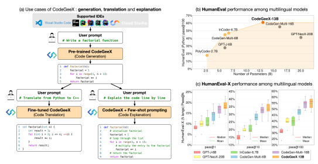 by providing prompts. Different models are used to support three tasks: code generation, code translation and code explanation. (b) and (c): In HumanEval and our newly-proposed HumanEval-X,
CodeGeeX shows promising multilingual abilities and consistently outperforms other multilingual code generation models.

consistent in 2020. This progress is significantly furthered when large language models (transformers with billions of parameters) meet the massive open-sourced code data. Notably, the OpenAI Codex (Chen et al., 2021) model (Python only) with 12 billion (12B) parameters pioneered and demonstrated the potential of large code generation models pre-trained on billions lines of public code. By using the generative pre-training (GPT) strategy, Codex can solve introductorylevel programming problems in Python with a high probability. Research studies (Ziegler et al., 2022) also show that 88% of users of GitHub Copilot—a paid service powered by Codex—feel more productive when coding with it. Since then, large pre-trained code models have been extensively developed, including DeepMind AlphaCode (Li et al., 2022), Salesforce CodeGen (Nijkamp et al., 2022), Meta InCoder (Fried et al., 2022), and Google PaLM-Coder-540B (Chowdhery et al., 2022). In this work, we present CodeGeeX, a multilingual code generation model with 13 billion parameters, pre-trained on a large code corpus of 23 programming languages. It was trained on more than 850 billion tokens on a cluster of 1,536 Ascend 910 AI Processors between April and June 2022, and was publicly released in Sep. 2022 (Cf. the GitHub repo). CodeGeeX has the following properties. First, different from Codex in Chen et al. (2021), both CodeGeeX—the model itself—and how such scale of code models can be pre-trained are open-sourced, facilitating the understanding and advances in pre-trained code generation models. CodeGeeX also supports cross-platform inference on both Ascend and NVIDIA GPUs. Second, in addition to code generation and code completion as Codex and others, CodeGeeX supports the tasks of code explanation and code translation between language pairs (Cf. Figure 1 (a)). Third, it offers consistent performance advantages over well-known multilingual code generation models of the similar scale, including CodeGen-16B, GPT-NeoX-20B, InCode-6.7B, and GPT-J-6B (Cf. Figure 1 (b) and (c)). We also build the free CodeGeeX extensions in several IDEs, currently including Visual Studio Code, JetBrains, and Tencent Cloud Studio (a Web IDE). It supports several different modescode completion, function-level generation, code translation, code explanation, and customizable prompting—to help users' programming tasks in real time. Since its release, there are tens of thousands of daily active users, each of which on average makes 250+ API calls per weekday. As of this writing, the CodeGeeX model generates 4.7 billion tokens per week. Our user survey suggests that 83.4% of users feel the CodeGeeX extensions improve their programming efficiency.

Finally, we develop the HumanEval-X benchmark for evaluating multilingual code models as 1)
HumanEval (Chen et al., 2021)—developed by OpenAI for evaluating Codex—and other bench-

|                                                            |      | Model Properties   |                  | Dataset              |                    |                                                     |                          | Evaluation   |                                                 |
|------------------------------------------------------------|------|--------------------|------------------|----------------------|--------------------|-----------------------------------------------------|--------------------------|--------------|-------------------------------------------------|
|                                                            | Open | Multi lingual                    | # Params         | Source               | Languages          | Size                                                | Multilingual  Evaluation | Translation  | Benchmark                                       |
| Codex (Chen et al., 2021)                                  | %    | %                  |                  |                      |                    | Code: 159GB                                         | %                        | %            | HumanEval, APPS                                 |
| AlphaCode (Li et al., 2022)                                | %    | !                  | 12B  41B         | Collected  Collected | Python  12 langs   | Code: 715.1GB                                       | !                        | %            | HumanEval, APPS                                 |
|                                                            |      |                    |                  |                      |                    |                                                     |                          |              | CodeContest                                     |
| PaLM\-Coder (Chowdhery et al., 2022)                       | %    |                    | ! 8B, 62B, 540B  | Collected            | Multiple           | Text: 741B tokens Code: 39GB  (780B tokens trained) | !                        | !            | HumanEval, MBPP TransCoder, DeepFix             |
| PolyCoder (Xu et al., 2022)  GPT\-Neo (Black et al., 2021) | !  ! | !  !               | 2.7B  1.3B, 2.7B | Collected  The Pile  | 12 langs  Multiple | Code: 253.6GB  Text: 730GB Code: 96GB               | %  %                     | %  %         | HumanEval  HumanEval                            |
|                                                            |      |                    |                  |                      |                    | (400B tokens trained)                               |                          |              |                                                 |
| GPT\-NeoX (Black et al., 2022)                             | !    | !                  | 20B              | The Pile             | Multiple           | Text: 730GB  Code: 95GB                             | %                        | %            | HumanEval                                       |
|                                                            |      |                    |                  |                      |                    | (473B tokens trained)                               |                          |              |                                                 |
| GPT\-J (Wang and Komatsuzaki, 2021)                        | !    | !                  | 6B               | The Pile             | Multiple           | Text: 730GB Code: 96GB (473B tokens trained)        | %                        | %            | HumanEval                                       |
| Incoder (Fried et al., 2022)                               | !    | !                  | 1.3B, 6.7B       | Collected            | 28 langs           | Code: 159GB                                         |                          |              | HumanEval, MBPP                                 |
|                                                            |      |                    |                  |                      |                    | StackOverflow: 57GB  (60B tokens trained)           | %                        | %            | CodeXGLUE                                       |
| CodeGen\-Multi (Nijkamp et al., 2022)                      | !    | !                  | 6.1B, 16.1B      | BigQuery             | 6 langs            | Code: 150B tokens Text: 355B tokens                 | %                        | %            | HumanEval, MTPB                                 |
|                                                            |      |                    |                  |                      |                    | (1000B tokens trained)                              |                          |              |                                                 |
| CodeGen\-Mono (Nijkamp et al., 2022)                       | !    | %                  | 6.1B, 16.1B      | BigPython            | Python             | Code: 150B tokens Text: 355B tokens                 | %                        | %            | HumanEval, MTPB                                 |
|                                                            |      |                    |                  |                      |                    | (1300B tokens trained)                              |                          |              |                                                 |
| CodeGeeX                                                   | !    | !                  | 13B              | The Pile  CodeParrot | 23 langs           | Code: 158B tokens (850B tokens trained)             | !                        | !            | HumanEval\-X, HumanEval MBPP, CodeXGLUE, XLCoST |
|                                                            |      |                    |                  | Collected            |                    |                                                     |                          |              |                                                 |

Table 1: Large pre-trained language models related to programming languages in the literature.

marks (Austin et al., 2021; Hendrycks et al., 2021; Nijkamp et al., 2022) only consist of programming problems in a single language and 2) existing multilingual datasets (Ren et al., 2020; Lu et al., 2021; Zhu et al., 2022) use string similarity metrics like BLEU (Papineni et al., 2002) for evaluation rather than really verify the functional correctness of generated code. Specifically, for each problemdefined only for Python—in HumanEval, we manually rewrite its prompt, canonical solution, and test cases in C++, Java, JavaScript, and Go. In total, HumanEval-X covers 820 hand-written problemsolution pairs (164 problems, each having solutions in 5 languages). Importantly, HumanEval-X support the evaluation of both code generation and code translation between different languages. The contributions of this work can be summarized as follows: - We develop and release CodeGeeX, a 13B pre-trained 23-language code generation model that demonstrates consistent outperformance on code generation and translation over its multilingual baselines of the same scale.

- We build the CodeGeeX extensions on VS Code4, JebBrains5, and Tencent Cloud Studio. Compared to Copilot, it supports more diverse functions, including code completion, generation, translation, and explanation. According to the user survey, CodeGeeX can improve the coding efficiency for 83.4% of its users.

- We hand-craft the HumanEval-X benchmark to evaluate multilingual code models for the tasks of code generation and translation in terms of functional correctness, facilitating the understanding and development of pre-trained (multilingual) code models.

### 2 The Codegeex Model

CodeGeeX is a multilingual code generation model with 13 billion (13B) parameters, pre-trained on a large code corpus of 23 programming languages. As of June 22, 2022, CodeGeeX has been trained on more than 850 billion tokens on a cluster of 1,536 Ascend 910 AI Processors for over two months.

We introduce the CodeGeeX model and its design choices. The consensus reality is that it is computationally unaffordable to test different architectural designs for large pre-trained models (Brown et al., 2020; Chowdhery et al., 2022; Zhang et al., 2022; Zeng et al., 2022), though they define the inductive bias of models.

4https://marketplace.visualstudio.com/items?itemName=aminer.codegeex 5https://plugins.jetbrains.com/plugin/20587-codegeex

### 2.1 Codegeex'S Architecture

The Transformer Backbone. Similar to recent pre-trained models, such as GPT-3 (Brown et al., 2020), PaLM (Chowdhery et al., 2022), and Codex (Chen et al., 2021), CodeGeeX follows the generative pre-training (GPT) architecture (Radford et al., 2018) with the decoder-only style for autoregressive (programming) language modeling. The core architecture of CodeGeeX is a 39-layer transformer decoder. In each transformer layer (in Figure 2), we apply a multi-head self-attention mechanism (Vaswani et al., 2017) followed by MLP layers, together with layer normalization (Ba et al., 2016) and residual connection (He et al., 2016). We use an approximation of GELU (Gaussian Linear Units) operation (Hendrycks and Gimpel, 2016), namely FastGELU, which is more efficient under the Ascend 910 AI Processor:

$$\mathrm{FastGELU}(X_{i})={\frac{X_{i}}{1+\exp(-1.702*|X_{i}|)*\exp(0.851*(X_{i}-|X_{i}|))}}$$
$\left(1\right)$. 

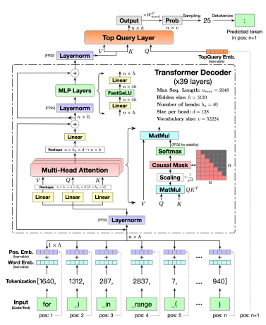

Figure 2: CodeGeeX's model architecture. CodeGeeX is a code generation model with 13B parameters, consisting of 39-layer left-to-right transformer decoders and a top query layer. It takes text/code tokens as input and outputs the probability of the next token autoregressively.

Generative Pre-Training Objective. By adopting the GPT paradigm (Radford et al., 2019; Chen et al., 2021), we train the model on a large amount of unlabeled code data. The principle is to iteratively take code tokens as input, predict the next token, and compare it with the ground truth.

Specifically, for any input sequence {x1, x2*, ..., x*n} of length n, the output of CodeGeeX is a probability distribution of the next token P(xn+1|x1, x2*, ..., x*n, Θ) = pn+1 ∈ [0, 1]1×v, where Θ
represents all parameters of the model and v is the vocabulary size. By comparing it with the real distribution, *i.e.*, a one-hot vector yn+1 ∈ {0, 1}
1×v of the ground-truth token, we can optimize the

$${\mathcal{L}}=-\sum_{n=1}^{N-1}y_{n+1}\log\mathbb{P}(x_{n+1}|x_{1},x_{2},...,x_{n},\Theta)$$
yn+1 log P(xn+1|x1, x2*, ..., x*n, Θ) (2)
The Top Query Layer and Decoding. The original GPT model uses a pooler function to obtain the

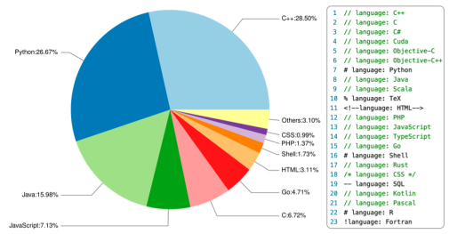 final output. We use an extra query layer (Zeng et al., 2021) on top of all other transformer layers to obtain the final embedding through attention. As shown in Figure 2, the input of the top query layer replaces the query input Xin by the query embedding of position n + 1. The final output is multiplied by the transpose of word embedding matrix to get the output probability. For decoding strategies, CodeGeeX supports greedy, temperature sampling, top-k sampling, top-p sampling, and beam search. Finally, detokenization will turn the selected token ID into an actual word.

Figure 3: Language distribution and tags of CodeGeeX's data.

### 2.2 Pre-Training Setup

Code Corpus. The training corpus contains two parts. The first part is from open source code datasets, the Pile (Gao et al., 2020) and CodeParrot6. The Pile contains a subset of public repositories with more than 100 stars on GitHub, from which we select files of 23 popular programming languages including C++, Python, Java, JavaScript, C, Go, and so on. We identify the programming language of each file based on its suffix and the major language of the repository it belongs to. CodeParrot is another public Python dataset from BigQuery. The second part is supplementary data of Python, Java, and C++ directly scraped from GitHub public repositories that do not appear in the first part. We choose repositories that have at least one star and a total size within 10MB, then we filter out files that: 1) have more than 100 characters per line on average, 2) are automatically generated, 3) have a ratio of alphabet less than 40%, 4) are bigger than 100KB or smaller than 1KB. We format Python code according to the PEP8 standards.

Figure 3 shows the composition of the 158B-token training data, containing 23 programming languages. We divide the training data into segments of equal length. To help the model distinguish between multiple languages, we add a language-specific tag before each segment in the form of
[Comment sign]language: [LANG], e.g., \# language: Python.

Tokenization. The first step is to convert code snippets into numerical vectors. Considering that 1) there is a large number of natural language comments in code data, 2) the naming of variables, functions, and classes are often meaningful words, we treat code data the same as text data and apply the GPT-2 tokenizer (Radford et al., 2019). It is a BPE (Byte Pair Encoding) (Sennrich et al.,

6https://huggingface.co/datasets/transformersbook/codeparrot
2015) tokenizer that deals with the open-vocabulary problem using a fixed-size vocabulary with variable-length characters. The initial vocabulary size is 50,000, we encode multiple whitespaces as extra tokens following Chen et al. (2021) to increase the encoding efficiency. Specifically, L whitespaces are represented by <|extratoken_X|>, where X=8+L. Since the vocabulary contains tokens from various natural languages, it allows CodeGeeX to process tokens in languages other than English, like Chinese, French, Russia, Japanese and more. The final vocabulary size is v = 52, 224. After tokenization, any code snippet or text description can be transformed into a vector of integers. More details can be found in Appendix A.2. The Input Word and Positional Embeddings. Given the tokens, the next step is to associate each token with a word embedding. By looking up the token ID in a word embedding matrix W*word* ∈ R
v×h, where h = 5120 is the hidden size, a learnable embedding x*word* ∈ R
his obtained for each token. To capture positional information, we also adopt learnable positional embedding that maps the current position ID to a learnable embedding xpos ∈ R
h, from Wpos ∈ R
nmax×h, where nmax = 2048 is the maximum sequence length. Then, two embeddings are added to obtain the input embeddings xin = xword + xpos for the model. Finally, the entire sequence can be turned into input embeddings Xin ∈ R
n×h, where n is the input sequence length.

### 2.3 Codegeex Training

Parallel Training on Ascend 910. CodeGeeX was trained on a cluster of the Ascend 910 AI processors (32GB) with Mindspore (v1.7.0). We faced and addressed numerous unknown technical and engineering challenges during pre-training, as Ascend and Mindspore are relatively new compared to NVIDIA GPUs and PyTorch/TensorFlow. The entire pre-training process takes two months on 192 nodes with 1,536 AI processors, during which the model consumes 850B tokens, equivalent to 5+ epochs (213,000 steps). Detailed configurations can be found in Table 2.

|              | Table 2: Training configuration of CodeGeeX.   |                                 |
|--------------|------------------------------------------------|---------------------------------|
| Category     | Parameter                                      | Value                           |
|              | Framework                                      | Mindspore v1.7.0                |
|              | Hardwares                                      | 1,536x Ascend 910 AI processors |
|              | Mem per GPU                                    | 32GB                            |
| Environment  | GPUs per node                                  | 8                               |
|              | CPUs per node                                  | 192                             |
|              | RAM per node                                   | 2048GB                          |
|              | Model parameters Vocabulary size               | 13B   52224                     |
|              | Position embedding                             | Learnable                       |
|              | Maximum sequence length                        | 2048                            |
|              | Hidden size  h                                 | 5120                            |
|              | Feed\-forward size  4h                         | 20480                           |
| Model        | Feed\-forward activation                       | FastGELU                        |
|              | Layernorm epsilon                              | 1e\-5                           |
|              | Layernorm precision                            | FP32                            |
|              | Number of attention heads  hn                  | 40                              |
|              | Attention softmax precision                    | FP32                            |
|              | Dropout rate                                   | 0.1                             |
|              | Model parallel size                            | 8                               |
| Parallelism  | Data parallel size                             | 192                             |
|              | Global batch size                              | 3072                            |
|              | Optimizer                                      | Adam                            |
|              | Optimizer parameters                           | = 0.9, β2 = 0.999 β1            |
|              | Initial/final learning rate                    | 1e\-4/1e\-6                     |
|              | Warm\-up step                                  | 2000                            |
| Optimization | Decay step                                     | 200000                          |
|              | Learning rate scheduler                        | cosine decay                    |
|              | Loss function L                                | Cross entropy                   |
|              | Loss scaling                                   | Dynamic                         |
|              | Loss scaling window                            | 1000                            |
|              | Trained steps                                  | 213000                          |

To increase training efficiency, we adopt an 8-way model parallel training together with 192-way data parallel training, with ZeRO-2 (Rajbhandari et al., 2020) optimizer enabled to further reduce the memory consumption of optimizer states. Finally, the micro-batch size is 16 per node and the global batch size reaches 3,072.

Specifically, we use Adam optimizer (Kingma and Ba, 2014) to optimize the loss in Equation 2.

The model weights are under FP16 format, except that we use FP32 for layer-norm and softmax for higher precision and stability. The model takes about 27GB of GPU memory. We start from an initial learning rate 1e-4, and apply a cosine learning rate decay by:

$$lr_{current}=lr_{min}+0.5*(lr_{max}-lr_{min})*(1+\cos(\frac{n_{current}}{n_{decay}}\pi))\tag{3}$$

During the two-month training, the training loss of CodeGeeX continues to decrease as the training goes on. We evaluate the checkpoints on HumanEval-X code generation task and observe that the performance is continuously increasing. See details in Figures 13 and 14 in Appendix A.3. Training Efficiency Optimization. Over the course of the training, we actively attempted to optimize the Mindspore framework to release the power of Ascend 910. Notably, we adopt the following techniques that significantly improve training efficiency: - Kernel fusion: We fuse several element-wise operators to improve calculation efficiency on Ascend 910, including Bias+LayerNorm, BatchMatmul+Add, FastGeLU+Matmul, Softmax, etc. We also optimize LayerNorm operator to support multi-core calculation.

- Auto Tune optimization: When loading models, Mindspore first compiles them to static computational graphs. It uses the Auto Tune tool to optimize the choice of operators (*e.g.*, matrix multiplication in different dimensions). And it applies graph optimization techniques to deal with operator fusion and constant folding.

Table 3 shows the comparison of training efficiency before and after our optimization. The overall efficiency is measured by trained tokens per day. We observe that the efficiency per processor was improved 3× compared to the non-optimized implementation and the overall token throughput of 1,536 GPUs was improved by 224%.

|                    | Table 3: Training efficiency (before and after optimization).   |                                |
|--------------------|-----------------------------------------------------------------|--------------------------------|
|                    | Before                                                          | After                          |
| Device             | Ascend 910                                                      | Ascend 910                     |
| #GPUs              | 1536                                                            | 1536                           |
| Parallelism        | Data parallel + Model parallel                                  | Data parallel + Model parallel |
| Sequence length    | 2048                                                            | 2048                           |
| Global batch size  | 2048                                                            | 3072                           |
| Step time(s)       | 15s                                                             | 10s                            |
| Overall efficiency | 24.2B tokens/day                                                | 54.3B tokens/day               |

### 2.4 Fast Inference

To serve the pre-trained CodeGeeX, we implement a pure PyTorch version of CodeGeeX that supports inference on NVIDIA GPUs. To achieve fast and memory-efficient inference, we apply both quantization and acceleration techniques to the pre-trained CodeGeeX. Quantization. We apply post-training quantization techniques to decrease memory consumption of CodeGeeX during inference. We transform weights W in all linear transformations from FP16 to INT8 using the common absolute maximum quantization:

$$W_{q}=\mathrm{Round}({\frac{W}{\lambda}}),\lambda={\frac{\mathrm{Max}(|W|)}{2^{b-1}-1}}$$

where b is the bitwidth and b = 8. λ is the scaling factor. This quantization transform FP16 values in [−Max(|W|), Max(|W|)] to integers between [−127, 127]. As in Table 4, the memory consumption of CodeGeeX decreases from ∼26.9GB to ∼14.7GB (down by 45.4%), allowing CodeGeeX inference on one RTX 3090 GPU. Importantly, Figure 4 shows that

$$(4)$$

the quantization only slightly affects the performance on the code generation task (Cf Section 3.2 for details about HumanEval-X.).

| Implementation   | GPU    | Format   | L=128   |       | L=256            |       | L=512            |       | L=1024           |        | L=2048           |          |
|------------------|--------|----------|---------|-------|------------------|-------|------------------|-------|------------------|--------|------------------|----------|
|                  |        |          | Mem (G) |       | Time (s) Mem (G) |       | Time (s) Mem (G) |       | Time (s) Mem (G) |        | Time (s) Mem (G) | Time (s) |
| Pytorch          | 3090   | FP16     |         |       |                  |       |                  | OOM   |                  |        |                  |          |
| Pytorch          | A100   | FP16     | 26.9    | 3.66  | 27.1             | 7.16  | 27.6             | 14.35 | 28.9             | 29.95  | 34.6             | 63.20    |
| Megatron         | A100   | FP16     | 26.9    | 4.55  | 27.1             | 9.40  | 27.6             | 18.65 | 28.9             | 37.63  | 34.6             | 75.02    |
| Megatron         | 2xA100 | FP16     | 17.9    | 5.11  | 22.1             | 10.17 | 22.1             | 20.42 | 22.1             | 41.04  | 22.1             | 82.93    |
| Megatron         | 4xA100 | FP16     | 8.0     | 5.25  | 11.1             | 10.35 | 11.1             | 20.89 | 11.1             | 41.86  | 11.1             | 84.95    |
| Megatron         | 8xA100 | FP16     | 4.8     | 5.47  | 5.7              | 11.04 | 6.3              | 22.38 | 6.5              | 45.50  | 6.5              | 90.47    |
| Pytorch          | 3090   | INT8     | 14.7    | 13.82 | 15.7             | 27.10 | 16.1             | 55.42 | 17.1             | 110.83 | 18.7             | 228.67   |
| Pytorch          | A100   | INT8     | 14.7    | 9.40  | 15.7             | 18.65 | 16.1             | 37.38 | 17.1             | 75.60  | 18.7             | 155.01   |
| LLM.int8()       | A100   | INT8     | 14.7    | 20.65 | 15.1             | 35.86 | 15.6             | 72.76 | 16.7             | 147.59 | 22.3             | 301.93   |
| Oneflow          | A100   | FP16     | 25.9    | 2.61  | 26.2             | 5.25  | 27.0             | 10.89 | 29.0             | 22.49  | 33.6             | 47.54    |
| Oneflow          | A100   | INT8     | 13.6    | 1.85  | 13.9             | 3.73  | 14.4             | 7.83  | 15.9             | 16.24  | 21.1             | 35.98    |
| FastTrans        | A100   | FP16     | 26.0    | 2.43  | 26.1             | 4.93  | 26.3             | 10.21 | 26.7             | 22.60  | 27.5             | 50.09    |
| FastTrans        | A100   | INT8     | 14.9    | 1.61  | 15.0             | 3.24  | 15.2             | 6.35  | 15.6             | 14.32  | 17.4             | 34.96    |

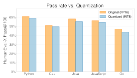

Table 4: GPU memory and inference time of CodeGeeX w/ and w/o quantization on different GPUs and frameworks.

Figure 4: CodeGeeX vs. its quantized version on code generation of HumanEval-X.

Acceleration. After quantization, we further implement a faster version of CodeGeeX using the NVIDIA FasterTransformer (FastTrans). It supports highly-optimized operations by using layer fusion, GEMM autotuning, and hardware-accelerated functions. For INT8 quantized version, we also implement a custom kernel that accelerates the mixed precision matrix multiplication between INT8 weights and FP16 activation vectors. According to Table 4, the INT8 quantization plus FastTrans implementation achieves the fastest inference speed and the lowest GPU memory consumption on a single GPU. The inference time per token is within 13ms (1.61 seconds / 128 tokens). We also compare the inference speed with implementations in LLM.int() (Dettmers et al., 2022) and Oneflow (Yuan et al., 2021).

### 3 The Humaneval-X Benchmark

We develop the HumanEval-X benchmark7for evaluating multilingual code models. There are 164 code problems defined for five major languages: C++, Java, JavaScript, Go, and Python, resulting in 164×5=820 problem-solution pairs. For each problem, it supports both code generation and code translation. Examples of the problems can be found in Appendix A.5.

### 3.1 Humaneval-X: A Multilingual Benchmark

HumanEval (Chen et al., 2021) has been developed to evaluate Codex by OpenAI. However, similar to MBPP (Austin et al., 2021) and APPS (Hendrycks et al., 2021), it only consists of handcrafted programming problems in Python, thus cannot be directly applied to systematically evaluate the performance of multilingual code generation.

7The HumanEval-X dataset and docker image are at https://hub.docker.com/r/codegeex/codegeex.
HumanEval-X Benchmark Stats: 820 handcrafted samples with test cases covering C++. Java, JavaScript, Go and Python, Metrics: Pass@k, Pass@k, (evaluating multilingual functional correctness)
Tasks: Generation:
(Test: (1)(2)(3 (4))

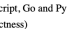

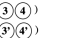

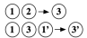

| Translation:                                              | 3'              | (2' )(3' )(4'   |                                                        |
|-----------------------------------------------------------|-----------------|-----------------|--------------------------------------------------------|
| from typing import List                                   | Declaration ( 1 |                 | import java.util. *:                                   |
| def has_close_elements(                                   |                 |                 | import java.lang. *;                                   |
| numbers: List[float], threshold: float) \-> bool:         |                 |                 | class Solution {                                       |
| """ Check if in given list of numbers,                    | Docstring       | 2               | /** Check if in given list of numbers, are any two (2' |
| are any two numbers closer to each                        |                 |                 | numbers closer to each other than given threshold.     |
| other than given threshold. .. '                          |                 |                 | public boolean hasCloseElements( (1)                   |
| for idx, elem in enumerate(numbers):                      | Solution        | 3               | List<Double> numbers, double threshold) {              |
| for idx2, elem2 in enumerate(numbers):                    |                 |                 | for (int i = 0; i < numbers.size(); i++) { 3'          |
| if idx  != idx2:                                          |                 |                 | for (int j = i + 1; j < numbers.size(); j++) {         |
| distance = abs(elem \- elem2)                             |                 |                 | double distance = Math.abs(numbers.get(i) \-           |
| if distance < threshold:                                  |                 |                 | numbers.get(j));                                       |
| return True                                               |                 |                 | if (distance < threshold) return true; } }             |
| return False                                              |                 |                 | return false; } }                                      |
| def check(candidate):                                     | Test            | 4               | public class Main {                                    |
| assert candidate([1.0, 2.0, 5.9, 4.0, 5.0], 0.95) == True |                 |                 | public static void main(String[] args) {               |
|                                                           |                 |                 | Solution s = new Solution();                           |
|                                                           |                 |                 | List<Boolean> correct = Arrays.asList(                 |
| check(has close elements)                                 |                 |                 | s.has_close_elements(Arrays.asList(1.0, 2.0, 5.9, 4.0, |
|                                                           |                 |                 | 5.0). 0.95) }                                          |
| Python (Problem 0)                                        |                 |                 | Java (Problem 0)                                       |

Figure 5: An illustration of code generation and translation tasks in HumanEval-X. Declarations, docstrings, solutions, and test cases are marked with red, green, blue, and purple respectively. Generation uses declaration and docstring as input to generate the solution. Translation uses declaration in both languages and solution in source language as input, to generate solution in the target language (docstring is not used to prevent models from directly solving the problem).

To this end, we propose to develop a multilingual variant of HumanEval, referred to as HumanEval-X. This is not trivial. For each problem, defined only for Python, in HumanEval, we manually rewrite its prompt, canonical solution, and test cases in the other four languages-C++, Java, JavaScript, and Go. Altogether, we have 820 problem-solution pairs in total in HumanEval-X, each comprising the following parts:
· task_id: programming language and numerical problem id, e.g., Java/0 represents the 0-th problem in Java;
· declaration: function declaration including necessary libraries or packages;
· docstring: description that specifies the functionality and example input/output;
· prompt: function declaration plus docstring; · canonical_solution: a verified solution to the problem;
· test: test program including test cases.

Each problem-solution pair in HumanEval-X supports both code generation code translation. An illustrative example is shown in Figure 5. We take the following efforts to make sure that the rewritten code conforms to the programming style of the corresponding language. First, we use the customary naming styles, like Came1Case in Java, Go, and JavaScript, and snake_case in C++. Second, we put the docstrings before the function declaration in Java, JavaScript, C++, and Go. Symbols in docstrings are modified, e.g., single quotes are replaced by double quotes in some languages, and keywords like True/False. None are also replaced. Third, we refine test cases according to language-specific behaviors, rather than forcing the programs to return the same result for different languages. For example, when converting an integer to a binary string, Python method bin adds a prefix "Ob' before the string while Java method Integer . toBinaryString does not, so we remove such prefix in Java test cases. Last, we also take care of the rounding function. In Python, round converts half to the closest even number, unlike in other languages. Thus, we change the test cases to match the rounding implementations in each language.

### 3.2 Humaneval-X: Tasks

In HumanEval-X, we evaluate two tasks: code generation and code translation.

Code Generation. The task of code generation takes a problem description (e.g., "write a factorial function") as input and generates the solution in the selected languages (Cf Figure 1 (a)). Specifically, the model takes in the prompt including declaration and docstrings, and generates the implementation of the function. Note that HumanEval-X uses the same problem set for all the five languages, thus, for solving each problem, it supports either one single language or multiple languages simultaneously. Code Translation. The task of code translation takes the implementation of a problem in the source language and generates its counterpart implementation in the target language. Precisely, its input includes the function declaration and a canonical solution in the source language (e.g., Python). The model should translate the solution to the target language. Adding declaration in the target language restricts function names and variable types, making the evaluation easier, especially under the zero-shot setting. To prevent the models from directly solving the problem rather than translating, we do not include the docstrings. HumanEval-X supports the translation between all pairs of 5 languages, that is, in total 20 source-target language pairs. Metric. For both tasks, we use test cases to evaluate the exact functional correctness of the generated code, measuring the performance with pass@k (Kulal et al., 2019), making it real-world useful and also completely different from the string similarity metrics like BLEU (Papineni et al., 2002), and CodeBLEU (Ren et al., 2020; Lu et al., 2021; Zhu et al., 2022). Specifically, we use the unbiased method to estimate pass@k (Chen et al., 2021):

$\omega\kappa$ (Chen et al., 2021):  $$\text{pass}@k:=\mathbb{E}[1-\frac{\binom{n-c}{k}}{\binom{n}{k}}],n=200,k\in\{1,10,100\}$$  has of proportion ($n$-$200 in this work). $k$ is the sampling budget (try
$$({\boldsymbol{\Sigma}})$$
where $ n$ is the to  $ k\:\in\:\{1,\:10,\:100\}$  . 
$$\mathrm{prob}$$
where n is the total number of generation (n=200 in this work), k is the sampling budget (typically k ∈ {1, 10, 100}) and c is the number of samples that pass all test cases. We average over the problem set to get the expectation. 1 −
n−c k n k is the estimated pass@k for a single problem, and E is the expectation of pass@k over all problems. In practice, we average single-problem pass@k among all test-set problems to get the expectation. Multilingual Metric with Budget Allocation. Unlike mono-lingual models, multilingual code models can solve problems by allocating generation budgets to various languages to increase the sampling diversity and improve the solve rate. Given a budget k, we can distribute part of it nito each language with the assignment

$$\pi=(n_{1},n_{2},...,n_{m}),\sum_{i=1}^{m}n_{i}=k,\tag{6}$$  where $n_{i}$ is the generation budget assigned to language $i$, $m$ is the number of candidate languages.  
$$m_{i}{\mathrm{~is~t}}$$

Under an assignment π = (n1*, ...n*m), for a problem p, the pass@kπ can be estimated by:

$n_{m}$), for a problem $p$, the pass@$k_{\pi}$ can be estimated: $$\begin{aligned} \text{pass@}k_{\pi} = \mathbb{E}[1 - \prod_{i=1}^{m} \frac{\binom{n-c_{i}}{n_{i}}}{\binom{n}{n_{i}}}], \end{aligned}$$ operation, $n_{i}$ is the sampling budget and $c_{i}$ is the number of $n_{i}$. 
 ], (7)
where n is the total number of generation, niis the sampling budget and ciis the number of samples that pass all test cases for language i. We show in Section 4.3 that multilingual models can benefit from budget allocation strategies and have higher solve rate than using any single language.

### 4 Evaluating Codegeex On Humaneval-X

We evaluate CodeGeeX for the code generation and translation tasks on the multilingual benchmark HumanEval-X. By inheriting from HumanEval, the HumanEval-X results on Python are equivalent to the evaluation on HumanEval.

$$(T)$$

|            |          |        |           | Table 5: Results of code generation task in HumanEval\-X.   |             |              |              |
|------------|----------|--------|-----------|-------------------------------------------------------------|-------------|--------------|--------------|
| Language   | Metric   | GPT\-J | GPT\-NeoX | InCoder                                                     | CodeGen     | CodeGen      | CodeGeeX     |
|            |          | \-QB   | \-20B     | \-6.7B                                                      | \-Multi\-6B | \-Multi\-16B | \-13B (ours) |
| Python     | pass@1   | 11.10% | 13.83%    | 16.41%                                                      | 19.41%      | 19.22%       | 22.89%       |
|            | pass@10  | 18.67% | 22.72%    | 26.55%                                                      | 30.29%      | 34.64%       | 39.57%       |
|            | pass@100 | 30.98% | 39.56%    | 43.95%                                                      | 49.63%      | 55.17%       | 60.92%       |
| C++        | pass@1   | 7.54%  | 9.90%     | 9.50%                                                       | 11.44%      | 18.05%       | 17.06%       |
|            | pass@10  | 13.67% | 18.99%    | 19.30%                                                      | 26.23%      | 30.84%       | 32.21%       |
|            | pass@100 | 30.16% | 38.75%    | 36.10%                                                      | 42.82%      | 50.90%       | 51.00%       |
| .Java      | pass@1   | 7.86%  | 8.87%     | 9.05%                                                       | 15.17%      | 14.95%       | 20.04%       |
|            | pass@10  | 14.37% | 19.55%    | 18.64%                                                      | 31.74%      | 36.73%       | 36.70%       |
|            | pass@100 | 32.96% | 42.23%    | 40.70%                                                      | 53.91%      | 60.62%       | 58.42%       |
| JavaScript | pass@1   | 8.99%  | 11.28%    | 12.98%                                                      | 15.41%      | 18.40%       | 17.59%       |
|            | pass@10  | 16.32% | 20.78%    | 22.98%                                                      | 27.92%      | 32.80%       | 32.28%       |
|            | pass@100 | 33.77% | 42.67%    | 43.34%                                                      | 48.81%      | 56.48%       | 56.33%       |
| Go         | pass@1   | 4.01%  | 5.00%     | 8.68%                                                       | 9.98%       | 13.03%       | 14.43%       |
|            | pass@10  | 10.81% | 15.70%    | 13.80%                                                      | 23.26%      | 25.46%       | 25.68%       |
|            | pass@100 | 23.70% | 32.08%    | 28.31%                                                      | 41.01%      | 48.77%       | 47.14%       |
| Average    | pass@1   | 7.90%  | 9.78%     | 11.33%                                                      | 14.28%      | 16.73%       | 18.40%       |
|            | pass@10  | 14.77% | 19.55%    | 20.25%                                                      | 27.89%      | 32.09%       | 33.29%       |
|            | pass@100 | 30.32% | 39.06%    | 38.48%                                                      | 47.24%      | 54.39%       | 54.76%       |

### 4.1 Evaluation Settings

Baselines. We compare CodeGeeX with five competitive open-source baselines: GPT-J-6B (Wang and Komatsuzaki, 2021), GPT-NeoX-20B (Black et al., 2022), InCoder-6.7B (Fried et al., 2022), and CodeGen-Multi-6B/16B (Nijkamp et al., 2022). These models are all trained on multilingual code data, but is previously only evaluated in HumanEval (Python). And they are closer to the scale of CodeGeeX or even larger, while smaller models in the literature are ignored. For all baselines, we use the versions available on HuggingFace (Wolf et al., 2019). We follow the experimental settings of HumanEval-X in Section 3.2. Further details can be found in Appendix A.3.

Environment. Experiments are conducted by using the NVIDIA A100-SXM-40GB GPUs with Linux system. We design a distributed framework for generation based on ZeroMQ to balance GPU loads. All generated codes are tested in language-specific environments with necessary packages installed.

Decoding Strategy. We use temperature sampling (t ∈ [0, 1]) and nucleus sampling (p ∈ [0, 1]) for generation. For CodeGeeX in code generation, we use t = 0.2, p = 0.95 for pass@1 and t = 0.8, p = 0.95 for pass@10 and pass@100 (except for Go and JavaScript, where p = 0.9). For CodeGeeX in code translation, we use t = 0.2, p = 0.95 for pass@1 and t = 0.8, p = 0.95 for pass@10 and pass@100 for all language pairs. For the fine-tuned CodeGeeX-13B-FT used for code translation, we use p = 0.95. For all baselines in both tasks, we use t = 0.2, p = 0.95 for pass@1, t = 0.8, p = 0.95 for pass@10 and pass@100. All pass@k, k ∈ {1, 10, 100} results are estimated with n = 200. The maximum number of generated tokens is set to 1024 for all models.

### 4.2 Results Of Code Generation And Translation

Multilingual Code Generation. Table 5 and Figure 6 report the code generation results in terms of the pass@k, k ∈ {1, 10, 100} for CodeGeeX and five baseline models on five programming languages. CodeGeeX significantly outperforms models trained with mixed corpora (GPT-J-6B and GPT-NeoX-20B), even though GPT-NeoX-20B has much more parameters. For models trained on codes, CodeGeeX outperforms those with smaller scales (InCoder-6.7B, CodeGen-Multi-6B) by a large margin, and is competitive with CodeGen-Multi-16B with a larger scale. CodeGeeX achieves the best average performance among all models, even slightly better than the larger CodeGen-Multi16B in all three metrics (0.37%∼1.67% improvements). When considering individual languages, models have preferences highly related to the training set distribution. For example, the best language

Figure 6: Results of **code generation** task in HumanEval-X. Left: Detailed pass@k performance in

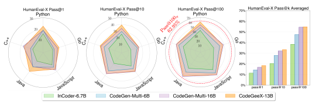

five languages. Right: CodeGeeX achieves the highest average performance compared with other open-sourced multilingual baselines. We also find that it gains performance when the sampling budgets are properly distributed to multiple languages.

| 7.90%                                                                                                       | pass@1   |         |        | 9.78%   | 11.33%   | 14.28%   | 16.73%   |     | 18.40%   |
|-------------------------------------------------------------------------------------------------------------|----------|---------|--------|---------|----------|----------|----------|-----|----------|
| Average   27.89%  32.09%  33.29%                                                                            |          | pass@10 | 14.77% | 19.55%  | 20.25%   |          |          |     |          |
| pass@100  30.32%  39.06%  38.48%  47.24%  54.39%  54.76%                                                    |          |         |        |         |          |          |          |     |          |
| 4.1  Evaluation Settings                                                                                    |          |         |        |         |          |          |          |     |          |
| Baselines. We compare CodeGeeX with five competitive open\-source baselines: GPT\-J\-6B (Wang               |          |         |        |         |          |          |          |     |          |
| and Komatsuzaki, 2021), GPT\-NeoX\-20B (Black et al., 2022), InCoder\-6.7B (Fried et al., 2022), and        |          |         |        |         |          |          |          |     |          |
| CodeGen\-Multi\-6B/16B (Nijkamp et al., 2022). These models are all trained on multilingual code            |          |         |        |         |          |          |          |     |          |
| data, but is previously only evaluated in HumanEval (Python). And they are closer to the scale of           |          |         |        |         |          |          |          |     |          |
| CodeGeeX or even larger, while smaller models in the literature are ignored. For all baselines, we          |          |         |        |         |          |          |          |     |          |
| use the versions available on HuggingFace (Wolf et al., 2019). We follow the experimental settings          |          |         |        |         |          |          |          |     |          |
| of HumanEval\-X in Section 3.2. Further details can be found in Appendix A.3.                               |          |         |        |         |          |          |          |     |          |
| Environment. Experiments are conducted by using the NVIDIA A100\-SXM\-40GB GPUs with                        |          |         |        |         |          |          |          |     |          |
| Linux system. We design a distributed framework for generation based on ZeroMQ to balance GPU               |          |         |        |         |          |          |          |     |          |
| loads. All generated codes are tested in language\-specific environments with necessary packages installed. |          |         |        |         |          |          |          |     |          |
| Decoding Strategy. We use temperature sampling (t ∈ [0, 1]) and nucleus sampling (p ∈ 1])                   |          |         |        |         |          |          |          | [0, |          |

Table 6: Results of **code translation** task in HumanEval-X.

for CodeGeeX is Python while the best language for CodeGen-Multi-16B is Java. Examples of CodeGeeX generation can be found in Appendix A.5. Cross-Lingual Code Translation. Table 6 illustrates the results on code translation. For CodeGeeX, we evaluate both the original version CodeGeeX-13B and the fine-tuned CodeGeeX-13B-FT. CodeGeeX-13B-FT is first fine-tuned using the training set of code translation task in XLCoST (Zhu et al., 2022), and then continuously fine-tuned by a small amount of Go data (since Go is missing in XLCoST). Among all translation pairs, CodeGeeX-13B-FT performs the best on pass@100 in 11 out of the 20, while CodeGen-Multi-16B is the best on 7 of them. We also observe a clear preference of languages by different models. CodeGeeX performs the best when translating other languages to Python and C++, while CodeGen-Multi-16B performs better when translating to JavaScript and Go.

Test Result Analysis. We group the samples' test results into five categories: passing, wrong answer, runtime error, syntax/semantic error and unfinished generation, and calculate the proportion of results for each model. Runtime error includes out-of-bound index, wrong string format, etc; syntax/semantic error indicates errors detected by syntax or semantic check, like compilation error in compiled languages and syntax, undefined or type error in interpreted languages; unfinished generation means failing to complete one function within maximum length.

Figure 7: **Left**: the proportions of running results of four models for each language. **Right**: the

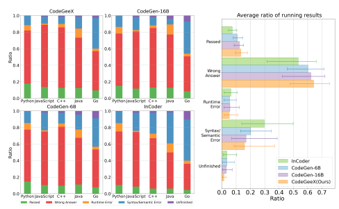

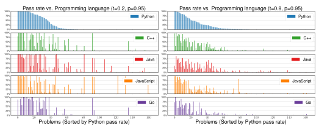 average result ratios across four models, with lines representing minimum and maximum values. For each model and each language, we study 200 samples generated under t = 0.8 and p = 0.95.

Figure 8: In HumanEval-X, each problem's pass rate varies when generating in different programming languages with CodeGeeX. **Left:** t = 0.2, p = 0.95; **Right:** t = 0.8, p = 0.95.

Figure 7 shows the proportions of running results of four models. For all languages, the most common error type is wrong answer, with ratio ranging from 0.44 to 0.75 except for Go, showing that code generation models at the current stage mainly suffer from incorrect code logic rather than semantics. Go samples have a high syntax error rate, which may be due to Go having strict restrictions on syntax and forbidding unused variables and imports, failing to compile many logically correct codes. CodeGeeX has less rate to generate code that produces runtime, syntax, or semantic errors.

### 4.3 The Multilingual Pre-Training Helps Problem Solving

We perform studies to understand whether and how multilingual pre-training can benefit problemsolving of CodeGeeX.

Exploration vs. Exploitation under Fixed Budgets. Given a fixed budget k, pass@k evaluates the ability of models generating at least 1 correct solution under k generations. Previous works (Chen et al., 2021; Li et al., 2022) have already discovered that there's a trade-off between exploration and exploitation: When the budget is small, it is better to use a low temperature to ensure accuracy on

|           |             |        |                   | Table 7: Results for lixed\-budget multingual generation on HumanEval\-A.   |             |              |          |
|-----------|-------------|--------|-------------------|-----------------------------------------------------------------------------|-------------|--------------|----------|
| Metric    | Method      | GPT\-J | GPT\-NeoX InCoder |                                                                             | CodeGen     | CodeGen      | CodeGeeX |
|           |             | \-6B   | \-20B             | \-6.7B                                                                      | \-Multi\-6B | \-Multi\-16B | \-13B    |
| pass@kT   | Best Single | 33.77% | 42.67%            | 43.95%                                                                      | 53.19%      | 60.62%       | 60.92%   |
| (k = 100) | Uniform     | 36.40% | 44.75%            | 43.89%                                                                      | 53.47%      | 61.01%       | 62.41 %  |
|           | Weighted    | 36.76% | 44.97%            | 45.60%                                                                      | 53.94%      | 61.34%       | 62.95%   |

Table 7: Results for fixed-budget multilingual generation on HumanEval-X.

easy problems. When the budget is large, instead, adjusting a higher temperature is vital, as it makes the model more likely to find at least one solution for difficult problems. Pass Rate Distribution vs. Languages. Unlike monolingual models, multilingual models can solve problems using various programming languages. In Figure 8, we observe that the pass rate distribution of problems against different languages are diverse. This inspires us to use budget allocation methods to help improve the diversity of the generated solutions.

Budget Allocation Strategies. We compare three basic strategies: *Best Single* chooses a single language with the best performance; *Uniform* allocates the budget uniformly; *Weighted* allocates the budget to multiple languages based on their proportions in the training corpus (detailed weights can be found in Appendix Table 9). Table 7 illustrates how budget allocation improves the multilingual generation. Both **Uniform** and **Weighted** outperform **Best Single** by promoting a more diverse generation, which gives a higher chance of solving problems. **Weighted** is slightly better due to the prior knowledge on the model. For model-wise comparison, CodeGeeX shows up a decent advantage over other baselines in both strategies, which suggests that it might have a more diverse solution set under multiple languages. Programming languages are created with a specific purpose and unique design; in real-world scenarios, multilingual models might take this advantage for certain tasks.

Figure 9: The performance of translating A-to-B is negatively correlated with B-to-A. Such asymmetry

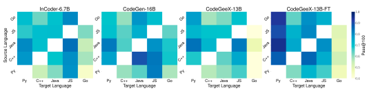 indicates that multilingual models still lack of high-level understanding between languages.

Negative Correlations in Pair-Language Translation. When evaluating the translation ability in HumanEval-X, an interesting observation is that the performance of A-to-B and B-to-A are usually negatively-correlated, shown in Figure 9. Such asymmetry suggests that multilingual code generation models may have imbalanced focus on source and target languages during code translation. We provide two possible explanations. First, language distributions in training corpus differ a lot, resulting in different level of generation ability. For example, the ratio of Python is 26.6% (vs. Go 4.7%) in CodeGeeX training corpus, and average pass@100 of *Others-to-Python* reaches ~90% (vs. *Others-to-Go* only ~50%). Second, some languages are themselves harder to automatically write with syntactic and semantic accuracy due to language-dependent features, affecting translation performance as target languages. For instance, Go, which models translate poorly into, has more constraints on syntax level, forbidding unused variables or imports.

### 5 The Codegeex Tools And Users

Based on CodeGeeX, we build open-source extensions for IDEs including VS Code, JetBrains and Cloud Studio. The extensions support code generation, completion, translation and explanation, aiming at improving the development efficiency of programmers. As of this writing, CodeGeeX has served tens of thousands of users, with an average of 250+ API calls per active user per weekday. It currently generates 4.7+ billion tokens per week, which has been steadily growing since its release.

Figure 10: Profession vs. satisfaction. Left:

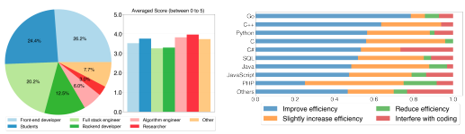 Profession distribution. Right: Averaged rating score of CodeGeeX extensions.

Figure 11: Survey on "Has CodeGeeX improved your coding efficiency?". Over 83.4% of users have positive answers.

We perform a survey on CodeGeeX's user experience from 168 users covering *front-end developer*, backend developer, full stack engineer, algorithm engineer, students, *researcher*, and other programmers. Figure 10 illustrates users' profession distribution and the satisfaction score. We evaluate the satisfaction considering five dimensions, "Ease of Use", "Reliability", "Feature", "Visual", "Speed", each scored from 0 to 5. Figure 10 shows that the majority of users have positive experiences with CodeGeeX, especially for researchers and students, while there is still room for improvement for professional developers. This can be interpreted by our training code corpus: open-sourced repositories contain many introductory or research projects, while production codes are often close-sourced. To increase the CodeGeeX's capability in professional domain, these codes are needed in the future.

We further investigate how multilinguality of CodeGeeX help coding. Figure 11 illustrates how users evaluate the helpfulness of CodeGeeX during development. There are on average over 83.4% of users think CodeGeeX can improve or slightly increase their coding efficiency, especially for mainstream programming languages like Go, C++, Python, C, C\#, etc. Note that these well-performing programming languages also appear more frequently in the training data (Figure 3), which encourages us to train CodeGeeX on more language-specific data to enhance its capability.

### 6 Conclusion

We introduce CodeGeeX, a 13B pre-trained 23-language code generation model, as well as we build HumanEval-X, to fill the gap of multilingual code generation. CodeGeeX consistently outperforms open-sourced multilingual baselines of the same scale on code generation and translation tasks.

The extensions built on CodeGeeX bring significant benefits in increasing coding efficiency. The multilinguality of CodeGeeX brings the potential of solving problems with an ubiquitous set of formalized languages. We open sourced CodeGeeX aiming to help researchers and developers to widely take benefit of large pre-trained models for code generation. The multilingual ability of CodeGeeX shows the potential of solving problems with a ubiquitous set of formalized languages. Here, we share three of our observations as the future directions. First, we find that the model capacity is essential for multilingual programming ability. It is not trivial for the model to benefit from learning multiple languages. Human programmers can abstract the high-level concept of programming, thus learning one language can help them master the others. On the contrary, the model seems to require a large capacity to concurrently store the knowledge of each language. How to help the model extract the most essential knowledge of programming remains a research challenge. Second, similar to others, CodeGeeX shows the reasoning potential as a model though its lack of strong generality. We demonstrate that CodeGeeX can solve problems in different languages. However, the pass rate distribution varies a lot among languages, *i.e.*, it is not able to solve the same problem using different languages on occasion. We assume that this could probably be related to some language-specific features (*e.g.*, some problems are easier to solve in Python), or it could be simply due to the appearance of a similar language-specific implementation in training data. Either case, there is a long way to go for the model to have a reliable reasoning ability.

Third, the few-shot ability of CodeGeeX is worth exploration. Instead of using costly fine-tuning approaches, we may do priming using a few examples and make the model achieve comparable performance. Recent works like chain-of-thought (CoT) prompting (Wei et al., 2022) have shown impressive results using such an approach, inspiring us to examine CoT in code models.

### Acknowledgement

This research was supported by Natural Science Foundation of China (NSFC) for Distinguished Young Scholars No. 61825602, NSFC No. 62276148 and a research fund from Zhipu.AI. We give our special thanks to Wenguang Chen from Tsinghua, the Peng Cheng Laboratory, and Zhipu.AI for sponsoring the training and inference GPU resources. We thank all our collaborators and partners from Tsinghua KEG, IIIS, Peng Cheng Laboratory, and Zhipu.AI, including Aohan Zeng, Wendi Zheng, Lilong Xue, Yifeng Liu, Yanru Chen, Yichen Xu, Qingyu Chen, Zhongqi Li, Gaojun Fan, Yifan Yao, Qihui Deng, Bin Zhou, Ruijie Cheng, Peinan Yu, Jingyao Zhang, Bowen Huang, Zhaoyu Wang, Jiecai Shan, Xuyang Ding, Xuan Xue, and Peng Zhang.

### References

Wasi Uddin Ahmad, Saikat Chakraborty, Baishakhi Ray, and Kai-Wei Chang. 2021. Unified pretraining for program understanding and generation. *arXiv preprint arXiv:2103.06333*.

Jacob Austin, Augustus Odena, Maxwell Nye, Maarten Bosma, Henryk Michalewski, David Dohan, Ellen Jiang, Carrie Cai, Michael Terry, Quoc Le, et al. 2021. Program synthesis with large language models. *arXiv preprint arXiv:2108.07732*.

Jimmy Lei Ba, Jamie Ryan Kiros, and Geoffrey E Hinton. 2016. Layer normalization. arXiv preprint arXiv:1607.06450.

Sid Black, Stella Biderman, Eric Hallahan, Quentin Anthony, Leo Gao, Laurence Golding, Horace He, Connor Leahy, Kyle McDonell, Jason Phang, et al. 2022. Gpt-neox-20b: An open-source autoregressive language model. *arXiv preprint arXiv:2204.06745*.

Sid Black, Leo Gao, Phil Wang, Connor Leahy, and Stella Biderman. 2021. Gpt-neo: Large scale autoregressive language modeling with mesh-tensorflow. If you use this software, please cite it using these metadata, 58.

Tom Brown, Benjamin Mann, Nick Ryder, Melanie Subbiah, Jared D Kaplan, Prafulla Dhariwal, Arvind Neelakantan, Pranav Shyam, Girish Sastry, Amanda Askell, et al. 2020. Language models are few-shot learners. *Advances in neural information processing systems*, 33:1877–1901.

Mark Chen, Jerry Tworek, Heewoo Jun, Qiming Yuan, Henrique Ponde de Oliveira Pinto, Jared Kaplan, Harri Edwards, Yuri Burda, Nicholas Joseph, Greg Brockman, et al. 2021. Evaluating large language models trained on code. *arXiv preprint arXiv:2107.03374*.

Aakanksha Chowdhery, Sharan Narang, Jacob Devlin, Maarten Bosma, Gaurav Mishra, Adam Roberts, Paul Barham, Hyung Won Chung, Charles Sutton, Sebastian Gehrmann, and et al. 2022. Palm: Scaling language modeling with pathways.

Tim Dettmers, Mike Lewis, Younes Belkada, and Luke Zettlemoyer. 2022. Llm. int8 (): 8-bit matrix multiplication for transformers at scale. *arXiv preprint arXiv:2208.07339*.

Zhangyin Feng, Daya Guo, Duyu Tang, Nan Duan, Xiaocheng Feng, Ming Gong, Linjun Shou, Bing Qin, Ting Liu, Daxin Jiang, et al. 2020. Codebert: A pre-trained model for programming and natural languages. *arXiv preprint arXiv:2002.08155*.

Daniel Fried, Armen Aghajanyan, Jessy Lin, Sida Wang, Eric Wallace, Freda Shi, Ruiqi Zhong, Wen-tau Yih, Luke Zettlemoyer, and Mike Lewis. 2022. Incoder: A generative model for code infilling and synthesis. *arXiv preprint arXiv:2204.05999*.

Leo Gao, Stella Biderman, Sid Black, Laurence Golding, Travis Hoppe, Charles Foster, Jason Phang, Horace He, Anish Thite, Noa Nabeshima, et al. 2020. The pile: An 800gb dataset of diverse text for language modeling. arXiv preprint arXiv:2101.00027.

Kaiming He, Xiangyu Zhang, Shaoqing Ren, and Jian Sun. 2016. Deep residual learning for image recognition. In *Proceedings of the IEEE conference on computer vision and pattern recognition*, pages 770–778.

Dan Hendrycks, Steven Basart, Saurav Kadavath, Mantas Mazeika, Akul Arora, Ethan Guo, Collin Burns, Samir Puranik, Horace He, Dawn Song, et al. 2021. Measuring coding challenge competence with apps. *arXiv preprint arXiv:2105.09938*.

Dan Hendrycks and Kevin Gimpel. 2016. Gaussian error linear units (gelus). arXiv preprint arXiv:1606.08415.

Diederik P Kingma and Jimmy Ba. 2014. Adam: A method for stochastic optimization. arXiv preprint arXiv:1412.6980.

Sumith Kulal, Panupong Pasupat, Kartik Chandra, Mina Lee, Oded Padon, Alex Aiken, and Percy S
Liang. 2019. Spoc: Search-based pseudocode to code. In Advances in Neural Information Processing Systems, volume 32. Curran Associates, Inc.

Yujia Li, David Choi, Junyoung Chung, Nate Kushman, Julian Schrittwieser, Rémi Leblond, Tom Eccles, James Keeling, Felix Gimeno, Agustin Dal Lago, et al. 2022. Competition-level code generation with alphacode. *arXiv preprint arXiv:2203.07814*.

Shuai Lu, Daya Guo, Shuo Ren, Junjie Huang, Alexey Svyatkovskiy, Ambrosio Blanco, Colin Clement, Dawn Drain, Daxin Jiang, Duyu Tang, et al. 2021. Codexglue: A machine learning benchmark dataset for code understanding and generation. *arXiv preprint arXiv:2102.04664*.

Lili Mou, Rui Men, Ge Li, Lu Zhang, and Zhi Jin. 2015. On end-to-end program generation from user intention by deep neural networks. *arXiv preprint arXiv:1510.07211*.

Erik Nijkamp, Bo Pang, Hiroaki Hayashi, Lifu Tu, Huan Wang, Yingbo Zhou, Silvio Savarese, and Caiming Xiong. 2022. A conversational paradigm for program synthesis. arXiv preprint arXiv:2203.13474.

Kishore Papineni, Salim Roukos, Todd Ward, and Wei-Jing Zhu. 2002. Bleu: a method for automatic evaluation of machine translation. In Proceedings of the 40th annual meeting of the Association for Computational Linguistics, pages 311–318.

Long Phan, Hieu Tran, Daniel Le, Hieu Nguyen, James Anibal, Alec Peltekian, and Yanfang Ye.

2021. Cotext: Multi-task learning with code-text transformer. *arXiv preprint arXiv:2105.08645*.

Oleksandr Polozov and Sumit Gulwani. 2015. Flashmeta: A framework for inductive program synthesis. In Proceedings of the 2015 ACM SIGPLAN International Conference on Object-Oriented Programming, Systems, Languages, and Applications, pages 107–126.

Weizhen Qi, Yeyun Gong, Yu Yan, Can Xu, Bolun Yao, Bartuer Zhou, Biao Cheng, Daxin Jiang, Jiusheng Chen, Ruofei Zhang, et al. 2021. Prophetnet-x: large-scale pre-training models for english, chinese, multi-lingual, dialog, and code generation. *arXiv preprint arXiv:2104.08006*.

Alec Radford, Karthik Narasimhan, Tim Salimans, and Ilya Sutskever. 2018. Improving language understanding by generative pre training.

Alec Radford, Jeffrey Wu, Rewon Child, David Luan, Dario Amodei, Ilya Sutskever, et al. 2019.

Language models are unsupervised multitask learners. *OpenAI blog*, 1(8):9.

Samyam Rajbhandari, Jeff Rasley, Olatunji Ruwase, and Yuxiong He. 2020. Zero: Memory optimizations toward training trillion parameter models. In SC20: International Conference for High Performance Computing, Networking, Storage and Analysis, pages 1–16. IEEE.

Shuo Ren, Daya Guo, Shuai Lu, Long Zhou, Shujie Liu, Duyu Tang, Neel Sundaresan, Ming Zhou, Ambrosio Blanco, and Shuai Ma. 2020. Codebleu: a method for automatic evaluation of code synthesis. *arXiv preprint arXiv:2009.10297*.

Rico Sennrich, Barry Haddow, and Alexandra Birch. 2015. Neural machine translation of rare words with subword units. arXiv preprint arXiv:1508.07909.

Armando Solar-Lezama. 2008. *Program synthesis by sketching*. University of California, Berkeley. Phillip D Summers. 1977. A methodology for lisp program construction from examples. *Journal of* the ACM (JACM), 24(1):161–175.

Zeyu Sun, Qihao Zhu, Yingfei Xiong, Yican Sun, Lili Mou, and Lu Zhang. 2020. Treegen: A
tree-based transformer architecture for code generation. In *Proceedings of the AAAI Conference* on Artificial Intelligence, volume 34, pages 8984–8991.

Alexey Svyatkovskiy, Shao Kun Deng, Shengyu Fu, and Neel Sundaresan. 2020. Intellicode compose:
Code generation using transformer. In Proceedings of the 28th ACM Joint Meeting on European Software Engineering Conference and Symposium on the Foundations of Software Engineering, pages 1433–1443.

Romal Thoppilan, Daniel De Freitas, Jamie Hall, Noam Shazeer, Apoorv Kulshreshtha, Heng-Tze Cheng, Alicia Jin, Taylor Bos, Leslie Baker, Yu Du, et al. 2022. Lamda: Language models for dialog applications. *arXiv preprint arXiv:2201.08239*.

Lewis Tunstall, Leandro von Werra, and Thomas Wolf. 2022. *Natural language processing with* transformers. " O'Reilly Media, Inc.".

Ashish Vaswani, Noam Shazeer, Niki Parmar, Jakob Uszkoreit, Llion Jones, Aidan N Gomez, Ł ukasz Kaiser, and Illia Polosukhin. 2017. Attention is all you need. In *Advances in Neural Information* Processing Systems, volume 30. Curran Associates, Inc.

Richard J Waldinger and Richard CT Lee. 1969. Prow: A step toward automatic program writing. In Proceedings of the 1st international joint conference on Artificial intelligence, pages 241–252.

Ben Wang and Aran Komatsuzaki. 2021. Gpt-j-6b: A 6 billion parameter autoregressive language model.

Yue Wang, Weishi Wang, Shafiq Joty, and Steven CH Hoi. 2021. Codet5: Identifier-aware unified pre-trained encoder-decoder models for code understanding and generation. arXiv preprint arXiv:2109.00859.

Jason Wei, Xuezhi Wang, Dale Schuurmans, Maarten Bosma, Ed Chi, Quoc Le, and Denny Zhou.

2022. Chain of thought prompting elicits reasoning in large language models. arXiv preprint arXiv:2201.11903.

Thomas Wolf, Lysandre Debut, Victor Sanh, Julien Chaumond, Clement Delangue, Anthony Moi, Pierric Cistac, Tim Rault, Rémi Louf, Morgan Funtowicz, et al. 2019. Huggingface's transformers:
State-of-the-art natural language processing. *arXiv preprint arXiv:1910.03771*.

Frank F Xu, Uri Alon, Graham Neubig, and Vincent Josua Hellendoorn. 2022. A systematic evaluation of large language models of code. In Proceedings of the 6th ACM SIGPLAN International Symposium on Machine Programming, pages 1–10.

Jinhui Yuan, Xinqi Li, Cheng Cheng, Juncheng Liu, Ran Guo, Shenghang Cai, Chi Yao, Fei Yang, Xiaodong Yi, Chuan Wu, et al. 2021. Oneflow: Redesign the distributed deep learning framework from scratch. *arXiv preprint arXiv:2110.15032*.

Aohan Zeng, Xiao Liu, Zhengxiao Du, Zihan Wang, Hanyu Lai, Ming Ding, Zhuoyi Yang, Yifan Xu, Wendi Zheng, Xiao Xia, et al. 2022. Glm-130b: An open bilingual pre-trained model. arXiv preprint arXiv:2210.02414.

Wei Zeng, Xiaozhe Ren, Teng Su, Hui Wang, Yi Liao, Zhiwei Wang, Xin Jiang, ZhenZhang Yang, Kaisheng Wang, Xiaoda Zhang, Chen Li, Ziyan Gong, Yifan Yao, Xinjing Huang, Jun Wang, Jianfeng Yu, Qi Guo, Yue Yu, Yan Zhang, Jin Wang, Hengtao Tao, Dasen Yan, Zexuan Yi, Fang Peng, Fangqing Jiang, Han Zhang, Lingfeng Deng, Yehong Zhang, Zhe Lin, Chao Zhang, Shaojie Zhang, Mingyue Guo, Shanzhi Gu, Gaojun Fan, Yaowei Wang, Xuefeng Jin, Qun Liu, and Yonghong Tian. 2021. Pangu-α: Large-scale autoregressive pretrained chinese language models with auto-parallel computation.

Susan Zhang, Stephen Roller, Naman Goyal, Mikel Artetxe, Moya Chen, Shuohui Chen, Christopher Dewan, Mona Diab, Xian Li, Xi Victoria Lin, et al. 2022. Opt: Open pre-trained transformer language models. *arXiv preprint arXiv:2205.01068*.

Ming Zhu, Aneesh Jain, Karthik Suresh, Roshan Ravindran, Sindhu Tipirneni, and Chandan K
Reddy. 2022. Xlcost: A benchmark dataset for cross-lingual code intelligence. *arXiv preprint* arXiv:2206.08474.

Albert Ziegler, Eirini Kalliamvakou, X Alice Li, Andrew Rice, Devon Rifkin, Shawn Simister, Ganesh Sittampalam, and Edward Aftandilian. 2022. Productivity assessment of neural code completion.

In *Proceedings of the 6th ACM SIGPLAN International Symposium on Machine Programming*,
pages 21–29.

### A Appendix Contents

| 43.95%                                                                                                   | Best Single   | 33.77%   | 42.67%   |            | 53.19%      | 60.62%   | 60.92%                        |
|----------------------------------------------------------------------------------------------------------|---------------|----------|----------|------------|-------------|----------|-------------------------------|
| pass@kπ Uniform  61.01% (k = 100)                                                                        |               | 36.40%   | 44.75%   | 43.89%     | 53.47%      |          | 62.41%                        |
| Weighted   61.34%                                                                                        |               | 36.76%   | 44.97%   | 45.60%     | 53.94%      |          | 62.95%                        |
| easy problems. When the budget is large, instead, adjusting a higher temperature is vital, as it makes   |               |          |          |            |             |          |                               |
| the model more likely to find at least one solution for difficult problems.                              |               |          |          |            |             |          |                               |
| Pass Rate Distribution vs. Languages.  Unlike monolingual models, multilingual models can solve          |               |          |          |            |             |          |                               |
| problems using various programming languages. In Figure 8, we observe that the pass rate distribution    |               |          |          |            |             |          |                               |
| of problems against different languages are diverse. This inspires us to use budget allocation methods   |               |          |          |            |             |          |                               |
| to help improve the diversity of the generated solutions.                                                |               |          |          |            |             |          |                               |
| Budget Allocation Strategies. Best Single We compare three basic strategies:                             |               |          |          |            |             |          | chooses a single              |
| language with the best performance;  allocates the budget uniformly; Weighted                            |               |          | Uniform  |            |             |          | allocates the                 |
| budget to multiple languages based on their proportions in the training corpus (detailed weights can     |               |          |          |            |             |          |                               |
| be found in Appendix Table 9). Table 7 illustrates how budget allocation improves the multilingual       |               |          |          |            |             |          |                               |
| generation. Both Uniform                                                                                 |               | and      | Weighted | outperform | Best Single |          | by promoting a more diverse   |
| generation, which gives a higher chance of solving problems. Weighted                                    |               |          |          |            |             |          | is slightly better due to the |
| prior knowledge on the model. For model\-wise comparison, CodeGeeX shows up a decent advantage           |               |          |          |            |             |          |                               |
| over other baselines in both strategies, which suggests that it might have a more diverse solution set   |               |          |          |            |             |          |                               |
| under multiple languages. Programming languages are created with a specific purpose and unique           |               |          |          |            |             |          |                               |
| design; in real\-world scenarios, multilingual models might take this advantage for certain tasks.       |               |          |          |            |             |          |                               |
| Figure 9: The performance of translating A\-to\-B is negatively correlated with B\-to\-A. Such asymmetry |               |          |          |            |             |          |                               |
| indicates that multilingual models still lack of high\-level understanding between languages.            |               |          |          |            |             |          |                               |
| Negative Correlations in Pair\-Language Translation. When evaluating the translation ability in          |               |          |          |            |             |          |                               |
| HumanEval\-X, an interesting observation is that the performance of A\-to\-B and B\-to\-A are usually    |               |          |          |            |             |          |                               |
| negatively\-correlated, shown in Figure 9. Such asymmetry suggests that multilingual code generation     |               |          |          |            |             |          |                               |
| models may have imbalanced focus on source and target languages during code translation. We              |               |          |          |            |             |          |                               |
| provide two possible explanations.  First, language distributions in training corpus differ a lot,       |               |          |          |            |             |          |                               |
| resulting in different level of generation ability. For example, the ratio of Python is 26.6% (vs. Go    |               |          |          |            |             |          |                               |
| 4.7%) in CodeGeeX training corpus, and average pass@100 of Others\-to\-Python                            |               |          |          |            |             |          | reaches ~90%                  |
| (vs. Others\-to\-Go only ~50%). Second, some languages are themselves harder to automatically            |               |          |          |            |             |          |                               |
| write with syntactic and semantic accuracy due to language\-dependent features, affecting translation    |               |          |          |            |             |          |                               |
| performance as target languages. For instance, Go, which models translate poorly into, has more          |               |          |          |            |             |          |                               |

### A.1 Statistics Of Code Corpus

Table 8 summarizes the composition of CodeGeeX's code corpus.

|                |              | Table 8: Composition of our code corpus for pre\-training.   |                             |
|----------------|--------------|--------------------------------------------------------------|-----------------------------|
| Language       | # Tokens (B) | % Tokens (%)                                                 | Language Tag                |
| C++            | 45.2283      | 28.4963                                                      | // language: C++            |
| Python         | 42.3250      | 26.667                                                       | # language: Python          |
| .Java          | 25.3667      | 15.9824                                                      | // language: Java           |
| JavaScript     | 11.3165      | 7.13                                                         | // language: JavaScript     |
| C              | 10.6590      | 6.7157                                                       | // language: C              |
| Go             | 7.4774       | 4.7112                                                       | // language: Go             |
| HTML           | 4.9355       | 3.1096                                                       | <!\- language: HTML\->      |
| Shell          | 2.7498       | 1.7325                                                       | # language: Shell           |
| PHP            | 2.1698       | 1.3671                                                       | // language: PHP            |
| CSS            | 1.5674       | 0.9876                                                       | /* language: CSS */         |
| TypeScript     | 1.1667       | 0.7351                                                       | // language: TypeScript     |
| SOL            | 1.1533       | 0.7267                                                       | \- language: SOL            |
| TeX            | 0.8257       | 0.5202                                                       | % language: TeX             |
| Rust           | 0.5228       | 0.3294                                                       | // language: Rust           |
| Objective\-C   | 0.4526       | 0.2851                                                       | // language: Objective\-C   |
| Scala          | 0.3786       | 0.2385                                                       | // language: Scala          |
| Kotlin         | 0.1707       | 0.1075                                                       | // language: Kotlin         |
| Pascal         | 0.0839       | 0.0529                                                       | // language: Pascal         |
| Fortran        | 0.077        | 0.0485                                                       | !language: Fortran          |
| R              | 0.0447       | 0.0281                                                       | # language: R               |
| Cuda           | 0.0223       | 0.014                                                        | // language: Cuda           |
| C#             | 0.0218       | 0.0138                                                       | // language: C#             |
| Objective\-C++ | 0.0014       | 0.0009                                                       | // language: Objective\-C++ |

### A.2 Tokenization Of Codegeex

Given a code snippet as in Figure 12, it is first separated into token pieces by the tokenizer. Then, each token is mapped to an integer according to its ID in the pre-defined dictionary. For example, 4 or 8 whitespaces (one or two indents in Python) are concatenated to <|extratoken_12|> or
<|extratoken_16|>, respectively. Note that in Figure Figure 12, tokens are starting with "_",
which represents whitespace and is often used to indicate if the token appears in the middle of a sentence. After tokenization, any code snippet or text description can be transformed into a vector of integers.

### A.2.1 Details Of Budget Allocation Strategies

We compare three strategies: **Best Single**, choose a single language with the best performance; Uniform, allocate the budget uniformly; **Weighted**, allocate the budget to multiple languages based their proportions in the training corpus. Detailed weights can be found in Table 9. The allocation of CodeGen-Multi-16B and InCoder-6.7B are extracted from the training corpora description in the original papers. The allocation of GPT-J-6B/GPT-NeoX-20B are from the number of tokens in the GitHub section of the Pile.

|          |                        | uagets according to the proportions or idinguage in the tranning corpus   |     |      |               |    |
|----------|------------------------|---------------------------------------------------------------------------|-----|------|---------------|----|
| Strategy | Model                  | Python                                                                    | C++ | Java | JavaScript Go |    |
| Uniform  | All                    | 20                                                                        | 20  | 20   | 20            | 20 |
| Weighted | GPT\-J\-6B             | 17                                                                        | 36  | 11   | 22            | 14 |
|          | GPT\-NeoX\-20B         | 17                                                                        | 36  | 11   | 22            | 14 |
|          | InCoder\-6.7B          | ર્વર                                                                       | 12  | ત    | 34            |    |
|          | CodeGen\-Multi\-6B/16B | 17                                                                        | 38  | 29   | 8             |    |
|          | CodeGeeX\-13B (ours)   | 32                                                                        | 33  | 20   | 0             |    |

Table 9: Detailed assignment of budget allocation strategies. Given budget k = 100, **Weighted**
distribute the budgets according to the proportions of language in the training corpus of each model.

1  // language: Go 2  // Return list of all prefixes from shortest to longest of the input string 3  // >>> AllPrefixes('abc')
// ['a', 'ab', 'abc']
4 func AllPrefixes(str string) []string{
5 result := []string{}
6 7 for i = 1; i <= len(str); i ++ {
8 result = append(result, str[0: i])
9
}
10 return result 11 }

### Transform A Given Code Into Token Pieces

1 【'//', ''_language', ':',, '_Go', '\n', '//', '_Return', '__ist', '__of', '__a\', '__a\', '__a\', '__a\', '__a\', '__a\]',
     '_prefix', 'es', '__from', '__shortest', ''
'_the', '_inpu
"_post","_sty","_crow","_exs.s.co】,"_ic_r,"n","lix","bs","","l","alle","","time","","t
t","_string","\[","_
not you
, '\\n',  '<|extratoken_12|>',  'result',  '_;=',  '_[]',  'string',  '{',  '}',  '\\',  '\\',  '\\',  '\\',  '\\',  '\\',  '\\',  '\\',  '\\',  '\\',  '\\',  '\',  '
'_len', '(', 'st
"\\","\\","_i","_","_{', '\n', '<|extratoken_16|>', 'result',
'_=', '_appen d', ''(', 'result', ','', '_str', '[', '0', ':', '_i', '])', '\n', '<|extratoken_1
2|>', '}', '\n', '<|extratoken_12|>', ''return', '_result', ''\n', ' }']

### Map Token Pieces To Ids In The Dictionary

1 [1003, 3303, 25, 1514, 198, 1003, 8229, 1351, 286, 477, 21231, 274, 422, 35581, 28 4, 14069, 286, 262, 5128, 4731, 198, 1003, 13163, 1439, 36698, 844, 274, 10786, 39 305, 11537, 198, 1003, 37250, 64, 3256, 705, 397, 3256, 705, 39305, 20520, 198, 20 786, 1439, 36698, 844, 274, 7, 2536, 4731, 8, 17635, 8841, 90, 198, 50268, 20274, 19039, 17635, 8841, 90, 92, 198, 50268, 1640, 1312, 796, 352, 26, 1312, 19841, 188 96, 7, 2536, 1776, 1312, 19969, 1391, 198, 50272, 20274, 796, 24443, 7, 20274, 11, 965, 58, 15, 25, 1312, 12962, 198, 50268, 92, 198, 50268, 7783, 1255, 198, 92]
Illustration of tokenization in CodeGeeX. "_" represents a whitespace, and Figure 12:
"<| extratoken_X|>" represents concatenated whitespaces of different lengths.

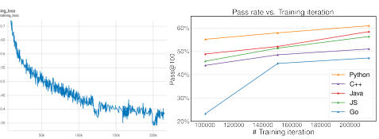

Figure 13: Training loss of CodeGeeX.

Figure 14: HumanEval-X pass rate vs. iteration.

## A.3    Evaluation On Humaneval-X (Additional)

Pass rate vs. number of training iterations. We show in Figure 13 that the cross entropy loss decreases steadily during training while the pass rate in HumanEval-X continues to improve for different languages in Figure 14.

Pass rate distribution vs. Languages for other code generation models. We show in Figure 15 that other code generation models also have various pass rate distribution for different languages.

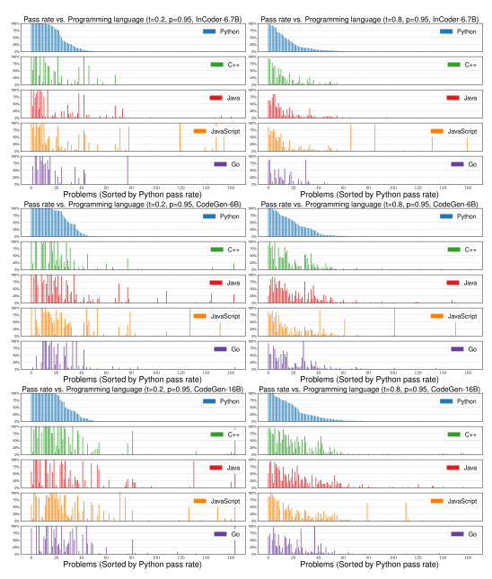

Figure 15: In HumanEval-X, each problem's pass rate varies when generating in different programming languages. Left: t = 0.2,p = 0.95; Right: t = 0.8,p = 0.95. From top to bottom:
InCoder-6.7B, CodeGen-Multi-6B, CodeGen-Multi-16B.

### A.4 Evaluation On Other Benchmarks A.4.1 Evaluation On Humaneval

The evaluation setting on HumanEval is the same as HumanEval-X. We show that among multilingual code generation models, CodeGeeX achieves the second highest performance on HumanEval, reaching 60% in pass@100 (surpassed by PaLMCoder-540B). We also notice that monolingual models outperforms multilingual ones with a large margin, indicating that multilingual models require a larger model capacity to master different languages.

Table 10: The results of CodeGeeX on HumanEval benchmark. The metric is pass@k introduced in Chen et al. (2021) (* use the biased pass@k from Chowdhery et al. (2022)). Nucleus sampling is used with top-p=0.95 and sampling temperature being 0.2/0.6/0.8 for @1/@10/@100 respectively.

| Shell          | 2.7498   | 1.7325   | # language: Shell           |
|----------------|----------|----------|-----------------------------|
| PHP            | 2.1698   | 1.3671   | // language: PHP            |
| CSS            | 1.5674   | 0.9876   | /* language: CSS */         |
| TypeScript     | 1.1667   | 0.7351   | // language: TypeScript     |
| SQL            | 1.1533   | 0.7267   | - language: SQL             |
| TeX            | 0.8257   | 0.5202   | % language: TeX             |
| Rust           | 0.5228   | 0.3294   | // language: Rust           |
| Objective\-C   | 0.4526   | 0.2851   | // language: Objective\-C   |
| Scala          | 0.3786   | 0.2385   | // language: Scala          |
| Kotlin         | 0.1707   | 0.1075   | // language: Kotlin         |
| Pascal         | 0.0839   | 0.0529   | // language: Pascal         |
| Fortran        | 0.077    | 0.0485   | !language: Fortran          |
| R              | 0.0447   | 0.0281   | # language: R               |
| Cuda           | 0.0223   | 0.014    | // language: Cuda           |
| C#             | 0.0218   | 0.0138   | // language: C#             |
| Objective\-C++ | 0.0014   | 0.0009   | // language: Objective\-C++ |

### A.4.2 Evaluation On Mbpp

MBPP dataset is proposed by Austin et al. (2021), containing 974 problems in Python. Due to specific input-output format, MBPP need to be evaluated under a few-shot setting. We follow the splitting in the original paper and use problems 11-510 for testing. Under 1-shot setting, we use problem 2 in prompts. Under 3-shot setting, we use problem 2,3,4 in prompts. The metric is pass@k, k ∈ {1, 10, 80}. For pass@1, the temperature is 0.2 and top-p is 0.95; for pass@10 and pass@ 80, the temperature is 0.8 and top-p is 0.95. For baselines, we consider LaMDA-137B, PaLM-540B, Code-davinci-002 (online API version of OpenAI Codex), PaLMCoder-540B and InCoder-6.7B. The results indicate that the model capacity is essential for multilingual code generation model. With significantly more parameters, PaLM and Codex outperform CodeGeeX with a large margin. Meanwhile, we find that more shot in the prompts harm the performance of CodeGeeX, the same phenomenon have also been discovered in InCoder (Fried et al., 2022). We assume that it is because smaller models do not have enough reasoning ability to benefit from the few-shot setting.

### A.4.3 Evaluation On Codexglue

|                                                                                                       |    |     | = 100,  Weighted   |      |            |    |          |        | Table 9: Detailed assignment of budget allocation strategies. Given budget k   |
|-------------------------------------------------------------------------------------------------------|----|-----|--------------------|------|------------|----|----------|--------|--------------------------------------------------------------------------------|
| distribute the budgets according to the proportions of language in the training corpus of each model. |    |     |                    |      |            |    |          |        |                                                                                |
|                                                                                                       |    | C++ |                    | Java | JavaScript | Go | Strategy | Python | Model                                                                          |
|                                                                                                       |    | 20  |                    | 20   | 20         | 20 | Uniform  | 20     | All                                                                            |
|                                                                                                       | 22 | 36  |                    | 11   |            | 14 |          | 17     | GPT\-J\-6B                                                                     |
|                                                                                                       | 22 | 36  |                    | 11   |            | 14 |          | 17     | GPT\-NeoX\-20B                                                                 |
|                                                                                                       |    | 12  |                    | 5    | 34         | 4  | Weighted | 45     | InCoder\-6.7B                                                                  |
|                                                                                                       |    | 38  |                    | 29   | 8          | 8  |          | 17     | CodeGen\-Multi\-6B/16B                                                         |
|                                                                                                       |    | 33  |                    | 20   | 9          | 6  |          | 32     | CodeGeeX\-13B (ours)                                                           |

CodeXGLUE is a benchmark proposed by Lu et al. (2021), containing multiple datasets to support evaluation on multiple tasks, using similarity-based metrics like CodeBLEU, BLEU and accuracy for generation tasks. We test the performance of CodeGeeX on the **code summarization** task of CodeXGLUE. We first fine-tune the parameters of CodeGeeX on the given training set, mixing the training data in all languages to get one fine-tuned model. Then, we test the performance of the fine-tuned model on each language, using BLEU score for evaluation because the models generate natural language in summarization tasks. For all languages, we set temperature to 0.2 and top-p to 0.95, and generate one summarization for each sample in the test set. We report the results in Table 12. CodeGeeX obtains an average BLEU score of 20.63, besting all baseline models. It is worth noting that CodeGeeX is not pre-trained on Ruby, and after removing the results on Ruby for all models, CodeGeeX outperforms the best baseline model (DistillCodeT5 from Wang et al. (2021)) by 1.88 in the average BLEU score.

Table 12: The results of CodeGeeX on **code summarization** in CodeXGLUE benchmark (Lu et al., 2021). Six languages are considered, Ruby, JavaScript, Go, Python, Java, PHP. The metric is the BLEU score. * We don't have Ruby in the pretraining corpus.

| CodeParrot (Tunstall et al., 2022)    | 1.5B   | Multi   | Yes   | 4.00%   | 8.70%   | 17.90%   |
|---------------------------------------|--------|---------|-------|---------|---------|----------|
| PolyCoder (Xu et al., 2022)           | 2.7B   | Multi   | Yes   | 5.60%   | 9.80%   | 17.70%   |
| GPT\-J (Wang and Komatsuzaki, 2021)   | 6B     | Multi   | Yes   | 11.60%  | 15.70%  | 27.70%   |
| CodeGen\-Multi (Nijkamp et al., 2022) | 6.1B   | Multi   | Yes   | 18.16%  | 27.81%  | 44.85%   |
| InCoder (Fried et al., 2022)          | 6.7B   | Multi   | Yes   | 15.20%  | 27.80%  | 47.00%   |
| GPT\-NeoX (Black et al., 2022)        | 20B    | Multi   | Yes   | 15.40%  | 25.60%  | 41.20%   |
| LaMDA (Thoppilan et al., 2022)        | 137B   | Multi   | No    | 14.00%* | \-      | 47.30%*  |
| CodeGen\-Multi (Nijkamp et al., 2022) | 16.1B  | Multi   | Yes   | 19.22%  | 34.64%  | 55.17%   |
| PaLM\-Coder (Chowdhery et al., 2022)  | 540B   | Multi   | No    | 36.00%* | \-      | 88.40%*  |
| Codex (Chen et al., 2021)             | 12B    | Mono    | No    | 28.81%  | 46.81%  | 72.31%   |
| CodeGen\-Mono (Nijkamp et al., 2022)  | 16.1B  | Mono    | Yes   | 29.28%  | 49.86%  | 75.00%   |

### A.4.4 Evaluation On Xlcost

XLCoST is a benchmark proposed by Zhu et al. (2022), containing parallel multilingual code data, with code snippets aligned among different languages. For generation tasks, XLCoST uses CodeBLEU, BLEU for evaluation. We choose the **code translation** task of XLCoST for CodeGeeX evaluation. We first fine-tune the parameters of CodeGeeX on the given training set, combining the training data in all 42 languages pairs to obtain one fine-tuned model. Then, we test the performance of the fine-tuned model on each language pair with CodeBLEU score. For all language pairs, we set temperature to 0.2 and top-p to 0.95, and generate one translation for each sample in the test set. We report the results in Table 13. CodeGeeX performs better than all baseline models on all language pairs except for: PHP to Python on program level, C++ to Python on snippet level, and PHP to Python on snippet level. On average, CodeGeeX outperforms the baseline by 4.10 on program level and by 1.99 on snippet level.

| CodeBERT (Feng et al., 2020)  17.83  12.16  14.90  18.07  19.06  17.65  25.16                          |
|--------------------------------------------------------------------------------------------------------|
| PLBART (Ahmad et al., 2021)  18.32  14.11  15.56  18.91  19.30  18.45  23.58                           |
| 16.60  ProphetNet\-X (Qi et al., 2021)  18.54  14.37  18.43  17.87  19.39  24.57                       |
| CoTexT (Phan et al., 2021)  18.55  14.02  14.96  18.86  19.73  19.06  24.68                            |
| PolyglotCodeBERT (Feng et al., 2020)  19.06  14.75  15.80  18.77  18.71  20.11  26.23                  |
| DistillCodeT5 (Wang et al., 2021)  20.01  15.75  16.42  20.21  20.59  20.51  26.58                     |
| CodeGeeX (ours)  20.63 10.05*  16.01 24.62  22.50 19.60  31.00                                         |
| A.4.4  Evaluation on XLCoST                                                                            |
| XLCoST is a benchmark proposed by Zhu et al. (2022), containing parallel multilingual code             |
| data, with code snippets aligned among different languages. For generation tasks, XLCoST uses          |
| CodeBLEU, BLEU for evaluation. We choose the code translation task of XLCoST for CodeGeeX              |
| evaluation. We first fine\-tune the parameters of CodeGeeX on the given training set, combining the    |
| training data in all 42 languages pairs to obtain one fine\-tuned model. Then, we test the performance |
| of the fine\-tuned model on each language pair with CodeBLEU score.                                    |
| For all language pairs, we set temperature to 0.2 and top\-p to 0.95, and generate one translation for |
| each sample in the test set. We report the results in Table 13. CodeGeeX performs better than all      |
| baseline models on all language pairs except for: PHP to Python on program level, C++ to Python on     |
| snippet level, and PHP to Python on snippet level. On average, CodeGeeX outperforms the baseline       |
| by 4.10 on program level and by 1.99 on snippet level.                                                 |

Table 13: The results of CodeGeeX on **code translation** in XLCoST benchmark. Six languages are considered, C++, Java, Python, C\#, JavaScript, PHP, C. The metric is CodeBLEU (Ren et al., 2020). The results of baselines are adopted from the original paper (Zhu et al., 2022).

### 26 A.5 Examples Of Codegeex Generation

Figure 16: Solutions (Problem 0 in HumanEval-X) generated by CodeGeeX. Prompt and generated

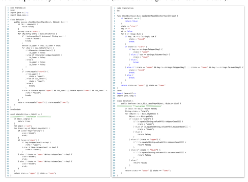 codes are separated by the 'Generation' line (added after the generation as an indicator).

Figure 17: Solutions (Problem 95 in HumanEval-X) translated by CodeGeeX. Prompt and generated codes are separated by the 'Translation' line (added after the generation as an indicator).

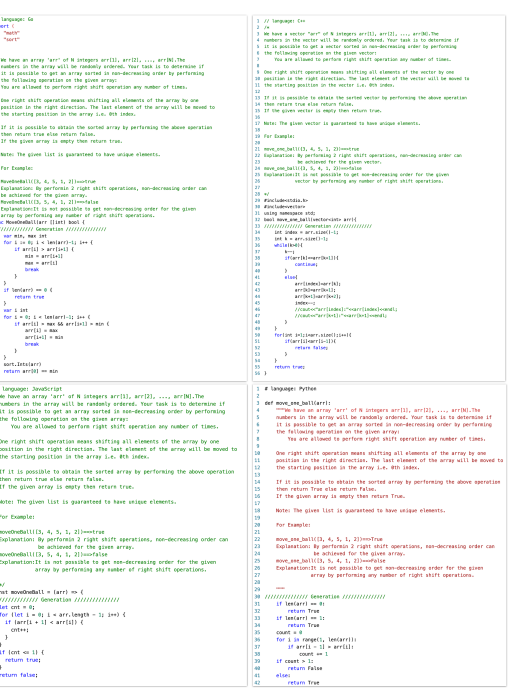

10

| 20   |    |
|------|----|
| 21   |    |
| 22   |    |
| 23   |    |
| 24   |    |
| 25   |    |
| 26   |    |
| 27   |    |
| 28   | (  |
| 29   | 1  |
| 30   |    |
| 31   |    |
| 32   |    |
| 33   |    |
| 34   |    |
| 35   |    |
| 36   |    |

Figure 18: Solutions (Problem 109 in HumanEval-X) generated by CodeGeeX. Prompt and generated codes are separated by the 'Generation' line (added after the generation as an indicator).

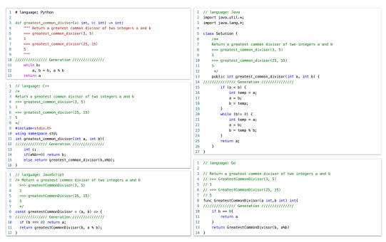

Figure 19: Solutions (Problem 13 in HumanEval-X) generated by CodeGeeX. Prompt and generated codes are separated by the 'Generation' line (added after the generation as an indicator).

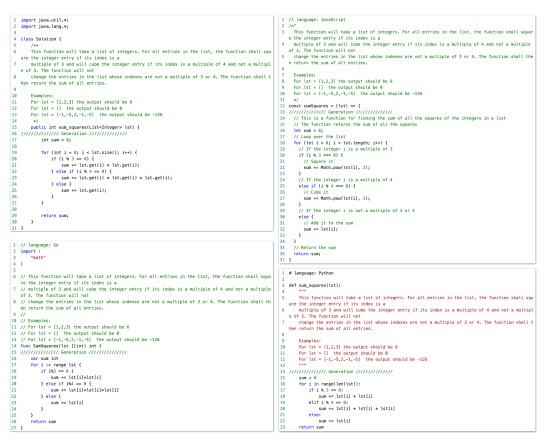

Figure 20: Solutions (Problem 142 in HumanEval-X) generated by CodeGeeX. Prompt and generated codes are separated by the 'Generation' line (added after the generation as an indicator).

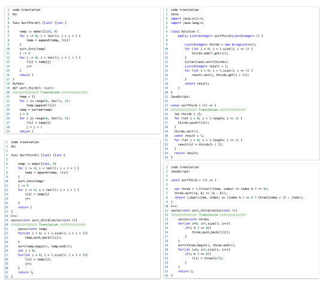

Figure 21: Solutions (Problem 33 in HumanEval-X) translated by CodeGeeX. Prompt and generated codes are separated by the 'Translation' line (added after the generation as an indicator).

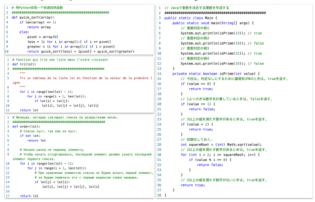

Figure 22: Examples of CodeGeeX generation with prompts in Chinese, French, Russia and Japanese. Prompt and generated codes are separated by multiple '\#'s (added after the generation as an indicator).
