# Unlocking The Potential Of Chatgpt: A Comprehensive Exploration Of Its Applications, Advantages, Limitations, And Future Directions In Natural Language Processing

Walid Hariri Labged Laboratory, Computer Science department Badji Mokhtar University Annaba, Algeria hariri@labged.net

#### A**Bstract**

Large language models have revolutionized the field of artificial intelligence and have been used in various applications. Among these models, ChatGPT (Chat Generative Pre-trained Transformer) has been developed by OpenAI, it stands out as a powerful tool that has been widely adopted. ChatGPT has been successfully applied in numerous areas, including chatbots, content generation, language translation, personalized recommendations, and even medical diagnosis and treatment. Its success in these applications can be attributed to its ability to generate human-like responses, understand natural language, and adapt to different contexts. Its versatility and accuracy make it a powerful tool for natural language processing (NLP). However, there are also limitations to ChatGPT, such as its tendency to produce biased responses and its potential to perpetuate harmful language patterns. This article provides a comprehensive overview of ChatGPT, its applications, advantages, and limitations. Additionally, the paper emphasizes the importance of ethical considerations when using this robust tool in real-world scenarios. Finally, This paper contributes to ongoing discussions surrounding artificial intelligence and its impact on vision and NLP domains by providing insights into prompt engineering techniques.

K**eywords** ChatGPT · Artificial intelligence · Natural language processing · Generative models · Prompt engineering

## 1 Introduction

Artificial intelligence (AI) has revolutionized the way we interact with machines and has transformed a wide range of industries. One of the most promising applications of AI is in the field of natural language processing (NLP), which involves the development of algorithms and models that can understand and generate human language. Among these NLP tools, ChatGPT (Generative Pre-trained Transformer) is a public tool developed by OpenAI that is based on the GPT language model technology [1]. It has emerged as a powerful and versatile tool for processing natural language. ChatGPT has been successfully applied in various real-world applications, making it a valuable asset in our daily lives. One example of its application is in the development of chatbots, which are used in customer service, technical support, and as virtual assistants [2]. These chatbots can interact with customers in a natural and human-like way, providing them with information and answering their questions. For example, the chatbot created by the National Health Service (NHS) in the UK uses ChatGPT to provide health advice and information to its users. Another example of ChatGPT application is in content generation, such as news articles and product descriptions. By training the model on relevant data, it can generate high-quality, relevant content automatically. The Associated Press uses ChatGPT to generate financial news articles, and GPT-3 language model has been used to generate everything from poetry to computer code [3].

ChatGPT has also been used for language translation, personalized recommendations, and medical diagnosis and treatment. For instance, ChatGPT has been used to develop a model that can diagnose medical conditions or recommend appropriate treatments by analyzing large amounts of medical data [4].

However, despite its many applications, there are also limitations to ChatGPT. For example, it may produce biased responses and perpetuate harmful language patterns if not trained on diverse and inclusive data. Therefore, it is important to take into account ethical considerations when using ChatGPT in real-world applications. In this article, we will explore the various applications of ChatGPT in real-life scenarios, its advantages, and its limitations. We will also discuss the ethical implications of using ChatGPT and ways to overcome potential limitations. Additionally, the article adds to the ongoing discussions about the effects of artificial intelligence on the domains of vision and NLP by offering valuable insights into prompt engineering techniques. By understanding the potential of this powerful tool, we can make more informed decisions about how to use it effectively and responsibly in our daily lives. Various databases have been used in this review paper, including IEEE Xplore, ScienceDirect, SpringerLink, ACM

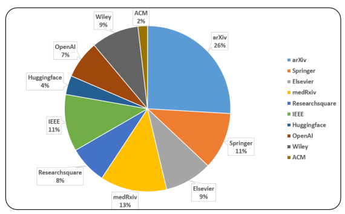 Digital Library, and pre-print repositories such as Researchsquare, medRxiv, and ArXiv, to search for sources related to ChatGPT. They mainly focused on pre-print repositories as well as websites of OpenAI and Huggingface since the topic is still new and not yet widely published in international journals. They also included conference papers and used search engines like Google Scholar, Semantic Scholar, and Academia. Figure 1 illustrates the percentage distribution of articles found in various publishers and pre-print repositories analyzed in this paper. The authors selected articles using specific keywords like ChatGPT, Advantages, Limitations, Large language model, Natural language processing, Chatbots, OpenAI, Deep learning, pre-trained models, Text generation, Transformers, GPT-3.5, GPT-4, and ChatGPT
applications. The most recent update of the paper using the aforementioned keywords was conducted on April 04, 2023.

Figure 1: Distribution of articles found in various publishers and pre-print repositories analyzed in this paper.

The rest of the paper is organized as follows: Section 2 presents an overview of ChatGPT and its capabilities. The transformer architecture and history are presented in Section 3. In Section 4, many applications of ChatGPT in real-word scenarios have been presented in detail with many examples. Section 5 presents the advantages of ChatGPT in natural language processing, where the limitations are discussed in Section 6. Ethical considerations of ChatGPT are highlighted in Section 7. The prompt engineering and generation are discussed in Section 8. Sections 9 and 10 discuss the future directions of ChatGPT in NLP and vision domains. Conclusions end the paper.

## 2 Overview Of Chatgpt And Its Capabilities

ChatGPT (Generative Pre-trained Transformer) is generative AI model (GAI) based on natural language processing techniques, developed by OpenAI, a leading AI research organization founded by a group of technology luminaries including Elon Musk, Sam Altman, Greg Brockman, and Ilya Sutskever [5]. This AI tool has achieved 100 million users in just three months. The development of ChatGPT was a major milestone in the field of NLP. Prior to its release, NLP models were typically task-specific and required significant amounts of labeled data for training. ChatGPT, on the other hand, was pre-trained on vast amounts of unlabeled data, allowing it to generate high-quality natural language text without specific task-related training data. The development of ChatGPT was based on the Transformer architecture, a neural network architecture designed specifically for NLP tasks. The Transformer architecture was introduced in a seminal paper by Vaswani et al. in 2017 [6] and quickly gained popularity due to its ability to outperform existing NLP models on a range of tasks. In June 2018, OpenAI released the first version of ChatGPT, which was pre-trained on a massive dataset of over 40 GB of text data from the internet. The release of ChatGPT was met with significant excitement and attention from the NLP community, as it demonstrated the potential for pre-trained models to generate high-quality natural language text. There are two main categories of GAI models: unimodal models and multimodal models. Unimodal models take prompts from the same modality as the content they generate, while multi-modal models can accept prompts from different modalities and produce results in multiple modalities as shown in Figure 2. Over the following years, OpenAI continued to develop and refine ChatGPT, releasing several larger and more advanced

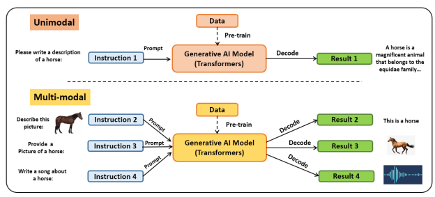 versions of the model. In May 2020, OpenAI released GPT-3, the latest and most powerful version of ChatGPT, which has been widely hailed as a breakthrough in NLP. GPT-3 has over 175 billion parameters, making it the largest NLP
model to date, and has been used in a range of applications, from chatbots and virtual assistants to content generation and language translation. On March 14th, 2023, OpenAI announced the release of GPT-4 [7, 8], which has 100 trillion parameters that offer greater improvements compared to those found in GPT-3 such as accepting image and text inputs and emitting text outputs. GPT-4 performs better than previous large language models and most current advanced systems on traditional NLP benchmarks. In addition, GPT-4 shows remarkable results on the MMLU benchmark, which includes multiple-choice questions covering 57 topics in English and other languages. GPT-4 not only surpasses existing models in English by a significant margin but also exhibits strong performance in other languages. On the translated versions of the MMLU benchmark, GPT-4 outperforms the state-of-the-art models presented in [9]. Recently, it has been proven that GPT-4 becomes more accurate when it adopts self-supervising learning with 30% of performance boost using the "Reflexion" technique. This means that the existing impressive capability of GPT-4 to carry out different tests is enhanced by a newly introduced framework that enables AI agents to imitate human-like self-reflection and self-evaluation [10, 11]. Essentially, it involves additional steps in which GPT-4 creates tests to analyze its own answers, identifying mistakes and weaknesses, and subsequently revises its solutions accordingly. As a result, this framework enhances the ability of GPT-4 to perform various tests more effectively as shown in Figure 3.

Figure 2: Generative AI models: Unimodal and multi-modal examples.

Figure 3: GPT-4 performance boost using "Reflexion" technique [10].

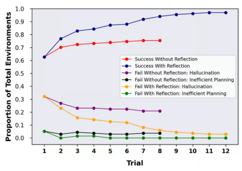

It is worth noting that GPT-3 and data-to-text are both technologies that belong to the field of NLG or "Natural Language Generation". This term refers to the process of generating text in natural language through automation. Although these two technologies may appear similar at first, they operate in distinct ways. Table 1 presents some of the differences between them.

| Method          | Data\-to\-Text                                                                       | GPT\-3                                                                                    |
|-----------------|--------------------------------------------------------------------------------------|-------------------------------------------------------------------------------------------|
| Text Generation | Generates text based on structured data  such as attributes from tables like product | Learns from existing text through training  on hundreds of billions of words from sources |
|                 | features or soccer match results                                                     | like Wikipedia, books, and web pages                                                      |
| Control Over    | User has full control over the resulting text                                        | Generated content cannot                                                                  |
| Content         |                                                                                      | be controlled by the user                                                                 |
| Text Quality    | Emphasis on consistency, meaningfulness,  and overall quality                        | Texts must be fact\-checked as they may  contain incorrect or inappropriate               |
|                 |                                                                                      | information                                                                               |
| Scalability     | Texts are easily scalable and customizable                                           | Generates individual texts, but not as                                                    |
|                 |                                                                                      | scalable as Data\-to\-Text                                                                |
| Languages       | Can create multilingual content in up to 110                                         | Can create multilingual content on a                                                      |
|                 | languages                                                                            | per\-language basis                                                                       |
| Usage           | Best for generating large amounts of text from                                       | Useful for creating basic text and                                                        |
|                 | structured data sets with variable details                                           | simplifying the writing process.                                                          |

Table 1: GPT-3 versus data-to-text.

## 3 Transformers And Pre-Trained Language Models

The Transformer architecture is used as the main structure for several cutting-edge models, including GPT-3 [12], DALL-E-2 [13] and Codex [14]. It was created to overcome the limitations of traditional models like RNNs in managing sequences of varying lengths and contextual information. The Transformer relies on a self-attention mechanism, which enables the model to focus on different segments of the input sequence. The Transformer comprises an encoder and a decoder. The encoder processes the input sequence and produces hidden representations, while the decoder uses these hidden representations to generate the output sequence. Each layer of the encoder and decoder contains a multi-head attention mechanism and a feed-forward neural network. The multi-head attention is the most important part of the Transformer, as it determines how tokens are weighted based on their relevance. This method of information routing allows the model to better handle long-term dependencies, leading to improved performance across various NLP tasks.

Another advantage of the Transformer is its parallelizability, which allows it to handle large-scale pre-training and adaptability to different downstream tasks without inductive biases. Figure 4 presents the architecture of the transformer.

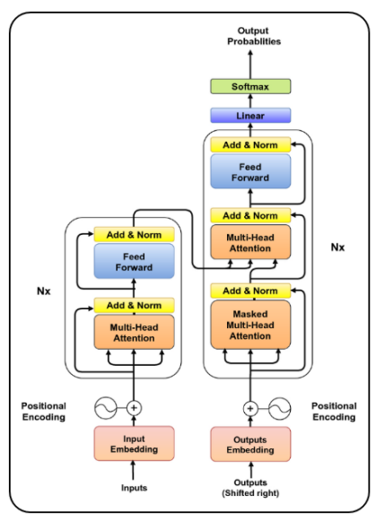

Figure 4: Transformer architecture.

The Transformer architecture has become the primary choice in natural language processing due to its ability to learn and parallelize. Pre-trained language models that use the Transformer architecture can be divided into two categories based on their training tasks: autoregressive language modeling and masked language modeling.

Masked language modeling: used in models like BERT [15] and RoBERTa [16], involves predicting the probability of a masked token given its context within a sentence.

Autoregressive language modeling: used in models like GPT-3 and Open pre-trained transformer language models
(OPT) [17], involves modeling the probability of the next token in a sentence given the preceding tokens, making it a left-to-right language modeling approach. Autoregressive models are better suited for generative tasks than masked language models. RoBERTa uses the same architecture as BERT but performs better by increasing the amount of pre-training data and incorporating more challenging pre-training objectives. XL-Net [18], another model based on BERT, uses permutation operations to change the prediction order for each training iteration, allowing the model to learn more information across tokens. Figure 5 depicts the timeline of the most known generative models with their number of parameters.

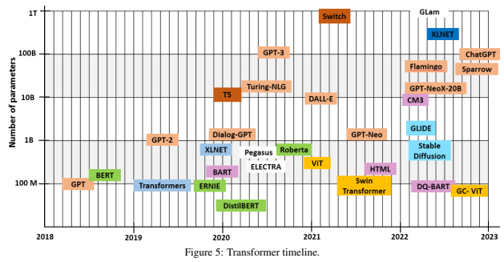

## Applications Of Chatgpt In Real-World Scenarios 4

Since its emergence, ChatGPT has become increasingly popular and has been applied in a wide range of applications and fields. Some notable examples include healthcare and education chatbots, finance, entertainment, cybersecurity, marketing, and vision tasks. While the main modality used in ChatGPT is text, it is also possible to incorporate other tools and create a multimodal application that includes sound, images, or videos. Some examples of ChatGPT use cases are presented in Figure 6, which demonstrate how ChatGPT can be applied in real-world scenarios, explained one by one in the following:

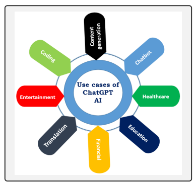

Figure 6: Use cases of ChatGPT.

#### 4.1 Healthcare:

ChatGPT has been used to develop virtual health assistants that can understand and respond to patients' questions and concerns [19]. The following are some instances of how artificial intelligence is utilized in the healthcare industry as described in [4]:
- **Diagnostic support:** AI algorithms can aid healthcare providers in diagnosing various medical conditions, such as skin cancer, heart disease, and eye diseases.

- **Predictive analytics:** By analyzing patient data, AI can predict future health issues and help healthcare providers to intervene early.

- **Personalized medicine:** AI can analyze an individual patient's data to create customized treatment plans to improve patient outcomes.

- **Imaging analysis:** AI algorithms can assist in the interpretation of medical images like X-rays, CT scans, and MRI scans.

- **Drug discovery:** AI can analyze large amounts of data from clinical trials to expedite drug development and enhance the chances of success for new treatments.

- **Telemedicine:** AI can support remote patient consultations and improve healthcare accessibility in remote areas.

- **Surgical support:** AI can help during surgical procedures by guiding surgical instruments and providing real-time feedback.

ChatGPT can be used to improve the quality of the previous services by providing better and more accurate help to the assistants. For example, Figure 7 shows the answer of ChatGPT about Covid-19 symptoms. These assistants can provide personalized recommendations and advice, such as medication reminders or diet plans, and help patients manage their health conditions. Moreover, ChatGPT has the potential to generate discharge summaries, which are comprehensive medical documents summarizing a patient's hospital stay. More Potential Benefits of ChatGPT in Healthcare can be found in [20]. Wang et al. [21] proposed a study to compare the level of knowledge and interpretation skills between ChatGPT and medical students in China. To achieve this goal, the Chinese National Medical Licensing Examination was administered to both ChatGPT and medical students, and their performances were compared. Johnson et al. [22] assessed the accuracy and reliability of ChatGPT to generate medical responses. In this study, a total of 33 physicians from 17 different specialties were involved in the generation of 284 medical questions. These questions were then categorized by the physicians themselves based on their perceived difficulty level, which was classified as either easy, medium, or hard. The questions were designed to elicit either binary (yes/no) responses or descriptive answers. On the other hand, Benoit [23] has tested ChatGPT to assess its potential in quickly generating, rewriting, and evaluating sets of clinical vignettes. The evaluation included diagnostic and triage accuracy of many diseases including anaphylaxis, asthma, bronchiolitis, croup, ear infection, fever, functional constipation, and gastroenteritis. Similarly, Gunther Eysenbach[24] conducted experiments using ChatGPT to explore possible applications of chatbots in medical education. ChatGPT demonstrated its ability to create a virtual patient simulation and quizzes for medical students, evaluate a simulated doctor-patient interaction, and even summarize a research article. Usually, junior doctors are responsible for composing these summaries, but due to their workload, they may not be given the priority they deserve, causing delays in patients' discharges and incomplete summaries [25]. This puts pressure on an already overworked junior doctor workforce and may lead to potential patient safety issues during the transition from secondary to primary care. However, if ChatGPT is utilized, it could alleviate the burden of composing discharge summaries, resulting in more timely and high-quality summaries that are essential for safe patient care [26]. Other ChatGPT decision-making and clinical decision support can be found in [27, 28, 29, 30, 31, 32].

#### 4.2 Education:

ChatGPT has been used to develop intelligent tutoring systems that can provide personalized learning experiences to students [34]. These systems can understand students' learning styles and adapt the content and teaching methods to their needs, helping them to achieve better learning outcomes [35]. To provide further understanding of the impact of ChatGPT on students, Raman et al. [36] conducted a study involving 288 university students, aims to identify the factors that determine students' intentions to use ChatGPT in higher education, using Rogers' perceived theory of attributes as a theoretical framework. The study examined five factors that influence the adoption of ChatGPT: Relative Advantage, Compatibility, Ease of Use, Observability, and Trialability. The gender-based analysis of the study indicates that male students prioritize compatibility, ease of use, and observability as factors in ChatGPT adoption. On the other hand, female students give more importance to factors such as ease of use, compatibility, relative advantage, and trialability when it comes to adopting ChatGPT.

Figure 7: Example of medical question about Covid-19 symptoms [33].

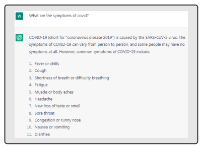

AlAfnan et al. [37] investigate in their research the potential advantages and difficulties of utilizing the ChatGPT chatbot for academic purposes. The authors aim to provide recommendations to teachers and professors in schools and universities. The study aims to answer three main questions: (1) What are the potential benefits of using ChatGPT for academic purposes? (2) What are the challenges associated with using ChatGPT for academic purposes? and (3) What advice can be given to instructors who use ChatGPT in their teaching?. Further, in this study, the authors tested the similarity index of generated text by ChatGPT and paraphrased sentences using Turnitin. Additionally, Cooper [38] has analyzed the use of ChatGPT in science education by addressing three questions: (1) How does ChatGPT respond to inquiries regarding science education? (2) What are some potential ways educators can integrate ChatGPT into their science teaching? and (3) How was ChatGPT utilized in this research, and what are the author's reflections on its use as a research tool? Moreover, The impact of ChatGPT on education has raised concerns, as it is capable of writing essays on various topics. To test its abilities, Is has been assigned an exam and a final project from a class on science denial at George Washington University. Although it was able to find factual answers, its scholarly writing skills still need improvement. This could prompt educators to rethink their teaching methods and assignments to encourage creativity and critical thinking, rather than relying on AI [39]. While this could be positive, there are concerns about the use of ChatGPT in scientific paper writing. A recent study found that academic reviewers only detected 63% of the fake abstracts generated by ChatGPT.

This raises the possibility of AI-generated text being published in scientific literature, which is a worrisome trend [40]. Besides, the study showed that the ability of ChatGPT to provide specific and relevant information on various topics such as science, history, business, health, and technology was perceived as useful by many users. One participant even noted that it could reduce the workload of teachers and provide immediate feedback to students. For example, Temara et al. [41] utilized a case study approach to examine and examine how ChatGPT can be used to gather useful reconnaissance data. ChatGPT is capable of generating a variety of intelligence related to specific targets, such as Internet Protocol (IP) address ranges, domain names, network topology, vendor technologies, ports, services, and even the operating systems used by the target. However, some users encountered issues with the accuracy of ChatGPT responses, as well as its limited ability to provide certain contextual information [42]. Additionally, there were some cases where ChatGPT provided alternative answers that contradicted previous responses given on the same topic. In the context of exams, according to Teo Susnjak [43], The ability of ChatGPT to display analytical thinking abilities and produce very convincing text with little guidance makes it a possible danger to the credibility of online exams, especially in higher education contexts where such exams are becoming more common. Also, through interactions with ChatGPT, it became apparent that the chatbot is unable to express any emotions as shown in Figure 8. As a result, there is a need to explore ways to make chatbots more human-like, not just in terms of their ability to provide thoughtful responses, but also in terms of their capacity to express emotions and exhibit a distinct personality. Other ChatGPT-based educational applications can be found in [44, 45, 46, 47, 48].

Figure 8: Example of emotion answer from ChatGPT [33].

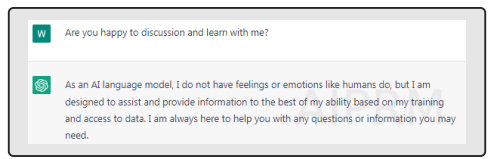

#### 4.3 Customer Service:

ChatGPT has been used to develop chatbots that can handle customer inquiries and support requests. These chatbots can understand natural language text and provide personalized responses, improving the overall customer experience and reducing the workload of customer service agents.

Also, in the business sector, chatGPTcan is able to enhance e-commerce via chat, finance and productivity. Some examples can be found in [49]. Additionally, it can affect labor market [50]. It is expected that the use of AI may conduct workers to lose their jobs, especially those who perform repetitive tasks. This effect on the job market is linked to the fact that workers who are let go may not have the necessary skills to adapt to other types of work, leading to prolonged periods of unemployment. However, providing opportunities for training and acquiring new skills can help alleviate the negative impact of AI on the job market.

#### 4.4 Content Creation:

ChatGPT has been used to generate high-quality content for websites, social media, and marketing campaigns. The model can generate text in various formats, such as blog posts, product descriptions, and social media captions, and can adapt to different writing styles and tones. Regarding education content in the field of algebra, the authors in [51] evaluated effectiveness of ChatGPT hints compared to those authored by human tutors in two algebra topic areas, Elementary Algebra and Intermediate Algebra, with 77 participants. They found that 70% of the hints produced by ChatGPT passed manual quality checks and both human and ChatGPT hints resulted in positive learning gains. However, the gains were only statistically significant for hints created by human tutors. The study found that human-created hints resulted in significantly higher learning gains than ChatGPT hints in both topic areas, although ChatGPT participants in the Intermediate Algebra experiment were already at a high level and performed similarly to the control group at pre-test. Moreover, ChatGPT can also be used to generate social media content starting with textual content, and also multimedia content including images and videos using additional tools such as Canvas and Midjourney. About plagiarism, Hamaweh [52] states that If a student or academic writer employs ChatGPT to produce an essay but gives due credit to the ideas obtained through reverse searching, this would not constitute plagiarism. It is possible for students or researchers to plagiarize without using ChatGPT, but the difference now is that they can do it much more quickly. Nevertheless, this should not be viewed as an excuse to avoid utilizing ChatGPT. Ultimately, it is the responsibility of users, whether students or faculty, to use it responsibly by being properly informed and educated on how to do so. Without ChatGPT, one could still write a report or paper that incorporates ideas borrowed from others without being detected. Other ChatGPT-based content creation examples can be found in [53, 54].

#### 4.5 Language Translation:

ChatGPT has been used to develop language translation systems that can translate text between different languages with remarkable accuracy. These systems can understand the nuances of different languages and provide context-specific translations, improving communication between people from different cultures and backgrounds. In [55], the authors studied the performance of ChatGPT as a translator compared to Google, DeepL, and Tencent. Also, ChatGPT can be used for code translation between programming languages such as Java, Python, and others. This could be achieved by providing the code snippet in one language as input to the large language model, along with a prompt that specifies the desired output language. The model would then generate the equivalent code in the target language based on its understanding of the syntax and semantics of the input language and the prompt provided [56]. However, it may not be as accurate or efficient as specialized code translation tools. It may also require specific prompts and inputs to accurately translate code. According to Hamaweh [52], ChatGPT can prove to be highly advantageous by assisting in the quick generation of texts that would otherwise require significant time and effort by humans. Therefore, there is no need to worry about the efficiency of ChatGPT in generating, summarizing, translating, writing, and editing English texts.

Peng et al. [57] conducted research on ways to enhance ChatGPT translation proficiency by exploring three different viewpoints: temperature, task, and domain information. They also proposed two uncomplicated yet impactful prompts. Additionally, they conducted a comparison between ChatGPT and Google Translate's translation capabilities using various translation prompts.

#### 4.6 Entertainment:

ChatGPT has been used to develop chatbots that can simulate conversations with historical figures or fictional characters,

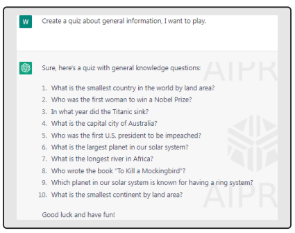 providing a unique and engaging entertainment experience [19]. Moreover, ChatGPT can be used to generate interactive stories where the user can choose their own adventure by selecting different options presented to them by the model. This can provide a unique and engaging storytelling experience for the user. Also, ChatGPT can be used to create personality quizzes (See Figure 9) where the model asks the user a series of questions to determine their personality traits or preferences. This can be a fun way for users to learn more about themselves and compare their results with others.

Figure 9: Example of a quiz generated by ChatGPT [33].

#### 4.7 Financial Services:

ChatGPT has been used to develop virtual financial advisors that can provide personalized investment recommendations and advice based on individual financial goals and risk tolerance as well as business AI decision-making [58]. These are just a few examples of the many applications of ChatGPT in various industries and fields [59, 60]. As technology continues to evolve and improve, it is expected to play an increasingly important role in our daily lives, transforming the way we interact with machines and each other.

#### 4.8 Atmospheric Science

ChatGPT has the capability to significantly contribute to enhancing our comprehension of climate change and refining the precision of climate forecasts. Various uses of ChatGPT can assist climate research, such as in interpreting and analyzing data, generating scenarios, evaluating models, and parameterizing models [61]. By leveraging diverse data inputs, this technology empowers researchers and policy-makers with a potent means to produce and scrutinize diverse climate scenarios, ultimately enhancing the accuracy of climate projections.

#### 4.9 Chatbots:

Chatbots are one of the most common applications of ChatGPT. A chatbot is an AI-powered computer program designed to simulate human conversation, usually through text or voice interactions [39]. Chatbots can be integrated into various platforms, such as websites, social media, messaging apps, and voice assistants, to provide personalized customer support, automate repetitive tasks, and engage with users. Recently, many browser extensions have been introduced to facilitate the use of ChatGPT in the web, emails, and also through vocal requests such as ChatGPT Writer, ChatGPT
for google, and Youtube summary with ChatGPT. 10 best ChatGPT Chrome extensions can be found in [62]. These extensions are already provided in Bing browser of Microsoft. One of the main advantages of using ChatGPT in chatbots is that it allows for more natural and human-like conversations. With its advanced language processing capabilities and vast knowledge base, ChatGPT can understand complex queries and respond with appropriate and relevant information [63]. This makes chatbots more efficient and effective in handling customer inquiries and support requests, while also improving the overall customer experience. Chatbots powered by ChatGPT can be used in a variety of industries and sectors. For example, in healthcare, chatbots can be used to provide medical advice, medication reminders, and mental health support. In finance, chatbots can be used to help customers manage their accounts, make payments, and get investment advice. In e-commerce, chatbots can be used to provide personalized product recommendations, track orders, and handle returns. One of the challenges in using ChatGPT in chatbots is ensuring that the responses generated by the model are accurate and relevant [64]. This requires a large and diverse training dataset, as well as careful monitoring and quality assurance measures to ensure that the chatbot is providing helpful and accurate information. Despite these challenges, chatbots powered by ChatGPT are becoming increasingly popular in various industries, and are expected to play a significant role in transforming the way businesses interact with their customers in the future.

During the first month following its launch, the author in [65] gathered tweets discussing ChatGPT, a novel AI chatbot.

By analyzing 233,914 tweets in English with the latent dirichlet allocation topic modeling algorithm, the author aimed to uncover the abilities of ChatGPT. The findings indicated that the discussions surrounding ChatGPT on Twitter primarily centered around news, technology, and reactions. Also, Salah et al. [66] conducted a research project that explored the connections among several factors, including trust in ChatGPT, how users perceive ChatGPT, stereotypes associated with ChatGPT, as well as two psychological outcomes: self-esteem and psychological well-being.

#### 4.10 Chatgpt For Computer Science Developers And Coding:

ChatGPT can also be useful for computer science developers and coding enthusiasts. One of the main applications of ChatGPT in this field is code generation. With its natural language processing capabilities, ChatGPT can understand human-readable descriptions of programming tasks and generate code to solve them. Utilizing ChatGPT can also be advantageous in creating queries for extensive systematic reviews that have a high level of accuracy as shown in [67]. For example, OpenAI has released a language model called Codex, which is based on GPT technology and trained on a massive dataset of code. Codex can understand natural language descriptions of coding tasks and generate code to solve them in various programming languages, such as Python, Java, and C++, and PHP as shown in Figure 10. This can save developers a significant amount of time and effort in writing code from scratch, especially for repetitive or routine tasks. Another application of ChatGPT in computer science is natural language programming. This involves creating programming languages that can be written and executed using natural language text instead of traditional programming syntax. With ChatGPT advanced language processing capabilities, it can be used to develop more intuitive and accessible natural language programming interfaces, making coding more accessible to people with different backgrounds and skill levels. ChatGPT can also be used to generate documentation and tutorials for programming languages and tools
[68]. With its ability to generate high-quality text, ChatGPT can help developers create clear and concise documentation that is easy to understand and follow. Generally, ChatGPT has the potential to revolutionize the way developers write and interact with code, making programming more accessible, efficient, and intuitive. To sum up, ChatGPT can enhance research and scholarship in academia through several ways, it can:
- Assist researchers in identifying relevant literature by generating summaries of articles or providing a list of relevant papers based on a given topic or keyword.

- Generate text in a specific style or tone, making it easy for researchers to produce draft versions of research papers, grant proposals, and other written materials.

- Help researchers analyze large amounts of text data, such as social media posts or news articles, by providing insights and identifying patterns in the data.

- Be used for machine translation, making research materials accessible in multiple languages. - Summarize scientific papers, reports, or other documents, making it easier for researchers to stay up-to-date with the latest developments in their field.

- Answer domain-specific questions, making it a powerful tool for scholars to find answers quickly and efficiently.

All these capabilities of ChatGPT can assist researchers in saving time and effort, enabling them to concentrate on the more analytical and creative aspects of their work. However, when using ChatGPT for academic writing and scientific research, it's essential to consider certain limitations that might undermine the research's quality. For instance, the utilization of ChatGPT has often been criticized for producing superficial, inaccurate, or erroneous content in scientific writing [69, 70]. The ethical concerns associated with ChatGPT usage involve the potential for bias resulting from the training datasets

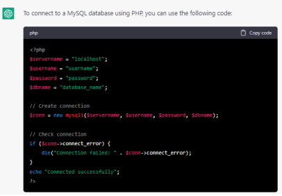

and the possibility of plagiarism. Additionally, the lack of transparency in the process of content generation has led to ChatGPT being labeled as a "black box" technology [71, 72, 73, 74].

Figure 10: Example of PHP code written by ChatGPT [33].

## 5 Advantages Of Chatgpt In Natural Language Processing

The advantages of ChatGPT in natural language processing are numerous and significant. Here are some examples:
- Improved Language Understanding: ChatGPT is capable of understanding natural language text better than previous language models. It can understand complex sentence structures, idiomatic expressions, and even sarcasm, making it more effective at processing natural language.

- Better Response Quality: With its large-scale training and ability to generate human-like responses, ChatGPT
can produce high-quality responses to natural language queries. This is especially important in chatbots and customer service applications where accuracy and relevance are crucial.

- Increased Efficiency: ChatGPT can help streamline natural language processing tasks, such as language translation, text summarization, and sentiment analysis. By automating these tasks, ChatGPT can save time and reduce the need for manual labor.

- Language Adaptability: ChatGPT can be trained on data from different languages and dialects, making it adaptable to various linguistic contexts. This means that it can provide accurate and relevant responses in multiple languages, which is essential in a globalized world.

- Personalization: ChatGPT can learn and adapt to individual users' language preferences, writing style, and context. This means that it can generate personalized responses that are tailored to the user's needs, leading to a better user experience.

- Scalability: ChatGPT can process vast amounts of natural language data quickly and efficiently. This makes it suitable for handling large-scale language processing tasks, such as social media monitoring or content analysis.

- Accessibility: ChatGPT can be used by people with varying levels of language proficiency, including non-native speakers and people with disabilities. It can help improve communication and accessibility for people who struggle with traditional written or spoken language. ChatGPT can also be integrated with other technologies such as voice recognition and image recognition, enabling it to provide more comprehensive services.

Some real-world examples of ChatGPT advantages in natural language processing include:
- **Language Translation:** ChatGPT can be used to translate text from one language to another, providing accurate and relevant translations that are similar to human translations. This can help businesses and organizations communicate effectively with customers and partners in different countries and regions.

- **Text Summarization:** ChatGPT can be used to summarize lengthy text passages, such as news articles or research papers, into shorter and more digestible summaries. This can help users save time and improve their reading comprehension.

- **Sentiment Analysis:** ChatGPT can be used to analyze text data, such as social media posts or customer reviews, to determine the sentiment or emotion behind the text. This can help businesses and organizations monitor their reputation and customer feedback.

To sum up, the advantages of ChatGPT in natural language processing make it a powerful tool for improving communication, enhancing user experience, and automating language processing tasks in various industries and applications.

## 6 Limitations And Potential Challenges

While ChatGPT has numerous advantages in natural language processing and has been applied successfully in various real-world scenarios, there are still limitations and potential challenges to consider. These limitations and challenges are important to understand to ensure the effective and ethical use of ChatGPT in various applications. In this section, we will explore some of the potential limitations and challenges of ChatGPT.

#### 6.1 Bias And Harmful Language Patterns

One of the potential limitations and challenges of ChatGPT is the issue of bias and harmful language patterns. ChatGPT is trained on vast amounts of text data, including online forums, social media posts, and news articles, which can contain biased language and harmful stereotypes. As a result, ChatGPT can reproduce these biases and harmful language patterns in its responses. For example, if ChatGPT is trained on a dataset that contains sexist or racist language, it may produce responses that reflect these biases. This can be problematic in applications such as chatbots, where these responses can reinforce harmful stereotypes and perpetuate discrimination [75]. To address this issue, researchers and developers have proposed various approaches, including pre-processing and filtering the training data to remove biased or harmful language, incorporating diverse perspectives and sources in the training data, and implementing bias detection and mitigation techniques in the ChatGPT model. Another related issue is the potential for ChatGPT to generate hate speech or other harmful language patterns. In some cases, users may intentionally input hate speech or other harmful language into the system, and ChatGPT may reproduce these harmful patterns in its responses. To address this issue, developers can implement content moderation techniques and filters to detect and prevent hate speech and other harmful language patterns from being generated. To sum up, addressing the issue of bias and harmful language patterns in ChatGPT is crucial to ensure that its applications are ethical and socially responsible. Ongoing research and development in this area are essential to mitigate these challenges and maximize the potential benefits of ChatGPT in natural language processing.

#### 6.2 Limited Ability To Understand Context

Another potential limitation of ChatGPT is its limited ability to understand context. ChatGPT is trained on large amounts of text data, but it does not have the same level of understanding of context as humans do [76]. This means that ChatGPT may struggle to understand the meaning of a message or conversation in the same way that a human would. For example, if a user asks a question that is ambiguous or unclear, ChatGPT may not be able to fully understand the context and provide an accurate response. Similarly, if a user uses sarcasm or irony in their message, ChatGPT
may not be able to detect the tone and provide an appropriate response. To address this limitation, developers can implement techniques such as context modeling and entity recognition to enhance understanding of context. This involves analyzing the content and context of the message or conversation to identify important entities, such as people, places, or events, and use this information to generate a more accurate response. However, despite ongoing efforts to improve ChatGPT understanding of context, there is still much work to be done in this area. This limitation may impact the accuracy and usefulness of ChatGPT in certain applications, and developers must carefully consider the context and limitations of the system in their design and implementation.

#### 6.3 Need For Large Amounts Of Training Data

ChatGPT requires large amounts of training data to achieve its state-of-the-art performance in natural language processing. This means that developers need to have access to vast quantities of high-quality text data in order to train the model effectively. For example, the original GPT model from OpenAI was trained on a dataset of over 40 GB of text data, while the largest version of GPT-3.5 was trained on a dataset of over 570 GB of text data. This amount of data can be difficult to obtain, particularly for smaller organizations or those without access to large amounts of text data. In addition to the quantity of data, the quality of the data is also important. The training data must be representative of the language and domains that the ChatGPT model will be used for, and it must be free from biases and errors that could impact the accuracy of the model. The need for large amounts of training data can also pose challenges for fine-tuning ChatGPT for specific applications [77]. Fine-tuning involves further training the pre-trained ChatGPT model on a smaller dataset of domain-specific text data to improve its performance on specific tasks. However, collecting and labeling this additional training data can be time-consuming and expensive. Figure 11 presents how GPT-3.5 can be boosted to ChatGPT using human prompts and Reinforcement Learning. Therefore, the need for large amounts of high-quality training data is a potential limitation of ChatGPT that must be considered in its development and application. Developers must carefully consider the availability and quality of training data when designing and implementing ChatGPT for specific applications. Other than Reinforcement learning, there are other types including supervised learning, semi-supervised learning, weakly-supervised learning [78], and self-supervised learning [79]. Generative adversarial networks are mainly used with self-supervised learning. This method involves a collaboration

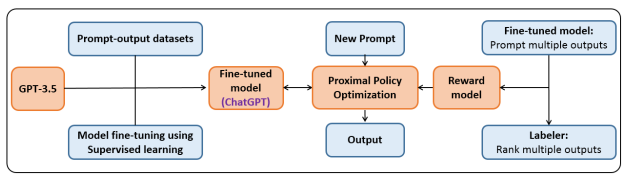

between two deep models (generator and discrimination) with the goal of enhancing each other's capabilities. For instance, one AI generates data that closely resemble real ones, while the other model distinguishes between authentic and fake data. However, in the case of the "Reflexion" technique, GPT-4 performs both the role of the writer and editor, improving its own output.

Figure 11: GPT-3.5 boosted to ChatGPT using human prompts, Reinforcement Learning, and fine-tuning techniques.

#### 6.4 Cybersecurity Risks

The deployment of ChatGPT chatbots presents considerable cybersecurity risks that require attention and resolution.

Moreover, a user's device may become infected with harmful software if they receive a malicious link or file through chatGPT [80, 81]. In the past, cybercriminals were often constrained in their ability to carry out complex attacks because they required skills in coding and scripting, which involved writing new malware code and password-cracking scripts. However, there are concerns that ChatGPT could reduce the barriers to becoming a script kiddie or a cybercriminal, as it could potentially be used to generate computer malware code or password-cracking software. This could allow individuals with limited coding skills to engage in malicious activities that were previously only accessible to more skilled hackers. On the other hand, protecting medical information is crucial in healthcare because it contains sensitive and personal data, such as patient information, medical history, and health records. According to Mijwil et al. [82], the ways to safeguard medical information consist of:
- **Encryption and access controls:** These methods involve encoding medical data and implementing strict access controls to prevent unauthorized access to medical information.

- **Regular software updates:** Keeping software and systems up-to-date with the latest security patches can help protect against known vulnerabilities.

- **Network security:** Implementing firewalls, intrusion detection and prevention systems, and other network security measures can help protect against cyberattacks.

- **Risk management:** Regularly assessing and managing potential security risks can help healthcare organizations identify and address vulnerabilities before they can be exploited.

- **Compliance and employee education:** Adhering to industry regulations, and regularly educating and training employees on security best practices can help ensure that medical information is handled and protected in accordance with legal and ethical standards.

#### 6.5 Response Quality

It was stated that the virtual assistant ChatGPT can sometimes make mistakes and has limited information available (as of 2021 according to OpenAI). While most of the time ChatGPT provides reasonable and reliable responses, there are times when it may give incorrect or misleading information as shown in Figure 12, where it misses the sequence of the words, and can't provide a correct sentence according to the user request. This means that the quality of ChatGPT output is acceptable but could still be improved. One participant, a programmer, gave an example of ChatGPT generating incorrect code that did not work properly in programming software. However, some participants still praised ChatGPT as an efficient virtual assistant for creating knowledge and products due to its relatively low number of errors. some examples can be found in [39]. Also, one of the major concerns of ChatPGT is the potential for false information to be disseminated through ChatGPT.

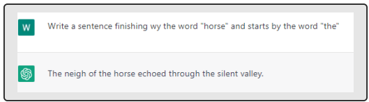 There is a risk that ChatGPT could be used to create and spread false information or propaganda because it has the ability to produce text that resembles human writing, which may make it appear more reliable and trustworthy than content created by automated systems or bots [80].

Figure 12: Wrong answer generated by ChatGPT [33].

## 7 Ethical Considerations When Using Chatgpt

As with any advanced technology, there are ethical considerations that must be taken into account when using ChatGPT. These considerations include issues related to privacy, bias, science, and harmful language patterns [83]. One major ethical concern is the potential for ChatGPT to be used for malicious purposes, such as generating fake news or deepfakes. ChatGPT can be trained to generate text that is difficult to distinguish from human-generated text, which could be used to spread misinformation or manipulate public opinion. This highlights the importance of responsible use and regulation of ChatGPT and similar technologies. Another ethical consideration is the potential for bias in ChatGPT output [84]. ChatGPT is trained on large amounts of text data, which can reflect biases present in the data. This can lead to biased or unfair outputs, particularly in sensitive areas such as healthcare or criminal justice. Developers must carefully consider the potential for bias and take steps to mitigate it, such as using diverse and representative training data and evaluating the model's output for fairness. Harmful language patterns are another ethical concern related to ChatGPT. ChatGPT may inadvertently generate text that contains harmful or offensive language, such as hate speech or profanity. Developers must consider the potential impact of ChatGPT output on users and take steps to prevent the generation of harmful or offensive language patterns.

Privacy is also an ethical consideration when using ChatGPT. ChatGPT may collect and store user data, such as chat logs, which could be used for malicious purposes or shared without user consent [85]. Developers must ensure that user data is protected and handled responsibly in accordance with relevant privacy regulations. Overall, there are a range of ethical considerations that must be taken into account when using ChatGPT. Developers and users of the technology must be aware of these considerations and take steps to mitigate any potential negative impacts. Responsible use and development of ChatGPT can help to ensure that the technology is used in a way that benefits society as a whole. We summarize the ethics issues in the following three points

#### 7.1 Fairness And Bias In Training Data

Fairness and bias in training data is an important consideration when using ChatGPT. ChatGPT is trained on large amounts of text data, which can reflect biases present in the data. This can lead to biased or unfair outputs, particularly in sensitive areas such as healthcare or criminal justice. To mitigate this issue, developers must use diverse and representative training data, evaluate the model's output for fairness, and take steps to mitigate any potential bias. Additionally, there are techniques such as adversarial training and data augmentation that can be used to improve the fairness and robustness of ChatGPT.

#### 7.2 Privacy Concerns

Privacy concerns are a potential issue when using ChatGPT. Although ChatGPT says that it doesn't collect user data as

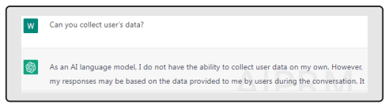

shown in Figure 13, it may collect some information, such as chat logs, which could be used for malicious purposes or shared without user consent. Developers must ensure that user data is protected and handled responsibly in accordance with relevant privacy regulations. Users should also be aware of the potential privacy risks associated with using ChatGPT and take steps to protect their personal information.

Figure 13: ChatGPT answers a privacy question [33].

Besides, as with any rapidly advancing technology, it is crucial to examine the possible ethical and societal consequences of ChatGPT and other large language models. Matters like privacy and employment impacts are just a few of the issues that must be thoroughly assessed as these technologies continue to progress. For instance, the use of large language models in customer service might lead to job loss in that industry, and the collection of data through these models raises serious concerns about privacy [86]. Therefore, it is vital that we thoughtfully consider the ethical implications of these technologies and ensure that they are developed and utilized in a responsible and ethical manner [87].

#### 7.3 Responsibility In Deploying The Tool

Responsibility in deploying the tool refers to the ethical considerations that must be taken into account when using ChatGPT [88]. Developers must consider the potential impacts of their ChatGPT implementation, including the risks of unintended consequences, biases, and misuse. They must ensure that the tool is used in a responsible and ethical manner and take steps to minimize potential harm [84]. This includes being transparent about the use of ChatGPT,
obtaining user consent when appropriate, and establishing clear guidelines for its use. Additionally, developers should consider the potential social and ethical implications of their ChatGPT implementation, and take steps to mitigate any negative impacts. Ultimately, the responsible deployment of ChatGPT requires a comprehensive understanding of the tool's capabilities and limitations, as well as a commitment to ethical and responsible use.

## 8 Prompt Engineering And Generation

Prompts are a set of instructions that are provided to a large language model to ensure specific characteristics of the generated output, automate processes, and enforce rules [89]. They can be considered as a form of programming that can customize the interactions with the large language model and modify the outputs according to the desired requirements. Accordingly, prompt patterns are akin to software patterns as they provide repeatable solutions to specific issues, but they are tailored to the context of generating output from large-scale language models like ChatGPT. While software patterns offer a structured method for addressing common software development problems, prompt patterns provide a structured method for tailoring the output and interactions of language models. Therefore, to get the desired answers to our requests, prompt patterns should be improved [90]. To do so, many solutions can be found to enhance the quality of the input and output of large language models. These improvements include question refinement, alternative approaches, cognitive verifier, and refusal breaker. The question refinement pattern ensures that the large language model always suggests an improved version of the user's question. The alternative approaches pattern requires the large language model to propose alternative ways of accomplishing a specific task specified by the user. The cognitive verifier pattern instructs the large language model to automatically suggest a set of sub-questions for the user to answer, which can then be combined to produce an answer to the main question. The Refusal breaker pattern requires the large language model to automatically rephrase the user's question if it cannot produce a response. Furthermore, context control is centered on managing the contextual information under which the large language model functions. This category comprises the context manager pattern that enables the user to define the context for the output generated by the large language model. Additionally, to generate efficient prompts, Hugging face introduced a new generator called "ChatGPT-prompt-

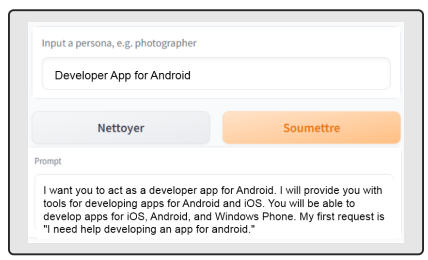 generator" [91], it is based on a BART model pre-trained on a prompt dataset called "Awesome-chatgpt-prompts " [92]. To generate a prompt, the user should give an indication, and the generator will provide a convenient prompt for ChatGPT. Figure 14 presents an example of prompt generation using Hugging face.

Figure 14: Example of prompt generation using ChatGPT-prompt-generator of Hugging face.

Figure 15: Overview of the categories covered in the reviewed papers.

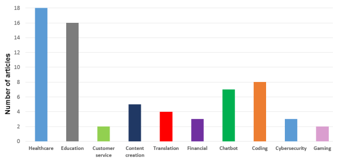

## 9 Future Directions For Chatgpt And Natural Language Processing

In this review study, we highlight the main domains that have been quickly affected by the emergence of ChatGPT. Figure 15 presents an overview of the categories reviewed in this paper where healthcare and education have been the most cited. Future directions for ChatGPT and natural language processing involve ongoing research and development to improve the tool's capabilities and overcome its limitations. Some potential areas of focus include improving the ability of ChatGPT to understand the context and generate more natural language, developing more effective techniques for training and fine-tuning the tool, and addressing issues related to bias and fairness. Other potential directions for natural language processing include developing more advanced dialogue systems, enhancing the ability of ChatGPT to handle multiple languages and dialects, and integrating the tool with other AI technologies such as computer vision and speech recognition [93]. As the field of natural language processing continues to evolve, there is significant potential for ChatGPT to become an even more powerful tool for understanding and interacting with human language.

## 10 Future Directions For Chatgpt In Vision Domain

While ChatGPT is primarily a tool for natural language processing, there is potential for it to be integrated with computer vision technologies in the future. This could enable ChatGPT to perform more advanced tasks that involve both language and visual information, such as image captioning, visual question answering, and scene understanding. For example, ChatGPT could be used to generate descriptions of visual content based on user input, or to answer questions about images and videos. One potential direction for ChatGPT in the vision domain is the development of more advanced multimodal models that can integrate both language and visual information. This could involve the use of techniques such as attention mechanisms and graph neural networks to enable ChatGPT to better understand the relationships between visual elements and language concepts. In [94], a natural language interfaces solution is proposed that suggests a different approach from the usual method of creating new versions of language models. Instead, it proposes using the progress made in pre-trained large language models like ChatGPT and GPT-3 to transform natural language into code, which can be used to create suitable visualizations. This study examines the effectiveness of GPT-3, Codex, and ChatGPT in various case studies and compares their performance with previous visualization research. Another potential area of focus is the development of more advanced transfer learning techniques that enable ChatGPT to leverage knowledge learned from both language and visual domains. This could involve pretraining ChatGPT on large-scale datasets that combine both text and image data, such as the Conceptual Captions dataset. By doing so, ChatGPT could learn to understand the relationships between language and visual information in a more comprehensive way, enabling it to perform more complex tasks in the vision domain. Thus, the integration of ChatGPT with computer vision technologies represents an exciting area of future research that could lead to new applications and capabilities in the field of AI such as artistic creations tasks like painting [95], intelligent vehicle and driving [96, 97, 98], industry
[99], conversational applications with visual human-machine interaction [100].

## 11 Conclusion

In conclusion, ChatGPT is a powerful tool in the field of artificial intelligence that has significant implications for society. This review shows its ability to generate human-like language has already led to numerous real-world applications, such as chatbots and language translation tools. However, as with any technology, there are potential ethical concerns that must be addressed in order to ensure that its impact on society is positive. One of the most important ethical considerations is the potential for bias and harmful language patterns to be perpetuated by ChatGPT. It is critical that developers and users of the tool take steps to mitigate these risks and ensure that ChatGPT is used in an ethical and responsible manner. This includes addressing issues related to fairness and bias in training data, as well as taking steps to protect user privacy and ensure that the tool is used in a way that aligns with social values. At the same time, there is significant potential for ChatGPT to have a positive impact on society. By enabling more natural and intuitive interactions with technology, ChatGPT has the potential to enhance communication and collaboration across a wide range of domains, from healthcare and education to business and entertainment. As the tool continues to evolve and improve, there is no doubt that it will play an increasingly important role in shaping the future of human-computer interaction. Finally, The effectiveness of ChatGPT largely depends on the quality of input prompts. Clear and specific prompts are critical in guiding the system to generate accurate and relevant outputs, while also addressing potential limitations and biases. Proper use of prompts is essential for maximizing the potential of ChatGPT in natural language processing applications.

## References

[1] OpenAI. Openai models. https://platform.openai.com/docs/models/overview. Accessed: 2023-0401.

[2] Abid Haleem, Mohd Javaid, and Ravi Pratap Singh. An era of chatgpt as a significant futuristic support tool: A study on features, abilities, and challenges. BenchCouncil transactions on benchmarks, standards and evaluations, page 100089, 2023.

[3] Ali Kashefi and Tapan Mukerji. Chatgpt for programming numerical methods. *arXiv preprint arXiv:2303.12093*,
2023.

[4] Iqbal Munir et al. Artificial intelligence chatgpt in medicine. can it be the friend you are looking for? Journal of Bangladesh Medical Association of North America (BMANA) BMANA Journal, pages 01–04, 2023.

[5] OpenAI. Introducing chatgpt. https://openai.com/blog/chatgpt. Accessed: 2023-04-04. [6] Ashish Vaswani, Noam Shazeer, Niki Parmar, Jakob Uszkoreit, Llion Jones, Aidan N Gomez, Łukasz Kaiser, and Illia Polosukhin. Attention is all you need. *Advances in neural information processing systems*, 30, 2017.

[7] OpenAI. Gpt-4 technical report. https://cdn.openai.com/papers/gpt-4.pdf. Accessed: 2023-03-15.

[8] Daniel Martin Katz, Michael James Bommarito, Shang Gao, and Pablo Arredondo. Gpt-4 passes the bar exam.

Available at SSRN 4389233, 2023.

[9] Teven Le Scao, Angela Fan, Christopher Akiki, Ellie Pavlick, Suzana Ilic, Daniel Hesslow, Roman Castagné, ´
Alexandra Sasha Luccioni, François Yvon, Matthias Gallé, et al. Bloom: A 176b-parameter open-access multilingual language model. *arXiv preprint arXiv:2211.05100*, 2022.

[10] Gpt-4 becomes 30% more accurate when asked to self-criticize. https://biz.crast.net/
gpt-4-becomes-30-more-accurate-when-asked-to-self-criticize/. Accessed: 2023-04-04.

[11] Yiheng Liu, Tianle Han, Siyuan Ma, Jiayue Zhang, Yuanyuan Yang, Jiaming Tian, Hao He, Antong Li, Mengshen He, Zhengliang Liu, et al. Summary of chatgpt/gpt-4 research and perspective towards the future of large language models. *arXiv preprint arXiv:2304.01852*, 2023.

[12] Tom Brown, Benjamin Mann, Nick Ryder, Melanie Subbiah, Jared D Kaplan, Prafulla Dhariwal, Arvind Neelakantan, Pranav Shyam, Girish Sastry, Amanda Askell, et al. Language models are few-shot learners.

Advances in neural information processing systems, 33:1877–1901, 2020.

[13] Aditya Ramesh, Prafulla Dhariwal, Alex Nichol, Casey Chu, and Mark Chen. Hierarchical text-conditional image generation with clip latents. *arXiv preprint arXiv:2204.06125*, 2022.

[14] Mark Chen, Jerry Tworek, Heewoo Jun, Qiming Yuan, Henrique Ponde de Oliveira Pinto, Jared Kaplan, Harri Edwards, Yuri Burda, Nicholas Joseph, Greg Brockman, et al. Evaluating large language models trained on code.

arXiv preprint arXiv:2107.03374, 2021.

[15] Jacob Devlin, Ming-Wei Chang, Kenton Lee, and Kristina Toutanova. Bert: Pre-training of deep bidirectional transformers for language understanding. *arXiv preprint arXiv:1810.04805*, 2018.

[16] Yinhan Liu, Myle Ott, Naman Goyal, Jingfei Du, Mandar Joshi, Danqi Chen, Omer Levy, Mike Lewis, Luke Zettlemoyer, and Veselin Stoyanov. Roberta: A robustly optimized bert pretraining approach. *arXiv preprint* arXiv:1907.11692, 2019.

[17] Susan Zhang, Stephen Roller, Naman Goyal, Mikel Artetxe, Moya Chen, Shuohui Chen, Christopher Dewan, Mona Diab, Xian Li, Xi Victoria Lin, et al. Opt: Open pre-trained transformer language models. arXiv preprint arXiv:2205.01068, 2022.

[18] Zhilin Yang, Zihang Dai, Yiming Yang, Jaime Carbonell, Russ R Salakhutdinov, and Quoc V Le. Xlnet:
Generalized autoregressive pretraining for language understanding. Advances in neural information processing systems, 32, 2019.

[19] Som Biswas. Role of chatgpt in gaming: According to chatgpt. *Available at SSRN 4375510*, 2023. [20] Envisioning the healthcare landscape with chatgpt. https://www.nymc.edu/news-and-events/
news-archives/envisioning-the-healthcare-landscape-with-chatgpt.php. Accessed: 2023-0301.

[21] Xinyi Wang, Zhenye Gong, Guoxin Wang, Jingdan Jia, Ying Xu, Jialu Zhao, Qingye Fan, Shaun Wu, Weiguo Hu, and Xiaoyang Li. Chatgpt performs on the chinese national medical licensing examination. *Researchsquare*, 2023.

[22] Douglas Johnson, Rachel Goodman, J Patrinely, Cosby Stone, Eli Zimmerman, Rebecca Donald, Sam Chang, Sean Berkowitz, Avni Finn, Eiman Jahangir, et al. Assessing the accuracy and reliability of ai-generated medical responses: An evaluation of the chat-gpt model. *Researchsquare*, 2023.

[23] James RA Benoit. Chatgpt for clinical vignette generation, revision, and evaluation. *medRxiv*, pages 2023–02, 2023.

[24] Gunther Eysenbach et al. The role of chatgpt, generative language models, and artificial intelligence in medical education: A conversation with chatgpt and a call for papers. *JMIR Medical Education*, 9(1):e46885, 2023.

[25] Jari Dahmen, M Kayaalp, Matthieu Ollivier, Ayoosh Pareek, Michael T Hirschmann, Jon Karlsson, and Philipp W
Winkler. Artificial intelligence bot chatgpt in medical research: the potential game changer as a double-edged sword. *Knee Surgery, Sports Traumatology, Arthroscopy*, pages 1–3, 2023.

[26] Sajan B Patel and Kyle Lam. Chatgpt: the future of discharge summaries? *The Lancet Digital Health*, 2023. [27] Rohaid Ali, Oliver Young Tang, Ian David Connolly, Patricia L Zadnik Sullivan, John H Shin, Jared S Fridley, Wael F Asaad, Deus Cielo, Adetokunbo A Oyelese, Curtis E Doberstein, et al. Performance of chatgpt and gpt-4 on neurosurgery written board examinations. *medRxiv*, pages 2023–03, 2023.

[28] Arya Rao, John Kim, Meghana Kamineni, Michael Pang, Winston Lie, and Marc D Succi. Evaluating chatgpt as an adjunct for radiologic decision-making. *medRxiv*, pages 2023–02, 2023.

[29] Siru Liu, Aileen P Wright, Barron L Patterson, Jonathan P Wanderer, Robert W Turer, Scott D Nelson, Allison B
McCoy, Dean F Sittig, and Adam Wright. Assessing the value of chatgpt for clinical decision support optimization. medRxiv, pages 2023–02, 2023.

[30] Arya S Rao, Michael Pang, John Kim, Meghana Kamineni, Winston Lie, Anoop K Prasad, Adam Landman, Keith Dryer, and Marc D Succi. Assessing the utility of chatgpt throughout the entire clinical workflow. *medRxiv*, pages 2023–02, 2023.

[31] Shan Chen, Benjamin H Kann, Michael B Foote, Hugo JWL Aerts, Guergana K Savova, Raymond H Mak, and Danielle S Bitterman. The utility of chatgpt for cancer treatment information. *medRxiv*, pages 2023–03, 2023.

[32] Eric Strong, Alicia DiGiammarino, Yingjie Weng, Preetha Basaviah, Poonam Hosamani, Andre Kumar, Andrew Nevins, John Kugler, Jason Hom, and Jonathan Chen. Performance of chatgpt on free-response, clinical reasoning exams. *medRxiv*, pages 2023–03, 2023.

[33] Chatgpt of openai. https://chat.openai.com/chat. Accessed: 2023-02-27. [34] Xiaoming Zhai. Chatgpt for next generation science learning. *Available at SSRN 4331313*, 2023. [35] Xiaoming Zhai. Chatgpt user experience: Implications for education. *Available at SSRN 4312418*, 2022.

[36] Raghu Raman, Santanu Mandal, Payel Das, Tavleen Kaur, JP Sanjanasri, and Prema Nedungadi. University students as early adopters of chatgpt: Innovation diffusion study. *Researchsquare*, 2023.

[37] Mohammad Awad AlAfnan, Samira Dishari, Marina Jovic, and Koba Lomidze. Chatgpt as an educational tool:
Opportunities, challenges, and recommendations for communication, business writing, and composition courses.

Journal of Artificial Intelligence and Technology, 2023.

[38] Grant Cooper. Examining science education in chatgpt: An exploratory study of generative artificial intelligence.

Journal of Science Education and Technology, pages 1–9, 2023.

[39] Ahmed Tlili, Boulus Shehata, Michael Agyemang Adarkwah, Aras Bozkurt, Daniel T Hickey, Ronghuai Huang, and Brighter Agyemang. What if the devil is my guardian angel: Chatgpt as a case study of using chatbots in education. *Smart Learning Environments*, 10(1):1–24, 2023.

[40] H Holden Thorp. Chatgpt is fun, but not an author. *Science*, 379(6630):313–313, 2023. [41] Sheetal Temara. Maximizing penetration testing success with effective reconnaissance techniques using chatgpt.

Researchsquare, 2023.

[42] Lea Bishop. A computer wrote this paper: What chatgpt means for education, research, and writing. *Research,*
and Writing (January 26, 2023), 2023.

[43] Teo Susnjak. Chatgpt: The end of online exam integrity? *arXiv preprint arXiv:2212.09292*, 2022. [44] Brady D Lund, Ting Wang, Nishith Reddy Mannuru, Bing Nie, Somipam Shimray, and Ziang Wang. Chatgpt and a new academic reality: Artificial intelligence-written research papers and the ethics of the large language models in scholarly publishing. *Journal of the Association for Information Science and Technology*, 2023.

[45] Hyunsu Lee. The rise of chatgpt: Exploring its potential in medical education. *Anatomical Sciences Education*,
2023.

[46] Jun Wen and Wei Wang. The future of chatgpt in academic research and publishing: A commentary for clinical and translational medicine. *Clinical and Translational Medicine*, 13(3), 2023.

[47] Eric Lyerly. Utilizing chatgpt to help students with disabilities. *Disability Compliance for Higher Education*,
28(9):2–7, 2023.

[48] Mandy M Archibald and Alexander M Clark. Chatgtp: What is it and how can nursing and health science education use it?, 2023.

[49] A Shaji George and AS Hovan George. A review of chatgpt ai's impact on several business sectors. Partners Universal International Innovation Journal, 1(1):9–23, 2023.

[50] Ali Zarifhonarvar. Economics of chatgpt: A labor market view on the occupational impact of artificial intelligence.

Available at SSRN 4350925, 2023.

[51] Zachary A Pardos and Shreya Bhandari. Learning gain differences between chatgpt and human tutor generated algebra hints. *arXiv preprint arXiv:2302.06871*, 2023.

[52] M Halaweh. Chatgpt in education: Strategies for responsible implementation. Contemporary Educational Technology, 15(2), 2023.

[53] Yihan Cao, Siyu Li, Yixin Liu, Zhiling Yan, Yutong Dai, Philip S Yu, and Lichao Sun. A comprehensive survey of ai-generated content (aigc): A history of generative ai from gan to chatgpt. *arXiv preprint arXiv:2303.04226*, 2023.

[54] DK Kirtania and SK Patra. Openai chatgpt generated content and similarity index: A study of selected terms from the library & information science (lis). 2023.

[55] Wenxiang Jiao, Wenxuan Wang, Jen-tse Huang, Xing Wang, and Zhaopeng Tu. Is chatgpt a good translator? a preliminary study. *arXiv preprint arXiv:2301.08745*, 2023.

[56] Fadel M Megahed, Ying-Ju Chen, Joshua A Ferris, Sven Knoth, and L Allison Jones-Farmer. How generative ai models such as chatgpt can be (mis) used in spc practice, education, and research? an exploratory study. *arXiv* preprint arXiv:2302.10916, 2023.

[57] Keqin Peng, Liang Ding, Qihuang Zhong, Li Shen, Xuebo Liu, Min Zhang, Yuanxin Ouyang, and Dacheng Tao.

Towards making the most of chatgpt for machine translation. *arXiv preprint arXiv:2303.13780*, 2023.

[58] Euclides Chuma, Magnus Bang, and Jens Alfredson. Business ai decision-making tools: Case chatgpt evaluation.

2023.

[59] Michael Dowling and Brian Lucey. Chatgpt for (finance) research: The bananarama conjecture. Finance Research Letters, 53:103662, 2023.

[60] Adam Zaremba and Ender Demir. Chatgpt: Unlocking the future of nlp in finance. *Available at SSRN 4323643*,
2023.

[61] Som S Biswas. Potential use of chat gpt in global warming. *Annals of Biomedical Engineering*, pages 1–2, 2023. [62] 10 best chatgpt chrome extensions you need to check out. https://beebom.com/
best-chatgpt-chrome-extensions/. Accessed: 2023-03-03.

[63] Hashem Alshurafat. The usefulness and challenges of chatbots for accounting professionals: application on chatgpt. *Available at SSRN 4345921*, 2023.

[64] Michael R King and ChatGPT. A conversation on artificial intelligence, chatbots, and plagiarism in higher education. *Cellular and Molecular Bioengineering*, 16(1):1–2, 2023.

[65] Viriya Taecharungroj. "what can chatgpt do?" analyzing early reactions to the innovative ai chatbot on twitter.

Big Data and Cognitive Computing, 7(1):35, 2023.

[66] Mohammed Salah, Hussam Alhalbusi, Maria Mohd Ismail, and Fadi Abdelfattah. Chatting with chatgpt:
Decoding the mind of chatbot users and unveiling the intricate connections between user perception, trust and stereotype perception on self-esteem and psychological well-being. 2023.

[67] Shuai Wang, Harrisen Scells, Bevan Koopman, and Guido Zuccon. Can chatgpt write a good boolean query for systematic review literature search? *arXiv preprint arXiv:2302.03495*, 2023.

[68] Laurent Avila-Chauvet, Diana Mejía, and Christian Oswaldo Acosta Quiroz. Chatgpt as a support tool for online behavioral task programming. *Available at SSRN 4329020*, 2023.

[69] Chris Stokel-Walker and Richard Van Noorden. What chatgpt and generative ai mean for science. *Nature*,
614(7947):214–216, 2023.

[70] Benjamin Marchandot, Kensuke Matsushita, Adrien Carmona, Antonin Trimaille, and Olivier Morel. Chatgpt:
the next frontier in academic writing for cardiologists or a pandora's box of ethical dilemmas. European Heart Journal Open, 3(2):oead007, 2023.

[71] James H Lubowitz. Chatgpt, an artificial intelligence chatbot, is impacting medical literature. *Arthroscopy*, 2023. [72] Som Biswas. Chatgpt and the future of medical writing. *Radiology*, page 223312, 2023. [73] Brady D Lund and Ting Wang. Chatting about chatgpt: how may ai and gpt impact academia and libraries?

Library Hi Tech News, 2023.

[74] Michael Liebrenz, Roman Schleifer, Anna Buadze, Dinesh Bhugra, and Alexander Smith. Generating scholarly content with chatgpt: ethical challenges for medical publishing. *The Lancet Digital Health*, 5(3):e105–e106, 2023.

[75] Robert W McGee. Is chat gpt biased against conservatives? an empirical study. An Empirical Study (February 15, 2023), 2023.

[76] Marco Cascella, Jonathan Montomoli, Valentina Bellini, and Elena Bignami. Evaluating the feasibility of chatgpt in healthcare: An analysis of multiple clinical and research scenarios. *Journal of Medical Systems*, 47(1):1–5, 2023.

[77] Ce Zhou, Qian Li, Chen Li, Jun Yu, Yixin Liu, Guangjing Wang, Kai Zhang, Cheng Ji, Qiben Yan, Lifang He, et al. A comprehensive survey on pretrained foundation models: A history from bert to chatgpt. *arXiv preprint* arXiv:2302.09419, 2023.

[78] Tanwi Mallick, Joshua David Bergerson, Duane R Verner, John K Hutchison, Leslie-Anne Levy, and Prasanna Balaprakash. Analyzing the impact of climate change on critical infrastructure from the scientific literature: A
weakly supervised nlp approach. *arXiv preprint arXiv:2302.01887*, 2023.

[79] Chaoning Zhang, Chenshuang Zhang, Sheng Zheng, Yu Qiao, Chenghao Li, Mengchun Zhang, Sumit Kumar Dam, Chu Myaet Thwal, Ye Lin Tun, Le Luang Huy, et al. A complete survey on generative ai (aigc): Is chatgpt from gpt-4 to gpt-5 all you need? *arXiv preprint arXiv:2303.11717*, 2023.

[80] Glorin Sebastian. Do chatgpt and other ai chatbots pose a cybersecurity risk?-an exploratory study. An Exploratory Study (February 19, 2023), 2023.

[81] Morgan O'Rourke. Chatgpt poses cybersecurity threats. *Risk Management*, 70(2):30–30, 2023. [82] Maad Mijwil, Mohammad Aljanabi, and Ahmed Hussein Ali. Chatgpt: Exploring the role of cybersecurity in the protection of medical information. *Mesopotamian journal of cybersecurity*, 2023:18–21, 2023.

[83] Jonny Robinson. The cost of science a look at the ethical implications of chatgpt. 2023.

[84] Terry Yue Zhuo, Yujin Huang, Chunyang Chen, and Zhenchang Xing. Exploring ai ethics of chatgpt: A diagnostic analysis. *arXiv preprint arXiv:2301.12867*, 2023.

[85] André Guskow Cardoso. Do we need a chat-gpt-gov? the importance of technology for effective access to public information. *The importance of technology for effective access to public information.(January 7, 2023)*, 2023.

[86] Brady Lund and Daniel Agbaji. Information literacy, data literacy, privacy literacy, and chatgpt: Technology literacies align with perspectives on emerging technology adoption within communities. *Data Literacy, Privacy* Literacy, and ChatGPT: Technology Literacies Align with Perspectives on Emerging Technology Adoption within Communities (January 14, 2023), 2023.

[87] Mohammad Aljanabi et al. Chatgpt: Future directions and open possibilities. Mesopotamian Journal of CyberSecurity, 2023:16–17, 2023.

[88] Oscar Oviedo-Trespalacios, Amy E Peden, Thomas Cole-Hunter, Arianna Costantini, Milad Haghani, Sage Kelly, Helma Torkamaan, Amina Tariq, James David Albert Newton, Timothy Gallagher, et al. The risks of using chatgpt to obtain common safety-related information and advice. *Available at SSRN 4346827*, 2023.

[89] Guido Zuccon and Bevan Koopman. Dr chatgpt, tell me what i want to hear: How prompt knowledge impacts health answer correctness. *arXiv preprint arXiv:2302.13793*, 2023.

[90] Jules White, Quchen Fu, Sam Hays, Michael Sandborn, Carlos Olea, Henry Gilbert, Ashraf Elnashar, Jesse Spencer-Smith, and Douglas C Schmidt. A prompt pattern catalog to enhance prompt engineering with chatgpt. arXiv preprint arXiv:2302.11382, 2023.

[91] Chatgpt-prompt-generator. https://huggingface.co/spaces/merve/ChatGPT-prompt-generator. Accessed: 2023-03-02.

[92] awesome-chatgpt-prompts. https://huggingface.co/datasets/fka/awesome-chatgpt-prompts. Accessed: 2023-03-02.

[93] Chengwei Qin, Aston Zhang, Zhuosheng Zhang, Jiaao Chen, Michihiro Yasunaga, and Diyi Yang. Is chatgpt a general-purpose natural language processing task solver? *arXiv preprint arXiv:2302.06476*, 2023.

[94] Paula Maddigan and Teo Susnjak. Chat2vis: Generating data visualisations via natural language using chatgpt, codex and gpt-3 large language models. *arXiv preprint arXiv:2302.02094*, 2023.

[95] Chao Guo, Yue Lu, Yong Dou, and Fei-Yue Wang. Can chatgpt boost artistic creation: The need of imaginative intelligence for parallel art. *IEEE/CAA Journal of Automatica Sinica*, 10(4):835–838, 2023.

[96] Haiping Du, Siyu Teng, Hong Chen, Jiaqi Ma, Xiao Wang, Chao Gou, Bai Li, Siji Ma, Qinghai Miao, Xiaoxiang Na, et al. Chat with chatgpt on intelligent vehicles: An ieee tiv perspective. IEEE Transactions on Intelligent Vehicles, 2023.

[97] Yubing Gao, Wei Tong, Edmond Q Wu, Wei Chen, GuangYu Zhu, and Fei-Yue Wang. Chat with chatgpt on interactive engines for intelligent driving. *IEEE Transactions on Intelligent Vehicles*, 2023.

[98] Junping Zhang, Jian Pu, Jianru Xue, Ming Yang, Xin Xu, Xiao Wang, and Fei-Yue Wang. Hivegpt: Humanmachine-augmented intelligent vehicles with generative pre-trained transformer. IEEE Transactions on Intelligent Vehicles, 2023.

[99] Fei-Yue Wang, Jing Yang, Xingxia Wang, Juanjuan Li, and Qing-Long Han. Chat with chatgpt on industry 5.0:
Learning and decision-making for intelligent industries. *IEEE/CAA Journal of Automatica Sinica*, 10(4):831–834, 2023.

[100] Fei-Yue Wang, Juanjuan Li, Rui Qin, Jing Zhu, Hong Mo, and Bin Hu. Chatgpt for computational social systems:
From conversational applications to human-oriented operating systems. *IEEE Transactions on Computational* Social Systems, 10(2):414–425, 2023.